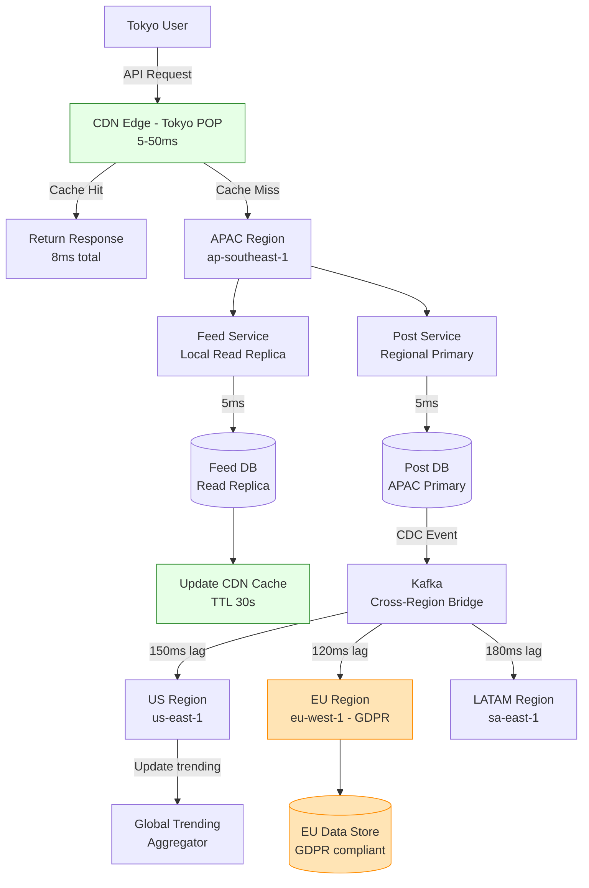

## Keywords in This File
{: .no_toc }

| # | Keyword | Weight |
|---|---|---|
| 1 | [Global-Scale Distributed System Design](#global-scale-distributed-system-design) | medium |

---

# Global-Scale Distributed System Design

**TL;DR:** Designing at global scale means solving problems that
do not exist at single-datacenter scale: speed-of-light latency
(150ms US-to-Asia RTT is a fundamental limit), cost of global
replication, data sovereignty/residency laws, multi-region failover,
and consistency vs. latency trade-offs across geographic distance.
Key architectural patterns: data partitioning by geography (users
own their regional shard), CDN for static/computed content, event-
driven cross-region replication, regional read replicas with global
write coordination, and global consistent databases (Spanner, CockroachDB)
only where consistency requires it. The production reality: global
systems are 10x harder to operate than single-region; most
applications should not be global until they need to be.

---

### 🎯 Model Answer

**30 seconds:**
> Global scale introduces physical latency limits, data sovereignty
> requirements, and multi-region consistency challenges that single-DC
> designs do not face. The core patterns: serve users from the nearest
> region (CDN + regional routing), partition data by geography where
> possible (user data stays in user's region), replicate asynchronously
> for reads, and use synchronous consensus only for operations that
> truly require global consistency (and accept the latency cost).

**3 minutes:**
> At global scale, three problems dominate:
>
> (1) Physics: speed of light means US-to-Asia is 150ms round-trip.
>     Any operation requiring a cross-continental synchronous call
>     adds 150ms latency minimum. At scale with user-facing operations:
>     this is unacceptable. Solution: route users to their nearest region,
>     replicate data regionally, and minimize cross-region synchronous
>     calls.
>
> (2) Data sovereignty: GDPR, CCPA, and China's PIPL require user data
>     to be stored within specific geographic regions. You cannot simply
>     replicate all data everywhere. You must partition user data by
>     geography and enforce regional access controls.
>
> (3) Consistency: global consistency is very expensive. Google Spanner
>     provides externally consistent transactions globally at the cost
>     of 1-14ms commit wait (TrueTime) and the assumption of perfect
>     atomic clocks. For most applications: the correct approach is
>     regional consistency (strong within a region) + eventual consistency
>     across regions (async replication). Use global consistency only
>     for operations that genuinely require it.
>
> The architecture that works at global scale:
> - CDN: serve static content from 250+ edge locations (milliseconds)
> - Regional routing: DNS-based or Anycast routing to nearest region
> - Regional read replicas: serve reads locally (low latency)
> - Async cross-region replication: propagate writes with 100ms-5s lag
> - Write coordination: for globally consistent operations, route to
>   a single global primary (accept cross-region write latency)
> - Data residency: user data sharded by home region, never replicated
>   outside

**Blank Mind Recovery:**

**(1) Restate:** "Global scale = physics (speed of light latency),
data laws (stay in region), consistency cost (synchronous = slow).
Solutions: CDN, regional routing, async replication, global
write coordination only when needed."

**(2) First principles:** "A user in Tokyo cannot have sub-100ms
latency to a server in Virginia. Physics prevents it. The only
solution: put a server (or cache) near Tokyo. Every globally
scalable system solves the latency problem by moving data
closer to users: CDN for static content, regional replicas for
dynamic data, user-homed shards for personal data."

**(3) Bridge:** "McDonald's operates globally. They don't cook
food in one kitchen and ship it worldwide (too slow, customs
issues). They franchise: regional operations, local ingredients,
same brand. The menu (static content) is identical globally (CDN).
Your order (transaction) is processed locally (regional service).
Corporate standards (global consistency) apply only to what
matters at corporate level. Everything else is local."

---

### 📘 Concept Explanation

**What it is:**
Global-scale distributed system design addresses the challenges
of operating services across multiple geographic regions (continents,
countries) with users distributed worldwide. It extends single-
datacenter distributed systems design with solutions for physical
latency limits, data sovereignty, and multi-region consistency.

**The problem it solves:**
A single-region service for a global audience has unacceptable
latency for distant users (150ms+ RTT), violates data residency
regulations (GDPR: EU data must stay in EU), lacks geographic
fault tolerance (a single-region failure = global outage), and
cannot meet regional performance SLAs.

**The global scale design framework:**

```
Level 1 - Content Delivery (CDN):
  What: static assets, computed/cached responses
  How: 250+ edge POPs, cache-aside with TTL
  Latency: 5-50ms (from POP to user)
  Tools: Cloudflare, Fastly, AWS CloudFront, Akamai

Level 2 - Regional routing:
  What: route API requests to nearest region
  How: DNS with GeoDNS, Anycast IP routing
  Latency: eliminates cross-continent API latency
  Tools: Route53 latency routing, Cloudflare Workers

Level 3 - Regional data replicas:
  What: read replicas per region (R/O)
  How: async replication from primary, serve local reads
  Latency: local read = 1-5ms (vs. 100ms cross-region)
  Lag: 50ms-5s behind primary (acceptable for most reads)
  Tools: Aurora Global, DynamoDB Global Tables,
         CockroachDB multi-region

Level 4 - Write coordination:
  What: where do writes go? Who is primary?
  Options:
    a) Single global primary: all writes to one region
       (simple, but cross-region write latency)
    b) Multi-primary per home region: user data goes to
       their regional primary (complex conflict handling)
    c) Global consensus (Spanner): all regions participate
       in consensus (linearizable, expensive)
  Latency: (a) 50-200ms for cross-region writes,
           (b) local write latency, (c) 10-20ms + consensus

Level 5 - Data residency enforcement:
  What: ensure user data stays in required region
  How: shard key includes region, cross-region replication
       blocked by policy for regulated data
  Compliance: GDPR (EU), PIPL (China), LGPD (Brazil)
  Tools: DynamoDB Table Tags + SCPs, AWS GovCloud,
         custom shard routing
```

> **Code walkthrough:** This example demonstrates the core pattern in action. The key mechanism shows how the concept works in practice. Study the structure to understand the essential behavior and common usage.

**The speed-of-light constraint:**

```
Physical distance → minimum RTT:
  New York → London: ~70ms (5,600km / 0.66c in fiber)
  New York → Tokyo: ~170ms (11,000km)
  London → Sydney: ~270ms (17,000km)

  This is a physical limit: no amount of engineering reduces it.
  A synchronous call from Tokyo user to NY server = 170ms + processing.
  Humans notice latency > 100ms. Tokyo users on NY servers: always poor UX.

Resolution: serve Tokyo users from a Tokyo (or Singapore) region.
Any data the Tokyo service needs from NY: asynchronously pre-replicated.
```

> **Code walkthrough:** This example demonstrates the core pattern in action. The key mechanism shows how the concept works in practice. Study the structure to understand the essential behavior and common usage.

**Active-Active vs. Active-Passive multi-region:**

```
Active-Passive (simpler, common):
  One primary region handles all writes.
  Other regions are read-only replicas.
  Failover: promote a replica to primary (minutes of downtime).
  
  AWS implementation:
    Primary: us-east-1 (RDS primary, all writes)
    Replicas: eu-west-1, ap-southeast-1 (RDS read replicas)
    DNS: Route53 failover routing
    Failover time: 1-5 minutes (RDS promotion)
  
  Use when:
    - Write volume is manageable from one region
    - Can accept regional read latency for some users
    - Complexity budget: prefer simple over active-active

Active-Active (harder, higher availability):
  Multiple regions accept writes for their respective users.
  Data is partitioned by user's home region.
  Cross-region replication is asynchronous.
  
  Use when:
    - Users are globally distributed AND need low-latency writes
    - Data residency regulations require data to stay in region
    - Cannot accept cross-region write latency

  Requirement: conflict resolution (concurrent writes to same
  entity from different regions)
  Solution: user home region affinity (user's writes always
  route to their home region primary, preventing conflicts)
```

> **Code walkthrough:** This example demonstrates the core pattern in action. The key mechanism shows how the concept works in practice. Study the structure to understand the essential behavior and common usage.

**Global databases (when to use):**

```
Google Spanner:
  - Externally consistent (linearizable) globally
  - Uses TrueTime + commit wait (1-14ms overhead)
  - Supports: SQL, ACID transactions across regions
  - Write latency: 10-20ms for commit wait
  - Throughput: up to 2000 TPS per shard (scalable with sharding)
  - Cost: 4-10x more expensive than regional Postgres
  - Use when: global financial ledger, globally consistent records
    where consistency is worth the cost premium

CockroachDB:
  - Postgres-compatible, distributed SQL
  - Multi-region tables: data pinned per region by partition key
  - Global tables: replicated everywhere (low-latency reads)
  - Follower reads: read from local follower (1.8x timestamp lag)
  - Use when: OLTP workload with global reach but flexible consistency

Most applications:
  - Do NOT need Spanner/CockroachDB
  - Regional Postgres with async cross-region replication + CDC
  - Strong consistency within one region, eventual across regions
  - 95% of operations stay within one region anyway
```

> **Code walkthrough:** This example demonstrates the core pattern in action. The key mechanism shows how the concept works in practice. Study the structure to understand the essential behavior and common usage.

**CDN architecture pattern (most impactful for latency):**

```
Request flow:
  User (Tokyo) → Cloudflare edge POP (Tokyo)
  → Cache hit: 8ms response (from Tokyo POP)
  → Cache miss: POP → Origin (Singapore regional server)
  → 50ms to origin → response → cache for next user

What to cache at CDN edge:
  - Static assets: JS, CSS, images (TTL: hours-days)
  - API responses that change infrequently (TTL: 1-30min)
  - Computed aggregations: recommendations, trending items
  
What NOT to cache at CDN:
  - Authenticated user-specific responses (personalized)
  - Write operations (orders, payments)
  - Real-time data (stock levels, seat availability)
  
CDN with authentication:
  - Cache per user: cache key includes user session (expensive)
  - Segment caching: public data cached, user-specific fetched
    separately from origin
  - Edge functions (Cloudflare Workers): compute at edge,
    fetch user-specific data from regional service
```

> **Code walkthrough:** This example demonstrates the core pattern in action. The key mechanism shows how the concept works in practice. Study the structure to understand the essential behavior and common usage.

**The key insight:**
Global scale requires a tiered approach. Not all data and
all operations need global distribution. Static content needs
global CDN. User data needs regional primary with local read
replicas. Global coordination (locks, transactions) should be
minimized and reserved for operations that genuinely require it.
The most common mistake: trying to make everything globally
consistent (using Spanner for all data) when 95% of operations
are within a single user's regional shard and need only local
consistency.

**When to build global vs. multi-region:**
- Multi-region (2-3 regions): disaster recovery, latency
  improvement for known user geographies, regulatory compliance
- Global (5+ regions, CDN): serving users in every continent,
  sub-50ms latency SLA globally, GDPR + PIPL compliance

---

### 💻 Code Example

```java
// GLOBAL-SCALE PATTERNS - User Data Routing

// BAD: single-region design, no geographic awareness
// All users go to the same database regardless of location
@RestController
public class UserControllerBad {
    // BAD: single global database
    // Tokyo user writes here: 170ms RTT to Virginia primary
    // GDPR violation: EU user data stored in US
    @PutMapping("/users/{userId}/profile")
    public User updateProfile(
            @PathVariable String userId,
            @RequestBody UserProfile profile) {
        return userRepo.save(userId, profile);
    }

    @GetMapping("/users/{userId}/profile")
    public User getProfile(@PathVariable String userId) {
        // BAD: Tokyo user reads from Virginia: 170ms
        return userRepo.findById(userId);
    }
}

// GOOD: region-aware user data routing
@Service
public class RegionAwareUserService {

    // User's home region determined at registration
    // and stored in a global user directory (small dataset)
    private final GlobalUserDirectory globalDirectory;
    private final Map<Region, UserRepository> regionalRepos;
    private final String currentRegion; // e.g., "us-east-1"

    // Write: always goes to user's home region primary
    public User updateProfile(
            String userId,
            UserProfile profile) {
        Region homeRegion = globalDirectory
            .getHomeRegion(userId);

        if (homeRegion.equals(Region.of(currentRegion))) {
            // User's home region: write locally (fast path)
            return regionalRepos.get(homeRegion)
                .save(userId, profile);
        } else {
            // Cross-region write: forward to home region
            // Could be a direct DB write via private network
            // or an async event (if eventual is acceptable)
            return crossRegionClient
                .forwardWrite(homeRegion, userId, profile);
        }
    }

    // Read: serve from local replica (fast), with
    // staleness indicator if needed
    public UserProfileResponse getProfile(
            String userId,
            boolean requireFresh) {
        Region homeRegion = globalDirectory
            .getHomeRegion(userId);
        UserRepository repo = regionalRepos
            .get(Region.of(currentRegion));

        if (homeRegion.equals(Region.of(currentRegion))) {
            // Local read: always fresh (this is the primary)
            return UserProfileResponse.fresh(
                repo.findById(userId));
        }

        if (requireFresh) {
            // Must read from home region (cross-region)
            return UserProfileResponse.fresh(
                crossRegionClient.read(homeRegion, userId));
        }

        // Serve from local replica (possibly stale)
        // Include staleness signal in response
        User cached = repo.findById(userId);
        long lagMs = repo.getReplicationLagMs(homeRegion);
        return UserProfileResponse.withLag(cached, lagMs);
    }
}

// CDN-aware caching for public data
@Service
public class ProductService {

    // Product catalog: same content for all users
    // Cache at CDN edge with short TTL
    @GetMapping("/products/{productId}")
    @CacheControl(maxAge = 300, // 5 minutes at CDN edge
                  sMaxAge = 300,
                  public_ = true)
    public ResponseEntity<Product> getProduct(
            @PathVariable String productId) {
        // This response will be cached at CDN edge POPs
        // globally: Tokyo, London, NYC, etc.
        Product product = productRepo.findById(productId);
        return ResponseEntity.ok()
            .header("Cache-Control",
                "public, max-age=300, s-maxage=300")
            .header("Vary", "Accept-Encoding")
            // ETag for conditional requests
            .header("ETag",
                '"' + product.getVersion() + '"')
            .body(product);
    }

    // Inventory: not cacheable (real-time, user-specific)
    @GetMapping("/products/{productId}/inventory")
    @CacheControl(noCache = true)
    public InventoryStatus getInventory(
            @PathVariable String productId) {
        // No CDN caching: inventory changes frequently
        // Served from regional inventory service
        return inventoryRepo.findCurrent(productId);
    }
}
```

> **Code walkthrough:** The BAD pattern ignores geography entirely:
> every user hits the same single-region database, causing 170ms
> RTT for distant users and GDPR violations for EU users. The
> GOOD `RegionAwareUserService` looks up the user's home region
> from a lightweight global directory (a small dataset that fits
> in memory). Writes are routed to the home region primary (ensuring
> data residency compliance and avoiding conflicts). Reads can be
> served from the local regional replica with a staleness indicator
> (allowing the calling service to decide if fresh data is required).
> The `ProductService` shows CDN caching: public product catalog
> data is marked with `Cache-Control: public, max-age=300` so CDN
> edge nodes worldwide cache it for 5 minutes, serving Tokyo users
> from the Tokyo CDN POP with 8ms latency instead of 170ms to
> the origin.

---

### 🎓 Answers by Seniority

**Junior / Mid:**
> At global scale, users are distributed worldwide, so a single-
> datacenter design causes high latency for distant users. Solutions:
> CDN for static content (serve from 250+ edge locations), regional
> routing (DNS sends users to nearest region), read replicas per
> region (serve reads locally), and a primary region for writes
> (or multiple primaries if data residency requires). The hardest
> part is data residency: GDPR requires EU user data to stay in the EU.
> So user data must be sharded by home region, not freely replicated.

---

**Senior / Staff:**
> The most important mental model for global scale is: what percentage
> of operations must cross a region boundary? For a typical social
> network: a user's feed, posts, and messages are 95% operations
> within their home region. The 5% cross-region operations
> (global trending topics, mutual connections across regions) can
> be served with eventual consistency and 100ms-5s lag - invisible
> to users. Design the data model so that the 95% local operations
> are strongly consistent and fast, and the 5% cross-region operations
> are eventually consistent and asynchronous. Never apply global
> consistency to operations that do not need it. The cost of global
> consensus is not just write latency - it is operational complexity
> (Spanner, CockroachDB are significantly harder to operate than
> regional Postgres), and that complexity has a maintenance cost
> forever. Most engineering teams are better served by regional
> strong consistency + async cross-region CDC events than by deploying
> a globally consistent database they lack the expertise to operate.

---

### ⚠️ Common Misconceptions

**"Just deploy to multiple regions and you're globally scalable"**

Reality: deploying to multiple regions is necessary but not
sufficient. Without addressing: (1) how reads are routed to
the nearest replica, (2) how writes are coordinated across
regions, (3) how data residency is enforced, and (4) how
cross-region replication lag is handled - multi-region deployment
creates a multi-region system, not a global-scale system. Common
pitfall: a team deploys services in 3 regions but all regions
still write to a single primary database in US-EAST-1. EU users
have low-latency service calls but high-latency writes. GDPR
requires EU user data to stay in EU, but the database is in US.
The result: global deployment with single-region constraints.

**"Global consistency is required for correctness"**

Reality: global consistency (linearizability across regions) is
required for a very narrow class of operations: those where the
correctness of the result depends on seeing all concurrent writes
worldwide. For most operations: regional consistency is sufficient.
A user viewing their own profile needs read-your-writes consistency
within their home region - not global linearizability. A user's
order must be atomically placed in their home region - not
globally synchronized. The operations that truly need global
consistency: global unique identifiers, globally unique usernames,
global financial ledgers where total balance must be exact.
These are a small fraction of total operations. Engineering
teams that apply global consistency to everything pay a permanent
latency and cost tax for an unnecessary guarantee.

---

### ⚖️ Comparison Table

| Architecture | Consistency | Write latency | Read latency | Complexity | Use case |
|---|---|---|---|---|---|
| Single region | Strong (local) | 1-5ms | 1-5ms (local), 150ms+ (remote) | Low | < 100k users, single geography |
| Active-passive multi-region | Strong (writes to primary) | 5ms local, 150ms cross-region | 5ms local | Medium | DR + read scaling, known geographies |
| Active-active (user sharding) | Strong within region, eventual cross | 5ms (home region) | 5ms local | High | Global user base, data residency |
| Global consensus (Spanner) | Externally consistent globally | 10-20ms (commit wait) | 5ms (local replica) | Very high | Global financial, compliance-critical |
| CDN + edge compute | N/A (static/computed) | Write not cached | 5-50ms (edge) | Low | Static content, computed results |

**The deciding factor:** what percentage of operations are
cross-regional? If < 5%: active-passive is sufficient. If
most users need low-latency writes from their region: active-active.
If global consistency is a hard requirement: Spanner (with
the cost premium).

---

### 🏛️ System Design

**Design: Global Social Network - 1 Billion Users, 5 Regions**

Requirements: 1B users worldwide (US, EU, APAC, LATAM, ME),
sub-100ms reads globally, GDPR compliance (EU data stays in EU),
user feeds, posts, DMs, and global trending topics.

```
Region allocation:
  us-east-1: US primary + global control plane
  eu-west-1: EU primary (GDPR data residency)
  ap-southeast-1: APAC primary
  sa-east-1: LATAM primary
  me-south-1: ME primary

Data classification:
  User-private (GDPR-sensitive): stays in home region
    → user profile, DMs, photos
  Public content: replicated to all regions (async)
    → posts, comments (marked public)
  Computed content: CDN-cached
    → rendered feeds, trending pages
  Global shared: globally consistent
    → unique usernames (small, infrequent)
    → global event coordination (new features)

Core services per region:
  User Service: regional primary (user data)
  Feed Service: read-heavy (local replica + CDN)
  Post Service: write to home region, async replicate
  DM Service: regional (stays in sender/receiver region)
  Trending Service: global aggregation (eventually consistent)

Write flow (user post):
  Tokyo user → APAC region (ap-southeast-1)
  Post Service:
    1. Write to APAC Postgres primary (ACID, strong)
    2. Emit CDC event to Kafka (APAC)
    3. Return success to user (local write = 5ms)
  
  CDC event replicates to:
    → US: APAC→US Kafka bridge (150ms lag)
    → EU: APAC→EU bridge (120ms lag)
    → CDN invalidation: purge Tokyo user's feed cache

Read flow (user feed):
  Request → CDN (check cache)
  → Cache hit: 8ms response (from nearest CDN POP)
  → Cache miss: CDN → regional Feed Service
    → Feed Service queries local post DB (5ms)
    → CDN caches feed (TTL: 30s)
    → Response: 15ms total

Global trending:
  Each region: count post engagements per topic per 5min
  Kafka → global trending aggregator (US-EAST-1)
  Aggregator: merge counts from all regions (eventual, OK for trending)
  Result published to all regions: "top 20 trending topics"
  CDN caches trending: TTL 1 min
  Lag acceptable: trending is approximate/eventual by design

Username uniqueness (CP global):
  Small dataset: ~1B usernames
  Stored in Google Spanner (globally consistent, 1 write per registration)
  Cost: only on signup (one-time, low frequency)
  10 million new users/day × 1 Spanner write = manageable

GDPR compliance:
  EU user data: stored ONLY in eu-west-1
  Replication policy: EU posts replicated to other regions only
    if marked PUBLIC by user (not private)
  Right to erasure: delete from eu-west-1 + purge CDN cache
    + send delete events to other regions (async cleanup)

Traffic numbers:
  1B users, 300M DAU, 30M concurrent at peak
  3B feed reads/day → 35,000 reads/sec → 90% CDN hit rate → 3,500 RPS to Feed Service
  300M posts/day → 3,500 writes/sec → distributed across 5 regions → 700 writes/sec/region
  Each region: 3,500 RPS reads + 700 writes/sec (very manageable per region)
```

> **Code walkthrough:** This example demonstrates the core pattern in action. The key mechanism shows how the concept works in practice. Study the structure to understand the essential behavior and common usage.

---

### 📊 Diagram

```
Global Traffic Flow

      Tokyo User
           |
      CDN Edge POP
      (Tokyo, 8ms)
     /           \
Cache Hit       Cache Miss
(8ms return)        |
              APAC Region
              (ap-southeast-1)
              /          \
         Read          Write
          |              |
      Feed DB        Post DB
    (replica)       (primary)
        |               |
    5ms return      CDC event
                        |
               Kafka cross-region bridge
              /          |          \
          US           EU          LATAM
        (150ms)       (120ms)      (180ms)
```



> **Diagram walkthrough:** Tokyo users first hit the CDN edge POP
> in Tokyo (5-50ms round trip to the edge). A cache hit returns
> in ~8ms total - the majority of read traffic takes this path.
> Cache misses route to the nearest regional service (APAC). Reads
> query the local replica for sub-10ms response. Writes go to the
> APAC regional primary and immediately return to the user. In the
> background, a CDC event flows through Kafka cross-region bridges
> to US (150ms lag), EU (120ms lag), and LATAM (180ms). The EU
> region (highlighted in orange) represents GDPR data residency:
> EU user-private data stored in eu-west-1 is not replicated outside
> the EU. The global trending aggregator (US) merges engagement
> counts from all regions to compute global trending topics. This
> architecture achieves sub-50ms reads for 90%+ of traffic (via CDN)
> and sub-10ms regional reads for the remainder.

---

### 🚨 Failure Modes and Diagnosis

**Failure 1: Thundering herd after CDN cache invalidation**

Symptom: CDN invalidates the home page cache (new product launch).
50,000 requests/second hit the origin servers simultaneously.
Origin servers overload. Home page goes down for 3 minutes.

Root cause: all CDN edges invalidated simultaneously. All
cached miss requests hit origin at the same time. Origin
was sized for normal traffic (10,000 RPS), not for all CDN
misses simultaneously (50,000 RPS).

Diagnosis:
```bash
# Check origin traffic spike
grep "GET / HTTP" /var/log/nginx/access.log | \
  awk '{print $4}' | cut -d: -f1-3 | uniq -c
# Spike from 200 RPS to 50,000 RPS at invalidation time

# Check CDN analytics dashboard
# "Cache Miss Rate" spike at the same time = invalidation
```

> **Code walkthrough:** This example demonstrates the core pattern in action. The key mechanism shows how the concept works in practice. Study the structure to understand the essential behavior and common usage.

Fix 1: staggered cache invalidation. Invalidate CDN regions
one at a time (5 minutes apart). Not all 250 POPs at once.

Fix 2: request coalescing (CDN-level). Many CDN providers:
when multiple requests for the same cache miss arrive simultaneously:
only forward ONE to origin, hold others, then serve all from
the one response (CDN-level locking). Cloudflare: "Cache
Reserve" + "Tiered Cache" does this automatically.

Fix 3: origin protection (load shedding):
```nginx
# Rate limit cache miss traffic to protect origin
limit_req_zone $uri zone=origin_protect:10m rate=1r/s;
limit_req zone=origin_protect burst=200 nodelay;
# At most 1 origin request per second per URI
# Others return 429 or serve stale CDN content
```

> **Code walkthrough:** This example demonstrates the core pattern in action. The key mechanism shows how the concept works in practice. Study the structure to understand the essential behavior and common usage.

---

**Failure 2: Cross-region replication lag causes stale reads
during peak traffic**

Symptom: users in EU see "ghost" products - products that
US shows as sold out but EU still shows as available.
EU users buy the sold-out product, then receive cancellation
emails.

Root cause: cross-region replication lag increased from normal
200ms to 45 seconds during a Black Friday traffic spike. EU
inventory reads from the local read replica - which was 45
seconds behind the US primary. Inventory was depleted in the
US 45 seconds before EU knew.

Diagnosis:
```bash
# Check cross-region replication lag
# (MySQL/Postgres)
SELECT @@global.gtid_executed;  # on primary
SHOW SLAVE STATUS;  # on replica
# Seconds_Behind_Master: should be < 5, was 45

# Alternative: CDC lag in Kafka
kafka-consumer-groups.sh \
  --bootstrap-server kafka:9092 \
  --describe --group cross-region-replicator
# "LAG" column: should be < 1000, was 850,000
```

> **Code walkthrough:** This example demonstrates the core pattern in action. The key mechanism shows how the concept works in practice. Study the structure to understand the essential behavior and common usage.

Fix (short-term): for inventory reads specifically, always
read from primary (no replica):
```java
@Service
public class InventoryService {
    // Inventory: always read from primary
    // (replica lag is unacceptable for sold-out items)
    @PrimaryDataSource
    private InventoryRepository primaryInventory;

    // User profiles: OK to read from replica
    @ReplicaDataSource
    private UserRepository replicaUsers;

    public InventoryStatus checkStock(String productId) {
        // Cross-region write to US primary if EU reads primary:
        // 150ms RTT but prevents overselling
        return primaryInventory.getStock(productId);
    }
}
```

> **Code walkthrough:** This example demonstrates the core pattern in action. The key mechanism shows how the concept works in practice. Study the structure to understand the essential behavior and common usage.

Fix (long-term): inventory depletion is a CP operation.
Use a globally consistent counter (DynamoDB Global Tables
with conditional writes, or Spanner) for inventory only.
Most data (product catalog, images, descriptions) can remain
eventually consistent. Only the availability counter needs
global consistency.

---

**Failure 3: GDPR violation from debug logging cross-region**

Symptom: EU data protection authority audit finds EU user
personal data (email addresses, IP addresses) in US CloudWatch
logs. Fine issued.

Root cause: the debug logging system exported all structured
logs to a central US-EAST-1 CloudWatch log aggregator.
Developers added user email to structured log context
(for debugging) without realizing it would be exported
to the US.

Diagnosis:
```bash
# Search CloudWatch US logs for EU PII
aws logs filter-log-events \
  --log-group-name /app/eu-west-1/user-service \
  --filter-pattern '"@gmail.com" OR "@yahoo.com"' \
  --region us-east-1

# If results: EU PII in US logs = GDPR violation
```

> **Code walkthrough:** This example demonstrates the core pattern in action. The key mechanism shows how the concept works in practice. Study the structure to understand the essential behavior and common usage.

Fix:
1. Immediate: remove all PII from structured log context.
   Never log email, name, IP in structured logs.
2. Architecture: log aggregation must respect data residency.
   EU logs → EU CloudWatch only (never cross-region).
   US region → US CloudWatch only.
   Central security monitoring (cross-region): use only
   non-PII fields (event type, counts, anonymized IDs).
3. Engineering process: data classification review as part
   of PR review for all logging changes. Any PII in log
   context = immediate PR rejection.
4. Automated detection:
   ```python
   # PII scanner in CI pipeline
   # Scan source code for email/phone/name in log statements
   pattern = re.compile(
       r'log\.(info|debug|warn).*email|phone|name',
       re.IGNORECASE)
   # Block deployment if PII detected in logs
   ```

> **Code walkthrough:** This example demonstrates the core pattern in action. The key mechanism shows how the concept works in practice. Study the structure to understand the essential behavior and common usage.

---

### 🎯 Interview Deep-Dive

| Category | Count |
|---|---|
| Clarification | 1 |
| Mechanism | 2 |
| Failure / Debugging | 2 |
| Trade-off | 3 |
| System Design | 1 |
| Code | 1 |
| Behavioral | 1 |
| Production | 1 |

---

**Q1 (Clarification) - When does a system "need" to be global?
What are the triggers?**

A: Most systems should not be global until they face specific
triggers. Premature globalization adds enormous complexity for
no user benefit.

**Trigger 1: User latency complaints in specific geographies**
You have users in Japan, but your server is in Virginia.
P99 latency is 400ms. Users churn. Analytics shows high bounce
rates from Japan. Solution: add an APAC region.

**Trigger 2: Data residency / compliance requirements**
You expand to Europe and GDPR requires EU user data to stay
in the EU. You cannot store EU user data in US-EAST-1.
Solution: EU region with data residency enforcement.

**Trigger 3: Disaster recovery with geographic separation**
Your SLA requires 99.99% availability. A single US region
has 4-8 hours of downtime/year historically. Multi-region
failover reduces this to 15 minutes (when you have a
warm standby in another region).

**Trigger 4: Regulatory market entry**
China requires data to be stored in China. Russia requires
data to be on Russian servers. PIPL (China Personal Information
Protection Law) requires local servers for Chinese users.
Without this: no access to the market.

**When NOT to go global:**
- "We might have international users eventually" - premature
- Current latency is under 100ms globally (good enough)
- No compliance requirement for data residency
- Team has no experience operating multi-region systems

The typical growth trajectory:
1. Single region (1-50k users)
2. CDN for static assets (50k-500k users, global reads)
3. Second region for DR (500k-5M users, RTO SLA)
4. Active-passive multi-region (5M-50M users, latency + DR)
5. Active-active with user sharding (50M+ users, data residency)

Most startups never reach step 5. Prematurely building step 5
infrastructure is one of the most common engineering over-investments.

*What separates good from great:* the growth trajectory and
"most startups never reach step 5." This grounds the design
discussion in business reality. A 50,000-user startup that builds
a Spanner-backed globally distributed system has over-engineered
by 3-5 years. Senior engineers match the architecture to the
current scale with a clear upgrade path, not to the imagined
future scale.

---

**Q2 (Mechanism) - How does GeoDNS work for global routing?
What are its limitations?**

A: GeoDNS (Geographic DNS) routes users to different IP
addresses based on their location:

```
DNS resolution:
  User in Tokyo queries: api.example.com
  Local DNS resolver → Authoritative DNS (Route53/Cloudflare)
  
  Route53: checks client IP location
  → IP in APAC: return 10.1.1.1 (APAC load balancer IP)
  → IP in EU: return 10.2.2.2 (EU load balancer IP)
  → IP in US: return 10.3.3.3 (US load balancer IP)
  
  Tokyo user receives: 10.1.1.1 → routes to APAC region
  TTL: 60-300 seconds (DNS cache duration)
```

> **Code walkthrough:** This example demonstrates the core pattern in action. The key mechanism shows how the concept works in practice. Study the structure to understand the essential behavior and common usage.

Route53 latency-based routing:
```
Route53 measures actual latency from each AWS region
to Route53 resolvers worldwide.
"Which of our regions has the lowest latency to this resolver?"
→ Return the IP for that region
This is more accurate than geographic lookup alone.
```

> **Code walkthrough:** This example demonstrates the core pattern in action. The key mechanism shows how the concept works in practice. Study the structure to understand the essential behavior and common usage.

**Limitations:**

1. DNS TTL causes stale routing:
   If APAC goes down: DNS update takes 60-300 seconds
   to propagate (TTL). During this window: users still
   sent to the failed APAC region.

2. Resolver geolocation inaccuracy:
   DNS resolver IP may not match user location.
   Corporate VPNs, CDN-based DNS resolvers: user in Tokyo
   uses a DNS resolver in Singapore or San Francisco.
   Route53 routes to the region closest to the resolver,
   not the user.

3. No load awareness:
   DNS routing is purely geographic. It does not consider
   region load. APAC may be at 90% capacity, US at 10% -
   DNS still routes APAC users to APAC.

4. No protocol awareness:
   DNS returns an IP. It does not know if the service
   at that IP is healthy (no health check at DNS level).
   Mitigation: Route53 health checks (poll endpoint,
   mark IP as unhealthy, remove from rotation).

**Better alternatives for latency routing:**

Anycast IP routing:
- Same IP address announced from multiple regions
- BGP routes user to nearest POP announcing that IP
- Used by: Cloudflare (1.1.1.1 resolves from nearest POP)
- Advantage: no DNS caching delay, routing updates in seconds
- Disadvantage: requires BGP control (complex, cloud providers abstract this)

Cloudflare Workers + global routing:
- Request hits nearest Cloudflare POP (edge compute)
- Worker decides which origin to route to based on
  request parameters (user region, feature flags, etc.)
- RTT decision at the edge: no DNS propagation delay

*What separates good from great:* Anycast as the superior
alternative. DNS-based routing with TTL delay is the common
answer to "how do you route users to nearest region."
Anycast IP routing (used by all major CDNs) is fundamentally
better: same IP globally, routing is done at the network layer
by BGP, and there is no DNS TTL propagation delay during failover.
Understanding both approaches and their trade-offs shows architectural depth.

---

**Q3 (Mechanism) - How does DynamoDB Global Tables handle
cross-region replication and conflict resolution?**

A: DynamoDB Global Tables provides multi-region, multi-primary
replication:

**Replication model:**
- Any DynamoDB table can be designated as a "Global Table"
- Table is replicated to chosen AWS regions (e.g., US, EU, APAC)
- Every region is a primary: all regions accept reads AND writes
- Replication is asynchronous: ~1s lag between regions in normal conditions

**Under the hood (approximate):**
```
Write to US:
  1. Write committed in US region (DynamoDB primary in US)
  2. DynamoDB Streams: change events published to US stream
  3. Global Tables replicator: reads US stream events
  4. Replicates to EU and APAC: writes same item with same attributes
  5. EU and APAC: apply the replicated write

Conflict resolution (Last-Writer-Wins by timestamp):
  US writes item X = "Alice" at time T=100
  EU writes item X = "Bob" at time T=105 (concurrent)
  
  Both writes replicated to the other region:
  US receives EU's write (T=105) + sees own write (T=100)
  T=105 > T=100: EU's write wins → item X = "Bob"
  EU receives US's write (T=100) + sees own write (T=105)
  T=105 > T=100: EU's write wins → item X = "Bob"
  
  Result: both regions converge to "Bob" (last writer wins)
```

> **Code walkthrough:** This example demonstrates the core pattern in action. The key mechanism shows how the concept works in practice. Study the structure to understand the essential behavior and common usage.

**Consistency modes:**
- Read from any region: eventually consistent (replica may be slightly behind)
- Read with "GlobalConsistency" (new feature 2024): routes to
  a region that has confirmed all writes, adds cross-region latency
- Conditional writes (optimistic locking): use `ConditionExpression`
  to prevent concurrent update conflicts

**Limitations of LWW in Global Tables:**
- Concurrent writes to same item from different regions:
  one silently wins (no conflict notification to application)
- If application logic requires both writes to be merged
  (e.g., "add to cart" from two regions): Global Tables LWW loses one
- Solution: use version attributes + conditional writes,
  or use CRDTs for append-only data structures

**When to use Global Tables:**
- User sessions, preferences (LWW acceptable)
- Product catalog (single writer per item, no conflicts)
- Event logs (append-only, no conflicts)

**When NOT to use Global Tables:**
- Shopping carts (concurrent updates from multiple devices)
- Counters (concurrent increments: use DynamoDB Atomic increments,
  not Global Tables LWW)
- Financial ledgers (LWW can silently lose writes)

*What separates good from great:* the cart example as a counter-
indication for Global Tables. Many engineers reach for Global Tables
as the "correct" multi-region solution. The nuance: LWW conflict
resolution silently drops writes in concurrent scenarios. For a
shopping cart: a user adds item X on mobile and item Y on desktop
simultaneously. If they write to different Global Tables regions:
one item is silently dropped. This is the exact problem the 2007
Dynamo paper solved with vector clocks. DynamoDB Global Tables
(post-2012 DynamoDB) traded correctness for simplicity.

---

**Q4 (Trade-off) - Compare CDN-edge compute vs. regional
microservices for personalization.**

A:

**CDN-edge compute (Cloudflare Workers, Lambda@Edge):**
- Runs JavaScript/Wasm at the CDN edge POP (250+ locations)
- Latency: 5-50ms to user
- Constraints: limited memory (128MB), short execution time (50ms CPU),
  limited APIs (no direct database access from edge)
- What it can do: read from edge KV store (Cloudflare KV),
  A/B test routing, feature flags, basic personalization,
  request transformation
- What it cannot do: complex joins, multi-step business logic,
  transactional operations

**Regional microservices:**
- Runs full application logic in 3-5 regional data centers
- Latency: 20-150ms to user (depending on region proximity)
- Constraints: none (full VM/container with database access)
- What it can do: complete business logic, database transactions,
  ML inference, real-time personalization using full user model

**Decision framework:**

Edge compute is the right choice for:
- Static content personalization (language, currency, regional pricing)
- A/B testing (route 10% to experiment)
- Authentication token validation (JWT verify at edge)
- DDoS protection (rate limiting, IP blocking at edge)
- Basic geo-routing and redirects

Regional microservices for:
- Complex personalization (collaborative filtering, ML recommendations)
- User-specific feed generation (requires database queries)
- Transactional operations (orders, payments)
- Any operation requiring consistent state

**Hybrid architecture (production standard):**
```
Edge (Cloudflare Worker):
  - Validate JWT (fast, stateless)
  - Apply A/B test assignment (edge KV lookup)
  - Return cached or forwarded personalization token
  - Route to nearest regional service

Regional service:
  - Execute business logic with full DB access
  - Cache result in edge KV (TTL 30s for semi-personalized data)
  - Return personalized response
```

> **Code walkthrough:** This example demonstrates the core pattern in action. The key mechanism shows how the concept works in practice. Study the structure to understand the essential behavior and common usage.

*What separates good from great:* the hybrid architecture.
The real production pattern is neither "CDN-only" nor "regional-
only" but a layered approach where the edge handles stateless
operations (auth, routing, feature flags) and the regional
service handles stateful operations (business logic, database).
The edge pre-validates and routes; the regional service executes
and caches results back to the edge for subsequent requests.

---

**Q5 (Failure / Debugging) - Your EU region is returning stale
data 3 hours after a global deployment. How do you investigate?**

A: Structured investigation:

Step 1 - Determine what is stale and since when:
```bash
# Compare data timestamps between US primary and EU replica
# (replace with your actual comparison mechanism)
curl https://api.us-east-1.example.com/products/X | \
  python3 -m json.tool | grep "updated_at"
# → "updated_at": "2024-01-15T14:03:21Z"

curl https://api.eu-west-1.example.com/products/X | \
  python3 -m json.tool | grep "updated_at"
# → "updated_at": "2024-01-15T11:00:00Z"
# 3 hours stale: EU replica stopped replicating at 11:00
```

> **Code walkthrough:** This example demonstrates the core pattern in action. The key mechanism shows how the concept works in practice. Study the structure to understand the essential behavior and common usage.

Step 2 - Check CDC / replication lag:
```bash
# If using MySQL binlog replication:
mysql -h eu-replica.example.com -e "SHOW SLAVE STATUS\G" | \
  grep -E "Seconds_Behind|Running|Error"
# Slave_SQL_Running: No (stopped!)
# Last_Error: "Error 'Duplicate entry' on query"

# If using Kafka CDC (Debezium):
kafka-consumer-groups.sh \
  --bootstrap-server kafka.us-east-1:9092 \
  --describe --group cdc-eu-replicator
# Shows consumer group LAG
```

> **Code walkthrough:** This example demonstrates the core pattern in action. The key mechanism shows how the concept works in practice. Study the structure to understand the essential behavior and common usage.

Step 3 - Root cause: replication stopped due to constraint error:
```bash
# The deployment introduced a new NOT NULL column in US
# EU replica schema not yet updated (deployment lag)
# Replication stopped: cannot insert row with NULL in NOT NULL col

# Check EU database schema vs US schema
mysql -h eu-replica -e "DESCRIBE products" | grep version_tag
# → NULL (column does not exist in EU)
mysql -h us-primary -e "DESCRIBE products" | grep version_tag
# → NOT NULL DEFAULT '' (added in deployment)
```

> **Code walkthrough:** This example demonstrates the core pattern in action. The key mechanism shows how the concept works in practice. Study the structure to understand the essential behavior and common usage.

Fix:
1. Apply schema migration to EU replica first
2. Restart MySQL slave (STOP SLAVE; START SLAVE)
3. Verify: Seconds_Behind_Master drops to < 5
4. Verify: product timestamps in EU match US

Prevention:
- Schema migrations must be backward compatible for 2 deployment cycles:
  new column must be nullable (with default) until all replicas updated
- Deployment order: migrate all replicas first, then start new code
- Monitor: alert when replica lag > 30 seconds

*What separates good from great:* the schema migration root cause.
Engineers commonly think of replication lag as a performance issue
(slow network, high write volume). A sudden stop to replication
3 hours ago (at exactly the deployment time) is a schema issue, not
a performance issue. The correlation of "stale since deployment time"
immediately suggests a schema incompatibility. This diagnostic
pattern - "when exactly did the staleness start?" - narrows the
investigation to events at that timestamp.

---

**Q6 (Trade-off) - How do you handle time zones and time-based
data in a global system?**

A: Time in global systems is one of the most common sources of bugs:

**Rule 1: Store all timestamps in UTC, always:**
```java
// BAD: store in local time zone
order.setCreatedAt(
    LocalDateTime.now()); // LOCAL timezone! Bug.

// GOOD: store as UTC Instant
order.setCreatedAt(
    Instant.now()); // UTC, timezone-agnostic
// Or as UTC offset: 2024-01-15T14:03:21.000Z
```

> **Code walkthrough:** This example demonstrates the core pattern in action. The key mechanism shows how the concept works in practice. Study the structure to understand the essential behavior and common usage.

**Rule 2: Display in user's local time zone, not server's:**
```javascript
// BAD: display raw UTC
const display = order.createdAt; // "2024-01-15T14:03:21Z"
// Tokyo user sees "14:03" and thinks it's 2pm, but
// it's actually 11pm Tokyo time

// GOOD: convert to user's time zone for display only
const display = new Intl.DateTimeFormat('ja-JP', {
  timeZone: user.timeZone, // "Asia/Tokyo"
  dateStyle: 'full',
  timeStyle: 'short'
}).format(new Date(order.createdAt));
// Shows: "2024年1月15日 23:03"
```

> **Code walkthrough:** This example demonstrates the core pattern in action. The key mechanism shows how the concept works in practice. Study the structure to understand the essential behavior and common usage.

**Rule 3: Business logic uses UTC; never use local time for scheduling:**
```java
// BAD: "run this job at 9am" - 9am where?
@Scheduled(cron = "0 9 * * *")
public void morningReport() {...}
// If server is in US-EAST-1: this runs at 9am EST
// = 2am Tokyo, 14:00 London. Probably not intended.

// GOOD: explicitly UTC in scheduling, convert for display
@Scheduled(cron = "0 14 * * *") // 14:00 UTC = 9am ET
public void morningReport() {...}
// Or: use a configuration value
// "run_at_utc_hour": 14
```

> **Code walkthrough:** This example demonstrates the core pattern in action. The key mechanism shows how the concept works in practice. Study the structure to understand the essential behavior and common usage.

**Rule 4: Time-based rate limiting uses sliding windows:**
```java
// "100 requests per hour per user"
// BAD: reset at midnight UTC - EU users get bonus requests
//      because their midnight != UTC midnight
// GOOD: sliding window: "100 requests in the last 60 minutes"
// Redis sliding window rate limiter: no time zone issues
```

> **Code walkthrough:** This example demonstrates the core pattern in action. The key mechanism shows how the concept works in practice. Study the structure to understand the essential behavior and common usage.

**Rule 5: Daylight Saving Time transitions:**
- DST gaps/overlaps cause "duplicate" hours and "missing" hours
- Scheduling something at 2:30am on DST change day: may run twice
  or not at all
- Solution: always schedule in UTC (no DST), convert only for display

*What separates good from great:* the DST scheduling issue.
Many engineers know "store UTC, display local." The edge case that
causes production bugs: scheduling jobs at local time across DST
transitions. A cron job scheduled at "02:30 local" in a system
using local time zones will run twice on "fall back" night and
not run on "spring forward" night. Infrastructure that uses
UTC for all scheduling eliminates this class of bug entirely.

---

**Q7 (Code) - Implement a region-aware database router for
read/write splitting with staleness control.**

A:
```java
// Region-aware data source router with staleness tracking
@Component
public class RegionAwareRouter {

    enum ConsistencyLevel {
        STRONG,   // Must read from primary (no lag)
        BOUNDED,  // Accept up to N seconds of lag
        EVENTUAL  // Any replica is fine
    }

    private final DataSource primarySource;
    private final Map<String, DataSource> regionalReplicas;
    private final ReplicationLagTracker lagTracker;
    private static final String CURRENT_REGION =
        System.getenv("AWS_REGION"); // e.g., "eu-west-1"

    // Route query to appropriate data source
    public <T> T route(
            Supplier<T> query,
            ConsistencyLevel level,
            long maxLagSeconds) {
        return switch (level) {
            case STRONG -> {
                // Must use primary
                yield withDataSource(primarySource, query);
            }
            case BOUNDED -> {
                // Use local replica if lag is acceptable
                DataSource replica =
                    regionalReplicas.get(CURRENT_REGION);
                long lagSecs = lagTracker
                    .getLagSeconds(CURRENT_REGION);
                if (lagSecs <= maxLagSeconds) {
                    yield withDataSource(replica, query);
                }
                // Replica too far behind: use primary
                yield withDataSource(primarySource, query);
            }
            case EVENTUAL ->
                // Any local replica
                withDataSource(
                    regionalReplicas.get(CURRENT_REGION),
                    query);
        };
    }

    private <T> T withDataSource(
            DataSource ds, Supplier<T> query) {
        // Thread-local data source switching
        // (works with Spring @Transactional + AbstractRoutingDataSource)
        DataSourceContext.set(ds);
        try {
            return query.get();
        } finally {
            DataSourceContext.clear();
        }
    }
}

// Usage: explicit consistency level per operation
@Service
public class ProductService {
    @Autowired RegionAwareRouter router;

    // Product catalog: eventual OK (changes infrequently)
    public Product getProduct(String id) {
        return router.route(
            () -> productRepo.findById(id),
            ConsistencyLevel.EVENTUAL,
            0); // lag doesn't matter for eventual
    }

    // User's order just placed: must see it immediately
    public Order getRecentOrder(String orderId) {
        return router.route(
            () -> orderRepo.findById(orderId),
            ConsistencyLevel.STRONG, // primary read
            0);
    }

    // Pricing: accept up to 30s stale
    // (price changes announced 1+ hour before effective)
    public Price getCurrentPrice(String productId) {
        return router.route(
            () -> priceRepo.findCurrent(productId),
            ConsistencyLevel.BOUNDED,
            30); // max 30s behind primary
    }
}
```

> **Code walkthrough:** The `RegionAwareRouter` provides three
> consistency levels per query. STRONG reads always go to the
> primary (no replica). BOUNDED reads check the current replication
> lag from the `lagTracker`: if the local replica is within the
> acceptable lag (e.g., 30 seconds), serve from the local replica;
> if it has fallen behind, fall back to the primary. EVENTUAL reads
> always use the local replica regardless of lag. The `ProductService`
> shows the practical application: catalog reads use EVENTUAL (never
> critical if slightly stale), recent order reads use STRONG (user
> just placed the order and expects to see it), and pricing uses
> BOUNDED with 30 seconds (price changes are announced in advance,
> 30-second lag is invisible to users). This explicit consistency
> annotation per operation is more transparent and controllable than
> implicit read routing.

---

**Q8 (System Design) - Design a global content moderation system
for a 500M-user social network.**

A:
```
Requirements:
  - 500M users, 10M posts/day, worldwide
  - Detect harmful content (violence, CSAM, spam) within 60s
  - Different legal requirements by region (EU vs. US)
  - Human review queue for edge cases
  - False positive rate < 0.1% (avoid censoring valid content)

Architecture:

Moderation pipeline (per region):
  Post ingested → Regional Kafka topic
  → Automated moderation (ML model, <1s)
     → Score: safe / suspicious / illegal
  → If safe: publish immediately
  → If suspicious (score 0.3-0.7): queue for human review
  → If illegal (score > 0.7): auto-remove + queue for legal

ML model deployment:
  Separate model per region (cultural context differs)
  US model: trained on US content norms
  EU model: trained on EU norms (stricter privacy, different hate speech laws)
  Base model: shared (same architecture, CSAM detection universal)
  Fine-tuned: per-region (regional norms, languages)
  Deployment: model served from regional inference service
    (no cross-region ML calls: latency + data sovereignty)

Human review queue:
  Regional queues (EU reviewers see EU content only)
  Reason: GDPR (EU user content reviewed by EU staff only)
  Queue priority: illegal > suspicious > reported
  SLA: illegal = 1 hour, suspicious = 24 hours

Cross-region coordination (limited):
  Global hash database: SHA-256 hash of known illegal content
    (CSAM hashes shared via NCMEC PhotoDNA)
    → Hash match = automatic removal, no model needed
    → This database IS replicated globally (hash only, not content)
  Appeal outcomes: region-specific (EU appeal → EU policy)

Metrics:
  Detection rate: % of harmful content caught within 60s
  False positive rate: % of valid content auto-removed
    (monitored per region: regional norms differ)
  Human review backlog: alert if > 4 hour SLA risk

Scale:
  10M posts/day = 115 posts/second
  ML inference: 5ms per post → 115 * 0.005 = 0.58 CPU-sec/sec
  Per region (5 regions): 23 posts/sec → 2-4 inference pods
  Human review: 115 * 5% suspicious = 6 posts/sec to queue
    → 500,000 human reviews/day (substantial moderation operation)
```

> **Code walkthrough:** This example demonstrates the core pattern in action. The key mechanism shows how the concept works in practice. Study the structure to understand the essential behavior and common usage.

*What separates good from great:* the separate regional ML models.
A single global moderation model applies US content norms globally.
What is legal in the US may violate German law (certain symbols),
French law (different hate speech standards), or be culturally
appropriate in one country but not another. Production content
moderation systems (Facebook, YouTube, Twitter) use region-
specific models fine-tuned on regional legal and cultural norms.
This is not just technical design but a legal compliance requirement
in markets with strict content laws.

---

**Q9 (Production) - What did you learn from operating a multi-region
system in production? What surprised you?**

A:
"My first multi-region deployment: we expanded a US-only SaaS
product to EU (GDPR requirement from an enterprise customer).
Three things surprised us:

Surprise 1: Operational cost is ~2x, not linear
We expected: add EU region = 2x cost. Reality: EU required its
own ops stack (monitoring, alerting, deployment pipelines, runbooks,
on-call rotations). EU had its own incidents (EU networking issues
we had never seen in US). Supporting EU required dedicated time
from every team. Total cost: 2.5x, not 2x. And we only had
two regions. Five regions would be 4x, not 5x (shared infrastructure),
but the operational overhead per region never goes to zero.

Surprise 2: Cross-region latency affects developer experience
Our deployment pipeline synchronized config across regions.
A config update: deployed to US-EAST-1 (5s), then EU (5s + 150ms RTT
cross-region verification). Developer experience went from
"deploy in 30 seconds" to "deploy takes 2+ minutes" because
every deployment now had cross-region verification steps.
We had to redesign the deployment pipeline to make cross-region
steps asynchronous.

Surprise 3: The 'easy' part is the application; the hard part is data migration
When our first EU customer signed up: we had to migrate their
existing data from US to EU (data sovereignty). This required:
a verified deletion from US, a transfer agreement, legal approval,
data validation after migration, and business continuity during
the migration. The application code change took 1 day. The data
migration took 3 weeks of legal and engineering work.

Takeaway: multi-region is a systems-and-organization problem,
not just an engineering problem. Get legal, data privacy, and
operations involved before the first multi-region customer signs.
The surprises come from the humans and processes, not the code."

*What separates good from great:* the data migration complexity.
Most engineers focus on the technical challenges of multi-region
(latency, consistency, replication). The enterprise production
reality: the legal and compliance work for moving customer data
between regions (GDPR data transfer agreements, standard contractual
clauses, supervisory authority approval) is often harder and longer
than the engineering work. This is not taught in distributed systems
courses but is encountered in every enterprise multi-region deployment.

---

**Q10 (Behavioral) - How do you make the case to your leadership
for investing in global infrastructure?**

A: Structure the business case around four dimensions:

**1. Revenue at risk (market entry requirement):**
"Our EU expansion deal with [Enterprise customer] requires GDPR
data residency. EU region is a prerequisite for closing this deal.
Estimated ARR: $X million. Investment required: $Y per year.
ROI: positive from day one of the contract."

**2. User experience degradation (existing users):**
"22% of our current DAU are in APAC. Their P99 latency is
400ms (US server). Our competitors in APAC have <100ms latency.
Retention data: APAC users churn at 2x the US rate. Adding APAC
region reduces churn by estimated X%. At $Y ARPU: $Z revenue
impact per year."

**3. Availability risk (current single-region exposure):**
"Our current SLA is 99.9%. Single region means one major AWS
AZ or regional failure can cause hours of downtime. In 2023,
us-east-1 had 3 partial outages. Each costs us $Z in credits
+ $W in customer trust. Multi-region reduces this risk by 80%."

**4. Competitive positioning:**
"Every major SaaS competitor in our space is multi-region.
Enterprise RFPs are starting to require data residency
certifications. Without EU region: we will fail these RFPs
starting in 2025."

For engineering leadership specifically:
- Show the current operational pain of single region (deployment
  risk, no failover, team uncertainty during incidents)
- Show the engineering team's capacity to execute (don't propose
  without confidence in the plan)
- Propose a phased approach: CDN + read replicas first
  (lower cost, immediate benefit), full active-passive second
  (6 months), active-active only if data residency requires it

*What separates good from great:* framing around lost revenue
and competitive risk, not just technical correctness. "We need
multi-region for high availability" is an engineering argument.
"We will lose the EU enterprise deal without it" is a business
argument. Leadership approves investment based on business impact.
Senior engineers translate technical requirements into business
cases - not as a soft skill but as an engineering discipline.

---

**Q11 (Mechanism) - How do you implement data residency enforcement
at the application layer?**

A: Data residency enforcement prevents personal data from
leaving a designated geographic region.

**Layer 1: Infrastructure controls (prevent by default):**
```
AWS implementation:
  Service Control Policies (SCPs) at organization level:
  
  {
    "Version": "2012-10-17",
    "Statement": [{
      "Effect": "Deny",
      "Action": [
        "s3:PutObject",
        "s3:CopyObject",
        "rds:CreateDBInstanceReadReplica"
      ],
      "Resource": "*",
      "Condition": {
        "StringNotEquals": {
          "aws:RequestedRegion": "eu-west-1"
        }
      }
    }]
  }
  // EU-origin service cannot store data outside eu-west-1
```

> **Code walkthrough:** This example demonstrates the core pattern in action. The key mechanism shows how the concept works in practice. Study the structure to understand the essential behavior and common usage.

**Layer 2: Data classification tags:**
```java
// Every data entity tagged with residency requirement
@DataResidency(regulation = "GDPR",
               region = "eu-west-1",
               allowedRegions = {"eu-west-1", "eu-central-1"})
public class UserProfile {
    private String userId;
    private String email;    // PII - GDPR regulated
    private String name;     // PII - GDPR regulated
    private String country;  // PII - GDPR regulated
    // ...
}

// @DataResidency annotation processor: compile-time check
// any code that would serialize UserProfile to a non-EU
// endpoint generates a compiler warning
```

> **Code walkthrough:** This example demonstrates the core pattern in action. The key mechanism shows how the concept works in practice. Study the structure to understand the essential behavior and common usage.

**Layer 3: Application-level routing enforcement:**
```java
@Aspect
@Component
public class DataResidencyEnforcer {
    @Before("@annotation(DataResidency)")
    public void enforceResidency(JoinPoint jp) {
        DataResidency annotation = getAnnotation(jp);
        String currentRegion =
            System.getenv("AWS_REGION");
        
        if (!annotation.allowedRegions()
                .contains(currentRegion)) {
            // This code is running outside allowed region!
            throw new DataResidencyViolationException(
                "Attempt to process " +
                annotation.regulation() +
                " data outside allowed region: " +
                currentRegion + " (allowed: " +
                annotation.allowedRegions() + ")");
        }
    }
}
```

> **Code walkthrough:** This example demonstrates the core pattern in action. The key mechanism shows how the concept works in practice. Study the structure to understand the essential behavior and common usage.

**Layer 4: Logging and audit trail:**
```java
// Every access to regulated data: audit log
// Audit log must also stay in the regulated region
@Aspect
@Component
public class DataAccessAudit {
    @AfterReturning(
        pointcut = "execution(* *.findById(..)) && " +
                   "@within(DataResidency)",
        returning = "result")
    public void auditAccess(Object result) {
        // Write audit record to local (EU) audit log
        // NEVER to cross-region log aggregator
        auditRepo.record(
            AuditEvent.builder()
                .userId(SecurityContext.getCurrentUser())
                .dataType(result.getClass().getName())
                .action("READ")
                .region(currentRegion)
                .timestamp(Instant.now())
                .build());
    }
}
```

> **Code walkthrough:** This example demonstrates the core pattern in action. The key mechanism shows how the concept works in practice. Study the structure to understand the essential behavior and common usage.

*What separates good from great:* the multi-layer enforcement.
Many teams implement data residency at the infrastructure layer
(S3 bucket policy, SCP). The application layer enforcement
(annotation processor, AOP aspect) provides a defense-in-depth:
even if a developer incorrectly routes a request, the
@DataResidency enforcer catches the violation at runtime.
The audit trail (Layer 4) satisfies regulatory requirements
for demonstrating compliance: GDPR audits require evidence
that data access is logged and that the logs themselves are
stored appropriately.

---

**Q12 (Behavioral) - A customer reports that their EU data was
accessed from the US. How do you investigate and respond?**

A:
"This is a GDPR security incident. The response has both
technical and legal dimensions, and they must run in parallel.

Immediate actions (first 30 minutes):

1. Notify Legal/Privacy team: GDPR Article 33 requires reporting
   to supervisory authority within 72 hours if the breach is
   confirmed. Start the clock.

2. Begin technical investigation:
   - Pull audit logs from EU audit service
   - Check EU data access logs for the affected customer/user
   - Identify: what data was accessed, when, from which IP/service

3. Preserve evidence: freeze relevant logs before rotation
   ```bash
   # Extend log retention for affected period
   aws logs put-retention-policy \
     --log-group-name /eu/audit \
     --retention-in-days 365
   ```

> **Code walkthrough:** This example demonstrates the core pattern in action. The key mechanism shows how the concept works in practice. Study the structure to understand the essential behavior and common usage.

Investigation (next 2-4 hours):

Step 1: Access logs
   ```sql
   SELECT * FROM eu_audit_log 
   WHERE customer_id = '<affected_customer>'
     AND accessed_from_region = 'us-east-1'
     AND created_at > '<reported_date>'
   ORDER BY created_at DESC;
   ```

> **Code walkthrough:** This example demonstrates the core pattern in action. The key mechanism shows how the concept works in practice. Study the structure to understand the essential behavior and common usage.

Step 2: Correlate with infrastructure
   ```bash
   # Was there a cross-region API call?
   grep "customer_id=<affected>" /var/log/us-east-1/*.log
   # Was there an unexpected IAM access?
   aws cloudtrail lookup-events \
     --lookup-attributes AttributeKey=ResourceName,\
       AttributeValue=<eu_data_bucket> \
     --region us-east-1
   ```

> **Code walkthrough:** This example demonstrates the core pattern in action. The key mechanism shows how the concept works in practice. Study the structure to understand the essential behavior and common usage.

Step 3: Root cause
   Common causes: debug logging (reviewed earlier), a developer
   accessing production via VPN from US with EU credentials,
   a cross-region API call introduced in a recent deployment.

Communication:
   - To customer: within 24 hours: 'We have identified and
     are investigating a potential unauthorized data access.
     We will provide full details within 72 hours.'
   - To supervisory authority (if breach confirmed): Article 33 report
   - To affected users (if breach is confirmed and 'likely to result in
     a high risk'): Article 34 notification

Prevention for the future:
   - Enhanced monitoring: alert on any cross-region access of EU data
   - Developer access: production EU data accessible only via
     EU-region bastion host (no VPN to US then to EU)
   - Deployment gate: any PR touching data access paths requires
     data residency review"

*What separates good from great:* the 72-hour GDPR notification
requirement. Many engineers focus on the technical investigation.
The critical production action is starting the legal clock immediately:
GDPR Article 33 requires supervisory authority notification within
72 hours of becoming aware of a personal data breach. Missed
notification can result in additional fines beyond the breach
itself. Senior engineers know to involve Legal immediately, not
after the technical investigation is complete.

---

### 💻 Code Example

*(Omit: this concept does not have a programmatic interface that can be demonstrated in code. The conceptual explanation above is sufficient.)*


---

### 🏛️ System Design

*(Omit: system design diagram not applicable for this concept - see ★★★ keywords for full system design coverage.)*


---

### ⚖️ Comparison Table

*(Omit: this is a ★☆☆ foundational concept with no direct alternatives to compare - see higher-difficulty keywords for trade-off analysis.)*


---

### 📊 Diagram

*(Omit: no standalone visual diagram required for this concept - the explanations and code examples above provide sufficient clarity.)*


