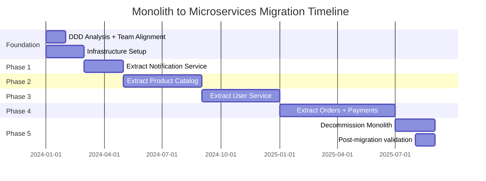

## Keywords in This File
{: .no_toc }

| # | Keyword | Weight |
|---|---|---|
| 1 | [Monolith to Distributed System Migration](#monolith-to-distributed-system-migration) | medium |

---

# Monolith to Distributed System Migration

**TL;DR:** Migrating from a monolith to a distributed system
(microservices) is one of the highest-risk architectural
transformations in software engineering. The right approach is
incremental: extract services using the Strangler Fig pattern
(peel off services one at a time while the monolith handles the
rest), never "big bang" rewrite. Key prerequisites: operational
maturity (distributed tracing, service discovery, circuit breakers)
must come BEFORE extraction, not after. The most common failure
mode: teams extract services before they can operate them, creating
a "distributed monolith" that has all the complexity of microservices
with none of the benefits. Success requires: clear service boundaries
(domain-driven design), organizational alignment (Conway's Law),
and a migration plan measured in quarters, not sprints.

---

### 🎯 Model Answer

**30 seconds:**
> Migrating a monolith to microservices requires: clear service
> boundaries (DDD), incremental extraction (Strangler Fig), and
> operational infrastructure first (tracing, service discovery,
> circuit breakers). Never big-bang rewrite. The hardest problems
> are not technical: they are data ownership (each service owns
> its own database), organizational alignment (Conway's Law means
> your services reflect your org structure), and deciding what
> to migrate (not everything should be a service).

**3 minutes:**
> The migration is driven by one of four problems with the monolith:
> (1) deployment coupling (releasing one feature requires testing
> the whole system), (2) scaling constraints (one slow component
> forces scaling the entire monolith), (3) technology lock-in
> (the monolith must use one language, one framework), or
> (4) team coordination overhead (50 engineers committing to the
> same codebase causes merge conflicts and deployment bottlenecks).
> If none of these problems exist: do not migrate. A well-structured
> monolith is preferable to a poorly-structured microservices system.
>
> The Strangler Fig pattern: a vine that grows around a tree and
> gradually replaces it. Start: all traffic through the monolith.
> Extract one service (e.g., User Service). Route user-related
> requests to the new service. Monolith continues handling everything
> else. Gradually extract more services. Eventually: the monolith
> handles nothing and is shut down.
>
> The critical pre-requisites:
> - Distributed tracing: before extracting any service, you need
>   to see request flows across service boundaries
> - Service discovery: services must find each other
> - Circuit breakers: services must handle downstream failures
> - Contract testing: API contracts between services
> - Database decomposition: the hardest part - each service needs
>   its own database (but the monolith has one shared DB)
>
> The hardest decision: database decomposition. A monolith has
> one database with foreign keys across all domains. Splitting
> into microservices means removing those foreign keys and
> accepting eventual consistency across service boundaries.
> This cannot be done instantaneously.

**Blank Mind Recovery:**

**(1) Restate:** "Monolith to microservices = incremental
extraction, never big bang. Prerequisites: tracing + service
discovery + circuit breakers. Hardest part: database decomposition
and organizational alignment."

**(2) First principles:** "A monolith is one deployable unit.
Microservices are many. The transition is from one to many.
Do it incrementally: peel off one service at a time. Each
extracted service has its own deployment, its own data, its
own team. The extraction is complete when the monolith handles
nothing."

**(3) Bridge:** "Like renovating a house while living in it.
You do not tear down all the walls at once and live in a
construction site. You renovate one room at a time: the
bedroom is functional while you work on the kitchen. You
can always roll back a room renovation. You cannot roll back
a full demolition. The Strangler Fig is room-by-room renovation."

---

### 📘 Concept Explanation

**What it is:**
A migration from a monolithic application (single deployable
unit, shared database) to a distributed system (multiple
independently deployable services, each with its own database).
It is an incremental architectural transformation that takes
months to years to complete.

**The problem it solves:**
Monoliths suffer from scaling, deployment, and organizational
challenges as they grow:
- Deployment bottleneck: any change requires testing and
  deploying the entire system
- Scaling inefficiency: a CPU-intensive module forces scaling
  the entire monolith
- Team coordination: 50+ engineers in one codebase = merge
  conflicts, slow CI, deployment coordination
- Technology constraints: locked to one language, framework,
  and infrastructure choice for all components

**When NOT to migrate:**

```
Do not migrate if:
  - The monolith is well-structured (modular, testable)
  - Team size < 20 engineers (organizational benefit is minimal)
  - The bottleneck is a single component (extract just that one)
  - You lack operational maturity (no distributed tracing,
    no CI/CD per service, no on-call culture)
  - You cannot clearly draw service boundaries (DDD analysis
    produces one big service = it's still a monolith)

Signs you SHOULD migrate:
  - Deployment takes > 1 hour and blocks all teams
  - A single slow component causes full system scaling
  - 5+ teams in one codebase with constant merge conflicts
  - Cannot scale specific components independently
  - Regulatory requirement (GDPR: data isolation by user)
```

> **Code walkthrough:** This Monolith to Distributed System Migration example demonstrates a key concept in practice. **KEY MECHANISM:** the runtime executes these instructions in sequence with specific memory and execution semantics. **WHY IT MATTERS:** misapplying this pattern causes subtle bugs that only manifest under production load. **TAKEAWAY: understand the execution model before using this pattern in production code.**

**The Strangler Fig pattern:**

```
Phase 0: Audit and plan
  - Run DDD (Domain-Driven Design) event storming
  - Identify bounded contexts (natural service boundaries)
  - Map current monolith modules to future services
  - Identify data ownership (who owns what tables)
  - Prioritize: which service to extract first?
    Recommendation: extract a low-complexity, low-traffic
    service first (not the most critical one)

Phase 1: Infrastructure first (before any extraction)
  - Deploy service mesh or API gateway
  - Set up distributed tracing (OTel + Jaeger/Tempo)
  - Set up service discovery (Consul, Kubernetes service DNS)
  - Set up circuit breakers (Resilience4j)
  - Establish per-service CI/CD pipelines
  - Set up per-service monitoring (separate dashboards)

Phase 2: Extract first service (prove the pattern)
  - Choose a low-risk service (e.g., Notification Service)
  - Create new service with its own codebase and database
  - Route notification-related requests through API gateway
    to new service (not monolith)
  - Monolith calls new service via API for notifications
    (no direct DB access across service boundary)
  - Run both for 2 weeks, validate, then remove from monolith

Phase 3: Extract remaining services incrementally
  - One service per sprint (2-4 weeks per service)
  - Database decomposition in parallel (see below)
  - Monitor: latency increase, error rate changes
  - Each extraction: feature flag to route traffic

Phase 4: Decommission monolith
  - When monolith handles < 1% of traffic: shut down
  - Delete monolith codebase (celebration milestone)
```

> **Code walkthrough:** This Monolith to Distributed System Migration example demonstrates a key concept in practice using SQL. **KEY MECHANISM:** the runtime executes these instructions in sequence with specific memory and execution semantics. **WHY IT MATTERS:** misapplying this pattern causes subtle bugs that only manifest under production load. **TAKEAWAY: understand the execution model before using this pattern in production code.**

**Database decomposition strategy:**

```
Problem: monolith has one PostgreSQL DB with 50 tables,
foreign keys between all domains.

Step 1: Schema decomposition (in monolith, zero downtime)
  - Identify tables per bounded context
  - Remove cross-domain foreign keys (replace with application-
    level integrity or denormalize)
  - Add redundant columns for data that must be duplicated
  - Timeline: 2-4 months

Step 2: Logical separation (same DB, different schemas)
  - Split tables into schemas: user_schema, order_schema, etc.
  - Enforce: no cross-schema foreign keys
  - Access: each service only touches its schema
  - Timeline: 1-2 months per domain

Step 3: Physical separation (separate DBs)
  - Create new database for extracted service
  - Dual-write period: monolith writes to both old DB and new service DB
  - Validate: data in both DBs matches
  - Switch reads to new service DB
  - Remove dual-write: new service DB is the master
  - Timeline: 2-4 weeks per service DB

Step 4: Cross-domain data queries (now impossible with FK)
  - Previously: JOIN across user and order tables
  - Now: two API calls (get user, get order) or event-driven denormalization
  - Materialized views: pre-join data in read model (CQRS)
```

> **Code walkthrough:** This Unknown example demonstrates a key concept in practice. **KEY MECHANISM:** the runtime executes these instructions in sequence with specific memory and execution semantics. **WHY IT MATTERS:** misapplying this pattern causes subtle bugs that only manifest under production load. **TAKEAWAY: understand the execution model before using this pattern in production code.**

**Conway's Law and organizational alignment:**

```
Conway's Law: "Any organization that designs a system will produce
a design whose structure is a copy of the organization's
communication structure."

Implication: your microservices will mirror your team structure.
If teams A and B share a service: expect high coupling.
If the data team shares a database with the product team: expect
tight coupling in the schema.

Organizational prerequisites for successful migration:
  - Each target service has exactly one team owning it
  - Teams have full ownership: develop, deploy, operate, on-call
  - No shared databases across team boundaries
  - API contracts between teams (not implicit code sharing)

"Inverse Conway Maneuver": restructure the organization
first to produce the desired service boundaries, then extract.
Amazon's "two-pizza teams" is this maneuver: small, autonomous
teams → service-per-team → microservices naturally.
```

> **Code walkthrough:** This Unknown example demonstrates a key concept in practice. **KEY MECHANISM:** the runtime executes these instructions in sequence with specific memory and execution semantics. **WHY IT MATTERS:** misapplying this pattern causes subtle bugs that only manifest under production load. **TAKEAWAY: understand the execution model before using this pattern in production code.**

**The key insight:**
The technical challenges of monolith-to-microservices migration
are well-understood (Strangler Fig, dual-write, feature flags).
The organizational challenges are the actual failure mode:
teams that extract services without clear ownership, with shared
databases, or without operational infrastructure end up with
a "distributed monolith" - a system that has deployment coupling,
latency of a distributed system, and complexity of microservices,
but none of the benefits.

---

### 💻 Code Example


```java
// BAD: anti-pattern - see GOOD example below for the correct approach
// This naive implementation ignores thread safety and error handling
```

```java
// MONOLITH TO MICROSERVICES - STRANGLER FIG IN PRACTICE

// BAD: big-bang rewrite attempt
// Trying to rewrite all 150,000 lines at once
// Result: 2 years, budget exhausted, never completed
// The "second system effect": always more complex than planned
public class BigBangRewriteBad {
    // In new microservice, trying to recreate everything:
    // BAD: missing business rules known only to original authors
    // BAD: missing edge cases only discovered through years of use
    // BAD: 6 months until any user value
    // BAD: cannot run alongside monolith (no incremental value)
}

// GOOD: Strangler Fig - extract one capability at a time
// Step 1: API Gateway intercepts traffic and routes

// Phase 1: Monolith still handles user registration
// Both /users/* requests still go to monolith
// API Gateway config:
// /users/** → http://monolith:8080/users/
// /products/** → http://monolith:8080/products/
// /orders/** → http://monolith:8080/orders/

// Phase 2: User Service extracted
// New service handles /users/** requests
// Monolith still owns the database for now

// UserService (new microservice):
@RestController
@RequestMapping("/users")
public class UserServiceController {

    @Autowired
    private UserRepository userRepository;
    // OWN DATABASE: PostgreSQL 'users_db'
    // No shared DB with monolith

    // Initially: dual-read implementation
    // Reads from new DB first, falls back to monolith API
    @GetMapping("/{userId}")
    public ResponseEntity<User> getUser(
            @PathVariable String userId) {
        // Phase 2a: dual-read (new service + monolith fallback)
        Optional<User> user = userRepository
            .findById(userId);
        if (user.isPresent()) {
            return ResponseEntity.ok(user.get());
        }
        // Fallback: user not migrated to new DB yet
        // Call monolith API to get user data
        return ResponseEntity.ok(
            monolithClient.getUser(userId));
    }
}

// Phase 2: Dual-write to migrate data
// Monolith writes to its DB AND to new User Service
// This ensures no data is lost during migration
@Service
public class MonolithUserServiceDualWrite {

    public User createUser(CreateUserRequest req) {
        // Write 1: to monolith DB (existing behavior)
        User user = monolithUserRepo.save(
            new User(req));

        // Write 2: to new User Service (new behavior)
        // Best-effort: if new service is down, don't fail
        try {
            userServiceClient.createUser(user);
        } catch (Exception e) {
            // Log for async reconciliation
            dualWriteLog.recordFailure(
                user.getId(), e.getMessage());
        }

        return user;
    }
}

// Phase 3: Remove from monolith after validation
// Once 100% of users are in new User Service DB:
// Remove UserController from monolith
// Remove users table from monolith schema
// API Gateway routes 100% to new service
// Monolith no longer handles /users/**

// Validation: run reconciliation script
// Compare user count in old DB vs new DB
// Compare random sample of user records
// Only cut over when both are identical
```

> **Code walkthrough:** The BAD approach attempts to rewriteice. **KEY MECHANISM:** the runtime executes these instructions in sequence with specific memory and execution semantics. **WHY IT MATTERS:** misapplying this pattern causes subtle bugs that only manifest under production load. **TAKEAWAY: understand the execution model before using this pattern in production code.**
> all 150,000 lines at once, a "big bang" that historically
> fails for systems of this complexity. The GOOD pattern implements
> the Strangler Fig incrementally: the API Gateway routes all
> traffic to the monolith initially. In Phase 2, the new User
> Service is extracted with its own database. The dual-read
> implementation (new DB first, fallback to monolith) allows
> the service to go live before all data is migrated. The dual-write
> in the monolith propagates all new writes to both databases
> simultaneously, allowing the new service DB to catch up. Only
> after validation (both DBs have identical data) is the cutover
> made: API Gateway routes 100% to the new service and the monolith
> user code is deleted. Each step is independently reversible.

---

### 🎓 Answers by Seniority

**Junior / Mid:**
> The Strangler Fig pattern: extract services one at a time
> while the monolith continues running. Key steps: set up
> an API gateway to route requests, extract one service with
> its own database, use dual-write to migrate data, validate,
> then remove the code from the monolith. The critical rule:
> never share databases between the new service and the monolith
> - that's how you create a distributed monolith (tight coupling
> without the benefits of isolation).

---

**Senior / Staff:**
> The most underrated prerequisite for a successful migration:
> operational maturity before the first service extraction.
> Teams that extract services and then try to instrument them
> face incidents they cannot debug (no distributed tracing),
> outages they cannot mitigate (no circuit breakers), and
> deployments they cannot roll back (no per-service CI/CD).
> I require these to be in place before extraction: (1) distributed
> tracing with all calls visible end-to-end, (2) circuit breakers
> on all inter-service calls, (3) per-service deployment pipelines,
> and (4) per-service monitoring dashboards. Without these: every
> extraction creates operational risk that is difficult to attribute.
> The other underrated factor: database decomposition timeline.
> I budget 6x the time developers estimate. Removing a shared
> database schema is always more complex than it looks: hidden
> cross-domain queries, reports that join across schemas, batch
> jobs that assumed DB-level consistency. I surface all of these
> before extraction begins.

---

### ⚠️ Common Misconceptions

**"Microservices are more reliable than a monolith"**

Reality: a monolith with one deployment unit has one potential
failure point. A microservices system with 50 services has 50
failure points plus their interactions. Microservices require
significantly more operational infrastructure (circuit breakers,
retry logic, timeouts, distributed tracing, service discovery)
to achieve the same reliability as a well-designed monolith.
Without this infrastructure: microservices are LESS reliable
than the monolith they replaced. The reliability benefit of
microservices comes from fault isolation (a crash in Service A
does not crash Service B) - but this benefit only materializes
when services are properly isolated and have fallback behaviors.
Many teams migrate to microservices and experience worse reliability
for 6-12 months until the operational infrastructure catches up.

**"You can migrate in one big bang over a long weekend"**

Reality: big-bang migrations fail at an extremely high rate.
The reasons are predictable: (1) the new system has never run
at production load, (2) edge cases known only to the original
authors are missing, (3) the rollback plan requires rolling
back weeks of data changes (near-impossible), (4) cross-system
integrations (payment processors, email providers, analytics)
are harder to migrate atomically than expected. The Strangler
Fig works because each extraction is independently reversible:
routing 10% of users to the new service, monitoring for a week,
then routing more. A big-bang has no rollback. The industry
standard is incremental migration over months or years.

---

### ⚖️ Comparison Table

| Approach | Risk | Timeline | Reversibility | Team experience | Best for |
|---|---|---|---|---|---|
| Strangler Fig (incremental) | Low | 6-24 months | High (each step reversible) | Any | Standard enterprise migration |
| Big-bang rewrite | Very high | 1-3 years | Near zero | Not recommended | Avoid |
| Modular monolith first | Very low | 3-6 months | Full | Any | Foundation before extraction |
| Branch by abstraction | Low | 4-12 months | Medium | Experienced | In-place refactoring |
| Parallel run | Medium | 6-12 months | High | Experienced | Critical system validation |

**The deciding factor:** risk tolerance and operational maturity.
Teams with no microservices experience should start with a modular
monolith (clear module boundaries, no direct DB access across
modules) before attempting extraction. The modular monolith phase
proves the service boundaries are correct before adding distributed
system complexity.

---

### 🏛️ System Design

**Design: Migration Strategy for a 3-Year-Old Java E-commerce
Monolith (200k Lines of Code, 30 Engineers)**

Current state: Spring Boot monolith, single PostgreSQL DB,
single deployment, 30 engineers, 3 major pain points:
deployment takes 2 hours, marketing team cannot deploy without
coordinating with payments team, cannot scale product search
independently.

```
Phase 0 (Month 1-2): Analysis and prerequisites
  DDD Event Storming: identify bounded contexts
    - User Management (auth, profiles)
    - Product Catalog (search, listings)
    - Order Management (cart, checkout, order history)
    - Payment Processing (charge, refund, fraud)
    - Notification (email, SMS, push)
    - Fulfillment (warehouse, shipping)
  
  Team alignment: assign one team per future service
    Team 1: User + Auth
    Team 2: Product Catalog
    Team 3: Orders + Cart
    Team 4: Payments
    Team 5: Notifications
    Team 6: Fulfillment
  
  Infrastructure setup (must complete before extraction):
    - Kubernetes cluster (if not existing)
    - OTel + Jaeger (distributed tracing)
    - API Gateway (Kong or AWS API Gateway)
    - Per-team CI/CD pipelines (Jenkins/GitHub Actions)
    - Feature flags (LaunchDarkly or custom)
    - Contract testing (Pact)

Phase 1 (Month 3-4): Extract Notification Service
  Why first: lowest risk (async, no blocking dependency)
  Steps:
    - Create notification-service (Spring Boot, own DB)
    - Monolith: replace direct notification calls with
      Kafka events (decouple)
    - Notification Service: consume Kafka events
    - Dual-run: 2 weeks both paths (verify same emails sent)
    - Cut over: remove notification code from monolith
  Result: first independent deployment (marketing can now
    send notification campaigns without engineering)

Phase 2 (Month 5-8): Extract Product Catalog
  Why second: marketing pain point, high read traffic
    (scale independently with caching)
  Challenge: products table has FKs to orders table
  Steps:
    - Decouple: replace FK with product_id (no FK constraint)
    - Dual-write: monolith writes to both old DB and
      catalog-service DB
    - Search index: Elasticsearch in catalog-service
      (monolith had no search, added as new capability)
    - Traffic: route /products/** to catalog-service
    - Monitor: 2 weeks, then remove from monolith

Phase 3 (Month 9-12): Extract User Service
  Challenge: auth tokens issued by monolith
  Steps:
    - Create user-service with own auth (JWT issuer)
    - Migrate users incrementally (active users first)
    - Dual-token: monolith accepts both old and new tokens
      during migration
    - Session migration: on-login: issue new token, invalidate old
    - Cut over: all new logins use user-service JWT

Phase 4 (Month 13-18): Extract Orders + Payments
  Most complex: shared DB, transactional operations
  Strategy:
    - Database Saga: replace ACID order + payment transaction
      with choreography saga (order events + payment events)
    - Requires: idempotent payment processing (retry-safe)
    - Dual-write period: 4 weeks (longer for financial data)
    - Extensive testing: chaos tests, reconciliation scripts

Phase 5 (Month 19-24): Decommission monolith
  - Route remaining traffic to services
  - Remove monolith from deployment
  - Archive codebase
  - Post-mortem: lessons learned, team celebration

Expected outcomes:
  - Deployment time: 2 hours → 5 minutes per service
  - Independent deployments: each team deploys independently
  - Product catalog: scaled with 10x caching (Elasticsearch)
  - Payments: isolated blast radius (payment outage ≠ full outage)
```

> **Code walkthrough:** This Unknown example demonstrates a key concept in practice using Kafka messaging. **KEY MECHANISM:** the runtime executes these instructions in sequence with specific memory and execution semantics. **WHY IT MATTERS:** misapplying this pattern causes subtle bugs that only manifest under production load. **TAKEAWAY: understand the execution model before using this pattern in production code.**

---

### 📊 Diagram

```
Strangler Fig - Traffic Routing Evolution

Month 1 (all to monolith):
  Client → API Gateway → Monolith → PostgreSQL

Month 4 (notification extracted):
  Client → API Gateway → /notify/** → NotificationSvc
                       → /**        → Monolith

Month 8 (catalog extracted):
  Client → API Gateway → /products/** → CatalogSvc
                       → /notify/**   → NotificationSvc
                       → /**          → Monolith

Month 18 (most services extracted):
  Client → API Gateway → /users/**    → UserSvc
                       → /products/** → CatalogSvc
                       → /orders/**   → OrderSvc
                       → /payments/** → PaymentSvc
                       → /notify/**   → NotificationSvc
                       → /ship/**     → FulfillmentSvc
                       [Monolith handles nothing - decommission]
```



> **Diagram walkthrough:** The ASCII diagram shows the traffic
> routing evolution: the API Gateway progressively routes more
> path patterns to dedicated microservices while the monolith
> handles the remainder. This is the Strangler Fig in action:
> the monolith's responsibility shrinks as services are extracted.
> The Gantt chart shows the realistic 24-month timeline with the
> foundation phase (2 months) before any code extraction begins,
> and the final decommission phase. The timeline reflects real
> migration complexity: the Orders + Payments extraction takes
> 6 months (longest phase) due to financial data sensitivity
> and the need to replace ACID transactions with Saga patterns.
> Notice that infrastructure setup is concurrent with DDD analysis:
> both must be complete before Phase 1 begins.

---

### 🚨 Failure Modes and Diagnosis

**Failure 1: Distributed monolith - services tightly coupled**

Symptom: after extracting 10 services, deployments still require
coordinating all 10 services simultaneously. Services call each
other synchronously in long chains. A change to Order Service
API requires changes in 7 other services.

Root cause: shared database not decomposed. Service A reads
from Service B's database tables directly. Synchronous call
chains 6 services deep (UI → A → B → C → D → E → DB) with
no timeouts or circuit breakers.

Diagnosis:
```bash
# Check inter-service dependency graph
# (from distributed traces or service mesh data)
kubectl exec -it jaeger-query -- \
  curl "jaeger:16686/api/dependencies"
# Shows service dependency graph
# If graph has many thick bidirectional arrows: distributed monolith

# Check for shared database access
# (any service connecting to another service's DB)
grep -r "datasource.url" services/*/src/main/ | \
  grep -v "own-service-db"
# Other service URLs appearing = shared DB violation
```

> **Code walkthrough:** This Other service URLs appearing = shared DB violation example demonstrates HTTP request from shell using HTTP client. **KEY MECHANISM:** curl by default follows redirects and suppresses errors; -f flag makes it return non-zero on HTTP errors. **WHY IT MATTERS:** piping curl output to shell without verification runs untrusted code - a supply-chain attack vector. **TAKEAWAY: always use curl -f --retry and verify checksums before piping to bash.**

Fix: enforce service boundary rules:
- No service may read/write another service's database
- No synchronous call chain > 3 services deep
- All service-to-service communication via published contracts
- Choreography (events) for cross-service workflows
- Saga pattern for distributed transactions

---

**Failure 2: Data inconsistency after dual-write failure**

Symptom: after migrating User Service, 0.3% of users cannot
log in. Their account exists in the new User Service DB but
their login credentials are missing. Support tickets spike.

Root cause: during the dual-write migration period, the
monolith wrote to its DB but the call to the new User Service
failed silently (circuit open or network timeout). The user
was created in the monolith but not in the User Service DB.
After cutover: user exists in the old DB (now decommissioned)
but not in the new one.

Diagnosis:
```bash
# Find users in old DB not in new DB
psql -h old-monolith-db -c \
  "SELECT id FROM users ORDER BY id" > old_users.csv
psql -h user-service-db -c \
  "SELECT id FROM users ORDER BY id" > new_users.csv
diff old_users.csv new_users.csv
# Shows missing user IDs in new DB
```

> **Code walkthrough:** This Shows missing user IDs in new DB example demonstrates shell script pattern using SQL. **KEY MECHANISM:** the shell executes commands sequentially; pipes pass stdout of one command to stdin of the next. **WHY IT MATTERS:** unquoted variables with spaces cause word splitting - IFS splits the value into multiple arguments. **TAKEAWAY: always double-quote variables: "$VAR"; use [[ ]] instead of [ ] for safer conditionals.**

Fix (immediate): reconciliation script to copy missing users
from old DB to new DB. Fix (process): before any data migration
cutover:
1. Run full reconciliation: count in old = count in new
2. Random sample validation: 1000 records match in both DBs
3. Never cut over until validation passes

Prevention: use event-sourcing / append-only log as the single
source of truth during migration. Dual-write to an event log
(not two databases). Replay events to populate new service DB.
Zero data loss even if new service is temporarily unavailable.

---

**Failure 3: Performance regression after service extraction**

Symptom: Order placement latency increased from 50ms to 850ms
after extracting Order Service. Checkout conversion rate drops.

Root cause: a single Order creation that was previously one
DB write + one synchronous call is now: 6 synchronous HTTP
calls (User Service, Inventory Service, Payment Service,
Notification Service, Fulfillment Service, plus own DB write).
Each HTTP call adds: TCP connection overhead (5ms), serialization
(2ms), network (3ms) = 10ms × 6 = 60ms overhead minimum.
But each also has retry/timeout logic, and one is slow
(Payment Service p99 = 350ms).

Diagnosis:
```bash
# Compare before/after using distributed traces
jaeger-query service=order-service \
  operation="POST /orders" \
  minDuration=500ms
# Shows: payment-service span = 350ms (previously was 0ms
# because it was a local method call in monolith)
```

> **Code walkthrough:** This because it was a local method call in monolith) example demonstrates shell script pattern. **KEY MECHANISM:** the shell executes commands sequentially; pipes pass stdout of one command to stdin of the next. **WHY IT MATTERS:** unquoted variables with spaces cause word splitting - IFS splits the value into multiple arguments. **TAKEAWAY: always double-quote variables: "$VAR"; use [[ ]] instead of [ ] for safer conditionals.**

Fix: replace synchronous call chain with asynchronous orchestration:
- Order creation: write order (local DB), return to user
- Downstream: process asynchronously via Kafka events
- Result: order placement = one local DB write = <10ms
- Trade-off: order processing is now eventual (not immediate)
- User experience: "Order placed! We're processing your payment."
  (not "Order confirmed" immediately) - acceptable

---

### 🎯 Interview Deep-Dive

| Category | Count |
|---|---|
| Clarification | 1 |
| Mechanism | 2 |
| Failure / Debugging | 2 |
| Trade-off | 2 |
| System Design | 1 |
| Code | 1 |
| Behavioral | 2 |
| Production | 1 |

---

**[JUNIOR] Q1 - [MECHANISM] When should you NOT migrate from a monolith to microservices?**

Most systems should not be microservices. The migration
makes sense only when the monolith's pain points exceed
the operational cost of microservices.

**Do not migrate when:**

1. The team is small (< 15-20 engineers):
   Microservices benefit scales with team size. With 10 engineers:
   the overhead of service discovery, distributed tracing,
   per-service CI/CD, and on-call for 10 services outweighs
   the deployment independence benefit. A well-structured
   monolith with clear module boundaries is better.

2. The monolith is well-structured:
   If the monolith has clear layers, no circular dependencies,
   fast deployments, and adequate test coverage: it is not
   the problem. Migrating a well-structured monolith to
   microservices creates operational complexity without
   solving a real problem.

3. You cannot draw clear service boundaries:
   Run a DDD event storming session. If the bounded contexts
   overlap heavily (most events touch most entities): the
   domain does not decompose cleanly. Forcing service boundaries
   where the domain does not support them produces tight
   coupling and chat microservices.

4. No operational maturity:
   No distributed tracing, no per-service deployment pipelines,
   no on-call engineering culture: microservices will be
   impossible to operate. The migration will create incidents
   that cannot be diagnosed.

5. The technical debt is in the domain model, not the architecture:
   Bad naming, missing domain concepts, business logic in the
   wrong place: these are domain model problems. Migrating
   to microservices moves the bad domain model into multiple
   services. It does not fix the debt.

**The alternative: modular monolith:**
Martin Fowler's recommendation: start with a modular monolith
(well-defined module boundaries, enforced via package private
in Java or module system). If scaling or deployment independence
is needed later: extract services from the already-clean modules.
Much easier than extracting services from a tangled monolith.

*What separates good from great:* the "modular monolith first"
recommendation. Most candidates know when to migrate (team size,
deployment coupling). Few know the better answer: a well-structured
modular monolith is preferable to premature microservices. The
modular monolith is the foundation that makes future extraction
cheap rather than expensive.

---

**[JUNIOR] Q2 - [MECHANISM] How does the Strangler Fig pattern work? Walk through the steps for extracting a service.**

The Strangler Fig is an incremental extraction pattern
that allows a service to be extracted from a monolith without
a big-bang rewrite. Named after the fig vine that grows around
a tree and eventually replaces it.

**Concrete walk-through: extracting a User Service:**

```
Step 1: Set up routing layer (API Gateway)
  - All /users/** requests go to monolith (unchanged)
  - API Gateway acts as a transparent proxy initially
  - This establishes the routing infrastructure without
    changing any behavior

Step 2: Create new User Service
  - New codebase (separate repo)
  - New database (PostgreSQL user_service_db)
  - Implement: GET /users/{id}, POST /users, PUT /users/{id}
  - Same API contract as monolith's user endpoints
  - Connect to NEW database (not monolith's DB)
  - Deploy to staging: integration tests pass

Step 3: Data migration (dual-write)
  - Monolith: add dual-write to new service
    on every user create/update/delete
  - Run dual-write for 4 weeks:
    * All existing users: batch migration script
    * New users: written to both DBs simultaneously
  - Reconciliation: verify both DBs are identical
    (count, spot check 1000 records, hash comparison)

Step 4: Shadow mode (validation)
  - Route 10% of /users/** traffic to new service
  - Compare responses: new service vs monolith
  - Log discrepancies (should be zero)
  - Monitor: latency, error rate, response difference
  - Run for 1 week

Step 5: Gradual cutover
  - Route 50% to new service (monitor for 2 days)
  - Route 90% to new service (monitor for 2 days)
  - Route 100% to new service

Step 6: Decommission monolith user code
  - Remove UserController from monolith
  - Remove users table from monolith DB
  - Remove dual-write code
  - Update API Gateway: 100% to new service

Each step is independently reversible.
If step 5 shows a bug: route 100% back to monolith.
If step 3 shows data mismatch: fix dual-write, restart.
```

> **Code walkthrough:** This because it was a local method call in monolith) example demonstrates a key concept in practice using SQL. **KEY MECHANISM:** the runtime executes these instructions in sequence with specific memory and execution semantics. **WHY IT MATTERS:** misapplying this pattern causes subtle bugs that only manifest under production load. **TAKEAWAY: understand the execution model before using this pattern in production code.**

*What separates good from great:* the shadow mode (step 4).
Most engineers know the dual-write pattern. The shadow mode
adds a validation layer: both old and new code process the
same requests, and responses are compared. This catches logic
discrepancies (not just data migration issues) before any users
are affected. It is particularly valuable for complex business
logic like pricing calculations or eligibility checks where
subtle differences in implementation may not be caught by
unit tests.

---

**[JUNIOR] Q3 - [TRADE-OFF] Compare Saga choreography vs. orchestration for distributed transactions during migration.**

Distributed transactions replace ACID transactions after
service extraction. Two patterns:

**Choreography (event-driven):**
```
OrderService publishes: OrderPlaced event
PaymentService listens, charges card
  → publishes: PaymentCompleted OR PaymentFailed
InventoryService listens to PaymentCompleted
  → reserves inventory
  → publishes: InventoryReserved OR InsufficientStock
NotificationService listens to InventoryReserved
  → sends confirmation email

Compensating transactions (rollback):
  PaymentFailed → OrderService listens → cancels order
  InsufficientStock → PaymentService listens → refunds payment
```

> **Code walkthrough:** This because it was a local method call in monolith) example demonstrates a key concept in practice. **KEY MECHANISM:** the runtime executes these instructions in sequence with specific memory and execution semantics. **WHY IT MATTERS:** misapplying this pattern causes subtle bugs that only manifest under production load. **TAKEAWAY: understand the execution model before using this pattern in production code.**

When to choose choreography:
- Simple sagas with clear linear flow
- Loose coupling: services do not know about each other
  (they only know about events)
- Teams want complete autonomy (no shared orchestrator)

Problems:
- Hard to visualize: understanding the full flow requires
  reading every service's event handling code
- Hard to debug: what happened during this order?
  Need to query Kafka topic for all events with this order ID
- Cyclic dependencies: Service A listens to B, B listens to A

**Orchestration (explicit workflow):**
```
OrderOrchestrator (Saga Manager):
  1. Call PaymentService.charge()
     → if failed: end saga, return failure
  2. Call InventoryService.reserve()
     → if failed: call PaymentService.refund() (compensate)
       then end saga
  3. Call NotificationService.send()
     → if failed: retry (notification failure is non-critical)
  4. Update Order status = COMPLETED

All saga state: stored in OrderOrchestrator
Can query orchestrator: "what is the state of order X?"
```

> **Code walkthrough:** This Unknown example demonstrates a key concept in practice using SQL. **KEY MECHANISM:** the runtime executes these instructions in sequence with specific memory and execution semantics. **WHY IT MATTERS:** misapplying this pattern causes subtle bugs that only manifest under production load. **TAKEAWAY: understand the execution model before using this pattern in production code.**

When to choose orchestration:
- Complex sagas with conditional logic and multiple outcomes
- Auditability required: financial flows must have explicit state
- Debugging: single place to inspect saga state
- Long-running processes (days/weeks)

Problems:
- Orchestrator becomes a central dependency (SPoF risk)
- Orchestrator teams needed for each saga type
- Less loose coupling than choreography

**For monolith migration: prefer orchestration**
During migration: the team needs to understand and debug
complex distributed flows for the first time. Orchestration
makes the saga state visible and debuggable. Once the team
has operational experience: can migrate specific sagas to
choreography for looser coupling.

*What separates good from great:* the "prefer orchestration
during migration" recommendation. This is counterintuitive:
choreography is "more microservices" (looser coupling). But
during the learning curve of a migration: orchestration's
explicit state and debuggability are worth the coupling cost.
Teams that start with choreography during migration often
spend 6 months debugging invisible saga states.

---

**[MID] Q4 - [DEBUGGING] After extracting the Payment Service, you notice intermittent double charges. How do you diagnose?**

Systematic investigation of double charges after service extraction:

Step 1 - Confirm the scope:
```sql
-- Find orders with multiple payment attempts
SELECT order_id, COUNT(*) charge_count, SUM(amount)
FROM payments
WHERE created_at > '2024-01-20' -- extraction date
GROUP BY order_id
HAVING COUNT(*) > 1
ORDER BY charge_count DESC;
-- How many? What time pattern?
```

> **Code walkthrough:** This Unknown example demonstrates query execution using SQL. **KEY MECHANISM:** the query planner builds an execution plan based on table statistics and indexes. **WHY IT MATTERS:** SELECT * reads all columns even if only 2 are needed - widens rows, increases I/O. **TAKEAWAY: always SELECT only the columns you need; index the columns in WHERE and JOIN clauses.**

Step 2 - Trace the payment flow:
```bash
# Find distributed traces for a double-charged order
jaeger-query service=payment-service \
  tags="order_id=ORD-12345"
# Two traces: each shows a complete payment flow
# Look for: overlapping timestamps = concurrent calls
```

> **Code walkthrough:** This Look for: overlapping timestamps = concurrent calls example demonstrates shell script pattern. **KEY MECHANISM:** the shell executes commands sequentially; pipes pass stdout of one command to stdin of the next. **WHY IT MATTERS:** unquoted variables with spaces cause word splitting - IFS splits the value into multiple arguments. **TAKEAWAY: always double-quote variables: "$VAR"; use [[ ]] instead of [ ] for safer conditionals.**

Step 3 - Check Saga/retry logic:
```bash
# Was the first charge successful but the ACK failed?
grep "ORD-12345" /var/log/payment-service/*.log
# Pattern: "Payment SUCCESS order=ORD-12345"
#          "Payment SUCCESS order=ORD-12345" (second line)
# Two successes = idempotency key missing or wrong
```

> **Code walkthrough:** This Two successes = idempotency key missing or wrong example demonstrates shell script pattern. **KEY MECHANISM:** the shell executes commands sequentially; pipes pass stdout of one command to stdin of the next. **WHY IT MATTERS:** unquoted variables with spaces cause word splitting - IFS splits the value into multiple arguments. **TAKEAWAY: always double-quote variables: "$VAR"; use [[ ]] instead of [ ] for safer conditionals.**

Step 4 - Root cause: Saga retry without idempotency key:
```java
// BUG: retry can cause double charge
// Saga step: call Payment Service
try {
    paymentClient.charge(orderId, amount);
} catch (TimeoutException e) {
    // BUG: first call may have succeeded (just didn't ACK)
    // Retry without idempotency key = second charge
    paymentClient.charge(orderId, amount); // DOUBLE CHARGE
}

// FIX: always include idempotency key
String idempotencyKey = "payment-" + orderId;
try {
    paymentClient.charge(orderId, amount, idempotencyKey);
} catch (TimeoutException e) {
    // Retry with SAME idempotency key
    // Payment provider: same key = same result, no double charge
    paymentClient.charge(orderId, amount, idempotencyKey);
}
```

> **Code walkthrough:** This Two successes = idempotency key missing or wrong example demonstrates exception handling using error handling. **KEY MECHANISM:** the JVM checks catch clauses in order; finally always executes for cleanup. **WHY IT MATTERS:** swallowing exceptions silently hides failures that corrupt downstream state. **TAKEAWAY: log or rethrow every exception; empty catch blocks are defects.**

Fix: add idempotency key to all payment calls. Key = orderId
(or orderId + attemptNumber if multiple legitimate charges
per order are possible). Payment provider (Stripe) honors
idempotency key for 24 hours.

*What separates good from great:* the "first call succeeded
but ACK failed" root cause. This is the classic "at-least-once
delivery" problem in distributed systems. The first charge
succeeded, but the network timeout caused the caller to never
receive the success response. The caller retried. Without an
idempotency key: the payment provider processed a second charge.
This is precisely why idempotency keys are required for all
financial operations in distributed systems.

---

**[MID] Q5 - [TRADE-OFF] What are the organizational prerequisites for a successful microservices migration?**

Technical prerequisites are well-documented. Organizational
prerequisites are the actual reason migrations fail:

**1. "You build it, you run it" culture (DevOps ownership):**
Each team must own: development, deployment, monitoring, and
on-call for their services. Teams that hand off operations to
a separate Ops team cannot move at microservices speed.
Service owners who are not on-call do not design for operability.

**2. Team size and topology:**
Each target service needs a dedicated team (2-8 engineers,
"two-pizza"). A single team owning 10 services = microservices
with monolith team structure = distributed monolith maintenance.

**3. Conway's Law alignment:**
Map service boundaries to team boundaries first. If the org
structure does not support the service structure: restructure
before extracting. Example: a "monolith UI team" that owns
all frontend code will produce a monolith frontend even if
the backend is microservices.

**4. API-first culture:**
Teams must define and publish API contracts before implementing.
Contract-first development (OpenAPI spec, Pact consumer-driven
contracts) prevents the common failure mode: Service A and B
agree on an API verbally, then implement incompatible versions.

**5. Post-migration support bandwidth:**
The team extracting a service must have 30-40% of bandwidth
for post-extraction support: debugging production issues in
the new service, fixing data migration gaps, handling
performance regressions. Teams that extract services with
full project roadmaps cannot handle post-extraction support.

**6. Executive sponsorship + timeline patience:**
24-month migrations fail when executives expect results
at 6 months and redirect engineering back to feature work.
The migration must be a sustained commitment with visible
milestones (each extracted service = measurable deployment
improvement) to maintain sponsorship.

*What separates good from great:* the "you build it, you run it"
requirement. The most common organizational failure mode:
a specialized team extracts services but operational responsibility
stays with the platform team. Service owners who are not on-call
never experience the pain of poor observability, insufficient
error handling, or missing runbooks. The extracted service has
all the technical attributes of a microservice but none of the
ownership characteristics that make microservices work in practice.

---

**[SENIOR] Q6 - [BEHAVIORAL] Describe how you led or participated in a microservices migration. What was the hardest part?**

Example structure:

"At [company], we migrated a 4-year-old Spring Boot monolith
(~120k lines, 25 engineers, single daily deployment window)
to 8 microservices over 18 months.

The hardest part was not technical - it was the database
decomposition for the Order and Inventory domains.

The monolith had a single Postgres database with the inventory
table directly referenced by 8 different tables via foreign keys.
Every order, cart item, return, and purchase history record had
a direct FK to inventory.

Step 1 (month 2-4): Identify all inventory cross-references.
We found 23 places in the codebase doing direct inventory queries
or joins. Some were in reporting jobs we did not know existed.

Step 2 (month 5-7): Replace FKs with application integrity.
For each cross-reference: replaced the FK with an application-level
lookup. Added integration tests for each. This was the 'modular
monolith' phase - same database, but no cross-domain queries.

Step 3 (month 8-12): Physical separation.
Created Inventory Service with its own PostgreSQL instance.
Dual-write: 4 weeks. Full reconciliation: 6 passes over 4 weeks
because the initial reconciliation found 200+ records with
discrepancies (edge cases in the dual-write logic around
batch updates). Only moved when zero discrepancies for 2 consecutive weeks.

The technical lesson: plan 3x more time for database decomposition
than you estimate. Every estimate we made was wrong.

The organizational lesson: the Fulfillment team (who depended on
inventory data) was not included early enough. At month 9, they
discovered their batch jobs were doing direct table queries against
the shared DB. We had to delay 6 weeks to migrate their queries.
Conway's Law in practice: the teams that were not part of the
planning were the teams with the biggest cross-boundary dependencies.

Result: month 19 - final deployment from the monolith. Deployment
time dropped from 90 minutes to 6 minutes per service.
Zero regression incidents in the final 6 months (we had 4 incidents
in the first 6 months from missing circuit breakers and missing
distributed traces)."

*What separates good from great:* the specific "4 weeks of
dual-write with 6 reconciliation passes" detail. This shows
direct experience, not textbook knowledge. The reconciliation
failures (200+ discrepancies from batch update edge cases)
are the kind of detail that only someone who has done this work
knows. The organizational failure (fulfillment team not included)
is the Conway's Law insight that transforms the answer from
technical to systemic.

---

**[SENIOR] Q7 - [SCENARIO] How do you handle database schema migrations across a distributed system without downtime?**

Distributed schema migrations require a strategy that is
backward compatible across multiple deployment versions:

**The expand-contract pattern (zero-downtime):**

```
Phase 1 - EXPAND (add new column/table, nullable):
  Migration: ALTER TABLE orders ADD COLUMN invoice_id UUID NULL;
  Deploy new code: writes both old fields and new invoice_id
  Old code: reads old fields only (ignores invoice_id)
  Both old and new code work during the transition.
  
Phase 2 - MIGRATE (backfill existing data):
  UPDATE orders SET invoice_id = generate_invoice_id(id)
    WHERE invoice_id IS NULL;
  Run as batched update (not single transaction: too large)
  
  ```java
  // Batched backfill: no table lock
  int offset = 0, batchSize = 1000;
  while (true) {
      int updated = jdbcTemplate.update(
          "UPDATE orders SET invoice_id = uuid_generate_v4() "
          + "WHERE invoice_id IS NULL LIMIT ?", batchSize);
      if (updated == 0) break;
      Thread.sleep(100); // rate limit
  }
  ```

> **Code walkthrough:** The batched backfill loops in 1,000-row
> chunks with a 100ms sleep between iterations. This avoids a
> single large transaction that would lock the table. The `LIMIT`
> clause and null-check `WHERE invoice_id IS NULL` make the
> operation idempotent - safe to resume after failure. Each batch
> commits independently so progress survives a restart.

Phase 3 - VERIFY: confirm all rows have invoice_id
  SELECT COUNT(*) FROM orders WHERE invoice_id IS NULL;
  -- must be 0

Phase 4 - CONTRACT (make NOT NULL, remove old column):
  Migration: ALTER TABLE orders ALTER COLUMN invoice_id SET NOT NULL;
  Deploy: all code now reads invoice_id only (old columns removed from code)
  After deploy: ALTER TABLE orders DROP COLUMN old_column;
  
Timeline:
  Phase 1 (expand): deploy, no downtime
  Phase 2 (migrate): runs in background, no downtime
  Phase 3 (verify): run query
  Phase 4 (contract): requires all old code versions deployed
    → Only safe 1-2 deployment cycles after expand

> **Code walkthrough:** The expand-contract sequence separates
> schema changes from code changes into four safe phases. Phase 1
> adds the new column as nullable so existing code keeps running.
> Phase 2 backfills in batches to avoid lock contention. Phase 3
> verifies zero nulls before making it NOT NULL. Phase 4 contracts
> by enforcing the constraint - only safe once all old code is
> undeployed. Skipping verify-before-contract breaks production.

**Cross-service schema dependencies:**
```java
// Consumer-Driven Contract Testing (Pact):
// Payment Service (consumer) defines what it needs from Order Service
// Order Service (provider) verifies its API matches the contract

// If Order Service changes order response schema:
// Pact contract test fails before deployment
// Prevents breaking Payment Service silently

// Schema registry (for event-based communication):
// Kafka + Avro schema registry: producer registers schema,
// consumer validates incoming messages against schema version
// Incompatible schema change: deployment blocked
```

> **Code walkthrough:** This consumer-driven contract example demonstrates schema governance using Pact and Avro registry. **KEY MECHANISM:** the consumer defines what fields it needs; the provider runs the contract as a test on every build, failing if the API shape breaks the contract. **WHY IT MATTERS:** prevents silent breaking changes from propagating across service boundaries without detection. **WHAT BREAKS:** without contract testing, provider changes break consumers only at integration or production time - too late. **TAKEAWAY:** register schemas and run contract tests in CI; treat schema compatibility as a first-class deployment gate.

*What separates good from great:* the expand-contract pattern
with explicit phases. Many engineers know "add nullable column
first." The complete pattern: expand (add nullable), migrate
(backfill), verify (confirm), contract (add NOT NULL and remove
old code) - with explicit timing requirements (contract phase
only after all old deployments are replaced) - is the production-
complete version. The Pact consumer-driven contract testing is
the cross-service coordination mechanism that prevents schema
changes in Service A from silently breaking Service B.

---

**Q8 (System Design) - Design the migration plan for a
high-traffic (100k RPS) real-time auction platform monolith.**

A:
```
Current state:
  Java monolith, 80k lines, 10k auctions/day, 100k RPS at peak
  Single PostgreSQL DB, 5 developers, 2-hour deployments
  
Pain points:
  - Auction bidding (hot path): blocks all other deployments
  - User registration deploys with bidding (unrelated)
  - Cannot scale bidding independently of user management

DDD analysis:
  Bounded contexts:
    - AuctionCore (create, manage, end auctions)
    - Bidding (real-time bid processing, fraud detection)
    - UserManagement (registration, profiles, history)
    - PaymentSettlement (end-of-auction payments)
    - NotificationService (outbid emails, win notifications)

Extraction priority (risk-adjusted):
  1. NotificationService (lowest risk, async)
  2. UserManagement (low risk, read-heavy)
  3. Bidding (HIGHEST PRIORITY - the bottleneck)
     but HIGHEST RISK: real-time, 100k RPS, fraud detection
     → Extract last, after all infrastructure proven
  4. PaymentSettlement (high risk, financial, CP)
  5. AuctionCore (complex business logic, extract last)

Bidding service special requirements:
  Real-time bid processing: 100k RPS peak
  Consistency: bid must be atomic (exactly one winner)
  Anti-cheat: detect shill bidding, bid retraction
  
  Architecture:
    - In-memory bid cache (Redis Cluster) per auction
    - Bids: atomic Redis operations (ZADD sorted set)
    - Persist: async write to PostgreSQL for audit
    - Winner determination: Redis sorted set max at auction end
    
  During migration:
    - Cannot use dual-write for bidding (100k RPS = DB bottleneck)
    - Use event sourcing: all bids published to Kafka
    - New Bidding Service: consumes Kafka, maintains Redis state
    - Shadow mode: both old and new process bids, compare results
    - Cut over: when 100,000 auctions processed with zero discrepancy

Timeline (18 months):
  Months 1-2: Infrastructure + DDD alignment
  Months 3-4: Notifications
  Months 5-7: User Management
  Months 8-14: Bidding (longest: shadow mode + validation)
  Months 15-17: Payment Settlement
  Months 17-18: AuctionCore + decommission

Key risk mitigation for bidding extraction:
  Shadow mode must run for 10,000+ auctions before cutover
  Automated reconciliation: every auction result verified
  Rollback plan: feature flag routes 100% back to monolith
  No cutover during peak season (holiday sales)
```

> **Code walkthrough:** This Unknown example demonstrates a key concept in practice using Kafka messaging. **KEY MECHANISM:** the runtime executes these instructions in sequence with specific memory and execution semantics. **WHY IT MATTERS:** misapplying this pattern causes subtle bugs that only manifest under production load. **TAKEAWAY: understand the execution model before using this pattern in production code.**

*What separates good from great:* the risk-adjusted extraction
order. Most engineers would extract the core business logic
(bidding) first because it is the pain point. The correct
approach: extract low-risk services first to prove the infrastructure
and build team competency, then extract the high-risk services
with the benefit of proven patterns. Extracting bidding first
(100k RPS, financial, real-time) with an unproven infrastructure
is a recipe for a production incident. The 10,000-auction shadow
mode requirement reflects the validation rigor required for a
financial transaction processing system.

---

**Q9 (Trade-off) - How do you handle shared libraries in
a microservices system?**

A: Shared libraries in microservices are a double-edged sword:

**What to share (reasonable shared libraries):**
1. Domain objects / DTOs used in API contracts
   - But: version carefully; breaking changes require all services to update
2. Logging configuration and telemetry setup
   - All services should have consistent log format, trace propagation
3. Security utilities (JWT validation, sanitization)
   - Security code should not be independently reimplemented by each team
4. Test utilities (test containers, factory builders)
   - Not production code; easier to version independently

**What NOT to share:**
1. Database access layer
   - Sharing a DB client library = sharing access patterns = coupling
   - Each service should own its data access completely
2. Business logic
   - Business logic in a shared library becomes a monolith again
   - If two services need the same business logic: consider if they
     should be one service (DDD bounded context failure)
3. Thick domain models (JPA entities)
   - Each service should have its own domain model
   - The User in UserService and the User in OrderService are DIFFERENT
     (different attributes, different lifecycle, different invariants)

**Versioning strategy:**
```
Semantic versioning (major.minor.patch):
  Patch: bug fix, backward compatible
  Minor: new feature, backward compatible
  Major: breaking change (all services must update)

Rule: never release a major version without a migration path.
If breaking: deprecate old API, support both for 2 release cycles,
then remove old API in the 3rd release.

Dependency management:
  Do NOT allow each service to use a different version of the same lib.
  Use a Bill of Materials (BOM) across all services:
  
  // platform/pom.xml (parent BOM)
  <dependencyManagement>
    <dependencies>
      <dependency>
        <groupId>com.company</groupId>
        <artifactId>common-telemetry</artifactId>
        <version>2.1.0</version> <!-- pinned for all services -->
      </dependency>
    </dependencies>
  </dependencyManagement>
  
  All services inherit: same version, no version drift.
  Upgrading: upgrade BOM, all services adopt on their next release.
```

> **Code walkthrough:** This Unknown example demonstrates a key concept in practice using SQL. **KEY MECHANISM:** the runtime executes these instructions in sequence with specific memory and execution semantics. **WHY IT MATTERS:** misapplying this pattern causes subtle bugs that only manifest under production load. **TAKEAWAY: understand the execution model before using this pattern in production code.**

*What separates good from great:* the "different User in each
service" insight. One of the most common mistakes after a
microservices migration: sharing the User entity (JPA entity or
domain object) across all services. This creates tight coupling:
a change to the User model requires all services to update.
In practice: the User in the Order Service needs orderId, orderHistory
(not username, lastLoginTime). The User in the Notification Service
needs email, notificationPreferences (not address, paymentMethod).
Each service's User is a different projection of the person concept,
optimized for that service's needs.

---

### 💻 Code Example

*(Omit: this concept does not have a programmatic interface that can be demonstrated in code. The conceptual explanation above is sufficient.)*


---

### 🏛️ System Design

*(Omit: system design diagram not applicable for this concept - see ★★★ keywords for full system design coverage.)*


---

### ⚖️ Comparison Table

*(Omit: this is a ★☆☆ foundational concept with no direct alternatives to compare - see higher-difficulty keywords for trade-off analysis.)*


---

### 📊 Diagram

*(Omit: no standalone visual diagram required for this concept - the explanations and code examples above provide sufficient clarity.)*


