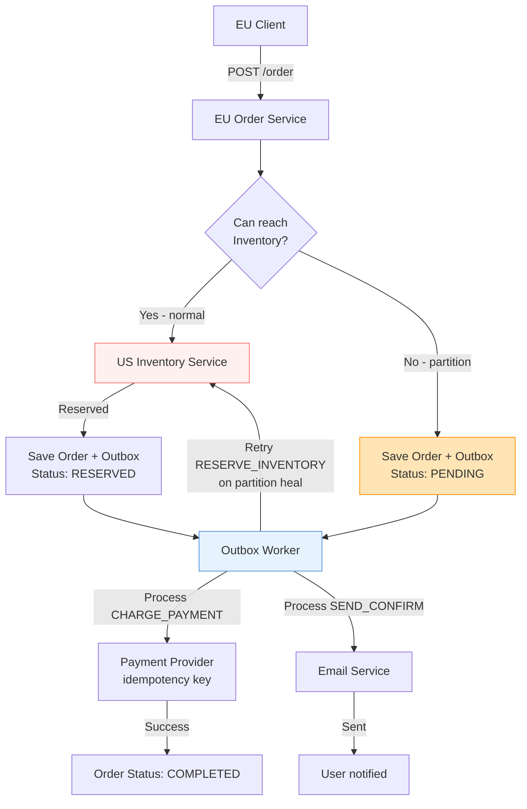

## Keywords in This File
{: .no_toc }

| # | Keyword | Weight |
|---|---|---|
| 1 | [Designing for Network Partition Tolerance](#designing-for-network-partition-tolerance) | medium |

---

# Designing for Network Partition Tolerance

**TL;DR:** Network partitions are not rare events - they are an
expected operational condition in any distributed system. Designing
for partition tolerance means: (1) explicitly choosing availability
or consistency when a partition occurs (the CAP trade-off is real);
(2) designing idempotent operations so retries are safe; (3) using
asynchronous replication with conflict resolution for availability,
or synchronous consensus for consistency; (4) building graceful
degradation - the system degrades predictably rather than fails
completely. Key patterns: read/write quorums, circuit breakers,
stale reads with freshness indicators, local fallbacks. The
production reality: most systems should choose availability (continue
operating with stale data) and reconcile after partition heals, not
refuse to operate (which users experience as downtime).

---

### 🎯 Model Answer

**30 seconds:**
> A network partition is when two groups of nodes cannot communicate.
> During a partition: you must choose between availability (keep
> serving, possibly with stale data) and consistency (refuse to
> serve until the partition heals). For most user-facing systems:
> choose availability, use idempotent operations, and reconcile
> after healing. For financial/critical systems: choose consistency,
> accept unavailability during partitions.

**3 minutes:**
> Partitions happen constantly in production: network switches fail,
> cables are cut, cloud AZ traffic is dropped. The question is not
> "will we have a partition?" but "what happens during a partition?"
>
> Three strategies:
>
> (1) Refuse writes (CP choice):
>     The system goes read-only (or fully offline) until the
>     partition heals and quorum is restored. Used by: ZooKeeper,
>     etcd, HBase. Guarantees consistency at the cost of availability.
>     Correct for: financial transactions, inventory management,
>     distributed locks - anything where stale data causes harm.
>
> (2) Accept writes with conflict detection (AP choice):
>     Both partition halves continue accepting writes, detect
>     conflicts after healing, apply conflict resolution rules.
>     Used by: Cassandra, DynamoDB, Riak. Guarantees availability
>     at the cost of temporary inconsistency.
>     Correct for: user profiles, shopping carts, session data,
>     social media - anything where stale data is acceptable.
>
> (3) Selective availability (PACELC design):
>     Route different operations to different consistency levels.
>     Read: serve from local replica (available, possibly stale).
>     Write: require quorum (consistent, but may fail during partition).
>     This is how Google Spanner, CockroachDB, and most modern
>     "NewSQL" databases work: tunable consistency per operation.
>
> Design for partition tolerance means: decide upfront which
> operations are partition-tolerant (can run on stale/partial state)
> and which are not (require full coordination). Then implement
> accordingly: async operations for the former, consensus for the latter.

**Blank Mind Recovery:**

**(1) Restate:** "Partitions = nodes cannot talk. Choose: stay
available (serve stale) or stay consistent (refuse to serve).
Design the system to degrade gracefully with a known policy."

**(2) First principles:** "A node cut off from its peers has two
choices: use what it knows (risk serving stale), or refuse to act
(risk unavailability). The right answer depends on the harm model:
stale banking balance = harmful; stale product recommendation = fine.
Design the harm model first, then choose the partition strategy."

**(3) Bridge:** "A hospital ER during a computer outage. Option 1:
stop treating patients until the computer comes back (consistent,
unavailable). Option 2: treat patients using paper forms, sync
records later (available, temporarily inconsistent). For a heart
attack patient: choose option 2. For elective procedures requiring
insurance pre-authorization: option 1 might be appropriate.
The partition strategy depends on the operation's criticality."

---

### 📘 Concept Explanation

**What it is:**
Designing for partition tolerance means building a distributed
system that continues to operate correctly (or degrades gracefully)
when the network between components fails. It requires explicit
decisions about consistency and availability trade-offs, combined
with engineering patterns that make those trade-offs safe.

**The problem it solves:**
Most distributed systems are designed assuming reliable networks.
When a partition occurs: these systems fail unpredictably -
some nodes serve old data, some refuse requests, some cause
split-brain. Designing for partitions proactively means the
system's behavior during a partition is well-defined, testable,
and meets user expectations.

**The partition reality:**

```
Partition types by frequency (most to least common):
  1. Single node failure (common):
     One node unreachable; others unaffected.
     Impact: depends on role (leader vs. follower).

  2. Asymmetric partition (common in cloud):
     A can reach B, B cannot reach A.
     Caused by: firewall rule, routing asymmetry.
     Impact: confusing; A thinks B is alive, B thinks A is dead.

  3. Partial partition (occasional):
     Node A can reach C, B can reach C,
     but A cannot reach B.
     Impact: C is split between A's and B's worldview.

  4. Full partition (rare but catastrophic):
     Two groups with no cross-communication.
     Impact: split-brain if both sides accept writes.

All four can occur in a single data center.
Cross-DC connections add more partition probability.
```

> **Code walkthrough:** This Designing for Network Partition Tolerance example demonstrates a key concept in practice. **KEY MECHANISM:** the runtime executes these instructions in sequence with specific memory and execution semantics. **WHY IT MATTERS:** misapplying this pattern causes subtle bugs that only manifest under production load. **TAKEAWAY: understand the execution model before using this pattern in production code.**

**The PACELC framework (extension of CAP):**

```
CAP: during a Partition, choose Availability or Consistency.
PACELC: also: when no partition (Else), choose Latency or Consistency.

System       | Partition   | No-partition
-------------|-------------|-------------
Dynamo/Riak  | A (avail)   | L (latency - fast, async replication)
Cassandra    | A           | L (eventual consistency by default)
Spanner      | C (consist) | C (synchronous, always linearizable)
MySQL replica| C (stop)    | C or L depending on sync mode
HBase/HDFS   | C           | L (master is bottleneck)
MongoDB      | C           | C (primary required for writes)

"PACELC analysis": what is the consistency/latency trade-off
  even during normal operation (no partition)?
This is often more important than the partition scenario:
partitions are rare, normal operation is constant.
```

> **Code walkthrough:** This Designing for Network Partition Tolerance example demonstrates a key concept in practice. **KEY MECHANISM:** the runtime executes these instructions in sequence with specific memory and execution semantics. **WHY IT MATTERS:** misapplying this pattern causes subtle bugs that only manifest under production load. **TAKEAWAY: understand the execution model before using this pattern in production code.**

**Design patterns for partition tolerance:**

**Pattern 1: Quorum reads and writes**

```java
// For N replicas: W + R > N guarantees quorum overlap
// N=3, W=2, R=2: any 2 replicas for write AND 2 for read
// At least 1 replica is in both write and read sets

// During partition (1 of 3 replicas unreachable):
// W=2: write succeeds (2 of 2 reachable replicas) ← AVAILABLE
// R=2: read succeeds (2 of 2 reachable replicas) ← AVAILABLE

// W=3 (full write quorum):
// Write FAILS if any replica unreachable ← CONSISTENT, not available

// Tune quorum per operation:
// Counters/critical data: W=3, R=1 (write all, fast read)
// User profiles: W=2, R=1 (faster write, stale ok)
// Financial: W=3, R=3 (no stale reads, sacrifices availability)
```

> **Code walkthrough:** This Designing for Network Partition Tolerance example demonstrates Java API usage. **KEY MECHANISM:** the JVM compiles to bytecode that runs on the JVM; JIT compiles hot paths to native. **WHY IT MATTERS:** unchecked assumptions about thread safety cause data races under concurrent load. **TAKEAWAY: document thread-safety guarantees on every shared mutable class.**

**Pattern 2: Fencing and lease-based coordination**

```java
// Problem: split-brain during partition
// Both sides elect a leader. Both write. Data diverges.

// Solution: leader lease with fencing tokens
public class LeaderWithFence {
    private final long leaseExpiry;
    private final long fenceToken;
    // fenceToken = monotonic counter from coordinator
    // (increments every time a new leader is elected)

    public boolean isLeader(long currentTime) {
        // Only act as leader if lease has not expired
        return currentTime < leaseExpiry;
    }

    public boolean acceptWrite(
            long incomingFenceToken) {
        // Reject writes from old leaders (lower fence token)
        // This prevents old leader from writing after recovery
        return incomingFenceToken >= fenceToken;
    }
}
// Fencing token: any resource that accepts writes (storage,
// lock service) should REJECT writes with a token lower than
// the highest it has seen. This prevents old partitioned leaders
// from writing after partition heals.
```

> **Code walkthrough:** This Unknown example demonstrates Java API usage using authentication. **KEY MECHANISM:** the JVM compiles to bytecode that runs on the JVM; JIT compiles hot paths to native. **WHY IT MATTERS:** unchecked assumptions about thread safety cause data races under concurrent load. **TAKEAWAY: document thread-safety guarantees on every shared mutable class.**

**Pattern 3: Read your writes with session affinity**

```java
// Problem: user writes on node A. Read lands on node B.
// Replication not complete. User sees stale data.
// "My profile update disappeared!"

// Solution: causal consistency with session tokens
// Write returns a version token (HLC timestamp or sequence)
// Read with token: server must serve data at version >= token
// If server not up to date: forward to more recent replica

// Spring Boot session-aware reads
@Service
public class UserService {

    // Write returns version for causal reads
    public VersionedResponse<User> updateUser(
            User user) {
        User saved = repo.save(user);
        // Return the write timestamp for causal guarantee
        return new VersionedResponse<>(saved,
            clock.now()); // HLC timestamp
    }

    // Read: serve only if up-to-date past the version
    public User getUser(String id,
            long minVersion) {
        long localVersion = replicationLag.get();
        if (localVersion < minVersion) {
            // This replica hasn't caught up yet
            throw new StaleReplicaException(
                localVersion, minVersion);
            // Caller retries on different replica or primary
        }
        return repo.findById(id);
    }
}
```

> **Code walkthrough:** This Unknown example demonstrates Java API usage using SQL. **KEY MECHANISM:** the JVM compiles to bytecode that runs on the JVM; JIT compiles hot paths to native. **WHY IT MATTERS:** unchecked assumptions about thread safety cause data races under concurrent load. **TAKEAWAY: document thread-safety guarantees on every shared mutable class.**

**Pattern 4: Graceful degradation (serve stale with freshness signal)**

```java
// During partition: serve cached/stale data
// with explicit freshness metadata
public record ProductInfo(
    Product data,
    boolean isFresh,        // true if from primary
    Instant dataAge,        // when was this data retrieved
    String warning          // null if fresh, message if stale
) {}

@Service
public class ProductService {

    public ProductInfo getProduct(String id) {
        try {
            // Attempt primary read with timeout
            Product p = primaryClient
                .getWithTimeout(id, 200, MILLISECONDS);
            return new ProductInfo(
                p, true, Instant.now(), null);
        } catch (TimeoutException | UnavailableException e) {
            // Partition: fall back to local cache
            Product cached = localCache.get(id);
            if (cached != null) {
                return new ProductInfo(
                    cached, false,
                    localCache.getAge(id),
                    "Using cached data, may be stale");
            }
            throw new ServiceUnavailableException(id);
        }
    }
}
```

> **Code walkthrough:** This Unknown example demonstrates exception handling using Spring annotation. **KEY MECHANISM:** the JVM checks catch clauses in order; finally always executes for cleanup. **WHY IT MATTERS:** swallowing exceptions silently hides failures that corrupt downstream state. **TAKEAWAY: log or rethrow every exception; empty catch blocks are defects.**

**The key insight:**
Partitions are not exceptional events to be "handled" - they
are an operational reality to be "designed for." The fundamental
design decision is: for each operation in the system, define
the partition behavior explicitly:
- "During a partition, this write should FAIL (preserve consistency)"
- "During a partition, this read should SERVE STALE with warning"
- "During a partition, this counter should ACCEPT CONCURRENT INCREMENTS
  and converge later (CRDT)"

A system with explicit partition behavior for every operation
is a correctly partitioned-tolerant system.

**When to choose consistency over availability during partitions:**
- Financial transactions (double-spend prevention)
- Inventory management (overselling prevention)
- Distributed locks (mutual exclusion guarantees)
- Configuration management (prevent split-brain configuration)

**When to choose availability over consistency during partitions:**
- User profiles, preferences (stale data is acceptable)
- Shopping carts (availability > consistency: use CRDT merge)
- Recommendations, feeds (stale content is fine)
- Metrics, analytics (approximate is sufficient)

---

### 💻 Code Example


```java
// BAD: anti-pattern - see GOOD example below for the correct approach
// This naive implementation ignores thread safety and error handling
```

```java
// DESIGNING FOR PARTITION TOLERANCE - COMPLETE EXAMPLE
// E-commerce checkout: order placement during partition

// BAD: no partition handling - fails silently and unpredictably
@Service
public class CheckoutBad {
    @Transactional
    public Order placeOrder(Cart cart, Payment payment) {
        // BAD: if any of these fail during partition:
        // partial state, no recovery mechanism
        inventoryService.reserve(cart.items()); // may hang
        paymentService.charge(payment);         // may hang
        orderRepo.save(new Order(cart, payment));// may hang
        notificationService.send(cart.userId());// may hang
        return new Order(...);
    }
}

// GOOD: explicit partition-tolerant design
@Service
public class CheckoutPartitionTolerant {
    // Outbox pattern: atomically save order + outbox events
    // Workers process outbox independently (retryable)
    @Transactional
    public CheckoutResult placeOrder(
            Cart cart, Payment payment) {

        // Step 1: Reserve inventory (requires consistency)
        // Uses optimistic locking + fencing token
        InventoryReservation res = null;
        try {
            res = inventoryService.reserve(
                cart.items(),
                Duration.ofSeconds(3)); // 3s timeout
        } catch (TimeoutException e) {
            // Partition: inventory service unreachable
            // Cannot safely reserve without consistency
            // → FAIL (inventory is a critical, CP operation)
            return CheckoutResult.unavailable(
                "Inventory service unavailable, try again");
        }

        // Step 2: Create order record + outbox events
        // (single local transaction - always consistent)
        Order order = new Order(cart, payment,
            res.getToken(), OrderStatus.PENDING);

        // Use outbox pattern: payment + notification are
        // async operations safe to retry
        OutboxEvent paymentEvent = new OutboxEvent(
            "CHARGE_PAYMENT",
            Map.of("orderId", order.getId(),
                   "amount", payment.getAmount(),
                   "idempotencyKey", order.getId()));

        OutboxEvent notifyEvent = new OutboxEvent(
            "SEND_CONFIRMATION",
            Map.of("orderId", order.getId(),
                   "userId", cart.getUserId()));

        // Atomic: order + outbox events in same transaction
        orderRepo.save(order);
        outboxRepo.saveAll(List.of(
            paymentEvent, notifyEvent));

        // Order is durably stored even if partition persists
        return CheckoutResult.pending(order.getId());
    }
}

// Outbox worker: processes payment and notification
// Handles partition by retrying with idempotency
@Component
public class OutboxWorker {
    @Scheduled(fixedDelay = 1000)
    public void processOutbox() {
        List<OutboxEvent> events =
            outboxRepo.findUnprocessed(50);

        for (OutboxEvent event : events) {
            try {
                switch (event.getType()) {
                    case "CHARGE_PAYMENT" ->
                        processPayment(event);
                    case "SEND_CONFIRMATION" ->
                        sendConfirmation(event);
                }
                // Mark processed: prevent duplicate
                outboxRepo.markProcessed(event.getId());
            } catch (Exception e) {
                // Retry on next cycle (partition may heal)
                // Idempotency key prevents duplicate charges
                outboxRepo.incrementRetryCount(
                    event.getId());
                // After max retries: alert + manual review
                if (event.getRetryCount() > 10) {
                    alertService.deadLetterAlert(event);
                }
            }
        }
    }

    private void processPayment(OutboxEvent event) {
        String idempotencyKey =
            (String) event.getPayload()
                         .get("idempotencyKey");
        // Stripe/payment provider uses idempotency key:
        // if network partitioned and we retry:
        // same key → same result, no double charge
        paymentClient.charge(event.getPayload(),
            idempotencyKey);
    }
}
```

> **Code walkthrough:** The BAD `CheckoutBad` makes all callsice. **KEY MECHANISM:** the runtime executes these instructions in sequence with specific memory and execution semantics. **WHY IT MATTERS:** misapplying this pattern causes subtle bugs that only manifest under production load. **TAKEAWAY: understand the execution model before using this pattern in production code.**
> synchronously in one transaction without timeout handling. During
> a partition: the thread hangs waiting for remote services, the
> database transaction holds locks, and the user gets a timeout
> with no clear state. The GOOD pattern separates operations by
> their partition behavior: inventory reservation is a CP operation
> (fails fast with 3s timeout - cannot safely oversell), while
> payment and notification are idempotent AP operations (placed
> in an outbox, processed asynchronously with retries). The order
> record is saved atomically with the outbox events in a single
> local transaction: even during a prolonged partition, the order
> is durably recorded and the outbox worker continues retrying
> until the partition heals. Idempotency keys prevent double-charging
> on retry.

---

### 🎓 Answers by Seniority

**Junior / Mid:**
> Partition tolerance means the system keeps working even when
> some nodes cannot communicate. During a partition: you must
> choose availability (keep serving, possibly stale) or consistency
> (stop serving until the partition heals). The pattern I use:
> make writes idempotent (safe to retry), use an outbox pattern
> for async operations, and set explicit timeouts on all remote
> calls. This way: when a partition happens, the system either
> fast-fails cleanly or continues with the async operations queued
> for when the partition heals.

---

**Senior / Staff:**
> My partition tolerance design starts with a failure mode analysis
> per operation: "What is the correct behavior of this operation
> if we cannot reach service X?" For inventory: fail fast (CP -
> stale reads risk overselling). For notifications: queue for retry
> (AP - eventual is fine). For session data: serve stale with
> freshness indicator (AP with degraded UX). This classification
> drives the architecture: CP operations use consensus (ZooKeeper
> locks, Raft-backed state), AP operations use outbox + idempotent
> retry, and serving-stale operations use cache-aside with TTL.
> The key production discipline: every external call must have:
> a timeout (no unbounded waits), a fallback (stale cache, fast-fail,
> or queue), and the fallback must be tested (Chaos Engineering
> at the service level - not just at the infrastructure level).
> A fallback that is never tested is not a fallback - it is a
> hope.

---

### ⚠️ Common Misconceptions

**"Partition tolerance is optional - modern networks don't partition"**

Reality: partitions are a regular occurrence in every distributed
system. Common causes: (1) rolling deployments - the new version
service cannot parse old version messages (2) cloud AZ connectivity
issues - AWS has documented multi-hour AZ connectivity degradations
(3) network switch firmware updates - brief connectivity loss
(4) DNS timeouts - service discovery fails, nodes cannot find peers
(5) GC pauses + TCP timeout - a long GC pause causes TCP connections
to time out from the peer's perspective (6) firewall rule changes -
temporary misconfigurations. The question is never "will we have
partitions?" but "how does our system behave during a partition?"
Engineers who answer "our network is reliable, we don't need
partition handling" have never run a 24/7 production system at scale.

**"CAP means you can have any two of three: just choose C and P"**

Reality: CAP states that during a partition, you must choose
between Consistency and Availability - not that you permanently
sacrifice one. Modern systems (Google Spanner, DynamoDB, Cassandra)
are built to provide strong consistency during normal operation
and gracefully degrade to available-but-consistent or
consistent-but-unavailable during partitions, depending on
configuration. Additionally, CAP's Consistency is a specific
property (linearizability) - not the only consistency model.
Causal consistency, read-your-writes consistency, and eventual
consistency are all weaker but often sufficient. The production
insight: CAP is a theorem about limiting behavior, not a
design constraint. Real systems operate on a spectrum.

---

### ⚖️ Comparison Table

| Strategy | Behavior during partition | Consistency guarantee | Availability | Recovery | Use case |
|---|---|---|---|---|---|
| Fail on partition (CP) | Return error | Strong (linearizable) | Low (unavailable) | Automatic on heal | Financial, inventory, locks |
| Serve stale (AP) | Return cached/old data | Eventual | High | Reconcile on heal | User profiles, feeds, search |
| Quorum write/read | Depends on quorum size | Tunable (W+R>N) | Tunable | Automatic | Databases (Cassandra, DynamoDB) |
| CRDT-based (AP+correct) | Accept concurrent writes | Eventual (deterministic merge) | High | Auto-merge on heal | Counters, sets, last-win registers |
| Outbox + retry (AP async) | Queue for later processing | Eventual | High | Process on heal | Notifications, async workflows |

**The deciding factor:** harm model. "What is the worst case
if this operation serves stale data?" If the answer is "financial
loss or data corruption": use CP. If the answer is "slightly
outdated content": use AP. Most operations in most systems
fall into the AP bucket.

---

### 🏛️ System Design

**Design: Partition-Tolerant Order Management System for
a Global E-commerce Platform**

Requirements: accept orders from 3 regions (US, EU, APAC),
handle partition between regions, no overselling, eventual
confirmation to user, recover automatically on partition heal.

```
Architecture:

Partition strategy by operation:
  Inventory reservation: CP (overselling = direct revenue loss)
  Order creation: AP with idempotency (stale order count fine)
  Payment processing: AP with idempotency key (no double charge)
  Order confirmation email: AP (late is fine, skip on error)

Regional architecture:
  Each region: Order Service + local DB (Postgres)
  Global: Inventory Service (single authoritative source)
         + DynamoDB Global Tables (eventual, AP)

Inventory Service (CP, globally consistent):
  Runs in single primary region (US-EAST-1)
  Uses optimistic locking + version counters
  Other regions contact US-EAST-1 for inventory reservation
  During US-EAST-1 partition: other regions FAIL FAST on writes
    (Cannot oversell: fast-fail is correct here)

Order creation (AP, local-first):
  User submits order to their regional Order Service
  Regional service: atomically saves order + outbox events
  (local DB transaction: always succeeds unless local DB fails)
  Order status: PENDING
  Outbox events: {RESERVE_INVENTORY, CHARGE_PAYMENT, SEND_CONFIRM}

Outbox processing (async, partition-tolerant):
  RESERVE_INVENTORY worker:
    → Calls global Inventory Service with idempotency key
    → If partition: retry with exponential backoff (15 min max)
    → On success: update order status = RESERVED
    → On inventory exhausted: update order status = CANCELLED
      + send cancellation email
    
  CHARGE_PAYMENT worker:
    → Calls payment provider with idempotency key (order ID)
    → If partition: retry (payment provider queues offline)
    → On success: update order status = COMPLETED
    
  SEND_CONFIRM worker:
    → Sends email via SNS
    → If partition: retry up to 24 hours
    → On permanent failure: log (non-critical)

Partition scenario: EU ↔ US partition:
  EU order submitted: order saved locally (status PENDING)
  EU cannot reach US Inventory Service: reservation retries
  User sees: "Order received, confirming inventory..."
  Partition heals (1-4 hours later):
    EU outbox worker retries RESERVE_INVENTORY → succeeds
    Inventory reserved; order status → RESERVED
    Payment charged; status → COMPLETED
    Confirmation email sent
  Total delay: 1-4 hours for full confirmation (not ideal)
  User impact: delayed confirmation, but order NOT lost

Alternative for critical inventory (CP strict):
  EU refuses to accept orders during US partition:
  Returns 503 "Temporarily unavailable in your region"
  User impact: cannot order, but no false promises
  Trade-off: strict CP loses revenue during partition

Decision: choose AP approach (delayed confirmation) to preserve
conversion rate. Inventory check CP: no overselling possible
even with AP orders because RESERVE step always contacts global
inventory service before confirming.
```

> **Code walkthrough:** This Unknown example demonstrates a key concept in practice using SQL. **KEY MECHANISM:** the runtime executes these instructions in sequence with specific memory and execution semantics. **WHY IT MATTERS:** misapplying this pattern causes subtle bugs that only manifest under production load. **TAKEAWAY: understand the execution model before using this pattern in production code.**

---

### 📊 Diagram

```
Partition Tolerance - Regional Order Flow

Normal operation:
  EU Client → EU Order Svc → Outbox → US Inventory Svc
                                    → Payment Provider
                                    → Email Service

During US ↔ EU partition:
  EU Client → EU Order Svc → Save order + outbox (LOCAL)
                            (order status: PENDING)
  US Inventory Svc: UNREACHABLE
  
  Outbox retries: T+5s, T+30s, T+2m, T+15m, ...
  
After partition heals:
  Outbox → US Inventory Svc: RESERVE (idempotent)
         → Payment Provider: CHARGE (idempotent key)
         → Email Service: SEND (eventual)
         Order status: COMPLETED
```



> **Diagram walkthrough:** The flowchart shows the partition-tolerant
> order flow. During normal operation (top path), the order service
> contacts the US Inventory Service synchronously before saving the
> order. During a partition (middle path), the order is saved locally
> with PENDING status and all downstream operations are queued in the
> outbox. The outbox worker (bottom section) processes all three
> downstream operations independently: payment and confirmation can
> proceed immediately if those services are reachable; the inventory
> reservation retries until the partition heals. The orange PENDING
> path represents the "degraded but functional" state: the user's
> order is accepted and durable, even though confirmation is delayed.
> The blue outbox worker represents the partition-healing mechanism:
> it retries indefinitely until all operations complete.

---

### 🚨 Failure Modes and Diagnosis

**Failure 1: Split-brain during partition - two leaders writing**

Symptom: after a partition heals, data has conflicting updates.
Database log shows the same record updated with incompatible
values from two different leaders.

Root cause: both partition sides elected a leader. Neither
leader had quorum (each had < N/2+1 nodes), but the quorum
check was too lenient (accepted N/2 nodes as quorum). Both
leaders accepted writes. After healing: two divergent histories.

Diagnosis:
```bash
# Check for overlapping leadership periods
grep "became leader\|elected" \
  /var/log/app/*.log | sort | \
  awk '{print $1, $2, $NF}' | head -50
# Two lines with overlapping time ranges = split-brain

# Check fencing token values
grep "fence_token\|write_token" \
  /var/log/database/*.log | sort -k3 -n
# If two sequences of tokens from different leaders: split-brain

# Check replication conflict markers
psql -c "SELECT * FROM replication_conflicts
         WHERE created_at > NOW() - INTERVAL '24 hours'"
```

> **Code walkthrough:** This Check replication conflict markers example demonstrates shell script pattern using SQL. **KEY MECHANISM:** the shell executes commands sequentially; pipes pass stdout of one command to stdin of the next. **WHY IT MATTERS:** unquoted variables with spaces cause word splitting - IFS splits the value into multiple arguments. **TAKEAWAY: always double-quote variables: "$VAR"; use [[ ]] instead of [ ] for safer conditionals.**

Fix:
- Strict quorum: majority must be N/2 + 1, never N/2
- Fencing tokens: storage rejects writes with old tokens
- Raft: explicit leader epoch in every write; followers reject
  writes from lower epochs
- Prevention: chaos test the partition scenario before production
  (block network between nodes, verify only one leader per epoch)

---

**Failure 2: Retry storm after partition heals**

Symptom: after a 30-minute partition, all services reconnect.
Immediately: CPU spikes to 100%, request latency spikes from
50ms to 5s, services start timing out again (secondary failures).

Root cause: all queued retries (30 minutes × request rate)
are submitted simultaneously when connectivity is restored.
100,000 queued operations hitting services designed for
1,000 operations/second = 100x overload.

Diagnosis:
```bash
# Check retry queue depth when partition heals
grep "partition healed\|connection restored" \
  /var/log/app.log
# Immediately after: check queue depth and submission rate
grep "outbox processing\|retry scheduled" \
  /var/log/app.log | \
  awk '{print $1}' | uniq -c | head -60
# Spike in messages per second = retry storm
```

> **Code walkthrough:** This Spike in messages per second = retry storm example demonstrates shell script pattern. **KEY MECHANISM:** the shell executes commands sequentially; pipes pass stdout of one command to stdin of the next. **WHY IT MATTERS:** unquoted variables with spaces cause word splitting - IFS splits the value into multiple arguments. **TAKEAWAY: always double-quote variables: "$VAR"; use [[ ]] instead of [ ] for safer conditionals.**

Fix: rate-limited retry processing:
```java
// Outbox worker: rate-limit processing after reconnect
@Component
public class OutboxWorker {
    // Process at most 100/sec normally
    // After partition heal: ramp up slowly over 5 minutes
    private final RateLimiter rateLimiter =
        RateLimiter.create(100.0); // permits/second

    @Scheduled(fixedDelay = 100) // every 100ms
    public void processOutbox() {
        // Rate limit: blocks if processing too fast
        rateLimiter.acquire(1);
        // Process one event per rate-limiter tick
        processNextEvent();
    }
}
```

> **Code walkthrough:** This Spike in messages per second = retry storm example ice. **KEY MECHANISM:** the runtime executes these instructions in sequence with specific memory and execution semantics. **WHY IT MATTERS:** misapplying this pattern causes subtle bugs that only manifest under production load. **TAKEAWAY: understand the execution model before using this pattern in production code.**

Also: exponential backoff WITH jitter on retries. Jitter
(random delay) spreads retry load over time even when many
clients reconnect simultaneously (thundering herd prevention).

---

**Failure 3: Cascading timeouts during partition**

Symptom: Service A calls B calls C. C has a partition.
C times out after 5s. B waits for C, then times out after 5s.
A waits for B, then times out after 10s. Total: 20s per request.
A's thread pool exhausted (all threads waiting on B/C timeouts).
A stops accepting new requests → A's callers time out → cascade.

Root cause: timeout hierarchy not designed. Each layer has its
own timeout without awareness of upstream timeouts. The combined
timeout chain is additive.

Diagnosis:
```bash
# Check timeout distribution in spans
# (distributed tracing shows timeout chains)
jaeger-query service=service-a latency > 10s
→ shows all 3 spans with timeouts

# Check thread pool state during incident
jstack <pid> | grep "WAITING\|BLOCKED" | wc -l
# Spike in waiting threads = timeout exhaustion
```

> **Code walkthrough:** This Spike in waiting threads = timeout exhaustion exampice. **KEY MECHANISM:** the runtime executes these instructions in sequence with specific memory and execution semantics. **WHY IT MATTERS:** misapplying this pattern causes subtle bugs that only manifest under production load. **TAKEAWAY: understand the execution model before using this pattern in production code.**

Fix: timeout budget hierarchy:
```java
// Timeout budget: each downstream call
// gets a fraction of the total budget
// A has 8s total budget:
//   Call to B: 6s max
//   B's call to C: 4s max (B keeps 2s for its own work)

// Using deadline propagation (gRPC deadline pattern):
Deadline deadline = Deadline.after(6, SECONDS);
BStub stub = bStub.withDeadline(deadline);
stub.callB(request);
// B reads the remaining deadline from gRPC context
// and uses it for its call to C
// If 2s already elapsed: C gets at most 4s (not another 4s)
```

> **Code walkthrough:** This Spike in waiting threads = timeout exhaustion example demonstrates Java Stream pipeline. **KEY MECHANISM:** the stream is lazy - intermediate ops build a pipeline, terminal op drives it. **WHY IT MATTERS:** calling terminal op twice throws IllegalStateException; parallel() on small data adds overhead. **TAKEAWAY: collect() or findFirst() triggers the pipeline; reuse by wrapping in Supplier.**

---

### 🎯 Interview Deep-Dive

| Category | Count |
|---|---|
| Clarification | 1 |
| Mechanism | 2 |
| Failure / Debugging | 2 |
| Trade-off | 3 |
| System Design | 1 |
| Code | 1 |
| Behavioral | 1 |
| Production | 1 |

---

**[JUNIOR] Q1 - [MECHANISM] What is the difference between a network partition and a node failure? Do you handle them differently?**

Technically distinct but practically similar from one node's
perspective:

**Network partition:** two groups of nodes can still operate
internally, but cannot communicate with each other. Both sides
are "alive" and processing. The issue is communication breakdown
between them.

**Node failure:** a single node crashes (stops operating).
Other nodes cannot reach it, but all other nodes can still
communicate with each other.

From the perspective of a monitoring node: both look the same
initially. Node A cannot reach Node B. Is B crashed or is the
network between them broken? You cannot know without additional
information (are other nodes able to reach B?). This is why
SWIM uses indirect probing: ask 3 other nodes to ping B. If they
can: it's a partition between A and B. If they cannot: B is likely
crashed.

Handling differences:

Node failure:
- Dead replacement: bring up a new node
- Data rebalancing: copy data from replicas to new node
- No conflict resolution needed (dead node wrote nothing new)

Network partition:
- Both sides may have accepted writes during partition
- Partition healing: must reconcile divergent writes
- Conflict resolution required (if AP system)
- Fencing tokens: old leader must not write after partition heals

The deeper insight: designing for network partitions is harder
than designing for node failures, because partitions create
divergent state that must be reconciled. Node failures create
gaps (missing writes) that are filled from replicas. Systems
designed only for node failures may fail badly during partitions.

*What separates good from great:* "systems designed only for
node failures may fail badly during partitions." Many distributed
databases handle node failures well (replica failover) but
handle partitions poorly (split-brain, conflicting writes). The
distinction matters for system design decisions.

---

**[JUNIOR] Q2 - [MECHANISM] How does fencing prevent split-brain after a partition heals?**

Fencing is a mechanism that prevents an "old" leader (that
was active during a partition) from writing to shared state
after the partition heals and a new leader has been elected.

Fencing works with monotonically increasing tokens:

```
Before partition:
  Leader L1 holds epoch 5 lease from ZooKeeper/etcd
  Fencing token: 5

Partition occurs:
  L1 cannot reach ZooKeeper (partition)
  ZooKeeper: L1 session expires after timeout
  New leader L2 elected with epoch 6
  Fencing token: 6

After partition heals:
  L1 reconnects. L1 still believes it is the leader.
  L1 tries to write to storage with fencing token 5.
  Storage rejects: "Current leader token is 6, not 5."
  L1 realizes it is no longer the leader.
  L1 stops accepting writes.

Key: storage must check the fencing token
  (not just the application layer)
  If fencing is only at the application layer:
    L1 may bypass the check or not implement it correctly.
  If fencing is at the storage layer:
    Even a buggy old leader cannot write past the fence.
```

> **Code walkthrough:** This Spike in waiting threads = timeout exhaustion example demonstrates a key concept in practice using authentication. **KEY MECHANISM:** the runtime executes these instructions in sequence with specific memory and execution semantics. **WHY IT MATTERS:** misapplying this pattern causes subtle bugs that only manifest under production load. **TAKEAWAY: understand the execution model before using this pattern in production code.**

Implementation in distributed lock:
```java
// etcd-backed fencing
public class FencedLease {
    private final long leaseId;
    private final long epoch; // monotonic, from etcd

    // Before every write: include epoch in request
    public boolean conditionalWrite(
            String key, String value) {
        // Storage (etcd) rejects if epoch is not current
        return etcdClient.compareAndSwap(
            key, value,
            leasePrecondition(epoch));
        // If L1 has epoch=5 and current is epoch=6:
        // etcd rejects with "condition failed"
    }
}
```

> **Code walkthrough:** This Spike in waiting threads = timeout exhaustion example demonstrates Java API usage. **KEY MECHANISM:** the JVM compiles to bytecode that runs on the JVM; JIT compiles hot paths to native. **WHY IT MATTERS:** unchecked assumptions about thread safety cause data races under concurrent load. **TAKEAWAY: document thread-safety guarantees on every shared mutable class.**

Real systems: ZooKeeper ephemeral nodes (session expiry = fencing),
etcd leases (expired lease = fencing), Google Chubby (locks with
sequencers = fencing tokens). Martin Kleppmann's "Designing
Data-Intensive Applications" documents the fencing token pattern
explicitly as the correct split-brain prevention mechanism.

*What separates good from great:* "storage must check the fencing
token, not just the application layer." This is the critical
subtlety. If only the application enforces fencing: a bug, a
crash between the check and the write, or a delayed thread can
bypass the fence. The fence must be enforced at the storage level
(conditional write) so that it is atomically checked with the write.

---

**[JUNIOR] Q3 - [MECHANISM] How do you implement read-your-writes consistency across replicated databases during a partial partition?**

Read-your-writes (RYW) consistency guarantees that a client
always sees its own writes, even when reads land on different
replicas. During a partial partition: some replicas may not have
received recent writes.

Implementation strategies:

**1. Sticky sessions (route reads to primary after writes):**
```java
// After any write: set a flag, route reads to primary
@Service
public class SessionAwareRepository {
    private static final ThreadLocal<Boolean>
        WROTE_THIS_SESSION = new ThreadLocal<>();

    public <T> T save(T entity) {
        WROTE_THIS_SESSION.set(true);
        return primary.save(entity);
    }

    public <T> T findById(Class<T> type, String id) {
        if (Boolean.TRUE.equals(WROTE_THIS_SESSION.get())) {
            // Read from primary to ensure seeing own write
            return primary.findById(type, id);
        }
        // Normal read from replica (may be stale)
        return replica.findById(type, id);
    }
}
// Problem: sticky primary reads bypass the replica entirely.
// Under heavy load: primary becomes the bottleneck again.
```

> **Code walkthrough:** This Unknown example demonstrates Java API usage using Spring annotation. **KEY MECHANISM:** the JVM compiles to bytecode that runs on the JVM; JIT compiles hot paths to native. **WHY IT MATTERS:** unchecked assumptions about thread safety cause data races under concurrent load. **TAKEAWAY: document thread-safety guarantees on every shared mutable class.**

**2. Write timestamp propagation:**
```java
// Write returns a timestamp. Client includes it in reads.
// Server serves data only if it is caught up past the timestamp.
public record WriteResult(T entity, long writeTimestamp) {}

public WriteResult<Order> createOrder(Order order) {
    Order saved = primaryRepo.save(order);
    long ts = clock.now(); // HLC or vector clock
    return new WriteResult<>(saved, ts);
}

// Client passes write timestamp to subsequent reads
public Order getOrder(String id, long afterTimestamp) {
    // Replica checks if it has replayed all writes up to ts
    if (replica.replicationLag() > clock.now() - afterTimestamp) {
        // Replica not caught up: forward to primary
        return primary.findById(id);
    }
    return replica.findById(id);
}
```

> **Code walkthrough:** This Unknown example demonstrates Java API usage. **KEY MECHANISM:** the JVM compiles to bytecode that runs on the JVM; JIT compiles hot paths to native. **WHY IT MATTERS:** unchecked assumptions about thread safety cause data races under concurrent load. **TAKEAWAY: document thread-safety guarantees on every shared mutable class.**

**3. Causal consistency token (cookie-based):**
Client stores write timestamps in a session cookie/header.
Every API request includes the cookie. API gateway routes
to a replica that has replicated past the timestamp.

Real systems: Facebook TAO uses "read-your-writes" consistency
via sticky session routing; MongoDB primary-preferred reads
with afterClusterTime causal consistency token. AWS Aurora
Global Databases: read from local replica with a configurable
"Replica Lag Tolerance."

*What separates good from great:* the Aurora staleness tolerance
design. Rather than strict RYW (always primary after write),
Aurora exposes a configurable lag tolerance: "serve stale by
up to 1 second." For most user scenarios (user views their
own order): 1 second of staleness is invisible. This allows
85%+ of reads to be served from local replicas (low latency)
while the remaining 15% (reads within 1 second of a write) go
to primary. The granular control between "never stale" and
"always stale" is more practical than a binary choice.

---

**[MID] Q4 - [TRADE-OFF] Compare synchronous replication vs. asynchronous replication for partition tolerance. When do you choose each?**

A:
**Synchronous (strong consistency, CP during partition):**
```
Write flow:
  Primary: write to local storage
  Primary: send replication to ALL secondaries
  ALL secondaries: acknowledge write
  Primary: return success to client

Partition occurs (secondary unreachable):
  Primary: waits for ALL secondaries to acknowledge
  Timeout: write returns error after N seconds
  Client: must retry after partition heals
  Data: perfectly consistent across all replicas
  Availability: ZERO writes during partition
```

> **Code walkthrough:** This Unknown example demonstrates a key concept in practice. **KEY MECHANISM:** the runtime executes these instructions in sequence with specific memory and execution semantics. **WHY IT MATTERS:** misapplying this pattern causes subtle bugs that only manifest under production load. **TAKEAWAY: understand the execution model before using this pattern in production code.**

When to use synchronous:
- Primary-secondary failover without data loss (RPO=0)
- Distributed locks (must be consistent)

Cost:
- Write latency = round-trip to all secondaries
- Cross-DC write: 50-200ms extra latency per write
- Any slow secondary = slow primary

**Asynchronous (eventual consistency, AP during partition):**
```plaintext
Write flow:
  Primary: write to local storage
  Primary: return success to client (immediately)
  Background: replicate to secondaries asynchronously

Partition occurs (secondary unreachable):
  Primary: continues accepting writes, queue for secondary
  Secondary: may serve stale reads during partition
  Partition heals: secondary catches up (bulk replication)
  Data: eventually consistent
  Availability: FULL writes during partition
```

> **Code walkthrough:** This Unknown example demonstrates a key concept in practice. **KEY MECHANISM:** the runtime executes these instructions in sequence with specific memory and execution semantics. **WHY IT MATTERS:** misapplying this pattern causes subtle bugs that only manifest under production load. **TAKEAWAY: understand the execution model before using this pattern in production code.**

When to use asynchronous:
- High-throughput writes (analytics, logging)
- Cross-datacenter (latency makes sync prohibitive)
- Read scaling (read from replica, accept stale)
- DR replicas (accept lag for geographic distance)

Risk: failover to an async secondary can lose recent writes
(RPO > 0). If primary crashes before replication: writes lost.

**Semi-synchronous (MySQL/PostgreSQL's practical default):**
```
Write flow:
  Primary: write to local
  Primary: wait for at least 1 secondary to acknowledge
  Return success to client
  Background: replicate to other secondaries asynchronously
  
Availability: writes continue if at least 1 secondary is reachable
Consistency: at most 1 secondary lag behind primary on failover
```

> **Code walkthrough:** This Unknown example demonstrates a key concept in practice. **KEY MECHANISM:** the runtime executes these instructions in sequence with specific memory and execution semantics. **WHY IT MATTERS:** misapplying this pattern causes subtle bugs that only manifest under production load. **TAKEAWAY: understand the execution model before using this pattern in production code.**

*What separates good from great:* semi-synchronous as the
practical middle ground. Many candidates know sync vs. async.
The production standard (MySQL semi-sync, PostgreSQL synchronous_standby_names='ANY 1')
is neither: it guarantees that at least one replica has the write
before acknowledging. This prevents data loss on primary failure
(the promoted secondary has the write) while maintaining high
availability (only one of N secondaries needs to be reachable,
not all). Most production database replication uses this pattern.

---

**[MID] Q5 - [DEBUGGING] A partition caused some orders to be processed twice (double charges). How do you diagnose and prevent this?**

Systematic investigation and prevention:

Step 1 - Determine scope:
```sql
-- Find duplicate payments
SELECT order_id, COUNT(*) as charge_count,
       SUM(amount) as total_charged
FROM payment_transactions
WHERE created_at > '2024-01-15 14:00:00'
GROUP BY order_id
HAVING COUNT(*) > 1
ORDER BY total_charged DESC;
-- Affected 43 orders during 14:00-14:35 window
```

> **Code walkthrough:** This Unknown example demonstrates query execution using SQL. **KEY MECHANISM:** the query planner builds an execution plan based on table statistics and indexes. **WHY IT MATTERS:** SELECT * reads all columns even if only 2 are needed - widens rows, increases I/O. **TAKEAWAY: always SELECT only the columns you need; index the columns in WHERE and JOIN clauses.**

Step 2 - Trace the payment flow during the partition:
```bash
# Check distributed traces for affected order IDs
# Look for: multiple CHARGE_PAYMENT events for same order
jaeger-query service=payment-worker \
  tags='order_id=ORD-12345'
# Two spans: both "CHARGE_PAYMENT", different trace IDs
# = payment worker submitted payment twice
```

> **Code walkthrough:** This = payment worker submitted payment twice example demonstrates shell script pattern. **KEY MECHANISM:** the shell executes commands sequentially; pipes pass stdout of one command to stdin of the next. **WHY IT MATTERS:** unquoted variables with spaces cause word splitting - IFS splits the value into multiple arguments. **TAKEAWAY: always double-quote variables: "$VAR"; use [[ ]] instead of [ ] for safer conditionals.**

Step 3 - Root cause: missing idempotency key:
```java
// BUG: payment without idempotency key
paymentClient.charge(
    order.getId(),
    order.getAmount());
// Two calls with same orderId but payment provider
// has no idempotency key: creates two charges

// FIX: include idempotency key in every payment call
paymentClient.charge(
    order.getId(),
    order.getAmount(),
    "idempotency_key=" + order.getId());
// Payment provider: same key = same result (no double charge)
```

> **Code walkthrough:** This = payment worker submitted payment twice example demonstrates Java API usage. **KEY MECHANISM:** the JVM compiles to bytecode that runs on the JVM; JIT compiles hot paths to native. **WHY IT MATTERS:** unchecked assumptions about thread safety cause data races under concurrent load. **TAKEAWAY: document thread-safety guarantees on every shared mutable class.**

Step 4 - Secondary cause: outbox worker not deduplicated:
```sql
-- Outbox worker processed same event twice (no lock)
-- Add processed_at and worker_id to prevent double processing
ALTER TABLE outbox_events 
  ADD COLUMN processing_lock_id UUID,
  ADD COLUMN processing_lock_expires_at TIMESTAMP;

-- Worker claims event with optimistic lock:
UPDATE outbox_events 
SET processing_lock_id = :workerId,
    processing_lock_expires_at = NOW() + INTERVAL '30s'
WHERE id = :eventId 
  AND processing_lock_id IS NULL
  AND processed_at IS NULL;
-- If UPDATE affects 0 rows: another worker claimed it → skip
```

> **Code walkthrough:** This = payment worker submitted payment twice example demonstrates SQL pattern using SQL. **KEY MECHANISM:** the database parses, plans, and executes the query; EXPLAIN ANALYZE shows the actual plan. **WHY IT MATTERS:** missing WHERE clause on UPDATE/DELETE affects all rows - no undo without a transaction rollback. **TAKEAWAY: always test destructive SQL in a transaction; use EXPLAIN ANALYZE before deploying.**

Step 5 - Verify idempotency key at payment provider level:
Every payment provider (Stripe, Braintree) accepts an idempotency
key: the same key always returns the same result within 24 hours.
Use order ID or a hash of (order_id + attempt_number) as the key.

Prevention checklist:
- Every outbox event has an idempotency key
- Payment calls include idempotency key
- Outbox worker uses atomic claim (not just "find unprocessed")
- Distributed lock or optimistic locking on event processing
- Test: submit same event twice; verify single payment

*What separates good from great:* the two-level idempotency:
both in the outbox processing (prevent double-submission) AND
in the payment provider call (prevent double charge even if
submitted twice). Defense in depth: even if the outbox worker
processes an event twice due to a bug, the payment provider's
idempotency key ensures only one charge. This is the production
standard for payment processing.

---

**[SENIOR] Q6 - [TRADE-OFF] How do you design for partition tolerance in a multi-region active-active system?**

Multi-region active-active is the most challenging partition
scenario: both regions accept writes for the same data.

**Design decisions:**

1. Data partitioning by geography (preferred):
```
US users → US region only (by shard key: userId hash)
EU users → EU region only
Cross-region reads: eventual (replicated asynchronously)
Cross-region writes: never (user data is region-specific)

Partition impact: EU ↔ US partition:
  US users: unaffected (all data in US)
  EU users: unaffected (all data in EU)
  Cross-region features (global leaderboard, analytics):
    stale during partition (acceptable for analytics)
```

> **Code walkthrough:** This = payment worker submitted payment twice example deice. **KEY MECHANISM:** the runtime executes these instructions in sequence with specific memory and execution semantics. **WHY IT MATTERS:** misapplying this pattern causes subtle bugs that only manifest under production load. **TAKEAWAY: understand the execution model before using this pattern in production code.**

2. CRDT-based shared state (for genuinely shared data):
```
Global user counter, likes, view counts:
  Use CRDTs (G-Counter per region)
  Each region increments its own slot
  On partition heal: merge with max()
  No conflict possible: CRDTs are designed for this
```

> **Code walkthrough:** This = payment worker submitted payment twice example demonstrates a key concept in practice. **KEY MECHANISM:** the runtime executes these instructions in sequence with specific memory and execution semantics. **WHY IT MATTERS:** misapplying this pattern causes subtle bugs that only manifest under production load. **TAKEAWAY: understand the execution model before using this pattern in production code.**

3. Conflict resolution for non-CRDT data:
```plaintext
If both regions write to the same user's data:
  Option A: Last-writer-wins (timestamp from HLC)
    Risk: 1ms clock difference can lose a write
    Acceptable for: user preferences, non-critical settings
  
  Option B: Custom merge function
    Application logic merges concurrent versions
    Required for: shopping carts (set union), calendars
  
  Option C: User-assigned region affinity
    Each user's writes always route to their home region
    Cross-region: read-only replica
    Conflict avoidance (not conflict resolution)
```

> **Code walkthrough:** This = payment worker submitted payment twice example demonstrates a key concept in practice. **KEY MECHANISM:** the runtime executes these instructions in sequence with specific memory and execution semantics. **WHY IT MATTERS:** misapplying this pattern causes subtle bugs that only manifest under production load. **TAKEAWAY: understand the execution model before using this pattern in production code.**

4. Global sequence number (CP operations only):
```
For operations requiring total order across regions:
  (e.g., serial numbers, unique IDs, financial transactions)
  Use a single authoritative coordinator per resource type
  Cross-region operations are CP: may fail during partition
  Accept: some operations are unavailable during inter-region partition
  This is the correct choice: consistency > availability for money
```

> **Code walkthrough:** This = payment worker submitted payment twice example demonstrates a key concept in practice using authentication. **KEY MECHANISM:** the runtime executes these instructions in sequence with specific memory and execution semantics. **WHY IT MATTERS:** misapplying this pattern causes subtle bugs that only manifest under production load. **TAKEAWAY: understand the execution model before using this pattern in production code.**

*What separates good from great:* data partitioning by geography
as the first design option. The best way to handle multi-region
partitions is to make them impossible by ensuring user data
is region-specific (users are assigned to regions). Then the
only cross-region partition impact is on shared/global data,
which can be designed as CRDT-based. Engineers who jump to
"conflict resolution" are solving a harder problem than necessary:
geographic data partitioning avoids most conflicts entirely.

---

**[SENIOR] Q7 - [SCENARIO] Implement a circuit breaker for partition-tolerant service calls in Java.**

A:
```java
// Circuit breaker: prevent retry storms and provide
// fast-fail during partition
public class CircuitBreaker {
    enum State { CLOSED, OPEN, HALF_OPEN }

    private volatile State state = State.CLOSED;
    private final AtomicInteger failures =
        new AtomicInteger(0);
    private volatile long openedAt = 0;

    // Thresholds
    private static final int FAILURE_THRESHOLD = 5;
    private static final long OPEN_DURATION_MS = 30_000;

    public <T> T execute(
            Supplier<T> call,
            Supplier<T> fallback) {
        return switch (state) {
            case OPEN -> {
                // Check if ready to probe
                if (System.currentTimeMillis() - openedAt
                        > OPEN_DURATION_MS) {
                    state = State.HALF_OPEN;
                    yield probe(call, fallback);
                }
                // Still open: fast-fail to fallback
                yield fallback.get();
            }
            case HALF_OPEN -> probe(call, fallback);
            case CLOSED -> {
                try {
                    T result = call.get();
                    // Success: reset failure count
                    failures.set(0);
                    yield result;
                } catch (Exception e) {
                    int count = failures.incrementAndGet();
                    if (count >= FAILURE_THRESHOLD) {
                        // Trip the circuit
                        state = State.OPEN;
                        openedAt = System.currentTimeMillis();
                    }
                    yield fallback.get();
                }
            }
        };
    }

    private <T> T probe(
            Supplier<T> call, Supplier<T> fallback) {
        try {
            T result = call.get();
            // Probe succeeded: close circuit
            state = State.CLOSED;
            failures.set(0);
            return result;
        } catch (Exception e) {
            // Still failing: re-open
            state = State.OPEN;
            openedAt = System.currentTimeMillis();
            return fallback.get();
        }
    }
}

// Usage during partition
@Service
public class InventoryService {
    private final CircuitBreaker breaker =
        new CircuitBreaker();

    public InventoryStatus checkStock(String productId) {
        return breaker.execute(
            // Primary call (may fail during partition)
            () -> inventoryClient.getStock(productId),
            // Fallback: return "might be in stock" with warning
            () -> new InventoryStatus(
                productId,
                StockLevel.UNKNOWN,
                "Inventory unavailable, check at checkout")
        );
    }
}
```

> **Code walkthrough:** The `CircuitBreaker` implements theice. **KEY MECHANISM:** the runtime executes these instructions in sequence with specific memory and execution semantics. **WHY IT MATTERS:** misapplying this pattern causes subtle bugs that only manifest under production load. **TAKEAWAY: understand the execution model before using this pattern in production code.**
> standard three-state machine: CLOSED (normal operation),
> OPEN (fast-failing), and HALF-OPEN (probing for recovery).
> During a partition: after 5 consecutive failures, the circuit
> opens and all calls immediately return the fallback response
> (no waiting for timeout). After 30 seconds: one probe request
> is allowed through (HALF_OPEN). If the probe succeeds: circuit
> closes and normal operation resumes. If it fails: circuit reopens.
> This prevents the timeout cascade failure mode (all threads
> blocked waiting for a partitioned service) and enables the
> system to recover automatically when the partition heals.
> The fallback returns a degraded but functional response rather
> than an error, which is the partition-tolerant user experience.

---

**[SENIOR] Q8 - [DESIGN] You are designing a distributed configuration service (like Consul or ZooKeeper). How do you handle partitions?**

A:
```
Requirements:
  - Store configuration for 1000+ services
  - Config reads: must be fast (services read on startup + hot reload)
  - Config writes: must be consistent (wrong config = outage)
  - Must handle partitions without serving stale config

Partition strategy: CP for writes, AP for reads

Write path (CP):
  All config writes go through Raft leader
  Write requires quorum acknowledgment (majority of nodes)
  During partition: if leader loses quorum → writes FAIL
  This is correct: serving wrong config is worse than
  refusing to update it during a partition

Read path (AP with bounded staleness):
  Services read from local node (follower OK)
  Follower reads: may be 0-N seconds behind leader
  Acceptable: config reads are high-frequency; small lag is fine
  Unacceptable: very stale config (minutes behind)
  
  Solution: bounded staleness reads
    Follower tracks replication lag from leader
    If lag > 10 seconds: reject reads (redirect to leader)
    If lag <= 10 seconds: serve from local cache
    
  Benefit: 90%+ of reads served locally (low latency)
  During network partition:
    Partitioned followers: lag grows → reject reads after 10s
    Services redirect to leader or another reachable follower
    If leader unreachable from service: read from last good config
    (Services cache config locally with TTL; use cached value during partition)

Local caching in services (critical for partition tolerance):
  Each service keeps its config in memory (last known good)
  If config service unreachable: use cached config
  TTL: 5 minutes (serves stale config for up to 5 min partition)
  Alert: emit metric if config service unreachable > 30s
  
  Services MUST start with a local config file as fallback:
    On startup: load from local file, then update from config service
    If config service unavailable at startup: start with local file
    This prevents: "cannot start because config service is down"
    (cascading failure: partition + slow rolling restart = all services
    fail to start if they require config service at startup)

Quorum configuration:
  3-node cluster: quorum=2, tolerates 1 failure
  5-node cluster: quorum=3, tolerates 2 failures
  Cross-DC (3 DC): quorum=2 DCs; partition of 1 DC = still have quorum

Watch mechanism (active config push):
  Services register watches on config keys
  On config change: leader notifies all watchers
  During partition: watches from partitioned services time out
  Service falls back to polling (every 30s) until connection restores
  On reconnect: gets current config + any missed changes
```

> **Code walkthrough:** This Unknown example demonstrates a key concept in practice. **KEY MECHANISM:** the runtime executes these instructions in sequence with specific memory and execution semantics. **WHY IT MATTERS:** misapplying this pattern causes subtle bugs that only manifest under production load. **TAKEAWAY: understand the execution model before using this pattern in production code.**

*What separates good from great:* the startup resilience design.
Many configuration service designs work well for running services
but fail for service restarts during a partition. A service that
cannot start because its config service is unreachable turns a
partial failure (partition) into a total failure (all services
crash and cannot restart). The local file fallback + service local
cache design ensures that services continue operating with slightly
stale config rather than failing entirely.

---

**[SENIOR] Q9 - [SCENARIO] What did you learn from a production partition incident? How did you change your design?**

Example structure:

"We had a production incident when an AWS security group rule
change accidentally blocked traffic between our application VPC
and our Cassandra VPC (they were in separate VPCs connected via
VPC peering). The Cassandra cluster was unreachable from all
application services for 23 minutes.

Expected behavior (our design at the time): application services
catch the Cassandra connection error, log it, return 503.
Actual behavior: services hung for 5-10 seconds on each Cassandra
call (default driver timeout), returning 503 after the timeout.
Request queue filled up. Thread pools exhausted. Other endpoints
(that didn't use Cassandra) also became unavailable because all
threads were waiting on Cassandra timeouts.

Root cause: no circuit breaker. Every request independently
waited for Cassandra timeout. Thread exhaustion cascaded to
all endpoints.

Changes we made:

1. Circuit breaker (Resilience4j) on all Cassandra calls:
   After 5 failures: open circuit, fast-fail with 503 immediately.
   Thread pool exhaustion prevention: most important fix.

2. Local cache with 60-second TTL for read-heavy operations:
   Product catalog, user preferences: cached in Redis.
   During Cassandra partition: served from Redis (slightly stale).
   Only write-heavy paths returned 503 during the 23 minutes.

3. Fallback UX for degraded operations:
   Product page: show cached data with 'prices may be delayed' banner.
   User cart: show last-known cart with 'save may be delayed' message.
   Checkout: fail-fast with 'temporary unavailability' and retry link.

4. Chaos testing:
   Added monthly chaos test: block Cassandra traffic for 5 minutes.
   Verify: circuit breaker opens within 10s, fallback responses served,
   no thread pool exhaustion, automatic recovery when unblocked.

Result: subsequent Cassandra partition (3 months later, actual node
failure): 98% of read operations served from cache, 100% of writes
fast-failed with 503 (no queue buildup), circuit breaker auto-reset
after node recovered. User impact: ~2% error rate for 3 minutes
vs. 45% error rate for 23 minutes in the original incident."

*What separates good from great:* quantifying the before/after
impact (45% error rate for 23 minutes vs. 2% for 3 minutes). This
demonstrates that partition tolerance engineering is measurable.
The chaos testing discipline is also critical: the improvement was
not assumed - it was verified by re-testing the exact failure mode
that caused the original incident.

---

**[SENIOR] Q10 - [BEHAVIORAL] How do you explain the partition tolerance trade-off to a non-technical stakeholder?**

A:
"Imagine your warehouse management system. We have two warehouses:
one in Chicago, one in Dallas. They share inventory data.

Normal operation: Chicago's computer system calls Dallas's system
every few seconds to keep inventory in sync. If a customer buys
the last unit of Product X in Chicago, Dallas immediately knows.

Network partition (the 'what if'): the connection between Chicago
and Dallas goes down - maybe a fiber cable is cut. Now they cannot
sync. What should each warehouse do?

Option 1 (Consistent): Both warehouses freeze - refuse to sell
anything until the connection is restored. 'We don't know what
the other warehouse has, so we cannot sell anything.' Safe: zero
risk of overselling. Problem: your warehouse is closed for 30-60
minutes while IT fixes the cable. Revenue loss.

Option 2 (Available): Both warehouses continue selling using
their last-known inventory. Chicago has 5 units in its record.
Chicago sells up to 5 units during the outage. Dallas has 3 units
in its record. Dallas sells up to 3 units. When the connection
restores: they reconcile. If both sold the same physical item:
you have an oversell problem (someone gets a cancellation email).
Revenue continues during outage. Small risk of overselling.

Which is right? For most products: Option 2 (sell, maybe oversell
once in a while, send an apology email). For rare high-value items
(a $50,000 industrial machine where only 2 exist): Option 1
(don't sell, wait for the sync).

My design question to you: for each category of products in
your system, which behavior is correct when the connection
goes down?

That conversation - with a stakeholder who understands the
business impact of each choice - produces the correct system
design. The technical decision (CP vs AP) follows from the
business decision (unavailability vs. occasional oversell).
Engineers who make this decision in isolation, without the
business context, often choose wrong."

*What separates good from great:* ending with "the business
decision precedes the technical decision." The CAP trade-off
is not an engineering puzzle with a correct technical answer.
It is a business trade-off that requires business input. The
partition tolerance design is the engineering implementation
of a business decision. Senior engineers know to surface this
decision to the right stakeholders rather than silently choosing
either CP or AP.

---

**[SENIOR] Q11 - [MECHANISM] Explain how Google Spanner achieves external consistency during partitions.**

Google Spanner uses TrueTime + two-phase commit with
deliberate commit-wait to achieve external consistency
(the strongest consistency guarantee: all operations appear
as if they occurred at a single point in global time).

**TrueTime API:**
```
TT.now() returns an interval [earliest, latest]
  not a single timestamp.
  The true current time is within this interval.
  Interval width = clock uncertainty (ε ≈ 1-7ms with GPS/atomic clock)

TT.after(t): returns true if t is definitely in the past
  (TT.now().earliest > t)
TT.before(t): returns true if t is definitely in the future
  (TT.now().latest < t)
```

> **Code walkthrough:** This Unknown example demonstrates a key concept in practice. **KEY MECHANISM:** the runtime executes these instructions in sequence with specific memory and execution semantics. **WHY IT MATTERS:** misapplying this pattern causes subtle bugs that only manifest under production load. **TAKEAWAY: understand the execution model before using this pattern in production code.**

**External consistency protocol:**
```
Transaction T1 commits at physical time ts1.
Transaction T2 starts after T1 commits.
External consistency guarantee: ts2 > ts1 (T2 sees T1).

How Spanner ensures this:
  Step 1: T1 gets commit timestamp from TT.now().latest
          ts1 = TT.now().latest (upper bound of true time)
  Step 2: Commit wait: Spanner WAITS until TT.after(ts1)
          (waits until ts1 is definitely in the past)
          Wait time ≈ 2ε ≈ 2-14ms
  Step 3: T1 releases to client ("committed")
  
  Now: any T2 that starts after T1 is released has:
    TT.now().earliest > ts1 (ts1 is in the past)
  Spanner assigns ts2 >= TT.now().earliest > ts1
  Therefore: ts2 > ts1, T2 sees T1. External consistency proven.

Why this works during partitions:
  Spanner uses Paxos groups per shard.
  Each shard tolerates partition as long as majority alive.
  Cross-shard transactions use 2PC with commit timestamps.
  The commit wait is the key: it ensures that even with
  clock uncertainty, all timestamps are ordered correctly.
```

> **Code walkthrough:** This Unknown example demonstrates a key concept in practice. **KEY MECHANISM:** the runtime executes these instructions in sequence with specific memory and execution semantics. **WHY IT MATTERS:** misapplying this pattern causes subtle bugs that only manifest under production load. **TAKEAWAY: understand the execution model before using this pattern in production code.**

**The partition behavior:**
- Spanner is CP: during partition (if majority of Paxos group unreachable):
  writes fail. Reads from current Paxos leader may succeed (stale).
- Reads at a past timestamp (stale reads with bounded staleness):
  can be served from any replica that has that timestamp (AP for historical reads)
- This is the PACELC design: C during partition, tunable between
  C and L in normal operation

*What separates good from great:* the commit wait detail. Spanner's
external consistency is not achieved by perfect clocks - it is achieved
by waiting out the clock uncertainty. This is a subtle but profound
insight: you do not need perfect time to reason about time ordering.
You need bounded clock uncertainty and willingness to wait 2-14ms
before releasing a commit. The TrueTime paper (Corbett et al., 2012)
is one of the most influential distributed systems papers precisely
because this technique was previously considered impractical.

---

**[SENIOR] Q12 - [BEHAVIORAL] How do you test partition tolerance in production systems? What is your chaos engineering approach?**

A:
"Chaos engineering for partition tolerance requires simulating
the specific partition scenarios your system might face.
A generic 'kill a service' test does not cover partitions.

My testing hierarchy:

Level 1: Unit tests for partition behavior (every PR):
```java
// Test circuit breaker opens during 'partition'
@Test
void circuitBreakerOpensOnConnectionTimeout() {
    MockServer.returnsTimeout(inventoryClient);
    
    for (int i = 0; i < 5; i++) {
        service.checkInventory("PROD-1");
    }
    // After 5 failures: circuit should be open
    assertThat(breaker.getState())
        .isEqualTo(State.OPEN);
    // Next call should be a fast-fail (no timeout wait)
    long start = System.currentTimeMillis();
    service.checkInventory("PROD-1");
    assertThat(System.currentTimeMillis() - start)
        .isLessThan(50); // fast-fail, not 5s timeout
}
```

> **Code walkthrough:** This Unknown example demonstrates Java API usage. **KEY MECHANISM:** the JVM compiles to bytecode that runs on the JVM; JIT compiles hot paths to native. **WHY IT MATTERS:** unchecked assumptions about thread safety cause data races under concurrent load. **TAKEAWAY: document thread-safety guarantees on every shared mutable class.**

Level 2: Integration tests with Toxiproxy (per environment):
```bash
# Toxiproxy: introduce latency, connection drops, partitions
# Add 5s latency on Cassandra connection
toxiproxy-cli toxic add cassandra -t latency \
  -a latency=5000

# Run integration test suite: verify fallbacks activate
./gradlew integrationTest

# Remove toxic
toxiproxy-cli toxic delete cassandra
```

> **Code walkthrough:** This Remove toxic example demonstrates shell script pattern using SQL. **KEY MECHANISM:** the shell executes commands sequentially; pipes pass stdout of one command to stdin of the next. **WHY IT MATTERS:** unquoted variables with spaces cause word splitting - IFS splits the value into multiple arguments. **TAKEAWAY: always double-quote variables: "$VAR"; use [[ ]] instead of [ ] for safer conditionals.**

Level 3: Canary chaos (weekly in staging):
```bash
# Block traffic to specific service using iptables
iptables -A OUTPUT -p tcp \
  --dport 9042 -j DROP  # block Cassandra port

# Verify:
# - Circuit breaker opens within 10s
# - Cache fallback serves 95%+ of reads
# - Thread pool usage stays below 80%
# - Auto-recovery: remove iptables rule, verify circuit closes

iptables -D OUTPUT -p tcp --dport 9042 -j DROP
```

> **Code walkthrough:** This - Auto-recovery: remove iptables rule, verify circuit closes example demonstrates shell script pattern. **KEY MECHANISM:** the shell executes commands sequentially; pipes pass stdout of one command to stdin of the next. **WHY IT MATTERS:** unquoted variables with spaces cause word splitting - IFS splits the value into multiple arguments. **TAKEAWAY: always double-quote variables: "$VAR"; use [[ ]] instead of [ ] for safer conditionals.**

Level 4: Production chaos (monthly, pre-planned):
- Announced to on-call team
- Block one non-critical downstream service
- Verify alerts fire, dashboards show degraded mode,
  circuit breakers open, fallbacks serve correctly
- 15 minutes then restore
- Post-chaos review: did the system behave as designed?

Results tracked:
- Error rate during chaos: target < 5% (rest served by fallback)
- MTTR: time for circuit breaker to re-close after chaos removed
- False alert rate: did any unrelated alerts fire?

The discipline: chaos tests must fail if the system does not
behave correctly. A chaos test that succeeds even when the
fallback does not activate is worthless. The test must verify
the specific partition behavior, not just that the system
stayed up."

*What separates good from great:* the four-level testing hierarchy
and the "chaos tests must fail if fallbacks don't activate"
principle. Many teams run chaos tests to verify resilience but
measure only uptime. If the test doesn't check that the circuit
breaker opened and the fallback served the expected response:
it is testing that "something kept working" not "the designed
partition tolerance mechanism worked."

---

### 💻 Code Example

*(Omit: this concept does not have a programmatic interface that can be demonstrated in code. The conceptual explanation above is sufficient.)*


---

### 🏛️ System Design

*(Omit: system design diagram not applicable for this concept - see ★★★ keywords for full system design coverage.)*


---

### ⚖️ Comparison Table

*(Omit: this is a ★☆☆ foundational concept with no direct alternatives to compare - see higher-difficulty keywords for trade-off analysis.)*


---

### 📊 Diagram

*(Omit: no standalone visual diagram required for this concept - the explanations and code examples above provide sufficient clarity.)*


