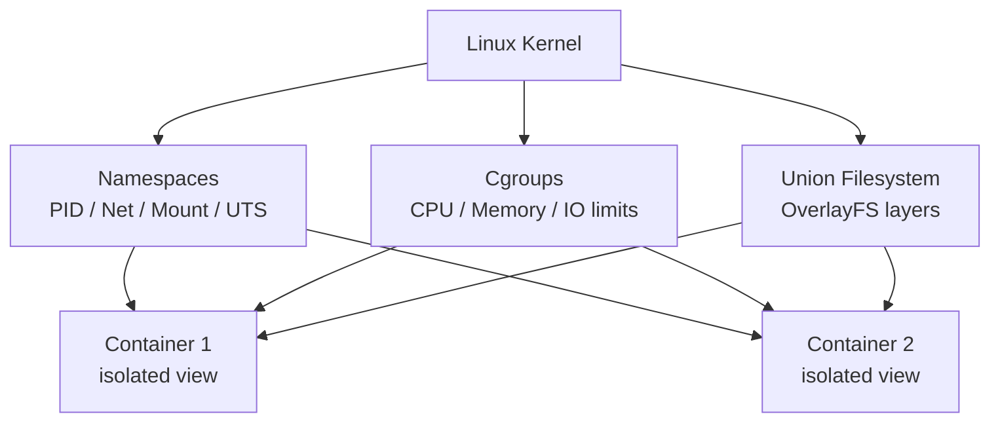
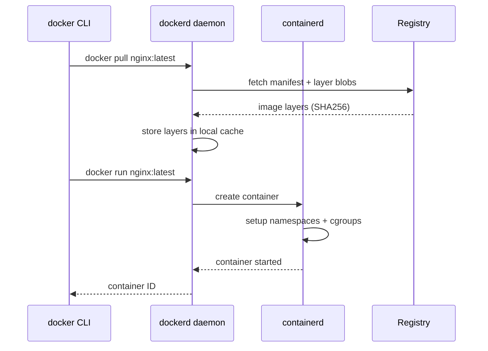
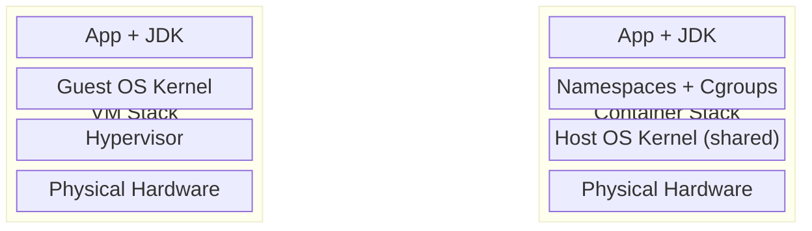
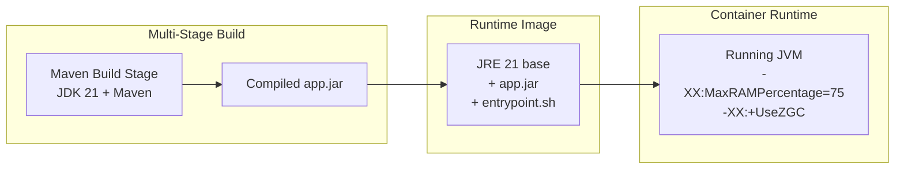

## Keywords in This File
{: .no_toc }

| # | Keyword | Weight |
|---|---|---|
| 1 | [Containerization Overview](#containerization-overview) | high |
| 2 | [Docker Ecosystem and Architecture](#docker-ecosystem-and-architecture) | high |
| 3 | [Containers vs Virtual Machines](#containers-vs-virtual-machines) | critical |
| 4 | [Container Use Cases for Java Backend](#container-use-cases-for-java-backend) | high |

---

# Containerization Overview

**Interview Weight:** high - The foundational vocabulary question.
Interviewers ask this to gauge mental model depth. A weak answer
recites a definition; a strong answer explains WHY it was invented
and what trade-off it makes.

---

### 🎯 Model Answer

**30 seconds:**

> Containerization packages an application with its complete runtime
> environment - code, JDK, libraries, and config - into a portable
> unit. This solves the "works on my machine" problem by making the
> environment part of the deliverable. Containers share the host OS
> kernel, so they start in milliseconds and use far less memory than
> virtual machines while still providing process-level isolation.

**3 minutes (Senior):**

> Before containers, deploying Java applications meant configuring
> the right JDK version, system libraries, and environment variables
> on every server. Things broke when ops patched a library your app
> depended on. The root cause was that the environment was separate
> from the application - you deployed code but not the environment
> that code was tested against.
>
> Containerization makes the environment part of the artifact. The
> container image is what you test in CI, and that identical image
> goes through staging and production. Under the hood, three Linux
> kernel primitives enable this: namespaces give each container an
> isolated view of processes, filesystem, and network; cgroups limit
> how much CPU and memory each container can consume; and a union
> filesystem like OverlayFS stores images as stacked read-only layers
> with a thin writable layer added when the container runs.
>
> The key insight for interviews: containers share the host kernel.
> They are NOT virtual machines. A Spring Boot app that takes minutes
> to provision on a VM takes seconds in a container. The trade-off
> is isolation - a kernel exploit escapes all containers on that host,
> which is why regulated environments often run containers inside VMs.

**Framework:** WHAT -> WHY -> HOW -> TRADE-OFF -> EXAMPLE

*Adapting up:* Senior adds the isolation trade-off and when to layer
containers inside VMs for compliance requirements.

*Adapting down:* Junior: "Containers package the app and its
environment together so it runs the same everywhere."

**Blank Mind Recovery:**

**(1) Restate:** "So you are asking about containerization - let me
think through what problem that solves."

**(2) First principles:** "From first principles, deploying software
requires matching the app to its runtime environment. The only ways
to do this are: configure every server identically, ship a full VM,
or package the environment with the app..."

**(3) Bridge:** "This reminds me of JAR files - you package the
Java code with its dependencies. Containerization extends that idea
to the entire OS user-space."

---

### 📘 Concept Explanation

**What it is:**
Containerization is a method of packaging an application and its
dependencies into a self-contained unit (container) that runs
consistently on any host with a compatible container runtime.

**The problem it solves:**
Environment drift caused deployment failures. The same application
behaved differently across developer machines, CI servers, staging,
and production because each had slightly different library versions,
JDK builds, and OS configuration. Every deployment carried hidden
risk from invisible environment differences.

**How it works:**
Three Linux kernel features combine to create containers:

```
+-- Linux Kernel Features -------+
|  Namespaces: per-container     |
|    PID, network, mount, UTS   |
|  Cgroups: resource limits      |
|    CPU, memory, disk I/O      |
|  Union FS: layered images      |
|    Layer 1: base OS           |
|    Layer 2: JDK               |
|    Layer 3: app               |
|    Writable: container data   |
+--------------------------------+
```



> **Diagram walkthrough:** The Linux kernel provides three independent
> primitives. Namespaces give each container its own process tree,
> network stack, and filesystem view - the container cannot see other
> containers' processes. Cgroups enforce resource limits so one
> container cannot starve another of CPU or memory. The union
> filesystem stores images as read-only layers that are shared across
> containers, with only a thin writable layer per container instance.

**The key insight:**
Containers share the host OS kernel. They are NOT virtual machines.
This is why they are lightweight and fast - but also why their
isolation boundary is the kernel, not hardware.

**When to use it:**
- Reproducible builds across dev/CI/staging/prod environments
- Microservice deployment with independent versioning
- CI pipelines where build isolation prevents test pollution
- Horizontal scaling where identical copies of a service run in parallel

**When NOT to use it:**
- Applications requiring Windows-specific APIs on a Linux host
- Workloads needing true kernel-level isolation (use VMs instead)
- Simple scripts that run once with no dependency concerns

**Alternatives:**
- Virtual Machines - full OS isolation, heavier, slower startup
- OS packages + config management - reproducible but not portable
- Fat JARs - packages Java dependencies, not the whole runtime

**First-principles derivation:**
Given that software depends on specific runtime versions and OS
libraries, the only options are: (A) standardize all servers by
policy - fails at scale, (B) ship the entire OS as a VM - too heavy,
(C) virtualize only the user-space and share the kernel - this is
containers. Option C hits the right trade-off between isolation
and overhead for most workloads.

---

### 💻 Code Example

**Example 1: Running your first container**

```bash
# Pull and run an image from Docker Hub
docker run hello-world

# Run an interactive Ubuntu shell
docker run -it ubuntu:22.04 bash

# Run in detached mode (background)
docker run -d --name myapp -p 8080:8080 \
    openjdk:21-slim java -jar app.jar
```

> **Code walkthrough:** `docker run` is the fundamental operation -
> pull image if missing, create a container, start it. The `-p 8080:8080`
> flag maps host port to container port. `-d` runs detached so the
> container keeps running after the command returns. This illustrates
> that running a container is as fast as starting a process.

**Example 2: Inspecting running containers**

```bash
# List running containers
docker ps

# List all containers (including stopped)
docker ps -a

# Show resource usage (CPU, memory, net I/O)
docker stats myapp

# See container logs
docker logs -f myapp

# Execute a command inside a running container
docker exec -it myapp /bin/sh
```

> **Code walkthrough:** These commands reveal the container's lifecycle
> and runtime state. `docker stats` shows cgroup-enforced resource
> usage in real time. `docker exec` is essential for debugging -
> it opens a shell inside the isolated namespace of the running
> container so you see exactly what the app sees.

---

### 🎓 Answers by Seniority

**Junior / Mid (0-5 years):**

> Containerization is packaging an application with its runtime -
> the JDK, libraries, and config - so it runs the same everywhere.
> Docker is the main tool. You write a Dockerfile that describes
> what goes in the image, build it, and run it anywhere.

*Push deeper:* Add: "The key benefit is that the image I test in CI
is the exact same image that runs in production - no environment drift."

---

**Senior / Staff (5+ years):**

> Containerization solves environment consistency by packaging the
> app and its runtime as an immutable artifact. The three Linux
> primitives behind it are namespaces for isolation, cgroups for
> resource limits, and a union filesystem for layered images.

The senior answer adds trade-off awareness: containers share the
kernel, so they trade some isolation for speed. For compliance
requirements or multi-tenant hostile workloads, you layer containers
inside VMs to get both. At the staff level, you frame containerization
as the foundation for a deployment platform - the image becomes the
deployment unit across all environments, enabling blue-green and
canary releases trivially.

*Push deeper:* "The image digest is the immutable identity of a
deployment. If you record the digest in your deploy pipeline, you
can always reproduce exactly what ran in production - even years later."

---

### ❓ Questions You Will Be Asked

#### Definition
- "What is containerization and why does it exist?"
- "How would you explain containers to a developer who has never
  used them?"

🗣️ "Containerization is packaging an application with its entire
runtime environment - the JDK, OS libraries, and configuration -
so that environment drift cannot cause deployment failures. Before
containers, the same code would behave differently on different
machines because each machine had slightly different libraries.
With containers, the image is the artifact you test and ship,
so what runs in production is identical to what passed CI."

#### Mechanism
- "How do containers achieve isolation without a hypervisor?"
- "What Linux kernel features enable containerization?"

🗣️ "Containers use three Linux kernel features. Namespaces give each
container its own isolated view of processes, network, and filesystem
- the container cannot see other containers' processes. Cgroups
enforce resource limits so one container cannot take all the CPU
or memory. And a union filesystem stores images as stacked read-only
layers with a thin writable layer per container. The result is
strong isolation with near-zero overhead because there is no
hypervisor - the host kernel manages it all directly."

#### Comparison
- "When would you use containers instead of running the app directly
  on the server?"
- "What does containerization give you that a JAR file does not?"

🗣️ "A JAR packages Java dependencies but still depends on the JDK
version and OS libraries on the host. A container packages the JDK
itself and all OS-level dependencies. Running directly on a server
means one misconfigured library version breaks all apps on that
server. Containers give environment isolation, reproducibility,
and the ability to scale by simply starting more identical copies."

#### Scenario
- "Your team deploys to three environments but keeps seeing
  'it works in dev but fails in prod' failures. How would you fix this?"
- "You need to run two services on the same host that require
  different JDK versions. How do you solve this?"

🗣️ "For the environment consistency problem, I would containerize
both the app and its test suite so CI runs inside the same image
that deploys to production. The key is building once and promoting
the same image through environments - never rebuilding for staging
or prod. For different JDK versions on the same host, containers
solve this cleanly: each container has its own JDK layer, completely
isolated from other containers on the same host."

#### Debugging
- "A container crashes immediately after starting - how do you
  investigate?"
- "Your containerized app runs fine locally but fails on the CI
  server. Walk me through your diagnosis."

🗣️ "For an immediately crashing container, I start with docker logs
to get the application output and stderr. If there is no output,
I check the container exit code with docker inspect - a code of 137
means OOMKilled, 1 is usually an application error. I then run
docker run -it with the same image but override the entrypoint to
bash so I can inspect the filesystem and manually run the start
command. For a CI vs local discrepancy, I compare the image digests
and environment variables - usually it is an env var that exists
locally but not in CI, or a volume mount that hides a missing file."

#### Deep Dive
- "What are the security implications of containers sharing the
  host kernel?"
- "Explain the container image layer model. How does it affect
  build speed and image size?"

🗣️ "The shared kernel boundary means that a kernel exploit -
a privilege escalation vulnerability - can potentially escape a
container and gain host root access. This is a real risk and why
you should run containers as non-root users, use read-only
filesystems, and apply seccomp profiles. For multi-tenant hostile
workloads - like running customer-uploaded code - you need
microVMs like Firecracker or gVisor which provide a stronger
isolation boundary. For the layer model: each Dockerfile instruction
creates a new layer. Layers are cached by the daemon, so if only
your app JAR changes, Docker reuses the JDK layer from cache and
only uploads the changed layer to the registry. This makes builds
fast and registry storage efficient. The implication for Dockerfile
design is that you put rarely-changing layers at the top."

| Interviewer Type | Emphasis |
|---|---|
| Technical Panel | Lead with the three Linux primitives. |
| Hiring Manager | Lead with the "identical image from CI to prod" story. |
| Bar Raiser | Lead with the kernel-sharing trade-off and when VMs still win. |
| Peer Engineer | "The thing I always come back to is building the image once..." |

---
---

# Docker Ecosystem and Architecture

**Interview Weight:** high - Asked to verify whether you understand
Docker as a platform (daemon + CLI + runtime + registry) or just
as a "docker run" command. Interviewers use this to distinguish
operators from practitioners.

---

### 🎯 Model Answer

**30 seconds:**

> Docker is a client-server platform. The Docker CLI is a thin
> client that sends commands to the Docker daemon over a REST API.
> The daemon manages images, containers, networks, and volumes
> using containerd as its container runtime. Images are stored in
> registries - Docker Hub is the default, but any OCI-compliant
> registry works. You write Dockerfiles to define images, build
> them, push them to a registry, and pull and run them anywhere.

**3 minutes (Senior):**

> The Docker architecture separates concerns across four layers.
> The CLI (docker) is a thin REST client - it converts your commands
> into API calls to the daemon socket. The daemon (dockerd) is the
> server that handles orchestration: it resolves image names, pulls
> layers from the registry, manages container lifecycle, and sets up
> networking and volumes. The daemon delegates actual container
> execution to containerd, which uses runc (the OCI reference
> runtime) to set up namespaces and cgroups and launch the process.
>
> This layering matters in practice. Because the CLI talks to the
> daemon via a socket, you can point your CLI at a remote daemon -
> which is how build farms and remote development environments work.
> The daemon caches image layers locally, so pulling an image the
> second time is instant for layers already present.
>
> Registries are content-addressed: every image version has a SHA256
> digest. Pulling by tag is convenient but mutable - the same tag
> can point to a different image after a push. Pinning by digest
> (image@sha256:abc123) guarantees reproducibility, which matters
> for production pipelines.

**Framework:** WHAT -> WHY -> HOW -> TRADE-OFF -> EXAMPLE

*Adapting up:* Staff adds governance angle - why your pipeline
should pin by digest, not tag, for production promotions.

*Adapting down:* Junior: "Docker has a daemon that does the work
and a CLI you use to talk to it. Images live in a registry."

**Blank Mind Recovery:**

**(1) Restate:** "You are asking about how Docker is built
internally - let me think through the components."

**(2) First principles:** "Any client-server tool needs a server
to do the work, a client to send commands, and storage for
artifacts. Docker follows that pattern exactly..."

**(3) Bridge:** "This is similar to how git works - git CLI talks
to a local repository, which can push to a remote origin. Docker
CLI talks to a local daemon, which can push to a remote registry."

---

### 📘 Concept Explanation

**What it is:**
Docker is a platform for building, shipping, and running containers.
It consists of the Docker CLI, the Docker daemon (dockerd), the
containerd runtime, and a registry for storing images.

**The problem it solves:**
Before Docker standardized the workflow, building and running
containers required deep kernel knowledge. Docker wrapped Linux
namespaces and cgroups in a developer-friendly API and a standard
image format (now OCI), making containers accessible to every
developer without requiring systems programming expertise.

**How it works:**

```
+-- Docker Architecture --------+
|  CLI (docker)                  |
|    | REST API                 |
|  Daemon (dockerd)              |
|    | gRPC                     |
|  containerd                    |
|    | OCI spec                 |
|  runc (process launcher)       |
|                                |
|  Registry (Hub/ECR/GCR)        |
|    images (layer blobs)        |
+--------------------------------+
```



> **Diagram walkthrough:** The CLI sends a pull request to the daemon,
> which fetches the manifest (metadata describing layers) and the
> layer blobs from the registry. Layers are cached locally by digest.
> On `docker run`, the daemon tells containerd to create the container,
> which sets up namespaces and cgroups and starts the process. The
> daemon returns the container ID to the CLI. Every step is decoupled,
> allowing the daemon to be remote and the runtime to be swappable.

**The key insight:**
The docker CLI is stateless - it is just a REST client. All state
lives in the daemon. This architecture enables remote Docker
contexts (develop against a cloud daemon) and CI scenarios where
multiple CLI invocations share a daemon cache.

**When to use it:**
Docker is the standard tool for local container development, CI
image building, and single-host container deployments. Use
Docker Compose for multi-container development environments.

**When NOT to use it:**
Docker daemon runs as root by default, which is a security concern
in multi-tenant environments. For rootless containers, use Podman.
For large-scale production orchestration, the runtime is Kubernetes
(which uses containerd directly, not dockerd).

**Alternatives:**
- Podman - daemon-less, rootless, drop-in Docker CLI replacement
- nerdctl + containerd - direct containerd client with Docker UX
- Buildah - dedicated image builder without a runtime daemon

**First-principles derivation:**
Container operations (build, run, push, pull) involve state management
(image layers, container metadata, network config). Putting all state
in a daemon ensures consistency - two CLI calls see the same state.
The client-server split also enables the daemon to run as root (for
kernel operations) while the CLI runs as a regular user.

---

### 💻 Code Example

**Example 1: Docker client-server interaction**

```bash
# Show daemon info (confirms daemon is running)
docker info

# See daemon version and API version
docker version

# Point CLI at a remote daemon (remote context)
docker context create remote \
    --docker "host=ssh://user@remote-host"
docker context use remote
docker ps  # now runs against remote host
```

> **Code walkthrough:** `docker info` confirms the daemon is
> responding and shows its configuration. `docker version` shows
> both the CLI version and the daemon's API version - these can
> differ, and a version mismatch causes API errors. The context
> commands show the client-server split: you can point the same
> CLI at different daemons without changing any commands.

**Example 2: Image registry lifecycle**

```bash
# Pull by tag (mutable - tag can be overwritten)
docker pull nginx:latest

# Pull by digest (immutable - guaranteed reproducibility)
docker pull nginx@sha256:abc123def456...

# Tag and push to your registry
docker tag myapp:latest registry.example.com/myapp:1.0.0

docker push registry.example.com/myapp:1.0.0

# List local image cache
docker images
docker image ls --format "{{.Repository}}:{{.Tag}}"
```

> **Code walkthrough:** Pulling by tag is convenient but not
> reproducible - `nginx:latest` today might be a different image
> tomorrow. Pulling by digest guarantees you get the exact image
> you tested. In production pipelines, the build step should record
> the digest of the built image, and the deploy step should pull
> by that digest, not by tag. The `docker tag` command does not
> copy the image - it creates a new name pointing to the same layers.

---

### 🎓 Answers by Seniority

**Junior / Mid (0-5 years):**

> Docker has a CLI that you type commands into and a daemon that
> runs in the background and does the actual work. The daemon manages
> images and containers. Images are stored in registries like Docker
> Hub. You write a Dockerfile, build an image, and run containers
> from it.

*Push deeper:* Add: "The CLI is just a REST client to the daemon.
That is why you can have the daemon on a remote server and still
use your local docker CLI to control it."

---

**Senior / Staff (5+ years):**

> Docker is a client-server platform with four layers: the CLI as
> a REST client, the daemon for orchestration, containerd as the
> OCI runtime, and a registry for image storage. The daemon handles
> caching, networking, and volume management.

The senior adds production concerns: in Kubernetes environments,
Docker daemon is not used - Kubernetes talks to containerd directly.
Knowing this prevents the common confusion when Docker commands do
not work inside Kubernetes nodes. At the staff level, you discuss
registry governance - pinning by digest vs tag, image scanning in
the registry, and promotion pipelines that verify the digest at
each environment boundary.

*Push deeper:* "In a secure supply chain, every image promotion
should verify the SHA256 digest matches what was built and tested.
Tags are just aliases and can be moved. Digests are immutable."

---

### ❓ Questions You Will Be Asked

#### Definition
- "What is the Docker daemon and why does it exist?"
- "What components make up the Docker platform?"

🗣️ "The Docker daemon is the server-side component that does all
the actual work - pulling images, managing containers, setting up
networks and volumes. The CLI is just a thin REST client. The
reason for this split is that container operations require root
privileges to manipulate kernel namespaces, so the daemon runs
as root while users interact with it through the CLI. The platform
also includes a registry for storing and distributing images and
containerd as the actual container runtime under the daemon."

#### Mechanism
- "Walk me through what happens when I run docker pull nginx:latest."
- "How does the image layer cache work in Docker?"

🗣️ "When you run docker pull, the CLI sends a request to the daemon.
The daemon fetches the image manifest from the registry - this is
a JSON document that lists the layers. For each layer, the daemon
checks the local cache by digest. Layers already in cache are
skipped. Missing layers are downloaded in parallel as compressed
tarballs, extracted, and stored in the local layer store. The
layer cache is keyed by SHA256 digest, so two images sharing a
common base layer (like the same JDK layer) share that storage.
This is how a 500 MB JDK layer is downloaded once and reused
across all your Java images."

#### Comparison
- "When would you choose Podman over Docker?"
- "What is the difference between Docker and Kubernetes?"

🗣️ "Podman is the right choice when you need rootless containers -
no daemon running as root - which is required in some corporate
environments and CI systems. Podman is command-compatible with
Docker, so switching is usually just an alias. For Docker vs
Kubernetes: Docker is a single-host tool - it runs containers on
one machine. Kubernetes is an orchestration platform that manages
containers across a cluster of machines, handles scheduling,
self-healing, scaling, and service discovery. In production,
Kubernetes uses containerd directly - no Docker daemon needed."

#### Scenario
- "Your CI pipeline is slow because it pulls the base JDK image
  every build. How do you fix it?"
- "You need to ensure every service deployment uses the exact same
  image that was tested. How do you implement this?"

🗣️ "For the slow CI pull, the fix is to mount the Docker layer
cache between CI runs - most CI platforms have a cache step for
the Docker daemon directory. Alternatively, push the base image
to a registry in the same region as your CI runner so pulls are
fast. For the exact-image guarantee, the build step should output
the image digest (docker inspect --format '{{.Id}}' myimage)
and store it as a build artifact. The deploy step uses that digest
to pull the exact image - not a tag - which prevents a race
condition where a new push to the same tag between build and
deploy changes what gets deployed."

#### Debugging
- "The Docker daemon is not responding to CLI commands. How do
  you diagnose it?"
- "Images on your CI server keep running out of disk space. How
  do you manage this?"

🗣️ "For an unresponsive daemon, I check the daemon process with
systemctl status docker, then look at daemon logs with
journalctl -u docker. Common causes are an OOM event killing
the daemon, a full disk (daemon fails to write layer blobs),
or a lock file left from a crashed daemon. For disk space, the
issue is layer accumulation from pulled and built images. The
fix is docker system prune --volumes to remove unused images,
containers, networks, and volumes. In CI, I add this as a post-
build step, or set up a cron job to prune images older than
7 days: docker image prune -a --filter until=168h."

#### Deep Dive
- "Why does Docker use a layered filesystem for images?"
- "What replaced Docker in Kubernetes and why?"

🗣️ "The layered filesystem exists for two reasons: deduplication
and incremental builds. When two images share a common base layer
- same Ubuntu and JDK - that layer is stored once and shared.
When you rebuild your app image, only the layer containing your
application changes - the JDK and OS layers are reused from cache.
This makes builds fast (seconds for a code change vs minutes for
a full rebuild) and registries efficient (you only push changed
layers). For Kubernetes: Docker was removed as the default runtime
in Kubernetes 1.20. The reason was the double-layering - Kubernetes
talked to the Docker daemon, which talked to containerd. Removing
Docker and talking to containerd directly simplified the stack,
reduced memory usage, and removed a potential failure point. The
OCI image format Docker introduced is still the standard - images
built with Docker run fine on Kubernetes."

| Interviewer Type | Emphasis |
|---|---|
| Technical Panel | Lead with daemon/CLI/registry components and gRPC chain. |
| Hiring Manager | Lead with how the registry enables "build once, deploy many." |
| Bar Raiser | Lead with digest vs tag reproducibility guarantee. |
| Peer Engineer | "The thing that bit us was tag mutability in production..." |

---
---

# Containers vs Virtual Machines

**Interview Weight:** critical - The most frequently asked
container fundamentals question. Asked at every level. A weak
answer says "containers are lighter." A strong answer explains
WHY at the architecture level and states the isolation trade-off.

---

### 🎯 Model Answer

**30 seconds:**

> Virtual machines virtualize hardware - each VM runs a full OS
> on a hypervisor. Containers virtualize the OS - they share the
> host kernel but have isolated processes, filesystem, and network.
> VMs offer stronger isolation (separate kernel per VM) but are
> heavy (gigabytes, seconds to boot). Containers are lightweight
> (megabytes, milliseconds to start) but share the kernel, so a
> kernel vulnerability affects all containers on that host.

**3 minutes (Senior):**

> The architectural difference is at the virtualization boundary.
> A VM contains a hypervisor, a guest OS kernel, and the application.
> The hypervisor (VMware, KVM, Hyper-V) intercepts every privileged
> instruction to provide hardware-level isolation. This is strong
> but expensive - each VM needs its own OS, taking gigabytes of
> memory just for the operating system.
>
> A container shares the host kernel. The kernel's namespace feature
> gives each container an isolated view of processes and filesystem.
> The kernel's cgroup feature limits each container's resource usage.
> There is no hypervisor, no guest OS, no instruction translation.
> A Java process in a container is just a Java process on the host,
> restricted by cgroup limits and seeing a namespaced filesystem.
>
> The practical difference for Java teams: a VM image for a Spring
> Boot service is 10 GB (OS + JDK + app). A container image is
> 250 MB (JDK layer + app layer). You can run 50 Spring Boot
> containers on a host where you could fit 5 VMs. The trade-off is
> isolation. A kernel exploit - a privilege escalation vulnerability
> - escapes a container and gains host root. For untrusted code or
> PCI/HIPAA requirements, you nest containers inside VMs to get
> both operational speed and the hard isolation boundary.

**Framework:** WHAT -> WHY -> HOW -> TRADE-OFF -> EXAMPLE

*Adapting up:* Staff adds the hybrid model (containers in VMs),
microVMs (Firecracker), and when each is appropriate by workload.

*Adapting down:* Junior: "VMs have their own OS. Containers share
the host OS kernel. Containers are faster and smaller."

**Blank Mind Recovery:**

**(1) Restate:** "You are asking about containers vs VMs - let
me work through the virtualization boundary for each."

**(2) First principles:** "Virtualization exists to isolate
workloads. You can isolate at the hardware level (VMs) or at
the OS level (containers)..."

**(3) Bridge:** "Think of a server as a building. VMs are
apartments (each has its own plumbing and electricity). Containers
are offices in an open floor plan (shared infrastructure, but
separate locked spaces)."

---

### 📘 Concept Explanation

**What it is:**
Virtual machines and containers are both isolation technologies
for running multiple workloads on one physical host. They differ
in WHERE the isolation boundary sits.

**The problem it solves:**
Running multiple applications on one host without them interfering
with each other - through dependency conflicts, resource contention,
or security breaches.

**How it works:**

```
VM Architecture:
+- Physical Host ----------+
| +- Hypervisor ----------+|
| | +- VM 1 ------+       ||
| | | Guest OS    |       ||
| | | JDK         | VM 2  ||
| | | App JAR     | ...   ||
| | +-------------+       ||
| +------------------------|
+--------------------------+

Container Architecture:
+- Physical Host ----------+
| Host Linux Kernel        |
| +-Cont 1-+ +-Cont 2-+   |
| | JDK    | | JDK    |   |
| | App    | | App    |   |
| +--------+ +--------+   |
+--------------------------+
```



> **Diagram walkthrough:** The VM stack has a hypervisor above the
> hardware, then a full guest OS kernel per VM, then the application.
> Every VM is isolated at the kernel level - if one VM's kernel
> crashes, others are unaffected. The container stack shows the host
> kernel shared by all containers, with namespaces and cgroups
> providing logical isolation within that shared kernel. The
> application layers are similar in both - the fundamental difference
> is whether the kernel is shared.

**The key insight:**
Container isolation is enforced by the same kernel the containers
share. A container escape attack targets the kernel. VM isolation
is enforced by the hypervisor, which runs below the guest kernel.
This is why VMs have a larger trusted computing base - and why
containers in VMs (the hybrid model) appear in regulated industries.

**When to use VMs:**
- Workloads requiring hard isolation (customer-uploaded code,
  PCI-DSS environments, multi-tenant cloud functions)
- Windows workloads on a Linux host
- Bare-metal applications with specific hardware requirements

**When to use Containers:**
- Microservices and backend APIs
- CI/CD pipelines requiring fast, reproducible builds
- Dev environments where startup time matters
- Horizontal scaling scenarios

**Alternatives:**
- Firecracker microVMs - VM isolation at near-container speed
  (AWS Lambda uses this)
- gVisor - user-space kernel that intercepts container syscalls,
  providing extra isolation without full VMs
- Kata Containers - lightweight VMs with OCI container interface

**First-principles derivation:**
The trade-off is isolation strength vs overhead. True hardware
isolation (hypervisor) prevents any kernel-level escape but
requires duplicating the OS per workload. Shared-kernel isolation
(containers) eliminates OS overhead but moves the isolation
boundary up to the kernel. The right choice depends on whether
you trust the workload code - internal services can use containers,
external/untrusted code needs VMs.

---

### 💻 Code Example

**Example 1: Measuring the startup difference**

```bash
# Time a container startup (milliseconds)
time docker run --rm alpine echo "hello"

# Contrast: a VM boot takes 15-60 seconds
# (not runnable as a quick command)

# Container memory footprint
docker run -d --memory=128m --name test alpine sleep 1h
docker stats test --no-stream
# CONTAINER  MEM USAGE / LIMIT  MEM %
# test       1.2MiB / 128MiB    0.94%
```

> **Code walkthrough:** The alpine container starts in under a second
> because there is no OS boot sequence - the kernel is already running.
> The memory stats show the container uses minimal memory overhead,
> unlike a VM which would use hundreds of MB just for the guest OS.
> The `--memory=128m` flag demonstrates cgroup memory enforcement.

**Example 2: Demonstrating namespace isolation**

```bash
# Container sees its own process namespace
docker run --rm alpine ps aux
# Shows only the processes inside the container

# Host sees the container process
ps aux | grep sleep

# Container has its own hostname
docker run --rm alpine hostname
# Shows container ID, not host hostname

# But shares the host kernel version
docker run --rm alpine uname -r
# Shows HOST kernel version - not a guest OS
```

> **Code walkthrough:** The `ps aux` inside the container shows only
> the container's own processes - namespace isolation working. But
> `uname -r` shows the host kernel version, proving that containers
> share the kernel. This is the clearest demonstration of WHERE
> the isolation boundary sits: above the kernel, not below it.

---

### 🎓 Answers by Seniority

**Junior / Mid (0-5 years):**

> VMs have their own OS so they are heavier but more isolated.
> Containers share the host OS kernel so they start in milliseconds
> and use much less memory. For most backend services, containers
> are the right choice. VMs are needed when you need full isolation
> or are running a different OS than the host.

*Push deeper:* Add: "The practical difference for Java is image
size - a containerized Spring Boot app is maybe 300 MB, a VM image
is 10 GB. That matters a lot for scaling speed."

---

**Senior / Staff (5+ years):**

> The isolation boundary is the key difference. VMs isolate at the
> hypervisor level - each VM has its own kernel. Containers isolate
> at the OS level - they share the kernel and use namespaces and
> cgroups for logical separation.

The senior adds the security implication: kernel CVEs affect all
containers on a host simultaneously, while a VM kernel CVE only
affects that VM. For security-sensitive workloads in my teams, we
nested containers inside VMs - getting Kubernetes operational speed
with the VM isolation boundary. At the staff level, you discuss
microVMs (Firecracker, which AWS Lambda uses) as the engineering
solution to getting VM-level isolation at near-container startup
speed (125ms cold start vs 50ms for containers, vs 15+ seconds
for traditional VMs).

*Push deeper:* "The hybrid model - containers inside VMs - is
not a compromise. It gives you immutable infrastructure with strong
isolation. The only cost is the VM image layer in your toolchain."

---

### ❓ Questions You Will Be Asked

#### Definition
- "What is the difference between a container and a virtual machine?"
- "Why are containers considered lightweight compared to VMs?"

🗣️ "VMs virtualize hardware - each VM runs a complete OS including
its own kernel on a hypervisor. Containers virtualize the OS -
they share the host kernel but have isolated process and filesystem
namespaces. Containers are lightweight because there is no guest
OS to boot or maintain. A container starts in milliseconds because
the kernel is already running - it just creates new namespaces.
A VM takes 30-60 seconds because it boots an OS. In memory, a VM
needs hundreds of MB for its OS. A container needs only what
the application itself requires."

#### Mechanism
- "How does a hypervisor provide isolation between VMs?"
- "If containers share the kernel, how are they isolated from
  each other?"

🗣️ "A hypervisor intercepts privileged CPU instructions from each
VM and emulates them - each VM thinks it owns the hardware but is
actually talking to the hypervisor. This provides strong isolation
because VMs have separate kernels. For containers, isolation comes
from the Linux kernel's namespace feature. Each container gets its
own PID namespace (it only sees its own processes), network
namespace (its own network stack and IP), mount namespace (its
own filesystem view), and UTS namespace (its own hostname).
Cgroups limit how much CPU and memory each container can use.
This is the kernel enforcing isolation within itself."

#### Comparison
- "When should you run containers inside VMs instead of
  directly on bare metal?"
- "What is a microVM and when would you use one over containers?"

🗣️ "Containers inside VMs - the cloud model used by AWS, GCP, and
Azure - makes sense when you need both operational agility and
hard isolation. The VM provides the kernel boundary that protects
the hypervisor host. The containers inside provide fast deployment
cycles and dense packing. You pay the VM overhead (usually 1-5%)
once per VM and get container speed for everything inside it.
MicroVMs like Firecracker or Kata Containers solve the specific
problem of running untrusted code. They boot a minimal VM in
125ms - fast enough for serverless functions - while providing
true VM isolation. AWS Lambda uses Firecracker because customer
code is genuinely untrusted and container isolation is not
sufficient for that threat model."

#### Scenario
- "Your company needs to run Java microservices and also execute
  customer-uploaded code. How do you design the isolation strategy?"
- "You need to migrate 50 legacy applications from VMs to
  containers. What risks do you assess first?"

🗣️ "For mixed workloads - internal services and customer code -
I would use containers for the internal services and microVMs or
containers inside dedicated VMs for customer code. The isolation
boundary must match the trust boundary. For the VM migration, the
main risks I assess first are: application assumptions about
the filesystem that break in a container (writing to /var, assuming
a specific /tmp path), JVM memory configuration (the JVM reads
host memory by default and will allocate too much heap inside a
container), privileged operations that need root but should not
run as root in containers, and any app that uses raw sockets or
specific network config that needs extra kernel capabilities."

#### Debugging
- "A container needs a capability that is blocked by default -
  how do you identify and resolve this?"
- "Your containerized app behaves differently than in a VM.
  What are the most common causes?"

🗣️ "For a missing capability, I start by running the app with
--privileged to confirm that is the issue, then use strace or
docker events to identify the specific syscall that is failing.
Once I know the capability (like NET_ADMIN for raw socket access),
I add only that capability with --cap-add rather than running
privileged. For behavioral differences between container and VM,
the most common causes in Java applications are: memory - the JVM
sees host memory in a container without container awareness flags
and over-allocates heap; CPU - Java's Runtime.availableProcessors()
returns host CPU count, not the container's CPU limit, affecting
thread pool sizing; and time zone or locale settings that were
present on the VM but are missing in the minimal container image."

#### Deep Dive
- "Explain the security threat model for containers - what can
  a compromised container do?"
- "What is the kernel attack surface for a containerized
  workload?"

🗣️ "A compromised container can attempt several classes of attack.
First, privilege escalation within the container: if running as
root inside the container, an attacker can mount the host filesystem
via /proc, access host network, or exploit a kernel vulnerability.
Second, resource exhaustion: without cgroup limits, a container
can fork-bomb or allocate all host memory. Third, kernel exploits:
container isolation is enforced in kernel code, so an unpatched
kernel CVE can lead to a container escape. The defense layers are:
run containers as non-root users, use read-only root filesystems,
apply seccomp profiles (Docker has a default one that blocks 40+
dangerous syscalls), set CPU and memory cgroup limits, and keep
the kernel patched. For the highest-risk workloads, the defense
is microVMs, which reduce the shared kernel surface to a tiny
subset of syscalls via a paravirtual interface."

| Interviewer Type | Emphasis |
|---|---|
| Technical Panel | Lead with hypervisor vs kernel-level isolation boundary. |
| Hiring Manager | Lead with density, speed, and image size differences. |
| Bar Raiser | Lead with the kernel security trade-off and hybrid model. |
| Peer Engineer | "The subtle issue is what happens with kernel CVEs..." |

---
---

# Container Use Cases for Java Backend

**Interview Weight:** high - Connects containerization to Java-
specific concerns. Interviewers ask this to check whether you
know the JVM-in-container gotchas (memory, CPU, signals) that
trip up teams making the move from VMs.

---

### 🎯 Model Answer

**30 seconds:**

> Containers give Java backend teams consistent environments across
> dev, staging, and prod; clean isolation for running multiple JDK
> versions on one host; and the foundation for Kubernetes-based
> auto-scaling. The main Java-specific concern is JVM configuration:
> the JVM sees host memory by default and will over-allocate heap
> unless you set container awareness flags or explicit heap limits.

**3 minutes (Senior):**

> The biggest operational win for Java teams from containers is
> eliminating JDK version chaos. Before containers, all services
> on a host shared one JDK installation. With containers, your
> legacy JDK 8 service and your new JDK 21 service run side by side,
> each with their own JDK layer, completely isolated. This removes
> a major constraint on upgrading services independently.
>
> For microservices, containers provide the natural deployment unit.
> Each service has its own image, versioned independently, scaled
> independently. You can update one service without redeploying
> others. The container image becomes the immutable artifact that
> travels through CI, staging, and production unchanged.
>
> The Java-specific pitfall is JVM memory in containers. Before
> JDK 10 (backported to JDK 8u191), the JVM read host memory to
> calculate the default heap size. A container with 512m limit on
> a 32 GB host would calculate a 8 GB default heap, immediately
> exceed the cgroup memory limit, and get OOMKilled. From JDK 10+,
> the JVM is container-aware by default: it reads cgroup limits
> and sizes the heap proportionally. Best practice is still to set
> -XX:MaxRAMPercentage=75.0 explicitly - 75% of the container limit
> leaves headroom for the JVM's native memory and metaspace.

**Framework:** WHAT -> WHY -> HOW -> TRADE-OFF -> EXAMPLE

*Adapting up:* Staff discusses the image build strategy (multi-stage
builds, distroless base images) and how it affects supply chain
security and startup time in Kubernetes.

*Adapting down:* Junior: "Containers mean the same JDK version
in dev and prod, and you set -Xmx to control heap size."

**Blank Mind Recovery:**

**(1) Restate:** "You are asking about where containers help
specifically with Java backend services - let me think through
the pain points they solve."

**(2) First principles:** "Java backend services have four
environment concerns: JDK version, library dependencies, OS
configuration, and runtime flags. Containers address the first
three directly..."

**(3) Bridge:** "This is similar to the problem virtual
environments solve for Python. Containers solve the same problem
for the JVM - but also for the OS layer below it."

---

### 📘 Concept Explanation

**What it is:**
Containers for Java backends mean packaging the JDK, application
JAR, and runtime configuration into a container image. The same
image runs in CI, staging, and production, eliminating environment
drift.

**The problem it solves:**
Java backend deployments historically suffered from JDK version
drift, shared library conflicts when multiple services run on the
same host, and inconsistency between dev environments and servers.
Containers isolate each service into its own environment.

**How it works:**

```
Java Container Image Layers:
+----------------------------------+
| Layer 4: app.jar (changes often) |
+----------------------------------+
| Layer 3: config + entrypoint     |
+----------------------------------+
| Layer 2: JDK 21                  |
+----------------------------------+
| Layer 1: base OS (Ubuntu/alpine) |
+----------------------------------+
```



> **Diagram walkthrough:** Multi-stage builds separate the build
> environment (Maven + full JDK) from the runtime image (JRE only).
> The final image contains only the JRE and the compiled JAR, not
> the Maven build tool or the JDK compiler. This reduces the attack
> surface and image size. The container runtime starts the JVM with
> container-aware flags for heap sizing.

**The key insight:**
The JVM has a complex relationship with Linux cgroups. Container
awareness flags are not optional in production - without them,
the JVM miscalculates heap size and thread pool defaults, causing
OOMKills and thread pool undersizing.

**When to use it:**
- All new Java microservices should be containerized from day one
- Legacy monoliths benefit from containerization when deploying
  to environments that use container orchestration (Kubernetes)
- CI pipelines for reproducible builds

**When NOT to use it:**
- Java applications using native OS features that require specific
  kernel modules not available in the container
- Java applications that need direct hardware access (GPU, FPGA)

**Alternatives:**
- GraalVM native image - compile to native binary, no JVM overhead
- JVM on VMs with Ansible/Terraform provisioning - more overhead
  but simpler if the team is not familiar with containers

**First-principles derivation:**
Java's "write once, run anywhere" promise was about the bytecode,
not the environment. The JDK version, GC algorithm, memory limits,
and OS libraries still differ between environments. Containerizing
the JDK and OS layer extends "write once, run anywhere" to the
complete runtime environment, not just the bytecode.

---

### 💻 Code Example

**Example 1: Basic Java Dockerfile (BAD pattern)**

```dockerfile
# BAD: Single stage, includes build tools in
# the runtime image, runs as root
FROM maven:3.9-eclipse-temurin-21

WORKDIR /app
COPY pom.xml .
COPY src ./src
RUN mvn package -DskipTests

EXPOSE 8080
CMD ["java", "-jar", "target/app.jar"]
```

> **Code walkthrough:** This pattern bundles Maven and the full JDK
> compiler into the runtime image. The resulting image is 1.5 GB
> instead of 250 MB. It also runs as root, violating the least-
> privilege principle. Maven caches are not preserved between builds.
> This is the first draft every developer writes before learning
> multi-stage builds.

**Example 2: Multi-stage Java Dockerfile (GOOD pattern)**

```dockerfile
# GOOD: Multi-stage build - builder vs runtime
# Stage 1: build
FROM maven:3.9-eclipse-temurin-21 AS builder
WORKDIR /build
# Copy pom first for layer caching (dependencies
# rarely change, code changes often)
COPY pom.xml .
RUN mvn dependency:go-offline -q
COPY src ./src
RUN mvn package -DskipTests -q

# Stage 2: runtime (JRE only, not full JDK)
FROM eclipse-temurin:21-jre-alpine
RUN addgroup -S appgroup \
    && adduser -S appuser -G appgroup
WORKDIR /app
COPY --from=builder /build/target/app.jar app.jar
RUN chown appuser:appgroup app.jar
USER appuser

# Container-aware JVM flags
ENV JAVA_OPTS="\
  -XX:MaxRAMPercentage=75.0 \
  -XX:+UseZGC \
  -XX:+ExitOnOutOfMemoryError"

EXPOSE 8080
ENTRYPOINT ["sh", "-c", \
  "exec java $JAVA_OPTS -jar app.jar"]
```

> **Code walkthrough:** The multi-stage build keeps Maven out of
> the runtime image, reducing size by 80%. Copying `pom.xml` before
> `src/` exploits Docker layer caching - dependency downloads are
> cached as long as pom.xml does not change. A non-root user is
> created for least-privilege execution. `MaxRAMPercentage=75.0`
> makes the JVM container-aware. `ExitOnOutOfMemoryError` ensures
> the container exits (and Kubernetes restarts it) instead of
> hanging in a degraded OOM state.

**Example 3: JVM container awareness verification**

```bash
# Without container awareness (old JDK or disabled)
# JVM reads host memory (32 GB host -> 8 GB default heap)
docker run --rm --memory=512m eclipse-temurin:8 \
    java -XX:+PrintFlagsFinal -version 2>&1 \
    | grep MaxHeapSize
# MaxHeapSize = 8589934592 (8 GB!) -- WRONG

# With container awareness (JDK 10+ default)
docker run --rm --memory=512m eclipse-temurin:21 \
    java -XX:+PrintFlagsFinal -version 2>&1 \
    | grep MaxHeapSize
# MaxHeapSize = 130023424 (~124 MB, 25% of 512m) -- OK

# Explicitly control with MaxRAMPercentage
docker run --rm --memory=512m eclipse-temurin:21 \
    java -XX:MaxRAMPercentage=75.0 \
    -XX:+PrintFlagsFinal -version 2>&1 \
    | grep MaxHeapSize
# MaxHeapSize = 402653184 (~384 MB, 75% of 512m) -- BEST
```

> **Code walkthrough:** This demonstrates the exact JVM behavior
> that causes OOMKills in containerized Java. Without container
> awareness, the JVM allocates 8 GB heap inside a 512m container
> and is killed immediately by the OOM killer. With JDK 21 container
> awareness (on by default), the heap is sized to 25% of the limit.
> Setting MaxRAMPercentage=75 uses 384m for heap, leaving 128m
> for metaspace, native memory (JIT compiled code, thread stacks),
> and the JVM itself. The `exec` in the entrypoint is critical -
> it makes the JVM PID 1 so it receives SIGTERM directly for
> graceful shutdown.

---

### 🎓 Answers by Seniority

**Junior / Mid (0-5 years):**

> Containers give you the same JDK version in dev and prod, so
> there is no "it worked on my machine" problem. You write a
> Dockerfile, build it, and the same image runs everywhere. The
> main thing to know for Java is setting -Xmx or
> -XX:MaxRAMPercentage so the JVM does not try to use more memory
> than the container allows.

*Push deeper:* Add: "Multi-stage Dockerfiles are the right pattern -
you build with Maven in one stage and copy just the JAR into a
smaller runtime image, so your production image is 200 MB not 1.5 GB."

---

**Senior / Staff (5+ years):**

> Containers are the natural deployment unit for Java microservices.
> Each service owns its JDK version and dependencies, images are
> immutable artifacts promoted through environments unchanged, and
> Kubernetes can scale them horizontally in seconds.

The senior covers the JVM-specific pitfalls: container awareness
(MaxRAMPercentage), graceful shutdown (PID 1 and SIGTERM handling),
CPU quota awareness (Runtime.availableProcessors() returns host
CPU count without explicit CPU limits, causing thread pool over-
provisioning), and startup probe vs readiness probe alignment with
the JVM warm-up time. At the staff level, you discuss the image
build supply chain: using distroless or hardened base images,
scanning images for CVEs in the CI pipeline, and how native image
compilation (GraalVM) changes the container model by eliminating
the JVM entirely.

*Push deeper:* "The subtlest JVM-in-container issue is JIT warm-up.
Kubernetes may terminate a container before the JVM reaches peak
throughput. Techniques like CDS (class data sharing) and AOT
compilation reduce warm-up time. With GraalVM native image,
it disappears entirely."

---

### ❓ Questions You Will Be Asked

#### Definition
- "Why should Java backend services be containerized?"
- "What Java-specific issues arise when running the JVM
  in a container?"

🗣️ "Java backend services benefit from containers for three
reasons. First, environment consistency - the same JDK version
and OS libraries in dev, CI, staging, and production eliminates
environment-specific bugs. Second, isolation - multiple services
with different JDK versions can share a host. Third, immutable
deployments - the container image is the artifact, not a JAR file
that gets deployed to a separately-configured server. The main
Java-specific issues are JVM memory configuration - the JVM reads
host memory by default and over-allocates heap if you do not set
container awareness flags - and CPU awareness for thread pool sizing."

#### Mechanism
- "How does the JVM determine its default heap size inside
  a container?"
- "What happens when a container with a 512m memory limit runs
  a JVM configured to use 8 GB of heap?"

🗣️ "The JVM calculates the default heap size as a fraction of
available memory. Before JDK 10, it read host memory - so inside
a 512m container on a 32 GB host, it would try to allocate an 8 GB
heap. The container's cgroup memory limit would be exceeded almost
immediately, and the OOM killer would send SIGKILL to the JVM
process, which Docker reports as exit code 137. From JDK 10, the
JVM is container-aware: it reads the cgroup memory limit rather
than host memory. The default heap is 25% of the container limit,
which is conservative. Best practice is to set MaxRAMPercentage=75
to use 75% of the limit for heap, leaving the remaining 25% for
metaspace, JIT code cache, and native thread stacks."

#### Comparison
- "When would you use GraalVM native image over a traditional
  JVM container?"
- "Compare running a Spring Boot app in a JVM container vs
  a native image container."

🗣️ "GraalVM native image compiles the Spring Boot application
to a native binary - no JVM at runtime. The native image starts
in under 100ms versus 5-15 seconds for a JVM container, and uses
a fraction of the memory. This is compelling for functions and
serverless workloads where cold start time is critical. The trade-
offs: native image compilation takes 3-10 minutes (versus 30s for
a JAR build), JIT profiling optimizations are not available so
peak throughput is lower than a warmed-up JVM, and some reflection-
heavy frameworks (though Spring has strong native support now)
require AOT hints. For a high-throughput microservice that runs
24/7, the warmed-up JVM will outperform native image. For a
serverless function or batch job, native image wins."

#### Scenario
- "A containerized Spring Boot service is getting OOMKilled
  in production. How do you diagnose and fix it?"
- "You are migrating 10 Java microservices to containers for
  the first time. What do you address first?"

🗣️ "For an OOMKilled service, the first diagnostic is the exit
code - 137 confirms it was a SIGKILL from the OOM killer. I check
the container's memory usage over time with docker stats or
Kubernetes metrics. Common causes are: no MaxRAMPercentage set
(JVM grabbed too much heap), a memory leak in the application
(heap grows until it hits the container limit), or direct memory
allocation (NIO, Netty, or off-heap caches) exceeding the limit
because we only sized for heap. The fix depends on cause: add
MaxRAMPercentage=75, profile the heap for leaks with async-profiler,
or set -XX:MaxDirectMemorySize for direct buffer pools. For a
first-time migration, I address three things first: set MaxRAMPercentage
in the Dockerfile so JVM heap is correctly sized, ensure the app
handles SIGTERM gracefully for Kubernetes rolling deploys, and use
multi-stage builds to keep image sizes under 500 MB."

#### Debugging
- "Your Java container starts but the application is slow
  at first and fast later. What is the cause?"
- "A container works fine on your laptop but is OOMKilled on
  the CI server. Same image, same JVM flags. What do you check?"

🗣️ "Slow-then-fast is classic JVM JIT warm-up. The JVM starts
interpreting bytecode, then the JIT compiler profiles hot methods
and compiles them to native code. This takes 30-120 seconds for
a Spring Boot app under load. Kubernetes readiness probes should
not pass until the app has processed some requests, because if
traffic hits the service before JIT warm-up, the first users see
high latency. The fix is to align the readiness probe timeout with
actual warm-up time, or use JVM startup options like AppCDS to
pre-share class data. For the CI OOMKill: even though the image
and flags are the same, the CI server likely has different memory
limits. The JVM reads the cgroup limit at startup - if CI has a
tighter memory limit than your laptop Docker resource settings,
the JVM gets less heap. Run docker inspect on both environments
to compare the memory limits."

#### Deep Dive
- "Explain why exec form vs shell form in the Dockerfile
  ENTRYPOINT matters for Java signal handling."
- "How does CPU quota awareness affect Java thread pool sizing
  in containers?"

🗣️ "The exec form ENTRYPOINT like CMD java -jar runs the JVM as
PID 1 directly. The shell form CMD sh -c java -jar runs a shell
as PID 1, which starts the JVM as a child process. Kubernetes
sends SIGTERM to PID 1 for graceful shutdown. If the JVM is a
child of the shell, the shell may not forward SIGTERM, causing
the container to be forcibly killed after the grace period. Using
exec in shell form - exec java -jar - replaces the shell process
with the JVM, making the JVM PID 1. This is a subtle but critical
production issue. For CPU awareness: Runtime.availableProcessors()
returns the host CPU count by default, even if the container has
a CPU limit of 0.5 cores. Java's ForkJoinPool (used by parallel
streams and CompletableFuture) sizes itself using availableProcessors.
A service with 0.5 CPU that creates a thread pool sized for 32
cores will thrash the scheduler. From JDK 10, the JVM reads the
CPU quota from cgroups, so availableProcessors returns a value
based on the CPU limit. Still, always verify this is working
with your specific JDK version and runtime."

| Interviewer Type | Emphasis |
|---|---|
| Technical Panel | Lead with JVM memory/CPU awareness mechanics. |
| Hiring Manager | Lead with environment consistency and deploy speed. |
| Bar Raiser | Lead with the JVM heap sizing failure mode and OOMKill. |
| Peer Engineer | "The thing that gets everyone is MaxRAMPercentage..." |
