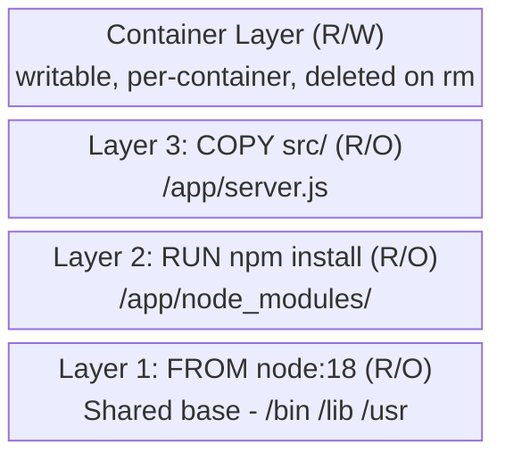
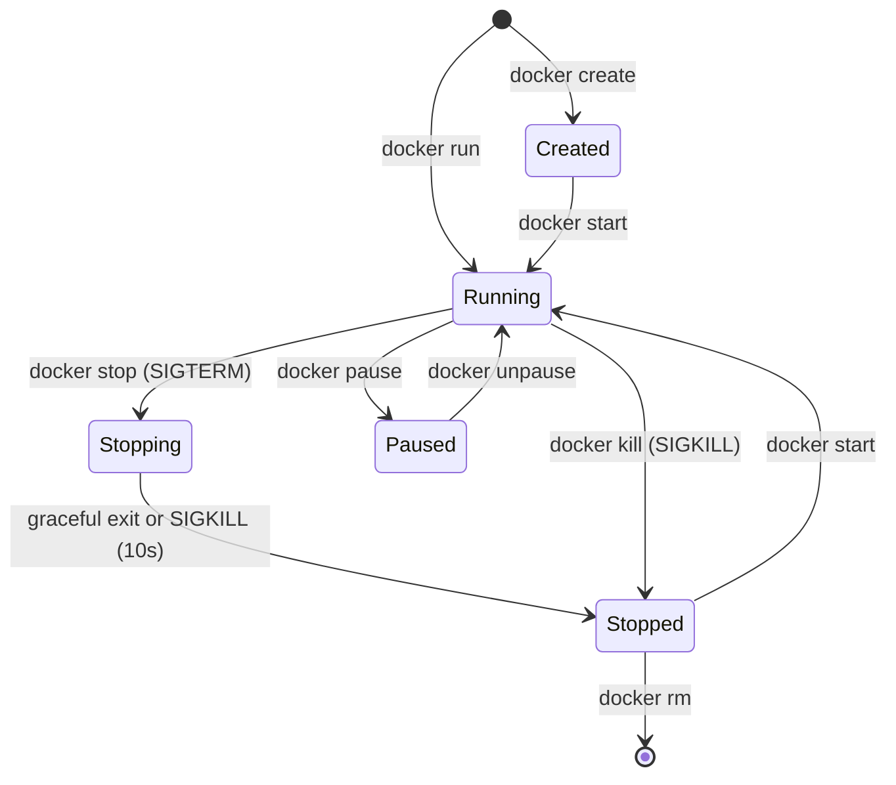

# Docker - L1 Core Concepts

## Docker Images and Layers

### 🎯 Model Answer

**30 seconds:**
> A Docker image: a read-only template for creating containers.
> Built from layers: each instruction in a Dockerfile creates one
> layer. Layers are cached and shared. A container: a running
> instance of an image with a writable layer on top. Image layers
> are immutable and reused across images sharing the same base.

**3 minutes (Senior):**
> Image architecture: (1) **Union filesystem (overlayFS)**: layers
> stack on top of each other. Each layer: diff from the previous
> layer. OverlayFS merges all layers into a single filesystem view
> at runtime. (2) **Layer caching**: each Dockerfile instruction is
> a layer. If the instruction and all preceding instructions are
> unchanged: Docker reuses the cached layer. Cache invalidation:
> any instruction change invalidates all subsequent layers.
> Implication: order instructions from least-frequently-changed
> (base image, dependencies) to most-frequently-changed (source code).
> (3) **Layer reuse**: multiple images sharing a base layer (`FROM
> ubuntu:22.04`) store the ubuntu layer only once on disk.
> `docker images` shows the full image size, but `docker system df`
> shows the actual disk usage (shared layers counted once).
> (4) **Image manifest and digest**: images are identified by digest
> (`sha256:abc123...`). Tags (`myapp:latest`) are mutable pointers
> to digests. Using tags in production: risky (tag can be overwritten).
> Use digests for reproducible deployments.

**Blank Mind Recovery:**

**(1) Restate:** "Image = stack of read-only layers + metadata.
Container = image + writable layer on top. OverlayFS merges layers
at runtime. Layers: cached, shared, immutable. Order matters for
cache efficiency."

**(2) First principles:** "Images solve the 'which files?' problem.
A container needs files to run. Images bundle all required files as
an ordered stack of diffs. Sharing base layers: saves disk and
speeds up pulls."

**(3) Bridge:** "Image layers are like Git commits. Each commit: a
diff from the previous state. The full working tree: the overlay of
all commits. Docker: same idea. Each layer: a diff. The container's
filesystem: the overlay of all layers."

---

### 📘 Concept Explanation

**Image layers, caching, and OverlayFS:**
```
IMAGE LAYER STRUCTURE:

  Dockerfile:
    FROM ubuntu:22.04        # Layer 1: ubuntu base (pulled from registry)
    RUN apt-get update \     # Layer 2: package list update
        && apt-get install -y curl
    COPY requirements.txt /  # Layer 3: requirements file
    RUN pip install -r \     # Layer 4: Python dependencies
        requirements.txt
    COPY src/ /app/          # Layer 5: source code (changes often)
    CMD ["python", "/app/main.py"]  # Metadata (not a layer)
  
  Layer sharing between images:
    image-A: Layer1(ubuntu) + Layer2(curl) + Layer3(src-v1)
    image-B: Layer1(ubuntu) + Layer2(curl) + Layer3(src-v2)
    
    Layer1 and Layer2: shared on disk.
    Only Layer3 differs. Efficient storage + pull time.
  
  OverlayFS at runtime:
    Container filesystem = merge of:
      Layer1 (ubuntu) - read only
      Layer2 (curl)   - read only
      Layer3 (src)    - read only
      Container layer - read/write (per container, deleted on rm)
    
    File write (copy-on-write):
      Container writes /app/config.json.
      OverlayFS: copies file from lower layer to container layer.
      Subsequent reads/writes: use the copy in container layer.
      Original lower layer: unchanged.

LAYER CACHE OPTIMIZATION:

  BAD order (cache bust on every code change):
    FROM node:18
    COPY . /app/          # copies ALL files - changes every commit
    RUN npm install       # re-runs every commit because COPY above changed
    CMD ["node", "app.js"]
  
  GOOD order (dependencies cached, code changes fast):
    FROM node:18
    WORKDIR /app
    COPY package.json package-lock.json ./  # only copy dependency files
    RUN npm install                          # cached until package.json changes
    COPY . /app/                            # source code - cache miss here only
    CMD ["node", "app.js"]
    
    Result: npm install re-runs ONLY when package.json changes.
    Code changes (most commits): skip npm install (cache hit).
    Build time: ~3 seconds (COPY + CMD) vs ~60 seconds (npm install).

IMAGE IDENTIFICATION:

  # By tag (mutable - avoid in production):
  docker pull myapp:latest
  # "latest" may point to different images over time.
  
  # By digest (immutable - use in production):
  docker pull myapp@sha256:a1b2c3...
  # Always the same image. Reproducible.
  
  # Find image digest:
  docker inspect myapp:latest | grep -i digest
  docker images --digests
  
  # In Kubernetes:
  image: myapp@sha256:a1b2c3...  # pinned digest
```

---

### 💻 Code Example

> **Code walkthrough:** The BAD Dockerfile wastes cache on every
> source code change by copying all files before installing
> dependencies. The GOOD version separates dependency installation
> from source code copying, so the expensive `npm install` layer is
> only re-run when `package.json` changes.

```dockerfile
# BAD: package install re-runs on every code change:
FROM node:18-alpine
COPY . /app
WORKDIR /app
RUN npm install
CMD ["node", "server.js"]

# GOOD: dependencies cached separately from source code:
FROM node:18-alpine
WORKDIR /app
COPY package.json package-lock.json ./
RUN npm ci --only=production
COPY . .
CMD ["node", "server.js"]
```

> **Code walkthrough:** `COPY package.json package-lock.json ./`
> runs first and rarely changes. `RUN npm ci` (faster than
> `npm install` for CI: uses lock file exactly) is cached until
> those files change. `COPY . .` copies source code and busts only
> the final layer. The split saves minutes on every development
> build cycle. `npm ci` instead of `npm install`: produces
> reproducible installs from the lock file.

---

### 🎓 Answers by Seniority

**Junior / Mid (0-5 years):**
> An image is a blueprint for a container, made of layers. Each
> `RUN`, `COPY`, or `ADD` in a Dockerfile creates a layer. Layers
> are cached: if nothing changed, Docker reuses the cached layer.
> A container is a running instance of an image with a writable
> layer on top.

---

**Senior / Staff (5+ years):**
> Layer cache is a build performance lever. Critical insight: the
> cache is invalidated at the FIRST changed layer and all subsequent
> layers are rebuilt. Structure Dockerfiles so the most frequently
> changed content (source code) is at the bottom. Expensive operations
> (package installs, compilation) near the top. Use `--mount=type=cache`
> in BuildKit for persistent package manager caches that survive
> Docker image rebuilds (e.g., `pip` or `npm` cache directories).
> For production: always reference images by digest in deployment
> manifests to prevent "works in CI but different image in prod"
> drift.

---

### ⚠️ Common Misconceptions

**Misconception: "Deleting a file in a Dockerfile removes it from the image."**
A `RUN rm /some/file` instruction adds a new layer that "hides" the
file. The file STILL EXISTS in the previous layer and is included in
the image's total size. The union filesystem: the deletion layer
marks the file as deleted (whiteout file). The actual bytes remain
in the lower layer. To truly remove a file: do the installation and
deletion in the SAME `RUN` instruction (same layer). Only then is
the file never written to any persistent layer. Example:
`RUN apt-get install -y build-essential && make && apt-get purge -y
build-essential && apt-get autoremove -y`. Multi-stage builds are
the clean solution: use build tools in a build stage, copy only
the final binary to a minimal runtime stage.

---

### ⚖️ Comparison Table

| Concept | Description | Mutable? | Lifecycle |
|---|---|---|---|
| Image | Template (stack of layers) | No | Persistent |
| Container | Running instance of image | Yes (writable layer) | Until stopped/removed |
| Layer | Filesystem diff (one instruction) | No | Shared, reused |
| Tag | Mutable pointer to an image digest | Yes | Reassignable |
| Digest | Immutable cryptographic hash of image | No | Permanent |

---

### 🏛️ System Design

*(Omit: image layer architecture is a component-level concept.)*

---

### 📊 Diagram

**Docker image layer stack:**

```
  ┌─────────────────────────┐ <- Container layer (R/W)
  │  /app/output.log        │    Per container, deleted on rm.
  ├─────────────────────────┤ <- Layer 3: COPY src/ (R/O)
  │  /app/server.js         │
  ├─────────────────────────┤ <- Layer 2: RUN npm install (R/O)
  │  /app/node_modules/     │
  ├─────────────────────────┤ <- Layer 1: FROM node:18 (R/O)
  │  /bin /lib /usr         │    Shared with all node:18 images.
  └─────────────────────────┘
```



> **Diagram walkthrough:** Layers stack bottom to top. Each layer
> is read-only after creation. The container layer at the top is
> the only writable layer: all runtime file changes go here.
> OverlayFS presents the union of all layers as a single filesystem.
> The base layer (node:18) is shared among all containers using that
> base: stored once on disk, loaded once in memory.

---

### 🚨 Failure Modes and Diagnosis

**Failure: Image is unexpectedly large despite deleting files.**
```
Symptom: docker images shows 2GB image despite cleanup in Dockerfile.

Root cause: file deleted in a separate RUN layer. The deletion adds
  a "whiteout" marker but the original data remains in the lower layer.

Diagnosis:
  # Inspect each layer's size:
  docker history myimage:latest
  # Look for large layers. Identify which instruction created them.
  
  # Or with dive tool (best-in-class layer inspector):
  dive myimage:latest
  # Shows per-layer file additions and deletions. Efficiency score.

Fix:
  Combine install + cleanup in ONE RUN instruction:
  
  RUN apt-get update && \
      apt-get install -y build-essential && \
      make build && \
      apt-get purge -y build-essential && \
      apt-get autoremove -y && \
      rm -rf /var/lib/apt/lists/*
  
  Or use multi-stage builds:
  FROM node:18-alpine AS builder
  COPY . .
  RUN npm ci && npm run build
  
  FROM nginx:alpine
  COPY --from=builder /app/dist /usr/share/nginx/html
  # Final image: only nginx + built files. No node_modules. ~50MB vs ~500MB.
```

---

### 🎯 Interview Deep-Dive

| Question Category | Time to Answer |
|---|---|
| What is a Docker image? | 1 minute |
| How do image layers work? | 2 minutes |
| Layer caching rules | 2 minutes |
| Image size optimization | 1 minute |
| Tag vs digest | 1 minute |
| Copy-on-write mechanism | 1 minute |
| Large image diagnosis | 1 minute |

---

**Q1 (fundamentals): How does Docker's layer caching work, and how do you optimize for it?**

A: Layer caching: Docker checks each Dockerfile instruction against
the existing cache. Cache key: the instruction text + the content
of any files copied. Cache hit: the existing layer is reused (fast,
no work). Cache miss: the layer is rebuilt AND all subsequent layers
are invalidated and rebuilt. The optimization: order instructions
from least-frequently-changed to most-frequently-changed. Base image
and package installs: rarely change. Source code: changes on every
commit. So: install dependencies first (near the top of the
Dockerfile), copy source code last. Split `COPY` instructions: copy
only the dependency manifest first (`package.json`, `pom.xml`,
`requirements.txt`), install, then copy source. BuildKit
`--mount=type=cache`: persistent cache directories (Maven local
repo, pip cache) that survive between builds without being part of
the image.

*What separates good from great:* Cache busting is not just about
instruction order. The cache key for `COPY` includes file checksums.
If a Dockerfile `COPY`s a large directory early, ANY file change in
that directory busts the cache. Solution: use `.dockerignore` to
exclude irrelevant files (`.git/`, `node_modules/`, `*.md`). Without
`.dockerignore`: changing a README.md rebuilds the entire image.
With `.dockerignore`: only relevant source files affect the cache key.

---

**Q2 (production): Why should you use image digests instead of tags in production deployments?**

A: Tags are mutable. `docker pull myapp:latest` may return a
different image today vs tomorrow. A tag is just a pointer in the
registry that can be updated at any time. In production: this means
two pods with the same `image: myapp:latest` may be running different
code (one deployed before the tag update, one after). This creates
deployment drift: debugging becomes harder because the running image
is unclear. Digests are immutable. `sha256:a1b2c3...` always refers
to the exact same image content. Using digests in Kubernetes manifests:
`image: myapp@sha256:a1b2c3...` guarantees all replicas run exactly
the same code, regardless of when they started or if the registry
tag changed.

*What separates good from great:* The `latest` tag is the most
dangerous tag in production. It is the default when no tag is
specified. A deployment with `image: myapp` (no tag) implicitly uses
`latest`. If a registry allows overwriting `latest`: a malicious or
accidental push can silently change what "latest" means. Production
images: use semantic versioning tags (`:v1.2.3`) as human-readable
labels AND digest as the pinned reference. CI/CD pipeline: build,
push with semver tag, extract digest, update deployment manifest
with digest. This is GitOps-compatible: the manifest change (digest
update) is auditable and reversible.

---

---

## Dockerfile Fundamentals

### 🎯 Model Answer

**30 seconds:**
> A Dockerfile: a text file of instructions for building a Docker
> image. Key instructions: `FROM` (base image), `RUN` (execute
> command), `COPY` (add files), `WORKDIR` (set working directory),
> `ENV` (set environment variable), `EXPOSE` (document port), `CMD`
> / `ENTRYPOINT` (container startup command). Best practices:
> non-root user, `.dockerignore`, minimal base image, combined `RUN`
> commands for cleanup.

**3 minutes (Senior):**
> Critical distinctions: (1) `CMD` vs `ENTRYPOINT`: `ENTRYPOINT`
> defines the executable. `CMD`: the default arguments to the
> entrypoint (overridden by `docker run` arguments). Best practice:
> use `ENTRYPOINT ["python", "app.py"]` for the main process.
> `CMD []`: default arguments if none provided. Shell form (`CMD
> python app.py`) vs exec form (`CMD ["python", "app.py"]`): exec
> form is preferred. Shell form: runs through `/bin/sh -c` which
> becomes PID 1's parent. Signals (SIGTERM) go to `/bin/sh`, not
> to `python`. Graceful shutdown: broken. Exec form: PID 1 = the
> actual process. Signals: received correctly. (2) `COPY` vs `ADD`:
> use `COPY` for local files. `ADD` has extra behaviors (URL fetching,
> tar auto-extraction): use only when you need those. `ADD` obscures
> intent. (3) `ENV` vs `ARG`: `ENV`: available at runtime (visible
> in `docker inspect`). `ARG`: only at build time (not in running
> container). Never put secrets in either: they appear in image
> metadata or history.

**Blank Mind Recovery:**

**(1) Restate:** "FROM base, RUN commands, COPY files, WORKDIR path,
ENV variables, EXPOSE port, CMD/ENTRYPOINT startup. Key distinctions:
exec vs shell form (PID 1 signals), ENTRYPOINT vs CMD (fixed vs
overrideable), COPY vs ADD (prefer COPY), ENV vs ARG (runtime vs
build-time)."

**(2) First principles:** "A Dockerfile: a reproducible recipe for
building an image. Every instruction: a layer. Order: cache
efficiency. Non-root user: security. Multi-stage: size reduction."

**(3) Bridge:** "A Dockerfile is like a recipe for a meal prep
container (literal meaning). FROM: the base kitchen. RUN: cooking
steps. COPY: adding ingredients. CMD/ENTRYPOINT: the serving
instructions. The result: a sealed, reproducible container."

---

### 📘 Concept Explanation

**Dockerfile instructions, exec vs shell form, signals:**
```
KEY DOCKERFILE INSTRUCTIONS:

  FROM node:18-alpine        # Base image. First instruction (usually).
  WORKDIR /app               # Set working directory. Create if missing.
  ENV NODE_ENV=production    # Runtime environment variable.
  ARG BUILD_DATE             # Build-time variable (not in final image env).
  COPY package*.json ./      # Copy only dependency manifests first.
  RUN npm ci --omit=dev      # Install dependencies. Single layer.
  COPY . .                   # Copy source code.
  RUN addgroup -S appgroup \ # Create non-root group and user:
      && adduser -S appuser \
      -G appgroup
  USER appuser               # Run as non-root.
  EXPOSE 3000                # Document the port (informational only).
  ENTRYPOINT ["node"]        # Fixed executable. Cannot be overridden.
  CMD ["server.js"]          # Default argument. Can be overridden.

CMD vs ENTRYPOINT:

  # ENTRYPOINT: the main program. CMD: its arguments.
  ENTRYPOINT ["python"]
  CMD ["app.py"]
  # docker run myimage           -> python app.py
  # docker run myimage debug.py  -> python debug.py (CMD overridden)
  
  # CMD only (common pattern): entire command as default.
  CMD ["node", "server.js"]
  # docker run myimage            -> node server.js
  # docker run myimage /bin/bash  -> /bin/bash (entire CMD overridden)
  
  # Shell form (avoid for PID 1):
  CMD node server.js      # runs: /bin/sh -c "node server.js"
  # PID 1 = /bin/sh. node = PID 2.
  # docker stop sends SIGTERM to PID 1 (/bin/sh).
  # /bin/sh: does NOT forward signal to node. Node: killed with SIGKILL after timeout.
  # Graceful shutdown: impossible.
  
  # Exec form (correct):
  CMD ["node", "server.js"]  # runs: node server.js directly.
  # PID 1 = node. SIGTERM: received by node. Node: graceful shutdown.

ENV vs ARG:

  ARG APP_VERSION=1.0.0       # Build-time only. Not in running container.
  RUN echo "Building v${APP_VERSION}"  # Available during build.
  
  ENV LOG_LEVEL=info           # Runtime. Available in running container.
  # docker inspect image | grep LOG_LEVEL -> LOG_LEVEL=info (visible)
  
  # NEVER use ENV or ARG for secrets:
  # ENV DATABASE_PASSWORD=secret  <- BAD: visible in docker inspect
  # ARG BUILD_SECRET=secret       <- BAD: visible in docker history
  # Use BuildKit secrets or runtime env injection instead.

NON-ROOT USER (SECURITY):

  # Most base images: run as root by default. Security risk.
  # Container escape: attacker with root in container may escalate to host root.
  
  # Create dedicated non-root user:
  RUN groupadd -r appgroup && useradd -r -g appgroup appuser
  USER appuser
  # Or (Alpine Linux):
  RUN addgroup -S appgroup && adduser -S appuser -G appgroup
  USER appuser
  
  # Ensure app directories are owned by appuser:
  RUN chown -R appuser:appgroup /app
  USER appuser

.dockerignore:

  # Prevent irrelevant files from being included in build context.
  # Build context: sent to Docker daemon on every build. Affects cache key.
  
  # .dockerignore:
  .git
  node_modules
  *.md
  .env
  .DS_Store
  Dockerfile*
  docker-compose*
  tests/
  docs/
  
  # Without .dockerignore: .git (potentially GB) sent on every build.
  # With .dockerignore: only source files sent. Faster builds.
```

---

### 💻 Code Example

> **Code walkthrough:** A production-grade Node.js Dockerfile demonstrates
> multi-stage build, non-root user, layer cache optimization, and
> signal handling.

```dockerfile
# BAD: runs as root, large image, poor cache:
FROM node:18
COPY . /app
WORKDIR /app
RUN npm install
EXPOSE 3000
CMD node server.js  # shell form: PID 1 = /bin/sh (bad signals)

# GOOD: production-grade Dockerfile:
# Stage 1: install dependencies (cached separately):
FROM node:18-alpine AS deps
WORKDIR /app
COPY package.json package-lock.json ./
RUN npm ci --omit=dev

# Stage 2: minimal runtime image:
FROM node:18-alpine AS runtime
WORKDIR /app

# Non-root user:
RUN addgroup -S appgroup && adduser -S appuser -G appgroup

# Copy only what's needed from deps stage:
COPY --from=deps /app/node_modules ./node_modules
COPY --chown=appuser:appgroup . .

USER appuser
EXPOSE 3000

# Exec form: node is PID 1, receives SIGTERM directly:
CMD ["node", "server.js"]
```

> **Code walkthrough:** The multi-stage build separates dependency
> installation (with build tools available) from the runtime image
> (minimal, no build tools). The `--chown` flag on `COPY` sets
> file ownership in one layer instead of a separate `chown` command
> (which would add another layer). The exec form `CMD ["node",
> "server.js"]` ensures `node` is PID 1 and receives SIGTERM for
> graceful shutdown. The non-root user: `appuser` limits container
> capabilities even if the application is compromised.

---

### 🎓 Answers by Seniority

**Junior / Mid (0-5 years):**
> A Dockerfile is a script for building a Docker image. Key instructions:
> `FROM` (base image), `RUN` (shell commands), `COPY` (add files),
> `CMD` (startup command). Best practices: put frequently-changing
> instructions near the end (cache efficiency), use `.dockerignore`,
> run as a non-root user.

---

**Senior / Staff (5+ years):**
> PID 1 and signal handling is the most overlooked Dockerfile concern.
> Shell form `CMD` means `/bin/sh -c` is PID 1. `docker stop` sends
> SIGTERM to PID 1. `/bin/sh` does not forward signals to child
> processes. The actual app gets SIGKILL after the 10-second stop
> timeout. Consequences: no graceful shutdown, open DB connections
> dropped, in-flight requests lost. Fix: exec form for `CMD`/
> `ENTRYPOINT`. OR: use a proper init process (`tini`) as PID 1 if
> you have multiple processes. `tini` correctly forwards signals and
> reaps zombie processes.

---

### ⚠️ Common Misconceptions

**Misconception: "EXPOSE makes the container's port accessible from the host."**
`EXPOSE` is documentation only. It declares which ports the container
INTENDS to use, but does NOT publish them to the host. To actually
expose a port: `docker run -p 8080:3000 myimage` maps host port 8080
to container port 3000. `EXPOSE 3000` only tells other developers
(and tools like `docker-compose`) which port the application listens
on. Kubernetes ignores `EXPOSE` entirely: port configuration in
Kubernetes is done in Pod spec. The `EXPOSE` instruction has zero
effect on network accessibility. Many engineers waste time debugging
"why is my port not accessible?" when the real issue is the missing
`-p` flag or the Kubernetes `ports` definition.

---

### ⚖️ Comparison Table

| Instruction | Purpose | Overrideable | In Final Image |
|---|---|---|---|
| CMD | Default command/args | Yes (docker run args) | Yes (metadata) |
| ENTRYPOINT | Fixed executable | Only with --entrypoint | Yes (metadata) |
| ENV | Runtime env var | Yes (docker run -e) | Yes |
| ARG | Build-time var | Yes (--build-arg) | No |
| COPY | Add local files | N/A | Yes (in layer) |
| ADD | Add files + URL/tar | N/A | Yes (in layer) |

---

### 🏛️ System Design

*(Omit: Dockerfile fundamentals is a component-level topic.)*

---

### 📊 Diagram

*(Omit: Dockerfile instruction semantics are expressed more clearly as annotated code than diagrams.)*

---

### 🚨 Failure Modes and Diagnosis

**Failure: Container does not shut down gracefully on `docker stop`.**
```
Symptom: docker stop takes 10 seconds (the default timeout), then
  the container is forcibly killed. In-flight requests dropped.
  Database connections not closed cleanly.

Root cause: PID 1 is /bin/sh (shell form CMD), not the application.
  SIGTERM goes to /bin/sh which does not forward to child processes.
  After 10 seconds: Docker sends SIGKILL.

Diagnosis:
  docker inspect mycontainer | grep -A5 '"Cmd"'
  # If you see: "Cmd": ["/bin/sh", "-c", "node server.js"]
  # That is shell form. /bin/sh is PID 1.
  
  docker exec mycontainer cat /proc/1/cmdline | tr '\0' ' '
  # If output shows: /bin/sh -c node server.js -> confirmed shell form.
  # If output shows: node server.js -> exec form (correct).

Fix:
  Change CMD to exec form:
  CMD ["node", "server.js"]  # not: CMD node server.js
  
  For applications that need an init process (multiple processes,
  zombie reaping):
  FROM node:18-alpine
  RUN apk add --no-cache tini  # lightweight init
  ENTRYPOINT ["/sbin/tini", "--"]
  CMD ["node", "server.js"]
  # tini: PID 1. Forwards signals. Reaps zombies. node: PID 2.
  
  Increase graceful shutdown timeout if application needs more time:
  docker stop --time=30 mycontainer  # 30 second window
  # Or in Kubernetes: terminationGracePeriodSeconds: 30
```

---

### 🎯 Interview Deep-Dive

| Question Category | Time to Answer |
|---|---|
| CMD vs ENTRYPOINT | 2 minutes |
| Shell form vs exec form | 2 minutes |
| EXPOSE misconception | 1 minute |
| ENV vs ARG | 1 minute |
| Non-root user setup | 1 minute |
| .dockerignore purpose | 1 minute |
| Signal handling diagnosis | 1 minute |

---

**Q1 (fundamentals): What is the difference between CMD and ENTRYPOINT?**

A: `ENTRYPOINT` defines the fixed executable. It cannot be overridden
by `docker run` arguments (only by `--entrypoint`). `CMD` defines
the default arguments to the entrypoint (or the default command if
no entrypoint). `CMD` IS overridden by arguments after the image
name in `docker run`. Together: `ENTRYPOINT ["python"]` + `CMD
["app.py"]` means the default run is `python app.py`. Running
`docker run myimage debug.py` becomes `python debug.py` (CMD
overridden, ENTRYPOINT fixed). Common pattern: `ENTRYPOINT` for the
main executable, `CMD` for default arguments that can be overridden.
If the container should ALWAYS run a specific command: put it in
`ENTRYPOINT`. If the command should be replaceable (debugging,
one-off tasks): put it in `CMD`.

*What separates good from great:* The combination matters for
container tooling. Docker healthchecks, Kubernetes liveness probes,
and `docker exec` all interact with the running process (determined
by ENTRYPOINT). A common pattern: `ENTRYPOINT ["/entrypoint.sh"]`
where `entrypoint.sh` runs initialization logic (wait for DB,
run migrations) and then `exec "$@"` to become the CMD. The `exec
"$@"`: replaces the shell with the CMD process. Result: CMD becomes
PID 1 after the entrypoint script completes. This combines
initialization logic with correct signal handling.

---

---

## Container Lifecycle and Management

### 🎯 Model Answer

**30 seconds:**
> Docker container lifecycle: created -> running -> paused/stopped ->
> removed. Key commands: `docker run` (create + start), `docker stop`
> (SIGTERM -> SIGKILL), `docker rm` (remove stopped container),
> `docker exec` (run command in running container), `docker logs`
> (stdout/stderr), `docker inspect` (detailed metadata). Containers
> are ephemeral: their writable layer is deleted on `docker rm`.
> Persistent data: use volumes.

**3 minutes (Senior):**
> Container management in production: (1) **Restart policies**: `--restart
> always` (restart on failure and on daemon restart), `--restart on-failure:3`
> (restart up to 3 times on non-zero exit). (2) **Resource limits**: `--memory
> 512m --cpus 1.0`. Without limits: a container can consume all host
> resources. OOM (Out of Memory): Linux OOM killer terminates
> processes. Docker: tries to kill the container's main process first.
> (3) **Logging**: by default, containers write stdout/stderr to JSON
> log files on the host. `docker logs` reads these files. Log rotation:
> `--log-opt max-size=10m --log-opt max-file=3`. Without rotation:
> log files grow without bound and fill the disk. Production: ship
> logs to a centralized system (ELK, Splunk, CloudWatch) via log
> driver (`awslogs`, `fluentd`, `gelf`). (4) **Cleanup**: `docker
> system prune` removes stopped containers, dangling images, unused
> networks, and build cache. Run periodically to prevent disk
> exhaustion.

**Blank Mind Recovery:**

**(1) Restate:** "Lifecycle: run -> stop -> rm. Key ops: exec (debug),
logs (view output), inspect (metadata), stats (resource usage).
Production concerns: restart policy, memory/CPU limits, log rotation,
periodic cleanup. Ephemeral writable layer: use volumes for persistence."

**(2) First principles:** "A container is an isolated process with
its own filesystem. Starting: sets up namespaces and cgroups. Stopping:
SIGTERM to PID 1, then SIGKILL. Removal: deletes the writable layer.
Management: same as process management but with additional filesystem
and network isolation."

**(3) Bridge:** "Container lifecycle is like a hotel room. Check-in
(docker run): room created, furnished, occupied. Checkout (docker
stop): guest leaves. Room cleaned (docker rm): writable layer deleted.
Luggage (volumes): stored separately, survives checkout. Mini-bar
(ENV): pre-configured. Room service logs (docker logs): tracked."

---

### 📘 Concept Explanation

**Container states, resource limits, logging, cleanup:**
```
CONTAINER LIFECYCLE COMMANDS:

  # Create and start:
  docker run -d \               # detached (background)
    --name web \                # assign name
    -p 8080:3000 \              # port mapping: host:container
    --memory 512m \             # memory limit
    --cpus 1.0 \                # CPU limit
    --restart on-failure:3 \   # restart policy
    -v /data:/app/data \        # volume mount
    -e DATABASE_URL=postgres:// # environment variable
    myapp:v1.2.3
  
  # Check status:
  docker ps                   # running containers
  docker ps -a                # all containers (including stopped)
  docker stats                # real-time CPU, memory, network, disk I/O
  docker inspect web          # full metadata (JSON)
  
  # Execute inside running container (debugging):
  docker exec -it web /bin/sh  # interactive shell
  docker exec web ls /app      # one-shot command
  
  # View logs:
  docker logs web              # all logs
  docker logs --tail 100 web   # last 100 lines
  docker logs -f web           # follow (like tail -f)
  docker logs --since 1h web   # logs from last hour
  
  # Stop and remove:
  docker stop web              # SIGTERM, then SIGKILL after 10s
  docker stop --time 30 web    # 30s grace period
  docker rm web                # remove stopped container
  docker rm -f web             # force-remove running container (SIGKILL)

RESTART POLICIES:

  no (default):      Never automatically restart. Manual restart required.
  always:            Restart always. Even after daemon restart.
                     Use: long-running services (DB, web server).
  on-failure[:max]:  Restart on non-zero exit code. Optional max retries.
                     Use: batch jobs that should retry on transient failure.
  unless-stopped:    Like always, but not restarted if manually stopped.
                     Use: most production services.

RESOURCE LIMITS AND OOM BEHAVIOR:

  # Memory limit:
  docker run --memory 512m myapp
  # Container: can use up to 512MB. Beyond this: OOM.
  # Linux OOM killer: terminates the container's process (or a random process).
  # Docker: creates OOM event. Container exits with exit code 137.
  
  # Memory + swap limit:
  docker run --memory 512m --memory-swap 1g myapp
  # Swap: 1g - 512m = 512m swap. (memory-swap = memory + swap total)
  # --memory-swap -1: unlimited swap.
  
  # CPU limit:
  docker run --cpus 1.0 myapp   # 1 full CPU core equivalent
  docker run --cpus 0.5 myapp   # 50% of one CPU core
  # Under the hood: cgroup cpu.shares/cpu.cfs_quota_us.
  
  # Monitor resource usage:
  docker stats myapp
  # Output: CONTAINER  CPU%  MEM USAGE/LIMIT  MEM%  NET I/O  BLOCK I/O

LOG MANAGEMENT:

  # JSON-file driver (default):
  /var/lib/docker/containers/{id}/{id}-json.log
  
  # Log rotation (prevent disk exhaustion):
  docker run --log-opt max-size=10m --log-opt max-file=3 myapp
  # 3 files of 10MB each = 30MB max per container.
  
  # Set default log options for all containers (daemon.json):
  {
    "log-driver": "json-file",
    "log-opts": {
      "max-size": "10m",
      "max-file": "3"
    }
  }
  
  # Production: ship to centralized logging:
  docker run --log-driver awslogs \
    --log-opt awslogs-group=/myapp/prod \
    --log-opt awslogs-region=us-east-1 \
    myapp

CLEANUP:

  # Remove stopped containers:
  docker container prune
  
  # Remove dangling images (untagged, not referenced by any container):
  docker image prune
  
  # Remove everything unused:
  docker system prune
  docker system prune -a  # also remove unused images (not just dangling)
  
  # Check disk usage:
  docker system df
  # Shows: images, containers, volumes, build cache, with reclaimable amounts.
```

---

### 💻 Code Example

> **Code walkthrough:** Production-grade `docker run` with all
> recommended flags shows the minimal configuration for a
> production container launch.

```bash
# BAD: running without any limits or restart policy:
docker run -d -p 8080:3000 myapp:latest
# No memory limit: OOM can kill other processes on the host.
# No restart: container dies and stays dead.
# No name: hard to reference.

# GOOD: production-grade run with limits and cleanup:
docker run -d \
  --name myapp-prod \
  -p 8080:3000 \
  --memory 512m \
  --memory-swap 512m \     # disable swap (= memory limit only)
  --cpus 1.0 \
  --restart unless-stopped \
  --log-driver json-file \
  --log-opt max-size=10m \
  --log-opt max-file=3 \
  --read-only \            # read-only root filesystem (security)
  --tmpfs /tmp \           # writable /tmp in memory (for read-only root)
  -e DATABASE_URL="${DATABASE_URL}" \ # inject secret from env, not hardcoded
  myapp:1.2.3              # pinned version, not :latest
```

> **Code walkthrough:** `--memory-swap 512m` (same as `--memory`)
> disables swap entirely, preventing memory pressure from silently
> overflowing to slow disk swap. `--read-only` makes the container's
> root filesystem read-only (any write attempt fails). Combined with
> `--tmpfs /tmp`: the container can write to `/tmp` (in memory) but
> not to the image filesystem. Security benefit: code execution exploits
> that try to write to system paths fail immediately.

---

### 🎓 Answers by Seniority

**Junior / Mid (0-5 years):**
> Container lifecycle: `docker run` creates and starts, `docker stop`
> sends SIGTERM to gracefully stop, `docker rm` removes it. Key debug
> commands: `docker logs` (view output), `docker exec -it bash` (shell
> into running container), `docker stats` (resource usage). Always
> name containers with `--name` for easy reference.

---

**Senior / Staff (5+ years):**
> The most common production failure: container disk exhaustion from
> unbounded log files. Default Docker: JSON log driver with no size
> limit. A high-traffic container can generate gigabytes of logs
> per day. After weeks: the host disk fills. All Docker operations
> fail. Resolution: `docker system prune` (destructive) or `truncate
> -s 0 /var/lib/docker/containers/{id}/{id}-json.log` (emergency).
> Prevention: set `max-size` and `max-file` in `daemon.json` globally
> for all containers. Better: use a non-default log driver (awslogs,
> fluentd) that ships logs off-host and doesn't write to local disk.

---

### ⚠️ Common Misconceptions

**Misconception: "docker stop is immediate."**
`docker stop` sends SIGTERM and then waits 10 seconds before sending
SIGKILL. If the container's process handles SIGTERM (graceful shutdown):
it stops in milliseconds. If the process ignores SIGTERM or is PID 2
(shell form CMD): the 10-second wait always elapses before the SIGKILL.
During this 10 seconds: the container is in "stopping" state and
shows in `docker ps` as "Exiting". In production: if `docker stop`
always takes 10 seconds, it means graceful shutdown is broken. Fix
the application signal handling (or Dockerfile exec form). The 10-second
timeout is the symptom, not the cause. Increasing `docker stop --time`
to 30 or 60 seconds buys time but doesn't fix the underlying issue.

---

### ⚖️ Comparison Table

| Command | Purpose | Impact on Container |
|---|---|---|
| docker start | Start a stopped container | Running -> from stopped state |
| docker stop | Graceful stop (SIGTERM + SIGKILL) | Running -> Stopped |
| docker kill | Immediate stop (SIGKILL) | Running -> Stopped (no grace) |
| docker pause | Freeze container (SIGSTOP) | Running -> Paused (suspended) |
| docker restart | stop + start | Running -> Stopped -> Running |
| docker rm | Delete stopped container | Stopped -> Removed |
| docker rm -f | Force-remove running container | Running -> Removed |

---

### 🏛️ System Design

*(Omit: container lifecycle management is operational, not architectural.)*

---

### 📊 Diagram

**Container lifecycle state machine:**

```
  Created (docker create)
      |
      v
  Running (docker start / docker run)
      |       ^
      |       | (docker restart)
      v       |
  Stopping (docker stop - SIGTERM)
      |
      | 10s grace period
      v
  Stopped (SIGKILL or graceful exit)
      |
      v
  Removed (docker rm)
```



> **Diagram walkthrough:** The lifecycle shows the valid state
> transitions. `docker stop` transitions through an intermediate
> Stopping state where SIGTERM has been sent but the process is
> still running. This is where the grace period applies. `docker
> kill` skips graceful stop entirely: direct transition from Running
> to Stopped. The Paused state (SIGSTOP) is useful for debugging:
> the container's processes are suspended but the state is preserved.

---

### 🚨 Failure Modes and Diagnosis

**Failure: Container keeps restarting (restart loop / crash loop).**
```
Symptom: docker ps shows container status "Restarting (1) X seconds ago"
  Or repeated entries in docker logs.

Root cause options:
  1. Application exits on startup (config error, missing dependency).
  2. Out of memory (OOM kill: exit code 137).
  3. Port already in use (exit code 1 from bind failure).
  4. Required file/volume missing.
  5. Entrypoint script failing.

Diagnosis:
  # Check exit code:
  docker inspect mycontainer | grep -A3 '"ExitCode"'
  # Exit 137: OOM killed (killed by signal 9). Increase memory limit.
  # Exit 1: application error. Check logs.
  # Exit 126/127: entrypoint not found or not executable.
  
  # View logs (may be truncated in restart loop - logs accumulate):
  docker logs mycontainer
  docker logs --tail 50 mycontainer 2>&1 | head -100
  
  # Override entrypoint to get a shell (bypass the crashing entrypoint):
  docker run -it --entrypoint /bin/sh myimage
  # Then manually run the entrypoint to see the error.
  
  # Check OOM events:
  dmesg | grep -i "oom\|killed process"

Fixes:
  Config error: fix the environment variable or config file.
  OOM: increase --memory limit. Or: reduce application memory usage.
  Port conflict: change host port mapping. Or: stop the conflicting process.
  Missing file: ensure volume mounts are correct. Check mount path.
```

---

### 🎯 Interview Deep-Dive

| Question Category | Time to Answer |
|---|---|
| docker stop behavior | 1 minute |
| Restart policies | 1 minute |
| Container resource limits | 2 minutes |
| Log management | 2 minutes |
| Crash loop diagnosis | 2 minutes |
| docker exec for debugging | 1 minute |
| Container cleanup | 1 minute |

---

**Q1 (production): How do you debug a container that is crash-looping?**

A: Four-step approach. (1) Check the exit code:
`docker inspect {container} --format '{{.State.ExitCode}}'`. Exit
code 137: OOM killed (increase memory or fix memory leak). Exit code
1: application error (check logs). Exit code 126/127: entrypoint
not found (check FROM image for the binary). (2) View logs:
`docker logs {container}`. For a fast-restarting container: logs
accumulate. Use `--tail 100` to see the most recent 100 lines. The
error is usually in the last few lines before the crash. (3) Get a
shell bypassing the entrypoint: `docker run -it --entrypoint /bin/sh
{image}`. This starts the container with a shell instead of the
application. You can manually run the entrypoint script and see the
exact error in context. (4) Check host resources: `dmesg | grep oom`
for OOM events. `docker stats` for current memory usage. `df -h` for
disk space (a full disk causes many container failures).

*What separates good from great:* Crash loop with `--restart always`:
the container restarts indefinitely. Each restart: the log history
grows. After hours of crash-looping: the log file may be gigabytes.
`docker logs` becomes slow. Use `docker logs --since 5m {container}`
to only see recent logs. For containers that restart too fast to
attach: `docker run --restart no` to start without restart policy,
letting you observe the first crash without it being immediately
restarted. Then: read logs, fix issue, re-enable restart policy.

