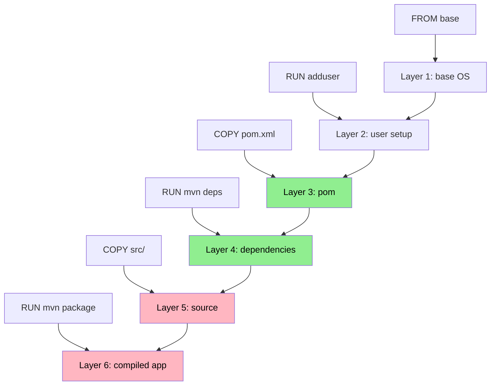
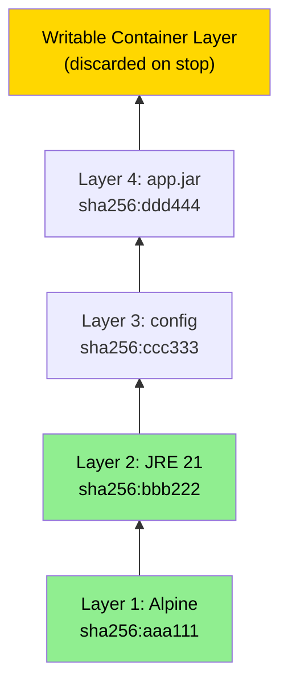
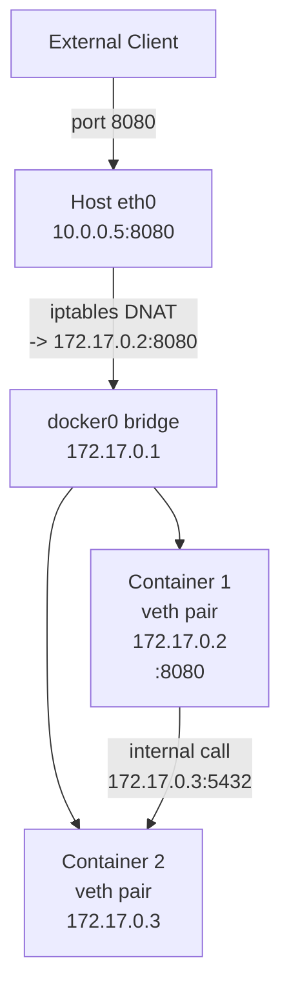

## Keywords in This File
{: .no_toc }

| # | Keyword | Weight |
|---|---|---|
| 1 | [Dockerfile Syntax and Best Practices](#dockerfile-syntax-and-best-practices) | critical |
| 2 | [Docker Images and Layer Caching](#docker-images-and-layer-caching) | high |
| 3 | [Docker CLI and Essential Commands](#docker-cli-and-essential-commands) | high |
| 4 | [Docker Compose for Development](#docker-compose-for-development) | high |
| 5 | [Docker Networking Basics](#docker-networking-basics) | medium |

---

# Dockerfile Syntax and Best Practices

**Interview Weight:** critical - Asked in nearly every Docker
interview. Interviewers look for multi-stage builds, layer cache
ordering, non-root users, and ENTRYPOINT vs CMD distinction.
Getting these right signals production experience.

---

### 🎯 Model Answer

**30 seconds:**

> A Dockerfile is a script of instructions that Docker executes to
> build an image. Best practices focus on three things: multi-stage
> builds (separate build tools from the runtime image), layer cache
> ordering (put infrequently-changing layers first so rebuilds are
> fast), and running as a non-root user for least privilege. The
> most common mistake is putting COPY . . before installing
> dependencies, which invalidates the dependency cache on every
> code change.

**3 minutes (Senior):**

> Dockerfile design has two competing goals: small final images
> and fast incremental builds. Multi-stage builds address the first -
> you use a full JDK + Maven in the builder stage and copy only the
> compiled JAR into a minimal JRE image. The final image has no
> Maven, no JDK compiler, and no build-time artifacts.
>
> Layer cache ordering addresses the second. Docker caches each
> instruction as a layer. If a layer's inputs have not changed, the
> cache is used. The insight is to order instructions from least
> likely to change to most likely to change. Dependencies (pom.xml)
> change less often than application code (src/). If you copy
> pom.xml first and run mvn dependency:go-offline, that layer is
> cached until pom.xml changes. Only when pom.xml changes does
> Docker re-download dependencies.
>
> The ENTRYPOINT vs CMD distinction matters for signal handling.
> ENTRYPOINT sets the executable that cannot be overridden by
> docker run arguments. CMD provides default arguments. Use exec
> form (JSON array syntax) for both - it runs the process directly
> without a shell, making the JVM PID 1 and ensuring it receives
> SIGTERM for graceful shutdown.

**Framework:** WHAT -> WHY -> HOW -> TRADE-OFF -> EXAMPLE

*Adapting up:* Staff adds OCI compliance, BuildKit advanced features
(build secrets, SSH forwarding for private repos), and how
Dockerfile design affects supply chain security (SBOM, image
scanning).

*Adapting down:* Junior: "Put dependencies before code, use
multi-stage builds, run as a non-root user."

**Blank Mind Recovery:**

**(1) Restate:** "You are asking about Dockerfile best practices -
let me think through what problems bad Dockerfiles cause."

**(2) First principles:** "A Dockerfile creates layers. Layers
are cached. So the optimal order minimizes cache invalidation.
And the final image should contain only what is needed at runtime."

**(3) Bridge:** "This is like a Makefile - you want targets to
be incremental. Same principle: only redo work when inputs change."

---

### 📘 Concept Explanation

**What it is:**
A Dockerfile is a text file containing ordered instructions that
Docker's build engine executes sequentially to produce an image.
Each instruction creates a new read-only layer in the image.

**The problem it solves:**
Manual image construction or shell scripts for building containers
are not reproducible and cannot be version-controlled. Dockerfiles
provide a declarative, repeatable specification for image content.

**How it works:**

```
Dockerfile Instructions -> Layers:

FROM eclipse-temurin:21-jre   <- base layer
RUN adduser appuser            <- OS layer (cached)
COPY pom.xml .                 <- pom layer (cached if pom unchanged)
RUN mvn dependency:go-offline  <- deps layer (cached if pom unchanged)
COPY src/ ./src/               <- code layer (invalidated on code change)
RUN mvn package                <- build layer (re-runs on code change)
```



> **Diagram walkthrough:** Layers 3 and 4 (pom.xml and dependency
> download) are marked green - they are cache hits when only
> application code changes. Layers 5 and 6 (source code and build)
> are marked red - they are always re-run on code changes. This
> ordering means a typical code-only change rebuilds in seconds
> (reusing the dependency layer) instead of minutes (re-downloading
> all dependencies). The cache hit is only valid if earlier layers
> are unchanged - any change cascades to all subsequent layers.

**The key insight:**
Cache invalidation is the critical design principle. Any instruction
that invalidates the cache causes all subsequent instructions to
re-run. Put the most stable instructions first (base image, OS
setup, dependency installation) and the most volatile last
(application code, config).

**When to use multi-stage builds:**
Always for Java applications. The build stage needs the full JDK
and Maven; the runtime stage needs only the JRE. Never ship build
tools in a production image.

**When NOT to use CMD alone:**
If your JVM process needs to receive SIGTERM for graceful shutdown
(it always does in Kubernetes), use exec form ENTRYPOINT or
ensure the shell invocation uses exec to replace the shell process.

**Alternatives:**
- Jib (Maven/Gradle plugin) - builds OCI images without Docker
  daemon, no Dockerfile needed
- Buildpacks (Cloud Native Buildpacks) - convention-based image
  building without writing Dockerfiles
- Kaniko - builds Dockerfile-based images inside Kubernetes

**First-principles derivation:**
Every instruction in a Dockerfile represents a tradeoff between
build speed (fewer layers, more caching) and image size (more
RUN instructions = more layers but also more opportunities to
clean up). The optimal Dockerfile collapses cleanup into the same
RUN instruction that creates the data, uses multi-stage to
eliminate build artifacts, and orders layers to maximize cache
reuse.

---

### 💻 Code Example

**Example 1: Layer cache ordering (BAD vs GOOD)**

```dockerfile
# BAD: Copies all source first - invalidates
# dependency cache on every code change
FROM maven:3.9-eclipse-temurin-21
WORKDIR /app
COPY . .           # ANY change -> cache miss
RUN mvn package    # re-downloads all deps every time
```

```dockerfile
# GOOD: Dependencies cached separately from code
FROM maven:3.9-eclipse-temurin-21 AS builder
WORKDIR /build
COPY pom.xml .        # only changes when deps change
RUN mvn dependency:go-offline -q  # cached!
COPY src/ ./src/      # code changes here
RUN mvn package -DskipTests -q

FROM eclipse-temurin:21-jre-alpine
RUN addgroup -S app && adduser -S app -G app
WORKDIR /app
COPY --from=builder /build/target/app.jar app.jar
USER app
ENTRYPOINT ["java", \
  "-XX:MaxRAMPercentage=75.0", \
  "-XX:+ExitOnOutOfMemoryError", \
  "-jar", "app.jar"]
```

> **Code walkthrough:** The BAD pattern copies everything in one
> COPY, which invalidates the cache whenever ANY file changes -
> even a README update triggers a full dependency re-download.
> The GOOD pattern copies pom.xml first (stable), runs dependency
> download (cached until pom.xml changes), then copies src/ (volatile).
> A typical code change now rebuilds in 15 seconds instead of 3 minutes.
> The JSON array ENTRYPOINT runs Java directly as PID 1 without a shell.

**Example 2: Image size reduction techniques**

```dockerfile
# Combine RUN commands to reduce layers
# and clean up in the SAME layer
FROM eclipse-temurin:21-jre-alpine

# BAD: creates 3 layers, tmp files persist
RUN apk add curl
RUN curl -O https://example.com/tool.tar.gz
RUN tar -xzf tool.tar.gz

# GOOD: 1 layer, tmp files cleaned in same layer
RUN apk add --no-cache curl \
    && curl -O https://example.com/tool.tar.gz \
    && tar -xzf tool.tar.gz \
    && rm tool.tar.gz \
    && apk del curl
```

> **Code walkthrough:** Docker image layers are additive - you
> cannot remove data added in a previous layer. If you add a file
> in one RUN and delete it in the next, the image contains both
> the data (in the add layer) and the deletion (in the delete
> layer). The only way to eliminate the data is to add and delete
> in the same RUN instruction. `--no-cache` prevents apk from
> storing its package index, saving additional megabytes.

**Example 3: Handling build secrets (private Maven repo)**

```dockerfile
# Use BuildKit secrets - never bake credentials
# into a layer
# syntax=docker/dockerfile:1

FROM maven:3.9-eclipse-temurin-21 AS builder
WORKDIR /build
COPY pom.xml .
# Mount the secret at build time only - never
# written to an image layer
RUN --mount=type=secret,id=maven_settings \
    mvn -s /run/secrets/maven_settings \
    dependency:go-offline -q
COPY src/ ./src/
RUN --mount=type=secret,id=maven_settings \
    mvn -s /run/secrets/maven_settings \
    package -DskipTests -q
```

> **Code walkthrough:** BuildKit secrets are mounted at build time
> and are never written to an image layer - so they cannot be
> extracted from the final image. The alternative (ENV MAVEN_USER=...)
> bakes the credential into a layer that can be inspected with
> docker history. The `# syntax=docker/dockerfile:1` comment enables
> BuildKit syntax. Secrets are passed via docker build
> --secret id=maven_settings,src=$HOME/.m2/settings.xml.

---

### 🎓 Answers by Seniority

**Junior / Mid (0-5 years):**

> A Dockerfile has instructions like FROM, RUN, COPY, and CMD that
> Docker runs to build an image. Best practices are: use multi-stage
> builds to keep the runtime image small, copy dependencies before
> source code so the dependency layer is cached, and run the app
> as a non-root user.

*Push deeper:* Add: "The ENTRYPOINT vs CMD distinction matters for
signal handling - use exec form JSON array syntax so the JVM
becomes PID 1 and receives SIGTERM directly."

---

**Senior / Staff (5+ years):**

> Dockerfile design is a cache optimization problem. Every layer
> is cached by its inputs. Put the most stable layers first
> (base image, OS setup, dependencies) and volatile layers last
> (application code). Multi-stage builds eliminate build tool
> bloat from the runtime image.

The senior adds security hygiene: non-root user, read-only
filesystem where possible (VOLUME for writable paths), no
hardcoded credentials (use BuildKit secrets), and minimal base
images (alpine or distroless). At the staff level, you discuss
supply chain security: SBOM generation from the Dockerfile,
image scanning in CI, and why you should pin base image versions
by digest rather than tag (FROM eclipse-temurin@sha256:abc123).

*Push deeper:* "Distroless images (no shell, no package manager,
no OS utilities) dramatically reduce attack surface. The tradeoff
is debugging - you cannot exec into a distroless container. The
solution is a debug sidecar or a separate debug image build target."

---

### ❓ Questions You Will Be Asked

#### Definition
- "What is a Dockerfile and what does each instruction do?"
- "What is the difference between ENTRYPOINT and CMD?"

🗣️ "A Dockerfile is a declarative script that builds a container
image. Key instructions: FROM sets the base image, RUN executes
commands during the build (creating a new layer), COPY adds files
from the build context, EXPOSE documents which port the app listens
on, and ENTRYPOINT and CMD control what runs when the container
starts. ENTRYPOINT sets the executable that cannot be overridden
by docker run arguments - it is the main command. CMD provides
default arguments that can be overridden. For a Java app, ENTRYPOINT
is java and CMD is the JAR path, so you can override the JAR path
without changing the ENTRYPOINT."

#### Mechanism
- "How does Docker's layer cache work and when is it invalidated?"
- "What happens step by step when you run docker build?"

🗣️ "Docker builds images layer by layer. For each instruction,
Docker computes a cache key based on the instruction text and the
contents of any files being copied. If a matching cached layer
exists, Docker uses it and skips the build step. Cache invalidation
cascades: when one layer's cache is invalidated, all subsequent
layers must be rebuilt. This is why ordering matters - if you
COPY . . first, any file change invalidates everything after it.
The build process: Docker reads the Dockerfile, sends the build
context (files on disk) to the daemon, and executes each instruction
in a temporary container, committing the result as a layer."

#### Comparison
- "Compare Dockerfile-based builds with Cloud Native Buildpacks."
- "When would you use Jib over a Dockerfile for Java?"

🗣️ "Cloud Native Buildpacks (CNB) detect your application type and
apply best-practice build conventions without a Dockerfile. They
handle Java apps, layer caching, and security automatically. The
advantage is consistency across teams - everyone gets the same
build. The disadvantage is less control - if you need a specific
base image or JVM flag, Dockerfiles are more flexible. Jib is a
Maven or Gradle plugin that builds OCI images without a Docker
daemon by creating layers programmatically. It is faster because
it layers the application into separate dependencies, resources,
and class files - only the changed layer is pushed to the registry.
Use Jib when you want zero Docker daemon dependency in CI and
your build is in Maven or Gradle."

#### Scenario
- "Your Docker builds take 10 minutes because Maven re-downloads
  all dependencies every time. Fix this."
- "You need to build a Docker image using credentials for a private
  Maven repository without leaking those credentials into the image."

🗣️ "For slow builds from re-downloading dependencies, the fix is
layer cache ordering: copy pom.xml before copying src/, then run
mvn dependency:go-offline as a separate step. This caches the
dependency layer until pom.xml changes. Also mount the Maven
local repository as a BuildKit cache mount between builds.
For private repository credentials, use BuildKit secrets. Never
put credentials in ENV variables or ARG - they appear in docker
history. The BuildKit --mount=type=secret flag mounts the
settings.xml at build time without writing it to any layer. The
image has no trace of the credential."

#### Debugging
- "Your Docker build succeeds but the built image is 1.5 GB for
  a simple Spring Boot app. How do you investigate?"
- "A Dockerfile that worked yesterday now fails in CI. The error
  is a network timeout downloading a dependency. How do you fix this?"

🗣️ "For a 1.5 GB image, I start with docker history image-name
to see the size of each layer. Common causes: the Maven build tools
were not separated into a builder stage (multi-stage fix), a
large test dataset was COPY'd and not cleaned up, or base image
selection is wrong (using JDK instead of JRE, full Ubuntu instead
of alpine). I check docker images --format to compare the layers.
The fix is almost always multi-stage builds. For a network timeout
in CI: first check if the external registry is up. If intermittent,
add retry logic or use a corporate artifact proxy (Nexus, Artifactory)
that caches external dependencies. If consistent, it may be a
firewall rule change. A resilient CI pipeline should pull from
an internal mirror, not directly from Maven Central."

#### Deep Dive
- "Explain how Docker BuildKit improves on the classic build
  engine and what features it unlocks."
- "What are the security risks of running containers as root and
  how do you prevent them?"

🗣️ "BuildKit is Docker's modern build engine that runs builds in
parallel where possible, has better caching (including cross-stage
cache sharing), supports build secrets and SSH agent forwarding
without leaking to image layers, and inline cache for registries.
A key feature is parallel stage execution - in a multi-stage build,
independent stages run concurrently, cutting build time for complex
images. For running as root: a root container process, combined
with a volume mount or a kernel exploit, can write to the host
filesystem or escalate to host root. The mitigation layers are:
create a non-root user in the Dockerfile and switch with USER,
use --security-opt=no-new-privileges to prevent privilege
escalation, apply a seccomp profile that blocks dangerous syscalls,
and in Kubernetes use runAsNonRoot: true in the security context.
Defense in depth - each layer reduces risk even if another fails."

| Interviewer Type | Emphasis |
|---|---|
| Technical Panel | Lead with layer cache ordering and multi-stage builds. |
| Hiring Manager | Lead with how smaller images speed up deployments. |
| Bar Raiser | Lead with build secrets and supply chain security. |
| Peer Engineer | "The thing that costs most teams time is cache ordering..." |

---
---

# Docker Images and Layer Caching

**Interview Weight:** high - Understanding the image layer model
is prerequisite knowledge for Dockerfile optimization, registry
efficiency, and build pipeline design. Asked to filter candidates
who understand Docker internals from those who just run commands.

---

### 🎯 Model Answer

**30 seconds:**

> A Docker image is a stack of read-only layers, each representing
> a Dockerfile instruction. Containers add a thin writable layer
> on top at runtime. Layers are content-addressed by SHA256 digest
> and shared across images - if two images share the same base
> layer, that layer is stored once. This makes builds fast (cache
> hits reuse layers) and registries efficient (only changed layers
> are pushed).

**3 minutes (Senior):**

> The image layer model solves two problems: build speed and storage
> efficiency. When you build a Java image, Docker checks each layer's
> cache key. For a COPY pom.xml instruction, the cache key is the
> hash of the instruction plus the hash of pom.xml contents. If
> pom.xml has not changed, Docker uses the cached layer - no disk
> write, no Maven download. This transforms a 3-minute build (full
> dependency download) into a 15-second build (code compile only).
>
> For storage, layers are stored in the local daemon's overlay
> filesystem, addressed by their SHA256 digest. Two images that
> share a JDK base layer reference the same stored layer - not two
> copies. On a CI server building 50 Java microservices, the JDK
> layer is stored once regardless of how many images use it.
>
> At the registry, layer deduplication works the same way. When you
> push a new version of your app image, only the layers that changed
> are uploaded. Typically, only the app JAR layer changes, so the
> push transfers a few megabytes rather than the full 250 MB image.

**Framework:** WHAT -> WHY -> HOW -> TRADE-OFF -> EXAMPLE

*Adapting up:* Staff discusses content-addressable image manifests,
image manifest lists for multi-arch images, and the registry
garbage collection implications of layer sharing.

*Adapting down:* Junior: "Images are layers. Layers are cached by
content. If a layer didn't change, Docker reuses it."

**Blank Mind Recovery:**

**(1) Restate:** "You are asking about how Docker images are
structured - let me think through layers."

**(2) First principles:** "An image needs to be reproducible,
shareable, and efficient. Layering with content-addressing achieves
all three."

**(3) Bridge:** "Git uses the same principle - commits are stacked,
content-addressed, and shared between branches. Docker images
work the same way."

---

### 📘 Concept Explanation

**What it is:**
A Docker image is an ordered collection of read-only filesystem
layers plus metadata (environment variables, entry point, exposed
ports). Each layer is identified by its SHA256 digest and is
reused across images when content matches.

**The problem it solves:**
Without layering, every image rebuild would produce a complete
new copy of the filesystem, consuming gigabytes and taking minutes.
The layer model enables incremental builds and incremental registry
transfers.

**How it works:**

```
Image Layer Stack (read-only):
+-----------------------------+
| Layer 4: app.jar (100 KB)   | <- rebuilt on code change
+-----------------------------+
| Layer 3: config (5 KB)      | <- stable
+-----------------------------+
| Layer 2: JRE 21 (120 MB)    | <- shared across all Java images
+-----------------------------+
| Layer 1: Alpine Linux (5 MB)| <- shared by all Alpine images
+-----------------------------+

Container adds writable layer:
+-----------------------------+
| Container layer (writable)  | <- /tmp, logs, PID files
+-----------------------------+
| (above stack, read-only)    |
+-----------------------------+
```



> **Diagram walkthrough:** Layers 1 and 2 are green because they
> are shared across many images - Alpine and JRE 21 are stored once
> in the daemon's layer store regardless of how many images reference
> them. The writable container layer (gold) is created fresh for
> each running container and discarded when the container stops -
> any data written here is lost unless it is in a volume mount.
> Image layers are read-only and immutable - the content hash is
> permanent.

**The key insight:**
Containers do not copy the image layers at startup. They use the
existing layers with an overlay filesystem. Multiple containers
from the same image share the same read-only layers - only the
writable layer differs per container. This is how you run 50
containers from the same image without using 50x the disk space.

**When to use layer caching aggressively:**
- CI pipelines where build time is a bottleneck
- Monorepo builds where many services share the same base

**When layer caching hurts:**
- Security: a cached layer may contain a vulnerable library that
  was not re-downloaded after a CVE patch
- Staleness: apt-get install in a cached layer installs old
  packages; use --no-cache with apt-get and --pull with docker build

**Alternatives:**
- BuildKit inline cache - stores layer cache metadata inside the
  image, allowing remote cache reuse across machines
- BuildKit registry cache - stores layer cache in a registry
  for sharing between CI runners

**First-principles derivation:**
An image build creates filesystem snapshots. Content-addressing
(SHA256) lets you detect unchanged snapshots and skip rebuilding
them. The layered structure ensures that if only the top layer
changes, all lower layers are reused. This is the exact same
insight behind git, Merkle trees, and append-only logs.

---

### 💻 Code Example

**Example 1: Inspecting image layers**

```bash
# Show the layers in an image
docker history eclipse-temurin:21-jre-alpine

# More detailed layer info including digests
docker inspect eclipse-temurin:21-jre-alpine \
    | python -m json.tool \
    | grep -A2 '"Layers"'

# See layer sizes (newer Docker)
docker image inspect eclipse-temurin:21-jre-alpine \
    --format '{{json .RootFS.Layers}}' \
    | python -m json.tool
```

> **Code walkthrough:** `docker history` shows each layer with its
> size and the instruction that created it. This is the primary
> diagnostic tool for understanding why an image is large. The
> `inspect` command shows the actual layer SHA256 digests - these
> are the storage keys in the local daemon. Two images with identical
> digests for a layer share that stored blob.

**Example 2: Observing cache hits and misses during build**

```bash
# Build with verbose output (BuildKit)
DOCKER_BUILDKIT=1 docker build --progress=plain \
    -t myapp:latest .

# Output shows cache status:
# #4 [builder 2/5] COPY pom.xml .
# #4 CACHED              <- cache hit (pom.xml unchanged)
# #5 [builder 3/5] RUN mvn dependency:go-offline
# #5 CACHED              <- cache hit
# #6 [builder 4/5] COPY src/ ./src/
# #6 0.1s               <- cache miss (code changed)
```

> **Code walkthrough:** The `--progress=plain` flag shows explicit
> CACHED vs cache miss for each layer. This is the fastest way to
> debug slow builds - if you see a layer that should be cached
> showing a time instead of "CACHED", the cache key includes
> something that changed. Common causes: file timestamps, dynamic
> file content, or a COPY . . before a stable layer.

---

### 🎓 Answers by Seniority

**Junior / Mid (0-5 years):**

> Docker images are made of layers. Each instruction in a
> Dockerfile creates a layer. If a layer has not changed, Docker
> reuses it from cache so the build is faster. Layers are shared
> between images that use the same base, saving disk space.

*Push deeper:* Add: "When I run 10 containers from the same image,
they all share the same read-only layers - only the thin writable
layer per container is unique. That is why you can run many
containers without massive disk usage."

---

**Senior / Staff (5+ years):**

> The layer model is a content-addressable filesystem. Each layer
> is identified by its SHA256 digest and stored once. Builds use
> the daemon's local cache; registries use the same digest-based
> deduplication for push/pull efficiency.

The senior adds the production implication: image immutability
means you cannot patch a running container. If a CVE is found in
a base layer, you rebuild and redeploy - the operational model
requires automation. At the staff level, you discuss multi-arch
image manifests (one tag, different layer stacks per CPU arch),
image manifest lists for amd64 and arm64, and the operational
complexity of maintaining base image currency in a large fleet.

*Push deeper:* "The implication for security posture is that
every base image update requires a complete rebuild pipeline.
Teams that do not automate base image updates accumulate CVE debt.
A good platform team provides an automated base image update
pipeline that rebuilds all service images when a new JRE patch
is released."

---

### ❓ Questions You Will Be Asked

#### Definition
- "What is a Docker image layer and how is it different from
  a container?"
- "How are Docker image layers stored on disk?"

🗣️ "A Docker image is a stack of read-only filesystem layers.
Each layer corresponds to a Dockerfile instruction and is stored
as a compressed tar archive identified by its SHA256 digest. When
you run a container, Docker adds a thin writable layer on top
of the image layers - the container writes files there. When the
container stops, that writable layer is discarded unless you
committed it to an image or used a volume. The image layers are
never modified. On disk, the daemon uses an overlay filesystem
to present the stacked layers as a single coherent filesystem
to the container."

#### Mechanism
- "How does Docker determine if a layer cache is valid?"
- "What causes a cache miss in a Docker build?"

🗣️ "Docker computes a cache key for each instruction. For RUN
instructions, the key is the instruction text itself - if the
command string changes, it is a cache miss. For COPY and ADD
instructions, the key includes the instruction text plus a
checksum of the copied files. If any copied file changes, the
cache is invalidated. The critical behavior is cascade: a cache
miss on one layer invalidates all subsequent layers. So if
COPY src/ is layer 5 and you change a source file, layers 6, 7,
and 8 are also rebuilt even if nothing else changed. This is
why you put stable layers (pom.xml, dependencies) before volatile
layers (application code)."

#### Comparison
- "How does Docker's layer caching differ from BuildKit's
  enhanced caching?"
- "What is the difference between a Docker image and a
  Docker container?"

🗣️ "Classic Docker caching is local to the daemon and build-to-build.
BuildKit adds two improvements: remote cache (you can push cache
metadata to a registry and pull it on a fresh CI runner, so cold
builds are still fast) and cache mounts (you can mount a directory
that persists between builds without being in the final image,
which is perfect for Maven's .m2 directory). For image vs container:
an image is a read-only template - like a class definition.
A container is a running instance - like an object. You can run
many containers from one image. Each container gets its own
writable layer, but all share the image's read-only layers."

#### Scenario
- "Your CI server's disk is full because of accumulated Docker
  images. How do you manage this?"
- "You want CI runners to share the Docker layer cache so each
  runner does not re-download the JDK layer. How do you implement this?"

🗣️ "For disk management, the key commands are docker system prune
to remove unused images, containers, networks, and volumes,
and docker image prune -a --filter until=168h to remove images
not used in the last week. The right solution is automation -
a cron job that runs docker image prune daily with a reasonable
age filter. For shared layer cache across CI runners, BuildKit
supports registry-based cache. You add --cache-from and --cache-to
flags pointing to a registry location: docker build --cache-from
type=registry,ref=registry/cache:myapp --cache-to type=registry,
ref=registry/cache:myapp,mode=max. The CI runner checks the
registry for cached layers before building, so even a fresh runner
gets cache hits for stable layers."

#### Debugging
- "A docker pull is very slow even though most layers should
  already be present. What do you investigate?"
- "You changed a single line in your application but the Docker
  build still takes 5 minutes. What is wrong?"

🗣️ "For slow pulls with expected cache hits: the daemon's local
layer store might not have the layers because either the cache
was pruned or you are on a different machine. Check docker images
and docker image inspect to verify which layers are locally present.
The registry transfers only missing layers, but if the network is
slow and several layers are missing, the pull takes time.
For a 5-minute build on a single-line change: the issue is cache
invalidation caused by ordering. The most likely culprit is a
COPY . . that copies all source files including the changed one
before the dependency download step. When the COPY cache is
invalidated, Maven re-downloads all dependencies. The fix is to
separate COPY pom.xml and mvn dependency:go-offline from COPY src/."

#### Deep Dive
- "Explain the overlay filesystem that Docker uses to implement
  the layer model."
- "What are the performance implications of many layers vs few
  large layers?"

🗣️ "OverlayFS presents a merged view of multiple directories to the
container: the lowerdir is the stack of read-only image layers,
the upperdir is the writable container layer, and the merged
directory is what the container sees. Reads first check the
upper layer, then fall through to lower layers. Writes go to
the upper layer using copy-on-write: if a container modifies
a file from a lower layer, the file is copied to the upper layer
and modified there - the lower layer is unchanged. For performance:
many thin layers have a small per-lookup overhead because the
VFS must check each layer. The practical limit is around 128
layers before you see overhead. In practice, well-structured
Dockerfiles have 10-15 layers. A single massive layer loses
incremental caching. The right trade-off is semantic layers -
one layer per logical unit (base OS, runtime, application)."

| Interviewer Type | Emphasis |
|---|---|
| Technical Panel | Lead with content-addressing and overlay filesystem. |
| Hiring Manager | Lead with build speed and CI efficiency gains. |
| Bar Raiser | Lead with CVE patching model and automated rebuild pipelines. |
| Peer Engineer | "The thing most teams miss is the cache cascade effect..." |

---
---

# Docker CLI and Essential Commands

**Interview Weight:** high - The practical fluency test.
Interviewers ask this to verify you have actually used Docker,
not just read about it. Knowing the right command for each
scenario is table stakes.

---

### 🎯 Model Answer

**30 seconds:**

> The Docker CLI is a thin REST client to the daemon. The five
> command groups you use daily are: image management (build, pull,
> push, images, rmi), container lifecycle (run, start, stop,
> rm, ps), execution (exec, logs, attach), inspection (inspect,
> stats, top), and cleanup (system prune, image prune). The
> critical ones for debugging are logs, exec, inspect, and stats.

**3 minutes (Senior):**

> Docker CLI fluency comes from knowing the right command for each
> operational context. For development, you spend most time on
> docker run with flags: -d for detached, -p for port mapping,
> -v or --mount for volumes, -e for environment variables, and
> --name for predictable container names. For debugging, the
> workflow is: docker ps to find the container, docker logs -f
> to tail output, docker exec -it to get a shell inside, docker
> stats for resource usage, and docker inspect for full metadata.
>
> The flags that matter most for Java: --memory to set cgroup
> memory limits (triggers container-aware JVM heap sizing), --cpus
> for CPU quota, and -e JAVA_OPTS to pass JVM flags. For volume
> mounts, use the --mount syntax rather than the older -v - it is
> more explicit about what is being mounted and prevents accidental
> host path mounts.

**Framework:** WHAT -> WHY -> HOW -> TRADE-OFF -> EXAMPLE

*Adapting up:* Staff discusses Docker context for remote daemon
management, docker buildx for multi-arch builds, and docker
manifest for multi-arch image creation.

*Adapting down:* Junior: "docker run starts a container, docker ps
shows running ones, docker logs shows output, docker exec gets
you inside."

**Blank Mind Recovery:**

**(1) Restate:** "You are asking about essential Docker commands -
let me think through the lifecycle phases."

**(2) First principles:** "Containers have a lifecycle: build image,
run container, inspect it, and clean up. There is a command for
each phase."

**(3) Bridge:** "This is like kubectl - there are commands for
create, describe, logs, exec, and delete. Docker has the same
pattern but for a single host."

---

### 📘 Concept Explanation

**What it is:**
The Docker CLI (docker command) is the primary tool for interacting
with the Docker daemon. It translates user commands into REST API
calls to the daemon socket.

**The problem it solves:**
Direct REST API interaction with the daemon would require curl
commands with JSON payloads. The CLI provides human-friendly
commands with flags for common operations.

**How it works:**
```
CLI Command Groups:

Image commands:
  docker build   - build image from Dockerfile
  docker pull    - download image from registry
  docker push    - upload image to registry
  docker images  - list local images
  docker rmi     - remove local image

Container commands:
  docker run     - create + start container
  docker start   - start stopped container
  docker stop    - graceful stop (SIGTERM)
  docker kill    - immediate stop (SIGKILL)
  docker rm      - remove stopped container
  docker ps      - list containers

Inspection commands:
  docker logs    - container stdout/stderr
  docker exec    - run command in container
  docker inspect - full JSON metadata
  docker stats   - live resource usage
  docker top     - processes in container

Cleanup commands:
  docker system prune  - remove all unused
  docker image prune   - remove unused images
  docker volume prune  - remove unused volumes
```

**The key insight:**
`docker run` is `docker create` + `docker start` in one step.
`docker stop` sends SIGTERM and waits (default 10 seconds) before
sending SIGKILL. This grace period is critical for Java applications
that need time to finish in-flight requests.

**When to use exec vs logs:**
Use `docker logs` for output that the app printed to stdout/stderr.
Use `docker exec` to run commands inside the container's namespace -
checking files, running diagnostic tools, querying the app.

**Alternatives:**
- Podman CLI - drop-in compatible with Docker CLI syntax
- nerdctl - CLI for containerd, Docker-compatible syntax

**First-principles derivation:**
Every CLI command maps to a daemon REST endpoint. Knowing the
command groups (lifecycle, inspection, cleanup) means you can
reason about what the daemon is doing even without the CLI.

---

### 💻 Code Example

**Example 1: Container lifecycle and inspection**

```bash
# Build with a tag
docker build -t myapp:latest .

# Run with resource limits, named, detached
docker run -d \
    --name myapp \
    --memory=512m \
    --cpus=1.0 \
    -p 8080:8080 \
    -e SPRING_PROFILES_ACTIVE=prod \
    myapp:latest

# Verify it started
docker ps

# Tail logs (follow mode)
docker logs -f myapp

# Get a shell inside (for debugging)
docker exec -it myapp /bin/sh

# Live resource usage
docker stats myapp --no-stream

# Full metadata
docker inspect myapp \
    | python -m json.tool
```

> **Code walkthrough:** The `docker run` flags are the ones you use
> in every production-like local test: memory limit triggers JVM
> container awareness, cpus sets CPU quota, -p maps host:container
> ports, -e sets environment variables. `docker stats --no-stream`
> gives a point-in-time snapshot of CPU, memory, and network I/O -
> useful for verifying the JVM heap usage against the container limit.

**Example 2: Debugging a failing container**

```bash
# Container exits immediately - see why
docker ps -a  # shows exit code
docker logs myapp  # see the error output

# Check exit code (137=OOMKill, 1=app error)
docker inspect myapp \
    --format '{{.State.ExitCode}}'

# Run with shell override to debug startup
docker run --rm -it \
    --entrypoint /bin/sh \
    myapp:latest

# Inside: manually run the app
java -XX:MaxRAMPercentage=75.0 -jar app.jar
```

> **Code walkthrough:** Exit code 137 is the most important signal -
> it means the container was killed by SIGKILL from the OOM killer,
> not by the application. This narrows the diagnosis to memory
> misconfiguration. Overriding the entrypoint with /bin/sh lets you
> enter the container environment interactively and test the startup
> command manually to see the exact error message.

---

### 🎓 Answers by Seniority

**Junior / Mid (0-5 years):**

> The essential Docker commands are docker run to start a container,
> docker ps to see what is running, docker logs to see output,
> docker exec to get a shell inside, and docker stop to stop it.
> For cleanup, docker system prune removes everything unused.

*Push deeper:* Add: "The flags I use most are -d for detached mode,
-p for port mapping, -e for environment variables, and --memory
to set the memory limit which also enables JVM container awareness."

---

**Senior / Staff (5+ years):**

> The CLI maps to the container lifecycle: build, run with resource
> constraints, inspect with logs and exec, and clean up. The critical
> flags are --memory for cgroup limits, --cpus for CPU quota, and
> --mount for volumes.

The senior adds the operational context: in production, you rarely
use docker CLI directly - Kubernetes or Docker Compose orchestrates
it. But CLI knowledge is essential for debugging: docker exec into
a running production container, docker stats for quick resource
checks, and docker inspect for configuration verification. At the
staff level, you discuss docker context for managing multiple remote
daemons and docker buildx for multi-architecture builds.

*Push deeper:* "The docker stats output shows the cgroup-enforced
limits, which is how you verify that JVM heap sizing is working
correctly - if MEM USAGE is above 75% of the limit, the JVM is
not respecting MaxRAMPercentage."

---

### ❓ Questions You Will Be Asked

#### Definition
- "What does docker run do and what are its most important flags?"
- "What is the difference between docker stop and docker kill?"

🗣️ "docker run creates a container from an image and starts it.
The most important flags are -d for detached background running,
-p host-port:container-port for port mapping, -e KEY=VALUE for
environment variables, --memory and --cpus for resource limits,
--name for a predictable container name, and -v or --mount for
volume mounts. docker stop sends SIGTERM to the container's PID 1
and waits up to the stop-timeout (default 10 seconds) for the
process to exit gracefully. If it does not exit in time, docker stop
sends SIGKILL. docker kill sends SIGKILL immediately with no grace
period. For Java apps that need to finish in-flight requests,
always use docker stop and configure a grace period longer than
your max request duration."

#### Mechanism
- "What happens when you run docker stop on a Java container?"
- "How does docker exec work - what namespace does it join?"

🗣️ "docker stop sends SIGTERM to PID 1 inside the container. If
the Java process is PID 1 (via exec form ENTRYPOINT), it receives
SIGTERM directly. Spring Boot registers a shutdown hook on SIGTERM
that triggers graceful shutdown - stopping the embedded server,
waiting for in-flight requests to complete, and releasing resources.
After the stop timeout, docker sends SIGKILL. docker exec creates
a new process and joins the target container's namespaces - the
process namespace (so it sees the container's processes), the
network namespace (same IP and ports), and the mount namespace
(same filesystem). This is why exec shows the same filesystem as
the running container - you are literally inside its namespace,
not just SSH-ing in."

#### Comparison
- "When would you use docker attach vs docker exec?"
- "What is the difference between docker logs and docker exec
  cat /var/log/app.log?"

🗣️ "docker attach connects to the container's main process stdin,
stdout, and stderr. You see exactly what PID 1 is printing. The
risk is that Ctrl+C in an attach session sends SIGINT to PID 1,
which stops the application. docker exec runs a separate process
inside the container's namespaces - much safer for inspection.
For docker logs vs exec cat: docker logs shows the container's
captured stdout and stderr - it reads from the daemon's log driver.
exec cat /var/log/app.log reads a file from the container's
filesystem. If your app logs to a file instead of stdout, docker
logs will be empty and you need exec to read the file directly.
Best practice: log to stdout so docker logs works."

#### Scenario
- "You need to debug a containerized Java app that is consuming
  too much memory. Walk through your diagnostic steps."
- "A container that was running fine stopped unexpectedly. How
  do you investigate?"

🗣️ "For memory investigation: docker stats shows the live memory
usage and limit. If usage is near the limit, use docker exec to
run jcmd inside the container: docker exec myapp jcmd 1 VM.native_memory
for heap breakdown, or curl /actuator/metrics/jvm.memory.used if
the app has Spring Actuator. Compare heap usage vs the container
memory limit to see if MaxRAMPercentage is set correctly. For a
stopped container: docker ps -a shows the container with its exit
code. Exit code 137 means OOMKill. Exit code 1 means application
error. docker logs container-name shows the last output before
it stopped. docker inspect shows the full state including exit
code, finish time, and OOM kill flag. If the container is gone
(rm policy), check the docker daemon logs and your logging
infrastructure."

#### Debugging
- "docker exec -it myapp bash returns 'No such file or directory'.
  How do you debug the container without bash?"
- "docker stats shows a container using 100% CPU. What do you do?"

🗣️ "No bash means it is a minimal image - alpine uses sh instead
of bash, and distroless images have no shell at all. For alpine,
try docker exec -it myapp /bin/sh. For distroless, you need either
a debug image variant (the image maintainer may provide one) or
you install diagnostic tools in the same container and use docker
cp to copy binaries in. Alternatively, nsenter on the host lets
you enter the container's namespaces with whatever tools the host
has. For 100% CPU: docker exec -it myapp /bin/sh, then top or
ps aux to see which process is consuming CPU. For Java, jstack
reveals thread dumps. If it is a JVM process, the thread dump
will show threads in RUNNABLE state in hot code paths. If it is
a system process, strace helps identify the syscall pattern.
Common Java CPU causes: infinite loop, hot garbage collection
(check GC log), or excessive deserialization."

#### Deep Dive
- "Explain the Docker volume types and when to use each."
- "How does the Docker network namespace isolation work for
  port mapping?"

🗣️ "Docker has three storage types. Volumes are managed by Docker,
stored in /var/lib/docker/volumes, and are the right choice for
persistent data - databases, upload directories. Bind mounts
map a specific host directory into the container - useful in
development to mount your source code without rebuilding the image.
tmpfs mounts exist only in memory and are never written to disk -
useful for sensitive data like secrets that should not be on disk.
For port mapping: each container gets its own network namespace
with a virtual ethernet interface. Docker creates a bridge network
(docker0) and connects each container's veth pair to it. The -p
8080:8080 flag creates an iptables rule that forwards TCP traffic
from the host's port 8080 to the container's port 8080 via NAT.
This is why localhost:8080 on the host reaches the container -
the kernel's NAT rules redirect the traffic."

| Interviewer Type | Emphasis |
|---|---|
| Technical Panel | Lead with namespace joining in exec and signal handling. |
| Hiring Manager | Lead with developer workflow speed and debugging capability. |
| Bar Raiser | Lead with OOMKill diagnosis workflow and exit codes. |
| Peer Engineer | "The exec vs attach distinction saved us from stopping prod..." |

---
---

# Docker Compose for Development

**Interview Weight:** high - Docker Compose is the standard tool
for multi-service local development. Interviewers ask this to
verify you can set up a realistic development environment with
databases, message brokers, and services.

---

### 🎯 Model Answer

**30 seconds:**

> Docker Compose defines and runs multi-container applications
> from a YAML file. You describe services (containers), networks,
> and volumes, then docker compose up starts everything. For Java
> development, it is the standard way to run a Spring Boot service
> alongside its Postgres database and Kafka broker without
> installing them locally. The key insight is that compose sets
> up a shared network so services can reach each other by name.

**3 minutes (Senior):**

> Docker Compose solves the "dependency sprawl" problem in
> microservice development. Instead of running Postgres, Kafka,
> Redis, and your app in separate docker run commands with manually
> configured networking, compose declares all services in one file
> and manages their lifecycle together.
>
> The architecture is simple: compose creates a dedicated bridge
> network for the application, starts all services in dependency
> order (based on depends_on), and assigns each service a DNS name
> matching its service name. Your Spring Boot app can reach Postgres
> at jdbc:postgresql://postgres:5432/db because compose resolves
> the "postgres" hostname to the Postgres container's IP on the
> shared network.
>
> For Java development specifically, the v2 healthcheck syntax and
> depends_on condition: service_healthy solves the startup race
> condition - compose waits for the database to pass its healthcheck
> before starting the application. This replaces hacky sleep delays
> in startup scripts.

**Framework:** WHAT -> WHY -> HOW -> TRADE-OFF -> EXAMPLE

*Adapting up:* Staff notes that Compose is for development and
single-host testing only - not for production multi-host deployments.
Kubernetes or Swarm handles multi-host production.

*Adapting down:* Junior: "Compose runs multiple containers from
one YAML file. docker compose up starts everything, docker compose
down stops and removes it."

**Blank Mind Recovery:**

**(1) Restate:** "You are asking about Docker Compose - let me
think through what problem it solves over raw docker run."

**(2) First principles:** "A microservice needs its dependencies
running: database, cache, maybe a message broker. Managing these
with separate commands is error-prone. Compose is declarative
infrastructure for a local environment."

**(3) Bridge:** "This is like a Kubernetes deployment YAML but
for a single host. It describes the desired state; compose
reconciles to it."

---

### 📘 Concept Explanation

**What it is:**
Docker Compose is a tool for defining and running multi-container
applications. A docker-compose.yml file declares services,
networks, volumes, and their configuration. docker compose up
starts everything; docker compose down removes it.

**The problem it solves:**
Running a microservice locally with all its dependencies
(database, cache, broker) required multiple docker run commands
with manually configured networking and startup ordering.
Compose provides a declarative, version-controlled environment
specification.

**How it works:**

```
docker-compose.yml structure:

services:
  app:          <- Spring Boot service
  postgres:     <- Postgres dependency
  kafka:        <- Kafka dependency

networks:
  backend:      <- shared bridge network

volumes:
  pgdata:       <- persistent postgres storage

Order: postgres + kafka start first,
       app starts when they are healthy.
```

**The key insight:**
Compose creates a dedicated Docker network and registers each
service as a DNS hostname on that network. Services communicate
by service name, not by IP address. This mirrors how Kubernetes
service discovery works, making local dev behavior match production.

**When to use it:**
- Local development with external dependencies
- Integration testing (Testcontainers is the test version of this)
- Single-host staging environments

**When NOT to use it:**
- Production multi-host deployments (use Kubernetes or Swarm)
- Environments where containers need to be on separate hosts
- Large clusters needing autoscaling

**Alternatives:**
- Testcontainers - programmatic container management in tests
- Minikube/Kind - local Kubernetes for production-like dev
- DevContainers - VS Code + Docker dev environments

**First-principles derivation:**
Multi-service applications need: service naming, network isolation,
volume persistence, startup ordering, and environment configuration.
Compose provides all five in a YAML file that can be committed
to the repository alongside the application code.

---

### 💻 Code Example

**Example 1: Spring Boot + Postgres compose file**

```yaml
# docker-compose.yml for Java microservice
services:
  app:
    build: .
    ports:
      - "8080:8080"
    environment:
      SPRING_DATASOURCE_URL: >
        jdbc:postgresql://postgres:5432/appdb
      SPRING_DATASOURCE_USERNAME: appuser
      SPRING_DATASOURCE_PASSWORD: apppass
      SPRING_PROFILES_ACTIVE: local
    depends_on:
      postgres:
        condition: service_healthy
    deploy:
      resources:
        limits:
          memory: 512m

  postgres:
    image: postgres:16-alpine
    environment:
      POSTGRES_DB: appdb
      POSTGRES_USER: appuser
      POSTGRES_PASSWORD: apppass
    volumes:
      - pgdata:/var/lib/postgresql/data
    healthcheck:
      test: ["CMD-SHELL",
             "pg_isready -U appuser -d appdb"]
      interval: 5s
      timeout: 5s
      retries: 5

volumes:
  pgdata:
```

> **Code walkthrough:** The `condition: service_healthy` in
> depends_on waits for Postgres to pass its healthcheck before
> starting the app. Without this, Spring Boot would fail to start
> because it cannot connect to Postgres during startup. The
> healthcheck uses pg_isready, which is included in the Postgres
> image. The named volume `pgdata` persists database data across
> docker compose down and up cycles - only docker compose down -v
> removes it.

**Example 2: Adding Kafka for event-driven development**

```yaml
services:
  app:
    build: .
    environment:
      SPRING_KAFKA_BOOTSTRAP_SERVERS: kafka:9092
    depends_on:
      kafka:
        condition: service_healthy

  kafka:
    image: confluentinc/cp-kafka:7.5.0
    environment:
      KAFKA_NODE_ID: 1
      KAFKA_PROCESS_ROLES: broker,controller
      KAFKA_LISTENERS: >
        PLAINTEXT://kafka:9092,
        CONTROLLER://localhost:9093
      KAFKA_CONTROLLER_QUORUM_VOTERS: >
        1@localhost:9093
      KAFKA_OFFSETS_TOPIC_REPLICATION_FACTOR: 1
      CLUSTER_ID: "MkU3OEVBNTcwNTJENDM2Qk"
    healthcheck:
      test: ["CMD",
             "kafka-topics.sh",
             "--bootstrap-server", "localhost:9092",
             "--list"]
      interval: 10s
      timeout: 10s
      retries: 5
```

> **Code walkthrough:** KRaft mode Kafka (no Zookeeper) simplifies
> the compose file to a single service. The app reaches Kafka at
> kafka:9092 because compose DNS resolves the service name. The
> healthcheck verifies Kafka can list topics, which confirms the
> broker is fully started and accepting connections. Without the
> healthcheck, Spring Boot may start before Kafka is ready,
> causing connection errors at application startup.

---

### 🎓 Answers by Seniority

**Junior / Mid (0-5 years):**

> Docker Compose runs multiple containers together from a YAML
> file. For a Spring Boot app with a database, you define both
> in docker-compose.yml, run docker compose up, and the app can
> reach the database by the service name. docker compose down
> stops and removes everything.

*Push deeper:* Add: "The depends_on with condition: service_healthy
is important - it makes compose wait for the database to be ready
before starting the app, so you do not get startup failures
because Postgres is still initializing."

---

**Senior / Staff (5+ years):**

> Docker Compose is for single-host multi-container environments.
> It creates a bridge network with DNS resolution by service name,
> manages startup ordering with health checks, and persists data
> in named volumes.

The senior notes the limitation: Compose is for development and
testing, not production. In production, the orchestrator is
Kubernetes. The patterns from compose (service naming, health
checks, volume mounts) map directly to Kubernetes concepts, so
learning Compose is the right first step toward Kubernetes. At
the staff level, you discuss compose in CI for integration testing -
running the full service stack in a GitHub Actions job - and how
Testcontainers provides programmatic compose-like functionality
in unit/integration tests.

*Push deeper:* "In CI, we use compose for integration test suites.
The compose file starts the database and the app under test,
the test suite hits the real HTTP endpoints, and compose down
cleans up. This tests the full stack without mocking the database."

---

### ❓ Questions You Will Be Asked

#### Definition
- "What is Docker Compose and what problem does it solve?"
- "What is the difference between docker run and docker compose up?"

🗣️ "Docker Compose defines and orchestrates multi-container
applications from a YAML file. The problem it solves is dependency
management for local development - instead of running five docker
run commands with manually configured network names and volume
flags, you define all services in one file and start them together.
docker run starts a single container. docker compose up starts
all services defined in the compose file, creates their shared
network, creates named volumes, and starts them in dependency
order. docker compose down stops everything and removes the
containers and network (but not volumes unless you pass -v)."

#### Mechanism
- "How do services in docker compose communicate with each other?"
- "What does depends_on do and what does it NOT do?"

🗣️ "Compose creates a dedicated bridge network for the application.
Every service in the compose file is registered as a DNS name on
that network matching its service key. So a service named postgres
is reachable at the hostname postgres from any other service in
the same compose application. The application uses the service
name in its connection string, not an IP address. depends_on
controls startup order - it starts the dependency before the
dependent service. What it does NOT do by default is wait for
the dependency to be ready. Without condition: service_healthy,
compose starts the dependency and then immediately starts the
dependent, even if the database is still initializing. With
condition: service_healthy, compose waits for the dependency's
healthcheck to pass before starting the next service."

#### Comparison
- "When would you use Testcontainers instead of Docker Compose
  for integration tests?"
- "What is the difference between Docker Compose and Kubernetes?"

🗣️ "Testcontainers is programmatic - you start containers from
test code in Java. It integrates with JUnit lifecycle annotations
so containers start before the test class and stop after. The
advantage over compose is that containers are tied to the test
lifecycle and defined alongside the test code in the same repository.
Testcontainers also supports dynamic port assignment so multiple
test runs do not conflict on the same host. Use compose for the
development environment (always running), Testcontainers for
integration tests (per-test lifecycle). For Compose vs Kubernetes:
Compose runs on a single host. Kubernetes runs across a cluster
of hosts with scheduling, autoscaling, self-healing, and service
mesh. They share the concept of declarative service definitions
but at completely different scales."

#### Scenario
- "Your Spring Boot app fails at startup because Postgres is not
  ready yet, even with depends_on. How do you fix it?"
- "You need to run your integration test suite in CI against the
  real database. How do you set this up with Compose?"

🗣️ "depends_on without condition only ensures startup order, not
readiness. The fix is to add a healthcheck to the postgres service
and change the app's depends_on to condition: service_healthy.
The healthcheck runs pg_isready -U username -d dbname every 5
seconds. Compose polls the healthcheck and starts the app only
after it passes three times consecutively. For CI integration
tests: I put a docker-compose.test.yml alongside the main compose
file with only the infrastructure services (no app container -
the test runner is the app). In the GitHub Actions workflow, I
run docker compose -f docker-compose.test.yml up -d, wait for
health, run mvn verify (which runs integration tests against
localhost:5432), then docker compose down. The compose file is
committed to the repository so the test environment is reproducible."

#### Debugging
- "A service in docker compose keeps restarting with no logs.
  How do you diagnose it?"
- "Two services in your compose file cannot communicate. How
  do you debug the networking?"

🗣️ "For a service that keeps restarting with no logs: first check
docker compose ps - it shows the restart count and exit code.
Exit code 1 is an application error, 137 is OOMKill. If there
are no logs even from a failed start, the container is exiting
before the app produces any output - add --entrypoint /bin/sh
to the service definition temporarily and command: ['-c', 'sleep
3600'] to keep it running, then docker compose exec service /bin/sh
to investigate manually. For networking issues: docker compose
exec service ping other-service to verify DNS resolution.
docker compose exec service curl http://other-service:8080/health
to test HTTP connectivity. docker network inspect app-network
to see which containers are on the network and their assigned IPs.
Common cause: service name typo or service started on a different
network."

#### Deep Dive
- "Explain how the docker compose networking model maps to
  how Kubernetes networking works."
- "What are the trade-offs of using Docker Compose vs
  Minikube for local Kubernetes development?"

🗣️ "Docker Compose creates a bridge network per application and
registers service names as DNS entries. Kubernetes creates a
ClusterIP service per deployment and registers it in CoreDNS as
servicename.namespace.svc.cluster.local. The conceptual model is
identical - services communicate by name, not IP. The difference
is that Kubernetes adds load balancing (ClusterIP distributes to
multiple pods), network policies for micro-segmentation, and
ingress controllers for external access. Learning compose first
gives you the mental model before adding Kubernetes complexity.
For Minikube vs Compose: Compose is simpler - one YAML file,
instant startup, no Kubernetes overhead. Minikube runs actual
Kubernetes, so you can test Kubernetes manifests, ingress
controllers, and RBAC locally. Use Compose for daily development
velocity, Minikube when you need to validate Kubernetes-specific
configuration before deploying to staging."

| Interviewer Type | Emphasis |
|---|---|
| Technical Panel | Lead with networking model and healthcheck mechanics. |
| Hiring Manager | Lead with developer productivity and CI integration. |
| Bar Raiser | Lead with compose vs Kubernetes distinction and limitations. |
| Peer Engineer | "The healthcheck condition saved us from startup race bugs..." |

---
---

# Docker Networking Basics

**Interview Weight:** medium - Expected knowledge at the
intermediate level. Interviewers ask this to check if you
understand how containers communicate and why -p flags work.

---

### 🎯 Model Answer

**30 seconds:**

> Docker provides three default network drivers: bridge (the
> default, containers on the same bridge can communicate by IP),
> host (container shares the host's network stack), and none
> (no network). The user-defined bridge network adds DNS-based
> service discovery - containers reach each other by container
> name, not IP. Port publishing (-p) uses iptables NAT rules to
> forward host port traffic into a container.

**3 minutes (Senior):**

> Docker networking is built on Linux network namespaces. Each
> container gets its own network namespace with a virtual ethernet
> (veth) interface pair - one end inside the container, one end
> connected to a Docker bridge network on the host.
>
> The default bridge network (docker0) connects all containers
> that do not specify a network, but it lacks DNS. Containers on
> the default bridge can ping each other by IP but not by name.
> User-defined bridge networks add Docker's embedded DNS server,
> which resolves container names to their IPs. This is why compose
> creates user-defined networks - service discovery by name is
> essential for multi-container applications.
>
> Port publishing works via iptables. The -p 8080:8080 flag creates
> a DNAT rule that rewrites the destination address of packets
> arriving at host:8080 to the container's virtual ethernet IP
> on the bridge. The reply packets are SNAT'd back to the host IP.
> This is stateful NAT, the same mechanism used in home routers.

**Framework:** WHAT -> WHY -> HOW -> TRADE-OFF -> EXAMPLE

*Adapting up:* Staff discusses overlay networks for Swarm multi-host
communication, Kubernetes CNI plugins as the production equivalent,
and network policies for micro-segmentation.

*Adapting down:* Junior: "Containers on the same Docker network
can talk to each other. -p maps a host port to a container port."

**Blank Mind Recovery:**

**(1) Restate:** "You are asking about Docker networking - let
me think through how containers communicate."

**(2) First principles:** "Each container is a network namespace.
To communicate, you need a way to route packets between namespaces.
Docker uses a bridge network with NAT for this."

**(3) Bridge:** "This is the same as a home network: devices on
the same router (bridge) can communicate, and the router (NAT)
connects them to the outside world."

---

### 📘 Concept Explanation

**What it is:**
Docker networking enables communication between containers and
between containers and the outside world. Each container gets
its own network namespace; Docker connects namespaces via bridge,
overlay, or host network drivers.

**The problem it solves:**
Containers are isolated by default - their network namespaces
prevent direct communication. Docker networking provides controlled
connectivity: containers can communicate with each other and
expose ports to the host.

**How it works:**

```
Docker Bridge Network:

Host machine:
  eth0 (external IP: 10.0.0.5)
  docker0 (bridge: 172.17.0.1)
    |-- veth0 -> Container 1 (172.17.0.2)
    |-- veth1 -> Container 2 (172.17.0.3)

Container 1 can reach Container 2 at 172.17.0.3.
-p 8080:8080 exposes Container 1 to host port 8080.
```



> **Diagram walkthrough:** External traffic hits the host on port
> 8080. iptables DNAT rules rewrite the destination to the container's
> virtual IP (172.17.0.2) and forward it through the docker0 bridge.
> Containers on the same bridge communicate directly via their virtual
> IPs without going through iptables NAT. User-defined networks add
> DNS so containers can use names instead of IPs for internal traffic.

**The key insight:**
The default bridge network does not have DNS - containers must use
IP addresses to reach each other, which are dynamic and break on
restart. User-defined bridge networks (including those created by
compose) add Docker's embedded DNS, allowing stable name-based
communication.

**When to use host networking:**
Only when the application needs to bind to specific host ports
without NAT overhead - monitoring agents, network analyzers, or
performance-critical applications where NAT latency matters.

**When NOT to use host networking:**
For most applications - host networking bypasses isolation and
exposes all container ports to the host network stack.

**Alternatives:**
- Kubernetes CNI (Calico, Flannel, Cilium) - production-grade
  container networking with network policies
- Macvlan driver - gives containers their own MAC address on the
  host network segment (for legacy applications)

**First-principles derivation:**
Containers need three types of connectivity: container-to-container
(internal service calls), container-to-host (admin access,
healthchecks), and host-to-container (external traffic ingress).
Bridge networks with NAT satisfy all three: the bridge provides
container-to-container, NAT provides host-to-container, and veth
pairs provide container-to-host.

---

### 💻 Code Example

**Example 1: Network types and inspection**

```bash
# List Docker networks
docker network ls
# NETWORK ID  NAME    DRIVER  SCOPE
# abc123      bridge  bridge  local
# def456      host    host    local
# ghi789      none    null    local

# Create a user-defined bridge network
docker network create myapp-network

# Run containers on the user-defined network
docker run -d --name db \
    --network myapp-network \
    postgres:16-alpine

docker run -d --name app \
    --network myapp-network \
    -p 8080:8080 \
    myapp:latest

# App can reach db by name (user-defined network DNS)
docker exec app ping db
```

> **Code walkthrough:** The user-defined network (myapp-network)
> provides DNS so the app container can reach the database container
> using the hostname "db". The default bridge network lacks this
> DNS feature. The -p 8080:8080 flag only publishes to the host -
> other containers on the same network reach the app at app:8080,
> not localhost:8080.

**Example 2: Diagnosing network connectivity**

```bash
# See container's IP and network
docker inspect app \
    --format '{{range .NetworkSettings.Networks}}
    {{.IPAddress}}{{end}}'

# Check iptables rules for port publishing
sudo iptables -t nat -L DOCKER

# Test container-to-container connectivity
docker exec app curl -s http://db:5432

# Check which ports are published
docker port app
# 8080/tcp -> 0.0.0.0:8080
```

> **Code walkthrough:** `docker inspect` shows the container's
> assigned IP on each network. The iptables DOCKER chain shows
> the NAT rules that implement port publishing. `docker port`
> is the fastest way to verify which host ports are mapped to
> which container ports without reading the full inspect output.

---

### 🎓 Answers by Seniority

**Junior / Mid (0-5 years):**

> Docker containers on the same network can communicate with each
> other. The -p flag publishes a container port to the host so
> external traffic can reach it. User-defined bridge networks
> (created by compose) let containers reach each other by name.

*Push deeper:* Add: "The default bridge network does not have DNS,
so containers have to use IP addresses which change on restart.
That is why compose creates its own network and why you should
always create user-defined networks."

---

**Senior / Staff (5+ years):**

> Docker networking uses Linux network namespaces and bridge
> devices. User-defined bridges add Docker's embedded DNS for
> name-based service discovery. Port publishing is iptables NAT.

The senior adds the security dimension: the default bridge network
is promiscuous - all containers on it can reach each other without
explicit firewall rules. User-defined networks provide segmentation -
only containers on the same named network can communicate. In
Kubernetes, the equivalent is NetworkPolicy for micro-segmentation.
At the staff level, you discuss multi-host networking: overlay
networks in Swarm and CNI plugins in Kubernetes extend the
bridge model across hosts using VXLAN or BGP.

*Push deeper:* "The production equivalent of user-defined bridge
isolation is Kubernetes NetworkPolicy. A policy that denies all
ingress by default and then explicitly allows only the needed
service-to-service paths is the correct security posture for
microservices."

---

### ❓ Questions You Will Be Asked

#### Definition
- "What Docker network drivers exist and when do you use each?"
- "How does port publishing work in Docker?"

🗣️ "Docker has three built-in network drivers. Bridge is the default -
containers get their own network namespace and connect to a bridge
on the host. User-defined bridge networks add DNS so containers
can reach each other by name. Host removes the network namespace -
the container uses the host's network stack directly (no isolation,
no port mapping needed). None disables networking entirely.
Port publishing uses iptables NAT: the -p 8080:8080 flag creates
a DNAT rule that rewrites packets arriving at host:8080 and
forwards them to the container's virtual IP at port 8080.
The return packets are SNAT'd back to the host IP."

#### Mechanism
- "How does Docker DNS resolution work in user-defined networks?"
- "What happens at the network level when you run docker compose up?"

🗣️ "Docker runs an embedded DNS server (127.0.0.11) that is
injected into each container's /etc/resolv.conf when it joins
a user-defined network. When a container resolves a hostname,
the request goes to 127.0.0.11, which looks up the name in a
registry of containers on that network. This is how service-name-
based communication works - it is DNS, not magic. When compose up
runs, it creates a user-defined bridge network named projectname_default,
starts all service containers connected to that network, and the
DNS server automatically registers each service name. Services
can immediately communicate by name once they are started."

#### Comparison
- "When would you use Docker host networking vs bridge networking?"
- "How does Docker networking compare to Kubernetes networking?"

🗣️ "Host networking is appropriate when the application needs to
bind to specific host ports with no NAT overhead - monitoring
agents like Prometheus node_exporter, network diagnostic tools,
or applications where port mapping latency is a concern. The
trade-off is zero isolation: the container shares the host's
complete network stack and can bind to any port. Bridge networking
is correct for all application containers that should be isolated.
For Docker vs Kubernetes networking: both use network namespaces
per container, but Kubernetes assigns each pod its own IP address
on the cluster network (no port mapping needed - pods communicate
directly via pod IP). Kubernetes services provide stable DNS names
backed by load-balanced pod IPs, which is more powerful than
Docker's single-container DNS."

#### Scenario
- "Two containers can reach each other by IP but not by name.
  What is the issue?"
- "Your Spring Boot container needs to connect to Postgres on
  localhost:5432 that is running on the host. How do you configure this?"

🗣️ "Name resolution failure with working IP means the containers
are on the default bridge network, not a user-defined bridge.
The default bridge has no embedded DNS - containers can only
reach each other by IP. The fix is to create a user-defined
network (or use compose which does this automatically) and
move both containers to it. For connecting to a host service
from a container: the container's localhost is its own network
namespace, not the host. The host is reachable from a container
as host.docker.internal on Docker Desktop (Mac and Windows).
On Linux Docker, you use the docker0 bridge IP (usually 172.17.0.1)
or run the container with --add-host=host.docker.internal:host-gateway
which Docker resolves to the bridge gateway IP."

#### Debugging
- "A container cannot reach an external URL. How do you
  diagnose network connectivity?"
- "Port mapping is set up but the service is unreachable from
  the host. What do you check?"

🗣️ "For external URL unreachability: docker exec container ping 8.8.8.8
tests IP connectivity. If ping works but DNS fails, check the
container's /etc/resolv.conf for the correct DNS server. If IP
connectivity fails, check if the container is on the none network
or if the host has a firewall blocking outbound traffic from the
docker0 bridge. For an unreachable port-mapped service: verify
the app is listening on 0.0.0.0, not 127.0.0.1. If the app
listens only on localhost inside the container, the port mapping
receives the packet but the application's socket refuses it.
Check with docker exec container netstat -tlnp or ss -tlnp to
see what the application is actually bound to. Also verify with
docker port container that the mapping exists and that no host
firewall is blocking the port."

#### Deep Dive
- "Explain the security risks of the default Docker bridge
  network and how to mitigate them."
- "How does Docker handle DNS when a container has multiple
  network interfaces?"

🗣️ "The default bridge network has two security issues. First,
all containers on docker0 can communicate with each other without
restriction - there is no isolation between unrelated containers
on the same host. A compromised container can probe other containers
by IP. The mitigation is user-defined networks: only connect
containers that need to communicate to the same network. Second,
the default bridge has inter-container communication enabled by
default (icc=true). This can be disabled in the Docker daemon
configuration with icc: false, which blocks direct container-to-
container traffic on the default bridge and requires explicit
port publishing for all communication. For multi-network DNS:
a container connected to multiple networks gets the DNS server
on each network. Docker configures /etc/resolv.conf to use the
first network's DNS server. Names on other networks are still
resolved because Docker's embedded DNS (127.0.0.11) handles
resolution across all networks the container is attached to."

| Interviewer Type | Emphasis |
|---|---|
| Technical Panel | Lead with veth pairs, bridge, and iptables NAT mechanics. |
| Hiring Manager | Lead with how compose networking enables service discovery. |
| Bar Raiser | Lead with default bridge security risks and segmentation. |
| Peer Engineer | "The default bridge DNS gap surprised everyone the first time..." |
