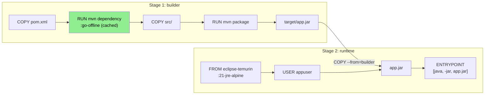
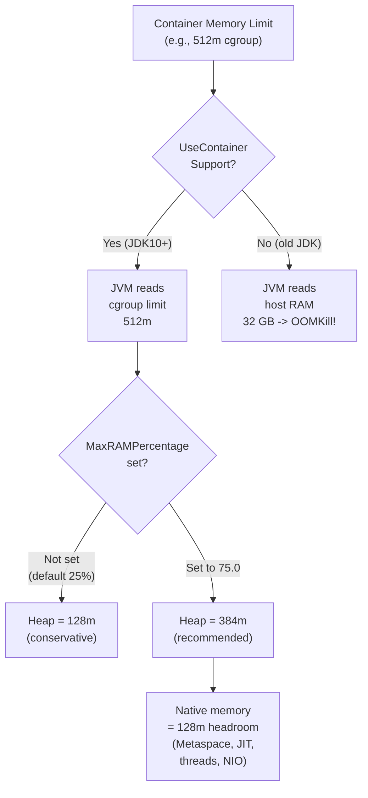

## Keywords in This File
{: .no_toc }

| # | Keyword | Weight |
|---|---|---|
| 1 | [Multi-Stage Builds for Java Applications](#multi-stage-builds-for-java-applications) | critical |
| 2 | [JVM Memory in Containers](#jvm-memory-in-containers) | critical |
| 3 | [JVM CPU Awareness in Containers](#jvm-cpu-awareness-in-containers) | high |
| 4 | [Java Container Image Optimization](#java-container-image-optimization) | high |
| 5 | [Base Image Selection for Java](#base-image-selection-for-java) | high |

---

# Multi-Stage Builds for Java Applications

**Interview Weight:** critical - Asked in every Java-and-Docker
interview. Interviewers use this to distinguish candidates who have
actually built Java container pipelines from those who have only
run pre-built images.

---

### 🎯 Model Answer

**30 seconds:**

> Multi-stage builds use multiple FROM instructions in one Dockerfile.
> The first stage (builder) contains the full JDK, Maven, and all
> build tools. The second stage (runtime) starts from a minimal JRE
> image and copies only the compiled JAR from the builder stage.
> The final image has no Maven, no JDK compiler, no test dependencies.
> Result: 1.5 GB builder image becomes a 200 MB runtime image.

**3 minutes (Senior):**

> The build-time and runtime environments for Java are fundamentally
> different. At build time you need the JDK compiler, Maven or Gradle,
> test dependencies, static analysis plugins, and potentially
> integration test databases. At runtime you need only the JRE and
> the compiled artifacts. Multi-stage builds enforce this separation.
>
> The pattern works by naming the builder stage (AS builder) and
> using COPY --from=builder to pull only the output artifact into
> the final stage. Everything else in the builder stage - the 500 MB
> Maven local repository, the JDK compiler, the Surefire test
> runner - stays in the builder stage and is discarded.
>
> The critical optimization within the builder stage is dependency
> layer caching. Copy pom.xml first, run mvn dependency:go-offline,
> then copy src/. When only source code changes, the dependency
> layer is a cache hit. A typical code change triggers only the
> compile and package steps, taking 15 seconds instead of 3 minutes.
> For Gradle, the equivalent is copying build.gradle and running
> gradle dependencies before copying the source.

**Framework:** WHAT -> WHY -> HOW -> TRADE-OFF -> EXAMPLE

*Adapting up:* Staff discusses Jib as the alternative to Dockerfile
multi-stage, BuildKit parallelism for multi-module projects, and
how multi-stage maps to the supply chain security model (SBOM
generated from the builder stage, signed image from the runtime).

*Adapting down:* Junior: "You have two stages: build with Maven
in one, copy the JAR into a small JRE image in the second."

**Blank Mind Recovery:**

**(1) Restate:** "You are asking about multi-stage builds for Java -
let me think through what makes Java builds different from runtime."

**(2) First principles:** "Building Java requires a JDK plus build
tools. Running Java requires only a JRE. These are separate concerns
and should live in separate containers."

**(3) Bridge:** "This is like the difference between a compiler and
an interpreter. The compiler (Maven + JDK) produces the artifact.
The runtime (JRE) executes it. Multi-stage builds separate them."

---

### 📘 Concept Explanation

**What it is:**
Multi-stage builds use multiple FROM instructions in one Dockerfile.
Each stage can use a different base image. COPY --from=stagename
copies files between stages. Only the final stage becomes the image.

**The problem it solves:**
Without multi-stage builds, Java Docker images either include all
build tools in the runtime image (bloat, security risk) or require
a separate CI build step that produces a JAR before docker build
runs (complex pipeline, no layer caching for dependencies).

**How it works:**

```
Stage 1 (Builder):           Stage 2 (Runtime):
maven:3.9-jdk-21             eclipse-temurin:21-jre-alpine
    |                                |
COPY pom.xml                    COPY --from=builder
RUN mvn deps     <- cached      /build/target/app.jar
COPY src/
RUN mvn package  <- fast rebuild
    |
    app.jar  <--- copied here -->

Final image: 200 MB (JRE + JAR only)
Builder image: 1.5 GB (discarded)
```



> **Diagram walkthrough:** The builder stage runs the full Maven
> build. The dependency download step (green) is cached unless
> pom.xml changes. The COPY --from=builder instruction is the
> only connection between stages - only the compiled JAR crosses
> the boundary. The runtime stage has no knowledge of how the JAR
> was built, no Maven local repo, and no JDK compiler tools.

**The key insight:**
The --from=builder instruction copies files at their filesystem
path at the end of the named stage. You can copy from any named
stage, from a specific stage by index, or even from an external
image. This enables patterns like: copy configuration from a
config image, copy certificates from a secrets image.

**When to use it:**
Always for Java applications. There is no reason not to use
multi-stage builds - they are strictly superior to single-stage
for any compiled language.

**When multi-stage complexity is overkill:**
For interpreted scripts (bash, Python without compilation), a
single stage is often sufficient because there is no build artifact
separate from the source.

**Alternatives:**
- Jib (Maven/Gradle plugin) - builds layers programmatically
  without Dockerfile or Docker daemon
- Buildpacks - convention-based multi-stage equivalent without
  writing Dockerfiles

**First-principles derivation:**
Build-time dependencies (compilers, test frameworks, static
analyzers) and runtime dependencies (JRE, application JAR) are
separate concerns. Mixing them in one image violates the single
responsibility principle and the principle of least privilege.
Multi-stage builds implement this separation at the image level.

---

### 💻 Code Example

**Example 1: Standard Maven multi-stage build**

```dockerfile
# Stage 1: build
FROM maven:3.9-eclipse-temurin-21 AS builder
WORKDIR /build

# Dependency layer: copy pom before source
# (cached until pom.xml changes)
COPY pom.xml .
RUN mvn dependency:go-offline -q

# Source layer: changes on every code change
COPY src/ ./src/
RUN mvn package -DskipTests -q

# Stage 2: runtime (no build tools)
FROM eclipse-temurin:21-jre-alpine
# Non-root user for least privilege
RUN addgroup -S appgroup \
    && adduser -S appuser -G appgroup
WORKDIR /app
COPY --from=builder \
    /build/target/app.jar \
    app.jar
RUN chown appuser:appgroup app.jar
USER appuser

EXPOSE 8080
ENTRYPOINT ["java", \
  "-XX:MaxRAMPercentage=75.0", \
  "-XX:+UseZGC", \
  "-XX:+ExitOnOutOfMemoryError", \
  "-jar", "app.jar"]
```

> **Code walkthrough:** The pom.xml copy and dependency download are
> separate instructions to exploit layer caching. When only src/ changes
> (typical code change), Docker reuses the dependency cache layer and
> only the COPY src/ and mvn package steps re-run. The runtime image
> uses eclipse-temurin:21-jre-alpine, which contains only the JRE (no
> compiler), and runs as a non-root user. ExitOnOutOfMemoryError ensures
> Kubernetes can restart the container on OOM rather than leaving it in
> a degraded state.

**Example 2: Gradle multi-stage with test separation**

```dockerfile
FROM gradle:8-jdk21 AS builder
WORKDIR /build
# Gradle wrapper + build files first
COPY gradlew build.gradle settings.gradle ./
COPY gradle/ ./gradle/
# Download dependencies (cached layer)
RUN ./gradlew dependencies -q
COPY src/ ./src/
# Build without tests (tests run in CI separately)
RUN ./gradlew bootJar -x test -q

FROM eclipse-temurin:21-jre-alpine AS runtime
WORKDIR /app
COPY --from=builder \
    /build/build/libs/app.jar \
    app.jar
RUN addgroup -S app \
    && adduser -S app -G app \
    && chown app:app app.jar
USER app

ENV JAVA_TOOL_OPTIONS="\
  -XX:MaxRAMPercentage=75.0 \
  -XX:+ExitOnOutOfMemoryError"

ENTRYPOINT ["java", "-jar", "app.jar"]
```

> **Code walkthrough:** Copying gradlew, build.gradle, and settings.gradle
> before src/ enables Gradle dependency caching. JAVA_TOOL_OPTIONS is
> recognized by all JVM processes automatically - it is the right
> variable to set JVM flags in a Docker environment because it does not
> require modifying the ENTRYPOINT. The bootJar task creates a Spring
> Boot fat JAR. Running tests separately in CI (not in the docker build)
> keeps builds fast and allows test parallelism.

**Example 3: Multi-module Maven build**

```dockerfile
FROM maven:3.9-eclipse-temurin-21 AS builder
WORKDIR /build

# Parent POM and module POMs first
COPY pom.xml .
COPY api/pom.xml ./api/
COPY service/pom.xml ./service/
COPY web/pom.xml ./web/
RUN mvn dependency:go-offline -q -pl web -am

# Now copy all sources
COPY api/src ./api/src
COPY service/src ./service/src
COPY web/src ./web/src
# Build only the deployable module
RUN mvn package -DskipTests -q -pl web -am

FROM eclipse-temurin:21-jre-alpine
WORKDIR /app
COPY --from=builder \
    /build/web/target/web.jar app.jar
ENTRYPOINT ["java", \
  "-XX:MaxRAMPercentage=75.0", "-jar", "app.jar"]
```

> **Code walkthrough:** Multi-module builds require copying all module
> POMs before source code. The `-pl web -am` flag builds only the web
> module and its dependencies (api, service). Copying module POMs separately
> (before source) ensures the dependency layer cache is based on the
> dependency graph, not application code. Only pom.xml changes trigger
> a dependency re-download.

---

### ⚖️ Comparison

| Approach | Image Size | Build Speed | Complexity | Use When |
|---|---|---|---|---|
| **Multi-stage Dockerfile** | Small (200 MB) | Fast with cache | Low | Default Java pattern |
| Single-stage Dockerfile | Large (1.5 GB) | Slow | Very Low | Never (anti-pattern) |
| Jib plugin | Small (150 MB) | Fastest | Low | Maven/Gradle projects without Docker daemon |
| Buildpacks | Small (200 MB) | Medium | None | Convention-over-config platforms |
| Kaniko | Small (200 MB) | Medium | Medium | Kubernetes-native builds without Docker |

**The deciding factor:**
Use multi-stage Dockerfile for control and transparency. Use Jib
when you want the fastest incremental builds with no Dockerfile
maintenance. Use Buildpacks when your platform mandates them
(Cloud Foundry, Heroku, some Kubernetes PaaS).

---

### 🔥 Field Q&A

#### Production Failures

Q: Multi-stage build works locally but fails in CI with
"unauthorized: authentication required" on the COPY --from=builder step.

A: The COPY --from=builder step references the builder stage within
the same build, not a registry. This error usually means the CI
system is using a stale cached image from a previous stage name.
Fix by explicitly tagging the builder stage and ensuring BuildKit
is enabled: DOCKER_BUILDKIT=1. If the CI system is using parallel
builds, ensure both stages are in the same docker build context.

Q: The dependency layer cache never hits in CI - every build
re-downloads all Maven dependencies.

A: CI runners often start with a fresh Docker environment that
has no layer cache. The fix is to use BuildKit registry cache:
add `--cache-from type=registry,ref=registry/myapp:cache` and
`--cache-to type=registry,ref=registry/myapp:cache,mode=max`
to the docker build command. The CI runner pulls cached layers
from the registry before building. Alternatively, use Jib which
has its own registry-based layer caching that is independent of
the Docker layer cache.

Q: The runtime image size is still 800 MB despite multi-stage builds.

A: The most common causes are: using JDK instead of JRE as the
runtime base (JDK is 400 MB, JRE-alpine is 120 MB), large static
assets COPY'd into the image, or a fat JAR that includes test
dependencies because -DskipTests was not passed. Check with
docker history imagename to see which layer is large. If the
JDK layer is wrong, change the runtime FROM to eclipse-temurin:21-jre-alpine.

#### Candidate Mistakes

Q: Candidate writes a single-stage Dockerfile with Maven in the runtime image.

**What NOT to say:** "I just need it to work for now, I can optimize later."

**Say instead:** "Multi-stage builds are standard practice for Java.
I always separate the build stage (Maven + JDK) from the runtime
stage (JRE only) to reduce image size, reduce attack surface, and
prevent build tools from being accessible in the running container."

Q: Candidate copies all source code before installing dependencies.

**What NOT to say:** "COPY . . copies everything including pom.xml."

**Say instead:** "I copy pom.xml separately before the source code
so that the dependency download step is a Docker cache hit when
only application code changes. COPY . . invalidates the cache on
any file change, so every build re-downloads all dependencies."

Q: Candidate uses CMD instead of ENTRYPOINT for the Java command.

**What NOT to say:** "CMD and ENTRYPOINT are basically the same."

**Say instead:** "I use exec form ENTRYPOINT so the JVM runs as PID 1
and receives SIGTERM directly. CMD in shell form runs a shell as
PID 1, which may not forward SIGTERM to the JVM, breaking graceful
shutdown in Kubernetes."

Q: Candidate hardcodes -Xmx1g without container awareness.

**What NOT to say:** "I know my container will always have 2 GB."

**Say instead:** "I use -XX:MaxRAMPercentage=75.0 instead of fixed -Xmx.
This makes the heap proportional to whatever the container's memory
limit is, so the same image works in a 512m dev container and a
4g production container without changing the Dockerfile."

#### Questions to Ask the Interviewer

Q: "What base image do you use for Java services - full JDK or JRE?"

*Why:* Signals awareness of image size trade-offs and security posture.

*If asked back:* "JRE is sufficient for running Java applications.
The JDK adds the compiler, debugger, and javadoc tools that are not
needed at runtime and increase the attack surface."

Q: "Do you run CI builds with a Docker layer cache between runs?"

*Why:* Reveals the build pipeline maturity and whether multi-stage
caching is actually effective in your environment.

*If asked back:* "Without caching between CI runs, the dependency
download step runs every time. BuildKit registry cache or Jib
solves this. We saw build times drop from 3 minutes to 30 seconds
after implementing registry-based layer caching."

Q: "Do your Docker images pass vulnerability scanning before
deployment?"

*Why:* Shows supply chain security awareness, which is a staff-level concern.

*If asked back:* "We scan images with Trivy or Grype in CI and
fail the build on critical CVEs. We also have an automated pipeline
that rebuilds images when the base JRE image gets a security update."

Q: "What is your policy for pinning base image versions?"

*Why:* Distinguishes mature pipelines (pin by digest) from immature ones (latest).

*If asked back:* "We pin to the specific tag for stability and track
the digest in the pipeline artifact. Using :latest would mean a base
image update could break production with no code changes."

#### Live Coding Context

Coding question template: "Write a production-ready multi-stage
Dockerfile for a Spring Boot Maven application."

What the interviewer watches:
- Whether you copy pom.xml separately from src/ for cache efficiency
- Whether you use JRE (not JDK) as the runtime base
- Whether you include -XX:MaxRAMPercentage in the ENTRYPOINT
- Whether you use exec form ENTRYPOINT (JSON array, not shell string)
- Whether you create a non-root user

Most common implementation mistake:
Forgetting to use -DskipTests in the mvn package command, causing
unit tests to run during docker build. Tests should run in CI
before docker build, not inside the build itself.

*Why this signals:* Understanding that docker build is not the
right place for tests shows production pipeline maturity.

---
---

# JVM Memory in Containers

**Interview Weight:** critical - The most commonly misunderstood
Java container issue. Causes immediate OOMKills in production when
misconfigured. Interviewers ask this to test whether you have
actually run Java in containers or just read the Kubernetes docs.

---

### 🎯 Model Answer

**30 seconds:**

> Before JDK 10, the JVM read host memory for heap sizing. Inside
> a container with a 512m limit on a 32 GB host, it would allocate
> an 8 GB default heap, immediately exceed the cgroup limit, and
> get OOMKilled with exit code 137. From JDK 10 (backported to
> JDK 8u191), the JVM reads cgroup memory limits. Best practice
> is to set -XX:MaxRAMPercentage=75.0 to use 75% of the container
> limit for heap, leaving 25% for JVM native memory.

**3 minutes (Senior):**

> The JVM calculates default max heap as 25% of available memory
> (ergonomics). Before container awareness, "available memory"
> meant host RAM. A Spring Boot service running in a 512m container
> on a 32 GB server would calculate a default heap of 8 GB,
> allocate the memory, and be killed by the Linux OOM killer
> because the cgroup limit was exceeded. The exit code is 137
> (SIGKILL), not a Java OOM error - the JVM never throws
> OutOfMemoryError because the cgroup kills the process first.
>
> Container awareness (UseContainerSupport=true, the default from
> JDK 10) fixes the numerator: instead of reading /proc/meminfo
> for total host RAM, the JVM reads the cgroup memory limit file
> /sys/fs/cgroup/memory/memory.limit_in_bytes. With a 512m limit,
> the default heap becomes 128 MB (25% of 512m).
>
> This is too conservative for most applications. Setting
> MaxRAMPercentage=75.0 uses 384m for heap. The remaining 128m
> covers: Metaspace (class metadata, ~60-100 MB for a Spring Boot
> app), JIT code cache, thread stacks (1m per thread by default),
> and direct buffer pool (NIO, Netty). Sizing only for heap and
> ignoring native memory is the second most common memory mistake.

**Framework:** WHAT -> WHY -> HOW -> TRADE-OFF -> EXAMPLE

*Adapting up:* Staff discusses sizing for different workload types
(high-throughput API vs batch), native memory tracking with NMT,
and how to diagnose if the 25% non-heap headroom is actually
sufficient for the specific workload.

*Adapting down:* Junior: "Set -XX:MaxRAMPercentage=75.0 in the
Dockerfile ENTRYPOINT so the JVM uses 75% of the container memory
for heap."

**Blank Mind Recovery:**

**(1) Restate:** "You are asking about JVM memory in containers -
let me think through how the JVM decides its heap size."

**(2) First principles:** "The JVM sizes its heap based on what
it thinks is available memory. The question is what 'available
memory' means inside a container."

**(3) Bridge:** "This is the classic configuration vs reality gap.
The JVM was configured by the host's memory. Containers added
a new memory boundary that the JVM was not aware of."

---

### 📘 Concept Explanation

**What it is:**
JVM memory in containers refers to how the JVM calculates and
allocates heap memory when running inside a container with cgroup
memory limits.

**The problem it solves:**
Without container awareness, the JVM allocated heap based on host
RAM, far exceeding the container's cgroup memory limit, causing
the OOM killer to terminate the JVM process (exit code 137) before
any Java-level OOM handling could occur.

**How it works:**

```
Without container awareness:
  Host RAM: 32 GB
  Container limit: 512m
  JVM reads /proc/meminfo -> 32 GB
  Default heap = 25% of 32 GB = 8 GB
  cgroup limit = 512m -> OOMKill!

With container awareness (JDK 10+):
  JVM reads cgroup limit -> 512m
  Default heap = 25% of 512m = 128m
  JVM starts OK

With MaxRAMPercentage=75.0:
  Heap = 75% of 512m = 384m
  Remaining 128m: Metaspace + threads
  + JIT cache + direct buffers
```



> **Diagram walkthrough:** The critical branch point is UseContainerSupport.
> Old JDKs take the host RAM path and get OOMKilled. JDK 10+ takes the
> cgroup path. The second decision point is whether MaxRAMPercentage is
> set. Without it, the JVM uses a conservative 25% of the cgroup limit.
> Setting it to 75% gives three times the heap headroom while preserving
> 25% for native memory. The 25% native memory budget must cover
> Metaspace, JIT compiled code, thread stacks, and direct buffers.

**The key insight:**
Setting MaxRAMPercentage is not optional for production workloads.
The default 25% leaves most of the container memory unused. And
the remaining 25% non-heap budget must be explicitly verified -
Spring Boot Metaspace alone uses 60-100 MB.

**When to use fixed -Xmx:**
When you need a hard predictable ceiling for the heap and the
container is dedicated to a single workload. MaxRAMPercentage is
better when the same image runs in containers of varying sizes.

**When to use InitialRAMPercentage:**
Set -XX:InitialRAMPercentage=50.0 alongside MaxRAMPercentage to
control how much heap the JVM reserves at startup. Reducing initial
heap reduces startup memory but increases GC pressure during
warm-up as the heap expands.

**Alternatives:**
- Fixed -Xmx (simple but inflexible across container sizes)
- JAVA_TOOL_OPTIONS environment variable (more flexible - can be
  set per-container without changing the Dockerfile)

**First-principles derivation:**
The JVM was designed before Linux cgroups existed. Its ergonomics
assumed the process could use a fraction of the machine's total
RAM. When cgroups added a new virtual "machine" boundary, the JVM
ergonomics needed to be updated to respect that boundary.
Container awareness is the JVM learning about the container
abstraction layer above the OS.

---

### 💻 Code Example

**Example 1: Demonstrating the problem and fix**

```bash
# PROBLEM: Old JDK or disabled container support
docker run --rm \
    --memory=512m \
    eclipse-temurin:8 \
    java -XX:+PrintFlagsFinal -version 2>&1 \
    | grep MaxHeapSize
# MaxHeapSize = 8589934592 (8 GB!) -- WRONG
# Container gets OOMKilled

# GOOD: JDK 10+ container awareness
docker run --rm \
    --memory=512m \
    eclipse-temurin:21 \
    java -XX:+PrintFlagsFinal -version 2>&1 \
    | grep MaxHeapSize
# MaxHeapSize = 130023424 (124 MB, 25% of 512m)

# BEST: Set MaxRAMPercentage explicitly
docker run --rm \
    --memory=512m \
    eclipse-temurin:21 \
    java -XX:MaxRAMPercentage=75.0 \
    -XX:+PrintFlagsFinal -version 2>&1 \
    | grep MaxHeapSize
# MaxHeapSize = 402653184 (384 MB, 75% of 512m)
```

> **Code walkthrough:** The first command shows the OOM disaster -
> 8 GB heap in a 512m container means immediate OOMKill. The second
> shows container-aware behavior: 124 MB is correct but conservative.
> The third shows the production setting: 384 MB for heap leaves
> 128 MB for Metaspace, JIT, and native memory. Always verify your
> JVM's actual MaxHeapSize in the container environment before
> deploying to production.

**Example 2: Diagnosing memory usage at runtime**

```bash
# Check live heap usage (requires jcmd in container)
docker exec myapp jcmd 1 GC.heap_info
# ZHeap used 85M, capacity 256M, max capacity 384M

# Get native memory breakdown
docker exec myapp jcmd 1 VM.native_memory
# Total: reserved=1024MB, committed=512MB
# Java Heap (reserved=384MB, committed=256MB)
# Class (Metaspace, reserved=192MB, committed=68MB)
# Thread (reserved=68MB, committed=68MB #68 threads)
# Code (JIT cache, reserved=256MB, committed=64MB)

# Spring Boot Actuator (if configured)
curl http://localhost:8080/actuator/metrics/jvm.memory.used
```

> **Code walkthrough:** `VM.native_memory` reveals the complete JVM
> memory picture beyond just heap. The Metaspace shows actual class
> metadata usage (68 MB committed for a Spring Boot app with many
> beans). Thread memory is 1 MB per thread by default - 68 threads
> uses 68 MB. JIT code cache holds compiled native methods. If
> the combined committed native memory approaches the container limit
> minus the heap, you need to increase the container limit or reduce
> thread pool sizes.

**Example 3: Dockerfile with correct memory configuration**

```dockerfile
FROM eclipse-temurin:21-jre-alpine
RUN addgroup -S app && adduser -S app -G app
WORKDIR /app
COPY app.jar app.jar
USER app

# MaxRAMPercentage: heap = 75% of container limit
# ExitOnOutOfMemoryError: ensure clean restart
# UseZGC: low-latency GC for container workloads
# PrintCommandLineFlags: log actual JVM flags
ENTRYPOINT ["java", \
  "-XX:MaxRAMPercentage=75.0", \
  "-XX:+ExitOnOutOfMemoryError", \
  "-XX:+UseZGC", \
  "-XX:+PrintCommandLineFlags", \
  "-jar", "app.jar"]
```

> **Code walkthrough:** PrintCommandLineFlags logs the actual
> resolved JVM flags at startup, including the computed MaxHeapSize.
> This appears in docker logs on the first line and is essential
> for production verification - you can confirm MaxHeapSize is 75%
> of the actual container memory limit at startup without needing
> to exec into the container. ExitOnOutOfMemoryError ensures the
> container exits with a non-zero code on OOM rather than hanging.

---

### ⚖️ Comparison

| Configuration | Heap Allocation | Flexibility | Risk |
|---|---|---|---|
| **MaxRAMPercentage=75.0** | 75% of container limit | High (scales with limit) | Low (works in all sizes) |
| Fixed -Xmx512m | Fixed 512 MB | Low (breaks if limit changes) | Medium (tight or wasteful) |
| Default (25% ergonomics) | 25% of container limit | High | Low (but wasteful) |
| No container awareness (old JDK) | 25% of host RAM | None | Critical (OOMKill) |

**The deciding factor:**
Use MaxRAMPercentage=75.0 for new containers. Only use fixed -Xmx
when a specific heap ceiling is required by a compliance policy
or when tuning a specific service where heap sizing is precisely known.

---

### 🔥 Field Q&A

#### Production Failures

Q: Service gets OOMKilled (exit code 137) repeatedly in Kubernetes.
No Java OOM exception in the logs - the container just dies.

A: Exit code 137 is SIGKILL from the cgroup OOM killer, not from
the JVM. This means the container exceeded its memory limit.
Diagnosis: kubectl describe pod shows "OOMKilled: true" in the
container status. Check kubectl top pod for memory usage trends.
Run docker stats or kubectl exec jcmd 1 VM.native_memory to see
where memory is going. Common causes: (1) MaxRAMPercentage not set
(heap is only 25% of limit, but native memory pushes total over),
(2) native memory leak (thread creation without teardown),
(3) direct buffer pool (NIO/Netty) not counted in heap limit,
(4) container limit too low for the actual workload. Fix by
adding MaxRAMPercentage=75.0, monitoring VM.native_memory, and
increasing the container memory limit if the workload requires it.

Q: Service runs fine for hours then gets OOMKilled. Memory usage
grows steadily in docker stats.

A: This is a memory leak, not a sizing issue. A GC-able heap leak
shows as heap usage growing until GC cannot reclaim it. A native
memory leak shows as non-heap memory growing in VM.native_memory.
Diagnosis: enable GC logging (-Xlog:gc*) and watch heap usage
across GC cycles. If heap shrinks after full GC but then grows
back faster each time, there is a heap leak. If non-heap memory
(especially thread count) grows, check thread pool configurations
for leaks. Use async-profiler for heap allocation profiling:
profiler.sh -d 60 -e alloc -f heap.jfr <pid>.

Q: Service starts and immediately exits with exit code 1, not 137.

A: Exit code 1 before any business logic means JVM startup failure.
Check docker logs - the JVM prints the error. Common causes:
-Xmx exceeds the container memory limit (JVM fails to allocate),
invalid JVM flag syntax (use java -XX:+UnlockDiagnosticVMOptions
-XX:+PrintFlagsFinal to verify), or a missing -jar flag so the JVM
tries to find a class main method.

#### Candidate Mistakes

Q: Candidate sets -Xmx=512m inside a 512m container.

**What NOT to say:** "The heap limit matches the container limit so everything fits."

**Say instead:** "Setting -Xmx equal to the container limit will cause OOMKills.
The JVM needs memory beyond the heap: Metaspace for class metadata (60-100 MB
in Spring Boot), JIT code cache, and thread stacks (1 MB per thread). With
-Xmx=512m in a 512m container, total JVM memory exceeds 512m and the process
is killed. Set -XX:MaxRAMPercentage=75.0 to leave 25% headroom."

Q: Candidate is unaware of the difference between heap OOM and
cgroup OOMKill.

**What NOT to say:** "If I get out of memory errors, I increase -Xmx."

**Say instead:** "There are two types of OOM events in containers. A Java
OutOfMemoryError is thrown by the JVM when the heap is full and GC cannot
free space - this is caught and logged. A cgroup OOMKill is SIGKILL from the
Linux kernel when the container exceeds its memory limit - this produces exit
code 137 with no Java stack trace. They require different fixes."

Q: Candidate forgets about native memory and only sizes for heap.

**What NOT to say:** "I set MaxRAMPercentage so the heap fits in the container."

**Say instead:** "I set MaxRAMPercentage=75.0 to size the heap to 75% of
the container limit, leaving 25% for non-heap memory: Metaspace, JIT code
cache, and thread stacks. I verify with VM.native_memory that the total
committed memory fits within the container limit."

Q: Candidate uses shell form ENTRYPOINT, which adds a shell process.

**What NOT to say:** "ENTRYPOINT java -jar app.jar runs the app correctly."

**Say instead:** "Shell form ENTRYPOINT adds a shell as PID 1. The shell
may not forward SIGTERM to the JVM, breaking graceful shutdown. I use
exec form ENTRYPOINT with a JSON array: ['java', '-jar', 'app.jar']
so the JVM is PID 1 and receives signals directly."

#### Questions to Ask the Interviewer

Q: "What memory limits do you set for Java services in Kubernetes?"

*Why:* Reveals whether the team has thought about JVM memory sizing.

*If asked back:* "I recommend setting memory limits at 1.5x to 2x
the expected heap size to cover Metaspace, JIT cache, and threads.
Then set MaxRAMPercentage=75.0 so the heap automatically sizes to
75% of whatever limit is set."

Q: "Do you use GC logging in production for your containerized services?"

*Why:* Signals awareness that GC behavior changes inside containers.

*If asked back:* "GC logs are essential for diagnosing OOMKills vs
heap exhaustion. I add -Xlog:gc*:file=/app/logs/gc.log:time,uptime
to the ENTRYPOINT and mount the log directory as a volume."

Q: "Have you seen JVM startup failures related to memory in containers?"

*Why:* Tests production experience and knowledge of failure modes.

*If asked back:* "Yes - the most common startup failure is -Xmx
exceeding the container limit. The JVM fails to reserve the heap
and exits with 'Error occurred during initialization of VM, Could
not reserve enough space for object heap'."

Q: "What GC algorithm do you use for containerized Java services?"

*Why:* Demonstrates GC algorithm selection knowledge.

*If asked back:* "ZGC for latency-sensitive services - it has
sub-millisecond pause times and works well with container memory
limits. G1GC for throughput-oriented batch processing. The GC
algorithm choice matters more in containers because pause times
affect Kubernetes readiness probe timeouts."

#### Live Coding Context

Coding question template: "Configure a Dockerfile and JVM flags
for a Spring Boot service that needs to run in containers from 256m
to 4g memory limits without changes."

What the interviewer watches:
- Whether you use MaxRAMPercentage instead of fixed -Xmx
- Whether you include ExitOnOutOfMemoryError
- Whether you mention non-heap memory requirements
- Whether you verify the configuration with PrintCommandLineFlags

Most common implementation mistake:
Setting -Xmx to the container memory limit, causing OOMKills
because no headroom is left for Metaspace and thread stacks.

*Why this signals:* The bug is invisible during testing with large
containers but catastrophic in production with tight limits. It
shows whether the candidate understands JVM memory architecture.

---
---

# JVM CPU Awareness in Containers

**Interview Weight:** high - Less known than memory awareness but
equally impactful. Causes thread pool oversizing (too many threads,
excessive context switching, CPU throttling) when misconfigured.

---

### 🎯 Model Answer

**30 seconds:**

> The JVM uses Runtime.getRuntime().availableProcessors() to size
> thread pools - ForkJoinPool, parallel streams, and frameworks
> like Quarkus and Spring WebFlux use this. Without CPU quota
> awareness, availableProcessors returns the host's total CPU count.
> A service with 0.5 CPU quota on a 64-core host creates a 64-thread
> ForkJoinPool that gets severely throttled. From JDK 10, the JVM
> reads CPU quota from cgroups and returns a proportional value.

**3 minutes (Senior):**

> The CPU configuration in containers has two dimensions: cpuset
> (which specific CPUs the container can use) and cpu quota (how
> much CPU time the container gets in each scheduling period). The
> JVM's container CPU awareness handles both, but differently.
>
> For cpuset, availableProcessors returns the number of CPUs in
> the container's cpuset. If you pin a container to CPUs 0 and 1,
> availableProcessors returns 2 - this is correct.
>
> For cpu quota (the more common case with Kubernetes), the JVM
> computes availableProcessors as ceiling(quota / period). A
> container with 500m (0.5 CPU) gets quota=50000, period=100000,
> so availableProcessors returns ceiling(0.5) = 1. This is the
> right behavior.
>
> The practical impact is on thread-pool-sized-by-available-processors:
> ForkJoinPool (used by parallel streams, CompletableFuture.join()),
> Quarkus worker thread pool, and Reactor schedulers all call
> availableProcessors. On a 64-core host without CPU awareness,
> these create 64 threads. In a container with 1 CPU quota, they
> should create 1-2 threads. Running 64 threads when only 0.5 CPUs
> are available causes massive context switching and CPU throttling,
> which is visible as high wall-clock latency even when CPU usage
> is low.

**Framework:** WHAT -> WHY -> HOW -> TRADE-OFF -> EXAMPLE

*Adapting up:* Staff discusses the interaction between container
CPU limits and JVM JIT compilation (C2 compiler uses more cores
for faster compilation) and how to profile CPU throttling.

*Adapting down:* Junior: "Set CPU limits in Kubernetes and use
JDK 10+ so the JVM creates the right number of threads for those limits."

**Blank Mind Recovery:**

**(1) Restate:** "You are asking about CPU configuration for JVMs
in containers - let me think about what the JVM does with CPU info."

**(2) First principles:** "Thread pools size themselves to CPU count.
The question is whether the JVM reads the container's CPU quota or
the host's CPU count."

**(3) Bridge:** "Same pattern as memory awareness: pre-cgroup, the
JVM read host resources. Container awareness makes it read cgroup
limits."

---

### 📘 Concept Explanation

**What it is:**
JVM CPU awareness in containers refers to how the JVM computes
`Runtime.getRuntime().availableProcessors()` when running inside
a container with a CPU quota.

**The problem it solves:**
Without CPU quota awareness, the JVM creates thread pools sized
for the host's full CPU count. A 0.5-CPU container on a 64-core
host creates 64-thread pools, causing severe CPU throttling when
the scheduler enforces the quota.

**How it works:**

```
CPU Quota calculation:
  Container: --cpus=0.5
  cgroup: cpu.cfs_quota_us=50000
          cpu.cfs_period_us=100000

  ratio = 50000 / 100000 = 0.5
  availableProcessors = ceiling(0.5) = 1

Thread pool impacts:
  ForkJoinPool.commonPool()
    = max(1, availableProcessors - 1) = 1 thread
  Parallel Streams: uses ForkJoinPool
  CompletableFuture.supplyAsync: uses ForkJoinPool
  Quarkus worker pool: 8 * availableProcessors = 8
```

**The key insight:**
availableProcessors is not just metadata - it drives thread pool
sizing across the entire JVM ecosystem. An incorrect value causes
thread pool misconfiguration in every framework and library that
uses it without the developer explicitly overriding the pool size.

**When to explicitly override:**
For I/O-bound services (database calls, HTTP calls), thread pools
should be larger than availableProcessors. Set a custom pool size
explicitly rather than relying on the CPU-based default.

**When to verify CPU awareness:**
Before deploying any Java service to Kubernetes with CPU limits,
verify that availableProcessors returns the expected value:
`docker run --cpus=0.5 myimage java -cp . -e System.out.println(Runtime.getRuntime().availableProcessors())`

**Alternatives:**
- JVM flag -XX:ActiveProcessorCount=N - override the detected
  processor count explicitly

**First-principles derivation:**
Optimal thread pool size for CPU-bound work is N (where N is
available cores). More threads causes context switching overhead.
Fewer threads under-utilizes CPUs. The JVM uses availableProcessors
as N, so if N is wrong, every CPU-bound thread pool is wrong.

---

### 💻 Code Example

**Example 1: Verifying CPU awareness**

```bash
# Verify availableProcessors with container CPU quota
docker run --rm --cpus=0.5 eclipse-temurin:21 \
    java -e "System.out.println(\
    'Available processors: ' + \
    Runtime.getRuntime().availableProcessors())"
# Output: Available processors: 1

docker run --rm --cpus=2.0 eclipse-temurin:21 \
    java -e "System.out.println(\
    Runtime.getRuntime().availableProcessors())"
# Output: 2

# Override if needed (e.g., for I/O-bound workloads)
docker run --rm --cpus=1.0 eclipse-temurin:21 \
    java -XX:ActiveProcessorCount=4 \
    -e "System.out.println(\
    Runtime.getRuntime().availableProcessors())"
# Output: 4 (overridden)
```

> **Code walkthrough:** With --cpus=0.5, the JVM correctly reports 1
> available processor (ceiling of 0.5). ForkJoinPool.commonPool() uses
> max(1, availableProcessors - 1) = 1 thread for 0.5 CPU limit.
> For I/O-bound services, override with ActiveProcessorCount=N where N
> is the concurrency level you want for I/O blocking threads.

**Example 2: Impact on Spring Boot thread pools**

```java
// Default behavior - observe CPU awareness impact

@Component
public class StartupDiagnostics
    implements ApplicationRunner {

    @Override
    public void run(ApplicationArguments args) {
        int cpus = Runtime.getRuntime()
            .availableProcessors();
        // ForkJoinPool.commonPool size
        int fjp = ForkJoinPool.commonPool()
            .getParallelism();
        // Spring MVC default thread pool
        int mvc = Runtime.getRuntime()
            .availableProcessors() * 200; // max

        log.info(
            "CPU count: {}, FJP: {}, MVC max: {}",
            cpus, fjp, mvc);
        // With 0.5 CPU: CPU count: 1, FJP: 1, MVC max: 200
        // With 32 CPU host no limit:
        //   CPU count: 32, FJP: 31, MVC max: 6400
    }
}
```

> **Code walkthrough:** This diagnostic shows the downstream effect
> of availableProcessors. With 0.5 CPU, ForkJoinPool has 1 thread
> (correct for CPU-bound work) but the MVC thread pool uses a different
> calculation. Spring Boot's Tomcat thread pool default is 200 max threads,
> which is not CPU-based, so it is unaffected. The ForkJoinPool size
> matters for any code using parallel streams or CompletableFuture.runAsync().

---

### ⚖️ Comparison

| CPU Config | availableProcessors | ForkJoinPool Threads | CPU Throttling Risk |
|---|---|---|---|
| **No CPU limit** | Host CPUs (32+) | Host CPUs - 1 | High (no limit to enforce) |
| **--cpus=0.5, JDK 21** | 1 (correct) | 1 thread | Low |
| **--cpus=0.5, JDK 8 old** | Host CPUs | Host CPUs - 1 | Critical |
| **ActiveProcessorCount=4** | 4 (override) | 3 threads | Medium (intentional) |

**The deciding factor:**
Use JDK 10+ and set CPU limits in Kubernetes. Verify availableProcessors
at startup with a diagnostic log. Override with ActiveProcessorCount only
when you need I/O-thread concurrency beyond what the CPU quota implies.

---

### 🔥 Field Q&A

#### Production Failures

Q: Service with 0.5 CPU in Kubernetes is experiencing high P99
latency even with low throughput. CPU usage stays below the limit.

A: This is CPU throttling. Linux enforces the 0.5 CPU quota in
100ms intervals - if the container uses 50ms of CPU in a 100ms
window, it is throttled for the remaining 50ms. Diagnosis: kubectl
exec into the pod and check /sys/fs/cgroup/cpu/cpu.stat -
`throttled_time` shows total ns spent throttled. A large
throttled_time with low average CPU usage means bursty CPU usage
hitting the burst ceiling. For Java: GC events and JIT compilation
create CPU bursts. ZGC has more consistent CPU usage than G1GC.
Alternatively, increase the CPU limit to allow bursts.

Q: CompletableFuture chain takes much longer than expected in a
1-CPU container. The same code runs faster on a developer laptop.

A: The ForkJoinPool.commonPool has 1 thread in a 1-CPU container.
If the CompletableFuture chain uses supplyAsync() without specifying
an executor, all async stages run on the single ForkJoinPool thread
sequentially. The "parallelism" is lost. Fix: pass a dedicated
executor to supplyAsync with the right thread count for I/O work:
`Executors.newFixedThreadPool(10)` for I/O-bound work regardless
of CPU count, or use a bounded virtual thread executor.

#### Candidate Mistakes

Q: Candidate assumes thread pools are correctly sized by default.

**What NOT to say:** "The JVM handles thread pool sizing automatically."

**Say instead:** "Thread pools like ForkJoinPool size themselves using
availableProcessors. In containers without CPU limit, this returns
the host CPU count (64+), creating oversized pools that waste memory.
With CPU limits and JDK 10+, it returns a value based on the quota.
I always log availableProcessors at startup to verify the sizing."

Q: Candidate sets CPU requests and limits to 0.5 for an I/O-bound service.

**What NOT to say:** "0.5 CPU is fine since it is a simple service."

**Say instead:** "For I/O-bound services, thread count matters more
than CPU capacity. A 0.5 CPU limit may cause the JVM to create only
1 ForkJoinPool thread. If the service makes concurrent database calls,
those calls serialize on the single thread. I set CPU limits based on
actual profiling, and for I/O-heavy services I override the thread pool
size explicitly to not depend on CPU count."

#### Questions to Ask the Interviewer

Q: "How do you set CPU limits for Java services in Kubernetes?"

*Why:* Reveals CPU quota awareness and whether ForkJoinPool sizing is understood.

*If asked back:* "We set CPU limits to the 95th percentile CPU usage
plus 20% burst headroom. We verify ForkJoinPool size at startup
and log availableProcessors. For I/O-heavy services, we override
thread pool sizes explicitly."

Q: "Have you seen CPU throttling issues with Java in Kubernetes?"

*Why:* Tests production experience with the specific CPU burst problem.

*If asked back:* "Yes - GC events create CPU bursts that hit the cgroup
quota ceiling and cause throttling. We switched to ZGC for low-latency
services, which has more concurrent and predictable CPU usage than G1GC."

#### Live Coding Context

Coding question template: "A Java service has 0.5 CPU limit in
Kubernetes but parallel stream operations are slower than expected.
Diagnose the issue and fix it."

What the interviewer watches:
- Whether you identify ForkJoinPool as the cause
- Whether you know availableProcessors drives the pool size
- Whether you propose the correct fix (explicit executor or ActiveProcessorCount)

Most common implementation mistake:
Increasing CPU limits as the first response, without diagnosing
that the ForkJoinPool thread count is the actual bottleneck.

*Why this signals:* Understanding the JVM's use of availableProcessors
shows depth that separates developers who have operated Java in
containers from those who have only read documentation.

---
---

# Java Container Image Optimization

**Interview Weight:** high - Image size affects pull times, storage
costs, and security posture. Interviewers ask this to verify you
understand the practical trade-offs between base image choice,
build technique, and runtime compatibility.

---

### 🎯 Model Answer

**30 seconds:**

> Java image optimization has three levers: multi-stage builds to
> eliminate build tools, JRE instead of JDK as the runtime base,
> and Alpine or distroless as the OS layer. A typical Spring Boot
> app with Maven + JDK is 1.5 GB. After multi-stage with JRE-alpine
> it is 200 MB. With distroless JRE it is 180 MB and has no shell
> attack surface. GraalVM native image reduces it to 80 MB with
> native startup speed.

**3 minutes (Senior):**

> Image optimization is always a trade-off between size, debuggability,
> and compatibility. Alpine Linux uses musl libc instead of glibc.
> Most Java applications work fine with musl, but native code that
> links against glibc (Snappy, some JDBC drivers) fails silently.
> Test Alpine images thoroughly before production.
>
> Distroless images contain only the JRE and its dependencies - no
> shell, no package manager, no OS utilities. This dramatically
> reduces attack surface (no shell to execute if a container escape
> occurs) but makes debugging impossible with docker exec. The
> distroless debug variant adds a busybox shell for emergency access.
>
> GraalVM native image compiles Spring Boot to a native binary:
> 80 MB image, 100ms startup, 30-50% lower memory than JVM. The
> trade-offs are significant: 5-10 minute build time (vs 30s for JAR),
> no JIT optimization at runtime (lower peak throughput), and
> reflection-heavy code needs AOT hints. For batch jobs, CLIs, and
> serverless functions, native image wins. For long-running high-
> throughput services, JVM wins on peak performance.

**Framework:** WHAT -> WHY -> HOW -> TRADE-OFF -> EXAMPLE

*Adapting up:* Staff discusses the supply chain security angle -
fewer layers and smaller images reduce the CVE surface area, and
image scanning becomes more reliable.

*Adapting down:* Junior: "Use JRE instead of JDK, use Alpine for
small images, use multi-stage builds. Start with eclipse-temurin:21-jre-alpine."

**Blank Mind Recovery:**

**(1) Restate:** "You are asking about Java image optimization -
let me think through the layers that contribute to image size."

**(2) First principles:** "Image size comes from the OS layer,
the JDK/JRE layer, and the application layer. Optimize each."

**(3) Bridge:** "This is like fat JAR optimization - you remove
what is not needed at runtime. Multi-stage removes build tools.
JRE removes the compiler. Alpine removes the OS overhead."

---

### 📘 Concept Explanation

**What it is:**
Java container image optimization is reducing image size and attack
surface by choosing minimal base images, using multi-stage builds,
and considering alternative runtimes.

**The problem it solves:**
Large images increase pull times (cold starts in Kubernetes are
slower), registry storage costs, and attack surface (more
components = more CVEs).

**How it works:**

```
Image size progression:
  maven:3.9-jdk-21 (builder) -> 1.5 GB (not shipped)
  eclipse-temurin:21-jre-alpine -> 200 MB (+app)
  eclipse-temurin:21-jre (debian) -> 320 MB (+app)
  gcr.io/distroless/java21-debian12 -> 180 MB (+app)
  native binary (GraalVM) -> 80 MB (+app)

  Layer composition (JRE alpine image):
  Alpine base:    5 MB
  JRE 21:       120 MB
  App JAR:       50 MB
  Total:        175 MB
```

**The key insight:**
The biggest size reduction is switching from JDK to JRE as the
runtime base - this saves 200-300 MB. The second biggest is
choosing Alpine over Debian - saves 100-150 MB. Distroless and
native image are further optimizations with debuggability trade-offs.

**When to use distroless:**
Production containers for sensitive workloads where shell access
is a security concern. Use the debug variant for emergency access.

**When to use native image:**
Serverless, batch jobs, CLI tools, startup-time-sensitive services.
Not for high-throughput long-running services where JIT warm-up
provides better steady-state performance.

**Alternatives:**
- Jib with distroless base - programmatic build with no Docker
- Eclipse Adoptium / Temurin - the recommended OpenJDK distribution
- Microsoft OpenJDK - optimized for Azure and Kubernetes

**First-principles derivation:**
Every byte in a container image is pulled on first deployment.
Large images slow cold starts, use registry bandwidth, and increase
the attack surface. Optimization starts from the question "what is
the minimum needed to run this application?" and works backward.

---

### 💻 Code Example

**Example 1: Image size comparison**

```dockerfile
# Option 1: JDK base (too large - BAD)
FROM eclipse-temurin:21
# Image: ~600 MB (JDK + Debian)

# Option 2: JRE-alpine (GOOD)
FROM eclipse-temurin:21-jre-alpine
# Image: ~175 MB (JRE + Alpine)

# Option 3: Distroless (BETTER for security)
FROM gcr.io/distroless/java21-debian12
# Image: ~180 MB (JRE + minimal Debian)
# No shell, no package manager - cannot exec into it
# Use debug variant for troubleshooting:
# FROM gcr.io/distroless/java21-debian12:debug

# Option 4: GraalVM native image (BEST for size/startup)
FROM scratch
COPY --from=builder /build/app /app
ENTRYPOINT ["/app"]
# Image: ~80 MB (native binary + shared libs)
```

> **Code walkthrough:** The four options represent the size-debuggability
> trade-off spectrum. JDK base is never appropriate for runtime. JRE-alpine
> is the default choice for most teams. Distroless eliminates shell attack
> surface at the cost of exec debugging. Native image is the smallest and
> fastest but requires AOT compilation and framework compatibility checks.
> The FROM scratch pattern for native images means the final image has
> no OS utilities at all.

**Example 2: Custom JRE with jlink (smallest JVM image)**

```dockerfile
FROM eclipse-temurin:21 AS jlink-builder
# Create a custom minimal JRE with only needed modules
RUN jlink \
    --add-modules java.base,java.net.http,java.sql,\
java.desktop,java.management,java.naming,\
jdk.management,jdk.crypto.ec,jdk.zipfs \
    --no-header-files \
    --no-man-pages \
    --compress=2 \
    --output /custom-jre

FROM debian:12-slim
COPY --from=jlink-builder /custom-jre /opt/jre
ENV PATH="/opt/jre/bin:${PATH}"
COPY app.jar /app/app.jar
ENTRYPOINT ["java", \
  "-XX:MaxRAMPercentage=75.0", "-jar", "/app/app.jar"]
```

> **Code walkthrough:** jlink creates a minimal JRE containing only
> the modules your application actually uses. A Spring Boot application
> with a custom JRE is typically 60-80 MB instead of 120 MB for a full JRE.
> The modules list must be determined by running jdeps --module-dependencies
> on the application JAR. The resulting image is smaller than alpine JRE
> and compatible with glibc (Debian base) avoiding the musl compatibility
> issues of Alpine.

---

### ⚖️ Comparison

| Base Image | Size | Debuggability | glibc Compat | Use When |
|---|---|---|---|---|
| **eclipse-temurin:21-jre-alpine** | 175 MB | Full (has sh) | Partial (musl) | Default choice |
| eclipse-temurin:21-jre | 320 MB | Full | Yes | When glibc needed |
| distroless/java21-debian12 | 180 MB | None (no shell) | Yes | Security-sensitive |
| Custom jlink + debian | 90 MB | Limited | Yes | Size-critical |
| GraalVM native | 80 MB | None | Yes | Serverless/CLI |

**The deciding factor:**
Start with eclipse-temurin:21-jre-alpine. Switch to glibc-based
if you encounter musl compatibility issues. Move to distroless when
security hardening is a requirement. Evaluate native image only
for startup-time-sensitive workloads after profiling peak throughput.

---

### 🔥 Field Q&A

#### Production Failures

Q: Service runs fine in local Docker but fails in Kubernetes with
"SIGSEGV" or ClassNotFoundException with a native library dependency.

A: This is the Alpine/musl libc issue. Native Java libraries like
Snappy, RocksDB, or some JDBC drivers bundle glibc-linked native
code. When run on Alpine (musl), these fail with SIGSEGV or
UnsatisfiedLinkError. Diagnosis: docker run the alpine image,
run the app, and look for LD loading errors. Fix options:
(1) switch to a glibc-based base image (eclipse-temurin:21-jre),
(2) use the Java-only implementation of the library (Snappy has
one), (3) install glibc compatibility layer on Alpine (complex).

Q: Image pull times are causing slow Kubernetes pod startup in
production under load.

A: Image pull time is proportional to image size for the first
pull on a node. Kubernetes caches images on nodes after the first
pull. For new nodes, a 1.5 GB image takes 30-60 seconds to pull
even on fast networks. Solutions: (1) reduce image size with
JRE-alpine (175 MB pulls in 5-10 seconds), (2) use a pre-pull
DaemonSet that pulls images to new nodes before they are needed,
(3) use image streaming if your container runtime supports it
(containerd + stargz snapshotter).

#### Candidate Mistakes

Q: Candidate uses maven:3.9-jdk-21 as the runtime base.

**What NOT to say:** "The JDK has everything I need."

**Say instead:** "Using the full JDK as the runtime base includes
the compiler, javadoc, jconsole, and development tools that are
not needed at runtime. This adds 300-400 MB to the image and
increases the CVE surface. The runtime base should be eclipse-temurin:21-jre-alpine
or another JRE-only image."

Q: Candidate is unaware of musl vs glibc compatibility issues.

**What NOT to say:** "Alpine is always the best choice for smallest images."

**Say instead:** "Alpine uses musl libc which is not binary compatible
with code compiled against glibc. Java itself works fine on Alpine,
but native libraries bundled with some dependencies (Snappy, RocksDB,
some JDBC drivers) fail. I test Alpine images with the full dependency
set before deploying to production."

#### Questions to Ask the Interviewer

Q: "What base image versions do you use for Java services and
how do you track security updates?"

*Why:* Shows supply chain security awareness.

*If asked back:* "We use eclipse-temurin with a specific version tag
pinned by digest in CI. We have an automated pipeline that scans
base images for CVEs weekly and triggers a rebuild when a new
patch is available."

Q: "Have you evaluated GraalVM native image for any of your services?"

*Why:* Signals awareness of the JVM vs native trade-off.

*If asked back:* "Yes, for our batch jobs and CLI tools, native image
reduced startup from 5 seconds to 100ms and memory from 300 MB to
60 MB. For our main API service, JIT warm-up gives better steady-
state throughput, so we kept JVM there."

#### Live Coding Context

Coding question template: "How would you minimize the size of a
Spring Boot Docker image while maintaining production readiness?"

What the interviewer watches:
- Whether you mention multi-stage builds first
- Whether you choose JRE over JDK for the runtime
- Whether you mention Alpine vs Debian trade-off
- Whether you mention distroless as an option

Most common implementation mistake:
Ignoring the musl vs glibc compatibility risk with Alpine images,
which causes silent failures in production with native library dependencies.

*Why this signals:* This is a production-experience question.
The right answer requires having actually encountered the Alpine
compatibility issue or having researched it before deployment.

---
---

# Base Image Selection for Java

**Interview Weight:** high - Choosing the right base image affects
security, compliance, performance, and compatibility. Interviewers
ask this to see if you know the Java distribution landscape and
can justify your choices.

---

### 🎯 Model Answer

**30 seconds:**

> For Java base images, the key decisions are: JDK vs JRE (always
> JRE for runtime), distribution (Eclipse Temurin is the reference
> implementation, Amazon Corretto for AWS, Microsoft for Azure),
> OS layer (Alpine for size, Debian for compatibility), and version
> pinning (tag and digest for reproducibility). Eclipse Temurin
> on alpine is the default recommendation: actively maintained,
> TCK-certified, small, and widely available.

**3 minutes (Senior):**

> Java base image selection involves three independent choices:
> the JDK distribution, the OS layer, and the version pinning strategy.
>
> For distribution, the important factor is TCK certification.
> Eclipse Temurin (formerly AdoptOpenJDK), Amazon Corretto, Microsoft
> OpenJDK, and Azul Zulu are all TCK-certified OpenJDK distributions -
> they are specification-compliant and safe for production. Oracle JDK
> has licensing restrictions for commercial use. IBM Semeru optimizes
> for OpenJ9, a different JVM from HotSpot.
>
> For the OS layer, Alpine gives the smallest image but uses musl libc.
> Debian-based images (eclipse-temurin:21-jre) use glibc and are larger
> but avoid musl compatibility issues. Distroless (gcr.io/distroless)
> uses Debian without the shell and package manager.
>
> For version pinning, using a tag like eclipse-temurin:21-jre-alpine
> is convenient but mutable - the tag can be updated to a new patch
> version that contains different libraries. Pinning by digest
> (FROM eclipse-temurin@sha256:abc123) guarantees the exact image
> at the cost of manual digest updates for security patches.

**Framework:** WHAT -> WHY -> HOW -> TRADE-OFF -> EXAMPLE

*Adapting up:* Staff discusses SBOM generation from base images,
automated CVE monitoring, and the operational model for base image
currency across a large fleet.

*Adapting down:* Junior: "Use eclipse-temurin:21-jre-alpine.
It is maintained, free, small, and TCK-certified."

**Blank Mind Recovery:**

**(1) Restate:** "You are asking about choosing a Java base image -
let me think through what choices exist."

**(2) First principles:** "A base image provides the JRE and OS.
The choices are: which JDK distribution, which OS, and which version."

**(3) Bridge:** "This is like choosing a Linux distribution - Ubuntu,
Alpine, Debian all work but have different trade-offs in size,
support model, and compatibility."

---

### 📘 Concept Explanation

**What it is:**
A Java base image is a pre-built Docker image containing a JRE
or JDK that you use as the FROM in your Dockerfile. It determines
the JVM implementation, OS layer, and initial image size.

**The problem it solves:**
Building a JRE from scratch in every Dockerfile is impractical.
Standard base images provide pre-verified, regularly-updated JRE
installations from trusted sources.

**How it works:**

```
Base Image Components:
  FROM eclipse-temurin:21-jre-alpine
    |
    +- Alpine Linux 3.19  (5 MB OS layer)
    +- JRE 21.0.x         (120 MB JRE layer)
    +- glibc/musl compat  (depends on OS choice)
    = 125 MB base (before your app layer)

Java Distribution Options:
  eclipse-temurin  -> TCK-certified, AdoptOpenJDK successor
  amazoncorretto   -> AWS-optimized, LTS focus
  microsoft OpenJDK -> Azure-optimized, same HotSpot
  azul/zulu        -> Commercial support available
  ibm-semeru       -> OpenJ9 JVM (not HotSpot)
  oracle           -> Oracle JDK license (not free for commercial)
```

**The key insight:**
All TCK-certified OpenJDK distributions are functionally equivalent
for most workloads. The choice is driven by support model, cloud
provider optimization, and vendor relationships, not by performance
differences (which are minimal).

**When to use vendor-specific distributions:**
Amazon Corretto if you need Amazon's LTS support commitments for
Kubernetes on EKS. Microsoft OpenJDK if Azure-native support matters.
Azul Zulu if commercial JVM support is required by your contracts.

**When to use Eclipse Temurin:**
Default recommendation. Free, TCK-certified, actively maintained
by the Eclipse Foundation, available for all platforms.

**Alternatives:**
- GraalVM Community/Enterprise - if using native compilation or
  Truffle polyglot
- OpenJ9 (IBM Semeru) - lower memory footprint at the cost of
  different JIT behavior and tooling incompatibility

**First-principles derivation:**
The base image is a trust and maintenance decision. A base image
from a vendor with active security patching reduces your CVE
exposure. A TCK-certified distribution eliminates specification
compliance as a risk factor. The OS layer trade-off (Alpine/musl
vs Debian/glibc) is a compatibility vs size decision.

---

### 💻 Code Example

**Example 1: Version pinning strategies**

```dockerfile
# BAD: latest tag - unpredictable, changes without notice
FROM eclipse-temurin:latest
# What JDK version? Could be 17 or 21 or 25.

# ACCEPTABLE: specific version tag - predictable but mutable
FROM eclipse-temurin:21-jre-alpine
# Will update to 21.0.x patches when tag is re-pulled

# GOOD: version+OS pinned tag - stable minor version
FROM eclipse-temurin:21.0.3_9-jre-alpine
# Exact patch version - will not change

# BEST (for compliance): pinned by digest - immutable
FROM eclipse-temurin:21-jre-alpine@sha256:abc123...
# Absolutely reproducible - will never change

# Verify the digest of your current base:
# docker inspect eclipse-temurin:21-jre-alpine \
#   | python -m json.tool | grep RepoDigests
```

> **Code walkthrough:** The progression shows increasing reproducibility.
> `latest` is dangerous in any production pipeline. A version tag like
> `21-jre-alpine` is convenient - it receives security updates when
> Docker pulls the tag - but the exact layers change. For compliance
> or auditability, pin by digest so the exact base image is recorded
> in your pipeline artifact. The trade-off: pinned digests require
> manual updates to receive security patches.

**Example 2: Comparing distributions for AWS deployment**

```dockerfile
# Eclipse Temurin (universal)
FROM eclipse-temurin:21-jre-alpine

# Amazon Corretto (AWS-optimized)
# FROM amazoncorretto:21-alpine
# Same JDK version, different packaging/support model
# AWS maintains this for Lambda, ECS, EKS use cases

# Microsoft OpenJDK (Azure-optimized)
# FROM mcr.microsoft.com/openjdk/jdk:21-ubuntu
# Includes Azure Monitor integration capabilities

# Azul Zulu (commercial support)
# FROM azul/zulu-openjdk-alpine:21-jre
# Provides Zulutrust CA and commercial SLA
```

> **Code walkthrough:** All four distributions run the same OpenJDK 21
> HotSpot JVM with TCK certification. The choice is primarily organizational:
> AWS teams often prefer Corretto for the Amazon support model and
> Lambda compatibility guarantees. Azure teams prefer Microsoft OpenJDK
> for the Azure-specific integrations. Eclipse Temurin is the right
> default for cloud-agnostic or multi-cloud deployments.

---

### ⚖️ Comparison

| Distribution | License | Support | OS Options | Special Advantage |
|---|---|---|---|---|
| **Eclipse Temurin** | Free | Community | Alpine, Debian, Windows | Universal, reference impl |
| Amazon Corretto | Free | Amazon (LTS+) | Alpine, Debian | Best for AWS/Lambda |
| Microsoft OpenJDK | Free | Microsoft | Ubuntu | Azure Monitor integration |
| Azul Zulu | Free/Commercial | Azul SLA | Alpine, Debian | Commercial support contract |
| IBM Semeru (OpenJ9) | Free | IBM | Alpine, Debian | Lower steady-state memory |
| Oracle JDK | Paid (commercial) | Oracle | Debian | Oracle support contract |

**The deciding factor:**
Eclipse Temurin for cloud-agnostic deployments. Vendor-specific
distributions when your cloud provider or support contract requires it.
Never Oracle JDK without a commercial license.

---

### 🔥 Field Q&A

#### Production Failures

Q: After a base image update, a Java service suddenly throws
UnsatisfiedLinkError for a native library that worked before.

A: A JDK version bump (e.g., from JDK 21.0.3 to 21.0.4) can
change the bundled native library ABIs or drop deprecated APIs.
Check docker history to identify which layer changed. If the
base image moved from Alpine to a different OS or changed its
musl/glibc version, native libraries compiled against the old
version may not be compatible. The fix is to pin the base image
by digest to freeze the working version while you investigate
the root cause with the library vendor.

Q: The company requires FIPS 140-2 compliant cryptography for
all container workloads.

A: Standard OpenJDK distributions do not include FIPS-validated
cryptography providers by default. Options: (1) Use Amazon Corretto
on Amazon Linux with the FIPS mode kernel, which enables
FIPS-validated libraries at the OS level, (2) Use Azul Zulu FIPS
edition which provides FIPS 140-2 validated TLS, (3) Configure
the Bouncy Castle FIPS provider as the JCE provider in the JVM.
Most enterprise Java frameworks support provider configuration.

#### Candidate Mistakes

Q: Candidate uses oracle:21 or FROM oracle/jdk:21 in their Dockerfile.

**What NOT to say:** "Oracle JDK is the most official Java."

**Say instead:** "Oracle JDK requires a commercial license for production
use outside of development. The correct choice is Eclipse Temurin
or another OpenJDK distribution like Amazon Corretto. They are all
TCK-certified and run the same HotSpot JVM. I use eclipse-temurin:21-jre-alpine
as the default base image."

Q: Candidate uses :latest tag for the base image.

**What NOT to say:** "Latest keeps it up to date automatically."

**Say instead:** "Using :latest means the base image can change on any
docker pull, breaking reproducible builds. I pin to at least a major
version tag like eclipse-temurin:21-jre-alpine, and for compliance
requirements I pin by SHA256 digest. The trade-off is that digest
pinning requires a process to update the digest when security patches
are released."

Q: Candidate is unaware that different distributions exist.

**What NOT to say:** "Java is Java - there is only one version."

**Say instead:** "There are several OpenJDK distributions: Eclipse Temurin,
Amazon Corretto, Microsoft OpenJDK, and Azul Zulu. They all run the
same HotSpot JVM with TCK certification, but differ in their support
models, update cadences, and cloud-specific optimizations. The choice
is organizational rather than technical for most applications."

#### Questions to Ask the Interviewer

Q: "Which Java distribution do you use and what is your policy
for base image security updates?"

*Why:* Shows supply chain security maturity.

*If asked back:* "We use Eclipse Temurin pinned to a specific patch version
in the Dockerfile. We have automated tooling that detects new patch releases
and creates pull requests to update the base image version, which triggers
a full CI build and security scan before merging."

Q: "Do you scan your container images for CVEs and what is your
policy on critical vulnerabilities?"

*Why:* Signals security posture and production discipline.

*If asked back:* "We scan with Trivy in CI and fail builds on critical
CVEs unless there is no fix available. We also have a nightly scan of
all production images and alert on new CVEs in the base image that
require a rebuild."

#### Live Coding Context

Coding question template: "Select and justify a base image for a
Spring Boot service that needs to run on AWS EKS with low memory usage
and maximum security."

What the interviewer watches:
- Whether you specify JRE (not JDK)
- Whether you justify the distribution choice (Corretto for AWS)
- Whether you mention version pinning strategy
- Whether you mention Alpine vs glibc trade-off

Most common implementation mistake:
Choosing :latest or forgetting to justify the security implications
of Alpine's musl libc for native dependencies.

*Why this signals:* This is a decision-making question. The
interviewer is looking for structured reasoning (distribution choice
-> license check -> OS trade-off -> version pinning), not a specific
right answer.
