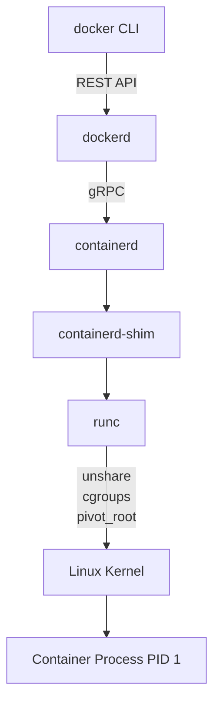
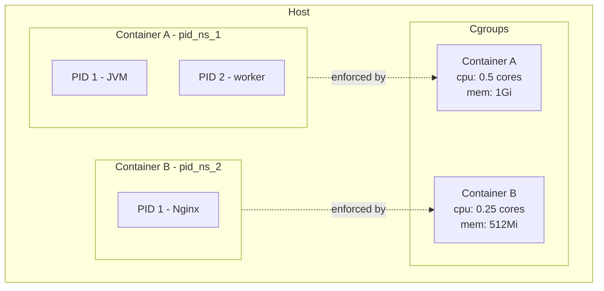

## Keywords in This File
{: .no_toc }

| # | Keyword | Weight |
|---|---|---|
| 1 | [Container Runtime Internals](#container-runtime-internals) | high |
| 2 | [Linux Namespaces and Cgroups](#linux-namespaces-and-cgroups) | critical |
| 3 | [OCI Standards and Container Specifications](#oci-standards-and-container-specifications) | medium |
| 4 | [Distroless and Minimal Images](#distroless-and-minimal-images) | high |
| 5 | [BuildKit and Advanced Build Features](#buildkit-and-advanced-build-features) | high |

---

# Container Runtime Internals

**Interview Weight:** high - Tests depth beyond API usage.
Understanding how the runtime executes containers is required
to diagnose PID exhaustion, namespace leaks, and overlay
filesystem performance issues.

---

### 🎯 Model Answer

**30 seconds:**

> The Docker daemon delegates container execution to containerd,
> which in turn delegates to runc. runc is the OCI-compliant
> container runtime that calls Linux kernel APIs: it creates a
> new process, applies namespace isolation (PID, network, mount,
> UTS, IPC, user), applies cgroup resource limits, sets up the
> overlay filesystem mount, and executes the container entrypoint.
> The container is just a Linux process with restricted visibility
> of the host.

**3 minutes (Senior):**

> The Docker runtime stack has four layers. Docker CLI sends API
> calls to dockerd (the Docker daemon). dockerd handles image
> management, volumes, networking, and delegating execution to
> containerd. containerd is the container lifecycle manager - it
> pulls images, manages snapshots (layers), and passes execution
> to runc. runc is the low-level OCI runtime: it forks a process,
> applies all namespace and cgroup isolation, mounts the overlay
> filesystem, and exec()s the container process.
>
> When docker run is called, the sequence is:
> (1) dockerd pulls image layers from the registry if not cached.
> (2) containerd assembles the root filesystem using overlay2:
>     readonly lower layers from the image + a writable upper layer.
> (3) runc creates a new process with unshare() system calls
>     to create namespaces.
> (4) runc applies cgroup limits (CPU shares, memory limit).
> (5) runc pivots the root to the overlay mount point using
>     pivot_root().
> (6) runc exec()s the container entrypoint as PID 1.
>
> The overlay2 filesystem is the most important performance aspect.
> Every write to the container filesystem triggers a copy-on-write:
> the file is copied from the lower (read-only) layer to the upper
> (writable) layer. Large files written frequently (logs, databases)
> should be on volumes, not the container filesystem, to avoid this
> overhead.

**Blank Mind Recovery:**

**(1) Restate:** "You are asking about container runtime internals -
let me walk through what actually happens when docker run executes."

**(2) First principles:** "A container is a Linux process with
restricted view of the system. The runtime's job is to set up those
restrictions: what the process can see (namespaces) and what it can
consume (cgroups). Then it starts the process."

**(3) Bridge:** "Think of it like a clean-room setup: the runtime
builds the room (overlay filesystem), installs the walls (namespaces),
sets resource meters (cgroups), then lets the process in. When the
process exits, the room is torn down."

---

### 📘 Concept Explanation

**What it is:**
The container runtime is the set of components that create and
manage the lifecycle of containers. Docker's runtime stack:
dockerd -> containerd -> runc -> Linux kernel APIs.

**The problem it solves:**
Running isolated workloads on shared hardware requires resource
and visibility isolation. The runtime translates high-level
container specifications into low-level kernel system calls.

**How it works:**

```
Docker Runtime Stack:

  docker CLI
      |
      | REST API
      v
  dockerd (Docker daemon)
      | image pull, volume, network management
      | gRPC
      v
  containerd
      | snapshot management (overlay2 layers)
      | container lifecycle (create/start/stop)
      | OCI spec generation
      v
  containerd-shim (per container)
      | keeps stdin/stdout open after containerd restart
      v
  runc (OCI runtime)
      | unshare() -> namespaces
      | clone() -> new process
      | cgroup configuration
      | pivot_root() -> rootfs
      | exec() -> entrypoint
      v
  Container Process (PID 1 inside namespace)
```



> **Diagram walkthrough:** The runtime stack has clear separation
> of concerns at each layer. dockerd manages user-facing features
> (images, volumes, networks). containerd manages container lifecycles
> and snapshots. The containerd-shim keeps the container alive if
> containerd restarts. runc performs the actual kernel operations to
> create isolation. This layering allows containerd to be upgraded
> without restarting running containers.

**The key insight:**
A container is NOT a lightweight VM. It is a regular Linux process
running in an isolated view of the host. There is no hypervisor, no
hardware emulation. The container process can, in principle, see the
same kernel as the host - it is only namespaces and cgroups that prevent
it from interacting with host resources.

**When to understand this:**
Diagnosing PID 0 processes left after container removal, debugging
namespace leaks, troubleshooting overlay filesystem performance (large
file copy-on-write), analyzing container process trees.

**Alternatives:**
- kata-containers: actual lightweight VMs with hardware isolation
- gVisor: user-space kernel sandbox (stronger isolation, more overhead)
- runc: default Linux native containers (best performance)

**First-principles derivation:**
Isolation requires OS-level constructs. Linux provides namespaces
(restrict visibility) and cgroups (restrict resource usage). A container
runtime composes these two primitives into an "isolated process." The
overlay filesystem provides a copy-on-write layer view of the image
contents as the container's rootfs.

---

### 💻 Code Example

**Example 1: Examining container internals from the host**

```bash
# Get container PID on the host
CONTAINER_ID=$(docker ps -q --filter name=myapp)
PID=$(docker inspect --format '{{.State.Pid}}' \
    $CONTAINER_ID)
echo "Container PID on host: $PID"

# See all namespaces for this process
ls -la /proc/$PID/ns/
# lrwxrwxrwx cgroup -> cgroup:[...]
# lrwxrwxrwx ipc    -> ipc:[...]
# lrwxrwxrwx mnt    -> mnt:[...]
# lrwxrwxrwx net    -> net:[...]
# lrwxrwxrwx pid    -> pid:[...]
# lrwxrwxrwx uts    -> uts:[...]

# Enter the container's network namespace
# (same as being inside the container)
nsenter -t $PID -n ip addr

# See cgroup limits applied
cat /sys/fs/cgroup/memory/docker/$CONTAINER_ID/\
memory.limit_in_bytes
cat /sys/fs/cgroup/cpu/docker/$CONTAINER_ID/\
cpu.cfs_quota_us

# See overlay mount
mount | grep $CONTAINER_ID
# overlay on / type overlay (rw,lowerdir=...,
#   upperdir=...,workdir=...)
```

> **Code walkthrough:** Every container is a process visible
> from the host with a regular PID. The namespace symlinks in
> /proc/$PID/ns/ confirm which namespaces are isolated. nsenter
> lets you enter a container's namespace without docker exec -
> critical for diagnosing containers where the entrypoint is the
> broken process. The cgroup files show the exact kernel enforcement
> of memory and CPU limits. The overlay mount shows the stacked
> filesystem layers.

**Example 2: Diagnosing overlay filesystem overhead**

```bash
# BAD: writing large files directly to container layer
FROM eclipse-temurin:21-jre-alpine
WORKDIR /app
COPY app.jar .
# Writes to overlay upper layer on every run
RUN mkdir -p /var/log/app

# GOOD: use volume for write-heavy paths
FROM eclipse-temurin:21-jre-alpine
WORKDIR /app
COPY app.jar .
# Document that /var/log should be a volume
VOLUME /var/log/app
# Kubernetes: mount a PVC at /var/log/app
```

> **Code walkthrough:** The VOLUME instruction documents that
> /var/log/app should be mounted externally, bypassing the overlay
> filesystem. When the path is a volume, writes go directly to the
> underlying storage, not through copy-on-write. This matters most
> for write-intensive paths: log files, temp directories, Postgres
> data directories. Without a volume, each write triggers copy-on-write
> from the lower (image) layer, adding I/O overhead.

---

### 🎓 Answers by Seniority

**Junior / Mid (0-5 years):**

> Docker containers are isolated Linux processes. The daemon
> handles container lifecycle, containerd manages snapshots, and
> runc creates the actual isolation. The container filesystem
> uses overlay layers from the image.

I know that containers are NOT VMs - they share the host kernel.
I understand that volumes bypass the container's copy-on-write
filesystem for better write performance.

*Push deeper:* "The containerd-shim is often overlooked. It sits
between containerd and runc and keeps the container running even
if containerd itself restarts. This is why running containers survive
`systemctl restart docker` - they continue running via the shim."

---

**Senior / Staff (5+ years):**

> The runtime stack is critical context for production debugging.
> I have used nsenter to access container namespaces when the
> container process itself was unresponsive (deadlocked JVM).
> nsenter -t PID -n gives network access from the host without
> requiring docker exec to work.
>
> At scale, overlay2 performance is the hidden bottleneck.
> For Java applications that write large temporary files (e.g.,
> MapReduce, Spark), bypassing overlay with a tmpfs mount for the
> temp directory reduces I/O overhead significantly. For databases,
> the overlay filesystem should never be used for the data directory.

*Push deeper:* "The OCI runtime spec defines what runc must do -
create namespace isolation, apply cgroup limits, and exec the
entrypoint. Kata-containers implements the OCI spec using a lightweight
VM instead of native namespaces. Same spec, different isolation
technology. This is why 'OCI-compliant' runtimes are interchangeable:
the API is standardized even if the implementation differs."

---

### ⚖️ Comparison Table

| Runtime | Isolation | Performance | Use When |
|---|---|---|---|
| **runc** | Namespaces + cgroups | Best (native Linux) | Default - all workloads |
| gVisor (runsc) | User-space kernel | 20-40% overhead | Untrusted code, multi-tenant |
| kata-containers | Lightweight VM | 5-15% overhead | Compliance, strong isolation |
| Firecracker | microVM | Very low overhead | Serverless (AWS Lambda) |

**The deciding factor:** runc for trusted workloads (your own code).
gVisor for multi-tenant systems where you cannot trust the container
workload. kata-containers for compliance requirements mandating VM-level
isolation. Never use gVisor for production Java services without
benchmarking - the syscall interception adds latency.

---

### ⚠️ Common Misconceptions

**"Containers are lightweight VMs."**

Containers share the host kernel. There is no hardware emulation,
no guest OS, no hypervisor. A container is a process with restricted
view. If the host kernel has a vulnerability, all containers on
that host are potentially affected. VMs provide hardware-level
isolation; containers provide only kernel namespace isolation.

**"Docker is the container runtime."**

Docker is the user-facing tool. The actual runtime is runc (OCI
runtime). containerd is the lifecycle manager. dockerd is the daemon
API. Kubernetes does not use dockerd at all - it uses containerd
directly via the Container Runtime Interface (CRI).

**"Stopping a container kills its processes."**

docker stop sends SIGTERM to PID 1. If PID 1 does not handle SIGTERM,
after a 10-second timeout it receives SIGKILL. If the container process
forks children and those children do not handle SIGTERM, they may
become zombie processes. Proper PID 1 handling (signal forwarding) is
required for graceful shutdown. Use tini as an init process for Java
applications that do not handle zombie reaping.

**"Container filesystem changes persist."**

Changes to the container filesystem (overlay upper layer) are lost
when the container is removed with docker rm. docker stop does NOT
lose data - the container can be restarted. Only docker rm (or
container replacement in Kubernetes) discards the upper layer.

---

### 🚨 Failure Modes and Diagnosis

| Failure | Symptom | Diagnosis | Fix |
|---|---|---|---|
| Zombie PID accumulation | ps shows Z processes, PID namespace fills | `docker exec ps aux \| grep Z` | Add tini as PID 1; app must forward signals |
| Overlay I/O bottleneck | High I/O wait, slow writes to container fs | `iostat -x 5` shows overlay device busy | Mount volume for write-heavy paths |
| Namespace leak | Deleted containers leave /proc/*/ns entries | `lsns \| grep orphan` | Ensure containerd-shim cleanup; update Docker |
| OOM kill without warning | Container disappears; kernel log shows OOM | `dmesg \| grep oom` | Set memory limits; monitor with cAdvisor |
| runc exec timeout | docker exec hangs | Check if container process is deadlocked | nsenter instead; thread dump via jstack |

---

### 🎯 Interview Deep-Dive

| Experience | Time | Depth |
|---|---|---|
| Junior | 3 min | Define isolation mechanisms (namespace/cgroup) |
| Mid | 6 min | Runtime stack, overlay filesystem, signal handling |
| Senior | 10 min | Deep diagnostics, namespace debugging, OCI |
| Staff | 15 min | Runtime selection trade-offs, security threat model |

---

**[JUNIOR] Q1 - What makes a container different from
a virtual machine?**

*Why they ask:* Most fundamental Docker concept.

*Likely follow-up:* "What are the security implications?"

A container is a Linux process with restricted visibility and
resources. It shares the host OS kernel. A VM has its own kernel,
OS, and virtual hardware. The host hypervisor provides hardware
emulation. This means:

Startup time: containers start in milliseconds (process fork).
VMs start in seconds (full OS boot).

Resource overhead: containers add minimal overhead. VMs add
the memory footprint of the guest OS.

Isolation: VMs provide hardware-level isolation. Containers provide
kernel namespace isolation only. A container escape vulnerability
can compromise the host. A VM escape is much harder to achieve.

Security implication: if you run untrusted code in containers,
you need additional isolation (gVisor, kata) because the containers
share the host kernel. For trusted code (your own applications), the
namespace isolation provided by runc is sufficient.

*What separates good from great:* Knowing that containers share the
host kernel and that this is a security consideration - not just
saying "containers are faster because they're lighter."

---

**[MID] Q2 - Explain the Docker runtime stack: dockerd,
containerd, runc, and the containerd-shim.**

*Why they ask:* Operational knowledge of how Docker actually works.

*Likely follow-up:* "Why was the runtime separated into layers?"

The Docker runtime stack evolved to align with OCI standards:

dockerd: the Docker daemon. Handles the user-facing API, image
management, volumes, networking, and delegates container execution
to containerd.

containerd: the container lifecycle manager. Manages image snapshots
(overlay layers), container state (created/running/stopped), and
delegates to runc for actual process creation.

containerd-shim: a per-container lightweight process that bridges
containerd and runc. It serves three purposes: (1) keeps the
container running if containerd restarts, (2) reaps zombie processes
from the container, (3) reports container exit status to containerd.

runc: the OCI-compliant container runtime. Creates namespaces,
applies cgroup limits, sets up the overlay filesystem, and exec()s
the container process.

Why separated: Kubernetes can use containerd directly (via CRI)
without dockerd. The OCI standard allows runc to be replaced with
kata-containers or gVisor. Each layer has a clear interface,
enabling independent upgrades.

*What separates good from great:* Knowing that Kubernetes removed
the dockershim (Kubernetes 1.24+) and now uses containerd directly -
no dockerd involved at all in a modern Kubernetes cluster.

---

**[SENIOR] Q3 - How does the overlay2 filesystem work
and when does it cause performance problems?**

*Why they ask:* Production debugging knowledge.

*Likely follow-up:* "How do you fix overlay I/O bottlenecks?"

overlay2 is a union filesystem. A container's root filesystem is
a layered view:
- Lower layers: read-only image layers, stacked from base to app
- Upper layer: read-write container-specific layer
- Overlay: the unified view presented to the container process

Copy-on-write (CoW): when the container reads a file, it reads
from the lowest layer that has it. When the container writes a file,
if it exists in a lower layer, the entire file is copied to the upper
layer first (CoW), then modified. This is the source of performance
issues.

Performance problems:
Large file writes: writing a 1 GB file first copies it to the
upper layer (1 GB read + 1 GB write), then writes modifications.
Net cost: 3x I/O vs. writing to a raw filesystem.

Build layer accumulation: many small image layers increase the
number of lower layers to search for reads.

Solutions:
Use volumes for write-intensive paths (/var/log, /tmp, database
data directories). Volumes bypass overlay and write directly to
the host filesystem.

Optimize image layers: reduce layer count with multi-stage builds.
Each RUN instruction creates a layer. Consolidate RUN commands.

*What separates good from great:* Knowing that a write to the
container filesystem triggers a full file copy from the lower layer
before the write - not just "writes are slower on overlay."

---

**[SENIOR] Q4 - DEBUGGING: A production container is
consuming CPU but not responding. docker exec is
hanging. How do you diagnose it?**

*Why they ask:* Production debugging with namespace internals.

*Likely follow-up:* "What if nsenter also hangs?"

Step 1: Identify the container's host PID:
`docker inspect --format '{{.State.Pid}}' <container>`

Step 2: Use nsenter to enter the container's namespaces
without docker exec:
`nsenter -t <PID> -m -u -i -n -p /bin/sh`
This creates a shell with the container's namespaces active.
If docker exec hangs but the JVM is running, nsenter can still
work because it bypasses dockerd.

Step 3: Get a Java thread dump:
From the nsenter shell: `kill -3 1` (signal to PID 1 in the
namespace - the JVM). The thread dump appears in `docker logs`.

Step 4: Analyze from the host:
`ls /proc/<PID>/fd | wc -l` - count open file descriptors
`cat /proc/<PID>/status` - memory, thread count
`perf top -p <PID>` - CPU hotspots at native level

If the JVM is genuinely stuck (all threads blocked), the thread
dump will show all threads in BLOCKED or WAITING state, revealing
deadlock. If high CPU with no progress, check for infinite loops
in RUNNABLE threads.

*What separates good from great:* Using nsenter to bypass docker exec -
most engineers only know docker exec and are stuck when it hangs.

---

**[STAFF] Q5 - TRADE-OFF: When would you choose
gVisor or kata-containers over runc for your
Java services?**

*Why they ask:* Security architecture judgment.

*Likely follow-up:* "What benchmarks would you run before deciding?"

The choice depends on the threat model, not the technology preference.

runc (default): Appropriate for trusted workloads - your own
Java services running your own code. The namespace isolation is
sufficient because you trust the code running inside. Best
performance, zero overhead vs native.

gVisor: Appropriate for multi-tenant platforms where you run
customer-provided code. gVisor intercepts all syscalls and handles
them in user-space, preventing kernel exploits. Cost: 20-40%
throughput reduction for I/O-intensive workloads, higher latency
for syscall-heavy code. Java services are moderately syscall-heavy
(file I/O, networking) but not as heavy as native code.

kata-containers: Appropriate for compliance scenarios (PCI DSS,
HIPAA level 4) where the auditor requires VM-level isolation.
Provides full hardware isolation. Cost: 5-15% overhead, slightly
slower startup than runc.

For Java microservices at a typical enterprise: runc is correct.
The security boundary is the Kubernetes RBAC and network policies,
not the container runtime isolation level. The 20-40% overhead of
gVisor is not justified for trusted Java services.

Benchmarks to run before deciding: throughput (RPS), latency
percentiles (p99), startup time, memory overhead, file I/O
(critical for Kafka, databases), network throughput.

*What separates good from great:* Framing the decision as a
threat model question (do you trust the workload?) rather than
a performance question.

---

**[STAFF] Q6 - BEHAVIORAL: Describe a time you diagnosed
a container-related production incident that required
understanding runtime internals.**

*Why they ask:* Tests depth of real production experience.

*Likely follow-up:* "What would you do differently?"

Situation: Production Java service was OOMKilled by Kubernetes
repeatedly. Kubernetes memory limit was set to 2Gi. The JVM
heap was configured with -Xmx1500m - should fit in 2Gi.

Task: Diagnose why the container was exceeding 2Gi despite
heap being limited to 1500m.

Action: Used kubectl top pod to observe actual memory usage.
It was hitting 2Gi before OOMKill. Added JVM flags to print
native memory: -XX:NativeMemoryTracking=detail. The output
showed: heap 1500m (as expected), off-heap 300m (compressed class
space, code cache, thread stacks). The overlay2 filesystem buffer
cache was accounting for 200m more from large I/O. Also, the
container was writing temporary files to the overlay filesystem,
causing CoW overhead that inflated memory usage.

Result: Fixed by: setting MaxRAMPercentage=75 (lets JVM
auto-size heap relative to container limit), adding a tmpfs
volume for the temp directory, and increasing container memory
limit to 3Gi with proper heap headroom.

What I'd do differently: Use MaxRAMPercentage from the start
instead of absolute -Xmx values in containers.

*What separates good from great:* Knowing that JVM off-heap
memory (metaspace, code cache, thread stacks, native memory)
can exceed -Xmx by 20-50%, and that this must be accounted for
in the container memory limit.

---

**Interviewer Type Adaptation:**

| Interviewer | Focus | What to Emphasize |
|---|---|---|
| Cloud/Platform engineer | Kubernetes integration | CRI, containerd without dockerd |
| Security engineer | Isolation model | Shared kernel risk, gVisor/kata trade-offs |
| Backend engineer | Performance | overlay2 CoW, volume performance |
| Staff engineer | Architecture | OCI spec, runtime pluggability |

---
---

# Linux Namespaces and Cgroups

**Interview Weight:** critical - The kernel mechanisms behind
container isolation. Interviewers ask this to verify you understand
WHY containers provide isolation, enabling you to reason about
security boundaries and resource contention.

---

### 🎯 Model Answer

**30 seconds:**

> Linux namespaces isolate what a process can SEE - each namespace
> type hides a different aspect of the system from the process. Linux
> cgroups control what a process can USE - CPU, memory, disk I/O,
> network bandwidth. Together, namespaces + cgroups are the two
> primitives that make container isolation possible. There is no third
> magic ingredient - it is just these two Linux kernel features.

**3 minutes (Senior):**

> Linux has seven namespace types, each isolating a different global
> resource. The pid namespace makes the container process appear to
> be PID 1 - it cannot see host PIDs or other container PIDs. The net
> namespace gives the container its own network interfaces, routing
> table, and iptables rules. The mnt namespace gives the container
> its own filesystem mount table. The uts namespace lets the container
> have its own hostname. The ipc namespace isolates IPC objects.
> The user namespace maps container UIDs to host UIDs (enabling
> rootless containers). The cgroup namespace shows only the container's
> subtree of cgroups.
>
> Cgroups (v1 and v2) enforce resource limits. The memory controller
> sets the maximum RSS memory a process tree can consume - exceeding
> it triggers the OOM killer. The CPU controller can limit CPU time
> either by absolute quota (cpu.cfs_quota_us) or by shares (relative
> weight when CPUs are contested). For Java services, the critical
> cgroup parameter is memory.limit_in_bytes which the JVM reads via
> the /proc/self/cgroup path to automatically size the heap.
>
> The security implication: namespaces restrict visibility but do NOT
> restrict kernel system calls. A process in a container can still
> call any Linux syscall - it just cannot see resources outside its
> namespaces. A kernel vulnerability in the syscall handler can break
> namespace isolation. This is the fundamental difference from VMs,
> which do not share the kernel.

**Blank Mind Recovery:**

**(1) Restate:** "You are asking about Linux namespaces and cgroups -
the kernel mechanisms behind container isolation."

**(2) First principles:** "To isolate processes, you need two things:
restrict what they can see (namespaces) and restrict what they can use
(cgroups). The Linux kernel provides both."

**(3) Bridge:** "Namespaces are like window blinds - each room has its
own view and can't see into other rooms. Cgroups are like a building's
utility meters - each unit gets a limited quota of electricity and water."

---

### 📘 Concept Explanation

**What it is:**
Linux namespaces and cgroups are kernel features that provide the
isolation and resource management primitives used by container runtimes.
They are not container-specific - they are general Linux kernel mechanisms
that containers leverage.

**The problem it solves:**
Running multiple workloads on shared hardware requires that each workload:
(1) has an isolated view of system resources (security), and (2) cannot
consume resources belonging to other workloads (resource fairness).
Namespaces solve (1), cgroups solve (2).

**How it works:**

```
Linux Namespaces (7 types):
  pid:  process tree isolation (PID 1 inside)
  net:  network interfaces, routing, iptables
  mnt:  filesystem mounts, pivot_root
  uts:  hostname, NIS domain name
  ipc:  IPC objects (semaphores, shared memory)
  user: UID/GID mapping (rootless containers)
  cgroup: cgroup hierarchy isolation

Linux Cgroups v2:
  cpu:    CPU time quota and shares
  memory: RSS limit, OOM killer threshold
  io:     disk I/O bandwidth and IOPS limits
  pids:   maximum number of PIDs in group
  net_cls: network packet classification
```



> **Diagram walkthrough:** Each container has its own PID namespace,
> so PID 1 inside Container A is a different process from PID 1 inside
> Container B. The containers cannot see each other's process trees.
> Cgroups are applied independently and enforced by the kernel scheduler
> and memory management subsystem. If Container A's JVM tries to allocate
> more memory than 1Gi, the kernel's OOM killer terminates the process.

**The key insight:**
Namespaces and cgroups are independent mechanisms. Namespaces restrict
visibility. Cgroups restrict resource consumption. You can have one
without the other. Containers use both together for isolation.

**When cgroups v2 matters:**
cgroups v2 (unified hierarchy) provides better memory protection,
improved I/O control, and is required for proper rootless container
support. Kubernetes 1.25+ supports cgroups v2. Older kernel versions
on some distributions still use v1.

**Alternatives:**
- Seccomp: system call filtering (restricts WHICH syscalls can be made)
- AppArmor / SELinux: mandatory access control (restricts what files/capabilities)
- Capabilities: fine-grained privilege reduction (CAP_NET_ADMIN, etc.)

**First-principles derivation:**
Linux is a multi-process OS where processes share global namespaces
(PID numbering, network interfaces, filesystem). To isolate processes,
you need per-process views of these global resources. Namespaces provide
per-process-tree views. Cgroups account for and limit per-process-tree
resource consumption. Together they are sufficient for process isolation
without hardware virtualization.

---

### 💻 Code Example

**Example 1: Demonstrating namespaces manually**

```bash
# Run a process in new PID and UTS namespaces
# This is what runc does under the hood
unshare --pid --fork --mount-proc \
    --uts /bin/sh -c \
    "hostname isolated-container; ps aux"
# Shows only processes in the new PID namespace

# In contrast, without namespace isolation:
ps aux | wc -l  # shows all host processes

# Check which namespaces a container uses
CONTAINER=myapp
PID=$(docker inspect --format '{{.State.Pid}}' $CONTAINER)
# List all namespace inodes
ls -la /proc/$PID/ns/
# Compare with host process namespaces
ls -la /proc/1/ns/
# Different inodes = different namespace
# Same inode = shared namespace (e.g. host network mode)
```

> **Code walkthrough:** unshare is the command-line interface to
> the unshare() syscall that creates new namespaces. Running ps aux
> inside the new PID namespace shows only that process - identical
> behavior to ps inside a container. Comparing namespace inodes
> between the container process (/proc/$PID/ns/) and the host init
> process (/proc/1/ns/) reveals which namespaces are shared vs.
> isolated. Same inode = same namespace = no isolation for that type.

**Example 2: Cgroup limits and JVM interaction**

```bash
# Verify cgroup limits applied to a container
CONTAINER=myapp
CG_PATH=/sys/fs/cgroup

# Memory limit (bytes)
cat $CG_PATH/memory/docker/$CONTAINER/\
memory.limit_in_bytes
# 1073741824 = 1Gi

# CPU quota and period (microseconds)
# quota/period = effective CPU cores
cat $CG_PATH/cpu/docker/$CONTAINER/cpu.cfs_quota_us
# 50000
cat $CG_PATH/cpu/docker/$CONTAINER/cpu.cfs_period_us
# 100000
# 50000/100000 = 0.5 CPU cores

# Verify JVM reads container limits correctly
# (JVM 10+ reads /proc/self/cgroup for limits)
docker exec myapp java -XX:+PrintFlagsFinal -version \
    2>&1 | grep MaxHeapSize
# Should be ~75% of 1Gi = ~768m
# If MaxHeapSize = 256m, JVM is ignoring cgroup limits
# Fix: ensure JVM 11+ in container (not JDK 8 update < 191)
```

> **Code walkthrough:** The cgroup files show the exact limits the
> kernel enforces. cpu.cfs_quota_us / cpu.cfs_period_us = effective
> CPU cores (50000/100000 = 0.5 cores). The JVM reads these via
> /proc/self/cgroup since JDK 8u191 / JDK 10+. If the JVM reports
> MaxHeapSize based on the total host memory (ignoring the container
> limit), the container was run with an older JDK that does not support
> container-awareness - a common source of OOMKills.

---

### 🎓 Answers by Seniority

**Junior / Mid (0-5 years):**

> Namespaces make processes think they have their own view of the
> system (PID namespace = its own process tree, net namespace = its
> own network interface). Cgroups limit how much CPU and memory they
> can use. Containers use both to isolate workloads.

I understand that the JVM must read cgroup memory limits to size
its heap correctly. This requires JDK 10+ or JDK 8u191+.

*Push deeper:* "The user namespace is the most security-sensitive.
It maps container root (UID 0) to a non-root host UID. Without user
namespace mapping, if a container process escapes the namespace, it
runs as root on the host."

---

**Senior / Staff (5+ years):**

> I have diagnosed multiple production issues rooted in namespace/
> cgroup behavior. The most common: JVM heap sizing ignoring cgroup
> limits on JDK 8 pre-191, leading to OOMKills that appear random.
> The second most common: CPU throttling from cfs_quota being set
> too low, causing Java GC pauses to extend (GC threads compete for
> the CPU quota).
>
> At staff level: the cgroups v2 transition matters for Kubernetes.
> cgroups v2 provides proper memory QoS - it can differentiate between
> memory that is needed vs. memory that is reclaimable. This reduces
> false OOMKills in memory-pressured nodes. Kubernetes 1.25+ with
> Linux 5.8+ kernel supports cgroups v2.

*Push deeper:* "CPU throttling is a hidden performance problem.
A container with 0.5 CPU quota in a 60-second window gets 30 seconds
of CPU time. But Java GC is bursty - it uses full CPU for short bursts.
CFS throttling cuts those bursts short, causing GC pauses to extend
significantly. Use CPU requests not CPU limits for latency-sensitive
Java services to avoid CFS throttling."

---

### ⚖️ Comparison Table

| Mechanism | Controls | Kernel Feature | Bypass Risk |
|---|---|---|---|
| **Namespaces** | Visibility (what process sees) | unshare/clone flags | Kernel CVE in namespace handler |
| **Cgroups v2** | Resource consumption | /sys/fs/cgroup | None (kernel-enforced accounting) |
| **Seccomp** | Syscall whitelist | prctl(PR_SET_SECCOMP) | None (kernel-enforced filter) |
| **AppArmor/SELinux** | File/capability access | LSM hooks | None (MAC enforcement) |
| **Capabilities** | Root privilege reduction | cap_set() | None (capability set enforcement) |

**The deciding factor:** Namespaces alone are insufficient for security -
kernel CVEs can break namespace isolation. Production containers need
all layers: namespaces + cgroups + seccomp + AppArmor/SELinux + reduced
capabilities. Defense in depth.

---

### ⚠️ Common Misconceptions

**"Containers are isolated because Docker isolates them."**

Docker is a user-space tool. The isolation comes from Linux kernel
namespaces and cgroups. Docker orchestrates the syscalls to create them.
The security guarantees are as strong as the kernel implementation -
kernel CVEs (Dirty COW, runc escape CVE-2019-5736) have broken container
isolation.

**"Setting CPU limits always improves container performance."**

CPU limits (cfs_quota) cause CFS throttling - a process that exhausts
its quota is paused for the rest of the period. For Java applications,
which use CPU in bursts (GC, JIT compilation, request spikes), CFS
throttling causes GC pauses to extend and request latency to spike.
CPU limits should be set conservatively high or replaced with CPU
requests only for latency-sensitive services.

**"Root in a container equals host root."**

It depends on whether a user namespace is used. Without user namespace,
UID 0 inside the container IS UID 0 on the host. A container escape
gives the attacker full host root. With user namespace, UID 0 inside
maps to an unprivileged UID on the host. Rootless containers and
user namespaces are the correct security pattern.

---

### 🚨 Failure Modes and Diagnosis

| Failure | Symptom | Diagnosis | Fix |
|---|---|---|---|
| JVM ignores cgroup memory | OOMKill despite low -Xmx | JDK version < 8u191; `java -XX:+PrintFlagsFinal` shows host-based heap | Upgrade to JDK 11+; use MaxRAMPercentage |
| CPU throttling | High GC pause times, p99 latency spikes | `kubectl top pod` shows normal CPU; `cat /proc/*/schedstat` shows throttle | Remove CPU limits or increase quota significantly |
| PID exhaustion | New processes fail with EAGAIN | `cat /sys/fs/cgroup/pids/docker/*/pids.current` | Increase pids.max; fix thread leak in app |
| cgroup v1/v2 mismatch | Memory limits not applied on new kernel | Check `/proc/mounts | grep cgroup` | Update container runtime; enable cgroups v2 |
| Namespace escape (CVE) | Container process accesses host namespace | Audit container runtime version | Patch runc/containerd; enable seccomp profile |

---

### 🎯 Interview Deep-Dive

| Experience | Time | Depth |
|---|---|---|
| Junior | 3 min | Define both, connection to Docker |
| Mid | 6 min | Seven namespace types, cgroup v1/v2, JVM integration |
| Senior | 10 min | Throttling diagnosis, security implications |
| Staff | 15 min | CPU CFS throttling, defense in depth, rootless |

---

**[JUNIOR] Q1 - What are Linux namespaces and how
do they enable container isolation?**

*Why they ask:* Foundation of container technology.

*Likely follow-up:* "How many namespace types are there?"

Linux namespaces allow a process to have its own isolated view
of system resources that are normally global.

There are seven namespace types:
- pid: the process tree (container sees its own PID 1)
- net: network interfaces, routing, firewall rules
- mnt: filesystem mount table
- uts: hostname and NIS domain name
- ipc: IPC objects (semaphores, message queues)
- user: UID/GID mapping (rootless containers)
- cgroup: cgroup hierarchy view

When a container runtime creates a container, it creates new
namespaces for the container process using the unshare() or
clone() syscalls. The process inherits only the new namespace
view - it cannot see processes in other PID namespaces, network
interfaces outside its net namespace, or files in other mount
namespaces.

The practical result: `ps aux` inside a container shows only
that container's processes. `ip addr` shows only that container's
network interfaces. The container process believes it is the
only process on the machine.

*What separates good from great:* Knowing all seven namespace types
and what each isolates, rather than just saying "namespaces
isolate containers."

---

**[MID] Q2 - How do cgroups enforce container resource
limits and why does the JVM need to be cgroup-aware?**

*Why they ask:* JVM + container interaction is a common production issue.

*Likely follow-up:* "What happens if the JVM is not cgroup-aware?"

Cgroups (Control Groups) are a Linux kernel feature for limiting,
accounting, and isolating resource usage for groups of processes.
Docker creates a cgroup per container and sets limits on it.

For memory: memory.limit_in_bytes in the cgroup filesystem sets the
maximum memory the container can use. If exceeded, the kernel OOM killer
terminates processes in the cgroup.

For CPU: cpu.cfs_quota_us / cpu.cfs_period_us sets the fraction of
CPU time available to the container per scheduling period.

JVM issue: by default, the JVM sizes its heap based on the total
system memory (host memory). If the host has 64 GB RAM and the container
has a 2 GB limit, the JVM allocates a 16 GB heap (25% of 64 GB).
The container OOMKills before the JVM even starts processing requests.

JVM cgroup awareness (JDK 10+): The JVM reads /proc/self/cgroup to
detect container memory and CPU limits. With MaxRAMPercentage=75.0, the
JVM sizes its heap to 75% of the container's memory limit (not host memory).

For JDK 8: Backported in update 191. Before 8u191, use -Xmx manually
to cap the heap below the container limit.

*What separates good from great:* Knowing the exact backport version
(JDK 8u191) and that using MaxRAMPercentage is preferred over -Xmx for
containers because it automatically adapts as container limits change.

---

**[SENIOR] Q3 - DEBUGGING: A Java service has normal
average latency but spikes at p99. CPU usage appears
normal. What cgroup mechanism could cause this?**

*Why they ask:* CFS throttling is a hidden latency killer.

*Likely follow-up:* "Would you use CPU limits or CPU requests?"

The most likely cause is CPU CFS throttling - a cgroup v1/v2
mechanism for enforcing CPU limits.

CFS scheduler: time is divided into periods (default 100ms).
Each container gets a quota of CPU time within each period
(cpu.cfs_quota_us). If the container exhausts its quota, the
scheduler pauses all container threads until the next period.

Why it causes p99 spikes:
- Average CPU is low because the container is below its limit most
  of the time (green field).
- During GC events or request bursts, all JVM threads run
  concurrently, exhausting the quota in 10-20ms of a 100ms period.
  The container is paused for 80ms waiting for the next period.
  This pause appears as a p99 spike.

Diagnosis:
```
# Shows total CPU throttle time for container
cat /sys/fs/cgroup/cpu/docker/<id>/cpu.stat
# nr_throttled: N
# throttled_time: Nns
```

`kubectl describe pod` does not show throttle - you need
the cgroup file directly or a metrics system (cAdvisor).

Solution: Remove CPU limits for latency-sensitive Java services.
Use CPU requests only (which set cpu.shares for relative scheduling)
without a hard quota. Alternatively, increase cpu.cfs_period_us to
reduce throttle granularity.

*What separates good from great:* Knowing that CFS throttling is
invisible to normal CPU metrics (CPU usage appears below limit) and
requires checking the throttled_time counter directly.

---

**[STAFF] Q4 - TRADE-OFF: Should you set both CPU
requests and limits for Java services in Kubernetes?**

*Why they ask:* Senior judgment on resource configuration.

*Likely follow-up:* "What is the Kubernetes QoS class implication?"

This is a nuanced production decision.

CPU requests set cpu.shares (relative weight). They guarantee the pod
gets its requested CPU time when the node is contested but do not cap
usage when CPU is available. No throttling.

CPU limits set cpu.cfs_quota. They cap the pod's CPU usage even when
the node has idle CPU. This causes CFS throttling.

My recommendation for Java services:
Set CPU requests: enables scheduler to place pods correctly and
guarantees baseline CPU. Gets the "Burstable" Kubernetes QoS class.

Do NOT set CPU limits for latency-sensitive Java services:
CFS throttling during GC and compilation bursts causes p99 latency
spikes that are difficult to debug. Without limits, the JVM uses
idle CPU when available, reducing GC pause times.

Exception - set limits when:
- Running untrusted or noisy-neighbor workloads that could starve
  other services on the node.
- The node is shared between services with different priorities and
  you need hard isolation.
- QoS class "Guaranteed" is required (limits must equal requests for
  Guaranteed class - gives highest eviction protection).

For production Java microservices: requests only, with vertical pod
autoscaler recommendations to right-size requests over time.

*What separates good from great:* Connecting CPU limits to CFS
throttling to Kubernetes QoS classes - showing the full implication
chain rather than just saying "limits prevent noisy neighbors."

---

**[STAFF] Q5 - BEHAVIORAL: Have you diagnosed a
production issue caused by cgroup behavior? Describe
the investigation.**

*Why they ask:* Real-world depth.

*Likely follow-up:* "What monitoring do you have in place now?"

Situation: Production Spring Boot service showed random 5-second
GC pauses every few minutes. Heap was healthy (60% used, Eden
collecting normally). GC logs showed STW pause times of 5000ms+.

Task: Identify root cause of anomalous GC pauses not explained
by heap state.

Action: Added JVM metrics to Prometheus (JVM GC pause duration).
Noticed spikes correlated with CPU throttle events. Pulled cgroup
throttle stats via cAdvisor (throttled_time counter). Confirmed:
during G1GC minor collections, all 8 GC threads ran simultaneously,
exhausting the 0.5 CPU quota in ~20ms. The container was throttled
for the remaining 80ms of the period. GC threads waited 80ms for
CPU to be restored before completing the collection.

Result: Removed the CPU limit. GC pauses normalized to < 200ms.
Added monitoring for cpu.stat/throttled_time to alert when any
service exceeds 5% CPU throttle ratio.

Lesson: GC threads are CPU-intensive for short durations. CPU limits
designed for average-case CPU usage throttle GC bursts, causing long
pause times.

*What separates good from great:* The specific mechanism: GC threads
running concurrently exhaust the CFS quota, causing the entire container
to be paused until the next scheduler period.

---

**Interviewer Type Adaptation:**

| Interviewer | Focus | What to Emphasize |
|---|---|---|
| Platform/SRE | Operational | CFS throttling diagnosis, cgroup monitoring |
| Security | Threat model | Shared kernel risk, user namespaces, rootless |
| Java engineer | JVM behavior | cgroup-aware heap sizing, MaxRAMPercentage |
| Staff engineer | Architecture | Defense in depth, cgroups v2 transition |

---
---

# OCI Standards and Container Specifications

**Interview Weight:** medium - Tests understanding of container
ecosystem standardization. Important for Staff+ discussions about
runtime pluggability and supply chain.

---

### 🎯 Model Answer

**30 seconds:**

> OCI (Open Container Initiative) defines two specifications: the image
> specification (how container images are structured) and the runtime
> specification (how compliant runtimes must create containers from
> those images). These standards decouple images from runtimes - any
> OCI-compliant image runs on any OCI-compliant runtime. Docker images,
> Podman images, and Kaniko images are all OCI images. runc, kata-
> containers, and gVisor are all OCI runtimes.

**3 minutes (Senior):**

> The OCI was created in 2015 by Docker, CoreOS, and others to prevent
> container ecosystem fragmentation. Before OCI, container formats were
> proprietary. After OCI, the image format and runtime API became vendor-
> neutral standards.
>
> The OCI image specification defines: the image manifest (list of layers
> and config), the image config (environment, entrypoint, labels), and
> image layers as compressed tar archives. Any tool that can produce
> these three artifacts produces an OCI image - including Buildah, Kaniko,
> Jib (Google's Java image builder), and Cloud Build.
>
> The OCI runtime specification defines the bundle format (config.json +
> rootfs) and the lifecycle operations (create, start, kill, delete).
> runc is the reference implementation. The runtime receives a bundle -
> a directory with config.json (describing namespaces, cgroups, mounts,
> capabilities) and the rootfs (the container's root filesystem). It
> creates and runs the container.
>
> In Kubernetes, the Container Runtime Interface (CRI) is a separate
> abstraction above OCI. CRI is the API between kubelet and the container
> runtime (containerd, CRI-O). containerd internally uses OCI to interact
> with runc. CRI is Kubernetes-specific; OCI is universal.

**Blank Mind Recovery:**

**(1) Restate:** "You are asking about OCI standards - the specifications
that define how container images and runtimes interoperate."

**(2) First principles:** "Without standards, every container runtime
would have its own image format. You couldn't run a Docker-built image
on CoreOS's runtime. Standards prevent this fragmentation."

**(3) Bridge:** "OCI is to containers what POSIX is to operating systems
or what JVM bytecode format is to Java VMs - a standard interface that
allows different implementations to interoperate."

---

### 📘 Concept Explanation

**What it is:**
The Open Container Initiative (OCI) is a governance structure under
the Linux Foundation that maintains the Image Specification and Runtime
Specification for containers.

**The problem it solves:**
Pre-OCI, container images were Docker-proprietary. You could only run
Docker images on Docker runtime. OCI standardized the image format and
runtime interface, enabling a diverse ecosystem of tools that interoperate.

**How it works:**

```
OCI Specifications:

  Image Spec (1.0):
    manifest.json    <- layer list + config reference
    config.json      <- entrypoint, env, labels
    layer.tar.gz     <- filesystem layer (tar)

  Runtime Spec (1.0):
    bundle/
      config.json  <- namespaces, cgroups, mounts
      rootfs/      <- assembled filesystem

  OCI Tools Ecosystem:
    Build:    Docker, Buildah, Kaniko, Jib, Cloud Build
    Store:    Docker Hub, ECR, GCR, Harbor (OCI registries)
    Run:      runc, kata-containers, gVisor, Firecracker
```

**The key insight:**
OCI decouples the three concerns of containers: building (image spec),
storing (distribution spec), and running (runtime spec). Tools can
specialize in one concern without reimplementing the others.

**When OCI matters:**
Kubernetes deployments (CRI-O uses OCI), custom build pipelines
(Kaniko, Jib), multi-runtime environments (gVisor for untrusted workloads,
runc for trusted), and image inspection tools.

**Alternatives:**
- Docker proprietary format (pre-OCI) - only runs on Docker daemon
- Singularity/Apptainer - HPC container format (not OCI-compatible)

**First-principles derivation:**
The container ecosystem needed interoperability standards after Docker
became dominant. Without standards, every platform would have vendor
lock-in. OCI provides the same benefit as TCP/IP in networking - a
common protocol layer that enables diverse implementations to communicate.

---

### 💻 Code Example

**Example 1: Inspecting an OCI image manifest**

```bash
# Pull an image and inspect its OCI manifest
docker pull eclipse-temurin:21-jre-alpine

# Get the image manifest (OCI format)
docker inspect eclipse-temurin:21-jre-alpine \
    --format '{{json .}}' | python3 -m json.tool \
    | head -40

# Get layer digests (each layer is an OCI blob)
docker inspect eclipse-temurin:21-jre-alpine \
    --format '{{json .RootFS.Layers}}'
# ["sha256:abc...", "sha256:def...", ...]

# Use skopeo to inspect without pulling (OCI native)
# skopeo inspect docker://eclipse-temurin:21-jre-alpine

# Generate an OCI image with Jib (Java-native, no daemon)
# In pom.xml:
# <plugin>
#   <groupId>com.google.cloud.tools</groupId>
#   <artifactId>jib-maven-plugin</artifactId>
#   <configuration>
#     <to>gcr.io/myproject/myapp:latest</to>
#   </configuration>
# </plugin>
# mvn compile jib:build  # no Docker daemon required
```

> **Code walkthrough:** An OCI image is a collection of content-addressed
> blobs (SHA256 digests) described by a manifest. Each layer is a compressed
> tar archive identified by its digest. The manifest references the config
> blob (entrypoint, environment) and all layer blobs. Any OCI-compliant
> registry stores these blobs. Jib generates OCI images directly from
> Java compiled classes without needing a Docker daemon - useful in
> Kubernetes CI environments where Docker is not available.

---

### 🎓 Answers by Seniority

**Junior / Mid (0-5 years):**

> OCI standardizes the container image format and the runtime API.
> This means a Docker-built image runs on any OCI runtime (runc, kata).
> The standard prevents vendor lock-in and enables specialized tools.

I know that Kubernetes removed dockershim in 1.24 and now uses
containerd directly, which uses OCI runtimes under the hood.

*Push deeper:* "Jib is an OCI-compliant Java image builder that
creates images without a Docker daemon. It's useful in Kubernetes
CI pipelines where running Docker-in-Docker is a security concern."

---

**Senior / Staff (5+ years):**

> At the architecture level, OCI is the foundation for container
> supply chain security. The OCI Distribution Specification defines
> how images are stored in and retrieved from registries. Image signing
> (Cosign, Notation) works at the OCI manifest level - signing the digest
> of the manifest provides a cryptographic guarantee that the image has
> not been tampered with between push and pull.
>
> The CRI + OCI layering in Kubernetes: kubelet -> CRI (containerd) ->
> OCI (runc). The CRI is Kubernetes-specific. OCI is universal. This
> means you can use containerd outside Kubernetes (in standalone Docker
> deployments) because containerd implements OCI, not just CRI.

*Push deeper:* "OCI 1.1 (2023) adds artifact support - storing arbitrary
artifacts (SBOMs, signatures, attestations) alongside images in OCI
registries using the same content-addressable storage. This is the
foundation for supply chain security: the SBOM is stored in the same
registry as the image, referenced by the image manifest."

---

### ⚖️ Comparison Table

| Standard | Scope | Who Uses It | Purpose |
|---|---|---|---|
| **OCI Image Spec** | Image format | All modern tools | Portable image format |
| **OCI Runtime Spec** | Runtime contract | runc, kata, gVisor | Runtime interoperability |
| **OCI Distribution Spec** | Registry protocol | ECR, GCR, Harbor | Registry interoperability |
| **CRI (Kubernetes)** | kubelet-runtime API | containerd, CRI-O | Kubernetes runtime integration |
| **CNI** | Network plugin API | Calico, Cilium, Flannel | Container networking |

**The deciding factor:** OCI is the universal container standard. CRI is
Kubernetes-specific. CNI is for container networking. Understanding that
Kubernetes uses all three layers - CRI for lifecycle, OCI for runtime,
CNI for networking - demonstrates ecosystem depth.

---

### ⚠️ Common Misconceptions

**"Docker is the OCI."**

Docker created the OCI image format by donating its existing format.
The OCI is now governed by the Linux Foundation, independent of Docker.
Podman, Buildah, and Jib produce OCI images without Docker. runc is
the reference OCI runtime, originally developed by Docker but now
community-governed.

**"OCI runtime and CRI are the same."**

CRI is Kubernetes-specific. OCI is universal. containerd implements
both: it exposes a CRI API to kubelet and uses OCI runtimes (runc)
internally. You can use containerd without Kubernetes (as a standalone
runtime) - it uses OCI.

**"OCI images are only for Linux."**

OCI supports multi-platform manifests. A single image name (docker.io/
eclipse-temurin:21-jre) can point to a manifest list that references
different image manifests for linux/amd64, linux/arm64, and windows/amd64.
Docker automatically selects the correct manifest for the current platform.

---

### 🚨 Failure Modes and Diagnosis

| Failure | Symptom | Diagnosis | Fix |
|---|---|---|---|
| Non-OCI image format | `docker pull` works but runtime fails | Old tool producing Docker-proprietary format | Update build tool to OCI-native output |
| Manifest list confusion | Arm host pulling x86 image | Check image digest matches expected platform | Use `--platform linux/arm64` flag in pull/run |
| OCI runtime version mismatch | Container fails to create; OCI spec error | Check runc version vs containerd compatibility | Update runtime stack together |
| Missing distribution spec support | Private registry rejects push | Registry does not implement OCI distribution spec | Use Harbor or ECR (full OCI compliance) |

---

### 🎯 Interview Deep-Dive

| Experience | Time | Depth |
|---|---|---|
| Junior | 2 min | Define OCI, why it matters |
| Mid | 4 min | Image spec + runtime spec, tooling ecosystem |
| Senior | 7 min | CRI vs OCI, Kubernetes runtime stack |
| Staff | 10 min | Supply chain, OCI artifacts, signing |

---

**[JUNIOR] Q1 - What is the OCI and why does it matter
for container tooling?**

*Why they ask:* Ecosystem awareness.

*Likely follow-up:* "What tools produce OCI images?"

The Open Container Initiative (OCI) is a governance body under
the Linux Foundation that maintains two specifications: the image spec
(how container images are structured) and the runtime spec (how runtimes
must create containers).

Why it matters: before OCI, Docker had a proprietary image format.
You could only use Docker images with Docker runtime. OCI standardized
the format so any compliant build tool can produce images that run on
any compliant runtime.

Tools that produce OCI images: Docker, Podman, Buildah, Kaniko (for
Kubernetes CI), Jib (Java-native, no daemon needed), Cloud Build, ko (Go).

Runtimes that consume OCI images: runc (default), kata-containers
(VM-based), gVisor (user-space kernel), Firecracker (AWS Lambda).

The practical benefit: you can replace your build tool (Kaniko instead
of Docker-in-Docker in Kubernetes CI) without changing your runtime.
You can replace your runtime (kata instead of runc for untrusted workloads)
without changing your build pipeline.

*What separates good from great:* Knowing concrete OCI-compliant tools
beyond just Docker - particularly Kaniko and Jib for Java CI pipelines.

---

**[SENIOR] Q2 - TRADE-OFF: How does OCI relate to
Kubernetes CRI, and what changed when Kubernetes
removed dockershim?**

*Why they ask:* Modern Kubernetes architecture knowledge.

*Likely follow-up:* "Does Docker still work for production?"

The Kubernetes Container Runtime Interface (CRI) is the API between
kubelet (the node agent) and the container runtime. It is separate from
OCI - CRI is Kubernetes-specific.

Before 1.24: kubelet -> dockershim -> dockerd -> containerd -> runc.
The dockershim was an adapter that translated CRI calls to Docker API.

After 1.24 (dockershim removed): kubelet -> containerd (CRI) -> runc (OCI).
Containerd implements both CRI (for Kubernetes) and OCI (for runtime).

Impact: production Kubernetes no longer uses dockerd. docker build and
docker push still work for development, but no dockerd runs on the node.

What this means operationally: docker commands do not work on Kubernetes
1.24+ nodes. Use crictl for container inspection on nodes.
`crictl ps`, `crictl logs <id>`, `crictl inspect <id>`.

docker images built with docker build still run in Kubernetes 1.24+ because
the images are OCI-compliant. The change was in the runtime execution path,
not the image format.

*What separates good from great:* Knowing that docker images still work
post-dockershim because OCI compatibility is preserved - the change was
the execution path, not the image format.

---

**[STAFF] Q3 - ARCHITECTURE: How does OCI support
container supply chain security through SBOMs and
image signing?**

*Why they ask:* Supply chain security is a top-5 CNCF focus area.

*Likely follow-up:* "What is your image signing strategy?"

The OCI Distribution Specification 1.1 adds referrers support -
the ability to attach artifacts to images in the same registry.
This is the foundation for supply chain security.

SBOM (Software Bill of Materials): an OCI artifact attached to the
image manifest. Stored in the same registry, referenced by the image
digest. Tools: Syft (generate SBOM), Grype (scan SBOM for CVEs).

Image signing (Cosign): signs the OCI manifest digest with a key
managed by a key management service (KMS). The signature is stored
as an OCI artifact alongside the image. Kubernetes admission controllers
(OPA Gatekeeper, Kyverno) verify the signature before allowing the
container to run.

SLSA (Supply-chain Levels for Software Artifacts): a framework for
graduated supply chain security. SLSA level 1: build is scripted.
Level 2: build uses a hosted CI. Level 3: hardened build platform.
Level 4: two-party review of build.

Production implementation: CI pipeline (1) builds image, (2) generates
SBOM and scans for CVEs, (3) signs image with Cosign + KMS key,
(4) stores image + SBOM + signature in OCI registry. Kubernetes admission
controller rejects any image without a valid signature from the KMS key.
This ensures only images built by the authorized CI pipeline run in production.

*What separates good from great:* Connecting OCI referrers (the storage
mechanism) to Cosign signing (the tool) to admission controller enforcement
(the policy) - showing the complete supply chain security pipeline.

---

**Interviewer Type Adaptation:**

| Interviewer | Focus | What to Emphasize |
|---|---|---|
| Platform engineer | Kubernetes integration | CRI vs OCI, dockershim removal |
| Security engineer | Supply chain | Cosign, SBOM, admission controller |
| Backend engineer | Tooling | Jib, Kaniko, OCI compatibility |
| Staff engineer | Standards | OCI 1.1 referrers, SLSA framework |

---
---

# Distroless and Minimal Images

**Interview Weight:** high - Minimal images reduce attack surface
and image size significantly. Interviewers ask this to verify you can
make informed security and operational trade-offs for production images.

---

### 🎯 Model Answer

**30 seconds:**

> Distroless images contain only the application runtime and its direct
> dependencies - no shell, no package manager, no utilities. A distroless
> Java image has only the JRE. For security: there is nothing to exploit
> if you can enter the container (no shell), and vulnerability scanners
> find fewer CVEs because there are fewer packages. For size: a distroless
> JRE image is 200-300 MB vs 500-600 MB for a full Ubuntu JRE image.
> The trade-off is reduced debuggability - you cannot docker exec into a
> shell.

**3 minutes (Senior):**

> The security benefit of distroless is defense-in-depth. If an attacker
> can reach the container (via application vulnerability), they cannot
> escalate by using system utilities. With no shell, no curl, no wget, no
> netcat, lateral movement from inside the container is significantly harder.
> This addresses the "living off the land" attack vector common in container
> escape post-exploitation.
>
> Three primary options for minimal Java images:
> Google Distroless (gcr.io/distroless/java21-debian12): contains only the
> Debian libc and JRE, without shell or utilities.
> Eclipse Temurin Alpine (eclipse-temurin:21-jre-alpine): minimal Alpine
> Linux with JRE. Has a shell (ash) but is much smaller than Ubuntu-based
> images. Uses musl libc which can cause compatibility issues with Java
> native code that assumes glibc.
> Custom scratch + JRE: technically possible but requires manually
> assembling all JRE dependencies, which is error-prone.
>
> For GraalVM native image: the binary can run on scratch or distroless-base
> (just libc + ssl), because the JRE is compiled into the binary. This gives
> sub-50 MB images and sub-100ms startup times.

**Blank Mind Recovery:**

**(1) Restate:** "You are asking about distroless images - containers with
only the application runtime and no OS utilities."

**(2) First principles:** "If an attacker enters a container, what can they
do? Less utilities = less they can do. Reduce the attack surface by removing
everything not needed to run the application."

**(3) Bridge:** "It is like shipping an appliance vs a general-purpose
computer. A microwave runs one software stack and has no keyboard input.
Distroless is the appliance model - it does exactly one thing."

---

### 📘 Concept Explanation

**What it is:**
Distroless images are minimal base images that contain only the
application runtime dependencies, without a shell, package manager,
or system utilities.

**The problem it solves:**
Standard base images (Ubuntu, Debian, CentOS) include hundreds of
packages that the application never uses but which introduce CVEs and
provide attackers with tools for post-exploitation. Distroless removes
all unnecessary components.

**How it works:**

```
Image size comparison (Java 21 JRE):
  ubuntu:22.04 + JRE          ~600 MB
  debian:slim + JRE           ~450 MB
  eclipse-temurin:21-jre      ~400 MB
  eclipse-temurin:21-jre-alpine ~200 MB
  gcr.io/distroless/java21    ~250 MB
  GraalVM native + distroless ~50-80 MB

Attack surface comparison:
  ubuntu + JRE: 1000+ packages, many with CVEs
  distroless/java21: ~50 packages, JRE only
  GraalVM + distroless-base: ~10 packages
```

**The key insight:**
The security benefit is not just fewer CVEs to patch - it is that
an attacker who enters the container finds no shell, no curl, no wget,
no nc. They cannot download additional tools or execute shell commands.
The application itself is the only executable.

**When to use distroless:**
Production Java services with established debug workflows (use ephemeral
debug containers for troubleshooting). Security-sensitive workloads. Any
image that goes through regular vulnerability scanning.

**When Alpine Linux is preferable:**
Development-friendly production images where you need a shell for
troubleshooting but still want minimal size. Services using Java native
code that is glibc-compatible (Alpine uses musl libc which can cause
issues).

**Alternatives:**
- Chainguard images: hardened distroless images with zero known CVEs
  at release, maintained with daily rebuilds
- Red Hat Universal Base Image Micro (ubi-micro): RPM-based minimal
- Custom from scratch with multi-stage build assembling only needed libs

**First-principles derivation:**
Security is about reducing attack surface. Every installed package is
potential attack surface - either through CVEs in that package or through
utilities an attacker can use post-compromise. The minimal image approach
applies least-privilege to the image contents: only include what is needed
to run the application.

---

### 💻 Code Example

**Example 1: Multi-stage build with distroless target**

```dockerfile
# Stage 1: Build the JAR
FROM eclipse-temurin:21-jdk-alpine AS builder
WORKDIR /build
COPY mvnw pom.xml ./
COPY .mvn .mvn
RUN ./mvnw dependency:go-offline -q

COPY src src
RUN ./mvnw package -DskipTests -q

# Verify the fat JAR exists
RUN ls -la target/*.jar

# Stage 2: Create runtime image with distroless
FROM gcr.io/distroless/java21-debian12:nonroot AS runtime
WORKDIR /app

# Copy only the fat JAR
COPY --from=builder /build/target/*.jar app.jar

# No shell, no CMD string - must use exec form
# ENTRYPOINT ["cmd"] NOT ENTRYPOINT cmd (which needs shell)
ENTRYPOINT ["java", \
    "-XX:MaxRAMPercentage=75.0", \
    "-XX:+UseG1GC", \
    "-Djava.security.egd=file:/dev/./urandom", \
    "-jar", "app.jar"]
```

> **Code walkthrough:** The multi-stage build uses a full JDK+Alpine for
> compilation but the final image uses gcr.io/distroless/java21-debian12.
> The :nonroot variant runs as UID 65532 (nonroot) without root - never
> use the root variant in production. The critical detail: ENTRYPOINT must
> use exec form (JSON array), not shell form. Shell form requires /bin/sh
> which does not exist in distroless.

**Example 2: Debug container for distroless**

```yaml
# Kubernetes ephemeral debug container
# (no permanent debug tools in production image)
kubectl debug -it \
    --image=eclipse-temurin:21-jre-alpine \
    --target=myapp \
    <pod-name> \
    -- sh

# Alternative: debug from host
# Get container PID
PID=$(docker inspect --format '{{.State.Pid}}' myapp)
# nsenter to execute in container's namespace
# (no shell needed inside container)
nsenter -t $PID -m -u -i -n -p \
    /usr/bin/java -version
```

> **Code walkthrough:** When you need to debug a distroless container,
> Kubernetes ephemeral debug containers mount a debug image alongside
> the running container sharing its process namespace. This lets you use
> tools from the debug image to inspect the distroless container's
> processes without installing tools in the production image. The nsenter
> approach lets you execute commands from the host in the container's
> namespace without requiring a shell in the container.

---

### 🎓 Answers by Seniority

**Junior / Mid (0-5 years):**

> Distroless images contain only the JRE without shell or utilities.
> They are smaller and have fewer CVEs. The main trade-off is that you
> cannot exec into them with a shell for debugging.

I use distroless in production builds with the :nonroot variant
to avoid running as root.

*Push deeper:* "For debugging distroless, use Kubernetes ephemeral debug
containers. kubectl debug -it --image=debug-image deploys a debug image
alongside your distroless container with shared process namespace. You
get shell access to debug the application without installing tools in
the production image."

---

**Senior / Staff (5+ years):**

> I evaluate distroless vs Alpine based on three criteria: security
> requirement (regulated workloads get distroless), Java native library
> compatibility (musl vs glibc for Alpine), and debugging workflow maturity
> (team must be comfortable with ephemeral debug containers).
>
> The maximum reduction is with GraalVM native image on distroless-base:
> the resulting image is 50-80 MB, has sub-100ms startup, and contains
> literally one executable + libc. CVE scanners find almost nothing to
> flag. The trade-off is native image build time (2-5 minutes vs 1-2 seconds
> for JAR) and some Java reflection limitations.

*Push deeper:* "Chainguard images go further than distroless - they are
rebuilt daily from source with zero known CVEs at release. The security
team subscribes to Chainguard's CVE feed instead of managing base image
upgrades manually. For high-security workloads, the operational cost
reduction (no emergency base image patches) justifies the commercial license."

---

### ⚖️ Comparison Table

| Base Image | Size | Shell | CVE Count | Libc | Use When |
|---|---|---|---|---|---|
| **distroless/java21** | ~250 MB | No | Very low | glibc | Production security-focused |
| eclipse-temurin:21-jre-alpine | ~200 MB | ash | Low | musl | Production, debugging needed |
| eclipse-temurin:21-jre | ~400 MB | bash | Medium | glibc | Dev, compatibility required |
| ubuntu:22.04 + JRE | ~600 MB | bash + all tools | High | glibc | Development only |
| GraalVM + distroless-base | ~50-80 MB | No | Very low | glibc | Cold start critical |

**The deciding factor:** distroless for production security. Alpine when
you need minimal but still want a shell. GraalVM native + distroless for
startup-sensitive workloads (serverless, CLI tools). Never use full Ubuntu
in production images.

---

### ⚠️ Common Misconceptions

**"Distroless means no operating system."**

Distroless means no OS shell and utilities - not no OS. Distroless images
are based on Debian and contain the C runtime library (libc), SSL, timezone
data, and the specified runtime (JRE). They have an OS layer but strip
everything except runtime dependencies.

**"Alpine is more secure than distroless because it uses musl libc."**

Alpine and distroless serve different security goals. Alpine has a shell
and utilities (smaller attack surface than Ubuntu but not zero). Distroless
has no shell. The no-shell property of distroless is the security-relevant
distinction for post-exploitation hardening, not which libc is used.

**"You cannot debug distroless containers."**

You cannot exec into them with a shell, but you can debug them. Methods:
Kubernetes ephemeral debug containers, nsenter from the host, remote JVM
debugging (JAVA_TOOL_OPTIONS=-agentlib:jdwp=transport=dt_socket,server=y),
and JMX remote monitoring. Debugging is different workflow, not impossible.

---

### 🚨 Failure Modes and Diagnosis

| Failure | Symptom | Diagnosis | Fix |
|---|---|---|---|
| Shell-form ENTRYPOINT | Container exits immediately, no error | ENTRYPOINT uses shell form; no /bin/sh in distroless | Use exec form: ENTRYPOINT ["java", ...] |
| musl libc incompatibility (Alpine) | JNI library fails to load; UnsatisfiedLinkError | Native lib built for glibc; Alpine uses musl | Use glibc-based image; or Distroless Debian |
| Running as root in distroless | Security scan fails; compliance rejection | Check USER in Dockerfile | Use :nonroot tag or USER 65532 |
| CVE in distroless base | Vulnerability scanner alerts | Base image outdated | Rebuild FROM latest distroless; pin to dated digest |

---

### 🎯 Interview Deep-Dive

| Experience | Time | Depth |
|---|---|---|
| Junior | 3 min | Define distroless, size/security benefit |
| Mid | 5 min | Multi-stage build pattern, Alpine comparison |
| Senior | 8 min | Debug workflow, musl vs glibc, Chainguard |
| Staff | 12 min | Security threat model, supply chain, GraalVM native |

---

**[JUNIOR] Q1 - What is a distroless image and why
would you use one?**

*Why they ask:* Modern production best practice knowledge.

*Likely follow-up:* "What is the debugging trade-off?"

A distroless image contains only the application's runtime and its
direct dependencies - no shell, no package manager, no OS utilities.

Google provides distroless base images: distroless/java21 contains
only the Debian base (libc, CA certificates, timezone data) and the
JRE 21. It does not contain bash, sh, apt, curl, or any tools.

Why use distroless:
Security: fewer installed packages = fewer CVEs = smaller attack surface.
A vulnerability scanner running on distroless/java21 finds 5-10 packages
to check. The same scan on ubuntu + JRE finds 500+ packages.

Security hardening: if an attacker enters the container via an application
vulnerability, there is no shell to execute, no curl to download tools,
no package manager to install backdoors. The attacker is limited to what
the JVM itself can do.

Image size: distroless is typically smaller than ubuntu + JRE, though
not as small as Alpine.

Trade-off: no interactive shell. You cannot `docker exec -it /bin/bash`.
Debugging requires alternative techniques (ephemeral debug containers).

*What separates good from great:* The post-exploitation hardening angle -
"no shell means no lateral movement tools" rather than just "smaller image."

---

**[MID] Q2 - DEBUGGING: Your team deployed a distroless
container and it immediately exits. The logs are empty.
How do you diagnose it?**

*Why they ask:* Practical experience with distroless limitations.

*Likely follow-up:* "How do you prevent this in CI?"

When a distroless container exits immediately with no logs, the most
common causes are:

1. ENTRYPOINT uses shell form: `ENTRYPOINT java -jar app.jar`
   This requires /bin/sh which does not exist. Result: immediate exit
   with code 127 (command not found) or similar. Shell form is silently
   parsed as `["/bin/sh", "-c", "java -jar app.jar"]`.
   Fix: `ENTRYPOINT ["java", "-jar", "app.jar"]` (exec form).

2. JAR not found: the COPY --from=builder command failed or copied
   to the wrong path. Check the Dockerfile COPY instruction.
   Test: add `docker run --entrypoint="" gcr.io/distroless/java21 /bin/true`
   - this will fail if distroless is correctly installed. Use a debug
   build stage to verify the JAR exists before copying.

3. JVM flag incompatibility: an unrecognized JVM flag exits with code 1.
   Test with a simpler entrypoint: `ENTRYPOINT ["java", "-version"]`.

4. Application startup failure: the application failed before logging.
   Since distroless has no shell, startup errors might not be visible
   if the logger is not initialized. Add a temporary dev-mode build
   with Alpine to get shell access and debug the startup.

Prevention in CI: run `docker run --rm myimage java -version` as a
smoke test before pushing to registry. This catches JVM flag issues
and missing JRE.

*What separates good from great:* Knowing that shell form requires /bin/sh
which does not exist in distroless - the most common distroless pitfall.

---

**[SENIOR] Q3 - TRADE-OFF: When would you choose
Alpine over Distroless for a Java service?**

*Why they ask:* Architectural judgment, not just following rules.

*Likely follow-up:* "What about Chainguard?"

Distroless is the right default for most production Java services.
Choose Alpine when:

1. Java native libraries (JNI): Some libraries (BouncyCastle FIPS native,
   LibreSSL bindings, custom JNI code) are compiled for glibc. Alpine
   uses musl libc, which has different ABI compatibility. If the native
   library fails with musl, use a glibc-based image (Distroless, Debian-slim).

2. Operational maturity gap: teams new to distroless frequently need to
   exec into containers for quick debugging during incidents. Alpine has
   ash (minimal shell). Until the team has adopted ephemeral debug
   containers as standard practice, Alpine is a pragmatic intermediate.

3. Script-based entrypoints: if the container entrypoint is a shell script
   (e.g., a wait-for-it.sh before starting the app), Alpine works and
   distroless does not. Better fix: eliminate the shell script; use a
   proper init process or Kubernetes init containers instead.

Chainguard is the best of both worlds: based on Alpine/Wolfi (glibc),
rebuilt daily with zero known CVEs, available in developer (with shell)
and production (without shell) variants. Commercial license is justified
for high-security environments where the operational cost of managing
CVE patches in base images is high.

*What separates good from great:* The musl vs glibc native library
compatibility issue - a concrete technical reason to choose Alpine over
distroless, not just "we prefer shells."

---

**[STAFF] Q4 - BEHAVIORAL: How have you improved
container image security in a previous role?**

*Why they ask:* Demonstrates initiative and security mindset.

*Likely follow-up:* "How did you measure the improvement?"

Situation: Joined a team where all 12 Java microservices used
eclipse-temurin:21-jre (full Debian-based) base images. Vulnerability
scans were reporting 200+ CVEs per service, mostly in unused packages.
Container images were 400-500 MB each.

Task: Reduce CVE count and image size without changing application
behavior.

Action: 
Phase 1 (2 weeks): Migrated all services from full JRE to
eclipse-temurin:21-jre-alpine. Image sizes reduced to 150-200 MB.
CVE count dropped from 200+ to ~30 per service (Alpine fewer packages).

Phase 2 (4 weeks): Migrated from Alpine to gcr.io/distroless/java21:nonroot.
Required converting all shell-form ENTRYPOINT to exec form. Fixed 3
services that had shell scripts as entrypoints (replaced with Kubernetes
init containers). CVE count dropped to ~5 per service.

Phase 3 (ongoing): Added Grype CVE scanning to CI. Pipeline blocks if
CRITICAL CVEs are present. Set up base image rebuild schedule (monthly
or when CVE alert triggers).

Result: 90% reduction in CVE count per service. 50% reduction in image
size. Automated CVE blocking in CI.

*What separates good from great:* The phased approach and the concrete
metrics - not just "we switched to distroless" but the full security
improvement program with measurable outcomes.

---

**Interviewer Type Adaptation:**

| Interviewer | Focus | What to Emphasize |
|---|---|---|
| Security engineer | Threat model | Post-exploitation hardening, no shell |
| DevOps/Platform | Build pipeline | Multi-stage Dockerfile, CI scanning |
| Backend engineer | Java specifics | JRE vs JDK, glibc vs musl, exec form |
| Staff engineer | Strategy | Chainguard, Graalvm native, supply chain |

---
---

# BuildKit and Advanced Build Features

**Interview Weight:** high - BuildKit is now the default Docker build
engine. Interviewers ask this to verify you can optimize build performance,
handle secrets safely, and design efficient multi-platform pipelines.

---

### 🎯 Model Answer

**30 seconds:**

> BuildKit is Docker's next-generation build engine, enabled by default
> since Docker 23. Its key advantages over the legacy builder are:
> parallel stage execution in multi-stage builds, better layer caching
> with cache mounts (persisting Maven/Gradle caches between builds),
> secret mounts (injecting secrets without leaving them in image layers),
> and native multi-platform builds with --platform flags. For Java builds,
> the cache mount on the Maven repository (~/.m2) reduces rebuild time
> from 3-5 minutes to 10-30 seconds.

**3 minutes (Senior):**

> The most impactful BuildKit feature for Java CI is cache mounts. In a
> standard Docker build, the Maven or Gradle dependency cache is discarded
> between builds because Docker layers are immutable and content-addressed.
> If any source file changes, all subsequent layers rebuild from scratch,
> re-downloading all dependencies.
>
> BuildKit cache mounts (--mount=type=cache) persist a directory across
> builds outside the image layer system. The Maven repository cache persists
> on the build host between builds. Dependency resolution goes from
> network-download (2-5 minutes) to local-cache-hit (2-5 seconds). The
> cache mount is not included in the final image layer - it is build-time-only.
>
> The secret mount is critical for security. If a build needs access to
> a private Maven repository, the old approach was to bake the credentials
> into the Dockerfile or pass them as ARG - both leak into image history.
> BuildKit's --mount=type=secret injects a secret into the build step as
> a file, accessible only during that RUN instruction. It does NOT appear
> in any layer, history, or inspect output.
>
> Multi-platform builds with BuildKit + buildx allow producing linux/amd64
> and linux/arm64 images from a single build command. This is essential
> for teams running Apple Silicon Macs (ARM64) and AMD64 production servers.

**Blank Mind Recovery:**

**(1) Restate:** "You are asking about BuildKit - Docker's modern build engine.
Let me cover the key improvements over the legacy builder."

**(2) First principles:** "The old build engine had two fundamental problems:
no parallelism (stages built sequentially) and no build-time-only state
(caches and secrets became image layers). BuildKit solves both."

**(3) Bridge:** "Cache mounts are like a shared Maven repository on the CI
agent host. Each build uses the cached .m2 directory instead of downloading
from the internet. The cache persists between builds but is not included
in the output image."

---

### 📘 Concept Explanation

**What it is:**
BuildKit is the Docker build engine that replaced the legacy builder
with support for parallel execution, build cache mounts, secret mounts,
and multi-platform builds. Enabled by default in Docker 23+.

**The problem it solves:**
The legacy Docker build engine re-downloaded all dependencies on any
layer cache miss, could not parallelize independent build stages, and
had no mechanism to inject secrets without storing them in image layers.

**How it works:**

```
BuildKit features:

  Cache mount (--mount=type=cache):
    Persists a host directory as build cache
    NOT included in output image
    Survives build cache invalidation
    Example: ~/.m2, ~/.gradle/caches

  Secret mount (--mount=type=secret):
    Injects a secret as a file at build time
    NOT stored in ANY layer or history
    Accessed via /run/secrets/<name>
    Example: Maven credentials, NPM token

  Multi-stage parallelism:
    Independent stages build in parallel
    Dependent stages wait for their deps
    Cuts multi-stage build time significantly

  Multi-platform (buildx):
    QEMU emulation or cross-compilation
    Produces multi-arch manifest list
    Example: linux/amd64 + linux/arm64
```

**The key insight:**
BuildKit separates three types of state: (1) image layers (permanent,
in the image), (2) build cache (temporary, on build host, speeds up
builds), and (3) build-time secrets (ephemeral, never in any output).
The legacy builder only had (1), forcing caches and secrets into image
layers where they did not belong.

**When to use cache mounts:**
Any build with a dependency download phase: Maven, Gradle, npm, pip, go
modules. Cache mounts eliminate the most time-consuming part of CI builds.

**When to use secret mounts:**
Private Maven repositories, npm registry tokens, SSH keys for git
operations during build, cloud credentials for dependency fetching.

**Alternatives:**
- Legacy Docker build: no cache mounts, no secret mounts (pre-BuildKit)
- Kaniko: Kubernetes-native builder (no Docker daemon required in CI)
- Jib: Java-specific builder, no Dockerfile required, optimal layer structure

**First-principles derivation:**
A build process has inputs (source code), build-time resources (tools,
caches, secrets), and output (the image). Only the output should be in
the image. Build-time resources should be ephemeral. Legacy Docker
conflated all three into image layers. BuildKit separates them correctly.

---

### 💻 Code Example

**Example 1: Maven build with cache mount**

```dockerfile
# syntax=docker/dockerfile:1.5
FROM eclipse-temurin:21-jdk-alpine AS builder
WORKDIR /build

# Cache mount: .m2 persists between builds
# NOT included in image layer
RUN --mount=type=cache,target=/root/.m2 \
    --mount=type=bind,source=pom.xml,target=pom.xml \
    mvn dependency:go-offline -q

COPY src src
# Cache .m2 again for compile/package
RUN --mount=type=cache,target=/root/.m2 \
    mvn package -DskipTests -q

FROM gcr.io/distroless/java21-debian12:nonroot
WORKDIR /app
COPY --from=builder /build/target/*.jar app.jar
ENTRYPOINT ["java", \
    "-XX:MaxRAMPercentage=75.0", \
    "-jar", "app.jar"]
```

> **Code walkthrough:** The `# syntax=docker/dockerfile:1.5` comment
> activates BuildKit syntax features. The --mount=type=cache mounts the
> host's .m2 directory into the build container at /root/.m2. On first
> build, Maven downloads all dependencies (2-5 minutes). On subsequent
> builds, the cache directory already contains the JARs - Maven resolves
> locally (5-15 seconds). The cached .m2 is on the build host, not in any
> image layer. Changing any source file does NOT invalidate the dependency cache.

**Example 2: Secret mount for private Maven registry**

```dockerfile
# syntax=docker/dockerfile:1.5
FROM eclipse-temurin:21-jdk-alpine AS builder
WORKDIR /build

# Secret mount: credentials NOT stored in image
# /run/secrets/settings contains Maven settings.xml
RUN --mount=type=secret,id=maven_settings \
    --mount=type=cache,target=/root/.m2 \
    --mount=type=bind,source=pom.xml,target=pom.xml \
    mvn --settings /run/secrets/maven_settings \
    dependency:go-offline -q

COPY src src
RUN --mount=type=secret,id=maven_settings \
    --mount=type=cache,target=/root/.m2 \
    mvn --settings /run/secrets/maven_settings \
    package -DskipTests -q
```

```bash
# Build with secret (from file or CI secret store)
docker buildx build \
    --secret id=maven_settings,src=./settings.xml \
    -t myapp:latest .

# Verify secret is NOT in image history
docker history myapp:latest
# No line shows the settings file content
```

> **Code walkthrough:** The secret is accessible at /run/secrets/maven_settings
> only during the RUN instruction that mounts it. After the instruction
> completes, the secret is unmounted. It does not appear in `docker history`,
> `docker inspect`, or any image layer. The build command passes the secret
> via `--secret id=<name>,src=<file>`. In CI, the secret comes from the
> CI secret store (GitHub Secrets, GitLab CI/CD variables) rather than a file.

**Example 3: Multi-platform build**

```bash
# Create a buildx builder with multi-platform support
docker buildx create --name multiplatform \
    --driver docker-container \
    --platform linux/amd64,linux/arm64 \
    --use

# Build for both platforms simultaneously
docker buildx build \
    --platform linux/amd64,linux/arm64 \
    --tag myregistry.io/myapp:v1.0.0 \
    --push \
    .

# Verify manifest list
docker buildx imagetools inspect \
    myregistry.io/myapp:v1.0.0
# Manifests:
#   linux/amd64  sha256:...
#   linux/arm64  sha256:...
```

> **Code walkthrough:** buildx creates a multi-platform build context.
> The --platform flag lists target architectures. BuildKit builds both
> platforms in parallel using QEMU emulation for cross-architecture builds.
> The --push flag sends the result directly to the registry as a manifest
> list. Kubernetes nodes on ARM64 (Graviton, Apple Silicon dev clusters)
> automatically pull the ARM64 variant. AMD64 production nodes pull the
> AMD64 variant. No platform-specific image names are needed.

---

### 🎓 Answers by Seniority

**Junior / Mid (0-5 years):**

> BuildKit is the new Docker build engine that enables cache mounts for
> faster builds (Maven .m2 persisted between builds), secret mounts for
> safe credential handling, and multi-platform builds for ARM64/AMD64.

I use cache mounts to avoid re-downloading Maven dependencies on every
build. This cuts Java build times from 3-5 minutes to 10-30 seconds.

*Push deeper:* "The syntax directive `# syntax=docker/dockerfile:1.5`
at the top of the Dockerfile enables BuildKit features. Without this line,
the --mount=type=cache syntax is not recognized. In modern Docker 23+,
BuildKit is the default engine, but the syntax directive is still
needed to unlock the cache/secret mount syntax."

---

**Senior / Staff (5+ years):**

> BuildKit's cache mounts are the highest-impact optimization for Java CI.
> I have reduced Java service rebuild times from 5 minutes to 20 seconds
> purely by adding --mount=type=cache to the RUN mvn package instruction.
> The cache is on the build host (or a Docker volume), not in the image.
>
> The secret mount pattern eliminated our last remaining risk of credential
> leaks in images. Previously, teams would pass Maven credentials as --build-arg
> values, which appear in docker history. With secret mounts, credentials
> are build-time-only and not visible in any output.
>
> For multi-platform: since Apple Silicon became widespread in development,
> teams building and running on M1/M2 Macs need ARM64 images for local
> development. Multi-platform builds produce a single image name that works
> on both platforms. This eliminates "works on my Mac, fails in CI" issues
> where the developer is accidentally running the wrong architecture.

*Push deeper:* "GitHub Actions now has ARM64 runners. If you configure
your CI to build natively on ARM64 runners (not QEMU emulation), ARM64
build time drops from 5-10 minutes (QEMU) to 30-60 seconds (native).
The native ARM64 GitHub Actions runner is a significant CI cost optimization
for teams building multi-platform images."

---

### ⚖️ Comparison Table

| Build Tool | Daemon Required | Cache Mounts | Multi-Platform | Java Optimization |
|---|---|---|---|---|
| **Docker BuildKit** | Yes (or buildkitd) | Yes | Yes (buildx) | Cache mounts for .m2/.gradle |
| Kaniko | No (K8s native) | Via PVC | Requires multiple builds | Good for K8s CI |
| Jib | No | Maven/Gradle cache | Yes (multi-arch) | Best Java-native (optimal layers) |
| Buildah | No | Yes | Yes | Similar to BuildKit |

**The deciding factor:** Docker BuildKit for teams with standard Docker
setups. Kaniko for Kubernetes CI without Docker daemon (security benefit).
Jib for Java-only projects that want optimal layer caching without
writing Dockerfiles.

---

### ⚠️ Common Misconceptions

**"Cache mounts make the image bigger."**

Cache mounts are build-time-only. The content in a cache mount (Maven
.m2 directory) is NOT included in the output image. Only the files
explicitly COPYed or created in RUN instructions (without --mount=type=cache)
appear in image layers.

**"BuildKit is a new version of Docker."**

BuildKit is the build engine within Docker. It is not a new Docker version.
It was introduced as an experimental feature in Docker 18.09 and became
the default in Docker 23. Docker itself (dockerd, docker CLI) is separate
from BuildKit.

**"Multi-platform builds require two separate machines."**

QEMU emulation allows building for any target architecture on any host.
Building ARM64 on an AMD64 CI runner (via QEMU) works - it is slower
than native ARM64 but requires no additional infrastructure.
Docker buildx automatically selects QEMU when no native runner is available.

---

### 🚨 Failure Modes and Diagnosis

| Failure | Symptom | Diagnosis | Fix |
|---|---|---|---|
| Missing syntax directive | --mount syntax not recognized; build error | Dockerfile lacks `# syntax=docker/dockerfile:1.5` | Add syntax directive at line 1 |
| Cache mount permissions | Build fails writing to cache directory | Cache directory owned by wrong user | Add --uid=0 to mount or set WORKDIR first |
| Secret not found | build fails: secret not found: <name> | Secret not passed to build command | Add --secret id=<name>,src=<file> to build command |
| QEMU slower than expected | Multi-platform ARM64 build takes 10+ min | QEMU emulation overhead for syscall-heavy compilation | Use native ARM64 runner; or accept the overhead |
| Cache mount invalidated | Cache cleared unexpectedly between CI builds | CI uses ephemeral agents without persistent volumes | Mount cache to a named Docker volume, not default |

---

### 🎯 Interview Deep-Dive

| Experience | Time | Depth |
|---|---|---|
| Junior | 3 min | Define BuildKit, cache mounts, why faster |
| Mid | 6 min | Secret mounts, multi-platform, syntax directive |
| Senior | 10 min | CI pipeline optimization, Kaniko comparison |
| Staff | 14 min | Supply chain, native ARM runners, Jib vs BuildKit |

---

**[JUNIOR] Q1 - What is BuildKit and how does it improve
Java build times?**

*Why they ask:* Standard Docker build knowledge.

*Likely follow-up:* "How do you enable cache mounts?"

BuildKit is Docker's modern build engine. The main improvement for
Java is cache mounts.

Problem with the legacy builder: each docker build downloads all
Maven dependencies from the internet. Even if only one source file
changed, the Maven repository is not cached between builds.

BuildKit cache mounts: `--mount=type=cache,target=/root/.m2` persists
the Maven local repository between builds on the build host. The first
build downloads everything. Subsequent builds use the local cache.
Build time drops from 3-5 minutes (download) to 10-30 seconds
(local cache resolution).

How to enable: add `# syntax=docker/dockerfile:1.5` as the first line
of the Dockerfile. Then use `RUN --mount=type=cache,target=/root/.m2 mvn ...`.

With Docker 23+, BuildKit is the default engine. The syntax directive
enables the advanced mount features.

*What separates good from great:* Knowing that the cache mount content
is NOT in the output image - it is build-time-only. The image size is
not affected by the Maven cache.

---

**[MID] Q2 - How do you pass credentials to a build
without them appearing in the image history?**

*Why they ask:* Security knowledge for CI pipelines.

*Likely follow-up:* "What was the old (insecure) approach?"

Old approach (insecure): pass credentials as build arguments:
```
docker build --build-arg NEXUS_PASS=secret ...
```
Build arguments appear in `docker history` and `docker inspect`.
Anyone with image access can see the credential.

Slightly better (still insecure): use ARG in Dockerfile:
```
ARG NEXUS_PASS
RUN mvn -s settings.xml ...
```
The ARG is embedded in the layer metadata even if not assigned to ENV.
`docker history --no-trunc` may reveal it.

Correct approach - BuildKit secret mount:
```
RUN --mount=type=secret,id=nexus_pass \
    NEXUS_PASS=$(cat /run/secrets/nexus_pass) \
    mvn --settings settings.xml ...
```
Build command:
```
docker buildx build \
    --secret id=nexus_pass,env=NEXUS_PASS ...
```
The secret is injected as a file at /run/secrets/nexus_pass only
during that specific RUN instruction. It does not appear in any layer,
history, or inspect output. The env=NEXUS_PASS variant reads the
secret from an environment variable of the build command.

*What separates good from great:* Knowing that ARG values appear in
`docker history --no-trunc` even if not assigned to ENV - a commonly
overlooked security issue.

---

**[SENIOR] Q3 - DEBUGGING: Your Java service CI build
runs fine locally but re-downloads all Maven dependencies
on every CI build. How do you fix it?**

*Why they ask:* CI optimization experience.

*Likely follow-up:* "How do you verify the cache is working?"

Root cause: CI uses ephemeral agents (new Docker environment per build).
The cache mount defaults to a named BuildKit cache that is local to the
Docker build daemon context. Ephemeral agents have fresh BuildKit cache.

Fix 1 - Cache export/import (GitLab/GitHub pattern):
```
docker buildx build \
    --cache-from type=registry,ref=registry.io/myapp:buildcache \
    --cache-to type=registry,ref=registry.io/myapp:buildcache,mode=max \
    .
```
The build cache is stored in the registry between CI runs. Each build
imports the previous cache and exports its new state. The "max" mode
caches all intermediate layers, including the cache mount state.

Fix 2 - Persistent CI agent cache volume:
Configure CI to mount a persistent Docker volume to the BuildKit cache
directory. This requires persistent CI agents (not ephemeral). Available
in self-hosted runners.

Fix 3 - Separate dependency download stage with registry caching:
Download dependencies in a dedicated stage. Export only that stage's
result as a cache image. Source code changes do not invalidate the
dependency layer.

Verification: add timing to the Maven command:
`RUN --mount=type=cache,target=/root/.m2 time mvn dependency:go-offline`
First build: 2-5 minutes. Subsequent builds with warm cache: < 30 seconds.

*What separates good from great:* The registry cache export/import
pattern - a CI-agnostic way to persist BuildKit cache without persistent
agents.

---

**[STAFF] Q4 - TRADE-OFF: For a Java shop building on
Kubernetes CI, when would you use Kaniko vs BuildKit?**

*Why they ask:* Advanced CI architecture decision.

*Likely follow-up:* "Is Docker-in-Docker ever acceptable?"

Kaniko is a build tool that runs as a Kubernetes pod, building images
from Dockerfile without a Docker daemon. It mounts the build context
and writes the final image to a registry.

Use Kaniko when:
- Running Docker-in-Docker (DinD) in Kubernetes CI is prohibited
  (common security policy - DinD requires privileged pods).
- Kubernetes-native CI (Tekton, Argo Workflows) where the build
  step is a regular pod with no Docker socket access.
- Security compliance requiring no privileged containers in CI.

Use BuildKit when:
- The team has existing Docker-based CI (GitLab Docker runner,
  GitHub Actions with Docker buildx).
- Cache mounts are critical - Kaniko supports cache mounts via
  GCS/S3 backend but setup is more complex than BuildKit.
- Build performance is critical - native BuildKit with registry
  cache export is faster than Kaniko for Java builds.

The Docker-in-Docker alternative:
Mount the Docker socket (/var/run/docker.sock) from the host into
the CI pod. Easier to set up, equivalent security to DinD, but
gives the build container full host Docker access - a container
escape risk. Acceptable only in isolated CI node pools.

*What separates good from great:* The privileged pod security concern
is the key decision driver for Kaniko - framing it as a security
architecture decision, not a preference.

---

**[STAFF] Q5 - BEHAVIORAL: Describe a time you
optimized a slow Java CI build pipeline.**

*Why they ask:* Demonstrates systematic optimization approach.

*Likely follow-up:* "What monitoring do you have for build times?"

Situation: Java monorepo with 15 services. Each CI build took 12-15
minutes due to Maven dependency downloads. 50 builds per day =
10-12.5 hours of CI build time daily.

Task: Reduce build time without changing application code.

Action:
Profiled build time per phase: 10 minutes for dependency download,
2-4 minutes for compilation and test. Download was 70% of total.

Applied BuildKit cache mounts with registry cache export:
```
RUN --mount=type=cache,target=/root/.m2,id=mvn-cache \
    mvn package -DskipTests
```
Added `--cache-from` and `--cache-to` pointing to a dedicated
ECR repository for BuildKit cache.

Result: After the first warm build, subsequent builds took 1-2
minutes (90% reduction). Maven dependency downloads dropped from
10 minutes to under 30 seconds.

Secondary optimization: converted all services to multi-stage builds
with distroless final images. Image sizes dropped from 500 MB to
200 MB, reducing pull time on deployment.

Added build time tracking: GitHub Actions annotation showing time per
stage. Alerts when any stage exceeds 3 minutes.

*What separates good from great:* The profiling step first - identifying
dependency download as 70% of build time before optimizing. Not just
applying cache mounts blindly but measuring the actual impact.

---

**Interviewer Type Adaptation:**

| Interviewer | Focus | What to Emphasize |
|---|---|---|
| DevOps/Platform | CI optimization | Cache mounts, registry cache export |
| Security engineer | Secret handling | Secret mounts vs ARG leaks |
| Java engineer | Practical usage | Maven cache mount, dependency download |
| Staff engineer | Architecture | Kaniko vs BuildKit, Jib trade-offs |
