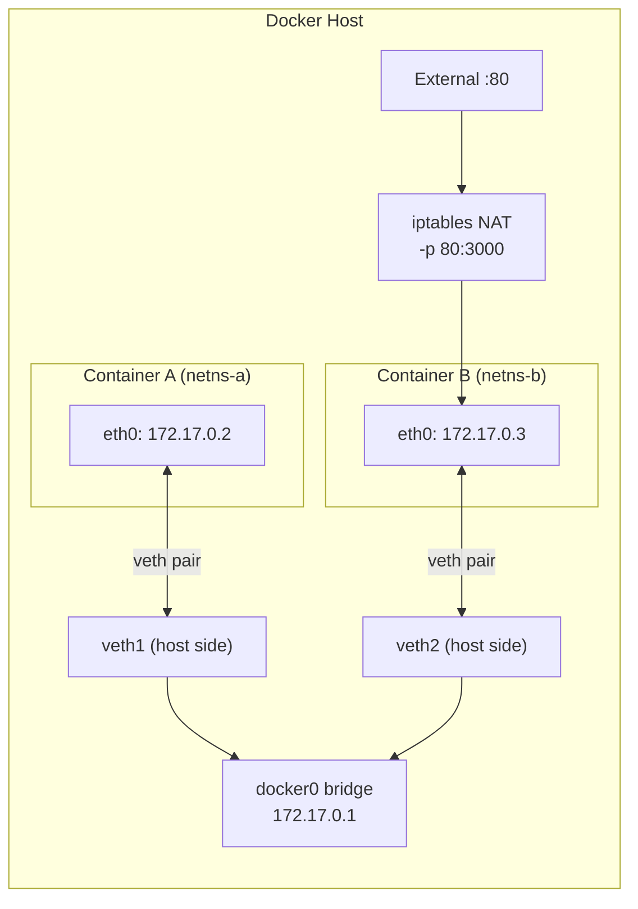

## Keywords in This File
{: .no_toc }

| # | Keyword | Weight |
|---|---|---|
| 1 | [Docker - L3 Networking and Storage Deep Dive](#docker---l3-networking-and-storage-deep-dive) | medium |

---

# Docker - L3 Networking and Storage Deep Dive

## Container Networking Deep Dive

---

### 🎯 Model Answer

**30 seconds:**
> Docker networking internals: Linux network namespaces, virtual
> ethernet pairs (veth), and a bridge network (docker0 by default).
> Each container gets a network namespace with its own interface.
> A veth pair connects the container namespace to the bridge. The
> bridge: acts as a virtual switch. iptables handles NAT for outbound
> traffic and port forwarding for inbound. User-defined networks:
> add embedded DNS resolution (containers find each other by name).

**3 minutes (Senior):**
> Deep networking concepts: (1) **Linux network namespace**: each
> container has an isolated `net` namespace with its own network
> stack (interfaces, routing table, iptables, socket table). The host:
> a different namespace. `docker exec mycontainer ip addr` shows the
> container's interfaces, not the host's. (2) **veth pair**: a virtual
> cable with two ends. One end: in the container namespace (named
> `eth0`). Other end: on the host (named `vethXXXXXX`), attached to
> the bridge. `ip link show` on the host reveals all veth pairs and
> the docker bridge. (3) **docker0 bridge**: default bridge. `ip addr
> show docker0` shows its IP (172.17.0.1). Containers on the default
> bridge: can communicate by IP but NOT by name (no DNS). User-defined
> bridge: Docker's embedded DNS resolves service names. ALWAYS use
> user-defined networks in production. (4) **iptables**: Docker
> manages iptables rules for port publishing (`-p`). `iptables -t
> nat -L -n -v` shows DOCKER chain rules. These are managed by Docker
> daemon. Do NOT manually edit Docker's iptables rules. (5) **Network
> modes**: bridge (default), host (no isolation), none (no networking),
> overlay (multi-host, Docker Swarm/Swarm mode), macvlan (container
> gets a MAC, appears on physical network).

**Blank Mind Recovery:**

**(1) Restate:** "Each container: net namespace. Connected via veth
pair to bridge. Bridge: virtual switch. iptables: NAT + port forward.
User-defined bridge: DNS by name. Host mode: no namespace (container
shares host network). Overlay: multi-host."

**(2) First principles:** "Network isolation = network namespaces.
Communication = veth pairs + bridge = virtual network. External
access = iptables NAT. Name resolution = embedded DNS on user-defined
networks. Understanding this: debug any connectivity issue."

**(3) Bridge:** "Container networking is like an office building.
Each container: a room with a phone (container interface). The
hallway switchboard: the bridge (docker0). Extension numbers: container
IPs. The reception desk: embedded DNS (user-defined networks, looks
up service names to extensions). External calls: iptables NAT
(translates internal extension to external phone number)."

---

### 📘 Concept Explanation

**Network namespaces, veth pairs, bridge, iptables, overlay:**


```
LINUX NETWORK NAMESPACE INTERNALS:

  # Container networking: verify from the host:
  
  # List all veth pairs (one per container):
  ip link show | grep veth
  # Output: veth3a2b1c4 links to docker0 bridge
  
  # List Docker bridges:
  ip addr show docker0   # default bridge: 172.17.0.1
  ip addr show br-abc123  # user-defined network bridge
  
  # Map a container's veth to its ID:
  # Inside container:
  docker exec mycontainer cat /sys/class/net/eth0/ifindex
  # Output: 45  (interface index)
  # On host: find interface with index 45+1 (veth pair peer):
  ip link | grep "^45:"   # the host-side veth
  
  # View container network namespace directly:
  # Get container PID:
  CPID=$(docker inspect mycontainer --format '{{.State.Pid}}')
  # Enter its network namespace:
  nsenter --target $CPID --net ip addr
  # Equivalent to: docker exec mycontainer ip addr

IPTABLES PORT FORWARDING (how -p works):

  # Publish port 80 on host to port 3000 in container:
  docker run -p 80:3000 myapp
  
  # Docker creates these iptables rules automatically:
  iptables -t nat -L DOCKER -n -v
  # DNAT rule: incoming traffic on host port 80
  #   -> forward to container IP:3000
  # ACCEPT rule in FORWARD chain for container traffic.
  
  # To see the actual container IP:
  docker inspect mycontainer --format '{{.NetworkSettings.IPAddress}}'
  # e.g., 172.17.0.3
  
  # The iptables DNAT rule: dest 0.0.0.0:80 -> 172.17.0.3:3000
  # On the host: connections to localhost:80 are NATed to 172.17.0.3:3000.

USER-DEFINED NETWORKS (DNS resolution):

  # Create a user-defined bridge network:
  docker network create myapp-network
  
  # Run containers on it:
  docker run -d --name db --network myapp-network postgres:15
  docker run -d --name app --network myapp-network myapp
  
  # App container: can reach db by name:
  docker exec app curl http://db:5432  # DNS resolves "db" to db's IP
  
  # Default bridge: NO DNS. Must use IP:
  docker run -d --name db postgres:15      # on default bridge
  docker run -d --name app myapp           # on default bridge
  docker exec app curl http://db:5432      # FAILS: name not resolved
  docker exec app curl http://172.17.0.3:5432  # Must use IP. Brittle.
  
  # Connecting containers across networks:
  docker network connect myapp-network another-container
  # Container now has interfaces on both networks.

OVERLAY NETWORKS (multi-host, Docker Swarm):

  # Overlay: connects containers across multiple Docker hosts.
  # Requires: Docker Swarm mode (or third-party like Weave, Flannel).
  
  docker swarm init
  docker network create --driver=overlay myswarm-net
  
  # Containers on different hosts but same overlay network:
  # can communicate by service name.
  # Overlay uses VXLAN: encapsulates container frames in UDP packets.
  # Port: 4789/UDP between hosts.
  # Control plane: 7946/TCP+UDP for Swarm gossip.
  
  # VXLAN overhead: ~50 bytes per packet.
  # For high-throughput, latency-sensitive services: consider
  # host networking or macvlan to avoid VXLAN overhead.

HOST NETWORK MODE:

  # Container shares the host's network namespace.
  # No isolation. No port publishing needed.
  docker run --network=host nginx
  # nginx listens on :80 on the HOST network interface directly.
  # Use case: performance-sensitive applications (no NAT overhead).
  # Security: container can see and bind to all host network interfaces.
  # Risk: a misconfigured service can conflict with host services.
  # Kubernetes: hostNetwork: true (use sparingly, specific use cases only).

DEBUGGING CONTAINER CONNECTIVITY:

  # Container cannot reach another container:
  # Step 1: verify both on the same network:
  docker inspect containerA --format '{{json .NetworkSettings.Networks}}'
  docker inspect containerB --format '{{json .NetworkSettings.Networks}}'
  # Same network name? If not: docker network connect.
  
  # Step 2: test connectivity from inside:
  docker exec containerA ping -c1 containerB  # by name (user-defined net)
  docker exec containerA curl -v http://containerB:8080/health
  
  # Step 3: check if target is actually listening:
  docker exec containerB netstat -tlpn  # or: ss -tlpn
  # Is it listening on 0.0.0.0:8080 or 127.0.0.1:8080?
  # 127.0.0.1: only loopback. Not reachable from other containers.
  
  # Step 4: check iptables (if using user-defined rules):
  iptables -L DOCKER-USER -n -v  # Docker's user-defined chain
```


> **Code walkthrough:** This Step 4: check iptables (if using user-defined rules): example demonstrates a key concept in practice using container. **KEY MECHANISM:** the runtime executes these instructions in sequence with specific memory and execution semantics. **WHY IT MATTERS:** misapplying this pattern causes subtle bugs that only manifest under production load. **TAKEAWAY: understand the execution model before using this pattern in production code.**

---

### 💻 Code Example

> **Code walkthrough:** Debugging a "container can't reach anotherice. **KEY MECHANISM:** the runtime executes these instructions in sequence with specific memory and execution semantics. **WHY IT MATTERS:** misapplying this pattern causes subtle bugs that only manifest under production load. **TAKEAWAY: understand the execution model before using this pattern in production code.**
> container" scenario shows the systematic network diagnosis workflow.


```bash
# BAD: unsafe shell scripting pattern
```


```bash
# Scenario: app container cannot reach db container.
# Error: "Connection refused to db:5432"

# BAD approach: assume networking is broken, restart everything.

# GOOD: systematic diagnosis:

# Step 1: verify containers are on the same network:
docker inspect app --format '{{json .NetworkSettings.Networks}}'
# {"bridge": {"IPAddress": "172.17.0.3"}}
docker inspect db --format '{{json .NetworkSettings.Networks}}'
# {"bridge": {"IPAddress": "172.17.0.2"}}
# Both on "bridge" (default). Problem: no DNS on default bridge.

# Step 2: fix by using a user-defined network:
docker network create myapp-net
docker stop app db
docker rm app db
docker run -d --name db --network myapp-net \
  -e POSTGRES_PASSWORD=secret postgres:15
docker run -d --name app --network myapp-net myapp

# Step 3: verify DNS resolution works:
docker exec app nslookup db
# Server: 127.0.0.11  <- Docker's embedded DNS
# Address: 172.20.0.2 <- db container's IP

# Step 4: verify port is reachable:
docker exec app nc -z -v db 5432
# Connection to db 5432 port [tcp/postgresql]: succeeded!
```


> **Code walkthrough:** The diagnosis reveals the root cause: bothice. **KEY MECHANISM:** the runtime executes these instructions in sequence with specific memory and execution semantics. **WHY IT MATTERS:** misapplying this pattern causes subtle bugs that only manifest under production load. **TAKEAWAY: understand the execution model before using this pattern in production code.**
> containers are on the default bridge network where Docker's embedded
> DNS is not available. The fix: create a user-defined network and
> re-run containers on it. `127.0.0.11` is Docker's embedded DNS
> resolver IP (always this address on user-defined networks). The
> `nc -z` (netcat connect-only) test confirms port-level reachability
> without needing the application to be running.

---

### 🎓 Answers by Seniority

**Junior / Mid (0-5 years):**
> Docker containers communicate via networks. User-defined networks:
> add DNS resolution by container name. Default bridge: no DNS. Always
> create a user-defined network in docker-compose.yml (Compose does
> this automatically). Port publishing (`-p 8080:3000`): maps a host
> port to a container port for external access.

---

**Senior / Staff (5+ years):**
> Network troubleshooting requires understanding the Linux primitives:
> namespaces, veth pairs, bridge, iptables. When a container cannot
> reach a host IP: check if the host's firewall is blocking the source
> IP (Docker's bridge network IP range). When two containers cannot
> reach each other: first confirm they're on the same network (or
> connected networks), then confirm the target is listening on
> 0.0.0.0 (not just 127.0.0.1). The Docker embedded DNS (127.0.0.11)
> is the key for service discovery. Overlay networks for Swarm:
> understand VXLAN overhead. For microservices with thousands of RPS:
> the VXLAN encapsulation cost (50-100 microseconds latency increase,
> 50-byte header overhead) must be evaluated against the isolation benefit.

---

### ⚠️ Common Misconceptions

**Misconception: "Containers on the same Docker host are always able to reach each other."**
Container connectivity depends on network configuration, not physical
colocation. Two containers on the same host but different, disconnected
networks: cannot communicate. The Docker default bridge (`bridge`
network): containers can communicate by IP but NOT by name. A
container on the default bridge and a container on a user-defined
bridge: cannot communicate at all without explicit `docker network
connect`. In Docker Compose: all services in a compose file are
automatically placed on a shared user-defined network named
`{projectname}_default`. This is why Compose services can reach
each other by name by default. But if you run containers with `docker
run` outside of Compose: they land on the default bridge (no DNS).
Always specify an explicit network name in docker-compose.yml:
`networks: [myapp]` to avoid dependency on Compose defaults.

---

### ⚖️ Comparison Table

| Network Mode | Isolation | DNS by Name | Multi-Host | Overhead | Use Case |
|---|---|---|---|---|---|
| bridge (default) | Namespace | No | No | Minimal | Dev only |
| bridge (user-defined) | Namespace | Yes | No | Minimal | All single-host |
| host | None | N/A | No | Zero | High-perf, privileged |
| none | Full | No | No | N/A | Batch jobs, security |
| overlay | Namespace | Yes | Yes | VXLAN (50B+) | Docker Swarm |
| macvlan | Namespace | No (needs external) | L2 only | None | Bare-metal L2 |

---

### 🏛️ System Design

*(Omit: container networking fundamentals - implementation details, not system architecture.)*

---

### 📊 Diagram

```
CONTAINER NETWORKING INTERNALS (host view):

  HOST
  +--------------------------------------------------+
  |                                                  |
  |   docker0 bridge (172.17.0.1)                   |
  |      |              |                            |
  |   veth1          veth2                           |
  |      |              |                            |
  +------|--------------|----+  +------------------+ |
  |  Container A        |    |  |   Container B    | |
  |  eth0: 172.17.0.2   | veth2 | eth0: 172.17.0.3| |
  |  ns: netns-a        |    |  | ns: netns-b      | |
  +---------------------+    |  +------------------+ |
                             |                        |
  iptables: -p 80:3000       |                        |
  External:80 -> 172.17.0.3:3000                      |
  +--------------------------------------------------+
```



> **Diagram walkthrough:** Each container runs in a separate Linux
> network namespace with its own virtual interface (`eth0`). A veth
> pair (virtual cable) connects each container's `eth0` to a host-side
> peer, which is attached to the `docker0` bridge. The bridge acts
> as a layer-2 switch: traffic between containers crosses the bridge
> in the host namespace without entering the internet. iptables DNAT
> rules (created by `docker run -p 80:3000`) redirect external traffic
> on port 80 to Container B's IP and port 3000. User-defined networks
> create a separate bridge with embedded DNS.

---

### 🚨 Failure Modes and Diagnosis

**Failure: Published port is unreachable from outside the host.**
```plaintext
Symptom: curl http://host-ip:8080 returns "Connection refused"
  or times out. But the container is running and healthy.

Root cause options:
  1. App is bound to 127.0.0.1 inside container (loopback only).
  2. Firewall on the host is blocking port 8080.
  3. Docker published to 127.0.0.1 on the host (default in Docker 20.10+).
  4. iptables conflict: host firewall reset Docker's DNAT rules.

Diagnosis:
  # Check what Docker published:
  docker port mycontainer
  # "3000/tcp -> 0.0.0.0:8080"  -> accessible from any interface. OK.
  # "3000/tcp -> 127.0.0.1:8080" -> only localhost. NOT external.
  
  # Check what the app is listening on inside:
  docker exec mycontainer ss -tlpn | grep 3000
  # "0.0.0.0:3000" -> listening on all interfaces. OK.
  # "127.0.0.1:3000" -> loopback only. Must fix in app config.
  
  # Check host firewall:
  iptables -L INPUT -n | grep 8080  # is port 8080 allowed?
  # Or: ufw status | grep 8080
  
  # Check Docker's DNAT rules:
  iptables -t nat -L DOCKER -n -v | grep 8080

Fixes:
  1. App bound to 127.0.0.1: change app config to bind 0.0.0.0.
  2. Published to 127.0.0.1 host: use -p 0.0.0.0:8080:3000 explicitly.
  3. Host firewall blocking: ufw allow 8080 (or edit iptables).
  4. iptables flushed: docker restart (re-creates DNAT rules).
     Or: systemctl restart docker (full rule refresh).
```

> **Code walkthrough:** This Check Docker's DNAT rules: example demonstrates a key concept in practice using container. **KEY MECHANISM:** the runtime executes these instructions in sequence with specific memory and execution semantics. **WHY IT MATTERS:** misapplying this pattern causes subtle bugs that only manifest under production load. **TAKEAWAY: understand the execution model before using this pattern in production code.**

---

### 🎯 Interview Deep-Dive

| Question Category | Time to Answer |
|---|---|
| veth pair + bridge explanation | 3 minutes |
| User-defined vs default bridge DNS | 2 minutes |
| iptables port forwarding | 2 minutes |
| Overlay networks (multi-host) | 2 minutes |
| "App can't reach DB" diagnosis | 2 minutes |
| Published port unreachable diagnosis | 1 minute |
| Host network mode tradeoffs | 1 minute |
| Container listening on 127.0.0.1 | 1 minute |

---

**Q1 (architecture): When would you use host network mode and what are the security implications?**

A: Host network mode removes the network namespace isolation:
the container's process directly uses the host's network stack.
Use cases: (1) Performance-sensitive applications where NAT and
bridge overhead is measurable. High-frequency trading containers,
network monitoring agents, service meshes that need raw socket access.
Benchmark: bridge mode adds ~100 microseconds latency per hop
(veth + bridge + iptables). Host mode: direct socket. (2) Applications
that need to discover or bind to specific network interfaces by name.
(3) Docker daemon-adjacent tools (network plugins, monitoring agents)
that need host network visibility. Security implications: the container
can listen on any host port, see all host network traffic, and conflict
with host services on the same port. An attacker with RCE in a
host-network container: can attempt to bind to host ports, sniff
network traffic, and in some configurations reach host services on
localhost. In Kubernetes: `hostNetwork: true` is a privileged
capability. If the application does not specifically require it:
do not use it. The bridge overhead is negligible for most applications.

*What separates good from great:* The VXLAN overhead of overlay
networks is often cited as a reason to use host networking in Swarm.
Better alternative: Kubernetes with a high-performance CNI (Cilium
with eBPF). Cilium bypasses iptables entirely using eBPF programs
in the kernel. Network policy enforcement, load balancing, and
observability: all in eBPF. Latency: comparable to host networking.
Security: full isolation. The host-networking tradeoff only applies
when the CNI itself is the bottleneck. For modern clusters with
Cilium or Calico: overlay overhead is minimal.

---

---

## Docker Storage Drivers and Performance

---

### 🎯 Model Answer

**30 seconds:**
> Docker storage drivers (OverlayFS, devicemapper, btrfs): manage
> how image layers and container writes are stored on disk. Production
> standard: `overlay2` (OverlayFS v2). OverlayFS: copy-on-write.
> Read from lower layer (image). Write: file is copied to upper layer
> (container writable layer). This copy is slow for large files
> (first write). Persistent data: always use volumes (bypasses
> storage driver, direct host filesystem access).

**3 minutes (Senior):**
> OverlayFS internals and performance: (1) **Layer structure**:
> lower directories (image layers, read-only). Upper directory
> (container writable layer). Work directory (OverlayFS internal).
> Merged directory (what the process sees: union of all layers).
> (2) **Copy-on-write (CoW)**: process reads `/app/config.json` from
> the image layer: fast (no copy). Process writes `/app/config.json`:
> OverlayFS copies the entire file from the lower layer to the upper
> layer first (CoW). Then writes the modification. For large files:
> this first-write cost is significant. (3) **Performance impact**:
> small file rewrites: fast. Large file rewrites in container writable
> layer (e.g., writing a 2GB database file inside a container without
> a volume): catastrophically slow due to CoW overhead. Always use
> volumes for any workload that writes large files or many files.
> (4) **`docker diff`**: shows which files changed in the container
> writable layer. Useful for debugging what an application modifies
> at runtime. (5) **Volume vs bind mount performance**: volumes:
> managed by Docker, stored at `/var/lib/docker/volumes/`. Bind
> mounts: direct host path. On Docker Desktop (macOS/Windows):
> bind mounts cross a VM boundary: significantly slower. Volumes:
> avoid this overhead. Named volumes: always prefer over bind mounts
> for production performance.

**Blank Mind Recovery:**

**(1) Restate:** "overlay2: standard. Lower layers = image (read-only).
Upper layer = container writes. CoW: first write copies entire file
from lower to upper (slow for large files). Volumes: bypass OverlayFS,
direct host filesystem. Always use volumes for database or high-write
workloads."

**(2) First principles:** "Image is immutable (shared across containers).
Container writes must be isolated. OverlayFS: the mechanism for this.
Volumes: escape hatch from OverlayFS for performance-critical I/O."

**(3) Bridge:** "OverlayFS is like a transparent overlay on a map.
The base map (image layers): printed, read-only. You put tracing
paper on top (container writable layer). Reads: you see through the
paper to the base map. Writes: you mark the paper. But the first time
you write on a big printed area: you must first copy that area to
your paper (CoW). Volumes: a completely separate piece of paper
with direct access, no tracing paper needed."

---

### 📘 Concept Explanation

**OverlayFS internals, CoW cost, volumes performance, docker diff:**
```plaintext
OVERLAYFS LAYER STRUCTURE:

  # View storage driver in use:
  docker info | grep "Storage Driver"
  # Output: "Storage Driver: overlay2"
  
  # OverlayFS mounts for a container (requires root on host):
  mount | grep overlay
  # overlay on /var/lib/docker/overlay2/.../merged type overlay
  # (lowerdir=.../l/...:...,
  #  upperdir=.../diff,
  #  workdir=.../work)
  
  # lowerdir: multiple image layers (colon-separated), read-only.
  # upperdir: container writable layer (changes go here).
  # workdir: OverlayFS internal (temporary work area).
  # merged: the union of all layers. This is what the process sees.
  
  # Directory contents on host:
  ls /var/lib/docker/overlay2/
  # <layer-hash>/  <- each image layer + container layer
  #   diff/        <- the actual files in this layer
  #   link         <- short name for this layer
  #   lower        <- reference to parent layers

COPY-ON-WRITE (CoW) MECHANICS:

  # Scenario: application reads config from image:
  # cat /app/config.json  (file exists in image layer)
  # -> OverlayFS: reads from lower layer. No copy. Fast.
  
  # Scenario: application modifies the config:
  # echo "new" > /app/config.json
  # -> OverlayFS:
  #    1. File found in lower layer.
  #    2. Copy the ENTIRE file to upper layer (container writable).
  #    3. Modify the copy in upper layer.
  # Cost: proportional to the file size, not the change size.
  # A 1GB file: CoW copies 1GB on first write.
  # Even if you only change 1 byte.
  
  # Performance test (do NOT do this in production):
  docker run --rm alpine sh -c "
    dd if=/dev/zero of=/bigfile bs=1M count=1000 2>/dev/null
    time echo 'change' >> /bigfile  # first write to 1GB file
  "
  # Time: seconds. CoW copies 1GB.
  
  # Same with a volume (bypasses CoW):
  docker run --rm -v myvolume:/data alpine sh -c "
    dd if=/dev/zero of=/data/bigfile bs=1M count=1000 2>/dev/null
    time echo 'change' >> /data/bigfile
  "
  # Time: milliseconds. Direct filesystem write.

WHAT LIVES WHERE:

  # Container writable layer (in-container, NOT volumes):
  # - Application logs written to /var/log (inside container)
  # - Temp files created at /tmp
  # - In-process database files written inside container
  # Performance: CoW overhead on first write. Lost on container rm.
  
  # Volume (named volume or bind mount):
  # - Database files (PostgreSQL /var/lib/postgresql/data)
  # - Application logs (mounted /var/log)
  # - Configuration files (mounted /app/config)
  # Performance: native filesystem speed. Persists across container rm.
  
  # Best practice for databases:
  # ALWAYS use a volume for database data directories.
  # PostgreSQL without a volume: data in container writable layer.
  # Every DB write: CoW overhead. DB crashes and restarts: DATA LOST.

DOCKER DIFF (debugging container changes):

  docker diff mycontainer
  # Output:
  # C /etc/hosts           <- Changed file
  # A /tmp/app.pid         <- Added file
  # D /etc/resolved.conf   <- Deleted file
  # (C=Changed, A=Added, D=Deleted)
  
  # Useful for:
  # - Security audit: what did this container write?
  # - Debugging: what config files did the app modify?
  # - Creating a new image layer: docker commit mycontainer newimage
  #   (not recommended for production, but useful in emergencies)

VOLUME PERFORMANCE (macOS/Windows Docker Desktop):

  # On Docker Desktop (macOS/Windows):
  # The Docker daemon runs in a Linux VM.
  # Bind mounts cross a VM boundary (hypervisor file sharing).
  # Read/write performance: significantly slower than native.
  # Named volumes: stored inside the VM. No VM boundary for IO.
  
  # Benchmark on macOS:
  # Bind mount: ~300 IOPS for small random writes.
  # Named volume: ~8000 IOPS for same workload.
  
  # For database containers on Docker Desktop:
  # ALWAYS use named volumes (not bind mounts) for data directories.
  
  # For application code on Docker Desktop (live reload dev):
  # Bind mounts: necessary (code on host). But can be slow.
  # Mitigation: sync tools (Mutagen, Docker Desktop Synchronized FS)
  # or develop in a devcontainer inside the VM.
```

> **Code walkthrough:** This or develop in a devcontainer inside the VM. example demonstrates a key concept in practice using SQL. **KEY MECHANISM:** the runtime executes these instructions in sequence with specific memory and execution semantics. **WHY IT MATTERS:** misapplying this pattern causes subtle bugs that only manifest under production load. **TAKEAWAY: understand the execution model before using this pattern in production code.**

---

### 💻 Code Example

> **Code walkthrough:** A PostgreSQL volume configuration withice. **KEY MECHANISM:** the runtime executes these instructions in sequence with specific memory and execution semantics. **WHY IT MATTERS:** misapplying this pattern causes subtle bugs that only manifest under production load. **TAKEAWAY: understand the execution model before using this pattern in production code.**
> explicit best practices vs the common mistake of in-container data.


```yaml
# BAD: anti-pattern shown for contrast
# This approach has the issues the GOOD example fixes
```

```yaml
# BAD: PostgreSQL data in container writable layer:
services:
  db:
    image: postgres:15
    # No volume: data written to container's CoW layer.
    # CoW overhead on every DB write.
    # docker compose down: DATA IS LOST.

# GOOD: PostgreSQL data in named volume:
services:
  db:
    image: postgres:15
    volumes:
      - pgdata:/var/lib/postgresql/data
      # Named volume: bypasses OverlayFS.
      # Native filesystem performance.
      # docker compose down: data preserved.
      # docker compose down -v: data removed (explicit).
    environment:
      POSTGRES_PASSWORD: ${POSTGRES_PASSWORD}
    # Optional: performance tuning for SSD hosts:
    command: >
      postgres
        -c shared_buffers=256MB
        -c effective_cache_size=768MB
        -c wal_buffers=16MB
        -c synchronous_commit=off

volumes:
  pgdata: {}  # Managed by Docker. Stored in /var/lib/docker/volumes/.
```

> **Code walkthrough:** The `pgdata` named volume is stored atice. **KEY MECHANISM:** the runtime executes these instructions in sequence with specific memory and execution semantics. **WHY IT MATTERS:** misapplying this pattern causes subtle bugs that only manifest under production load. **TAKEAWAY: understand the execution model before using this pattern in production code.**
> `/var/lib/docker/volumes/projectname_pgdata/_data/` on the host
> (inside the Linux VM on Docker Desktop). PostgreSQL writes to this
> path: direct filesystem access, no OverlayFS. `docker compose down`
> stops containers but preserves the volume. `docker compose down -v`
> also removes volumes (destructive, explicit intent required). The
> `synchronous_commit=off` option: improves write performance by
> not waiting for WAL flush (risk: lose last ~0.6ms of transactions
> on crash, acceptable for dev environments).

---

### 🎓 Answers by Seniority

**Junior / Mid (0-5 years):**
> Docker uses OverlayFS (`overlay2`) to manage image layers. Each
> container has a writable layer on top of the read-only image layers.
> For databases and any persistent data: always use volumes (named
> volumes or bind mounts). Without volumes: data is lost when the
> container is removed.

---

**Senior / Staff (5+ years):**
> The CoW overhead of OverlayFS is the key performance consideration.
> Any application that writes large files (databases, log files,
> cache files) inside the container writable layer is paying CoW cost
> on every file modification. The diagnosis: `docker stats` shows
> high BlockIO but low actual throughput, or the host shows iowait
> during container operations. The fix: always use volumes for
> database data, log directories, and any high-write path. On Docker
> Desktop: additionally, prefer named volumes over bind mounts for
> data directories. The VM file-sharing overhead for bind mounts on
> macOS is a common cause of slow local database performance that
> developers attribute to the database itself.

---

### ⚠️ Common Misconceptions

**Misconception: "docker compose down removes volumes."**
`docker compose down` stops and removes containers and networks but
KEEPS volumes. Volumes are not removed unless you explicitly pass
`-v` (`docker compose down -v`). This is intentional: data persistence
survives service restarts and redeployments. The flip side: volumes
accumulate on developer machines. `docker volume ls` may show many
old volumes. `docker system prune -a --volumes` removes all unused
volumes (be careful: this is destructive). For developers: check
`docker volume ls` monthly and clean up stale volumes. For CI
environments: always run `docker compose down -v` at the end of
tests to avoid storage exhaustion. Production: named volumes are
managed separately from container lifecycle. They should be backed
up before a `down -v`.

---

### ⚖️ Comparison Table

| Storage | CoW Overhead | Persists | Linux Perf | macOS Perf | Use Case |
|---|---|---|---|---|---|
| Container writable | Yes | No (on rm) | Good (CoW) | Good (CoW) | Ephemeral temp |
| Named volume | No | Yes | Native | Fast (in-VM) | DB data, logs |
| Bind mount (Linux host) | No | Yes | Native | Slow (VM bridge) | Dev live reload |
| tmpfs | No | No (RAM only) | Fastest | N/A | Temp, secrets |

---

### 🏛️ System Design

*(Omit: storage driver internals are operational details, not system design decisions.)*

---

### 📊 Diagram

*(Omit: OverlayFS internals are best expressed in the annotated concept explanation above.)*

---

### 🚨 Failure Modes and Diagnosis

**Failure: PostgreSQL container is extremely slow or crashes with disk full.**


```plaintext
Symptom A: DB operations 10x slower than expected.
  Symptom B: Container exits with "No space left on device".
  Symptom C: docker stats shows high BlockIO, low throughput.

Root cause: database data stored in container writable layer
  (no volume configured).
  Symptom A: CoW overhead on every DB write.
  Symptom B: Docker overlay2 storage is full.
    (/var/lib/docker/ fills up, shared across all containers)
  Symptom C: CoW copies large files on every modification.

Diagnosis:
  # Check if postgres has a volume:
  docker inspect mydb --format '{{json .Mounts}}'
  # []: empty = no volumes. Data is in writable layer.
  
  # Check disk usage:
  docker system df
  # "Local Volumes: 0 volumes, 0 bytes" + large "Images + Containers"
  # confirms data is in container layers.
  
  # Check container diff size:
  docker diff mydb | wc -l   # how many files were modified?
  
  # Check OverlayFS disk:
  du -sh /var/lib/docker/overlay2/<container-layer-hash>/diff/

Immediate fix (with data loss risk - dev only):
  1. Stop container: docker stop mydb
  2. Export data: docker cp mydb:/var/lib/postgresql/data ./backup
  3. Create volume: docker volume create pgdata
  4. Import data: docker run --rm -v pgdata:/data
       -v ./backup:/backup alpine
       cp -a /backup/data/. /data/
  5. Re-run with volume: docker run --name mydb -v pgdata:/var/lib/postgresql/d...

Prevention: ALWAYS configure volumes for database containers.
  Test: after creating a DB container, immediately run:
  docker inspect <dbname> --format '{{json .Mounts}}' | jq
  # Expect: type=volume or type=bind. Never empty.
```


> **Code walkthrough:** This Expect: type=volume or type=bind. Never empty. example demonstrates a key concept in practice using container. **KEY MECHANISM:** the runtime executes these instructions in sequence with specific memory and execution semantics. **WHY IT MATTERS:** misapplying this pattern causes subtle bugs that only manifest under production load. **TAKEAWAY: understand the execution model before using this pattern in production code.**

---

### 🎯 Interview Deep-Dive

| Question Category | Time to Answer |
|---|---|
| OverlayFS layer structure | 2 minutes |
| CoW first-write cost | 2 minutes |
| Named volume vs bind mount | 1 minute |
| macOS Docker Desktop volume perf | 1 minute |
| docker diff use case | 1 minute |
| DB data in writable layer diagnosis | 2 minutes |
| tmpfs use case | 1 minute |

---

**Q1 (debugging): How do you diagnose slow database writes inside a Docker container?**

A: Isolate the I/O path. (1) Check if a volume is configured:
`docker inspect mydb --format '{{json .Mounts}}'`. Empty or missing
volume for the database data directory: root cause found. (2) Check
`docker stats --no-stream mydb`. High `BLOCK I/O` with low throughput:
indicates CoW overhead. (3) Run a write benchmark inside vs outside
the volume: `docker exec mydb sh -c "dd if=/dev/zero of=/tmp/testfile
bs=1M count=100 conv=fdatasync"`. Compare with writing to a volume
path: `docker exec mydb sh -c "dd if=/dev/zero of=/data/testfile
bs=1M count=100 conv=fdatasync"`. Significant difference: confirms
CoW is the bottleneck. (4) Confirm with `docker diff mydb`: if the
database data directory appears in the diff (large number of changed
files): all writes are going through OverlayFS.

*What separates good from great:* The storage driver matters beyond
overlay2. On older systems or specific Linux distributions: `aufs` or
`devicemapper` may be the active driver. `devicemapper` in loop-back
mode: extremely slow (loopback + devicemapper = two layers of
indirection). `devicemapper` in `direct-lvm` mode: production-grade
but requires LVM configuration. Modern systems: `overlay2` with
`xfs` or `ext4` as the backing filesystem is the standard. Check:
`docker info | grep -A2 "Storage Driver"` to see `Backing Filesystem`.
If it shows `xfs` or `ext4`: you have a good baseline. `nfs` or
`loop`: investigate (common in VMs or cloud storage mounts).

---

### 💻 Code Example

*(Omit: this concept does not have a programmatic interface that can be demonstrated in code. The conceptual explanation above is sufficient.)*


---

### 🏛️ System Design

*(Omit: system design diagram not applicable for this concept - see ★★★ keywords for full system design coverage.)*


---

### ⚖️ Comparison Table

*(Omit: this is a ★☆☆ foundational concept with no direct alternatives to compare - see higher-difficulty keywords for trade-off analysis.)*


---

### 📊 Diagram

*(Omit: no standalone visual diagram required for this concept - the explanations and code examples above provide sufficient clarity.)*


