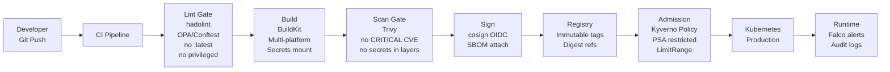

## Keywords in This File
{: .no_toc }

| # | Keyword | Weight |
|---|---|---|
| 1 | [Docker - L4 Anti-patterns at Scale](#docker---l4-anti-patterns-at-scale) | medium |

---

# Docker - L4 Anti-patterns at Scale

## Containerization Anti-patterns at Scale

---

### 🎯 Model Answer

**30 seconds:**
> The ten most costly containerization anti-patterns at scale: fat
> containers (multiple processes, no PID 1 signal handling), snowflake
> containers (manual changes to running containers), mutable image
> tags (`:latest` deployments), no resource limits (noisy neighbor),
> privileged containers in production, storing state in container
> writable layers, ignoring graceful shutdown signals, baking environment
> into images, over-decomposition (one container per tiny function),
> and running as root. Each causes either reliability, security, or
> operational visibility problems that compound at hundreds of containers.

**3 minutes (Senior):**
> Scale amplifies every anti-pattern. (1) **Fat containers**: running
> nginx + application + cron + logs in one container. No PID 1 signal
> forwarding (nginx is not PID 1 if launched by a shell script). No
> per-process resource limits. No per-component restarts. When the
> cron job exhausts memory: the entire container (including nginx) is
> OOM-killed. Microservices philosophy: one process per container.
> Use init systems (`tini`) only when absolutely necessary (for zombie
> reaping). (2) **Snowflake containers**: `docker exec mycontainer
> apt-get install debugtools` in production "just this once." Next
> restart: gone. The running state diverges from the image definition.
> Configuration drift: invisible without audit. Fix: immutable containers.
> Changes only through new image builds and deployments. (3) **Mutable
> tags**: deploying `:latest`. In Kubernetes: imagePullPolicy: IfNotPresent
> means `:latest` won't be pulled on re-schedule unless the node is
> new. Different nodes run different versions of `:latest`. Debugging
> nightmare. Fix: every deployment uses a specific digest or immutable
> tag. (4) **No resource limits**: one container with a memory leak
> will exhaust the entire node's memory, evicting other pods. Kubernetes
> node pressure: evicts all pods on the node. Fix: always set requests
> AND limits. Use LimitRange to enforce defaults. (5) **PID 1 issue**:
> shell scripts as entrypoint don't forward SIGTERM to child processes.
> Kubernetes sends SIGTERM 30 seconds before SIGKILL (terminationGracePeriod).
> If the app doesn't receive SIGTERM: abrupt SIGKILL after 30 seconds.
> In-flight requests are dropped. Fix: exec form CMD (not shell form).
> Or use `tini` as PID 1 with `--` to forward signals.

**Blank Mind Recovery:**

**(1) Restate:** "Fat containers: one process per container. Snowflake:
immutable containers, changes via new builds. Mutable tags: specific
digest or immutable tag. No limits: always set requests AND limits.
Privileged: never in production, always cap-drop ALL. State in writable
layer: use volumes. No graceful shutdown: exec form CMD."

**(2) First principles:** "Containers are supposed to be cattle, not
pets. Every anti-pattern turns a cattle into a pet - something unique,
hand-crafted, that you're afraid to delete. The fix for every
anti-pattern: make the container disposable again. Immutable image,
declared config, external state, proper signals."

**(3) Bridge:** "The cattle vs pets metaphor: anti-patterns are how
cattle become pets without you noticing. Snowflake containers: you
exec into them and add one thing. Mutable tags: you can't tell which
cow you're looking at. No graceful shutdown: the cow doesn't respond
to the herder's signal. Every anti-pattern is a step from cattle
toward pet."

---

### 📘 Concept Explanation

**The ten anti-patterns, mechanisms, and fixes:**

```
# BAD: anti-pattern shown for contrast
# This approach has the issues the GOOD example fixes
```


```
# BAD: anti-pattern shown for contrast
# This approach has the issues the GOOD example fixes
```


```
# BAD: anti-pattern shown for contrast
# This approach has the issues the GOOD example fixes
```


```
# BAD: anti-pattern shown for contrast
# This approach has the issues the GOOD example fixes
```


```
# BAD: anti-pattern shown for contrast
# This approach has the issues the GOOD example fixes
```


```
# BAD: anti-pattern shown for contrast
# This approach has the issues the GOOD example fixes
```


```
# BAD: anti-pattern shown for contrast
# This approach has the issues the GOOD example fixes
```


```
# BAD: anti-pattern shown for contrast
# This approach has the issues the GOOD example fixes
```

```
ANTI-PATTERN CATALOGUE:

  1. FAT CONTAINERS (multiple processes):
  
  # BAD: one container, multiple concerns:
  FROM ubuntu:22.04
  RUN apt-get update && apt-get install -y nginx postgresql supervisor
  COPY supervisord.conf /etc/supervisord.conf
  CMD ["/usr/bin/supervisord"]
  # Problems:
  #   - supervisor as PID 1: signal forwarding unreliable
  #   - single CPU/memory limit for all processes
  #   - one process crash doesn't restart the container
  #   - nginx logs + postgres logs mixed = operational hell
  #   - security: postgres compromise = full container access
  
  # GOOD: separate containers:
  # docker-compose.yml:
  services:
    nginx:
      image: nginx:1.25
    app:
      image: myapp:latest
    db:
      image: postgres:15
  # Each container: independent restarts, limits, logs, scaling.

  2. SNOWFLAKE CONTAINERS (manual drift):
  
  # BAD: patching a running container:
  docker exec -it prod-app-1 bash
  # Inside: apt-get install -y strace tcpdump
  # "just for debugging, I'll remove it later"
  
  # 3 weeks later: "why does prod-app-1 behave differently
  # from prod-app-2?" -> mystery drift, undetected.
  
  # GOOD: immutable containers.
  # Debug with ephemeral containers (Kubernetes):
  kubectl debug -it myapp-pod --image=busybox:latest --target=app
  # Ephemeral: dies when session ends. Production container: untouched.
  
  # Or: add debug tools to the image with a build flag:
  # In Dockerfile:
  ARG DEBUG_TOOLS=false
  RUN if [ "$DEBUG_TOOLS" = "true" ]; then \
        apt-get update && \
        apt-get install -y strace tcpdump && \
        rm -rf /var/lib/apt/lists/*; \
      fi
  # Production: DEBUG_TOOLS=false (default).
  # Debug build: docker build --build-arg DEBUG_TOOLS=true .

  3. MUTABLE TAGS (latest, branch tags):
  
  # BAD: deploying :latest:
  # Kubernetes deployment:
  image: myapp:latest
  imagePullPolicy: IfNotPresent
  # imagePullPolicy: IfNotPresent + mutable tag = disaster.
  # Nodes that already have the image: use the cached (old) version.
  # New nodes: pull the new version.
  # Result: different pods in the same Deployment run different code.
  # Debugging: "why does this pod behave differently?" ->
  # "oh, it's running the old :latest"
  
  # GOOD: immutable tag or digest:
  image: myapp:1.2.3-a1b2c3d  # SemVer + git SHA (immutable)
  # Or:
  image: myapp@sha256:abc123   # digest (absolute immutability)
  imagePullPolicy: IfNotPresent  # safe with immutable reference

  4. NO RESOURCE LIMITS (noisy neighbor):
  
  # BAD: no resource limits in Kubernetes:
  containers:
    - name: app
      image: myapp:1.0.0
  # No requests, no limits. Kubernetes: BestEffort QoS class.
  # BestEffort pods: first to be evicted under node pressure.
  # A memory leak in this pod exhausts the node.
  # All other pods on the node: evicted or OOM-killed.
  
  # GOOD: always set requests AND limits:
  containers:
    - name: app
      image: myapp:1.0.0
      resources:
        requests:
          memory: "256Mi"
          cpu: "250m"
        limits:
          memory: "512Mi"
          cpu: "500m"
  
  # Policy: LimitRange enforces defaults for all pods:
  apiVersion: v1
  kind: LimitRange
  metadata:
    name: default-limits
    namespace: production
  spec:
    limits:
    - default:
        cpu: "500m"
        memory: "256Mi"
      defaultRequest:
        cpu: "100m"
        memory: "128Mi"
      type: Container

  5. PRIVILEGED CONTAINERS (security nightmare):
  
  # BAD: privileged for convenience:
  docker run --privileged myapp
  # Or in Kubernetes:
  securityContext:
    privileged: true
  # This disables ALL Linux security mechanisms:
  #   no seccomp filtering, no AppArmor, no capability isolation.
  # The container is essentially root on the host.
  # CVE exploitation = complete host compromise.
  
  # GOOD: add ONLY the specific capability needed:
  securityContext:
    capabilities:
      drop: ["ALL"]
      add: ["NET_BIND_SERVICE"]  # if the app needs to bind to port 80
  # Most applications need zero additional capabilities.

  6. IGNORING SIGNALS (graceful shutdown failure):
  
  # BAD: shell form CMD (PID 1 is /bin/sh, not the app):
  CMD ["sh", "-c", "java -jar app.jar"]
  # Or:
  CMD java -jar app.jar
  # /bin/sh is PID 1. SIGTERM goes to sh. sh doesn't forward to java.
  # After terminationGracePeriodSeconds: SIGKILL. In-flight requests: dropped.
  
  # GOOD: exec form CMD (app is PID 1):
  CMD ["java", "-jar", "app.jar"]
  # SIGTERM goes directly to java (PID 1). JVM handles graceful shutdown.
  
  # Or: use tini for zombie reaping + signal forwarding:
  FROM eclipse-temurin:17
  RUN apt-get update && \
      apt-get install -y --no-install-recommends tini && \
      rm -rf /var/lib/apt/lists/*
  ENTRYPOINT ["/usr/bin/tini", "--"]
  CMD ["java", "-jar", "app.jar"]

  7. STORING STATE IN WRITABLE LAYER:
  
  # BAD: writing to container filesystem in production:
  # App writes to /app/data/ (in the container writable layer).
  # Container restart: all data is gone.
  # Scale to 3 replicas: each has a separate data store.
  # Pod eviction: data gone.
  # "Where did the uploads go?" -> in the now-deleted writable layer.
  
  # GOOD: use volumes for any persistent state:
  volumes:
    - name: app-data
      persistentVolumeClaim:
        claimName: myapp-pvc
  volumeMounts:
    - name: app-data
      mountPath: /app/data

  8. ENVIRONMENT BAKED INTO IMAGE:
  
  # BAD: prod configuration in the image:
  FROM node:18-alpine
  ENV DB_HOST=prod-db.internal
  ENV LOG_LEVEL=error
  ENV MAX_CONNECTIONS=100
  # The same image cannot be used in dev (different DB_HOST).
  # "Works on my machine" but different behavior per environment.
  # Different images for dev/staging/prod: drift risk.
  
  # GOOD: 12-factor config injection:
  # Image: no environment-specific values.
  # Runtime: inject via environment variables or ConfigMaps.
  # Kubernetes:
  envFrom:
    - configMapRef:
        name: myapp-config-prod
    - secretRef:
        name: myapp-secrets-prod
  # Same image tag deployed to dev, staging, prod.
  # Only the ConfigMap and Secret differ.
```

> **Code walkthrough:** BAD pattern: This Only the ConfigMap and Secret differ. example demonstrates a key concept in practice using Promise. **KEY MECHANISM:** the runtime executes these instructions in sequence with specific memory and execution semantics. **WHY IT MATTERS:** misapplying this pattern causes subtle bugs that only manifest under production load. **WHAT BREAKS: understand the execution model before using this pattern in production code.**

---

### 💻 Code Example

> **Code walkthrough:** These are BAD-to-GOOD rewrites of the mostice. **KEY MECHANISM:** the runtime executes these instructions in sequence with specific memory and execution semantics. **WHY IT MATTERS:** misapplying this pattern causes subtle bugs that only manifest under production load. **TAKEAWAY: understand the execution model before using this pattern in production code.**
> consequential anti-patterns - the ones that cause production incidents.

```yaml
# BAD: complete anti-pattern accumulation in one Kubernetes manifest:
apiVersion: apps/v1
kind: Deployment
spec:
  template:
    spec:
      containers:
        - name: app
          image: myapp:latest          # mutable tag
          command: ["sh", "-c"]        # shell form (PID 1 issue)
          args: ["java -jar app.jar"]  # no signal forwarding
          securityContext:
            privileged: true           # full host access
          # No resources block         # no limits = noisy neighbor
          # No readinessProbe          # traffic before ready
          # No livenessProbe           # no self-healing
          volumeMounts: []             # state in writable layer
```

> **Code walkthrough:** This manifest accumulates seven anti-patternsice. **KEY MECHANISM:** the runtime executes these instructions in sequence with specific memory and execution semantics. **WHY IT MATTERS:** misapplying this pattern causes subtle bugs that only manifest under production load. **TAKEAWAY: understand the execution model before using this pattern in production code.**
> simultaneously. `latest` tag: different nodes run different code.
> Shell form command: SIGTERM not forwarded to Java, causing hard kills.
> Privileged: removes all Linux security mechanisms. No resource limits:
> BestEffort QoS, first evicted under pressure. No probes: traffic
> reaches the pod before the JVM is warmed up, causing 503 errors during
> rollout. This pattern is unfortunately common in "we need to get it
> working first" early-stage projects that then go to production as-is.

```yaml
# GOOD: all anti-patterns corrected:
apiVersion: apps/v1
kind: Deployment
spec:
  template:
    spec:
      containers:
        - name: app
          image: myapp:1.2.3-a1b2c3d   # immutable tag
          # exec form - JVM is PID 1, SIGTERM forwarded:
          command: ["java", "-jar", "/app/app.jar"]
          securityContext:
            allowPrivilegeEscalation: false
            readOnlyRootFilesystem: true
            runAsNonRoot: true
            runAsUser: 1000
            capabilities:
              drop: ["ALL"]
          resources:
            requests:
              memory: "512Mi"
              cpu: "250m"
            limits:
              memory: "1Gi"
              cpu: "500m"
          readinessProbe:
            httpGet:
              path: /health/ready
              port: 8080
            initialDelaySeconds: 10
            periodSeconds: 5
          livenessProbe:
            httpGet:
              path: /health/live
              port: 8080
            initialDelaySeconds: 30
            periodSeconds: 10
          volumeMounts:
            - name: tmp
              mountPath: /tmp     # writable temp dir for read-only root
            - name: app-data
              mountPath: /app/data  # persistent volume for state
      terminationGracePeriodSeconds: 60  # time for graceful shutdown
      volumes:
        - name: tmp
          emptyDir: {}
        - name: app-data
          persistentVolumeClaim:
            claimName: myapp-pvc
```

> **Code walkthrough:** The corrected manifest addresses every anti-pattern.
> Immutable tag ensures all replicas run identical code. `command` array
> form makes Java PID 1, receiving SIGTERM directly. `readOnlyRootFilesystem`
> prevents runtime filesystem mutation (snowflake prevention). Non-root
> user with all capabilities dropped eliminates privilege escalation.
> Resource requests and limits ensure Guaranteed QoS class, preventing
> eviction. Both probes together prevent traffic before readiness and
> enable self-healing. The 60-second gracePeriod gives the JVM time to
> complete in-flight requests. The `emptyDir` volume provides a writable
> `/tmp` when the root filesystem is read-only.

---

### 🎓 Answers by Seniority

**Junior / Mid (0-5 years):**
> The most impactful anti-patterns to fix first: (1) Use specific image
> tags, never `:latest`. (2) Use exec form CMD, not shell form. (3)
> Always set resource limits. These three changes eliminate the majority
> of container reliability issues.

---

**Senior / Staff (5+ years):**
> Anti-patterns don't exist in isolation. They cluster. A codebase with
> `:latest` tags usually also has no resource limits, shell form CMD,
> and environment baked into images. This is the "we'll fix it later"
> cluster that becomes a production incident. The right intervention:
> a platform engineering team that provides opinionated templates
> (Helm charts, Kustomize bases) where the anti-patterns are simply
> not possible. The template enforces: immutable tags via CI mutation
> of the tag value, LimitRange for default limits, security context
> via PodSecurityAdmission, and Renovate for automated base image
> updates. When engineers use the template: they can't easily introduce
> the anti-patterns even if they want to.

---

### ⚠️ Common Misconceptions

**Misconception: "readOnlyRootFilesystem: true breaks most applications."**
Most JVM applications try to write to `/tmp` during startup (temp files,
socket files, PID files). `readOnlyRootFilesystem: true` causes these
writes to fail with "Read-only file system." The fix is NOT to disable
the read-only filesystem. The fix: mount an `emptyDir` volume at `/tmp`.
The emptyDir is writable. The root filesystem (the image layers) is
read-only. This is the correct architecture: the image is immutable,
the specific directories that need writability get explicit writable
mounts. In practice: test every application with `readOnlyRootFilesystem:
true` in a staging environment. Find which paths need writability. Mount
emptyDir or PVC at those specific paths. This "breaks then fixes"
process hardens the deployment and exposes implicit state dependencies.

---

### ⚖️ Comparison Table

| Anti-pattern | Category | Production Impact | Fix |
|---|---|---|---|
| Fat containers | Reliability | Single point of failure | One process per container |
| Mutable `:latest` | Reliability | Version inconsistency | Immutable tags or digest |
| No resource limits | Reliability | Noisy neighbor, eviction | requests + limits always |
| Privileged containers | Security | Host compromise | cap-drop ALL, specific adds |
| Shell form CMD | Reliability | Abrupt SIGKILL, dropped requests | exec form array |
| Snowflake containers | Operations | Configuration drift | Immutable, ephemeral debug |
| State in writable layer | Reliability | Data loss on restart | External volumes |
| Env baked in image | Operations | Image sprawl per environment | Config injection at runtime |
| Running as root | Security | Privilege escalation | runAsNonRoot: true |
| No health probes | Reliability | Traffic before readiness | readiness + liveness probes |

---

### 🏛️ System Design

```
ANTI-PATTERN PREVENTION PLATFORM:

  Developer -> Git Push -> CI Pipeline -> Registry
       |              |           |          |
       |         Lint/Validate  Build      Scan
       |         (OPA/Kyverno)  (BuildKit) (Trivy)
       |              |           |          |
       |         GATE: fail if    |       GATE: block
       |         :latest tag,     |       on CRITICAL CVE
       |         no limits,       |       or secrets found
       |         privileged       |
       |                          |
       v                          v
  Kubernetes (production)     Registry (immutable tags)
  - PodSecurityAdmission:          |
    restricted profile         All images:
  - LimitRange: default limits   - Signed (cosign)
  - NetworkPolicy: deny-default  - Scanned
  - Falco: runtime alerts        - Tagged with git SHA

  POLICY ENFORCEMENT LAYERS:
  
  Layer 1 - Developer IDE: checkov/hadolint in VS Code
  Layer 2 - Pre-commit: detect-secrets, hadolint
  Layer 3 - CI lint: OPA/Conftest checks on manifests
  Layer 4 - CI build: --no-cache, multi-platform, secrets
  Layer 5 - Registry: Trivy scan, image signing
  Layer 6 - Admission: Kyverno ClusterPolicy enforces manifest rules
  Layer 7 - Runtime: Falco detects container escape attempts
```



> **Diagram walkthrough:** Anti-patterns are prevented at seven
> enforcement layers, not just at deployment. Lint gates (layers 1-3)
> catch most issues before any code runs. Build gates (layer 4) enforce
> correct build practices. Scan + sign gates (layers 5-6) enforce supply
> chain integrity. Admission control (layer 6) is the last hard gate
> before production. Runtime detection (layer 7) catches anything that
> slips through and detects new threats. Defense in depth: a developer
> can bypass layer 1 (IDE), but not all seven layers simultaneously.

---

### 🚨 Failure Modes and Diagnosis

**Failure: Kubernetes deployment has mixed pod versions - some pods serve old code, others new code.**

```
Symptom: After a deployment, load-balanced responses are inconsistent.
  Some requests: new behavior. Others: old behavior. Not a canary.
  kubectl describe pod: different image hashes for pods in same Deployment.

Diagnosis:
  # Check what image each pod is actually running:
  kubectl get pods -l app=myapp -o json | \
    jq '.items[] | {
      name: .metadata.name,
      image: .status.containerStatuses[0].imageID,
      node: .spec.nodeName
    }'
  # Output:
  # {"name":"myapp-abc-1","image":"myapp@sha256:OLD_HASH","node":"node-1"}
  # {"name":"myapp-abc-2","image":"myapp@sha256:NEW_HASH","node":"node-2"}
  
  # Root cause: image: myapp:latest with imagePullPolicy: IfNotPresent
  # node-1 already had :latest (old hash). IfNotPresent: did not pull.
  # node-2 was new (or had the image evicted). Pulled the new :latest.
  # Result: same Deployment, different code per node.
  
Remediation:
  # Step 1: force re-pull by changing imagePullPolicy:
  imagePullPolicy: Always  # pulls on every pod start
  # This has a cost: every pod restart pulls the image (network + time).
  
  # Step 2 (permanent fix): use immutable tags:
  image: myapp:1.2.3-$(git rev-parse --short HEAD)
  # CI generates this. Every tag is unique. IfNotPresent is now safe.
  # Rollout: new tag = guaranteed pull of the correct version.
  # Rollback: deploy the previous immutable tag.
  
  # Prevention: enforce in CI with sed or kustomize:
  kustomize edit set image myapp=myapp:1.2.3-$(git rev-parse --short HEAD)
```

> **Code walkthrough:** This Prevention: enforce in CI with sed or kustomize: example demonstrates a key concept in practice using container. **KEY MECHANISM:** the runtime executes these instructions in sequence with specific memory and execution semantics. **WHY IT MATTERS:** misapplying this pattern causes subtle bugs that only manifest under production load. **TAKEAWAY: understand the execution model before using this pattern in production code.**

---

### 🎯 Interview Deep-Dive

| Question Category | Time to Answer |
|---|---|
| Anti-pattern overview (top 5) | 2 minutes |
| Mutable tags production failure | 2 minutes |
| Shell form vs exec form PID 1 | 1 minute |
| Fat container problems | 2 minutes |
| Snowflake container diagnosis | 2 minutes |
| Resource limits and QoS | 2 minutes |
| Privileged container risks | 1 minute |
| State in writable layer | 1 minute |
| readOnlyRootFilesystem | 2 minutes |
| Anti-pattern prevention platform | 3 minutes |
| Behavioral: anti-pattern found in prod | 3 minutes |
| Scale: anti-patterns at 1000 containers | 3 minutes |

---

**Q1 (debugging): A Kubernetes Deployment has been running for 6 months.
Developers notice inconsistent behavior - same endpoint returns different
results on different requests. No recent code changes. Diagnose.**

A: Inconsistent behavior with no code change and the same endpoint:
likely version inconsistency across pods. `kubectl get pods -l app=myapp
-o json | jq '.items[] | {name: .metadata.name, imageID: .status.containerStatuses[0].imageID}'`.
If imageIDs differ across pods: mixed versions. Root cause diagnosis:
(1) Image tag is mutable (`:latest`, `:main`, `:staging`). (2) 6 months
ago: some pods were scheduled on nodes that already had the image cached.
`imagePullPolicy: IfNotPresent` (or default for non-`:latest`): didn't
pull. (3) Recent infrastructure event: some nodes were replaced (auto-scaling
scale-down/scale-up, node maintenance). New nodes: pulled the current
`latest` image. Old pods: still running the old cached version. The
image has diverged. Some pods run the build from 6 months ago. Others
run the current build. The behavior difference: a feature or bug fix
was deployed 3 months ago. Old pods never got it. Immediate fix: `kubectl
rollout restart deployment/myapp` with `imagePullPolicy: Always` - forces
pull on all pods. Permanent fix: switch to immutable tags and deploy
a specific version.

*What separates good from great:* Detecting this proactively instead
of reactively. A monitoring query: group pods by imageID. If any
Deployment has more than one distinct imageID across its pods: alert.
This catches mutable tag drift before it causes visible behavior
inconsistencies. Additionally: admission control that REJECTS manifests
using `:latest`, `:main`, or any other known-mutable tag pattern. This
prevents the anti-pattern from being introduced at all, rather than
detecting it after 6 months.

---

**Q2 (production): Explain the PID 1 problem in containers and its
production consequence.**

A: PID 1 is the init process. In Linux: PID 1 has special responsibilities.
Signal handling: PID 1 receives `SIGTERM` from the kernel when the
container stops. If PID 1 does not handle `SIGTERM`: the process does
nothing. After `terminationGracePeriodSeconds` (default: 30 seconds):
the kernel sends `SIGKILL` (which cannot be caught or ignored). The
production consequence: Kubernetes SIGTERM -> 30 second wait -> SIGKILL.
If the application is in the middle of serving a request: `SIGKILL`
drops it. HTTP clients receive a TCP RST (connection reset). Users see
errors. In a high-throughput service: every rolling restart causes
transient error spikes. Shell form CMD causes this. `CMD java -jar app.jar`:
Docker launches `/bin/sh -c java -jar app.jar`. `/bin/sh` is PID 1.
`java` is PID 2. When Kubernetes sends `SIGTERM`: it goes to PID 1
(`sh`). `sh` does NOT forward signals to children by default.
`java` never receives `SIGTERM`. After 30 seconds: `SIGKILL` to the
entire container. JVM shutdown hooks: never run. In-flight requests:
killed. Fix: exec form `CMD ["java", "-jar", "app.jar"]`. Docker exec-calls
Java directly. Java is PID 1. SIGTERM: JVM receives it, runs shutdown
hooks, completes in-flight requests, exits 0 within grace period.

*What separates good from great:* Understanding the full graceful
shutdown contract. The application must: (1) receive SIGTERM (exec form
CMD); (2) stop accepting new connections; (3) complete in-flight requests
(up to a timeout - 25 seconds for a 30-second grace period); (4) release
resources (database connections, Kafka consumers, etc.); (5) exit 0.
Kubernetes readiness probe: set to fail immediately when SIGTERM is
received. This removes the pod from Service endpoints before the shutdown
completes. Without this: new requests arrive during shutdown. The
pod handles them but is already shutting down. Use Spring Boot's
`server.shutdown=graceful` and `spring.lifecycle.timeout-per-shutdown-phase=25s`
for automatic implementation.

---

**Q3 (trade-off): When is running multiple processes in a container
acceptable?**

A: Three cases where it is acceptable. (1) **Sidecar containers in
Kubernetes**: each "process" is a separate container in the pod. The
pod has init containers (init-only processes), app containers, and
sidecar containers (logging, proxy, secret-rotation). This is not a
fat container: each has separate resource limits, separate restarts.
This is the correct multi-process architecture for Kubernetes. (2)
**Zombie reaping**: every container has at most one child process that
spawns subprocesses. `tini` as PID 1 reaps zombie processes (`SIGCHLD`
orphans). The application can fork. Common for: test runners, batch
jobs, scripts that launch child processes. (3) **Legacy applications
that cannot be decomposed**: a tightly coupled POSIX application that
uses `fork()/exec()` internally. No practical decomposition path. Use
`supervisord` with full awareness of the tradeoffs. But: always
evaluate before accepting. Most applications that "need" multiple
processes can be decomposed with a day of effort. The ones that cannot
are legacy C/C++ applications with deeply embedded process models.

*What separates good from great:* Using Kubernetes native sidecar
containers (GA in Kubernetes 1.29). Native sidecars: declared as
`initContainers` with `restartPolicy: Always`. They start before app
containers, terminate after app containers, and have independent
resource limits and probes. This is the Kubernetes-native answer to
"I need two things in this pod." No supervisord, no fat container.
The sidecar lifecycle is managed by Kubernetes, not by an in-container
process manager. Common use cases: Fluent Bit log forwarding, Envoy
sidecar proxy, Vault agent for secret injection, cloud credentials
refresh daemons.

---

**Q4 (debugging): Production memory exhaustion on a Kubernetes node
with no obvious culprit. One container consumes all node memory. Why
did this happen and how do you prevent it?**

A: No resource limits = BestEffort QoS class. Kubernetes Memory Manager:
BestEffort pods can use any available node memory up to the node capacity.
A memory leak in one BestEffort pod grows unbounded. As the pod's
RSS grows: it consumes memory that other pods expected to have available.
Node memory pressure: kubelet starts evicting other pods (starting
with BestEffort, then Burstable, then Guaranteed QoS class). Eventually:
the OS OOM killer terminates the offending process. But by then: dozens
of other pods have been evicted from this node. Diagnosis: `kubectl top
nodes`, `kubectl top pods --all-namespaces | sort -k3 -n -r` (sort
by memory). Find the pod with unbounded growth. `kubectl describe pod`:
no resource limits in spec. Fix: add limits. `kubectl describe node`:
shows `Non-terminated Pods` and each pod's requests/limits. A pod
with `0` for limits: the offender. Preventive: `LimitRange` object in
the namespace enforces default limits on pods that don't specify them.
`ResourceQuota`: limits total resource consumption per namespace.

*What separates good from great:* Vertical Pod Autoscaler (VPA) in
recommendation mode. VPA monitors actual resource usage over time and
recommends request/limit values. `kubectl describe vpa myapp` shows:
"Current requests: 128Mi. Recommended lower bound: 256Mi. Recommended
target: 512Mi. Recommended upper bound: 1Gi." The VPA recommendation
is data-driven, not guessed. Start with VPA in recommendation mode
(never in auto mode in production without testing - it restarts pods
to change their resource specs, which can cause availability issues).
Use the recommendation to set limits. After a week of traffic: the
recommendations are reliable. Set limits to the recommended upper bound.

---

**Q5 (behavioral): You discover that a critical production microservice
has been running as `privileged: true` for 8 months. How do you handle this?**

A: Treat this as a security incident in progress. (1) **Assess blast
radius**: `privileged: true` disables all Linux kernel security
mechanisms. Any CVE in the application code or in any dependency could
have been used for container escape. Check: when was this service last
updated? Are there any known RCE CVEs for the application or its
dependencies during these 8 months? (2) **Audit node access**: review
node-level audit logs for unusual activity. `privileged` containers
can access the host filesystem, host network interfaces, and create
new kernel modules. Indicators of exploit: unusual kernel module loads,
unexpected network interface configurations, unusual processes visible
at the host level. (3) **Remediate safely**: do not abruptly remove
`privileged: true`. The application may depend on it (e.g., needs
`NET_BIND_SERVICE` or `NET_RAW`). Instead: identify the specific
capability needed. Start with `--cap-drop=ALL --cap-add=<specific>`.
Deploy to staging with the minimal capability. Verify functionality.
Roll out progressively to production. (4) **Document and close the
loop**: how did `privileged: true` reach production? Was there no
admission control? Add Kyverno `ClusterPolicy` that denies `privileged:
true`. This prevents recurrence.

*What separates good from great:* Implementing automated drift detection.
After remediation: a CronJob that runs `kubectl get pods --all-namespaces
-o json | jq '[.items[] | select(.spec.containers[].securityContext.privileged
== true) | {name:.metadata.name, ns:.metadata.namespace}]'` and alerts
when any pod is running privileged. The Kyverno admission policy prevents
NEW privileged pods. The CronJob detects existing ones that predate
the policy. Together: you have prevention + detection. This pattern
(admission control + drift detection) applies to all security anti-patterns:
no root filesystem, no root user, no host path mounts.

---

**Q6 (debugging): A containerized Node.js application handles file uploads.
After a pod restart, all uploaded files are gone. What is the anti-pattern
and fix?**

A: State in the writable layer. The Node.js application writes uploaded
files to `/app/uploads/` (or `/tmp/uploads/`). These paths are in the
container's writable layer: an overlay on top of the read-only image layers.
The writable layer exists only for the lifetime of the container. Container
restart: Docker creates a new writable layer for the new container.
The files from the previous writable layer: gone. In Kubernetes: a pod
restart means a new container, new writable layer, new overlay. The
`emptyDir` volume survives restarts within the same pod (it's on the
node's disk, not the container's overlay), but it is deleted when the
pod is evicted or deleted. Fix options: (1) For persistent uploads
that must survive pod deletion: `PersistentVolumeClaim`. Mount at
`/app/uploads`. Backed by a persistent volume (EBS, GCE PD, NFS, etc.).
(2) For shared uploads across replicas: object storage (S3, GCS). The
application must upload to S3, not to a local path. This is the 12-factor
"treat backing services as attached resources" principle. (3) For
temporary processing (resize, virus scan): `emptyDir` is acceptable.
Upload to emptyDir, process, push result to S3, delete emptyDir file.

*What separates good from great:* Designing for statelessness from
the beginning rather than retrofitting it. The question to ask during
architecture: "What data does this service create at runtime? Where
does it go?" If the answer is: "A local file on the container filesystem":
that is state that needs an architectural decision. Either: externalize
it (object storage, database), or accept that it is ephemeral (and
design the user experience accordingly). Applications that assume
local filesystem persistence cannot scale horizontally (replicas have
separate filesystems), cannot be rescheduled (data left behind on
the old node), and cannot survive infrastructure events (node failure,
pod eviction). Horizontal scalability requires stateless application
containers.

---

**Q7 (system): You are designing a platform engineering initiative to
eliminate these anti-patterns across 200 microservices owned by 15 teams.
How do you approach this without blocking team velocity?**

A: Progressive enforcement with a migration path. (1) **Measure baseline**:
automated scan of all 200 services. Generate a per-team anti-pattern
report: "Team X: 3 services with mutable tags, 1 privileged container,
2 services with no resource limits." This creates objective accountability.
(2) **Provide templates**: Helm chart base or Kustomize base that is
compliant by default. Teams using the template: automatically compliant.
Most anti-patterns cannot be introduced without overriding the template.
(3) **Graduated enforcement**: Week 1-4: admission control in warning
mode (log violations, don't block). Teams see their violations in a
dashboard. Week 5-8: admission control blocks new deployments that
introduce NEW anti-patterns (existing violations: grandfather exemptions
with expiry dates). Week 9-12: exemptions expire. All violations must
be resolved. (4) **Platform team as enabler**: for each anti-pattern,
provide a migration guide with specific before/after examples. Office
hours for teams that need help. The platform team fixes the most
complex cases as a service. (5) **Track progress**: dashboard showing
anti-pattern count per team over time. Celebrate teams that reach 0
violations. Share learnings.

*What separates good from great:* Treating platform engineering as a
product, not a mandate. The platform team has customers (the development
teams). The platform (templates, guides, office hours) is the product.
Anti-pattern enforcement: a constraint that the product works around.
The goal: compliance should require LESS effort than non-compliance.
If using the compliant Helm chart is harder than writing a custom
Deployment manifest: teams will write custom manifests. If the compliant
path is the path of least resistance: teams will take it naturally.
This is "paved road" platform engineering.

---

**Q8 (trade-off): What are the trade-offs of `readOnlyRootFilesystem: true`?**

A: Benefits: (1) **Runtime immutability**: no code can be injected into
the container filesystem at runtime. A compromised application cannot
drop an exploit payload. (2) **Explicit state dependencies**: forces
identification of all runtime-writeable paths. These must be explicitly
mounted as volumes. This surfaces implicit assumptions about state.
(3) **Compliance**: many security frameworks (PCI DSS, CIS benchmark)
require read-only root filesystems for container workloads. Trade-offs:
(1) **Application modification required**: any application that writes
to its own directory structure at runtime must be changed. JVM: temp
files, PID files. Node.js: npm cache, temp downloads. Python: .pyc
cache files. Each requires a writable volume mount. (2) **Discovery
cost**: finding all writable paths requires running the application
in a test environment with `readOnlyRootFilesystem: true` and
observing write errors (permission denied in logs). This takes time.
(3) **Cognitive overhead**: developers must understand why certain
directories have volume mounts. "Why is `/tmp` mounted as emptyDir?"
Requires documentation. Bottom line: the security benefit justifies
the cost for production workloads. The discovery process itself is
valuable: it surfaces hidden state assumptions. Add `readOnlyRootFilesystem: true`
to all production workloads as a team standard, and fix violations
as they are discovered.

*What separates good from great:* Using `strace` to find all writable
paths without running the application in production. In a test container:
`strace -f -e openat,open,creat,write -p 1 2>&1 | grep -v ENOENT | grep O_WRONLY`.
This shows every filesystem write attempted by the application and
its child processes during a test run. The list of paths: the complete
set of writable mounts needed. This technique: 15 minutes of strace
analysis instead of days of "we enabled read-only and now something
is broken, let me figure out what."

---

**Q9 (production): How do you detect and remediate container drift
in a production environment where containers have been modified manually
over time?**

A: Container drift: the running container's state diverges from its
image definition. Three detection methods. (1) **`docker diff`**: shows
filesystem changes to the writable layer. `docker diff <container-id>`:
lists files Added (A), Changed (C), or Deleted (D) relative to the
image. `C /etc/hosts` is normal. `A /usr/local/bin/strace` or
`A /etc/cron.d/malicious-job`: not normal. Run periodically via a
CronJob or DaemonSet across all nodes. Alert on unexpected filesystem
changes. (2) **Image hash comparison**: `docker inspect <container>
--format '{{.Image}}'` gives the image SHA the container was started
from. Compare against the current registry SHA for the same tag.
If different: the container is running an old image (possibly manually
updated). (3) **Process comparison**: expected processes (from `CMD`/`ENTRYPOINT`)
vs actual running processes (`docker exec <id> ps aux`). Extra processes:
indicate manual intervention or a compromise. Remediation: for all
drifted containers: roll out new deployments (Kubernetes: `kubectl
rollout restart deployment`). The new pods start fresh from the
image. Write a postmortem: how did the drift occur? Who has `docker exec`
access to production? Implement least-privilege access control (no
engineer should have `docker exec` in production; use ephemeral
debug containers via Kubernetes instead).

*What separates good from great:* Continuous compliance monitoring
with Falco. A Falco rule: alert when a process writes a file in
a container path that is not a declared volume mount path, where
the container has been running > 10 minutes (startup writes are normal).
`rule: Container filesystem write (unexpected)`. This detects drift
IN REAL TIME, not in a scheduled scan. A manual `apt-get install`
at 2 AM: Falco alert within seconds. The alert triggers: a PagerDuty
incident, an audit log entry, and an automatic Kubernetes annotation
on the pod marking it for investigation. This is container drift
detection as a security control, not just an operational hygiene task.

---

**Q10 (scale): How do anti-patterns compound at 1,000 containers across
50 nodes?**

A: Linear anti-patterns become exponential problems at scale. (1)
**No resource limits at 1,000 containers**: one noisy container triggers
node pressure, evicts 20 pods from a 20-pod node, which triggers
Kubernetes to reschedule them on other nodes, which overloads those
nodes, which cascades. 1 memory leak = cascading eviction storm
across the cluster. With limits: the OOM killer terminates the leaking
container only. Impact: 1 pod, not 1,000. (2) **Mutable tags at 50
teams**: 50 teams deploying `:latest` means any image push by any team
can corrupt the deployment state of any other team's shared-tag image
(if they use the same tag name on a shared registry path). Version
inconsistency across 1,000 pods: debugging which pods have which
version requires checking every pod individually. (3) **No health probes
at 1,000 containers**: rolling update of 100 pods with no readiness
probe. Kubernetes marks each new pod Ready immediately (no probe =
immediately Ready). Traffic is sent to new pods before the JVM is
warmed (60+ seconds for a typical Spring Boot app). 100 pods in
the rolling window: 100 pods serving 503 errors during warmup. With
readiness probes: traffic reaches a pod only after the probe passes.
(4) **Registry pull storms**: 1,000 pods with `imagePullPolicy: Always`
and a rolling restart: 1,000 simultaneous pulls from Docker Hub in
seconds. Rate limit hit immediately. Deploy stalls. Fix: pull-through
cache + `imagePullPolicy: IfNotPresent` with immutable tags.

*What separates good from great:* Understanding that anti-patterns
have non-linear effects at scale. The same mistake that causes a minor
inconvenience with 10 containers causes a complete cluster outage
at 1,000. The "we'll fix it when it becomes a problem" approach:
the problem manifests as a production incident, usually at the worst
possible time (Black Friday, product launch, on-call rotation change).
The argument for proactive anti-pattern elimination: these compound
at scale. The cost of fixing them now: linear. The cost of the
production incident they cause: exponential. Risk-adjusted value
of prevention: always positive.

---

**Q11 (debugging): After enabling PodSecurityAdmission `restricted`
profile in a namespace, existing deployments fail to start with
"container has runAsNonRoot: true but image has no numeric user set."
Explain and fix.**

A: PodSecurityAdmission `restricted` profile requires: `runAsNonRoot: true`.
When `runAsNonRoot: true` without an explicit `runAsUser`: Kubernetes
verifies at runtime that the container's effective UID is not 0. This
verification happens when the container starts: the kubelet checks the
container's image USER directive. Two cases cause this error. (1)
**Dockerfile has `USER` with a username, not a UID**: `USER appuser`.
The container has a non-root user. But Kubernetes can't verify it's
non-root without resolving the username from `/etc/passwd` inside
the image. With `runAsNonRoot: true` and no `runAsUser`: Kubernetes
checks if the image USER is numeric. `USER appuser` is not numeric.
Kubernetes rejects it. Fix: `USER 1000` (numeric UID) in the Dockerfile.
(2) **No USER directive**: image defaults to root (UID 0). `runAsNonRoot: true`
rejects it at admission. Fix: add `USER 1000` to the Dockerfile OR
add `runAsUser: 1000` to the pod's securityContext. Adding `runAsUser`
to the pod spec is faster (no image rebuild needed) but the Dockerfile
fix is more permanent.

*What separates good from great:* A migration script that identifies
which images in the registry lack a numeric USER directive. `docker
inspect <image> --format '{{.Config.User}}'`. Empty string or username:
needs fixing. Numeric UID: compliant. Run this against all 200
service images before enabling PSA restricted. Generate a report:
"42 images need Dockerfile changes before PSA restricted can be
enforced." This allows planned remediation rather than emergency
fixes during a PSA enforcement rollout.

---

**Q12 (behavioral): Describe how you would lead a "container security
hardening sprint" for 3 teams that have accumulated anti-patterns over
2 years.**

A: Structure as a value-driven initiative, not a compliance mandate.
(1) **Kickoff**: present the anti-pattern audit results per team.
For each anti-pattern: explain the risk in concrete terms. "Your service
has `privileged: true`. Any RCE vulnerability in this service gives
an attacker complete control of the K8s node (all 50 other services
running on it)." Not abstract security warnings: concrete blast radius.
(2) **Prioritize by risk**: privileged containers + no resource limits
(reliability + security): sprint 1. Mutable tags + no health probes
(reliability): sprint 2. State in writable layer + env baked in image
(operational): sprint 3. (3) **Template-first approach**: before
teams fix individual services: publish compliant Helm chart templates.
Teams that migrate to the template: automatically compliant for most
anti-patterns. Migration to the template: the primary sprint work.
(4) **Pair programming**: for the first two services each team fixes:
platform engineer pairs with service owner. Transfers knowledge. Avoids
the same questions 200 times. (5) **Definition of done**: automated
scanner verifies zero anti-patterns. Admission control policy enabled
in warning mode during sprint. Enabled in enforcement mode at sprint
end. (6) **Post-sprint**: celebrate the numbers. "We went from 47
anti-pattern violations to 3. The 3 remaining: documented exceptions
with resolution dates." Progress is visible, teams feel accomplished.

*What separates good from great:* The sprint is a one-time event.
The platform + enforcement policy is permanent. The sprint creates
the initial compliance. The Kyverno admission policy + CI lint prevents
regression. Monthly anti-pattern reports: track the trend. If the
count rises: investigate why (new services, exemptions being abused,
policy gaps). The sprint succeeds only if it establishes a self-sustaining
culture + tooling. Otherwise: 6 months later, the same anti-patterns
are back. "Anti-patterns sprint" + "ongoing enforcement platform" are
both required. One without the other: either creates compliance then
lets it decay, or enforces policy that teams work around because
they don't understand it.

---

### 💻 Code Example

*(Omit: this concept does not have a programmatic interface that can be demonstrated in code. The conceptual explanation above is sufficient.)*


---

### 🏛️ System Design

*(Omit: system design diagram not applicable for this concept - see ★★★ keywords for full system design coverage.)*


---

### ⚖️ Comparison Table

*(Omit: this is a ★☆☆ foundational concept with no direct alternatives to compare - see higher-difficulty keywords for trade-off analysis.)*


---

### 📊 Diagram

*(Omit: no standalone visual diagram required for this concept - the explanations and code examples above provide sufficient clarity.)*


