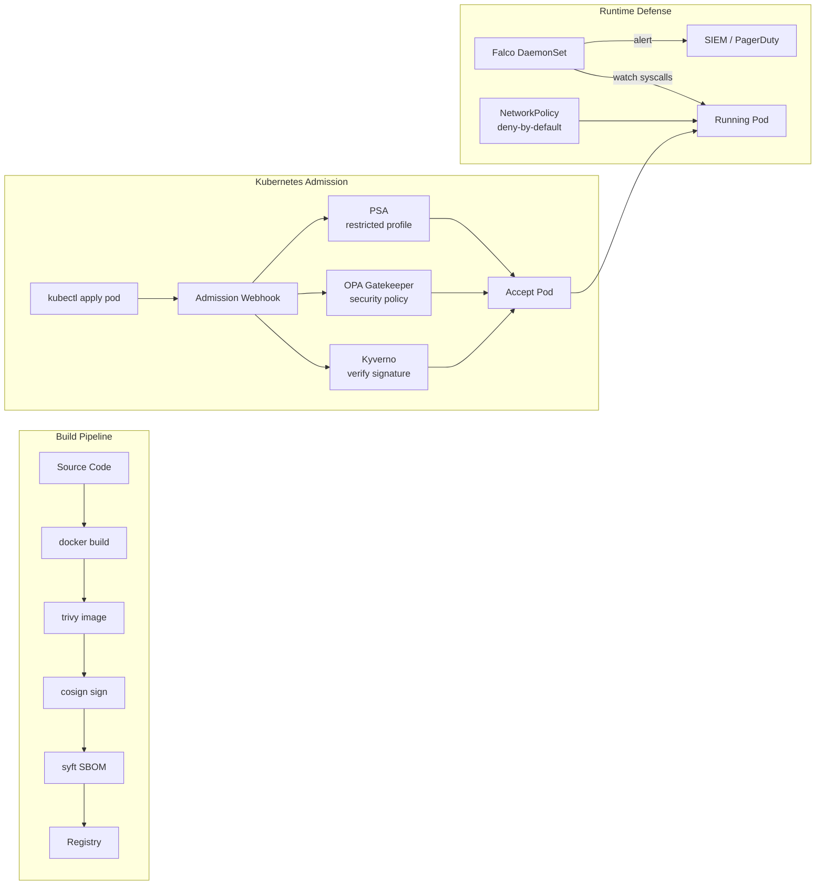

## Keywords in This File
{: .no_toc }

| # | Keyword | Weight |
|---|---|---|
| 1 | [Docker - L4 Container Security](#docker---l4-container-security) | medium |

---

# Docker - L4 Container Security

## Container Security Hardening Advanced

---

### 🎯 Model Answer

**30 seconds:**
> Advanced container security: defense-in-depth combining kernel-level
> controls (seccomp, AppArmor, SELinux), privilege boundaries (rootless
> Docker, user namespaces), supply chain integrity (image signing with
> cosign, SBOM, provenance attestations), runtime threat detection
> (Falco), and policy enforcement (OPA Gatekeeper, Kyverno). The
> threat model: an attacker who has achieved code execution inside
> a container attempting to escape to the host or pivot laterally.

**3 minutes (Senior):**
> Threat model and defense layers: (1) **Container escape paths**:
> privileged containers (`--privileged`), mounted Docker socket,
> kernel CVEs, capability abuse (CAP_SYS_ADMIN covers most escapes),
> host namespace sharing (pid, net, ipc). Block: never privileged
> in production, no docker.sock mount, minimal capabilities, no shared
> namespaces. (2) **Rootless Docker**: the Docker daemon itself runs
> as a non-root user. Container escapes: limited to that user's
> privileges (not root). User namespaces: map UID 0 inside the
> container to an unprivileged UID on the host (e.g., UID 0 inside
> = UID 100000 outside). Even `--privileged` in rootless mode: limited
> to the unprivileged host UID. (3) **Supply chain**: cosign signs
> images at build time. Kubernetes admission webhook: verifies signature
> before allowing pod creation. An attacker who gains access to the
> registry cannot run modified images: signature verification fails.
> (4) **Runtime detection**: Falco monitors syscall activity in
> real time. Rules: alert on `execve` (process spawned inside container),
> shell spawned, sensitive file read (`/etc/shadow`, `/etc/passwd`),
> network connection to unexpected address. These indicate active
> exploitation. (5) **Network policy**: Kubernetes NetworkPolicy
> restricts east-west traffic. Even if a container is compromised:
> it cannot reach other services it's not authorized to reach.

**Blank Mind Recovery:**

**(1) Restate:** "Escape paths: privileged, docker.sock, kernel CVE,
capability abuse, shared namespaces. Block: all five. Rootless Docker:
even escapes are unprivileged. Cosign: images are signed, unsigned
= rejected. Falco: detect active exploitation via syscall rules.
Network policy: contain lateral movement."

**(2) First principles:** "The container boundary is a security
perimeter. Like any perimeter: it has weak points. Know the weak
points. Close them. Assume breach: if the container IS escaped, what
is the blast radius? Rootless + network policy: minimize it."

**(3) Bridge:** "Container security layers are like a bank. The safe
(container) has locks. The building has guards (Falco). The bank
policy says who can enter which room (NetworkPolicy). The vault is
rootless (the manager key doesn't open the external doors). The
teller can't give you a key they don't have (cap-drop)."

---

### 📘 Concept Explanation

**Container escape paths, rootless Docker, user namespaces, Falco, cosign, OPA Gatekeeper:**
```
CONTAINER ESCAPE ATTACK VECTORS:

  # VECTOR 1: privileged container (worst case):
  docker run --privileged myapp
  # Container: has nearly ALL Linux capabilities.
  # Mount the host filesystem:
  docker run --privileged alpine sh -c "
    mkdir /host && mount /dev/sda1 /host && ls /host
  "
  # Full host filesystem access. Game over.
  # RULE: --privileged NEVER in production. Zero exceptions.
  
  # Alternatives to --privileged for common needs:
  # Need to write iptables: --cap-add=NET_ADMIN (not privileged)
  # Need to mount filesystems: --cap-add=SYS_ADMIN (dangerous, avoid)
  # Need to run Docker-in-Docker: use kaniko, buildah, or rootless
  
  # VECTOR 2: Docker socket mount:
  docker run -v /var/run/docker.sock:/var/run/docker.sock myapp
  # docker.sock = direct API access to Docker daemon = root on host.
  # Attacker: docker run --privileged -v /:/host ubuntu chroot /host
  # Full host access via new privileged container.
  
  # MITIGATION: Docker Socket Proxy (tecnativa/docker-socket-proxy):
  docker run \
    -e CONTAINERS=1 \    # allow /containers/* endpoint
    -e IMAGES=1 \        # allow /images/* endpoint
    -e POST=0 \          # block all POST (no creating containers)
    -v /var/run/docker.sock:/var/run/docker.sock \
    tecnativa/docker-socket-proxy
  # Mount the PROXY socket (not real socket) in CI agents.
  # CI can read container/image info but cannot create new containers.
  
  # VECTOR 3: CAP_SYS_ADMIN (near-privileged):
  # CAP_SYS_ADMIN covers: mount, iopl, ptrace, etc.
  # Enables most escape techniques. Never grant this capability.
  
  # VECTOR 4: Host namespace sharing:
  docker run --pid=host myapp   # see all host processes
  docker run --net=host myapp   # use host network (no isolation)
  docker run --ipc=host myapp   # share host IPC (can read /dev/shm)
  # RULE: never share host namespaces in production.
  # Exception: --net=host for specific high-performance needs (with risk...

USER NAMESPACES (ROOTLESS CONTAINER ISOLATION):

  # User namespace mapping: UID 0 inside container -> unprivileged UID outside.
  
  # Enable user namespace remapping in Docker daemon:
  # /etc/docker/daemon.json:
  {"userns-remap": "default"}
  
  # After this: UID 0 inside container = UID 165536 on host.
  # A file created as root inside the container:
  docker exec myapp touch /tmp/testfile
  # On host: ls -ln /var/lib/docker/.../testfile
  # Shows: owner = 165536 (not 0!)
  
  # An escape that gets root inside the container:
  # Gets UID 165536 on the host. Unprivileged. Cannot access root files.
  
  # Rootless Docker (different from userns-remap):
  # The ENTIRE Docker daemon runs as a non-root user.
  # Installed with: dockerd-rootless-setuptool.sh install
  # Daemon PID 1: owned by a regular user.
  # Most container escapes: get that user's privileges, not root.
  
  # Trade-offs of rootless:
  # - Cannot bind ports <1024 (no cap_net_bind_service by default).
  # - Some overlay2 drivers limited (may use fuse-overlayfs instead).
  # - Performance: slight overhead from user namespace translation.
  # - Networking: some modes unavailable.

COSIGN IMAGE SIGNING:

  # Generate signing key pair (or use keyless with OIDC):
  cosign generate-key-pair
  # Creates: cosign.key (private), cosign.pub (public)
  
  # Sign image after push:
  cosign sign --key cosign.key \
    myregistry.io/myapp:1.2.3@sha256:abc123...
  # Signature stored in registry alongside the image.
  
  # Verify image signature:
  cosign verify --key cosign.pub myregistry.io/myapp:1.2.3
  # Outputs: verification success + signer identity.
  
  # Keyless signing (via OIDC, for CI/CD):
  cosign sign --keyless myregistry.io/myapp:1.2.3
  # Uses GitHub Actions OIDC token as identity.
  # No key management. Identity: "github.com/myorg/myrepo/.github/workflows/..."
  
  # Kubernetes: enforce signature verification with Kyverno:
  apiVersion: kyverno.io/v1
  kind: ClusterPolicy
  metadata:
    name: verify-image-signature
  spec:
    validationFailureAction: Enforce
    rules:
      - name: check-image-signature
        match:
          any:
            - resources:
                kinds: [Pod]
                namespaces: [production]
        verifyImages:
          - imageReferences: ["myregistry.io/myapp:*"]
            attestors:
              - entries:
                  - keys:
                      publicKeys: |-
                        -----BEGIN PUBLIC KEY-----
                        <cosign.pub contents>
                        -----END PUBLIC KEY-----
  # Any pod in "production" namespace using myregistry.io/myapp:*:
  # must have a valid cosign signature. Unsigned: rejected.

FALCO RUNTIME SECURITY:

  # Falco: CNCF runtime security tool. Monitors Linux syscalls.
  # Uses eBPF or kernel module to watch ALL syscalls from containers.
  
  # Sample Falco rule (detect shell spawn inside container):
  - rule: Terminal shell in container
    desc: A shell was used as the entrypoint/exec point in a container.
    condition: >
      spawned_process and container
      and shell_procs
      and proc.tty != 0
    output: >
      Shell spawned in a container (user=%user.name
      container_id=%container.id image=%container.image.repository
      shell=%proc.name parent=%proc.pname cmdline=%proc.cmdline)
    priority: WARNING
  
  # Sample rule (detect write to /etc inside container):
  - rule: Write below etc
    desc: Attempt to write to /etc
    condition: >
      write and (fd.directory=/etc or fd.name startswith /etc/)
      and container
      and not proc.name in (known-etc-writers)
    output: >
      Write to /etc in container
      (container=%container.id file=%fd.name)
    priority: ERROR
  
  # Deploy Falco: as DaemonSet in Kubernetes.
  # Alerts: send to Slack, PagerDuty, SIEM.
  # Response: alert, then optionally: kill the container.

OPA GATEKEEPER ADMISSION CONTROL:

  # OPA Gatekeeper: Kubernetes admission webhook with Rego policies.
  # Applied to: every CREATE/UPDATE of Kubernetes resources.
  
  # ConstraintTemplate: define a policy:
  apiVersion: templates.gatekeeper.sh/v1
  kind: ConstraintTemplate
  metadata:
    name: k8srequiredcontainersecuritycontext
  spec:
    crd:
      spec:
        names:
          kind: K8sRequiredContainerSecurityContext
    targets:
      - target: admission.k8s.gateways.io
        rego: |
          package k8srequiredcontainersecuritycontext
          
          violation[{"msg": msg}] {
            container := input.review.object.spec.containers[_]
            not container.securityContext.runAsNonRoot
            msg := sprintf("Container '%v' must run as non-root",
              [container.name])
          }
          
          violation[{"msg": msg}] {
            container := input.review.object.spec.containers[_]
            not container.securityContext.readOnlyRootFilesystem
            msg := sprintf("Container '%v' must have readOnlyRootFilesystem",
              [container.name])
          }
  
  # Constraint: apply the policy:
  apiVersion: constraints.gatekeeper.sh/v1beta1
  kind: K8sRequiredContainerSecurityContext
  metadata:
    name: must-run-as-nonroot
  spec:
    enforcementAction: deny   # or: warn, dryrun
    match:
      namespaces: [production, staging]
```

> **Code walkthrough:** This Constraint: apply the policy: example demonstrates a key concept in practice using SQL. **KEY MECHANISM:** the runtime executes these instructions in sequence with specific memory and execution semantics. **WHY IT MATTERS:** misapplying this pattern causes subtle bugs that only manifest under production load. **TAKEAWAY: understand the execution model before using this pattern in production code.**

---

### 💻 Code Example

> **Code walkthrough:** A complete security hardening verificationice. **KEY MECHANISM:** the runtime executes these instructions in sequence with specific memory and execution semantics. **WHY IT MATTERS:** misapplying this pattern causes subtle bugs that only manifest under production load. **TAKEAWAY: understand the execution model before using this pattern in production code.**
> script that checks a running container for common escape risks.


```bash
# Security audit script for a running Docker container:

#!/usr/bin/env bash
CONTAINER="$1"
PASS=0; FAIL=0

check() {
  local name="$1" result="$2" expected="$3"
  if [ "$result" = "$expected" ]; then
    echo "PASS: $name"
    ((PASS++))
  else
    echo "FAIL: $name (got: $result, expected: $expected)"
    ((FAIL++))
  fi
}

# Check: not running as root:
USER=$(docker inspect "$CONTAINER" \
  --format '{{.Config.User}}')
# Anything non-empty and not "0" or "root" is acceptable.
[ -n "$USER" ] && [ "$USER" != "0" ] && [ "$USER" != "root" ] \
  && check "Non-root user" "ok" "ok" \
  || check "Non-root user" "FAIL" "ok"

# Check: no privileged mode:
PRIV=$(docker inspect "$CONTAINER" \
  --format '{{.HostConfig.Privileged}}')
check "Not privileged" "$PRIV" "false"

# Check: no docker socket mounted:
SOCK=$(docker inspect "$CONTAINER" \
  --format '{{json .Mounts}}' \
  | grep -c "docker.sock" || echo "0")
check "No docker.sock mount" "$SOCK" "0"

# Check: no shared pid namespace:
PID_MODE=$(docker inspect "$CONTAINER" \
  --format '{{.HostConfig.PidMode}}')
check "No host PID namespace" "$PID_MODE" ""

# Check: memory limit set:
MEM=$(docker inspect "$CONTAINER" \
  --format '{{.HostConfig.Memory}}')
[ "$MEM" -gt 0 ] 2>/dev/null \
  && check "Memory limit set" "ok" "ok" \
  || check "Memory limit set" "FAIL" "ok"

echo "Results: $PASS passed, $FAIL failed"
[ "$FAIL" -gt 0 ] && exit 1 || exit 0
```


> **Code walkthrough:** This audit script checks the five most criticalice. **KEY MECHANISM:** the runtime executes these instructions in sequence with specific memory and execution semantics. **WHY IT MATTERS:** misapplying this pattern causes subtle bugs that only manifest under production load. **TAKEAWAY: understand the execution model before using this pattern in production code.**
> security properties of a running container. `docker inspect` in
> format mode extracts specific fields without parsing raw JSON. Each
> check maps to a specific attack vector: non-root user (privilege
> escalation), not privileged (most escapes require privileged mode),
> no docker.sock (API-based escape), no host PID namespace (host
> process visibility/manipulation), memory limit (DoS protection).
> The script exits non-zero if any check fails, making it suitable
> as a CI gate or post-deployment verification step.

---

### 🎓 Answers by Seniority

**Junior / Mid (0-5 years):**
> Container security: never run privileged, never mount docker.sock
> in user containers, always run as non-root, set resource limits,
> scan images. These five rules prevent 90% of common container
> security mistakes.

---

**Senior / Staff (5+ years):**
> The zero-trust container security model: assume every container
> will be compromised. Design the blast radius to be minimal. Defense-
> in-depth: non-root, cap-drop ALL, read-only filesystem (app cannot
> install tools). Network policy: compromised container cannot reach
> the database or other services. Falco: detect the exploit in real
> time (a shell was spawned, files were written, unexpected outbound
> connections). Cosign: attacker cannot run a modified image even if
> they push it to the registry. User namespaces: container escapes
> are unprivileged. This layered defense means that even with a CVE
> in the application: the attacker cannot escalate to host, cannot
> pivot to other services, and the attempt is detected within seconds.

---

### ⚠️ Common Misconceptions

**Misconception: "Kubernetes PSP (PodSecurityPolicy) is the modern way to enforce security constraints."**
PodSecurityPolicy was deprecated in Kubernetes 1.21 and REMOVED in
1.25. Any cluster on K8s 1.25+: PSP has NO effect. The replacement:
Pod Security Admission (PSA), built into Kubernetes (no additional
install). PSA provides three profiles: `privileged` (no restrictions),
`baseline` (blocks the worst defaults: no privileged, no hostPath,
no host namespaces), `restricted` (enforces best practices: non-root,
no capabilities, read-only filesystem, seccomp). Apply with:
`kubectl label namespace production pod-security.kubernetes.io/enforce=restricte
For more granular control: OPA Gatekeeper or Kyverno (Rego or YAML
policies). Teams migrating from PSP to PSA: audit current PSP rules,
map to equivalent PSA profiles. Use `--dry-run` mode first: `kubectl
label namespace production pod-security.kubernetes.io/warn=restricted`.
Existing pods that violate `restricted`: get warnings. Fix before
switching from `warn` to `enforce`.

---

### ⚖️ Comparison Table

| Escape Vector| How It Works| Prevention| Detection|
|---|---|------------------------------------|---------------------------------|
| --privileged| Full capabilities, mount any device| Never allow privileged| Fal
| docker.sock mount| Docker API = root| No socket in user pods| Falco: socket ac
| CAP_SYS_ADMIN| Mount, ptrace, many escapes| cap-drop ALL| Falco: sensitive sys
| Host PID namespace| See and kill host processes| No hostPID: true| Policy enfo
| Kernel CVE| Direct kernel exploit| Minimal attack surface, kernel updates| Fal
| Writable overlay| Write attack scripts| readOnlyRootFilesystem| Falco: write o

---

### 🏛️ System Design

```
ZERO-TRUST CONTAINER SECURITY ARCHITECTURE:

  Build Pipeline:
  [Source] -> [Build] -> [Scan (Trivy)] -> [Sign (cosign)]
                                            -> [SBOM attach]
                                            -> [Push to Registry]
  
  Admission:
  [Pod Create] -> [Admission Webhook]
                    -> [Kyverno: verify signature]
                    -> [OPA Gatekeeper: security policy]
                    -> [PSA: baseline/restricted profile]
                    If any fail: REJECT pod creation.
  
  Runtime:
  [Running Pod] -> [Falco DaemonSet]
                    -> Watch syscalls
                    -> Alert on: shell spawn, /etc write,
                       unexpected outbound, file exec
                    -> Alert goes to: SIEM, PagerDuty
  
  Network:
  [Pod A] -X-> [Pod B] (NetworkPolicy: deny by default)
  [Pod A] ---> [its allowed services only]
```



> **Diagram walkthrough:** The security posture is enforced at three
> phases. Build phase: every image is scanned for CVEs, signed with
> cosign, and has an SBOM attached. These artifacts are stored in the
> registry alongside the image. Admission phase: before a pod is
> created, three independent admission webhooks check it. Kyverno
> verifies the image signature (unsigned = rejected). OPA Gatekeeper
> checks security context policies (no privileged, non-root). PSA
> enforces the `restricted` profile. All three must pass. Runtime
> phase: Falco monitors all container syscalls continuously. Anomalous
> activity triggers alerts in under 1 second. NetworkPolicy ensures
> compromised containers cannot reach unauthorized services.

---

### 📊 Diagram

*(See System Design section above for complete architecture diagram.)*

---

### 🚨 Failure Modes and Diagnosis

**Failure: Container is compromised and attacker is executing commands.**
```
Symptom: Falco alert: "Shell spawned inside container".
  Or: SIEM shows: unexpected outbound connection from container IP.
  Or: trivy reports CVE being actively exploited in a running image.

Immediate response (Incident Response Playbook):

Step 1: Isolate (do NOT kill yet - preserve evidence):
  # Remove from load balancer (Kubernetes):
  kubectl label pod myapp-xyz app=compromised
  # Update NetworkPolicy to isolate only this pod:
  kubectl apply -f - <<'EOF'
  apiVersion: networking.k8s.io/v1
  kind: NetworkPolicy
  metadata:
    name: isolate-compromised
  spec:
    podSelector:
      matchLabels:
        app: compromised
    policyTypes: [Ingress, Egress]
    # No ingress/egress rules = deny all traffic.
  EOF

Step 2: Capture forensic evidence:
  # Container process list and network connections:
  docker exec mycontainer ps auxf 2>/dev/null > /forensics/ps.txt
  docker exec mycontainer ss -tlpn 2>/dev/null > /forensics/ss.txt
  
  # Files written to container writable layer:
  docker diff mycontainer > /forensics/diff.txt
  
  # Running container image + metadata:
  docker inspect mycontainer > /forensics/inspect.json
  
  # Container logs:
  docker logs mycontainer > /forensics/container.log 2>&1
  
  # Memory snapshot (if forensics tooling available):
  # dd if=/proc/<cpid>/mem of=/forensics/mem.bin

Step 3: Terminate and replace:
  docker stop mycontainer  # graceful
  kubectl delete pod myapp-xyz  # Kubernetes restarts fresh pod

Step 4: Root cause analysis:
  # What CVE was exploited? Check trivy on the image.
  trivy image --severity CRITICAL myapp:1.2.3
  # Find the CVE. Update base image or dependency.
  # Rebuild, re-sign, re-push, re-deploy.

Step 5: Policy improvement:
  # Did Falco catch it? If not: add a rule for this attack type.
  # Did NetworkPolicy limit damage? If not: tighten it.
  # Was the container running with unnecessary privileges? Fix Dockerfile.
```

> **Code walkthrough:** This Was the container running with unnecessary privileges? Fix Dockerfile. example demonstrates a key concept in practice using SQL. **KEY MECHANISM:** the runtime executes these instructions in sequence with specific memory and execution semantics. **WHY IT MATTERS:** misapplying this pattern causes subtle bugs that only manifest under production load. **TAKEAWAY: understand the execution model before using this pattern in production code.**

---

### 🎯 Interview Deep-Dive

| Question Category | Time to Answer |
|---|---|
| Container escape vectors | 3 minutes |
| Rootless Docker + user namespaces | 2 minutes |
| Cosign image signing workflow | 2 minutes |
| Falco rules and alerting | 2 minutes |
| OPA Gatekeeper vs Kyverno | 2 minutes |
| Kubernetes PSP deprecation | 1 minute |
| Active compromise response | 3 minutes |
| Docker socket proxy | 2 minutes |
| Supply chain attack defense | 2 minutes |
| Zero-trust container architecture | 3 minutes |
| seccomp custom profile | 2 minutes |
| AppArmor vs seccomp | 1 minute |

---

**Q1 (architecture): Design a zero-trust container security model for a financial services production Kubernetes cluster.**

A: Defense-in-depth across build, admission, runtime, and network
layers. Build phase: (1) All images built in ephemeral CI runners.
(2) Trivy scan on every image: CRITICAL CVEs block deployment. (3)
Cosign keyless signing with GitHub Actions OIDC. (4) SBOM generated
with Syft, attached to image in registry. Admission phase: (5) Kyverno
ClusterPolicy: verify cosign signature for all production namespace
images. (6) OPA Gatekeeper: enforce no-root, no-privileged, read-only
filesystem, cap-drop-all, no hostPath. (7) PSA `restricted` profile
on all production namespaces. (8) Image digest (not tag) in all
Kubernetes manifests. Runtime phase: (9) Falco DaemonSet with rules:
shell spawned, sensitive file read (/proc/keys, /etc/shadow), outbound
to unexpected IPs, process exec inside container. (10) Falco alerts:
PagerDuty (critical) and SIEM (all). (11) Automated response: Falco
Sidekick kills offending pods on critical alerts. Network phase:
(12) Default-deny NetworkPolicy in all namespaces. (13) Explicit
allow rules for required service-to-service communication. (14)
Istio mTLS: all service communication encrypted + mutually
authenticated.

*What separates good from great:* The blast radius calculation for
compliance. PCI-DSS requires: encryption in transit (Istio mTLS:
covered), access logging (Falco + SIEM: covered), segregation of
cardholder data environment (NetworkPolicy: covered), and evidence
of controls for audit. For each control: store evidence in an
immutable audit log (AWS CloudTrail, Kubernetes audit log). When
the QSA auditor asks "prove that containers in the CDE cannot
reach the internet": show the NetworkPolicy YAML in git, the OPA
Gatekeeper deny logs, and the Falco alert history. Compliance: not
a checkbox but a continuously monitored and evidenced posture. The
security architecture becomes the compliance evidence.

---

**Q2 (production): How do you detect and respond to a supply chain attack where a compromised dependency was included in a Docker image?**

A: Three detection windows. (1) **Pre-build detection**: dependency
scanning with `npm audit`, `pip-audit`, `trivy fs --vuln-type library`.
Runs on every `git push`. Any HIGH/CRITICAL advisory: blocks the
build before the image is even built. Snyk or Dependabot: alerts
on new advisories against committed lockfiles. (2) **Post-build
detection**: `trivy image --vuln-type library` scans the built image.
Catches: packages not in the lockfile, transitive dependencies, OS-
bundled packages. Image fails CI if CRITICAL advisory found. (3)
**Runtime detection** (for zero-day, no advisory yet): Falco rules
detect unexpected behavior: DNS lookups to unknown domains, outbound
connections to IPs not in the allowlist, files written to unexpected
paths (e.g., a crypto miner writing to `/tmp/miner`). For Log4Shell-
class events (zero-day with no time to patch): Falco WAF-mode rules
block the JNDI exploit pattern in network payloads.

*What separates good from great:* The SBOM (Software Bill of Materials)
is the pivot for supply chain response. When Log4Shell was announced:
teams that had SBOMs identified all affected images in minutes. Teams
without SBOMs: needed to rebuild and scan every image to check. An
SBOM attached to each image in the registry: `cosign attach sbom
--sbom app.sbom.json myapp:1.2.3`. Query: `grype sbom:app.sbom.json`
or `trivy sbom app.sbom.json`. Build a script that queries all running
image SBOMs in the cluster when a CVE is published: identifies affected
workloads without requiring any re-builds. This turns a 4-hour
incident response into a 10-minute query.

---

**Q3 (debugging): How do you investigate a container that Falco flagged for spawning a shell process?**

A: Five-step investigation. (1) Confirm the Falco alert: `falco -r
/etc/falco/falco_rules.yaml --validate /etc/falco/falco_rules.yaml`.
Check the alert details: which container ID, which user, which
shell command, what parent process spawned it. (2) Capture state
immediately (the attacker may be covering tracks): `docker exec
mycontainer ps auxf` (full process tree), `docker exec mycontainer
ss -tlpn` (network connections), `docker diff mycontainer` (filesystem
changes). (3) Check the container's recent history: `docker logs
mycontainer --since=10m` (what happened before the shell was spawned),
Kubernetes audit log for this pod (recent `exec` API calls: did a
developer legitimately `kubectl exec` in?). (4) Determine legitimacy:
is this a developer running `kubectl exec` for legitimate debugging?
Check: who ran the exec (K8s audit log shows user identity), at what
time, what commands. If legitimate: no incident. If unknown: escalate.
(5) If confirmed malicious: follow the isolation and forensics playbook
(isolate pod, capture evidence, terminate, root-cause CVE, rebuild).

*What separates good from great:* The first question: is `kubectl exec`
allowed in production? Best practice: disable `exec` on production
pods via OPA Gatekeeper or RBAC. No legitimate use case for
interactive shell access in production: all debugging should go
through structured tooling (log streaming, debug sidecar without
shell, Kubernetes debug via temporary ephemeral container). If
`kubectl exec` is completely blocked in production: any shell spawn
is definitively an attack. No ambiguity, immediate response.

---

**Q4 (security): What is the difference between seccomp, AppArmor, and Linux capabilities, and when do you use each?**

A: Three independent kernel security mechanisms, each operating at
a different level. Linux capabilities: coarse-grained permissions.
37 capabilities, each covering a functional domain (networking,
filesystem, process control). Docker default: grants a subset. You
add or drop specific capabilities. Use case: drop cap_net_raw (prevents
network probing), drop cap_sys_ptrace (prevents process debugging).
Operating at: the privilege boundary level. seccomp: syscall-level
filter. A whitelist of allowed syscalls. Any syscall not on the list:
EPERM. Docker default seccomp profile: blocks ~60 dangerous syscalls
(kexec, reboot, keyctl, etc.). Custom profiles: limit to only the
syscalls the application actually uses. Operating at: the kernel
interface level. AppArmor/SELinux: mandatory access control. Path-
based (AppArmor) or label-based (SELinux) file access policies.
"This process can read /app/*, can write /tmp/*, cannot access /etc/".
Operating at: the filesystem access level. Use all three in
combination: capabilities (what powers the process has), seccomp
(which kernel calls it can make), AppArmor (which files it can touch).
They are independent and complementary.

*What separates good from great:* The practical seccomp profile
generation challenge. Generating a minimal allowlist seccomp profile
for an application: requires knowing every syscall it uses. Tool:
`strace -c myapp` shows all syscalls with frequency. Or: use Docker's
`--security-opt seccomp=unconfined` + eBPF-based syscall tracer
(`tracee`, Falco with syscall logging) to capture the syscall profile
of the running application over a production load period. Then: start
from the Docker default profile, add back only what's missing. Never
start from an empty deny-all and add forward: too easy to miss a
critical syscall that causes runtime failure.

---

**Q5 (architecture): How do you enforce image signing verification for 50 microservices across 5 development teams in Kubernetes?**

A: Policy as code with Kyverno ClusterPolicy. Centralized: a single
policy enforces signing for all production namespaces without teams
needing to configure it per-service. (1) Setup: CI/CD generates a
cosign key pair per environment (staging, production). Private key:
in HashiCorp Vault, retrieved by CI via Vault agent. Public key:
in a ConfigMap referenced by Kyverno policy. (2) CI workflow: after
`docker push`, always run `cosign sign --key $PRODUCTION_SIGNING_KEY
myapp:1.2.3`. For each push. (3) Kyverno policy: enforce signature
verification for all pods in namespaces labeled `env=production`.
Match any image from the org's registry pattern (`myregistry.io/myorg/*`).
(4) Teams onboarding: the policy is transparent. Teams push images,
CI signs them. No team-level configuration required. If a team
pushes without signing (fails CI): the pod creation is rejected with
a clear error: "image signature verification failed". (5) Exceptions:
legacy images not yet migrated: use Kyverno `warn` mode for those
namespaces temporarily. Provide a migration deadline.

*What separates good from great:* Keyless signing (using OIDC) is
safer than key-based for large organizations. With key-based signing:
the private key must be stored securely and rotated. If the key
leaks: an attacker can sign malicious images. Keyless signing (Sigstore
Fulcio): uses short-lived certificates tied to OIDC identity (GitHub
Actions workflow identity). No long-lived key to leak. Audit log:
every signing event recorded in Sigstore Rekor transparency log.
Any signed image: verifiable with its provenance (which GitHub Actions
workflow signed it, at what time, from which repo). Non-repudiation:
built-in. For regulated industries: the Rekor transparency log is
an immutable audit trail of all image signing events.

---

### 💻 Code Example

*(Omit: this concept does not have a programmatic interface that can be demonstrated in code. The conceptual explanation above is sufficient.)*


---

### 🏛️ System Design

*(Omit: system design diagram not applicable for this concept - see ★★★ keywords for full system design coverage.)*


---

### ⚖️ Comparison Table

*(Omit: this is a ★☆☆ foundational concept with no direct alternatives to compare - see higher-difficulty keywords for trade-off analysis.)*


---

### 📊 Diagram

*(Omit: no standalone visual diagram required for this concept - the explanations and code examples above provide sufficient clarity.)*


