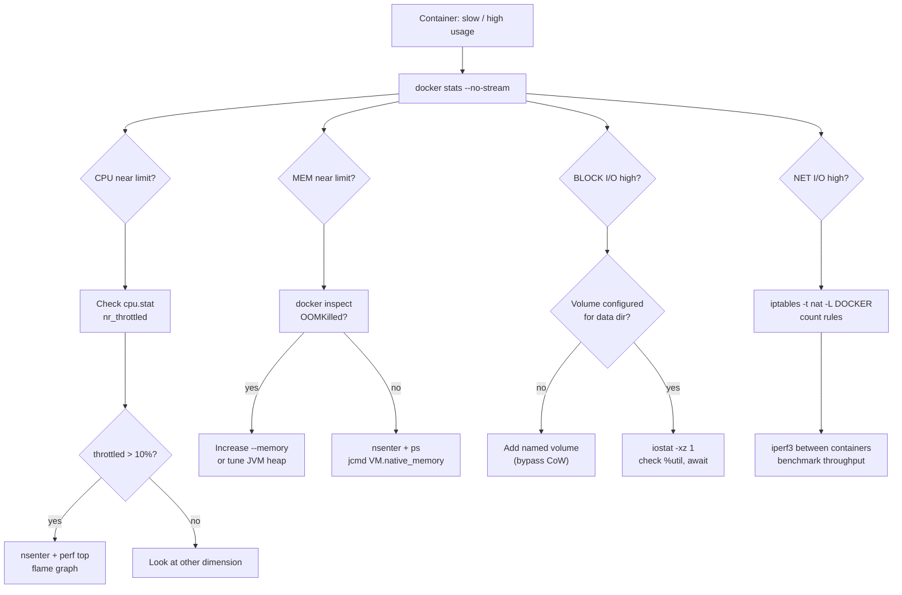

## Keywords in This File
{: .no_toc }

| # | Keyword | Weight |
|---|---|---|
| 1 | [Docker - L4 Performance Diagnostics](#docker---l4-performance-diagnostics) | medium |

---

# Docker - L4 Performance Diagnostics

## Docker Performance Diagnostics

---

### 🎯 Model Answer

**30 seconds:**
> Docker performance diagnostics: identify whether bottleneck is
> CPU (throttled), memory (swapping or OOM), I/O (storage driver
> CoW overhead or slow volume), or network (bridge overhead, iptables).
> Primary tools: `docker stats`, `docker events`, `cgroup stats`
> (`/sys/fs/cgroup`), `nsenter` for process-level tools, `perf` and
> `strace` for deep investigation. The diagnostic is always: observe,
> measure, isolate, confirm root cause, fix.

**3 minutes (Senior):**
> Complete diagnostic workflow: (1) **CPU**: `docker stats --no-stream`
> shows CPU percentage. If consistently near limit: throttled.
> Confirm: `/sys/fs/cgroup/cpu/cpu.stat` shows `nr_throttled` and
> `throttled_time`. If throttled_time is increasing: CPU limit too
> low or application is CPU-intensive. (2) **Memory**: `docker stats`
> shows `MEM USAGE / LIMIT`. If close to limit: about to OOM.
> `docker inspect | grep OOMKilled` confirms past OOM events. For
> JVM: `/proc/<pid>/status | grep VmRSS` shows actual RSS. Compare
> to cgroup limit. (3) **I/O**: `docker stats` shows `BLOCK I/O`.
> High reads with OverlayFS: likely CoW overhead. `iostat -xz 1`
> on host shows per-device I/O wait (`%util`). `iotop -a` inside
> container (via nsenter) shows which process is doing I/O. (4)
> **Network**: `docker stats` shows `NET I/O`. Network latency: `ping`
> from container to another container vs host shows bridge overhead.
> `iperf3` measures throughput. For iptables overhead: `iptables -t
> nat -L DOCKER -n -v` shows rule hit counts. Many rules: can
> slow down new connection establishment. (5) **Container startup
> time**: `docker events --filter container=myapp --since 1h | grep
> -E "create|start|die"`. Slow start: profile with `strace -T` on
> the init process.

**Blank Mind Recovery:**

**(1) Restate:** "Four dimensions: CPU (throttled = check cpu.stat),
memory (OOM = check OOMKilled + VmRSS), I/O (CoW = volumes vs writable
layer, iostat), network (bridge latency, iptables, iperf3). Tool
chain: docker stats -> cgroup files -> nsenter for process tools."

**(2) First principles:** "Performance = resources consumed vs
resources available. Each container has cgroup limits. Measure actual
vs limit. If actual approaches limit: that's the bottleneck. Cgroup
files expose raw kernel metrics: more precise than docker stats (which
polls periodically)."

**(3) Bridge:** "Container performance diagnostics is like car
diagnostics. `docker stats` is the dashboard gauges. cgroup files
are the OBD-II port (raw sensor data). `nsenter` + `perf` is the
engine dynamometer (isolates exact performance under load). You start
with the dashboard, drill to the raw sensor when the dashboard
shows a problem."

---

### 📘 Concept Explanation

**docker stats, cgroup files, nsenter, perf, CPU throttle, I/O bottleneck:**


```
DOCKER STATS INTERPRETATION:

  docker stats --no-stream
  # CONTAINER ID   NAME     CPU %   MEM USAGE / LIMIT    NET I/O        BLOCK I/O
  # abc123         myapp    85.3%   220MiB / 256MiB      1.2GB / 450MB  10GB / 3GB
  
  # CPU 85.3%: near the limit. Investigate CPU usage.
  # MEM 220/256MiB (86%): close to limit. Risk of OOM.
  # BLOCK I/O 10GB/3GB: significant I/O. Investigate if CoW or volume.
  
  # Continuous monitoring:
  docker stats myapp  # refreshes every second
  
  # Custom format:
  docker stats --format \
    "{{.Name}}: CPU={{.CPUPerc}} MEM={{.MemUsage}} NET={{.NetIO}}"

CPU THROTTLE DIAGNOSIS:

  # Step 1: is the container being throttled?
  CPID=$(docker inspect myapp --format '{{.State.Pid}}')
  cat /sys/fs/cgroup/cpu/docker/$(docker inspect myapp \
    --format '{{.Id}}')/cpu.stat
  # Output:
  # nr_periods      1000   <- number of CFS periods observed
  # nr_throttled    456    <- periods where container was throttled
  # throttled_time  23000000000  <- total ns throttled (23 seconds total)
  
  # 456/1000 = 45.6% of time the container was throttled. SERIOUS.
  # This means: app was paused 45% of the time. Requests waiting.
  
  # Step 2: what's using the CPU?
  # Enter the container's PID namespace to run top:
  nsenter --target $CPID --pid --mount -- top -b -n1 | head -20
  # Shows: per-process CPU. Find the culprit.
  
  # Step 3: is it a specific function?
  # Install perf on the host (not in container):
  perf top -p $CPID
  # Shows: hot functions consuming CPU. No changes to container needed.
  
  # Or: use async-profiler for Java:
  docker exec myapp sh -c "
    java -jar async-profiler.jar -d 30 -f /tmp/flame.html 1
  "
  docker cp myapp:/tmp/flame.html ./flame.html
  # Open flame.html: shows hot code paths.

MEMORY DIAGNOSIS:

  # Step 1: current memory usage vs limit:
  CGROUP_ID=$(docker inspect myapp --format '{{.Id}}')
  cat /sys/fs/cgroup/memory/docker/$CGROUP_ID/memory.usage_in_bytes
  # 231735296  <- 221MB
  cat /sys/fs/cgroup/memory/docker/$CGROUP_ID/memory.limit_in_bytes
  # 268435456  <- 256MB
  # 221/256 = 86%. Close to limit.
  
  # OOM counter:
  cat /sys/fs/cgroup/memory/docker/$CGROUP_ID/memory.oom_control
  # oom_kill_disable 0
  # under_oom 0
  # oom_kill 3  <- 3 OOM kills in this cgroup (processes killed)
  
  # Step 2: per-process memory inside the container:
  nsenter --target $CPID --pid -- ps aux --sort=-%mem | head -10
  # Shows: top memory consumers inside the container.
  
  # For JVM: heap vs native memory breakdown:
  docker exec myapp jcmd 1 VM.native_memory summary
  # Shows: heap, code cache, metaspace, thread stacks, GC.
  # Identifies if it's heap (too small MaxHeapSize) or native.
  
  # Step 3: memory leak check:
  # Watch memory usage over time:
  for i in $(seq 1 60); do
    cat /sys/fs/cgroup/memory/docker/$CGROUP_ID/memory.usage_in_bytes
    sleep 10
  done
  # Steadily increasing? Memory leak. Stable? Normal usage pattern.

I/O DIAGNOSIS:

  # Step 1: check if I/O is high:
  docker stats myapp --no-stream | awk '{print $7, $8, $9}'
  # BLOCK I/O: 10GB / 3GB  <- significant
  
  # Step 2: is it a volume or the writable layer?
  docker inspect myapp --format '{{json .Mounts}}' | jq
  # If database is not in a volume: CoW on every write. Slow.
  
  # Step 3: host I/O wait:
  iostat -xz 1 5
  # %util: percentage of time device was busy.
  # await: average I/O latency (ms). > 20ms: slow disk or high contention.
  # If sda shows 90%+ util: disk is saturated.
  
  # Step 4: which process is doing I/O inside container:
  nsenter --target $CPID --pid --mount -- iotop -a -b -n1
  # Shows: per-process accumulated I/O inside the container.
  
  # Step 5: OverlayFS check:
  docker diff myapp | wc -l
  # Large number: many files written to writable layer. CoW overhead.
  # Fix: move high-write paths to volumes.

NETWORK DIAGNOSIS:

  # Step 1: measure container-to-container latency:
  docker exec containerA ping -c100 containerB | tail -1
  # rtt min/avg/max/mdev = 0.073/0.124/0.891/0.081 ms
  # Bridge latency: < 0.5ms typical. > 2ms: investigate.
  
  # Step 2: throughput test:
  docker exec containerA iperf3 -c containerB -t 10
  # Bandwidth: 9.87 Gbits/sec (typical for bridge, ~10Gbps)
  # If much lower: network contention or iptables overhead.
  
  # Step 3: iptables rule count (slow new connections):
  iptables -t nat -L DOCKER -n | wc -l
  # Many published ports: many rules. Large rule sets slow down
  # new connection establishment (each new connection walks the chain).
  # > 1000 rules: consider ipvs or Cilium for load balancing.
  
  # Step 4: check for packet drops:
  nsenter --target $CPID --net -- ip -s link show eth0
  # RX errors, TX drops: indicates network issues.

CONTAINER STARTUP TIME DIAGNOSIS:

  # Measure startup time:
  docker events --filter container=myapp --since 1h | grep -E "create|start"
  # 2024-01-15T10:00:00 container create myapp
  # 2024-01-15T10:00:08 container start myapp  <- 8 seconds to start
  
  # What's slow? Is it image pull, container create, or app startup?
  time docker pull myapp:latest  # image pull time
  time docker create myapp:latest  # container create time
  time docker start myapp_id   # startup time (app init)
  
  # For app startup analysis:
  strace -T -tt -p $CPID 2>/dev/null | head -50
  # Shows each syscall with duration. Find slow syscalls.
  
  # Java startup slow? Instrument with:
  java -verbose:class -XX:+PrintGCDetails \
    -Xlog:class+load=info:file=/tmp/classload.log \
    -jar app.jar &
  # class loading log: which classes take longest to load.

PROFILING WITH PERF:

  # CPU flame graph (requires perf + flamegraph.pl):
  CPID=$(docker inspect myapp --format '{{.State.Pid}}')
  
  # Record 30 seconds of CPU samples:
  perf record -F 99 -p $CPID -g -- sleep 30
  perf script > /tmp/out.perf
  
  # Generate flame graph (from brendangregg/FlameGraph):
  stackcollapse-perf.pl /tmp/out.perf > /tmp/out.folded
  flamegraph.pl /tmp/out.folded > /tmp/flame.svg
  
  # Open flame.svg: width = time spent. Identify hot code paths.
  # No changes to the container needed. perf runs on the host.
```


> **Code walkthrough:** This No changes to the container needed. perf runs on the host. example demonstrates a key concept in practice using Kafka messaging. **KEY MECHANISM:** the runtime executes these instructions in sequence with specific memory and execution semantics. **WHY IT MATTERS:** misapplying this pattern causes subtle bugs that only manifest under production load. **TAKEAWAY: understand the execution model before using this pattern in production code.**

---

### 💻 Code Example

> **Code walkthrough:** A systematic shell script that runs theice. **KEY MECHANISM:** the runtime executes these instructions in sequence with specific memory and execution semantics. **WHY IT MATTERS:** misapplying this pattern causes subtle bugs that only manifest under production load. **TAKEAWAY: understand the execution model before using this pattern in production code.**
> complete Docker performance diagnostic in sequence.


```bash
#!/usr/bin/env bash
# Usage: ./perf-diag.sh <container_name_or_id>
CONTAINER="${1:?Usage: $0 <container>}"
CPID=$(docker inspect "$CONTAINER" --format '{{.State.Pid}}' 2>/dev/null)
CID=$(docker inspect "$CONTAINER" --format '{{.Id}}' 2>/dev/null)

[ -z "$CPID" ] && { echo "Container not found"; exit 1; }

echo "=== CONTAINER: $CONTAINER ==="
echo "=== PID: $CPID | ID: ${CID:0:12} ==="
echo ""

echo "--- RESOURCE USAGE (instantaneous) ---"
docker stats --no-stream --format \
  "CPU: {{.CPUPerc}} | MEM: {{.MemUsage}} ({{.MemPerc}}) | NET: {{.NetIO}} | BLK: {{.BlockIO}}" \
  "$CONTAINER"
echo ""

echo "--- CPU THROTTLE STATUS ---"
CSTAT="/sys/fs/cgroup/cpu/docker/$CID/cpu.stat"
if [ -f "$CSTAT" ]; then
  cat "$CSTAT"
else
  # cgroups v2 path:
  cat "/sys/fs/cgroup/docker/$CID/cpu.stat" 2>/dev/null || \
    echo "(cgroup path not found: try as root)"
fi
echo ""

echo "--- MEMORY (cgroup) ---"
MSTAT="/sys/fs/cgroup/memory/docker/$CID/memory.usage_in_bytes"
MLIMIT="/sys/fs/cgroup/memory/docker/$CID/memory.limit_in_bytes"
if [ -f "$MSTAT" ]; then
  USED=$(cat "$MSTAT")
  LIMIT=$(cat "$MLIMIT")
  echo "Used: $(( USED / 1024 / 1024 ))MB / Limit: $(( LIMIT / 1024 / 1024 ))MB"
  cat "/sys/fs/cgroup/memory/docker/$CID/memory.oom_control" | grep oom_kill
fi
echo ""

echo "--- PAST OOM KILLS ---"
docker inspect "$CONTAINER" --format "OOMKilled: {{.State.OOMKilled}}"
echo ""

echo "--- FILESYSTEM CHANGES (top 10) ---"
docker diff "$CONTAINER" | head -10
echo ""

echo "--- PROCESSES (top 5 by CPU) ---"
nsenter --target "$CPID" --pid --mount -- \
  ps aux --sort=-%cpu 2>/dev/null | head -6 || \
  echo "(needs root/sudo for nsenter)"
echo ""

echo "=== Diagnosis complete ==="
```


> **Code walkthrough:** The script combines four diagnostic dimensionsice. **KEY MECHANISM:** the runtime executes these instructions in sequence with specific memory and execution semantics. **WHY IT MATTERS:** misapplying this pattern causes subtle bugs that only manifest under production load. **TAKEAWAY: understand the execution model before using this pattern in production code.**
> in one pass. `docker stats --no-stream` gives the snapshot view
> without continuous output. The cgroup CPU stat file provides throttle
> metrics unavailable in `docker stats`. Memory cgroup files show byte-
> precision usage vs the MB-rounded docker stats. `nsenter --pid --mount`
> enters the container's PID and mount namespaces from the host to
> run `ps` with container-local context. The cgroup paths differ
> between cgroups v1 (`/sys/fs/cgroup/cpu/docker/`) and v2
> (`/sys/fs/cgroup/docker/`); the script handles both.

---

### 🎓 Answers by Seniority

**Junior / Mid (0-5 years):**
> `docker stats` is the starting point: shows CPU, memory, I/O,
> and network for running containers. If memory is near the limit:
> check for OOM events with `docker inspect | grep OOMKilled`.
> If the application is slow: check CPU throttle with `docker stats`
> and increase the `--cpus` limit if near 100%.

---

**Senior / Staff (5+ years):**
> `docker stats` is a sampled view with a 1-second polling interval.
> It misses sub-second CPU bursts and uses approximated memory figures.
> For production performance issues: go directly to cgroup files for
> precise measurements. `/sys/fs/cgroup/cpu/docker/<id>/cpu.stat`
> gives exact throttle metrics. `/sys/fs/cgroup/memory/docker/<id>/
> memory.stat` gives breakdown (rss, cache, swap). `nsenter` + `perf`
> gives function-level CPU profiling without modifying the container.
> This is the difference between diagnosing "the container is slow"
> and "the `com.myapp.service.OrderService.processOrder()` method
> is holding a lock for 200ms under load."

---

### ⚠️ Common Misconceptions

**Misconception: "docker stats CPU percentage is out of 100% total."**
`docker stats` CPU percentage is out of the TOTAL CPU available on
the host multiplied by the number of cores. A 4-core host: the
maximum is 400%. A container using 2 full cores: shows `200.00%`.
This confuses developers who expect `100%` to mean "fully saturated."
The container's own CPU limit: displayed as the denominator in
`--cpus` terms. A container with `--cpus=0.5` on a 4-core host:
can show up to `50.00%` (not `12.5%`). The CPU% in `docker stats`:
is `(container CPU time / wall time) * num_cores * 100`. For capacity
planning: compare this against `--cpus` limit (multiplied by 100).
Container CPU%=45% and limit=0.5 CPU (50%): near the limit, throttling
may occur. 45% of 400% (4 cores): only 11.25% host utilization.
Context matters.

---

### ⚖️ Comparison Table

| Tool | Granularity | Bottleneck | Overhead | Root Access Required |
|---|---|---|---|---|
| docker stats | 1s polling | All (rough) | Low | No |
| cgroup files | Real-time | CPU, memory | Zero | Yes (host) |
| nsenter + top/ps | Real-time | CPU, memory (per-process) | Low | Yes |
| nsenter + iotop | Real-time | I/O per process | Low | Yes |
| perf | Sampled (99Hz) | CPU (function level) | Low | Yes |
| strace -T | Every syscall | Latency per syscall | HIGH | Yes |
| async-profiler | Sampled | Java-specific (heap, CPU) | Low | No |

---

### 🏛️ System Design

*(Omit: performance diagnostics is an operational investigation skill, not a system architecture pattern.)*

---

### 📊 Diagram

```
DOCKER PERFORMANCE DIAGNOSIS FLOWCHART:

  START: Container slow / high resource usage
         |
         v
  [docker stats --no-stream]
         |
    +----+--------+--------+---------+
    |             |        |         |
    v             v        v         v
  CPU high?   MEM high?  BLOCK    NET high?
    |             |      high?       |
    v             v        v         v
  check        check    volumes? check iptables
  cpu.stat    OOMKilled  CoW?    check latency
  throttled?  oom_kill   iostat   iperf3
    |             |        |         |
    v             v        v         v
  nsenter+top nsenter+ps  iotop  nsenter+ss
  perf top    jcmd        docker diff
  flame graph VM.native   add volume
```



> **Diagram walkthrough:** The diagnostic starts with `docker stats`
> to identify which dimension is the bottleneck. For CPU: the throttle
> rate in the cgroup `cpu.stat` file is the definitive metric. For
> memory: OOM kills confirm the hard limit is being hit. For block
> I/O: the first question is whether data is on a volume (bypass CoW)
> or the container writable layer. For network: iptables rule count
> and iperf3 throughput test narrow the issue. Each branch leads
> to a specific command sequence to pinpoint root cause.

---

### 🚨 Failure Modes and Diagnosis

**Failure: Container appears healthy but requests have high P99 latency.**


```plaintext
Symptom: docker stats shows CPU at 40%, memory at 50%. No OOM kills.
  But: application P99 latency is 2 seconds (SLA: 500ms).
  Metrics look fine. Application feels slow.

Common causes:
  1. CPU throttling: container is being throttled for short bursts
     that docker stats misses (1-second polling).
  2. GC pauses: Java GC runs for 1-2 seconds during full GC.
  3. Database connection pool exhaustion: requests waiting for DB conn.
  4. Lock contention: application threads waiting for a lock.
  5. Container hitting swap: memory.swappiness > 0.

Diagnosis:
  # 1. Check CPU throttle (not visible in docker stats):
  CID=$(docker inspect myapp --format '{{.Id}}')
  watch -n1 "cat /sys/fs/cgroup/cpu/docker/$CID/cpu.stat"
  # Watch if nr_throttled increases. Even at 40% average CPU,
  # momentary bursts can trigger CFS throttle.
  
  # 2. For Java: check GC pause time:
  docker exec myapp jstat -gcutil 1 1000 | tail -10
  # FGC column: full GC count. FGCT: total full GC time.
  # Or: check GC log:
  docker exec myapp ls /tmp/*.log | head -3
  # "Full GC ... (2.345s)" in GC log -> GC pauses causing latency.
  
  # 3. Check connection pool:
  docker exec myapp curl -s http://localhost:8080/actuator/metrics/hikaricp.connections.pending
  # High value: threads waiting for DB connection. Pool too small.
  
  # 4. Thread dump (Java): find locked threads:
  docker exec myapp jstack 1 | grep -A5 "BLOCKED"
  # BLOCKED threads waiting for a lock -> contention.
  
  # 5. Check swap usage:
  PPID=$(cat /proc/1/status | grep PPid | awk '{print $2}')
  docker exec myapp cat /proc/$PPID/status | grep VmSwap
  # Or: cat /sys/fs/cgroup/memory/docker/$CID/memory.stat | grep swap

Fixes:
  # CPU throttle: increase --cpus limit or optimize hot code path.
  # GC pauses: tune JVM GC (-XX:+UseG1GC or ZGC for lower latency).
  # Connection pool: increase max pool size or optimize query duration.
  # Lock contention: profile with async-profiler to find the lock.
  # Swap: set --memory-swappiness=0 to disable swap for this container.
```


> **Code walkthrough:** This Swap: set --memory-swappiness=0 to disable swap for this container. example demonstrates a key concept in practice using container. **KEY MECHANISM:** the runtime executes these instructions in sequence with specific memory and execution semantics. **WHY IT MATTERS:** misapplying this pattern causes subtle bugs that only manifest under production load. **TAKEAWAY: understand the execution model before using this pattern in production code.**

---

### 🎯 Interview Deep-Dive

| Question Category | Time to Answer |
|---|---|
| docker stats interpretation | 2 minutes |
| CPU throttle vs CPU usage | 3 minutes |
| cgroup files vs docker stats | 2 minutes |
| Memory OOM diagnosis | 2 minutes |
| I/O: CoW vs volume | 2 minutes |
| nsenter use cases | 2 minutes |
| High P99 latency diagnosis | 3 minutes |
| JVM container memory tuning | 2 minutes |
| perf flame graph workflow | 2 minutes |
| Network performance testing | 1 minute |
| Cgroups v1 vs v2 paths | 1 minute |
| strace overhead warning | 1 minute |

---

**Q1 (production): A containerized Java service has good CPU and memory metrics but occasional 2-second response spikes. Describe your diagnostic approach.**

A: Three-phase investigation. Phase 1: confirm the spike pattern.
Enable distributed tracing and look for P99 request latency spikes
in Grafana. Find a time window when spikes occurred. Correlate with:
GC logs, thread dumps, and system metrics at that timestamp. Phase 2:
diagnose GC. Enable JVM GC logging: `-Xlog:gc*:file=/tmp/gc.log:time,
uptime:filecount=3,filesize=10m`. During the next spike: `docker cp
myapp:/tmp/gc.log ./`. Look for `Full GC` pauses > 500ms. If found:
the GC is the cause. Tune: `-XX:+UseZGC` (Z Garbage Collector:
sub-millisecond pauses, available JDK 15+). If no GC pauses during
the spike: Phase 3: thread dump at spike time. `docker exec myapp
jstack 1 > /tmp/dump1.txt; sleep 1; jstack 1 > /tmp/dump2.txt`.
Compare: are the same threads blocked in both dumps? BLOCKED threads
(waiting for a lock): lock contention. The lock and the class holding
it: visible in the thread dump.

*What separates good from great:* Correlating JVM metrics with
container cgroup metrics. The CPU throttle + GC interaction: during
GC, the JVM uses maximum CPU. If the container has a CPU limit:
the GC is throttled mid-cycle. GC pause = GC time + throttle wait
time. A GC that takes 200ms normally can take 2 seconds if the
container is throttled during the GC. Diagnosis: check `nr_throttled`
in `cpu.stat` at the same timestamps as GC pauses in the GC log.
If they correlate: increase the CPU limit. For latency-sensitive
services: set CPU request=limit (Guaranteed QoS in K8s) to prevent
throttling entirely. The JVM GC is the worst workload for CFS
throttling: it's a short intense CPU burst that needs to complete
without pause.

---

**Q2 (debugging): Explain how to profile a containerized Node.js application for a CPU hotspot without stopping the container.**

A: Four approaches depending on tool access. (1) `perf` from the
host: `perf record -F 99 -p <node-pid> -g -- sleep 30`. Generates
flamegraphs showing JavaScript function names (requires
`--perf-basic-prof` JIT symbol map). Minimal overhead, no container
changes. (2) Node.js CPU profiler via `--inspect` flag: if the Node
process was started with `--inspect=0.0.0.0:9229`, open Chrome
DevTools > Remote Debugging. Start a CPU profile, reproduce the
hotspot, stop. DevTools shows a flamegraph of JavaScript + V8 builtins.
(3) Clinic.js (Node.js specific): `docker exec myapp clinic flame
-- node server.js`. CPU flamegraph with Node.js-aware annotations
(I/O, event loop, native calls). (4) `0x` profiler: `docker exec
myapp npx 0x -o /tmp -P ./node_modules/.bin/myapp`. Generates a
flamegraph and copies it out with `docker cp myapp:/tmp/0x-... ./`.

*What separates good from great:* The event loop delay metric is
more useful than CPU flamegraph for Node.js. Node.js: single-threaded
event loop. A CPU hotspot blocks the event loop for all requests.
Measure: `const start = process.hrtime(); setImmediate(() => {
const [s, ns] = process.hrtime(start); console.log(ns/1e6 + 'ms');
})`. Event loop delay > 1ms: something is blocking. Expose as a
metric (`process.hrtime` + Prometheus gauge). Alert if P99 event
loop delay > 5ms. Correlate with request latency spikes. The event
loop delay is the leading indicator: it rises before request latency
rises, giving earlier warning.

---

**Q3 (debugging): How do you diagnose why a container takes 45 seconds to start?**

A: Measure each phase. (1) Image pull time: `time docker pull
myapp:1.2.3`. If slow: check image size (`docker image inspect
myapp:1.2.3 | grep Size`). Large image (> 1GB): optimize (multi-stage,
smaller base). Check registry bandwidth and pull-through cache.
(2) Container create time: `time docker create myapp:1.2.3 bash`.
Typically milliseconds. Slow: investigate overlay2 creation overhead
(many layers: OverlayFS merge is O(layers)). Reduce layers by merging
RUN instructions. (3) Application startup time: time from container
start to healthcheck passing. `docker events --filter container=myapp
| grep -E "start|health_status"`. Application startup: (3a) For
Java: class loading. `java -verbose:class -jar app.jar 2>&1 | wc -l`
counts classes loaded. Slow class loading: enable classdata sharing
(`-XX:+UseAppCDS`). (3b) Component initialization: enable startup
profiling (`spring.jmx.enabled=false`, component scan optimization).
(3c) Network waits: application waiting for external service on
startup. Should use retry + startup probe instead of blocking startup.

*What separates good from great:* For Kubernetes: slow startup affects
deployment speed (rolling update waits for each pod to be ready),
but more critically affects auto-scaling. HPA triggers a scale-out.
45 seconds of startup: 45 seconds before new pods serve traffic.
For a sudden traffic spike: 45 seconds of insufficient capacity.
The fix: optimize startup time AND add a startup probe (Kubernetes
`startupProbe`) with a generous failure threshold. The startup probe
disables liveness/readiness during initialization, allowing the full
startup duration without false negatives. Then: continuously reduce
startup time. Target: < 10 seconds for most services. For large
Java apps: container image pre-warming (run the app in a container,
save the JIT-compiled code with `jlink` or GraalVM native image).
Native image startup: ~100ms, not 45 seconds.

---

**Q4 (production): How do you implement continuous performance monitoring for 50 containerized microservices?**

A: Three-tier observability stack. (1) **Metrics**: cAdvisor (container
advisor) running as DaemonSet. It reads cgroup stats for every
container and exposes them as Prometheus metrics: `container_cpu_
throttled_seconds_total`, `container_memory_usage_bytes`, `container
_memory_oom_count`. Prometheus scrapes every 15s. Grafana: dashboards
showing throttle rate, memory headroom, and OOM events per service.
Alert: throttle rate > 10% for 5 minutes = PagerDuty. (2) **Profiling**:
Pyroscope (continuous profiling). Agents deployed as sidecar or DaemonSet.
Profiles CPU (flamegraph) of all running processes continuously.
Results stored in Pyroscope server. In Grafana: correlate a CPU
spike at 2:34 PM with the flamegraph at 2:34 PM. No manual profiling
needed. (3) **Distributed tracing**: Jaeger/Tempo. Instrumented
services export traces. Slowdowns: visible as long spans. Span attributes:
container ID, pod name, node. Correlate a slow trace with container
metrics and CPU flamegraph from the same time.

*What separates good from great:* The correlation layer across all
three. A P99 latency spike in service B: the distributed trace shows
which span is slow. The span metadata: container ID. The cgroup
metrics at that time: throttle rate was 40%. The Pyroscope flamegraph
at that time: `processOrder()` spending 60% of time in `JSON.parse`.
Root cause: CPU throttling during a JSON-heavy operation. Fix: optimize
JSON parsing (use NDJSON streaming instead of full parse) AND increase
CPU limit. Without the correlation: you see "service B is slow" and
spend hours debugging. With correlation: you have root cause in 5
minutes. This is the value of unified observability infrastructure
vs siloed monitoring tools.

---

### 💻 Code Example

*(Omit: this concept does not have a programmatic interface that can be demonstrated in code. The conceptual explanation above is sufficient.)*


---

### 🏛️ System Design

*(Omit: system design diagram not applicable for this concept - see ★★★ keywords for full system design coverage.)*


---

### ⚖️ Comparison Table

*(Omit: this is a ★☆☆ foundational concept with no direct alternatives to compare - see higher-difficulty keywords for trade-off analysis.)*


---

### 📊 Diagram

*(Omit: no standalone visual diagram required for this concept - the explanations and code examples above provide sufficient clarity.)*


