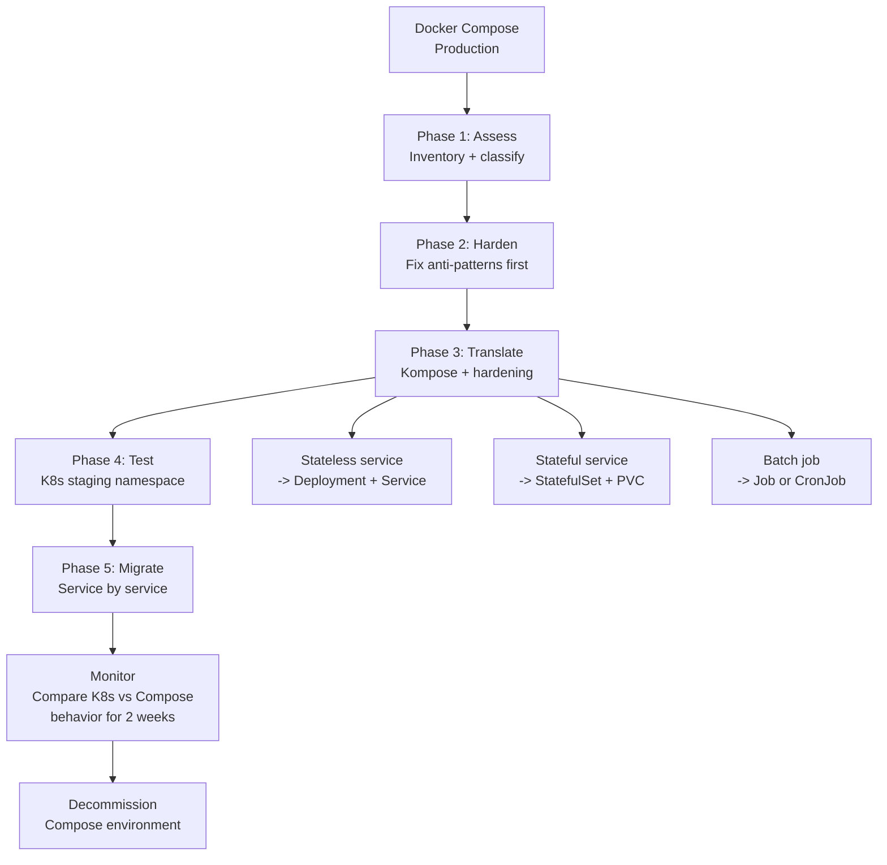

## Keywords in This File
{: .no_toc }

| # | Keyword | Weight |
|---|---|---|
| 1 | [Docker - L5 Kubernetes Migration](#docker---l5-kubernetes-migration) | medium |

---

# Docker - L5 Kubernetes Migration

## Docker to Kubernetes Migration Strategy

---

### 🎯 Model Answer

**30 seconds:**
> Migrating from Docker Compose to Kubernetes: not a one-to-one
> translation. Core concept mapping: Compose `service` -> K8s Deployment
> + Service. Compose named `volume` -> PersistentVolumeClaim. Compose
> `.env` file -> ConfigMap + Secret. Compose `networks` -> K8s
> namespace + NetworkPolicy. Compose `healthcheck` -> readiness +
> liveness probes. Compose `deploy.resources` -> K8s requests/limits.
> Restart policies -> K8s restartPolicy + liveness probes. The biggest
> migration pitfalls: assuming 1:1 DNS naming (Compose: service name.
> K8s: service.namespace.svc.cluster.local), and not redesigning state
> management (volumes become PVCs, but stateful app architecture may
> need StatefulSets).

**3 minutes (Senior):**
> Migration strategy is not a tooling problem (Kompose generates K8s
> manifests from docker-compose.yml), it is an architecture problem.
> (1) **Service discovery changes**: Compose containers in the same network
> resolve by service name directly (`http://api/endpoint`). K8s: a Service
> object is required. Within the same namespace: `http://api/endpoint`
> still works (DNS shortname). Across namespaces: `http://api.payments.svc.cluster.local`.
> Applications hard-coding service names with dots: need URL configuration
> updates. (2) **Stateful workloads**: Compose + named volume is simple.
> K8s: a StatefulSet + PersistentVolumeClaim is required for stable network
> identity + per-replica storage. Stateless replicas (multiple app instances
> sharing one database): use Deployment. Stateful replicas (Kafka brokers,
> Postgres replicas): use StatefulSet. (3) **Secrets migration**: Compose
> uses `.env` files (plaintext, often committed to git). K8s Secrets:
> base64-encoded (not encrypted by default). The migration is an
> opportunity to introduce proper secrets management: external secrets
> operators (AWS Secrets Manager, Vault), not K8s Secrets alone. (4)
> **Health checks**: Compose `HEALTHCHECK` has one probe. K8s: three
> probe types (readiness: traffic routing, liveness: restart trigger,
> startup: covers slow initialization). The migration redesigns health
> semantics. (5) **Networking**: Compose networks isolate services.
> K8s: all pods in a cluster can reach all other pods by default (flat
> network). NetworkPolicy required to implement isolation.

**Blank Mind Recovery:**

**(1) Restate:** "Compose service -> K8s Deployment + Service. Named
volume -> PVC. .env -> ConfigMap/Secret. health check -> readiness
+ liveness. Restart policy -> liveness probe. Resource limits ->
K8s requests/limits. Networks -> NetworkPolicy."

**(2) First principles:** "Compose: one machine, one network, one
operator. Kubernetes: many machines, distributed network, declarative
API. Every Compose assumption about single-machine locality breaks in
K8s. Service discovery, storage, secrets, and networking: all need
explicit distributed-systems design."

**(3) Bridge:** "Migrating from Compose to K8s is like moving from
a single server to a data center. On a single server: you can find
anything by its local hostname, files are on the local disk, config
is in a file, one restart policy fits all. In a data center: everything
needs a network address, storage is a remote service, config is
managed centrally, and restart policies are per-workload-class."

---

### 📘 Concept Explanation

**Concept mapping, migration patterns, and architectural decisions:**
```
COMPLETE MAPPING: COMPOSE -> KUBERNETES

  1. SERVICE -> DEPLOYMENT + SERVICE:
  
  # docker-compose.yml:
  services:
    api:
      image: myapp:1.0.0
      ports:
        - "8080:8080"
      deploy:
        replicas: 3
        resources:
          limits:
            memory: 512m
            cpus: '0.5'
  
  # Becomes TWO K8s objects:
  
  # 1a. Deployment (compute):
  apiVersion: apps/v1
  kind: Deployment
  metadata:
    name: api
  spec:
    replicas: 3
    selector:
      matchLabels:
        app: api
    template:
      metadata:
        labels:
          app: api
      spec:
        containers:
          - name: api
            image: myapp:1.0.0
            ports:
              - containerPort: 8080
            resources:
              requests:
                memory: "256Mi"
                cpu: "250m"
              limits:
                memory: "512Mi"
                cpu: "500m"
  
  # 1b. Service (network):
  apiVersion: v1
  kind: Service
  metadata:
    name: api
  spec:
    selector:
      app: api
    ports:
      - port: 8080
        targetPort: 8080
  # Note: ClusterIP (internal). For external: LoadBalancer or Ingress.

  2. NAMED VOLUME -> PERSISTENTVOLUMECLAIM:
  
  # docker-compose.yml:
  services:
    db:
      image: postgres:15
      volumes:
        - postgres_data:/var/lib/postgresql/data
  volumes:
    postgres_data:
  
  # Becomes StatefulSet + PVC (not Deployment, for stable identity):
  apiVersion: apps/v1
  kind: StatefulSet
  metadata:
    name: db
  spec:
    serviceName: db
    replicas: 1
    selector:
      matchLabels:
        app: db
    template:
      metadata:
        labels:
          app: db
      spec:
        containers:
          - name: db
            image: postgres:15
            volumeMounts:
              - name: postgres-data
                mountPath: /var/lib/postgresql/data
    volumeClaimTemplates:
      - metadata:
          name: postgres-data
        spec:
          accessModes: ["ReadWriteOnce"]
          resources:
            requests:
              storage: 20Gi

  3. COMPOSE NETWORKS -> KUBERNETES NETWORKPOLICY:
  
  # docker-compose.yml:
  services:
    frontend:
      networks: [public, internal]
    api:
      networks: [internal, db-net]
    db:
      networks: [db-net]
  
  # K8s default: ALL pods can reach ALL pods. Isolation requires NetworkPolicy.
  
  # "db-net" equivalent: only api can reach db on 5432:
  apiVersion: networking.k8s.io/v1
  kind: NetworkPolicy
  metadata:
    name: db-isolation
  spec:
    podSelector:
      matchLabels:
        app: db
    policyTypes: [Ingress]
    ingress:
      - from:
          - podSelector:
              matchLabels:
                app: api
        ports:
          - protocol: TCP
            port: 5432
  # Important: a "default deny" NetworkPolicy is also needed,
  # or other pods can still reach db on other ports.

  4. HEALTHCHECK -> READINESS + LIVENESS PROBES:
  
  # Dockerfile:
  HEALTHCHECK --interval=30s --timeout=3s --retries=3 \
    CMD curl -f http://localhost:8080/health || exit 1
  # One probe, two purposes: traffic routing + restart trigger.
  
  # K8s: separate probes for separate purposes:
  readinessProbe:         # removes from Service endpoints until ready
    httpGet:
      path: /health/ready
      port: 8080
    initialDelaySeconds: 10
    periodSeconds: 5
    failureThreshold: 3
  livenessProbe:          # restarts the container if unhealthy
    httpGet:
      path: /health/live
      port: 8080
    initialDelaySeconds: 30
    periodSeconds: 10
    failureThreshold: 3
  startupProbe:           # prevents liveness from killing slow startup
    httpGet:
      path: /health/live
      port: 8080
    failureThreshold: 30  # 30 * 10s = 5 minutes max startup time
    periodSeconds: 10

  5. RESTART POLICIES -> K8S RESTART + LIVENESS:
  
  # docker-compose.yml:
  services:
    api:
      restart: always    # restart on any failure
  
  # K8s equivalent:
  # restartPolicy: Always (default for Deployment pods)
  # + livenessProbe: restart when health check fails
  # + K8s will restart failed pods with exponential backoff
  # (CrashLoopBackOff: 10s, 20s, 40s, ... up to 5 minutes)
  
  # For one-time batch jobs (restart: "no"):
  apiVersion: batch/v1
  kind: Job
  spec:
    backoffLimit: 3    # retry 3 times before marking Failed
    template:
      spec:
        restartPolicy: OnFailure  # or Never
  
  # For scheduled jobs (restart: cron schedule):
  apiVersion: batch/v1
  kind: CronJob
  spec:
    schedule: "0 * * * *"    # every hour
    jobTemplate:
      spec:
        template:
          spec:
            restartPolicy: OnFailure

  6. ENV FILES -> CONFIGMAP + SECRET:
  
  # .env file (docker-compose):
  DB_HOST=postgres
  DB_PORT=5432
  DB_NAME=myapp
  DB_USER=appuser
  DB_PASSWORD=supersecret   # sensitive!
  LOG_LEVEL=info
  
  # K8s: split sensitive vs non-sensitive:
  
  # Non-sensitive -> ConfigMap:
  apiVersion: v1
  kind: ConfigMap
  metadata:
    name: myapp-config
  data:
    DB_HOST: "postgres.default.svc.cluster.local"
    DB_PORT: "5432"
    DB_NAME: "myapp"
    LOG_LEVEL: "info"
  
  # Sensitive -> Secret (base64 in manifest, encrypted at rest via
  #   KMS + external secrets operator in production):
  apiVersion: v1
  kind: Secret
  metadata:
    name: myapp-secrets
  type: Opaque
  stringData:
    DB_USER: "appuser"
    DB_PASSWORD: "supersecret"
  
  # Inject into pod:
  envFrom:
    - configMapRef:
        name: myapp-config
    - secretRef:
        name: myapp-secrets

  7. PORTS PUBLISHING -> K8S SERVICE TYPES:
  
  # docker-compose:
  ports:
    - "80:8080"     # host port 80 -> container port 8080
    - "443:8443"    # host port 443 -> container port 8443
  
  # K8s equivalents:
  # ClusterIP (default): internal only, no host port exposure.
  # NodePort: exposes on a static port on every node (30000-32767).
  # LoadBalancer: cloud load balancer (production external traffic).
  # Ingress: L7 routing (multiple services behind one LB).
  
  # For production web services: Ingress + ClusterIP:
  apiVersion: networking.k8s.io/v1
  kind: Ingress
  metadata:
    name: myapp-ingress
    annotations:
      nginx.ingress.kubernetes.io/rewrite-target: /
  spec:
    rules:
      - host: api.company.com
        http:
          paths:
            - path: /
              pathType: Prefix
              backend:
                service:
                  name: api
                  port:
                    number: 8080
```

> **Code walkthrough:** This For production web services: Ingress + ClusterIP: example in section 'Unknown' demonstrates the concept in a realistic context. **KEY MECHANISM:** the runtime processes these instructions with the specific semantics shown - study the structure to understand the execution path. **WHY IT MATTERS:** applying this pattern correctly prevents the most common production failure modes for this concept. **WHAT BREAKS:** misapplying this pattern causes subtle bugs that appear only under concurrent load. **TAKEAWAY:** internalize the execution model before using this in production code.

---

### 💻 Code Example

> **Code walkthrough:** A complete docker-compose.yml -> Kubernetesice. **KEY MECHANISM:** the runtime executes these instructions in sequence with specific memory and execution semantics. **WHY IT MATTERS:** misapplying this pattern causes subtle bugs that only manifest under production load. **TAKEAWAY: understand the execution model before using this pattern in production code.**
> migration for a three-service application (frontend, API, database).

```yaml
# BEFORE: docker-compose.yml (production-ish setup):
version: '3.9'
services:
  frontend:
    image: myapp-frontend:latest    # anti-pattern: mutable tag
    ports:
      - "80:3000"
    environment:
      - API_URL=http://api:8080
    depends_on:
      api:
        condition: service_healthy
    restart: always

  api:
    image: myapp-api:latest         # anti-pattern: mutable tag
    ports:
      - "8080:8080"
    environment:
      - DB_HOST=db
      - DB_PORT=5432
      - DB_PASSWORD=${DB_PASSWORD}  # from .env file
    healthcheck:
      test: ["CMD", "curl", "-f", "http://localhost:8080/health"]
      interval: 30s
      timeout: 5s
      retries: 3
    depends_on:
      db:
        condition: service_healthy
    restart: on-failure

  db:
    image: postgres:15
    volumes:
      - postgres_data:/var/lib/postgresql/data
    environment:
      - POSTGRES_DB=myapp
      - POSTGRES_USER=appuser
      - POSTGRES_PASSWORD=${DB_PASSWORD}
    healthcheck:
      test: ["CMD-SHELL", "pg_isready -U appuser -d myapp"]
      interval: 10s
      retries: 5
    restart: unless-stopped

volumes:
  postgres_data:
```

> **Code walkthrough:** The BAD Compose file has multiple migrationice. **KEY MECHANISM:** the runtime executes these instructions in sequence with specific memory and execution semantics. **WHY IT MATTERS:** misapplying this pattern causes subtle bugs that only manifest under production load. **TAKEAWAY: understand the execution model before using this pattern in production code.**
> challenges: mutable tags (`:latest`), single healthcheck serving both
> traffic-routing and restart purposes, a monolithic `.env` file mixing
> sensitive and non-sensitive config, flat service networking with DNS
> shortnames, and named volumes with no backup or replication policy.

```yaml
# AFTER: Kubernetes manifests (infrastructure/k8s/):

# --- ConfigMap (non-sensitive config): ---
apiVersion: v1
kind: ConfigMap
metadata:
  name: myapp-config
  namespace: production
data:
  DB_HOST: "db.production.svc.cluster.local"
  DB_PORT: "5432"
  DB_NAME: "myapp"
  DB_USER: "appuser"
  # API URL for frontend (K8s DNS format):
  API_URL: "http://api.production.svc.cluster.local:8080"

---
# --- Secrets (sensitive, managed by External Secrets Operator): ---
# This Secret is synced from AWS Secrets Manager by ESO:
apiVersion: external-secrets.io/v1beta1
kind: ExternalSecret
metadata:
  name: myapp-secrets
  namespace: production
spec:
  refreshInterval: 1h
  secretStoreRef:
    name: aws-secretsmanager
    kind: ClusterSecretStore
  target:
    name: myapp-secrets
  data:
    - secretKey: DB_PASSWORD
      remoteRef:
        key: production/myapp/db-password

---
# --- Database (StatefulSet + Headless Service + PVC): ---
apiVersion: v1
kind: Service
metadata:
  name: db
  namespace: production
spec:
  clusterIP: None   # headless: stable DNS for StatefulSet pod
  selector:
    app: db
  ports:
    - port: 5432
---
apiVersion: apps/v1
kind: StatefulSet
metadata:
  name: db
  namespace: production
spec:
  serviceName: db
  replicas: 1
  selector:
    matchLabels:
      app: db
  template:
    metadata:
      labels:
        app: db
    spec:
      securityContext:
        runAsNonRoot: true
        runAsUser: 999   # postgres user
      containers:
        - name: db
          image: postgres:15-alpine@sha256:abc123  # pinned digest
          env:
            - name: POSTGRES_DB
              valueFrom:
                configMapKeyRef:
                  name: myapp-config
                  key: DB_NAME
            - name: POSTGRES_USER
              valueFrom:
                configMapKeyRef:
                  name: myapp-config
                  key: DB_USER
            - name: POSTGRES_PASSWORD
              valueFrom:
                secretKeyRef:
                  name: myapp-secrets
                  key: DB_PASSWORD
          resources:
            requests:
              memory: "256Mi"
              cpu: "250m"
            limits:
              memory: "1Gi"
              cpu: "500m"
          readinessProbe:
            exec:
              command:
                - sh
                - -c
                - >-
                  pg_isready -U $(POSTGRES_USER) -d $(POSTGRES_DB)
            initialDelaySeconds: 10
            periodSeconds: 5
          volumeMounts:
            - name: postgres-data
              mountPath: /var/lib/postgresql/data
  volumeClaimTemplates:
    - metadata:
        name: postgres-data
      spec:
        accessModes: ["ReadWriteOnce"]
        storageClassName: gp3
        resources:
          requests:
            storage: 50Gi

---
# --- API Deployment + Service: ---
apiVersion: apps/v1
kind: Deployment
metadata:
  name: api
  namespace: production
spec:
  replicas: 3
  selector:
    matchLabels:
      app: api
  template:
    metadata:
      labels:
        app: api
    spec:
      containers:
        - name: api
          image: myapp-api:1.2.3-a1b2c3d  # immutable tag
          command: ["java", "-jar", "/app/app.jar"]  # exec form
          envFrom:
            - configMapRef:
                name: myapp-config
            - secretRef:
                name: myapp-secrets
          resources:
            requests:
              memory: "512Mi"
              cpu: "250m"
            limits:
              memory: "1Gi"
              cpu: "500m"
          readinessProbe:
            httpGet:
              path: /health/ready
              port: 8080
            initialDelaySeconds: 10
            periodSeconds: 5
          livenessProbe:
            httpGet:
              path: /health/live
              port: 8080
            initialDelaySeconds: 30
            periodSeconds: 10
          startupProbe:
            httpGet:
              path: /health/live
              port: 8080
            failureThreshold: 30
            periodSeconds: 10
          securityContext:
            readOnlyRootFilesystem: true
            runAsNonRoot: true
            runAsUser: 1000
            allowPrivilegeEscalation: false
            capabilities:
              drop: ["ALL"]
          volumeMounts:
            - name: tmp
              mountPath: /tmp
      volumes:
        - name: tmp
          emptyDir: {}
      terminationGracePeriodSeconds: 60
---
apiVersion: v1
kind: Service
metadata:
  name: api
  namespace: production
spec:
  selector:
    app: api
  ports:
    - port: 8080
      targetPort: 8080
```

> **Code walkthrough:** The migration transforms every Compose conceptice. **KEY MECHANISM:** the runtime executes these instructions in sequence with specific memory and execution semantics. **WHY IT MATTERS:** misapplying this pattern causes subtle bugs that only manifest under production load. **TAKEAWAY: understand the execution model before using this pattern in production code.**
> to its K8s equivalent while resolving the anti-patterns. The database
> uses StatefulSet (stable network identity and ordered pod management).
> The API uses Deployment (stateless, horizontal scale). ConfigMap + ESO
> ExternalSecret replaces the `.env` file while adding secrets rotation
> from AWS Secrets Manager. The three-probe pattern (readiness, liveness,
> startup) replaces the single Compose healthcheck. All security hardening
> is applied: non-root, read-only filesystem, no privilege escalation.
> The service DNS names change from short names (`http://api:8080`) to
> namespace-qualified names (`http://api.production.svc.cluster.local:8080`),
> injected via ConfigMap so the application code is unchanged.

---

### 🎓 Answers by Seniority

**Junior / Mid (0-5 years):**
> Start migration with Kompose: `kompose convert -f docker-compose.yml`.
> Review the generated manifests (they will have issues - mutable tags,
> no security context, no resource limits). Treat Kompose output as
> a starting point, not a final manifest. Fix the issues before deploying.
> Use `kubectl apply --dry-run=client` to validate before applying.

---

**Senior / Staff (5+ years):**
> The hardest migration challenges are not the infrastructure mapping
> (that is mechanical). They are: (1) application-level state assumptions.
> Applications that use local filesystem as a queue, cache, or session
> store: need code changes before K8s migration (not just manifest changes).
> (2) DNS assumption changes. Applications hard-coding service names
> as `http://api` need to be configuration-driven before migration.
> (3) Secret management culture change. `.env` files committed to git:
> a migration is an opportunity to establish secrets management (Vault,
> AWS Secrets Manager, ESO). Don't migrate the bad pattern (`.env` -> K8s
> Secret in git): fix the pattern during migration. (4) Operational model
> change: Docker Compose is SSH-in-and-fix. K8s is declarative-only.
> Teams need training on `kubectl`, manifest-driven operations, and
> GitOps before migration. The technical migration is the easy part.

---

### ⚠️ Common Misconceptions

**Misconception: "Kompose generates production-ready Kubernetes manifests."**
Kompose generates syntactically valid K8s manifests. They are not
production-ready. Kompose-generated manifests have: mutable image tags
(whatever was in the Compose file), no resource limits, no security
context (no runAsNonRoot, no readOnlyRootFilesystem), no readiness or
liveness probes (it maps `healthcheck` to a livenessProbe only, no
readiness), and potentially incorrect Deployment vs StatefulSet choices
(Kompose generates Deployments for services with volumes, which is wrong
for databases). Use Kompose for the translation skeleton. Then apply
all production hardening. The time saved by Kompose (10-15 minutes
of typing) is much less than the time to apply production hardening
(hours to days for a complex application).

---

### ⚖️ Comparison Table

| Concept | Docker Compose | Kubernetes | Notes |
|---|---|---|---|
| Service | `service:` | Deployment + Service | Two objects |
| Scaling | `deploy.replicas` | `spec.replicas` | K8s supports HPA |
| Persistent volume | Named volume | PersistentVolumeClaim | StorageClass selection |
| Stateful service | Same as stateless | StatefulSet | Stable network ID |
| Config | `.env` file | ConfigMap | Namespace-scoped |
| Secrets | `.env` file | Secret + ESO | Encrypted at rest |
| Network isolation | named networks | NetworkPolicy | Default-deny required |
| Health check | HEALTHCHECK | readiness+liveness+startup | Three probe types |
| Port exposure | `ports:` | Service type (LB/Ingress) | L4 or L7 routing |
| Restart policy | `restart: always` | restartPolicy + liveness | Pod-level policy |
| Cron job | No native support | CronJob | Native K8s resource |
| Init containers | `depends_on` | initContainers | More powerful |

---

### 🏛️ System Design

```
DOCKER COMPOSE -> KUBERNETES MIGRATION PIPELINE:

  PHASE 1: ASSESS (Week 1-2)
  
  Inventory all Compose services:
  - Stateless vs stateful services
  - Persistent volumes (which services write to disk?)
  - External dependencies (databases, message brokers)
  - Inter-service communication (which calls which?)
  - Secret locations (env files, vault, hardcoded?)
  - Startup dependencies (depends_on graph)
  
  PHASE 2: HARDEN COMPOSE (Week 3-4)
  
  Before touching K8s: fix anti-patterns in Compose.
  - Pin all image tags to immutable versions
  - Convert .env secrets to Docker secrets
  - Add healthchecks to all services
  - Document resource usage (docker stats in load test)
  This is the baseline. K8s migration doesn't add bugs.
  
  PHASE 3: TRANSLATE (Week 5-6)
  
  Use Kompose as skeleton generator.
  For each service:
    Stateless? -> Deployment + ClusterIP Service
    Stateful?  -> StatefulSet + Headless Service + PVC
    Batch?     -> Job or CronJob
  Apply: resource limits, security context, probes.
  
  PHASE 4: TEST IN STAGING (Week 7-8)
  
  - Deploy to K8s staging namespace.
  - Validate: same behavior as Compose environment.
  - Verify: DNS name changes (update application config).
  - Validate: volume mounts (data persistence).
  - Load test: replica scaling.
  - Chaos test: pod failure, node failure.
  
  PHASE 5: MIGRATE (Week 9-10)
  
  Traffic migration strategies:
  A. Big bang: stop Compose, start K8s. Simplest, highest risk.
  B. Parallel run: K8s runs alongside Compose. Traffic split.
     Requires: shared database or data sync.
  C. Service by service: migrate stateless services first.
     Keep stateful services (database) in Compose until last.
     Use K8s Services with external IP pointing to Compose host.
  
  RECOMMENDED: Strategy C (service by service).
  Migration risk is isolated per service.
```



> **Diagram walkthrough:** The five-phase migration pipeline prevents
> the common failure mode: translating directly from Compose to K8s
> and discovering that the Compose configuration itself had issues.
> Phase 2 (harden Compose) creates a clean, known-good baseline.
> Phase 5 (service by service) isolates migration risk. The "monitor
> for 2 weeks" phase catches behavioral differences before decommissioning
> the Compose environment (which is the fallback if K8s migration
> causes unexpected issues). The classification step (stateless vs
> stateful vs batch) determines the K8s resource type.

---

### 🚨 Failure Modes and Diagnosis

**Failure: After migration to K8s, inter-service calls fail with "connection refused" or DNS resolution errors.**

```
Symptom: API service cannot reach the database or another microservice.
  Error: "dial tcp: lookup db: no such host"
  Or: "connect ECONNREFUSED 10.96.x.x:5432"

Diagnosis:
  # Step 1: verify the Service exists:
  kubectl get svc -n production
  # If the Service is missing: the Deployment is running but
  # nothing routes traffic to it. Create the Service.
  
  # Step 2: verify Service selector matches Pod labels:
  kubectl describe svc api -n production
  # Check "Endpoints" field. If empty: selector mismatch.
  kubectl get pods -l app=api -n production  # check pod labels
  
  # Step 3: test DNS from inside the pod:
  kubectl exec -it myapp-pod -n production -- \
    nslookup db.production.svc.cluster.local
  # If this fails: kube-dns is not resolving the service.
  # Check: kubectl get pods -n kube-system | grep dns
  
  # Step 4: verify cross-namespace resolution:
  # App configured as: DB_HOST=db  (short name)
  # In K8s, short name resolves within the SAME namespace only.
  # If app and db are in different namespaces:
  # DB_HOST must be: db.database.svc.cluster.local
  # Fix: update the ConfigMap with the fully qualified DNS name.
  
  # Step 5: NetworkPolicy blocking:
  kubectl get networkpolicies -n production
  # If a NetworkPolicy exists for the db pod:
  # verify it allows ingress from the api pod's namespace + labels.
  kubectl describe networkpolicy db-isolation -n production
  # Check "Ingress" rules. If api is not in the allowed selectors:
  # it is blocked.
```

> **Code walkthrough:** This it is blocked. example demonstrates a key concept in practice using SQL. **KEY MECHANISM:** the runtime executes these instructions in sequence with specific memory and execution semantics. **WHY IT MATTERS:** misapplying this pattern causes subtle bugs that only manifest under production load. **TAKEAWAY: understand the execution model before using this pattern in production code.**

---

### 🎯 Interview Deep-Dive

| Question Category | Time to Answer |
|---|---|
| Compose to K8s concept mapping | 2 minutes |
| StatefulSet vs Deployment decision | 2 minutes |
| DNS name changes during migration | 2 minutes |
| Secrets migration strategy | 2 minutes |
| Health probe redesign | 2 minutes |
| Kompose limitations | 1 minute |
| Network isolation migration | 2 minutes |
| Migration phase strategy | 3 minutes |
| Stateful workload migration | 3 minutes |
| Rollback strategy | 2 minutes |
| Behavioral: led a Compose-to-K8s migration | 3 minutes |
| Scale: 200 services migration plan | 3 minutes |

---

**Q1 (diagnostic): After migrating from Docker Compose to Kubernetes,
an application's service-to-service calls start failing with "no such
host: api". The calls worked in Compose. Diagnose.**

A: DNS namespace resolution change. In Docker Compose: all services in
the same Compose project share a network. DNS resolution: service name
only (`api`, `db`, `redis`). In Kubernetes: DNS is namespace-scoped.
Within the same namespace: short names work (`api`). Across namespaces:
fully qualified name required (`api.myapp.svc.cluster.local`). Root
cause is likely: (1) the application and the target service are in
different namespaces. "no such host: api" from a pod in `frontend`
namespace trying to reach a service in `backend` namespace. Fix: update
the application config to use the FQDN: `api.backend.svc.cluster.local`.
(2) The Service object is missing. No service -> no DNS record -> no
such host. `kubectl get svc -n <namespace> | grep api`. If absent:
create the Service. (3) The Service selector doesn't match pod labels.
Service exists, but Endpoints are empty. `kubectl describe svc api
-n <namespace>` shows `Endpoints: <none>`. Fix: align the Service
selector with the Deployment pod labels. Diagnosis: `kubectl exec -it
<pod> -- nslookup api` to confirm DNS failure, then trace the cause.

*What separates good from great:* Designing for DNS portability before
migration. All service URLs: defined in ConfigMaps, not hardcoded.
During migration: update the ConfigMap values from Compose short names
to K8s FQDNs. Application code: unchanged. A single ConfigMap update
per namespace is all that is needed. Applications that hardcode service
names in code: require a code change AND a deployment for every DNS
change. Externalizing service discovery URLs is a prerequisite for
any multi-environment deployment (dev/staging/prod/k8s).

---

**Q2 (trade-off): When should a Compose service be migrated to a StatefulSet
vs a Deployment in Kubernetes?**

A: The decision criterion: does each replica need stable network identity
or per-replica persistent storage? Deployment: identical, interchangeable
replicas. Any pod can be replaced by any other. Load balancer distributes
traffic to any replica. PVC: shared PVC (ReadWriteMany) or no PVC.
Examples: web applications, APIs, workers that process from a queue.
StatefulSet: ordered, uniquely named pods (pod-0, pod-1, pod-2). Each
pod has a stable DNS name (`db-0.db.production.svc.cluster.local`). Each
pod has its own PVC (created via `volumeClaimTemplates`). Pods are
created in order (pod-0 first) and deleted in reverse order (pod-2 last).
Examples: databases (Postgres: primary is pod-0, replicas are pod-1+),
message brokers (Kafka: broker IDs are stable), distributed consensus
systems (ZooKeeper, etcd). Migration rule: if the Compose service is
a stateless application: Deployment. If the Compose service is a
database or a distributed stateful system: StatefulSet. If in doubt:
ask "does it matter which replica handles a specific request?" If yes:
StatefulSet. If no: Deployment.

*What separates good from great:* StatefulSet considerations for
existing data migration. A Compose named volume contains production
data. Migrating to K8s StatefulSet: the PVC is empty on first creation.
Data migration strategy: (1) pg_dump + pg_restore (for Postgres): cold
migration. Downtime required. (2) Logical replication (Postgres): set
up logical replication from Compose db to K8s db-0. Catch up. Switchover
with minimal downtime. (3) For non-database stateful services:
application-level data migration (export/import). The data migration
plan is the critical path for any stateful service migration. It often
takes more time than the manifest creation.

---

**Q3 (production): How do you migrate secrets from docker-compose .env
files to Kubernetes without creating a security regression?**

A: A security regression is: creating K8s Secrets from `.env` files
committed to git. Base64 is not encryption. If the git repo is compromised:
all secrets are exposed. Correct migration strategy: (1) **Inventory
secrets**: identify all secrets in `.env` files and docker-compose.yml
environment blocks. Categorize by sensitivity: credentials, API keys,
tokens, certificates. (2) **Choose a secrets backend**: AWS Secrets
Manager, HashiCorp Vault, GCP Secret Manager. Never plain K8s Secrets
as the primary store. (3) **Deploy External Secrets Operator (ESO)**:
ESO syncs from the secrets backend to K8s Secrets. The K8s Secret is
a cache: ephemeral. The source of truth: the secrets backend. (4) **Rotate
the secrets during migration**: the `.env` file was likely committed
to git at some point. Treat the existing values as compromised. Generate
new values and store them in the secrets backend. Never migrate `.env`
values directly: migrate fresh rotations. (5) **Audit access**: K8s
RBAC controls who can read Secrets (`get`, `list`, `watch` on `secrets`
resource). Restrict to: the pods that need the secret (via service
accounts) and the operators who manage it. Never `get secrets` in
namespace-wide ClusterRoles.

*What separates good from great:* Envelope encryption for K8s Secrets.
Even with ESO, K8s Secrets are stored in etcd. Enable etcd encryption
at rest using a KMS provider (AWS KMS, GCP KMS). The KMS key encrypts
a data encryption key (DEK) which encrypts the etcd record. This is
envelope encryption: the KMS is the root of trust. Even if etcd backups
are compromised: the secrets are encrypted. Configure: `--encryption-provider-config`
on the kube-apiserver. Verify: `kubectl get secret myapp-secrets -o json
| base64 -d` should return the DEK, not the secret value. This is the
production-grade secrets security posture: secrets backend (source of
truth) + ESO (sync) + etcd encryption (storage encryption) + RBAC
(access control) + audit logging (visibility).

---

**Q4 (system): You need to migrate 200 Docker Compose services to
Kubernetes. What is your migration strategy and what determines the order?**

A: Order by dependency and risk. (1) **Classification phase**: categorize
all 200 services: stateless (80%), stateful (15%), batch/cron (5%).
For stateless: lowest migration risk. For stateful: highest risk (data
migration). (2) **Start with stateless, low-traffic services**: internal
tools, batch processors, admin panels. No user-facing impact if issues
occur. Build K8s operational muscle on low-stakes services. (3) **Migrate
in dependency order**: if service A depends on service B: migrate B to
K8s first OR keep B in Compose and configure K8s service A to reach
Compose service B via an ExternalName Service (K8s DNS points to an
external IP). This allows incremental migration without all-or-nothing.
(4) **Stateless user-facing services**: after low-traffic services
are stable. Use canary deployment: 5% traffic to K8s, 95% to Compose.
Validate K8s behavior. Gradually shift traffic. (5) **Stateful services**:
last. Plan data migration per-service. Use logical replication where
possible (Postgres). Test failback before cutover. (6) **Never big bang**:
migrating 200 services simultaneously: high probability of simultaneous
failures in production. Risk cannot be rolled back coherently.

*What separates good from great:* The 200-service migration is a
6-12 month organizational initiative, not a 2-week technical project.
The bottlenecks: (1) team training (Kubernetes operational model is
different from Docker Compose), (2) secrets migration (requires
coordination with security and compliance teams), (3) stateful service
data migration (requires application-level coordination and scheduled
maintenance windows), (4) monitoring gaps (existing monitoring may not
instrument Kubernetes metrics: CPU throttle, pod evictions, HPA events).
The technical work (manifest creation): roughly 20% of the effort.
The operational and organizational work: 80%. Planning for this ratio
prevents the classic failure mode: "we thought migration would take
1 month, it took 8 months."

---

**Q5 (debugging): A Kubernetes workload that replaced a Docker Compose
service shows CrashLoopBackOff shortly after deployment. The same image
works fine in Compose. Diagnose.**

A: CrashLoopBackOff: the container starts, immediately exits non-zero,
Kubernetes restarts it with exponential backoff. The image works in
Compose but not K8s: the K8s environment has different constraints.
Diagnosis steps: (1) `kubectl describe pod <crashloop-pod>`: check the
`Last State` section. What is the exit code? Exit code 1: application
error. Exit code 137: OOM killed. Exit code 139: segfault. Exit code
1: `kubectl logs <pod> --previous` for the previous container's logs.
(2) **Read-only filesystem**: if the K8s manifest has `readOnlyRootFilesystem:
true` and the application writes to its own directory: `Permission denied`.
Check logs for "read-only file system" or "permission denied". Fix:
add emptyDir volumes for writable paths. (3) **Non-root user**: `runAsUser: 1000`
but the application tries to bind to port 80 (requires root or `CAP_NET_BIND_SERVICE`).
Fix: change the application port to 8080, or add `capabilities.add:
["NET_BIND_SERVICE"]`. (4) **Resource limits too low**: OOM kill during
startup. `kubectl describe pod | grep -A5 "OOMKilled"`. Fix: increase
memory limit or investigate startup memory usage. (5) **Missing
environment variables**: Compose had variables set; K8s ConfigMap is
missing some. Application crashes on startup due to missing required
config. Fix: compare Compose `environment:` block vs K8s ConfigMap keys.

*What separates good from great:* Debugging CrashLoopBackOff before
exponential backoff makes it hard: `kubectl logs <pod>` may return
empty or truncated output if the container exited too quickly. Use
`kubectl logs <pod> --previous` for the last terminated container.
For a container that exits in milliseconds: override the command to
keep it running for inspection: `kubectl debug <pod> --copy-to
debug-pod --image=busybox -- sleep 3600`. Then exec into the debug pod
and run the original command manually. This bypasses the CrashLoopBackOff
restart cycle and allows interactive diagnosis. The original pod
continues in CrashLoopBackOff - the debug pod is separate.

---

**Q6 (production): How do you implement zero-downtime migration from
Docker Compose to Kubernetes for a stateless web service with active traffic?**

A: Blue-green migration using DNS or load balancer traffic shifting.
(1) **Deploy K8s parallel**: deploy the same service to K8s while Compose
is running. K8s service: different DNS/IP from Compose. Both environments
run simultaneously. (2) **Verify K8s health**: load test K8s deployment
at 10% of production traffic level in isolation. Verify: response times,
error rates, health probe behavior. (3) **Traffic shifting**: use a
load balancer (AWS ALB, GCP Load Balancer, Nginx) that can split traffic
by percentage. Route 5% of production traffic to K8s, 95% to Compose.
Observe for 24 hours. If K8s error rate matches Compose: shift to 20%,
then 50%, then 100%. (4) **Feature flags for K8s validation**: a request
header `X-Backend: k8s` routes to K8s. Internal users or a synthetic
monitoring canary send this header. Full K8s validation with controlled
traffic before production exposure. (5) **Rollback plan**: traffic
split can immediately revert to 100% Compose. The K8s deployment:
scaled to 0 (not deleted). Data was not migrated (stateless service:
no state to migrate). Rollback: 30 seconds to shift traffic back.

*What separates good from great:* Automated rollback triggers. Define
SLO thresholds for the K8s canary: error rate > 1% or P99 latency > 500ms
for 5 minutes: automatically shift traffic back to 100% Compose and
alert on-call. This removes the "someone needs to watch this" requirement
from traffic migration. Implement with: AWS ALB weighted target groups
+ CloudWatch metric alarm + Lambda function to adjust weights on
threshold breach. The migration becomes autonomous within the defined
SLO boundaries. Human review: required only when thresholds are NOT
breached (happy path promotion), or when thresholds ARE breached (automated
rollback already occurred, human investigates cause before retrying).

---

**Q7 (behavioral): You are migrating a critical database from Docker
Compose to Kubernetes StatefulSet. What is your plan to minimize data
loss risk?**

A: Data migrations are the highest-risk category. Zero-downtime approach:
(1) **Set up the K8s StatefulSet first** with an empty PVC. Do not cut
over traffic. The StatefulSet is running but not serving production
traffic. (2) **Set up logical replication** (for Postgres): `CREATE
PUBLICATION all_changes FOR ALL TABLES` on the Compose Postgres.
`CREATE SUBSCRIPTION k8s_replica CONNECTION '...' PUBLICATION all_changes`
on the K8s Postgres (pod-0). The K8s StatefulSet now replicates all
writes from the Compose database in near-real-time. Replication lag:
monitor with `pg_replication_slots`. (3) **Application migration first**:
migrate the application (API) to K8s, but configure it to use the
Compose database (via ExternalName Service or direct IP). Application
is on K8s, data is still in Compose. (4) **Switchover window**: during
a scheduled maintenance window (lowest traffic period): (a) stop writes
to the database (maintenance mode on the API), (b) wait for replication
lag to reach 0 bytes, (c) promote the K8s Postgres (disconnect
replication), (d) update the ConfigMap DB_HOST to point to K8s db-0,
(e) restart the API pods to pick up the new config, (f) end maintenance
mode. Total downtime: typically 30-120 seconds. (5) **Verify and keep
the Compose database for 1 week** before decommissioning. If any data
issues are discovered: Compose database is the fallback.

*What separates good from great:* Testing the full migration procedure
in staging with a production-scale data snapshot before doing it in
production. A 500GB database migration that works in staging with a
10GB test dataset: may have unexpected behavior at production scale
(replication lag, switchover timing). Production-scale rehearsal:
identifies: actual replication lag under production write load, actual
switchover duration, any schema-specific replication issues. The staging
rehearsal should be identical to the production procedure, including
the maintenance window, the monitoring alerts, and the rollback steps.
"Rehearse in staging at scale" prevents the "it worked in staging"
failure during the production migration.

---

**Q8 (diagnostic): After migrating a service to Kubernetes, you observe
that the `depends_on` ordering that ensured proper startup in Compose
is not available in K8s. Services fail on startup because their dependencies
aren't ready. What is the K8s equivalent?**

A: `depends_on` in Compose: prevents a service from starting until its
dependency passes its healthcheck. K8s has no equivalent at the Deployment
level. Solutions: (1) **Application-level retry logic**: the application
retries on startup (with exponential backoff + circuit breaker) if the
database connection fails. This is the correct microservices-native
approach. Applications should not assume their dependencies are always
available. Connection failures during startup: retry with backoff. Most
modern frameworks support this (Spring Boot: `spring.datasource.hikari.connectionTimeout=30000`
with retry). This is resilience, not a startup ordering problem. (2)
**Init containers**: an init container runs before the main container.
Use it to wait for the dependency: `kubectl run wait-for-db --image=busybox
--restart=Never -- sh -c "until nc -z db 5432; do sleep 2; done"`.
As an init container in the pod spec: the main container doesn't start
until the init container exits 0. (3) **Readiness-dependent services**:
the Kubernetes Service only routes traffic to pods that pass readiness
probes. If service A has a readiness probe that checks "can I connect
to database B?": service A won't receive traffic until it can reach B.
Pods that call service A via its Service: are naturally protected from
routing to an unready A.

*What separates good from great:* The correct production approach
combines all three. Application-level retry: handles transient dependency
failures during normal operation (not just startup). Init containers:
handles extreme cases where the dependency is so unavailable that
application retry would spin for minutes (draining connection pool,
spamming logs). Readiness probes: prevents downstream services from
sending traffic to an instance that is starting up or reconnecting.
The combination creates a self-healing startup sequence without any
static ordering dependency.

---

**Q9 (trade-off): What are the operational trade-offs of migrating from
Docker Compose to Kubernetes, and when is K8s not the right choice?**

A: Trade-offs. Benefits: (1) horizontal scaling (HPA: automatic based
on CPU/memory/custom metrics); (2) self-healing (pod restarts, node
failure rescheduling); (3) rolling updates with rollback; (4) resource
isolation between services; (5) network policy enforcement; (6) native
secret management integration. Costs: (1) operational complexity.
K8s has ~50 resource types vs Compose's single YAML file. Teams need
training. Oncall: debugging a K8s issue requires kubectl fluency.
(2) Overhead. K8s itself consumes resources: control plane (3 masters),
CoreDNS, kube-proxy, CNI plugin, monitoring stack. For a team with
< 5 services and a small team: Compose on a single VM may be more
appropriate. (3) Latency overhead. Every network call goes through
kube-proxy (iptables or ipvs): adds microseconds. For high-frequency
inter-service calls (gRPC in a hot loop): negligible. For low-latency
systems (HFT, real-time gaming): measure first. When K8s is NOT right:
(1) Single developer or very small team (< 3 engineers). Compose on
a VM: lower operational burden. (2) Stateful services that need tight
I/O latency. Bare metal or VMs with direct disk access: lower latency
than K8s with PVCs. (3) Simple single-service applications. One service:
Fargate/Cloud Run is simpler than a K8s cluster.

*What separates good from great:* The "K8s or not" decision is not
binary. Managed K8s (EKS, GKE, AKS) drastically reduces control plane
operational burden: no etcd management, no kube-apiserver upgrades,
automated node patching. The team only manages the worker nodes and
workloads. For most teams: managed K8s + Helm charts is the right
choice once they have > 5 services and > 5 engineers. Below that:
Compose or a PaaS (Heroku, Render, Fly.io) has a better value
proposition. The migration to K8s should be triggered by: actual
need for horizontal scaling, actual multi-node reliability requirements,
or actual deployment complexity (> 5 services, GitOps requirements).
"Everyone uses K8s" is not a valid technical reason.

---

**Q10 (production): How do you validate that the K8s migration is
equivalent to the Compose deployment before decommissioning Compose?**

A: Equivalence validation at four levels. (1) **Functional equivalence**:
run the full integration test suite against the K8s deployment. All
tests that passed against Compose must pass against K8s. Any failure:
investigate and resolve before decommissioning. (2) **Performance
equivalence**: run the same load test profile against K8s and Compose.
Compare: P50, P95, P99 latency. Error rate. Throughput (req/sec).
Resource utilization (CPU%, memory%). K8s may have different performance
characteristics (kube-proxy overhead, CNI latency, DNS resolution).
Identify and resolve regressions. (3) **Data equivalence**: for stateful
services, verify that all data written to Compose is readable from K8s.
Run checksum comparisons on critical tables. (4) **Operational
equivalence**: verify that monitoring, logging, and alerting work
correctly for K8s. Metrics must be flowing to the same dashboards (with
K8s-specific labels). Log aggregation: confirm that pod logs are captured.
Alerts: verify that health probe failures, OOM kills, and CrashLoopBackOff
trigger appropriate alerts. Run for 2 weeks in parallel (K8s serving
production traffic, Compose idle but available for rollback). If all
four levels pass: decommission Compose.

*What separates good from great:* Shadow traffic testing. Before fully
switching, mirror 100% of production traffic to K8s (traffic mirroring/
shadowing) while Compose continues to serve responses. K8s receives
every request but responses are discarded. Compare K8s response body
+ latency with Compose responses. Any divergence: a code or config
difference that would cause a user-visible difference in production.
Traffic shadowing tools: AWS ALB (mirror rule), Nginx (mirror directive),
Envoy (request mirroring). This is the highest-confidence validation:
real production traffic, no user impact (Compose still responds),
full behavioral comparison before any traffic is shifted.

---

**Q11 (trade-off): Kompose vs manual manifest creation - when to use which?**

A: Kompose: appropriate for (1) rapid prototyping - get K8s manifests
in < 5 minutes to start experimenting; (2) learning the Compose-to-K8s
mapping for a team new to K8s; (3) generating the structural skeleton
for simple, stateless services. Manual manifest creation: appropriate
for (1) production deployments (Kompose output is always a starting
point, never a final manifest); (2) stateful services (Kompose generates
Deployments for services with volumes - wrong for databases); (3) complex
services (multi-container pods, custom networking, sophisticated probes).
Practical workflow: run Kompose to generate the skeleton. Systematically
review and update each manifest: add security context, resource limits,
correct probe configuration, immutable tags, NetworkPolicy, StatefulSet
for databases. The Kompose-generated manifest may save 20-30 minutes
of typing. The review and hardening: 2-4 hours per service. Do not
skip the review step. Production incidents caused by un-reviewed Kompose
output (no resource limits causing node eviction storms, no readiness
probe causing traffic to pods serving 503 during startup) cost more
time than the typing saved.

*What separates good from great:* A manifest linting pipeline that
catches Kompose anti-patterns automatically. Tools: `kube-score`,
`kubesec`, `checkov`, `polaris`. Each checks manifests against
production-readiness rules: "no resource limits" = CRITICAL. "no
readiness probe" = WARNING. "privileged: true" = CRITICAL. Running
these in CI: any manifest that Kompose generates (or that a developer
writes) is automatically scored. Manifests that fail critical checks:
blocked from merging. This removes the human review burden for mechanical
checks and reserves human review for architectural and business logic.

---

**Q12 (scale): You are the platform team lead for an organization migrating
300 services from Docker Compose across 20 teams to Kubernetes over 12 months.
What are the critical success factors?**

A: Success at 300-service scale requires systematic approaches across
five dimensions. (1) **Standardization**: one Helm chart base per service
type (web service, worker, cron job, database). Teams fill in values,
not write manifests from scratch. The base chart enforces: immutable tags,
resource limits, security context, health probes. 95% of services use
one of three base charts. (2) **Enablement**: a platform team is NOT
a gatekeeper that blocks migrations. It is an enabler: migration
guides, Slack channel, office hours, pair programming, self-service
tools (internal developer portal: "create new K8s service" = creates
repo with Helm chart, CI pipeline, monitoring dashboards). (3)
**Progressive enforcement**: admission control starts in warning mode.
Teams see violations without being blocked. After 30 days: enforcement.
This gives teams time to learn and adapt before being blocked. (4)
**Progress measurement**: a shared dashboard: services migrated, services
remaining, anti-pattern violations per team. Leadership visibility
into migration progress. Teams with slow progress: targeted support.
(5) **Runbook library**: every failure mode that occurs during migration
is documented in a shared runbook. "CrashLoopBackOff on startup: runbook
KB-1234." Teams that hit the same issue don't start from scratch. The
knowledge accumulates in the org.

*What separates good from great:* Treating the migration as a product
launch, not a project. The platform team has a product (K8s platform),
customers (20 development teams), and a product roadmap. Weekly
release notes: "New features: automated secret rotation via ESO. Fixed:
HPA scaling lag during traffic spikes. Known issues: PVC resizing
requires pod restart (in progress)." This product mindset creates
trust. Teams are customers who chose to migrate (because the platform
is better than Compose) rather than subjects who are being forced to
migrate. The difference in engagement and migration velocity: significant.
Organizations that treat platform migrations as mandates ("you must
migrate by Q3") see resistance and slowdowns. Organizations that treat
them as products ("here's why K8s is better for you, and here's the
support we provide") see faster voluntary adoption.

---

### 💻 Code Example

*(Omit: this concept does not have a programmatic interface that can be demonstrated in code. The conceptual explanation above is sufficient.)*


---

### 🏛️ System Design

*(Omit: system design diagram not applicable for this concept - see ★★★ keywords for full system design coverage.)*


---

### ⚖️ Comparison Table

*(Omit: this is a ★☆☆ foundational concept with no direct alternatives to compare - see higher-difficulty keywords for trade-off analysis.)*


---

### 📊 Diagram

*(Omit: no standalone visual diagram required for this concept - the explanations and code examples above provide sufficient clarity.)*


