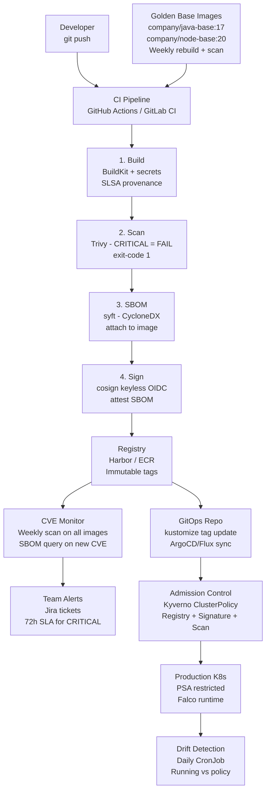

# Docker - L5 Platform Architecture

## Container Platform Architecture and Image Policy

### 🎯 Model Answer

**30 seconds:**
> Container platform architecture: the CI/CD pipeline, registry,
> scanning, signing, and deployment controls that govern how container
> images move from source code to production. Core components: registry
> (Harbor, ECR, GCR) with pull-through cache and immutable tags.
> Golden base image strategy: org-maintained base images with automated
> vulnerability scanning and rebuild pipelines. Image policy: admission
> control (Kyverno, OPA Gatekeeper) enforcing that only signed, scanned
> images from approved registries are deployed. SBOM: generated at
> build time, stored with the image. Drift detection: running images
> vs approved image policy.

**3 minutes (Senior):**
> Production-grade container platform has seven layers. (1) **Registry
> architecture**: a private registry (Harbor, ECR, Artifact Registry)
> as the organization's source of truth. Pull-through cache for Docker
> Hub (eliminates rate limits). Geographic replication (reduce pull
> latency for global deployments). Immutable tags: once pushed, a tag
> cannot be overwritten. (2) **Golden base image strategy**: the platform
> team maintains 2-4 base images (`company/java-base:17`, `company/node-base:20`,
> `company/python-base:3.12`). These base images: built weekly, scanned
> for CVEs, include org security tooling (APM agent, log shipper config),
> use non-root user, read-only filesystem ready. All application Dockerfiles:
> `FROM company/java-base:17`. Platform team owns the CVE remediation
> for base images. Applications: automatically get security updates
> on the next build. (3) **Image policy enforcement**: Kyverno ClusterPolicy
> or OPA Gatekeeper constraint: every deployed pod must use an image
> that is: (a) from an approved registry (not Docker Hub directly),
> (b) tagged with an immutable tag (not `:latest`), (c) signed with
> a cosign signature verifiable against the org's OIDC key. (4) **SBOM
> at scale**: generate SBOM (CycloneDX or SPDX format) at build time.
> Store as an OCI artifact alongside the image in the registry. When a
> new CVE is published: query all SBOMs to find affected images. Alert
> owners. (5) **FinOps**: image size directly impacts pull time. Pull
> time impacts pod startup time. At 1,000+ container restarts/day: 100MB
> larger image = 100GB extra data pulled daily. Image size is a cost.

**Blank Mind Recovery:**

**(1) Restate:** "Registry: private, immutable tags, pull-through cache.
Golden base: platform-owned, weekly rebuild, org security tooling baked
in. Image policy: admission control (Kyverno), must be: approved registry
+ immutable tag + cosign signature. SBOM: at build time, stored with
image. Drift detection: compare running images vs policy."

**(2) First principles:** "Containers are code artifacts. The platform
controls how code artifacts are built, stored, verified, and deployed.
Every organization already has processes for this with JAR files or npm
packages. Container platform architecture: the same supply chain
controls applied to Docker images."

**(3) Bridge:** "Golden base images: the container equivalent of a
company's approved Java SDK or internal npm registry. Not every team
invents their own Java installation. They start from the approved SDK.
Container platform: same concept. Not every team invents their own
Debian setup, APM agent installation, and security hardening. They
start from the approved base image."

---

### 📘 Concept Explanation

**Registry architecture, golden base images, image policy, SBOM, drift detection:**
```
LAYER 1: REGISTRY ARCHITECTURE

  Private registry design:
  
  Developer Machine
       |
       | docker pull
       v
  Pull-through Cache          # Caches Docker Hub images locally.
  (Harbor, Nexus, ECR proxy)  # Eliminates Docker Hub rate limits.
       |                      # Also: caches for security scanning.
       | cache miss: pulls from Docker Hub
       v
  Docker Hub / Docker Scout
  
  Organization-owned artifacts:
  
  CI Pipeline
       |
       | docker push myapp:1.2.3-abc123
       v
  Private Registry
  (Harbor / ECR / Artifact Registry)
       |
       | policies: immutable tags, retention, access control
       |
       +-- /myorg/java-base:17-20240115   # golden base images
       +-- /myorg/node-base:20-20240115
       +-- /team-a/service-x:1.2.3-abc   # application images
       +-- /team-b/service-y:2.1.0-def
  
  Registry policies:
  - Immutable tags: published tags cannot be overwritten.
  - Retention policy: delete images older than 90 days, keep last 10 versions.
  - Vulnerability scan threshold: block push if CRITICAL CVE found.
  - Signed images: cosign signature required before admission.

LAYER 2: GOLDEN BASE IMAGE STRATEGY

  Platform team owns the base image lifecycle:
  
  # company/java-base:17 Dockerfile (maintained by platform team):
  FROM eclipse-temurin:17-jre-jammy@sha256:<digest>  # pinned digest
  
  # Non-root user:
  RUN groupadd -r appgroup && \
      useradd -r -g appgroup -u 1000 appuser
  
  # APM agent (pre-installed, teams configure via ENV):
  COPY --from=datadog/dd-java-agent:latest \
    /dd-java-agent.jar /opt/dd-java-agent.jar
  
  # Certificates (org internal CA):
  COPY org-internal-ca.crt /usr/local/share/ca-certificates/
  RUN update-ca-certificates
  
  # File system preparation:
  RUN mkdir -p /app /tmp/app && \
      chown -R appuser:appgroup /app /tmp/app
  
  USER appuser
  WORKDIR /app
  
  # Labels for catalog:
  LABEL org.opencontainers.image.vendor="MyOrg"
  LABEL org.opencontainers.image.base.name="eclipse-temurin:17"
  
  # Application Dockerfile (team-owned):
  FROM company/java-base:17@sha256:<golden-digest>
  COPY --chown=appuser:appgroup target/app.jar .
  CMD ["java", \
       "-javaagent:/opt/dd-java-agent.jar", \
       "-jar", "app.jar"]
  # Security, APM agent, org CA: already in base image.
  # Team: only needs to add the application artifact.

  Rebuild pipeline:
  - Trigger: Monday weekly (scheduled).
  - Trigger: CVE with CVSS >= 7.0 published for base packages.
  - Trigger: Manual (emergency security patch).
  
  On rebuild: bump digest in base image registry.
  Dependabot/Renovate: opens PRs in all application repos
  to update the FROM digest reference.
  CI builds the application image from the new base.
  After PR merge: new image with patched base is deployed.

LAYER 3: IMAGE POLICY ENFORCEMENT

  Policy requirements per image:
  1. Source registry: must be from company.registry.io/* (not docker.io/*).
  2. Tag format: must match [0-9]+\.[0-9]+\.[0-9]+-[a-f0-9]{7} (never :latest).
  3. Signature: must have a valid cosign signature.
  4. Scan: must have a Trivy scan result with 0 CRITICAL CVEs.
  5. SBOM: must have an attached SBOM.
  
  Kyverno ClusterPolicy enforcement:
  
  apiVersion: kyverno.io/v1
  kind: ClusterPolicy
  metadata:
    name: image-policy
  spec:
    validationFailureAction: Enforce  # block non-compliant pods
    rules:
      - name: verify-registry
        match:
          any:
            - resources:
                kinds: [Pod]
        validate:
          message: "Image must be from company.registry.io"
          pattern:
            spec:
              containers:
                - (image): "company.registry.io/*"
      
      - name: verify-signature
        match:
          any:
            - resources:
                kinds: [Pod]
        verifyImages:
          - image: "company.registry.io/*"
            attestors:
              - entries:
                  - keyless:
                      subject: "*@company.com"
                      issuer: "https://accounts.google.com"

LAYER 4: SBOM MANAGEMENT AT SCALE

  SBOM generation in CI:
  
  # Step 1: Build image:
  docker buildx build -t company.registry.io/myapp:1.0.0-abc .
  
  # Step 2: Generate SBOM (CycloneDX format):
  syft company.registry.io/myapp:1.0.0-abc \
    -o cyclonedx-json > sbom.json
  
  # Step 3: Attach SBOM to image as OCI artifact:
  cosign attach sbom \
    --sbom sbom.json \
    company.registry.io/myapp:1.0.0-abc
  
  # Step 4: Sign the SBOM attestation:
  cosign attest \
    --predicate sbom.json \
    --type cyclonedx \
    company.registry.io/myapp:1.0.0-abc
  
  # CVE response workflow:
  # New CVE published (e.g., log4shell 2.0): Log4j 2.14.1 affected.
  # Platform tooling queries all SBOMs in registry:
  # "Which images contain log4j >= 2.0.0 and < 2.17.0?"
  # Result: 23 images across 8 teams.
  # Automated: create Jira tickets for each team with image list.
  # SLA: CRITICAL CVE = 72-hour remediation.
  # Teams: update the dependency, rebuild, and deploy.
  # Platform: verifies the new image's SBOM no longer contains
  # the vulnerable version.

LAYER 5: DRIFT DETECTION

  Question: "Are the images running in production approved, signed,
  and current?"
  
  Drift detection CronJob (daily):
  
  # Query all running pods across all namespaces:
  kubectl get pods --all-namespaces -o json \
    | jq '.items[] | {
        namespace: .metadata.namespace,
        pod: .metadata.name,
        image: .status.containerStatuses[0].imageID
      }' \
    | tee running-images.json
  
  # Check each image against policy:
  # 1. Is it from company.registry.io?
  # 2. Does it have a valid cosign signature?
  # 3. Is it within the retention window (< 90 days old)?
  # 4. Is it the latest approved version (Dependabot closed all PRs)?
  
  # Alert on violations:
  # Non-compliant pods -> Slack alert + Jira ticket.
  # Images older than 90 days -> Deprecation warning.
  # Images with CRITICAL CVEs (new scan on running images weekly):
  #   -> High-priority Jira, 72-hour SLA.
```

---

### 💻 Code Example

> **Code walkthrough:** The end-to-end CI/CD pipeline that builds, scans,
> signs, and deploys a container image with full supply chain integrity.

```yaml
# GitHub Actions workflow: complete image pipeline

name: Container Build and Deploy
on:
  push:
    branches: [main]
    tags: ['v*']

env:
  REGISTRY: company.registry.io
  IMAGE_NAME: ${{ github.repository }}

jobs:
  build-scan-sign-deploy:
    runs-on: ubuntu-latest
    permissions:
      contents: read
      id-token: write   # required for keyless cosign signing
      packages: write

    steps:
      - name: Checkout
        uses: actions/checkout@v4

      - name: Set up Docker Buildx
        uses: docker/setup-buildx-action@v3

      # Login to private registry:
      - name: Login to Registry
        uses: docker/login-action@v3
        with:
          registry: ${{ env.REGISTRY }}
          username: ${{ secrets.REGISTRY_USER }}
          password: ${{ secrets.REGISTRY_TOKEN }}

      # Compute immutable tag:
      - name: Compute image tag
        id: meta
        run: |
          VERSION=$(cat version.txt)
          SHA=$(git rev-parse --short HEAD)
          echo "tag=${VERSION}-${SHA}" >> $GITHUB_OUTPUT
          echo "full=${REGISTRY}/${IMAGE_NAME}:${VERSION}-${SHA}" \
            >> $GITHUB_OUTPUT

      # Build with BuildKit:
      - name: Build
        uses: docker/build-push-action@v5
        with:
          context: .
          push: true
          tags: ${{ steps.meta.outputs.full }}
          # Remote cache from/to registry:
          cache-from: |
            type=registry,ref=${{ env.REGISTRY }}/${{ env.IMAGE_NAME }}:cache
          cache-to: |
            type=registry,ref=${{ env.REGISTRY }}/${{ env.IMAGE_NAME }}:cache,mode=max
          # Secrets injection (never in layers):
          secrets: |
            npmrc=${{ secrets.NPM_RC }}
          provenance: true   # SLSA provenance
          sbom: true         # BuildKit inline SBOM

      # Security scan (FAIL CI on CRITICAL):
      - name: Scan with Trivy
        uses: aquasecurity/trivy-action@master
        with:
          image-ref: ${{ steps.meta.outputs.full }}
          format: 'sarif'
          output: 'trivy-results.sarif'
          exit-code: '1'
          severity: 'CRITICAL'
          ignore-unfixed: true

      # Generate SBOM (CycloneDX):
      - name: Generate SBOM
        run: |
          syft ${{ steps.meta.outputs.full }} \
            -o cyclonedx-json > sbom.json

      # Sign with cosign (keyless OIDC):
      - name: Sign image
        env:
          COSIGN_EXPERIMENTAL: "1"
        run: |
          cosign sign --yes ${{ steps.meta.outputs.full }}

      # Attest SBOM:
      - name: Attest SBOM
        env:
          COSIGN_EXPERIMENTAL: "1"
        run: |
          cosign attest --yes \
            --predicate sbom.json \
            --type cyclonedx \
            ${{ steps.meta.outputs.full }}

      # Deploy to Kubernetes (GitOps: update image tag):
      - name: Update Kubernetes manifests
        run: |
          cd infrastructure/k8s
          kustomize edit set image \
            myapp=${{ steps.meta.outputs.full }}
          git config user.email "ci@company.com"
          git config user.name "CI Bot"
          git add .
          git commit -m "ci: update myapp to ${{ steps.meta.outputs.tag }}"
          git push
          # ArgoCD/Flux picks up the change and deploys.
```

> **Code walkthrough:** This pipeline implements defense in depth.
> Build with BuildKit enables secrets mounting (never in layers) and
> provenance generation (SLSA supply chain attestation). Trivy scan
> with `exit-code: 1` on CRITICAL: blocks the pipeline and prevents
> deployment of vulnerable images. SBOM generation with `syft` creates
> a complete software bill of materials, attached to the image via
> `cosign attest`. Keyless cosign signing uses GitHub Actions' OIDC
> token: no long-lived signing keys to manage. The GitOps deploy:
> updates the `kustomize` image reference in the infrastructure repo.
> ArgoCD or Flux detects the commit and deploys the new image. The
> CD pipeline is decoupled from the CI pipeline. This is the production
> container platform pipeline: build, scan, sign, attest, deploy.

---

### 🎓 Answers by Seniority

**Junior / Mid (0-5 years):**
> Key components to understand: (1) private registry (company owns
> the images, not Docker Hub); (2) immutable tags (tags cannot change
> after push); (3) image scanning (Trivy in CI blocks vulnerable images);
> (4) cosign signing (cryptographic proof that an image was built by
> the CI pipeline); (5) SBOM (inventory of what's in the image).

---

**Senior / Staff (5+ years):**
> The container platform is a software supply chain. The threat model:
> a compromised CI/CD pipeline, a compromised developer machine, a
> compromised third-party base image, or a compromised registry could
> all introduce malicious code into production containers. Defense in
> depth: (1) pin base images to digests (compromised tag doesn't affect
> you); (2) scan all images in CI and in the registry (detect known
> vulnerabilities); (3) sign images with OIDC-bound keys (cannot be
> reproduced outside the official CI pipeline); (4) admission control
> (unsigned images cannot be deployed, regardless of how they got into
> the registry); (5) runtime detection (Falco: detect behavior that
> deviates from the image's intended purpose). The platform must be
> secure enough that a compromised developer machine cannot push a
> malicious image directly to production without the CI pipeline's
> signature.

---

### ⚠️ Common Misconceptions

**Misconception: "A private registry is sufficient for image security."**
A private registry controls access (authentication + authorization)
but does not provide: vulnerability scanning (images in private
registries accumulate CVEs over time), supply chain integrity (an image
pushed directly without the CI pipeline bypasses all quality gates),
or runtime policy (the registry cannot prevent a compromised image
from being deployed if it has the correct credentials). Private registry:
necessary but not sufficient. Complete image security requires: registry
(access control) + scanning (vulnerability detection) + signing (supply
chain integrity) + admission control (deployment enforcement) + runtime
detection (behavioral monitoring). All five layers: defense in depth.
Removing any layer: creates a security gap. The most commonly missing
layer: admission control. Many organizations have scanning but don't
block deployment of failed scans. A scan without enforcement is not
a security control.

---

### ⚖️ Comparison Table

| Platform Component | What It Prevents | Tools | Failure Without It |
|---|---|---|---|
| Private registry | Unauthorized base images | Harbor, ECR, Artifact Registry | Docker Hub dependency, rate limits |
| Pull-through cache | Rate limiting, latency | Harbor proxy, ECR pull-through | Build failures, slow CI |
| Immutable tags | Tag overwriting, version confusion | ECR IMMUTABLE policy | Silent deployment of wrong version |
| CVE scanning | Vulnerable images in production | Trivy, Snyk, Grype | Log4shell deployed silently |
| Image signing | Unauthorized image deployment | cosign, Sigstore | Compromised image bypasses all gates |
| SBOM | CVE blast radius unknown | syft, grype | Cannot identify affected images |
| Admission control | Policy bypass | Kyverno, OPA Gatekeeper | Scanning without enforcement |
| Drift detection | Policy decay over time | CronJob + kubectl | Old/vulnerable images run indefinitely |
| Golden base images | CVE sprawl across services | Platform-maintained Dockerfiles | Each team manages their own CVEs |

---

### 🏛️ System Design

```
CONTAINER PLATFORM ARCHITECTURE (org-scale):

  DEVELOPER WORKSTATION          CI/CD PIPELINE
  +------------------+           +----------------------+
  | git push         |---------> | 1. Checkout source   |
  | Dockerfile       |           | 2. Build (BuildKit)  |
  | (FROM golden-base|           |    - secrets mount   |
  |  @digest)        |           |    - cache mounts    |
  +------------------+           |    - provenance      |
                                 | 3. Trivy scan        |
  GOLDEN BASE IMAGES             |    BLOCK if CRITICAL |
  +------------------+           | 4. Generate SBOM     |
  | company/         |           | 5. cosign sign       |
  |   java-base:17   |           | 6. cosign attest     |
  |   node-base:20   |           |    (SBOM)            |
  | - Non-root user  |           | 7. Push to registry  |
  | - APM agent      |           | 8. GitOps: update    |
  | - Org CA         |           |    image tag         |
  | - Weekly rebuild |           +----------------------+
  | - CVE threshold  |                    |
  +------------------+                    v
                                 REGISTRY (Harbor / ECR)
                                 +----------------------+
                                 | - Immutable tags     |
                                 | - Access control     |
                                 | - Retention policy   |
                                 | - Continuous scan    |
                                 | - SBOM storage       |
                                 | - Signature storage  |
                                 | - Pull-through cache |
                                 +----------------------+
                                          |
                                          v
                                 KUBERNETES ADMISSION
                                 +----------------------+
                                 | Kyverno ClusterPolicy|
                                 | 1. Approved registry |
                                 | 2. Immutable tag     |
                                 | 3. Valid signature   |
                                 | 4. No CRITICAL CVE   |
                                 |    (scan attestation)|
                                 +----------------------+
                                          |
                                          v
                                 KUBERNETES PRODUCTION
                                 +----------------------+
                                 | - PodSecurityAdmission|
                                 | - NetworkPolicy      |
                                 | - Resource limits    |
                                 | - Falco runtime rules|
                                 +----------------------+
```



> **Diagram walkthrough:** The platform architecture is a pipeline with
> eight enforcement points: (1) Golden base images provide a secure
> starting point - CVE remediation is centralized. (2) BuildKit with
> secrets mounts prevents credentials in layers. (3) Trivy scan with
> exit-code 1 is the first hard gate - CRITICAL CVEs block the pipeline.
> (4) SBOM generation creates the inventory used for CVE blast radius
> analysis. (5) Cosign signing provides cryptographic proof of pipeline
> origin. (6) Registry with immutable tags ensures what was pushed is
> what is deployed. (7) Admission control (Kyverno) is the Kubernetes-side
> hard gate - unsigned or policy-violating images cannot be deployed.
> (8) Drift detection surfaces policy decay over time. Security at
> each layer means an attacker must compromise multiple layers
> simultaneously to introduce malicious code into production.

---

### 🚨 Failure Modes and Diagnosis

**Failure: After a major CVE is published, the organization cannot determine which services are affected.**

```
Symptom: Log4Shell (CVE-2021-44228) published. Security team asks:
  "Which of our 200 services are running a vulnerable Log4j version?"
  Without SBOM: manual audit of each service's dependencies.
  200 services * 30 minutes each = 100 hours. 3-day response time.

With SBOM-driven platform:

  # Query all SBOMs in registry for log4j dependency:
  # grype db update  # Update vulnerability database
  
  # Query registry for all images:
  aws ecr describe-repositories --query \
    'repositories[*].repositoryUri' | jq -r '.[]' \
    | while read repo; do
        # Get all images in this repo:
        aws ecr list-images --repository-name $repo \
          | jq -r '.imageIds[].imageDigest' \
          | while read digest; do
              # Download attached SBOM attestation:
              cosign verify-attestation \
                --type cyclonedx \
                $repo@$digest \
                | jq '.payload' \
                | base64 -d \
                | grype - \
                  --only-fixed \
                  --fail-on CRITICAL 2>&1
          done
      done
  
  # Alternative: SBOM aggregation platform (DependencyTrack):
  # All SBOMs uploaded to DependencyTrack on build.
  # CVE search: "Show me all projects with log4j-core 2.14.1"
  # Results in < 30 seconds.
  
Remediation:
  # 1. DependencyTrack identifies 23 affected images.
  # 2. Automated Jira tickets created for each team.
  # 3. Teams update Log4j version, rebuild, redeploy.
  # 4. Platform verifies new image's SBOM is clean.
  # 5. Total time: 24 hours from CVE to remediation.
  # Without SBOM: 72-144 hours.
```

---

### 🎯 Interview Deep-Dive

| Question Category | Time to Answer |
|---|---|
| Platform components overview | 2 minutes |
| Golden base image strategy | 2 minutes |
| Image signing with cosign | 2 minutes |
| SBOM generation and use | 2 minutes |
| Admission control (Kyverno) | 2 minutes |
| Registry architecture | 1 minute |
| CVE response workflow | 2 minutes |
| Drift detection | 2 minutes |
| Supply chain attack defense | 3 minutes |
| FinOps: image size at scale | 2 minutes |
| Behavioral: platform rollout | 3 minutes |
| Scale: 1,000 images, 50 teams | 3 minutes |

---

**Q1 (production): What is a golden base image strategy and why is it
valuable at organizational scale?**

A: A golden base image is an organization-maintained Docker base image
that serves as the `FROM` for all application images within the
organization. The platform team maintains 2-6 base images: one per
supported language runtime (Java 17/21, Node 18/20, Python 3.11/3.12).
Each base image: (1) is built from a pinned, digest-verified upstream
image (Eclipse Temurin, official Node, official Python); (2) includes
org-specific tooling: APM agent pre-installed (Datadog, New Relic), org
internal CA certificates, log format configuration; (3) uses a non-root
user with a specific UID (1000); (4) is rebuilt weekly and on any CVE
announcement; (5) is scanned before publishing; (6) is versioned and
immutable after publish. Value at scale: (1) **CVE remediation without
application changes**. A CVE in OpenSSL affects all 200 application
images. With golden base: the platform team rebuilds the base image.
Renovate/Dependabot opens PRs in all 200 application repos to update
the `FROM` digest. Teams merge the PR. All 200 images are rebuilt with
the patched base. Without golden base: each team manually updates
their own `FROM` and `apt-get upgrade`. (2) **Consistency**: all Java
applications have the same JRE version, same Locale configuration, same
CA certificates, same APM agent configuration. Debug once, apply to all.
(3) **Reduced image size**: each team doesn't separately install the
APM agent. Shared layer in the registry.

*What separates good from great:* The rebuild trigger mechanism. Weekly
rebuild: good. CVE-triggered rebuild: great. Automate: subscribe to
the National Vulnerability Database (NVD) CVE feed. When a CVE is
published for a package in any golden base image: automatically trigger
a rebuild pipeline, test the new base image, publish it with the new
digest, and open PRs in all application repos. This means: CRITICAL CVEs
in base images are addressed within 24-48 hours, not the next weekly
rebuild. The automation requires: a package inventory of the golden
base image (which packages are installed at what versions), a mapping
from CVE to package, and a trigger from the CVE feed to the rebuild
pipeline. Tools: Dependabot, Renovate, or a custom webhook to the
NVD API.

---

**Q2 (security): Explain how cosign keyless image signing works and why
it is superior to key-based signing for CI/CD.**

A: Traditional key-based signing: a long-lived private key stored as
a CI secret. Used to sign every image. Problems: (1) key rotation:
if the key is compromised, all previously signed images have signatures
from the compromised key. Revocation: complex. (2) Key management:
storing the private key securely in CI secrets across 100+ repos is
operationally complex. Key rotation across all repos: a coordination
effort. (3) Key trust: other parties trusting the key must independently
verify the key fingerprint. Keyless signing (Sigstore): uses
short-lived OIDC-bound certificates. The CI pipeline (GitHub Actions,
GitLab CI) has an OIDC provider. When the `cosign sign` step runs:
(1) cosign requests an OIDC token from the CI provider (token is
bound to the specific workflow, repo, and run). (2) Sigstore's Fulcio
CA validates the OIDC token and issues a short-lived X.509 certificate
(valid for 10 minutes). The certificate's Subject Alternative Name
(SAN): the GitHub Actions workflow identity
(`https://github.com/myorg/myrepo/.github/workflows/deploy.yml@refs/heads/main`).
(3) cosign signs the image with the short-lived key. (4) The certificate
+ signature is recorded in Sigstore's Rekor transparency log (append-only,
publicly verifiable). For verification: the verifier checks that the
signature was made by a key whose certificate: (a) was issued by Fulcio
CA, (b) has the expected SAN (the authorized workflow identity), (c)
is recorded in Rekor. No long-lived private key to manage. The OIDC
identity is the key.

*What separates good from great:* The Rekor transparency log creates
a tamper-evident audit trail. Every image signing event is recorded
with: the image digest, the signing certificate, the timestamp, and
the signing identity. You can query Rekor for all images signed by
a specific workflow: `rekor-cli search --email workflow@github.com`.
If an attacker compromised a CI pipeline and signed a malicious image:
the signing event is in Rekor. Forensics: "this image was signed 3 days
ago by the build workflow for commit abc123. Commit abc123 was not
authorized by a pull request merge. It was a direct push to main by
account X." Rekor as a forensic tool: identify unauthorized signing
events even without access to the CI system logs.

---

**Q3 (production): How do you implement a registry pull-through cache
and what problems does it solve?**

A: A pull-through cache sits between the developer/CI and the upstream
registry (Docker Hub). Configuration: the private registry (Harbor or
ECR) is configured as a proxy for Docker Hub. When a `docker pull
node:18-alpine` is executed: Docker contacts the private registry. The
private registry checks its cache. Cache miss: pulls from Docker Hub,
caches it, returns to requester. Subsequent pulls: served from cache
(fast, no Docker Hub rate limit). Problems solved: (1) **Docker Hub
rate limit**: 100 pulls/6h (anonymous), 200 (free authenticated). A
CI/CD system with 50 concurrent jobs hits this in seconds. Pull-through
cache: eliminates the rate limit (the registry authenticates as one
high-rate-limit account with Docker Hub). (2) **Build speed**: images
cached in the org network (potentially same data center): pull time
drops from 10-30 seconds (Docker Hub) to < 1 second (local cache).
For 1,000 builds/day: minutes saved per build. (3) **Availability**:
Docker Hub outages (they occur) don't affect builds if the image is
in cache. (4) **Security scanning**: images pulled through the cache
can be automatically scanned before they are available in the cache.
Non-compliant images: blocked at the cache layer. Configuration:
Harbor: Project -> Proxy Cache -> configure Docker Hub credentials.
ECR: create an ECR pull-through cache rule.

*What separates good from great:* Restricting direct Docker Hub access.
After deploying the pull-through cache: update the Docker daemon
configuration on CI runners and developer machines to use the private
registry as the mirror, and block direct access to Docker Hub (firewall
rule or container network policy). This ensures: all base image pulls
go through the org's security controls (scanning, access logging).
A developer who pulls `python:3.12-slim` from Docker Hub directly
(bypassing the pull-through cache): gets an unscanned image with no
org SBOM. Forcing all pulls through the cache: all images are scanned
and logged, regardless of who pulled them or how.

---

**Q4 (system): Design a CVE response workflow for a container platform
serving 200 microservices across 30 teams.**

A: The workflow has three phases. (1) **Detection**: subscribe to
multiple CVE feeds (NVD, GitHub Security Advisories, distro security
mailing lists). For each new CVE: query the SBOM database (DependencyTrack
or similar): "which images contain the affected package and version?"
Categorize: CRITICAL (CVSS >= 9.0), HIGH (CVSS 7-9), MEDIUM/LOW.
(2) **Response triage**: CRITICAL CVE: (a) Immediately check if the
vulnerability is exploitable in the context (is the vulnerable code
path reachable?). Not exploitable: lower SLA. Exploitable: emergency
response. (b) For base image CVEs: trigger golden base image rebuild.
All affected applications: automated PRs to update the `FROM` digest.
SLA: patch deployed within 24 hours. For application dependency CVEs:
automated PRs to update the dependency. SLA: 48 hours. For HIGH CVEs:
standard Sprint work, 7-day SLA. (3) **Verification**: after teams
rebuild and redeploy: the platform runs a new scan on the deployed
image version. Confirm the CVE is no longer present. Close the Jira
ticket. Weekly report: "This week's CVE response: 3 CRITICAL (all
remediated within SLA), 12 HIGH (11 remediated, 1 in progress)."

*What separates good from great:* Differentiating between "has the CVE"
and "is exploitable." Many CVE scanners report all packages that contain
a vulnerable version, regardless of whether the vulnerability is
exploitable in the container's context. Example: a CVE in OpenSSL's
TLS 1.0 implementation. If the application disables TLS 1.0: not
exploitable. If the CVE requires specific network conditions that don't
exist in the production environment: lower priority. The triage step:
evaluate exploitability, not just presence. Tools: `grype --fail-on
high --only-fixed` (only report CVEs with available fixes). This reduces
alert fatigue: teams are not alarmed by CVEs in packages they use only
for testing, or CVEs with no available fix, or CVEs that require
conditions that don't exist in production.

---

**Q5 (trade-off): What are the trade-offs of Kyverno vs OPA Gatekeeper
for Kubernetes admission control?**

A: Both enforce policies at the Kubernetes admission webhook layer.
Differences: (1) **Policy language**: Kyverno policies are written in
YAML with Kyverno-specific keywords. OPA Gatekeeper: Rego language
(Turing-complete). Kyverno: lower barrier to entry (no new language
to learn). OPA: more expressive for complex policies. (2) **Scope**:
Kyverno: Kubernetes-native, focused on Kubernetes resource policies.
OPA: general-purpose policy engine (used for Kubernetes AND Terraform
AND API authorization). If the org already uses OPA elsewhere: consistency
argument for Gatekeeper. (3) **Image verification**: Kyverno has
native `verifyImages` support with cosign integration - built in,
no additional tooling. OPA Gatekeeper: image verification requires
additional setup (external data provider or custom Rego). (4)
**Mutation**: Kyverno supports both validation AND mutation (add default
values, add labels, inject sidecars). OPA Gatekeeper: primarily
validation (mutation is less mature). (5) **Community and support**:
both are CNCF projects. Both are production-hardened. Recommendation:
for Kubernetes-only policies + cosign image verification: Kyverno is
easier to adopt. For organizations with existing Rego expertise or
cross-platform policy requirements: OPA Gatekeeper.

*What separates good from great:* Policy-as-code, tested in CI. Both
Kyverno and OPA Gatekeeper policies should be: (1) stored in git,
(2) tested with `kyverno test` (for Kyverno) or `opa test` (for OPA)
against known-good and known-bad test fixtures, (3) deployed via GitOps
(ArgoCD or Flux). A policy that incorrectly blocks a legitimate workload
is a production incident. A policy that fails to block an illegitimate
workload is a security incident. Testing both failure modes before
production deployment: critical. A test fixture library with 20-30
test cases per policy: the minimum for production-grade admission
control.

---

**Q6 (diagnostic): Your admission control policy blocks a legitimate
deployment. How do you investigate and recover without disabling the policy?**

A: Admission control blocks at the API server level. `kubectl apply`
returns: "Error from server: admission webhook denied the request."
Diagnosis: (1) `kubectl describe policy <policy-name>` for Kyverno,
or `kubectl describe constraint <constraint-name>` for OPA. Read the
exact failure message. (2) Check the admission webhook logs:
`kubectl logs -n kyverno -l app=kyverno | grep BLOCKED` (for Kyverno).
The log shows: which pod, which policy rule, the exact policy evaluation.
(3) Compare the rejected manifest against the policy rules. Common
false positive causes: (a) new base image from an approved registry
but the registry URL pattern in the policy is too strict; (b) image
tag format doesn't match the policy regex (a legitimate version like
`1.0.0-rc.1` with a `.` in the suffix). Recovery options: (a) Fix
the manifest to comply (correct approach for genuine violations). (b)
Update the policy (if the policy is too strict - add an exception or
broaden the pattern). (c) Kyverno namespace exclusion: add an annotation
to the namespace to temporarily exclude it from a specific policy:
`kyverno.io/exclude-namespaces: production`. Not recommended in
production except as a last resort with a time-boxed ticket to fix
the manifest.

*What separates good from great:* Running the policy in audit mode
before enforcement. Kyverno: `validationFailureAction: Audit` logs
violations but does not block. Run in audit mode for 2 weeks before
switching to `Enforce`. During audit mode: review all logged violations.
Each one is either: a legitimate manifest that needs to be corrected
(proactive fix, no production impact) or a false positive in the policy
that needs to be fixed before enforcement. The `Audit -> Enforce`
transition: zero legitimate deployments blocked. This is change
management for infrastructure policy: the audit period is the safety
net.

---

**Q7 (security): What is the container image supply chain attack surface
and how does the platform architecture address each vector?**

A: The supply chain attack surface has five vectors. (1) **Compromised
base image**: a malicious actor gains push access to a Docker Hub official
image and pushes a backdoored version. Defense: pin base images to
digest (not tag). The malicious push creates a new digest that doesn't
match the pinned digest. The Dockerfile's `FROM node:18@sha256:pinned`
doesn't pull the new malicious version. (2) **Compromised CI pipeline**:
a malicious PR contains a Dockerfile change that exfiltrates secrets
during build. Defense: build in an isolated environment (no access to
production systems). `--secret` mounts: secrets not in image layers.
Code review requirement for Dockerfile changes. (3) **Compromised
registry**: an attacker gains push access to the private registry and
overwrites a production image with a malicious version. Defense: immutable
tags (cannot overwrite). Image signing: the malicious image doesn't
have a valid cosign signature. Admission control: unsigned images
blocked. (4) **Dependency confusion attack**: attacker publishes a public
package with the same name as a private internal package at a higher
version. Npm/pip installs the public (malicious) package. Defense:
pin ALL dependencies with exact versions and hash verification. Use
private registry mirror for npm/pip. (5) **Compromised developer
machine**: developer's machine has malware that modifies the Dockerfile
or build scripts. Defense: CI builds from git (not developer machines).
Only CI-built images are in the registry. Developer cannot push to
production registry directly.

*What separates good from great:* SLSA (Supply chain Levels for Software
Artifacts) framework for the container supply chain. SLSA Level 3:
(1) build is performed by a hosted build service (not developer machine),
(2) build steps are defined in code (not manual), (3) provenance is
generated and verifiable, (4) ephemeral build environment (no state
retained between builds). BuildKit in GitHub Actions with `provenance:
true`: generates SLSA provenance. Kyverno policy verifying SLSA
provenance before deployment: ensures only SLSA Level 3 images run
in production. This is the container supply chain equivalent of the
software Bill of Materials + provenance attestation combination.

---

**Q8 (scale): How do you manage image retention at organizational scale
to control storage costs without compromising rollback capability?**

A: Retention policy must balance: rollback capability (keep recent
versions), compliance (keep audit trail), and cost (delete old images).
Tiered retention strategy: (1) **Active versions**: current production
version + last 5 versions. Keep indefinitely while the tag is in use
(referenced by a running pod). Never delete an image that is referenced
by a deployed workload. (2) **Recent history**: images from the last
30 days. Keep all. Development velocity: teams may need to rollback
to any version from the past month. (3) **Older history**: images 30-90
days old. Keep only images that were tagged as release candidates or
deployed to production. Delete feature branch images. (4) **Archive**:
images older than 90 days. Keep only images with a `release` or
`hotfix` label. Retain for 1 year for compliance (change audit trail).
Delete all others. Implementation: Harbor retention policies (event-based
and scheduled). ECR lifecycle policies. Both support rules based on
tag prefix, image age, and number of versions to keep. Key rule:
before deleting any image, verify it is not referenced by any running
workload. Script: `kubectl get pods --all-namespaces -o json | jq
'[.items[].status.containerStatuses[].imageID]' | sort -u` generates
the "in-use" list. Never delete images in this list.

*What separates good from great:* FinOps integration with image size
management. Each 100MB increase in average image size = 100GB additional
data pulled per day at 1,000 restarts/day. At $0.09/GB (S3 class
transfer): $9/day, $270/month, $3,240/year from one 100MB image size
increase. Tracking average image size over time (per team, per service)
and alerting when it increases > 20MB: surfaces unintended layer
additions before they become a cost. A CI gate that fails the build
if image size exceeds a per-service threshold: forces optimization.
Image size is an engineering quality metric, not just a CI/CD metric.

---

**Q9 (behavioral): You discover that 15% of production pods are running
images that were not built by the official CI pipeline. How do you
investigate and remediate?**

A: Treat this as a potential security incident. (1) **Scope the problem**:
`kubectl get pods --all-namespaces -o json | jq` to get all image
digests. For each digest: check cosign signature. Images without a
valid signature: were not built by the official CI pipeline. Separate
unsigned images from signed. 15% of pods: approximately how many
services are affected? (2) **Identify how they got there**: check the
registry push logs. Who pushed these images, from which machine, at
what time? Unsigned images: pushed without going through the CI pipeline.
Either: (a) developers pushing from local machines (policy violation),
(b) an old deployment that predates the signing requirement, (c) third-party
images used directly (Nginx, Redis, etc. not pulled through the pull-through
cache). (3) **Risk assessment**: unsigned images from developer machines:
high risk (no scanning, no SBOM). Unsigned third-party images (nginx:latest):
moderate risk (no org policy applied). Unsigned old deployments: low
risk if they predate the policy but need to be migrated. (4) **Remediation**:
for developer-pushed images: rebuild from CI and deploy. For third-party
images: route through pull-through cache (ensures org scanning and
policy). For old deployments: update to CI-built images with deadline.
(5) **Prevention**: enforce admission control (Kyverno) to block unsigned
images going forward. Investigate how they bypassed admission control:
was the policy in audit mode? Was there a namespace exemption?

*What separates good from great:* Automated continuous compliance
scanning as a DaemonSet or CronJob: runs every hour, checks all pod
images against policy. Any new non-compliant pod: alert within 1 hour.
This reduces the detection time from "discovered during security audit"
to "detected within 1 hour of deployment." The SLA for remediating
non-compliant images: (a) enforce admission control to prevent new
non-compliant deployments; (b) for existing non-compliant pods: 24-hour
remediation SLA. The combination of prevention (admission control)
and detection (continuous scanning) closes both new violations and
surfaces existing ones.

---

**Q10 (production): How do you implement a "break glass" procedure that
allows emergency deployments bypassing normal admission controls while
maintaining auditability?**

A: Break glass procedures are necessary for genuine emergencies (production
outage, security incident requiring immediate patching) when normal
CI/CD is too slow. The procedure must: (1) allow the emergency deployment
to proceed; (2) create an audit trail; (3) automatically trigger a
post-incident review. Implementation: (1) **Dedicated emergency namespace**:
create a `break-glass` namespace where Kyverno policies are in audit
mode only. Emergency deployments go here first. (2) **Break glass
access control**: a separate RBAC role (`emergency-deployer`) that can
deploy to the `break-glass` namespace. This role requires a manual
approval from a senior engineer + security lead. (3) **Time-bound
access**: the `emergency-deployer` role binding has an expiry (Kyverno
policy can enforce this). After 4 hours: the role binding is automatically
deleted. (4) **Mandatory audit log**: every action in the `break-glass`
namespace is logged to a separate audit log with high retention. Alerting:
any action in `break-glass` triggers a PagerDuty alert to the security
team. (5) **Post-incident requirement**: emergency deployment must be
replaced by a properly built CI/CD deployment within 24 hours. Jira
ticket: automatically created on break-glass use. SLA: 24 hours to
close (replaced with compliant image). (6) **Never use for convenience**:
break glass procedures that are used regularly lose their security
value. Audit the use frequency. If break glass is used more than once
per quarter: the CI/CD pipeline has a reliability problem that needs
to be fixed.

*What separates good from great:* The break glass procedure exists in
a runbook that is reviewed quarterly. The runbook is tested annually:
a tabletop exercise where the team walks through the procedure without
executing it in production. This ensures that when a real emergency
occurs: the team knows exactly what to do. The procedure is not being
read for the first time during a production outage. The quarterly review
catches outdated steps (role names changed, new admission control
policies require different exemptions). "Tested and rehearsed procedures"
vs "procedures that exist but have never been tested": the difference
between a security incident resolved in 30 minutes and one that takes
hours because the team is reading and debugging the procedure in
real-time.

---

**Q11 (trade-off): What are the FinOps implications of image size at scale?**

A: Image size is a cost driver through two mechanisms. (1) **Storage
cost**: storing 200 images * average 500MB = 100GB per version. With
10 versions retained: 1TB. ECR storage: $0.10/GB/month = $100/month.
With push-through cache: also storing upstream images. Total registry
storage: 5-10TB for a large organization = $500-1,000/month. (2) **Transfer
cost**: every pod start pulls the image. 1,000 pod starts/day (across
restarts, scaling, updates). Average image: 500MB. Total: 500GB/day
pulled. If CI and registry are in the same cloud region: free. If
pods are in a different region or cross-AZ: $0.01-0.09/GB = $5-45/day
= $1,800-16,000/year. A 100MB image size reduction: 100GB less data
pulled per day. $1,800-16,000/year savings. (3) **Startup time**: larger
image = longer pull = longer pod startup. In an HPA scale-out event:
5-second startup (5MB image, already cached) vs 60-second startup
(500MB image, first pull on new node). The 60-second startup: user-visible
latency during traffic spikes. Optimization targets: (a) multi-stage
builds to separate build tools from runtime; (b) distroless base images
(5-20MB vs 100-200MB); (c) layer ordering to maximize cache hit rate
(reduce effective pull size). Image size is an engineering quality
metric: tracked per service, trend monitored, regressions alerted.

*What separates good from great:* Image layer deduplication across
services. Multiple services based on the same golden base image: the
base layer is stored once in the registry and once per node. If 50
services share `company/java-base:17@sha256:abc` (200MB): that layer
is pulled once per node (not 50 times). The actual per-service marginal
cost: only the application-specific layers. This is why the golden
base image strategy has FinOps benefits beyond security: registry
storage deduplication + pull deduplication. A platform where 50 services
all derive from the same 200MB base image: 50 * 200MB apparent size
= 10GB. Actual storage: 200MB (base, stored once) + 50 * 10MB (app
layers) = 700MB. 14x storage efficiency via shared layers.

---

**Q12 (scale): You are the platform architect responsible for a container
platform serving 1,000 images across 50 engineering teams. What are
the five highest-leverage investments you would make?**

A: Ranked by impact. (1) **Golden base image strategy with auto-rebuild**:
centralize CVE remediation. 1,000 images: most based on 5-10 base
images. Fix the base image: 950+ images automatically patched. Without
this: 1,000 independent CVE remediations per vulnerability. This is
the highest-leverage investment for security AND operations. (2) **SBOM
with DependencyTrack**: know exactly what is in every image. CVE
response time drops from days (manual audit) to hours (automated query).
Required for compliance (EU Cyber Resilience Act, US Executive Order
14028). As regulations increase: this becomes mandatory. (3) **Cosign
signing + Kyverno admission control**: enforce supply chain integrity.
The CI pipeline is the only path to production. No back-channel image
deployments. This is the foundation of a zero-trust CI/CD posture.
(4) **Pull-through cache + immutable registry**: eliminate Docker Hub
rate limits and build flakiness. At 1,000 images * 10 builds/day:
10,000 builds/day. Without pull-through cache: Docker Hub rate limits
cause constant build failures (the single biggest source of CI flakiness
for teams at this scale). (5) **Developer portal with self-service
onboarding**: teams that can provision a new service in 10 minutes
(repo + CI pipeline + registry + K8s Helm chart + monitoring) vs 2
days: dramatically higher developer productivity and lower platform
team support burden. Investment in self-service tooling: reduces the
platform team's scaling problem.

*What separates good from great:* Measuring platform impact with
developer productivity metrics, not platform metrics. Not "how many
images do we sign?" but "what is the mean time to deploy a new feature?"
Not "how many SBOM attestations do we generate?" but "what is our CVE
mean time to remediation?" Platform engineering justification to
leadership is not in platform metrics - it is in developer velocity
and security posture metrics. "Our platform investment reduced mean
deployment time from 45 minutes to 8 minutes and CVE remediation
time from 7 days to 18 hours." These metrics are what leadership cares
about. Build the measurement system alongside the platform.
