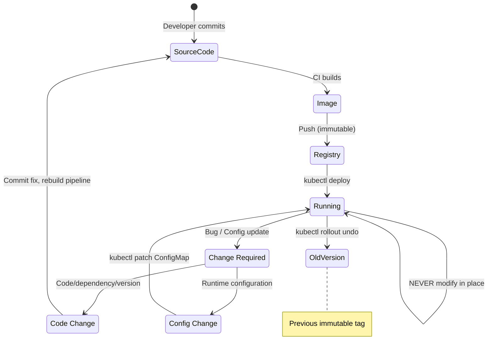
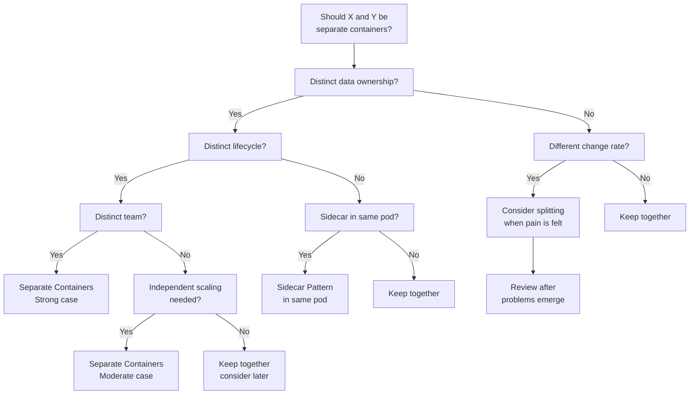

## Keywords in This File
{: .no_toc }

| # | Keyword | Weight |
|---|---|---|
| 1 | [Docker - META Thinking Patterns](#docker---meta-thinking-patterns) | medium |
| 2 | [Build Once Deploy Everywhere Principle](#build-once-deploy-everywhere-principle) | medium |
| 3 | [Container Boundaries and Service Decomposition](#container-boundaries-and-service-decomposition) | medium |

---

# Docker - META Thinking Patterns

## Immutable Infrastructure Mental Model

---

### 🎯 Model Answer

**30 seconds:**
> Immutable infrastructure: servers and containers are never modified
> after deployment. When a change is needed: build a new artifact,
> replace the old one, discard it. Containers: cattle, not pets.
> The running container is a read-only instantiation of an image.
> Configuration, code, and dependencies: locked in at build time.
> Runtime state: externalized to volumes or external services. The
> mental shift: from "fix the running system" to "replace the running
> system with a new version."

**3 minutes (Senior):**
> Immutability is not a Docker concept - it is an operational philosophy.
> Three layers. (1) **Image immutability**: a Docker image is a
> content-addressable artifact (digest = SHA256 of content). Once built
> and pushed: the content never changes. The same digest: the same
> bits, every time, on any machine. Pinning to a digest = pinning to
> exact content. (2) **Container immutability**: a running container
> is an instantiation of an immutable image. Modifications to the
> running container (files written, packages installed, config changed):
> go into the ephemeral writable layer. On container stop: the writable
> layer is discarded. Immutability enforcement: `readOnlyRootFilesystem:
> true` (prevents runtime filesystem writes outside declared volumes).
> (3) **Infrastructure immutability**: servers are never SSH-ed into
> for modifications. When a server needs a change: a new server is
> provisioned from a new AMI/image with the desired configuration, the
> old server is decommissioned. Containers make this easy: the container
> is the server. New image = new "server". Rolling deploy: new containers
> replace old containers. The old containers: discarded.

**Blank Mind Recovery:**

**(1) Restate:** "Immutable: once built, never modified. Replace, don't
patch. Image = content-addressed artifact (digest). Container = ephemeral
instantiation. State = externalized (volumes, databases). The benefit:
consistency, rollback, no drift."

**(2) First principles:** "Every time you modify a running system in
place, you introduce uncertainty. Did the modification work as expected?
Did it interact with previous modifications? Immutability eliminates
in-place modification: the artifact is always fresh, always known-good
from the build pipeline."

**(3) Bridge:** "Immutable infrastructure is like a vending machine
vs a restaurant kitchen. Restaurant kitchen: chefs modify dishes in
progress, every dish is slightly different. Vending machine: each
unit is produced in a factory, identical, sealed. When you want
something different: you don't modify the existing unit. You select
a different unit. Immutable infrastructure: the production environment
is the vending machine. The factory: the CI/CD pipeline."

---

### 📘 Concept Explanation

**Immutability at three levels - image, container, infrastructure:**
```
WHAT IMMUTABILITY MEANS AT EACH LEVEL:

  1. IMAGE IMMUTABILITY:
  
  # Docker image = content-addressable artifact:
  docker images --digests company/myapp
  # company/myapp  1.0.0  sha256:abc123  ...
  # sha256:abc123 = SHA256 hash of the image manifest.
  # If ANY byte changes: different hash. Different image.
  
  # Pin to digest (not tag) for absolute immutability:
  FROM company/myapp@sha256:abc123
  # This FROM can NEVER pull a different image.
  # Tag can be overwritten. Digest cannot.
  
  2. CONTAINER IMMUTABILITY:
  
  # A container is a running instance of an image.
  # Without readOnlyRootFilesystem: the writable layer accepts changes.
  # These changes are ephemeral (lost on container restart).
  
  # Enforce immutability:
  securityContext:
    readOnlyRootFilesystem: true
  # Any write attempt: "Read-only file system" error.
  # Forces the application to use explicitly declared volumes.
  
  # Immutable + writable state separation:
  volumeMounts:
    - name: tmp
      mountPath: /tmp       # writable: temp files
    - name: data
      mountPath: /app/data  # writable: persistent state (PVC)
  # Everything else: read-only (the image).
  
  3. INFRASTRUCTURE IMMUTABILITY:
  
  # MUTABLE (traditional):
  # Production server: running for 2 years.
  # SSH into it. Run apt-get upgrade. Edit config.
  # Result: "snowflake server" - unique, undocumented state.
  # What version of what is installed? Unknown.
  # Can you reproduce this server? No.
  
  # IMMUTABLE (containers):
  # Container: running for 2 days (or 2 hours).
  # Need to change config: update the ConfigMap. New pods replace old.
  # Need to upgrade Java: update the FROM in Dockerfile. Rebuild.
  #   New image. New containers replace old.
  # Need emergency fix: hotfix branch. Build new image. Deploy.
  # Never SSH. Never docker exec (for modifications). Never patch in place.
  
  BENEFITS OF IMMUTABILITY:
  
  1. REPRODUCIBILITY:
  # Any image can be rebuilt from source + Dockerfile.
  # Any image can be deployed on any node, anywhere.
  # "Works on my machine" -> "works on the same image everywhere"
  
  2. ROLLBACK SIMPLICITY:
  # Current version: 1.0.3-abc123
  # Problem detected: roll back to 1.0.2-def456
  # kubectl set image deployment/app app=company/app:1.0.2-def456
  # Kubernetes: replaces running containers with 1.0.2-def456 containers.
  # Total rollback time: < 60 seconds.
  # Rollback of a mutable system: "what was the state before?"
  
  3. DRIFT ELIMINATION:
  # Mutable system over time: state = initial + modification_1 + ... + N
  # Immutable system: state = image content (always known)
  
  4. AUDITABILITY:
  # git tag v1.0.3 -> specific Dockerfile -> specific image digest
  # Full traceability from production container to source code commit.
  
  WHAT IMMUTABILITY IS NOT:
  
  # Immutability does NOT mean no state.
  # State still exists - but it is externalized:
  # - Database: external service (Postgres, Redis, S3)
  # - Secrets: Kubernetes Secrets or Vault
  # - Config: ConfigMap
  # - Persistent data: PersistentVolumeClaim
  
  # The container itself: stateless (can be created and destroyed freely).
  # The state: in external systems that survive container restarts.
```

> **Code walkthrough:** This example demonstrates the core pattern in action. The key mechanism shows how the concept works in practice. Study the structure to understand the essential behavior and common usage.

---

### 💻 Code Example

> **Code walkthrough:** Contrasting mutable (drift-prone) vs immutable
> operational patterns for a production incident.

```bash
# SCENARIO: Application has a bug. Config needs updating.

# BAD: Mutable approach (common in "move fast" early-stage):

# "Just fix it in the running container for now":
docker exec -it prod-app bash
# Inside: vim /app/config.yml  # change the log level
# Or: apt-get install -y strace  # add debug tool
# Or: python fix_script.py      # run a one-off migration

# Problems:
# - The next container restart: config.yml reverts to image content.
# - Other instances of the app: don't have the change.
# - The change is not in git, not auditable, not reproducible.
# - "Why does prod-app-2 behave differently from prod-app-1?"
# - Two months later: "what was that change we made to fix the bug?"

# GOOD: Immutable approach:
# 1. Identify the fix: log level change needed for diagnostics.
# 2. Update the ConfigMap (if it's config):
kubectl patch configmap myapp-config \
  --patch '{"data": {"LOG_LEVEL": "DEBUG"}}'
# 3. Kubernetes: pods pick up the new ConfigMap value on restart.
# (Spring Boot: refreshable via @RefreshScope without restart)

# OR for code changes:
# 1. Fix the bug in code. Commit. Push.
# 2. CI: builds new image myapp:1.0.4-hotfix123
# 3. Deploy: kubectl set image deployment/app app=myapp:1.0.4-hotfix123
# 4. Kubernetes: rolling update. Old containers removed. New ones started.
# 5. Rollback if needed: kubectl rollout undo deployment/app
# Every step: auditable in git and Kubernetes history.
```

> **Code walkthrough:** The BAD pattern introduces configuration drift:
> the running container's state diverges from the image definition. The
> next restart erases the manual change. Multiple replicas have inconsistent
> config. No audit trail. The GOOD pattern keeps all state in declarative
> resources (ConfigMap, Deployment spec). Every change is a Kubernetes
> API call, recorded in audit logs. Every code change is a git commit.
> `kubectl rollout history` shows every Deployment change with timestamp.
> `kubectl rollout undo` rolls back to the previous known-good state.
> The container is truly disposable: any pod can be killed and recreated
> without losing state or configuration.

---

### 🎓 Answers by Seniority

**Junior / Mid (0-5 years):**
> Immutable infrastructure = never modify a running container. When
> something needs to change: build a new image, deploy the new image,
> old containers are replaced. Keep all configuration in ConfigMaps
> (never in the container). Keep all state in databases or volumes
> (never in the container filesystem).

---

**Senior / Staff (5+ years):**
> The practical implementation of immutability requires solving the "what
> about state" problem at every level. Applications with implicit state
> (log files on local disk, temp files, PID files, application caches
> on local filesystem) need to be redesigned: explicit volume mounts
> for each state location. The infrastructure tooling must support
> immutability: ConfigMaps for config, Secrets for credentials, PVCs
> for persistent data, external services for caches and queues. When all
> state is external: any container can be killed and restarted without
> consequence. This is the prerequisite for true horizontal scaling,
> seamless rolling updates, and chaos engineering (randomly killing
> containers in production to verify resilience).

---

### ⚠️ Common Misconceptions

**Misconception: "Immutable infrastructure means you can never debug production."**
Immutability prohibits modifying the running container. It does not
prohibit inspection. `kubectl logs <pod>`: read-only access to container
output. `kubectl exec <pod> -- cat /proc/net/tcp`: read-only access
to kernel state. Kubernetes ephemeral containers: `kubectl debug
-it <pod> --image=busybox --target=app`. The ephemeral container runs
in the same pod namespace (shares network, PID namespace with the main
container) but is separate from it. Debug tools are in the ephemeral
container, not in the main container. The main container: unchanged,
still immutable. When the debug session ends: the ephemeral container
is removed. Production debugging in an immutable system: richer than
in a mutable system, because the state is predictable (no unknown
manual modifications).

---

### ⚖️ Comparison Table

| Pattern | Mutable Infrastructure | Immutable Infrastructure |
|---|---|---|
| Making a change | SSH + edit in place | Build new image + deploy |
| State | In running system (unknown) | Externalized + declarative |
| Rollback | "What was the state before?" | Deploy previous image tag |
| Drift | Accumulates over time | Impossible (read-only FS) |
| Reproducibility | "Works on this server" | "Works on this image" |
| Auditability | Server logs (if retained) | Git history + K8s audit log |
| Debugging | SSH + inspect | kubectl logs + ephemeral containers |

---

### 🏛️ System Design

*(Omit: immutable infrastructure is an operational philosophy, not
a single system architecture pattern. The architecture is distributed
across CI/CD pipeline, registry, and Kubernetes - covered in the
Container Platform Architecture entry.)*

---

### 📊 Diagram

```
MUTABLE vs IMMUTABLE CONTAINER OPERATIONS:

  MUTABLE (anti-pattern):
  
  Container (running)
    |
    +-> docker exec: modify config   <- state in container
    +-> docker exec: install tool    <- state in container
    +-> docker exec: edit file       <- state in container
    |
  Container restart: ALL changes lost.
  Problem: nobody knows current state.

  IMMUTABLE (correct):
  
  Source Code -> Git -> CI/CD -> Image -> Registry
                                             |
                                     Deploy to K8s
                                             |
                            Container (immutable: image)
                                    |          |
                              ConfigMap    PVC/External DB
                              (config)     (state)
                                    |
                            Change needed?
                                    |
                      Update ConfigMap  OR  Build new image
                                    |          |
                              K8s applies  Rollout new
                              change to    containers
                              all pods
```



> **Diagram walkthrough:** The immutable infrastructure state machine
> shows two valid change paths. Code changes go back through the CI/CD
> pipeline: new image, new deployment, new containers. Config changes
> go through the ConfigMap API: no image rebuild needed. There is no
> valid path from "Running" to "Running" that involves modifying the
> container directly. The rollback path is equally clean: `kubectl rollout
> undo` deploys the previous image tag. In the mutable model, rollback
> requires knowing "what was the state before" - which is often unknown.
> In the immutable model: the previous state is a known, tested image.

---

### 🎯 Interview Deep-Dive

| Question Category | Time to Answer |
|---|---|
| Immutable infrastructure definition | 1 minute |
| Cattle vs pets metaphor | 1 minute |
| readOnlyRootFilesystem trade-offs | 2 minutes |
| Debugging in immutable environment | 2 minutes |
| State management in immutable systems | 2 minutes |
| Rollback with immutable images | 1 minute |
| Drift prevention and detection | 2 minutes |

---

**Q1 (concept): Explain the cattle vs pets metaphor in the context of containers.**

A: Pets: servers or containers that are hand-crafted, named, individually
cared for. If a pet gets sick: you nurse it back to health. Pets are
irreplaceable. You know the pet's history, its quirks, its configuration.
Cattle: interchangeable units. If a cow gets sick: you replace it.
No individual attachment. Cattle have IDs (ear tags), not names.
Containers should be cattle: generic, interchangeable, replaceable.
A healthy production environment: you should be able to kill any
container at any time and a new one starts from the same immutable image.
The application continues without interruption. Pet containers: containers
that have been manually modified (packages installed, config edited,
data written to the writable layer). They can't be replaced easily
because their state is unique. Cattle containers: created from immutable
images, stateless, with all config injected via ConfigMaps and all
state in external volumes.

*What separates good from great:* The cattle vs pets metaphor extends
beyond individual containers to the entire infrastructure. In Kubernetes:
pods are cattle. Nodes are cattle. Even the control plane nodes (in
managed K8s) are cattle: the cloud provider replaces them transparently.
This is why PodDisruptionBudgets exist: they give the infrastructure
the right to evict pods (cattle) while guaranteeing minimum availability.
An organization that has adopted the cattle mindset: can perform
cluster upgrades by draining nodes and replacing them (no SSH, no
in-place upgrade). An organization still treating servers as pets:
cluster upgrades are manual, risky, and infrequent.

---

**Q2 (production): A service has configuration that needs to change
without a code deployment. How do you handle this in an immutable system?**

A: Separate code from config. The 12-factor app principle: configuration
that varies between environments is not code. In Kubernetes: ConfigMaps.
A ConfigMap is a Kubernetes resource (stored in etcd, declarative,
version-controlled in git via GitOps). Changing a ConfigMap: a Kubernetes
API call. No image rebuild. For applications that can hot-reload config:
the change takes effect within seconds without pod restart (Spring Boot
`@RefreshScope` + Spring Cloud Config, or file-based config with inotify).
For applications that require restart to pick up config changes:
`kubectl rollout restart deployment/myapp` after updating the ConfigMap.
The pod restart: uses the same immutable image, with the new ConfigMap
values injected. All changes are auditable: the ConfigMap is in git
(GitOps), the Kubernetes audit log records every API call. The immutable
image ensures the code is unchanged. Only the configuration changed.

*What separates good from great:* Feature flags for runtime behavior
changes that are even more granular than config file changes.
LaunchDarkly, Unleash, or a custom feature flag service: allows
changing specific feature behaviors without any deployment or config
change. The application checks the feature flag service at runtime.
Flag value: the "configuration" stored in an external service, not
the container. This is the extreme end of the separation of code and
config spectrum. For behavior changes that need to be reversible in
seconds (a feature causing a performance regression): feature flags
allow sub-second rollback of the behavior change, without any
Kubernetes API call. The combination: immutable images (code) +
ConfigMaps (infrastructure config) + feature flags (application behavior)
= three independently mutable planes, each with its own change velocity.

---

**Q3 (debugging): How do you debug a production issue in a system where
containers are immutable and you cannot SSH or exec into production containers?**

A: Multiple options that preserve immutability. (1) **Structured logs**:
the primary debug tool. `kubectl logs <pod> | jq '. | select(.level=="ERROR")'`.
Structured JSON logs: query by level, request ID, user ID, trace ID.
The log stream is read-only (doesn't modify the container). Centralized
logging (ELK, Datadog, Splunk): aggregate logs across all pods. (2)
**Distributed tracing**: if the request has a trace ID (Jaeger, Zipkin,
OpenTelemetry): the trace shows every service call, database query,
and external API call for the specific failing request. No container
access needed. (3) **Kubernetes ephemeral containers**: `kubectl debug
-it <pod> --image=nicolaka/netshoot --target=app`. The debug container
shares the pod's network and PID namespace. You can run `tcpdump`,
`strace` (with PID from the main container), `curl`, `dig`. The main
container: unchanged. (4) **Metrics**: Prometheus + Grafana. CPU,
memory, GC pause time, active connections, error rate - all observable
without container access. (5) **Reproduce in staging**: copy the
production ConfigMap to staging. Deploy the same image version. Reproduce
the issue in a non-immutable environment (staging can have `kubectl exec`).

*What separates good from great:* Pre-instrumenting for debuggability.
The difference between "I can reproduce the issue" and "I can't tell
what's happening" is determined by what was instrumented before the
incident. Every production service should have: (1) structured logging
with correlation IDs; (2) health endpoints (`/health/live`, `/health/ready`,
`/info`, `/metrics`); (3) distributed tracing with sampling; (4) JVM/Node
memory and thread metrics via JMX/StatsD. The instrumentation is in
the immutable image. When an incident occurs: the observability tooling
provides the necessary visibility without modifying the production
system.

---

**Q4 (trade-off): What are the operational challenges of fully immutable
infrastructure and how do you manage them?**

A: Three challenges. (1) **Deployment frequency pressure**: every change
requires a full image rebuild and deployment. If the CI/CD pipeline
takes 30 minutes: a one-line config fix requires 30 minutes to deploy.
Solution: separate config from code (ConfigMaps, feature flags). Code
changes through CI: normal pipeline. Config changes: direct ConfigMap
update (seconds). Feature flag changes: instant. (2) **Debugging
difficulty**: you can't exec into production. Solution: ephemeral debug
containers, structured logs, distributed tracing, metrics - all provide
visibility without modifying the container. The initial investment in
observability: pays off during every incident. (3) **Stateful workloads**:
databases, message brokers, and consensus systems have state that must
survive container restarts. Solution: StatefulSets + PersistentVolumeClaims.
State is externalized to volumes. The container is stateless. The
database's data: in the PVC. The database container: immutable.

*What separates good from great:* The deployment frequency challenge
reveals a deeper principle: the CI/CD pipeline must be fast enough to
support the change frequency. If the pipeline takes 30 minutes: developers
batch changes to reduce deployment overhead. Batch changes = larger
deployments = more risk per deployment. The investment in pipeline
speed (BuildKit caching, parallel stages, layer reuse) reduces deployment
risk by enabling smaller, more frequent deployments. Immutability
accelerates this: if a deployment is risky, teams deploy less frequently.
If deployment is safe (immutable image, clean rollback), teams deploy
more frequently. Immutability + fast pipeline + automated rollback =
the operational model that enables continuous deployment.

---

**Q5 (behavioral): Describe a scenario where immutable infrastructure
prevented or helped recover from a production incident.**

A: Structure with STAR. Situation: a Node.js application is running in
production. A developer discovers a bug and "temporarily" fixes it by
running `docker exec prod-container-1 sed -i 's/v1/v2/' /app/config.js`.
The fix works. The ticket is closed. Task: 3 weeks later, the container
is restarted (node maintenance). The config.js reverts to the original
(buggy) version. The bug is back. No one knows why: the ticket is closed,
the fix was never committed to git. In a system with `readOnlyRootFilesystem:
true`: the `sed` command would have failed immediately ("Read-only file
system"). The developer would have been forced to fix the code properly.
Action: with immutability enabled, the fix path is: (1) identify the
config change needed, (2) update the ConfigMap (if it's config) or
commit a code fix (if it's code), (3) deploy via CI/CD. Result: the
change is in git, auditable, reproducible, and survives container
restarts. The "temporary" fix that becomes permanent: a common source
of production incidents. Immutability: eliminates this entire class
of failure.

*What separates good from great:* The cultural shift required for
immutability. "I can't just exec in and fix it" initially feels like
a productivity loss. It is actually a quality enforcement mechanism.
Immutability forces: (1) proper root cause analysis (you must understand
the fix well enough to implement it in code); (2) code review (the
fix goes through the normal PR process); (3) testing (the fix is tested
in CI before production). The "temporary fix" that bypasses all these
checks: a quality debt that eventually manifests as a harder-to-diagnose
incident. Immutability closes the bypass.

---

**Q6 (production): How do you implement and validate that containers
in production are truly immutable?**

A: Three layers of validation. (1) **Kyverno policy**: enforce `readOnlyRootFilesystem:
true` on all pods via admission control. Kyverno ClusterPolicy: any
pod without `securityContext.readOnlyRootFilesystem: true` is blocked
from deploying. (2) **Runtime drift detection**: `docker diff <container>`
shows files modified in the writable layer. For K8s: use Falco. Falco
rule: alert when a process writes a file in a container path that is
not a declared volume mount and not in the `/tmp` or `/var/run` emptyDir
paths. Alert: "Container myapp wrote to /app/config.js - unexpected
filesystem write." This detects even `readOnlyRootFilesystem: false`
containers that are being modified at runtime. (3) **Image hash
comparison**: daily comparison of running pods' imageID vs the latest
approved image for each service. Pods running outdated images: alert.
This is "immutable version drift": the pod is running an immutable
image, but an older version than the latest approved. Validation: all
three checks pass when: (a) no pod can be started with a writable root
filesystem (Kyverno); (b) no runtime writes are detected (Falco); (c)
all pods run the current approved image version (hash comparison).

*What separates good from great:* Understanding that `readOnlyRootFilesystem:
true` enforces container immutability, but `kubectl exec` is still
allowed (Kubernetes RBAC controls this). An engineer with `exec` access
can still run `kubectl exec <pod> -- sh -c "rm /app/config.js"` on a
read-only filesystem (the rm fails - but the exec itself succeeds).
The RBAC control: `pods/exec` should be restricted to: platform team,
oncall engineering, and debug tooling. Not available to all engineers
in production. Combined: filesystem immutability (`readOnlyRootFilesystem`)
+ access immutability (RBAC on `pods/exec`) + runtime monitoring
(Falco) = comprehensive immutability enforcement.

---

**Q7 (scale): How does the immutable infrastructure model scale to
1,000 services across 50 teams?**

A: Immutability is easier to maintain at scale than mutability because
it is self-enforcing. At 1,000 services with mutable infrastructure:
manual drift detection is impossible. You don't know which of 1,000
containers have been manually modified. With immutability: (1) Kyverno
enforces `readOnlyRootFilesystem` at admission - no drift can be
introduced. (2) Falco detects any attempted runtime write that bypasses
the security context. (3) SBOM + image scanning: the content of every
image is known and auditable. Scaling the immutable model: the platform
team provides the Helm chart templates (immutability enforcement built
in). Teams onboard new services via the template: they're automatically
immutable. No per-service immutability enforcement needed. Governance:
a weekly report showing "services without readOnlyRootFilesystem: N".
The trend is the metric: N should decrease toward 0 as teams adopt
the template. The challenge at scale: legacy services that predate the
immutability requirement. Migration: the same template migration approach
(provide a compliant template, give teams time to migrate, enforce after
a deadline).

*What separates good from great:* Treating the immutability requirement
as a platform default, not a team policy. When the Helm chart template
has `readOnlyRootFilesystem: true` as the default (teams must explicitly
override it, with a justification annotation), the opt-out is visible
and auditable. "Service X has `readOnlyRootFilesystem: false` with
annotation: reason='legacy app writes to /var/lib/app - migration
planned for Q2'." The override is conscious, documented, and has a
resolution plan. This is better than a requirement that some teams
comply with and others don't (invisibly). The default+override model:
makes compliance the path of least resistance.

---

---

### 💻 Code Example

*(Omit: this concept does not have a programmatic interface that can be demonstrated in code. The conceptual explanation above is sufficient.)*


---

### 🏛️ System Design

*(Omit: system design diagram not applicable for this concept - see ★★★ keywords for full system design coverage.)*


---

### ⚖️ Comparison Table

*(Omit: this is a ★☆☆ foundational concept with no direct alternatives to compare - see higher-difficulty keywords for trade-off analysis.)*


---

### 📊 Diagram

*(Omit: no standalone visual diagram required for this concept - the explanations and code examples above provide sufficient clarity.)*


# Build Once Deploy Everywhere Principle

---

### 🎯 Model Answer

**30 seconds:**
> Build Once Deploy Everywhere: a single Docker image is built once
> by the CI pipeline and that exact same image artifact (identified
> by its digest) is deployed to dev, staging, and production. The
> image never changes between environments. Only the configuration
> changes: injected at runtime via ConfigMaps, Secrets, and environment
> variables. This guarantees that what is tested in staging is exactly
> what runs in production. No "works in staging, fails in prod" due
> to build differences.

**3 minutes (Senior):**
> The build-once principle solves the fundamental testing problem: you
> want to test what you deploy. If you build different images per
> environment (even from the same Dockerfile and same commit): subtle
> differences can emerge. Different base image version pulled (tag resolved
> differently at different times). Different npm/pip/Maven package
> versions (no lockfile enforcement). Different build machine state.
> Build-once eliminates all of these. One build. One artifact. One digest.
> That digest is promoted through environments: dev (automatic), staging
> (automatic with smoke tests), production (after staging approval).
> The promotion artifact: the digest reference. In Kubernetes: update
> the Deployment's image reference from `myapp:1.0.3-abc@sha256:old` to
> `myapp:1.0.3-abc@sha256:new`. Kustomize, Helm, or GitOps manages
> the promotion. The environment differences: ConfigMap values (DB host,
> log level, feature flags), Secrets (credentials, API keys), and scale
> (staging: 1 replica, production: 10). The application code: identical.

**Blank Mind Recovery:**

**(1) Restate:** "One CI pipeline build. One image. One digest. Promote
through environments: dev -> staging -> prod. Only config changes
per environment (ConfigMap/Secrets). Never rebuild for environment.
Digest = proof of identity."

**(2) First principles:** "If staging is testing a different artifact
than what goes to production: staging is not testing production. The
entire value of staging is eliminated. Build-once: staging tests the
exact production artifact."

**(3) Bridge:** "Build-once is like a food factory vs a restaurant
making custom orders. Restaurant: each customer's dish is made fresh,
with possible variation. A factory: each unit is produced identically
under quality control, then packaged and shipped. The promotion pipeline
is the shipping. Dev, staging, production: different destinations,
same product."

---

### 📘 Concept Explanation

**Build-once, promotion pipeline, environment differences:**
```
BUILD-ONCE PROMOTION PIPELINE:

  Source Code (git commit abc123)
       |
       | CI Build (ONCE)
       v
  Docker Image: myapp:1.2.3-abc123@sha256:deadbeef
       |
       | Promotion: dev (automatic)
       v
  Dev Environment
  - ConfigMap: DB_HOST=dev-db, LOG_LEVEL=debug
  - Secrets: dev-credentials
  - Replicas: 1
  - Smoke tests: pass? Promote to staging.
       |
       | Promotion: staging (automatic after smoke tests)
       v
  Staging Environment
  - ConfigMap: DB_HOST=staging-db, LOG_LEVEL=info
  - Secrets: staging-credentials
  - Replicas: 2
  - Integration tests + load tests: pass? Approve for production.
       |
       | Promotion: production (manual approval or automatic)
       v
  Production Environment
  - ConfigMap: DB_HOST=prod-db, LOG_LEVEL=warn
  - Secrets: prod-credentials
  - Replicas: 10 (HPA managed)
  - Same image: myapp:1.2.3-abc123@sha256:deadbeef

  KEY INVARIANT: sha256:deadbeef is the same in dev, staging, and production.
  The image was never rebuilt. Not even for a minor config difference.

ENVIRONMENT DIFFERENCES (all injected at runtime, not baked into image):

  # BAD: environment baked into image:
  FROM node:18
  ENV NODE_ENV=production         # hardcoded
  ENV LOG_LEVEL=warn              # hardcoded
  ENV API_BASE=https://api.prod   # hardcoded (not deployable in dev!)
  # This image CANNOT be used in dev or staging.
  # Different images for each environment: different artifacts. Different risk.

  # GOOD: environment injected at runtime:
  FROM node:18
  # No environment-specific values.
  # Application reads from environment variables at startup.

  # Kubernetes dev ConfigMap:
  apiVersion: v1
  kind: ConfigMap
  metadata:
    name: myapp-config
    namespace: dev
  data:
    NODE_ENV: "development"
    LOG_LEVEL: "debug"
    API_BASE: "https://api.dev.company.com"

  # Kubernetes prod ConfigMap (same structure, different values):
  apiVersion: v1
  kind: ConfigMap
  metadata:
    name: myapp-config
    namespace: production
  data:
    NODE_ENV: "production"
    LOG_LEVEL: "warn"
    API_BASE: "https://api.company.com"

  # The Deployment manifest: identical across environments.
  # The ConfigMap: differs per environment.
  # The image reference: identical across environments.
```

> **Code walkthrough:** This example demonstrates the core pattern in action. The key mechanism shows how the concept works in practice. Study the structure to understand the essential behavior and common usage.

---

### 💻 Code Example

> **Code walkthrough:** A GitOps promotion pipeline that moves the same
> image digest from dev to staging to production.

```yaml
# GitOps repository structure:
# infrastructure/
#   dev/kustomization.yaml
#   staging/kustomization.yaml
#   production/kustomization.yaml
#   base/
#     deployment.yaml
#     service.yaml

# base/deployment.yaml (shared, no image tag):
apiVersion: apps/v1
kind: Deployment
metadata:
  name: myapp
spec:
  template:
    spec:
      containers:
        - name: app
          image: company.registry.io/myapp  # no tag - set by kustomize
          envFrom:
            - configMapRef:
                name: myapp-config

# CI Pipeline: after successful build:
# 1. Compute the digest from the push result.
# 2. Update kustomization.yaml in the dev overlay with the new digest.
# 3. Commit to the GitOps repo. ArgoCD deploys to dev automatically.

# dev/kustomization.yaml:
resources:
  - ../base
  - configmap.yaml
images:
  - name: company.registry.io/myapp
    newTag: "1.2.3-abc123"
    digest: sha256:deadbeef  # immutable reference

# After dev smoke tests pass:
# CI/CD updates staging/kustomization.yaml with the same digest:
# staging/kustomization.yaml:
resources:
  - ../base
  - configmap.yaml
images:
  - name: company.registry.io/myapp
    newTag: "1.2.3-abc123"
    digest: sha256:deadbeef  # SAME digest as dev

# After staging approval:
# production/kustomization.yaml gets the same digest:
# production/kustomization.yaml:
resources:
  - ../base
  - configmap.yaml
images:
  - name: company.registry.io/myapp
    newTag: "1.2.3-abc123"
    digest: sha256:deadbeef  # SAME digest as dev and staging
```

> **Code walkthrough:** The Kustomize overlay pattern implements build-once
> perfectly. The `base/deployment.yaml` has no image tag. Each environment's
> `kustomization.yaml` sets the image reference: same `newTag` and same
> `digest` across all three environments. The `digest` field is the key:
> it is the cryptographic identity of the image. ArgoCD or Flux detects
> the change in each environment's `kustomization.yaml` and applies the
> new image reference. The promotion is a git commit changing the `digest`
> value in the staging or production overlay. Full audit trail: which
> image was deployed to each environment and when, by whom.

---

### 🎓 Answers by Seniority

**Junior / Mid (0-5 years):**
> Build-once means: run the Dockerfile once in CI. Push the resulting
> image to the registry. Use that exact same image (by digest) in dev,
> staging, and production. Never build a new image for each environment.
> The only thing that changes: the ConfigMap values.

---

**Senior / Staff (5+ years):**
> Build-once is a statement about the artifact being tested. If you
> rebuild per environment: you are testing a different artifact in staging
> than you will deploy to production. Even with the same Dockerfile and
> the same code: rebuilds can differ. Base image tag resolution at
> different times, non-deterministic dependency resolution, different
> build machine state. The build-once principle is the only way to
> guarantee that "passed in staging" means "this exact artifact was
> tested." Digest-based promotion is the technical implementation of
> this guarantee.

---

### ⚠️ Common Misconceptions

**Misconception: "We test in staging with a staging-specific image tag."**
Using a staging tag (`myapp:staging`) with imagePullPolicy Always means
staging is testing whatever was most recently built with the staging
tag - which may or may not be the same image as production. If staging
and production are built separately (even from the same commit): they
may have different dependency resolutions. The test is not of the
production artifact. Build-once requires: (1) a single build in CI that
produces one image, (2) the image's digest is propagated through
environments, (3) the digest is what is deployed (not a mutable tag).
The mutable tag can still exist as a human-readable reference. The
deployment reference: the digest.

---

### ⚖️ Comparison Table

| Pattern | Build per Environment | Build Once, Promote |
|---|---|---|
| Artifact tested in staging | Different from production | Identical to production |
| Environment differences | In the image | In ConfigMap/Secrets |
| Rollback | Rebuild old version | Redeploy old digest |
| Traceability | Tag -> approximate code | Digest -> exact code |
| Risk of staging divergence | High | Zero |
| Build time | N environments * build time | 1 * build time |

---

### 🏛️ System Design

*(Omit: build-once is a pipeline design principle covered in the
Container Platform Architecture entry.)*

---

### 📊 Diagram

*(Omit: see the promotion pipeline in the Concept Explanation section
above - the ASCII diagram is clearer than a Mermaid flowchart for
this specific concept.)*

---

### 🎯 Interview Deep-Dive

| Question Category | Time to Answer |
|---|---|
| Build-once definition | 1 minute |
| Why build-once prevents staging-prod divergence | 2 minutes |
| Promotion pipeline implementation | 2 minutes |
| Environment differences management | 2 minutes |
| Digest-based promotion in Kubernetes | 1 minute |
| Build-once in monorepo (multiple services) | 2 minutes |
| Rollback with build-once | 1 minute |

---

**Q1 (concept): Why is "works in staging, fails in production" more
common without build-once, and how does build-once prevent it?**

A: Without build-once, staging and production run different artifacts.
Three common causes: (1) Time-based divergence: `FROM node:18-alpine`
resolves to different Node versions at different times. Staging build:
Monday (Alpine 3.17, Node 18.17). Production build: Wednesday (Alpine
3.17, Node 18.18). A change in Node 18.18 behavior: causes the
production failure. The staging test: on Node 18.17 (didn't catch it).
(2) Dependency resolution non-determinism: `npm install` (not `npm ci`)
resolves to the latest compatible versions. Monday resolution: `axios@1.4.0`.
Wednesday resolution: `axios@1.5.0`. A breaking change in axios 1.5.0:
causes production failure. (3) Build machine state: a library cached
on the staging build machine works, but the production build machine
has a different (or empty) cache. Build-once prevention: one build at
commit time. The digest is the proof that staging and production used
the exact same bytes. Any failure in production that staging should
have caught: either the staging tests were insufficient (not a build-once
problem) or there is a genuine environment difference (config, scale,
data) that should also be investigated.

*What separates good from great:* Build-once also reduces build costs
and time. A pipeline that builds for 3 environments: 3x the build time
and 3x the CI minutes used. Build-once: 1x. For an organization with
1,000 deployments/day: build-once saves 2/3 of CI build cost. This
is both a quality improvement and a FinOps improvement.

---

**Q2 (production): A service needs different TLS certificates for each
environment. How do you implement this without violating build-once?**

A: TLS certificates are secrets: they change per environment and they
are sensitive. Injecting them at runtime via Kubernetes Secrets: correct
approach. The image contains no TLS certificate. At runtime: the pod
mounts the certificate from a Kubernetes Secret as a volume:
`volumeMounts: [{name: tls-cert, mountPath: /etc/ssl/app, readOnly: true}]`.
The Secret contains the environment-specific certificate. The application
reads the certificate from the mounted path. For external TLS: use
cert-manager (CNCF project) to automatically provision and rotate
certificates from Let's Encrypt or an internal CA. The certificate:
stored in a Kubernetes Secret, mounted to the pod. Different environments:
different cert-manager Issuer configurations (staging uses Let's Encrypt
staging, production uses Let's Encrypt production or an internal CA).
The image: no certificate. The Secret: environment-specific certificate.
Build-once: preserved. The application configuration: `TLS_CERT_PATH=/etc/ssl/app/tls.crt`
(ConfigMap). Same path, different certificate content per environment.

*What separates good from great:* Certificate rotation without pod
restart. cert-manager renews the certificate before expiry and updates
the Kubernetes Secret. The pod's volume mount: updated automatically
(Kubernetes syncs Secret changes to mounted volumes within ~1 minute).
Applications that reload the certificate file (instead of loading it
at startup only): benefit from zero-downtime certificate rotation. In
Java: use a custom `SSLContext` that reads the certificate from the
filesystem on each TLS handshake. Or use a reload hook: watch the
file with `inotify` (via a sidecar) and signal the application to
reload. Certificate rotation without pod restart: prevents the 90-day
certificate expiry from becoming a "scheduled maintenance window."

---

**Q3 (diagnostic): A team argues that they need separate builds for
staging and production because "production has stricter performance
requirements and needs different JVM flags." Is this valid?**

A: No, and it reveals a misunderstanding of build-once. JVM flags are
runtime configuration, not build-time configuration. JVM flags are
set in the container's `CMD` or via the `JAVA_OPTS` environment variable.
`JAVA_OPTS: -Xmx2g -XX:+UseG1GC` (production: large heap). `JAVA_OPTS:
-Xmx512m -XX:+UseG1GC` (staging: smaller heap). ConfigMap per environment:
different `JAVA_OPTS` values. Same image. The team's argument: "production
needs different performance settings" is correct. The implementation:
"therefore we need different builds" is wrong. The settings are runtime,
not compile-time. Every JVM flag, Spring Boot property, Node.js flag
(`NODE_OPTIONS`, `--max-old-space-size`), Python flag (`PYTHONOPTIMIZE`):
these are all runtime configuration. They belong in ConfigMaps, not
in the Dockerfile. The Dockerfile: only compile-time configuration
(which JDK version, which build tool, which artifact to COPY).

*What separates good from great:* Identifying the exact boundary between
build-time and runtime. Build-time: which language runtime version
(Java 17 vs 21 - a new image is required). Which application version
(the JAR file - a new image is required). Runtime: any configuration
that could reasonably change without a code change. This includes: JVM
heap size, thread pool sizes, timeouts, log levels, feature flags, DB
connection strings, cache TTLs. When uncertain: ask "would this value
ever differ between staging and production?" If yes: it's runtime config.
If no (like the JDK version): it's build-time.

---

**Q4 (trade-off): What are the operational challenges of build-once
and how do you manage them?**

A: Three challenges. (1) **Debugging production-specific issues**: the
same image runs in staging and production. If a bug is present in staging:
it's in production. If it only manifests in production (different scale,
different data): debugging requires production-like staging (harder to
achieve). Management: invest in production-like staging (same data volume
via anonymized dumps, same scale via load testing). (2) **Config sprawl**:
with all environment differences in ConfigMaps: managing 50 services
* 3 environments = 150 ConfigMaps. Management: Helm + values files
per environment, or Kustomize overlays. GitOps manages the config
as code. (3) **Slow pipeline for fast fixes**: a hotfix still requires
a full CI build (even one line change). If the pipeline takes 30 minutes:
a one-line fix takes 30 minutes. Management: optimize the CI pipeline
for speed (BuildKit caching, parallel stages, incremental builds).
The investment in pipeline speed: directly reduces the pain of build-once.

*What separates good from great:* The argument that build-once is
"too slow for hotfixes" is a symptom of an under-invested CI/CD
pipeline. A well-optimized pipeline: 5-10 minutes from commit to
staging for most changes. For a one-line hotfix: the Java compilation
+ test execution (with layer caching for dependencies): < 5 minutes.
That is an acceptable hotfix timeline. The 30-minute pipeline: the
problem is the pipeline, not the build-once principle.

---

**Q5 (production): How do you trace a production incident back to a
specific source code commit with build-once?**

A: The traceability chain: production pod image digest -> registry push
metadata -> CI build -> git commit. (1) Get the image digest of the
running pod: `kubectl get pod myapp-abc -o json | jq
'.status.containerStatuses[0].imageID'`. Output: `docker-pullable://company.registry.io/myapp@sha256:deadbeef`.
(2) Query the registry for the image with that digest: `docker inspect
company.registry.io/myapp@sha256:deadbeef --format '{{json .Config.Labels}}'`.
The image was built with labels (in the CI pipeline): `org.opencontainers.image.revision=abc123git`
(the git SHA). (3) `git show abc123git` shows the exact commit. (4)
`git log --oneline abc123git..HEAD` shows what has changed since the
failing version. If the incident is "this version introduced a bug":
the git SHA from the label identifies exactly which code is running.
Full traceability: < 2 minutes from "what is running in production"
to "what code is it."

*What separates good from great:* OpenContainers image labels as a
standard. Label every image with: `org.opencontainers.image.revision`
(git SHA), `org.opencontainers.image.created` (build timestamp),
`org.opencontainers.image.source` (git repo URL), `org.opencontainers.image.version`
(semantic version). These labels are queryable from Docker inspect.
A monitoring system that tracks which git SHA is running per service
per environment: enables "when was this version deployed?" queries.
"We deployed sha abc123 to production at 14:30 UTC. The incident
started at 14:45 UTC. Those 23 commits between the previous and current
SHA are the scope of the RCA." Build-once + image labels = production
debuggability with full code traceability.

---

**Q6 (behavioral): Your manager asks why you need a full image rebuild
for every commit when only the application JAR changes. How do you defend
build-once vs incremental patching?**

A: Frame it as: the full rebuild is fast (correct answer), not that
incremental patching is wrong (that might be true but is combative).
"With our current CI pipeline optimization: a full Java build takes
7 minutes. The 7 minutes includes: compiling source, running 300 unit
tests, building the Docker image (with layer caching: the Maven repo
layer is cached, only the COPY app.jar and subsequent layers rebuild),
running Trivy scan, signing with cosign. The 7 minutes: buys us a known,
tested, signed artifact. The alternative: patch the JAR inside the
running container. This is: faster (10 seconds), but produces an
untested artifact (no unit tests), unsigned (no supply chain integrity),
undocumented (no git trace), irreproducible (only that specific container
has the change). The 7 minutes is the price of quality and auditability.
If we need to go faster: the investment is in the pipeline speed (parallel
test execution, better caching), not in skipping the pipeline."

*What separates good from great:* Actually making the pipeline fast.
"We can do 7 minutes" is a better defense than "we can't do it faster."
Java build optimization: (1) `--mount=type=cache,target=/root/.m2`
(Maven cache mount): Maven doesn't re-download all 200MB of dependencies
on every build. (2) Parallel Dockerfile stages: compile and test in
parallel. (3) Incremental compilation: compiler plugins that only
recompile changed files (though less effective for Docker builds which
start fresh). Target: < 5 minutes for a typical Java service with a
full test suite. With this: the "it's slow" objection loses force,
and the quality argument stands stronger.

---

**Q7 (scale): How does build-once work in a monorepo where 100 services
share code and only a subset change with each commit?**

A: Selective builds: only build images for services that changed.
(1) **Change detection**: `git diff HEAD~1 HEAD --name-only | grep -E
'^services/([^/]+)'` identifies which service directories changed.
(2) **Dependency graph**: if service A depends on a shared library that
changed: service A must be rebuilt even if its own code didn't change.
Tools: Nx (JavaScript monorepo), Bazel (polyglot), Gradle's `--rerun-tasks`
with dependency tracking. (3) **Per-service image tags**: each service
has its own image: `company.registry.io/service-a:1.0.0-abc123`.
A commit that changes only service-a: builds and pushes only service-a.
The 99 unchanged services: no rebuild. (4) **Unchanged services**:
continue running their last image. No rebuild, no deployment. The
digest for the unchanged service: unchanged. Build-once at the service
level: each service is built once per change to its code or dependencies.

*What separates good from great:* Hermetic builds for monorepos. A
hermetic build: given the same inputs, always produces the same output.
In a monorepo: the "input" for service A is service A's source + its
dependencies' source (transitively). Bazel's remote caching: if the
exact inputs haven't changed: the build output is retrieved from cache
(the image is not rebuilt: the cached image is re-tagged and re-pushed).
This is "build-once" taken to its logical extreme: if the inputs are
identical: the output is identical (same digest). No rebuild at all.
The build graph: computed from source. The cache key: hash of all inputs.
Hermetic monorepo builds at large scale (100+ services): 10-second CI
times for a commit that touches 1 service (the other 99: cache hits).

---

---

### 💻 Code Example

*(Omit: this concept does not have a programmatic interface that can be demonstrated in code. The conceptual explanation above is sufficient.)*


---

### 🏛️ System Design

*(Omit: system design diagram not applicable for this concept - see ★★★ keywords for full system design coverage.)*


---

### ⚖️ Comparison Table

*(Omit: this is a ★☆☆ foundational concept with no direct alternatives to compare - see higher-difficulty keywords for trade-off analysis.)*


---

### 📊 Diagram

*(Omit: no standalone visual diagram required for this concept - the explanations and code examples above provide sufficient clarity.)*


# Container Boundaries and Service Decomposition

---

### 🎯 Model Answer

**30 seconds:**
> Container boundaries should reflect a single process with a single
> responsibility. Decompose by: data ownership (each service owns its
> schema), change frequency (components that change together deploy
> together, components that change independently deploy independently),
> and failure domain (keep unrelated failure modes separate). When NOT
> to decompose: when the coupling cost (network latency, eventual
> consistency, distributed transactions) exceeds the isolation benefit.

**3 minutes (Senior):**
> The container boundary question is the microservices boundary question.
> Two decomposition axes: (1) **By business capability**: a Payments
> service, an Orders service, an Inventory service. Each: owns its data,
> its API, its deployment. Changes to the Payments logic: deploy only
> the Payments container. (2) **By technical concern**: application
> server + sidecar (Envoy proxy, Fluent Bit log agent). The sidecar
> pattern: auxiliary concerns in a separate container in the same pod.
> The application container: unchanged by the sidecar. Decomposition
> rules: (a) **Single responsibility**: one container, one process, one
> business concern. (b) **Data ownership**: "who owns the schema?" If
> two services need the same table: they should be one service, or the
> data model is wrong. (c) **Change frequency**: components that always
> change together should be in the same container (the coupling cost
> exceeds the isolation benefit). Components that change independently:
> separate containers enable independent deployment. When NOT to
> decompose: (a) if the two services would always need to coordinate
> (distributed transactions, XA transactions across services: consider
> merging). (b) If the network latency between them is unacceptable
> for the use case (sub-millisecond requirements: single container or
> same pod).

**Blank Mind Recovery:**

**(1) Restate:** "Decompose by: data ownership (who owns the table?),
change frequency (what deploys together?), failure domain (what breaks
together?). Don't decompose when: always-together coupling, latency
requirements, or distributed transaction needs."

**(2) First principles:** "A container boundary is a deployment boundary.
Before creating a new container: ask 'do I want to deploy this independently?'
If yes: separate container. If you always deploy them together: they
might be one container."

**(3) Bridge:** "Container decomposition is like splitting responsibilities
in a team. If two people always need to coordinate on every change:
they probably shouldn't be on different teams. If they work largely
independently and only occasionally interface: separate teams make
sense. Containers: the technical version of the same team design
problem."

---

### 📘 Concept Explanation

**Decomposition heuristics, sidecar pattern, over/under-decomposition:**
```
DECOMPOSITION DECISION FRAMEWORK:

  Question 1: Does it have a distinct lifecycle?
  -----------------------------------------------
  "Can this component be deployed independently?"
  Yes -> candidate for a separate container.
  No  -> keep with its dependency.
  
  Example: A web application and its database.
  Can the application be deployed without the database? Yes.
  Can the database be deployed without the application? Yes.
  -> Separate containers.
  
  Example: A service and its companion caching layer (local Redis cache).
  Can the service run without the cache? No (cache is essential to SLA).
  Can the cache run without the service? Yes, but pointless.
  -> Separate containers, but same pod (sidecar pattern).
  
  Question 2: Does it own distinct data?
  ----------------------------------------
  "Which service is the authoritative source for this data?"
  One owner -> clear boundary.
  Multiple owners -> consider merging or clarifying ownership.
  
  Question 3: What is the failure domain?
  -----------------------------------------
  "If component A fails, should component B also fail?"
  Yes -> same container (or tight coupling is acceptable).
  No  -> separate containers (isolated failure domains).
  
  Example: Authentication service fails.
  Should the Product Listing service fail? No (listing doesn't need auth).
  -> Separate containers.
  
  Should the Order Processing service fail? Partially (can read orders, 
  but can't place new ones without auth). -> Separate but with
  circuit breaker.

SIDECAR PATTERN:

  ANTI-PATTERN: sidecar concern in main container:
  
  FROM openjdk:17
  # Application code:
  COPY app.jar .
  # Log aggregation (should be sidecar):
  RUN apt-get install -y fluent-bit
  COPY fluent-bit.conf /etc/fluent-bit/
  # These start together via supervisord:
  ENTRYPOINT ["/usr/bin/supervisord"]
  # Problems: fat container, Fluent Bit failure crashes the app,
  # log config change requires app image rebuild.
  
  CORRECT: Kubernetes native sidecar:
  
  # K8s pod spec:
  initContainers:
    - name: fluent-bit              # K8s native sidecar (k8s 1.29+)
      image: fluent/fluent-bit:3.0
      restartPolicy: Always         # marks it as a sidecar
      volumeMounts:
        - name: logs
          mountPath: /var/log/app
  containers:
    - name: app
      image: company/myapp:1.0.0
      volumeMounts:
        - name: logs
          mountPath: /var/log/app
  # Fluent Bit starts before app (init container ordering).
  # Fluent Bit terminates after app (sidecar lifecycle).
  # Fluent Bit can be updated independently of the app image.
  # Fluent Bit crash: Kubernetes restarts only Fluent Bit.

OVER-DECOMPOSITION (one container per function):

  # BAD: too granular:
  - email-validator-service      # just validates an email address
  - phone-formatter-service      # just formats a phone number
  - zip-code-lookup-service      # just looks up a zip code
  
  # These are functions, not services. No distinct data, no distinct
  # lifecycle, no distinct team. The network call overhead exceeds
  # the utility of independent deployment.
  
  # Problems:
  # - 50ms network call for a 1us validation function.
  # - 3 separate services to deploy for a form validation change.
  # - Distributed transaction for a change that affects all three.
  
  # CORRECT: user-address-service owns all address-related concerns:
  # validates email, formats phone, looks up zip code - all in one
  # service because they share the address domain model.
  
  # Signal: if two services always deploy together -> consider merging.
  # Signal: if a feature requires coordinated changes across 5 services
  #   -> the decomposition is wrong (nano-services anti-pattern).

UNDER-DECOMPOSITION (monolith in a container):

  # BAD: entire business in one container:
  FROM java:17
  COPY monolith-all.jar .
  # Payments, Orders, Inventory, Users, Analytics all in one JAR.
  
  # Problems:
  # - Payments hotfix requires deploying the entire monolith.
  # - One team's bug affects all services.
  # - All services share the same scaling. Analytics query slows Payments.
  # - All services share the same dependencies: dependency hell.
  
  # CORRECT decomposition: when the monolith shows pain points:
  # - CPU usage is dominated by one feature (Analytics): extract first.
  # - One team's deployment cadence blocks others: extract that service.
  # - One feature has different SLA requirements: extract it.
  # Decompose the pain points. Don't decompose for decomposition's sake.

CONTAINER BOUNDARY CHECKLIST:

  Before creating a new container:
  1. Does it have distinct data? (distinct schema / data store?)
  2. Does it have a distinct lifecycle? (deploy independently?)
  3. Does it have a distinct team? (independent ownership?)
  4. Does it have a distinct scaling requirement? (scale independently?)
  5. What is the communication cost? (same process vs network call)
  If 3+ of these are Yes: strong case for a separate container.
  If < 2 are Yes: the overhead may exceed the benefit.
```

> **Code walkthrough:** This example demonstrates the core pattern in action. The key mechanism shows how the concept works in practice. Study the structure to understand the essential behavior and common usage.

---

### 💻 Code Example

> **Code walkthrough:** Demonstrating the sidecar pattern with a log
> aggregation container that is separate from but cooperates with the
> application container.

```yaml
# BAD: fat container with application + log agent:
FROM eclipse-temurin:17-jre
RUN apt-get update && apt-get install -y supervisor fluent-bit
COPY supervisord.conf /etc/
COPY fluent-bit.conf /etc/fluent-bit/
COPY app.jar /app/
CMD ["/usr/bin/supervisord", "-c", "/etc/supervisord.conf"]
# supervisord.conf runs both java -jar app.jar and fluent-bit.
# If fluent-bit crashes: supervisord might restart both.
# Log config change: requires rebuilding the application image.
# Two distinct concerns in one container: anti-pattern.
```

> **Code walkthrough:** The BAD pattern couples the application and the
> log aggregation concern. The application image now depends on Fluent Bit's
> version. A Fluent Bit security update requires rebuilding AND retesting
> the application image. Supervisord as PID 1 complicates signal handling.
> If Fluent Bit OOMs: it's killed inside the container without a Kubernetes
> restart event. The platform team cannot update Fluent Bit configuration
> across services independently.

```yaml
# GOOD: application + Fluent Bit as a Kubernetes native sidecar:
apiVersion: apps/v1
kind: Deployment
spec:
  template:
    spec:
      # Shared volume for log files:
      volumes:
        - name: app-logs
          emptyDir: {}
        - name: fluent-bit-config
          configMap:
            name: fluent-bit-config  # managed by platform team
      
      # Sidecar (K8s 1.29+ native sidecar):
      initContainers:
        - name: fluent-bit
          image: fluent/fluent-bit:3.1
          restartPolicy: Always       # makes it a sidecar
          volumeMounts:
            - name: app-logs
              mountPath: /var/log/app
              readOnly: true
            - name: fluent-bit-config
              mountPath: /etc/fluent-bit
          resources:
            requests:
              memory: "32Mi"
              cpu: "10m"
            limits:
              memory: "64Mi"
              cpu: "50m"
      
      # Main application container:
      containers:
        - name: app
          image: eclipse-temurin:17-jre
          # app only: no Fluent Bit, no supervisord
          command: ["java", "-jar", "/app/app.jar"]
          volumeMounts:
            - name: app-logs
              mountPath: /var/log/app  # app writes logs here
```

> **Code walkthrough:** The sidecar pattern cleanly separates the
> application from the log aggregation concern. The application writes
> JSON logs to `/var/log/app/app.log`. Fluent Bit reads from the same
> volume (read-only) and forwards to the centralized log collector.
> Independent lifecycle: Fluent Bit can be upgraded by the platform team
> (by updating the `fluent-bit-config` ConfigMap or the image version)
> without any change to the application image. Independent failure:
> Fluent Bit crash -> Kubernetes restarts only Fluent Bit. Application:
> continues running (may have unbounded log files until Fluent Bit
> restarts, but does not fail). Independent resources: Fluent Bit has
> its own CPU and memory limits (32Mi: appropriate for a log forwarder).

---

### 🎓 Answers by Seniority

**Junior / Mid (0-5 years):**
> One container = one process = one business concern. Use the sidecar
> pattern for cross-cutting concerns (logging, metrics, secrets rotation).
> The main container and the sidecar: different containers in the same
> pod. They share a network namespace and can share volumes.

---

**Senior / Staff (5+ years):**
> Container boundaries should follow team boundaries (Conway's Law).
> Teams that own distinct services: clear container boundaries. A team
> that owns a monolith: consider whether the decomposition benefit
> exceeds the operational overhead. The overhead: distributed tracing,
> service discovery, network latency, distributed transactions,
> independent deployment complexity. The benefit: independent scaling,
> independent deployment cadence, isolated failure domains, clear ownership.
> The right decomposition: reduces overall complexity, not increases it.
> A poorly designed microservices architecture has MORE complexity than
> a well-designed monolith.

---

### ⚠️ Common Misconceptions

**Misconception: "More containers = better microservices architecture."**
Decomposition should reduce overall system complexity, not increase it.
The signals that decomposition has gone too far: (1) deploying a single
feature requires coordinated changes to 5+ services (the feature spans
too many service boundaries); (2) a service has no persistent state
of its own and just proxies to another service (it is not a service);
(3) inter-service call latency dominates application response time
(the network overhead exceeds the value of isolation); (4) the service
is so small that its CI/CD pipeline, monitoring, and alerting is more
complex than its business logic. The correct decomposition: where each
service has clear data ownership, distinct team ownership, distinct
scaling requirements, and independent deployment value.

---

### ⚖️ Comparison Table

| Decomposition Level | Communication | Coupling | When to Use |
|---|---|---|---|
| Single container | In-process | Tight | Single concern, single team |
| Sidecar in pod | Shared volume/localhost | Medium | Cross-cutting concerns |
| Separate pods, same service | Network call | Loose | Independent scaling |
| Separate services, namespaces | Network + service mesh | Very loose | Independent teams, data |
| Over-decomposed (nano-service) | Many network calls | Too loose | Avoid: overhead > benefit |

---

### 🏛️ System Design

*(Omit: container boundary design is a domain-specific architectural
decision, not a generic system architecture pattern. The decision
framework in the Concept Explanation section is the appropriate format.)*

---

### 📊 Diagram

```
CONTAINER BOUNDARY DECISION TREE:

  Start: "Should X and Y be separate containers?"
           |
     Do they have different data?
     (distinct databases/schemas)
           |              |
          Yes             No
           |              |
     Do they have     Do they have
     different        different
     lifecycles?      change rates?
           |              |
          Yes             No -> Keep together
           |              |
     Do they have     Do they share a
     different        tight coupling?
     teams?           (always deploy
           |          together?)
          Yes             |
           |             Yes -> Keep together (or
     SEPARATE            review decomposition)
     CONTAINERS
     (strong case)
```



> **Diagram walkthrough:** The decision tree starts with the strongest
> signal: data ownership. If X and Y own distinct data (separate schemas,
> separate databases): they are strong candidates for separate containers.
> If they own the same data: they are likely one service, or the data
> model needs redesigning. The sidecar path: when components share the
> same data but have different technical concerns (application + log
> forwarder): same pod, different containers. The "keep together" outcomes
> are not failures: many concerns belong together. The tree guides toward
> the minimal necessary decomposition, not the maximal.

---

### 🎯 Interview Deep-Dive

| Question Category | Time to Answer |
|---|---|
| Container boundary principles | 2 minutes |
| Sidecar pattern use cases | 2 minutes |
| Over-decomposition signs | 2 minutes |
| Data ownership as boundary criterion | 1 minute |
| Monolith vs microservices decision | 2 minutes |
| Conway's Law and container boundaries | 2 minutes |
| Distributed transactions in microservices | 2 minutes |

---

**Q1 (concept): What are the signals that a service decomposition is
wrong (both over-decomposed and under-decomposed)?**

A: Over-decomposition signals: (1) Deploying a single user-facing feature
requires coordinated changes to 5+ services. The feature spans too many
boundaries. "Chatty" inter-service communication: the decomposition
created more coupling, not less. (2) A service exists purely as a proxy:
it receives a request, calls exactly one other service, returns the
result unchanged. No data ownership, no logic: this is not a service,
it is a gateway or a proxy. (3) Network latency exceeds the latency
budget for the use case. A recommendation engine that calls 20 micro-services
in sequence: each call adds 1-5ms overhead. 20 * 5ms = 100ms of pure
network overhead for a user request. The decomposition is too granular
for the latency requirement. (4) The overhead of operating the service
(CI/CD pipeline, monitoring, alerting, on-call rotation) exceeds the
value of its isolation. Under-decomposition signals: (1) A team that
owns the entire business's logic: deployment requires cross-team sign-offs.
Deployment cadence: monthly. (2) One component's scaling requirements
dominate the entire deployment. The analytics workload forces the web
API to run on large instances. (3) A bug in one module repeatedly
causes outages in unrelated modules. Shared mutable state, no isolation.

*What separates good from great:* Using actual metrics, not intuitions.
Deployment coupling: track how often a deployment to service A requires
a simultaneous deployment to service B. If this is > 50% of deployments:
they should be merged. Latency: profile the actual inter-service call
overhead as a fraction of total request latency. If > 30%: the
decomposition is too fine-grained for the performance requirement.
Team cognitive load: a team that maintains > 5 services has high context
switching overhead. If each service is trivially small: merge them into
a more cohesive service. Metrics-driven decomposition decisions: more
reliable than architectural intuitions.

---

**Q2 (production): A service team wants to split their monolith into
two services. How do you evaluate whether the split is worth the cost?**

A: The split creates new operational overhead. The operational overhead
of adding a service: (1) New CI/CD pipeline (2-4 hours to set up).
(2) New Kubernetes Deployment + Service (30 minutes). (3) New monitoring
dashboards and alerts (2-4 hours). (4) New on-call runbook entries.
(5) Inter-service authentication (service-to-service mTLS or API keys).
(6) Distributed tracing (requests now span two services). (7) Data
migration (if the new service owns a subset of the data). Total: 1-3
days of platform work per service split. The benefits must exceed this:
(1) **Independent deployment**: if the team deploys service A and B
together 80% of the time: no benefit. If they deploy them independently
80% of the time: high benefit. (2) **Independent scaling**: if A and
B have similar load profiles: no benefit. If A needs 10x scale of B:
high benefit. (3) **Independent failure**: if A failing should not affect
B: high benefit. If A and B fail together anyway: no benefit. Rule of
thumb: the split is worth it when at least 2 of the 3 benefits are
real and significant.

*What separates good from great:* The strangler fig pattern for
incremental extraction. Don't split a monolith in one big-bang refactoring.
Extract one endpoint from the monolith into a new service. Proxy
the monolith to the new service for that endpoint. Validate that the
new service works correctly. Extract the next endpoint. Each extraction:
independently valuable. If the extraction is unexpectedly complex:
revert and reconsider the boundary. Incremental extraction de-risks
the split: each step is small and reversible. Big-bang monolith splits:
high risk (all-or-nothing), long feedback loops (months to validate),
difficult to roll back.

---

**Q3 (trade-off): When is a distributed transaction necessary and how
do you avoid it with proper service decomposition?**

A: A distributed transaction (XA protocol, two-phase commit) is required
when two or more services with separate data stores need to commit or
rollback atomically. Example: "Transfer $100 from Account A (Service A)
to Account B (Service B)." Either both debit and credit succeed, or
neither. Without coordination: debit succeeds, credit fails = money
disappears. Avoiding distributed transactions with proper decomposition:
(1) **Merge the services**: if they always coordinate: they share a
transaction boundary. They should share a data store. One service owns
both accounts. The transaction is a local database transaction (ACID).
This is the simplest solution and often the correct one when the
services are in the same domain (financial accounts). (2) **Saga pattern**:
choreography or orchestration of compensating transactions. Debit
succeeds (Service A emits "funds.reserved" event). Credit succeeds
(Service B emits "funds.credited" event). If credit fails: compensating
transaction (Service B emits "credit.failed", Service A releases the
reservation). Eventual consistency: the system is temporarily inconsistent
but converges to a correct state. Complexity: high. Use when services
genuinely cannot share a database AND atomicity is required. (3)
**Idempotent operations + retry**: if the operation can be safely
retried without side effects (idempotent): a "at least once" delivery
model (Kafka, SQS) with idempotent processing converges to correctness
without two-phase commit.

*What separates good from great:* The "do we need a distributed
transaction?" question is the wrong first question. The right first
question: "have we drawn the service boundary correctly?" If two services
always need to coordinate transactionally: the boundary is wrong. The
services share a transaction domain. They should share a data store.
A distributed transaction is a complexity tax paid for a premature
decomposition. Most cases where engineers think they need distributed
transactions: they actually need to reconsider the service boundaries.
Identify the aggregate root: all operations in a transaction that need
atomicity probably belong to the same aggregate (in DDD terms) and
to the same service.

---

**Q4 (behavioral): Describe a time you refactored a service boundary
that was incorrectly drawn.**

A: Use STAR structure. Situation: a user authentication service and a
user profile service were separate microservices. Both owned a `users`
table in their respective databases, with a shared `user_id`. Task:
every user registration required writing to both databases atomically.
The team had implemented a custom two-phase commit (non-standard, fragile).
Production incidents: 3 per month where the profile was created but
auth credentials were not (or vice versa). Action: identified the root
cause as an incorrect boundary. Both services were in the "user domain."
They shared data. They had a distributed transaction: a sign that they
belonged together. Proposed and implemented: merging auth and profile
into a single "user service." The transaction was now local (one PostgreSQL
instance). Implementation: (1) combined the two APIs into one service
(endpoints unchanged - backward compatible). (2) Migrated profile data
into the auth database schema. (3) Removed the custom two-phase commit.
(4) Decommissioned the profile service. Result: 0 data consistency
incidents in the following 6 months. The "two services" added complexity
with no benefit (they had the same team, same deployment cadence, same
scaling requirements). Merging eliminated 2 services, 1 database, and
a custom distributed transaction implementation.

*What separates good from great:* Recognizing when to merge is as
important as knowing when to split. The "microservices by default" culture
leads teams to split services that don't have the prerequisites for
independent deployment. The result: distributed monolith (the services
are technically separate but operationally coupled). The distributed
monolith is worse than a monolith (monolith: at least transactions are
local and deployment is simple). The decision to merge: requires
intellectual honesty ("we made a mistake") and the conviction to
reduce complexity even when it means less impressive architecture
diagrams.

---

**Q5 (system): Design the container decomposition for an e-commerce
order processing system.**

A: Order processing domain: Order Service, Inventory Service, Payment
Service, Notification Service. Boundaries based on data ownership:
(1) **Order Service**: owns the orders schema (order status, order items,
shipping address). The authoritative source for "what is the current
state of this order?" (2) **Inventory Service**: owns the inventory
schema (product quantities, warehouse locations). Answers: "is this
product in stock?" Deducts inventory when an order is placed. (3)
**Payment Service**: owns payment records. Processes charges, handles
refunds. Does NOT own order status (that's Order Service). (4)
**Notification Service**: stateless (or owns notification history).
Sends emails/SMS. No critical transactional data. Scaling: scales
with email volume, not order volume. Communication pattern: events
(Kafka/SNS). Order placed -> `order.placed` event. Inventory Service
consumes: deducts stock. Payment Service consumes: charges the card.
Notification Service consumes: sends confirmation email. Each service:
independently deployable, independently scalable, independently owned
by a team. Distributed transaction avoidance: saga pattern for
order-placement (compensating transactions if payment fails: order is
cancelled, inventory is released).

*What separates good from great:* The "order status" data ownership is
the key architectural decision. Does the Payment Service update the
order status? No: the Order Service owns order status. The Payment
Service publishes "payment.succeeded" or "payment.failed" events. The
Order Service consumes these events and updates its own order status.
Each service: reads and writes only its own data. The Order Service
is the aggregator of events from other services into the order state
machine. This clean data ownership: eliminates the need for cross-service
joins (each service queries its own database) and prevents the distributed
transaction problem (no two services need to commit atomically to their
databases simultaneously).

---

**Q6 (production): A team wants to move from a microservices architecture
back to a monolith because operations are too complex. When is this the
right decision?**

A: Consolidation is the right decision when: (1) **Deployment coupling
is high**: 80% of deployments require simultaneous deployment of 3+
services. The services are not independently deployable in practice.
The microservices provide no deployment value. (2) **Team size is too
small**: a team of 3 engineers maintaining 8 microservices. Context
switching overhead: each engineer maintains CI/CD, monitoring, alerting,
runbooks for 2-3 services. The operational overhead exceeds the value.
A monolith with 3 engineers: manageable. (3) **Data consistency
requirements are too strict**: the domain is heavily transactional
(financial ledgers, order state machines). Every user action requires
updating 4 services atomically. The team implemented distributed
transactions (sagas, compensating transactions, custom 2PC). The
complexity: exceeds the complexity of a monolith. (4) **The decomposition
doesn't reflect team boundaries**: Conway's Law. If there is one team
and multiple services: the services don't reflect an organizational
reality. They are artificial decompositions. The right decision: merge
into a "modular monolith" (a monolith with clean internal module
boundaries that can be extracted later when the team grows).

*What separates good from great:* "Modular monolith" as an intermediate
architecture. Not a microservices explosion, not a big ball of mud.
A single deployable artifact with clearly defined internal modules (each
with its own data access layer, each with its own API interface). The
internal interfaces: documented as if they were service APIs. When a
team grows and a module is ready for independent deployment: extract
it. The modular monolith: low operational overhead (one deployment,
one database), high internal clarity (modules with clear interfaces
and ownership), and a clear path to microservices when the team is
ready. Sam Newman's "Monolith to Microservices": the modular monolith
is a recommended intermediate state. It is not a failure to reach
microservices. It is the right architecture for many organizations.

---

**Q7 (scale): How do container boundary decisions change as an organization
scales from 5 engineers to 500 engineers?**

A: The right architecture evolves with organizational scale. 5 engineers:
a well-designed monolith or 2-3 services is optimal. 5 engineers cannot
effectively own 20 microservices. Operational overhead per service
consumes most of the engineering capacity. The monolith: all 5 engineers
can contribute to all parts of the system. 50 engineers (5-10 teams):
5-10 services. Each team owns 1-2 services. Conway's Law: the architecture
reflects the team structure. Services align with team boundaries.
Independent deployment: real value (teams don't block each other).
500 engineers (40-50 teams): 50-100+ services. Each team owns 1-3
services. Service mesh for inter-service communication (Istio, Linkerd).
Developer portal for service catalog. Platform team for CI/CD, monitoring,
K8s cluster. The organizational structure: sets the upper bound on
reasonable decomposition. "We have 500 engineers, we need 500 microservices"
is wrong. "We have 50 teams, we need roughly 50-150 services" is the
right calculation.

*What separates good from great:* Team cognitive load as the primary
constraint. A team of 5 can effectively own at most 3-4 microservices
(each with its own CI/CD, monitoring, alerting, on-call rotation, API
documentation, data schema evolution). Beyond that: quality degrades.
The platform team's job: reduce the per-service cognitive load through
automation (self-service provisioning, automated CI/CD templates,
centralized monitoring). As the platform matures: a team of 5 can
effectively own more services (the platform handles the overhead). The
correct microservices adoption sequence: grow the team first, then split
the service. Not: split the service to grow the team's responsibilities.
Service boundaries should follow team capacity, not lead it.

---

### 💻 Code Example

*(Omit: this concept does not have a programmatic interface that can be demonstrated in code. The conceptual explanation above is sufficient.)*


---

### 🏛️ System Design

*(Omit: system design diagram not applicable for this concept - see ★★★ keywords for full system design coverage.)*


---

### ⚖️ Comparison Table

*(Omit: this is a ★☆☆ foundational concept with no direct alternatives to compare - see higher-difficulty keywords for trade-off analysis.)*


---

### 📊 Diagram

*(Omit: no standalone visual diagram required for this concept - the explanations and code examples above provide sufficient clarity.)*


