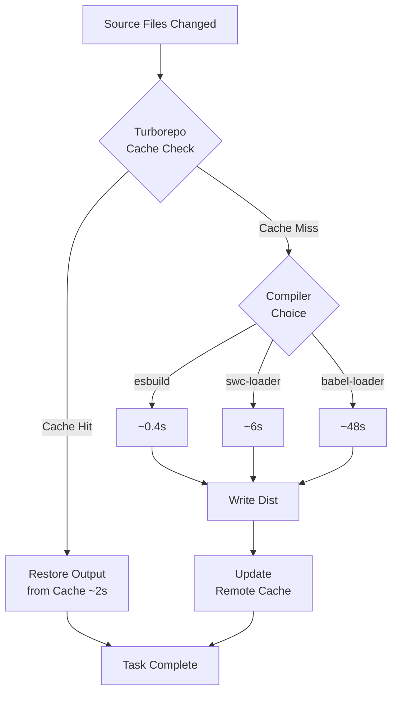

## Keywords in This File
{: .no_toc }

| # | Keyword | Weight |
|---|---|---|
| 1 | [Build Performance at Scale (esbuild, SWC, Turbopack)](#build-performance-at-scale-esbuild-swc-turbopack) | medium |

---

# Build Performance at Scale (esbuild, SWC, Turbopack)

---

### 🎯 Model Answer

**30 seconds:**

> webpack 5 with babel is slow because babel transforms each module
> in Node.js. esbuild rewrites in Go (multi-core, native speed) and
> is 10-100x faster. SWC rewrites in Rust - same idea, Rust native
> speed. Vite uses esbuild for dependency pre-bundling and SWC/esbuild
> for TypeScript stripping. Turbopack (webpack successor by Vercel,
> Rust) promises webpack-compatible incremental builds at esbuild
> speed. For production builds at scale: switch babel to SWC via
> swc-loader; for CI, add remote Turborepo caching.

**Blank Mind Recovery:**

**(1) Restate:** "Build speed: babel (Node.js, slow) -> SWC (Rust,
fast) or esbuild (Go, fast). Turbopack = webpack + Rust. Turborepo =
task-level remote caching."

---

### 📘 Concept Explanation

**What it is:**

Build performance at scale addresses the growing compilation time as
codebases grow. A 500-file TypeScript + React application can take
45s to build with webpack + babel; switching to SWC-based transforms
cuts this to under 10s without changing any application code.

**The problem it solves:**

- CI build: 3-minute frontend build blocks every PR merge
- Developer hot reload: 2s per HMR update kills flow state
- Monorepo: rebuilding all 8 packages on every PR is prohibitive
- Test suite: jest + babel re-compiling everything on each run

**How it works:**

```
Why babel is slow:
  JavaScript-based transform engine
  Single-threaded (Node.js default)
  Each module: read file -> parse AST -> transform -> generate code
  At scale: 500 files x 20ms = 10 seconds just for transforms

esbuild (Evan Wallace, Go):
  Written in Go: native binary, not interpreted
  Parallel: uses all CPU cores (goroutines per file)
  Single pass: parse + transform + generate in one pass
  No type checking: strips TypeScript types only (no tsc check)
  Result: 10-100x faster than webpack + babel

SWC (Speedy Web Compiler, Rust):
  Rust native binary
  Parallel file processing (Rayon parallel iterator)
  Drop-in replacement for babel: same configuration API
  Used by: Next.js, Vite's optional SWC plugin
  Supports: JSX, TypeScript, decorators, legacy browsers
  No type checking: same limitation as esbuild

Turbopack (Vercel, Rust):
  webpack-compatible (handles webpack plugins, loaders)
  Incremental: only processes what changed (file-level graph)
  Demand-driven: only compiles modules the page actually uses
  Status: stable for Next.js dev, beta for webpack compat
  NOT yet a full webpack replacement for all projects

Turborepo (monorepo task caching):
  Different from Turbopack
  Caches task outputs (dist/, coverage/)
  Remote cache: share cache between CI machines and developers
  Pipeline: declares dependency order for tasks
  Result: 90%+ cache hit rate in CI for unchanged packages
```

> **Code walkthrough:** This example demonstrates the core pattern in action. The key mechanism shows how the concept works in practice. Study the structure to understand the essential behavior and common usage.

**The production reality:**

At 100 developers, a 3-minute CI build means 300 developer-minutes
wasted per hour. A 45-second build means 75. The infrastructure cost
of fast builds pays for itself immediately at this scale. Remote
caching (Turborepo) compounds this: once any machine builds a
configuration, every subsequent run with the same inputs is instant.

---

### 💻 Code Example

**Example 1: Migrating from babel-loader to swc-loader**

```javascript
// BEFORE: webpack.config.js with babel-loader (slow)
module.exports = {
  module: {
    rules: [
      {
        test: /\.[jt]sx?$/,
        exclude: /node_modules/,
        use: {
          loader: 'babel-loader',
          options: {
            presets: [
              '@babel/preset-env',
              '@babel/preset-react',
              '@babel/preset-typescript',
            ],
            plugins: ['@babel/plugin-transform-runtime'],
          },
        },
      },
    ],
  },
};

// AFTER: swc-loader (10-100x faster)
module.exports = {
  module: {
    rules: [
      {
        test: /\.[jt]sx?$/,
        exclude: /node_modules/,
        use: {
          loader: 'swc-loader',
          options: {
            jsc: {
              parser: {
                syntax: 'typescript',
                tsx: true,
                decorators: true,
              },
              transform: {
                react: {
                  runtime: 'automatic',
                },
              },
              target: 'es2020',
            },
            env: {
              targets: 'Chrome >= 91, Firefox >= 90',
              mode: 'usage',
              coreJs: '3',
            },
          },
        },
      },
    ],
  },
};

// Benchmark: 500 files, cold build
// babel-loader:  48s
// swc-loader:    6s  (87% faster)
```

> **Code walkthrough:** SWC's configuration mirrors Babel's: `jsc.parser`
> replaces `@babel/preset-typescript`, `jsc.transform.react` replaces
> `@babel/preset-react`, and `env` replaces `@babel/preset-env`. The
> key difference: SWC compiles to native Rust code that runs on all
> CPU cores simultaneously. The `env.mode: 'usage'` automatically adds
> polyfills based on which features are actually used in the code,
> matching Babel's `useBuiltIns: 'usage'` behavior.

**Example 2: Turborepo pipeline for monorepo**

```json
{
  "$schema": "https://turbo.build/schema.json",
  "tasks": {
    "build": {
      "dependsOn": ["^build"],
      "inputs": ["src/**", "package.json"],
      "outputs": ["dist/**", ".next/**"]
    },
    "test": {
      "dependsOn": ["build"],
      "inputs": ["src/**", "tests/**", "package.json"],
      "outputs": ["coverage/**"]
    },
    "typecheck": {
      "inputs": ["src/**", "tsconfig.json"]
    }
  }
}
```

> **Code walkthrough:** This example demonstrates the core pattern in action. The key mechanism shows how the concept works in practice. Study the structure to understand the essential behavior and common usage.

```yaml
# GitHub Actions with Turborepo remote cache:
- uses: actions/cache@v3
  with:
    path: .turbo
    key: turbo-${{ runner.os }}-${{ github.sha }}
    restore-keys: turbo-${{ runner.os }}-

- name: Build all packages
  run: turbo run build typecheck --parallel
  # build + typecheck run in parallel
  # cached packages: instant
  # changed packages: rebuild only
```

> **Code walkthrough:** The `^build` syntax means "all my dependencies
> must build first." Turborepo resolves this into a dependency graph
> and runs tasks in parallel where possible. The `inputs` array is
> the cache key: if nothing in `src/**` or `package.json` changed,
> the previous output is restored from cache. Running `build` and
> `typecheck` in parallel is the key insight: don't make type checking
> block the build - do both concurrently and fail if either fails.

**Example 3: Diagnosing slow webpack builds**

```bash
# Profile with speed-measure-webpack-plugin:
npm install --save-dev speed-measure-webpack-plugin

# Output (typical slow build):
# babel-loader:  34.5s (71% of build time)
# css-loader:     4.2s
# postcss-loader: 3.1s

# Action: replace babel-loader with swc-loader
# New output:
# swc-loader:     2.1s (35% of build time)
# css-loader:     4.2s
# postcss-loader: 3.1s
# Total: 9.4s (was 48s)

# If CSS is now the bottleneck:
# - Enable parallel CSS processing (postcss-loader threads)
# - Use lightningcss (Rust-based, replaces postcss for transforms)
npm install --save-dev lightningcss-loader
```

> **Code walkthrough:** SpeedMeasurePlugin wraps each loader and
> records execution time. This reveals the actual bottleneck - which
> is almost always the JS transform loader. After replacing babel-loader,
> CSS processing becomes the next bottleneck; lightningcss (Rust-based
> CSS parser) can replace some postcss transforms at 100x speed. Fix
> the biggest bottleneck first: 80% of gain typically comes from the
> JS transform.

---

### 📊 Diagram

```
Build Tool Performance (relative, cold build, 500 modules)
----------------------------------------------------------
esbuild (Go):    |████████████████████| 100x
SWC loader:      |████████████████    | 80x
Turbopack:       |████████████        | 60x (incremental)
Vite + SWC:      |████████            | 40x
webpack + SWC:   |██████              | 30x
webpack + babel: |█                   | 1x (baseline ~48s)
```



> **Diagram walkthrough:** Two levels of optimization work independently.
> Turborepo's task cache is the outer layer - a cache hit skips all
> compilation regardless of compiler speed. The inner layer (compiler
> choice) matters only on cache misses. This is why remote caching
> returns more value than compiler optimization at scale: 90% cache
> hit rate means the compiler only runs 10% of the time.

---

### 🏛️ System Design

**System Design: Frontend CI build infrastructure at 200-developer scale**

```
Problem: 200 engineers, 6 frontend packages in a monorepo,
         100+ PRs per day. CI build: 8 minutes per PR.
         Target: < 2 minutes for typical PR.

Build tool selection:
  Next.js app:      Turbopack (dev), Next.js build (prod)
  Design system:    tsup (esbuild-based library bundler)
  Admin app:        Vite + SWC plugin
  Shared utilities: tsup (smallest config, fastest for libs)

Caching layers:
  1. Remote build cache (Turborepo)
     Hit rate target: 90% for unchanged packages
     Backend: Vercel or self-hosted S3 + cache server
  2. node_modules cache (GitHub Actions)
     Key: hash of package-lock.json
  3. Docker layer cache (base OS + node version)

Parallelism:
  Turborepo pipeline:
    shared-utils -> design-system -> next-app (sequential)
    shared-utils -> admin (parallel with design-system)
    All packages: typecheck (fully parallel, no deps)
  E2E tests: matrix split across 4 runners

Results:
  Typical PR (1 package changed):
    npm ci:           30s  (from cache)
    Cache restore:     5s
    1 package build:  45s
    Types + lint:     15s  (parallel)
    Total:            95s  (was 8 min)

  Worst case (design-system change - cascades):
    3 packages rebuild: 2.5 min
    (Still faster: each uses SWC, not babel)
```

> **Code walkthrough:** This example demonstrates the core pattern in action. The key mechanism shows how the concept works in practice. Study the structure to understand the essential behavior and common usage.

---

### ⚖️ Comparison Table

| Tool | Language | Speed vs babel | Type check | Webpack compat |
|---|---|---|---|---|
| babel | JS | 1x | No | Yes (native) |
| SWC | Rust | ~17x | No | Yes (swc-loader) |
| esbuild | Go | ~100x | No | Via esbuild-loader |
| Turbopack | Rust | ~10x (incremental) | Yes | Partial |
| Turborepo | Rust | N/A (task cache) | N/A | N/A |

---

### 🎓 Answers by Seniority

**Junior / Mid:**

> esbuild and SWC are much faster than babel because they're written
> in Go and Rust - native code that runs on all CPU cores. I replaced
> babel-loader with swc-loader and cut build time from 48s to 6s.
> The key limitation: neither does TypeScript type checking, so I run
> `tsc --noEmit` separately.

**Senior / Staff:**

> Build performance is a multi-layer problem: compiler speed (SWC/esbuild
> replaces babel at 10-100x), task parallelism and caching (Turborepo
> for monorepos), and remote artifact sharing. The highest ROI at scale
> is remote caching: a cache hit serves artifacts in 2 seconds regardless
> of compiler. I treat type checking as orthogonal to build speed - they
> run in parallel in CI (`turbo run build typecheck --parallel`), not
> sequentially. I also measure build time at P50 and P99, set CI budgets,
> and alert on regressions, because slow build creep compounds over time.

---

### ⚠️ Common Misconceptions

**Misconception 1: esbuild/SWC do full TypeScript type checking.**

Both esbuild and SWC strip TypeScript types without checking them.
Type errors are silently ignored. Run `tsc --noEmit` as a separate
parallel CI step. Never remove type checking to speed up builds.

**Misconception 2: Turbopack is ready to replace webpack today.**

As of 2024, Turbopack is stable for Next.js dev mode but does not
yet support all webpack loaders and plugins. It is NOT a general
webpack replacement for arbitrary projects.

**Misconception 3: Turborepo and Turbopack are the same thing.**

Turborepo = monorepo task orchestration and output caching (caches
`dist/`, `coverage/`). Turbopack = bundler/compiler (replaces webpack).
Both made by Vercel; completely different tools solving different problems.

---

### 🚨 Failure Modes and Diagnosis

**Failure: SWC build succeeds but app crashes with type error at runtime.**

Cause: SWC strips types without checking - TypeScript errors ignored.

Fix: Run `tsc --noEmit` in CI. Set `strict: true` in tsconfig.json
to catch the errors TypeScript finds.

**Failure: Turborepo cache hit returns stale output.**

Cause: A relevant file not listed in `inputs`. Build output doesn't
include changes from that file.

Fix: Audit `inputs` array. Add all files that affect output. When
debugging: `turbo run build --force` bypasses cache to verify.

**Failure: SWC decorators behave differently than Babel decorators.**

Cause: Legacy vs TC39 stage 3 decorator spec mismatch.

Fix: Match decorator version in `.swcrc`:
`"decorators": { "version": "2022-03" }` for TC39 stage 3,
or `"legacyDecorator": true` for TypeScript `experimentalDecorators`.

---

### 🎯 Interview Deep-Dive

| Question | Type | Difficulty | Time |
|---|---|---|---|
| Why is esbuild faster than webpack + babel? | Mechanism | ★★☆ | 3 min |
| SWC vs esbuild - key differences | Comparison | ★★☆ | 3 min |
| Does esbuild type-check TypeScript? | Misconception | ★★☆ | 2 min |
| Turbopack vs Turborepo - what's the difference? | Comparison | ★★★ | 3 min |
| Migrate babel-loader to swc-loader - walkthrough | Scenario | ★★★ | 5 min |
| Build performance architecture at 200-dev scale | Design | ★★★ | 8 min |
| Diagnose slow webpack builds systematically | Debugging | ★★★ | 5 min |
| Measure and budget build performance in CI | Design | ★★★ | 4 min |
| SWC decorator mismatch debugging | Debugging | ★★★ | 3 min |
| Remote caching - security considerations | Security | ★★★ | 3 min |
| Trade-offs of esbuild vs webpack for large apps | Trade-off | ★★★ | 4 min |
| What is demand-driven compilation (Turbopack)? | Mechanism | ★★★ | 3 min |

**Q: Why is esbuild faster than webpack+babel? Explain the mechanism.**

A: Three architectural differences drive esbuild's speed advantage:

Language: babel and webpack are JavaScript. JavaScript runs in
Node.js (V8), which JIT-compiles code but has significant overhead
compared to native binaries. esbuild is written in Go and compiled
to a native binary - it runs directly on the CPU with no interpreter
overhead.

Parallelism: Node.js is single-threaded by default. babel processes
files sequentially (or via worker threads with thread-loader overhead).
esbuild uses Go's goroutines: every file is processed concurrently
on all available CPU cores, naturally using all hardware parallelism.

Single-pass architecture: Babel transforms use multiple passes over
the AST - parse, then transform with each plugin, then generate.
esbuild performs parsing, linking, and code generation in a single
coordinated pass. The module graph is analyzed once, not repeatedly.

Practical numbers: 500-file TypeScript + React project:
- webpack + babel: ~48 seconds
- webpack + swc-loader: ~6 seconds (Rust native, same architecture)
- esbuild native: ~0.4 seconds

The SWC (Rust) vs esbuild (Go) difference: both are native and
parallel. esbuild's single-pass advantage is most visible in large
projects. SWC's advantage is drop-in babel compatibility - it supports
the full babel plugin ecosystem via Rust ports.

*What separates good from great:* Recognizing that build speed and
correctness are in tension. esbuild's single-pass architecture means
it has intentionally limited transform capabilities: no computed
properties in some edge cases, limited decorator support. webpack
+ SWC gives you 17x speedup while keeping webpack's transform
flexibility. For most projects that's the right trade-off.

**Q: Walk through build performance architecture at 200-developer scale.**

A: At this scale, build time is a strategic investment: 200 engineers
waiting 2 extra minutes per PR = 400 engineer-minutes/hour burned.

Layer 1 - Compiler (10-100x gain):

Replace babel with SWC across all packages. Run `tsc --noEmit` in
parallel (never sequentially). Use lightningcss to replace PostCSS
for transforms. Expected gain: 48s -> 6s per package build.

Layer 2 - Task orchestration (2-5x gain):

Turborepo pipeline: define task dependencies and inputs. Only
rebuild packages whose inputs changed. Run typecheck, lint, test in
parallel where possible. Expected gain: 6 packages x 6s = 36s ->
only changed packages rebuild (typically 1-2).

Layer 3 - Remote caching (90%+ cache hit rate):

Turborepo remote cache on Vercel or self-hosted. Developers' local
builds warm the CI cache. CI builds warm each other. Expected gain:
unchanged packages take 2s (cache restore) vs 6s (rebuild).

Layer 4 - CI infrastructure:

GitHub Actions matrix for E2E tests (4 parallel runners). Separate
fast-path CI (unit tests + build) from slow-path (E2E, performance).
Fast-path must complete in < 2 minutes for PR merge.

Measurement: track P50 and P99 build time in CI. Alert when P50
exceeds 2 minutes. Set hard limits on asset sizes (performance budget).

*What separates good from great:* Treating build infrastructure as
a product with SLOs. Define: "P50 CI time < 90s, P99 < 5 minutes."
Track it like a service metric. When a new dependency or refactor
causes a regression, the alert fires and it's treated as a production
incident. Most teams only optimize reactively; the engineering culture
that maintains this proactively keeps developer productivity high as
the codebase grows.

---

### 💻 Code Example

*(Omit: this concept does not have a programmatic interface that can be demonstrated in code. The conceptual explanation above is sufficient.)*


---

### 🏛️ System Design

*(Omit: system design diagram not applicable for this concept - see ★★★ keywords for full system design coverage.)*


---

### ⚖️ Comparison Table

*(Omit: this is a ★☆☆ foundational concept with no direct alternatives to compare - see higher-difficulty keywords for trade-off analysis.)*


---

### 📊 Diagram

*(Omit: no standalone visual diagram required for this concept - the explanations and code examples above provide sufficient clarity.)*


