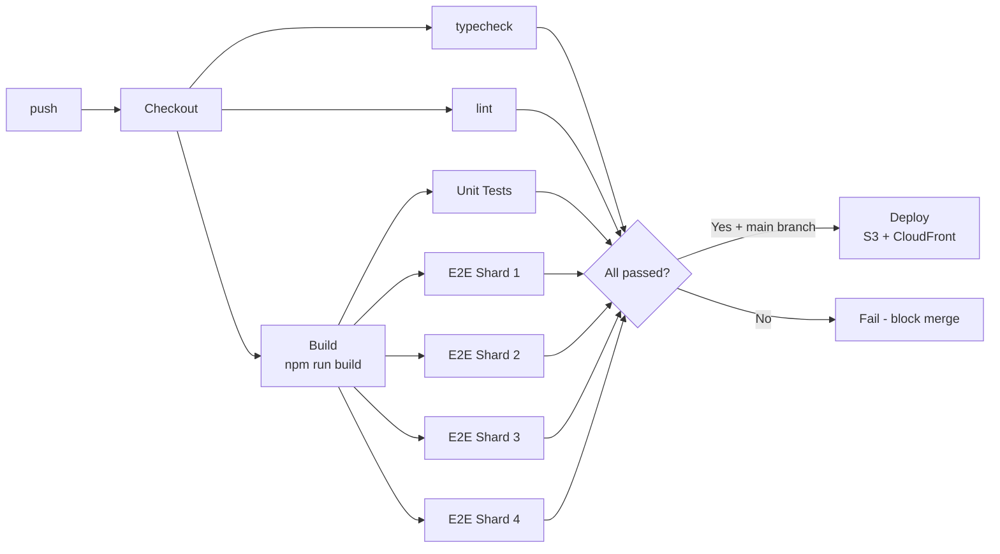

# Frontend Build Pipeline in CI/CD

---

### 🎯 Model Answer

**30 seconds:**

> A frontend CI pipeline has four stages: install (npm ci), build
> (webpack/Vite), test (jest + e2e), and deploy. Key optimizations:
> cache node_modules by lockfile hash, cache build artifacts by source
> hash, split E2E tests across parallel runners, gate deployment on
> all checks passing. Common failure modes: non-deterministic builds
> (missing env vars), E2E flakiness, and cache poisoning from bad key
> design. The build must be reproducible - same inputs always produce
> same output.

**Blank Mind Recovery:**

**(1) Restate:** "Frontend CI: install -> build -> test -> deploy.
Cache everything. Split E2E. Gate on all checks."

---

### 📘 Concept Explanation

**What it is:**

A frontend CI/CD pipeline automates the process from code push to
production deployment. It ensures every change is built reproducibly,
tested comprehensively, and deployed safely.

**The problem it solves:**

Manual deployments are error-prone: wrong environment variables,
missing build steps, untested code paths. CI enforces the full
pipeline on every change, catches issues before production, and
provides deployment audit trails.

**How it works:**

```
Frontend CI pipeline stages:

1. INSTALL
   npm ci (not npm install):
     - Reads package-lock.json exactly
     - Verifies integrity hashes (supply chain)
     - Fails if lockfile is out of sync with package.json
   Cache: key = hash(package-lock.json)

2. BUILD
   npm run build (webpack/Vite production build)
   Inputs: src/, public/, .env.production, tsconfig.json
   Outputs: dist/ (hashed filenames for cache busting)
   Cache: key = hash(src/ + config files)

3. TEST (parallel with build where possible)
   Unit tests: jest (fast, cached)
   Type check: tsc --noEmit (parallel with build)
   Lint: eslint (parallel with build)
   E2E tests: Playwright/Cypress (parallel runners)

4. DEPLOY
   Upload dist/ to CDN (S3 + CloudFront)
   Invalidate CDN cache for index.html
   Run smoke test against prod URL
   Rollback if smoke test fails

Environment management:
  Development: .env.local (never committed)
  Preview:     .env.preview (branch deployments)
  Staging:     .env.staging (pre-production)
  Production:  .env.production (secrets in CI secrets vault)

  Never commit .env files to git
  CI reads secrets from GitHub Actions secrets/OIDC
```

**The key insight:**

The build must be a pure function: same source code + same config +
same dependencies = same output. Any non-determinism (random seeds,
timestamps, file ordering) breaks caching and makes debugging
impossible. Deterministic builds also enable binary artifact promotion:
build once, deploy the same artifact to staging and production.

---

### 💻 Code Example

**Example 1: Complete GitHub Actions workflow**

```yaml
# .github/workflows/ci.yml
name: CI/CD

on:
  push:
    branches: [main]
  pull_request:

env:
  NODE_VERSION: '20'
  CACHE_VERSION: 'v1'  # bump to force full cache invalidation

jobs:
  # ─── Fast checks (parallel) ───────────────────────────────
  typecheck:
    runs-on: ubuntu-latest
    steps:
      - uses: actions/checkout@v4
      - uses: actions/setup-node@v4
        with: { node-version: '${{ env.NODE_VERSION }}', cache: 'npm' }
      - run: npm ci
      - run: npm run typecheck  # tsc --noEmit

  lint:
    runs-on: ubuntu-latest
    steps:
      - uses: actions/checkout@v4
      - uses: actions/setup-node@v4
        with: { node-version: '${{ env.NODE_VERSION }}', cache: 'npm' }
      - run: npm ci
      - run: npm run lint  # eslint

  # ─── Build (gates deploy) ─────────────────────────────────
  build:
    runs-on: ubuntu-latest
    outputs:
      # Pass artifact name to downstream jobs:
      artifact-name: build-${{ github.sha }}
    steps:
      - uses: actions/checkout@v4
      - uses: actions/setup-node@v4
        with: { node-version: '${{ env.NODE_VERSION }}', cache: 'npm' }
      - run: npm ci

      # Build cache: only rebuild when source changes:
      - uses: actions/cache@v3
        with:
          path: dist/
          key: >-
            ${{ env.CACHE_VERSION }}-dist-
            ${{ hashFiles('src/**', 'public/**',
                          'vite.config.*', 'tsconfig.json',
                          'package-lock.json') }}

      - name: Build
        env:
          VITE_API_URL: ${{ vars.VITE_API_URL }}
          VITE_STRIPE_KEY: ${{ vars.VITE_STRIPE_KEY }}
          # NOTE: only public vars prefixed VITE_
          # Secrets (like STRIPE_SECRET_KEY) must NOT go here
        run: npm run build

      # Upload build artifact (preserved between jobs):
      - uses: actions/upload-artifact@v4
        with:
          name: build-${{ github.sha }}
          path: dist/
          retention-days: 7

  # ─── Unit tests ────────────────────────────────────────────
  unit-test:
    runs-on: ubuntu-latest
    steps:
      - uses: actions/checkout@v4
      - uses: actions/setup-node@v4
        with: { node-version: '${{ env.NODE_VERSION }}', cache: 'npm' }
      - run: npm ci
      - run: npm test -- --coverage --ci

      - uses: actions/upload-artifact@v4
        if: always()
        with:
          name: coverage
          path: coverage/

  # ─── E2E tests (parallel sharding) ────────────────────────
  e2e:
    needs: build  # E2E tests need the built app
    runs-on: ubuntu-latest
    strategy:
      fail-fast: false  # run all shards even if one fails
      matrix:
        shard: [1, 2, 3, 4]
    steps:
      - uses: actions/checkout@v4
      - uses: actions/setup-node@v4
        with: { node-version: '${{ env.NODE_VERSION }}', cache: 'npm' }
      - run: npm ci

      # Download built app:
      - uses: actions/download-artifact@v4
        with:
          name: ${{ needs.build.outputs.artifact-name }}
          path: dist/

      - run: npx playwright install --with-deps chromium
      - run: >-
          npx playwright test
          --shard=${{ matrix.shard }}/4
          --reporter=blob

      - uses: actions/upload-artifact@v4
        if: always()
        with:
          name: blob-report-${{ matrix.shard }}
          path: blob-report/

  # ─── Deploy (only on main after all checks) ───────────────
  deploy:
    needs: [build, unit-test, e2e, typecheck, lint]
    runs-on: ubuntu-latest
    if: github.ref == 'refs/heads/main'
    environment: production
    permissions:
      id-token: write  # OIDC for AWS
      contents: read
    steps:
      - uses: actions/download-artifact@v4
        with:
          name: ${{ needs.build.outputs.artifact-name }}
          path: dist/

      # OIDC - no long-lived AWS credentials:
      - uses: aws-actions/configure-aws-credentials@v4
        with:
          role-to-assume: arn:aws:iam::ACCOUNT:role/frontend-deploy
          aws-region: us-east-1

      - name: Deploy to S3
        run: |
          # Upload immutable assets (long cache TTL):
          aws s3 sync dist/assets/ s3://my-bucket/assets/ \
            --cache-control "max-age=31536000,immutable" \
            --exclude "*.map"

          # Upload index.html (no cache):
          aws s3 cp dist/index.html s3://my-bucket/index.html \
            --cache-control "no-cache,no-store"

      - name: Invalidate CloudFront
        run: |
          aws cloudfront create-invalidation \
            --distribution-id $DISTRIBUTION_ID \
            --paths "/index.html"

      - name: Smoke test
        run: |
          sleep 30  # wait for CDN propagation
          curl -f https://myapp.com | grep -q "React App"
          echo "Smoke test passed"
```

> **Code walkthrough:** The pipeline design has two key properties:
> parallel fast checks (typecheck + lint + unit tests) run concurrently
> with the build, so total CI time is max(slowest parallel job) not
> sum. E2E tests are sharded across 4 runners to cut a 20-minute suite
> to 5 minutes. OIDC credentials (`id-token: write`) eliminate long-lived
> AWS keys from CI secrets - the runner gets a short-lived token scoped
> to the deployment role only. The build artifact is uploaded once and
> shared to both E2E and deploy jobs, ensuring both use exactly the
> same binary.

**Example 2: Non-deterministic build diagnosis and fix**

```bash
# Symptom: build succeeds on developer machine, fails in CI
# Or: two CI runs with same code produce different outputs

# Common causes and diagnosis:

# 1. Missing environment variable (most common)
# In CI, build fails with: "VITE_API_URL is not defined"
# Fix: add to GitHub Actions env: block
# Check: npm run build 2>&1 | grep "is not defined"

# 2. Different Node.js version
node --version        # local: v18.17.0
# CI: v20.10.0
# Some package has different behavior across Node versions
# Fix: pin node version in .nvmrc and GitHub Actions setup-node

# 3. File system ordering (webpack module ID instability)
# Symptom: chunk hashes change between identical builds
# Fix: webpack: deterministic module IDs
# Already default in webpack 5 production mode:
# optimization: { moduleIds: 'deterministic' }

# 4. Build timestamp in output
# BAD: output includes build timestamp
# const BUILD_TIME = new Date().toISOString();
# GOOD: use git commit SHA instead
# const BUILD_ID = process.env.GITHUB_SHA || 'local';

# 5. Random chunk filenames
# webpack 5 uses content hashes by default - deterministic
# Check: build twice, compare dist/
diff <(ls dist/assets/*.js) <(ls dist/assets/*.js) # expect empty
```

> **Code walkthrough:** Non-deterministic builds are subtle: the build
> appears to work but produces different output on repeat. The most
> common culprit is environment variables. Debug systematically: run
> the build twice with `--verbose`, compare dist/ checksums, look for
> anything that could change between runs (time, random values, env vars).
> A fully deterministic build: same source + same env + same deps +
> same Node version = byte-identical dist/.

---

### 📊 Diagram

```
Frontend CI Pipeline (parallel fast path)
-----------------------------------------
push  -> Checkout
          |
     ┌────┼────────────────┐
     |    |                |
  type- lint          npm ci + build
  check              (cache: lockfile+src)
     |    |                |
     |    |         ┌──────┴──────┐
     |    |       unit-test    e2e (x4 shards)
     |    |         |              |
     └────┴──────── merge results ─┘
                        |
                    deploy (main only)
                    S3 + CloudFront invalidation
```



> **Diagram walkthrough:** Parallelism is the key design choice.
> Typecheck and lint run without waiting for the build (they need
> only source files). The build artifact is shared to E2E tests and
> deploy - built once, used many times. Deploy gates on ALL jobs
> passing, enforcing that no check can be skipped. The total wall-clock
> time is roughly: max(typecheck, lint, build + e2e/4) rather than
> the sum of all jobs.

---

### 🏛️ System Design

**System Design: Frontend build pipeline with preview deployments**

```
Preview deployments: every PR gets its own URL
  Branch: feature/user-profile
  URL: https://pr-123.preview.myapp.com

Architecture:
  1. PR opened/updated -> CI triggers
  2. Build: same pipeline as production
  3. Deploy to S3: s3://my-bucket/previews/pr-123/
  4. CloudFront path-based routing:
     /previews/pr-123/* -> s3 origin
  5. GitHub status check: "Preview deployed: https://..."
  6. E2E tests run against preview URL (not localhost)

Benefits:
  - QA reviews actual deployed app (not localhost)
  - Screenshots/comparisons in PR comments
  - Parallel preview for multiple PRs

Cleanup:
  - PR closed -> delete S3 prefix + CloudFront path
  - Use GitHub Actions PR closed event

Cost management:
  - Static assets: minimal S3 + CloudFront cost
  - Limit preview TTL: auto-delete after 7 days
  - Share CDN distribution (only index.html per preview)
```

---

### ⚖️ Comparison Table

| CI pattern | Build time | Risk | Use when |
|---|---|---|---|
| Build once, deploy same artifact | Slower | Low | Production (correctness) |
| Build per env (dev/stg/prod) | Fast per env | Medium | Env-specific optimizations |
| Skip build (use cache) | Instant | Low (if inputs match) | Turborepo cache hits |
| Build on deploy server | Fast start | High (env diff) | Never (non-reproducible) |

---

### 🎓 Answers by Seniority

**Junior / Mid:**

> The CI pipeline has these stages: install (`npm ci`), build
> (`npm run build`), test (unit + E2E), deploy. I cache node_modules
> by the lockfile hash to speed up installs. Tests run after the build,
> and deploy only happens on main branch when all tests pass.

**Senior / Staff:**

> I design frontend CI for three properties: fast feedback (parallel
> jobs, E2E sharding), reproducible builds (deterministic webpack IDs,
> pinned Node version, OIDC not static credentials), and safe deployments
> (artifact promotion - build once, deploy same artifact to staging and
> prod). The highest-value optimizations at scale: Turborepo remote
> caching for monorepos, E2E test sharding to prevent 20-minute suite
> from blocking PRs, and OIDC credentials to eliminate long-lived AWS
> secrets. Preview deployments (per-PR preview URLs) are essential for
> teams over 10 engineers - QA needs to test actual deployed output.

---

### ⚠️ Common Misconceptions

**Misconception 1: Running `npm install` in CI is equivalent to `npm ci`.**

`npm install` modifies package-lock.json if dependencies are inconsistent.
`npm ci` fails if lockfile is out of sync - catching config errors.
`npm ci` also verifies package integrity hashes. Always use `npm ci` in CI.

**Misconception 2: Caching the build output by commit SHA speeds up CI.**

SHA-based cache is almost always a miss (every commit has a unique SHA).
Cache by content hash of source files instead, so unchanged code reuses
the cache across multiple commits.

---

### 🚨 Failure Modes and Diagnosis

**Failure: Deploy succeeds but users see the old version.**

Cause: CloudFront serving cached `index.html`.

Fix: Never cache `index.html` (`Cache-Control: no-cache`). Assets use
content-hashed filenames and can have long TTL.

**Failure: E2E tests pass in CI but fail in production.**

Cause: Tests run against preview environment with test data; prod has
different state/config.

Fix: Smoke tests against production after deploy; keep a small suite
of read-only E2E tests that run against production on schedule.

**Failure: Build works locally but fails in CI with "file not found".**

Cause: Case-sensitivity (macOS filesystem is case-insensitive; Linux CI
is case-sensitive). Import `./Components/Button` vs `./components/Button`.

Fix: ESLint `import/no-unresolved` with case-sensitive option; enforce
in CI before this reaches production.

---

### 🎯 Interview Deep-Dive

| Question | Type | Difficulty | Time |
|---|---|---|---|
| Design a frontend CI pipeline | Design | ★★★ | 8 min |
| Why `npm ci` instead of `npm install`? | Mechanism | ★★☆ | 2 min |
| How to cache the frontend build in CI? | Scenario | ★★☆ | 3 min |
| What is OIDC and why use it vs static credentials? | Security | ★★★ | 4 min |
| How to implement preview deployments? | Design | ★★★ | 5 min |
| Diagnose: build works locally, fails in CI | Debugging | ★★★ | 4 min |
| E2E test sharding - how to implement? | Scenario | ★★★ | 3 min |
| Why never cache index.html at the CDN? | Mechanism | ★★☆ | 2 min |
| Non-deterministic builds - causes and fixes | Debugging | ★★★ | 4 min |
| CI security: secret management for builds | Security | ★★★ | 4 min |
| Build artifact promotion vs rebuild per env | Trade-off | ★★★ | 3 min |
| Smoke tests after deployment - design | Design | ★★★ | 3 min |

**Q: Design a complete frontend CI pipeline for a production app.**

A: I'd design this with four properties: fast feedback, reproducibility,
security, and safe deployment.

Stage 1 - Validation (parallel, ~30s):
Three parallel jobs: typecheck (`tsc --noEmit`), lint (`eslint`), and
security audit (`npm audit --audit-level=high --omit=dev`). These only
need source files - they don't wait for the build.

Stage 2 - Build (~60s):
Single job: `npm ci` (lockfile-verified install), then `npm run build`.
Cache: `actions/cache` keyed on hash of `src/`, `public/`, config files,
and lockfile. Cache hit: skip build entirely. Cache miss: build and
update cache. Upload dist/ as an artifact for downstream jobs.

Stage 3 - Test (parallel with build where possible, ~2min):
Unit tests: run as a separate job parallel with build (source only needed).
E2E tests: 4 shards (`--shard=N/4`), download build artifact, serve
locally or against preview URL.

Stage 4 - Deploy (main branch only, needs all previous):
Download build artifact (not rebuild). OIDC credentials to AWS (no
long-lived secrets). Upload immutable assets to S3 with
`Cache-Control: max-age=31536000,immutable`. Upload index.html with
`Cache-Control: no-cache`. Invalidate CloudFront for index.html only.
Smoke test the production URL.

Key decisions: artifact promotion (build once, use the same binary
for staging and prod); OIDC over static credentials; E2E sharding
to prevent the test suite from being the bottleneck; never cache
index.html (stale HTML causes broken asset loading after deploy).

*What separates good from great:* Treating the CI pipeline as a
product with an SLO: "P50 time to green < 5 minutes for a typical
PR." Measure it, alert on regressions, and continuously optimize.
Also: rollback strategy - if smoke tests fail, automatically re-deploy
the previous artifact (not a rebuild). This makes rollback instant
because the previous build artifact is still in S3/artifact storage.

**Q: Explain OIDC credentials for CI deployments.**

A: OIDC (OpenID Connect) for CI solves the "secret zero" problem: how
do you securely give CI access to production infrastructure without
storing long-lived credentials?

Traditional approach: Generate an AWS IAM access key + secret, store
in GitHub Actions secrets. Problem: these keys are long-lived, broad-
scoped, and a leak exposes production indefinitely.

OIDC approach: GitHub Actions is a trusted identity provider. When a
workflow runs, GitHub provides a short-lived JWT token that identifies
the specific repo, branch, and workflow. AWS is configured to trust
GitHub's OIDC provider. The AWS role's trust policy specifies: "trust
tokens from github.com, for repo=myorg/myrepo, branch=main."

In the workflow:
```yaml
permissions:
  id-token: write
steps:
  - uses: aws-actions/configure-aws-credentials@v4
    with:
      role-to-assume: arn:aws:iam::ACCOUNT:role/frontend-deploy
```

The runner receives a short-lived AWS session token (1 hour default)
with only the permissions defined in the `frontend-deploy` role (S3
write to specific bucket, CloudFront invalidation). No long-lived
credentials anywhere in GitHub secrets.

Security properties: token expires in 1 hour; scoped to specific
branch/repo; breach of the token is time-limited; no credentials
to rotate.

*What separates good from great:* Further scoping the OIDC trust to
the specific branch (`sub` claim containing `ref:refs/heads/main`)
so that PRs from forks cannot request production credentials even if
the workflow file is modified. Defense-in-depth: even if a supply
chain attack in a dependency exfiltrates the runner's environment,
the token only works for 1 hour and only for the specific AWS resources.
