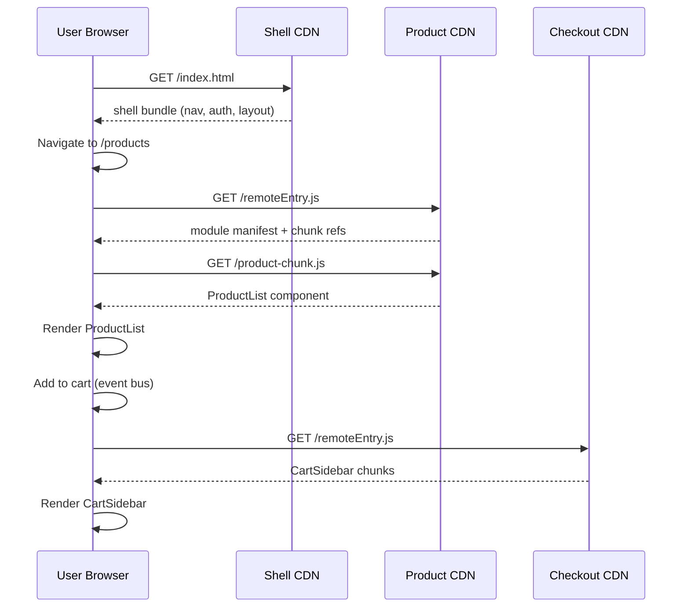

## Keywords in This File
{: .no_toc }

| # | Keyword | Weight |
|---|---|---|
| 1 | [Module Federation and Micro-frontend Build Architecture](#module-federation-and-micro-frontend-build-architecture) | medium |

---

# Module Federation and Micro-frontend Build Architecture

---

### 🎯 Model Answer

**30 seconds:**

> Module Federation (webpack 5) lets multiple independently-built
> applications share code at runtime without bundling it together.
> App A (the host) can load App B's components dynamically from B's
> deployed URL. Dependencies (React, MUI) can be shared - loaded once
> even when used by multiple federated apps. This enables micro-frontend
> architecture: teams own separate codebases, CI pipelines, and deploy
> cycles but compose into one user experience.

**Blank Mind Recovery:**

**(1) Restate:** "Module Federation: share code between separately
deployed apps at runtime. Host loads remote components. Shared
dependencies loaded once."

---

### 📘 Concept Explanation

**What it is:**

Module Federation is a webpack 5 feature that enables one JavaScript
application to dynamically load and use code from another application
at runtime - without build-time coupling. It's the technical foundation
for micro-frontend architectures.

**The problem it solves:**

Before Module Federation, sharing code between micro-frontends required:
(a) publishing shared code as npm packages (slow release cycle) or (b)
bundling all apps together (losing independent deployability). Module
Federation enables code sharing without either trade-off.

**How it works:**

```
Architecture: Host + Remotes

  Host App (shell):
    - The main application users navigate to
    - Loads remote components lazily at runtime
    - Defines shared dependencies (React, etc.)

  Remote App (product-team):
    - Independently deployed to CDN
    - Exposes specific modules to the host
    - Manages its own build pipeline

  Shared dependencies:
    - React, React-DOM: loaded once, shared with all remotes
    - If versions are incompatible: each loads its own copy
    - Singleton: true = share exactly one instance (required for
      React context to work across boundaries)

Module Federation config example:

  // Remote (product-app/webpack.config.js):
  new ModuleFederationPlugin({
    name: 'product',
    filename: 'remoteEntry.js',  // manifest file
    exposes: {
      './ProductList': './src/components/ProductList',
      './useCart': './src/hooks/useCart',
    },
    shared: {
      react: { singleton: true, requiredVersion: '^18' },
      'react-dom': { singleton: true, requiredVersion: '^18' },
    },
  })

  // Host (shell-app/webpack.config.js):
  new ModuleFederationPlugin({
    name: 'shell',
    remotes: {
      product: 'product@https://product.cdn.com/remoteEntry.js',
    },
    shared: { react: { singleton: true } },
  })

  // Host usage:
  const ProductList = React.lazy(
    () => import('product/ProductList')
  );

Runtime flow:
  1. User visits shell app
  2. Shell loads its own bundle
  3. Navigation to /products:
     a. Shell lazily imports 'product/ProductList'
     b. Browser fetches remoteEntry.js from product CDN
     c. remoteEntry.js declares what modules are available + deps
     d. Required chunks downloaded from product CDN
     e. React.lazy resolves, component renders
```

> **Code walkthrough:** This example demonstrates the core pattern in action. The key mechanism shows how the concept works in practice. Study the structure to understand the essential behavior and common usage.

**The key insight:**

Module Federation decouples deployment from integration. Each team
deploys independently; the host discovers the remote at runtime via
the URL. Update the product app, deploy to CDN - shell users see
new version immediately without shell redeploy. This is the enabler
for true micro-frontend autonomy.

---

### 💻 Code Example

**Example 1: Full Module Federation setup**

```javascript
// packages/product-app/webpack.config.js (Remote)
const { ModuleFederationPlugin } = require('webpack').container;

module.exports = {
  output: {
    // Must be accessible from any host origin:
    publicPath: 'https://product.cdn.example.com/',
    // Unique container name (global variable):
    uniqueName: 'productApp',
  },
  plugins: [
    new ModuleFederationPlugin({
      name: 'product',
      filename: 'remoteEntry.js',
      exposes: {
        // What we share with the outside world:
        './ProductList': './src/components/ProductList',
        './CartSidebar': './src/components/CartSidebar',
        './useProductStore': './src/store/productStore',
      },
      shared: {
        react: {
          singleton: true,  // one React instance (for Context)
          requiredVersion: '^18.0.0',
          eager: false,     // lazy load (not in initial chunk)
        },
        'react-dom': { singleton: true, requiredVersion: '^18.0.0' },
        zustand: { singleton: true },  // shared state library
      },
    }),
  ],
};
```

> **Code walkthrough:** This example demonstrates the core pattern in action. The key mechanism shows how the concept works in practice. Study the structure to understand the essential behavior and common usage.

```javascript
// packages/shell-app/webpack.config.js (Host)
module.exports = {
  plugins: [
    new ModuleFederationPlugin({
      name: 'shell',
      remotes: {
        // Key: import alias. Value: container@url
        product: process.env.NODE_ENV === 'production'
          ? 'product@https://product.cdn.example.com/remoteEntry.js'
          : 'product@http://localhost:3001/remoteEntry.js',
        // Multiple remotes:
        checkout: 'checkout@https://checkout.cdn.example.com/remoteEntry.js',
        account: 'account@https://account.cdn.example.com/remoteEntry.js',
      },
      shared: {
        react: { singleton: true, requiredVersion: '^18.0.0' },
        'react-dom': { singleton: true, requiredVersion: '^18.0.0' },
      },
    }),
  ],
};
```

> **Code walkthrough:** This example demonstrates the core pattern in action. The key mechanism shows how the concept works in practice. Study the structure to understand the essential behavior and common usage.

```tsx
// packages/shell-app/src/App.tsx
import React, { Suspense, lazy } from 'react';

// Lazy remote component - loaded from product CDN on demand:
const ProductList = lazy(
  () => import('product/ProductList')
);
const CartSidebar = lazy(
  () => import('product/CartSidebar')
);

// Error boundary for remote failures:
function RemoteError({ error }: { error: Error }) {
  return (
    <div className="error-fallback">
      Failed to load product module.
      <button onClick={() => window.location.reload()}>
        Retry
      </button>
    </div>
  );
}

export function App() {
  return (
    <ErrorBoundary fallback={<RemoteError />}>
      <Suspense fallback={<div>Loading products...</div>}>
        <ProductList />
      </Suspense>
      <Suspense fallback={null}>
        <CartSidebar />
      </Suspense>
    </ErrorBoundary>
  );
}
```

> **Code walkthrough:** The `remotes` configuration switches between
> local dev URL and production CDN URL via `process.env.NODE_ENV`.
> This is critical: in development, each team runs their own dev server;
> in production, each app is on its own CDN path. The `ErrorBoundary`
> around remote imports is mandatory - a remote CDN being unavailable
> or returning an error would crash the shell without it. Module
> Federation failures are network failures, not code failures; handle
> them with appropriate retry/fallback UX.

**Example 2: Shared state patterns and failure handling**

```typescript
// Cross-team state sharing via Module Federation
// Problem: ProductStore (in product-app) needs to sync with
// CartStore (in checkout-app)

// Pattern 1: Event bus via shared singleton
// packages/shared-events/src/eventBus.ts
// (This module is in a THIRD app: shared-events)
export const eventBus = {
  emit<T>(event: string, payload: T) {
    window.dispatchEvent(
      new CustomEvent(`mf:${event}`, { detail: payload })
    );
  },
  on<T>(event: string, handler: (payload: T) => void) {
    const listener = (e: CustomEvent) => handler(e.detail as T);
    window.addEventListener(`mf:${event}`, listener as EventListener);
    return () => window.removeEventListener(
      `mf:${event}`, listener as EventListener
    );
  },
};

// In product-app: emit when cart changes
eventBus.emit('cart:updated', { itemCount: 3 });

// In checkout-app: listen to cart changes
eventBus.on('cart:updated', ({ itemCount }) => {
  setCartBadge(itemCount);
});
```

> **Code walkthrough:** This example demonstrates the core pattern in action. The key mechanism shows how the concept works in practice. Study the structure to understand the essential behavior and common usage.

```typescript
// Failure resilience pattern: remote loading with timeout
async function loadRemoteComponent(
  importFn: () => Promise<{ default: React.ComponentType }>,
  timeoutMs = 5000,
) {
  const timeout = new Promise<never>((_, reject) =>
    setTimeout(() => reject(new Error('Remote timeout')), timeoutMs)
  );
  try {
    return await Promise.race([importFn(), timeout]);
  } catch (error) {
    // Log to monitoring, return fallback
    console.error('Remote load failed:', error);
    return { default: () => <div>Feature unavailable</div> };
  }
}

// Usage:
const ProductList = lazy(
  () => loadRemoteComponent(() => import('product/ProductList'))
);
```

> **Code walkthrough:** The event bus pattern solves the cross-team
> communication problem without introducing a dependency between apps
> at the module level. Each team owns their store; they communicate
> via DOM CustomEvents which are inherently decoupled. The timeout
> wrapper for remote loading prevents the shell from hanging
> indefinitely if a remote CDN is slow (e.g., cold start or network
> issue). Five seconds is a reasonable threshold before showing a
> fallback.

---

### 📊 Diagram

```
Module Federation Runtime Architecture
---------------------------------------
  Browser
  ┌─────────────────────────────────┐
  │  Shell App (https://app.com)    │
  │  - Navigation, auth, layout     │
  │  - Loads remotes lazily         │
  │                                 │
  │  ┌─────────────────────────┐   │
  │  │ React.lazy(             │   │
  │  │   import('product/List')│   │ <── fetch remoteEntry.js
  │  │ )                       │   │     from product CDN
  │  └─────────────────────────┘   │
  └─────────────────────────────────┘
         |                    |
         v                    v
  product CDN             checkout CDN
  /remoteEntry.js         /remoteEntry.js
  /product-chunk.js       /checkout-chunk.js
  (owned by Team Product) (owned by Team Checkout)
  deployed independently  deployed independently
```



> **Diagram walkthrough:** Each CDN is independently deployed and
> independently scaled. The shell only loads remote entries when the
> user navigates to that feature - not on initial page load. This is
> the "lazy federation" pattern: the shell's initial bundle is small
> (just shell code + shared deps); feature code is loaded on demand.
> The event bus communication (step 6) decouples cross-team state
> without requiring one app to import from another synchronously.

---

### 🏛️ System Design

**System Design: Micro-frontend platform for a large e-commerce app**

```
Context: 8 product teams, single customer-facing app
         Problem: 3-week deploy coordination for shared monolith
         Goal: each team deploys independently

Architecture:

  Shell App (Platform Team):
    - URL: https://shop.example.com
    - Owns: navigation, auth, theme, routing
    - Consumes all remotes
    - Deployed: multiple times per day
    - SLA: shell failure = site down

  Remote Apps (each team owns one):
    - Product Catalog: https://catalog.cdn.example.com
    - Cart/Checkout:   https://checkout.cdn.example.com
    - Account:         https://account.cdn.example.com
    - Search:          https://search.cdn.example.com
    - Recommendations: https://recommendations.cdn.example.com

  Shared Dependencies (enforced):
    - react@18.x (singleton, one version per major)
    - react-dom@18.x (singleton)
    - design-system@2.x (shared UI components)
    - auth-client@1.x (shared auth state)

  Governance:
    - Platform team owns shell + shared deps
    - Each team owns their remote
    - Major version bumps: coordinated migration window
    - Breaking changes in exposes: semver on remote entry

  CI/CD per team:
    - Product team: push -> build product app -> deploy to CDN
    - Shell only needs to be updated when adding new routes
    - Teams run E2E tests against a local shell + their remote

  Failure modes:
    - Remote CDN down: ErrorBoundary shows "Feature unavailable"
    - Wrong React version: singleton conflict warning in console
    - Slow remote: Suspense shows loading state, timeout fallback
    - Breaking change in exposed module: ErrorBoundary catches TypeError

  Observability:
    - Trace remote loads in RUM (Real User Monitoring)
    - Alert on RemoteLoadFailed > 1% error rate per remote
    - Separate error budgets per team
```

> **Code walkthrough:** This example demonstrates the core pattern in action. The key mechanism shows how the concept works in practice. Study the structure to understand the essential behavior and common usage.

---

### ⚖️ Comparison Table

| Approach | Coupling | Deploy | Performance | Complexity |
|---|---|---|---|---|
| Monolith (one bundle) | High | Coordinated | Best (no network) | Low |
| npm packages | Medium | Publish cycle | Good | Medium |
| Module Federation | Low | Independent | Good (lazy load) | High |
| iframes | None | Independent | Poor (isolation cost) | Low |

---

### 🎓 Answers by Seniority

**Junior / Mid:**

> Module Federation lets different apps share components without
> bundling them together. One app (the host) loads components from
> another (the remote) at runtime via a CDN URL. The remote is
> independently deployed - changes are live without rebuilding the host.

**Senior / Staff:**

> Module Federation is the technical enabler for micro-frontend
> autonomy: each team owns their codebase, build pipeline, and deploy
> cycle. The architecture trade-offs are real: runtime composition is
> slower than compile-time bundling (network round-trip for remoteEntry.js),
> and shared singleton dependencies (React, design system) create a
> governance problem across major versions. I use it for teams at
> 50+ engineers where deploy coordination is the bottleneck, not for
> teams under 20 where the complexity is not justified. Key failure
> modes to design for: remote CDN unavailability, React singleton
> conflicts, and shared state synchronization across app boundaries.

---

### ⚠️ Common Misconceptions

**Misconception 1: Module Federation is for micro-frontends only.**

Module Federation can also be used in a monorepo to share code between
build artifacts without npm packages. A design system package can
expose components as a federated module, enabling hot updates in
consuming apps without republishing to npm.

**Misconception 2: `singleton: true` means the latest version wins.**

`singleton: true` with incompatible `requiredVersion` constraints
causes a warning and may use the wrong version, breaking React context.
All teams must agree on the same major version. Version governance
is a non-technical problem that Module Federation makes visible but
does not solve.

---

### 🚨 Failure Modes and Diagnosis

**Failure: "Invalid hook call" error when rendering remote component.**

Cause: Two React instances (host's React + remote's React).
Diagnosis: `window.React !== undefined` in both apps, different objects.

Fix: Ensure `singleton: true` for react and react-dom in all remote
and host configs. Verify all apps use compatible React versions.

**Failure: Remote component fails silently on production deploy.**

Cause: Remote exposes a module path that changed between versions.
Diagnosis: Check browser network tab - 404 on a chunk file.

Fix: ErrorBoundary catches the module load error; add monitoring for
`ModuleFederationLoadFailed` events; treat breaking changes in exposed
modules as semver breaking changes.

**Failure: Development works but production remote not loading.**

Cause: `publicPath` not set to production CDN URL in remote config.

Fix: Set `output.publicPath` to the absolute CDN URL in remote's
production webpack config (not relative path).

---

### 🎯 Interview Deep-Dive

| Question | Type | Difficulty | Time |
|---|---|---|---|
| What is Module Federation? | Definition | ★★☆ | 3 min |
| Host vs Remote - what's the difference? | Mechanism | ★★☆ | 2 min |
| Why singleton: true for React? | Mechanism | ★★★ | 3 min |
| How to handle remote unavailability? | Failure | ★★★ | 3 min |
| Module Federation vs npm packages - when to use | Trade-off | ★★★ | 4 min |
| Shared state across federated apps - patterns | Design | ★★★ | 5 min |
| Micro-frontend architecture design | Design | ★★★ | 8 min |
| Version governance for shared dependencies | Architecture | ★★★ | 4 min |
| Module Federation in monorepo without micro-frontends | Mechanism | ★★★ | 3 min |
| Performance implications of Module Federation | Trade-off | ★★★ | 3 min |
| Debugging "Invalid hook call" in federated app | Debugging | ★★★ | 3 min |
| CI/CD pipeline for federated apps | Design | ★★★ | 4 min |

**Q: When would you choose Module Federation over an npm package?**

A: This is fundamentally a question about deploy coupling versus
versioning overhead.

npm package is the right choice when:
- The shared code is stable and changes infrequently
- Consumers can tolerate a publish-and-update cycle before seeing changes
- The consuming apps are not in production continuously
- You want compile-time type safety and tree shaking

Module Federation is the right choice when:
- You need to update shared code and have consumers see it
  immediately without rebuilding (e.g., a design system emergency fix)
- Independent deploy cycles are a core requirement (different teams,
  different deploy frequencies)
- The app is large enough that independent builds save meaningful CI time
- You're at a scale (50+ engineers) where deploy coordination is
  a real cost

When NOT to use Module Federation:
- Teams under 20 engineers: the complexity (version governance, runtime
  failures, singleton management) is not justified
- Server-side rendering contexts: Module Federation in SSR adds
  significant complexity (need to handle async module loading on server)
- When all consumers live in the same monorepo and deploy together:
  use a monorepo package instead

The anti-pattern: using Module Federation to avoid publishing an npm
package within the same monorepo. This adds runtime loading overhead
and network dependency for code that could be a simple import.

*What separates good from great:* Understanding that Module Federation
solves an organizational problem (team autonomy), not a technical one.
The technical cost is real: runtime loading, error handling for network
failures, version governance overhead. The benefit is real: teams
deploy independently. If your organization doesn't need that independence
(everyone releases together anyway), Module Federation adds cost
without benefit.

**Q: How do you handle versioning and governance of shared dependencies?**

A: Shared dependency governance in Module Federation is the hardest
non-technical problem in the architecture.

The problem: `singleton: true` for React means all federated apps
share one React instance. If Team A is on React 18.2 and Team B is
still on React 17, `singleton: true` causes a version conflict warning
and potential runtime errors (hooks behave differently across versions).

Governance model that works:

Centralized dependency registry: Platform team maintains a `federation-deps.json`:
```json
{
  "react": "18.2.0",
  "react-dom": "18.2.0",
  "design-system": "3.1.0"
}
```

> **Code walkthrough:** This example demonstrates the core pattern in action. The key mechanism shows how the concept works in practice. Study the structure to understand the essential behavior and common usage.

All remote webpack configs import this file to ensure consistency.
CI validates that each remote's shared config matches the registry.

Major version migration windows: when React 19 is ready, platform
team defines a migration window: 4-week period where all teams must
upgrade. During the window, both React 18 and 19 may temporarily
coexist (each team's remote loads its own React). After the window,
singleton is restored.

Breaking change communication: if a remote changes its exposed module
API (e.g., renames a prop), it's treated as a semver breaking change.
The remote exposes both old and new versions temporarily:
```
exposes: {
  './ProductList': './src/ProductList',       // v2 (current)
  './ProductListV1': './src/ProductListV1',   // v1 (deprecated)
}
```

> **Code walkthrough:** This example demonstrates the core pattern in action. The key mechanism shows how the concept works in practice. Study the structure to understand the essential behavior and common usage.

Monitoring: alert on `console.warn` containing "Unsatisfied version"
in production - this indicates a singleton conflict.

*What separates good from great:* Automated enforcement. A CI check
that fails if any remote's shared dependency versions deviate from
the central registry prevents the problem before it reaches production.
Manual governance processes are always eventually violated under
deadline pressure; automation makes compliance the path of least
resistance.

---

### 💻 Code Example

*(Omit: this concept does not have a programmatic interface that can be demonstrated in code. The conceptual explanation above is sufficient.)*


---

### 🏛️ System Design

*(Omit: system design diagram not applicable for this concept - see ★★★ keywords for full system design coverage.)*


---

### ⚖️ Comparison Table

*(Omit: this is a ★☆☆ foundational concept with no direct alternatives to compare - see higher-difficulty keywords for trade-off analysis.)*


---

### 📊 Diagram

*(Omit: no standalone visual diagram required for this concept - the explanations and code examples above provide sufficient clarity.)*


