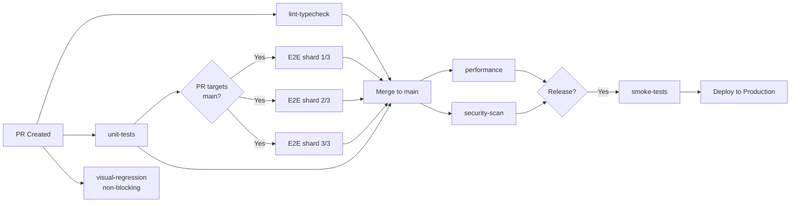

## Keywords in This File
{: .no_toc }

| # | Keyword | Weight |
|---|---|---|
| 1 | [Frontend Testing Strategy in CI/CD](#frontend-testing-strategy-in-cicd) | medium |

---

# Frontend Testing Strategy in CI/CD

---

### 🎯 Model Answer

**30 seconds:**

> Frontend CI testing strategy: parallel jobs by test type (unit,
> integration, E2E run simultaneously), fail-fast on unit tests first,
> E2E only on trunk or pre-release branches. Gate merges on unit +
> component tests (fast, <2 min). E2E runs post-merge or on schedule
> to avoid blocking every PR. Use test sharding for large E2E suites.
> Cache node_modules and Playwright browsers. Visual regression
> (Chromatic) runs on PR but doesn't block merge - requires human review.

**3 minutes:**

The fundamental CI strategy question is: which tests run on every PR
and which tests run less frequently?

**Testing frequency by layer:**

| Layer | When to run | Blocks merge? | Target time |
|---|---|---|---|
| Unit/component (Jest/Vitest) | Every PR | Yes | < 2 min |
| Integration (component + RTL) | Every PR | Yes | < 5 min |
| E2E (Playwright/Cypress) | Pre-merge to main | Yes | < 15 min |
| Visual regression (Chromatic) | Every PR | No (review) | < 5 min |
| Accessibility (axe) | Every PR | Yes | < 5 min |
| Performance (Lighthouse CI) | Pre-release | No | ~10 min |

**Sharding** splits a large test suite across N workers running in
parallel. Playwright's `--shard=1/4` flag: 4 GitHub Actions jobs each
run 1/4 of the E2E tests simultaneously, reducing wall clock time by
~75%.

**Caching** is the most impactful CI speed lever: `node_modules` install
takes 2-5 minutes; cached installs take <10 seconds. Playwright browsers
(~150MB) take 1 minute to download; cached versions take seconds.

**Blank Mind Recovery:**

**(1) Gate strategy:** "Unit tests: block every PR. E2E: block merge to
main (not every PR). Performance: informational."

**(2) Speed levers:** "Parallel jobs. Sharding. Cache node_modules and
browsers."

**(3) E2E frequency:** "E2E on every PR is expensive. Run on pull-request
to main only, or post-merge to main."

---

### 📘 Concept Explanation

**What it is:**

The architecture for running frontend tests in CI/CD pipelines:
which tests run when, in what order, with what blocking policy.

**The problem it solves:**

Running all tests sequentially for every PR makes CI 30+ minutes.
Engineers skip the wait (bypass CI checks) or work around slow pipelines.
A strategically structured pipeline gives fast feedback for common
failures while maintaining full coverage for release.

**How it works:**

```
Frontend CI pipeline architecture:

  PR opened:
    Parallel jobs:
      job: lint-typecheck (fast: ~30s)
      job: unit-tests (target: <3min)
        Jest/Vitest: all unit + component tests
        Coverage threshold check
      job: visual-regression (non-blocking)
        Chromatic: capture stories, flag diffs for review
    All jobs run simultaneously

  PR to main branch (pre-merge):
    Sequential: lint-typecheck -> unit-tests
    Parallel after passing:
      job: e2e-chromium (Playwright, shard 1/3)
      job: e2e-firefox  (Playwright, shard 2/3)
      job: e2e-webkit   (Playwright, shard 3/3)
    Required to pass: all jobs above

  Post-merge to main:
    job: performance (Lighthouse CI)
    job: security-scan (OWASP ZAP, Snyk)
    job: accessibility-audit (full page axe)
    Non-blocking; notify Slack on failure

  Pre-release (before production deploy):
    job: full-suite-regression
    job: smoke-tests (production-like environment)
    Blocking: must pass for deploy to proceed

GitHub Actions parallelism:
  Separate test types into separate jobs (not steps)
  Jobs run in parallel; steps run sequentially
  Cache: actions/cache for node_modules, Playwright browsers

Playwright sharding (GitHub Actions):
  jobs:
    test:
      strategy:
        matrix:
          shardIndex: [1, 2, 3, 4]
          shardTotal: [4]
      steps:
        - run: npx playwright test --shard=${{
            matrix.shardIndex }}/${{ matrix.shardTotal }}
  4 parallel jobs: 60 E2E tests -> ~15 tests each
  Wall clock: 20 min -> ~5 min
```

> **Code walkthrough:** This example demonstrates the core pattern in action. The key mechanism shows how the concept works in practice. Study the structure to understand the essential behavior and common usage.

---

### 💻 Code Example

**Example (Production) - GitHub Actions frontend CI:**

```yaml
# .github/workflows/ci.yml
name: Frontend CI

on:
  pull_request:
    branches: [main, develop]
  push:
    branches: [main]

jobs:
  # Fast feedback: lint + type check (<30s)
  quality:
    runs-on: ubuntu-latest
    steps:
      - uses: actions/checkout@v4
      - uses: actions/setup-node@v4
        with:
          node-version: '20'
          cache: 'npm'
      - run: npm ci
      - run: npm run lint
      - run: npm run typecheck

  # Unit + component tests (<3 min)
  unit-tests:
    runs-on: ubuntu-latest
    needs: quality
    steps:
      - uses: actions/checkout@v4
      - uses: actions/setup-node@v4
        with:
          node-version: '20'
          cache: 'npm'
      - run: npm ci
      - run: npm run test:coverage
      - name: Upload coverage
        uses: codecov/codecov-action@v4

  # E2E tests with sharding (runs only on main PR)
  e2e:
    if: github.base_ref == 'main'
    runs-on: ubuntu-latest
    needs: unit-tests
    strategy:
      fail-fast: false
      matrix:
        shardIndex: [1, 2, 3]
        shardTotal: [3]
    steps:
      - uses: actions/checkout@v4
      - uses: actions/setup-node@v4
        with:
          node-version: '20'
          cache: 'npm'
      - run: npm ci
      - name: Cache Playwright browsers
        uses: actions/cache@v4
        with:
          path: ~/.cache/ms-playwright
          key: playwright-${{ hashFiles('package-lock.json') }}
      - run: npx playwright install --with-deps chromium
      - name: Start dev server
        run: npm run build && npm run preview &
      - name: Wait for server
        run: npx wait-on http://localhost:4173
      - name: Run E2E tests (shard ${{
          matrix.shardIndex }}/${{ matrix.shardTotal }})
        run: >
          npx playwright test
          --shard=${{ matrix.shardIndex }}/${{ matrix.shardTotal }}
      - name: Upload Playwright report
        if: failure()
        uses: actions/upload-artifact@v4
        with:
          name: playwright-report-${{ matrix.shardIndex }}
          path: playwright-report/

  # Visual regression (non-blocking, requires human review)
  visual-regression:
    runs-on: ubuntu-latest
    steps:
      - uses: actions/checkout@v4
        with:
          fetch-depth: 0
      - uses: actions/setup-node@v4
        with:
          node-version: '20'
          cache: 'npm'
      - run: npm ci
      - name: Publish to Chromatic
        uses: chromaui/action@v11
        with:
          projectToken: ${{ secrets.CHROMATIC_PROJECT_TOKEN }}
          exitZeroOnChanges: true  # non-blocking: review required
```

> **Code walkthrough:** The pipeline uses four key patterns. First,
> `needs:` creates a dependency graph: E2E doesn't start until unit
> tests pass (fail-fast). Second, `if: github.base_ref == 'main'`
> gates expensive E2E tests to PRs targeting the main branch only -
> feature branch PRs skip E2E. Third, the matrix strategy runs 3 E2E
> jobs in parallel (shard 1/3, 2/3, 3/3), each running 33% of tests.
> Fourth, `exitZeroOnChanges: true` in Chromatic makes visual regression
> non-blocking - it captures diffs for human review but doesn't fail
> the PR. The Playwright browser cache key is based on `package-lock.json`
> hash, so browsers are re-downloaded only when Playwright version changes.

---

### 📊 Diagram

```
Frontend CI/CD pipeline (PR to main):

  PR created:
  ├── lint-typecheck ──────────────────┐
  ├── unit-tests ──────────────────────┤ All parallel
  └── visual-regression (non-blocking)─┘

  If PR targets main:
  └── e2e (after unit-tests passes):
      ├── e2e-shard-1/3
      ├── e2e-shard-2/3
      └── e2e-shard-3/3

  Post-merge to main:
  ├── performance (Lighthouse CI)
  └── security-scan

  Pre-release deploy gate:
  └── smoke-tests (prod-like environment)
```



> **Diagram walkthrough:** The pipeline is organized around two principles:
> fast feedback first (lint + unit tests run immediately on PR creation)
> and blocking on the minimum required. Visual regression runs non-blocking
> because it requires human review, not automated pass/fail. E2E is
> gated to main-targeting PRs only - feature branch PRs get unit tests
> only (<2 min). The post-merge jobs run asynchronously and notify
> on failure without blocking the next PR.

---

### ⚖️ Comparison Table

| Strategy | Speed | Cost | Coverage |
|---|---|---|---|
| Sequential all tests | Slowest | Low | Full |
| Parallel by type | Fast | Medium | Full |
| Skip E2E on feature branches | Fastest (feature) | Low | Partial |
| Sharded E2E | Fast (E2E) | Higher | Full |
| Post-merge E2E | Never blocks | Low | Full (post) |

---

### 🏛️ System Design

**Multi-team Frontend CI at Scale**

At 50+ frontend engineers with 100+ PRs/day, shared CI infrastructure
becomes a bottleneck. Each PR waiting for a pool of limited CI runners
creates multi-hour queues.

**Approaches:**

1. **Self-hosted runners with autoscaling**: GitHub Actions with
   ephemeral runners on AWS ECS/GCP Cloud Run. Runners auto-scale
   with queue depth. No queue wait during peak hours.

2. **Test splitting by change scope**: Only run tests for packages
   that changed (monorepo). Nx, Turborepo, or GitHub Actions path
   filters restrict which packages run tests.

3. **Test tier architecture**:
   - Tier 1 (every commit): unit + lint (<2 min)
   - Tier 2 (every PR): integration + component (<10 min)
   - Tier 3 (pre-merge to main): full E2E suite
   - Tier 4 (nightly): full regression + accessibility audit

4. **Infrastructure**: Playwright browsers in Docker image (not
   downloaded per run), `npm ci` replaced with cached restore,
   test results stored in object storage for historical analysis.

---

### 🎓 Answers by Seniority

**Junior / Mid:**

> I run unit tests on every PR because they're fast. E2E tests are
> slower so I only run them on PRs merging to main. I cache node_modules
> and Playwright browsers to make CI faster. Parallel jobs run unit
> tests and linting at the same time.

**Senior / Staff:**

> The CI strategy decision tree: what is the value of catching a
> regression early vs the cost of running the test? Unit tests have
> high value, low cost - run on every commit. E2E have high value,
> high cost - gate on high-risk events (pre-merge to main, pre-deploy).
> Visual regression has medium value, human-review required - non-blocking,
> informational. At scale, test sharding is the key E2E speed lever:
> Playwright's `--shard` flag is single-config parallel execution that
> reduced our E2E from 25 minutes to 7 minutes with 4 shards.

---

### ⚠️ Common Misconceptions

**Misconception: All tests should run on every commit.**

Running E2E tests on every commit in a large team creates a CI queue
that blocks developers and costs significant infrastructure budget.
The testing strategy should match test cost with event frequency.
Unit tests: every commit. E2E: pre-merge. Performance: pre-release.

---

### 🚨 Failure Modes and Diagnosis

**Failure: CI pipeline takes 45 minutes, engineers skip it.**

Symptoms: PRs with "CI skip" comments, tests being disabled,
--no-verify on commits.

Root causes:
1. All tests running sequentially instead of parallel
2. E2E running on every PR (not just main-targeting)
3. No caching of node_modules / browser binaries
4. Large test suite with no sharding

Fix priority:
1. Parallelize: separate jobs for unit, lint, E2E
2. Gate E2E: only run on main-targeting PRs
3. Add caching: node_modules + Playwright browsers
4. If still slow: shard E2E across 3-4 workers

---

### 🎯 Interview Deep-Dive

| Question | Type | Difficulty | Time |
|---|---|---|---|
| How do you decide which tests gate a PR? | Design | ★★★ | 3 min |
| What is test sharding? | Definition | ★★☆ | 2 min |
| How to cache effectively in GitHub Actions? | Scenario | ★★☆ | 2 min |
| E2E on every PR or only main? Trade-offs? | Trade-off | ★★★ | 3 min |
| Engineers are skipping CI - what happened? | Diagnosis | ★★★ | 3 min |
| How to reduce CI from 45 min to < 10 min? | Design | ★★★ | 5 min |
| Non-blocking vs blocking test jobs - when each? | Design | ★★★ | 3 min |
| How to handle flaky E2E in CI without blocking? | Scenario | ★★★ | 3 min |
| Monorepo: how to only run affected tests? | Design | ★★★ | 4 min |
| CI cost vs test coverage trade-off | Trade-off | ★★★ | 3 min |
| How to handle Playwright browser version updates? | Scenario | ★★☆ | 2 min |
| How to give engineers fast feedback (<5 min)? | Design | ★★★ | 5 min |

**Q: How do you design a CI pipeline that gives engineers feedback
in under 5 minutes for 90% of PRs?**

A: The 5-minute target requires unit tests to complete in that window.
E2E tests are excluded from the 5-minute path.

Architecture:
```
PR created:
  job 1: lint + typecheck (~30s) ─┐
  job 2: unit + component tests   │ parallel
         (~2-3 min with caching) ─┘
  → Fast feedback loop: 3-4 min total

  job 3: E2E (only if PR targets main)
         (~7-10 min with sharding)
  → Does not block unit test feedback
```

> **Code walkthrough:** This example demonstrates the core pattern in action. The key mechanism shows how the concept works in practice. Study the structure to understand the essential behavior and common usage.

Required optimizations for <3 min unit tests:
1. `npm ci` with cache (saves 2-4 min on cold install)
2. Vitest/Jest with parallel workers (default)
3. Only collect coverage with `--coverage` flag (not every run)
4. `testPathIgnorePatterns` to exclude E2E files from unit run

For very large projects (10,000+ tests):
- Split by package (monorepo: only test changed packages)
- Or split by test type: unit job + integration job (parallel)

Cache strategy:
```yaml
- uses: actions/cache@v4
  with:
    path: |
      node_modules
      ~/.cache/ms-playwright
    key: deps-${{ hashFiles('package-lock.json') }}-
         pw-${{ hashFiles('package-lock.json') }}
    restore-keys: |
      deps-${{ hashFiles('package-lock.json') }}-
```

> **Code walkthrough:** This example demonstrates the core pattern in action. The key mechanism shows how the concept works in practice. Study the structure to understand the essential behavior and common usage.

*What separates good from great:* Using Vitest with HMR in development
(sub-second re-runs on watch) while the CI pipeline uses the parallel
worker pool for full runs. The developer experience is: instant
feedback locally (watch mode), <5 min feedback in CI. Together these
create a tight feedback loop that catches bugs within minutes of
writing code.

---

### 💻 Code Example

*(Omit: this concept does not have a programmatic interface that can be demonstrated in code. The conceptual explanation above is sufficient.)*


---

### 🏛️ System Design

*(Omit: system design diagram not applicable for this concept - see ★★★ keywords for full system design coverage.)*


---

### ⚖️ Comparison Table

*(Omit: this is a ★☆☆ foundational concept with no direct alternatives to compare - see higher-difficulty keywords for trade-off analysis.)*


---

### 📊 Diagram

*(Omit: no standalone visual diagram required for this concept - the explanations and code examples above provide sufficient clarity.)*


