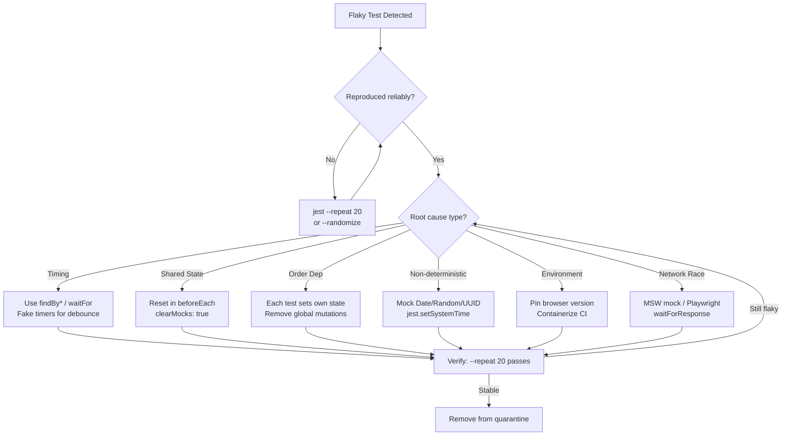

## Keywords in This File
{: .no_toc }

| # | Keyword | Weight |
|---|---|---|
| 1 | [Flaky Tests - Detection, Prevention, and Resolution](#flaky-tests---detection-prevention-and-resolution) | medium |

---

# Flaky Tests - Detection, Prevention, and Resolution

---

### 🎯 Model Answer

**30 seconds:**

> A flaky test passes sometimes and fails sometimes on the same code.
> Root causes: timing issues (implicit waits, race conditions), shared
> state between tests, non-deterministic inputs (Math.random, Date.now),
> test order dependencies, and environment differences. Detection:
> `--repeat N` flags, CI metrics, quarantine CI jobs. Prevention: always
> use RTL `findBy*` for async, reset state in afterEach, mock
> non-deterministic sources, use `jest.useFakeTimers()`. Resolution:
> isolate the test, find the trigger, fix the root cause.

**3 minutes:**

Flaky tests are the most corrosive force in a test suite. Each flaky
test teaches engineers to re-run CI instead of investigating failures.
After 10% of builds fail due to flakiness, teams start disabling or
ignoring tests. The test suite loses its value.

**Root cause taxonomy:**

1. **Timing/async**: The most common. An assertion runs before an
   async operation completes. `getByText('Success')` after an API call
   - if the response arrives in 10ms in dev but 150ms in CI, the test
   intermittently fails. Fix: use `findByText('Success')` (retries).

2. **Shared state**: Global state (module-level variables, localStorage,
   IndexedDB, global event listeners) not reset between tests. Fix:
   `afterEach` cleanup, `clearMocks: true`, `localStorage.clear()`.

3. **Test order dependency**: Test B passes only if Test A ran first.
   Detectable with `jest --randomize` (Jest 29+) or
   `vitest --sequence.shuffle`. Fix: each test sets up its own state.

4. **Non-deterministic values**: `Math.random()`, `Date.now()`,
   `crypto.randomUUID()` produce different values each run, causing
   snapshot mismatches or conditional logic differences. Fix: mock with
   `jest.spyOn(Math, 'random').mockReturnValue(0.5)`.

5. **Environment differences**: Fonts, screen resolution, OS-level
   rendering differences (visual regression tests). Fix: pin
   headless browser version, use cloud screenshot service.

6. **Network race conditions** (E2E): API response arrives in different
   order between runs. Fix: MSW for component tests, Playwright
   `waitForResponse` for E2E.

**Blank Mind Recovery:**

**(1) Six causes:** "Timing. Shared state. Order dependency.
Non-deterministic values. Environment. Network race."

**(2) Detection:** "jest --randomize (finds order deps). --repeat N
(finds intermittent). CI flaky test metrics."

**(3) Fix strategy:** "1. Reproduce reliably. 2. Identify trigger.
3. Fix root cause. Never: increase retry count."

---

### 📘 Concept Explanation

**What it is:**

Tests that produce inconsistent pass/fail results on the same code -
a sign of hidden dependencies on external or non-deterministic factors.

**The problem it solves:**

Flaky tests have the opposite effect of their intent: they train
engineers to ignore test failures ("it's probably flaky") and
erode trust in the entire test suite.

**How it works:**

```
Flakiness detection methods:

  1. Jest repeat flag (pre-commit check):
     jest --testPathPattern=specific.test --testNamePattern="test name"
       --repeat=20
     (runs same test 20 times in one command)

  2. Jest randomize (order dependency detection):
     jest --randomize
     (runs tests in different order, catches state dependencies)

  3. CI metrics (automated):
     Track pass/fail per test over last N runs
     Flaky = test that failed < 100% but > 0% of recent runs
     Tools: Buildkite Flaky tests, GitHub Actions annotations,
            DataDog test visibility, Trunk Flaky Tests

  4. Quarantine workflow:
     Detected flaky tests -> moved to separate CI job
     Quarantine job: failures don't block merge
     Team reviews quarantine queue weekly
     Fix flaky test -> un-quarantine

Common async flakiness patterns in RTL:

  BAD (flaky on slow CI):
    fireEvent.click(button);
    expect(screen.getByText('Saved')).toBeVisible();
    // 'Saved' appears 50ms after click
    // CI may be slower -> test runs before 'Saved' appears

  GOOD (reliable async wait):
    await user.click(button);
    await screen.findByText('Saved'); // retries until timeout
    expect(screen.getByText('Saved')).toBeVisible();

  BAD (non-deterministic date in snapshot):
    expect(component).toMatchSnapshot();
    // Snapshot includes "Last updated: 2024-03-15 10:23:41"
    // Fails when run at different time

  GOOD (mock Date.now):
    beforeAll(() => {
      jest.useFakeTimers();
      jest.setSystemTime(new Date('2024-01-01'));
    });
    afterAll(() => jest.useRealTimers());

E2E flakiness patterns:

  BAD: fixed sleep
    await page.waitForTimeout(2000); // hope it loads in 2s
    await page.click('.submit');

  GOOD: wait for observable state
    await page.waitForSelector('.submit:enabled');
    await page.click('.submit');
    // Or:
    await page.getByRole('button', {name:/submit/i}).click();
    // Playwright auto-waits for actionable state
```

> **Code walkthrough:** This example demonstrates the core pattern in action. The key mechanism shows how the concept works in practice. Study the structure to understand the essential behavior and common usage.

---

### 💻 Code Example

**Example (Failure + Fix) - Timer-based flakiness:**

```typescript
// BAD: Flaky test - depends on real clock timing
test('shows "saved" after 500ms debounce', async () => {
  const user = userEvent.setup();
  render(<AutoSaveForm />);

  await user.type(screen.getByLabelText(/notes/i), 'Hello');

  // Flaky: debounce fires after 500ms real time
  // In CI with slower execution, this assertion runs before debounce
  await waitFor(() => {
    expect(screen.getByText('Saved')).toBeVisible();
  }, { timeout: 200 }); // 200ms timeout < 500ms debounce = FLAKY
});

// GOOD: Use fake timers to control debounce timing
test('shows "saved" after debounce fires', async () => {
  jest.useFakeTimers();
  const user = userEvent.setup({ delay: null }); // disable real delays
  render(<AutoSaveForm />);

  await user.type(screen.getByLabelText(/notes/i), 'Hello');

  // Advance fake timers by 600ms (past 500ms debounce):
  await act(async () => {
    jest.advanceTimersByTime(600);
  });

  // Now debounce has fired, 'Saved' should appear:
  expect(await screen.findByText('Saved')).toBeVisible();

  jest.useRealTimers();
});

// BAD: E2E test with implicit timing assumption
test('modal closes after submit', async ({ page }) => {
  await page.click('#submit-btn');
  await page.waitForTimeout(500); // arbitrary sleep
  expect(await page.isVisible('#modal')).toBe(false);
});

// GOOD: E2E test waits for observable state
test('modal closes after submit', async ({ page }) => {
  await page.getByRole('button', { name: /submit/i }).click();
  // Wait for modal to disappear (auto-waits, no sleep):
  await expect(
    page.getByRole('dialog')
  ).not.toBeVisible({ timeout: 5000 });
});

// Quarantine config (jest.config.js):
module.exports = {
  projects: [
    {
      displayName: 'unit',
      testMatch: ['**/*.test.ts'],
      testPathIgnorePatterns: ['.flaky.test.ts'],
    },
    {
      displayName: 'quarantine',
      testMatch: ['**/*.flaky.test.ts'],
      // This project can fail without blocking CI
    },
  ],
};
```

> **Code walkthrough:** The timer-based flaky test depends on real
> clock time: if CI is slower than 200ms, the assertion runs before
> the 500ms debounce fires. `jest.useFakeTimers()` replaces `setTimeout`/
> `setInterval` with Jest-controlled versions. `jest.advanceTimersByTime(600)`
> instantly advances the fake clock by 600ms, firing the debounce
> callback immediately. `userEvent.setup({ delay: null })` disables
> the real-time delay between keystrokes in user-event v14 (needed
> when fake timers are active). The E2E fix uses Playwright's built-in
> auto-waiting via `expect(locator).not.toBeVisible()` instead of
> a hard sleep.

---

### 📊 Diagram

```
Flaky test root cause taxonomy and fix strategy:

Flaky Test
├── Timing/Async
│   ├── Symptom: fails on slow CI, passes locally
│   ├── Detect: --repeat 20, run in CI mode locally
│   └── Fix: findBy* (RTL), waitFor, fake timers
│
├── Shared State
│   ├── Symptom: fails when tests run together
│   ├── Detect: jest --randomize, run specific files together
│   └── Fix: beforeEach reset, clearMocks: true, afterEach cleanup
│
├── Order Dependency
│   ├── Symptom: passes in one order, fails in another
│   ├── Detect: jest --randomize
│   └── Fix: each test sets up its own preconditions
│
├── Non-Deterministic
│   ├── Symptom: snapshot mismatches, date-dependent failures
│   ├── Detect: look for Date.now, Math.random in test path
│   └── Fix: jest.spyOn mock, jest.setSystemTime
│
├── Environment
│   ├── Symptom: fails in CI, passes locally
│   ├── Detect: compare CI vs local environment config
│   └── Fix: pin browser/node version, use containerized CI
│
└── Network Race (E2E)
    ├── Symptom: E2E fails intermittently on API timing
    ├── Detect: Playwright trace, add request logging
    └── Fix: waitForResponse, route interception, retry logic
```



> **Diagram walkthrough:** Flaky test resolution follows a diagnostic
> loop: first reproduce reliably (using `--repeat` or `--randomize`
> flags), then identify the root cause category, apply the category-
> specific fix, and verify with `--repeat 20`. A test that fails
> intermittently must be reproducibly triggered before it can be fixed.
> The quarantine pattern (accepting that some tests are temporarily
> unreliable while being fixed) prevents flakiness from blocking CI
> permanently.

---

### ⚖️ Comparison Table

| Cause | Detection method | Fix |
|---|---|---|
| Timing/async | `--repeat 20`, CI-only failures | `findBy*`, fake timers |
| Shared state | `--randomize` flag | `beforeEach` reset, `clearMocks` |
| Order dependency | `--randomize` flag | Self-contained test setup |
| Non-deterministic | Look for Date/Random in path | Mock sources |
| Environment | CI vs local diff | Pin versions, containerize |
| Network (E2E) | Playwright trace | `waitForResponse`, MSW |

---

### 🏛️ System Design

**Flaky Test Management at Scale (100+ developer org)**

At scale (100+ engineers, CI running thousands of tests), flakiness
becomes a throughput problem: each flaky test failure requires manual
re-run, delaying deploys.

**Production flaky test management pipeline:**

```
Detection phase:
  CI captures test result history per test
  Flakiness score = failures / total runs (last 100 builds)
  Threshold: flaky if 0% < score < 100%

  Tools:
    BuildKite Flaky Tests (built-in)
    Trunk Flaky Tests (multi-CI)
    Custom: store results in DB, query for intermittent tests

Triage phase:
  Quarantine: auto-move tests scoring > 5% flakiness to
    "quarantine" CI step (non-blocking)
  Assign owner: team that last touched the test file
  SLA: 2-week fix window before test is deleted

Prevention phase:
  Pre-commit: --repeat 5 for changed test files
  PR requirement: new tests must pass --repeat 10
  Performance CI: --randomize on every merge to main

Metrics (monitor via dashboard):
  Flaky test count over time
  Percent of CI builds affected by flakiness
  Mean time to fix (MTTF) per team
  Quarantine queue size
```

> **Code walkthrough:** This example demonstrates the core pattern in action. The key mechanism shows how the concept works in practice. Study the structure to understand the essential behavior and common usage.

---

### 🎓 Answers by Seniority

**Junior / Mid:**

> A flaky test passes sometimes and fails other times on the same code.
> The most common cause is async timing - an assertion runs before
> an async operation finishes. I fix it by using RTL's `findBy*` queries
> that retry until timeout, and `jest.useFakeTimers()` for time-based
> logic. I also check for shared state by running tests in random order
> with `--randomize`.

**Senior / Staff:**

> Flaky tests are a team-level problem, not just a technical one. Each
> flaky test erodes the team's trust in CI, and engineers learn to
> re-run instead of investigate. The management system matters as much
> as the technical fix: quarantine non-blocking for blocked tests,
> assign owners, enforce a fix SLA, track flakiness rate as a quality
> metric. At the root cause level, 80% of frontend test flakiness is
> timing (async assertions) or shared state (unreset mocks/localStorage).
> `findBy*` instead of `getBy*` for async and `clearMocks: true` in
> jest.config.js eliminate the majority.

---

### ⚠️ Common Misconceptions

**Misconception: Retry logic fixes flaky tests.**

Retrying a flaky test 3 times makes it less likely to fail in CI, but
it doesn't fix the root cause. The test is still broken - it's just
being suppressed. Retries should be used only as a short-term
quarantine measure while the root cause is being fixed. A test that
needs retries is a test with a bug.

---

### 🚨 Failure Modes and Diagnosis

**Failure: 30% of CI builds fail - can't determine if failures are
real bugs or flakiness.**

This is a systemic flakiness problem, not a single test issue.

Triage:
1. Run `git bisect` to confirm recent failures correlate with code
   changes vs CI infrastructure changes
2. Check CI logs: are failures always the same tests or rotating?
   (Same tests = likely real bugs. Rotating = systemic flakiness)
3. Run full suite with `--randomize` to detect order-dependent tests
4. Identify top 10 flaky tests by failure count
5. Fix or quarantine the top 10 - often this alone drops flakiness
   rate from 30% to <5%

---

### 🎯 Interview Deep-Dive

| Question | Type | Difficulty | Time |
|---|---|---|---|
| What makes a test flaky? | Definition | ★★☆ | 2 min |
| Six root causes of flakiness | Definition | ★★★ | 4 min |
| How to detect test order dependencies? | Scenario | ★★☆ | 2 min |
| How to fix timer-based flakiness? | Scenario | ★★☆ | 3 min |
| Does retry logic fix flaky tests? | Trade-off | ★★★ | 3 min |
| How do you manage flaky tests at org scale? | Design | ★★★ | 5 min |
| 30% of CI builds failing - what do you do? | Scenario | ★★★ | 5 min |
| What's the business impact of flaky tests? | Strategic | ★★★ | 3 min |
| How to enforce "no new flaky tests" policy? | Design | ★★★ | 4 min |
| How to convince management to invest in fixing flakiness? | Behavioral | ★★★ | 3 min |
| How does `jest --randomize` work? | Mechanism | ★★☆ | 2 min |
| How to test a component with a debounce? | Scenario | ★★★ | 3 min |

**Q: How would you convince management to invest engineering time in
fixing flaky tests instead of shipping features?**

A: Frame flakiness as a throughput multiplier, not a quality issue.

**Quantify the cost:**
- 30% of CI builds fail and require re-run: if each re-run takes
  30 minutes and engineers re-run 3x/day average, that's 1.5 hours/
  day/engineer lost to CI babysitting
- For 10 engineers: 15 engineer-hours/day = 75 hours/week
- At $200/hour: $15,000/week in lost productivity

**Show the trust erosion:**
- Every flaky failure trains engineers to re-run instead of
  investigate. When a real bug causes a failure, it's ignored
- Measure: time from real bug introduced to test failure investigated.
  If this increases, flakiness is hiding real regressions

**Proposed investment:**
- 1 week: top 10 flaky tests fixed (usually 80% of failures)
- ROI: 75 hours/week saved at 1 week cost = ROI in week 1

**Q: What is the difference between `jest.useFakeTimers()` and
mocking `Date.now`?**

A:
- `jest.useFakeTimers()` replaces the entire timer system:
  `setTimeout`, `setInterval`, `setImmediate`, and `Date` globally
- `jest.spyOn(Date, 'now').mockReturnValue(timestamp)` only mocks
  `Date.now()`, not `new Date()`, and doesn't affect timers

For debounce testing: `jest.useFakeTimers()` + `jest.advanceTimersByTime(N)`
For date formatting tests: `jest.setSystemTime(new Date('2024-01-01'))`
(available when `jest.useFakeTimers()` is active)

Both must be cleaned up: `jest.useRealTimers()` in `afterEach` or `afterAll`.

*What separates good from great:* Treating flaky test prevention as
a coding standard, not an afterthought. Code review checklist includes:
"Does this test use `getBy*` for async operations?" and "Does this test
depend on `Date.now` or `Math.random` without mocking?" A test that
passes locally and fails in CI once is caught in review, not discovered
in a 3AM incident.

---

### 💻 Code Example

*(Omit: this concept does not have a programmatic interface that can be demonstrated in code. The conceptual explanation above is sufficient.)*


---

### 🏛️ System Design

*(Omit: system design diagram not applicable for this concept - see ★★★ keywords for full system design coverage.)*


---

### ⚖️ Comparison Table

*(Omit: this is a ★☆☆ foundational concept with no direct alternatives to compare - see higher-difficulty keywords for trade-off analysis.)*


---

### 📊 Diagram

*(Omit: no standalone visual diagram required for this concept - the explanations and code examples above provide sufficient clarity.)*


