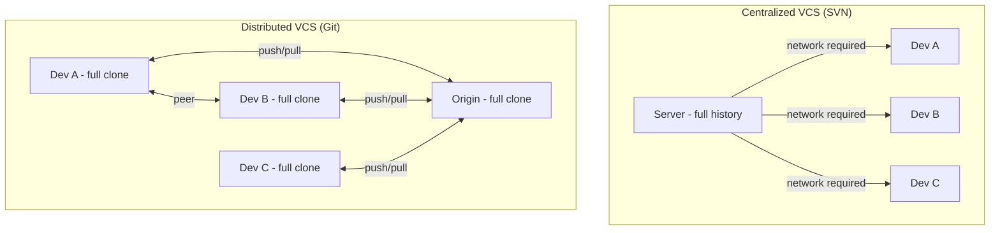
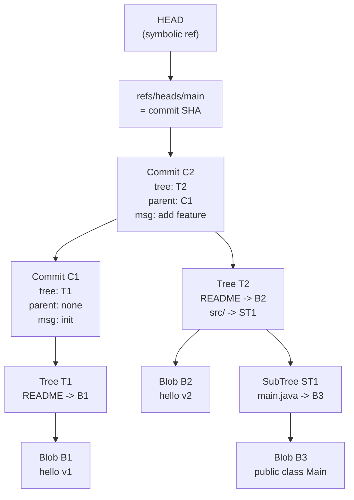
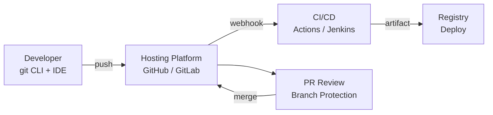

## Keywords in This File
{: .no_toc }

| # | Keyword | Weight |
|---|---|---|
| 1 | [What Is Version Control and Why Git Won](#what-is-version-control-and-why-git-won) | high |
| 2 | [Git Mental Model: Content-Addressable Storage](#git-mental-model-content-addressable-storage) | high |
| 3 | [Git Ecosystem and Workflow Overview](#git-ecosystem-and-workflow-overview) | medium |

---

# What Is Version Control and Why Git Won

**Interview Weight:** High - Asked in virtually every engineering interview as a baseline check. Senior interviewers use follow-up probes to distinguish memorized definitions from genuine understanding.

---

## Quick Reference

**One-line definition:** Version control tracks changes to files over time so any version can be recalled, compared, or restored; Git won because it is distributed, fast, and uses content-addressable storage making every operation local.

**Difficulty:** ★☆☆ | **Asked at:** All levels | **Seniority:** Junior-Senior

---

### 🎯 Model Answer

**30 seconds:**
Version control is a system that records every change to a set of files, lets you restore any prior state, and coordinates concurrent changes from multiple contributors. Git won over CVS, SVN, and Perforce because it is distributed - every clone is a full repository - making offline work, branching, and merging cheap and fast. The non-obvious part: Git's design around content-addressable objects (SHA-1 hashes of file content) is what makes rebasing, cherry-picking, and garbage collection coherent.

**3 minutes (Senior):**
Before distributed version control, centralized systems like SVN had a single server holding the canonical history. Every commit, diff, and branch required a network round trip. Teams working offline were stuck; branch merges were expensive because the server had to coordinate locking. Linus Torvalds designed Git in 2005 to solve Linux kernel development constraints: thousands of contributors, massive codebases, no single trusted authority, and the ability to work completely offline.

Git's key advantages: First, every developer has the full history locally - log, diff, blame, bisect all run at disk speed, not network speed. Second, branching is a pointer move (one SHA updated), not a server-side copy operation. Third, the content-addressable object store ensures integrity - if two files have the same hash, they are provably identical, so Git deduplicates automatically. Fourth, the staging area (index) lets you commit a carefully curated subset of changes, which no centralized system offered.

Why not Mercurial, which is also distributed? Git won the ecosystem battle - GitHub's 2008 launch made Git the lingua franca of open source. Network effects compounded: every new project defaulted to Git, CI/CD tools built native Git integrations, IDEs prioritized Git, and Mercurial became a niche choice.

**Framework:** PROBLEM -> CENTRALIZED APPROACH -> DISTRIBUTED INSIGHT -> GIT'S SPECIFIC DESIGN WINS

*Adapting up:* Add the internals angle - Git's object model (blobs, trees, commits, refs) and why content-addressing enables immutable history.

*Adapting down:* Junior answer: "Git saves snapshots of your code. You can go back to any old version, create branches to try new things, and collaborate without overwriting each other's work."

**Blank Mind Recovery:**

**(1) Restate:** "Version control and why Git became standard - let me think about what problem version control solves."

**(2) First principles:** "Software development has two coordination problems: tracking what changed and when (history), and coordinating multiple people changing the same files simultaneously (collaboration). Version control solves both."

**(3) Bridge:** "This is like Google Docs version history - you can see who changed what and restore any prior version. Git extends that idea to entire codebases and multiple contributors working offline."

---

### 📘 Concept Explanation

**What it is:**
Version control is a system for recording, tracking, and coordinating changes to files. Git is a distributed version control system where every repository clone contains the complete history.

**The problem it solves:**
Before version control, teams emailed zip files of code, overwrote each other's changes, and had no reliable way to reproduce a bug that appeared in a specific past version. Centralized VCS (CVS, SVN) added history and coordination but required constant network access and made branching expensive.

**How it works:**

```
Centralized (SVN)         Distributed (Git)

[Server] <-- network      [Local Repo] <- full history
  |                           |
[Dev A]                   [Dev A]   offline OK
[Dev B]                   [Dev B]   offline OK
[Dev C]                   [Dev C]   offline OK

Branch = server copy      Branch = pointer (SHA-1)
Commit = server write     Commit = local write
Diff   = server compute   Diff   = local comparison
```

> **Diagram walkthrough:** The left side shows SVN's centralized model where every operation hits a server - branching creates a directory copy and commits require network writes. The right shows Git's distributed model where every clone is a peer with full history. Branching is a SHA pointer update (microseconds), commits write to the local object store (milliseconds), and the server is just a named peer. The edge case: distributed means merge conflicts are a local concern rather than a server-level lock; this is why Git merges are more common but also why Git has richer merge strategies than SVN. The senior insight: Git's "remote" is just a reference name for another repo URL - `origin` is a convention, not a special server role.



> **Diagram walkthrough:** In the centralized model, the server is the single point of truth - all operations require it. In the distributed model, Origin is just another peer with a well-known URL. Each developer has a full clone and can exchange changesets with any peer. The key relationship is that Origin has no special technical status - it is a naming convention. Edge case: if Origin goes down, development continues locally; pushes queue until it returns. Senior insight: Git's peer model means you can collaborate directly between developer machines without a central server.

**The key insight:**
Git stores snapshots, not diffs. Each commit records the entire state of tracked files as a tree of SHA-1-hashed content blobs. "Diffs" are computed on demand by comparing two snapshots. This is why `git log`, `git diff`, and `git checkout` are fast - they never replay a chain of patches.

**When to use it:**
Every software project with more than one developer, more than one environment, or more than one week of development. Also for solo projects - the ability to bisect bugs against history is invaluable regardless of team size.

**When NOT to use it:**
Git is poorly suited for large binary files (design assets, video, ML model checkpoints) - each binary version is stored in full, inflating repository size. Use Git LFS or a separate artifact store for binaries.

**Alternatives:**
- Mercurial (hg) - Similar distributed design, cleaner UX but lost the ecosystem battle to Git
- SVN (Subversion) - Centralized, still used in enterprises with locked-down audit requirements
- Perforce (Helix Core) - Handles large binary files and monorepos at game-studio scale

**First-principles derivation:**
Given that software teams need to: (1) preserve history, (2) coordinate concurrent changes, (3) support parallel experiments via branching, (4) work offline - the design space forces distributed storage (requirement 4 eliminates centralized), content addressing (requirement 1 requires integrity checking), and cheap branching (requirement 3 eliminates copy-based branching). Git satisfies all four constraints simultaneously.

---

### 💻 Code Example

```bash
# Initialize a repository
git init my-project
cd my-project

# See the hidden .git directory - this IS the repository
ls .git/
# HEAD  config  description  hooks/  objects/  refs/

# Stage and commit - all local, no network
echo "hello" > README.md
git add README.md
git commit -m "initial commit"

# Full history is local - no network needed
git log --oneline
git diff HEAD~1 HEAD

# A branch is just a 41-byte file
cat .git/refs/heads/main
# 1a2b3c4d5e6f...  (one SHA pointing to tip commit)

# Creating a branch is instant - writes one file
git checkout -b feature/new-thing
ls .git/refs/heads/
# main  feature/new-thing
```

> **Code walkthrough:** This shows the full lifecycle from `git init` to branching running entirely offline. The `ls .git/` reveals Git's object store and refs directories. The critical insight is `cat .git/refs/heads/main` - a branch is literally a 41-byte text file containing one SHA. Creating a branch (`git checkout -b`) writes one file in milliseconds, regardless of repository size. What breaks: deleting the `.git/` directory destroys the entire history permanently, not just the working tree. Takeaway: Git's durability comes from the `.git/` directory - always back it up before destructive operations.

---

### 🎓 Answers by Seniority

**Junior / Mid (0-5 years):**
> "Version control tracks every change to your codebase so you can collaborate without overwriting each other's work, roll back bugs, and understand what changed between releases. Git became the standard because it is distributed - you get the full history locally, branches are instant, and tools like GitHub built a collaboration layer on top."

*Push deeper:* Git's killer feature for teams is branching - creating an isolated workspace for a feature takes milliseconds because it is just a pointer to a commit SHA, not a file copy. This makes feature isolation cheap and enables PR-based workflows.

---

**Senior / Staff (5+ years):**
> "Version control solves two distinct problems: individual history (undo, blame, bisect) and team coordination (merging concurrent changes). Git's design wins are: distributed - full history available offline means every operation is local/fast; content-addressable storage - SHA hashing ensures integrity and enables deduplication; the staging area - lets you craft atomic, logical commits rather than saving whatever is dirty."

At the Staff level, the conversation shifts to how Git integrates with deployment pipelines, audit requirements, and monorepo strategies. The biggest production lesson: the branch model you choose has more impact on team velocity than almost any other tooling decision, because it determines merge frequency, conflict rate, and CI/CD coupling.

*Push deeper:* Discuss how content-addressable storage makes rebasing safe - you create new commit objects that reference the same blob objects, so disk usage is proportional to the diff, not the snapshot.

---

### ⚠️ Common Misconceptions

**Misconception 1: "Git branches are expensive like SVN branches."**
Reality: A Git branch is a 41-byte file containing one SHA-1 hash. Creating a branch is writing one file. SVN branches copy directory trees on the server. This difference in cost explains why Git teams branch for every feature while SVN teams branch reluctantly.

**Misconception 2: "git pull is always safe."**
Reality: `git pull` is `git fetch` + `git merge` (or rebase depending on config). On a shared branch, this can create merge commits, fast-forwards, or silent overwrites of local unpushed work depending on branch divergence. Teams that want predictable history use `git pull --rebase` instead.

**Misconception 3: "Committing to main directly is fine for solo projects."**
Reality: Even solo, committing to a branch and merging gives you a clean history, the ability to use `git bisect` across feature boundaries, and the habit that prevents accidents when working on shared repositories.

**Misconception 4: "Git history is permanent."**
Reality: `git push --force` rewrites remote history. Rebasing local commits and force-pushing erases the original commits from the shared repository. History is permanent on any clone that fetched before the force-push; on the origin it is overwritten.

---

### 🚨 Failure Modes and Diagnosis

**Failure 1: Lost commits after force push**
Symptom: Teammates report their branch is missing commits that were pushed yesterday.
Cause: Someone rebased main and force-pushed, rewriting history after others had fetched.
Diagnosis: `git reflog show origin/main` on a local clone that fetched before the force-push.
Fix: Cherry-pick lost commits from a stale clone's reflog. Prevention: protect main branch with branch protection rules prohibiting force-pushes.

**Failure 2: Massive repository growth from committed binaries**
Symptom: `git clone` takes 45 minutes; `.git/objects/` is 8GB.
Cause: Someone committed build artifacts, ML model checkpoints, or video files.
Diagnosis: `git count-objects -vH` to see pack size; `git rev-list --objects --all | sort -k 2 | uniq -D -f 1` to find large objects.
Fix: `git filter-repo --strip-blobs-bigger-than 10M` to rewrite history; requires all clones to re-fetch.

**Failure 3: Merge conflicts blocking deployments**
Symptom: Every PR has conflicts; engineers spending hours resolving them.
Cause: Long-lived feature branches diverging significantly from main.
Diagnosis: `git log --oneline feature-branch...main --left-right | wc -l` shows divergence count.
Fix: Switch to trunk-based development with feature flags; merge to main daily.

---

### 🎯 Interview Deep-Dive

| Category | Count | Coverage |
|---|---|---|
| Conceptual | 3 | What VCS is, why Git won, distributed vs centralized |
| Debugging | 1 | Lost commits, repository size issues |
| Trade-off | 2 | Git vs alternatives, when Git is the wrong tool |
| Behavioral | 1 | Real-world workflow experience |

---

**[JUNIOR] Q1 - What is the difference between Git and GitHub?**

Git is the version control system - a command-line tool and protocol for tracking file changes, managing history, and coordinating branches. It runs entirely locally. GitHub is a hosting service built on top of Git that adds a web UI, pull request workflows, issue tracking, CI/CD integration (GitHub Actions), and social features (stars, forks). The relationship: Git is the engine, GitHub is a service that hosts Git repositories and adds collaboration tooling.

The confusion is understandable because GitHub became so dominant that "put it on GitHub" and "use Git" became synonymous in popular usage. But the two are completely separable: you can use Git with GitLab, Bitbucket, Gitea, or just a bare repository on any server. The commands `git push`, `git pull`, and `git clone` work identically regardless of which hosting service holds the remote.

The important production distinction: GitHub Actions are tightly coupled to GitHub. If your CI/CD uses GitHub Actions extensively, migrating to GitLab requires rewriting your pipelines. The underlying Git operations are portable; the hosting platform integrations are not.

*What separates good from great:* Understanding that GitHub is a product built on a protocol, and that protocol portability is why Git won - you could always self-host if a service went away or raised prices.

---

**[JUNIOR] Q2 - What is the purpose of `git commit` and what should go in a commit message?**

`git commit` captures a snapshot of the current staging area as a permanent, named point in history. The snapshot includes a pointer to the root tree object, a pointer to the parent commit(s), the author and timestamp, and your message. Once committed, the snapshot is immutable.

Commit messages are communication artifacts for your future self and teammates. The standard format: a 50-character or shorter subject line in imperative mood ("Add user authentication", not "Added" or "Adding"), a blank line, then a body paragraph explaining WHY the change was made (not WHAT - the diff shows what). The why is what ages well.

Bad commit message: "fix stuff". Good commit message: "Fix session token expiry on Safari - Safari rejects SameSite=None without Secure flag; add Secure flag for production cookies, fallback to Lax for development."

At scale, commit messages feed automated tools: `git log --grep`, changelog generators, `git bisect` automation, and release note generators all parse messages. A team that writes meaningful messages gets these tools for free.

*What separates good from great:* Knowing that commit messages are documentation, not commentary. The body should explain the problem being solved and any alternatives rejected.

---

**[MID] Q3 - Why is `git fetch` safer than `git pull` in CI/CD pipelines?**

`git fetch` downloads objects and updates remote-tracking references (`origin/main`) without touching your working tree or current branch. It is a read-only operation. `git pull` is `git fetch` followed by either `git merge` or `git rebase`, which modifies your working tree and can produce merge commits, conflicts, or change the branch tip.

In CI/CD pipelines, this distinction matters because a `git pull` in the middle of a pipeline step could silently merge new commits that arrived while the pipeline was running, producing a build from a different state than the one that triggered it. `git fetch` followed by an explicit checkout of a specific SHA ensures the build is deterministic.

The correct CI pattern is `git fetch origin && git checkout <specific-SHA>` rather than `git pull`. Most CI systems do this automatically (GitHub Actions' `actions/checkout` pins to the triggering SHA), but custom scripts often use `git pull` naively.

*What separates good from great:* Understanding that CI builds must be reproducible - building the exact state that passed review, not "latest main + whatever arrived since."

---

**[MID] Q4 - What happens when two people push to the same branch simultaneously?**

Git's push protocol requires the push to be a fast-forward of the remote branch. If Developer A pushes first, the remote tip advances. When Developer B then pushes, Git checks whether the remote tip is a direct ancestor of B's commit. Since A's commit is not in B's history, the push is rejected with "non-fast-forward." B must run `git fetch`, integrate A's changes (merge or rebase), and then push again.

This is deliberate - Git rejects pushes that would silently discard A's commits. The alternative (last-writer-wins) would cause lost work. Force push (`--force`) overrides this protection and IS how you lose work.

Production implication: on high-frequency branches, this rejection-and-retry creates a queue. Solutions: merge queues (GitHub's feature that serializes merges), or trunk-based development where developers merge quickly.

*What separates good from great:* Understanding that Git's push rejection is a safety mechanism protecting all contributors. The friction it creates is proportional to branch lifetime.

---

**[SENIOR] Q5 - What are the trade-offs between centralized VCS (SVN) and distributed VCS (Git) for large enterprise codebases?**

Distributed Git advantages: offline work, local speed, flexible merge strategies, and the rich ecosystem of tooling. For most teams, Git is clearly better.

Where centralized systems retain advantages: (1) Fine-grained access control - SVN can give read access to specific directory subtrees; Git repositories are all-or-nothing for history. This matters for compliance in mixed-sensitivity codebases. (2) Large binary files - SVN stores deltas of binaries efficiently; Git stores full copies. Game studios with gigabytes of assets per commit cannot use vanilla Git. (3) Monotonic revision numbers - SVN's sequential numbers are human-readable audit identifiers. SHA hashes require tooling to trace to deployments. (4) Single source of truth - centralized systems enforce sequential commits.

For enterprises choosing today: use Git with Git LFS for binaries, a secrets scanner for access control, and structured commit message conventions for audit trails.

*What separates good from great:* Knowing that "distributed vs centralized" is also a compliance, auditing, and access control debate, not purely technical.

---

**[SENIOR] Q6 - Describe a time when your team's Git workflow caused friction and what you changed.**

[BEHAVIORAL]

**S:** At a previous company we used GitFlow - develop, release, and main branches with a monthly release cycle.

**T:** I was leading the backend team and noticed we were spending roughly 30% of sprint time resolving merge conflicts between feature branches and develop. Branches lived for two to three weeks, diverging significantly.

**A:** I proposed a trial of trunk-based development with feature flags. Every feature branch would live for at most one day, merged to main behind a flag, and the flag enabled in production only when tested. I added a GitHub Action that failed CI if any branch had been open more than 24 hours without merging.

**R:** Within two sprints, conflict resolution time dropped to near zero. We deployed to production fourteen times in one sprint instead of once per month. The flag system made us more confident about each merge since partial features were invisible to users until enabled.

*What separates good from great:* Understanding that the Git workflow is a team process and deployment frequency decision. GitFlow was designed for monthly releases; trunk-based development is designed for continuous delivery.

---

**[STAFF] Q7 - What is the most important operational risk when migrating from SVN to Git at a large organization?**

The most underestimated risk is history size explosion. SVN stores deltas; converting with `git svn clone` generates a Git repository where binary files stored efficiently in SVN are now stored in full for every version. A 200MB SVN repository can become a 40GB Git repository after conversion.

The second major risk is access control regression. SVN's per-path ACLs are not natively representable in Git. Teams that relied on "dev team cannot read credentials in /ops/secrets/prod" lose that guarantee. This requires either splitting into multiple repos or implementing a proxy server enforcing path-based access.

Third: history rewriting after migration. Teams that want to scrub old credentials require `git filter-repo`, which rewrites all SHAs. Everyone who cloned before the rewrite has incompatible history. Coordinating a fleet of engineers to re-clone simultaneously is a non-trivial change management exercise.

Migration playbook: migrate history in read-only mode first, run both systems in parallel for one sprint, do the cutover at a sprint boundary, and have a rollback plan for the first week.

*What separates good from great:* Identifying that SVN-to-Git migrations fail on organizational, not technical, grounds. The technical migration takes a day; getting legal to approve restructuring credential access controls takes months.

---

### ⚖️ Comparison Table

*(Omit: ★☆☆ keyword - comparison table applies to ★★☆ and above.)*

---

### 🏛️ System Design

*(Omit: Not a ★★★ keyword and no system design anchor.)*

---

### 📊 Diagram

*(Omit: The ASCII and Mermaid diagrams in the Concept Explanation section cover the visual aspect.)*

---
---

# Git Mental Model: Content-Addressable Storage

**Interview Weight:** High - Understanding Git's object model separates candidates who use Git from candidates who understand Git. This comes up in internals questions, debugging scenarios, and explaining how rebase works.

---

## Quick Reference

**One-line definition:** Git stores every file version, directory snapshot, and commit as an immutable SHA-1 hash of its content in a key-value object store, making history tamper-evident and deduplication automatic.

**Difficulty:** ★☆☆ | **Asked at:** Mid-Senior, FAANG | **Seniority:** Mid-Senior

---

### 🎯 Model Answer

**30 seconds:**
Git's object store is a key-value database where the key is the SHA-1 hash of the content and the value is the content itself. There are four object types: blobs (file content), trees (directory listings), commits (tree + parent SHA + message), and tags. Because the key IS derived from the content, two identical files always produce the same key - deduplication is automatic. Changing one byte changes the hash, so history is tamper-evident.

**3 minutes (Senior):**
The insight that unlocks Git's behavior: Git never modifies objects. Every commit, rebase, and merge creates NEW objects. Old objects persist until garbage collected. This explains why `git rebase` is "safe" locally - the original commits still exist in reflog and can be recovered - and why `git reset --hard` does not actually delete commits immediately.

The object types work together: A blob stores file content (no filename, no permissions, just bytes). A tree stores a directory listing where each entry is either a blob SHA (file) or another tree SHA (subdirectory). A commit stores the root tree SHA, the parent commit SHA(s), author/committer info, and message. A tag stores a pointer to a commit with a name and optional signature.

When you run `git add file.txt`, Git hashes the content and writes a blob object. When you run `git commit`, Git writes a tree object (SHA pointers to all staged blobs), then a commit object (SHA pointer to the tree, SHA pointer to the parent commit). Branches are just named pointers to commit SHAs stored in `.git/refs/`.

**Framework:** CONTENT -> HASH -> OBJECT TYPE -> POINTER CHAIN -> BRANCH AS NAMED POINTER

*Adapting up:* Add packfile discussion - how Git optimizes disk use with delta compression between related blobs.

*Adapting down:* Junior answer: "Git saves every version of every file by its content hash. Same content = same hash, different content = different hash. This is how Git knows what changed."

**Blank Mind Recovery:**

**(1) Restate:** "Content-addressable storage - how Git stores and identifies objects."

**(2) First principles:** "If you need an immutable history where every state is uniquely identifiable and you want automatic deduplication, what storage design works? A hash-addressed key-value store: key is hash of content, value is content itself."

**(3) Bridge:** "Think of a library where every book is shelved by its content fingerprint, not its title. Two books with identical content automatically occupy the same shelf. Git's object store works exactly like this."

---

### 📘 Concept Explanation

**What it is:**
Git's object store is a content-addressable filesystem inside `.git/objects/`. Every stored entity has a SHA-1 hash of its content as its key. There are exactly four object types.

**The problem it solves:**
Traditional file storage uses names as identifiers. Names are mutable (you can rename a file), can collide, and do not encode anything about content. Content-addressable storage makes the identifier a function of what is stored - this enables integrity checking, deduplication, and distributed synchronization without a central coordinator.

**How it works:**

```
git add README.md
    |
    v
SHA-1 of ("blob " + size + "\0" + content)
    |
    v
.git/objects/ab/cd1234...  (2-char dir + rest = filename)

git commit
    |
    v
Blobs (files) -> Tree (directory) -> Commit object
"hello world"    README -> blob-sha    tree: def456
sha: abc123      src/    -> tree-sha   parent: C1
                 sha: def456           msg: "init"

Branch = ref file:
.git/refs/heads/main = "commit-sha\n"  (40 chars + newline)

HEAD = .git/HEAD = "ref: refs/heads/main"
```

> **Diagram walkthrough:** The ASCII diagram traces the object creation chain from `git add` to `git commit`. A blob stores raw file content with no filename. A tree maps filenames to blob SHAs and subdirectory tree SHAs. A commit points to one root tree (the entire directory snapshot) and one or more parent commits. A branch file contains exactly one SHA - the tip commit. HEAD is a symbolic ref pointing to the current branch file. Edge case: the initial commit has no parent SHA - this is the one commit that can only be pointed to from its descendants, never from a parent. Senior insight: because tree and blob objects are content-addressed, two commits with identical directory states share all their tree and blob objects - deduplication is structural, not just file-level.



> **Diagram walkthrough:** The diagram shows the full object graph for a two-commit repository. HEAD is a symbolic reference to the main branch file, which contains the tip commit SHA. Each commit points up to a tree (full directory snapshot) and back to its parent commit (history chain). Trees recursively contain blobs and sub-trees. Key relationship: blob B3 for `main.java` exists once in the object store regardless of how many commits reference that file without changes - this is the deduplication mechanism. Edge case: if you `git reset --hard HEAD~1`, the branch pointer moves back but C2, T2, and B2 are NOT deleted - they remain until `git gc`. Senior insight: this is why reflog recovery works even after hard resets.

**The key insight:**
A branch is not a chain of commits - it is a single pointer to one commit SHA. The chain of history is created by each commit pointing to its parent. Moving a branch is a single file write of 40 bytes.

**When to use it:**
Understanding content-addressed storage is necessary for: explaining rebase, cherry-pick, and reset; debugging detached HEAD state; recovering from accidental `git reset --hard`; and understanding why `git clone --depth 1` is shallow.

**When NOT to use it:**
This is the underlying storage model - you always use it, you just may not know it.

**Alternatives:**
- Delta-compressed storage (SVN, Perforce) - stores diffs between versions; efficient for large files that change incrementally but cannot dedup across branches
- Append-only log (Mercurial) - similar philosophy but uses sequential revision numbers instead of content hashes

**First-principles derivation:**
Given requirement: distributed synchronization without central coordinator. Two repos must determine which objects to exchange without a common authority. The only universal identifier that works without coordination is a hash of the content itself. If both repos agree on the hash function (SHA-1), they can determine what each other has purely by comparing hash sets.

---

### 💻 Code Example

```bash
# See the four object types directly in the object store
git init demo && cd demo
echo "hello" > file.txt
git add file.txt
git commit -m "first commit"

# List all objects in the store
find .git/objects -type f | head -20

# Inspect each object type
git cat-file -t <blob-sha>   # outputs: blob
git cat-file -p <blob-sha>   # outputs: hello

git cat-file -t <tree-sha>   # outputs: tree
git cat-file -p <tree-sha>
# 100644 blob <sha> file.txt

git cat-file -p HEAD
# tree <tree-sha>
# author name <email> timestamp
# committer name <email> timestamp
# first commit

# SHA is deterministic from content
# blob format: "blob " + length + NUL + content
printf "blob 6\0hello\n" | sha1sum
# matches the blob SHA above
```

> **Code walkthrough:** This demonstrates that Git objects are real files in `.git/objects/` accessible with `git cat-file`. The `printf "blob 6\0hello\n" | sha1sum` shows exactly how Git derives the hash: prefix "blob " + size + null byte + content, then SHA-1. The key mechanism: this is why `echo "hello" > file.txt && git add file.txt` in any repository always produces the exact same blob SHA - the hash is determined entirely by file content, not path or timestamp. What breaks: if you modify a committed file's content directly in `.git/objects/` (a hypothetical attack), `git fsck` detects the corruption immediately because the stored SHA no longer matches the content. Takeaway: content-addressed storage gives Git tamper-evident history as a side effect of its storage model.

---

### 🎓 Answers by Seniority

**Junior / Mid (0-5 years):**
> "Git stores every file version, every directory listing, and every commit as an object in a key-value store where the key is the SHA-1 hash of the content. This means two files with identical content always hash to the same key - deduplication is automatic. And you can always verify the integrity of any stored object by re-hashing it."

*Push deeper:* Explain the four types: blob (file content, no name), tree (directory listing mapping names to blob/tree SHAs), commit (tree + parent + message), tag (named pointer to a commit).

---

**Senior / Staff (5+ years):**
> "Git's content-addressed object store is the design decision that makes everything else work. Branches are 40-byte files, rebasing creates new objects without deleting old ones, and garbage collection is safe because reachability from any ref defines liveness. The SHA chain also means you can detect any tampering or corruption with a single `git fsck` pass."

At Staff level: content-addressing enables the pack protocol. When you `git push`, Git computes the set of objects the remote has by comparing refs and sends only the delta. This is why pushing after a small commit is nearly instantaneous even on a multi-gigabyte repository - you send only new objects.

*Push deeper:* Discuss SHA-1 collision risk (SHAttered 2017) and Git's migration path to SHA-256 (git init --object-format sha256 in Git 2.41+). SHA-256 repos are not backwards-compatible with SHA-1 repos.

---

### ⚠️ Common Misconceptions

**Misconception 1: "Git stores diffs (deltas) between commits."**
Reality: Git stores full snapshots. Each commit has a complete tree object representing the entire repository state at that point. Diffs are computed on-demand by comparing two snapshots. Packfiles DO use delta compression for disk efficiency, but this is a storage optimization invisible to the object model.

**Misconception 2: "Deleting a branch deletes its commits."**
Reality: Deleting a branch removes the ref file (one SHA pointer). The commit objects remain in the object store until garbage collection (default: 90 days). You can recover a deleted branch via `git reflog` within that window.

**Misconception 3: "git reset --hard is irreversible."**
Reality: `git reset --hard` moves the branch pointer; the old commit objects remain in reflog. `git reflog` shows every HEAD position for the last 90 days. True irreversibility only comes from `git gc --aggressive --prune=now` after the reset.

**Misconception 4: "SHA-1 collisions make Git insecure."**
Reality: SHAttered (2017) demonstrated a theoretical SHA-1 collision. In practice, Git added collision detection that rejects identical SHAs with different content. Git 2.41+ supports SHA-256 repositories for those who need a provable guarantee.

---

### 🚨 Failure Modes and Diagnosis

**Failure 1: Detached HEAD state**
Symptom: Terminal shows `HEAD detached at abc1234`; new commits do not appear on any branch.
Cause: `git checkout <SHA>` or `git checkout <tag>` moves HEAD to point directly at a commit rather than a branch ref. New commits create objects but nothing points to them (unreachable).
Diagnosis: `git status` shows "HEAD detached at"; `git log --oneline -5` shows commits.
Fix: `git branch new-branch-name` while still on the commit to create a branch, or `git checkout main` to abandon the detached commits (GC'd in 30 days).

**Failure 2: Object database corruption**
Symptom: `git status` or `git log` outputs "fatal: loose object abc123 is corrupt".
Cause: Disk write failure or filesystem error during a Git operation.
Diagnosis: `git fsck --full` reports all corrupt objects and their types.
Fix: If another clone has the object, `git fetch` from it. If using a remote, `git fetch --all` then `git reset --hard origin/main`.

**Failure 3: Pack file growth**
Symptom: `.git/` directory grows unboundedly; `du -sh .git/objects/` shows gigabytes.
Cause: Many loose objects accumulating without `git gc` running, OR large files committed accidentally.
Diagnosis: `git count-objects -vH` shows loose object count and pack file size separately.
Fix: `git gc` packs loose objects; for large files use `git filter-repo`.

---

### 🎯 Interview Deep-Dive

| Category | Count | Coverage |
|---|---|---|
| Conceptual | 3 | Object types, SHA addressing, branch as pointer |
| Debugging | 2 | Detached HEAD, corrupt objects, reflog recovery |
| Trade-off | 1 | SHA-1 vs SHA-256, when object model matters |
| Behavioral | 1 | Real-world object model usage |

---

**[MID] Q1 - What are the four Git object types and how do they relate?**

Blob, tree, commit, and tag. A blob stores the raw content of a single file - no filename, no permissions, just bytes. If you commit two files with identical content in different directories, they share one blob object. A tree stores a directory listing: each entry maps a filename to either a blob SHA (for files) or a tree SHA (for subdirectories), plus the file mode (100644 for regular files, 100755 for executables, 120000 for symlinks). A commit stores: the SHA of the root tree, the SHA(s) of parent commit(s), author name/email/timestamp, committer name/email/timestamp, and the commit message. A tag stores a name, an optional message and signature, and a pointer to any Git object (usually a commit).

The chain: commits point to trees, trees point to blobs and other trees, and refs (branches/tags) point to commits. Walking this graph from any ref gives you the complete state at that point in history.

*What separates good from great:* Understanding that this chain makes `git diff` trivially fast - it walks two trees and compares blob SHAs, never needing to decode actual file content unless a SHA differs.

---

**[MID] Q2 - How does `git reflog` work and when does it save you?**

Every time HEAD moves - commit, checkout, reset, merge, rebase - Git appends an entry to `.git/logs/HEAD` recording the SHA before and after, the operation type, and a timestamp. This log is local-only and not pushed to remotes. The `git reflog` command reads this log and displays each entry with a human-readable reference like `HEAD@{2}` (HEAD two moves ago).

Scenarios where reflog saves you: (1) `git reset --hard HEAD~5` when you meant `HEAD~1` - `git reflog` shows the SHA before the reset; `git reset --hard HEAD@{1}` restores it. (2) Branch deleted - `git branch -D feature` removes the branch ref but the commit SHA is in reflog; `git checkout -b feature HEAD@{3}` recovers it. (3) Detached HEAD commits forgotten - committing in detached HEAD creates unreferenced objects; reflog shows them.

Default retention is 90 days. After that, GC may prune unreferenced objects.

*What separates good from great:* Knowing that reflog is local-only. If your disk dies, reflog is gone. This is why "push frequently" is safety advice - pushed commits are protected by the remote's storage.

---

**[SENIOR] Q3 - What is the difference between `git reset`, `git revert`, and `git restore`?**

`git reset` moves the current branch pointer to a different commit. Three modes: `--soft` moves the branch tip but keeps staging area and working tree unchanged; `--mixed` (default) moves the tip and unstages changes but keeps them in working tree; `--hard` moves the tip and discards all uncommitted changes. Critically, `git reset` rewrites the branch's visible history.

`git revert` creates a NEW commit that undoes the changes of a specified commit. The original commit remains in history. This is the correct tool for undoing changes on shared/public branches because it preserves history - no one else's history is invalidated.

`git restore` (Git 2.23+) is specifically for working tree and staging area operations. `git restore file.txt` discards working tree changes. `git restore --staged file.txt` unstages a file.

Production rule: never use `git reset --hard` on shared branches. Use `git revert` for public history correction, `git reset` for local cleanup before pushing.

*What separates good from great:* Understanding that `git reset` on a shared branch requires force-push, invalidating all other clones' history of that branch - this is a coordination event.

---

**[SENIOR] Q4 - How does `git cherry-pick` work internally and when would you use it?**

`git cherry-pick <commit-sha>` takes the diff introduced by the specified commit (the delta between that commit and its parent) and applies it on top of the current HEAD, creating a new commit object with different parent and timestamp but the same diff content. The new commit has a different SHA even if the change content is identical - because the SHA includes the parent commit pointer, author info, and timestamp.

Use cases: (1) Backporting a security fix from main to a release branch - the fix exists in main's history and you need it in `release/2.3.x` without merging all of main. (2) Applying a commit made on the wrong branch to the correct branch. (3) Selectively including one commit from a long-running feature branch before the feature is complete.

Risks: cherry-pick can create "duplicate" history when the branch is eventually merged. If you cherry-pick commit X onto branch B, then later merge the original branch containing X into B, Git may apply the change twice. Tools like `git rerere` (reuse recorded resolution) help handle this pattern.

*What separates good from great:* Knowing that cherry-pick's "same diff, new SHA" behavior is why cherry-picking from a feature branch and then merging it creates merge conflicts - Git sees two different commits introducing similar changes.

---

**[SENIOR] Q5 - What is the difference between `git merge` and `git rebase` from the object model perspective?**

`git merge feature main` creates a new merge commit object with TWO parent pointers - one to the tip of feature and one to the tip of main. This preserves the complete history as a DAG (directed acyclic graph).

`git rebase feature main` takes each commit on `feature` not on `main`, computes the diff of each commit against its parent, and re-applies those diffs on top of the current main tip. Each replayed commit becomes a NEW object (new SHA) because the parent pointer changed. The result is a linear history.

From the object model: merge adds a merge commit with two parents; rebase creates new commit objects with new parent chains and abandons the old ones (they remain in reflog).

Production implications: rebased history is linear and easier to read in `git log`; merged history preserves exactly what happened. For open source projects, rebased PRs create clean history. For internal teams where auditors need original commit dates, merge preserves them.

*What separates good from great:* Understanding that rebase "lies" about history - rebased commits have timestamps different from when they were originally made, and their SHAs change. This is why `git push --force-with-lease` is required after rebasing already-pushed commits.

---

**[STAFF] Q6 - What is `git gc` doing and when should you run it manually?**

`git gc` (garbage collection) performs several maintenance operations: (1) Packs loose objects into packfiles using delta compression. (2) Removes objects that are unreachable from any ref or reflog. (3) Prunes stale remote-tracking refs. (4) Repacks existing packfiles.

By default, Git auto-triggers a lightweight gc after roughly 1000 loose objects. Manual gc scenarios: (1) After `git filter-repo` to physically remove large objects after rewriting history. (2) After a large import that created thousands of loose objects. (3) On a server-side bare repository that receives pushes but never triggers auto-gc. (4) When `.git/objects/` is consuming excessive disk space.

`git gc --prune=now` removes unreferenced objects immediately rather than waiting the 14-day grace period. This is appropriate after a confirmed `git filter-repo` run but dangerous otherwise - it removes objects that might be referenced by a colleague's in-progress work.

*What separates good from great:* Understanding that `git gc` on a shared server repository should be coordinated - running it during business hours on a large repository can cause all Git operations to block while the lock is held, creating a brief outage.

---

**[STAFF] Q7 - Describe a real scenario where understanding Git's object model helped you diagnose a problem.**

[BEHAVIORAL]

At a previous company, our monorepo clone was taking 45 minutes and consuming 12GB. Developers were using shared CI workers and re-cloning every pipeline run, blocking the CI queue.

I used `git rev-list --objects --all | sort -k 2 | uniq -D -f 1` to identify objects appearing multiple times across history. The pattern showed a 400MB TensorFlow model checkpoint committed three months prior. Even though it was deleted in a later commit, the blob object persisted because deletion only removes the tree reference, not the blob from the object store.

I used `git filter-repo --strip-blobs-bigger-than 50M` to rewrite history, removing the large blobs. This reduced the pack file from 11.8GB to 340MB. Clone time dropped to 40 seconds.

The challenging part was coordinating the force-push and requiring all engineers to re-clone. We used a Slack announcement with a script that backed up local branches, deleted the local clone, and re-cloned from origin. The transition took 2 hours of engineering downtime across 40 developers.

*What separates good from great:* The object model knowledge - understanding that deletion in a commit does not remove the blob from the pack file - is what identified the root cause. Without that, most engineers would look at the current directory size and see nothing wrong.

---

### ⚖️ Comparison Table

*(Omit: ★☆☆ keyword - comparison table applies to ★★☆ and above.)*

---

### 🏛️ System Design

*(Omit: Not a ★★★ keyword. The object model is foundational knowledge, not a system design component.)*

---

### 📊 Diagram

*(Omit: Full ASCII and Mermaid diagrams are included in the Concept Explanation section.)*

---
---

# Git Ecosystem and Workflow Overview

**Interview Weight:** Medium - Appears as context-setting in interviews about CI/CD, DevOps, and team collaboration. Knowing the ecosystem signals you understand Git as a professional tool, not just a command list.

---

## Quick Reference

**One-line definition:** The Git ecosystem spans hosting platforms (GitHub, GitLab, Bitbucket), workflow models (GitFlow, GitHub Flow, trunk-based), CI/CD integrations, and developer tooling that compose a team's version control practice.

**Difficulty:** ★☆☆ | **Asked at:** All levels | **Seniority:** Junior-Staff

---

### 🎯 Model Answer

**30 seconds:**
The Git ecosystem has three layers: the core Git CLI (the protocol), hosting platforms that add collaboration (GitHub, GitLab, Bitbucket), and workflow conventions that teams adopt to coordinate (GitFlow, GitHub Flow, trunk-based development). Most teams also add tooling: pre-commit hooks, branch protection rules, PR templates, and CI/CD pipelines that trigger on push. Understanding which layer a problem lives in determines where to fix it.

**3 minutes (Senior):**
I think of the Git ecosystem in three layers. Layer 1 is the Git protocol itself - commits, branches, refs, push/pull. This is universal and well-specified. Layer 2 is the hosting platform - GitHub, GitLab, and Bitbucket each add their own collaboration model: PR workflows, branch protection rules, and access controls. Layer 3 is the workflow model - how the team chooses to use the mechanics.

The hosting platform choice has large operational implications. GitHub Actions is deeply integrated with GitHub; switching platforms requires rewriting CI. GitLab has built-in container registry, Kubernetes integration, and a stronger DevSecOps story. Bitbucket integrates with Atlassian tools (Jira, Confluence). Self-hosted options (Gitea, Forgejo) matter for air-gapped or compliance environments.

The workflow model choice is the highest-leverage decision. GitFlow (develop + feature + release + hotfix branches) was designed for teams with monthly releases; it adds process overhead appropriate for monthly deploys. GitHub Flow (feature branch + PR + merge to main + deploy) works for continuous delivery teams. Trunk-based development (merge to main daily, feature flags for incomplete features) is used by Google, Facebook, and Amazon at scale.

**Framework:** CORE GIT -> HOSTING PLATFORM -> WORKFLOW MODEL -> TOOLING LAYER

*Adapting up:* Add the organizational implications - how the workflow model drives deployment frequency, incident response, and on-call culture.

*Adapting down:* Junior answer: "The Git ecosystem includes GitHub for hosting, pull requests for code review, and CI/CD pipelines that run tests automatically when you push code."

**Blank Mind Recovery:**

**(1) Restate:** "Git ecosystem - the tools and practices around using Git in a team."

**(2) First principles:** "What does a team need around version control? Hosting (where does the code live), review (how do we check each other's work), automation (what runs automatically on changes), and process (how do we coordinate)."

**(3) Bridge:** "Like a kitchen: Git is the knives and pans (core tool). GitHub is the commercial kitchen layout (hosting with standard workflows). GitFlow or trunk-based is the recipe process (how you use the tools). CI/CD is the dishwasher and prep crew (automation)."

---

### 📘 Concept Explanation

**What it is:**
The Git ecosystem is the collection of tools, platforms, conventions, and workflows built around the Git protocol for team software development.

**The problem it solves:**
Git's core protocol is powerful but agnostic about workflow. Teams need standard answers to: Where is the canonical repository? Who can push to what branch? How are code changes reviewed? What happens automatically when code is merged?

**How it works:**

```
Developer Workstation
  git CLI  --push/pull-->  Hosting Platform
  IDE Git plugin            (GitHub / GitLab / Bitbucket)
  pre-commit hooks              |
                          Branch Protection
                          PR / MR Workflow
                          Code Review
                               |
                          CI/CD Trigger
                          (GitHub Actions /
                           GitLab CI / Jenkins)
                               |
                          Artifact Registry
                          Deployment Pipeline
```

> **Diagram walkthrough:** The diagram shows the flow from developer workstation through the hosting platform to CI/CD. The developer uses the Git CLI, IDE integration, and local pre-commit hooks to create commits. The hosting platform adds the collaboration layer: branch protection prevents force-pushes and requires PR review before merge. CI/CD is triggered by events on the hosting platform via webhooks. Key relationship: the CI/CD pipeline is decoupled from Git itself - it is triggered by hosting platform webhooks, not by Git operations directly. Edge case: if the hosting platform is down, `git push` still works to bare repos but CI pipelines will not trigger. Senior insight: this decoupling means you can replace the CI system without changing the Git workflow.



> **Diagram walkthrough:** The Mermaid diagram shows developer push flowing to the hosting platform, which triggers both PR review and CI/CD via webhooks. CI produces artifacts that feed the deployment registry. The key relationship: everything downstream is driven by webhooks from the platform - the developer's git push is the single trigger for the entire pipeline. Edge case: failed CI blocks the PR merge if branch protection is configured, which prevents broken code from reaching main. Senior insight: the webhook-driven model means adding a new integration requires only adding a new webhook subscriber, not modifying the Git workflow itself.

**The key insight:**
The workflow model (GitFlow vs trunk-based) is a people and process decision that has larger impact on team velocity than any tool choice. The best hosting platform and CI system cannot compensate for a workflow that creates unnecessary merge conflicts.

**When to use it:**
Understanding the ecosystem is necessary for onboarding new team members, evaluating hosting platform migrations, debugging CI/CD failures, and designing code review processes.

**When NOT to use it:**
For solo projects with no collaboration, the workflow overhead (PR review, branch protection) is unnecessary friction. A simple commit-to-main workflow is correct for personal projects.

**Alternatives:**
- GitHub: dominant in open source; rich Actions ecosystem; strong Copilot integration
- GitLab: stronger DevSecOps story; self-hosted option; better for compliance-heavy enterprises
- Bitbucket: Atlassian ecosystem integration; used by enterprises on Atlassian stack
- Gitea/Forgejo: lightweight self-hosted; used in air-gapped or cost-sensitive environments

**First-principles derivation:**
Given that distributed teams need: a canonical code location accessible to all, a review process before code reaches production, automated quality checks, and deployment coordination - no single tool provides all of these. The ecosystem evolved as composable layers, each addressing one concern. This is why understanding each layer separately (Git vs GitHub vs Actions vs workflow) allows reasoning about failures independently.

---

### 💻 Code Example

```bash
# Typical team Git workflow (GitHub Flow)

# 1. Create feature branch from main
git checkout main && git pull origin main
git checkout -b feature/user-auth

# 2. Work and commit
git add src/auth/
git commit -m "Add JWT token generation"

# 3. Push and open PR
git push -u origin feature/user-auth
# GitHub creates PR; CI triggers automatically

# 4. After review and CI pass, merge via GitHub UI
# Local cleanup:
git checkout main
git pull origin main           # fast-forward to merged commit
git branch -d feature/user-auth          # delete local branch
git push origin --delete feature/user-auth  # delete remote branch

# 5. Check installed hooks
ls .git/hooks/
# pre-commit  commit-msg  pre-push  post-merge

cat .git/hooks/pre-commit
# typically runs linters, formatters, secret scanners
```

> **Code walkthrough:** This shows standard GitHub Flow: branch from main, commit, push, open PR, merge, clean up. The `git push -u` sets upstream tracking so subsequent pushes do not need `-u`. The local and remote branch deletion after merge prevents branch accumulation - teams without this policy end up with hundreds of stale branches cluttering the remote. The hooks listing shows where team automation lives locally - pre-commit hooks run linters before the commit is created, providing faster feedback than waiting for CI. What breaks: skipping `git pull` before branching creates a branch from a stale main, guaranteeing conflicts at merge time. Takeaway: always update main before creating a feature branch to minimize divergence time.

---

### 🎓 Answers by Seniority

**Junior / Mid (0-5 years):**
> "The Git ecosystem centers on a hosting platform - usually GitHub or GitLab - where teams push code, review changes via pull requests, and trigger CI/CD pipelines. The standard workflow: create a branch, push changes, open a PR for review, CI runs tests, and when approved, merge to main."

*Push deeper:* Branch protection rules let you configure the hosting platform to require PR approval and passing CI before any merge to main. This enforces quality gates automatically without relying on process discipline.

---

**Senior / Staff (5+ years):**
> "I think of the Git ecosystem in three layers: the Git protocol (universal), the hosting platform (GitHub/GitLab - adds collaboration and webhooks), and the workflow model (GitFlow vs trunk-based - a team process decision). The hosting platform choice has long-term lock-in risk around CI/CD. The workflow model has the highest impact on team velocity - trunk-based development with feature flags eliminates most merge conflicts and supports continuous deployment."

At Staff level: the ecosystem discussion extends to multi-repo vs monorepo architecture, how Git locking affects large teams, and how self-hosted platforms address compliance requirements that SaaS hosting cannot meet.

*Push deeper:* CI/CD as a first-class Git consumer - every deploy should trace back to a specific Git commit SHA. Teams that do not maintain this traceability lose the ability to audit what is in production.

---

### ⚠️ Common Misconceptions

**Misconception 1: "GitHub Flow and GitFlow are basically the same thing."**
Reality: They are philosophically opposite. GitHub Flow: one main branch, short-lived feature branches, deploy after every merge. GitFlow: multiple long-lived branches, structured release process, monthly deploy cadence. Confusing them leads to applying GitFlow complexity to teams that need GitHub Flow simplicity.

**Misconception 2: "CI/CD is part of Git."**
Reality: CI/CD is triggered by hosting platform webhooks, not by Git itself. The two are decoupled: you can use Git with no CI, change CI systems without changing Git workflow, or use the same Git workflow with different CI systems.

**Misconception 3: "More branch protection rules always improve quality."**
Reality: Over-restriction (requiring 3 approvals, blocking self-merges) creates bottlenecks that cause teams to work around the rules. Branch protection is a tool; the right configuration depends on team size, risk tolerance, and deployment model.

**Misconception 4: "GitFlow is the industry standard workflow."**
Reality: GitFlow was widely adopted in 2010 when monthly releases were common. Trunk-based development is now more prevalent at high-performing organizations (per DORA research). GitFlow is appropriate for specific contexts but not a universal standard.

---

### 🚨 Failure Modes and Diagnosis

**Failure 1: Branch proliferation - hundreds of stale remote branches**
Symptom: `git branch -r | wc -l` returns 800+; developers cannot find active branches.
Cause: No branch cleanup policy; branches opened for PRs and never deleted after merge.
Diagnosis: `git for-each-ref --sort=-committerdate refs/remotes/origin --format='%(refname:short) %(committerdate:relative)' | head -40` shows oldest branches.
Fix: GitHub/GitLab setting to auto-delete merged branches; add periodic cleanup script.

**Failure 2: CI/CD pipeline using wrong Git SHA**
Symptom: Deployed version does not match the PR that was reviewed and approved.
Cause: Pipeline triggered by push to feature branch, not by the merge commit to main.
Diagnosis: Compare deploy SHA to the merge commit SHA in the PR.
Fix: Trigger deployments from the merge commit to main, not from feature branch pushes. Lock deployment to the pinned SHA.

**Failure 3: Long-lived feature branches causing perpetual conflicts**
Symptom: PR has 50+ conflicting files; engineer spends a day resolving conflicts that reappear.
Cause: Feature branch open for 3+ weeks; main advanced with many merges meanwhile.
Diagnosis: `git log --oneline feature...main --left-right | wc -l` shows divergence count.
Fix: Merge main into the feature branch daily to keep divergence small. Longer term: switch to trunk-based development.

---

### 🎯 Interview Deep-Dive

| Category | Count | Coverage |
|---|---|---|
| Conceptual | 3 | Ecosystem layers, workflow models, platform differences |
| Debugging | 2 | CI/CD problems, branch management issues |
| Trade-off | 1 | GitFlow vs trunk-based |
| Behavioral | 1 | Real workflow experience |

---

**[JUNIOR] Q1 - What is a pull request and how does it fit into the workflow?**

A pull request (PR) - called merge request (MR) in GitLab - is a request to merge one branch into another, hosted on the Git platform. It is not a Git concept; it is a platform feature. A PR provides: a diff view of all changes, a discussion thread for code review comments, a CI/CD status panel showing test results, and a merge button that triggers the integration.

The workflow: developer pushes a feature branch, opens a PR from that branch to main, reviewers comment and request changes, CI runs tests and security scans, and when all checks pass and required approvals are given, the PR is merged. The hosting platform records the PR metadata (reviewers, comments, CI results) separately from the Git history.

PR templates are a best practice - a `.github/pull_request_template.md` file that pre-populates the PR description with a checklist (what was changed, why, how to test, Jira link). Teams that use PR templates have better review quality because reviewers have context before looking at the diff.

*What separates good from great:* Understanding that a PR is a platform artifact, not a Git artifact. If you switch from GitHub to GitLab, your PR history does not transfer. This is another form of platform lock-in beyond CI/CD.

---

**[MID] Q2 - What is the difference between GitFlow and trunk-based development and when would you choose each?**

GitFlow uses multiple long-lived branches: `main` (production), `develop` (integration), `feature/*` (individual features), `release/*` (release preparation), and `hotfix/*` (emergency production fixes). New features go to develop via feature branches, are batched into release branches for staging, and eventually merge to main. This process accommodates teams that release once a month with a formal release process.

Trunk-based development has one primary branch (main/trunk) that is always deployable. Feature branches live for hours or at most one day. Developers use feature flags to merge incomplete features without enabling them in production. CI runs on every merge and deployment happens continuously.

Choose GitFlow when: compliance requires formal release gates, your software ships as installable packages, your team needs coordination structure across many teams.

Choose trunk-based when: you deploy frequently (daily or more), you need fast incident response, your team wants to eliminate merge conflicts, and you can invest in feature flag infrastructure.

The DORA research (Accelerate) shows trunk-based development is consistently correlated with higher deployment frequency, lower change failure rate, and faster mean time to restore.

*What separates good from great:* Knowing that the workflow model is a deployment frequency decision, not a preference decision. Using GitFlow on a team that wants to deploy daily creates structural friction.

---

**[MID] Q3 - How do you handle hotfixes in a long-lived branch model?**

In GitFlow: create a `hotfix/*` branch from `main` (not develop), implement and test the fix, merge to both `main` and `develop` (to keep develop current), tag main, deploy.

In trunk-based: since main is always deployable, a hotfix is a short-lived branch from main with fast review, merged to main, and deployed via the normal pipeline. The process is identical to a normal change except with expedited review.

The trunk-based approach is faster because there is no separate develop branch to also update, no risk of forgetting to cherry-pick to develop, and the same pipeline handles the deploy. The GitFlow approach has a common failure mode: developer fixes main and forgets to merge to develop; the fix is in production but not in the develop branch; three months later a release overwrites the fix.

*What separates good from great:* The operational insight that the most dangerous moment in an incident is executing the multi-step process (merge to main AND develop AND create release tag) under time pressure. Trunk-based reduces the hotfix to a single merge plus deploy.

---

**[SENIOR] Q4 - How would you set up Git branch protection and CI/CD for a team of 20 engineers?**

Branch protection rules for main: require at least 1 approving review (more than 2 creates bottlenecks without proportional quality improvement), require status checks to pass (CI must be green), dismiss stale reviews when new commits are pushed, do not allow force pushes, require pull request before merging.

CI setup: every push to any branch triggers a fast unit test suite (target: under 5 minutes). Every PR to main triggers the full test suite (target: under 15 minutes). Merge to main triggers the deployment pipeline. Use required checks to gate merge.

For 20 engineers: a CODEOWNERS file assigns specific directories to specific reviewers, so changes to the payment module always require a senior reviewer on that team. Pre-commit hooks (using the `pre-commit` framework) run linting, formatting, and secret scanning locally before the commit is created.

*What separates good from great:* CI check speed is a culture driver. If CI takes 45 minutes, developers push in large batches to avoid waiting, creating bigger PRs, harder reviews, and more conflicts. If CI takes 5 minutes, developers push frequently, PRs stay small, and the whole system moves faster.

---

**[SENIOR] Q5 - What are the trade-offs between monorepo and polyrepo Git strategies?**

Monorepo: all services in one repository. Advantages: atomic cross-service changes (one commit updates both API and client), unified CI configuration, shared tooling, easier to see impact of changes. Disadvantages: repository size grows without bound (mitigated by sparse checkout), CI must be smart about path filtering, access control is all-or-nothing.

Polyrepo: each service in its own repository. Advantages: isolated teams and CI, smaller individual repos, natural service ownership boundaries. Disadvantages: cross-service changes require multiple PRs, dependency versioning between services is manual, shared library updates require upgrading all consumers separately.

In practice: organizations that grow polyrepo tend to adopt monorepo tooling (Nx, Turborepo, Bazel) to gain atomic-change benefits. Organizations that start monorepo sometimes fragment when team growth makes CI too slow.

*What separates good from great:* The monorepo/polyrepo decision is not about Git - it is about team structure and deployment coupling. Services that always deploy together should be in one repo; services with independent release cycles should be in separate repos. Conway's Law applies to repository structure.

---

**[STAFF] Q6 - How do you evaluate and select a Git hosting platform for a new organization?**

The evaluation dimensions: (1) CI/CD integration - GitHub Actions, GitLab CI, and Bitbucket Pipelines each have different capability and lock-in profiles. (2) Compliance and data residency - regulated industries may require self-hosted options to keep source code on premises. (3) Ecosystem integration - GitHub has dominant marketplace and Copilot integration; GitLab has built-in container registry; Bitbucket integrates with Jira. (4) Access control granularity - GitLab has the most nuanced permission model. (5) Cost at scale - per-user pricing differences accumulate significantly at 200+ engineers.

Migration cost: switching platforms requires CI/CD pipeline rewrites, PR history migration (partial, with tooling), and webhook integrations updates. Budget 2-3 months for a clean migration for a team of 50+.

My recommendation: for greenfield product companies, GitHub wins on ecosystem and AI integration. For enterprises with compliance requirements, GitLab self-hosted is the superior all-in-one platform. For small teams, any SaaS option works.

*What separates good from great:* The platform choice is a 5+ year decision. CI/CD migrations are painful and disruptive. The right question is not "which is better today" but "which will serve our compliance, scale, and team growth requirements over five years."

---

**[STAFF] Q7 - Describe how you designed or improved a team's Git workflow to support continuous delivery.**

[BEHAVIORAL]

**S:** I was joining a team of 18 engineers at a fintech company. They were using GitFlow with biweekly releases and a mandatory 3-day QA stabilization phase. Hotfixes were taking 4-6 hours to deploy.

**T:** My charter was to reduce time-to-production for critical fixes to under 30 minutes and increase release frequency to daily.

**A:** I led a three-month transition to trunk-based development with feature flags. Phase 1: instrumenting with LaunchDarkly for feature flags. Phase 2: reducing branch lifetime - we set a GitHub Action that commented on any PR open more than 24 hours. Phase 3: deleting the develop branch; all PRs go to main. Phase 4: adding production deployment protection requiring the canary environment to be green for 30 minutes. Phase 5: reducing CI time from 22 minutes to 7 minutes by parallelizing test shards.

**R:** Within two sprints, mean time to production for a fix dropped from 4 hours to 18 minutes. We went from 24 deploys per year to 340. The 3-day QA stabilization phase was eliminated because we deployed behind flags and observed behavior before enabling.

*What separates good from great:* The workflow change required cultural work - engineers who had been batching commits "to avoid causing CI noise" needed to learn that small frequent merges are better. The technical changes were easier than the cultural ones.

---

### ⚖️ Comparison Table

*(Omit: ★☆☆ keyword - comparison table applies to ★★☆ and above.)*

---

### 🏛️ System Design

*(Omit: Not a ★★★ keyword. Ecosystem overview is context knowledge, not a system design component.)*

---

### 📊 Diagram

*(Omit: ASCII and Mermaid diagrams are included in the Concept Explanation section.)*
