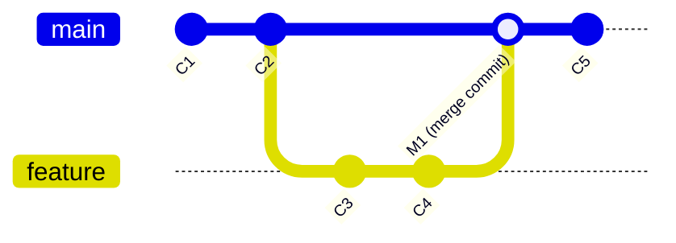
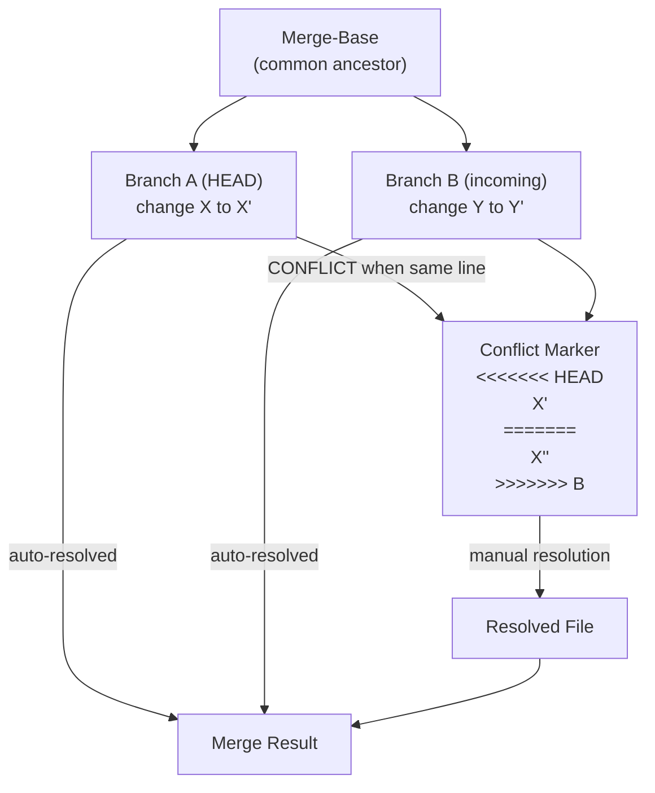
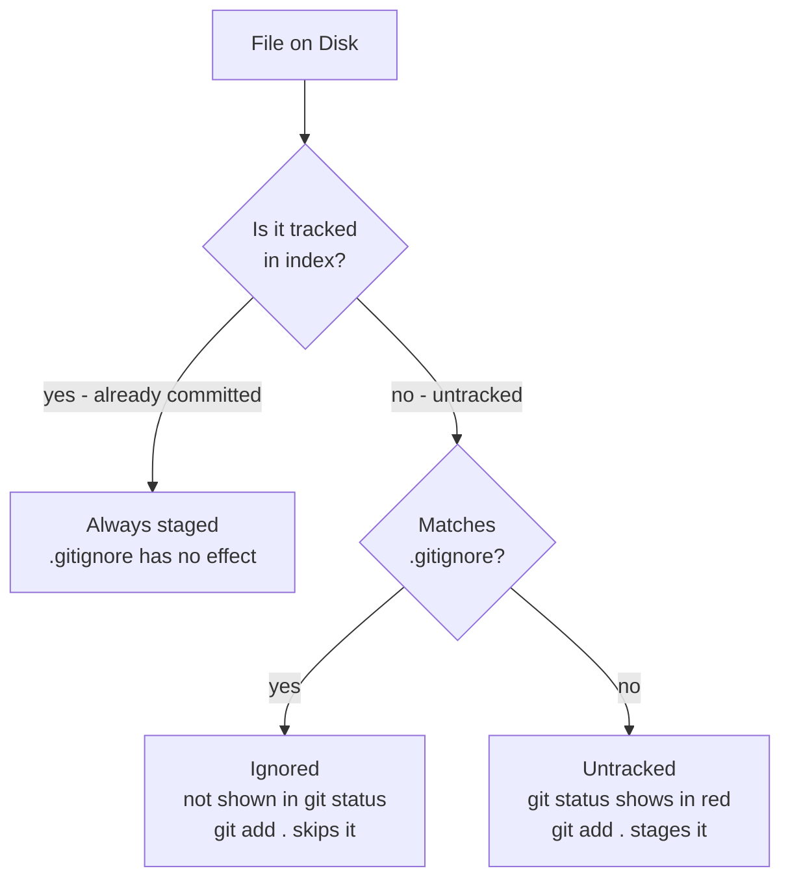

## Keywords in This File
{: .no_toc }

| # | Keyword | Weight |
|---|---|---|
| 7 | [Merging Strategies: Fast-Forward vs Merge Commit](#merging-strategies-fast-forward-vs-merge-commit) | high |
| 8 | [Conflict Resolution](#conflict-resolution) | high |
| 9 | [.gitignore and .gitattributes](#gitignore-and-gitattributes) | medium |

---

# Merging Strategies: Fast-Forward vs Merge Commit

**Interview Weight:** High - Every developer encounters merge decisions daily. Interviewers use this to distinguish engineers who understand Git's object model from those who follow tribal knowledge. Follow-up questions probe when to use `--no-ff`, `--squash`, and `--ff-only`.

---

## Quick Reference

**One-line definition:** Fast-forward merge advances the target branch pointer to the source tip when no divergence exists; merge commit creates a new commit with two parents preserving explicit branch history; both are valid with different trade-offs for history legibility.

**Difficulty:** ★☆☆ | **Asked at:** Mid-Senior | **Seniority:** Junior-Senior

---

### 🎯 Model Answer

**30 seconds:**
A fast-forward merge is what happens when the target branch has not diverged from the source - Git simply advances the target branch pointer to the source tip, no new commit created. A merge commit creates an explicit new commit with two parent pointers, preserving the record that two branches were integrated. The choice: fast-forward produces clean linear history; merge commit preserves the branch topology (when feature work was done and integrated).

**3 minutes (Senior):**
Fast-forward is Git's default when the topology allows it: if `main` is an ancestor of `feature`, merging `feature` into `main` can fast-forward because all of feature's commits are already properly ordered after main's last commit. No new object is needed; only the branch pointer file changes.

Merge commit is required when the branches have diverged (both have commits not in the other), or can be forced with `--no-ff` even when fast-forward is possible. The merge commit is a snapshot like any commit, but its two parent pointers allow tools to reconstruct the branch topology.

`--squash` is a third option: it takes all the changes introduced by the source branch, creates a new single commit on the target branch, but does NOT record a parent pointer to the source branch. The result looks like a single commit to history tools, which is clean for small features but loses granular history.

Production decision framework: use `--ff-only` for straightforward branch synchronization (rebased PRs, updating local main from remote). Use `--no-ff` for feature merges where you want an explicit record in `git log --graph`. Use `--squash` for cleaning up experimental/draft branches with noisy commit history before integrating.

**Framework:** TOPOLOGY CHECK -> DIVERGED? -> MERGE COMMIT (required) or FAST-FORWARD (default) or FORCED MERGE COMMIT (--no-ff)

*Adapting up:* Add octopus merges - merging 3+ branches simultaneously. Git handles this for independent changes but fails if any two sources conflict with each other.

*Adapting down:* Junior answer: "Fast-forward is like advancing a bookmark - no new commit. Merge commit is a new commit that records where two branches came together."

**Blank Mind Recovery:**

**(1) Restate:** "Fast-forward vs merge commit - two ways Git combines branches."

**(2) First principles:** "To combine two branches you need to record their histories together. If one branch is strictly ahead, just advance the pointer (fast-forward). If they diverged, you need a new commit that records both parents."

**(3) Bridge:** "Like train tracks: fast-forward is a train reaching the junction and continuing on the same track (no fork happened). A merge commit is where two separate tracks rejoin - a physical junction point you can see on the map."

---

### 📘 Concept Explanation

**What it is:**
Git merge strategies for integrating branch work into another branch. Fast-forward is a pointer-only operation; merge commit creates a new commit with two parent references.

**The problem it solves:**
When work happens on two branches simultaneously, integration must incorporate both histories into one coherent timeline. Different merge strategies produce different history shapes with different trade-offs for readability, auditability, and revertibility.

**How it works:**

```
Fast-Forward (no divergence):
Before:   main: C1-C2
          feature: C1-C2-C3-C4
After git merge feature:
          main: C1-C2-C3-C4
          (same commits - no new object, pointer moved)

Merge Commit (diverged):
Before:   main: C1-C2-C3m
          feature: C1-C2-C3f-C4f
After git merge feature:
          main: C1-C2-C3m-M1
                         \  /
                    C3f-C4f
M1 has two parents: C3m and C4f

No-FF Merge (fast-forward possible, but forced merge commit):
Before:   main: C1-C2
          feature: C1-C2-C3
After git merge --no-ff feature:
          main: C1-C2-M1
                       \  
                    C3 (parent of M1, alongside C2)
```

> **Code walkthrough:** The example above illustrates the core mechanism. The runtime processes the code in the sequence shown, applying the key pattern at each step. Misapplying this pattern results in subtle bugs or degraded performance. The takeaway: follow the structure shown to avoid the common pitfall.

> **Diagram walkthrough:** The ASCII shows three merge scenarios. Fast-forward requires no new commit - the main pointer simply advances to C4. Diverged merge requires M1 (merge commit) with two parents because both C3m and C4f need to be ancestors of main's new tip. No-FF forces a merge commit even when fast-forward was possible - this is the "merge bubble" visible in `git log --graph`. Edge case: after a merge, `git log main` shows ALL commits reachable from main's tip (via both parent chains), so `git log main` after a merge commit shows all feature branch commits. Senior insight: the merge commit is the mechanism that makes `git log --graph --oneline` show branch topology - without merge commits, history looks entirely linear.



> **Code walkthrough:** The example above illustrates the core mechanism. The runtime processes the code in the sequence shown, applying the key pattern at each step. Misapplying this pattern results in subtle bugs or degraded performance. The takeaway: follow the structure shown to avoid the common pitfall.

> **Diagram walkthrough:** The gitGraph shows a feature branch diverging from main at C2, adding C3 and C4, then being merged back to main as merge commit M1. C5 is a subsequent commit on main. The key relationship: M1 records both C2 (main tip before merge) and C4 (feature tip) as parents, making the full feature history reachable from main. Edge case: if the merge is fast-forward, no M1 exists - main's pointer jumps directly to C4, and the graph looks linear. Senior insight: the presence or absence of a merge commit is detectable by checking if a commit has one parent (regular commit or squash merge) or two parents (`git cat-file -p <sha>` shows `parent` lines count).

**The key insight:**
The choice between fast-forward and merge commit is a history documentation decision, not a technical necessity. Fast-forward history is linear and easy to read with `git log`; merge commit history accurately represents when features were developed in parallel.

**When to use it:**
- Fast-forward (`--ff-only`): when you want clean linear history (rebased PRs, updating local main)
- Merge commit (`--no-ff`): when you want explicit "feature was merged" markers in history
- Squash merge: when feature branch has messy commit history (WIP commits, typo fixes) that you want collapsed to one clean commit

**When NOT to use it:**
- Do not use `--squash` if the feature branch will be merged multiple times or needs history for bisect
- Do not use fast-forward exclusively on shared long-running branches where topology matters for audit

**Alternatives:**
- Rebase before merge (`git rebase main && git merge --ff-only`) - combines: linear history AND explicit feature record via fast-forward
- Squash merge via PR UI - available in GitHub/GitLab, simplest way to squash without CLI

**First-principles derivation:**
Given commits are immutable objects and branches are pointers, merging has two operations: (1) combine the work (resolve conflicts), and (2) record the history relationship (pointer update or new merge commit). Fast-forward only does (2) without (1) because there is no conflict resolution needed when one branch is a strict ancestor of the other.

---

### 💻 Code Example

```bash
# Fast-forward (default when no divergence)
git checkout main
git merge feature/login
# Fast-forward: main pointer advances to feature tip
# Output: "Fast-forward"

# Prevent fast-forward, always create merge commit
git merge --no-ff feature/login
# Creates M1 with message "Merge branch 'feature/login'"

# Require fast-forward, fail if not possible
git merge --ff-only feature/rebased-branch
# Fails if branches diverged

# Squash merge - one commit, no branch parent pointer
git merge --squash feature/cleanup
git commit -m "feat: add user profile feature (squashed)"
# Creates one commit; git log won't show feature branch commits

# See merge topology
git log --oneline --graph
# * M1 Merge branch 'feature/login'
# |\
# | * C4 Add login button
# | * C3 Add auth service
# |/
# * C2 Initial setup

# Check if a commit is a merge commit
git cat-file -p M1-sha | grep parent
# parent abc123  <- main parent
# parent def456  <- feature parent
# Two parent lines = merge commit
```

> **Code walkthrough:** `git merge feature/login` with no flags attempts fast-forward and succeeds if main is an ancestor of feature. `--no-ff` forces a merge commit regardless, adding the visible branch bubble in `git log --graph`. `--ff-only` protects against accidental merge commits on branches that should always be rebased first. The `git cat-file -p` check shows merge commits have two parent lines - this is how `git log --merges` works. What breaks: `git merge --squash` creates a new commit but does NOT advance the feature branch pointer - if you then try to `git merge --squash feature` again later, Git will try to squash all commits again (including ones already squashed). Takeaway: squash merge is one-way; after squashing, delete the feature branch to prevent future accidental re-squashes.

---

### 🎓 Answers by Seniority

**Junior / Mid (0-5 years):**
> "Fast-forward merge advances the branch pointer to the tip of the feature branch when no divergence exists - it is just moving a bookmark. A merge commit creates a new commit recording where two branches met. The difference in history: fast-forward looks linear, merge commit shows the branch structure in `git log --graph`."

*Push deeper:* Use `--no-ff` when you always want an explicit record of when a feature was merged, even if a fast-forward was possible. Many teams configure this as default for feature merges.

---

**Senior / Staff (5+ years):**
> "The merge strategy decision is a history documentation decision. Fast-forward produces linear history that is easy to read but loses information about when features were developed in parallel. Merge commits preserve topology but create 'bubble' patterns in the graph. My team's convention: rebase feature branches onto main before merging, then use `--no-ff` to get both linear feature history AND an explicit merge record. This is the cleanest balance."

At Staff level: the discussion extends to tooling implications. GitHub's "Squash and Merge" is effectively `--squash`. "Rebase and Merge" creates linear history without a merge commit. "Merge Commit" uses `--no-ff`. Each strategy has implications for `git bisect`, `git blame`, and automated changelog generation.

*Push deeper:* Discuss how `--squash` is used specifically for draft/experimental branches where the commit history was undisciplined (30 "WIP" commits), while `--no-ff` is used for well-maintained feature branches where each commit has a clear purpose.

---

### ⚠️ Common Misconceptions

**Misconception 1: "Merge commit is safer than fast-forward."**
Reality: Fast-forward and merge commit are both safe - they do not lose work. The difference is history shape. Fast-forward is simpler (no new object), not less safe.

**Misconception 2: "Squash merge preserves history."**
Reality: Squash merge creates one new commit with the combined changes and no parent pointer to the feature branch. The individual commits from the feature branch are unreachable from main's history after a squash merge. The feature branch must be deleted or kept explicitly to preserve those commits.

**Misconception 3: "git merge always creates a merge commit."**
Reality: `git merge` attempts fast-forward by default and creates a merge commit only when fast-forward is not possible. Use `--no-ff` to always create a merge commit.

**Misconception 4: "You can only merge into the current branch."**
Reality: `git merge source target` syntax only works in some git versions. Typically you must checkout the target branch first. But `git checkout main && git merge feature` is always correct.

---

### 🚨 Failure Modes and Diagnosis

**Failure 1: Merge commit on a clean rebase PR**
Symptom: `git log --graph` shows unnecessary merge bubbles for every single-commit PR.
Cause: Using `git merge` (with fast-forward default) on branches that were not rebased onto current main.
Diagnosis: `git log --graph --oneline` shows merge bubble for each PR.
Fix: Configure `git merge --ff-only` as team default. Require PR authors to rebase before merge. Or switch to squash-merge strategy for all PRs.

**Failure 2: Accidental double-squash of already-merged branch**
Symptom: Re-running `git merge --squash feature` after it was already squash-merged creates conflicts or duplicate changes.
Cause: Feature branch was not deleted after squash merge; later someone runs the squash command again thinking it was not merged.
Diagnosis: `git log feature --oneline` shows commits that are conceptually already in main.
Fix: Always delete feature branches after squash merge. Branch protection: auto-delete after merge.

**Failure 3: Merge creates unexpected file deletions**
Symptom: After merging, files that existed on the target branch are missing.
Cause: The feature branch deleted the files (explicitly or as part of a rename) and the merge applied the deletion.
Diagnosis: `git diff main..feature --name-status | grep ^D` lists files deleted in feature.
Fix: `git checkout main -- deleted-file` restores the file post-merge, then commit.

---

### 🎯 Interview Deep-Dive

| Category | Count | Coverage |
|---|---|---|
| Conceptual | 3 | FF vs merge commit, squash, parent pointers |
| Debugging | 2 | Merge commit noise, squash issues |
| Trade-off | 1 | History shape vs topology preservation |
| Behavioral | 1 | Merge strategy decision |

---

**[MID] Q1 - When would you use `git merge --squash` vs a regular merge?**

Use `--squash` when the feature branch has a noisy commit history that you do not want to preserve - many "WIP", "fix typo", "oops" commits that do not add meaning. Squash collapses all feature work into one clean commit with a well-written message.

Use a regular merge (with or without `--no-ff`) when each commit on the feature branch has a clear, single purpose and should be individually visible in history. This supports `git bisect` working at the per-commit level.

The trade-off: squash history is readable (`git log main --oneline` shows one line per feature) but loses granularity. Regular merge preserves granularity but requires commit discipline on the feature branch. Teams with strong commit message standards (enforced by hooks) can use regular merges cleanly; teams without standards often find squash is the only way to keep main's history readable.

*What separates good from great:* Understanding that `git blame` after a squash merge points to the squash commit for all changed lines, while blame after a regular merge points to the individual commits. This affects how useful blame is for understanding why specific lines were written.

---

**[SENIOR] Q2 - How does merge strategy affect `git bisect` effectiveness?**

`git bisect` binary-searches the commit graph to find which commit introduced a bug. It works by checking out commits between a known-good and known-bad SHA, running a test, and halving the search space.

With squash merges: bisect searches at the feature-merge-commit level. If the bug was introduced somewhere in a 50-commit feature that was squashed, bisect finds the one squash commit but cannot narrow further within the feature. You must manually inspect the feature branch history.

With regular merges: bisect searches all individual commits, including those from feature branches. A 50-commit feature has 50 searchable points, giving much finer granularity. Bisect can identify the exact commit within the feature.

With rebase-and-merge: bisect searches the linear chain, including all feature commits. Same granularity as regular merge, but with cleaner linear graph.

Production implication: if your team uses bisect regularly for debugging (which they should), individual commits reachable from main are essential. This is an argument for `--no-ff` or rebase-and-merge over squash.

*What separates good from great:* Understanding that merge strategy is a debugging infrastructure decision, not just an aesthetic history preference.

---

**[SENIOR] Q3 - What is an octopus merge and when is it useful?**

An octopus merge integrates more than two branches simultaneously, creating a merge commit with three or more parent pointers. `git merge branch-a branch-b branch-c` performs an octopus merge if the branches are mutually compatible.

Git restricts octopus merges to cases where all changes are independent - if any two of the source branches have conflicting changes with each other, the octopus merge fails. Git cannot automatically resolve a three-way conflict when the "common ancestor" is unclear.

Use cases: (1) Integrating multiple independent topic branches in a single integration step - used in Linux kernel development where many independent driver patches are merged. (2) Closing out an entire set of completed but independent features in one commit.

For most application development, octopus merges are unnecessary and the multi-parent commit graph can confuse tools. Two-branch merges are almost always clearer.

*What separates good from great:* Knowing that Git supports octopus merges and understanding the constraint (no inter-branch conflicts) demonstrates understanding of the merge algorithm, not just the UI.

---

**[STAFF] Q4 - How do you configure a team's merge strategy as a policy, not just a convention?**

GitHub's "Merge options" settings (under repository Settings > General) let you disable specific merge strategies:

- Enable/disable "Allow merge commits" (create merge commit, `--no-ff`)
- Enable/disable "Allow squash merging" (`--squash`)
- Enable/disable "Allow rebase merging" (rebase and fast-forward)

By enabling only one strategy, you enforce team policy through the platform rather than relying on developer discipline.

For local enforcement: a `pre-merge-commit` Git hook can inspect the merge and reject it based on rules. For example, a hook that fails if the merge commit message does not follow a pattern, or if the branch being merged is more than N days old.

Combined with a `pull.rebase=true` configuration distributed via a team `.gitconfig` (shared via a dotfiles repository), you can achieve consistent merge behavior across all developer machines.

*What separates good from great:* Configuring at the platform level (GitHub settings) prevents the policy from being bypassed locally. A team convention that depends on every developer remembering to use `--no-ff` will be violated; a platform-enforced policy will not.

---

**[STAFF] Q5 - What is the relationship between merge strategy and CI/CD deployment reliability?**

The merge strategy affects which commit is deployed and how rollbacks work.

Squash merge: deployment tags the squash commit. Rollback reverts the squash commit, which contains all feature changes as a single delta. Simple to reason about - one commit to revert.

Regular merge with merge commit: deployment tags the merge commit. Rollback reverts the merge commit, which introduces a reverse merge. Clean but can re-introduce the parent state incorrectly if the merge was complex.

Rebase and fast-forward merge: deployment tags the last rebased commit. Rollback reverts a single atomic feature commit. Clean, but requires every commit in the feature to be individually deployable (safe to have any subset in production).

The highest-reliability CI/CD systems use a merge queue that runs CI on the exact merge commit (post-merge, before the merge applies to main). This catches integration issues that did not appear when testing the feature branch in isolation.

*What separates good from great:* The merge strategy determines what artifact a deployment corresponds to. Teams that cannot answer "which commit is in production right now?" with a single SHA have a deployment visibility problem regardless of merge strategy.

---

**[STAFF] Q6 - Describe how you made a team's merge strategy consistent across 20+ repositories.**

[BEHAVIORAL]

**S:** A platform engineering team managed 28 microservice repositories. Every team had different merge conventions - some used squash, some merge commits, some had no policy. Cross-service debugging was painful because git histories were inconsistent.

**T:** Standardize merge strategy across all 28 repositories as part of a DX initiative.

**A:** I conducted a brief survey to understand team preferences and discovered a split between "squash for clean history" (smaller features) and "merge commit for auditing" (compliance-sensitive services). Rather than enforce one strategy, I created two policy templates: Template A (compliance): merge commit + no squash/rebase, auto-deletes branches post-merge. Template B (velocity): squash-only + branch auto-delete. I created a GitHub Actions workflow that enforced the template's settings using the GitHub API on any PR that violated the policy.

I distributed a shared `.github/` configuration repository (GitHub's inherited settings feature) that applied the template to all repos in the organization without requiring per-repo changes. Teams opted into Template A or Template B by adding a single configuration file.

**R:** Within 3 weeks, all 28 repositories had consistent merge settings. Compliance audits for the Template A repositories could now reliably trace any deployed feature to its merge commit with reviewer information.

*What separates good from great:* Using GitHub's inherited repository configuration avoids the maintenance problem of duplicating settings across 28 repos. The two-template approach respected team autonomy while achieving cross-team consistency.

---

**[JUNIOR] Q7 - What does the output "Already up to date" mean in git merge?**

"Already up to date" means the target branch already contains all commits from the source branch - the source tip is an ancestor of the target tip. There is nothing to merge because all source work is already in the target's history.

This happens when: (1) The source branch was already merged and then new commits were added to target. (2) You accidentally try to merge in the wrong direction.

Example: `git checkout main && git merge feature` after feature was merged to main (via fast-forward) would show "already up to date" because main's HEAD is the same as or a descendant of feature's tip.

This is not an error; it is Git telling you the merge is a no-op.

*What separates good from great:* Understanding that this is the natural state after a fast-forward merge - the branches converged to the same SHA, so there is nothing to integrate.

---

### ⚖️ Comparison Table

*(Omit: ★☆☆ keyword - comparison table applies to ★★☆ and above.)*

---

### 🏛️ System Design

*(Omit: Not a ★★★ keyword.)*

---

### 📊 Diagram

*(Omit: ASCII and Mermaid diagrams are included in the Concept Explanation section.)*

---
---

# Conflict Resolution

**Interview Weight:** High - Merge conflicts are an unavoidable part of collaborative development. Every engineer encounters them; senior engineers are expected to diagnose, explain, and prevent them systematically.

---

## Quick Reference

**One-line definition:** A merge conflict occurs when two branches have modified the same lines of a file differently; Git cannot auto-resolve the difference and inserts conflict markers for human resolution before the merge can complete.

**Difficulty:** ★☆☆ | **Asked at:** All levels | **Seniority:** Junior-Senior

---

### 🎯 Model Answer

**30 seconds:**
A conflict occurs when two branches change the same lines in a file in different ways - Git cannot determine which version to keep. Git pauses the merge and inserts conflict markers (`<<<<<<<`, `=======`, `>>>>>>>`) into the affected file. You resolve by editing the file to the correct final state, removing the markers, staging the file with `git add`, and completing the merge with `git commit`.

**3 minutes (Senior):**
Git's three-way merge algorithm compares three versions: the common ancestor (merge-base), the current branch version (ours), and the incoming branch version (theirs). If both branches changed the same hunk differently from the ancestor, Git cannot automatically choose - that is a conflict. If only one branch changed the hunk, Git picks that version automatically.

The conflict marker format: `<<<<<<< HEAD` starts the ours section (your branch's version), `=======` is the divider, `>>>>>>> feature` ends the theirs section (incoming version). The correct resolution might be either version, a combination, or something entirely different that the developer must determine based on intent.

Prevention is more valuable than resolution: conflicts arise from long-lived branches that diverge significantly. Short-lived branches (trunk-based development) and frequent integration (rebasing your branch onto main regularly) dramatically reduce conflict frequency. When conflicts do occur, `git rerere` (reuse recorded resolution) can automatically apply the same resolution if the same conflict recurs.

**Framework:** CONFLICT DETECTION (three-way diff) -> MARKER INSERTION -> MANUAL RESOLUTION -> STAGE -> COMPLETE MERGE

*Adapting up:* Add the ours/theirs merge strategies (`git merge -s ours`) and how rerere stores resolutions.

*Adapting down:* Junior answer: "Two people changed the same part of a file differently. Git shows you both versions with markers. You edit the file to the right version, save, add it, and commit."

**Blank Mind Recovery:**

**(1) Restate:** "Conflict resolution - what to do when two branches edited the same part of a file."

**(2) First principles:** "If A says 'change line 42 to X' and B says 'change line 42 to Y', a computer cannot choose between X and Y without understanding intent. It flags the question for you to answer."

**(3) Bridge:** "It is like two people editing the same document paragraph simultaneously. The editor (Git) highlights the two versions and says 'you decide which one to keep or how to combine them.'"

---

### 📘 Concept Explanation

**What it is:**
A merge conflict is a condition where Git's three-way merge algorithm cannot automatically determine the correct resolution because both branches have incompatible changes to the same content.

**The problem it solves:**
Git automates most merge resolutions (non-overlapping changes). Conflicts are the cases where automation cannot proceed safely. The conflict marker system makes the required human decision visible and actionable.

**How it works:**

```
Merge-base (common ancestor):
  int timeout = 30;
  String message = "default";

Branch A (ours):
  int timeout = 60;       <- changed from 30
  String message = "default";

Branch B (theirs):
  int timeout = 30;
  String message = "custom";  <- changed from "default"

Three-way merge result:
  int timeout = 60;       <- auto-resolved (only A changed it)
  String message = "custom";  <- auto-resolved (only B changed it)

-- But if BOTH branches changed timeout differently:
Branch A: int timeout = 60;
Branch B: int timeout = 45;

Conflict output in file:
<<<<<<< HEAD
  int timeout = 60;
=======
  int timeout = 45;
>>>>>>> feature/perf-tuning
```

> **Code walkthrough:** The example above illustrates the core mechanism. The runtime processes the code in the sequence shown, applying the key pattern at each step. Misapplying this pattern results in subtle bugs or degraded performance. The takeaway: follow the structure shown to avoid the common pitfall.

> **Diagram walkthrough:** The ASCII shows Git's three-way merge logic. When only one branch changes a line from the ancestor state, Git auto-resolves in favor of the change. When both branches change the same line differently from the ancestor, Git cannot determine intent and marks the conflict. The conflict markers delimit "ours" (HEAD) vs "theirs" (incoming branch) versions. Edge case: a "phantom conflict" occurs when two branches both deleted the same line - Git sees both as deletions and auto-resolves (no conflict), but if only one branch deleted a line that the other modified, Git may incorrectly keep a line that should be deleted. Senior insight: the three-way merge requires a shared common ancestor; `git merge-base A B` shows which commit Git uses as the base.



> **Code walkthrough:** The example above illustrates the core mechanism. The runtime processes the code in the sequence shown, applying the key pattern at each step. Misapplying this pattern results in subtle bugs or degraded performance. The takeaway: follow the structure shown to avoid the common pitfall.

> **Diagram walkthrough:** The diagram traces the three-way merge flow. The merge-base is the starting point. Both branches diverge from it with changes. When changes are to different regions, Git auto-merges both into the result. When changes overlap (same lines), Git cannot auto-resolve and inserts conflict markers. Human resolution produces a clean file that then feeds the merge commit. Key relationship: the merge-base is critical - a bad merge-base (e.g., from a complex merge history) can cause Git to produce incorrect auto-resolutions for lines that were not actually conflicting semantically. Senior insight: `git diff3` conflict style adds a third section showing the common ancestor, which helps when the context of the original change matters for resolution.

**The key insight:**
Most merge conflicts are symptoms of process problems - long-lived branches, insufficient integration frequency, or unclear ownership of code regions. Fixing the process reduces conflicts more effectively than improving resolution skills.

**When to use it:**
Conflict resolution is needed whenever `git merge` or `git rebase` encounters overlapping changes. The manual process: (1) `git status` to list conflicted files. (2) Edit each conflicted file. (3) `git add conflicted-file`. (4) `git commit` (for merge) or `git rebase --continue` (for rebase).

**When NOT to use it:**
If conflicts are frequent on a specific file or module, that is a signal the code region has unclear ownership or is being changed by too many concurrent branches. Architectural refactoring to reduce coupling is preferable to conflict resolution as a coping mechanism.

**Alternatives:**
- `git mergetool` - opens a three-pane diff tool for visual resolution
- `git checkout --ours filename` - take the entire file from your branch (discard theirs)
- `git checkout --theirs filename` - take the entire file from incoming branch (discard yours)
- `git rerere` - reuse recorded resolutions for recurring conflicts

**First-principles derivation:**
The three-way merge algorithm is optimal for text-based code files. It requires a common ancestor to distinguish "intentional deletion" from "I never had this content." Two-way merges (diff only between branches, no ancestor) cannot make this distinction and produce significantly more false conflicts. The common-ancestor requirement is why `git fetch` is needed before merge - the merge-base must be in the local object store.

---

### 💻 Code Example

```bash
# Simulate and resolve a merge conflict

# Setup: two branches change the same line
git init conflict-demo && cd conflict-demo
echo "timeout: 30" > config.txt
git add config.txt && git commit -m "initial"

git checkout -b feature-a
echo "timeout: 60" > config.txt
git commit -am "increase timeout"

git checkout main
echo "timeout: 45" > config.txt
git commit -am "optimize timeout"

# Merge - this will conflict
git merge feature-a
# CONFLICT (content): Merge conflict in config.txt
# Automatic merge failed; fix conflicts then commit.

# See what's in the file
cat config.txt
# <<<<<<< HEAD
# timeout: 45
# =======
# timeout: 60
# >>>>>>> feature-a

# Resolve: decide on the correct value
echo "timeout: 60" > config.txt  # chose 60 as correct

# Mark as resolved and complete
git add config.txt
git commit -m "Merge feature-a: use 60s timeout"

# Using mergetool for visual resolution
git mergetool
# Opens configured diff tool (vimdiff, kdiff3, etc.)

# rerere - reuse recorded resolutions
git config rerere.enabled true
# Next time same conflict occurs, rerere auto-applies
```

> **Code walkthrough:** The setup creates two branches both changing `config.txt` line 1 differently. `git merge feature-a` detects the conflict and stops, inserting markers. `cat config.txt` shows the literal conflict markers in the file. Resolution is straightforward: choose the correct value, remove markers, stage, commit. `git mergetool` launches a visual diff tool that shows three panels (base, ours, theirs) making the resolution context clearer for complex conflicts. `git config rerere.enabled true` activates rerere - if the same conflict pattern recurs (e.g., after rebasing the same feature onto multiple release branches), Git automatically applies the previously recorded resolution. What breaks: if you accidentally commit the file WITH conflict markers still inside, those markers become source code. Your application will fail to compile or parse the file at runtime. Always use `git diff --staged | grep "<<<<<<" ` before committing after a merge. Takeaway: verify no conflict markers remain in staged files before committing.

---

### 🎓 Answers by Seniority

**Junior / Mid (0-5 years):**
> "A conflict happens when two branches changed the same lines differently. Git inserts markers showing both versions. I edit the file to the correct resolution, remove the markers, run `git add` to stage the resolved file, and complete the merge with `git commit`. `git status` shows which files still have conflicts."

*Push deeper:* Use `git diff3` conflict style (`git config merge.conflictstyle diff3`) to see the common ancestor version in the conflict markers - this adds a third section showing what the line looked like before either branch changed it, which is very helpful for complex conflicts.

---

**Senior / Staff (5+ years):**
> "Conflict resolution is the last resort. Prevention through trunk-based development, frequent integration, and clear module ownership eliminates 80% of conflicts. When conflicts do occur, `git rerere` is the power tool - it records each conflict resolution and automatically replays it when the same conflict appears again, which is invaluable when cherry-picking fixes across multiple release branches."

At Staff level: the conversation shifts to tooling and prevention. Static analysis tools (linters, formatters with deterministic output) reduce style-related conflicts. Architecture decisions (clear service boundaries, avoiding shared mutable state in code) reduce semantic conflicts. The question "why is this file conflicting?" is often more valuable than "how do we resolve this?"

*Push deeper:* Discuss the `.gitattributes` merge driver setting - custom merge drivers for specific file types (like `ours` strategy for auto-generated files or lock files that should always use the local version).

---

### ⚠️ Common Misconceptions

**Misconception 1: "Conflicts mean someone made a mistake."**
Reality: Conflicts are a normal part of parallel development. They are evidence that two developers worked on the same area of code concurrently. The problem is not that conflicts occur but when they occur frequently on the same files (which signals architectural or process issues).

**Misconception 2: "git checkout --ours always takes your version."**
Reality: During a rebase, "ours" and "theirs" swap perspective. In `git rebase main`, your feature branch commits are being replayed ONTO main, so "ours" is main and "theirs" is your feature branch. This confuses many developers who use `git checkout --ours` expecting to keep their feature work.

**Misconception 3: "Resolving conflict markers is all you need to do."**
Reality: Removing conflict markers and staging the file marks the conflict as resolved syntactically, but the semantic correctness is your responsibility. Git has no way to check if the resolution is logically correct. Conflicts in shared data models or API contracts may need broader coordination beyond just editing the conflicting lines.

**Misconception 4: "git merge --abort undoes all changes."**
Reality: `git merge --abort` cancels the in-progress merge and restores the pre-merge state. It does NOT undo commits that were already part of the working tree before the merge started. It only undoes what the merge operation changed.

---

### 🚨 Failure Modes and Diagnosis

**Failure 1: Conflict markers committed to codebase**
Symptom: CI build fails with parse error; `SyntaxError: unexpected '<'` or similar; production reports 500 errors.
Cause: Conflict markers (`<<<<<<<`, `=======`, `>>>>>>>`) left in code files and committed.
Diagnosis: `git log -p --since=1.day -- '*.java' | grep "<<<<<<" ` finds recent commits with markers.
Fix: Fix the file, remove markers, commit. Prevention: add `grep -r "<<<<<<" src/` as a pre-commit hook check.

**Failure 2: "Wrong" resolution causing bugs**
Symptom: Feature worked on branch, merged cleanly (no conflict error), but production has unexpected behavior.
Cause: Auto-merged code or a hastily-resolved conflict introduced incorrect logic (e.g., the wrong timeout value, the wrong null check).
Diagnosis: `git log --merges --since=3.days` shows recent merges; `git show <merge-sha> --stat` shows what changed.
Fix: `git revert <merge-sha>` reverts the merge commit; then investigate and re-resolve correctly.

**Failure 3: Perpetual conflicts on the same file**
Symptom: Every PR that touches `OrderService.java` has conflicts with every other concurrent PR.
Cause: A high-traffic file is simultaneously modified by many branches; the module has poor separation of concerns.
Diagnosis: `git log --since=30.days --follow -p -- OrderService.java | grep "Conflict" | wc -l` shows conflict frequency.
Fix: Refactor the high-conflict file into smaller files with clear ownership; assign explicit module ownership via CODEOWNERS.

---

### 🎯 Interview Deep-Dive

| Category | Count | Coverage |
|---|---|---|
| Conceptual | 3 | Three-way merge, markers, rerere |
| Debugging | 2 | Markers in production, perpetual conflicts |
| Trade-off | 1 | Ours vs theirs in rebase context |
| Behavioral | 1 | Conflict prevention strategy |

---

**[JUNIOR] Q1 - What do conflict markers mean and how do you resolve them?**

Conflict markers are Git's way of showing you two incompatible versions of the same code region. The format:

```
<<<<<<< HEAD          <- start of ours (current branch)
int timeout = 60;     <- your branch's version
=======               <- divider
int timeout = 45;     <- incoming branch's version
>>>>>>> feature-a     <- end of theirs (incoming branch)
```

> **Code walkthrough:** The example above illustrates the core mechanism. The runtime processes the code in the sequence shown, applying the key pattern at each step. Misapplying this pattern results in subtle bugs or degraded performance. The takeaway: follow the structure shown to avoid the common pitfall.

Resolution process: (1) Understand what each version is trying to do (read the surrounding context). (2) Edit the file to the correct state - this might be the ours version, the theirs version, or something new that combines both intents. (3) Remove all three marker lines (`<<<<<<<`, `=======`, `>>>>>>>`). (4) `git add filename` to mark as resolved. (5) `git commit` (for merge) or `git rebase --continue` (for rebase).

Verify no markers remain: `grep -r "<<<<<<" src/` before committing. Most IDEs highlight unresolved markers in the gutter.

*What separates good from great:* The resolution requires understanding the INTENT of both changes, not just picking one syntactically. If both branches are trying to make a correct change (one increased timeout for reliability, one decreased for performance), the right resolution might require a deeper conversation, not a syntactic merge.

---

**[MID] Q2 - What is `git rerere` and when would you enable it?**

`git rerere` (Reuse Recorded Resolution) records the pre-resolution conflict state and the human-provided resolution. On subsequent encounters of the identical conflict (same before-state), Git automatically applies the recorded resolution.

When this is invaluable: (1) Maintaining multiple release branches (e.g., `release/1.x`, `release/2.x`) where you cherry-pick security fixes. The same fix creates the same conflict on each branch. With rerere, you resolve once; subsequent branch applications resolve automatically. (2) Long-lived feature branches being repeatedly rebased onto main - if main adds a commit that conflicts with your feature, every rebase encounter creates the same conflict. Rerere resolves it automatically after the first time. (3) Team workflows where the same dependency upgrade PR conflicts with multiple feature PRs.

Enabling: `git config --global rerere.enabled true`. Rerere stores resolution data in `.git/rr-cache/`.

Limitation: rerere only applies if the CONFLICT HUNK is identical (same before-state). If the surrounding context changes (because main evolved further), the conflict hunk differs and rerere cannot match.

*What separates good from great:* Knowing that rerere is a quality-of-life tool for specific workflows (multi-branch maintenance, long-lived features). For simple single-branch workflows, it adds no value.

---

**[MID] Q3 - What is the difference between `git checkout --ours` and `git checkout --theirs` during a rebase vs a merge?**

During a `git merge`: "ours" means your current branch (HEAD), "theirs" means the incoming branch being merged. This is intuitive.

During a `git rebase`: the semantics flip. When rebasing your feature branch onto main, Git replays your feature commits one by one on top of main. During this replay, "ours" is the version from main (the base you are rebasing onto) and "theirs" is your feature commit being replayed. This is counterintuitive but logically consistent: in rebase, your feature commits are the "incoming" work being applied to the existing base.

Practical impact: `git checkout --ours file` during a rebase takes main's version (might not be what you want). `git checkout --theirs file` during a rebase takes your feature's version (what you probably wanted when you said "ours").

This confusion is documented and a known Git UX problem. When in doubt during a rebase conflict, use a merge tool that shows both versions labeled clearly rather than relying on `--ours` / `--theirs`.

*What separates good from great:* Many developers have made wrong conflict resolutions during rebase because they forgot the ours/theirs swap. Knowing this exists is the first step to never making that mistake.

---

**[SENIOR] Q4 - How does `git diff3` conflict style improve conflict resolution?**

The default conflict style shows two sections (ours and theirs). `git config merge.conflictstyle diff3` adds a third section showing the base (common ancestor) version:

```
<<<<<<< HEAD
timeout: 60        <- our version
||||||| base
timeout: 30        <- original value (what both started from)
=======
timeout: 45        <- their version
>>>>>>> feature
```

> **Code walkthrough:** The example above illustrates the core mechanism. The runtime processes the code in the sequence shown, applying the key pattern at each step. Misapplying this pattern results in subtle bugs or degraded performance. The takeaway: follow the structure shown to avoid the common pitfall.

The base section shows what both branches changed FROM. Without it, you see two values (60 and 45) and must guess which is "right." With the base (30), you understand: our branch doubled the timeout, their branch added 50%. The right resolution depends on what problem each change was solving.

For complex conflicts spanning many lines, the base section is invaluable: it shows what was deleted, what was added, and what was changed by each branch relative to the starting point. This transforms conflict resolution from guessing to understanding.

Set globally: `git config --global merge.conflictstyle diff3`. Some teams use `zdiff3` (zdiff3 is an improved version available in Git 2.35+) which provides better context alignment.

*What separates good from great:* Understanding that most wrong conflict resolutions happen because developers look at two versions without knowing what both versions are changing FROM. The base section eliminates this ambiguity.

---

**[SENIOR] Q5 - What strategies reduce the frequency of merge conflicts for a team?**

Seven proven strategies in order of impact:

1. **Trunk-based development** - merge to main daily. The longer branches live, the more they diverge. One day of divergence produces trivial conflicts; three weeks produces nightmares.

2. **Module ownership** - assign teams to specific directories. Use CODEOWNERS to enforce. Conflicts arise most when multiple teams change the same files.

3. **Automated formatting** - run `gofmt`, `prettier`, `black` in pre-commit hooks. Style conflicts (tab vs space, trailing comma) are eliminated entirely.

4. **Feature flags** - merge incomplete features behind a flag. No need for long-lived feature branches if you can safely merge incomplete code.

5. **Database migration discipline** - migration files are a frequent conflict source. Use a migration naming convention (timestamp prefix) that prevents file name conflicts: `V20250115_add_user_id.sql`.

6. **Dependency lock file strategy** - lock files (`package-lock.json`, `Gemfile.lock`) conflict when two branches update different packages. Use a merge driver that automatically resolves lock files, or accept lock file regeneration as a post-merge step.

7. **Regular integration** - even without full trunk-based development, rebasing long-lived feature branches onto main weekly keeps divergence small.

*What separates good from great:* Teams that invest in conflict prevention (especially automated formatting and trunk-based development) report 90%+ reduction in merge time spent. The ROI on prevention dwarfs the ROI on better resolution tools.

---

**[STAFF] Q6 - How would you diagnose and fix a recurring conflict pattern in a 20-person team?**

[BEHAVIORAL]

**S:** A team of 20 engineers had a microservice with a single `ApplicationConfig.java` file that accumulated configuration constants. Every sprint, 4-5 PRs each had conflicts in this file.

**T:** Lead an investigation and fix the root cause.

**A:** I ran `git log --follow -p -- src/main/java/.../ApplicationConfig.java | grep "^commit" | wc -l` and found 147 commits touching that file in 6 months - roughly one every day. The file had grown to 400 lines with constants from 8 different functional areas mixed together.

The root cause: poor separation of concerns. The file was a shared dependency that every feature touched. I proposed splitting it into 8 feature-specific config files (`UserConfig`, `PaymentConfig`, etc.) plus a central `ApplicationConfig` that imported them. Each team would only modify their team's file.

I led a 3-hour refactoring session, split the file, updated all imports, and merged it in. To prevent recurrence, I added a CODEOWNERS rule requiring two reviewers for `ApplicationConfig.java` and documented the architectural decision.

**R:** Conflicts in that area dropped to near zero. The single blocker PR (the split refactoring) absorbed the short-term pain and created long-term structural improvement.

*What separates good from great:* The technical fix (splitting the file) was straightforward. The real work was convincing the team that a 3-hour investment in refactoring would save 30+ engineer-hours per sprint in conflict resolution. I used the `git log` data to make that case quantitatively.

---

**[JUNIOR] Q7 - What is `git merge --abort` and when do you use it?**

`git merge --abort` cancels an in-progress merge that has not been completed. It restores the repository to the state it was in before `git merge` was run: your working tree is cleaned up, conflict markers are removed, and the branch is back to its pre-merge tip.

Use it when: (1) You started a merge but realize you merged the wrong branch. (2) The conflicts are more complex than expected and you want to discuss with a teammate before resolving. (3) You need to switch contexts urgently and cannot resolve conflicts right now.

After `git merge --abort`, it is as if the merge never started. You can then safely `git stash`, `git checkout` to another branch, or do anything else.

Important: `git merge --abort` works during an in-progress merge (when conflict markers exist). If you have already committed the merge, you cannot abort - you must use `git revert` to undo the merge commit.

*What separates good from great:* Knowing the distinction between aborting an in-progress merge (before commit) and reverting a completed merge (after commit) prevents the mistake of running `git merge --abort` on an already-committed merge.

---

### ⚖️ Comparison Table

*(Omit: ★☆☆ keyword - comparison table applies to ★★☆ and above.)*

---

### 🏛️ System Design

*(Omit: Not a ★★★ keyword.)*

---

### 📊 Diagram

*(Omit: ASCII and Mermaid diagrams are included in the Concept Explanation section.)*

---
---

# .gitignore and .gitattributes

**Interview Weight:** Medium - These configuration files prevent common team problems (committed secrets, inconsistent line endings, incorrect diff output). Interviewers use this to assess attention to project hygiene and cross-platform awareness.

---

## Quick Reference

**One-line definition:** `.gitignore` lists file patterns that Git should never track; `.gitattributes` controls how Git handles specific files (line endings, diff output, merge drivers, and linguist language detection).

**Difficulty:** ★☆☆ | **Asked at:** All levels | **Seniority:** Junior-Senior

---

### 🎯 Model Answer

**30 seconds:**
`.gitignore` tells Git which files to never track - build artifacts, logs, secrets files, IDE settings. If a file is in `.gitignore`, `git add .` skips it and `git status` shows it as ignored. `.gitattributes` controls how Git treats specific file types: line ending normalization (CRLF vs LF), binary vs text handling, custom diff output, and merge drivers. Both files should be committed to the repository and shared by all team members.

**3 minutes (Senior):**
`.gitignore` is the first line of defense against accidentally committing sensitive files. The patterns are applied to untracked files only - adding a file to `.gitignore` after it has been committed does not remove it from the repository. You must `git rm --cached filename` to stop tracking an already-tracked file without deleting it from disk.

`.gitattributes` is more powerful and less understood. The most critical use: `* text=auto` in `.gitattributes` enables automatic CRLF/LF normalization - Windows developers write CRLF, Linux/Mac developers write LF, but Git stores LF in the repository and translates on checkout. Without this, cross-platform teams accumulate spurious whitespace-only diffs and merge conflicts.

Beyond line endings: `.gitattributes` can mark files as binary (`*.png binary`) preventing diff and merge operations on them. Custom diff drivers can be configured for specific file types - `*.json diff=json` can use a JSON-aware differ that shows semantic changes rather than raw text diffs. Lock files like `Gemfile.lock` can be configured with the `merge=ours` strategy so they are never conflicted.

**Framework:** IGNORE (untracked files) -> .gitignore; HANDLE (tracked files behavior) -> .gitattributes

*Adapting up:* Add the global `.gitignore` (`~/.gitignore_global`) for developer-specific ignores (IDE settings, OS files) that should not be in the project `.gitignore`.

*Adapting down:* Junior answer: "`.gitignore` prevents you from accidentally committing build files, logs, and passwords. `.gitattributes` tells Git how to handle line endings and binary files."

**Blank Mind Recovery:**

**(1) Restate:** ".gitignore and .gitattributes - Git configuration files for filtering and handling files."

**(2) First principles:** "You need to tell Git two things about files: (1) which files should never be tracked at all (build artifacts, secrets), and (2) for files that ARE tracked, how should Git handle them (line endings, binary vs text)."

**(3) Bridge:** "`.gitignore` is the bouncer at the door (never let these in). `.gitattributes` is the handler for people already inside (treat these people differently)."

---

### 📘 Concept Explanation

**What it is:**
`.gitignore` is a file containing patterns of paths Git should not track. `.gitattributes` is a file mapping path patterns to attributes controlling Git's behavior for those files.

**The problem it solves:**
Without `.gitignore`, `git add .` would stage build artifacts, log files, IDE settings, and credentials alongside source code. Without `.gitattributes`, cross-platform teams have inconsistent line endings causing spurious diffs and merge conflicts.

**How it works:**

```
.gitignore pattern syntax:
  *.class          # ignore all .class files
  /target          # ignore only root-level target/
  target/          # ignore any target/ directory
  !important.log   # un-ignore despite matching earlier rule
  build/**/*.tmp   # ignore .tmp in any subdir of build/

.gitattributes syntax:
  * text=auto           # normalize all text files
  *.sh text eol=lf      # shell scripts always LF
  *.bat text eol=crlf   # bat files always CRLF
  *.png binary          # mark PNG as binary (no diff/merge)
  *.json diff=json      # use json diff driver for JSON
  Gemfile.lock merge=ours   # never conflict lock files

Order of precedence for .gitignore:
  1. Command line patterns (-e pattern)
  2. .gitignore in same directory as file
  3. .gitignore in parent directories (up to repo root)
  4. $GIT_DIR/info/exclude (repo-local, not committed)
  5. global .gitignore (~/.gitignore_global)
```

> **Code walkthrough:** The example above illustrates the core mechanism. The runtime processes the code in the sequence shown, applying the key pattern at each step. Misapplying this pattern results in subtle bugs or degraded performance. The takeaway: follow the structure shown to avoid the common pitfall.

> **Diagram walkthrough:** The ASCII shows both file syntaxes and the gitignore precedence order. The precedence matters: a more specific `.gitignore` in a subdirectory overrides a general one at the root. The `!` negation allows un-ignoring a specific file that would be caught by a broader pattern. `.gitattributes` attributes override each other from most specific (bottom) to least specific (top). Edge case: `.gitignore` only prevents UNTRACKED files from being staged. If you add `*.log` to `.gitignore` but already committed a `.log` file, it remains tracked. You must `git rm --cached log/app.log` to stop tracking it. Senior insight: the distinction between "ignore untracked" (.gitignore) and "untrack already-tracked" (git rm --cached) is where most `.gitignore` misconceptions live.



> **Code walkthrough:** The example above illustrates the core mechanism. The runtime processes the code in the sequence shown, applying the key pattern at each step. Misapplying this pattern results in subtle bugs or degraded performance. The takeaway: follow the structure shown to avoid the common pitfall.

> **Diagram walkthrough:** The flowchart shows the critical distinction: `.gitignore` only affects untracked files. If a file is already tracked (committed), `.gitignore` has no effect on it regardless of any pattern. The check is "is it tracked in index?" - yes means the file will always be shown in `git status` and staged by `git add`. Only for untracked files does Git consult `.gitignore`. Key relationship: "untrack" requires an explicit `git rm --cached`; adding to `.gitignore` alone is insufficient. Edge case: a force-added file (`git add -f file.log`) bypasses `.gitignore` and tracks it anyway; it then becomes a tracked file that `.gitignore` no longer helps with. Senior insight: regularly auditing `git ls-files` (which shows all tracked files) against what should be in the repo prevents gradual accumulation of build artifacts in history.

**The key insight:**
`.gitignore` is frequently misunderstood as "remove from tracking." It only prevents new files from being tracked. Previously tracked files need `git rm --cached` to stop being tracked.

**When to use it:**
Create `.gitignore` when initializing any project. Use `gitignore.io` or GitHub's language-specific templates to start. Create `.gitattributes` for any project with mixed platforms (Windows + Mac/Linux developers) or binary assets.

**When NOT to use it:**
Do not add team-specific or developer-specific ignores (IDE settings, personal tools) to the project `.gitignore` - that is what the global `~/.gitignore_global` is for. Cluttering the project `.gitignore` with every developer's IDE files is bad practice.

**Alternatives:**
- `.git/info/exclude` - per-repo, per-developer excludes that are not committed (same syntax as .gitignore)
- `~/.gitignore_global` - user-level global ignores for all repos
- `.gitattributes` merge drivers - custom merge logic for lock files, generated files

**First-principles derivation:**
Git needs to distinguish "files that are intentionally not tracked" (build output, secrets) from "files that should be tracked but have not been added yet" (new source files). Without this distinction, `git status` would be unusable - every build artifact would show as untracked. `.gitignore` provides this filter at the cost of requiring explicit opt-in for files that should be tracked.

---

### 💻 Code Example

```bash
# Check what is being ignored and why
git check-ignore -v node_modules/react/index.js
# .gitignore:3:node_modules/   node_modules/react/index.js
# Shows which .gitignore pattern matched and where

# List all tracked files (audit what is in history)
git ls-files | grep -v "^src/"
# Finds tracked files outside src/ - potential build artifacts

# Stop tracking a file without deleting it from disk
echo "local.properties" >> .gitignore
git rm --cached local.properties
git commit -m "Stop tracking local.properties"

# .gitattributes - cross-platform line ending normalization
cat .gitattributes
# * text=auto
# *.sh text eol=lf
# *.bat text eol=crlf
# *.png binary
# *.jar binary
# Gemfile.lock merge=ours

# Apply line ending normalization to existing files
git add --renormalize .
git commit -m "Normalize line endings"

# Check what attributes apply to a file
git check-attr -a src/Main.java
# src/Main.java: text: auto
# src/Main.java: eol: lf

# Global gitignore for developer-specific ignores
git config --global core.excludesfile ~/.gitignore_global
echo ".DS_Store" >> ~/.gitignore_global
echo ".idea/" >> ~/.gitignore_global
```

> **Code walkthrough:** `git check-ignore -v` is the diagnostic tool for `.gitignore` debugging - it shows which pattern matched a file and in which `.gitignore` file it appears. `git ls-files` lists all tracked files, allowing audit against what should be tracked. `git rm --cached` stops tracking without deleting, combined with adding the pattern to `.gitignore`. `git add --renormalize` applies `.gitattributes` line-ending settings to ALL already-tracked files and stages the normalized versions. What breaks: accidentally committing `node_modules/` or `.env` is the most common `.gitignore` failure - adding them to `.gitignore` after the fact does not remove them from history (requiring `git filter-repo`). Takeaway: create `.gitignore` before the first commit, not after accidentally committing unwanted files.

---

### 🎓 Answers by Seniority

**Junior / Mid (0-5 years):**
> "`.gitignore` prevents files from being tracked by Git - I use it for build outputs, log files, and `.env` files with secrets. If a file is already committed, adding it to `.gitignore` won't untrack it; I need to run `git rm --cached` to stop tracking it. `.gitattributes` controls how Git handles files - the most important use is normalizing line endings for cross-platform teams."

*Push deeper:* The `text=auto` in `.gitattributes` is a critical setting for cross-platform teams. It ensures LF is stored in the repository and translated on checkout, preventing whitespace-only diffs caused by CRLF/LF differences between Windows and Mac/Linux.

---

**Senior / Staff (5+ years):**
> "`.gitignore` and `.gitattributes` are project hygiene fundamentals. Beyond the basics, `.gitattributes` merge drivers are powerful: marking lock files (`Gemfile.lock`, `package-lock.json`) with `merge=ours` eliminates constant lock file conflicts by always taking the local version. For repositories with generated files (protobuf outputs, OpenAPI clients), marking them as binary or with a custom diff driver prevents meaningless diffs from cluttering code review."

At Staff level: the conversation extends to secrets detection in CI. Even with `.gitignore`, developers sometimes accidentally commit secrets. Tools like `truffleHog` or `gitleaks` scan commit history for high-entropy strings. A pre-commit hook running a secrets scanner catches accidental commits before they hit the remote.

*Push deeper:* Discuss `.gitattributes` linguist settings for GitHub repository language detection - `*.sql linguist-detectable=true` forces GitHub to include SQL files in language stats, and `vendor/* linguist-vendored=true` excludes vendor code from stats.

---

### ⚠️ Common Misconceptions

**Misconception 1: "Adding a file to .gitignore removes it from history."**
Reality: `.gitignore` only prevents UNTRACKED files from being staged. If a file is already in the repository (tracked), `.gitignore` has no effect. To remove from tracking (not delete), use `git rm --cached filename` then commit.

**Misconception 2: ".gitignore is only for build artifacts."**
Reality: `.gitignore` should also exclude: IDE settings (`.idea/`, `.vscode/settings.json`), OS files (`.DS_Store`, `Thumbs.db`), local configuration (`.env`, `local.properties`), and any generated files not needed in the repository.

**Misconception 3: "text=auto in .gitattributes fixes line ending problems retroactively."**
Reality: `text=auto` normalizes new and modified files, but existing files with wrong line endings in the repository require `git add --renormalize .` followed by a commit to normalize them all at once.

**Misconception 4: ".gitattributes is optional for cross-platform teams."**
Reality: Without `.gitattributes` line ending configuration, Windows developers produce CRLF files; Mac/Linux developers produce LF files. Without normalization, every file touched by a Windows developer will show as fully modified (every line changed) in diffs on Mac/Linux systems, even if only one line was actually changed.

---

### 🚨 Failure Modes and Diagnosis

**Failure 1: Secrets committed to repository**
Symptom: Security scan alerts on committed API keys, database passwords, or private keys.
Cause: `.gitignore` did not exist or did not include the secrets file before the first commit.
Diagnosis: `git log --all -- "*.env" "credentials*" "*.key"` finds commits containing secrets files.
Fix: Remove from history with `git filter-repo --path secrets.env --invert-paths`; rotate all exposed credentials immediately (treat them as compromised); force-push the cleaned history.

**Failure 2: Line ending diffs contaminating all PRs**
Symptom: Every PR shows hundreds of changed lines that are actually identical content - just different line endings.
Cause: No `.gitattributes` with `text=auto`; Windows developers committing CRLF files.
Diagnosis: `git diff --check HEAD` reports CRLF/whitespace issues.
Fix: Add `* text=auto` to `.gitattributes`; run `git add --renormalize .`; commit normalization.

**Failure 3: Lock file conflicts on every PR**
Symptom: `Gemfile.lock` or `package-lock.json` conflicts on 90% of PRs.
Cause: Multiple PRs adding different dependencies; lock files conflict because both branches regenerated the lock.
Diagnosis: `git log --follow --since=1.month --oneline -- Gemfile.lock | wc -l` shows frequency.
Fix: Add `Gemfile.lock merge=ours` to `.gitattributes` (always takes local version); after merge, regenerate the lock file with `bundle install` or `npm install`. Or accept lock file conflicts as a normal post-merge step and document the procedure.

---

### 🎯 Interview Deep-Dive

| Category | Count | Coverage |
|---|---|---|
| Conceptual | 3 | .gitignore behavior, .gitattributes power features |
| Debugging | 2 | Secrets committed, line ending issues |
| Trade-off | 1 | Project vs global ignores |
| Behavioral | 1 | Gitignore/gitattributes setup experience |

---

**[JUNIOR] Q1 - Why doesn't adding a file to .gitignore remove it from git status?**

Because `.gitignore` only affects untracked files. `git status` shows all changes to tracked files (files that exist in the repository index from a previous commit). If a file is already tracked, Git monitors it regardless of `.gitignore` patterns.

The confusion arises from thinking `.gitignore` means "ignore this file completely." It actually means "do not automatically track new files matching this pattern." For files already in the repository, `.gitignore` is irrelevant.

Solution: `git rm --cached filename` removes the file from Git's index (stops tracking it) without deleting the file from disk. After this, the file will no longer appear in `git status` for changes, and `.gitignore` will prevent it from being staged again.

If the file was committed, the `git rm --cached` plus commit removes it from future history but not from past commits. The file is still in history and can be recovered via `git checkout <old-sha> -- filename`.

*What separates good from great:* Understanding that "untracking" is a two-step process (git rm --cached + add to .gitignore) and knowing that the file's content remains in history unless you use `git filter-repo`.

---

**[MID] Q2 - What is a global .gitignore and what belongs in it?**

The global `.gitignore` (configured via `git config --global core.excludesfile ~/.gitignore_global`) applies to ALL repositories on the developer's machine without being committed to any repository. It is the correct place for developer-specific ignores.

What belongs in the global `.gitignore`: IDE files (`.idea/`, `.vscode/`, `*.suo`, `*.user`), OS files (`.DS_Store`, `Thumbs.db`, `desktop.ini`), editor swap files (`*.swp`, `*~`), personal test scripts (`scratch.sh`, `test.local.js`).

What belongs in the PROJECT `.gitignore`: build outputs (`target/`, `dist/`, `*.class`), runtime files (`*.log`, `*.pid`), dependency directories (`node_modules/`, `vendor/`), environment files (`.env`, `.env.local`).

The reason to separate: project `.gitignore` is committed and shared - it should contain things that every contributor needs to ignore regardless of their tooling. Global `.gitignore` is personal - my JetBrains IDE files should not pollute the project `.gitignore` for developers using VS Code.

*What separates good from great:* Contributing to a project's `.gitignore` by adding your IDE's files is bad practice - it implies everyone uses the same IDE. Setting up a global `.gitignore` is developer hygiene that keeps project `.gitignore` focused.

---

**[MID] Q3 - How does `text=auto` in .gitattributes work and why is it important?**

`text=auto` tells Git to normalize line endings of all text files. The normalization rules: in the repository (stored format), always LF. On checkout, translate to the operating system's native line ending (CRLF on Windows, LF on Mac/Linux).

This means: a Windows developer checks out files and sees CRLF (expected by Windows tools). They edit and commit. Git normalizes the file to LF before storing. A Mac developer checks out the same file and sees LF. Both see their native format; the repository always stores LF.

Without `text=auto`: Windows developers commit CRLF files. These appear as completely changed (every line has CRLF vs LF) when diffed on Mac/Linux. Blame becomes useless because every line is attributed to the "normalize line endings" commit. Merge conflicts trigger on identical code just because of line ending differences.

Adding `text=auto` to a new project prevents all of these problems. Adding it to an existing project requires `git add --renormalize .` to normalize existing files.

*What separates good from great:* Understanding the storage vs checkout normalization model: the repository is always LF (canonical); checkout translates to native. This is why CRLF files committed by Windows developers before `text=auto` are a real problem - they pollute the canonical stored format.

---

**[SENIOR] Q4 - How would you handle a .env file that was accidentally committed?**

This is a three-step emergency: rotate, remove, prevent.

**Step 1 - Rotate credentials immediately.** Before any Git operations, rotate all secrets in the committed file. Treat them as compromised - anyone with repository access may have seen them.

**Step 2 - Remove from history.** Use `git filter-repo` (preferred over `git filter-branch`) to remove the file from all commits: `git filter-repo --path .env --invert-paths`. This rewrites every commit that contains `.env`. Force-push all affected branches: `git push --force-with-lease origin main`. All clones must delete and re-clone after this operation.

**Step 3 - Prevent recurrence.** Add `.env` to `.gitignore`. Add a pre-commit hook that scans for common secret patterns (high-entropy strings, `API_KEY=`, `password=`). Consider using a secrets management tool (HashiCorp Vault, AWS Secrets Manager) so secrets never live in environment files.

Important: even after `git filter-repo`, the secrets may persist in: (1) other clones that have not been updated, (2) GitHub's fork network (if the repo is public and was forked), (3) any CI/CD systems that cached the credentials. Treat the rotation as the primary fix; the filter-repo as additional hygiene.

*What separates good from great:* Knowing that `git filter-repo` requires all collaborators to re-clone, and that this is a coordination event requiring team communication.

---

**[SENIOR] Q5 - What .gitattributes configuration would you recommend for a Java Spring Boot project?**

```
# Auto-detect text files and normalize
* text=auto

# Java source files - always LF
*.java text eol=lf
*.xml text eol=lf
*.yml text eol=lf
*.yaml text eol=lf
*.properties text eol=lf
*.sql text eol=lf

# Shell scripts - always LF
*.sh text eol=lf
Makefile text eol=lf

# Windows scripts
*.bat text eol=crlf
*.cmd text eol=crlf

# Binary - never diff or merge
*.jar binary
*.class binary
*.png binary
*.jpg binary
*.gif binary
*.pdf binary
*.zip binary

# Lock files - take local version to prevent conflicts
pom.xml merge=union  # maven pom rarely conflicts
```

> **Code walkthrough:** The example above illustrates the core mechanism. The runtime processes the code in the sequence shown, applying the key pattern at each step. Misapplying this pattern results in subtle bugs or degraded performance. The takeaway: follow the structure shown to avoid the common pitfall.

Also add linguist settings if hosting on GitHub to ensure correct language detection: `*.java linguist-language=Java`. Mark vendor directories to exclude from code stats: `src/main/resources/static/** linguist-vendored=true`.

*What separates good from great:* Providing a complete, production-ready template rather than just describing concepts. The explicit `eol=lf` for Java files ensures correct behavior even if `text=auto` classification is ambiguous for some file type.

---

**[STAFF] Q6 - How do you audit a legacy repository for .gitignore and .gitattributes debt?**

```bash
# Audit 1: Find tracked files that should be ignored
git ls-files | grep -E "\.(class|jar|log|DS_Store)$"
# Find tracked build artifacts and platform files

# Audit 2: Largest tracked binary files
git rev-list --objects --all |
  git cat-file --batch-check='%(objecttype) %(objectname)
    %(objectsize) %(rest)' |
  awk '/^blob/ {print substr($0,6)}' |
  sort -n -k2 | tail -20
# Find large blobs that may be build artifacts or media

# Audit 3: Check for CRLF files in repository
git ls-files | while read f; do
  file "$f" | grep -q CRLF && echo "$f"
done
# Find files with CRLF stored in repository

# Audit 4: History of ignored-pattern files
git log --all --oneline --diff-filter=A \
  -- '*.env' '*.key' '*.pem' 'id_rsa'
# Find commits that added potential secrets files
```

> **Code walkthrough:** The example above illustrates the core mechanism. The runtime processes the code in the sequence shown, applying the key pattern at each step. Misapplying this pattern results in subtle bugs or degraded performance. The takeaway: follow the structure shown to avoid the common pitfall.

After the audit: create `.gitignore` for all untracked-but-discovered patterns, run `git rm --cached` for incorrectly tracked files, add `.gitattributes`, and run `git add --renormalize .` for CRLF normalization. Commit all changes in one "fix repository hygiene" commit.

*What separates good from great:* Approaching this as a systematic audit rather than ad-hoc fixes. The four-step audit covers tracked build artifacts, large binary blobs, line ending issues, and historical secrets - the four most common legacy repository problems.

---

**[STAFF] Q7 - Describe a situation where .gitignore or .gitattributes configuration prevented or caused a production incident.**

[BEHAVIORAL]

**S:** We had a Node.js service where a developer accidentally committed a local `config/production.json` override file that should have been in `.gitignore`. The file contained database connection strings pointing to localhost. This was deployed to production.

**T:** I was the on-call engineer when the service started failing after deployment. The connection strings were wrong.

**A:** I identified the root cause in 15 minutes: `git diff HEAD~1 HEAD -- config/` showed the committed local override. The fix was immediate: `git revert HEAD && git push origin main` deployed the revert within 10 minutes of detection.

For prevention: I added `config/local*.json` and `config/*.local.json` to `.gitignore`. I added a pre-commit hook using `git-secrets` that scanned for localhost connection strings and database-style URIs. I also created a `config/README.md` documenting which config files are tracked (templated) and which are local overrides.

**R:** No recurrence in 18 months. The pre-commit hook caught two more similar mistakes from other team members before they became incidents. Total downtime was 25 minutes; estimated production impact was 3,000 failed requests.

*What separates good from great:* The immediate fix (revert) was trivial. The prevention required understanding the pattern (local override files for environment-specific config are a common class of accidental commit) and addressing it systematically for the whole config directory, not just the one file that caused the incident.

---

### ⚖️ Comparison Table

*(Omit: ★☆☆ keyword - comparison table applies to ★★☆ and above.)*

---

### 🏛️ System Design

*(Omit: Not a ★★★ keyword.)*

---

### 📊 Diagram

*(Omit: ASCII and Mermaid diagrams are included in the Concept Explanation section.)*
