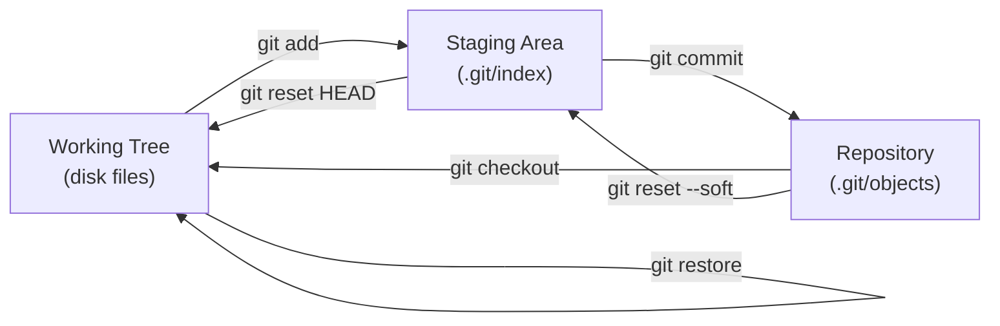
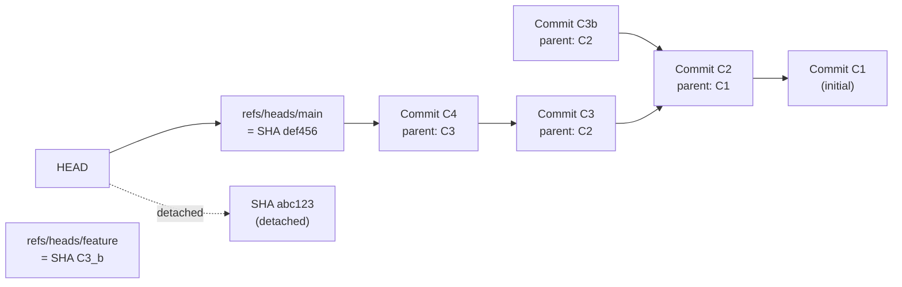
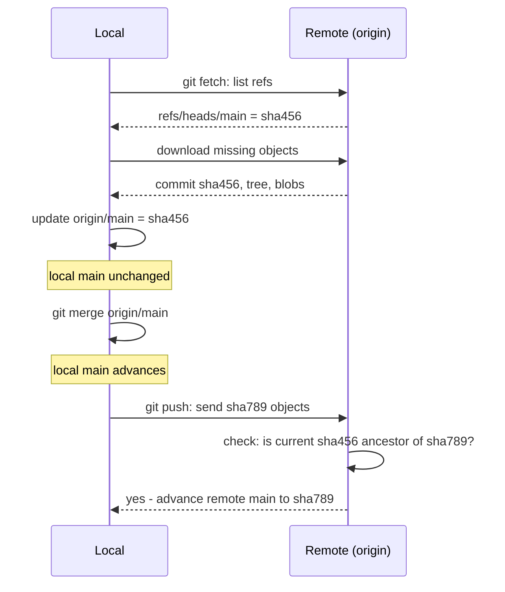

## Keywords in This File
{: .no_toc }

| # | Keyword | Weight |
|---|---|---|
| 4 | [Commits, Staging Area, and Working Tree](#commits-staging-area-and-working-tree) | high |
| 5 | [Branches and HEAD](#branches-and-head) | high |
| 6 | [Remote Repositories: Push, Pull, and Fetch](#remote-repositories-push-pull-and-fetch) | high |

---

# Commits, Staging Area, and Working Tree

**Interview Weight:** High - The three-area model (working tree, staging area, repository) is the most commonly misunderstood Git concept and is the source of most beginner mistakes. Every engineering interview that touches Git will probe this.

---

## Quick Reference

**One-line definition:** Git separates file changes into three areas: the working tree (files on disk you edit), the staging area/index (changes curated for the next commit), and the repository (committed history as immutable objects).

**Difficulty:** ★☆☆ | **Asked at:** All levels | **Seniority:** Junior-Senior

---

### 🎯 Model Answer

**30 seconds:**
Git has three areas: the working tree is the directory on disk where you edit files. The staging area (also called the index) is a holding zone where you explicitly place changes you want to include in the next commit. The repository is the `.git/` directory containing all committed history as immutable objects. `git add` moves changes from the working tree to staging. `git commit` moves changes from staging to the repository.

**3 minutes (Senior):**
The staging area is Git's most powerful and least understood feature. Most version control systems commit all modified files at once - you make changes, you commit changes. Git's staging area lets you curate exactly what goes into a commit, independent of what you have modified on disk.

Why this matters in practice: you might have been working on three unrelated things simultaneously (fixing a bug, cleaning up dead code, adding a new feature). Without the staging area, you would either commit all three together (unclear history) or create separate branches for each (overhead). With `git add -p` (interactive patch staging), you can stage only the bug-fix hunks from the files you touched, commit that cleanly, then stage the cleanup, commit that, then stage the feature work. The result is a history where each commit has a single clear purpose.

The working tree is what you see in your editor. The staging area is what `git status` shows in green (staged for commit). The repository is what `git log` shows - committed, immutable history.

**Framework:** WORKING TREE (edit) -> STAGING AREA (curate) -> REPOSITORY (commit)

*Adapting up:* Add the `.git/index` file - the staging area is stored as a binary file that maps pathnames to object SHAs and is updated by `git add`. Understanding this explains why `git add .` is fast (just writes SHA entries to one file) and why partial staging via `git add -p` works.

*Adapting down:* Junior answer: "The working tree is your code. Staging is where you tell Git which changes to include in the next save. The repository is your saved history."

**Blank Mind Recovery:**

**(1) Restate:** "Commits, staging area, working tree - the three areas where files exist in Git."

**(2) First principles:** "When saving code, you want to control exactly what goes into each save. If you had to commit all modifications at once, you could never cleanly separate 'fix bug' from 'also refactored this file while I was there.' The staging area solves this."

**(3) Bridge:** "Think of staging like packing for a trip. The working tree is your entire wardrobe (everything modified). Staging is the suitcase (what you choose to bring). The repository is the photos of outfits you have already worn - immutable record."

---

### 📘 Concept Explanation

**What it is:**
Git's three-area model: working tree (your local file system), staging area/index (a curated selection of changes ready to commit), and the repository (the object database of all committed history).

**The problem it solves:**
A single-step "save all changes" commit model forces you to make every change into a single commit or maintain multiple branches for concurrent work. The staging area allows you to commit a logical subset of your working directory changes as a single, coherent unit.

**How it works:**

```
Working Tree           Staging Area         Repository
(disk files)           (.git/index)         (.git/objects/)
                                           
README.md (modified)                        Commit C1
feature.java (new)  --git add README.md-->  Commit C2
config.yml (clean)     README.md: sha=X     Commit C3
                    --git commit-->
                                            Commit C4
                                            tree: {README=X, ...}
                                            parent: C3

git status shows:
  Green = staged (in index, different from HEAD)
  Red   = modified (in working tree, not yet staged)
  -     = untracked (not yet added to any area)
```

> **Diagram walkthrough:** The diagram shows three areas and the commands that move changes between them. `git add` moves from working tree to staging (updating the `.git/index` binary file with SHA pointers to blobs). `git commit` creates a tree object from the index contents and a commit object pointing to that tree. Files in the working tree that are neither staged nor tracked appear in `git status` as "untracked". Edge case: if you `git add file.txt` then modify `file.txt` again without re-adding, `git commit` commits the version that was staged (before the second modification) - this surprises many developers. Senior insight: the staging area is a cursor for the next commit, not a mirror of the working tree; they can diverge.



> **Diagram walkthrough:** The Mermaid diagram shows all transition commands between the three areas. `git add` moves changes from working tree to staging. `git commit` moves staged changes to repository. `git checkout` / `git restore` restores working tree from repository or staging. `git reset HEAD` moves staged changes back to working tree (unstages). `git reset --soft` moves the repository pointer back while keeping staging intact. Key relationship: the repository is the only durable area - working tree and staging are both transient and can be reconstructed from the repository. Edge case: `git stash` saves the working tree and (optionally) staging to a temporary commit, allowing you to switch branches with dirty state. Senior insight: understanding all six transitions lets you confidently reverse any mistake without losing work.

**The key insight:**
The staging area lets you craft commits that tell a clear story. A well-maintained history where each commit is one logical change is more valuable than fast history - it enables `git bisect` to find the exact commit that introduced a bug, and `git blame` to explain why each line exists.

**When to use it:**
Every commit workflow. Use `git add -p` (patch mode) for surgical staging of specific hunks from a modified file. Use `git stash` to temporarily set aside working tree changes when switching context.

**When NOT to use it:**
For trivial single-file changes where staging adds no value, `git commit -a` (commit all tracked modified files, bypassing explicit staging) is acceptable. For scratch/throwaway branches, commit everything often.

**Alternatives:**
- `git commit -a` - skips explicit staging for tracked modified files
- `git commit -am "message"` - stage all tracked changes and commit in one step
- IDE Git integration - visual staging via checkboxes replaces `git add -p` for many developers

**First-principles derivation:**
Given that commits should tell a story (what changed and why), and developers make multiple types of changes simultaneously (bug fixes, refactors, features), the only way to produce single-purpose commits is a buffer between the working state and the committed state. The staging area is that buffer.

---

### 💻 Code Example

```bash
# Three-area demonstration

# Working tree: edit two files for different purposes
echo "fix: null check added" >> src/UserService.java
echo "style: remove trailing whitespace" >> src/Config.java

# Stage only the bug fix
git add src/UserService.java

# Verify: staged vs unstaged
git status
# Changes to be committed:  (green)
#   modified: src/UserService.java
# Changes not staged:       (red)
#   modified: src/Config.java

# Commit only the staged change
git commit -m "Fix NPE in UserService.getById()"

# Now stage the style change
git add src/Config.java
git commit -m "Remove trailing whitespace from Config"

# Interactive patch staging - stage part of a file
git add -p src/BigFile.java
# Git shows hunks one at a time:
# y = stage this hunk
# n = skip this hunk
# s = split into smaller hunks
# q = quit (leave rest unstaged)
```

> **Code walkthrough:** This shows the staging area's practical purpose - committing the bug fix and the style change as separate commits, even though both files were modified simultaneously. `git add src/UserService.java` stages only that file, leaving `Config.java` unstaged. `git commit` records only what is staged. The `git add -p` example shows interactive patch staging for granular control within a single file - you can stage lines 1-20 from a 100-line change and leave lines 21-100 unstaged. What breaks: if you use `git commit -a` (commit all tracked changes), both modifications go into one commit, blending the bug fix with the style change. This muddies history and makes `git bisect` less useful. Takeaway: invest 30 seconds staging deliberately; you are creating documentation for your future team.

---

### 🎓 Answers by Seniority

**Junior / Mid (0-5 years):**
> "Git has three areas: the working tree where you edit files, the staging area where you place changes you want to commit, and the repository which holds committed history. `git add` moves changes to staging, `git commit` records them to the repository. The staging area exists so you can control exactly which changes are in each commit."

*Push deeper:* Use `git add -p` for interactive patch staging - stage specific lines or hunks from a file rather than the whole file. This is the key to writing commits that tell a clear single-purpose story.

---

**Senior / Staff (5+ years):**
> "The three-area model is one of Git's most powerful features. The staging area acts as a commit preparation buffer - `git add -p` lets you stage individual hunks from modified files, giving you surgical control over exactly what story each commit tells. In production, this makes `git bisect` dramatically more effective because each commit has one clear purpose."

At Staff level, the conversation connects to code review quality - small, single-purpose commits are easier to review accurately than large mixed commits. Studies show reviewers catch roughly 70% of bugs in commits under 400 lines and roughly 20% in commits over 1000 lines. The staging area is the mechanism that makes small commits achievable without branch overhead for every minor change.

*Push deeper:* Discuss `.git/index` as the staging area's representation - a binary file mapping pathnames to SHA-1 hashes of the staged blob objects. Understanding this explains why `git add .` on a 10,000-file change is still fast.

---

### ⚠️ Common Misconceptions

**Misconception 1: "git add . stages everything I changed."**
Reality: `git add .` stages all changes in the current directory and subdirectories, but only files that are already tracked OR explicitly new. Deleted files require `git add -A` or `git rm`. Gitignore-listed files are never staged regardless of `git add .`.

**Misconception 2: "Once staged, a file is locked until committed."**
Reality: You can modify a file after staging it. `git status` will show it as both staged (the earlier version) and modified (the newer version on disk). `git commit` commits the staged version. `git add file.txt` again updates the staged version to the current disk version.

**Misconception 3: "git commit -m commits all my changes."**
Reality: `git commit -m` commits only what is in the staging area. If you did not `git add` your changes, they are not committed. Use `git status` to verify what is staged before committing.

**Misconception 4: "git status shows everything I changed."**
Reality: `git status` shows modified tracked files and new untracked files. It does not show the content of changes - use `git diff` for unstaged changes and `git diff --staged` for staged changes.

---

### 🚨 Failure Modes and Diagnosis

**Failure 1: Committed wrong version of file**
Symptom: Commit contains an old version of the file, not the current disk version.
Cause: Staged the file, then modified it further, then committed without re-staging.
Diagnosis: `git diff HEAD~1 HEAD -- filename` shows what was committed; `git diff filename` shows current working tree changes.
Fix: `git add filename && git commit --amend --no-edit` (if not yet pushed) or a new commit adding the missing changes.

**Failure 2: Accidentally staged sensitive file**
Symptom: `git status` shows a secrets file or credentials file in green (staged).
Cause: `git add .` staged everything including a file that should be in `.gitignore`.
Diagnosis: `git diff --staged` shows all staged changes.
Fix: `git reset HEAD secretfile.env` unstages the file without deleting it; then add to `.gitignore` before the commit.

**Failure 3: Staging area out of sync after merge conflict**
Symptom: After resolving merge conflicts, `git status` still shows "both modified" files.
Cause: Conflict markers removed from files but `git add` not run to mark them resolved.
Diagnosis: `git status` shows files with conflict markers; `grep -r "<<<<<<" .` confirms.
Fix: Resolve conflicts in each file, then `git add conflicted-file` to mark as resolved, then `git commit`.

---

### 🎯 Interview Deep-Dive

| Category | Count | Coverage |
|---|---|---|
| Conceptual | 3 | Three areas, staging purpose, index internals |
| Debugging | 2 | Wrong version committed, accidentally staged secrets |
| Trade-off | 1 | When to skip staging |
| Behavioral | 1 | Staging workflow experience |

---

**[JUNIOR] Q1 - What is the difference between `git add .` and `git add -A`?**

`git add .` stages all new and modified files in the current directory and its subdirectories. It does NOT stage deletions of files that have been deleted from the working tree. `git add -A` (or `git add --all`) stages everything including deletions across the entire repository, not just the current directory.

The practical difference: if you deleted a file from the working tree (with `rm`, not `git rm`) and ran `git add .`, the deletion would not be staged. The commit would still contain the old file. `git add -A` or `git rm filename` are required to stage a deletion.

Modern Git (2.x) changed the behavior of `git add .` in subdirectories - it used to stage only the current directory tree, but now defaults to the entire repository from anywhere. The safest habit: use `git add -A` when you mean "stage all changes including deletions."

*What separates good from great:* Knowing the `git add .` vs `git add -A` deletion distinction prevents the subtle bug where a deleted file appears in a commit even though you deleted it locally.

---

**[MID] Q2 - How does `git diff` relate to the three-area model?**

`git diff` (no arguments) shows changes between the working tree and the staging area - what you have modified but not yet staged. `git diff --staged` (or `--cached`) shows changes between the staging area and the last commit (HEAD) - what will be included in the next commit. `git diff HEAD` shows all changes between the working tree and HEAD - the combination of staged and unstaged changes.

This three-way diff capability is directly tied to the three-area model: every pair of areas can be compared. `git diff <commit1> <commit2>` compares any two commits. `git diff branch1..branch2` compares branch tips.

In practice, before every commit: run `git diff --staged` to review exactly what is about to be committed. This is the last chance to catch a debugging `println`, an accidentally staged secret file, or a merge conflict marker.

*What separates good from great:* Understanding that `git diff` without arguments is "pre-staging review" and `git diff --staged` is "pre-commit review." Using both as a habit catches mistakes before they enter history.

---

**[MID] Q3 - What is `git stash` and when would you use it?**

`git stash` saves the current state of the working tree and staging area to a temporary commit stack, and restores the working tree to the last committed state (HEAD). It is essentially a context-switch mechanism.

Use cases: (1) You are halfway through a feature change when an urgent bug report comes in. `git stash` saves your in-progress work, you switch to main, create a hotfix branch, fix the bug, merge it, then return to your feature branch and `git stash pop` restores your in-progress state. (2) You accidentally started work on the wrong branch - `git stash`, `git checkout correct-branch`, `git stash pop`. (3) Running tests on a clean state to verify you have not introduced regressions in your unstaged changes.

Common options: `git stash push -m "description"` adds a message. `git stash list` shows all stashed states. `git stash pop` applies the most recent stash and removes it. `git stash apply stash@{2}` applies a specific stash without removing it.

*What separates good from great:* Knowing that stash entries can be lost if you forget about them and they are pruned, or if you rebase in a way that loses the stash anchor commit. For context switches longer than a few hours, creating an actual WIP branch is safer than relying on stash.

---

**[SENIOR] Q4 - How would you use `git add -p` to create clean, atomic commits?**

`git add -p` enters interactive patch staging mode. Git presents each "hunk" of changes (contiguous modified lines) one at a time and asks what to do: `y` to stage the hunk, `n` to skip it, `s` to split into smaller hunks, `e` to manually edit the hunk, `q` to quit.

The workflow for clean commits: modify several files for different purposes (bug fix lines scattered through a file that also has refactoring changes). Run `git add -p` on each file. Stage only the lines related to the bug fix. Commit: "Fix NPE in user lookup." Then run `git add -p` again on the same files, stage only the refactoring lines. Commit: "Refactor user lookup to use Optional."

The result is two commits, each with a single purpose, even though both touched the same files at the same time. This is impossible in any VCS without a staging area.

Production value: when something breaks in production and you need to bisect to find the regression, single-purpose commits make bisect much more effective. The commit history becomes the documentation of intent.

*What separates good from great:* Knowing that `git add -p` requires the developer to understand their own changes well enough to explain them. If you cannot cleanly stage individual hunks, it is a signal that the change is doing too many things and should be broken up differently.

---

**[SENIOR] Q5 - What are the risks of using `git commit --amend`?**

`git commit --amend` replaces the most recent commit with a new one. It creates a new commit object (new SHA) and updates the branch pointer to it. The original commit still exists in the object store but is unreachable from any ref.

Risks: (1) If the original commit was already pushed to a shared remote, amending creates history divergence - you have a new SHA locally but the remote has the old SHA. The next push will be rejected ("non-fast-forward") and requires `git push --force-with-lease`. This rewrites the remote's history and affects any teammate who has already pulled the original commit. (2) If a teammate has based work on the original commit, a force-push invalidates their history and they must rebase or cherry-pick.

Safe use: only amend commits that have NOT been pushed to a shared remote. Amending local commits before pushing is completely safe. For pushed commits, use `git revert` to create a new inverse commit instead of rewriting history.

`git push --force-with-lease` is safer than `--force` - it only succeeds if the remote branch is still at the SHA you think it is (i.e., no one else has pushed since your last fetch). This prevents overwriting someone else's commits accidentally.

*What separates good from great:* Distinguishing local history rewriting (safe, encouraged to clean up before pushing) from remote history rewriting (a coordination event requiring team notification).

---

**[STAFF] Q6 - How does the staging area relate to merge conflict resolution?**

During a merge conflict, Git stops the merge and puts conflicting files into a special three-way state: the working tree has conflict markers inserted (yours, theirs, common ancestor), and the staging area has two versions of the file registered (the two conflicting blob SHAs). The staging area tracks whether each conflicted file has been resolved.

Resolving the workflow: (1) Edit the conflicted file to remove markers and write the correct resolution. (2) `git add conflicted-file` marks the file as resolved in the staging area. (3) After all conflicted files are staged, `git commit` creates the merge commit.

If you run `git mergetool`, it launches a visual diff tool that helps resolve the conflicts interactively and automatically runs `git add` on each resolved file. `git status` after resolution should show no "both modified" files - only clean staged changes.

`git rerere` (reuse recorded resolution) saves your conflict resolutions so if the same conflict appears again (e.g., cherry-picking the same commit to multiple branches), Git automatically applies the saved resolution.

*What separates good from great:* Understanding that the staging area is the mechanism by which Git tracks merge completion. A file with unresolved conflict markers that was `git add`-ed anyway will commit the markers as code - this is how conflict markers accidentally reach production.

---

**[STAFF] Q7 - Describe your commit workflow on a large team and how you ensure commit quality.**

[BEHAVIORAL]

**S:** On a team of 30+ engineers working on a microservices platform, we had no commit standards. The git log was full of "WIP", "fix", and "changes" messages. Code review was difficult because PRs often mixed multiple concerns.

**T:** I was tasked with improving commit quality as part of a developer experience initiative.

**A:** I implemented three changes: (1) Conventional Commits standard enforced via `commit-msg` hook (using commitlint) - every commit must follow `type(scope): description` format. (2) Pre-commit hook using Husky that ran the linter and basic unit tests before allowing a commit. (3) Pair-review policy for `git add -p` on large changes - the author walked the reviewer through staging decisions, which doubled as a lightweight pre-review.

I gave a lunch-and-learn on `git add -p` showing how to create atomic commits from mixed changes. I also added `git log --oneline --graph` to the repository README as the "canonical way to view history."

**R:** Within a month, the median number of logical changes per commit dropped from 2.8 to 1.1. CI-triggered deployments became more reliable because bisect could identify regressions to specific commits within minutes. Code review cycle time dropped 20% because reviewers could focus on one concern per commit.

*What separates good from great:* The technical controls (hooks, linting) were easy to add. The cultural change - engineers caring about commit message quality - required demonstration that it saved time later during debugging. Connecting commit quality to incident diagnosis time was the argument that worked.

---

### ⚖️ Comparison Table

*(Omit: ★☆☆ keyword - comparison table applies to ★★☆ and above.)*

---

### 🏛️ System Design

*(Omit: Not a ★★★ keyword.)*

---

### 📊 Diagram

*(Omit: ASCII and Mermaid diagrams are included in the Concept Explanation section.)*

---
---

# Branches and HEAD

**Interview Weight:** High - Branches and HEAD are central to almost every Git workflow question. Misunderstanding how HEAD works is the primary source of "detached HEAD" confusion and rebase disorientation.

---

## Quick Reference

**One-line definition:** A branch is a lightweight movable pointer to a commit SHA; HEAD is a special pointer that tracks where you currently are - either pointing to a branch (attached HEAD) or directly to a commit SHA (detached HEAD).

**Difficulty:** ★☆☆ | **Asked at:** All levels | **Seniority:** Junior-Senior

---

### 🎯 Model Answer

**30 seconds:**
A branch in Git is not a container for commits - it is a single file containing one 40-character SHA hash, the tip commit of that branch. When you commit, the branch pointer automatically advances to the new commit. HEAD is a special pointer that tells Git which branch you are on - when you `git checkout main`, HEAD becomes a symbolic reference pointing to the main branch file. When you `git checkout <SHA>`, HEAD points directly at a commit (detached HEAD state).

**3 minutes (Senior):**
Understanding branches and HEAD requires understanding that they are pointers in Git's object graph, not structural containers. A branch is 41 bytes: a 40-character SHA and a newline, stored in `.git/refs/heads/branchname`. When you commit, two things happen: a new commit object is written to the object store, and the current branch file is updated to contain the new commit's SHA. HEAD determines which branch gets updated.

Detached HEAD state occurs when HEAD points directly at a commit rather than a branch. This happens on `git checkout <tag>` or `git checkout <SHA>`. You can still commit in detached HEAD state - the commits are valid objects - but they are not pointed to by any branch. When you `git checkout main` from detached HEAD, those commits become unreachable from any ref (though they remain in reflog for 30 days and can be recovered by creating a branch pointing to them).

The concept extends naturally: merge is a commit with two parents (both branch pointers are recorded). Fast-forward merge is when the target branch has not diverged from the source - the merge just advances the pointer without creating a new commit. Rebase creates new commit objects and advances the branch pointer to the new tip.

**Framework:** BRANCH = POINTER -> COMMIT -> HEAD = POINTER -> BRANCH (or detached: POINTER -> COMMIT)

*Adapting up:* Add tracking branches - `origin/main` is a remote-tracking branch: a local pointer to the last known state of the remote branch, updated by `git fetch`.

*Adapting down:* Junior answer: "A branch is like a bookmark in your commit history. HEAD is the current page you are reading."

**Blank Mind Recovery:**

**(1) Restate:** "Branches and HEAD - how Git tracks where you are in the commit graph."

**(2) First principles:** "You need to know two things: where the tip of each branch is (so you can advance it on commit), and which branch you are currently working on (so the right branch advances). Branches are the 'where is tip' data, HEAD is the 'which branch am I on' data."

**(3) Bridge:** "A Git branch is like a sticky note on a commit in the timeline. HEAD is which sticky note you are holding. Moving between branches is swapping which sticky note you hold, not moving the commits."

---

### 📘 Concept Explanation

**What it is:**
A branch is a named ref (reference file) in `.git/refs/heads/` containing one commit SHA. HEAD is a special ref in `.git/HEAD` that is either a symbolic ref to a branch (`ref: refs/heads/main`) or a direct SHA (detached HEAD).

**The problem it solves:**
Without branches, all development must happen sequentially on one timeline. Branches enable parallel development: multiple developers can work on independent features simultaneously, each branch evolving independently, and then be merged when ready.

**How it works:**

```
Before commit on main:
.git/HEAD -> ref: refs/heads/main
.git/refs/heads/main -> abc123

After git commit:
.git/HEAD -> ref: refs/heads/main   (unchanged - symbolic ref)
.git/refs/heads/main -> def456      (advanced to new commit)

git checkout feature-branch:
.git/HEAD -> ref: refs/heads/feature-branch

git checkout abc123 (detached HEAD):
.git/HEAD -> abc123                 (direct SHA, no branch)

Branch graph:
                C3 <- feature (branch pointer)
               /
C1 <- C2 <- C3 <- C4 <- main (branch pointer)
                        ^
                        HEAD (symbolic ref to main)
```

> **Diagram walkthrough:** The ASCII shows that HEAD is a two-level pointer: HEAD points to a branch name, which points to a commit SHA. When you commit, only the branch file is updated (advancing to the new commit SHA); HEAD remains pointing at the same branch name. The feature branch pointer is completely independent - it can advance or stay while main advances. Detached HEAD flattens this to one level: HEAD points directly at a commit SHA, so committing creates objects that no branch tracks. Edge case: if you switch away from detached HEAD after making commits, those commits become unreachable from any ref and will be garbage collected. Senior insight: the independence of branch pointers is what makes merging and rebasing work - you always know exactly which commits belong to which branch tip.



> **Diagram walkthrough:** The diagram shows HEAD pointing to the main branch reference, which points to the tip commit C4. The feature branch is a separate pointer at C3b (which diverged from C2). Both branches share commits C1 and C2 - those commits exist once in the object store. The dashed line shows detached HEAD pointing directly at SHA abc123 rather than through a branch reference. Key relationship: branches share commits that were created before the branches diverged; only the divergent commits are unique per branch. Edge case: deleting the feature branch removes only the `refs/heads/feature` file - C3b still exists in the object store until GC. Senior insight: `git branch -d` is safe because it only removes a 41-byte file; the commits survive.

**The key insight:**
A branch is not a namespace or container - it is a pointer. Commits do not "belong to" a branch. A commit is reachable from a branch if it is an ancestor of that branch's tip commit. This is why `git log feature` shows the entire history of the feature branch, not just the commits made on it.

**When to use it:**
Branches are the primary isolation mechanism. Create a branch for every feature, bug fix, or experiment. Cheap branch creation (a file write) means there is no cost to creating "throw-away" branches for exploring ideas.

**When NOT to use it:**
Long-lived branches that diverge significantly from main create merge conflicts. For work that might never be completed or is experimental, consider using a stash or WIP commit on a branch that is periodically rebased rather than letting it diverge for weeks.

**Alternatives:**
- Tags - like branches but immutable (do not advance on commit); used for versioned releases
- Stash - temporary anonymous storage for work in progress (not a branch)
- Worktrees - multiple working trees checked out simultaneously, each at a different branch

**First-principles derivation:**
Given that commits are immutable and stored by content hash, tracking "the current state" requires only a mutable pointer to a commit. That pointer is a branch. Given that you need to know which pointer to advance when you commit, you need a "current pointer" indicator. That is HEAD. The two-level design (HEAD -> branch -> commit) is the minimal structure that satisfies both requirements.

---

### 💻 Code Example

```bash
# Branches are just files
cat .git/HEAD
# ref: refs/heads/main

cat .git/refs/heads/main
# abc1234567890...  (40-char SHA)

# Creating a branch = writing a new file
git branch feature/login
cat .git/refs/heads/feature/login  # same SHA as main currently

# Switching branches = updating HEAD
git checkout feature/login
cat .git/HEAD
# ref: refs/heads/feature/login

# Detached HEAD - HEAD points directly at SHA
git checkout abc1234
cat .git/HEAD
# abc1234... (direct SHA, not a branch ref)

# Create branch to rescue detached-HEAD commits
git branch rescue-branch  # anchors current SHA in a named branch
git checkout main          # safe to switch now

# List local and remote branches
git branch                 # local
git branch -r              # remote-tracking
git branch -a              # all

# Delete a fully-merged branch (safe)
git branch -d feature/login
# Delete unmerged branch (requires -D)
git branch -D experiment/risky
```

> **Code walkthrough:** The `cat .git/HEAD` and `cat .git/refs/heads/main` commands make the pointer abstraction concrete - branches really are just files. `git branch feature/login` writes one new file; it does not copy any objects or create any history. The detached HEAD demonstration shows HEAD containing a raw SHA instead of a symbolic ref - any commits made here create objects but no branch tracks them. The `git branch rescue-branch` while in detached HEAD creates a named anchor before switching away. What breaks: switching away from detached HEAD without first creating a branch means those commits are unreachable from any ref and will be pruned by `git gc` (after 30-day grace period). Takeaway: if you ever see "HEAD detached at", immediately decide if you want to keep any commits made in that state and create a branch to anchor them.

---

### 🎓 Answers by Seniority

**Junior / Mid (0-5 years):**
> "A branch is a pointer to a commit - it is just a file containing a commit SHA. When you commit on a branch, the branch file is updated to point to the new commit. HEAD is a pointer to which branch you are currently on. `git checkout` switches both HEAD and the working tree to a different branch."

*Push deeper:* Explain fast-forward merge - when the target branch has no diverging commits, merging is just advancing the branch pointer (no new merge commit needed). Git does this automatically when possible.

---

**Senior / Staff (5+ years):**
> "Branches are one-level pointers (SHA files) and HEAD is the pointer to the pointer. This two-level design is what allows fast operations - creating a branch, switching branches, and advancing a branch on commit are all single file operations. The important nuance is detached HEAD: when HEAD points directly at a SHA instead of a branch, new commits create unreachable objects. Always create a branch before doing significant work in detached HEAD state."

At Staff level: remote-tracking branches (`origin/main`) are local caches of remote state, updated by `git fetch`. The divergence between your local `main` and `origin/main` is what `git status` reports as "ahead of origin/main by N commits" or "behind by N commits." Understanding this helps explain why `git pull --rebase` is cleaner than `git pull` for rebased CI workflows.

*Push deeper:* Discuss symbolic refs beyond HEAD - `ORIG_HEAD` (set to the pre-merge tip on merge), `FETCH_HEAD` (set to the fetched tip on git fetch), and `MERGE_HEAD` (the incoming branch tip during a merge). These are used by scripts and low-level Git operations.

---

### ⚠️ Common Misconceptions

**Misconception 1: "Creating a branch copies the commit history."**
Reality: `git branch` writes one 41-byte file. It creates zero new objects in the object store. No commit history is copied. The new branch pointer starts at the same commit as the current branch, sharing all historical objects.

**Misconception 2: "Deleting a branch deletes its commits."**
Reality: Deleting a branch deletes the ref file only. All commits remain in the object store and are accessible via reflog for 90 days. Only `git gc --prune` after the reflog expiration permanently removes unreachable objects.

**Misconception 3: "git checkout is only for switching branches."**
Reality: `git checkout` does three different things: switches branches (`git checkout main`), creates and switches to a branch (`git checkout -b feature`), or restores a specific file from a commit (`git checkout HEAD~3 -- src/file.java`). The third use case is powerful for selective restoration.

**Misconception 4: "HEAD always points to the latest commit."**
Reality: HEAD points to the current position - which may be the latest commit on a branch, or an older commit (after `git reset`), or a specific commit in detached HEAD state. HEAD and "latest commit" are only the same immediately after committing on a branch.

---

### 🚨 Failure Modes and Diagnosis

**Failure 1: Detached HEAD with uncommitted commits about to be lost**
Symptom: `git checkout main` after committing in detached HEAD shows "warning: detached HEAD state leaves X commits behind."
Cause: Work done directly on a commit SHA rather than a branch.
Diagnosis: `git reflog` shows the detached-HEAD commits.
Fix: Before switching away, `git branch rescue-my-work`; then `git checkout main`. The commits are now anchored.

**Failure 2: Wrong branch advanced after commit**
Symptom: You committed to main instead of your feature branch.
Cause: Forgot to `git checkout feature-branch` before committing.
Diagnosis: `git log --oneline main | head -3` shows your commit on main.
Fix: `git branch feature-branch` (creates feature branch at the wrong commit), then `git reset --hard HEAD~1` (removes the commit from main). Feature branch now has the commit.

**Failure 3: Remote tracking branch divergence confusion**
Symptom: `git status` says "Your branch is ahead of 'origin/main' by 3 commits" after pulling.
Cause: Remote-tracking `origin/main` is stale (not yet fetched), or local main has commits not yet pushed.
Diagnosis: `git log origin/main..main` shows commits on local main not on origin/main.
Fix: If local commits are intentional, `git push`. If you meant to start from the current remote state, `git fetch && git reset --hard origin/main` (destructive - loses local commits).

---

### 🎯 Interview Deep-Dive

| Category | Count | Coverage |
|---|---|---|
| Conceptual | 3 | Branch as pointer, HEAD types, remote tracking |
| Debugging | 2 | Detached HEAD recovery, wrong branch committed |
| Trade-off | 1 | Branch strategies |
| Behavioral | 1 | Branch management experience |

---

**[JUNIOR] Q1 - What is `git checkout` vs `git switch`?**

`git checkout` is the original multi-purpose command that switches branches, creates branches, and restores files from commits - doing three conceptually different things. The overloading caused confusion, especially that `git checkout -- file` (restore file) vs `git checkout branch` (switch branch) use different syntax.

Git 2.23 (2019) introduced two separate commands to replace the checkout use cases: `git switch` for switching and creating branches, and `git restore` for restoring files. `git switch main` switches to main; `git switch -c feature` creates and switches to feature. `git restore file.txt` restores the working tree file from HEAD.

Both old and new commands work in Git 2.23+. Most tutorials and production scripts still use `git checkout` because it has been standard for 15+ years. Modern practice is to use `git switch` and `git restore` for clarity, but knowing both is essential since you will encounter `git checkout` in existing code.

*What separates good from great:* Understanding that `git switch` and `git restore` are a UX improvement for humans, not a functional change. The underlying Git operations are identical.

---

**[MID] Q2 - What is a fast-forward merge and when does Git use it?**

A fast-forward merge happens when the branch being merged into (target) has no commits that diverged from the branch being merged (source). In this case, the target branch pointer can simply be advanced to the source branch tip without creating a new merge commit.

Example: main is at commit C3. You branch feature from C3, add C4 and C5. When you merge feature back to main, Git sees that main has not advanced since C3 (no divergence). It fast-forwards main to C5 - just updating the branch pointer. No merge commit is created.

If main had commits C4m added since you branched (divergence), Git cannot fast-forward - it must create a merge commit with two parents (C5 from feature and C4m from main).

`git merge --no-ff feature` forces a merge commit even when a fast-forward is possible, preserving the explicit record that a feature branch was merged. Many teams prefer this for visibility in git log. `git merge --ff-only feature` fails with an error if a fast-forward is not possible, preventing accidental merge commits.

*What separates good from great:* Knowing when to prefer each option - `--no-ff` for feature branch merges (clear record), `--ff-only` for rebased PRs where you want linear history and a clean fast-forward, `--squash` for combining all feature commits into one before merging.

---

**[SENIOR] Q3 - How does `git rebase` move branch pointers compared to `git merge`?**

Both integrate work from one branch into another, but they create different object graphs and move branch pointers differently.

`git rebase feature main` creates new commit objects by re-applying feature's commits on top of main's current tip. Each replayed commit gets a new SHA (new parent pointer). After rebase, the `feature` branch pointer is advanced to the last replayed commit. The original commits that feature pointed to are now unreachable from the feature branch (though they remain in reflog).

`git merge main feature` creates a new merge commit object with two parent pointers: one to main's tip and one to feature's tip. The `feature` branch pointer is advanced to this new merge commit. Both original branch tips remain reachable.

From a pointer perspective: rebase moves the feature branch pointer to a new linear chain; merge moves the feature branch pointer to a new merge commit in a non-linear graph.

Preference: rebase produces a clean linear history that is easier to read and bisect. Merge preserves the exact history of when things happened. Many teams use "rebase feature branches onto main, then merge with --no-ff to main" to get both: linear feature history and an explicit merge record.

*What separates good from great:* Understanding that rebase "lies" about history (the replayed commits have the original author timestamp but a later committer timestamp), which matters for auditing who changed what when.

---

**[SENIOR] Q4 - What is `ORIG_HEAD` and when would you use it?**

`ORIG_HEAD` is a special ref that Git automatically sets to the pre-operation HEAD value before operations that can cause significant history changes: `git merge`, `git rebase`, and `git reset`. It is a safety net.

After a `git merge feature`, `ORIG_HEAD` contains the SHA that HEAD pointed to before the merge (the pre-merge tip of main). If the merge introduced a problem, `git reset --hard ORIG_HEAD` instantly reverts to the pre-merge state.

Similarly, after `git rebase main`, `ORIG_HEAD` is the pre-rebase tip of your feature branch. `git reset --hard ORIG_HEAD` undoes the entire rebase.

This is different from reflog in that `ORIG_HEAD` is a named reference pointing to one specific pre-operation SHA, rather than a log of all HEAD movements. It is simpler for "undo the last major operation" use cases.

*What separates good from great:* Knowing `ORIG_HEAD` exists means you never need to manually `git reflog` to find the pre-merge SHA - Git has already saved it for you.

---

**[SENIOR] Q5 - How would you recover commits from an accidentally deleted branch?**

When you delete a branch with `git branch -D`, the ref file is removed but the commit objects remain in the object store with their SHA pointers in reflog. Recovery process:

Step 1: `git reflog` - scan for the commit SHA that was the tip of the deleted branch. Look for "checkout: moving from deleted-branch-name" entries - the SHA before that checkout is the deleted branch tip.

Step 2: Once you have the SHA: `git checkout -b recovered-branch <sha>` creates a new branch at that commit, recovering the entire history from that point back.

Step 3: Verify with `git log recovered-branch --oneline` that the commits are there.

Timing constraint: reflog entries expire after 90 days by default (configurable). After expiration, `git gc --prune` removes the unreachable objects permanently. Act within the reflog window.

For remote branches: if the branch was on a remote and still in someone else's clone, `git fetch <their-remote> <deleted-branch>` retrieves the commits. Alternatively, `git push origin <sha>:refs/heads/restored-branch` pushes directly to a new branch on the remote.

*What separates good from great:* Knowing the 90-day window creates a soft safety net but not a hard guarantee. Critical branches should have protection rules preventing deletion.

---

**[STAFF] Q6 - What are tracking branches and why do they matter for team workflows?**

Remote-tracking branches (e.g., `origin/main`, `origin/feature`) are local references that track the last-known state of branches on a remote repository. They are updated by `git fetch` but never directly modified by local operations. You cannot commit to `origin/main` - it is read-only from your perspective.

When you run `git fetch origin`, Git downloads new objects and advances all `origin/*` refs to reflect the remote's current state. Your local `main` is unchanged. `git status` then reports "your branch is behind origin/main by 3 commits" or "ahead by 2 commits" based on the divergence between your local `main` and the fetched `origin/main`.

Why this matters for team workflows: CI/CD systems often check `origin/main` as the reference for what is deployed. The delta between your local branch and `origin/main` (shown by `git log origin/main..HEAD`) is exactly what your PR will introduce. Running `git log --oneline origin/main..HEAD` before opening a PR shows you exactly what commits are included.

For tracking configuration: `git branch --set-upstream-to=origin/main main` establishes the tracking relationship so `git status` knows which remote branch to compare against. `git branch -vv` shows all local branches with their tracking targets and divergence.

*What separates good from great:* Understanding that `origin/main` is stale until you `git fetch`. Teams that run `git pull` without `git fetch` first are comparing against cached state, not current remote state - this is why "your branch is up to date with origin/main" can be incorrect if you have not fetched recently.

---

**[STAFF] Q7 - How do you design a branching strategy for a team that needs both stability and velocity?**

[BEHAVIORAL]

**S:** I was a tech lead at a company with 25 engineers on a single Rails monolith. We had a weekly release cycle. Main was breaking frequently - hotfixes were delaying the release, and the release process took a full day of QA.

**T:** Design a branching strategy that supports continuous integration (merging daily) while maintaining a stable release branch.

**A:** I implemented a simplified GitFlow variant: one permanent `develop` branch for integration, `main` for production, short-lived feature branches (max 3 days), and `release/x.y` cut from develop each Thursday. Engineers merged feature branches to develop daily; no direct commits to main. The CI pipeline ran on develop merges (10-minute suite), and a slower stability suite ran on release/* branches (45 minutes). Hotfixes branched from main and were cherry-picked to develop immediately.

The key addition was a deploy preview environment that automatically deployed develop on each merge, giving QA real-time access to integrated changes throughout the week rather than only at release time.

**R:** Release day preparation time dropped from 1 day to 2 hours. Main breakage incidents dropped by 80% (previously caused by last-minute feature merges). Feature branch lifetime averaged 1.4 days, down from 4.2 days.

*What separates good from great:* The branching strategy was secondary to the cultural change - engineers needed to understand that merging to develop daily is not a sign of incompleteness, it is a sign of discipline. The deploy preview environment made daily integration visible and caught integration issues before release day.

---

### ⚖️ Comparison Table

*(Omit: ★☆☆ keyword - comparison table applies to ★★☆ and above.)*

---

### 🏛️ System Design

*(Omit: Not a ★★★ keyword.)*

---

### 📊 Diagram

*(Omit: ASCII and Mermaid diagrams are included in the Concept Explanation section.)*

---
---

# Remote Repositories: Push, Pull, and Fetch

**Interview Weight:** High - Remote operations are used daily and are the source of many confusing errors ("rejected non-fast-forward", "diverged", "upstream gone"). Every developer needs to understand the fetch/merge distinction to use Git safely in teams.

---

## Quick Reference

**One-line definition:** Remotes are named references to other Git repositories; `git fetch` downloads new objects from a remote without integrating them, `git pull` fetches and then merges or rebases, and `git push` sends local commits to a remote.

**Difficulty:** ★☆☆ | **Asked at:** All levels | **Seniority:** Junior-Senior

---

### 🎯 Model Answer

**30 seconds:**
A remote is a named pointer to another Git repository, typically on a server. There are three remote operations: `git fetch` downloads objects and updates remote-tracking references (`origin/main`) without touching your working tree. `git pull` is `git fetch` plus `git merge` (or rebase) - it integrates the remote changes into your current branch. `git push` sends your commits to the remote and advances the remote branch. The key distinction: fetch is safe and read-only; pull modifies your branch.

**3 minutes (Senior):**
Remotes in Git are completely symmetrical with local repositories - "origin" is just a name for another repository's URL, stored in `.git/config`. You can have multiple remotes (`origin`, `upstream`, `backup`) each pointing to different repositories.

The fetch/pull distinction matters enormously in automation and careful workflows. `git fetch origin` downloads all new objects (commits, trees, blobs) and updates remote-tracking refs (`origin/main`, `origin/feature`) to reflect the remote's current state. Your local `main` is completely untouched. This is safe to run at any time.

`git pull` is a two-step operation: fetch (safe) followed by merge or rebase into your current branch. The merge/rebase step is where conflicts can occur, where your working tree changes, and where you need to be deliberate about what you are integrating. The default behavior (merge vs rebase) depends on configuration (`pull.rebase`) and varies across Git versions - this is why `git pull` can surprise you.

Push is rejected with "non-fast-forward" when the remote branch has commits you do not have locally. This is the expected rejection when another developer pushed since your last fetch. The fix is to `git fetch && git rebase origin/main` (or merge), then push again.

**Framework:** REMOTE = NAMED URL -> FETCH (download objects) -> PULL (fetch + integrate) -> PUSH (send local commits)

*Adapting up:* Add the `--force-with-lease` pattern for safe force-push after rebase, and the fetch-before-push habit that prevents surprises.

*Adapting down:* Junior answer: "A remote is another copy of the repository, usually on GitHub. Push sends your commits up, pull brings other people's commits down."

**Blank Mind Recovery:**

**(1) Restate:** "Push, pull, and fetch - Git's three commands for communicating with remote repositories."

**(2) First principles:** "To collaborate, two repos need to exchange commits. Sending commits out is push. Receiving commits is fetch. Integrating received commits into your branch is merge or rebase. Pull combines the last two steps."

**(3) Bridge:** "Like a shared document: fetch is downloading the latest version without opening it (you can compare later). Pull is downloading AND merging the changes into your document. Push is uploading your changes to the shared copy."

---

### 📘 Concept Explanation

**What it is:**
Remotes are named references to other Git repository URLs. Remote operations (fetch, pull, push) synchronize the local repository with remote repositories.

**The problem it solves:**
Git is distributed - every clone is independent. Without remote operations, there is no way to share work between clones. Remotes provide a structured way to name and communicate with other repositories.

**How it works:**

```
.git/config (remote configuration):
[remote "origin"]
    url = https://github.com/org/repo.git
    fetch = +refs/heads/*:refs/remotes/origin/*

git fetch origin:
  1. Contact remote URL
  2. List remote refs (branches and SHAs)
  3. Download missing objects (commits, trees, blobs)
  4. Update local refs/remotes/origin/* to match

git pull (= fetch + merge):
  1. git fetch origin
  2. git merge origin/main (or rebase, per config)

git push origin main:
  1. Check if remote main is ancestor of local main
  2. If yes (fast-forward): upload new objects, advance remote main
  3. If no (diverged): REJECT with "non-fast-forward"
     Fix: git fetch && git rebase origin/main && git push
```

> **Diagram walkthrough:** The ASCII shows the fetch protocol: contact remote, compare remote refs with local refs, download missing objects, update local remote-tracking refs. Pull adds a merge or rebase step after fetch. Push is fetch in reverse with the fast-forward constraint: the remote accepts only if the push is a strict advancement of the current remote branch. The edge case is the push rejection - it is not an error in the problematic sense, it is Git's safety mechanism preventing silent data loss. The senior insight: configuring `pull.rebase=true` in `.gitconfig` makes `git pull` use rebase instead of merge, producing a cleaner linear history when incorporating remote changes.



> **Diagram walkthrough:** The sequence diagram shows the two-phase push/pull protocol. Fetch is a query (list refs) followed by object download, updating only remote-tracking refs locally. The local main branch is not touched until the explicit merge step. Push sends objects and then asks the remote to advance its branch - which succeeds only if the push is a fast-forward. Key relationship: the remote is authoritative for its own refs; a push is a request, not a force (unless you use --force). Edge case: if the remote main has new commits since your last fetch, push is rejected; the workflow is always fetch-then-integrate-then-push. Senior insight: `git fetch` before any operation that depends on remote state prevents surprises.

**The key insight:**
`git fetch` is safe to run at any time - it only downloads objects and updates remote-tracking refs. All the risk in remote operations comes from the integration step (merge/rebase in `git pull`). Separating fetch from integration gives you a chance to review what is incoming before merging.

**When to use it:**
- `git fetch` - to see what others have pushed without integrating; in CI/CD scripts before any state-dependent operation
- `git pull --rebase` - preferred for incorporating remote changes into your local branch (avoids spurious merge commits)
- `git push` - to share your commits; `git push -u origin branch-name` to set upstream tracking on first push

**When NOT to use it:**
- `git push --force` without `--force-with-lease` on shared branches - this can destroy teammates' work
- `git pull` (without --rebase) on a branch where you have rebased local commits - this creates confusing history

**Alternatives:**
- `git remote update` - equivalent to `git fetch --all` for all remotes
- `git pull --rebase=interactive` - fetch and interactively rebase
- GitHub/GitLab merge via web UI - push your branch then merge via PR (most common team workflow)

**First-principles derivation:**
Distributed repositories need a way to synchronize without losing work. The push rejection constraint (non-fast-forward) is the mechanism that prevents simultaneous pushes from overwriting each other. If Git allowed last-writer-wins push, the first developer to push after a fetch would silently erase the second developer's work. The rejection-and-rebase model ensures all developers explicitly integrate before pushing.

---

### 💻 Code Example

```bash
# Remote configuration
git remote -v
# origin  https://github.com/org/repo.git (fetch)
# origin  https://github.com/org/repo.git (push)

# Add a second remote (e.g., for open-source upstream)
git remote add upstream https://github.com/upstream/repo.git

# Fetch without integrating - safe to run anytime
git fetch origin
git log origin/main --oneline -5  # see what came in

# Compare local with remote
git log HEAD..origin/main --oneline  # commits on remote, not local
git log origin/main..HEAD --oneline  # commits local, not on remote

# Pull with rebase (preferred over plain pull)
git pull --rebase origin main
# equivalent to:
# git fetch origin && git rebase origin/main

# Push first time - set upstream tracking
git push -u origin feature/login

# Subsequent pushes
git push  # uses tracked upstream

# Force-push after rebase (safe with --force-with-lease)
git rebase origin/main
git push --force-with-lease
# Fails if remote has commits you haven't fetched
# Prevents accidentally overwriting someone else's push
```

> **Code walkthrough:** The `git log HEAD..origin/main` shows commits on remote that you do not have locally - useful before deciding to pull. `git log origin/main..HEAD` shows your unpushed commits - this is what a PR introduces. `git pull --rebase` is equivalent to fetch + rebase and avoids the merge commit that `git pull` (with merge) creates. `git push --force-with-lease` is the safe force-push: it succeeds only if the remote branch is still at the SHA you last fetched, preventing you from overwriting someone else's commits if they pushed while you were rebasing. What breaks: `git push --force` without `--lease` unconditionally overwrites the remote - if a teammate pushed between your rebase and your push, their commits are lost from the remote. Takeaway: always use `--force-with-lease` instead of `--force` after any rebase.

---

### 🎓 Answers by Seniority

**Junior / Mid (0-5 years):**
> "Remotes are other copies of the repository, usually on GitHub. `git fetch` downloads new commits without changing your local branch. `git pull` downloads AND merges them into your current branch. `git push` sends your commits to the remote. The practical rule: fetch first to see what changed, then decide how to integrate."

*Push deeper:* Explain `git push -u origin branch-name` - the `-u` sets up tracking so future pushes can just use `git push`. Without tracking, you need to specify the remote and branch name every time.

---

**Senior / Staff (5+ years):**
> "The critical distinction is fetch vs pull. Fetch is a read-only operation - it downloads objects and updates remote-tracking refs but never touches your working tree or local branches. Pull combines fetch with an integration step (merge or rebase) that CAN modify your state. In CI/CD scripts and automation, always use explicit fetch + separate integration rather than pull, to maintain control over what changes the working tree."

At Staff level: the conversation extends to push protection. `git push --force-with-lease` is essential when force-pushing after rebase. The `--lease` verifies the remote is still at the SHA you expect (based on your last fetch) before overwriting. This prevents the scenario where you rebase, fetch (getting new commits from a teammate), and then force-push - which would silently erase the teammate's commits without `--force-with-lease`.

*Push deeper:* Discuss the push refspec - `git push origin HEAD:refs/for/main` (used in Gerrit code review), and how you can push to any ref on a remote, not just the matching branch name.

---

### ⚠️ Common Misconceptions

**Misconception 1: "git pull is always safe."**
Reality: `git pull` performs a merge or rebase after fetching. This modifies your local branch and working tree, can produce conflicts, and creates merge commits (with `--no-rebase`). On a branch with uncommitted changes, `git pull` can fail or produce unexpected results.

**Misconception 2: "git fetch downloads my branch."**
Reality: `git fetch origin` fetches ALL remote branches and updates all `origin/*` refs. To fetch only one branch, use `git fetch origin main`. But the default fetches everything - this is fine and expected.

**Misconception 3: "`origin` is the authoritative server."**
Reality: `origin` is just the name given to the first remote when you `git clone`. You can rename it (`git remote rename origin primary`), delete it, or have multiple remotes. There is no technical authority - it is a naming convention.

**Misconception 4: "git push always pushes my current branch."**
Reality: `git push` with no arguments only pushes the current branch IF it has an upstream tracking reference configured. Without tracking, `git push` fails with "The current branch has no upstream branch." Use `git push origin branch-name` to be explicit.

---

### 🚨 Failure Modes and Diagnosis

**Failure 1: Push rejected - "non-fast-forward"**
Symptom: `git push` fails with "rejected: non-fast-forward - updates were rejected because the remote contains work that you do not have locally."
Cause: The remote branch has commits that are not in your local history (someone else pushed after your last fetch).
Diagnosis: `git fetch origin && git log HEAD..origin/main --oneline` shows the commits you are missing.
Fix: `git pull --rebase origin main` (integrates remote changes) then `git push`.

**Failure 2: Push overwrites a teammate's commits (force push)** 
Symptom: Teammate reports their pushed commits disappeared from the remote branch.
Cause: Someone ran `git push --force` after rebasing, overwriting commits that were pushed after the last fetch.
Diagnosis: `git reflog show origin/main` (on the remote server or any clone that fetched before) shows pre-force-push state.
Fix: Restore from a clone that still has the original commits: `git push --force-with-lease <sha>:main`. Prevention: use `--force-with-lease` always; add branch protection preventing force-pushes.

**Failure 3: Upstream branch deleted - "gone"**
Symptom: `git branch -vv` shows local branch with `[origin/feature: gone]`; `git status` says "your branch is based on 'origin/feature' but the upstream is gone."
Cause: The remote branch was deleted (after merging the PR) but the local branch and its tracking config remain.
Diagnosis: `git branch -vv | grep gone` lists all branches with deleted upstreams.
Fix: `git fetch --prune` updates remote-tracking refs, removing gone branches. Then `git branch -d feature` to delete the local branch if work is merged. For the error message specifically, `git branch --unset-upstream` removes the stale tracking reference.

---

### 🎯 Interview Deep-Dive

| Category | Count | Coverage |
|---|---|---|
| Conceptual | 3 | Fetch vs pull, push protocol, remote as named URL |
| Debugging | 2 | Push rejection, force-push recovery |
| Trade-off | 1 | Pull with merge vs rebase |
| Behavioral | 1 | Remote workflow experience |

---

**[JUNIOR] Q1 - What is the difference between `git clone` and `git init`?**

`git init` creates a new empty Git repository in the current directory (or a specified path). It creates the `.git/` directory with the initial structure: empty object store, empty refs, HEAD pointing to `refs/heads/main`. There are no commits and no remote configured.

`git clone <url>` is a compound operation: it creates a new directory, runs `git init` inside it, adds the source URL as the `origin` remote, runs `git fetch origin` to download all objects and refs, creates local branch tracking references for all remote branches, and checks out the default branch. The cloned repository has the full history, all remote branches available as remote-tracking refs, and the `origin` remote configured.

Use `git init` when starting a new project from scratch. Use `git clone` when working with an existing repository. An `init` + `remote add` + `fetch` is functionally equivalent to `clone`, but `clone` does it in one step.

*What separates good from great:* Understanding that `git clone --depth 1` (shallow clone) downloads only the most recent commit and its tree/blob objects, not the full history. This is faster for CI and large repos but prevents `git log`, `git blame`, and `git bisect` from working on older history.

---

**[MID] Q2 - When would you use `git fetch` instead of `git pull`?**

Use `git fetch` when you want to update your knowledge of what is on the remote without automatically integrating those changes. Specific scenarios: (1) Before a rebase - fetch first to get the latest origin/main, then rebase your branch onto it. (2) Before opening a PR - fetch and run `git log origin/main..HEAD` to see exactly what your PR introduces. (3) In CI/CD scripts where you want to check the remote state without modifying working tree. (4) When you want to inspect incoming changes before integrating - `git diff HEAD origin/main` after fetch.

Use `git pull` when you want to incorporate remote changes immediately and you are on a branch where integration is straightforward (e.g., updating your local main to match the remote main after a PR merge).

The configuration `pull.rebase=true` in `.gitconfig` makes `git pull` use rebase instead of merge, which is cleaner for feature branches. But even with this setting, separating `git fetch` from the integration step makes CI scripts more predictable.

*What separates good from great:* Knowing that `git pull` is a convenience shortcut, not the canonical Git operation. Understanding the underlying fetch + integrate model lets you construct more precise operations.

---

**[MID] Q3 - What does "upstream" mean in Git and how do you set it?**

In Git, "upstream" has two meanings: (1) The tracking relationship between a local branch and a remote branch - the local branch's upstream is the remote branch it should compare against and push to. (2) In open-source contribution workflows, the "upstream" remote is the original repository you forked from.

Setting tracking upstream: `git push -u origin feature` sets the tracking relationship so future `git push` and `git pull` on that branch automatically use `origin/feature`. `git branch --set-upstream-to=origin/main main` explicitly sets or changes the tracking. `git branch -vv` shows each local branch with its upstream.

Fork workflow upstream: when you fork a repo on GitHub and clone your fork, you add the original as a remote named "upstream": `git remote add upstream https://github.com/original/repo.git`. Then `git fetch upstream && git rebase upstream/main` keeps your fork current with the original. `git push origin main` pushes to your fork; you then open a PR from your fork to the upstream.

*What separates good from great:* Understanding that "upstream" in the fork sense (original repo) is a naming convention, while "upstream tracking" in the branch sense is a Git configuration. They are different concepts that happen to share the same word.

---

**[SENIOR] Q4 - Why does `git push --force` destroy data and what should you use instead?**

`git push --force` unconditionally overwrites the remote branch with your local branch state, regardless of what the remote currently has. If another developer pushed commits since your last fetch, those commits are permanently lost from the remote history (though they remain in clones that fetched before the force-push).

This happens most frequently in this scenario: Developer A and Developer B both fetch the remote at SHA C3. A rebases and force-pushes (creating C3' with new SHA). B then rebases their work on C3' and pushes. Later, C rebases their work and force-pushes at C3, not knowing A force-pushed. C's force-push overwrites A's C3' without error.

`git push --force-with-lease` solves this by adding a check: the push only succeeds if the remote branch is still at the SHA that your local remote-tracking ref (e.g., `origin/main`) points to. If anyone pushed between your last fetch and your push, the lease fails with "rejected stale info" and you must fetch and reassess.

Additional protection: `git push --force-with-lease --force-if-includes` (Git 2.30+) further checks that the commits being overwritten are actually reachable from your local reflog - preventing a class of force-push mistakes even when the lease succeeds.

*What separates good from great:* Treating `--force` as categorically dangerous and building the habit of always using `--force-with-lease`. Even better: adding branch protection rules on shared branches that prevent force-pushes entirely at the server level.

---

**[SENIOR] Q5 - How do you synchronize a fork with an upstream repository?**

When you fork a repository on GitHub and make changes, the original (upstream) continues to evolve. To keep your fork current:

Configure the upstream remote: `git remote add upstream https://github.com/original/repo.git`. This is a one-time setup.

Sync workflow: `git fetch upstream` downloads new commits from the original. `git checkout main` switches to your main branch. `git rebase upstream/main` (or `git merge upstream/main`) integrates the upstream changes. `git push origin main` updates your fork's main on GitHub.

For feature branches that need updating: `git rebase upstream/main` from the feature branch - this replays your feature commits on top of the latest upstream main.

If you have contributed commits that were accepted upstream (squashed or cherry-picked), your local commits and the upstream versions will have different SHAs for the same logical change. After `git rebase upstream/main`, Git may complain about these "empty commits" (commits whose changes are already in upstream). Use `git rebase --skip` to skip empty commits.

*What separates good from great:* Understanding that the fork workflow is a distributed Git operation with no special GitHub magic - it is just two remotes (`origin` = your fork, `upstream` = original) and standard fetch/rebase operations.

---

**[STAFF] Q6 - How does Git's push protocol work and how does it handle large repositories efficiently?**

Git's push protocol works in two phases: ref advertisement and object negotiation.

In the ref advertisement phase, the remote sends all its current ref names and SHAs. The client compares this to its local refs to determine what the remote has and what it needs.

In the object negotiation phase (packfile generation), the client determines which objects the remote does NOT have - the "have/want" negotiation. The client walks its local object graph from the tip of the branch being pushed backward through history, stopping when it reaches objects the remote has (objects that are ancestors of any remote ref). Only the delta set of new objects is packed and transmitted.

For large repositories, this means pushing a small commit is nearly instantaneous even on a 10GB repository - you only transmit the new objects (typically a few KB for a small commit), not the full history.

Optimizations: (1) Delta compression within the packfile - similar objects are delta-compressed against each other before transmission. (2) Shallow clones - `--depth 1` clones communicate limited history, which reduces both push and fetch complexity. (3) Partial clone - Git LFS and `git clone --filter=blob:none` allow repositories with large blobs to clone without downloading all binary objects upfront.

*What separates good from great:* Understanding the object negotiation phase explains why the first push of a large branch takes longer (more objects to discover and pack) while subsequent small pushes are fast (few new objects). It also explains why shallow clones can cause push/fetch failures - the truncated history means some "have" objects are missing, causing the negotiation to underestimate the delta.

---

**[STAFF] Q7 - Describe a time you had to recover from a disruptive remote operation (force push, accidental reset on shared branch, etc.).**

[BEHAVIORAL]

**S:** A senior developer on a 12-person team ran `git rebase origin/main` on our shared `staging` branch (which multiple engineers used for pre-release testing), then force-pushed. This rewrote the entire staging history with new SHAs. Three other engineers had already pulled staging and were building on it - their local branches were now diverged from the remote.

**T:** I was on-call and responsible for restoring staging to a usable state without losing anyone's work.

**A:** First, I found an engineer's local clone that had staged origin/staging before the force-push. I used `git log <their-machine-clone>/origin/staging` to identify the old SHA that staging had pointed to. I created `git branch staging-recovery <old-sha>` from that clone, then pushed it to origin as `staging-recovery` for reference.

Second, I helped each affected engineer: `git log HEAD..origin/staging` showed them which of their commits were "new" (not already on the rebased history). For each engineer, we used `git rebase --onto origin/staging <old-sha> <their-feature-branch>` to replay their work on top of the rebased staging.

Third, I added staging branch protection: any force-push now requires 2-person approval.

**R:** Full recovery took 3 hours. No work was lost. After the incident, I wrote a post-mortem recommending that staging never be rebased (only merged) since it is a shared integration branch.

*What separates good from great:* The recovery was possible because another engineer's local clone had the pre-force-push state. This is why "always keep a local clone and fetch frequently" is safety advice - local clones are the distributed backup of Git history.

---

### ⚖️ Comparison Table

*(Omit: ★☆☆ keyword - comparison table applies to ★★☆ and above.)*

---

### 🏛️ System Design

*(Omit: Not a ★★★ keyword.)*

---

### 📊 Diagram

*(Omit: ASCII and Mermaid diagrams are included in the Concept Explanation section.)*
