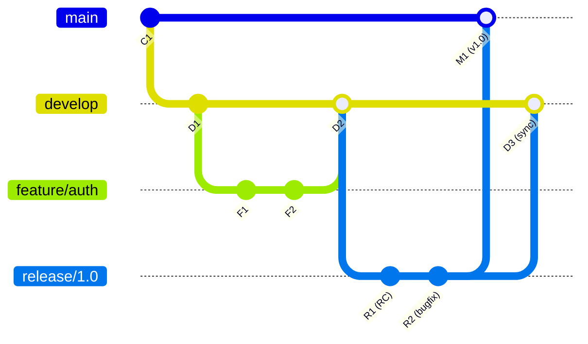
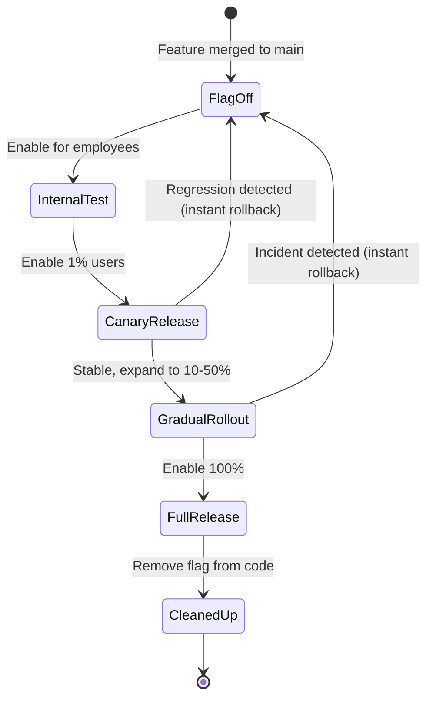

## Keywords in This File
{: .no_toc }

| # | Keyword | Weight |
|---|---|---|
| 12 | [GitFlow vs Trunk-Based Development](#gitflow-vs-trunk-based-development) | high |
| 13 | [Feature Flags and Branch Lifetime](#feature-flags-and-branch-lifetime) | high |

---

# GitFlow vs Trunk-Based Development

**Interview Weight:** High - Branching strategy is a team-wide architectural decision. Senior and Staff engineers are expected to explain the trade-offs, choose between strategies, and defend their choice. This question appears in almost every senior engineering interview that includes Git.

---

## Quick Reference

**One-line definition:** GitFlow is a branching model with dedicated long-lived branches for features, releases, and hotfixes; trunk-based development uses short-lived feature branches or direct commits to a single main branch, requiring feature flags for incomplete work.

**Difficulty:** ★★☆ | **Asked at:** Senior-Staff | **Seniority:** Senior-Staff

---

### 🎯 Model Answer

**30 seconds:**
GitFlow organizes work into long-lived branches: main (production), develop (integration), feature branches, release branches, and hotfix branches. Trunk-based development uses a single main branch where everyone integrates frequently - daily or multiple times per day - with feature branches lasting hours to days, not weeks. GitFlow provides structure and clear release gates; trunk-based development enables CI/CD velocity but requires discipline and feature flags for incomplete features.

**3 minutes (Senior):**
GitFlow was designed in 2010 for software with scheduled release cycles - versions shipped as downloads, installed by users. The model provides explicit release management through release branches and a clean separation between in-progress work (develop) and production (main). It is rigorous and auditable.

Trunk-based development emerged as the dominant model in continuous delivery environments. If you deploy to production 10 times per day, having a dedicated release branch makes no sense - main IS your release. Everyone integrates to main frequently. Long-lived feature branches are prohibited because they create the merge conflict hell and delayed integration feedback that slows teams down.

The key enabling technology for trunk-based development is feature flags: you merge incomplete features behind a flag that defaults off. The code is in production but inactive. When the feature is complete, you flip the flag. This decouples code deployment from feature release.

Decision framework: GitFlow for teams shipping versioned software (mobile apps, desktop clients, on-premise enterprise), or teams with strict release gates. Trunk-based for teams deploying continuously to cloud services, microservices, or web applications.

**Framework:** DELIVERY MODEL -> GITFLOW (versioned releases, scheduled deployments) vs TRUNK-BASED (continuous deployment, cloud services)

*Adapting up:* Add GitHub Flow as a simpler middle ground - just main and feature branches, no develop branch, no release branches. Simpler than GitFlow and works for many SaaS teams that deploy from main.

*Adapting down:* Junior answer: "GitFlow has lots of branches for different purposes (develop, feature, release, hotfix). Trunk-based means everyone works on the same main branch and merges daily."

**Blank Mind Recovery:**

**(1) Restate:** "GitFlow vs trunk-based - two branching philosophies with different trade-offs."

**(2) First principles:** "Branches exist to isolate in-progress work from stable code. The question is how long that isolation should last and how many dimensions of isolation you need (in-progress vs release-ready vs deployed)."

**(3) Bridge:** "GitFlow is like a hospital with separate wards (emergency, surgery, recovery, discharge). Each stage has its own room. Trunk-based is like a clinic with one main room where patients move through quickly - the fast flow requires feature flags as 'curtains' that hide unfinished work."

---

### 📘 Concept Explanation

**What it is:**
Two fundamentally different philosophies for organizing branching and integration in a team's Git workflow. GitFlow uses long-lived named branches for each development stage; trunk-based development uses short-lived branches integrated frequently to a single main branch.

**The problem it solves:**
Both strategies address the question of how to safely develop multiple features simultaneously while maintaining a deployable production codebase. The answer differs based on deployment frequency, team size, and release model.

**How it works:**

```
GitFlow branch model:
  main ----M1---------M2---------M3---
            \                   /
  develop ---D1-D2-D3-D4-D5-D6--
                |       |
  feature/A ----F1-F2   |
                    \   |
  feature/B ----------F3-F4-F5
                           |
  release/1.0 ----------R1-R2 (RC testing, bugfixes)
                              \
  main receives 1.0 merge ----M2

Trunk-based Development:
  main: C1-C2-C3-C4-C5-C6-C7-C8-C9-C10
              |       |       |
  feat/A: A1-A2    (1 day)
  feat/B: B1       (hours)
  feat/C: C1-C2    (2 days)

  Deploy on every merge to main (CI/CD)
  Incomplete features hidden behind flags
```

> **Diagram walkthrough:** The ASCII contrasts the two models side by side. GitFlow has 5+ concurrent long-lived branch types, with explicit promotion through stages (develop -> release -> main). Trunk-based has one permanent branch (main) with short-lived feature branches measured in hours or days. The key relationship in GitFlow is that main only receives merges via release branches (no direct commits), making it strictly production-grade. In trunk-based, main is always potentially deployable because every merge must pass CI before landing. Edge case: GitFlow's release branch is where late-stage bugfixes go during RC testing - if a fix is needed on release/1.0 while develop has moved to 2.0-prep, the release branch is the correct target. Senior insight: GitFlow's complexity multiplies maintenance burden exponentially with team size; trunk-based development's discipline requirement (CI, feature flags) multiplies tooling investment.



> **Diagram walkthrough:** The gitGraph shows the GitFlow model in action. Develop accepts feature merges (D2). A release branch is cut from develop for RC testing (R1, R2). After RC passes, release/1.0 merges into both main (production deployment) and develop (to bring RC bugfixes back). Key relationship: release branch buffers between develop (ongoing work) and main (production), allowing RC testing without blocking new development. Edge case: if a critical bugfix is needed on main directly (production emergency), a hotfix branch is created from main, fixed, and merged into BOTH main and develop. Senior insight: the double merge at release end (into main AND back into develop) is a common GitFlow mistake to forget - skipping it causes develop to diverge from production state.

**The key insight:**
GitFlow's complexity is justified when release management is complex (multiple supported versions, staged rollouts, compliance gates). For SaaS applications deployed continuously, that complexity is overhead with no benefit.

**When to use it:**
- GitFlow: versioned desktop/mobile apps, on-premise enterprise software, teams with compliance gates between staging environments, multiple supported versions in production
- Trunk-based: SaaS web applications, microservices, teams practicing CI/CD, teams deploying more than once per sprint

**When NOT to use it:**
- Do not use GitFlow for a SaaS application with continuous deployment - the release branch adds a bottleneck with no benefit
- Do not use trunk-based development without feature flags - merging incomplete features directly breaks main

**Alternatives:**
- GitHub Flow: main + feature branches, no develop branch, no release branches - simpler than GitFlow, works for teams deploying from main
- GitLab Flow: main + environment branches (staging, production) + feature branches - a middle ground for teams with multiple deployment environments
- One-flow: similar to GitFlow but without the develop branch - main is the integration branch

**First-principles derivation:**
The branching strategy is fundamentally a concurrency control mechanism: how many simultaneous work streams can exist and for how long? GitFlow is optimistic long-term isolation (weeks). Trunk-based is pessimistic short-term isolation (hours to days). The right choice depends on the cost of integration (how bad are merge conflicts?) vs the cost of isolation (how much does delayed feedback hurt?).

---

### 💻 Code Example

```bash
# BAD: GitFlow in a SaaS/CD environment - unnecessary ceremony
git checkout develop
git merge feature/login  # merge to develop
# ... wait for develop CI ...
git checkout release/2.5
git merge develop        # cut release
# ... RC testing, 3 days ...
git checkout main
git merge release/2.5    # deploy
# 3 days from PR open to production - too slow for SaaS

# GOOD: Trunk-based development for SaaS
git checkout main
git pull origin main
git checkout -b feature/login
# ... work, typically 1-3 days max ...
git push origin feature/login
# Open PR -> CI runs -> review -> merge to main
# CI/CD deploys main automatically
# Total: hours to 1-2 days

# Feature flag in code (trunk-based requirement)
# UserService.java
public List<User> searchUsers(String query) {
  if (featureFlags.isEnabled("new-search-algorithm")) {
    return newSearchService.search(query);
  }
  return legacySearchService.search(query);
}

# Feature flag in config (Unleash / LaunchDarkly pattern)
boolean newSearch = unleashClient.isEnabled(
    "new-search-algorithm",
    new UnleashContext.Builder()
        .userId(userId)
        .build()
);

# GitFlow: proper release branch workflow
# (valid for versioned software)
git checkout develop
git merge --no-ff feature/payment
git checkout -b release/2.0
# Run RC testing, apply fixes directly to release/2.0
git checkout main
git merge --no-ff release/2.0
git tag -a v2.0.0 -m "Release 2.0.0"
git checkout develop
git merge --no-ff release/2.0  # sync bugfixes back!
```

> **Code walkthrough:** The BAD pattern shows GitFlow applied to a SaaS service - 3 days from code complete to production is excessive for a web application that could deploy in 30 minutes. The GOOD pattern shows trunk-based: short-lived feature branches, direct CI/CD on merge to main. The feature flag code shows the mechanism that makes trunk-based safe: incomplete features are merged but inactive (flag defaults off). The GitFlow correct workflow shows the mandatory double merge at release end - develop MUST receive the release branch to stay synchronized with production bugfixes. What breaks: skipping the `git merge release/2.0` back to develop means develop diverges from main, and the next release cycle will surface hidden conflicts from the RC bugfixes. Takeaway: if using GitFlow, automate the double merge at release close to prevent it from being forgotten.

---

### 🎓 Answers by Seniority

**Junior / Mid (0-5 years):**
> "GitFlow has multiple long-lived branches: main for production, develop for ongoing work, feature branches, release branches, and hotfix branches. Trunk-based development keeps everyone on one main branch with short-lived feature branches. GitFlow works well for versioned software; trunk-based is better for SaaS with continuous deployment."

*Push deeper:* The key question that determines which is right: "How often do you deploy to production?" If the answer is "daily or more," trunk-based is almost certainly the better fit. If the answer is "every 2-4 weeks," GitFlow may be appropriate.

---

**Senior / Staff (5+ years):**
> "The choice is driven by release cadence and delivery model, not preference. For a mobile app with App Store review cycles and N versions concurrently supported, GitFlow's release branch model provides real value - you need explicit hotfix paths across multiple versions. For a SaaS web application, GitFlow's ceremony adds delay with no benefit. We standardized on trunk-based for all our services in 2022, which required investing in feature flags (LaunchDarkly) and automated CI, but cut our deployment cycle from 3 days to 45 minutes."

At Staff level: the discussion extends to how branching strategy affects engineering metrics (DORA: deployment frequency, lead time for changes, change failure rate, time to recover). Trunk-based development is correlated with high-performing teams in every DORA survey because it forces fast integration and CI discipline.

*Push deeper:* Discuss the organizational implication: trunk-based development requires shared ownership of the main branch. No team can have a "develop never breaks" guarantee because everyone commits to the same branch. This is a cultural shift from GitFlow where develop being broken is acceptable (it will be fixed before the release branch is cut).

---

### ⚠️ Common Misconceptions

**Misconception 1: "GitFlow is the industry standard."**
Reality: GitFlow was popularized in 2010 and became widely adopted, but it is explicitly designed for scheduled releases. The original author (Vincent Driessen) added a note to his original post in 2020 saying trunk-based development is now the recommendation for most software that does not require multi-version support.

**Misconception 2: "Trunk-based development means everyone commits directly to main."**
Reality: Trunk-based development typically still uses short-lived feature branches - the distinction is that branches merge within hours to days, not weeks. PRs still exist and CI still runs. The difference from GitFlow is no long-lived develop, release, or hotfix branches.

**Misconception 3: "GitFlow's develop branch is main."**
Reality: In GitFlow, develop is the integration branch for ongoing work; main is exclusively the production-deployed, versioned release branch. They serve different purposes. Confusing them leads to directly merging feature branches to main (which bypasses the release gate).

**Misconception 4: "You need feature flags for trunk-based development."**
Reality: Feature flags are the recommended enabler for trunk-based development but are not strictly required if every merged change is complete and releasable. Small teams with very short PR cycles sometimes do trunk-based without feature flags successfully. Feature flags become necessary when work takes longer than 1-2 days.

---

### 🚨 Failure Modes and Diagnosis

**Failure 1: GitFlow applied to a SaaS team - bottleneck**
Symptom: Features take 2-3 weeks from PR merge to production; developers complain about "waiting for the release window."
Cause: GitFlow's release branch acts as a gating stage that accumulates features and requires RC testing before deployment.
Diagnosis: Measure lead time for changes (commit to production). >2 weeks indicates the branching model is a bottleneck.
Fix: Migrate to trunk-based or GitHub Flow. Start with removing the develop branch (merge features directly to main with CI gate), then automate deployment from main.

**Failure 2: Trunk-based without feature flags - main is perpetually broken**
Symptom: Main branch CI fails several times per week; deployments are paused while in-progress work is pulled.
Cause: Incomplete features merged directly to main without flags; breaking changes visible in production.
Diagnosis: `git log main --oneline --since=1.week | grep -i "WIP\|partial\|incomplete"` shows in-progress merges.
Fix: Enforce a feature flag requirement for any PR that introduces incomplete features. Add CI check that prevents merge if known feature-flag-protected code paths are absent.

**Failure 3: GitFlow's develop and main desynchronize**
Symptom: A production bug was fixed in a hotfix branch and merged to main, but the same bug reappears in the next release because develop was never updated.
Cause: The hotfix branch was merged to main but the mandatory merge back to develop was forgotten.
Diagnosis: `git log develop..main` shows commits in main not in develop.
Fix: `git checkout develop && git merge --no-ff hotfix/the-fix`. Automate: add a CI check that blocks the main merge of a hotfix unless develop has the same commit.

---

### 🎯 Interview Deep-Dive

| Category | Count | Coverage |
|---|---|---|
| Conceptual | 4 | GitFlow anatomy, trunk-based, feature flags, GitHub Flow |
| Debugging | 2 | Bottleneck, desynchronized branches |
| Trade-off | 2 | When each is appropriate, DORA metrics |
| Behavioral | 1 | Migration experience |

---

**[MID] Q1 - What is GitHub Flow and how does it differ from GitFlow?**

GitHub Flow is a simpler branching model with two branch types: main (always deployable) and feature branches (short-lived, merge to main via PR). No develop branch, no release branches, no hotfix branches.

GitHub Flow rules: main is always production-ready. Create a branch from main for all work. Open a PR immediately and get early feedback. Merge to main via PR only after CI passes and review approves. Deploy from main on every merge.

GitFlow differences: GitFlow has a develop branch between features and main. GitFlow has dedicated release branches for RC testing. GitFlow has explicit hotfix branches. GitFlow supports multiple concurrent supported versions.

Use GitHub Flow when: you deploy continuously to one environment, your team is small to medium, and you do not need to maintain multiple supported versions. It eliminates GitFlow's ceremony while retaining PR-based review.

*What separates good from great:* GitHub Flow's simplicity is its strength and weakness. For a team maintaining three simultaneous supported versions of an enterprise product, GitHub Flow's lack of release branch support is a genuine gap. For a 10-person startup deploying a SaaS app, GitHub Flow is exactly right.

---

**[SENIOR] Q2 - How do you migrate a team from GitFlow to trunk-based development?**

Migration is a process, not a flag flip. Four-phase approach:

Phase 1 (1-2 weeks) - Add CI/CD infrastructure: ensure every push to main triggers automated deployment. Add feature flag infrastructure (LaunchDarkly, Unleash, or even simple config flags). Gate the migration on CI passing at 95%+ rate.

Phase 2 (2-4 weeks) - Retire the develop branch: merge develop into main, delete develop, configure main as the integration target for all PRs. Shorten branch lifetime target from weeks to 3 days maximum.

Phase 3 (1-2 months) - Retire release branches: replace scheduled release with deploy-on-merge. Wrap in-flight features (longer than 3 days) behind feature flags. Build a release notes generation process from commit messages rather than from release branches.

Phase 4 (ongoing) - Culture: define "main must be green" as a non-negotiable team commitment. Any red CI on main gets fixed before other work. Measure DORA metrics and target deployment frequency improvement.

*What separates good from great:* The technical migration is straightforward; the cultural migration (from "it is OK for develop to be broken" to "main must always be green") is the hard part and requires explicit team agreements and enforcement.

---

**[SENIOR] Q3 - What are the DORA metrics and how does branching strategy affect them?**

DORA (DevOps Research and Assessment) defines four key metrics for software delivery performance:

1. Deployment Frequency: how often deployments to production occur. Trunk-based with CD: multiple times per day (elite). GitFlow: weekly or less (low-medium).

2. Lead Time for Changes: time from commit to production deployment. Trunk-based: hours (elite). GitFlow: days to weeks (medium-low).

3. Change Failure Rate: percentage of deployments causing incidents. Trunk-based (with feature flags and CI): typically lower because changes are smaller and more frequent. GitFlow: batch deployments are riskier (more changes = more risk per deployment).

4. Time to Restore: how quickly production incidents are recovered. Trunk-based: smaller deployments mean easier rollback (revert one commit). GitFlow: bigger release bundles are harder to partially roll back.

High-performing teams (elite DORA) correlate strongly with trunk-based development and CI/CD automation. Branching strategy is a direct lever on deployment frequency and lead time.

*What separates good from great:* Knowing DORA metrics and being able to connect branching model to measurable outcomes turns an opinion-based strategy discussion into a data-driven engineering decision.

---

**[SENIOR] Q4 - How do you handle hotfixes in trunk-based development vs GitFlow?**

In trunk-based development, a hotfix is just a very short-lived feature branch from main:

```bash
git checkout main
git pull
git checkout -b hotfix/payment-timeout-fix
# fix, test
git push origin hotfix/payment-timeout-fix
# PR -> emergency review (1-2 reviewers) -> CI -> merge -> auto-deploy
```

> **Code walkthrough:** This shows a trunk-based hotfix lifecycle - branch from main, fix, push, PR, and merge directly to production. The KEY MECHANISM is that `main` is always deployable, so any commit merged to it can immediately trigger a deploy pipeline. WHY IT MATTERS: eliminating the GitFlow "merge to develop AND main" step cuts the hotfix cycle from 2+ hours to under 30 minutes. WHAT BREAKS: if main is NOT in a deployable state (failing tests, pending migrations), the trunk-based hotfix model collapses - the invariant "main is always green" must be maintained through enforced CI gates. TAKEAWAY: trunk-based hotfixes are faster precisely because the discipline is front-loaded into CI/CD automation, not back-loaded into process steps.

Total time: 30-60 minutes from identification to production. No separate hotfix branch type; no separate merge to develop. Main is always the source of truth.

In GitFlow, hotfixes require creating a dedicated `hotfix/` branch from main, merging to main AND develop (two PRs/merges), tagging the release, and coordinating that develop gets the fix (often forgotten). The GitFlow hotfix process is more structured but takes longer and has more steps to get wrong.

The trunk-based hotfix's speed advantage is why SaaS teams prefer it for incident response - time-to-production for a critical fix can be under 30 minutes vs 2+ hours in GitFlow.

*What separates good from great:* The hotfix speed difference is a strong argument for trunk-based in any environment where mean time to recover (MTTR) is a performance objective.

---

**[STAFF] Q5 - How does branching strategy affect code review quality and team communication?**

GitFlow's feature branches live for weeks, accumulating large diffs. A PR from a 3-week feature branch may have 2,000 lines of changes. Reviewers face decision fatigue; review quality drops; context is lost; bugs slip through. Batch integration means feedback comes late in the development cycle when changing course is expensive.

Trunk-based development with short-lived branches creates PRs with 50-200 line diffs that are reviewed in 30 minutes. Feedback is immediate (within the same day). Reviewers can understand the full context. Smaller changes are inherently lower risk.

Communication pattern: GitFlow creates "feature team silos" where teams work in isolation for weeks. Trunk-based forces frequent communication via the shared main branch - broken CI is everyone's problem, which creates shared ownership and better architectural coordination.

The psychological effect: developers on trunk-based branches know they must integrate today, which encourages breaking work into small, reviewable increments rather than building in isolation.

*What separates good from great:* Understanding that branching strategy is also a team communication architecture. The choice of branching model shapes how teams interact and review as much as it shapes how code flows.

---

**[STAFF] Q6 - How would you choose a branching strategy for a fintech company with both a mobile app and a web SaaS dashboard?**

[BEHAVIORAL]

**S:** I joined a fintech startup with a React web dashboard and an iOS/Android mobile app, both sharing a common backend API.

**T:** The team used GitFlow for everything. Web deploys took 2 weeks. Mobile deploys had App Store delays. A single branching strategy was causing friction.

**A:** I analyzed the delivery model for each product. The web dashboard: deployed to cloud, no external review, continuous deployment feasible - trunk-based is optimal. The mobile app: 1-2 week App Store review, multiple versions in active use (iOS 2.1.x, 2.0.x), users cannot be forced to upgrade immediately - GitFlow's release branch and hotfix model is genuinely needed.

I proposed a hybrid: GitFlow for the mobile app repositories, trunk-based for the web dashboard and backend API repositories. The backend API used feature flags for mobile compatibility: new API endpoints launched behind flags, enabled per mobile app version. Mobile apps specifying `app-version: 2.1.0` in API headers received the new endpoints; older versions fell back to the legacy endpoints.

**R:** Web dashboard deployment frequency increased from 2 weeks to same-day. Mobile releases retained their structured GitFlow process with hotfix support. The feature flag API versioning eliminated the "API breaks mobile" problem that previously required synchronized releases.

*What separates good from great:* Recognizing that one branching strategy does not have to apply across all repositories in a company. The delivery model of each product determines the right strategy; forcing uniformity creates unnecessary compromise.

---

**[STAFF] Q7 - How do you enforce branching strategy compliance at scale without creating process overhead?**

[TRADE-OFF]

Branching strategy only works if every engineer follows it consistently. Enforcement options exist on a spectrum from zero enforcement (documentation only) to full automation (CI blocks non-compliant branches).

**Enforcement layers:**

1. **Branch naming protection** (GitHub/GitLab branch protection rules): require PRs to merge to main; protect main from direct pushes; require status checks to pass. Cost: zero. Enforces the "all work via PR" core trunk-based rule.

2. **Branch name policies** (Azure DevOps, Bitbucket): reject pushes to branches not matching `feature/`, `fix/`, `release/` prefixes. Catches naming violations before they accumulate.

3. **Branch lifetime monitoring** (custom CI job): daily job scans all branches, reports any feature branch older than X days. Older than threshold: Slack notification to author. Older than 2x threshold: manager notification.

4. **Merge strategy enforcement**: GitHub branch protection can require squash-merge or merge-commit style. This ensures the commit history matches the team's convention.

**What NOT to enforce:**

Avoid enforcing commit message format via rejected pushes - it creates friction without proportional benefit. Git commit message linting is better done as a warning in CI, not a hard gate. Engineers who have to amend commits for message formatting violations lose trust in the process.

*What separates good from great:* The most effective enforcement is the path of least resistance. If the trunk-based workflow is easier than the workaround (forking, direct-push), engineers will follow it. If enforcement creates more friction than value, it gets circumvented. Automation should make the right path easy, not make the wrong path hard.

---

**[SENIOR] Q8 - What branching strategy works best for open-source projects with external contributors?**

[APPLICATION]

Open-source projects have constraints that internal teams do not: you cannot enforce branch protection on external forks, contributors have varying experience levels, and PRs may be open for weeks without contact.

**GitHub Flow is the standard for OSS:**

```bash
# External contributor workflow
git fork upstream/repo
git checkout -b fix/issue-456-null-pointer
# make changes
git push origin fix/issue-456-null-pointer
# open PR to upstream/main
```

> **Code walkthrough:** The fork-based contribution model creates a personal copy of the repo where contributors have full push access without touching the upstream. The KEY MECHANISM: the PR is from `contributor:fix/issue-456` to `upstream:main`, not a direct branch. WHY IT MATTERS: maintainers can run CI on the PR without granting push access to the contributor. WHAT BREAKS: contributors who push to their fork's `main` instead of a feature branch make future rebases painful - the PR review comment "please make your changes on a feature branch" is a common OSS friction point. TAKEAWAY: the fork+feature-branch pattern is the OSS norm because it isolates contributor work without repository permission requirements.

**Differences from internal GitHub Flow:**

- **No trunk-based development**: external contributors cannot run feature flags; dark launches are not possible for OSS library code.
- **Release branches are often necessary**: OSS projects must maintain v1.x, v2.x, v3.x simultaneously. GitFlow-style release branches are common in major frameworks (React maintains `18.x`, `17.x` branches).
- **Long PR lifetimes**: PRs from external contributors can be open for months. Branch divergence accumulates. Maintainers often need to rebase PRs before merging.

*What separates good from great:* Understanding that OSS branching strategies are constrained by the contributor trust model, not just delivery velocity. An internal team can do trunk-based continuously; an OSS project cannot require all contributors to use feature flags or have production access.

---

**[SENIOR] Q9 - How does branch strategy affect merge queue and CI concurrency?**

[MECHANISM]

At scale (100+ PRs per day), sequential PR merges create a bottleneck: PR #1 merges, CI runs on main, PR #2 now needs to rebase off the new main before it can merge. Serialization of merges limits throughput.

**Merge queue (GitHub Merge Queue, Bors, GitLab Merge Trains):**

Merge queues solve this by batching PRs and running CI on speculative merged states:

1. Engineer marks PR "ready to merge" → enters queue
2. Queue system creates a temp branch: `queue/pr-101+pr-102+pr-103`
3. CI runs on the combined merge
4. If green: all three PRs merge atomically
5. If red: queue bisects to find the failing PR, ejects it, retries

**Why this matters for branching strategy:**

Merge queues only work with trunk-based development. GitFlow with a develop branch adds a second serialization point: PRs queue to develop, then develop merges to main. Each transition is a bottleneck. Trunk-based with merge queues achieves near-linear CI throughput scaling.

**Trade-off:**

Merge queues require well-isolated, independently mergeable PRs. Large PRs that touch many files create high merge conflict probability in the queue. Merge queues are a forcing function for smaller, more focused PRs - which is generally a good discipline. However, they add complexity to the CI setup and require understanding of speculative merge semantics.

*What separates good from great:* Knowing that merge queues exist and how they interact with branching strategy is a differentiator at the staff level. Most engineers know about merge conflicts; fewer know about merge queue architecture and how it affects CI infrastructure choices.

---

### ⚖️ Comparison Table

| | GitFlow | GitHub Flow | Trunk-Based Development |
|---|---|---|---|
| Branch types | main, develop, feature, release, hotfix | main, feature | main, feature (short-lived) |
| Branch lifetime | Weeks to months (feature, release) | Days to 1 week | Hours to 2-3 days |
| Release model | Scheduled, versioned | Deploy from main | Deploy on every merge |
| Feature flags required | No | Recommended | Yes (for incomplete features) |
| Multiple version support | Built-in (release branches) | Manual | Difficult without flags |
| CI/CD compatibility | Moderate (multiple branches) | High | Highest |
| Team discipline required | Low (explicit structure) | Medium | High |
| DORA performance | Low-medium | Medium-high | High-elite |
| Best for | Versioned apps, enterprise, mobile | Small-medium SaaS teams | Large SaaS, microservices, CD teams |
| Complexity | High | Low | Medium (with flag infrastructure) |

---

### 🏛️ System Design

*(Omit: Not a ★★★ keyword.)*

---

### 📊 Diagram

*(Omit: ASCII and Mermaid diagrams are included in the Concept Explanation section.)*

---
---

# Feature Flags and Branch Lifetime

**Interview Weight:** High - Feature flags are a core enabling technology for CI/CD and trunk-based development. Staff engineers are expected to understand flag management, graduation, and the risks of flag sprawl. This connects branching strategy to deployment risk management.

---

## Quick Reference

**One-line definition:** Feature flags (feature toggles) are conditionals in code that control whether a feature is active, decoupling code deployment from feature release and enabling progressive rollouts, A/B testing, and instant rollbacks without deployment.

**Difficulty:** ★★☆ | **Asked at:** Senior-Staff | **Seniority:** Senior-Staff

---

### 🎯 Model Answer

**30 seconds:**
A feature flag is a conditional that wraps a code path: when the flag is off, the old behavior runs; when on, the new behavior runs. Flags decouple code deployment from feature release - you merge to main and deploy the code, but the feature is inactive until you flip the flag. This enables trunk-based development (merge incomplete features safely), progressive rollouts (enable for 1% then 10% then 100% of users), and instant rollbacks (flip flag off without redeploying).

**3 minutes (Senior):**
Feature flags are a runtime configuration system. At the simplest level: a boolean in a config file checked at runtime. At the sophisticated level: a feature management platform (LaunchDarkly, Unleash, Split.io) that evaluates flags based on user segments, percentages, geographic regions, or custom attributes.

Flag types by purpose: release toggles (control incomplete features during development, temporary), experiment toggles (A/B tests, persist for test duration), ops toggles (kill switches for infrastructure-level features, long-lived), and permissions toggles (entitlements by plan/user, long-lived).

The critical practice: every flag has an owner and an expiry date. Release flags must be cleaned up after the feature goes fully live. An application with 200 active flags and no cleanup practice has dead flag code that cannot safely be removed because no one knows which flags are still guarding live features.

Branch lifetime directly ties to flag usage: a feature branch that has existed 3 weeks probably has too much in-progress work. Flags should let you merge working partial implementations to main within a day or two, deferring the "feature is complete" signal to the flag flip.

**Framework:** MERGE CODE (always safe) -> FLAG OFF (feature inactive) -> GRADUAL ROLLOUT -> FLAG ON (feature active) -> FLAG CLEANED UP (code simplified)

*Adapting up:* Add canary deployments as a related concept - canary deploys to a subset of servers rather than a subset of users. Flags and canary deployments are complementary risk management tools.

*Adapting down:* Junior answer: "Feature flags are if-statements that let you turn features on and off without redeploying. Used to test new features with some users before rolling out to everyone."

**Blank Mind Recovery:**

**(1) Restate:** "Feature flags - runtime switches for enabling and disabling features independently of deployment."

**(2) First principles:** "Deployment and feature release are two separate events. Deployment = putting code on servers. Feature release = making that code visible to users. Flags separate these two events, giving you control over each independently."

**(3) Bridge:** "Like a light switch wired to a lamp that is already installed. The lamp (code) is in the room (deployed) before you flip the switch (release). The wiring (flag) lets you control when the light (feature) turns on without any electrical work (redeployment)."

---

### 📘 Concept Explanation

**What it is:**
Feature flags (also: feature toggles, feature switches) are conditional code branches controlled by external configuration, allowing specific functionality to be enabled or disabled at runtime without code changes or redeployment.

**The problem it solves:**
CI/CD practice demands frequent merges to main and frequent deployments, but not every merged feature is ready for users. Feature flags solve the tension by letting incomplete features exist safely in production while remaining inactive. They also provide progressive rollout control and instant reversal capability.

**How it works:**

```
Simple flag (boolean config):
if (config.getBoolean("new-checkout-flow")) {
  return newCheckoutService.process(cart);
}
return legacyCheckoutService.process(cart);

User-targeted flag (segment-based):
FeatureContext ctx = new FeatureContext.Builder()
    .userId(user.getId())
    .userGroup(user.getGroup())
    .build();
if (flagService.isEnabled("new-checkout-flow", ctx)) {
  return newCheckoutService.process(cart);
}
return legacyCheckoutService.process(cart);

Progressive rollout percentages:
  0% -> internal testing (employees only)
  1% -> canary (beta users)
 10% -> expanded beta
 50% -> progressive rollout
100% -> full release
  flag removed from code
```

> **Diagram walkthrough:** The ASCII shows three flag complexity levels. The simple boolean flag is appropriate for ops toggles and early development. The context-aware flag (user-targeted) is the production pattern - flags are evaluated per request based on user attributes. The progressive rollout shows the typical lifecycle from 0% (off) through graduated percentages to 100% (full release) and then code cleanup. Edge case: a flag evaluated millions of times per second in a hot code path must be cached locally - latency to a flag service on every request would add unacceptable overhead. LaunchDarkly's SDK, for example, maintains an in-memory flag state that is streamed from the server; evaluation is local (nanoseconds), not a network call. Senior insight: flag evaluation in critical paths must be async and cached; synchronous remote evaluation is a latency and availability risk.



> **Diagram walkthrough:** The state diagram shows the complete feature flag lifecycle. Starting from flag-off (feature deployed but inactive), the flag progresses through internal testing, canary release, gradual rollout, full release, and finally cleanup (flag removed from code). The critical arrows are the rollback transitions: from canary or gradual rollout, a detected regression can instantly flip the flag to off without any deployment. Key relationship: the cleanup state is mandatory - flags that reach full release but are never cleaned up accumulate as technical debt. Edge case: during the CleanedUp state, the legacy code path is also removed, simplifying the code. If the legacy code is removed before cleanup, the flag is no longer meaningful but is still checked - this is "dead flag" debt. Senior insight: define an SLA for flag cleanup as part of the development process: "flags must be removed within 2 sprints of reaching 100% rollout."

**The key insight:**
Feature flags decouple deployment velocity (merge and deploy as often as needed) from release velocity (enable features only when ready). This allows teams to maintain both CI/CD practices AND control over user experience.

**When to use it:**
- Trunk-based development for features taking more than 1 day to complete
- Progressive rollout for high-risk features
- A/B testing and experimentation
- Ops kill switches for features that may need emergency disabling
- Beta programs and early adopter programs

**When NOT to use it:**
- Performance-critical hot paths where flag evaluation overhead is measurable (cache flags aggressively)
- Architectural migrations where the flag would need to wrap hundreds of call sites (too much coupling)
- Simple 1-day features that can be merged complete without a flag

**Alternatives:**
- Blue-green deployment: two production environments; switch traffic routing rather than feature flags
- Canary deployment: deploy to a subset of servers; provides infrastructure-level control without code flags
- Environment-based control: staging environment config disables features; simpler but less granular than user-level flags

**First-principles derivation:**
If you can separate "code in production" from "feature visible to users," you gain independent control over two risk vectors: code deployment risk and feature release risk. Feature flags are the mechanism for that separation. The primitive is: a runtime conditional whose value is determined by external config (not compiled in), making it changeable without redeployment.

---

### 💻 Code Example

```bash
# BAD: Long-lived feature branch avoids the need for flags
# but creates integration debt
git checkout -b feature/new-pricing-engine
# ... 3 weeks of work ...
# git merge causes 400-line conflicts

# GOOD: Trunk-based with feature flag
# Day 1: create flag (default off), merge skeleton
git checkout -b feature/new-pricing-engine
# Add flag check + empty stub
git commit -m "Add new-pricing-engine flag (default off)"
git push && open PR && merge same day

# Days 2-5: add implementation behind flag
# Each commit: merge to main daily, always behind flag
git commit -m "Implement pricing calculator (flag-gated)"
git commit -m "Add pricing rule engine (flag-gated)"

# Day 6: enable for internal employees
# Update flag config: users.group == 'employee'
# Monitor for errors, logs, metrics

# Week 2: canary to 1% users
# Update flag config: rollout.percentage = 1
```

```java
// BAD: Hard-coded feature logic (can't roll back without deploy)
public Price calculate(Cart cart) {
    // New algorithm added directly - no rollback possible
    return newPricingEngine.calculate(cart);
}

// GOOD: Flag-gated with fallback
public Price calculate(Cart cart) {
    if (featureFlags.isEnabled(
        "new-pricing-engine",
        ctx.forUser(cart.getUserId())
    )) {
        return newPricingEngine.calculate(cart);
    }
    return legacyPricingEngine.calculate(cart);
}
```

> **Code walkthrough:** The BAD pattern shows a long-lived branch that avoids flags but accumulates integration debt (3 weeks, 400-line conflicts at merge). The GOOD pattern shows how flags enable daily merges to main with the feature inactive. The flag check wraps the new code path; the legacy path is the default. The Java example shows the user-context pattern: the flag is evaluated per-user, enabling targeted rollout. What breaks: flag evaluation in a tight loop (e.g., per-item in a 10,000-item batch job) without caching adds significant latency and load to the flag service. Cache flag state at request start: `boolean useNewEngine = featureFlags.isEnabled("new-pricing-engine", ctx);` before the loop, not inside it. Takeaway: treat flag evaluation in hot paths as you would a network call - cache it, do not call it per-iteration.

---

### 🎓 Answers by Seniority

**Junior / Mid (0-5 years):**
> "Feature flags are if-statements controlled by external configuration. When the flag is off, the old code runs; when on, the new code runs. I use them to merge incomplete features to main without breaking anything for users, and to gradually roll out new features to a percentage of users while monitoring for issues."

*Push deeper:* Every feature flag has a lifecycle: off, testing, rollout, fully on, removed. The "removed" step is critical. Flags that are never cleaned up make the codebase harder to understand and maintain.

---

**Senior / Staff (5+ years):**
> "Feature flags are a deployment risk management tool. A critical principle: flags must have an owner and an expiry policy. Teams that treat flags as permanent configuration rather than temporary scaffolding end up with flag sprawl - 200 active flags, no one knows which are live, the code is a maze of conditionals. We enforce a 'flag graduation' process: each flag must be removed within 2 sprints of reaching 100% rollout. The flag removal PR is part of the feature's definition of done."

At Staff level: the discussion extends to flag infrastructure decisions. Proprietary services (LaunchDarkly, Split.io) offer user targeting, analytics, and SDKs but cost $20k-100k/year for enterprise. Open-source alternatives (Unleash, Flagsmith, OpenFeature) provide control and lower cost but require operational investment. The choice involves build vs buy analysis for a capability that is not your core business.

*Push deeper:* Discuss the OpenFeature specification - a CNCF standard for feature flag SDKs that allows swapping flag backends without changing application code. This prevents vendor lock-in for any flag platform.

---

### ⚠️ Common Misconceptions

**Misconception 1: "Feature flags are only for incomplete features."**
Reality: Four distinct flag types exist: release toggles (incomplete features), experiment toggles (A/B tests), ops toggles (emergency kill switches), and permissions toggles (entitlements). Ops toggles in particular are long-lived by design.

**Misconception 2: "Feature flags can be evaluated on every request without caching."**
Reality: Remote flag evaluation requires a network call. In high-traffic applications, evaluating flags via network on every request adds latency and creates a hard dependency on the flag service. All production flag SDKs maintain local state with server-side streaming updates. Flag evaluation is local; sync is async.

**Misconception 3: "Removing a feature flag is optional cleanup."**
Reality: Unremoved flags are technical debt. Code with 50+ active flags is difficult to reason about, test, and maintain. Each flag doubles the code paths that need testing. Teams that never clean up flags eventually have applications where the interaction between flags is unpredictable (flag A off + flag B on creates a state that was never tested).

**Misconception 4: "Feature flags can replace testing."**
Reality: Flags reduce rollout risk but do not replace testing. The new code path must be tested (unit, integration, E2E) before flag-gated deployment. Flags are a production safety net for unexpected edge cases, not a substitute for pre-deployment verification.

---

### 🚨 Failure Modes and Diagnosis

**Failure 1: Flag sprawl - 200 flags, no one knows what is live**
Symptom: New engineers are afraid to change code with flag checks. "Is this flag still being evaluated? Can I remove this code path?"
Cause: No cleanup policy; flags treated as permanent config.
Diagnosis: `git log --oneline --all -- src/ | grep "isEnabled\|featureFlag" | wc -l` counts flag usage. Query flag service for "last evaluated" date per flag.
Fix: Establish flag graduation process: owner + expiry date at flag creation. Automated alerts when flags are 60 days past 100% rollout. Quarterly flag audit.

**Failure 2: Flag evaluation in hot path causes latency spike**
Symptom: p99 latency increased 40ms after adding feature flag check in payment processing loop.
Cause: Flag evaluated per-item in a 5,000-item checkout flow; flag SDK made a network call per evaluation.
Diagnosis: Distributed trace shows `featureFlags.isEnabled()` call appearing thousands of times per request.
Fix: Evaluate flag once before the loop; store result in local boolean.

**Failure 3: Flag interaction creates untested state**
Symptom: Production error in a combination that no test covered: `new-checkout` ON + `new-pricing` ON + `legacy-tax-engine` ON created a null pointer in tax calculation.
Cause: Three flags with interdependencies were enabled at different times for different user segments; the triple combination was never tested.
Diagnosis: Reproduce the three-flag state in a test environment; trace the null pointer.
Fix: Document flag dependencies; test flag combinations in integration tests for interdependent flags.

---

### 🎯 Interview Deep-Dive

| Category | Count | Coverage |
|---|---|---|
| Conceptual | 3 | Flag types, lifecycle, caching |
| Debugging | 3 | Flag sprawl, latency, interaction bugs |
| Trade-off | 2 | Build vs buy, flags vs branching |
| Behavioral | 1 | Flag implementation experience |

---

**[MID] Q1 - What are the four types of feature flags and when is each appropriate?**

Martin Fowler's categorization (from "Feature Toggles"):

1. Release Toggles: gate incomplete feature code during active development. Short-lived (days to weeks). Removed after feature reaches 100% rollout. Example: wrapping an in-progress payment refactor.

2. Experiment Toggles: A/B tests. Medium-lived (duration of the experiment, weeks to months). Cleaned up when experiment concludes. Example: testing two UI variants for conversion rate. Require multivariate evaluation (user is randomly assigned to bucket A or B).

3. Ops Toggles: emergency kill switches for production features. Long-lived (may persist indefinitely while the feature exists). Low evaluation overhead priority. Example: disabling a third-party API integration when the vendor has an outage, without a full deployment.

4. Permission Toggles: entitlement controls. Long-lived (persist as long as the entitlement exists). Example: enabling premium features only for paid subscribers.

*What separates good from great:* Understanding that different flag types have different management needs. Release flags need aggressive cleanup policies; ops flags need runbook documentation; experiment flags need statistical analysis tooling; permission flags need integration with your authorization system.

---

**[SENIOR] Q2 - How do you prevent flag sprawl in a team of 30 engineers?**

Structural controls and process enforcement:

1. Flag registration requires an owner (team + individual) and an expiry date. No flag is created without both. Enforce via flag service UI validation.

2. Automated alerts: when a flag reaches 100% rollout AND is 30 days past expiry, send a Slack alert to the owner. Escalate to team lead at 60 days.

3. Block new flag creation if the team has more than N active expired flags (creates direct incentive to clean up before creating new flags).

4. Quarterly flag audit: engineering leads review all active flags. Flags with no evaluation in 30 days are candidates for removal.

5. Flag removal is part of definition of done: before a feature ticket is closed, the flag cleanup PR must be merged or scheduled. No "done" without flag retirement.

The cultural enabler: leadership must treat flag cleanup as engineering work, not optional housekeeping. If flag cleanup never appears in sprint planning, it never gets done.

*What separates good from great:* Flags are a shared infrastructure concern. A single team's uncontrolled flag creation affects every engineer's ability to understand the codebase. Treating flag management as a team engineering standard (not optional) is the key insight.

---

**[SENIOR] Q3 - How does a feature flag service achieve high availability?**

A feature flag service is in the critical path if flags are evaluated synchronously per request. High-availability requirements:

1. Local cache: the flag SDK maintains an in-memory snapshot of all flag states. Evaluations are local (nanoseconds). The cache is updated by a background streaming connection to the flag service.

2. Default-on-failure: if the flag service is unreachable and the cache is empty (cold start), the SDK evaluates all flags to their configured default values (typically off). This ensures feature behavior is predictable even during flag service outages.

3. Fallback config: some implementations bake a static flag config into the deployment artifact as a fallback. If the flag service never responds, the baked config is used.

4. Decoupled availability: the application works even if the flag service is down (using cached or default values). The flag service is an availability enhancer, not an availability dependency.

LaunchDarkly's architecture, for example, maintains 99.99% uptime for flag evaluations through local caching with streaming updates, backed by a multi-region replicated flag store. Applications do not call LaunchDarkly servers on every flag check.

*What separates good from great:* Understanding that a naively implemented flag service (HTTP call per flag evaluation) is an availability and latency footgun. The local-cache-with-streaming model is the production-grade approach.

---

**[SENIOR] Q4 - How do feature flags interact with database migrations?**

Database migrations are a special case where flags must account for schema state, not just code state.

Example problem: you add a new `payment_method` column to the `orders` table. The new checkout code reads from this column. If you deploy the new code (with flag on) before the migration runs, the new code will fail (column missing). If you run the migration before deploying code (with flag off), the old code ignores the new column safely.

Pattern for backward-compatible migrations: (1) Deploy migration adding nullable column (old code ignores it, new code will write to it). (2) Deploy code with flag off (new code path exists but inactive; column is present). (3) Gradually enable flag. (4) After 100% flag rollout, make column non-nullable in a separate migration.

The flag lifecycle must align with the migration lifecycle. Never enable a flag that requires a schema change before that migration has been applied to all environments in the deployment pipeline.

*What separates good from great:* Understanding that flags and database migrations have an ordering dependency. Treating them as independent can cause production failures. The "expand then contract" migration pattern (add column safely, then remove old column later) is the standard approach.

---

**[STAFF] Q5 - How would you design a feature flag system for a service processing 100,000 requests/second?**

At 100k req/s, the flag evaluation path must be:

(1) In-process and local: zero network calls per evaluation. The flag state is maintained in memory, updated by a background goroutine/thread via a long-lived WebSocket or Server-Sent Events stream from the flag service.

(2) Cache structure: a concurrent hash map from flag key to evaluated value. Map lookup is O(1) with read-lock contention near zero (reads greatly outnumber writes in a flag state map that updates every few seconds).

(3) Evaluation API: `isEnabled(flagKey, context)` performs: (a) look up flag definition from cache (b) evaluate targeting rules against context (userId, group, percent). No IO.

(4) Cold start safety: the SDK blocks requests during initialization until the first flag state sync completes. After that, serves from cache indefinitely.

(5) Update latency: when a flag is changed in the flag service, the change propagates via streaming to all SDK instances. Target: all instances updated within 500ms. Any instance that has not received the update within 5 seconds falls back to the previous state.

(6) Metrics: track flag evaluation latency (should be sub-microsecond), update propagation latency, and flag service connection health as operational metrics.

*What separates good from great:* The design insight is that 100k req/s requires zero-IO per evaluation. The flag service is a control plane, not a data plane. Data plane (flag evaluation) must be local.

---

**[STAFF] Q6 - Describe how you managed feature flag lifecycle at a company with 50+ flags.**

[BEHAVIORAL]

**S:** I joined a growth-stage SaaS company with 70 feature flags, no ownership tracking, and 20 flags that had been at 100% rollout for 6+ months but never removed. Engineers avoided touching code near flags because they could not tell which were still needed.

**T:** Establish flag lifecycle governance without disrupting active product development.

**A:** I ran a flag audit using LaunchDarkly's API to pull all flags, their last-evaluated dates, and their rollout percentages. I categorized: 23 flags at 100% with no recent changes (dead flags), 18 flags in active rollout (keep), 29 flags in development (keep). I assigned ownership to the dead flags by tracing the creating team from git history.

I proposed a flag lifecycle SLA: release flags must be removed within 2 sprints of reaching 100%. Ops flags are excluded. I built a weekly Slack digest (cron job calling LaunchDarkly API) that lists each team's expired flags and their age.

For the 23 dead flags, I organized a "flag cleanup sprint" where teams removed the flags and simplified the code. This reduced the codebase by ~800 lines and eliminated 23 potential points of confusion.

I added flag metadata (owner, expiry, type) to the flag creation process as required fields, enforced by a pre-creation hook in our internal developer portal.

**R:** Over the following quarter, the average flag lifetime dropped from indefinite to 3.5 weeks for release flags. The Slack digest created organic social pressure that made flag cleanup routine rather than exceptional.

*What separates good from great:* The cultural lever (weekly digest creating visible pressure) mattered as much as the governance process. Automating the visibility of overdue flags made cleanup a social norm rather than a management directive.

---

**[STAFF] Q7 - How do you implement gradual rollout to 1% → 10% → 50% → 100% safely?**

[MECHANISM]

Percentage rollouts are the primary risk-mitigation strategy for releasing to production. The key principle: each percentage tier is a hypothesis test.

**Rollout tiers and what to measure:**

```
1%:  Monitor error rates, p99 latency, business metrics (5-15 min)
10%: Statistical significance on core metrics (1-2 hours)
25%: Check infrastructure scaling (queue depth, DB connections)
50%: Final validation before broad release (1-2 hours)
100%: Full release; set flag removal timer for 2 sprints
```

> **Code walkthrough:** This shows the four-tier graduated rollout strategy. The KEY MECHANISM is progressive exposure: each tier is a gate where you verify the feature behaves correctly before expanding. WHY IT MATTERS: at 1% you have minimal blast radius if something fails - 99% of users are unaffected. WHAT BREAKS: skipping directly to 50% without verifying at 1% means a p99 latency regression affects half your users before you notice the pattern. TAKEAWAY: define explicit go/no-go criteria (error rate, latency, business metric) before advancing each tier - not just "looks OK".

**Critical implementation details:**

1. **Sticky assignment**: Users must see the same variant on every request. Compute `hash(user_id + flag_key) % 100`. If the hash is `< rollout_percentage`, the flag is on. This is deterministic - the user's experience does not change as the percentage increases.

2. **Error rate threshold for auto-rollback**: Define a threshold (e.g., error rate increases by 0.5pp vs baseline) that triggers automatic flag disable. Most flag platforms support this natively.

3. **Metric baseline window**: Measure baseline for the SAME time window in previous weeks to avoid day-of-week bias. A 10% rollout on Monday morning should be compared to the same Monday morning cohort, not Saturday night.

4. **Excluded populations**: Some users should never be in the rollout cohort: internal employees see all features at 0% (use a separate employee segment), users in regulated regions have separate compliance requirements.

*What separates good from great:* Understanding the statistics behind percentage rollouts - how long you need to wait at each tier for statistical significance depends on your traffic volume. For a 10k DAU app at 10% (1000 users), you may need 2-3 days to detect a 5% conversion change. For a 10M DAU app, hours.

---

**[SENIOR] Q8 - What is the relationship between feature flags and continuous deployment?**

[APPLICATION]

Feature flags are the enabling technology for continuous deployment (deploy without releasing). Without flags, "deploy" and "release" are the same event. With flags, you decouple them:

**Without feature flags:**
```
merge to main → CI build → QA approval → deploy = release
```

> **Code walkthrough:** This BAD flow shows deploy=release coupling. The KEY MECHANISM of the problem: every merge must pass a QA gate before reaching production, creating a batch cycle. WHY IT MATTERS: a bug from day 1 is in production for up to 2 weeks. WHAT BREAKS: hotfix urgency forces QA bypass, defeating the gatekeeping purpose. TAKEAWAY: without flags, deploy frequency is bounded by release risk.

Deploy frequency: once per sprint or less. High risk per deploy.

**With feature flags:**
```
merge to main → CI build → deploy (flag off)
→ [any time later] enable flag for 1% → monitor → ramp to 100%
```

> **Code walkthrough:** This GOOD flow shows deploy-release decoupling. The KEY MECHANISM: code is deployed flag-off - present in the binary but unreachable by users. WHY IT MATTERS: the deploy step becomes a non-event; only the flag-enable step is the actual release. WHAT BREAKS: if dark-deployed code has a startup crash not guarded by the flag, it affects all users even with flag off. TAKEAWAY: flags enable continuous deployment by making every code deploy safely invisible.

Deploy frequency: multiple times per day. Decoupled from release risk.

**Why this matters for branching strategy:**

If you can deploy code while it is flag-off, then the argument for long-lived feature branches disappears. The "feature isn't ready" objection is resolved by the flag, not by withholding the code from main. This is why trunk-based development and feature flags are always discussed together - they are mutually reinforcing practices.

**The dark launch pattern:**

Some teams flag-off features but still exercise the code path with real traffic and measure its behavior (latency, errors) without showing results to users. This validates production behavior before user-facing rollout.

*What separates good from great:* Recognizing that feature flags are a deployment architecture decision, not just a feature toggle mechanism. The team that uses flags correctly can deploy to production continuously while decoupling release decisions to product management.

---

**[SENIOR] Q9 - How do feature flags affect database migration strategies?**

[TRADE-OFF]

This is one of the most subtle interactions in the feature flag + continuous deployment model. Schema changes are irreversible in a way that code changes are not.

**The expand-contract (parallel-change) pattern:**

```
Phase 1 - Expand: Add new column (nullable, default null)
  Flag: off. Both old and new code paths work.
Phase 2 - Migrate: Backfill new column from old column
  Flag: off. Background job runs.
Phase 3 - Contract: Enable flag; new code uses new column
  Flag: on. Monitor for 1-2 weeks.
Phase 4 - Cleanup: Remove old column; remove flag.
  Flag: removed.
```

> **Code walkthrough:** This shows the four-phase expand-contract (parallel-change) pattern for zero-downtime schema changes. The KEY MECHANISM is that each phase is independently deployable - Phase 1 adds a nullable column (safe for all code versions), Phase 2 backfills (background, non-blocking), Phase 3 enables the flag (switches code path), Phase 4 removes dead code. WHY IT MATTERS: deploying Phase 3 (flag on) before Phase 1 (column add) crashes production. WHAT BREAKS: if Phase 4 cleanup is skipped, the old column stays forever - this is technical debt that accumulates with every schema change. TAKEAWAY: expand-contract is the only correct pattern for zero-downtime schema changes in production.

**Why this matters:**

If you deploy code that reads a new column (flag-on) but the column does not exist yet (migration not run), you get a production crash. The expand-contract pattern ensures the database always has MORE columns than the currently-deployed code needs. Rolling back the code does not break the database.

**Anti-pattern: flag and migration deployed together:**

```
# BAD
deploy code that reads new_column (flag off)
run migration to add new_column
enable flag
```

> **Code walkthrough:** This BAD pattern deploys three tightly coupled changes in sequence, creating a risky dependency chain. The KEY MECHANISM of the failure: if the migration fails at step 2, the code deployed at step 1 is already in production reading a column that does not exist - you get `Column 'new_column' does not exist` errors at runtime. WHAT BREAKS: rolling back the code requires a separate deployment; in the meantime, the app is broken. TAKEAWAY: the BAD pattern couples deploy, migrate, and release into one risky sequence; expand-contract decouples them so each can fail independently without breaking production.

If the migration fails, you must roll back both code AND migration. Expand-contract separates these concerns so each change is independently safe.

*What separates good from great:* Understanding that expand-contract is the correct answer for zero-downtime schema changes is what senior engineers know. The deeper insight is that feature flags make this easier by extending the window between deploy and release, giving time for migrations to complete before the code path is activated.

---

### ⚖️ Comparison Table

| | Simple Config Flag | Feature Management Platform | Canary Deployment |
|---|---|---|---|
| User targeting | No | Yes (segments, %) | No (server %) |
| Rollout granularity | All or nothing | Per user, per % | Per server instance |
| Rollback speed | Minutes (config change) | Seconds (flag flip) | Minutes (traffic routing) |
| A/B testing support | No | Yes | No |
| Operational complexity | Low | Medium | High |
| Cost | Free | $15k-100k/year (proprietary) | Infrastructure cost |
| Flag analytics | None | Built-in | None |
| Best for | Small teams, simple needs | Growth/enterprise SaaS | Infrastructure-level rollouts |

---

### 🏛️ System Design

*(Omit: Not a ★★★ keyword.)*

---

### 📊 Diagram

*(Omit: ASCII and Mermaid diagrams are included in the Concept Explanation section.)*
