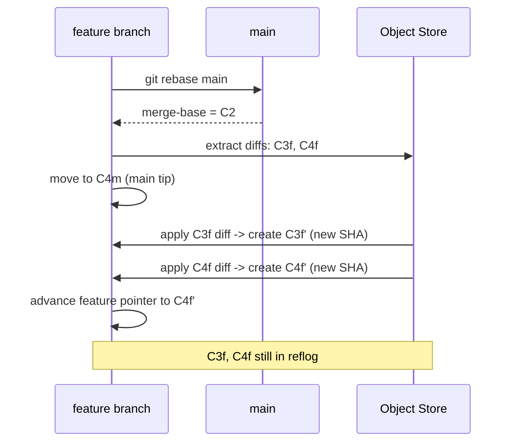
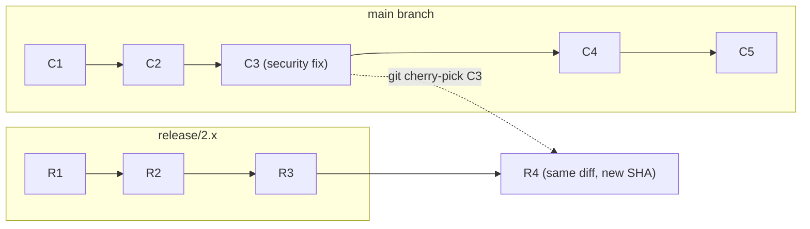

## Keywords in This File
{: .no_toc }

| # | Keyword | Weight |
|---|---|---|
| 10 | [Rebasing and Interactive Rebase](#rebasing-and-interactive-rebase) | high |
| 11 | [Cherry-pick and Stash](#cherry-pick-and-stash) | high |

---

# Rebasing and Interactive Rebase

**Interview Weight:** High - Rebase is one of the most powerful and most feared Git operations. Senior engineers are expected to use it fluently. Interviewers use rebase questions to separate developers who understand Git's object model from those who follow rules without understanding why.

---

## Quick Reference

**One-line definition:** Rebase replays commits from one branch onto another, creating new commit objects with updated parent pointers, producing linear history; interactive rebase allows reordering, editing, squashing, and dropping individual commits before they become final history.

**Difficulty:** ★★☆ | **Asked at:** Mid-Staff | **Seniority:** Mid-Staff

---

### 🎯 Model Answer

**30 seconds:**
`git rebase main` takes all commits on your current branch that are not in main, replays them one by one on top of the current main tip, and advances your branch pointer to the last replayed commit. The result is linear history as if you had started your branch from the current main state. Interactive rebase (`-i`) shows you the commit list and lets you pick, squash, edit, reword, or drop individual commits before the replay.

**3 minutes (Senior):**
Rebase is "replaying commits on a new base." Each commit is a diff against its parent. Rebase extracts those diffs and re-applies them on top of the new base commit. The result is new commit objects (new SHAs) because the parent pointer changed. The old commits remain in reflog for recovery.

Why this matters: a PR branched from main a week ago has diverged. Rather than merging main into your branch (creating a messy merge commit mid-history), rebase replays your commits on top of current main. Your PR will fast-forward merge cleanly.

Interactive rebase is the history-cleaning power tool. Before pushing, open `git rebase -i HEAD~5` to see the last 5 commits. Squash the "WIP" and "fix typo" commits into the meaningful ones. Reorder commits that were written in the wrong order. Edit a commit to split it into two. The result is a PR with clean, logical, reviewable history.

Golden rule: never rebase commits that have been pushed to a shared branch. Rebase changes SHAs - anyone who has pulled the old SHAs has incompatible history and must re-clone or use `git rebase --onto`.

**Framework:** BASE SELECTION -> REPLAY DIFFS -> NEW SHAS -> LINEAR HISTORY -> (INTERACTIVE: CLEANUP FIRST)

*Adapting up:* Add `git rebase --onto` for more complex rebase scenarios (moving a branch's base from one point to another without including intermediate commits).

*Adapting down:* Junior answer: "Rebase moves my commits to sit on top of the latest main, so my changes look like they were written today. It avoids the merge commit."

**Blank Mind Recovery:**

**(1) Restate:** "Rebasing - replaying commits on a new starting point."

**(2) First principles:** "Commits are diffs + parent reference. Rebase says: take this commit's diff and re-apply it starting from a different parent. This creates a new commit that looks the same but has a new SHA and a new parent."

**(3) Bridge:** "Like rebasing a building on a new foundation. The floors (commits/diffs) are the same structure; only the foundation (base commit) has changed. The building looks identical from the outside but has new ground-level supports."

---

### 📘 Concept Explanation

**What it is:**
Rebase replays a sequence of commits onto a new base commit, creating new commit objects with updated parent pointers and the same diff content. Interactive rebase allows editing the replay sequence before execution.

**The problem it solves:**
Long-running branches diverge from main, accumulating merge commits and making history difficult to read. Rebase maintains linear history by replaying branch commits on top of current main, making PRs fast-forward-able and easier to review.

**How it works:**

```
Before git rebase main:
main:    C1-C2-C3m-C4m
feature:    C2-C3f-C4f

git checkout feature && git rebase main:
1. Find merge-base: C2
2. Extract commits since merge-base: C3f, C4f (as patches)
3. Set HEAD to main tip: C4m
4. Apply C3f's patch -> C3f' (new SHA, parent=C4m)
5. Apply C4f's patch -> C4f' (new SHA, parent=C3f')
6. Advance feature pointer to C4f'

After:
main:    C1-C2-C3m-C4m
feature: C1-C2-C3m-C4m-C3f'-C4f'  (linear!)

Interactive Rebase - git rebase -i HEAD~4:
pick a1b2c3 Add auth service
pick d4e5f6 WIP
pick g7h8i9 fix typo
pick j1k2l3 Add login endpoint

Commands:
  p pick   = use commit as-is
  r reword = change commit message
  e edit   = stop to amend this commit
  s squash = melt into previous commit
  f fixup  = squash, discard this message
  d drop   = remove this commit

Reordering to squash WIP into auth service:
pick a1b2c3 Add auth service
s d4e5f6 WIP
f g7h8i9 fix typo
pick j1k2l3 Add login endpoint
```

> **Code walkthrough:** The example above illustrates the core mechanism. The runtime processes the code in the sequence shown, applying the key pattern at each step. Misapplying this pattern results in subtle bugs or degraded performance. The takeaway: follow the structure shown to avoid the common pitfall.

> **Diagram walkthrough:** The ASCII shows the four-step rebase algorithm: find merge-base, extract patches (diffs), advance to new base, replay patches sequentially. C3f' and C4f' are NEW commit objects with new SHAs - the content is the same as C3f and C4f but the parent chain is different. The interactive rebase section shows the todo list editor with four commands used: pick (keep), reword (rename), squash (melt with previous), fixup (squash discarding message). Edge case: if any replayed patch conflicts with the new base, rebase stops and asks for manual resolution (same conflict resolution process as merge). Senior insight: `git rebase --abort` restores the pre-rebase state; `git rebase --continue` resumes after resolving a conflict.



> **Code walkthrough:** The example above illustrates the core mechanism. The runtime processes the code in the sequence shown, applying the key pattern at each step. Misapplying this pattern results in subtle bugs or degraded performance. The takeaway: follow the structure shown to avoid the common pitfall.

> **Diagram walkthrough:** The sequence diagram shows rebase as a replay protocol. The merge-base is computed first (C2 - where feature and main last shared history). Diffs for each feature commit are extracted as patches. The feature pointer is moved to main's tip (C4m). Each patch is applied sequentially, creating new commits. The old commits (C3f, C4f) remain in the object store via reflog. Key relationship: each patch application is essentially a cherry-pick, so rebase conflicts occur at the per-commit level, not the cumulative level. This means you may need to resolve the same logical conflict multiple times if both patches touch the same line. Edge case: `git rebase --skip` skips a commit whose changes are already present in the base (e.g., after a previous cherry-pick). Senior insight: if rebase produces many conflicts, consider merging instead - the per-commit conflict surface of rebase is worse than the single three-way merge conflict of `git merge`.

**The key insight:**
Rebase creates new commit objects - the original commits are not modified. They remain accessible via reflog. This means rebase is always recoverable with `git reflog && git reset --hard <pre-rebase-sha>`.

**When to use it:**
- Before opening a PR: rebase your feature branch onto current main to get a clean fast-forward-able diff
- Interactive rebase before pushing: clean up WIP commits into logical units
- Updating a long-running branch: `git rebase main` keeps it current without accumulating merge commits
- Rebasing shared integration branches: AVOID - this rewrites shared history

**When NOT to use it:**
Never rebase commits that have been pushed to a shared branch (unless you force-push with team coordination). Rebase changes SHAs; teammates who have the old SHAs will have divergent history after a force-push.

**Alternatives:**
- `git merge main` - produces merge commit but is safer for already-pushed branches
- `git pull --rebase` - fetch + rebase in one step, equivalent to `git fetch && git rebase origin/main`
- Interactive squash via GitHub PR UI - "Squash and Merge" does this without needing local rebase

**First-principles derivation:**
Given that commits are diffs + parent references, changing the parent reference means creating a new commit. Rebase is a batch of cherry-picks: it finds each commit's diff against its parent, then creates new commits applying those diffs against the new base. The algorithm is deterministic and reversible (via reflog), making it safe for local use.

---

### 💻 Code Example

```bash
# BAD: Merge main into feature - creates messy history
git checkout feature/auth
git merge main  # creates merge commit M1, M2, M3...
# git log shows: Merge branch 'main' into feature every sprint

# GOOD: Rebase feature onto main - linear history
git checkout feature/auth
git fetch origin
git rebase origin/main
# All feature commits replay on top of current main

# After rebase, push (force-with-lease because SHAs changed)
git push --force-with-lease origin feature/auth

# Interactive rebase to clean up last 5 commits
git rebase -i HEAD~5
# Editor opens with:
# pick a1b2c3 Add JWT service
# pick d4e5f6 WIP - not done yet
# pick g7h8i9 fix compilation error
# pick j1k2l3 Add login endpoint
# pick m1n2o3 fix typo in login

# Edit to:
# pick a1b2c3 Add JWT service
# f    d4e5f6 WIP - not done yet
# f    g7h8i9 fix compilation error
# pick j1k2l3 Add login endpoint
# f    m1n2o3 fix typo in login
# Result: 2 clean commits instead of 5

# Rebase onto a different base (moving commits)
git rebase --onto main feature-base feature-tip
# Takes commits from feature-base..feature-tip
# and replays them onto main

# Recover from bad rebase
git reflog | head -10
# find the pre-rebase HEAD@{N} entry
git reset --hard HEAD@{3}  # restore pre-rebase state
```

> **Code walkthrough:** The BAD pattern shows repeated merges of main into feature - this creates merge bubbles in `git log --graph` for every sprint, making the feature history unreadable. The GOOD pattern uses rebase to maintain linear history; `--force-with-lease` is required after rebase because SHAs changed. The interactive rebase uses `f` (fixup) instead of `s` (squash) for the cleanup commits - fixup silently discards the cleanup commit messages, which is correct for "WIP" and "fix typo" messages that have no informational value. The `--onto` variant is the power tool for moving commits between arbitrary bases. The recovery section shows reflog-based rescue. What breaks: rebasing a branch that a teammate has checked out means their branch diverges after your force-push - they must `git pull --rebase` or `git fetch && git reset --hard origin/branch`. Takeaway: coordinate force-pushes with teammates before rebasing shared branches.

---

### 🎓 Answers by Seniority

**Junior / Mid (0-5 years):**
> "Rebase replays my feature commits on top of the current main, avoiding the messy merge commit. I use it before opening a PR so my changes appear on top of the latest code. Interactive rebase lets me clean up my commit history - combining 'WIP' commits into clean ones - before anyone sees the work."

*Push deeper:* The golden rule: never rebase commits that have been pushed to a shared branch. Rebase changes commit SHAs, so anyone who has pulled the old version needs to reconcile their history.

---

**Senior / Staff (5+ years):**
> "I use rebase in two contexts: first, rebasing feature branches onto current main before PRs to maintain linear history and enable fast-forward merges. Second, interactive rebase before pushing to create a clean commit history where each commit is one logical change with a clear message. Interactive rebase's edit, squash, and reorder commands let me craft history that serves as documentation, not just a save log."

At Staff level: the rebase discussion extends to automation. Some CI systems run interactive rebase automatically on draft PRs to enforce commit standards. `git rebase -i --autosquash` combined with `git commit --fixup <sha>` allows creating fix commits locally that automatically squash into their target commit during rebase.

*Push deeper:* `--autosquash` is the power-user workflow: when you find a bug in a commit that was made 3 commits ago, run `git commit --fixup a1b2c3` (creates a commit named "fixup! message-of-a1b2c3"). Later, `git rebase -i --autosquash HEAD~5` automatically moves the fixup commit to be after a1b2c3 and marks it as fixup. Zero manual reordering needed.

---

### ⚠️ Common Misconceptions

**Misconception 1: "Rebase is the same as merge."**
Reality: Rebase and merge achieve similar goals (integrating branch work) but produce different histories. Merge creates a merge commit preserving topology; rebase creates new commits in a linear chain. The commits themselves are different objects.

**Misconception 2: "Rebase deletes the original commits."**
Reality: Rebase creates new commits (new SHAs) and advances the branch pointer to them. The original commits remain in the object store and are accessible via `git reflog` for 90 days. Rebase is always recoverable within that window.

**Misconception 3: "Rebase is unsafe for shared branches."**
Reality: More precisely: rebase that changes commits already pushed to a shared branch requires force-push, which rewrites shared history. This requires coordination. Rebase on a branch only you are using is perfectly safe.

**Misconception 4: "Interactive rebase rewrites already-pushed history."**
Reality: Interactive rebase only creates new local commit objects. It does not affect the remote until you force-push. The moment for caution is the push, not the rebase itself.

---

### 🚨 Failure Modes and Diagnosis

**Failure 1: Rebase conflicts on every commit in the branch**
Symptom: Rebase stops repeatedly with conflicts for each of 20 commits, the same conflict recurring.
Cause: Main and the feature branch both changed the same region, and each feature commit touches that region.
Diagnosis: `git log --oneline origin/main..HEAD | wc -l` shows how many commits will be replayed; `git diff origin/main...HEAD -- conflicting-file` shows the total scope.
Fix: Enable `git rerere` so the first conflict resolution is reused. Or consider merging instead of rebasing for very long-diverged branches.

**Failure 2: Accidentally rebased shared branch, teammates diverged**
Symptom: Teammate reports `git pull` fails with "Your branch and 'origin/main' have diverged."
Cause: Someone rebased main and force-pushed, rewriting commits that teammates had already pulled.
Diagnosis: `git log HEAD..origin/main` and `git log origin/main..HEAD` both show commits - both have diverged.
Fix: Teammate runs `git fetch origin && git rebase origin/main` to replay their local-only commits on top of the rebased remote main.

**Failure 3: Lost commits after rebase then hard reset**
Symptom: After `git rebase && git reset --hard`, commits are no longer accessible via branch or reflog.
Cause: `git gc --prune=now` was run after reset, permanently removing unreachable objects before the reflog window.
Diagnosis: `git reflog` shows no entries for the lost commits; `git fsck --unreachable` also shows nothing.
Fix: If another clone fetched before the gc, push from that clone to restore. Otherwise, irreversible.

---

### 🎯 Interview Deep-Dive

| Category | Count | Coverage |
|---|---|---|
| Conceptual | 4 | Rebase algorithm, new SHAs, interactive rebase, --onto |
| Debugging | 3 | Conflict loops, teammate divergence, recovery |
| Trade-off | 2 | Rebase vs merge, when each is appropriate |
| Behavioral | 2 | History cleanup, team workflow |

---

**[MID] Q1 - Why does `git rebase` require a `--force-with-lease` push while `git merge` does not?**

Rebase creates new commit objects with new SHAs. When you rebase a branch that was previously pushed, your local branch now has different commit SHAs than the remote has for the same "content." The remote rejects the push as non-fast-forward because from its perspective, you are not advancing the branch - you are replacing its history with different objects.

`git merge` does not have this problem because it only adds new commits (the merge commit) on top of the existing chain. The push is a genuine fast-forward advancement of the existing SHAs.

`--force-with-lease` is the correct way to force-push after rebase: it succeeds only if the remote branch is still at the SHA your `origin/branch-name` tracking ref points to (the state when you last fetched). If a teammate pushed between your rebase and your push, `--force-with-lease` fails, preventing you from overwriting their commits.

*What separates good from great:* Understanding that `--force` without `--with-lease` is categorically unsafe on branches where others may have pushed. `--force-with-lease` provides a compare-and-swap safety for force pushes.

---

**[MID] Q2 - How do you use `git rebase -i` to squash commits before a PR?**

`git rebase -i HEAD~N` opens an editor showing the last N commits (from oldest on top to newest on bottom). Each commit is listed as `pick <sha> <message>`. You edit the action verbs:

- `s` or `squash` - combine this commit with the previous one, merge messages
- `f` or `fixup` - combine with previous, discard this commit's message
- `r` or `reword` - keep the commit but change its message
- `d` or `drop` - delete the commit entirely

After editing and saving, Git processes the list from top to bottom. When it reaches a squash/fixup, it pauses to combine with the previous commit (or lets you write a combined message for squash). The result is a new commit with the combined changes.

Workflow: write WIP commits freely during development. Before pushing, run `git rebase -i origin/main` (not `HEAD~N`, to see all commits not on main). Squash WIP and fixup commits. Reorder if necessary. Push once with clean history.

*What separates good from great:* Using `git commit --fixup <sha>` as you work creates "fixup! original-message" commits that `git rebase -i --autosquash` automatically reorders and marks as fixup, eliminating manual reordering during interactive rebase.

---

**[SENIOR] Q3 - What is `git rebase --onto` and when is it useful?**

`git rebase --onto newbase oldbase branch` moves the commits between `oldbase` and `branch` onto `newbase`.

Scenario: you accidentally started a feature branch from another feature branch instead of from main. `feature-b` was branched from `feature-a`, but `feature-b` is independent and should be PR'd directly to main.

```bash
# feature-b was based on feature-a:
# main -> C1 <- feature-a (C2, C3) <- feature-b (C4, C5)

# Move feature-b's commits (C4, C5) onto main
git rebase --onto main feature-a feature-b
# Result: main -> C1 <- C4' <- C5'
# feature-a unchanged, feature-b now branches from main
```

> **Code walkthrough:** The example above illustrates the core mechanism. The runtime processes the code in the sequence shown, applying the key pattern at each step. Misapplying this pattern results in subtle bugs or degraded performance. The takeaway: follow the structure shown to avoid the common pitfall.

Other use case: removing a specific commit from the middle of a history.
```bash
# Remove commit A from: main -> A -> B -> C (on branch)
git rebase --onto A^ A branch
# Replays B and C on top of A^ (commit before A)
```

> **Code walkthrough:** The example above illustrates the core mechanism. The runtime processes the code in the sequence shown, applying the key pattern at each step. Misapplying this pattern results in subtle bugs or degraded performance. The takeaway: follow the structure shown to avoid the common pitfall.

*What separates good from great:* `--onto` is the "surgical rebase" - most developers never need it, but knowing it exists means you can solve problems that would otherwise require manual cherry-picking multiple commits.

---

**[SENIOR] Q4 - What is the difference between `rebase -i` squash and `merge --squash`?**

Both produce a single commit combining multiple changes, but they differ in scope and history:

`git rebase -i` squash combines commits WITHIN the same branch's history, creating new commits in place. The result is still a branch that can be merged with full commit history visible. The squash happens before merging.

`git merge --squash` combines ALL commits from the source branch into ONE new commit on the target branch, without creating parent pointers to the source branch tip. The source branch's individual commits are permanently lost from the target's perspective.

Use `rebase -i` squash: to clean up in-progress work within your own branch (e.g., squash 3 WIP commits into 1 logical commit) before pushing or before PR.

Use `merge --squash`: to integrate a feature branch onto main with intentionally simplified history, when the individual commits have no value after integration.

The practical decision: teams that care about per-commit history for `git bisect` use `rebase -i` cleanup + regular merge. Teams that want maximum history cleanliness in main use `merge --squash` (or GitHub's "Squash and Merge" button).

*What separates good from great:* Knowing that these are two different phases - pre-push cleanup (rebase -i) vs integration-time policy (merge --squash) - and choosing the right tool for each.

---

**[SENIOR] Q5 - How does `git rebase` handle conflicts differently from `git merge`?**

Both rebase and merge use the three-way merge algorithm for each conflict. The difference is granularity and sequencing.

Merge: resolves all conflicts in a single pass. The entire diverged history is merged at once. You see all conflicts together and resolve them in one commit (the merge commit).

Rebase: replays commits one at a time. Conflicts are encountered per-commit. If 5 of your 20 feature commits conflict with the new base, rebase stops 5 times. You resolve, `git rebase --continue`, and the replay proceeds.

The implication: if a conflict involves a change you made across multiple commits, rebase may require you to resolve a variant of that conflict multiple times (once per commit that touches the area). With `git rerere` enabled, the first resolution is replayed automatically for subsequent occurrences.

For branches with many commits in a conflicted area, `git merge` is often less total work (one three-way merge) than `git rebase` (many per-commit merges). This is the main reason to prefer merge for long-diverged branches.

*What separates good from great:* Understanding when rebase's per-commit conflict granularity is a benefit (pinpoints exactly which commit caused a conflict) vs a burden (many repetitive conflict resolutions for related changes).

---

**[STAFF] Q6 - When would you recommend a team to use rebase vs merge as their primary integration strategy?**

Use merge as primary when: (1) The team has strict compliance or audit requirements where exact timestamps and original commit ordering matter. (2) The team lacks discipline in commit hygiene - merge is forgiving; messy commits stay on the feature branch and the merge commit is the clean integration point. (3) CI runs against the merge commit (some systems guarantee this); linear history adds no value. (4) Many contributors from outside the core team (open source) - requiring all contributors to rebase creates unnecessary friction.

Use rebase as primary when: (1) The team values linear history for readability and bisect effectiveness. (2) All developers understand rebase and force-push protocol. (3) The team uses PRs that are rebased before merge, creating clean fast-forward integrations. (4) Deployment tracking relies on pinning specific commit SHAs - linear history makes SHA tracing simpler.

Hybrid (most common at mature teams): feature branches are rebased before PR; main accepts only fast-forward merges (--ff-only); feature commits are squashed via `rebase -i` before PR; the result is a linear main history where each commit corresponds to one feature, with individual commits visible within the feature branch history.

*What separates good from great:* Understanding that the rebase vs merge debate is partly philosophical and partly tooling. GitHub's three merge strategies (merge commit, squash, rebase) should match the team's discipline level and audit requirements.

---

**[STAFF] Q7 - Describe a situation where `git rebase --onto` solved a problem that regular rebase could not.**

[BEHAVIORAL]

**S:** Our team had a pattern of creating branches from other in-review branches to build features incrementally: `feature-a` (auth), `feature-b` (user profile, based on feature-a), `feature-c` (settings, based on feature-b). This created a chain of dependencies.

**T:** When feature-a was reviewed and required significant changes before merge, feature-b and feature-c needed to be re-based to reflect the revised feature-a without picking up the intermediate WIP commits on feature-a.

**A:** Standard `git rebase feature-a feature-b` would replay all of feature-b's commits on top of feature-a's new tip, including picking up any intermediate commits that were later squashed on feature-a during review. Instead, I used `git rebase --onto feature-a feature-a-old-base feature-b` where `feature-a-old-base` was the merge-base before feature-a was rebased. This moved only the commits unique to feature-b (above the old base) onto the new feature-a tip, without including any intermediate commits.

I documented this pattern in the team's Git guide as "dependent branch rebase" and created a script that automated the `--onto` calculation given the branch chain.

**R:** The feature chain rebased cleanly. Features b and c were ready to PR immediately after feature-a merged. Without `--onto`, we would have needed to cherry-pick individual commits manually.

*What separates good from great:* Recognizing that `--onto` is the right tool when the goal is "move specific commits, not all commits since branch point." Standard rebase includes all commits since the merge-base; `--onto` gives you precise control over what to include.

---

**[STAFF] Q8 - How does `git bisect` interact with rebase, and what are the implications for commit history design?**

`git bisect` binary-searches the commit graph to find which commit introduced a bug. It works optimally on linear history where each commit is a deployable, testable state.

Rebase (and rebase-based merge strategies) creates exactly this - a linear chain where each commit is a complete, standalone change. If all feature commits are individual, logical changes that pass CI, bisect can narrow a bug to a specific commit in log(N) steps.

Merge-based strategies create merge commits. Bisect can step through merge commits but cannot reach into individual feature commits without traversing the merge parent. For large features squash-merged as one commit, bisect can only identify "the merge commit that introduced the bug" - not which of the 30 commits in the feature was actually problematic.

Implications for commit design: if your team uses `git bisect` regularly for production debugging, every commit on main should represent a working, testable state. This requires: CI runs on every commit (not just PRs), commits are not "half-done" states, and squash merges are used only when all of the squashed commits are logically one indivisible change.

The highest-value Git workflow for debugging velocity: linear history (rebase/squash into main), each commit passing CI, and an automated bisect that runs the test suite. This lets on-call engineers find the exact regression commit in minutes.

*What separates good from great:* Understanding that commit history design is infrastructure for debugging. Teams that spend 4 hours finding which of 500 commits introduced a production bug often have no git bisect practice and no linear history.

---

**[SENIOR] Q9 - What are the implications of rebasing for `git blame` and history audit?**

`git blame` attributes each line to the last commit that changed it. After a rebase, all commit SHAs change - so blame now points to the rebased commits (with new SHAs) rather than the original commits. If the repository had external references to the original SHAs (Jira tickets, Slack messages, issue trackers), those references become stale after rebase.

For audit purposes: the rebased commits have the original author date but a different committer date (the time of the rebase). In most code review tools, the author date is displayed and the committer date is hidden, so the history looks correct for human review. But automated audit tools that compare committer dates to deployment dates may show discrepancies.

In environments with strict audit requirements (SOX, PCI-DSS): rebasing after code review approval creates a compliance problem - the signed/approved commit SHA is now different from the deployed commit SHA. In these environments, merge commits (with preserved original SHAs) are required; rebasing is prohibited.

*What separates good from great:* Knowing when NOT to use rebase based on compliance requirements, not just preference. The technical capability and the policy-acceptable use are different things.

---

### ⚖️ Comparison Table

| | `git merge` | `git rebase` | `git rebase -i` |
|---|---|---|---|
| History shape | Non-linear (merge commits) | Linear | Linear with cleanup |
| New objects created | 1 merge commit | N replayed commits | N cleaned commits |
| Original SHAs preserved | Yes | No | No |
| Reversible | Via revert | Via reflog | Via reflog |
| Safe for shared branches | Always | With coordination | Before first push |
| Conflict frequency | Once (all diffs together) | Per commit | Per commit |
| History readability | Lower (merge bubbles) | High (linear) | Highest (clean) |
| Audit/compliance safe | Yes | With care | Before push only |
| Best for | Shared/public branches | Feature PR cleanup | Pre-push polish |

---

### 🏛️ System Design

*(Omit: Not a ★★★ keyword. Rebase is a developer workflow operation, not a system design component.)*

---

### 📊 Diagram

*(Omit: ASCII and Mermaid diagrams are included in the Concept Explanation section.)*

---
---

# Cherry-pick and Stash

**Interview Weight:** High - Cherry-pick is the tool for surgical commit movement; stash is the context-switch mechanism. Both appear in incident response scenarios (hotfix backporting, urgent context switching) and are tested in mid-level and above interviews.

---

## Quick Reference

**One-line definition:** `git cherry-pick` applies the diff of a specific commit to the current branch as a new commit; `git stash` temporarily saves the working tree and staging area state so you can switch contexts without committing.

**Difficulty:** ★★☆ | **Asked at:** Mid-Senior | **Seniority:** Mid-Senior

---

### 🎯 Model Answer

**30 seconds:**
`git cherry-pick <sha>` takes the diff introduced by one specific commit and applies it to the current branch, creating a new commit with the same changes but a new SHA. It is used to move individual commits across branches - the classic case is backporting a security fix from main to a release branch without merging all of main. `git stash` saves your current working tree and staging area to a temporary stack, letting you switch branches or pull urgently without committing.

**3 minutes (Senior):**
Cherry-pick is conceptually one step of rebase: compute a commit's diff against its parent, apply that diff to the current HEAD. The result is a new commit with the same content changes but a different SHA (different parent, possibly different timestamp). The new commit stands alone - it has no relationship to the original in Git's object model.

Use cherry-pick in these specific scenarios: (1) Backporting - a security fix landed on main; you need it on `release/2.x` and `release/3.x` without merging all of main. (2) Moving a commit made on the wrong branch. (3) Taking one feature from an abandoned branch.

The risk: cherry-picking a commit that depends on previous commits that are not in the target branch will produce a conflict or a partial application. Cherry-pick only moves the commit's own diff, not its dependencies. Always verify the cherry-picked commit makes sense in isolation.

Stash is the context-switch mechanism. When your phone rings with an urgent bug and you have half-written code, `git stash` saves everything. You investigate, fix, and commit the urgent work. `git stash pop` returns your in-progress work. The stash is a hidden commit stack - you can have multiple stash entries and apply them selectively.

**Framework:** CHERRY-PICK: SELECT COMMIT -> EXTRACT DIFF -> APPLY ON CURRENT HEAD -> NEW COMMIT | STASH: SAVE STATE -> SWITCH CONTEXT -> RESTORE STATE

*Adapting up:* Add cherry-pick with `-e` (edit message) and `-n` (no commit, stage only) for combining multiple cherry-picks.

*Adapting down:* Junior answer: "Cherry-pick copies one commit from another branch to your current branch. Stash saves your unfinished work so you can work on something else first."

**Blank Mind Recovery:**

**(1) Restate:** "Cherry-pick and stash - two Git commands for moving specific changes and managing in-progress work."

**(2) First principles:** "Two distinct needs: (1) I need a specific commit from another branch, not the whole branch. (2) I need to pause my current work without committing it. Cherry-pick solves (1), stash solves (2)."

**(3) Bridge:** "Cherry-pick is like copying one recipe from a cookbook to a different cookbook - just that recipe, not the whole book. Stash is like bookmarking your page when you have to close a book urgently - you save your exact spot to return to later."

---

### 📘 Concept Explanation

**What it is:**
`git cherry-pick` creates a new commit by applying the diff of a specified commit to the current HEAD. `git stash` creates a temporary commit capturing the working tree and staging area state without modifying any branch.

**The problem it solves:**
Cherry-pick solves the problem of needing one specific change from another branch without taking the entire branch history. Stash solves the problem of context-switching while work is in progress.

**How it works:**

```
Cherry-pick mechanism:
target branch HEAD: C5

git cherry-pick A3:
1. Compute diff: A3 vs A3.parent = {+5 lines, -2 lines}
2. Apply that diff to C5
3. Create new commit C6 with:
   - parent: C5
   - diff: same as A3
   - author: original A3 author
   - committer: you (current time)
   - SHA: new (C5 != A3.parent)

A3 and C6 are siblings, not ancestors.

Stash mechanism:
git stash:
1. Create stash commit (uncommitted changes)
   parent: HEAD (current commit)
   tree: staging area + working tree
2. Append entry to .git/refs/stash
3. Reset working tree to HEAD

git stash pop:
1. Apply stash commit as diff to current working tree
2. Remove stash entry from stack
```

> **Code walkthrough:** The example above illustrates the core mechanism. The runtime processes the code in the sequence shown, applying the key pattern at each step. Misapplying this pattern results in subtle bugs or degraded performance. The takeaway: follow the structure shown to avoid the common pitfall.

> **Diagram walkthrough:** The ASCII shows cherry-pick creating a new commit C6 by applying A3's diff to C5. The key insight is that C6 and A3 have no parent relationship - they are independent commits with the same diff content but different SHAs. The stash mechanism shows it creating a temporary commit chain: the stash index commit (staging area) and stash working tree commit are stored as a hidden commit graph under `.git/refs/stash`. Edge case: if the cherry-picked commit's changes conflict with the current branch, cherry-pick stops with conflict markers, same as merge. `git cherry-pick --continue` resumes after resolution. Senior insight: cherry-picking a commit whose changes depend on earlier commits (missing from the target branch) will likely produce a conflict or subtly incorrect result - always verify cherry-picks in context.



> **Code walkthrough:** The example above illustrates the core mechanism. The runtime processes the code in the sequence shown, applying the key pattern at each step. Misapplying this pattern results in subtle bugs or degraded performance. The takeaway: follow the structure shown to avoid the common pitfall.

> **Diagram walkthrough:** The Mermaid diagram shows a security fix commit C3 on main being cherry-picked onto release/2.x as R4. C3 and R4 are siblings in the object graph - both have the same diff content but different parent chains and therefore different SHAs. The dashed line represents the cherry-pick operation: "take this commit's diff and apply it over there." Key relationship: main and release/2.x are independent histories; cherry-pick is the bridge that copies a change without bridging the histories. Edge case: if main is later merged into release/2.x, the cherry-picked change will appear twice (C3 from main + R4 from cherry-pick). Git's three-way merge should detect this and resolve automatically, but complex cases can create duplicate hunks. Senior insight: document cherry-picks in commit messages ("cherry-picked from main commit C3: abc123") to maintain audit trails.

**The key insight:**
Cherry-pick creates a new commit with no relationship to the original. If the original branch is later merged, the cherry-picked changes appear as two separate commits with the same diff - Git's three-way merge usually handles this but may need manual intervention.

**When to use it:**
- Cherry-pick: backporting fixes to release branches, recovering a commit from an abandoned branch, moving a commit made on the wrong branch
- Stash: urgent context switches, testing in a clean state, temporarily parking in-progress work before rebasing

**When NOT to use it:**
- Cherry-pick: when you need multiple related commits from another branch (use merge or rebase instead of cherry-picking each one). When the commit depends on earlier commits not in the target branch.
- Stash: when you anticipate needing to park work for more than a few hours (create a WIP branch instead, which is more durable and trackable)

**Alternatives:**
- Cherry-pick: `git merge --no-ff specific-branch` if you want all commits from the source
- `git format-patch` + `git am` - exports commits as email patches and applies them; works across repository boundaries
- Stash: `git commit -m "WIP: [do not merge]"` - explicit WIP commit, more durable than stash, trackable in history

**First-principles derivation:**
Cherry-pick is a single-commit rebase: given a commit's diff, apply it on the current HEAD. The new commit has the same diff as the original but is an independent object. Stash is a hidden commit: Git creates a commit tree recording the complete state (staging + working tree) and stores it in a stack ref (`refs/stash`), outside the normal branch graph, so it does not affect branch history.

---

### 💻 Code Example

```bash
# Cherry-pick: backport security fix to release branch
# Find the fix commit on main
git log main --oneline | grep "security fix"
# abc1234 Fix SQL injection in user search endpoint

# Backport to release/2.x
git checkout release/2.x
git cherry-pick abc1234

# Cherry-pick a range of commits
git cherry-pick abc1234..def5678
# Applies all commits from abc1234 (exclusive) to def5678

# Cherry-pick without committing (stage only)
git cherry-pick -n abc1234  # --no-commit
# Changes are staged; you can edit before committing
git commit -m "Backport security fix (modified for 2.x API)"

# Cherry-pick preserving original author
git cherry-pick -x abc1234  # adds "(cherry picked from commit...)" to message
# Useful for audit trails on backports

# Stash: handle urgent context switch
git stash push -m "WIP: implementing user profile feature"
git stash list
# stash@{0}: On feature/profile: WIP: implementing user profile feature

git checkout main  # switch to work on urgent fix
# ... fix, commit, push ...

git checkout feature/profile
git stash pop  # restore work in progress

# Multiple stash entries
git stash list
# stash@{0}: On feature-b: WIP: new API
# stash@{1}: On feature-a: WIP: database refactor

git stash apply stash@{1}  # apply specific entry without removing it
git stash drop stash@{1}   # remove entry

# Stash including untracked files
git stash push --include-untracked
# Default stash doesn't save new (untracked) files
```

> **Code walkthrough:** The cherry-pick backport workflow shows the common production pattern: find the fix SHA on main, checkout the release branch, cherry-pick by SHA. The `-x` flag appends "cherry picked from commit abc1234" to the commit message, creating an audit trail linking the backport to its origin. The `-n` (no-commit) flag is powerful for cherry-picks that need modification: the changes are staged but not committed, letting you adapt the change before finalizing. Stash with a descriptive message (`-m`) is better than bare `git stash` - `git stash list` becomes meaningful when messages are descriptive. The `--include-untracked` flag is frequently needed: default stash ignores new files that have not been `git add`-ed. What breaks: `git stash pop` can conflict if the working tree changed since the stash was created. Resolve like a merge conflict, then `git stash drop` to clear the stash entry. Takeaway: for stash entries you will not use within the day, convert to a WIP branch: `git stash branch wip-my-feature stash@{0}` creates a branch from the stash and removes the stash entry.

---

### 🎓 Answers by Seniority

**Junior / Mid (0-5 years):**
> "Cherry-pick takes one specific commit from another branch and applies it to my current branch as a new commit. The main use case is backporting a bug fix to older release branches. Stash temporarily saves my uncommitted work so I can switch to fix an urgent bug, then brings my work back with `git stash pop`."

*Push deeper:* When cherry-picking for backports, use `-x` to add the source SHA to the commit message. This creates an audit trail showing which main commit each backport comes from - invaluable when debugging whether a fix was properly applied to all release branches.

---

**Senior / Staff (5+ years):**
> "Cherry-pick is the surgical tool for moving specific commits across branches, primarily used for backporting security and bugfixes to release branches. The important limitation: cherry-pick only moves the commit's own diff, not its dependencies. If the commit assumes code that was added in earlier commits not present in the target branch, cherry-pick will produce conflicts or incorrect results. Always test cherry-picked changes in context."

At Staff level: stash enters the conversation around CI/CD automation. Build scripts sometimes use `git stash` to temporarily clean the working tree for builds that fail on uncommitted changes. `git stash && make build && git stash pop` is a pattern that appears in Makefiles. The risk: if `make build` fails partway, the stash is not popped and the developer forgets it is there.

*Push deeper:* Discuss `git stash branch <branch-name> [stash-entry]` - this creates a new branch from the commit where the stash was created, applies the stash on the new branch, and removes the stash entry. This is the clean way to convert stash work into a proper branch when you realize the context switch will take longer than expected.

---

### ⚠️ Common Misconceptions

**Misconception 1: "Cherry-picking is the same as merging one commit."**
Reality: Cherry-pick applies the DIFF of a commit, not the commit itself. The resulting commit has a new SHA, new parent pointer, and no relationship to the original. A merge would establish a parent relationship; cherry-pick creates an independent copy.

**Misconception 2: "git stash only saves uncommitted changes."**
Reality: By default, `git stash` saves staged AND unstaged changes to tracked files. It does NOT save untracked files (files not yet `git add`-ed). Use `git stash push --include-untracked` or `-u` to include new files.

**Misconception 3: "Cherry-picking a commit is always safe."**
Reality: If the cherry-picked commit depends on changes in its branch that are not present in the target branch, the application will either conflict or produce semantically incorrect code. Cherry-picks must be tested in the target branch context.

**Misconception 4: "Stash is equivalent to a WIP commit."**
Reality: Stash is less durable than a WIP commit. Stash entries can be lost by `git stash clear`, are stored in reflog with shorter retention in some configurations, and do not have the same visibility as branch commits in team collaboration tools. For work you will not return to within hours, a WIP branch is safer.

---

### 🚨 Failure Modes and Diagnosis

**Failure 1: Cherry-pick produces wrong behavior despite applying cleanly**
Symptom: Cherry-picked fix compiles and applies without conflicts, but the behavior is wrong in the release branch.
Cause: The fix assumes code added in earlier commits that are in main but not in release/2.x.
Diagnosis: `git log release/2.x..main -- affected-file` shows commits in main not in the release branch.
Fix: Cherry-pick the dependency commits first, then cherry-pick the original fix. Or adapt the fix for the release branch's older API.

**Failure 2: Stash lost after accidental `git stash clear`**
Symptom: In-progress work is gone; `git stash list` is empty.
Cause: `git stash clear` removed all stash entries; or `git checkout -f` discarded uncommitted changes.
Diagnosis: `git fsck --unreachable | grep commit` may find the stash objects if gc has not run.
Fix: `git fsck --unreachable | grep commit | cut -d' ' -f3 | xargs git show` to inspect unreachable commit objects. `git checkout <stash-sha> -- .` to restore from the stash commit.

**Failure 3: Cherry-pick conflict during release branch backport**
Symptom: Security fix cherry-pick conflicts on release/1.x because the API signature changed between versions.
Cause: The fix was written against main's API; release/1.x has an older API.
Diagnosis: `git diff release/1.x main -- affected-file` shows API differences.
Fix: Cherry-pick with `-n` (no-commit), adapt the staged changes to the older API, then commit with attribution to the original fix.

---

### 🎯 Interview Deep-Dive

| Category | Count | Coverage |
|---|---|---|
| Conceptual | 3 | Cherry-pick mechanism, stash internals, -x flag |
| Debugging | 3 | Wrong behavior, lost stash, backport conflicts |
| Trade-off | 2 | Cherry-pick vs merge, stash vs WIP branch |
| Behavioral | 1 | Backport workflow |

---

**[MID] Q1 - What are the risks of cherry-picking a security fix to multiple release branches?**

Three main risks:

First, dependency risk: the fix on main may depend on code that was added after a release branch was cut. The cherry-pick applies cleanly but the behavior is wrong because it assumes a different code state. Always review the full context of the fix before cherry-picking.

Second, duplication risk: when a release branch eventually merges main (or vice versa), Git will see both the original commit and the cherry-picked version. Usually the three-way merge handles this correctly, but if the cherry-picked commit was modified to adapt to the older API, Git may not recognize them as equivalent and may apply both, creating duplicate logic.

Third, tracking risk: without documentation, it becomes unclear which release branches have received which fixes. Use `git cherry-pick -x` to append the source SHA to every backport commit message, and maintain a release notes file or backport tracking ticket.

*What separates good from great:* Understanding that the cherry-pick workflow is only as reliable as the testing done on the target branch. Automated regression tests that run against the backported fix on the release branch are essential.

---

**[MID] Q2 - How does `git stash branch` work and when is it useful?**

`git stash branch <branch-name> [stash-entry]` creates a new branch starting from the commit where the stash was created, checks out that branch, applies the stash to the new branch's working tree, and removes the stash entry.

It is useful when: (1) You stashed work and then the base branch evolved significantly - applying the stash to the current working tree would conflict. `git stash branch` applies the stash in its original context (at the commit where it was created), avoiding the conflict. (2) You realize the stash work should become a proper feature branch for longer development. (3) The stash contains enough work that it deserves its own PR.

Example: you stashed some experimental changes while on main at SHA C5. Main advanced to C10. `git stash pop` now conflicts. `git stash branch experiment` creates a branch from C5, applies the stash there cleanly, and you have a proper branch with your experimental work.

*What separates good from great:* Knowing that `git stash branch` is the escape hatch when stash work needs to become a real branch, avoiding the conflict problem of applying a stash to an evolved base.

---

**[SENIOR] Q3 - What is `git format-patch` and when is it an alternative to cherry-pick?**

`git format-patch` exports commits as email-formatted patch files. `git am` (apply mailbox) applies those patches to a repository. Together they solve the cross-repository commit transfer problem.

`git cherry-pick` requires network access to the source repository - you need the commit SHA reachable from your remotes. `git format-patch` exports commits to files you can email, upload, or transfer via any medium.

```bash
# Export a commit as a patch file
git format-patch -1 abc1234
# Produces: 0001-Fix-SQL-injection-in-user-search.patch

# Apply in a different repository
git am 0001-Fix-SQL-injection-in-user-search.patch
# Creates commit preserving original author and message
```

> **Code walkthrough:** The example above illustrates the core mechanism. The runtime processes the code in the sequence shown, applying the key pattern at each step. Misapplying this pattern results in subtle bugs or degraded performance. The takeaway: follow the structure shown to avoid the common pitfall.

Use `format-patch` when: working with upstream open-source projects (the traditional Linux kernel contribution workflow is still patch-based), applying fixes to air-gapped repositories, or sharing changes with contributors who do not have remote access to your repository.

*What separates good from great:* Understanding that `format-patch` is Git's "export commit as portable artifact" mechanism, predating GitHub PRs. Modern teams rarely use it, but open-source contributors to projects like Linux, GCC, and Git itself still use it as the primary patch submission mechanism.

---

**[SENIOR] Q4 - How do you handle the case where a cherry-picked commit conflicts differently in two release branches?**

Situation: security fix on main cherry-picks cleanly to release/3.x but conflicts with release/2.x because 2.x has a significantly different API.

Step 1: Cherry-pick to release/3.x first (the newer, closer branch): `git checkout release/3.x && git cherry-pick -x abc1234`. Apply cleanly.

Step 2: Cherry-pick to release/2.x: `git checkout release/2.x && git cherry-pick -n abc1234`. The `-n` flag stages the changes without committing. Resolve conflicts manually to adapt the fix to 2.x's older API.

Step 3: Review the staged changes with `git diff --staged` to verify correctness of the adaptation. Test the fix in the 2.x context.

Step 4: Commit with a message referencing both the main fix and the adaptation: `git commit -m "Backport security fix to 2.x API (cherry-picked from main abc1234 with adaptations for 2.x UserService interface)"`.

The audit trail in the commit message is critical: it links the backport to the original fix, notes that adaptations were made, and explains why - giving future developers context when they encounter the divergence.

*What separates good from great:* Knowing that `git cherry-pick -n` (no-commit) is the tool for cherry-picks that need modification. The staged state gives you a chance to adapt, test, and document before finalizing.

---

**[SENIOR] Q5 - What is the difference between `git stash push` and `git stash`?**

`git stash` (without subcommand) is equivalent to `git stash push`. The explicit `push` subcommand (added in Git 2.13) allows additional options:

`-m "description"` - adds a meaningful name to the stash entry instead of the auto-generated "WIP on branch: sha message".

`--include-untracked` or `-u` - includes untracked (new, unstaged) files. Default stash only saves tracked files with modifications.

`--all` or `-a` - includes all files including those matching `.gitignore` patterns. Rarely needed; usually you do not want to stash build artifacts.

`-- pathspec` - stash only specific files: `git stash push -- src/auth/`. This is a partial stash: only the specified path's changes are stashed, other changes remain in working tree.

The most practically important distinction: `git stash` silently drops new untracked files (they remain in your working tree after stash). This surprises developers who expect stash to completely save and restore state. Always use `git stash push -u` when your in-progress work includes new files.

*What separates good from great:* Understanding that default stash silently ignores untracked files - a behavior that causes developers to think their stash restored correctly when it actually left new files unstashed.

---

**[STAFF] Q6 - How do you establish a reliable backport process for security patches in a team with 8 release branches?**

At 8 active release branches, manual cherry-picks are error-prone. A systematic backport process:

1. **Tag security fix commits:** in the commit message, include `Fixes: CVE-XXXX-YYYY` or a Jira ticket. This enables automatic identification of security commits.

2. **Automate cherry-pick attempts:** write a script that iterates release branches, attempts cherry-pick, and reports success or conflict. Use `git cherry-pick --allow-empty` to handle already-applied cases.

3. **CI validation per branch:** each backport generates a PR to the release branch with the cherry-picked commit. CI runs tests. Auto-merge if tests pass; flag for manual review if they fail.

4. **Backport tracking matrix:** maintain a spreadsheet or database mapping security fix SHA to each release branch with status (applied, conflict-needs-manual, n/a-EOL). Update via CI webhook.

5. **Conflict handling policy:** define who is responsible for manual conflict resolution on each release branch (typically the team that owns that branch's maintenance).

GitHub has a `/backport` command via the Backstage or Mergify tools that automate cherry-pick PRs to specified branches with a single comment on the original PR.

*What separates good from great:* Understanding that backport management at scale is a process problem, not a Git problem. The tooling should reduce the cognitive overhead to near zero for the common case (clean cherry-pick) while flagging only the exceptional cases (conflicts requiring judgment).

---

**[STAFF] Q7 - Describe a production incident involving cherry-pick that caused an unexpected regression.**

[BEHAVIORAL]

**S:** A security fix was landed on main to patch a SQL injection vulnerability in the user search endpoint. The fix added prepared statement parameterization to all queries in `UserRepository.java`. I cherry-picked it to `release/2.5.x` for an emergency patch.

**T:** I was responsible for the backport and post-deployment verification.

**A:** The cherry-pick applied without conflict. I deployed release/2.5.x. Within 2 hours, we got reports that the user search was returning empty results for valid queries. The fix had been applied correctly (parameterization was there), but the parameterized queries used `?` placeholders (JDBC syntax), while release/2.5.x still used an older ORM that expected `:param` named parameters.

The cherry-pick applied the content correctly but the semantics were wrong in the target branch's context. Main had migrated from the named-parameter ORM to JDBC in a commit between the branch point and the fix; release/2.5.x still used the old ORM.

**R:** I cherry-picked the fix again with `-n`, adapted the query syntax to use `:param` style, tested locally against the old ORM, deployed, and verified. Total additional downtime was 45 minutes. Root cause analysis added a mandatory "verify database layer compatibility" step to the backport checklist.

*What separates good from great:* The cherry-pick "worked" - no conflicts, compilation succeeded. The failure was semantic, not syntactic. This is the hardest class of cherry-pick failure to detect automatically. Only integration tests running against the actual ORM version in the release branch would have caught it.

---

**[STAFF] Q8 - How do you design a repeatable multi-branch backport process that scales to 20+ release branches?**

[TRADE-OFF]

When maintaining 20+ active release branches (typical in SDKs, databases, or enterprise software with long support windows), manual cherry-picking does not scale - human error compounds with every branch.

**Automated backport pipeline design:**

```
merge to main
  → CI detects merge
  → Reads backport-to labels or CHANGELOG pragma
  → git fetch; git checkout release/X.Y
  → git cherry-pick -x <sha>
  → If conflict: open auto-PR with conflict markers; notify owner
  → If clean: auto-PR with backport label; auto-merge if CI passes
```

> **Code walkthrough:** This pseudocode shows a CI-triggered backport pipeline. The KEY MECHANISM is event-driven: a merge to main triggers the pipeline, which reads labels to determine target branches, then runs cherry-pick per branch. WHY IT MATTERS in production: human-driven backport processes miss branches under deadline pressure - automation with conflict escalation catches what humans miss. WHAT BREAKS: if the pipeline retries on transient failures without checking for already-applied cherry-picks, you get duplicate commits; idempotency check (`git log --grep "cherry picked from commit $sha"`) prevents this. TAKEAWAY: automate the happy path, escalate conflicts to humans - never auto-resolve semantic conflicts.

The `-x` flag appends `(cherry picked from commit <sha>)` to the commit message, creating a permanent audit trail from release branch back to main.

**Key design decisions:**

1. **Labels over branches for selection**: Label-based selection (`backport-2.5`) decouples the backport decision from the PR author's knowledge of branch names. The release manager adds labels; the automation does the rest.

2. **Conflict = human judgment required**: Never auto-resolve conflicts. Auto-open a PR with conflict markers. The person who authored the original commit is the best person to resolve semantic conflicts.

3. **SHA reference preservation**: `cherry-pick -x` records the original SHA. This lets you run `git log --grep "cherry picked from commit <sha>"` to find all branches that have a given fix - critical for security audit questions like "Are we patched everywhere?".

4. **Independence from branch divergence**: For very old branches with large divergence, script a `cherry-pick -n` (no-commit) workflow that applies the change, runs tests, and only commits if tests pass.

*What separates good from great:* The difference between a backport process that works for 3 branches and one that works for 30 is full automation with human escalation for conflicts only. The cost of a missed backport (unpatched security vulnerability in a supported release) is higher than the engineering investment in automation.

---

**[STAFF] Q9 - When would you use `git stash` vs `git worktree` vs `git branch` for context switching?**

[DECISION]

All three let you switch context, but they solve different problems:

| Scenario | Best Tool | Why |
|---|---|---|
| Quick interruption, same repo | `git stash` | Fastest; no disk cost; restore in 30 seconds |
| Long parallel work stream | `git branch` | Named, shareable, survives machine restarts |
| Need two working trees simultaneously | `git worktree` | Run tests in one tree while writing code in another |
| CI/CD multiple branches in parallel | `git worktree` | No clone duplication; shares object store |
| Emergency hotfix while mid-feature | `git stash` + new branch | Stash, checkout main, branch hotfix, fix, return |

**`git worktree` is underused:**

```bash
# Create a linked worktree for the release branch
git worktree add ../project-release-2.5 release/2.5.x
# Now you have two working directories sharing one .git
cd ../project-release-2.5
# Work on the backport while main development continues
cd ../project
```

> **Code walkthrough:** `git worktree add` creates a new working directory linked to the same `.git` object store. The KEY MECHANISM: all branches, commits, and objects are shared - only the working directory and `HEAD` are separate. WHY IT MATTERS: running `git stash` in one worktree does not affect the other; `git checkout` in the main worktree does not interrupt work in the release worktree. WHAT BREAKS: you cannot check out the same branch in two worktrees simultaneously - Git enforces this with a lock file. TAKEAWAY: worktree is the correct tool when you need two concurrent working states, not stash (which requires serial context switching).

The worktree shares the object database - no duplication of `.git/objects`. This is how large monorepo teams run parallel CI builds without N full clones.

**When stash fails:**

`git stash` is state in `.git/refs/stash` - it survives `git checkout` but does NOT survive `git clone` or machine replacement. In CI environments, stash is inappropriate; branches or worktrees are correct. Also, complex stashes with staged changes (`git stash push -S`) often surprise engineers when `git stash pop` restages changes differently than expected.

*What separates good from great:* Most engineers know stash; few know worktree. In a senior/staff interview, mentioning `git worktree` as the solution for parallel builds in CI or simultaneous release branch work signals a deeper understanding of Git's architecture.

---

### ⚖️ Comparison Table

| | `git cherry-pick` | `git merge` | `git rebase` |
|---|---|---|---|
| Scope | Single commit | All commits from source | All commits not in base |
| Parent relationship | None (independent copy) | Merge commit with 2 parents | Replayed commits, linear |
| Original commit preserved | No (new SHA) | Yes (merge parent pointer) | No (new SHAs) |
| Force-push required after? | No (new commit) | No (merge commit) | Yes (replaces existing commits) |
| Best for | Backporting single fixes | Integrating complete branches | Feature branch cleanup |
| Dependency risk | High | Low | Medium |
| Conflict frequency | Per cherry-pick | Once | Per replayed commit |
| Use in release branches | Primary tool | For merging release into main | Avoid on shared branches |

---

### 🏛️ System Design

*(Omit: Not a ★★★ keyword.)*

---

### 📊 Diagram

*(Omit: ASCII and Mermaid diagrams are included in the Concept Explanation section.)*
