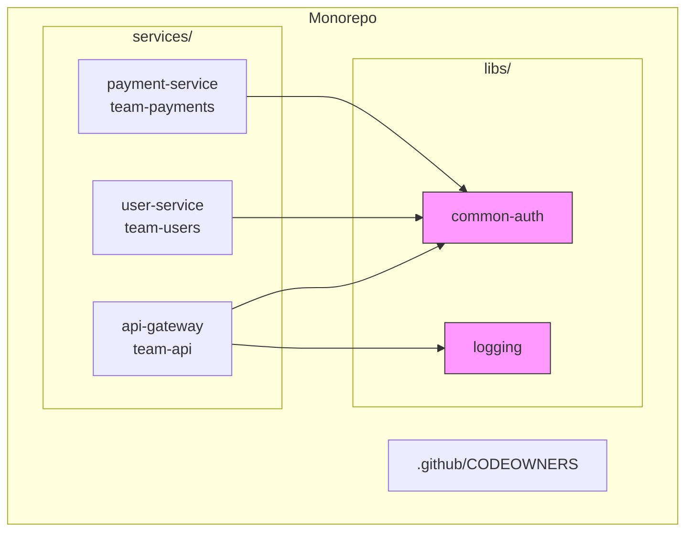
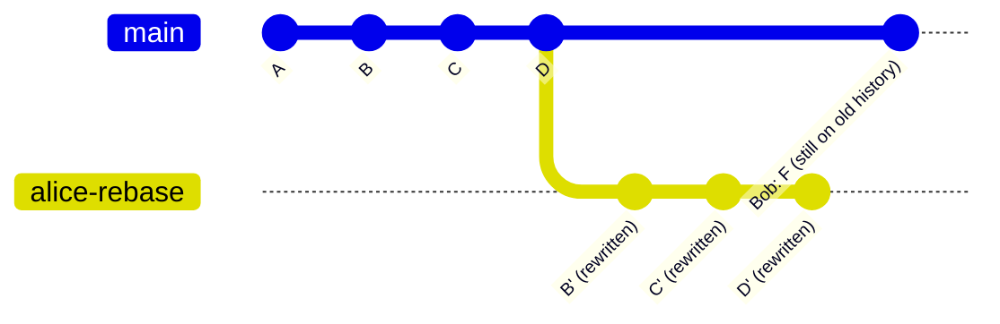

## Keywords in This File
{: .no_toc }

| # | Keyword | Difficulty |
|---|---------|------------|
| 18 | [Monorepo Strategies with Git](#monorepo-strategies-with-git) | ★★☆ |
| 19 | [Git Anti-patterns and Common Team Failures](#git-anti-patterns-and-common-team-failures) | ★★☆ |

---

# Monorepo Strategies with Git

**Interview Weight:** High - monorepos appear in architecture interviews
at companies like Google, Meta, Microsoft, and any team considering
consolidating multiple services.

---

## Quick Reference

**One-line definition:** A monorepo is a single Git repository containing
multiple projects, services, or packages with shared tooling, atomic
cross-project commits, and unified CI; the trade-off is repository scale
challenges that require specialised Git tooling.

**One analogy:** A monorepo is like a single office building for all
teams - communication is instant and shared infrastructure is efficient,
but the elevator becomes a bottleneck when 10,000 people try to use it.

**Key terms:**
- **sparse checkout** - check out only a subset of the repo's directory tree
- **partial clone** - clone only objects reachable from specific paths (blobless or treeless)
- **CODEOWNERS** - file mapping directory paths to responsible team owners
- **build system integration** - tools like Bazel, Nx, Turborepo that build only affected packages
- **VFS for Git** - Microsoft's virtual file system for Git that virtualises directory listings

---

### 🎯 Model Answer

**30-second answer:**

"A monorepo stores all projects in one Git repository. Benefits include
atomic cross-service commits, shared tooling, and easier refactoring
across boundaries. Challenges include slow `git clone`, slow CI, and
tight coupling risk. The key enablers are sparse checkout (check out
only your service), blobless clones (skip file content), and affected-
only CI (build only what changed)."

**3-minute answer:**

A monorepo is a deliberate architectural choice to keep all related
services, libraries, and tools in a single version-controlled repository.

**Benefits:**
1. **Atomic commits across service boundaries:** a single commit can
   update the API contract in service A and the consuming code in
   service B simultaneously, keeping the repo always consistent
2. **Shared tooling:** linters, CI pipelines, dependency management, and
   code generators are configured once and apply to all projects
3. **Visibility:** any developer can see all code, find patterns, and
   propose cross-project improvements without repository access management
4. **Easier refactoring:** moving shared code from one package to another
   is a single commit with full history preservation

**Challenges at scale:**
1. **Clone size:** a monorepo can grow to hundreds of GB. Microsoft's
   Windows repo is 300 GB; Facebook's Mercurial monorepo is over 1 TB
2. **CI time:** running all tests on every commit is unsustainable;
   requires affected-only build detection (Bazel, Nx, Turborepo)
3. **Coupling risk:** the convenience of cross-project imports can create
   invisible tight coupling if not governed

**Git tooling for monorepo scale:**
- **Sparse checkout** (`git sparse-checkout set services/api`) - check
  out only the directories you need; reduces working tree size to MBs
- **Blobless clone** (`git clone --filter=blob:none`) - skip fetching
  file content until needed; reduces initial clone from GB to seconds
- **Treeless clone** (`git clone --filter=tree:0`) - skip tree objects
  too; fastest clone, highest server load
- **VFS for Git** - Microsoft's virtual filesystem that intercepts
  filesystem calls and fetches objects on demand from the server

**Blank Mind Recovery:**

"Monorepos store everything in one repo. Benefits: atomic cross-service
commits, shared tooling. Challenges: clone size and CI time. Solutions:
sparse checkout (only your directory), blobless clones (skip blobs
until needed), and affected-only CI (only build changed packages)."

---

### 📘 Concept Explanation

#### 1. What Is It?

A monorepo is a single Git repository containing code for multiple
independently deployable services, shared libraries, tooling, and
documentation. The term is distinct from a monolith: a monorepo can
contain many independent microservices; a monolith is a single deployable
unit regardless of repo structure.

#### 2. Why Does It Exist?

Polyrepos (one service = one repo) cause: version drift between shared
libraries, painful cross-service refactoring (N PRs across N repos),
inconsistent tooling, and difficulty discovering reusable code.
The monorepo pattern addresses all four at the cost of repo size and
build complexity.

#### 3. How Does It Work? (Internal Mechanism)

```
Monorepo directory structure:
  /
  services/
    api-gateway/     <- team A owns
    user-service/    <- team B owns
    payment-service/ <- team C owns
  libs/
    common-auth/     <- shared library
    logging/         <- shared library
  tools/
    build-scripts/
  .github/
    CODEOWNERS
    workflows/

Sparse checkout enables team A to see:
  services/api-gateway/
  libs/common-auth/    <- also needs
  tools/build-scripts/ <- needed for CI
```

> **Diagram walkthrough:** WHAT IT DEPICTS: the structure of a monorepo
with per-team service directories, shared libraries, and tooling. HOW
TO READ IT: each `services/X/` directory is independently deployable;
`libs/` contains shared code with no independent deployment. KEY
RELATIONSHIP: sparse checkout lets team A check out only their service
directory plus the shared libs they depend on. EDGE CASE: if team A
imports from `services/payment-service/` directly (not via `libs/`),
that creates an untracked inter-service dependency that CODEOWNERS cannot
govern. INSIGHT: the repo structure enforces or undermines coupling -
having clear `libs/` boundaries and banning cross-`services/` imports
is a monorepo governance decision.

#### 4. Key Properties and Behaviors

**Sparse checkout for monorepos:**

```bash
# Clone without any working tree (fastest)
git clone --filter=blob:none --no-checkout \
  https://github.com/org/monorepo.git
cd monorepo

# Set up sparse checkout (cone mode is faster)
git sparse-checkout init --cone

# Check out only your service and shared libs
git sparse-checkout set \
  services/api-gateway \
  libs/common-auth \
  libs/logging \
  tools/build-scripts

# Checkout now materialises only those paths
git checkout main
# Working tree: ~50MB instead of ~5GB
```

> **Code walkthrough:** `--filter=blob:none` is a partial clone filter
that skips fetching file content (blobs) during the initial clone; only
commits and tree objects are fetched. Blobs are fetched on demand when
files are accessed. KEY MECHANISM: cone mode sparse checkout uses a
set of top-level directories rather than glob patterns; Git can compute
the sparse set using only directory-level tree objects without enumerating
all files. WHY IT MATTERS: a 5 GB monorepo can be cloned and checked out
in under 10 seconds for a 50 MB service subdirectory. WHAT BREAKS: some
git commands (`git status`, `git diff`) may trigger on-demand blob
fetches for files outside the sparse set if not configured correctly.
TAKEAWAY: always use `--filter=blob:none` with `--no-checkout` and
configure sparse checkout before any `git checkout` command.

**CODEOWNERS for per-team governance:**

```bash
# .github/CODEOWNERS
# Global default owner (fallback)
* @platform-team

# Service ownership
/services/api-gateway/   @team-api
/services/user-service/  @team-users
/services/payment-service/ @team-payments

# Shared library - requires library team review
/libs/common-auth/       @lib-team @security-team

# CI/CD changes require platform team
/.github/workflows/      @platform-team
/tools/                  @platform-team
```

> **Code walkthrough:** CODEOWNERS is a GitHub/GitLab feature that maps
file paths to required reviewers for PRs. KEY MECHANISM: when a PR
modifies files in `/services/payment-service/`, GitHub automatically
requests review from `@team-payments` and marks their approval as
required before merge. WHY IT MATTERS: in a monorepo where all developers
have write access, CODEOWNERS is the governance layer ensuring the right
team reviews changes to each service. WHAT BREAKS: CODEOWNERS is enforced
only on PRs, not on direct pushes to non-protected branches. TAKEAWAY:
combine CODEOWNERS with branch protection rules (require PR, require
CODEOWNERS review) to close the direct-push gap.

**Affected-only CI (Nx/Turborepo example):**

```bash
# nx.json or turbo.json defines the dependency graph
# Turborepo example: only build/test affected packages
npx turbo run build test \
  --filter=...[origin/main]
# [origin/main] means: packages changed since main

# Output:
# - services/api-gateway: changed -> build + test
# - libs/common-auth: changed -> build + test
# - services/user-service: unchanged -> SKIP
# - services/payment-service: unchanged -> SKIP

# With caching:
# services/api-gateway build: CACHE HIT -> skip build
# services/api-gateway test: CACHE HIT -> skip test
```

> **Code walkthrough:** Turborepo builds a dependency graph from package
manifests (`package.json` with `workspaces`). `--filter=...[origin/main]`
selects all packages changed since the merge base with main, plus all
packages that depend on them (transitive impact). KEY MECHANISM: output
hashing - Turborepo hashes the inputs to each task (source files +
dependencies + env vars); if the hash matches a cached run, it replays
the cached output without executing. WHY IT MATTERS: in a 50-service
monorepo, a PR touching only `libs/logging` runs only the 5 services
that depend on it, not all 50. WHAT BREAKS: if a service reads from a
shared config file outside its declared dependencies, cache invalidation
misses it and stale tests pass. TAKEAWAY: declare all file dependencies
explicitly in the build tool config; use `inputs` field to capture non-
code config files.

#### 5. Common Use Cases

1. **Multi-service platform** - all microservices + shared libs in one repo
2. **Frontend + backend together** - atomic API contract changes
3. **Shared design system** - UI components versioned with consumers
4. **Infrastructure as code + application** - Terraform + app code in sync
5. **Open source project family** - related packages maintained together
   (e.g., Babel, Jest, React ecosystem)

#### 6. Trade-offs

| Aspect | Monorepo | Polyrepo |
|--------|----------|----------|
| Cross-service commits | Atomic, one PR | Multi-PR, coordination overhead |
| CI | Complex affected-only logic | Simpler per-repo CI |
| Clone/checkout | Slow without sparse checkout | Fast by default |
| Dependency management | Shared, consistent | Independent, can drift |
| Team autonomy | Shared CI, more coordination | Independent pipelines |
| Code discovery | Easy (all in one place) | Requires cross-repo search |
| Access control | Coarse (CODEOWNERS for governance) | Fine (per-repo permissions) |

#### 7. Performance Characteristics

Key monorepo Git performance metrics:
- `git clone` without optimisation: minutes for GB-scale repos
- `git clone --filter=blob:none --no-checkout` + sparse checkout: < 30s
- `git status` in a large working tree: can take 10+ seconds
- Solution: `git config core.untrackedCache true` + `git config
  core.fsmonitor true` (file system monitor daemon reduces status time
  from seconds to milliseconds)
- `git log --oneline` across millions of commits: fast (traversal is O(n))
- `git blame` on a heavily-edited file in a large repo: can be slow;
  use `--incremental` for streaming output

#### 8. Real-World Context

Google's monorepo (Piper) contains ~2 billion lines of code and
~50,000 daily commits from ~25,000 engineers. They built a custom VCS
(Piper) on top of their distributed file system. Microsoft's Windows repo
uses VFS for Git. Meta (Facebook) uses a Mercurial fork (Sapling) for
their monorepo. Nx (formerly Nrwl) and Turborepo provide monorepo tooling
for JavaScript/TypeScript ecosystems. Bazel (Google's build tool) and
Buck (Meta's) handle affected-only builds at massive scale.

---

### 💻 Code Example

**BAD pattern - monorepo without tooling (the pain):**

```bash
# No sparse checkout - everyone clones everything
git clone https://github.com/org/monorepo.git
# Cloning into 'monorepo'...
# Receiving objects: 100% (5000000/5000000), 8.50 GiB
# -> 25 minutes on a good connection

# No affected-only CI - every PR runs everything
# CI runs all 50 service test suites on a docs change
# Duration: 45 minutes for a 2-line README fix

# No CODEOWNERS - anyone merges anything
git push origin main  # no review required
```

> **Code walkthrough:** WHAT IT SHOWS: a monorepo without tooling
captures all the costs and none of the benefits. Clone time, CI time,
and no governance are the three pain points that kill monorepo adoption
without investment. KEY MECHANISM: a 5M-object, 8.5 GB clone downloads
every blob in history; no partial clone filtering means Git must fetch
the entire object graph. WHY IT MATTERS: if a team tries a monorepo
without sparse checkout and affected-only CI, they will abandon it within
a month. WHAT BREAKS: developer velocity and morale. TAKEAWAY: a monorepo
requires tooling investment before the team pays the cost; do not
migrate to a monorepo without a plan for sparse checkout and affected-only CI.

**GOOD pattern - monorepo with full tooling:**

```bash
# Team setup script (run once after clone)
#!/usr/bin/env bash
set -euo pipefail

# Blobless partial clone
git clone --filter=blob:none --no-checkout \
  https://github.com/org/monorepo.git
cd monorepo

# Configure file system monitor for fast status
git config core.fsmonitor true
git config core.untrackedCache true

# Sparse checkout - interactive setup
SERVICE=${1:-"services/api-gateway"}
git sparse-checkout init --cone
git sparse-checkout set \
  "$SERVICE" \
  libs/common-auth \
  libs/logging \
  tools/build-scripts

git checkout main

echo "Checkout size:"
du -sh .
# -> ~55M (vs 8.5 GB full clone)
```

> **Code walkthrough:** This setup script combines three optimisations.
`--filter=blob:none` reduces the clone to metadata only; sparse checkout
limits the working tree to the service and its declared dependencies;
`core.fsmonitor` enables a background daemon (Watchman on macOS/Linux,
built-in on Windows) that tracks filesystem events so `git status` can
skip full directory scans. KEY MECHANISM: these three work independently -
each addresses a different scalability bottleneck (network, disk, CPU).
WHY IT MATTERS: developer onboarding time drops from 25 minutes to 1
minute. WHAT BREAKS: if the sparse checkout set doesn't include all
required files, builds will fail with missing import errors. TAKEAWAY:
encode the sparse checkout set in a `CODEOWNERS`-adjacent file so teams
can declare their dependencies explicitly.

---

### 🎓 Answers by Seniority

**Junior/Mid:**

"A monorepo stores all projects in one Git repo. The advantages are
that you can make changes across service boundaries in one commit, and
all teams use the same tooling. The challenges are that the repo can get
huge and slow to clone. Solutions are sparse checkout (clone only the
directory you work in) and affected-only CI (only test what changed)."

**Senior/Staff:**

"Monorepos are a team topology and tooling choice, not just a Git
configuration. The correct analysis starts with: what coordination cost
does my team currently pay with polyrepos (multi-PR cross-service
changes, library version drift, duplicated CI configuration), and is
that cost higher than the tooling investment to make monorepos work?

For a team at 10-20 services sharing significant library code, a monorepo
with Turborepo/Nx and CODEOWNERS is often the right call - the atomic
commit benefit alone justifies it.

At hyperscale (100+ services, 500+ engineers), you need deeper tooling:
sparse checkout and blobless clones for developer machines, affected-only
build graphs (Bazel/Buck), a build cache (Turborepo remote cache, Nx
Cloud, Bazel remote cache), and file system monitor daemons. The test
isolation also becomes critical - integration tests in a monorepo need
to declare their service dependencies explicitly to prevent test bleed.

The governance layer is equally important: CODEOWNERS enforced via branch
protection rules, a clear policy on cross-service imports (allowed only
via `libs/` contracts, not direct service-to-service imports), and a
platform team owning the shared tooling and CI infrastructure."

---

### ⚠️ Common Misconceptions

**Misconception 1: "Monorepo means monolith."**

A monorepo is a repository structure; a monolith is a deployment model.
You can have a monorepo with 50 independently deployable microservices
(each with their own Dockerfile and CI pipeline). You can also have a
polyrepo with a single monolith per repo. The concepts are orthogonal.

**Misconception 2: "Sparse checkout means other code is deleted."**

Sparse checkout tells Git to not check out files outside the sparse set
to the working tree. The objects still exist in the repo - they're just
not materialised on disk. You can always `git sparse-checkout disable`
to get the full tree back.

**Misconception 3: "A monorepo solves all dependency management problems."**

A monorepo simplifies internal dependency management (shared libs in the
same repo, pinned by commit SHA rather than published version). But
external dependencies (npm packages, Maven artifacts) still require
separate management. A monorepo can also create new problems: if any
shared lib changes require all consumers to update simultaneously, it
creates deployment coordination overhead that polyrepos avoid.

**Misconception 4: "Blobless clone fetches files when you need them automatically."**

Partial clones do fetch missing blobs on demand (when you try to read
a file outside what was cloned), but this requires network access and
can cause unexpected latency. If the network is unavailable, accessing
an unfetched file fails. Always run `git sparse-checkout` before working
offline.

---

### 🚨 Failure Modes and Diagnosis

**Failure 1: `git status` takes 30+ seconds in monorepo**

Symptom: developer experience is terrible; every git command is slow.

Diagnosis:
```bash
# Check if fsmonitor is enabled
git config core.fsmonitor
# (empty or false = not enabled)

# Enable fsmonitor
git config core.fsmonitor true
git config core.untrackedCache true

# Run once to warm the cache
git update-index --fsmonitor

# Verify improvement
time git status
# Before: 35s
# After: 0.3s
```

> **Code walkthrough:** `core.fsmonitor` enables a file system event
daemon (Git's built-in on Git 2.37+, or Watchman externally) that
maintains a list of files modified since the last `git status`. Instead
of scanning every file, Git asks the daemon "what changed?" and checks
only those files. KEY MECHANISM: `core.untrackedCache` caches the list
of untracked files per directory; valid as long as the directory's mtime
does not change. WHY IT MATTERS: in a 100K-file monorepo, inode scanning
takes 30-60 seconds; fsmonitor reduces it to milliseconds. WHAT BREAKS:
on network file systems (NFS, SMB), fsmonitor events are unreliable -
disable it and use `git status --no-optional-locks` as a workaround.
TAKEAWAY: always enable fsmonitor + untrackedCache for monorepos on
local disks.

**Failure 2: CI runs all tests on every commit in a monorepo**

Symptom: a 2-line README change triggers 45 minutes of CI.

Diagnosis:
```bash
# Identify which packages changed since main
git diff --name-only origin/main...HEAD | \
  cut -d/ -f1,2 | sort -u
# -> services/api-gateway
# -> docs

# CI pipeline should run only affected packages
# With Turborepo:
npx turbo run test \
  --filter=...[origin/main]

# With Nx:
npx nx affected:test --base=origin/main

# Verify the affected set is correct
npx turbo run test --dry-run \
  --filter=...[origin/main]
```

> **Code walkthrough:** `git diff --name-only origin/main...HEAD` (note
three dots - symmetric diff) lists files changed in the feature branch
since it diverged from main. Turborepo/Nx use this set to determine
which packages are "affected" and transitively which packages depend on
them. KEY MECHANISM: the build graph is derived from `package.json`
`dependencies` and `devDependencies`; changing a shared lib triggers
tests for all its consumers. WHY IT MATTERS: this is the primary CI
efficiency win for monorepos - O(changed packages) not O(all packages).
WHAT BREAKS: if CI uses `origin/main` (two dots) instead of
`origin/main...HEAD` (three dots), it may compute the wrong change set
after merges. TAKEAWAY: always use the three-dot range for affected
detection to compute changes since the merge base.

**Failure 3: Cross-service tight coupling hidden in monorepo**

Symptom: changing `libs/common-auth` breaks `services/payment-service`
because payment directly imports from another service's internal package.

Diagnosis:
```bash
# Find cross-service imports (Node example)
grep -r "from '../../user-service'" \
  services/payment-service/
# If any results: direct cross-service import = bad

# Enforce import boundaries with ESLint
# .eslintrc.json - nx boundary rules
{
  "rules": {
    "@nx/enforce-module-boundaries": ["error", {
      "allow": [],
      "depConstraints": [{
        "sourceTag": "scope:payment",
        "onlyDependOnLibsWithTags": [
          "scope:shared",
          "scope:libs"
        ]
      }]
    }]
  }
}
```

> **Code walkthrough:** Nx's `@nx/enforce-module-boundaries` lint rule
uses project tags to define allowed dependency edges. `services/payment`
tagged `scope:payment` can only import from projects tagged `scope:shared`
or `scope:libs`, not from `scope:user`. KEY MECHANISM: the rule runs at
lint time (pre-commit and CI), rejecting cross-boundary imports before
they reach the repo. WHY IT MATTERS: without boundary enforcement, a
monorepo's ease of access encourages tight coupling between services -
the opposite of microservices isolation goals. WHAT BREAKS: if the tags
are not maintained (new packages added without tags), the rule has gaps.
TAKEAWAY: assign tags to every package and run boundary lint in the same
pre-commit hook as other linters.

---

### 🎯 Interview Deep-Dive

| Question Type | Count | Target Audience |
|---|---|---|
| Conceptual | 2 | All levels |
| Debugging | 2 | Mid-Senior |
| Trade-off | 2 | Senior-Staff |
| Behavioral | 1 | Mid-Senior |
| Architecture | 2 | Staff |

---

**[CONCEPTUAL] Q1 - What is the difference between a monorepo and a monolith?**

These terms are frequently conflated but describe orthogonal properties.

A **monorepo** is a version control strategy: one Git repository contains
code for multiple independently deployable services, libraries, or tools.
The repository is the unit.

A **monolith** is a deployment architecture: one deployable artifact
handles all functionality. It could live in one repo (monorepo) or be
split across multiple repos (unlikely but possible for generated code).

Examples to illustrate the matrix:
- **Monorepo + microservices:** Google, Meta, Microsoft - dozens of
  independently deployed services in one repo
- **Monorepo + monolith:** small startup with one service, one repo -
  technically a monorepo with one project
- **Polyrepo + microservices:** Netflix, Amazon - each microservice in
  its own repo (common pattern before monorepo tooling matured)
- **Polyrepo + monolith:** legacy enterprise - one repo, one deployable

The decision to use a monorepo is independent of architectural style.

*What separates good from great:* giving a concrete 2x2 matrix and
naming companies for each quadrant.

---

**[CONCEPTUAL] Q2 - How do sparse checkout, partial clone, and VFS for Git each improve monorepo developer experience?**

They attack different bottlenecks:

**Partial clone (`--filter=blob:none`)** - network bottleneck:
Skips fetching file content (blobs) during clone. Only commits and tree
objects are fetched. Blobs are fetched on-demand when accessed.
Result: clone time drops from minutes to seconds for large repos.

**Sparse checkout** - disk bottleneck:
After cloning, limits which files are materialised in the working tree.
Only the declared directories are checked out.
Result: working tree is megabytes instead of gigabytes.

**VFS for Git (GVFS)** - filesystem bottleneck:
A virtual filesystem driver (Windows) that intercepts all file system
calls and virtualises the working directory. Files appear to exist in
the directory listing but are not actually on disk; they are fetched
on-demand from the server when accessed.
Result: even `git status` and IDE file indexing work on the virtualised
tree without downloading the full repo.

The three tools compose: partial clone reduces network use, sparse
checkout reduces disk use, VFS virtualises the remaining disk access.
Microsoft uses all three for the Windows monorepo.

*What separates good from great:* explaining each tool's targeted
bottleneck rather than treating them as interchangeable.

---

**[DEBUGGING] Q3 - A developer reports that after switching branches in a monorepo, their IDE shows thousands of file changes. Diagnose.**

This is the sparse checkout working tree divergence problem.

```bash
# Diagnose: check sparse checkout status
git sparse-checkout list
# Shows current include paths

# Check if the branch switch changed files outside sparse set
git status
# Thousands of 'D' (deleted) entries = files in new branch's
# full tree are not in the sparse set

# The branch being checked out may have added new service
# directories not in the current sparse set.
# Fix: update sparse checkout set to include new paths
git sparse-checkout add services/new-service

# Or: switch to the branch without changing the working tree
# (advanced: use --no-guess)
git checkout --no-guess other-branch

# Verify after fix
git status
# Should show only actual changes, not sparse-set mismatches
```

> **Code walkthrough:** When switching branches in sparse checkout,
Git compares the current branch's tree to the target branch's tree for
the entire repo, then applies changes only within the sparse set.
KEY MECHANISM: if the target branch has new directories not in the sparse
set, Git does not check them out - but some git commands still report
them as absent. WHY IT MATTERS: a misconfigured sparse checkout set after
branch switching can make the IDE (which may read `git status`) think
thousands of files are deleted. WHAT BREAKS: running `git add .` in this
state would stage thousands of deletions. TAKEAWAY: always run
`git sparse-checkout list` when branch switching in a monorepo to verify
the set is still appropriate.

---

**[DEBUGGING] Q4 - Turborepo reports cache hits but the deployed service has a bug that was fixed in the source. How is this possible?**

Cache poisoning due to undeclared inputs.

```bash
# Turborepo caches based on declared inputs
# turbo.json
{
  "pipeline": {
    "build": {
      "inputs": [
        "src/**",
        "package.json",
        "tsconfig.json"
      ],
      "outputs": ["dist/**"]
    }
  }
}
# If the build also reads .env.production (not declared),
# a change to .env.production is invisible to the cache.
# Cache hits reuse stale build output.

# Diagnosis: check what the build actually reads
strace -e openat node build.js 2>&1 | \
  grep -v "node_modules" | grep "ENOENT\|O_RDONLY"
# Reveals undeclared file reads

# Fix: declare all input files
{
  "inputs": [
    "src/**",
    "package.json",
    "tsconfig.json",
    ".env.production"  <- add missing input
  ]
}
```

> **Code walkthrough:** Turborepo's cache key is computed from a hash
of declared inputs. If an input file changes but is not declared, the
hash does not change, and the cached output is reused even though it is
stale. KEY MECHANISM: the fix is to add the undeclared file to `inputs`
in `turbo.json`; the next run computes a new hash and rebuilds.
WHY IT MATTERS: this is the most dangerous monorepo caching failure - the
build appears to succeed (cache hit), deploys the old artifact, and the
bug resurfaces after a "fix". WHAT BREAKS: if inputs are declared too
broadly (e.g., `**/*`), cache hit rate drops to near zero.
TAKEAWAY: use `strace` or `fs-capture` to discover undeclared file reads
during a controlled build, then add them to `inputs`.

---

**[TRADE-OFF] Q5 - When should a team migrate from polyrepo to monorepo? What signals indicate it's the right time?**

**Signals that monorepo is worth the investment:**

1. **Cross-service changes happen frequently:** if you regularly need to
   update an API contract and 3 consumers in the same PR, polyrepo is
   causing real coordination overhead
2. **Shared library version drift:** teams are pinned to different versions
   of the same internal library, causing incompatibilities
3. **Duplicated CI configuration:** each service has its own nearly-identical
   CI pipeline; a change to linting rules requires PRs in 10 repos
4. **Discovery problem:** developers repeatedly build functionality that
   already exists elsewhere in the org but was invisible

**Signals that monorepo is premature:**

1. **Team size < 5 engineers:** the coordination benefits are small;
   the tooling overhead is real
2. **No shared code:** if services truly share nothing, there is no atomic
   commit benefit
3. **Different deployment lifecycles:** if services have radically different
   release cadences (daily vs. quarterly), monorepo CI coupling is painful
4. **Regulatory isolation:** some compliance regimes require physical repo
   separation for different data classes (PCI vs non-PCI code)

**Migration approach:**
1. Start with a "monorepo lite" - move related services into one repo
   without any build tooling changes
2. Add CODEOWNERS and branch protection
3. Add affected-only CI (Turborepo/Nx)
4. Add sparse checkout for large-team workflows
5. Measure: did cross-service PR cycle time decrease? Did library drift
   decrease?

*What separates good from great:* the regulatory isolation signal - many
candidates miss that compliance constraints can make monorepos
architecturally prohibited regardless of technical preference.

---

**[TRADE-OFF] Q6 - What is the coupling risk of a monorepo and how do you govern it?**

The coupling risk is paradoxical: the monorepo's greatest benefit
(easy cross-service access) is also its greatest risk (unintended
cross-service dependencies).

In a polyrepo, service A can only import from service B by declaring a
versioned dependency in `package.json` or `pom.xml`. This is visible,
auditable, and requires deliberate action.

In a monorepo, service A can `import { PaymentClient } from
'../payment-service/src/client'` with no friction. This creates a
runtime coupling that the build system may not detect.

**Governance mechanisms:**

1. **Module boundary rules** (Nx `@nx/enforce-module-boundaries`):
   enforces allowed import edges at lint time based on project tags
2. **CODEOWNERS**: requires the owning team to approve any change to
   their service's files - including changes that add it as a dependency
3. **`libs/` architecture contract**: mandate that all shared code lives
   in `libs/` with a public API surface; `services/` directories expose
   nothing directly to other services
4. **Dependency review**: use `npx nx graph` to visualise the dependency
   graph and audit for unexpected edges

*What separates good from great:* identifying that the ease-of-access
benefit and the coupling risk are the same property viewed from different
angles, and naming specific enforcement tools.

---

**[BEHAVIORAL] Q7 - Your team is considering a monorepo migration. How would you evaluate and plan it?**

Strong answer:

**Evaluation (1 week):**

1. Count cross-service PRs in the last quarter - high count signals
   polyrepo is causing pain
2. Audit shared library usage and version spread across repos
3. Identify compliance/access control constraints that prohibit merging

**Proof of concept (2-3 weeks):**

1. Pick two closely-related services + their shared lib
2. Merge into a single repo (no tooling changes yet)
3. Open 2-3 real cross-service PRs - measure time to merge

**Tooling investment (if POC is positive, 2-3 weeks):**

1. Add Turborepo/Nx with affected-only CI
2. Configure CODEOWNERS and branch protection
3. Add sparse checkout setup script for developer onboarding
4. Measure: clone time, CI time, cross-service PR cycle time

**Rollout (iterative):**

Move repos in groups of related services, not all at once. Keep CI
working throughout by migrating build configs before moving code.

*What separates good from great:* the phased approach (POC then tools
then rollout) and the specific metrics (cross-service PR count, clone
time, CI time) to evaluate success.

---

**[ARCHITECTURE] Q8 - Design the CI/CD pipeline for a monorepo with 50 services and 200 engineers.**

**Requirements:** 50 services, 200 engineers, fast CI, independent
deploys, affected-only builds.

**Pipeline architecture:**

```
PR Pipeline (every PR):
  1. git diff --name-only origin/main...HEAD
  2. affected graph (Turborepo/Nx) -> affected services
  3. For each affected service in parallel:
     a. lint (< 30s per service)
     b. unit tests (< 2 min per service)
     c. build artifact
  4. Integration tests (affected services only, shared
     test environment per PR namespace)
  5. Status check: all affected must pass to merge

Main merge pipeline:
  1. Full build of changed services (same affected logic)
  2. Push artifacts to registry (tagged with commit SHA)
  3. Deploy to staging (affected services only)
  4. Smoke tests against staging
  5. Auto-promote to production (or manual gate for critical)

Scheduled full pipeline (nightly):
  1. Build ALL services (verify no hidden dependencies)
  2. Full integration test suite
  3. SLSA provenance generation
  4. Security scan (SAST, dependency audit)
```

> **Code walkthrough:** The critical design is "affected-only for PR,
full-build nightly". This gives fast PR feedback (only changed services)
while catching hidden dependency failures nightly. KEY MECHANISM: the
affected detection uses the Turborepo dependency graph; an unregistered
dependency between services will be missed in PR CI but caught in the
nightly full build. WHY IT MATTERS: fast PR CI is the primary monorepo
enabler for 200-engineer teams - if CI takes 45 min on every PR, the
monorepo is untenable. WHAT BREAKS: if the nightly build is ignored or
allowed to fail silently, hidden dependencies accumulate undetected.
TAKEAWAY: treat nightly build failures as P1 incidents with on-call
escalation.

**Service deployment isolation:**
Each service has its own deploy workflow triggered only when its artifact
changes. Services are deployed independently; a change to `api-gateway`
does not trigger a redeploy of `payment-service`.

*What separates good from great:* the "affected-only for PR, full-build
nightly" split - it correctly identifies that affected-only is an
approximation and nightly full builds catch the gaps.

---

**[ARCHITECTURE] Q9 - How would you handle secrets and environment-specific configuration in a large monorepo without leaking across services?**

Secrets in a monorepo have an amplified blast radius: one leaked
`.env.production` file exposes all services' secrets simultaneously.

**Architecture:**

```
secrets/                    <- never committed
.env.*.example              <- committed (no real values)
services/
  api-gateway/
    .env.example            <- service-specific template
  payment-service/
    .env.example

# CI/CD: secrets per service in secret store
# GitHub: org/repo secrets scoped to specific environments
# Vault: service-scoped Vault policies
# AWS Secrets Manager: per-service IAM policies
```

> **Code walkthrough:** WHAT IT SHOWS: a layered secrets architecture
where no real values are committed; only example templates. KEY
MECHANISM: GitHub environment secrets are scoped to specific deployment
environments (staging, production), so a CI job for the API Gateway
cannot read Payment Service secrets even in the same repo. WHY IT
MATTERS: a monorepo amplifies the blast radius of a leaked secret - one
exposed `.env` file could expose all 50 services simultaneously. WHAT
BREAKS: if developers use repo-level secrets (not environment-scoped)
all workflows in the repo can read all secrets. TAKEAWAY: always scope
CI secrets to the specific deployment environment, not the repo.

**Controls:**

1. **No `.env` files committed:** `.gitignore` pattern `*.env` and
   `**/.env.*` (except `.example` files)
2. **Secret scanning in pre-receive hook:** run `gitleaks` in
   `pre-receive` to reject pushes containing high-entropy strings or
   known secret patterns
3. **Service-scoped CI secrets:** in GitHub Actions, use environment
   secrets scoped to the service's deploy environment, not repo-wide
   secrets that all workflows can read
4. **Vault namespaces:** each service has a Vault namespace with its own
   policies; the service's service account can only read its namespace

*What separates good from great:* naming `gitleaks` in `pre-receive` as
the prevention layer and Vault namespaces as the runtime isolation layer.

---

### ⚖️ Comparison Table

| Approach | Clone Speed | CI Speed | Cross-service Commits | Autonomy | Tooling Cost |
|----------|-------------|----------|-----------------------|----------|--------------|
| Monorepo (no tooling) | Slow | Slow (all CI) | Atomic | Low | Low |
| Monorepo + sparse checkout | Fast | Slow (all CI) | Atomic | Low | Medium |
| Monorepo + affected CI | Slow | Fast (affected) | Atomic | Low | Medium |
| Monorepo + full tooling | Fast | Fast | Atomic | Medium | High |
| Polyrepo | Fast | Fast (per-repo) | Multi-PR | High | Low |

---

### 🏛️ System Design

*(Omit: Not a ★★★ keyword.)*

---

### 📊 Diagram

ASCII - monorepo structure with teams and tooling:

```
monorepo/
  services/            <- per-team ownership (CODEOWNERS)
    api-gateway/       [team-api]
    user-service/      [team-users]
    payment-service/   [team-payments]
  libs/                <- shared, requires lib-team review
    common-auth/
    logging/
  tools/               <- platform-team only
  .github/CODEOWNERS

Developer checkout (sparse):
  only api-gateway/ + libs/ (~50MB)
  full repo is 8GB
```

> **Diagram walkthrough:** WHAT IT DEPICTS: the directory structure of a
monorepo with service isolation, shared libraries, and CODEOWNERS
governance. HOW TO READ IT: each service directory is independently
deployable and owned by one team; `libs/` is shared and requires cross-
team review. KEY RELATIONSHIP: a developer only checks out their service
directory and the libs they import; the working tree is tiny relative to
the full repo. EDGE CASE: if a service imports directly from
`services/payment-service/` (skipping `libs/`), CODEOWNERS will require
payment-team review for that change but the import boundary is still
violated. INSIGHT: the most important monorepo governance decision is
mandating `libs/` as the only cross-service sharing mechanism.



> **Diagram walkthrough:** WHAT IT DEPICTS: the dependency graph in a
monorepo with three services sharing two common libraries. HOW TO READ
IT: arrows show import dependencies; pink nodes are shared libraries
that require lib-team review for changes. KEY RELATIONSHIP: all services
depend on `common-auth`; changing `common-auth` triggers affected-only
CI for all three services simultaneously. EDGE CASE: if a service adds
a dependency on another service (not a lib), the flowchart should show
a horizontal arrow in `services/` - this is the architectural violation
to detect and prevent. INSIGHT: the dependency graph makes coupling
visible and auditable; `npx nx graph` renders this in real-time for
Nx-managed monorepos.

---

---

# Git Anti-patterns and Common Team Failures

**Interview Weight:** High - senior engineers are expected to identify
and fix bad Git practices, not just use Git correctly.

---

## Quick Reference

**One-line definition:** Git anti-patterns are recurring misuses of Git
that create slow workflows, corrupted history, security risks, or
collaboration failures; knowing them distinguishes engineers who use
Git mechanically from those who understand its model.

**One analogy:** Git anti-patterns are like traffic violations that seem
harmless individually but cause pile-ups when everyone does them -
force-pushing shared branches, committing secrets, and working on main
are each small mistakes that compound into team-wide disasters.

**Key terms:**
- **force push on shared branch** - rewriting history that others have already fetched
- **squash everything policy** - discarding granular history that aids `git bisect` and `git blame`
- **committing to main directly** - bypassing code review and branch protection
- **large binary in history** - permanently inflating repo size even after deletion
- **rebase on public commits** - rebasing commits that have been pushed and pulled by others

---

### 🎯 Model Answer

**30-second answer:**

"The most damaging Git anti-patterns are: force-pushing shared branches
(rewrites history others depend on), committing secrets to any branch
(secrets are permanent in history even after deletion), and committing
large binaries (inflates repo forever). Institutionally, a 'squash
everything' policy destroys the granular history that `git bisect` needs,
and working directly on main removes the code review gate."

**3-minute answer:**

Git anti-patterns fall into two categories: individual mistakes that
harm the individual, and team practices that harm the whole codebase.

**High-severity individual mistakes:**
1. **Committing secrets:** API keys, passwords, and certificates
   committed to ANY branch are permanently in the object store even
   after deletion. The only remediation is `git filter-repo` to rewrite
   history (which invalidates all forks and clones) or secret rotation.
2. **Committing large binaries:** a 100 MB binary committed and then
   deleted still lives in the repo's object store forever (until a GC
   prunes unreachable objects, which git by default retains for 90 days).
   It bloats every clone forever.
3. **Force-push on a shared branch:** `git push --force` on `main` or
   a shared feature branch rewrites history that teammates have already
   pulled. Anyone who has the old commits diverges from the new history
   and faces confused merge conflicts.

**High-severity team anti-patterns:**
1. **Squash everything policy:** merging all PRs as squash commits
   destroys granular commit history. `git bisect` can only narrow down
   to a squash merge commit (potentially thousands of lines of changes),
   not the specific 3-line change that introduced the bug.
2. **Long-lived feature branches:** branches open for weeks accumulate
   large merge conflicts. The bigger the merge, the harder the review
   and the higher the regression risk.
3. **Unclear branch naming conventions:** `fix`, `test`, `asdf`,
   `dev2` tell reviewers nothing. Without conventions, branch lists
   become unusable.

**Blank Mind Recovery:**

"Git anti-patterns: force-pushing shared branches (breaks others'
history), committing secrets (permanent even if deleted), large binaries
(bloat forever), squash-everything (destroys bisect granularity),
and long-lived branches (giant merge conflicts)."

---

### 📘 Concept Explanation

#### 1. What Is It?

Git anti-patterns are practices that misuse Git's model in ways that
cause immediate pain (merge conflicts, slow performance) or latent pain
(security incidents from committed secrets, inability to bisect bugs).
They are distinct from simple Git mistakes - they are recurring practices
that become team-wide problems.

#### 2. Why Does It Exist?

Most Git anti-patterns arise from treating Git as a simple backup tool
rather than a collaborative history management system. "Just commit
everything to main" and "force push to fix your mistake" are individually
expedient but collectively destructive.

#### 3. How Does It Work? (Internal Mechanism)

**Why secrets persist after deletion:**

```
Commit A: adds config.py with API_KEY="sk-abc123"
Commit B: removes config.py
Commit C: HEAD

Object store:
  blob:sk-abc123-hash  <- STILL EXISTS
  tree:A -> config.py:sk-abc123-hash
  commit-A -> tree:A
  commit-B -> tree:without-config.py
  commit-C -> ...

git log -p HEAD      -> no secret visible
git cat-file blob sk-abc123-hash -> SECRET VISIBLE
git clone (full)     -> includes all blobs in history
```

> **Code walkthrough:** WHAT IT SHOWS: Git's content-addressable store
retains every object ever added, regardless of whether subsequent commits
reference it. KEY MECHANISM: `commit-A` references `tree-A` which
references the `blob` containing the secret; this chain is reachable
from any full clone of the repo. WHY IT MATTERS: `git log` shows the
current file tree, not the full object graph. A secret deleted in commit
B is invisible in `git log` but trivially recoverable with
`git cat-file blob <sha>`. WHAT BREAKS: rotating the secret and deleting
the commit is insufficient if the repo is public - consider the secret
fully compromised. TAKEAWAY: treat any committed secret as compromised
immediately, regardless of whether it was "fixed" in the next commit.

#### 4. Key Properties and Behaviors

**Anti-pattern 1: Force-push on shared branches**

```bash
# BAD: force push on shared branch
git push --force origin main
# Teammate A runs git pull - confused by non-fast-forward
# Teammate B's local branch now diverges from remote
# Any CI pipelines referencing old SHAs are now broken

# GOOD: force push with lease (prevents overwriting others' work)
git push --force-with-lease origin feature/my-change
# --force-with-lease checks that the remote ref hasn't moved
# since you last fetched; fails if someone else pushed
```

> **Code walkthrough:** `--force` unconditionally overwrites the remote
ref regardless of what's there. `--force-with-lease` adds an optimistic
lock: Git records the remote SHA at last fetch and refuses to push if
it has changed. KEY MECHANISM: the lease is stored in the `FETCH_HEAD`
and compared to the remote ref before the force push proceeds. WHY IT
MATTERS: `--force-with-lease` prevents the scenario where you
force-push over a teammate's commit that you hadn't fetched. WHAT
BREAKS: if you ran `git fetch` explicitly before force-pushing, the lease
is satisfied even if you haven't integrated the teammate's change - fetch
updates the lease. TAKEAWAY: use `--force-with-lease --force-if-includes`
(Git 2.30+) to also require that the fetched changes be in your local
branch.

**Anti-pattern 2: Squash everything**

```bash
# BAD: squash everything policy (destroys bisect granularity)
git merge --squash feature/payment-overhaul
git commit -m "feat: payment overhaul (750 files, 15000 lines)"
# git bisect can only narrow to this giant commit
# git blame shows this commit for everything it touched

# GOOD: squash for small cleanup, merge commit for large features
# Small (<5 commits, coherent): squash is fine
git merge --squash feature/fix-typo

# Large (5+ commits, bisectable history): use merge commit
git merge --no-ff feature/payment-overhaul
# Preserves individual commits inside the merge
```

> **Code walkthrough:** A squash merge takes all commits in a branch and
combines them into one commit on main. The individual commits are
discarded from reachable history. KEY MECHANISM: after squash, `git log
--oneline main` shows one entry for the entire feature; `git bisect`
can narrow a regression to that one entry but no further. WHY IT MATTERS:
a 15,000-line squash commit is effectively un-bisectable; finding the
specific 5-line change that introduced a regression requires manual diff
analysis. WHAT BREAKS: teams that require squash-only merges for "clean
history" discover that clean linear history and bisect granularity are
in tension. TAKEAWAY: mandate squash for cosmetic/small commits and merge
commits (--no-ff) for features that may need future bisection.

**Anti-pattern 3: Long-lived feature branches**

```bash
# BAD: branch open for 3 weeks, 200 commits behind main
git checkout feature/big-refactor  # 3 weeks old
git merge main
# CONFLICT (content): src/api/handler.js
# CONFLICT (content): src/api/handler.js (another conflict)
# ... 47 more conflicts ...

# GOOD: sync with main daily, ship in slices
# Daily: keep branch current
git fetch origin
git rebase origin/main
# Only 1 day of drift -> 0-3 conflicts, easy to resolve

# Or: trunk-based development
# Ship behind feature flags -> no long-lived branch needed
git commit -m "feat: add payment form (behind flag)"
git push origin main  # directly to main, flag disabled
```

> **Code walkthrough:** Conflict count compounds with time: one day of
drift produces ~0-2 conflicts; three weeks produces dozens or hundreds.
KEY MECHANISM: every commit to main that touches the same files as your
branch adds a potential conflict. WHAT BREAKS: large merges are error-
prone and frequently introduce regressions because the developer is
making functional decisions (choosing conflict resolutions) under review
pressure. WHAT BREAKS SILENTLY: a conflict resolution that compiles
successfully but chooses the wrong logic - tests may not catch this.
TAKEAWAY: never let a branch drift more than 2 days from main without
a sync; use feature flags for large features instead of long-lived
branches.

#### 5. Common Use Cases

Anti-pattern recognition appears in:
1. **Code review:** reviewer should flag large binary additions and
   secret-looking strings
2. **Onboarding:** new engineers need to learn team-specific conventions
3. **Incident response:** when bisect fails because squash policy
   destroyed granularity
4. **Security audit:** scanning repo history for committed secrets
5. **Migration planning:** when cloning is slow due to large blobs in history

#### 6. Trade-offs

| Practice | Short-term benefit | Long-term cost |
|----------|-------------------|----------------|
| Squash all merges | Clean linear log | Bisect fails on large features |
| Force push to fix mistakes | Quick history cleanup | Breaks teammates' local branches |
| Commit everything to main | No branch overhead | No code review, regression risk |
| Large files in repo | Convenient | Permanent clone bloat |
| Long-lived branches | Isolated development | Giant merge conflicts |

#### 7. Performance Characteristics

Anti-patterns have measurable performance costs:
- **Large binary history:** 100 MB binary adds 100 MB to every full clone
  forever (unless removed with `git filter-repo`)
- **Force-push on main:** causes non-fast-forward divergence in every
  team member's local checkout; recovery time is 5-15 minutes per person
- **Long-lived branches:** a 3-week branch may take 2-4 hours to merge
  safely; a comparable set of trunk-based daily commits takes 0 minutes

#### 8. Real-World Context

GitHub's "Git Secrets" tool and `gitleaks` exist specifically because
secret-in-repo is endemic. The npm registry had 4,000+ committed secrets
found in published packages in 2019. The Linux kernel's development model
(Linus's tree + lieutenants) is the canonical example of well-structured
branch topology. GitGuardian's annual State of Secrets Sprawl report
consistently finds millions of secrets committed to public repos each year.

---

### 💻 Code Example

**BAD pattern - multiple anti-patterns in one workflow:**

```bash
# Working directly on main - no review
git checkout main
git pull
# ... make changes ...
git add .
git commit -m "stuff"

# Oops - committed API key
git add config.py  # contains API_KEY="sk-abc123"
git commit -m "add config"
git push origin main
# Secret is now in origin/main history

# Realise mistake - force push to "fix"
git rebase -i HEAD~1  # remove the config commit
git push --force origin main
# Everyone else's local main is now broken
```

> **Code walkthrough:** WHAT IT SHOWS: three anti-patterns in sequence:
no branch (no review), secret committed, then force push to fix.
KEY MECHANISM: even though the force push removes the config commit from
the visible history, the original blob object is already in the remote's
object store and in the push pack file that was transmitted. WHY IT
MATTERS: the push pack was received by GitHub's servers before the force
push; automated scanning tools may have already logged the secret.
Rotate immediately. WHAT BREAKS: the force push corrupts the local main
of every teammate who pulled between the two pushes. TAKEAWAY: three
anti-patterns compound each other; the first mistake (no review gate)
enables the second (accidental secret commit).

**GOOD pattern - correct workflow for accidental secret commit:**

```bash
# STEP 1: Rotate the secret IMMEDIATELY (do not wait)
# Revoke API key in provider dashboard NOW
# The secret is compromised regardless of git history

# STEP 2: Remove from history with git filter-repo
pip install git-filter-repo
git filter-repo --path config.py --invert-paths
# Rewrites ALL commits that touched config.py
# New commit SHAs throughout the history

# STEP 3: Force push ALL branches (coordinate with team)
git push --force --all
git push --force --tags

# STEP 4: Notify all collaborators to reclone
echo "ALERT: History was rewritten. Please reclone."
# git clone or git fetch --all && git reset --hard origin/main

# STEP 5: Add to .gitignore to prevent recurrence
echo "config.py" >> .gitignore
echo "*.env" >> .gitignore
git add .gitignore
git commit -m "chore: prevent secret file commits"

# STEP 6: Add secret scanning to pre-commit
# .pre-commit-config.yaml: add gitleaks hook
```

> **Code walkthrough:** `git filter-repo` is the modern replacement for
`git filter-branch` (deprecated). It rewrites every commit in the repo's
history to exclude the specified file, creating new commit SHAs. KEY
MECHANISM: all forks and clones still have the old history with the
secret; `git push --force --all` updates the remote, but existing forks
must be recloned. WHY IT MATTERS: the secret is still compromised and
must be rotated; history rewriting does NOT undo the exposure - it only
prevents future cloners from seeing it. WHAT BREAKS: any CI system or
external service storing the old commit SHAs will have broken links.
TAKEAWAY: secret rotation is step 1, history rewriting is step 5; do not
let the history cleanup delay the rotation.

---

### 🎓 Answers by Seniority

**Junior/Mid:**

"Common Git mistakes include committing to main directly instead of using
branches, writing unclear commit messages, and not pulling before pushing
which causes conflicts. A serious one is accidentally committing secrets
like passwords or API keys - these stay in history even if you delete
the file. You should use `.gitignore` to prevent sensitive files from
being tracked, and use secret scanning tools like `gitleaks`."

**Senior/Staff:**

"I categorise Git anti-patterns by severity:

**Critical (security/irreversible):**
- Committing secrets - rotate immediately, rewrite history with
  `git filter-repo`, add `gitleaks` to `pre-receive`
- Large binaries in history - use `git lfs` or exclude from tracking;
  removal requires history rewrite

**High (collaboration breakage):**
- Force-push on shared branches - always use `--force-with-lease`;
  protect main with 'require linear history' + 'disallow force pushes'
- Long-lived feature branches - mandate daily sync, ship behind feature
  flags for large features

**Medium (process degradation):**
- Squash everything policy - destroys bisect granularity for large
  features; use merge commits for substantial features
- Working directly on main - remove direct push permission, require PRs

The institutional pattern I look for in a codebase: are secrets scanning
and branch protection configured at the repo level (not just developer
convention)? Developer convention fails under deadline pressure; server-
side enforcement does not."

---

### ⚠️ Common Misconceptions

**Misconception 1: "Deleting a file containing a secret removes it."**

The file deletion commit removes the path from the working tree and
removes the reference from the HEAD tree object. But the original blob
object (containing the secret) remains in the object store, reachable
via the original commit's tree. Any full clone of the repo fetches all
blobs in history. Treat committed secrets as permanently compromised.

**Misconception 2: "`git push --force` on my own feature branch is fine."**

If no one else has pulled the branch, it is temporarily safe. But once
anyone else has pulled or if a CI system has checked out the branch, a
force push invalidates their local copy. Always use `--force-with-lease`
instead of `--force`.

**Misconception 3: "Squash merges give you a cleaner history."**

They give a linearised history, not necessarily a cleaner one. A 500-line
squash commit is not cleaner than 10 well-named smaller commits. Squash
merges remove bisect granularity and make blame less useful for large
features. Use squash for genuinely small, coherent changesets.

**Misconception 4: "Git LFS solves the large-binary problem for existing history."**

Git LFS replaces future binary storage but cannot retroactively fix
existing large objects in history. Historical large blobs require
`git filter-repo --strip-blobs-bigger-than 10M` to remove, followed by
a force push - the same invasive process as secret removal.

---

### 🚨 Failure Modes and Diagnosis

**Failure 1: Team member is stuck after a force push to shared branch**

Symptom: `git pull` fails with "fatal: not possible to fast-forward".

Diagnosis and fix:
```bash
# What happened: remote main was force-pushed
git fetch origin
git log --oneline origin/main  # shows new history
git log --oneline main         # shows old history (diverged)

# Option A: hard reset to remote (discard local)
git reset --hard origin/main
# Use when: you have no local commits to preserve

# Option B: rebase your local commits onto new remote
git rebase origin/main
# Use when: you have local commits that need to survive

# Option C: create a rescue branch first
git branch rescue-$(date +%Y%m%d)
git reset --hard origin/main
# Safe copy of your work + aligned to remote
```

> **Code walkthrough:** After a force push, `origin/main` and the local
`main` have diverged into two separate histories with no common ancestor
path. `git pull` (which does a fast-forward or merge) fails because it
would create a merge commit combining the two histories - Git refuses
by default. KEY MECHANISM: `git reset --hard origin/main` moves the local
branch pointer to the remote SHA, discarding local commits. WHAT BREAKS:
if there are uncommitted local changes, `git reset --hard` discards them.
TAKEAWAY: always create a rescue branch before any `git reset --hard`.

**Failure 2: Clone is enormous due to historical large files**

Symptom: `git clone` takes 20+ minutes, repo is 10 GB, large files
were "deleted" long ago.

Diagnosis:
```bash
# Find the largest objects in history
git rev-list --objects --all | \
  git cat-file --batch-check='%(objectsize) %(objectname)' \
  | sort -n | tail -20

# Get file paths for the largest blobs
git log --all --full-history -- "*.psd" \
  | head -5

# Calculate current vs historical size
git count-objects -vH
# size-pack: 8.5 GiB <- current pack size
# size: 50 MiB <- loose objects

# Remove historical large files
pip install git-filter-repo
git filter-repo \
  --strip-blobs-bigger-than 10M
# Rewrites all commits; force-push required
```

> **Code walkthrough:** `git rev-list --objects --all` lists every
reachable object in the entire history; `git cat-file --batch-check`
shows each object's size. KEY MECHANISM: sorting by size reveals the
historical large blobs regardless of whether they appear in current HEAD.
WHY IT MATTERS: even after removing a 1 GB binary in a subsequent
commit, it still exists in the pack file and is included in every full
clone. WHAT BREAKS: after `git filter-repo`, all commit SHAs in the
repo change; any external system referencing old SHAs (issue trackers,
CI, deployment systems) will have broken links. TAKEAWAY: budget
significant coordination time for history rewrites in active repos.

**Failure 3: `git bisect` hits a squash commit and stops being useful**

Symptom: bisect narrows a regression to a 2,000-line squash merge commit.
Cannot narrow further.

Options:
```bash
# Check if squash commit has a branch or tag ref
git log --oneline --merges HEAD~100..HEAD
# If no merge commit (squash merges lose branch history): manual search

# Option A: manual bisect within the squash
# Check out the squash commit
git checkout <squash-sha>
# Look at changed files
git show --stat <squash-sha>
# Manually binary-search by reverting portions
git revert -n <squash-sha>  # unstaged revert
# Then selectively add back changes to bisect manually

# Option B: if original branch still exists in reflog
git reflog | grep "feature/big-feature"
# git checkout to original branch commits
# git bisect start HEAD~N HEAD
# - run bisect within original branch history

# Prevention (going forward):
git config --global merge.ff no   # default to merge commits
```

> **Code walkthrough:** A squash merge collapses N commits into 1 with
no parent link to the original commits. `git bisect` binary-searches
commit parents; a squash commit has only the main branch as parent,
so bisect can go no deeper. KEY MECHANISM: merge commits (`--no-ff`)
preserve the branch topology; bisect can follow the merge parent into
the feature branch history and bisect within it. WHY IT MATTERS: for
large features (50+ file changes), a squash commit is effectively
un-bisectable; a regression in that feature may be impossible to narrow
down automatically. TAKEAWAY: mandate merge commits (`--no-ff`) for
features where bisectability matters (production-critical code paths).

---

### 🎯 Interview Deep-Dive

| Question Type | Count | Target Audience |
|---|---|---|
| Conceptual | 2 | All levels |
| Debugging | 3 | Mid-Senior |
| Trade-off | 2 | Senior-Staff |
| Behavioral | 1 | Mid-Senior |
| Architecture | 1 | Staff |

---

**[CONCEPTUAL] Q1 - Why does a committed secret persist after being deleted in the next commit? What does "permanent" mean here?**

Git uses content-addressable storage: every object is stored by its
SHA hash. When you commit `config.py` containing a secret, Git creates:
- A blob object with hash SHA-secret-blob containing the file bytes
- A tree object referencing that blob
- A commit object referencing that tree

When you delete `config.py` in the next commit:
- Git creates a new tree object that does NOT reference the blob
- The new commit references the new tree
- The old blob object still exists in the object store

"Permanent" means: the blob is reachable from the original commit via
`git cat-file blob SHA-secret-blob`. Any full clone of the repository
fetches all reachable objects including that blob. The secret is visible
to anyone with read access to the full history.

Mitigations (in order of effectiveness):
1. **Rotate immediately** - the secret is compromised regardless
2. **`git filter-repo --path config.py --invert-paths`** - rewrites
   all commits, creates new SHAs, requires force-push to all remotes
3. **Prevent future cloners from seeing it** - after filter-repo and
   force push, new clones will not have the old blob (GC eventually
   prunes unreachable objects)
4. **Cannot undo existing clones** - anyone who cloned before the
   filter-repo still has the original blob

*What separates good from great:* explaining the content-addressable
object model and why blob objects survive commit deletion.

---

**[CONCEPTUAL] Q2 - What is the difference between `git push --force` and `git push --force-with-lease`, and when is each appropriate?**

`git push --force` unconditionally sets the remote ref to the local SHA,
regardless of what was there. It will silently overwrite any commits
that exist on the remote but not in the local history.

`git push --force-with-lease` includes an optimistic lock: it checks
that the remote ref matches the SHA Git last saw when it fetched the
remote (stored in `FETCH_HEAD`). If the remote ref has moved (someone
else pushed), the force push fails with:
```
error: failed to push some refs
hint: Updates were rejected because the tip of your current branch
hint: is behind its remote counterpart.
```

> **Code walkthrough:** WHAT IT SHOWS: the error message produced when
`--force-with-lease` detects that the remote ref has moved since the
last fetch. KEY MECHANISM: Git compares the remote tracking ref
(`origin/feature/my-branch`) to the expected SHA stored at last fetch;
if they differ, the push is rejected. WHY IT MATTERS: this error means
a teammate pushed to the branch between your last fetch and your force-
push attempt - their commit is safe. WHAT BREAKS: if you ran `git fetch`
before the force-push, the lease is satisfied regardless - fetch updates
your expectation. TAKEAWAY: `--force-with-lease --force-if-includes`
(Git 2.30+) is the stronger guard that also checks fetched changes are
in your history.

**When to use each:**
- `--force-with-lease`: almost always - it protects against overwriting
  other people's work
- `--force`: almost never in a team context; acceptable for personal
  branches no one else has checked out
- `--force-with-lease --force-if-includes` (Git 2.30+): the strongest
  version - also requires the fetched changes to be in your local history,
  preventing "fetch then force-push" workflows that defeat the lease

**When both are prohibited:**
- Main or production branches: use branch protection rules to disable
  all force pushes at the server level

*What separates good from great:* knowing `--force-if-includes` and
explaining the subtle "fetch doesn't protect you" scenario.

---

**[DEBUGGING] Q3 - A developer accidentally merged an unreviewed commit directly to main. How do you recover without rewriting shared history?**

The safest recovery without rewriting shared history is a revert commit:

```bash
# Identify the bad merge/commit SHA
git log --oneline -10 main

# Option A: revert a direct commit (not a merge)
git revert <bad-commit-sha>
# Creates a new commit undoing the changes
# History is preserved; the undo is auditable

# Option B: revert a merge commit (must specify mainline)
git revert -m 1 <merge-commit-sha>
# -m 1: mainline = first parent (main branch)
# Creates a revert commit that undoes the merged changes

# Push the revert commit
git push origin main
```

> **Code walkthrough:** `git revert` creates a new commit that is the
inverse of the specified commit. KEY MECHANISM: `-m 1` for merge commits
specifies which parent is the "mainline" - parent 1 is the branch you
were on (main), parent 2 is the branch that was merged in; the revert
undoes the diff introduced by the merge. WHY IT MATTERS: `git revert`
preserves history (the bad commit is still visible) but undoes its effect;
this is appropriate for shared history that others have already pulled.
WHAT BREAKS: if the merged code was partially dependent on by subsequent
commits, the revert may break those commits. TAKEAWAY: `git revert` for
shared history; `git rebase -i` / `git filter-repo` only for history
that no one else has pulled.

---

**[DEBUGGING] Q4 - `git clone` of a repo takes 40 minutes. What are the likely causes and how do you diagnose and fix each?**

**Likely causes (in order of frequency):**

1. **Large binary files in history:**

```bash
# Diagnose
git clone --filter=blob:none <url>  # blobless clone to verify
# If blobless clone is fast but full clone is slow -> binary objects

# Identify large objects
git rev-list --objects --all | \
  git cat-file --batch-check='%(objectsize) %(objectname)' \
  | sort -rn | head -20

# Fix: git filter-repo to remove historical blobs
git filter-repo --strip-blobs-bigger-than 50M
# + git push --force --all
# + migrate to git lfs for future binaries
```

> **Code walkthrough:** `git rev-list --objects --all` traverses every
reachable object in the full history; piping to `git cat-file
--batch-check` reports each object's type and size. Sorting by size
identifies the largest blobs regardless of current HEAD. `git filter-repo
--strip-blobs-bigger-than 50M` rewrites all commits to remove blobs
exceeding the threshold. WHAT BREAKS: all commit SHAs change; force-push
and team reclone required. TAKEAWAY: run a blobless clone first to
confirm blobs are the bottleneck before investing in history rewrite.

2. **Network/server performance:**

```bash
# Check clone speed vs expected bandwidth
GIT_TRACE_PACKET=1 git clone <url> 2>&1 | \
  grep "packet:" | head -50
# Low data rate in packet traces = server-side or network issue
```

> **Code walkthrough:** `GIT_TRACE_PACKET=1` logs every Git protocol
packet. Reviewing packet timing reveals whether the bottleneck is
server-side (slow pack generation), network (low throughput between
packets), or client-side (slow delta application). KEY MECHANISM: if
packets arrive infrequently, the server is computing the pack slowly;
if they arrive fast but the overall clone is slow, the client is the
bottleneck. TAKEAWAY: use packet tracing to distinguish server vs
network vs client bottlenecks before optimising.

3. **Too many small objects (pack fragmentation):**

```bash
git count-objects -vH
# large number of loose objects -> run git gc on server
git gc --aggressive  # on server-side repo
```

> **Code walkthrough:** `git count-objects -vH` reports the number of
loose objects and pack files with human-readable sizes. A high loose
object count (> 10,000) indicates GC has not run recently; each loose
object is a separate file that must be opened individually during clone.
`git gc --aggressive` repacks all loose objects into pack files and runs
delta compression. KEY MECHANISM: pack files are sent as a single binary
transfer during clone; loose objects require individual object lookups.
TAKEAWAY: run `git gc` on the server repo periodically or configure
`gc.auto` to trigger automatically.

*What separates good from great:* immediately trying a blobless clone
as the fastest diagnostic to determine whether blobs or metadata is the
bottleneck.

---

**[DEBUGGING] Q5 - Your `git bisect` run produces a false positive - it identifies commit X as introducing a bug, but the bug actually existed before X. What went wrong?**

`git bisect` requires a deterministic good/bad signal. False positives
come from four sources:

1. **Flaky test used as bisect script:**
```bash
# BAD: single-run flaky test
git bisect run npm test -- payment.spec.js

# GOOD: retry logic
git bisect run bash -c '
  for i in 1 2 3; do
    npm test -- payment.spec.js && exit 0
  done
  exit 1  # only bad if fails 3 times
'
```

> **Code walkthrough:** WHAT IT SHOWS: a retry loop that only exits 1
(bad) if the test fails 3 consecutive times. KEY MECHANISM: exit 0
from any run causes the loop to succeed immediately (short-circuit);
only a 3/3 failure rate triggers "bad". WHY IT MATTERS: a 20% flaky
test has a (0.2)^3 = 0.8% chance of false-bad with this script, vs 20%
without retries. WHAT BREAKS: the script is 3x slower per bisect step -
for 20 bisect steps that is 3x more test time. TAKEAWAY: balance retry
count against test duration; 3 retries is usually sufficient for tests
under 30 seconds.

2. **Environment-dependent bug:** the bug appears based on Node.js
   version, OS locale, or random seed. The commit that changed the
   environment configuration gets blamed, not the logical bug.

3. **Test that reads current HEAD:** a test asserting a specific commit
   SHA or timestamp will fail on every new commit.

4. **Skip threshold:** commits that cannot be tested (compilation
   failure, missing dependency) should be marked with `git bisect skip`.
   If skipped commits surround the real culprit, bisect returns a range
   that may include false positives.

```bash
# Correct skip handling
git bisect run bash -c '
  make 2>/dev/null || exit 125  # 125 = skip
  ./test_regression.sh
'
```

> **Code walkthrough:** Exit code 125 in a bisect run script signals Git
to skip the current commit. KEY MECHANISM: Git's binary search still
converges even with skipped commits but may report a range instead of
a single SHA. WHY IT MATTERS: compilation failures on intermediate
commits are common in rebased histories; skipping them prevents false
positives. TAKEAWAY: always handle compilation failure with exit 125,
and retry 2-3 times for any flaky test used in a bisect script.

---

**[TRADE-OFF] Q6 - When is it acceptable to rewrite public Git history? What's the risk-benefit calculus?**

**Generally acceptable:**

1. **Secret removal (critical):** the risk of the secret remaining far
   outweighs the coordination cost of history rewrite. The secret is
   already compromised; rewrite prevents future cloners from seeing it.
   Accept the force-push disruption.

2. **Pre-release repository:** before a project is public or widely
   cloned, history rewrite disrupts only the core team.
   Cost is low; benefit (clean history) may justify it.

3. **Large-file removal from a new or small-team repo:** same calculus
   as pre-release.

**Generally unacceptable:**

1. **Active shared branches with >5 users:** coordination overhead
   (everyone must reclone) and disruption risk is high. Use revert
   commits instead.

2. **Signed tags:** history rewrites invalidate signed release tags.
   If compliance requires signed-tag integrity, any rewrite is prohibited.

3. **Audit trail requirements:** regulated industries often require
   immutable commit history for compliance. Rewrites may violate
   regulatory requirements even when technically possible.

**Risk factors that increase the cost:**
- Number of existing clones (GitHub shows fork count as a proxy)
- Number of active developers
- External systems referencing commit SHAs (CI, issue trackers, deployment)
- Presence of signed tags or release artifacts

*What separates good from great:* naming the regulatory/audit case as
a hard prohibition and quantifying the disruption by fork count.

---

**[TRADE-OFF] Q7 - Compare squash merge, merge commit, and rebase merge. When is each the right choice?**

| Strategy | Merge | Squash | Rebase |
|----------|-------|--------|--------|
| History | Branch preserved | Linear, 1 commit | Linear, N commits |
| Bisect granularity | High (branch commits) | Low (1 commit) | High (individual) |
| Author attribution | Preserved | Lost (squash author) | Preserved |
| Traceability | PR link in merge commit | PR link in squash commit | Commits orphaned from PR |
| Dirty commits in feature | Visible | Hidden | Visible (but rewritten) |
| Reverts | Revert merge commit (-m 1) | Revert single squash | Revert individual commits |

**When to use each:**

**Squash merge:**
- Small PRs (< 5 coherent commits)
- Cleanup commits (typos, fmt fixes) that add noise
- Public APIs where external users read the changelog
- When feature branch had "WIP" commits not worth preserving

**Merge commit (--no-ff):**
- Large features where bisect granularity matters
- Features that may need individual commit attribution later
- Any PR where the feature branch commits are already clean
- Regulated codebases requiring full change history

**Rebase merge:**
- Linear history required (e.g., for cherry-picking to release branches)
- Individual commits are already clean and well-named
- PR has only 2-5 commits; linear history benefit is clear
- When force-push risk is acceptable (it requires force-push to the feature branch)

*What separates good from great:* the bisect granularity row - understanding
that squash destroys bisect depth is the key production implication.

---

**[BEHAVIORAL] Q8 - A teammate repeatedly force-pushes to the shared development branch, breaking other people's work. How do you handle this?**

**Immediate response (technical):**

1. Add branch protection to `develop` in GitHub settings: disable
   "Allow force pushes" immediately - this is a one-click fix that
   prevents recurrence without depending on the teammate changing behavior.
2. Document the setting in the team's contributing guide.

**With the teammate (human):**

Assume good intent - they are probably cleaning up their own commits
and don't realise the impact on others. Share the concrete impact:
"Three people spent 15 minutes each recovering their local branches
after Tuesday's force push."

Explain `--force-with-lease` and when force-pushing a personal feature
branch is OK vs when it breaks the team.

**Systemic fix:**

If the problem is that `develop` has messy commits that people feel the
need to fix, address the root cause: require squash-or-rebase-before-
merge as a PR policy, so the branch stays clean without post-hoc history
rewriting.

*What separates good from great:* leading with the technical fix
(branch protection) rather than relying purely on the social fix;
branch protection prevents recurrence regardless of team dynamics.

---

**[ARCHITECTURE] Q9 - Design a Git workflow policy for a team of 50 engineers that prevents the top 5 most damaging anti-patterns at the platform level, not just convention.**

**Anti-patterns to prevent and platform controls:**

```
1. Secrets in commits
   Control: pre-receive hook with gitleaks
   + GitHub Advanced Security secret scanning
   + Required: secret scanning alerts block merges

2. Force push on protected branches
   Control: branch protection "Disallow force pushes"
   on main, develop, and release/* branches

3. Direct commits to main
   Control: branch protection "Require pull request"
   + "Require N approvals" (2 for main)
   + "Require review from CODEOWNERS"

4. Large binary files
   Control: pre-receive hook checking blob size
   git config receive.maxObjectSize 10m
   + git lfs setup for approved binary types

5. Unreviewed merges
   Control: branch protection "Dismiss stale reviews"
   + "Require review from code owners"
   + "Restrict pushes that create files" (optional)
```

> **Code walkthrough:** `receive.maxObjectSize` is a Git config option
(in bytes) that the server checks on push; objects exceeding the limit
are rejected with "remote: fatal: object too large". Combined with a
`pre-receive` hook checking for secrets, these server-side controls make
the top 5 anti-patterns physically impossible, not just discouraged.
KEY MECHANISM: branch protection rules are enforced by GitHub's API
layer; they cannot be bypassed with git flags. WHY IT MATTERS: platform
controls eliminate entire categories of incident regardless of team
turnover or deadline pressure. WHAT BREAKS: new CI/CD systems that push
large generated artifacts must either register with git lfs or increase
`maxObjectSize` for specific paths. TAKEAWAY: design for the worst-case
team member, not the best-case; use platform controls as the baseline.

*What separates good from great:* using `receive.maxObjectSize` and
gitleaks in pre-receive (server-side controls that are unbypassable)
alongside the GitHub UI branch protection settings.

---

### ⚖️ Comparison Table

| Anti-pattern | Severity | Reversible? | Platform Prevention | Developer Convention |
|-------------|----------|-------------|---------------------|---------------------|
| Committed secret | Critical | No (rotate + filter-repo) | Pre-receive + secret scanning | gitleaks pre-commit |
| Force push on shared branch | High | Yes (restore from reflog) | Branch protection | --force-with-lease only |
| Large binary | Medium | No (filter-repo required) | receive.maxObjectSize | .gitignore + git lfs |
| Long-lived branch | Medium | N/A (process issue) | Branch staleness alerts | Daily sync policy |
| Squash everything | Low | N/A (going forward) | Merge commit required rule | PR size limits |
| Direct to main | High | Yes (revert) | Require PR branch protection | Branch naming convention |

---

### 🏛️ System Design

*(Omit: Not a ★★★ keyword.)*

---

### 📊 Diagram

ASCII - impact diagram of force-push on shared branch:

```
Before force push:
  Remote: A <- B <- C <- D (main)
  Alice:  A <- B <- C <- D <- E (local)
  Bob:    A <- B <- C <- D <- F (local)

Force push (Alice rebases, pushes --force):
  Remote: A <- B' <- C' <- D' (new history)
  Alice:  A <- B' <- C' <- D' (aligned)
  Bob:    A <- B  <- C  <- D <- F (DIVERGED)
  Bob's git pull -> non-fast-forward error
```

> **Diagram walkthrough:** WHAT IT DEPICTS: the divergence created by a
force push on a shared branch. HOW TO READ IT: primed letters (B', C')
are rewritten commits with new SHAs; Bob's local branch still points to
the original (unprimed) commits. KEY RELATIONSHIP: after the force push,
Bob's local main and origin/main share no common tip - they have diverged.
EDGE CASE: if Bob has additional local commits (F), `git rebase origin/main`
may successfully rebase them onto the new history - but if B' and B have
conflicting changes, Bob faces confusing conflicts that appear unrelated
to his work. INSIGHT: this is why `--force-with-lease` exists but is
insufficient for shared branches - the correct control is a server-side
branch protection rule that disallows force-push entirely.



> **Diagram walkthrough:** WHAT IT DEPICTS: the git history graph after
a force-rebase creates a diverged main branch. HOW TO READ IT: the
`alice-rebase` branch represents what Alice's rebase produced, which
she then force-pushed as main; Bob's commit F is still connected to the
original D, not D'. KEY RELATIONSHIP: after force push, the
`alice-rebase` line IS the new main; D, F, and the original chain are
orphaned in Bob's local repo. EDGE CASE: if Git GC runs on the server
before Bob recovers, the original commit objects D and B may be pruned
from the server's object store. INSIGHT: the gitGraph makes the
structural problem visual - the new and old main branches share no
recent ancestor, making automatic reconciliation impossible without
user intervention.
