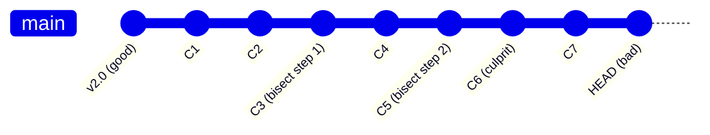

## Keywords in This File
{: .no_toc }

| # | Keyword | Difficulty |
|---|---------|------------|
| 14 | [Git Bisect and Blame for Bug Diagnosis](#git-bisect-and-blame-for-bug-diagnosis) | ★★☆ |
| 15 | [Reflog and Disaster Recovery](#reflog-and-disaster-recovery) | ★★☆ |

---

# Git Bisect and Blame for Bug Diagnosis

**Interview Question:** How do you use `git bisect` and `git blame` to
diagnose bugs in production?

**Interview Weight:** High - Debugging production regressions is a core
senior engineering skill. `git bisect` and `git blame` separate engineers
who find bugs quickly from those who guess.

---

**Difficulty:** ★★☆ | **Asked at:** Mid-Senior | **Seniority:** Mid-Senior

---

## Quick Reference Card

```
git bisect start
git bisect bad              # current commit is broken
git bisect good <sha>       # known good commit
# Git checks out midpoint; you test, then:
git bisect bad | good       # binary search continues
git bisect reset            # exit bisect mode
```

> **Code walkthrough:** `git bisect start` initializes binary search
mode. You mark the current HEAD as bad, and a known-good commit (e.g.,
last release tag) as good. Git checks out the midpoint between those
two points - approximately halving the search space each step. You test,
report bad/good, and Git navigates to the next midpoint. For a 1000-commit
range, bisect finds the culprit in 10 steps. WHAT BREAKS: if you mark a
commit incorrectly (misjudge good/bad), bisect will point to the wrong
commit - always use a reproducible test case, not manual observation.
TAKEAWAY: bisect turns O(n) blame archaeology into O(log n) regression
isolation.

---

### 🎯 Model Answer

**30 seconds:**
`git bisect` performs binary search through commit history to find the
first commit that introduced a bug. You mark a known-good and known-bad
commit, Git checks out the midpoint, you test and report, and Git
navigates to the next midpoint until the culprit commit is identified.
`git blame` shows which commit last modified each line of a file,
identifying who changed what and when.

**3 minutes (Senior):**
`git bisect` is the correct tool when you know a regression exists but
not where it was introduced. The workflow: `git bisect start`,
`git bisect bad` (current commit), `git bisect good <tag>` (last known
good release), then Git drives the binary search. After 10-15 steps for
a 1000-commit history, bisect points to the exact commit. You can
automate this with `git bisect run <script>` where the script exits 0
for good and non-zero for bad - this lets you bisect overnight for slow
test suites. `git bisect visualize` shows the remaining range in a
graphical log.

`git blame` answers a different question: "who wrote this line?" The
output shows commit SHA, author, date, and line content for every line
in a file. For production debugging, combine blame with `git show <sha>`
to see the full context of why the change was made. `git blame -L 40,60
src/Service.java` restricts to the relevant lines. Use `git log -S
"method_name"` (pickaxe search) to find all commits that added or
removed a specific string - this finds the commit that introduced a
method even if blame points to a later rename refactor.

**Framework:** WHAT (`git bisect` = binary search, `git blame` = line
authorship) - WHY (regression isolation without reading all commits) -
HOW (binary search workflow, blame + show, pickaxe) - TRADE-OFF (bisect
requires reproducible test; blame shows last modifier, not original
author) - EXAMPLE (10-step bisect for 1000-commit regression)

**Blank Mind Recovery:**

**(1) Restate:** "git bisect and blame for debugging - let me cover
bisect's binary search, blame's line authorship, and how they combine
for production bug diagnosis."

**(2) First principles:** "From first principles: a regression exists
somewhere in commit history. Testing every commit is O(n). Binary search
is O(log n). Git's commit DAG is ordered by time - bisect exploits this
ordering."

**(3) Bridge:** "So bisect is the answer for 'which commit broke this?'
and blame is the answer for 'who owns this code?' They solve different
but complementary debugging questions."

---

### 📘 Concept Explanation

#### 1. What It Is (Plain English)

`git bisect` is a binary search engine for commit history. You tell Git
one commit where a bug exists and one where it did not - bisect checks
out commits in the middle, halving the search space until it isolates
the exact commit that introduced the regression.

`git blame` annotates every line of a file with the commit that last
modified it. It answers: which commit changed this code, who authored
it, and when. The name is unfortunate - it is a diagnostic tool, not
an accusation tool.

#### 2. Why It Exists (The Problem It Solves)

Without `git bisect`, engineers manually read commit history - scanning
hundreds of commits, guessing likely suspects, checking diffs. This is
O(n) and error-prone. Bisect makes it O(log n) and systematic. For a
1000-commit range (typical between releases), bisect takes 10 steps vs
potentially 1000 manual checks.

Without `git blame`, understanding why a line exists requires reading
all related commits. Blame gives instant attribution, making code review
and post-incident analysis faster.

#### 3. Mental Model

```
                    GOOD              BAD
                    [v2.0]            [HEAD]
                      |                 |
  bisect range: C1-C2-C3-C4-C5-C6-C7-C8-C9
                              |
                       first midpoint
                       (C5: test here)
```



> **Diagram walkthrough:** WHAT IT DEPICTS: the binary search traversal
of a commit range between a known-good and known-bad commit. HOW TO READ
IT: each node is a commit; `v2.0` is the last known good state; `HEAD`
is the broken state; intermediate steps (C3, C5) are where Git checks
out for testing. KEY RELATIONSHIP: Git always picks the midpoint of the
remaining range, guaranteeing O(log n) steps to isolate the culprit.
EDGE CASE: if two commits look good in isolation but break together
(merge-dependent regression), bisect cannot find either alone - you need
to bisect the merge commit instead. INSIGHT: bisect only works reliably
if the good/bad signal is deterministic - flaky tests make bisect
converge on the wrong commit.

The bisect process is a binary search: each "bad" narrows the range to
the upper half; each "good" narrows to the lower half.

#### 4. Key Properties and Behaviors

**Bisect automation with `git bisect run`:**

```bash
# Automate bisect with a test script
git bisect run pwsh -File test_regression.ps1
# Script must exit 0 = good, 1-127 = bad, 125 = skip
```

> **Code walkthrough:** `git bisect run` drives the binary search
non-interactively. Git checks out each candidate commit and runs the
script. Exit 0 means good, any non-zero (except 125) means bad, and 125
means "skip this commit (cannot test)". WHY IT MATTERS: for test suites
taking 5+ minutes, automated bisect runs overnight and finds the culprit
commit by morning. WHAT BREAKS: if the build fails to compile at a
midpoint commit (unrelated to the regression), the script exits non-zero
and bisect marks that commit as bad - use exit 125 for untestable
commits. TAKEAWAY: always exit 125 (not 1) for build failures to avoid
false positives.

**Blame with line range and follow renames:**

```bash
# Blame lines 40-60 with rename following
git blame -L 40,60 --follow src/UserService.java
# Show blame ignoring whitespace changes
git blame -w src/UserService.java
# Show original file (before move)
git blame -C src/UserService.java
```

> **Code walkthrough:** `-L 40,60` restricts blame output to the
relevant lines. `--follow` tracks renames, showing the original commit
even when a file was moved. `-w` ignores whitespace-only commits (like
auto-formatting runs), revealing the actual logic change. `-C` detects
code copied from another file. WHY IT MATTERS: without `--follow`, blame
on a recently-renamed file shows the rename commit as the last modifier
for all lines - not useful. TAKEAWAY: always use `--follow` and `-w` in
production debugging to avoid noise from reformatting or rename commits.

**Pickaxe search for deleted or moved code:**

```bash
# Find commit that introduced a specific string
git log -S "processPayment" --all --oneline
# Find commits that changed a specific regex
git log -G "processPayment\(" --all --oneline
```

> **Code walkthrough:** `-S "string"` (pickaxe) finds commits where
the number of occurrences of the string changed. It finds the commit
that ADDED or REMOVED a method - even if blame only shows a later
reformatter. `-G "regex"` finds commits where the diff matches a regex.
WHY IT MATTERS: blame shows who last touched a line; pickaxe shows who
created or deleted a concept. For understanding why broken behavior
exists, often the creation commit is more informative than the last
modifier. TAKEAWAY: blame + pickaxe together cover both "who touched
this last" and "who introduced this originally."

#### 5. Real-World Analogy

> Binary search through commit history is like searching a phone book
for a name: instead of reading every entry, you open to the middle, see
if the name is before or after, then repeat on the relevant half. 1000
commits becomes 10 steps the same way 1000 pages becomes 10 page flips.

#### 6. Common Gotchas

1. **Bisect with flaky tests**: exit 125 (skip) for tests that
   non-deterministically fail. If you mark a flaky failure as "bad",
   bisect finds the wrong commit. Run tests 2-3 times at each bisect
   step before committing to good/bad.

2. **Blame vs original author**: blame shows the LAST modifier, not
   the original author. A code formatter or refactor commit can be the
   "blame" entry for lines written years earlier. Always check
   `git log --follow` for the full history of a file.

3. **Merge commits in bisect**: if the regression was introduced in a
   merge commit (not a feature commit), bisect may point to the merge
   itself. Use `git show --stat <merge-sha>` to see what the merge
   combined, then investigate the individual branches.

#### 7. Performance Considerations

- `git bisect` is O(log n) steps regardless of repository size.
- `git blame` on large files with long history is slow - use
  `--incremental` for streaming output.
- Annotated blame with `git blame --contents=file.tmp` avoids the slow
  walk when you want to test blame against a modified version.

#### 8. Ecosystem Integration

**IDE integration:** VS Code shows git blame inline (GitLens extension).
IntelliJ shows blame in the gutter. Both use the same `git blame` output
but surface it without terminal workflow.

**CI/CD use:** `git bisect run` can be invoked in a CI pipeline job to
automatically bisect a regression across a nightly test suite.

---

### 💻 Code Example

**SCENARIO: Production search returns wrong results after recent deploy.**

```bash
# BAD: manual commit inspection (O(n))
git log --oneline | grep -i search
# Reading 50 commits manually... guessing...
```

> **Code walkthrough:** This BAD approach is O(n) manual work. Each
commit requires reading the diff and guessing if it affects search. For
50 commits, this takes 30-60 minutes with high error rate. WHAT BREAKS:
humans are bad at reading diffs without context; important but subtle
changes are missed. TAKEAWAY: never manually scan commit history when
the problem has a reproducible test case - use bisect.

```bash
# GOOD: git bisect binary search
git bisect start
git bisect bad                    # current HEAD is broken
git bisect good v3.1.0           # last release tag was fine

# Git checks out midpoint (~25 commits back)
# Test the search functionality: broken? good?
git bisect bad

# Git checks out new midpoint (~13 commits back)
# Test again: working?
git bisect good

# ... ~3-4 more steps ...
# Git announces: abc1234 is the first bad commit

git bisect reset                 # return to HEAD
git show abc1234                 # inspect the culprit
```

> **Code walkthrough:** `git bisect start` + bad/good marks bound the
search range. Git computes midpoints using the commit graph - for 50
commits this is 6 steps. After each step, you test the specific
regression (run the search query, check the result). When bisect names
a commit, `git show abc1234` shows exactly what changed. WHY IT MATTERS:
6 minutes vs 60 minutes, and no guessing. WHAT BREAKS: if the code
does not compile at a midpoint (unrelated break), mark it with
`git bisect skip` to skip it. TAKEAWAY: always use `git bisect bad/good`
not `git bisect skip` unless the commit is genuinely untestable.

```bash
# Automated bisect: run script at each step
cat > check_search.sh << 'EOF'
mvn test -pl search-service -Dtest=SearchIntegrationTest \
  -q 2>/dev/null
EOF
chmod +x check_search.sh
git bisect run ./check_search.sh
```

> **Code walkthrough:** `git bisect run` with a script fully automates
the search. The script runs `mvn test` (exit 0 = pass = good,
non-zero = fail = bad). Git drives the entire binary search
non-interactively. WHY IT MATTERS: for 5-minute test suites, automated
bisect across 100 commits completes in 35 minutes (7 steps * 5min) vs
days of manual investigation. TAKEAWAY: always try to write a bisect
script - even a simple `curl | grep` check is better than manual testing
at each step.

```bash
# git blame for the identified file
git blame -L 45,65 --follow -w \
  src/search/SearchService.java

# Output shows:
# abc1234 (Dev Name 2024-01-15 45) indexQuery(field, boost);
# def5678 (Dev Name 2024-01-10 46) ...
```

> **Code walkthrough:** After bisect finds the commit (`abc1234`), blame
on the modified file confirms which specific line changed. `-w` ignores
whitespace so reformatting commits do not appear as the "last modifier."
`--follow` tracks the file through any renames. WHY IT MATTERS: blame
narrows from "the whole commit" to "this exact line" - useful when a
commit touches 20 files but only one line matters. TAKEAWAY: bisect
finds the commit; blame finds the line within the commit.

---

### 🎓 Answers by Seniority

**Junior / Mid (0-5 years):**

A junior can explain `git blame` (line-level authorship) and basic
bisect workflow (start, mark good/bad, reset). They should be able to
run bisect manually and interpret the result. Red flag: thinking blame
automatically finds the bug author without understanding the last-modifier
issue.

**Senior / Staff (5+ years):**

A senior engineer can automate bisect with scripts, knows `-S` pickaxe
for searching deleted code, understands blame's `--follow` and `-w` flags
for accurate attribution, and can explain bisect's O(log n) complexity.
They can debug bisect failures (flaky tests, compile errors at midpoints)
and know when bisect is NOT the right tool (e.g., when the regression is
in configuration, not code).

---

### ⚠️ Common Misconceptions

**Misconception 1: "git blame shows the author who wrote the code."**

Blame shows the LAST commit that modified a line. A reformatting commit,
a global rename, or a search-and-replace can all appear as the "blame"
for lines originally written years earlier. Always check
`git log --follow -p src/file.java` for the full mutation history.

---

**Misconception 2: "git bisect always finds the right commit."**

Bisect relies on a consistent good/bad signal. If the regression is
intermittent (timing-dependent, race condition) or if you mismark a
commit, bisect converges on the wrong commit. For flaky regressions,
use `git bisect run` with a retry script that runs the test 3 times and
only reports bad if all 3 fail.

---

**Misconception 3: "git bisect requires manual checkout per step."**

`git bisect run <script>` fully automates the binary search. The script
just needs to exit 0 (good) or non-zero (bad). A CI job can even trigger
a bisect run and post the result as a PR comment.

---

### 🚨 Failure Modes and Diagnosis

**Failure: Bisect points to a commit that "looks fine."**

Root cause: usually a flaky test or a compile failure at a midpoint that
was marked bad instead of skipped.

Diagnosis:
```bash
# Check if the bisect log shows any unexpected jumps
git bisect log
# Re-examine the "culprit" commit
git show <sha> --stat
```

> **Code walkthrough:** `git bisect log` shows the full bisect session
- every good/bad mark and checkout. Reviewing the log often reveals a
mismarked step. The fix: `git bisect replay bisect.log` with a corrected
log file. WHY IT MATTERS: a mismarked bisect wastes more time than not
using bisect. TAKEAWAY: log every bisect session for reproducibility.

Fix: use `git bisect skip` for commits that cannot be reliably tested.
Run `git bisect run` with retry logic for flaky suites.

---

**Failure: `git blame` shows a whitespace/formatting commit as
"responsible" for a bug.**

Diagnosis:
```bash
git blame -w --follow src/Service.java
# -w ignores whitespace; shows the real logic commit
git log --diff-filter=M --follow -p src/Service.java \
  | grep -A5 "processPayment"
```

> **Code walkthrough:** `-w` in blame ignores whitespace-only changes,
skipping past formatting commits to the last substantive change. The
`git log --diff-filter=M --follow -p` shows the full mutation history
for a specific pattern, revealing the original author even through
renames. WHY IT MATTERS: large-scale reformatting runs (e.g., Google's
clang-format sweep) can make blame useless for entire codebases without
`-w`. TAKEAWAY: always add `-w --follow` to your blame alias.

---

### 🎯 Interview Deep-Dive

| Category | Count | Coverage |
|---|---|---|
| Mechanism | 2 | bisect binary search, blame attribution |
| Application | 2 | production debugging workflow |
| Trade-off | 2 | bisect limits, blame accuracy |
| Debugging | 2 | failure modes and diagnosis |
| Behavioral | 1 | real incident |

---

**[MID] Q1 - How does `git bisect` determine which commit to check
out next?**

`git bisect` maintains an ordered list of the commits in the range
between the known-good and known-bad commits. At each step, it selects
the commit that splits the remaining set approximately in half - the
median of the remaining candidates. After marking a commit good or bad,
it discards the half that cannot contain the regression and repeats.

The "bisect" is not simply median of line numbers - Git uses the commit
graph to find the commit where approximately half the remaining commits
are ancestors. This handles branchy histories correctly, where simply
picking the middle SHA would not work. `git bisect visualize` shows the
remaining candidates in gitk so you can see the current range.

The bisect state is stored in `.git/BISECT_LOG`, `.git/BISECT_GOOD`,
and `.git/BISECT_BAD`. If you lose your terminal session mid-bisect,
you can resume with `git bisect replay .git/BISECT_LOG`.

For a linear history of n commits, bisect takes ceil(log2(n)) steps.
For 1000 commits: 10 steps. For 1 million commits: 20 steps.

*What separates good from great:* knowing that bisect uses the commit
graph, not linear SHA ordering, and understanding the state files so
you can resume or audit a bisect session.

---

**[MID] Q2 - What is the difference between `git blame` and
`git log -S`?**

`git blame` answers: "what is the most recent commit that modified this
specific line?" It shows the current state of attribution for every line
in a file.

`git log -S "string"` (pickaxe) answers: "which commit added or removed
this specific string anywhere in the codebase?" It finds commits where
the count of occurrences of the string changed - i.e., commits that
introduced or deleted the code.

When to use each:
- **Blame**: you have a buggy line and want to know who last changed it
  and what commit introduced this version.
- **Pickaxe**: the bug may have been fixed and re-introduced, or the
  relevant code was deleted - you want the full history of a concept
  across all commits and files.

Example: blame on a deleted method returns nothing (the file no longer
has that line). Pickaxe finds the commit that deleted it.

```bash
# Pickaxe: find when "processPayment" was added
git log -S "processPayment" --oneline --all
# Regex pickaxe: find when the method signature changed
git log -G "processPayment\(String" --oneline --all
```

> **Code walkthrough:** `-S` finds exact string changes (count changed);
`-G` finds commits where the diff text matches a regex. `-S` is faster
for exact strings; `-G` is needed for patterns. WHY IT MATTERS: blame
only works on existing code; pickaxe works on deleted, moved, or
refactored code. TAKEAWAY: blame and pickaxe are complementary - use
both in complex investigations.

*What separates good from great:* knowing pickaxe exists and the
difference between `-S` (count changed) and `-G` (diff matches regex).

---

**[SENIOR] Q3 - How do you bisect when tests are flaky?**

Flaky tests break bisect because they produce unreliable good/bad
signals. Three approaches:

1. **Exit 125 (skip)**: if you cannot reliably determine good/bad for a
   commit (flaky test, compile failure, unrelated failure), exit 125
   from the bisect run script. Git marks the commit as "untestable" and
   picks the next best midpoint. This loses some efficiency but avoids
   false positives.

2. **Retry logic in the script**: run the test 3-5 times and only return
   non-zero if it fails more than half the time:
   ```bash
   FAILS=0; RUNS=5
   for i in $(seq 1 $RUNS); do
     ./run_test.sh || FAILS=$((FAILS+1))
   done
   # Report bad only if majority of runs failed
   [ $FAILS -gt $((RUNS/2)) ] && exit 1 || exit 0
   ```

   > **Code walkthrough:** This retry script runs the test RUNS times and counts failures. If more than half fail, it exits 1 (bad), otherwise 0 (good). The KEY MECHANISM: a single failure is ignored; only a majority of failures confirms the regression. WHY IT MATTERS: for a 20% flaky test, 5 runs with majority-vote reduces false-positive rate from 20% to under 1%. WHAT BREAKS: the script is slower (5x test runtime per bisect step). TAKEAWAY: always use retry logic in bisect scripts for any test with observable flakiness.

3. **Fix the flakiness first**: if the test is reproducibly flaky for
   10+ commits in the range, bisect will not converge. Fix the test
   before bisecting. This may seem like extra work, but a reliable bisect
   is faster than a flaky bisect.

For race conditions, use `--icount=N` in some CI systems to run the
test N times per commit and combine results.

*What separates good from great:* understanding that flaky tests are a
bisect-breaker and having concrete mitigation strategies, not just
"use a better test."

---

**[SENIOR] Q4 - How do you investigate a regression that was introduced
by a merge commit, not a feature commit?**

When bisect points to a merge commit, the regression was introduced by
the combination of two branches, not any single commit on either branch.
This is a "semantic conflict" - both branches are fine individually but
conflict when combined.

Investigation approach:

1. **Check out each parent individually**: a merge commit has 2 parents.
   Test parent 1 (the branch that was merged into), test parent 2 (the
   branch that was merged). If both are good but the merge is bad, the
   regression is in the merge interaction.

2. **Examine the merge diff**: `git diff HEAD~1 HEAD` shows what the
   merge actually changed vs the pre-merge state.

3. **Check for semantic conflicts**: look for cases where both branches
   touched the same data structure or shared state in ways that combine
   incorrectly - even without textual conflicts.

4. **Use `git rerere`**: for recurring merge conflicts in the same area,
   `git rerere` (reuse recorded resolution) records and replays conflict
   resolutions, reducing the chance of repeated semantic conflicts.

*What separates good from great:* understanding that merge bisect
requires checking both parents, and knowing that "no conflict" at merge
time does not mean "no semantic conflict."

---

**[SENIOR] Q5 - When is `git bisect` NOT the right tool?**

Bisect requires: (1) a reproducible test case, (2) a known-good
historical state, (3) the regression is in code (not configuration,
data, or infrastructure).

Bisect is NOT right when:
- **No reproducible test**: if you cannot write a script that reliably
  exits 0/non-zero based on good/bad, bisect converges on noise.
- **Configuration regression**: the bug is in a database value, env var,
  or feature flag that was changed separately from code. Git bisect only
  rewinds code, not environment.
- **Data regression**: wrong results due to a data migration or corrupt
  record. Rewinding code does not rewind data.
- **Infrastructure regression**: a load balancer config, CDN cache, or
  OS upgrade caused the issue. Git history has no record.
- **No good historical commit**: if the codebase has never had a working
  state for this feature (new feature regression), there is no good
  anchor to bisect from.

The diagnostic question: "If I could run any historical version of the
code against production RIGHT NOW, would the bug disappear?" If no,
the issue is not in the code history.

*What separates good from great:* knowing the pre-conditions for bisect
and reaching for it only when those pre-conditions are met.

---

**[STAFF] Q6 - How would you set up a systematic bisect workflow for
a large team?**

A systematic bisect workflow for teams:

1. **Tag every release**: `git tag v3.1.0 HEAD` at release time. This
   creates reliable "known good" anchors. Bisect without tags forces
   engineers to guess which historical SHA was good.

2. **Standardize the bisect script format**: a `scripts/bisect.sh` in
   the repo that takes a test name as argument and exits 0/non-zero.
   Teams should not write ad-hoc scripts for each bisect.

3. **Record bisect sessions**: `git bisect log > bisect_session.log`
   at the end of every bisect. Attach to the incident postmortem. This
   creates an audit trail of how the culprit commit was identified.

4. **Integrate with incident workflow**: when a production incident is
   opened, the incident template includes: "Have you run git bisect?"
   with steps. This normalizes bisect as the first debugging step.

5. **Maintain a bisect CI job**: a CI pipeline that runs bisect
   automatically when a regression test fails. The job bisects the last
   N commits and posts the result as a PR comment or Slack message.

*What separates good from great:* treating bisect as a process, not a
one-off command - with standardized tooling, session recording, and
CI integration.

---

**[STAFF] Q7 - How does `git blame` interact with large-scale
refactoring or reformatting?**

Large-scale reformatting (gofmt, clang-format, Prettier) creates
"blame pollution" - every line in a reformatted file shows the
reformatting commit, not the original author.

Solutions:

1. **`git blame -w`**: ignore whitespace changes. Works for formatting
   that only changes whitespace (indentation, line wrapping).

2. **`.git-blame-ignore-revs`** (Git 2.23+): a file in the repo root
   listing SHAs of commits to ignore in blame output. GitHub and GitLab
   UI honor this file natively.
   ```
   # .git-blame-ignore-revs
   # 2024-01-15: global clang-format run
   abc123def456789...
   ```
   ```bash
   git blame --ignore-revs-file .git-blame-ignore-revs src/Service.java
   ```

   > **Code walkthrough:** `git blame --ignore-revs-file` skips all commits listed in `.git-blame-ignore-revs` when computing line attribution, showing the last substantive change instead of the formatting commit. The KEY MECHANISM: `.git-blame-ignore-revs` is committed to the repo, so all team members and IDE integrations (GitHub, GitLab, JetBrains) automatically skip the reformatting commits. WHY IT MATTERS: one large reformatting commit can make blame useless for thousands of files. TAKEAWAY: add reformatting commit SHAs to `.git-blame-ignore-revs` immediately after every large-scale format run.

3. **Configure globally**: `git config blame.ignoreRevsFile
   .git-blame-ignore-revs` so all team blame commands automatically
   skip the reformatting commits.

Every team doing large-scale reformatting should add the reformatting
SHAs to `.git-blame-ignore-revs` and commit that file to the repo.
Failing to do this makes blame useless for the entire reformatted
codebase.

*What separates good from great:* knowing `.git-blame-ignore-revs`
exists and having a team process to maintain it during reformatting.

---

**[STAFF] Q8 - Describe a production incident you debugged using
`git bisect`.**

[BEHAVIORAL]

**S:** A search ranking algorithm returned incorrect results after a
deploy. User engagement dropped 15% within 2 hours. The change
happened somewhere in the last 80 commits (4 weeks of development).

**T:** I was the on-call engineer responsible for finding and reverting
the regression.

**A:** I wrote a test script that called the search API with a known
query and checked if the top result was the expected document (exit 0)
or wrong (exit 1). I ran `git bisect start`, marked HEAD as bad, and
marked the last release tag as good. Git began the binary search.

Step 3 of bisect pointed to a commit that added "boost scoring" to
the search index. I ran the test script manually - it failed. I marked
it bad. Step 5 pointed to the commit that introduced the ranking change.
The test script failed again.

After 7 steps, bisect identified a commit: a 3-line change that updated
the scoring weight for title matches from 2.0 to 0.2. The developer had
accidentally transposed the decimal. The ranking degraded because title
matches now had 10x lower weight than before.

I reverted the commit with `git revert`, deployed, and confirmed the fix
within 20 minutes of starting bisect.

**R:** Mean time to identification was 25 minutes using bisect vs an
estimated 2+ hours of manual log scanning. The postmortem added a
regression test for search ranking accuracy to prevent future similar
issues.

*What separates good from great:* having a bisect script ready to write
within 5 minutes, and starting bisect as the FIRST diagnostic step
rather than a last resort.

---

**[STAFF] Q9 - How do you trace a bug in code that was refactored
across multiple files?**

Refactoring moves code between files, renames methods, and reorganizes
modules. Standard blame and bisect work on file contents, but refactoring
can break both tools.

**Multi-file investigation strategy:**

1. **Follow renames**: `git log --follow -p src/NewService.java` follows
   the file through renames, showing history from when the code was in
   `OldService.java`.

2. **Blame with `-C` flag**: detects code that was copied or moved from
   another file. `git blame -C src/NewService.java` attributes copied
   lines to their original source file and commit.

3. **Pickaxe across all history**: `git log -S "processPayment" --all`
   searches all branches and all history for when a specific function
   was added, regardless of file location.

4. **Use `git log --pickaxe-all`**: shows all files in commits where
   the string count changed - useful for tracking a function across a
   large refactor.

5. **Combine with IDEs**: IntelliJ's "Annotate with Git Blame" shows
   blame inline and supports clicking through to see the full commit,
   which often links to related changes via the commit message.

For very complex refactors (breaking a monolith into microservices),
the code history may be split across repository boundaries. In this case,
blame in the new repo only goes back to the migration commit. The old
repo must be checked for the full history.

*What separates good from great:* using `-C` flag in blame for
copy-detection, and understanding repository boundary limitations when
code migrates between repos.

---

### ⚖️ Comparison Table

| | `git bisect` | `git blame` | `git log -S` |
|---|---|---|---|
| Question answered | Which commit broke it? | Who last changed this line? | When was this code added? |
| Search strategy | Binary search (O(log n)) | Per-line attribution | Commit scan (O(n)) |
| Works on deleted code | Yes (history intact) | No (file must exist) | Yes (all history) |
| Automation | `git bisect run <script>` | Not applicable | Grep/scripting |
| Handles renames | With `git bisect` graph | `--follow` flag | `--follow` flag |
| Flaky test resilience | Needs retry logic | Not applicable | Not applicable |
| Best for | Regression isolation | Code ownership review | Code archaeology |

---

### 🏛️ System Design

*(Omit: Not a ★★★ keyword.)*

---

### 📊 Diagram

*(Omit: Diagrams included in the Concept Explanation section.)*

---
---

# Reflog and Disaster Recovery

**Interview Question:** How do you use `git reflog` to recover from
accidental resets, force pushes, and lost commits?

**Interview Weight:** High - "I deleted my work" incidents happen to
every engineer. Senior engineers know reflog instantly recovers lost
commits. This distinguishes panic from professional composure.

---

**Difficulty:** ★★☆ | **Asked at:** Mid-Senior | **Seniority:** Mid-Senior

---

## Quick Reference Card

```
git reflog                     # show HEAD movement history
git checkout HEAD@{3}          # go back 3 HEAD positions
git branch recovered HEAD@{3}  # recover to new branch
git reflog expire --expire=90d # prune reflog older than 90 days
git fsck --lost-found          # find dangling objects
```

> **Code walkthrough:** `git reflog` shows every position HEAD has been
at - in chronological order with a `HEAD@{N}` reference. `HEAD@{0}` is
current, `HEAD@{1}` is one move ago. `git checkout HEAD@{3}` goes back
to where HEAD was 3 moves ago, allowing recovery of "lost" commits.
`git branch recovered HEAD@{3}` creates a branch at that point.
WHY IT MATTERS: reflog has a 90-day default expiry, so commits that
have not been GC'd are always recoverable. WHAT BREAKS: reflog is
LOCAL - it does not sync with remotes. After a clone or `git gc
--aggressive`, reflog may not cover older positions. TAKEAWAY: reflog
is your local undo history for almost any Git disaster.

---

### 🎯 Model Answer

**30 seconds:**
`git reflog` records every position HEAD has been at on your local
machine. Even after `git reset --hard`, `git rebase`, or accidental
branch deletion, the commits still exist in Git's object store for
90 days. Reflog shows the SHA you need to recover them.

**3 minutes (Senior):**
Git never immediately deletes objects - it marks them as unreachable.
Unreachable commits survive until garbage collection (`git gc`) runs,
which respects the reflog expiry (default 90 days). `git reflog` shows
HEAD movement: every checkout, reset, commit, merge, and rebase is
recorded. Each entry has a `HEAD@{N}` reference and a SHA.

Recovery workflow: `git reflog` - find the last good state - `git
branch recover-branch HEAD@{5}` or `git reset --hard HEAD@{5}`.
For force-pushed remote branches, the situation is more complex: the
REMOTE reflog (if available on the server) has the pushed SHA, and you
can force-push back. GitHub and GitLab retain 30+ days of reflog on
the server.

For the worst case (no reflog, GC already ran): `git fsck
--lost-found` walks the entire object database and collects all
dangling (unreachable) objects into `.git/lost-found/commit/`.

**Framework:** WHAT (reflog = HEAD movement history) - WHY (commits
survive 90 days after becoming unreachable) - HOW (reflog + branch
recovery, fsck for worst case) - TRADE-OFF (local only, expiry-based)
- EXAMPLE (reset --hard recovery workflow)

**Blank Mind Recovery:**

**(1) Restate:** "Reflog and disaster recovery - let me cover what
reflog records, the 90-day expiry model, recovery commands, and the
fsck fallback."

**(2) First principles:** "From first principles: Git stores objects
as content-addressable blobs. A 'lost' commit still exists in the
object store - it just has no branch or tag pointing to it. Reflog
tracks the pointers, not the objects."

**(3) Bridge:** "So reflog is the index for 'recent pointers.' fsck
is the brute-force scan for 'any object that exists but is not
referenced.' Together they cover all recovery scenarios."

---

### 📘 Concept Explanation

#### 1. What It Is (Plain English)

The reflog is a local log of every time a Git reference (HEAD, branch
pointers) moved. Think of it as Git's "browser history" - every
checkout, reset, commit, rebase, and merge is recorded. Unlike
`git log` (which follows the current branch), reflog shows where HEAD
HAS BEEN, not just where it is now.

#### 2. Why It Exists (The Problem It Solves)

Engineers accidentally delete branches, `git reset --hard` past work,
rebase incorrectly, or force-push over important commits. Without
reflog, these operations lose work permanently (until GC). With
reflog, any operation from the last 90 days is recoverable with a
single `git checkout` and `git branch`.

#### 3. Mental Model

```
Reflog is Git's Undo History (local machine only):
  HEAD@{0} = current HEAD = abc123
  HEAD@{1} = HEAD before last commit = def456
  HEAD@{2} = HEAD before checkout = ghi789
  HEAD@{3} = HEAD before reset --hard = jkl012
                                          ^
                             This is the commit you "lost"
```

> **Diagram walkthrough:** WHAT IT DEPICTS: the reflog as a timeline of
HEAD positions, where each `HEAD@{N}` is a previous state. HOW TO READ
IT: `HEAD@{0}` is now; increasing N goes further back in time. KEY
RELATIONSHIP: the SHAs in the reflog still exist in the object store
even after branch/tag deletion or reset. EDGE CASE: after `git gc
--aggressive`, the reflog is pruned by its expiry date - objects
referenced by reflog entries within 90 days survive. INSIGHT: reflog
shows that `git reset --hard` does not delete commits - it only moves
the branch pointer, leaving the previous HEAD accessible via reflog.

#### 4. Key Properties and Behaviors

**Recovery after `git reset --hard`:**

```bash
# After accidentally resetting:
# git reset --hard HEAD~10 (lost 10 commits!)

# Recovery: find the last good SHA
git reflog
# HEAD@{0}: reset: moving to HEAD~10
# HEAD@{1}: commit: add payment service  <- THIS IS WHAT WE LOST
# HEAD@{2}: commit: add auth middleware

# Recover by creating a branch
git branch recovery-branch HEAD@{1}
# Or directly reset back
git reset --hard HEAD@{1}
```

> **Code walkthrough:** `git reflog` shows `HEAD@{1}` was the state
before the accidental reset - it contains the "lost" 10 commits.
`git branch recovery-branch HEAD@{1}` creates a branch at that point
without moving HEAD, so you can inspect it safely. `git reset --hard
HEAD@{1}` moves HEAD back to the pre-reset state, restoring all
commits. WHY IT MATTERS: `git reset --hard HEAD~10` LOOKS destructive
but is completely reversible within 90 days. TAKEAWAY: nothing in Git
is truly lost until GC runs and reflog expires.

**Recovery after accidental branch deletion:**

```bash
# Accidentally deleted feature branch
git branch -D feature/payment-service

# Find the tip of the deleted branch in reflog
git reflog | grep "feature/payment"
# HEAD@{7}: checkout: moving from feature/payment-service to main
# The SHA before this checkout is the branch tip

# Restore the branch
git checkout -b feature/payment-service HEAD@{7}
```

> **Code walkthrough:** When a branch is deleted, its tip commit still
exists in the object store. Reflog's checkout entries show the exact
moment you moved away from the branch, which means `HEAD@{7}` was the
branch tip. Creating a new branch at that SHA fully restores the branch
including all its commits. WHY IT MATTERS: `git branch -D` is often
used without warning - it deletes without confirmation. Reflog makes
this a non-emergency. WHAT BREAKS: if you ran `git gc` after deletion,
the reflog entry may be expired and the object GC'd - check age of
deletion. TAKEAWAY: before running `git gc`, always check if there are
recently-deleted branches that may need recovery.

**`git fsck` for worst-case recovery:**

```bash
# If reflog has expired (>90 days) or GC was run
git fsck --lost-found
# Finds dangling commits, blobs, and trees
# Places them in .git/lost-found/commit/

# Examine a dangling commit
git log --format="%H %ci %s" .git/lost-found/commit/*
git show <sha>
```

> **Code walkthrough:** `git fsck --lost-found` walks all objects in
the object database and identifies objects not referenced by any branch,
tag, or reflog entry. "Dangling" objects are output and copied to
`.git/lost-found/`. After GC, these objects are gone permanently.
WHY IT MATTERS: fsck is the last resort when reflog is unavailable.
WHAT BREAKS: `git gc --prune=now` immediately deletes all unreachable
objects - bypassing the 90-day grace period. TAKEAWAY: never run
`git gc --prune=now` on a repository with recent uncommitted work.

#### 5. Real-World Analogy

> Reflog is the Recycle Bin for Git operations. When you delete a file
in Windows, it goes to the Recycle Bin and stays there until you empty
it. When you lose a commit in Git, it goes to the "Reflog Bin" and
stays there for 90 days. Just as you can restore from the Recycle Bin
before emptying it, you can restore commits from reflog before GC runs.

#### 6. Common Gotchas

1. **Reflog is local only**: after a clone or on a CI machine, there
   is no reflog for operations that happened elsewhere. Remote reflog
   (GitHub/GitLab) is separate and may cover 30+ days.

2. **`git gc --prune=now` bypasses grace period**: normally GC waits
   90 days. `--prune=now` immediately deletes all unreachable objects.
   Never run this on a machine where recent work might be unreachable.

3. **Stash is in reflog**: `git stash list` shows stashes, but
   `git reflog refs/stash` shows the full stash history including
   dropped stashes. A dropped stash can be recovered if the GC has
   not run.

#### 7. Performance Considerations

- Reflog adds negligible storage overhead for normal development.
- Large numbers of stashes or high-frequency automated commits
  can create large reflogs. `git reflog expire --expire=30d` reduces
  the reflog to 30 days.
- `git fsck` on very large repositories can be slow (minutes to hours)
  due to scanning all objects.

#### 8. Ecosystem Integration

**GitHub/GitLab server-side reflog**: remote servers maintain their
own reflog. GitHub's "Restore" button for deleted branches uses this.
Force-pushed commits can be recovered through the web UI or API for
30 days after the push.

---

### 💻 Code Example

**SCENARIO: Engineer accidentally ran `git reset --hard HEAD~20` and
panicked. Need full recovery.**

```bash
# SITUATION: The engineer ran:
git reset --hard HEAD~20
# Now running 'git log' shows work missing!

# BAD: Assume the work is permanently lost
# and start manually re-implementing
```

> **Code walkthrough:** This BAD reaction wastes time and creates
recreated code that may differ from the original. The KEY MISTAKE:
thinking `git reset --hard` is irreversible. WHY IT MATTERS: engineers
who do not know reflog waste hours re-implementing lost work. TAKEAWAY:
`git reset --hard` NEVER permanently deletes commits - they remain in
the object store.

```bash
# GOOD: Use reflog to recover in 2 minutes

# Step 1: Examine reflog to find pre-reset state
git reflog
# Output:
# abc123 HEAD@{0}: reset: moving to HEAD~20
# def456 HEAD@{1}: commit: fix payment webhook
# ghi789 HEAD@{2}: commit: add retry logic
# ...

# Step 2: Create a recovery branch at pre-reset state
git branch recovery-work HEAD@{1}

# Step 3: Verify the recovered branch has the work
git log recovery-work --oneline -5

# Step 4: Merge or reset to restore work
git reset --hard HEAD@{1}
# OR if you want to review first:
git diff HEAD recovery-work
git merge recovery-work
```

> **Code walkthrough:** `git reflog` shows `HEAD@{0}` as the reset
operation and `HEAD@{1}` as the state before the reset. Creating a
branch at `HEAD@{1}` safely checkpoints the recovery target. `git log
recovery-work` confirms the work is there. `git reset --hard HEAD@{1}`
restores the working state entirely. WHY IT MATTERS: 2 minutes of reflog
recovery vs hours of re-implementation. WHAT BREAKS: if reflog is not
available (fresh clone or old operation), you need `git fsck`. TAKEAWAY:
reflog entry `HEAD@{1}` is always the state immediately before the
most-recent operation.

---

### 🎓 Answers by Seniority

**Junior / Mid (0-5 years):**

A junior should know `git reflog` exists and can run it to see HEAD
history. They should be able to identify the pre-disaster SHA and
create a branch to recover. Red flag: running `git push --force` to
try to "undo" a bad state on the remote without understanding that it
permanently loses the remote history for other collaborators.

**Senior / Staff (5+ years):**

A senior engineer knows the full recovery toolkit: reflog for local
disasters, remote reflog (GitHub API) for force-push recovery, and
`git fsck --lost-found` for worst-case scenarios. They know the 90-day
GC window and can explain why `git gc --prune=now` is dangerous. They
can explain the difference between recovering a reset commit and
recovering a force-pushed remote branch (different tools needed).

---

### ⚠️ Common Misconceptions

**Misconception 1: "`git reset --hard` permanently deletes commits."**

`git reset --hard HEAD~N` moves the branch pointer back N commits. The
commits still exist in the object store - they just have no branch
pointer. Reflog records the pre-reset SHA for 90 days, and the
objects survive until GC. Permanently deleting requires BOTH reflog
expiry AND `git gc` to run.

---

**Misconception 2: "`git reflog` is the same as `git log`."**

`git log` shows the commit history of the current branch in DAG order.
`git reflog` shows HEAD movement history - including checkouts, resets,
and rebases that change where HEAD is pointing without necessarily
changing the commit graph. Reflog shows things `git log` does not:
detached HEAD states, reset operations, and branch switching.

---

**Misconception 3: "Force pushing to recover a remote branch is safe
if it is my own branch."**

Force-pushing to a shared branch (even if you think you are the only
one using it) can lose other people's work if they pushed while you
were not watching. Always use `--force-with-lease` instead of
`--force`. `--force-with-lease` rejects the push if the remote branch
has commits you have not fetched, preventing accidental overwrite.

---

### 🚨 Failure Modes and Diagnosis

**Failure: Reflog shows the operation but `git checkout HEAD@{N}`
says "unknown revision."**

Root cause: GC was run, or the reflog for that ref has expired.

Diagnosis:
```bash
# Check if the object still exists
git cat-file -t <sha>
# If "fatal: Not a valid object name" -> GC already deleted it
# Try fsck as last resort
git fsck --lost-found
ls .git/lost-found/commit/
```

> **Code walkthrough:** `git cat-file -t <sha>` attempts to look up
the object type. If it fails, the object no longer exists in the store.
`git fsck --lost-found` scans for any remaining dangling objects - this
may still find the commit if GC has not run yet (objects can be
dangling without reflog entry). WHY IT MATTERS: distinguishing "reflog
entry exists but object is gone" from "reflog expired but object is
still there" changes the recovery approach. TAKEAWAY: run fsck
immediately after a GC scare to determine if recovery is still possible.

---

**Failure: Remote branch was force-pushed over by a colleague, losing
commits.**

```bash
# Check the remote reflog (GitHub API example)
gh api /repos/:owner/:repo/git/refs/heads/main
# GitHub keeps 30+ days of push history in the API

# Alternative: check your colleague's local reflog
# (if accessible)
ssh colleague-machine
cd /path/to/repo
git reflog | grep "main"
```

> **Code walkthrough:** GitHub's API exposes the full push history for
branches, allowing recovery of SHA values that were force-pushed over.
The `gh api` call returns the current ref object; the full history is
available via the events API or ref-log API. WHY IT MATTERS: force-push
recovery requires the pre-push SHA, which exists in the remote event
log even if local reflog does not have it. TAKEAWAY: for remote
disasters, the server-side event log is the recovery tool; for local
disasters, local reflog is the tool.

---

### 🎯 Interview Deep-Dive

| Category | Count | Coverage |
|---|---|---|
| Mechanism | 2 | reflog structure, GC interaction |
| Application | 2 | recovery workflows |
| Trade-off | 2 | reflog limits, force-push safety |
| Debugging | 2 | failure modes |
| Behavioral | 1 | incident recovery story |

---

**[MID] Q1 - What is the difference between `git reflog` and
`git log`?**

`git log` shows the commit history of the current branch - the DAG of
commits reachable from HEAD following parent pointers. It shows the
history of the code.

`git reflog` shows the history of HEAD's position - every time HEAD
moved, regardless of why. It includes checkout operations, resets,
rebases, and cherry-picks that do not add commits to the current branch's
history.

Example: after `git rebase`, `git log` shows the new linear history.
`git reflog` shows the rebased history AND the pre-rebase original
commits (accessible as `HEAD@{N}` entries from before the rebase).

Use `git log` to understand code history.
Use `git reflog` to understand "what did I do and where was I?"

*What separates good from great:* understanding that reflog covers
operations that log cannot - including detached HEAD states and
operations that rewrite history.

---

**[MID] Q2 - How long are commits retained after becoming unreachable?**

Unreachable commits survive until `git gc` runs AND the reflog for those
commits has expired. The default reflog expiry is 90 days for reachable
commits and 30 days for unreachable ones (`gc.reflogExpire` and
`gc.reflogExpireUnreachable` in git config).

`git gc` runs automatically during fetch and push operations when the
number of loose objects exceeds a threshold (`gc.auto = 6700`). However,
it honors the reflog expiry - it will not delete objects referenced by
unexpired reflog entries.

The absolute worst case: `git gc --prune=now` bypasses all grace periods
and immediately deletes all unreachable objects. This is the only way
to permanently lose commits before the 90-day window closes.

For enterprise use: increase `gc.reflogExpireUnreachable` to 90 days
to match the reachable expiry, giving full 90-day recovery window.

*What separates good from great:* knowing the `gc.reflogExpire` config
values and the dangerous `--prune=now` flag.

---

**[SENIOR] Q3 - How do you recover a branch that was accidentally
deleted on the remote?**

Remote branch deletion is more complex than local deletion because
the remote reflog is on the server.

Recovery paths:

1. **From a colleague's local fetch**: anyone who had fetched the branch
   before deletion still has the tip SHA in their
   `.git/refs/remotes/origin/<branch-name>`. Run
   `git push origin <sha>:refs/heads/<branch-name>` to restore the
   remote branch.

2. **From GitHub/GitLab UI**: both platforms have a "Restore" button for
   recently-deleted branches (within 30 days). This uses the server's
   own reflog.

3. **From local reflog**: if you had the branch checked out locally,
   `git reflog` shows the last commit SHA. Push it to a new remote
   branch: `git push origin HEAD@{N}:refs/heads/<branch-name>`.

4. **From CI artifacts**: if CI ran on the branch and stored the SHA in
   build metadata or an artifact, use that SHA to restore.

The key is finding the tip SHA from ANY source: local reflog, a
colleague's remote tracking ref, the server, or CI metadata.

*What separates good from great:* knowing multiple recovery sources
and the `git push <sha>:refs/heads/<name>` syntax for branch restoration.

---

**[SENIOR] Q4 - What is `--force-with-lease` and how does it prevent
accidents?**

`git push --force` overwrites the remote branch with the local branch
unconditionally. If a colleague pushed while you were rebasing, your
force push silently discards their commits.

`git push --force-with-lease` checks that the remote branch's current
tip matches what your local remote-tracking ref shows. If the remote
has advanced (someone pushed), the lease fails with an error rather
than overwriting.

```bash
# SAFE force push
git push --force-with-lease origin feature/payment

# If this fails with "stale info":
git fetch origin feature/payment
# Review what was pushed, then decide:
git push --force-with-lease origin feature/payment
```

> **Code walkthrough:** `--force-with-lease` reads
`origin/feature/payment` in `.git/refs/remotes` and compares it to the
current remote tip. If they match, the push proceeds. If the remote
advanced (someone else pushed), the push is rejected. You then fetch,
see the new commits, and decide whether to integrate or truly overwrite.
WHY IT MATTERS: `--force` with `rebase` workflows is common; `--force`
without lease has caused countless incident postmortems. TAKEAWAY:
configure an alias `fpush = push --force-with-lease` and never use
plain `--force` on shared branches.

*What separates good from great:* knowing `--force-with-lease` and
configuring it as the default via Git alias for the whole team.

---

**[SENIOR] Q5 - How does `git stash` interact with reflog, and
can stash entries be recovered after `git stash drop`?**

Yes. `git stash drop` removes the stash ref from `refs/stash` but does
not immediately delete the underlying commit object. The object remains
in the object store until GC runs.

Recovery workflow:

```bash
# Find dropped stash SHA in reflog
git reflog refs/stash
# stash@{0}: WIP on main: 1234567 last commit
# stash@{1}: WIP on feature: 89abcde prev stash
# (after drop, entry disappears from stash list
#  but the SHA is in stash reflog)

# Apply the dropped stash by SHA
git stash apply <sha>
# Or inspect it first
git show <sha>
```

> **Code walkthrough:** `git reflog refs/stash` shows all stash entries
that have ever been created, including dropped ones. The SHA is still
valid until GC. `git stash apply <sha>` applies the dropped stash
exactly as if it had never been dropped. WHY IT MATTERS: `git stash
drop` is an irreversible-seeming action but is actually recoverable.
TAKEAWAY: before running GC, always recover needed stash entries -
after GC they are permanently lost.

*What separates good from great:* knowing that `git reflog refs/stash`
exists and that dropped stashes are recoverable via this mechanism.

---

**[STAFF] Q6 - How do you recover from a bad `git rebase` that
rewrote 50 commits?**

A rebase on 50 commits creates 50 new SHA commits. The original 50
commits still exist in the object store with their original SHAs.

Recovery:

```bash
# Find the pre-rebase HEAD in reflog
git reflog
# HEAD@{0}: rebase (finish): returning to main
# HEAD@{1}: rebase (pick): last commit message
# ...
# HEAD@{52}: checkout: moving to main  <- pre-rebase state

# Recover: reset to pre-rebase HEAD
git reset --hard HEAD@{52}
# OR: create a recovery branch first
git branch pre-rebase-recovery HEAD@{52}
```

> **Code walkthrough:** `git reflog` shows the rebase as a sequence of entries: each `rebase (pick)` corresponds to one rebased commit. The pre-rebase state is the `checkout:` entry before the rebase sequence began - at `HEAD@{52}` in this example (50 commits + start + finish entries). `git reset --hard HEAD@{52}` atomically restores the branch to the pre-rebase state. WHY IT MATTERS: the original 50 commits still exist in the object store - rebase does not delete them. WHAT BREAKS: if you run `git gc` after the rebase, the reflog entries for the old commits may expire and the commits may be collected. TAKEAWAY: recover BEFORE running any gc-triggering commands (push, fetch) if the reflog entries are recent.

The reflog grows linearly with rebase steps - a 50-commit rebase adds
50-100 entries. The pre-rebase HEAD is at approximately `HEAD@{N+2}`
where N is the number of commits rebased (plus the "checkout" and
"finish" entries).

For interactive rebase (`rebase -i`), the same approach works. The
pre-rebase state is the last `HEAD@{N}: checkout:` entry before the
rebase sequence starts.

For automated recovery in a script: `git reflog --format="%H %gs"
| grep -m1 "rebase (start)" | awk '{print $1}'` finds the SHA just
before the rebase started.

*What separates good from great:* knowing that rebase creates a
reflog trail proportional to the number of rebased commits, and having
the grep command to find the pre-rebase state automatically.

---

**[STAFF] Q7 - What is `git fsck` and when do you need it?**

`git fsck` ("file system check") verifies the integrity of the Git
object database. It finds:
- Corrupt objects (SHA mismatch)
- Dangling objects (exist but have no references)
- Broken links between objects

`--lost-found` mode copies all dangling objects to `.git/lost-found/`
for manual inspection.

When to use:
- Reflog is empty or expired but you suspect commits exist
- GC may have run but you want to confirm whether objects survived
- Repository corruption after disk failure or interrupted operations
- After receiving a cloned repo and suspecting incomplete transfer

```bash
git fsck --unreachable --lost-found
# Examine dangling commits
git log --format="%H %ci %s" \
  .git/lost-found/commit/*
# Find the lost commit
git show <sha>
git branch recovered-fsck <sha>
```

> **Code walkthrough:** `git fsck --unreachable --lost-found` scans
all objects in `.git/objects/`, identifies those not reachable from
any ref, and writes commit objects to `.git/lost-found/commit/` and
blob objects to `.git/lost-found/other/`. `git log` on all files in
lost-found shows commit messages and dates for identification.
WHY IT MATTERS: fsck works even when reflog has expired - it operates
on the raw object store. WHAT BREAKS: after `git gc --prune=now`,
objects are truly gone and fsck will find nothing. TAKEAWAY: fsck is
the last line of defense between "lost" and "permanently lost."

*What separates good from great:* knowing fsck exists and the
`.git/lost-found/` output location for manual inspection.

---

**[STAFF] Q8 - How do you prevent data loss in a large team that
frequently rebases shared branches?**

Team-level prevention:

1. **Protect main with no-force-push**: configure branch protection
   rules that prohibit force pushes to main and release branches.
   This is the most important control.

2. **Use `--force-with-lease` everywhere**: configure
   `git config --global alias.fpush 'push --force-with-lease'` for
   all team members. Make plain `--force` a code review comment trigger.

3. **Enable remote reflog retention**: configure GitHub/GitLab to
   retain 90+ days of branch history. For self-hosted Gitea or GitLab,
   set `gc.reflogExpire = 90` in the server-side gitconfig.

4. **CI backup on merge**: configure CI to create a backup branch
   (`archive/<branch-name>-<timestamp>`) before force-merging or
   squash-merging, preserving the branch tip.

5. **CODEOWNERS for critical files**: prevents accidental overwrites
   of critical files by requiring specific reviewers, reducing the
   chance of bad commits reaching main.

6. **Automatic `git bundle` backups**: for critical long-lived feature
   branches, daily `git bundle create backups/<branch>-$(date +%Y%m%d)
   <branch>` creates portable off-repo backups.

*What separates good from great:* combining technical controls
(branch protection) with team process controls (PR review requirements)
and backup procedures (bundle archives).

---

**[STAFF] Q9 - Describe a disaster recovery incident you handled using
reflog or fsck.**

[BEHAVIORAL]

**S:** A junior engineer on my team ran `git rebase -i main` on our
`release/2.4.x` branch to "clean up the history" before the release.
The interactive rebase had 78 commits. They accidentally dropped 12
commits in the rebase editor and pushed with `--force` before noticing.
The release branch was now missing critical bug fixes.

**T:** I was the senior engineer on-call. I had 4 hours before the
release build started in CI.

**A:** I immediately stopped any further work on the release branch by
communicating to the team. I ran `git reflog origin/release/2.4.x`
on my local machine (which had fetched 30 minutes before the force
push). My remote tracking ref `origin/release/2.4.x` still pointed to
the pre-rebase SHA.

I found `HEAD@{N}: commit: last commit before force push` - the SHA
was the original branch tip. I created a recovery branch:
`git branch release/2.4.x-recovery <sha>`.

I compared the recovery branch to the bad branch with
`git diff release/2.4.x release/2.4.x-recovery --stat` - confirmed
the 12 missing commits were present in the recovery branch.

I force-pushed the recovery to the remote (with `--force-with-lease`
verifying the current bad state), notified the team the branch was
restored, and added a branch protection rule to prevent force pushes
to release branches.

**R:** Full recovery in 35 minutes. Zero commits lost. Added
`--force-with-lease` as a git alias for all engineers and the branch
protection rule to release branches.

*What separates good from great:* acting immediately to preserve
remote tracking refs before they are overwritten, and having the
recovery steps memorized so the panic moment does not delay diagnosis.

---

### ⚖️ Comparison Table

| | `git reflog` | `git fsck` | Remote Reflog |
|---|---|---|---|
| Covers | Local HEAD movements | All objects in .git | Server push history |
| Expiry | 90 days (default) | Never (until GC) | 30+ days (platform) |
| Works after GC? | Depends on expiry | Only pre-GC objects | Yes (server-side) |
| After force push | Yes (local) | Yes (local copy) | Yes (server) |
| After `--prune=now` | No (objects gone) | No (objects gone) | Yes (server) |
| Recovery command | `git checkout HEAD@{N}` | `git show <sha>` | `gh api` / UI |
| Best for | Recent local disasters | Worst-case recovery | Remote force-push recovery |

---

### 🏛️ System Design

*(Omit: Not a ★★★ keyword.)*

---

### 📊 Diagram

*(Omit: Diagrams included in the Concept Explanation section.)*
