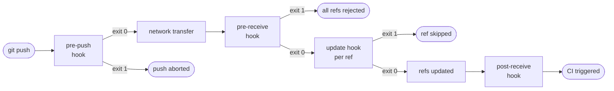
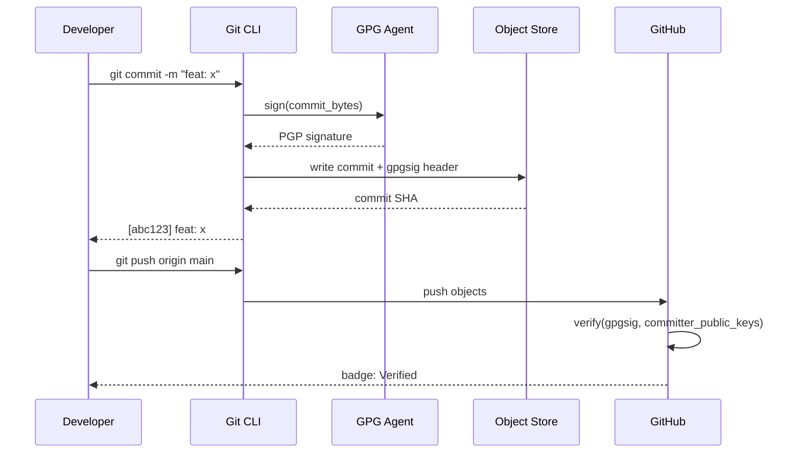

## Keywords in This File
{: .no_toc }

| # | Keyword | Difficulty |
|---|---------|------------|
| 16 | [Git Hooks and Pre-commit Workflows](#git-hooks-and-pre-commit-workflows) | ★★☆ |
| 17 | [Signed Commits and Supply Chain Security](#signed-commits-and-supply-chain-security) | ★★☆ |

---

# Git Hooks and Pre-commit Workflows

**Interview Weight:** High - hooks appear in platform, DevOps, and senior
engineering interviews as a gate-quality enforcement mechanism.

---

## Quick Reference

**One-line definition:** Git hooks are shell scripts that Git executes
automatically at defined lifecycle events (pre-commit, commit-msg,
pre-push, post-receive) to enforce quality gates, policy checks, or
trigger automation.

**One analogy:** Hooks are like customs checkpoints at an airport -
every item (commit, push) must pass inspection before crossing the
border into the shared repository.

**Key terms:**
- **client-side hooks** - run on the developer machine (pre-commit, commit-msg, pre-push)
- **server-side hooks** - run on the remote (pre-receive, update, post-receive)
- **pre-commit framework** - a Python tool (`pip install pre-commit`) that manages multi-language hook plugins
- **hook skip** - `git commit --no-verify` bypasses client-side hooks

---

### 🎯 Model Answer

**30-second answer:**

"Git hooks are scripts that Git runs at lifecycle events - pre-commit
runs before every commit, commit-msg validates the message format,
pre-push runs before you push. The `pre-commit` framework standardises
managing hooks across teams by declaring them in `.pre-commit-config.yaml`.
Server-side hooks like `pre-receive` enforce policy that cannot be
bypassed with `--no-verify`."

**3-minute answer:**

Git hooks are executable files placed in `.git/hooks/`. Git invokes the
hook by name at the corresponding event; a non-zero exit code aborts the
operation (for pre-action hooks). There are two categories:

**Client-side hooks** (run on the developer's machine):
- `pre-commit` - inspect staged content before the commit is created
- `commit-msg` - validate or transform the commit message
- `pre-push` - run checks before network communication begins
- `prepare-commit-msg` - populate the message template

**Server-side hooks** (run on the remote/bare repo):
- `pre-receive` - inspect the entire push before updating any refs;
  non-zero exit rejects the push entirely
- `update` - like pre-receive but runs once per ref being updated
- `post-receive` - trigger CI/CD, notifications, or deployments after
  a push succeeds; exit code does not affect the push

**The `pre-commit` framework** solves the biggest pain of raw hooks:
sharing them. Because `.git/hooks/` is not tracked by Git, developers
must manually install hooks after cloning. The `pre-commit` framework
stores hook configuration in `.pre-commit-config.yaml` (which IS
committed), installs managed hooks with `pre-commit install`, and
downloads versioned plugin packages from GitHub. This gives:
- Language-agnostic plugins (Python, Node, Go, shell all work)
- Version pinning (exactly the same linter version for every developer)
- Staged-only mode (only changed files are checked)
- Integration with CI (`pre-commit run --all-files` in CI pipeline)

**Key trade-off:** client-side hooks are convenience, not enforcement.
Any developer can bypass them with `git commit --no-verify`. Server-side
`pre-receive` hooks are the real security boundary because they run on
the server where developers have no override capability.

**Blank Mind Recovery:**

If asked about Git hooks and your mind blanks, say:
"Git hooks are lifecycle callbacks - scripts that Git calls before or
after specific events like committing or pushing. Pre-commit checks
staged files; pre-receive on the server enforces policy that developers
cannot bypass."

---

### 📘 Concept Explanation

#### 1. What Is It?

A Git hook is an executable script (any language) in `.git/hooks/`
named after a lifecycle event. Git passes relevant data (commit SHA,
branch name, message file path) via arguments and environment variables.

#### 2. Why Does It Exist?

Without hooks, quality gates live only in CI, which gives feedback
minutes after a bad commit. Hooks shift quality left: lint errors, test
failures, and policy violations are caught before they enter the repo
history, before they block other developers, and before they fail CI.

#### 3. How Does It Work? (Internal Mechanism)

```
Developer: git commit -m "fix bug"
Git pre-commit:
  1. Git resolves .git/hooks/pre-commit
  2. Checks executable bit (+x required)
  3. Forks a subprocess, passes no args
  4. Hook runs (e.g., lint staged files)
  5. Exit 0 -> continue to commit object creation
  6. Exit non-zero -> abort commit, print output
```

> **Code walkthrough:** The executable-bit check is critical - a
pre-commit file without `chmod +x` is silently ignored (exit 0). Git
forks a subprocess rather than sourcing the script, so hook environment
is isolated. WHY IT MATTERS: `git commit --no-verify` skips steps 1-6
entirely; this is why server-side hooks are required for policy
enforcement. WHAT BREAKS: hooks that take over 60 seconds will not time
out automatically - they block the commit indefinitely. TAKEAWAY: always
time-cap long-running hooks with `timeout 30 your-command`.

#### 4. Key Properties and Behaviors

**Staged-only linting (pre-commit framework):**

```bash
# .pre-commit-config.yaml
repos:
  - repo: https://github.com/pre-commit/pre-commit-hooks
    rev: v4.5.0
    hooks:
      - id: trailing-whitespace
      - id: end-of-file-fixer
      - id: check-yaml
  - repo: https://github.com/psf/black
    rev: 23.10.0
    hooks:
      - id: black
  - repo: https://github.com/PyCQA/flake8
    rev: 6.1.0
    hooks:
      - id: flake8
```

> **Code walkthrough:** Each `repo` entry pins a plugin to an exact
`rev` tag. WHAT IT SHOWS: running `pre-commit install` creates
`.git/hooks/pre-commit` that delegates to the pre-commit framework,
which only passes staged files to each hook. KEY MECHANISM: pre-commit
caches plugin environments in `~/.cache/pre-commit/` keyed by `rev`,
so `rev` bumps force a reinstall. WHY IT MATTERS: version pinning
prevents the "works on my machine" drift where developer A has black 23
and developer B has black 22. WHAT BREAKS: if `rev` points to a branch
name instead of a tag/SHA, the cached env is never invalidated when
the branch updates. TAKEAWAY: always pin to a tag or a full commit SHA.

**Commit-message format enforcement:**

```bash
#!/usr/bin/env bash
# .git/hooks/commit-msg
MSG_FILE="$1"
PATTERN="^(feat|fix|docs|style|refactor|test|chore)"
if ! grep -qE "$PATTERN" "$MSG_FILE"; then
  echo "COMMIT REJECTED: msg must start with" \
    "Conventional Commits type (feat, fix, etc.)"
  exit 1
fi
```

> **Code walkthrough:** Git passes the commit message file path as `$1`
to `commit-msg`. This script reads the file and enforces Conventional
Commits format. KEY MECHANISM: `grep -E` matches the regex against the
first line of the file; non-match exits 1, aborting the commit and
printing the error. WHY IT MATTERS: enforcing commit message format at
the hook level means semantic versioning tools (`conventional-changelog`,
`semantic-release`) can parse the log reliably. WHAT BREAKS: the regex
does not handle the case where the message starts with `#` (comment
line added by editors) - strip comments first with `sed '/^#/d'`.
TAKEAWAY: strip Git-injected comments before pattern matching.

**Server-side pre-receive hook:**

```bash
#!/usr/bin/env bash
# Enforced on server - cannot be bypassed with --no-verify
while read old_sha new_sha ref_name; do
  if [[ "$ref_name" == "refs/heads/main" ]]; then
    # Reject any commit missing a sign-off
    commits=$(git log --format="%H %s" \
      "$old_sha..$new_sha")
    while IFS= read -r line; do
      sha=$(echo "$line" | cut -d' ' -f1)
      if ! git log -1 --format="%B" "$sha" | \
          grep -q "Signed-off-by:"; then
        echo "PUSH REJECTED: commit $sha missing" \
          "Signed-off-by trailer"
        exit 1
      fi
    done <<< "$commits"
  fi
done
```

> **Code walkthrough:** `pre-receive` reads one line per ref being
pushed in the format `old_sha new_sha ref_name`. For each commit in the
range `old_sha..new_sha` on the `main` branch, it checks for a
`Signed-off-by:` trailer. KEY MECHANISM: `git log "$old_sha..$new_sha"`
enumerates only the new commits introduced by this push, avoiding
re-checking the entire history. WHY IT MATTERS: this policy cannot be
bypassed locally - the server always enforces it. WHAT BREAKS: if
`old_sha` is all zeros (the ref is being created for the first time),
the range is `0000..new_sha` which fails; check `[[ "$old_sha" == 0* ]]`
and use `new_sha` as the start of traversal. TAKEAWAY: always handle the
zero-SHA case in pre-receive hooks.

#### 5. Common Use Cases

1. **Lint on commit** - run ESLint/Pylint/checkstyle on staged files
2. **Test on pre-push** - run unit tests before pushing to origin
3. **Commit message enforcement** - Conventional Commits format
4. **Secret scanning** - detect API keys or passwords in staged files
5. **License header injection** - add missing license headers
6. **Deployment triggers** - `post-receive` triggers CI or server sync

#### 6. Trade-offs

| Aspect | Client-side Hooks | Server-side Hooks |
|--------|------------------|-------------------|
| Enforcement | Bypassable (--no-verify) | Enforced, no bypass |
| Feedback speed | Immediate, offline | After network round-trip |
| Maintenance | Per-developer install | Central, one place |
| Language | Any (local machine) | Server environment only |
| Scope | Local repo | All pushes to server |

#### 7. Performance Characteristics

Client-side hooks add latency to developer workflows. Rules:
- `pre-commit` should complete in under 10 seconds for staged files
- `pre-push` can afford 30-60 seconds (less frequent operation)
- Use `--files-only` or lint only staged diff, not the entire codebase
- Parallelise hooks where possible (`concurrently` for Node projects)

#### 8. Real-World Context

Large teams (100+ engineers) universally use the `pre-commit` framework
or platform-managed hooks (GitHub Actions Environments, Gerrit submit
rules, Bitbucket Server hooks). Enforcing Conventional Commits via
`commit-msg` hooks enables automated changelog generation and
semantic versioning. Google's internal Piper uses submit hooks to
enforce copyright headers and ban direct commits to protected paths.

---

### 💻 Code Example

**BAD pattern - hooks not shared:**

```bash
# Developer A manually places this in .git/hooks/pre-commit
# Developer B has nothing - no hooks installed after clone
#!/bin/bash
npm run lint
```

> **Code walkthrough:** WHAT IT SHOWS: raw hooks in `.git/hooks/` are
not tracked by Git, so they disappear after a fresh clone. KEY
MECHANISM: `.git/` is local state; Git never tracks it. WHY IT MATTERS:
one developer with hooks and another without breaks the enforcement
invariant. WHAT BREAKS: hook drift - different developers have different
versions of the same hook over time. TAKEAWAY: never rely on manual hook
installation for team-wide quality gates.

**GOOD pattern - pre-commit framework:**

```bash
# Committed to repo: .pre-commit-config.yaml (shown above)

# One-time developer setup
pip install pre-commit
pre-commit install  # installs .git/hooks/pre-commit

# CI enforcement (same checks, all files)
pre-commit run --all-files

# Verify what's installed
pre-commit installed-hooks
cat .git/hooks/pre-commit  # shows pre-commit framework entry
```

> **Code walkthrough:** `pre-commit install` creates a managed hook file
that delegates to the framework. KEY MECHANISM: the framework runs only
changed files through each hook, making it O(changed files) not O(all
files). WHY IT MATTERS: CI running `pre-commit run --all-files` gives
the same results as developer hooks but covers all files, ensuring
nothing slipped through in a merge. WHAT BREAKS: if `pre-commit` is not
in CI's PATH (e.g., not in requirements.txt), the CI check is skipped
silently. TAKEAWAY: add `pre-commit` to `requirements-dev.txt` and add
`pre-commit run --all-files` as an explicit CI step.

---

### 🎓 Answers by Seniority

**Junior/Mid:**

"Git hooks are scripts in `.git/hooks/` that run at events like
pre-commit. Pre-commit checks staged files before the commit is saved.
If the script exits non-zero, the commit is aborted. The `pre-commit`
framework manages hooks via a config file so they're shared across the
team. I'd use it to run lint, format checks, and small test suites on
each commit."

**Senior/Staff:**

"Hooks are a two-tier system. Client-side hooks (pre-commit, commit-msg,
pre-push) shift quality left - they catch issues before they hit CI.
But they're bypassable with `--no-verify`, so they're developer
ergonomics, not security policy.

Server-side `pre-receive` is where real enforcement lives. It runs with
no bypass path, receives every pushed ref, and can reject an entire push
based on policy - signing requirements, commit message format, prohibited
file patterns, or branch protection rules.

At the platform level, I'd pair `pre-commit` framework for developer
speed (lint only staged diff, parallelised) with `pre-receive` hooks
or GitHub Actions branch protection for enforcement that cannot be
circumvented. For secret scanning specifically, I'd run `gitleaks` in
both pre-commit AND pre-receive because a leaked secret that bypasses
the client hook cannot be retroactively erased from history once it
hits the server."

---

### ⚠️ Common Misconceptions

**Misconception 1: "Pre-commit hooks enforce policy."**

False. Any developer can run `git commit --no-verify` to skip all
client-side hooks. Pre-commit hooks are developer convenience tools.
Server-side `pre-receive` hooks are policy enforcement.

**Misconception 2: "Hooks are automatically shared when you clone."**

False. `.git/hooks/` is part of the local `.git/` directory and is
never tracked by Git. Hooks must be reinstalled after every fresh clone.
The `pre-commit` framework solves this with `pre-commit install` as a
one-time setup step per clone.

**Misconception 3: "Running the full test suite in pre-commit is good."**

Bad practice for frequent operations. Pre-commit runs on every `git
commit`. A 5-minute test suite adds 5 minutes to every commit, killing
developer flow. Reserve full test runs for `pre-push` or CI; use fast
unit tests (under 10s) in `pre-commit`.

**Misconception 4: "A failing hook means the commit was saved."**

No. A non-zero exit from a pre-action hook aborts the operation
entirely. The commit object is never created if `pre-commit` fails.

---

### 🚨 Failure Modes and Diagnosis

**Failure 1: Hook silently not running**

Symptom: `git commit` completes instantly without running linters.

Diagnosis:
```bash
ls -la .git/hooks/pre-commit
# -rw-r--r-- (no x bit) -> hook not executable
chmod +x .git/hooks/pre-commit
# OR if using pre-commit framework:
pre-commit install  # reinstalls the managed hook
```

> **Code walkthrough:** Git checks the executable bit before calling the
hook; no executable bit means the hook is silently skipped. KEY
MECHANISM: Git treats non-executable hooks as absent rather than raising
an error. WHY IT MATTERS: developers may believe hooks are enforcing
quality when they are not. TAKEAWAY: always verify hooks with
`ls -la .git/hooks/` after installation.

**Failure 2: Hooks work locally but not in CI**

Symptom: CI pipeline skips hook checks; bad commits pass CI.

Diagnosis:
```bash
# In CI pipeline - check if pre-commit is available
which pre-commit || pip install pre-commit
pre-commit run --all-files  # run explicitly, not via git commit

# Verify hooks are installed for CI git operations
git config --list | grep core.hooksPath
```

> **Code walkthrough:** CI typically runs `git commit` or test commands
directly, not developer workflows. The `.git/hooks/pre-commit` file
only runs during `git commit`. CI should call `pre-commit run --all-files`
as an explicit step. KEY MECHANISM: pre-commit framework has a CI mode
that runs the same hook logic without requiring a git commit action.
WHAT BREAKS: if the CI job does a shallow clone without the full history,
some hooks fail on missing context. TAKEAWAY: run `pre-commit run --all-files`
as a dedicated CI step, not relying on `git commit` in CI to trigger hooks.

**Failure 3: Hook breaks on Windows (CRLF line endings)**

Symptom: `pre-commit` errors with "bad interpreter: /usr/bin/env^M".

Fix:
```bash
# Convert hook script line endings
dos2unix .git/hooks/pre-commit
# OR set gitattributes for hooks
echo ".githooks/* text eol=lf" >> .gitattributes
git add .gitattributes && git commit
# Move hooks to tracked directory
git config core.hooksPath .githooks
```

> **Code walkthrough:** When a shell script has CRLF (`\r\n`) line
endings, the shebang line becomes `/usr/bin/env bash\r` - the `\r`
corrupts the interpreter path. KEY MECHANISM: `.gitattributes` with
`eol=lf` forces LF on checkout for matching paths, but this only helps
if hooks are in a tracked directory (`.githooks/` not `.git/hooks/`).
`git config core.hooksPath .githooks` redirects Git to use the tracked
directory. WHY IT MATTERS: cross-platform teams (Windows + Linux/macOS)
will hit this on Windows. TAKEAWAY: move hooks to `.githooks/` (tracked),
set `core.hooksPath .githooks` in `.gitconfig`, and apply `eol=lf`.

---

### 🎯 Interview Deep-Dive

| Question Type | Count | Target Audience |
|---|---|---|
| Conceptual | 3 | All levels |
| Debugging | 2 | Mid-Senior |
| Trade-off | 2 | Senior-Staff |
| Behavioral | 1 | Mid-Senior |
| Architecture | 1 | Staff |

---

**[CONCEPTUAL] Q1 - What is the difference between `pre-commit` and `pre-receive` hooks, and which provides stronger enforcement?**

`pre-commit` is a client-side hook that runs on the developer's machine
before a commit object is created. It can be bypassed with
`git commit --no-verify`. `pre-receive` is a server-side hook that runs
on the remote repository after a push arrives but before any refs are
updated. It cannot be bypassed; the server controls it entirely.

For enforcement strength, `pre-receive` is categorically stronger.
`pre-commit` is developer ergonomics - it catches issues early and
reduces CI feedback loops. `pre-receive` is policy - it defines what
the repository will and will not accept regardless of developer tooling.

In a compliance-sensitive organisation (SOC 2, FedRAMP), `pre-commit`
hooks might enforce signing-off format or secret scanning for developer
convenience, but the authoritative enforcement lives in `pre-receive`
backed by a server the developers do not administer.

*What separates good from great:* knowing that client-side hooks are
"shift left" ergonomics and server-side hooks are security boundaries -
and designing systems that use both in appropriate roles.

---

**[CONCEPTUAL] Q2 - How does the `pre-commit` framework improve on raw Git hooks for team workflows?**

Raw Git hooks have three fundamental problems for teams:
1. `.git/hooks/` is not tracked by Git, so hooks disappear after clone
2. No version pinning - each developer can have a different hook version
3. Multi-language projects need one hook that orchestrates many linters

The `pre-commit` framework solves all three:
1. Configuration lives in `.pre-commit-config.yaml` (committed to repo)
2. Each plugin is pinned to a `rev` (tag or SHA) in that config file
3. Plugins are isolated in language-specific virtualenvs managed by
   the framework

After `pre-commit install`, Git's pre-commit hook is a thin wrapper that
delegates to the framework, which runs only staged files through each
plugin in parallel, caches plugin environments, and prints structured
diffs showing exactly which lines failed.

*What separates good from great:* mentioning the staged-only mode
(not linting the entire codebase on every commit) and the CI integration
(`pre-commit run --all-files`) as the authoritative check.

---

**[CONCEPTUAL] Q3 - What events trigger server-side hooks and in what order does Git call them during a push?**

During a `git push`, Git triggers server-side hooks in this order:

1. **pre-receive** - called once, receives all refs being pushed as
   stdin (`old_sha new_sha refname`). Non-zero exit rejects all pushed
   refs before any are updated.
2. **update** - called once per ref being updated. Allows selective
   rejection (accept some refs, reject others) with a non-zero exit.
3. **post-receive** - called once after all refs are updated. Used for
   notifications, CI triggers, deployments. Exit code does not affect
   the push outcome.

For a push of 3 refs: `pre-receive` (1 call) -> `update` (3 calls) ->
`post-receive` (1 call).

`post-update` is an older variant of `post-receive` with a different
argument format; `post-receive` is preferred in modern Git.

*What separates good from great:* explaining that `update` allows
granular per-ref decisions while `pre-receive` is all-or-nothing.

---

**[DEBUGGING] Q4 - A developer's pre-commit hook runs locally but a teammate's pre-commit hook does nothing on the same codebase. Diagnose.**

The most likely causes in order of probability:

1. **Hook not installed**: the teammate never ran `pre-commit install`
   after cloning. Check: `cat .git/hooks/pre-commit` - if it does not
   show the pre-commit framework entrypoint, they have no hook.
   Fix: `pre-commit install`.

2. **Executable bit missing**: if hooks are managed manually, the
   file lacks the execute permission.
   Check: `ls -la .git/hooks/pre-commit`
   Fix: `chmod +x .git/hooks/pre-commit`

3. **`core.hooksPath` misconfigured**: the teammate's global or local
   gitconfig points to a directory that does not contain hooks.
   Check: `git config --list | grep hooksPath`
   Fix: clear the setting or point it to the correct `.githooks/` dir.

4. **`SKIP` environment variable**: `SKIP=black,flake8 git commit` will
   skip specific hooks. Check: `env | grep SKIP`.

5. **Shell mismatch on Windows**: hook has CRLF endings.
   Check: `file .git/hooks/pre-commit` (should show "ASCII text, no CR")
   Fix: `dos2unix .git/hooks/pre-commit`

*What separates good from great:* a systematic "is it installed? is
it executable? is it reachable via hooksPath?" diagnostic sequence.

---

**[DEBUGGING] Q5 - A `pre-receive` hook is rejecting all pushes to `main` with "bad object" errors. What are the likely causes?**

"Bad object" in a `pre-receive` hook means `git log`, `git cat-file`,
or another git command received a SHA that does not exist in the local
object store.

**Cause 1 - New ref (zero SHA):**
When creating a new branch, `old_sha` is `0000000000000000000000000000`.
If the hook runs `git log "$old_sha..$new_sha"` with the zero SHA, Git
reports it as a bad object.
Fix: check `[[ "$old_sha" =~ ^0+$ ]]` before using `old_sha` in git
commands.

**Cause 2 - Shallow clone server:**
If the server repo was created via `git clone --depth N`, older commits
are not present. Any hook checking commit ranges that extend beyond the
shallow boundary fails.
Fix: `git fetch --unshallow` on the server repo, or restrict range
checks to shallow depth.

**Cause 3 - Race condition in bundle transfer:**
In distributed server setups (multiple replicas), the push arrives at
a replica before the object replication is complete.
Symptom: transient failures that succeed on retry.
Fix: implement a wait-for-replica check or use a primary-only write path.

*What separates good from great:* immediately naming the zero-SHA edge
case as the most common cause of "bad object" in pre-receive hooks.

---

**[TRADE-OFF] Q6 - Should you run full integration tests in a pre-push hook? When is this a bad idea?**

Running full integration tests in `pre-push` shifts quality left and
catches regressions before they pollute the remote. For a project where
integration tests complete in under 60 seconds, this is generally worth
the trade-off.

**When it's a bad idea:**

1. **Slow test suites (>2 min)**: `git push` runs synchronously; a
   5-minute integration suite blocks the developer's terminal and
   destroys flow. Move slow tests to CI where they run asynchronously.

2. **External dependencies**: integration tests that call live APIs,
   databases, or microservices are flaky in developer environments (VPN
   down, service unavailable). Flaky hooks teach developers to use
   `--no-verify`.

3. **Force-push workflows**: when pushing a work-in-progress branch to
   share with a reviewer, running integration tests is wasteful.
   Consider checking the target ref name and skipping on non-main branches.

4. **Large teams**: 50 developers each running integration tests locally
   multiplies infrastructure costs if tests require cloud resources.

**Recommendation:** `pre-push` = unit tests + linters (< 30s).
CI = integration tests, end-to-end tests (minutes). Enforce fast hooks,
not comprehensive ones.

*What separates good from great:* quantifying the latency impact and
explaining how slow hooks create `--no-verify` culture.

---

**[TRADE-OFF] Q7 - What is the risk of storing hook scripts in `.git/hooks/` vs a committed `.githooks/` directory?**

`.git/hooks/` is local-only state, not tracked by Git:
- **Version drift:** developers on the same codebase may have different
  hook versions
- **No history:** hook changes are invisible in git log
- **No review:** hook changes bypass code review
- **Clone loss:** every new clone starts with zero hooks

`.githooks/` is a committed directory:
- **Version controlled:** hook changes go through PRs and code review
- **History:** `git log .githooks/` shows every hook change
- **Reproducible:** `git config core.hooksPath .githooks` in a one-time
  setup script gives every developer the same hooks
- **Security concern:** committed hooks can be modified by any developer
  with write access to the repo; a malicious hook commit could run
  arbitrary code on all developers' machines post-merge

The security concern is real: `.githooks/` hooks run with developer
privileges. Before merging any hook change, require explicit approval
from a platform/security team member, and consider signing commits that
modify hooks.

*What separates good from great:* raising the supply-chain risk of
committed hooks and recommending a separate approval requirement.

---

**[BEHAVIORAL] Q8 - Describe a time you improved team quality using Git hooks or automation.**

Strong answer structure:

**Situation:** codebase had inconsistent commit messages; semantic
versioning tools (`release-please`) were generating incorrect changelogs.

**Task:** enforce Conventional Commits format without blocking developers
who used external editors.

**Action:** installed a `commit-msg` hook via the `pre-commit` framework
that validates the message against the Conventional Commits regex. Added
an amend helper script that developers could invoke to fix a message.
Added CI step running `pre-commit run --all-files` to catch any bypass
attempts. Documented the format in onboarding.

**Result:** after one sprint, 100% of commits on the main branch were
Conventional-Commits-compliant. `release-please` correctly auto-generated
PATCH/MINOR/MAJOR changelogs, saving ~2 hours of manual changelog writing
per release.

*What separates good from great:* mentioning the CI backstop
(`pre-commit run --all-files`) to enforce what client hooks cannot and
measuring the concrete outcome (changelog automation).

---

**[ARCHITECTURE] Q9 - Design a hook-based policy system for a 500-engineer monorepo where different teams own different directories and have different enforcement rules.**

**Requirements from the problem:**
- 500 engineers, multiple teams
- Per-directory ownership and rule sets
- Cannot require every developer to run custom setup per team
- Cannot have one global hook that slows everyone down

**Architecture:**

```
.githooks/
  pre-commit          # dispatcher script
  rules/
    python.sh         # Python lint rules
    java.sh           # Java checkstyle rules
    infra.sh          # Terraform fmt + tflint
.pre-commit-config.yaml
CODEOWNERS           # maps paths to teams
```

> **Code walkthrough:** The dispatcher reads CODEOWNERS-style ownership
rules, detects which directories have staged changes, and selectively
invokes only the rule scripts for those directories. KEY MECHANISM:
`git diff --cached --name-only` enumerates staged files; the dispatcher
groups them by ownership domain and runs only the relevant checks.
WHY IT MATTERS: a developer changing only Python files never runs the
Java or Terraform checks, keeping pre-commit under 10s for any single
team's workflow. WHAT BREAKS: if a commit touches files in 5 team
domains simultaneously, all 5 rule scripts run serially - add parallel
execution with `&` and `wait` in bash or `concurrently` in Node.
TAKEAWAY: scope hooks to changed directories, not the whole repo.

**Server-side complement:**
- `pre-receive` hook enforces CODEOWNERS - rejects pushes where a commit
  modifies protected paths without required reviewer approval SHA in
  commit trailers (or enforced via GitHub branch protection)
- `post-receive` triggers team-specific CI pipelines based on changed
  path patterns, avoiding monorepo-wide CI on every push

**Scaling consideration:** at 500 engineers, client-side hooks are
running thousands of times per day. Hook execution time directly affects
engineering throughput. Profile and enforce the < 10s SLA with explicit
timeouts (`timeout 10 ./rules/python.sh` exits 124 on timeout).

*What separates good from great:* designing the dispatcher pattern
(staged-file routing to per-team rules) and noting the server-side
`post-receive` for selective CI triggering - the pattern used by
Microsoft, Google, and Meta in their monorepo tooling.

---

### ⚖️ Comparison Table

| Approach | Enforcement | Bypass | Scope | Feedback Latency |
|----------|-------------|--------|-------|-----------------|
| Raw `.git/hooks/` | Developer only | `--no-verify` | Per-developer | Immediate |
| `pre-commit` framework | Developer only | `--no-verify` | Team (via config) | Immediate |
| GitHub Actions (push) | All pushers | None | All branches | ~60s |
| Server `pre-receive` | All pushers | None (server-enforced) | All refs | After network |
| Gerrit submit rules | All pushers | None | Per-project | After review |
| Branch protection rules | All pushers | Admins only | Protected branches | After push |

---

### 🏛️ System Design

*(Omit: Not a ★★★ keyword.)*

---

### 📊 Diagram

ASCII flow - hook execution order during `git push`:

```
Developer Machine          Remote Server
==================         =================
git push                   pre-receive
  |                           | (all refs)
  |-> pre-push hook           | reject? -> push fails
  |   (local, bypassable)     v
  |                        update hook
  |-> network push            | (per ref)
      -------->               | reject? -> ref skipped
                              v
                           post-receive
                              | (notifications, CI)
                              v (exit code ignored)
```

> **Diagram walkthrough:** WHAT IT DEPICTS: the lifecycle of hooks
during a `git push` across the client-server boundary. HOW TO READ IT:
left side is the developer machine with `pre-push`; the network push
transfers objects; right side shows the three server hooks in order.
KEY RELATIONSHIP: `pre-push` is bypassable with `--no-verify`; nothing
on the server side is. EDGE CASE: if `pre-receive` exits non-zero, Git
aborts the push before running `update` or `post-receive` - CI triggers
do not fire. INSIGHT: a senior architect places authoritative enforcement
in `pre-receive` and uses `post-receive` for all side effects (CI
triggers, Slack notifications) so side effects are decoupled from the
push decision.



> **Diagram walkthrough:** WHAT IT DEPICTS: the full hook execution
graph from `git push` to CI trigger, showing both client and server
hooks. HOW TO READ IT: hexagons are terminal states; rectangles are
hook execution points; arrows show control flow. KEY RELATIONSHIP: only
`pre-receive` and `update` can reject refs; `post-receive` is always
informational. EDGE CASE: if `pre-push` exits 0 but the network transfer
fails (no connectivity), the server hooks never run. INSIGHT: the
placement of `post-receive` after all refs are committed means it can
safely trigger downstream CI - it will never be called for a rejected
push.

---

---

# Signed Commits and Supply Chain Security

**Interview Weight:** High - signed commits appear in security-focused
interviews and are increasingly required in regulated industries.

---

## Quick Reference

**One-line definition:** Commit signing uses GPG, SSH, or S/MIME
cryptography to cryptographically prove that a commit or tag was created
by a specific key holder, defending against commit author impersonation
and supply chain attacks.

**One analogy:** A signed commit is a notarised document - anyone with
the public key can verify the signature, and the notary's stamp cannot
be forged without the private key.

**Key terms:**
- **GPG key** - GNU Privacy Guard asymmetric key pair used to sign commits
- **SSH signing** - Git 2.34+ can use SSH keys instead of GPG for signing
- **vigilant mode** - GitHub setting that marks all unsigned commits as "unverified"
- **Sigstore/Gitsign** - keyless signing using OIDC identity tokens (no key management)
- **SLSA** - Supply Chain Levels for Software Artifacts - framework requiring signed provenance

---

### 🎯 Model Answer

**30-second answer:**

"Git commit signing lets you cryptographically prove who created a
commit. Git supports GPG, SSH, and S/MIME signing. Platforms like GitHub
show a 'Verified' badge for signed commits. In supply chain security,
signed commits + signed tags + provenance attestations (SLSA level 2+)
create an audit trail proving that production artifacts trace to
reviewed, attributed source commits."

**3-minute answer:**

Git stores the author name and email as plain text in commit metadata.
Any developer can set `git config user.name "Linus Torvalds"` and create
commits that appear to be from anyone. Commit signing solves this by
attaching a cryptographic signature that can be verified against a known
public key.

**How signing works:**
1. Developer generates a GPG or SSH key pair
2. Public key is uploaded to GitHub/GitLab profile
3. Git is configured: `git config commit.gpgsign true`
4. On `git commit`, Git runs `gpg --sign` over the commit contents
5. The signature is stored in the commit object's `gpgsig` header
6. Anyone with the developer's public key can verify the signature

**SSH signing (Git 2.34+):** eliminates the complexity of GPG by
reusing existing SSH keys. The `allowed_signers` file maps email
addresses to trusted public keys. `git log --show-signature` verifies
each commit signature.

**Sigstore and keyless signing:** for CI/CD pipelines where managing a
long-lived GPG key is operationally complex, Sigstore's `gitsign` tool
uses short-lived OIDC identity tokens. A CI job signed as the GitHub
Actions OIDC identity (`github.com/org/repo@refs/heads/main`) produces
a signature that can be verified against the Sigstore transparency log -
no key files to manage, no key rotation, audit trail in the public log.

**Supply chain relevance (SLSA):**
- SLSA Level 1: unsigned builds, basic provenance
- SLSA Level 2: signed provenance - the build system asserts what source
  it built from, signed with a service account key
- SLSA Level 3: hermetic builds on trusted build infrastructure
  At SLSA 2+, signed commits are a prerequisite: provenance is
  meaningless if the source commit it references could be impersonated.

**Blank Mind Recovery:**

"Signed commits use GPG or SSH keys to prove authorship. Git's author
field is just text anyone can forge. With signing, every commit has a
verifiable signature. Platform UIs show 'Verified' badges. Supply chain
security frameworks like SLSA require signed provenance tracing artifacts
back to signed source commits."

---

### 📘 Concept Explanation

#### 1. What Is It?

Commit signing attaches a cryptographic signature to the commit object,
proving that the private key holder created or approved the commit. The
signature is stored inside the Git object, verified by the corresponding
public key, and displayed by platforms as a "Verified" badge.

#### 2. Why Does It Exist?

Git's commit metadata (author, email, date) is mutable plain text.
Nothing in the unauthenticated Git protocol prevents an attacker with
write access from impersonating another developer by setting any
`user.email`. Commit signing creates a tamper-evident record: if the
commit content or metadata is altered post-signing, the signature
verification fails.

#### 3. How Does It Work? (Internal Mechanism)

```
git commit -S -m "feat: add auth"
  |
  v
Git assembles commit object:
  tree <sha>
  parent <sha>
  author Alice <alice@example.com> 1700000000 +0000
  committer Alice <alice@example.com> 1700000000 +0000
  
  feat: add auth
  |
  v
gpg --armor --sign <commit-data>
  -> produces ASCII-armored PGP signature
  |
  v
Signature stored in commit object as 'gpgsig' header
between 'committer' and blank-line-before-message

git log --show-signature
  -> git runs: gpg --verify <sig> <commit-data>
  -> Output: "Good signature from Alice <alice@example.com>"
```

> **Code walkthrough:** The commit object is hashed (SHA-1 or SHA-256)
and then signed. The signature covers the commit message, author, tree
hash, and parent hash - any post-hoc modification of the commit object
(squash, amend) invalidates the signature. KEY MECHANISM: rebasing and
squashing create new commit objects, so they produce new (or missing)
signatures - rebased commits must be re-signed. WHY IT MATTERS: signed
commits only prove authorship at the time of commit; a `git rebase` that
does not re-sign produces unsigned commits with different SHAs.
TAKEAWAY: squash-merging signed commits into main loses individual
signatures; the merge commit must itself be signed.

#### 4. Key Properties and Behaviors

**GPG signing setup:**

```bash
# Generate key (RSA 4096 or Ed25519 recommended)
gpg --full-generate-key

# Get the key ID
gpg --list-secret-keys --keyid-format=long
# sec   ed25519/3AA5C34371567BD2 2024-01-15
#       Key fingerprint = ...

# Configure Git to sign all commits
git config --global user.signingkey 3AA5C34371567BD2
git config --global commit.gpgsign true
git config --global tag.gpgsign true

# Export public key for GitHub upload
gpg --armor --export 3AA5C34371567BD2
```

> **Code walkthrough:** `--global` sets signing for all repos. The
key ID `3AA5C34371567BD2` is the last 16 hex characters of the GPG
fingerprint. KEY MECHANISM: Git calls `gpg --sign` with the key ID on
every commit; no passphrase prompt in CI environments requires using a
GPG agent or a passphrase-free key. WHY IT MATTERS: if the signing key
is not available (not imported, not on keyring), every commit fails with
"No secret key". TAKEAWAY: in CI, use SSH signing or Sigstore/gitsign
to avoid GPG agent complexity.

**SSH signing (simpler for most teams):**

```bash
# Configure SSH signing (Git 2.34+)
git config --global gpg.format ssh
git config --global \
  user.signingkey ~/.ssh/id_ed25519.pub
git config --global commit.gpgsign true

# Create allowed_signers file for verification
echo "alice@example.com $(cat ~/.ssh/id_ed25519.pub)" \
  >> ~/.ssh/allowed_signers
git config --global \
  gpg.ssh.allowedSignersFile ~/.ssh/allowed_signers

# Verify a commit
git log --show-signature HEAD
# output: verified signature for alice@example.com with ...
```

> **Code walkthrough:** SSH signing reuses the SSH key pair most
developers already have; no separate GPG key management is needed. The
`allowed_signers` file maps email addresses to trusted public keys for
verification. KEY MECHANISM: the format is identical to `~/.ssh/known_hosts`
but maps email -> public key. WHY IT MATTERS: the `allowed_signers` file
must be shared across the team for verification to work - commit it to
the repo or distribute via a directory service. WHAT BREAKS: if the key
in `allowed_signers` doesn't match the key used to sign, verification
produces "No principal matched". TAKEAWAY: for team-wide verification,
commit `allowed_signers` to the repo and reference it with a relative
path in `core.sshCommand`.

**Sigstore/gitsign for CI (keyless):**

```bash
# Install gitsign
go install sigstore/gitsign@latest

# Configure Git to use gitsign
git config --global gpg.x509.program gitsign
git config --global gpg.format x509
git config --global commit.gpgsign true

# In GitHub Actions - no key setup required
# gitsign uses the OIDC token from the Actions environment
# Signature is logged in the Sigstore transparency log (Rekor)

# Verify signatures
gitsign verify --certificate-identity \
  "https://github.com/org/repo/.github/workflows/deploy.yml@\
refs/heads/main" \
  --certificate-oidc-issuer \
  "https://token.actions.githubusercontent.com" \
  HEAD
```

> **Code walkthrough:** `gitsign` uses GitHub's OIDC identity token
to request a short-lived certificate from Sigstore's Fulcio CA. The
certificate binds the signing identity to the OIDC claims (workflow
URL, ref, repository). KEY MECHANISM: the certificate is valid for only
10 minutes, but the signature is submitted to Rekor (Sigstore's
immutable transparency log), creating a permanent audit entry. WHY IT
MATTERS: no private key to rotate, leak, or manage; the signing identity
IS the workflow identity. WHAT BREAKS: verification requires network
access to Rekor for certificate chain validation - air-gapped environments
cannot verify keyless signatures without a private Sigstore instance.
TAKEAWAY: use gitsign for CI/CD pipelines; use GPG/SSH for developer
commit signing.

#### 5. Common Use Cases

1. **Author attribution** - prove commits came from specific developers
2. **Tag signing** - sign release tags to prove a release is authentic
3. **CI/CD provenance** - sign build artifacts and trace them to signed
   commits (SLSA 2+)
4. **Regulated environments** - SOC 2, FedRAMP require audit trails with
   verified identity
5. **Open source contribution** - verify that maintainer commits are genuine
6. **Supply chain protection** - detect malicious commits injected by
   compromised accounts

#### 6. Trade-offs

| Approach | Key Management | CI Complexity | Verification |
|----------|---------------|---------------|--------------|
| GPG | Complex (keyring, agent) | Hard (passphrase/agent in CI) | Good (standard) |
| SSH | Simple (existing keys) | Medium (key file in CI secrets) | Team-scoped |
| Sigstore (gitsign) | None (keyless) | Trivial (OIDC) | Public log |
| S/MIME (corp PKI) | Corp PKI managed | Medium | Enterprise CA |

#### 7. Performance Characteristics

Signing adds negligible latency (~10-50ms for a single commit signature).
Verification (`git log --show-signature`) adds a GPG subprocess call per
commit; verifying 10,000 commits in a loop would take ~10 seconds.
Batch verification tools (`gitsign verify-blob`) are faster for
automation.

#### 8. Real-World Context

GitHub marks all commits from accounts with Vigilant Mode enabled as
"Unverified" if they lack a verified signature. Kubernetes, the Linux
kernel, and most major open source projects require signed release tags.
The US NIST SSDF (Secure Software Development Framework) and CISA
guidance cite commit signing as a recommended supply chain control.
In 2023, the XZ Utils supply chain attack would have been detectable
earlier with signed commits - the malicious maintainer's commits lacked
a GPG signature that the legitimate maintainer's prior commits had.

---

### 💻 Code Example

**BAD pattern - unsigned commits with spoofed identity:**

```bash
# Attacker sets identity to a trusted developer
git config user.name "Alice Smith"
git config user.email "alice@company.com"
git commit -m "fix: security patch"
# Commit appears identical to Alice's legitimate commits
# No way to distinguish in git log without signing
```

> **Code walkthrough:** WHAT IT SHOWS: Git's author field is plain text
with no authentication - any string can be used. KEY MECHANISM: Git does
not validate the author email against any identity system. WHY IT MATTERS:
an attacker with repo write access can inject commits that appear to be
from trusted developers, bypassing code review expectations. WHAT BREAKS:
trust in commit attribution without signing makes blame, audit trails,
and regulatory attestations unreliable. TAKEAWAY: unsigned commits are
a trust-on-honor system; signing replaces honor with cryptographic proof.

**GOOD pattern - enforcement via branch protection:**

```bash
# GitHub branch protection: require signed commits on main
# Setting: Settings -> Branches -> main -> Require signed commits

# Developer workflow with signing enabled
git config --global commit.gpgsign true  # sign all commits
git commit -m "feat: add auth"           # auto-signed

# Verify locally
git log --show-signature -1
# commit abc123...
# gpg: Good signature from "Alice Smith <alice@company.com>"
# Author: Alice Smith <alice@company.com>
# Date: ...
# feat: add auth

# Attempt to push unsigned commit to protected branch
git commit --no-gpg-sign -m "quick fix"
git push origin main
# remote: error: GH006: Protected branch rules not allowable.
# remote: error: Required signed commits.
```

> **Code walkthrough:** GitHub's "Require signed commits" branch
protection rule rejects pushes containing unsigned commits at the
`pre-receive` layer on GitHub's servers. KEY MECHANISM: GitHub verifies
each commit's signature against the committer's registered GPG or SSH
public keys. WHY IT MATTERS: `git commit --no-gpg-sign` bypasses the
local hook but NOT the server-side enforcement. WHAT BREAKS: CI pipelines
that create commits (e.g., automated version bumps, bot commits) must
also have signing configured with a bot account's key. TAKEAWAY: combine
local `commit.gpgsign = true` with server-enforced branch protection for
both ergonomics and security.

---

### 🎓 Answers by Seniority

**Junior/Mid:**

"Git commit signing uses GPG or SSH keys to prove who made a commit.
You configure Git with your key ID and set `commit.gpgsign = true`.
GitHub shows a 'Verified' badge on signed commits. It prevents anyone
from forging commits as another developer. In my team I'd set up SSH
signing since we already use SSH keys for authentication."

**Senior/Staff:**

"Commit signing is a two-part story: developer ergonomics and supply
chain integrity.

For developer ergonomics, SSH signing (Git 2.34+) is the right default
for most teams - reuses existing SSH keys, simple `allowed_signers`
verification, no GPG agent complexity. Combined with GitHub's 'Require
signed commits' branch protection, you have both convenience and
server-enforced attribution.

For supply chain integrity, signing is not sufficient on its own.
The SLSA framework requires signed provenance records that connect
build artifacts back to source commits. This means: signed commits ->
signed tags -> CI pipeline that emits signed SLSA provenance (using
SBOM + cosign attestations) -> artifact registry that stores provenance.
For CI signing, Sigstore/gitsign with OIDC is operationally superior
because there are no long-lived keys to manage, and the transparency log
provides an immutable audit trail.

The XZ Utils incident in 2024 is the canonical case study: a compromised
maintainer injected malicious code over 2+ years. Signed commits, SLSA
provenance, and reproducible builds would each have created detection
opportunities."

---

### ⚠️ Common Misconceptions

**Misconception 1: "Signed commits prove the code is safe or reviewed."**

Signing only proves cryptographic authorship - that the commit was made
by the holder of a specific key. It says nothing about code quality,
security review, or whether the key holder's account was compromised.
A signed commit can contain malicious code.

**Misconception 2: "Rebasing preserves commit signatures."**

False. Rebasing creates new commit objects with different SHAs. The
new commits are unsigned unless the developer re-signs them. Squash
merges similarly discard individual commit signatures; only the merge
commit can be signed. Organizations requiring signed commits on main
must ensure their merge strategy (squash or merge commit) signs the
final landing commit.

**Misconception 3: "GPG signing and SSH signing are equivalent."**

Functionally similar but operationally different. GPG requires a separate
key ring, GPG agent, and more complex setup. SSH reuses developer keys
developers already have. The choice affects CI complexity (GPG agents in
CI are painful) and verification scope (SSH `allowed_signers` is local;
GPG uses public key servers or the web of trust).

**Misconception 4: "Commit signing is only for open source projects."**

Enterprises in regulated industries (finance, healthcare, defense)
increasingly mandate commit signing for compliance. NIST SSDF, CISA
guidance, and the US Executive Order on software supply chain security
all recommend or require signed provenance.

---

### 🚨 Failure Modes and Diagnosis

**Failure 1: "No secret key" error on every commit**

Symptom: `gpg: skipped "ABC123": No secret key`

Diagnosis:
```bash
# Check what key Git is configured to use
git config --global user.signingkey
# Check if that key is in the keyring
gpg --list-secret-keys --keyid-format=long
# If key is missing: import it
gpg --import private-key.asc
# If using SSH signing, verify the key file exists
ls -la $(git config gpg.ssh.signingkey 2>/dev/null || \
  git config user.signingkey)
```

> **Code walkthrough:** The signing key ID in `user.signingkey` must
exactly match a key in the local GPG keyring. A common failure is
configuring the full fingerprint when Git expects only the last 16 chars
(or vice versa). KEY MECHANISM: Git passes the `user.signingkey` value
directly to GPG as the key selector; any mismatch returns "No secret
key". WHAT BREAKS: copying a config from one machine to another where
the key wasn't imported. TAKEAWAY: verify `gpg --list-secret-keys |
grep $(git config user.signingkey)` returns output before any commit.

**Failure 2: Commits show as "Unverified" on GitHub despite signing**

Symptom: git log shows "Good signature" locally but GitHub shows
"Unverified" badge.

Diagnosis:
```bash
# Check that the email in the GPG key matches Git commit email
gpg --list-keys alice@example.com
# Verify the email in the key matches:
git config user.email

# Check that the public key is uploaded to GitHub
# GitHub: Settings -> SSH and GPG keys -> GPG keys
# The key fingerprint must match the signing key

# For SSH signing: the SSH key must be marked as
# "Signing Key" in GitHub, not just "Authentication Key"
```

> **Code walkthrough:** GitHub verifies signatures by fetching the
committer's registered public keys and checking if the signature matches
one of them. The commit's author email must match a verified email in
the GitHub account AND appear as a UID in the GPG key. WHY IT MATTERS:
using work email in Git config and personal email in GitHub means
signatures will never verify. WHAT BREAKS: key expiry - when a GPG key
expires, previously-verified signatures retroactively become unverified.
TAKEAWAY: extend key expiry or re-sign commits before the key expires
(for long-lived tags especially).

**Failure 3: CI pipeline fails to sign commits (GPG agent not running)**

Symptom: automated commits (version bumps, release tagging) fail with
"gpg: signing failed: Inappropriate ioctl for device"

Fix:
```bash
# Option A: Use SSH signing in CI (preferred)
git config gpg.format ssh
git config user.signingkey /path/to/ci-signing-key.pub
echo "ci@bot.example $(cat /path/to/ci-signing-key.pub)" \
  >> allowed_signers

# Option B: Configure GPG for non-interactive use
export GPG_TTY=$(tty) 2>/dev/null || true
echo "pinentry-mode loopback" >> ~/.gnupg/gpg.conf
echo "allow-loopback-pinentry" >> \
  ~/.gnupg/gpg-agent.conf
gpg-connect-agent reloadagent /bye

# Option C: Use Sigstore gitsign (keyless)
git config gpg.x509.program gitsign
git config gpg.format x509
```

> **Code walkthrough:** The "Inappropriate ioctl" error occurs when GPG
tries to prompt for a passphrase on a PTY that does not exist in a CI
environment. `pinentry-mode loopback` redirects the passphrase prompt
through the GPG protocol itself, removing the TTY dependency. WHY IT
MATTERS: GPG was designed for interactive use; making it work in CI
requires explicit non-interactive configuration. WHAT BREAKS: loopback
mode still fails if the key has a passphrase and it's not in the agent.
TAKEAWAY: use SSH signing or gitsign for CI; reserve GPG for human
developer workflows.

---

### 🎯 Interview Deep-Dive

| Question Type | Count | Target Audience |
|---|---|---|
| Conceptual | 3 | All levels |
| Debugging | 2 | Mid-Senior |
| Trade-off | 2 | Senior-Staff |
| Behavioral | 1 | Mid-Senior |
| Architecture | 1 | Staff |

---

**[CONCEPTUAL] Q1 - What does a signed commit actually prove, and what doesn't it prove?**

A signed commit proves three things:
1. **Key possession:** the person who created the commit had the private
   key at the time of signing
2. **Integrity:** the commit content (message, tree, parent SHAs) has
   not been modified since signing - any alteration breaks the signature
3. **Attribution:** the key used maps to a specific identity (developer,
   CI pipeline, service account) whose public key is registered

A signed commit does NOT prove:
1. **Code safety:** the signed code could be malicious
2. **Review:** signing is not approval; the code may never have been
   reviewed
3. **Account security:** if the developer's private key or account is
   compromised, an attacker can produce valid signatures
4. **Continued trustworthiness:** the key holder's behavior after signing
   may change

The XZ Utils case (2024) illustrates limit 3: a trusted maintainer with
a legitimate key introduced a backdoor. Signing proved the commits came
from the maintainer's key - not that they were safe.

*What separates good from great:* explicitly naming what signing does NOT
prove - most candidates stop at what it does prove.

---

**[CONCEPTUAL] Q2 - How does Git store a commit signature, and what happens to the signature when you `git rebase` or `git commit --amend`?**

Git commit objects are immutable content-addressed blobs. A signature is
stored as a `gpgsig` header in the raw commit object between the
`committer` line and the blank line before the commit message:

```
tree abc123...
parent def456...
author Alice <alice@example.com> 1700000000 +0000
committer Alice <alice@example.com> 1700000000 +0000
gpgsig -----BEGIN PGP SIGNATURE-----
 <base64-encoded signature>
 -----END PGP SIGNATURE-----

feat: add authentication
```

> **Code walkthrough:** The signature covers the raw commit object bytes
including all headers and the message. Changing any byte - parent SHA,
author, message, or tree - invalidates the signature. KEY MECHANISM:
`git cat-file commit HEAD` shows the raw object. WHAT BREAKS: rebasing
creates new commit objects with new parent SHAs and timestamps; the new
objects are unsigned even if the originals were signed. TAKEAWAY: after
rebasing, the developer must re-sign each commit with `git rebase --exec
"git commit --amend --no-edit -S"`.

When you `git rebase` or `git commit --amend`, Git creates a new commit
object with a different SHA (different parent or different tree). The old
signed commit still exists (in reflog) but the new commit is unsigned.
To re-sign after amend: `git commit --amend -S --no-edit`.
To re-sign after rebase: `git rebase -i HEAD~N` then pick commits with
`exec git commit --amend --no-edit -S`.

*What separates good from great:* knowing the exact storage format
(`gpgsig` header) and that immutability of objects means rebase always
destroys signatures.

---

**[CONCEPTUAL] Q3 - What is Sigstore and how does it improve commit signing for CI/CD pipelines compared to GPG?**

Sigstore is an open source project providing keyless signing
infrastructure. Instead of long-lived key pairs, Sigstore uses:

1. **Fulcio (Certificate Authority):** issues short-lived (10-minute)
   X.509 certificates bound to an OIDC identity (GitHub Actions workflow,
   Google account, email)
2. **Rekor (Transparency Log):** an append-only public log that records
   every signing event with a timestamp and certificate. Provides
   non-repudiation even after the certificate expires.
3. **gitsign:** a Git signing backend that uses Sigstore for commit signing

**GPG in CI problems:**
- Long-lived private key must be stored as a CI secret (rotation
  required, leak risk)
- GPG agent must be configured for non-interactive use
- Key must be imported per CI worker

**Sigstore in CI advantages:**
- No long-lived keys: identity is the OIDC token (ephemeral per-job)
- No key management: certificate issued automatically from OIDC
- Audit trail: every signing event is in Rekor, discoverable and
  verifiable even if the certificate expired
- Verifier only needs the Rekor URL and the expected OIDC issuer/subject

*What separates good from great:* explaining Rekor's role as a
transparency log that provides post-expiry verifiability - the key
insight that distinguishes Sigstore from simple ephemeral signing.

---

**[DEBUGGING] Q4 - A signed tag was created 6 months ago and now shows as "unverified" in GitHub. The signing key is still in the developer's keyring. Diagnose.**

Most likely cause: the GPG key expired.

```bash
# Check key expiry
gpg --list-keys alice@example.com
# pub   rsa4096 2020-01-01 [SC] [expired: 2024-01-01]
# If expired, extend expiry
gpg --edit-key alice@example.com
# gpg> expire
# gpg> 2y  (extend by 2 years)
# gpg> save
# Re-upload public key to GitHub
gpg --armor --export alice@example.com | \
  gh api user/gpg_keys \
  --method POST \
  -F armored_public_key=@-
```

> **Code walkthrough:** GPG key expiry is a common operational failure.
When a key expires, GitHub marks all signatures made with it as
unverified retroactively - including signatures made before expiry, when
the key was valid. KEY MECHANISM: GitHub re-verifies signature status
on page load; if the key in the account is expired, all its signatures
are marked unverified. WHY IT MATTERS: a signed release tag from 2
years ago can suddenly become "unverified" if the key that signed it
expires today, undermining release integrity audit trails. WHAT BREAKS:
automated verification scripts that check `--show-signature` will also
fail. TAKEAWAY: set calendar reminders for GPG key expiry and extend
before expiry rather than after.

Other possible causes:
- Developer changed their GitHub account email, breaking the key-email match
- Public key was deleted from GitHub account (must be re-added)
- Key was revoked (check the key server)

*What separates good from great:* knowing that GitHub performs
retroactive re-verification and that key expiry affects past signatures.

---

**[DEBUGGING] Q5 - You enable "Require signed commits" on the main branch and CI pipelines immediately start failing. What do you check?**

The CI pipelines create commits (automated version bumps, release commits,
changelog updates) that are now unsigned. The branch protection rule
rejects them on push.

Diagnosis checklist:

```bash
# Identify which CI jobs create commits
# Look for: git commit, gh api (creating commits), hub commit

# Option 1: Configure CI bot to use SSH signing
# Add SSH signing key as a CI secret
git config gpg.format ssh
git config user.signingkey /path/to/ci-bot-signing-key.pub
git config commit.gpgsign true
# Register the CI bot's public key in its GitHub account
# Set as "Signing key" (not "Auth key") in GitHub settings

# Option 2: Use GitHub API commit creation (auto-signed by GitHub)
# GitHub commits created via API are automatically signed
# with GitHub's own key if the bot account has signed commits enabled

# Option 3: Temporarily exempt bot accounts from the rule
# GitHub allows specific accounts to be exempted from
# "Required signed commits" in the branch protection rule

# Option 4: Use Sigstore gitsign in CI (keyless)
git config gpg.x509.program gitsign
git config gpg.format x509
git config commit.gpgsign true
# Relies on GITHUB_TOKEN OIDC - configure Actions permissions
```

> **Code walkthrough:** GitHub's API commit creation endpoint
(`POST /repos/{owner}/{repo}/git/commits`) allows setting a `signature`
field - when omitted, the commit is unsigned. The GitHub web interface
creates unsigned commits by default unless the user has signed-commits
enforced. Using the GitHub Actions API-based approach (e.g., `actions/github-script`)
to create commits can produce GitHub-signed commits. WHAT BREAKS: if
the CI bot account is not exempt and cannot sign, every automated commit
fails the push. TAKEAWAY: before enabling "Require signed commits" on
main, audit all automated commit creation paths and configure signing
for each.

*What separates good from great:* knowing all three solutions (SSH key
signing, API commit creation, account exemption) and recommending
checking CI paths BEFORE enabling the rule.

---

**[TRADE-OFF] Q6 - Compare GPG, SSH, and Sigstore signing. When would you choose each?**

| Factor | GPG | SSH | Sigstore |
|--------|-----|-----|----------|
| Developer setup | Complex | Simple | Trivial |
| CI setup | Hard (agent) | Easy (secret) | Trivial (OIDC) |
| Key lifecycle | Manual rotation | SSH key rotation | Automatic |
| Verification scope | Public key servers | Local `allowed_signers` | Public Rekor log |
| Trust model | Web of trust / pinned | Team-managed signers file | OIDC identity |
| Offline verification | Yes | Yes | No (needs Rekor) |
| Enterprise PKI fit | Good (S/MIME better) | Medium | Good (OIDC/SAML) |
| Open source projects | Strong (GPG standard) | Growing support | Growing support |

**Choose GPG when:**
- Working in the Linux kernel, open source communities where GPG web of
  trust is the standard
- Enterprise PKI requires X.509 certificates (use S/MIME instead of GPG)

**Choose SSH when:**
- Team already uses SSH keys for Git authentication
- Simplicity is the priority
- Team manages their own `allowed_signers` distribution

**Choose Sigstore when:**
- CI/CD pipeline automation dominates signing requirements
- No key management overhead is required
- Air-gap is not a requirement
- SLSA provenance and supply chain transparency are goals

*What separates good from great:* naming the air-gap limitation of
Sigstore and the organizational context (open source vs enterprise) that
changes the recommendation.

---

**[TRADE-OFF] Q7 - Is requiring signed commits on all branches worth the operational overhead? What's the cost-benefit analysis?**

**Benefits:**
- Cryptographic author attribution on every commit
- Detection of impersonation attacks
- Compliance attestation for regulated industries
- Required by SLSA 2+ provenance chain
- Forces developers to have configured tooling (key hygiene)

**Costs:**
- Initial setup friction (every developer sets up GPG or SSH signing)
- CI pipelines need signing configured - 2-4 hours of DevOps work
- GPG agent issues are common (especially on macOS after updates)
- Rebasing/amending requires re-signing
- Key rotation/expiry causes "unverified" badge confusion

**Cost-benefit recommendation:**

| Scenario | Recommendation |
|----------|---------------|
| Regulated industry (finance, health, defense) | Require on main + release branches |
| Open source project | Require on release tags at minimum |
| Small startup (< 10 engineers, trusted team) | Optional; use branch protection instead |
| Enterprise (50+ engineers) | Require on main; developer ergonomics with SSH signing |
| Public-facing APIs / SDK packages | Require on release tags for supply chain integrity |

The operational overhead is concentrated in initial setup. Once
configured (SSH signing + `pre-commit install`), the day-to-day cost is
near zero. The incremental protection against a compromised developer
account injecting malicious commits is real and grows in value as
the codebase becomes more critical.

*What separates good from great:* framing the answer around the threat
model (who are you protecting against?) and noting that the cost is
front-loaded while the benefit is ongoing.

---

**[BEHAVIORAL] Q8 - You join a team that has never used signed commits and you believe they're necessary. How do you make the case and roll out the change?**

**Making the case:**

Frame it as supply chain risk, not process overhead. Reference recent
supply chain incidents (XZ Utils, SolarWinds source tree access) and
compliance requirements if applicable. Calculate: "If a compromised
account injects one malicious commit that reaches production, what's the
blast radius?" For most teams, even one such incident justifies the
setup cost.

**Rollout plan:**

1. **Education first (week 1):** document the why, provide setup guides
   for SSH signing (simpler than GPG), pair with engineers to set up
2. **Tooling (week 1):** add SSH signing setup to the team onboarding
   checklist; add a `pre-commit` check that warns (not blocks) if
   signing is not configured
3. **Soft enforcement (week 2-4):** enable "Require signed commits" on
   the main branch; leave feature branches unenforced initially;
   monitor CI for failures
4. **CI automation (week 2):** fix all CI pipelines to use SSH or
   gitsign before enabling enforcement
5. **Hard enforcement (after 4 weeks):** extend to all protected branches

*What separates good from great:* the phased approach - warn before
block, fix CI before enabling, give developers time to set up - shows
operational maturity and empathy for the team's workflow.

---

**[ARCHITECTURE] Q9 - Design a supply chain security system for an enterprise that ships a public SDK. Include signed commits, signed releases, and verifiable provenance.**

**Requirements:** public SDK, enterprises rely on it, regulatory
audit requirements, SLSA level 2+ target.

**Architecture layers:**

```
Layer 1: Source (Developer commits)
  - SSH signing on all commits
  - "Require signed commits" on main + release branches
  - CODEOWNERS for critical paths
  - Dependabot signed PRs

Layer 2: Build (CI/CD pipeline)
  - GitHub Actions with OIDC (ephemeral tokens)
  - Hermetic builds (no network during build)
  - Build logs captured
  - gitsign signs build artifacts

Layer 3: Attestation (SLSA provenance)
  - slsa-github-generator produces SLSA 2 provenance
  - Provenance signed by GitHub Actions OIDC
  - Published to artifact registry alongside SDK artifacts

Layer 4: Release (signed artifacts)
  - Release tags signed by maintainer GPG key
  - SDK binaries: cosign signatures on container images
  - SBOM (Software Bill of Materials) generated + signed
  - Checksums published and signed

Layer 5: Verification (consumer tooling)
  - cosign verify checks artifact signatures
  - slsa-verifier checks SLSA provenance
  - sigstore policy-controller enforces in Kubernetes
```

> **Code walkthrough:** The key principle is defense in depth - each
layer independently verifiable. A consumer can verify at any layer:
check the release tag signature (Layer 4), check SLSA provenance
(Layer 3), or check that the source commit is signed (Layer 1). KEY
MECHANISM: slsa-github-generator produces a SLSA provenance document
that records the exact source commit SHA, build inputs, and build
environment, signed by GitHub Actions' OIDC identity. WHY IT MATTERS:
if an attacker compromises the build system but not the source, the
provenance signature is still valid for the legitimate build inputs.
WHAT BREAKS: SLSA 2 hermetic builds fail if the build downloads
dependencies at build time - dependencies must be vendored or fetched
and cached before the hermetic build phase. TAKEAWAY: treat each layer
independently and verify end-to-end in a staging environment before
publishing SLSA claims.

*What separates good from great:* naming all 5 layers, knowing SLSA
levels and what they require, and mentioning cosign + slsa-verifier as
the consumer-side verification tools.

---

### ⚖️ Comparison Table

| Signing Mechanism | Key Type | CI Complexity | Bypass Risk | Offline OK | Platform Support |
|------------------|----------|---------------|-------------|------------|-----------------|
| GPG | Long-lived asymmetric | High | None (key-based) | Yes | GitHub, GitLab, Bitbucket |
| SSH (Git 2.34+) | Long-lived asymmetric | Low | None (key-based) | Yes | GitHub, GitLab |
| Sigstore/gitsign | Ephemeral (OIDC) | Trivial | None | No (Rekor) | GitHub, GitLab |
| S/MIME | Corp PKI cert | Medium | None (cert-based) | Yes | Enterprise git servers |
| Platform token | Platform-managed | Trivial (API) | Platform admin | No | GitHub (API commits) |

---

### 🏛️ System Design

*(Omit: Not a ★★★ keyword.)*

---

### 📊 Diagram

ASCII - signed commit verification flow:

```
Developer              Git Object Store
============           ====================
git commit -S          commit object:
  |                      tree: abc123
  v                      parent: def456
gpg --sign               author: Alice
  |                      committer: Alice
  v                      gpgsig: <sig>
commit SHA               message: "feat: ..."
  stored                   |
                           v
                      git log --show-signature
                           |
                      gpg --verify <sig>
                           |
                      public keyring
                      alice@example.com
                           |
                      "Good signature"
```

> **Diagram walkthrough:** WHAT IT DEPICTS: the full lifecycle of a GPG
commit signature from creation to verification. HOW TO READ IT: left side
is the developer workflow; right side is the Git object store and
verification. KEY RELATIONSHIP: the signature covers the commit object
content; any mutation of the object invalidates the signature. EDGE CASE:
if the public key is not in the verifier's keyring, GPG reports "No
public key" instead of "Bad signature" - the distinction matters for
debugging. INSIGHT: `git log --show-signature` calls GPG as a subprocess
for every commit, making large log traversals slow; use
`git log --format="%G?" HEAD~100..HEAD` for a fast batch summary
where G=good, B=bad, U=unknown, N=unsigned.



> **Diagram walkthrough:** WHAT IT DEPICTS: the sequence of calls during
a signed commit and its subsequent verification by GitHub. HOW TO READ IT:
each arrow is a function call or network transfer; the GPG Agent is a
separate process handling key operations. KEY RELATIONSHIP: the signature
is generated locally before the push; GitHub verifies it independently
against registered public keys. EDGE CASE: if the GPG Agent is not
running (common after system restart), the `sign(commit_bytes)` call
times out rather than failing immediately. INSIGHT: GitHub verifies
signatures at push time and caches the result; if you update a key
(add/remove) in GitHub settings, the cached verification status is
refreshed on the next page load, which is why fixing key expiry
retroactively restores "Verified" badges.
