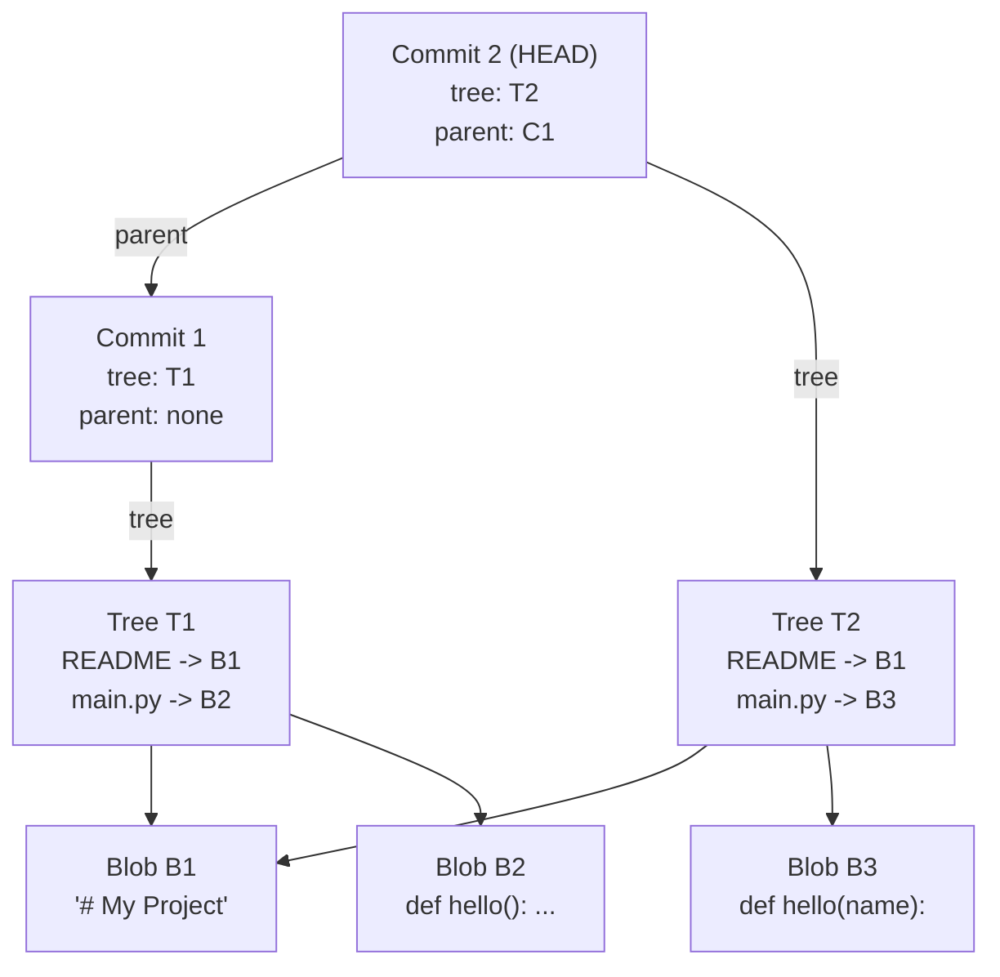

## Keywords in This File
{: .no_toc }

| # | Keyword | Difficulty |
|---|---------|------------|
| 20 | [Git Object Model: Blobs, Trees, Commits, and Tags](#git-object-model-blobs-trees-commits-and-tags) | ★★★ |

---

# Git Object Model: Blobs, Trees, Commits, and Tags

**Interview Weight:** High - understanding Git's internal object model
is the litmus test that separates engineers who use Git from those who
understand it; required for senior and staff-level interviews at platform
and infrastructure-focused teams.

---

## Quick Reference

**One-line definition:** Git stores all content as four types of
immutable, content-addressed objects: blobs (file data), trees (directory
listings), commits (snapshots with metadata), and tags (named pointers
with optional metadata); every SHA is computed from the object's full
content, making Git's history a Merkle DAG with cryptographic integrity.

**One analogy:** Git's object store is like a postal system where every
envelope's address IS its content - you cannot change the content without
getting a new address (SHA), and you can verify any package by
re-computing the address from what's inside.

**Key terms:**
- **blob** - stores raw file content with no filename or path information
- **tree** - stores a directory listing: file mode, filename, and SHA for each entry
- **commit** - stores a snapshot: root tree SHA, parent commit SHAs, author/committer, message
- **tag object** - an annotated tag: points to another object (usually commit), includes tagger, date, message
- **SHA-1/SHA-256** - the hash algorithm used to address objects (Git transitioning from SHA-1 to SHA-256)
- **Packfile** - compressed binary file storing many objects with delta compression
- **object store** - the `.git/objects/` directory holding all object files

---

### 🎯 Model Answer

**30-second answer:**

"Git has four object types: blobs store file content, trees store
directory listings (with blob/tree SHAs and filenames), commits store
snapshots (root tree SHA, parent SHAs, author, message), and annotated
tag objects store metadata pointing to a commit. Every object is
identified by the SHA hash of its content - change anything and you get
a different SHA. The history is a Merkle DAG: each commit's SHA covers
the full snapshot, so any modification to any file in history is
detectable."

**3-minute answer:**

Git is, at its core, a content-addressable key-value store built on four
immutable object types.

**Blob:**
Stores raw file bytes. No filename, no path, no permissions.
Two files with identical content share a single blob object.
`git hash-object myfile.txt` computes the blob SHA without storing it.
`git cat-file -p <sha>` prints the blob content.

**Tree:**
Stores a directory snapshot as a list of entries. Each entry contains:
- `mode` (100644=regular file, 100755=executable, 040000=directory,
  120000=symlink)
- `type` (blob or tree)
- `sha` (SHA of the referenced object)
- `name` (filename for this entry in this directory)

A tree only contains its immediate children; subdirectories are
referenced by nested tree objects.

**Commit:**
Stores a single snapshot of the entire repository:
- `tree` - SHA of the root tree (the top-level directory)
- `parent` - SHA(s) of parent commit(s) (zero for initial, one for
  normal commits, two+ for merges)
- `author` - name, email, timestamp
- `committer` - name, email, timestamp (different from author after rebase)
- commit message

A commit does NOT store a diff. Git computes diffs by comparing two
commit trees. Snapshots enable fast branch switching; diffs are computed
on demand.

**Tag object (annotated tag):**
Created by `git tag -a`. Stores:
- `object` - SHA of the tagged object (usually a commit)
- `type` - the type of the tagged object
- `tag` - the tag name
- `tagger` - name, email, timestamp
- tag message (and optionally a GPG signature)

Lightweight tags are just ref files (pointers to a commit SHA);
they are NOT Git objects.

**Merkle DAG structure:**
Each commit's SHA depends on its tree SHA, which depends on all blob
and subtree SHAs. Altering any file in any historical commit would
require changing the blob, changing the tree referencing it, changing
the commit referencing that tree, and changing all subsequent commits
in the chain. Git's history is tamper-evident by construction.

**Blank Mind Recovery:**

"Git stores four object types: blob (file content), tree (directory
with names and SHAs), commit (snapshot with root tree + parents +
author), and tag (annotated tag with metadata). Every object's address
IS its content hash. You cannot modify history without changing all
the SHAs downstream."

---

### 📘 Concept Explanation

#### 1. What Is It?

Git's object model is a directed acyclic graph (DAG) of four immutable
content-addressed objects stored in `.git/objects/`. The SHA hash of
each object's content is its address. Two identical files have one blob;
no object ever changes in place - new versions create new objects.

#### 2. Why Does It Exist?

The content-addressed design enables:
1. **Deduplication:** identical content (e.g., unchanged files across
   1,000 commits) creates exactly one blob object
2. **Integrity:** any corruption or tampering changes the SHA, which
   breaks the parent chain and is immediately detectable
3. **Efficient branching:** branches are just files containing a commit
   SHA; switching branches is O(1) pointer update
4. **Snapshot semantics:** each commit is a complete snapshot with no
   delta chain to replay, unlike older VCS systems (SVN stored diffs)

#### 3. How Does It Work? (Internal Mechanism)

```
echo "hello world" > hello.txt
git add hello.txt
git commit -m "initial"

Object store after commit:
.git/objects/
  3b/18e512dba79e4c8300dd08aeb37f8e728b8dad
  # blob: "blob 12\0hello world\n"
  # SHA: sha1("blob 12\0hello world\n")

  9d/aeafb9864cf43055ae93beb0afd6c7d144bfa
  # tree: "tree 31\0100644 hello.txt\0<blob-sha-bytes>"

  a8/9d3ac7e73d5a8e5f9d3e2b4b7f9d2a3e4b5c6
  # commit: "commit ...\ntree 9daeafb...\nauthor...\n\ninitial\n"
```

> **Code walkthrough:** Each object is stored as a zlib-compressed file
in `.git/objects/xx/` where `xx` is the first 2 hex chars of the SHA
and the remaining 38 chars are the filename. The object's raw content
is prepended with a header: `"<type> <size>\0"`. KEY MECHANISM: the SHA
is computed from the complete header + content, so the SHA uniquely and
verifiably identifies the exact content. WHY IT MATTERS: if two files
have the same content, they share one blob object - this is how Git
handles moving files efficiently (the blob already exists). WHAT BREAKS:
if a blob object is corrupted (file system error), `git fsck` will report
it as a hash mismatch. TAKEAWAY: `git fsck` runs SHA verification on
every object in the store and is the diagnostic tool for detecting
repo corruption.

#### 4. Key Properties and Behaviors

**Inspecting objects directly:**

```bash
# Create a test file and commit
echo "version 1" > test.txt
git add test.txt
git commit -m "add test"

# Get the commit SHA
git rev-parse HEAD
# abc123def456...

# Inspect the commit object
git cat-file -t abc123  # type: commit
git cat-file -p abc123  # pretty-print contents
# tree 9fae1b...
# author Alice <alice@example.com> 1700000000 +0000
# committer Alice <alice@example.com> 1700000000 +0000
# add test

# Inspect the tree
git cat-file -p 9fae1b
# 100644 blob c8be1d... test.txt

# Inspect the blob
git cat-file -p c8be1d
# version 1

# Compute a blob SHA without storing
echo -n "version 1" | git hash-object --stdin
# Same as c8be1d...
```

> **Code walkthrough:** `git cat-file -p` is the key inspection command;
`-t` returns the type; `-p` pretty-prints. KEY MECHANISM: you can
traverse the full object graph from any commit SHA: commit -> tree ->
blobs/subtrees. WHY IT MATTERS: understanding this traversal explains
why `git log --oneline` is fast (it only reads commit objects, not blobs)
while `git diff HEAD~100..HEAD` can be slow (it reads all blob pairs
that changed). WHAT BREAKS: if you `git cat-file -p <sha>` and get
"fatal: Not a valid object name", the object is missing - run
`git fetch --all` or `git fsck` to diagnose. TAKEAWAY: `git cat-file`
is the Swiss Army knife for Git object inspection.

**Commit object structure in detail:**

```bash
# Show raw commit object bytes (before decompression)
git cat-file commit HEAD
# tree abc123
# parent def456
# author Alice <alice@example.com> 1700000000 +0000
# committer Alice <alice@example.com> 1700000000 +0000
#
# Add payment service

# Merge commit has two parents:
git cat-file commit <merge-sha>
# tree xyz789
# parent abc123  <- first parent (main)
# parent def456  <- second parent (feature branch)
# author ...
# ...
# Merge branch 'feature/payment'

# Why author != committer:
# Original author: wrote the commit
# Committer: the person who applied it (after rebase, cherry-pick)
git rebase origin/main
# All rebased commits: author = original, committer = you
```

> **Code walkthrough:** The `tree` field is always the root-level tree
object SHA - the complete snapshot of the repo at this point. KEY
MECHANISM: the commit SHA covers the tree SHA, parent SHA(s), author,
committer, and message; changing any field creates a new SHA. The
author/committer split enables audit trails: rebasing preserves the
original author while recording who integrated the change. WHY IT
MATTERS: for compliance and attribution, the committer field shows who
applied a patch, which is critical in the Linux kernel development model.
WHAT BREAKS: two commits with identical author/committer/message/tree/
parent would have the same SHA - this is theoretically possible
(timestamp resolution) but astronomically unlikely with SHA-1.
TAKEAWAY: after `git rebase`, all commit SHAs change even if the content
is identical, because the parent SHAs change.

**Tree object and mode bits:**

```bash
# Inspect a tree with all modes
git cat-file -p HEAD^{tree}
# 040000 tree abc123 src
# 100644 blob def456 README.md
# 100755 blob ghi789 gradlew
# 120000 blob jkl012 link.txt

# Mode meanings:
# 040000 = directory (subtree)
# 100644 = regular file
# 100755 = executable file
# 120000 = symbolic link
# 160000 = gitlink (submodule reference)

# Symlink blob content is the link target path
git cat-file -p jkl012
# ../actual/target/path

# Submodule gitlink - points to a commit SHA in another repo
git cat-file -p <submodule-tree-entry-sha>
# (empty - gitlinks point to external repo commits)
```

> **Code walkthrough:** A tree stores modes as Unix-style permission
bits in a compact format. KEY MECHANISM: executable files (100755) have
their mode stored in the tree entry; Git sets the execute bit when
checking out such files. Symbolic links store their target path as a blob
but are checked out as actual symlinks. Gitlinks (160000) store a commit
SHA from a DIFFERENT repository - this is how submodules work.
WHY IT MATTERS: knowing that mode bits are stored in trees explains why
`git update-index --chmod=+x script.sh` changes the tree entry without
changing the blob - the file content is unchanged, only the mode in the
tree changes. WHAT BREAKS: on Windows, Git cannot set execute bits
natively; `core.filemode = false` tells Git to ignore mode changes.
TAKEAWAY: `git ls-tree HEAD` shows the same tree information as `git
cat-file -p HEAD^{tree}` and is useful for scripting.

**Annotated tags vs lightweight tags:**

```bash
# Lightweight tag - just a ref file, not an object
git tag v1.0.0 abc123
cat .git/refs/tags/v1.0.0
# abc123...  <- just the commit SHA, no object

# Annotated tag - creates a tag object
git tag -a v1.0.1 -m "Release v1.0.1"
git cat-file -t v1.0.1
# tag  <- it IS a git object
git cat-file -p v1.0.1
# object abc124
# type commit
# tag v1.0.1
# tagger Alice <alice@example.com> 1700000001 +0000
#
# Release v1.0.1

# Get the commit SHA from a tag object
git rev-parse v1.0.1^{}   # dereference tag -> commit
git rev-parse v1.0.1      # SHA of the tag object itself
```

> **Code walkthrough:** A lightweight tag is a 41-byte file in
`.git/refs/tags/` containing the commit SHA. An annotated tag creates a
tag object in `.git/objects/` with its own SHA and then creates a ref
file pointing to the TAG object SHA (not the commit SHA). KEY MECHANISM:
`v1.0.1^{}` dereferences through the tag object to the commit, while
`v1.0.1` without `^{}` resolves to the tag object SHA. WHY IT MATTERS:
signed tags require annotated tags (the signature is stored in the tag
object); lightweight tags cannot be signed. WHAT BREAKS: `git describe`
only works with annotated tags by default; lightweight tags are skipped.
TAKEAWAY: always use annotated tags (`-a`) for releases; reserve
lightweight tags for personal bookmarks.

#### 5. Common Use Cases

1. **Repo corruption diagnosis** - `git fsck` verifies SHA integrity of
   every object; corrupted blobs are reported
2. **Deduplication understanding** - explain why renaming a file does
   not create a new blob if content is unchanged
3. **Bisect internals** - bisect traverses commit parent pointers;
   understanding the DAG explains why bisect is O(log n)
4. **Size optimisation** - identify large blobs with `git cat-file`
   traversal; explain pack files and delta compression
5. **Submodule internals** - gitlinks in trees explain what a submodule
   "points to" and why it can go out of sync

#### 6. Trade-offs

| Property | SHA-1 (current) | SHA-256 (transitional) |
|----------|----------------|------------------------|
| Collision resistance | 160-bit (weak) | 256-bit (strong) |
| Repo size | SHA stored as 20 bytes | SHA stored as 32 bytes |
| Compatibility | Universal | Requires Git 2.29+ |
| Security | SHAttered (2017) showed feasibility | No known attacks |
| Migration | - | `git init --object-format=sha256` |

#### 7. Performance Characteristics

- **Object lookup:** O(1) by SHA prefix (filesystem lookup in
  `.git/objects/xx/` directory)
- **Commit graph traversal:** O(commits) - `git log` reads commit
  objects only, not blobs
- **Diff computation:** O(changed files) - compares blob SHAs in trees
  first (unchanged = same SHA, skip immediately); only reads blob
  content for changed SHAs
- **Packfile performance:** delta compression reduces object storage by
  60-90%; objects are grouped by similarity for better delta chains
- **SHA uniqueness:** with 160-bit SHA-1, probability of collision across
  1 million objects is ~10^-33 (effectively zero in practice)

#### 8. Real-World Context

Git's object model was designed by Linus Torvalds in 10 days in April
2005. The content-addressed design was directly influenced by Monotone's
SHA-1 hash-addressed storage. The 2017 SHAttered attack demonstrated
a SHA-1 collision, prompting Git's ongoing migration to SHA-256
(object-format=sha256, experimental in Git 2.29+). GitHub, GitLab, and
Bitbucket all store the raw Git object store on their servers; when you
`git push`, you are literally copying Git objects from your local
`.git/objects/` to theirs. Pack files (`.git/objects/pack/`) were
added in Git 0.99 and are the key optimisation that makes large repo
clones feasible.

---

### 💻 Code Example

**BAD pattern - not understanding object deduplication:**

```bash
# Developer copies identical files across directories
cp services/auth/validator.py services/payment/validator.py
git add .
git commit -m "add validator to payment service"

# Assumption: this doubles storage
# Reality: git deduplicates identical blobs
git cat-file -p HEAD^{tree}:services/auth/validator.py
# abc123...
git cat-file -p HEAD^{tree}:services/payment/validator.py
# abc123...  <- SAME SHA - one blob object, two tree references
du -sh .git/objects/
# -> Storage grows by one new TREE object, not two BLOBs

# The misunderstanding: developer tries to "optimise" by
# creating a shared symlink, introducing fragile path coupling
```

> **Code walkthrough:** WHAT IT SHOWS: Git automatically deduplicates
identical content across the entire object store. KEY MECHANISM: both
tree entries point to the same blob SHA; Git stores the blob once
regardless of how many paths reference it. WHY IT MATTERS: this is why
Git handles file moves and renames efficiently - if you `git mv` a file,
the blob is unchanged; only the tree entry (filename) changes. WHAT
BREAKS: symlinks as "deduplication" in a monorepo create import-path
coupling and cause issues on Windows where symlinks require admin rights.
TAKEAWAY: trust Git's built-in deduplication; never use symlinks to
share code across directories.

**GOOD pattern - using object model knowledge for debugging:**

```bash
# Scenario: production binary is wrong, CI claims nothing changed
# Diagnose by comparing tree SHAs to verify exact snapshot

# Get the tree SHA of the production commit
git cat-file -p production-sha
# tree 9fae1b...  <- what was deployed

# Get the tree SHA of what CI built from
git cat-file -p ci-build-sha
# tree 9fae1b...  <- must match for identical build inputs

# If tree SHAs differ: find which subtree differs
git diff-tree --name-only production-sha ci-build-sha
# -> shows exactly which files differ

# Verify a specific blob matches the deployed artifact
sha1sum deployed-binary
# e4a7... 
git cat-file blob HEAD:path/to/binary | sha1sum
# e4a7...  <- must match

# Find when a specific file's blob changed
git log --all --follow -- path/to/file.py
git log --oneline --diff-filter=M -- path/to/file.py
```

> **Code walkthrough:** `git diff-tree` compares two commit trees and
reports changed paths without checking out files. KEY MECHANISM: because
commits store complete snapshots, you can compare any two commits by
comparing their root tree SHAs; identical subtrees have identical SHAs
and are skipped instantly. WHY IT MATTERS: this explains how `git diff`
is fast: it traverses the tree hierarchy comparing SHAs level by level,
reading blob content only for paths where the SHA differs. WHAT BREAKS:
if CI clones with `--depth 1` (shallow), it may not have the production
commit's objects for comparison. TAKEAWAY: `git diff-tree` is the
production debugging tool for "what exactly changed between these two
deployed commits."

---

### 🎓 Answers by Seniority

**Junior/Mid:**

"Git stores everything as objects identified by SHA hashes. There are
four types: blobs store file content, trees store directories with the
filenames and blob SHAs, commits store a root tree SHA plus parent
commit SHAs and author info, and annotated tags are objects that point
to commits with extra metadata. Because the SHA is computed from the
content, any change creates a new object with a new SHA - you can't
modify history without breaking the SHA chain."

**Senior/Staff:**

"The object model is the foundation of everything Git does.

The four objects form a Merkle DAG: each commit SHA cryptographically
covers its tree SHA, which covers all blob and subtree SHAs recursively.
This gives Git tamper-evident history by construction - not a policy
decision but a structural property.

The practical implications I reach for regularly:

**Deduplication:** identical files across a monorepo share one blob. A
1 MB file used in 50 places takes 1 MB + 50 tree entries. This is why
moving files in Git is instant (no data copying).

**Diff performance:** `git diff A B` starts at the root tree and
recursively compares subtree SHAs. If two 10,000-file repos differ in
one file deep in one subdirectory, Git finds it by comparing 3-4 tree
SHAs and then one blob pair. This is why git diff is O(changed files),
not O(total files).

**Pack files:** loose objects eventually get packed. Delta compression
groups similar blobs (e.g., successive versions of the same file) and
stores diffs between them. `git gc` triggers this; push/fetch trigger
it lazily. Understanding this explains why `git push` can be slow after
many local commits (computing delta chains) and why `git repack -adf`
is the maintenance command for large repos.

**SHA-256 migration:** Git is transitioning from SHA-1 (vulnerable to
SHAttered collision attack) to SHA-256. Repos can be initialised with
`--object-format=sha256`; mixed-format repos are not yet supported."

---

### ⚠️ Common Misconceptions

**Misconception 1: "Git stores diffs between commits."**

Git stores complete snapshots, not diffs. Each commit's tree object
represents the full state of every file at that point. Git computes
diffs on demand by comparing two snapshots. This is the opposite of
SVN (which stored forward diffs) and is what makes Git branch switching
instantaneous (just update the HEAD pointer to a different commit SHA).

**Misconception 2: "Deleting a file from a commit frees disk space."**

Deleting a file creates a new commit without that file's path in the
tree. The blob object still exists and is still reachable from the
original commit. Disk space is only freed when (a) the original commit
is no longer reachable (i.e., it was rebased or filter-repo'd away) AND
(b) `git gc` has pruned unreachable objects (default retention is 90 days
for unreachable objects, 2 weeks for reflog entries).

**Misconception 3: "Branches are heavy objects like in SVN."**

A branch in Git is a file in `.git/refs/heads/` containing a 40-char
commit SHA. Creating a branch is creating a 41-byte file. Merging two
branches creates one merge commit object. There is no copying of the
file tree.

**Misconception 4: "A tag and a branch are the same type of thing."**

Both are ref files pointing to commit SHAs. The difference: a branch
is updated on every new commit (it advances with the branch). A tag is
a fixed pointer - it never moves unless explicitly re-tagged.
Additionally, annotated tags are full Git objects; lightweight tags
are just ref files (not stored in `.git/objects/`).

---

### 🚨 Failure Modes and Diagnosis

**Failure 1: Repository corruption - object has wrong hash**

Symptom: `error: object file ... is empty` or
`fatal: loose object ... (stored in ...) is corrupt`

Diagnosis:
```bash
# Run fsck to find all corruption
git fsck --full 2>&1 | head -50
# error: sha1 mismatch for ....
# error: object file .... is empty

# Try to find the object in reflog backups
git fsck --lost-found
# Recoverable objects go to .git/lost-found/

# If it's a blob, try to find it in pack files
git cat-file -p <sha> 2>/dev/null || \
  git unpack-objects < .git/objects/pack/*.pack
```

> **Code walkthrough:** `git fsck --full` verifies the SHA of every
object in the store against its content. An empty object file means the
OS wrote 0 bytes (common cause: disk full during write, interrupted push,
or filesystem error). KEY MECHANISM: Git's write protocol is atomic -
it writes to a temp file then renames; an empty file usually means the
rename succeeded after a crash, leaving a 0-byte file. WHY IT MATTERS:
a corrupted blob blocks all git commands that traverse the object that
references it. WHAT BREAKS: if the corrupted object is not in any remote,
it may be unrecoverable (unless backup exists). TAKEAWAY: always have a
remote backup; `git push` is the equivalent of an off-site backup for
the object store.

**Failure 2: Huge repository with inexplicable size**

Symptom: `.git` directory is 10 GB; `ls -la docs/` shows only 50 MB of
files.

Diagnosis:
```bash
# Find the largest objects in ALL of history
git rev-list --objects --all | \
  git cat-file --batch-check='%(objecttype) %(objectsize:disk) \
%(rest)' | \
  sort -k2 -rn | head -20

# Find which commit introduced large objects
git log --all --oneline --follow -- <large-file-path>

# Check pack file sizes
ls -lh .git/objects/pack/

# Count loose vs packed objects
git count-objects -vH
```

> **Code walkthrough:** `git rev-list --objects --all` lists every
reachable object; `%(objectsize:disk)` shows the on-disk compressed size.
KEY MECHANISM: large blobs may have been deleted from HEAD but remain
reachable from historical commits; they appear in the pack file and are
included in every full clone. WHY IT MATTERS: a 500 MB binary committed
in commit A and deleted in commit B still adds 500 MB to every full clone
indefinitely. WHAT BREAKS: `git gc --prune=now` only prunes objects that
are NOT reachable from any ref (including reflog); historical blobs are
reachable from commits and are never pruned by normal GC. TAKEAWAY: use
`git filter-repo --strip-blobs-bigger-than 50M` to remove historical
large blobs, then `git push --force --all` to update the remote.

**Failure 3: SHA-1 prefix ambiguity**

Symptom: `git cat-file -p abc1` returns `error: short SHA1 abc1 is
ambiguous`.

Diagnosis:
```bash
# Git needs enough prefix chars to uniquely identify
# In a 1M-object repo, 7-8 chars is usually enough
# In a 10M-object repo, 8-9 chars may be needed

# Show the minimum abbreviation length
git config --global core.abbrev 10  # use 10 chars minimum

# Find all objects with the ambiguous prefix
git rev-parse --disambiguate abc1
# Lists all SHAs starting with abc1
```

> **Code walkthrough:** Git uses the shortest unique prefix to represent
SHAs in log output. The `core.abbrev` setting controls the minimum length;
Git auto-extends if needed to avoid ambiguity in a specific repo.
KEY MECHANISM: Git's packed-refs and object database use a binary search
on sorted SHAs; finding all SHAs with a given prefix is O(log n).
WHY IT MATTERS: in repos with millions of objects (monorepos), 7-char
abbreviations are likely to be ambiguous; set `core.abbrev = 12` in
such repos. WHAT BREAKS: scripts that hardcode 7-char SHAs will fail
in large repos. TAKEAWAY: use full 40-char SHAs in automation; let
`--abbrev` or `core.abbrev` control display-only abbreviations.

---

### 🎯 Interview Deep-Dive

| Question Type | Count | Target Audience |
|---|---|---|
| Conceptual | 4 | All levels |
| Debugging | 3 | Mid-Senior |
| Trade-off | 2 | Senior-Staff |
| Behavioral | 1 | Mid-Senior |
| Architecture | 2 | Staff |

---

**[CONCEPTUAL] Q1 - Explain exactly what happens in the Git object store when you run `git commit`. What objects are created and why?**

When you run `git commit`, Git performs these object creation steps in
order:

**Step 1: Blob objects for staged files**
For each file in the staging area (index), Git computes the SHA-1 of:
`"blob <size>\0<file-content>"` and stores the object if it doesn't
already exist. Files unchanged since the last commit reuse existing
blobs.

**Step 2: Tree objects (bottom-up)**
Git recursively creates tree objects for each modified directory:
- For each directory with staged changes, a new tree object is created
- Unchanged subdirectories reuse their existing tree SHAs
- Tree building proceeds from leaf directories to root

**Step 3: Root tree object**
The top-level directory tree is created, incorporating the new subtrees
and the unchanged subtree SHAs from the previous commit.

**Step 4: Commit object**
A new commit object is created with:
- `tree <root-tree-sha>`
- `parent <HEAD-sha>` (from current `.git/HEAD` -> current branch)
- `author` and `committer` from config
- The commit message

**Step 5: Branch pointer update**
The current branch file (`.git/refs/heads/main`) is updated atomically
to point to the new commit SHA.

Typical object counts for a commit changing 3 files in 2 directories:
- 3 new blob objects (for changed files; unchanged files reuse existing)
- 2 new tree objects (for the 2 modified directories)
- 1 new tree object (root)
- 1 new commit object
Total: 7 new objects

*What separates good from great:* knowing that unchanged files and
directories create ZERO new objects (they reuse existing SHAs) - this
is the efficiency of the snapshot model.

---

**[CONCEPTUAL] Q2 - What is the difference between a tag object and a lightweight tag? When does this difference matter?**

**Lightweight tag:**
Created by `git tag v1.0.0 <sha>`. A file in `.git/refs/tags/v1.0.0`
containing the 40-char SHA of the target commit. NOT a Git object.
`git cat-file -t v1.0.0` returns `commit` (the type of what it points to,
not a tag type).

**Tag object (annotated tag):**
Created by `git tag -a v1.0.1 -m "message"`. Creates a `tag` type Git
object in `.git/objects/` with its own SHA. The ref file `.git/refs/tags/v1.0.1`
points to the TAG OBJECT SHA, not the commit SHA.
`git cat-file -t v1.0.1` returns `tag`.
`git rev-parse v1.0.1^{}` dereferences to the commit SHA.

**When the difference matters:**

1. **Signing:** GPG signatures are stored in the tag object. Lightweight
   tags cannot be signed.

2. **`git describe`:** only finds annotated tags by default. A repo
   with only lightweight tags will fail `git describe`.

3. **Fetching:** `git fetch origin 'refs/tags/*:refs/tags/*'` fetches
   both types. But `--follow-tags` only pushes annotated tags.

4. **Tag metadata:** release timestamps, release notes, tagger identity
   are stored in annotated tags. Lightweight tags carry none of this.

5. **SLSA provenance:** supply chain tools typically require annotated
   (and optionally signed) release tags as anchors.

*What separates good from great:* the `git rev-parse v1.0.1^{}` (double
dereference) syntax and knowing that `git describe` ignores lightweight tags.

---

**[CONCEPTUAL] Q3 - How does Git compute diffs if it stores snapshots instead of diffs?**

Git computes diffs on demand by comparing two commit trees:

**Algorithm:**

```
git diff A B:
  1. Get tree(A) and tree(B)  <- root tree SHAs
  2. Compare top-level trees:
     - For each path in tree(A) and tree(B):
       * Same SHA -> unchanged, skip (O(1) comparison)
       * One side missing -> added/deleted
       * Different SHA and both are trees -> recurse
       * Different SHA and both are blobs -> diff the blobs
  3. For blob pairs that differ:
     - Run diff algorithm (Myers, histogram, etc.)
     - Produce unified diff output
```

> **Code walkthrough:** The SHA comparison at each tree level means
identical subtrees (even large ones) are skipped with a single SHA
comparison. KEY MECHANISM: a repo with 100,000 files where only 3 changed
will traverse approximately log(100,000) tree levels and read only 3
blob pairs. WHY IT MATTERS: this is why `git diff` is O(changed files)
not O(total files), and why switching between two branches with entirely
different file sets (both 10,000 files) updates the working tree in
seconds - tree traversal to find differences is fast. WHAT BREAKS: if
you generate files that change every commit (timestamps, build IDs in
source), every diff traversal must read those blob pairs even if nothing
logically changed. TAKEAWAY: exclude generated files from Git tracking;
if they must be tracked, use a `.gitattributes` merge strategy that
treats them as binary to avoid diff noise.

The specific diff algorithm is configurable: `--diff-algorithm=histogram`
(default since Git 2.17), `--diff-algorithm=patience` (better for
refactored code), `--diff-algorithm=minimal` (smallest diff).

*What separates good from great:* explaining the SHA comparison optimization
that makes diff O(changed files) and knowing the configurable diff algorithms.

---

**[CONCEPTUAL] Q4 - What is a Merkle tree, and how does Git's commit history form a Merkle DAG?**

A Merkle tree is a tree data structure where each non-leaf node is the
hash of its children. The root hash covers the entire tree's content:
any change in any leaf propagates up to change the root.

**Git's Merkle structure:**

```
Commit SHA covers:
  tree SHA covers:
    subtree SHA covers:
      blob SHA (file content)
      blob SHA (file content)
    blob SHA (file content)
  parent SHA -> previous commit's SHA
  author, committer, message

If any file changes:
  blob SHA changes
  -> tree SHA changes (covers the blob)
  -> commit SHA changes (covers the tree)
  -> all subsequent commit SHAs change (cover their parents)
```

> **Code walkthrough:** WHAT IT SHOWS: SHA propagation through the
Merkle DAG - a single file change causes a cascade of SHA changes
upward to the root commit. KEY MECHANISM: each layer's SHA covers its
children; a changed blob produces a new tree SHA, which produces a new
commit SHA, which makes all subsequent commits in the chain have new
SHAs (since they reference the changed parent). WHY IT MATTERS: this
explains why `git rebase` changes all commit SHAs even if the code is
identical - the parent SHA changed. WHAT BREAKS: any tool storing commit
SHAs as permanent identifiers (JIRA links, CI build metadata) will lose
traceability after a rebase. TAKEAWAY: treat commit SHAs as ephemeral
until pushed; after push, never rebase shared history.

This is a **Directed Acyclic Graph (DAG)** because:
- **Directed:** each commit has directed edges to its parent(s)
- **Acyclic:** a commit cannot be its own ancestor (SHA depends on
  parent SHA; a cycle would require a SHA to depend on itself)
- **Merkle:** each node's identity (SHA) cryptographically covers its
  children

**Why this matters for security:**
To inject a malicious commit at any point in history, an attacker would
need to:
1. Forge a blob with the same SHA as the original (SHA-1 preimage
   resistance, computationally infeasible)
2. Forge the tree SHA
3. Forge the commit SHA
4. Forge all subsequent commit SHAs (which cover the previous)

The SHAttered attack (2017) showed that SHA-1 collisions are possible
(two different inputs with the same hash), motivating the SHA-256
migration. Collision resistance (two inputs, same hash) is weaker than
preimage resistance (given hash, find input); attacks exploiting
SHAttered against Git require crafting specific commit objects in advance,
which is significantly harder than generic collisions.

*What separates good from great:* distinguishing collision resistance
from preimage resistance and explaining why SHAttered doesn't immediately
compromise Git history integrity (it requires crafted objects, not
arbitrary forgery).

---

**[DEBUGGING] Q5 - `git log` shows a file was never modified, but `git blame` shows different authors on different lines. How is this possible?**

There are two scenarios:

**Scenario 1 - File moved or renamed with content modifications:**

```bash
# Check if the file was ever renamed
git log --follow --diff-filter=R -- current/path/file.py
# If output shows renames, blame is showing authors
# from the file's history under previous paths

# Blame with follow across renames
git blame --follow current/path/file.py
```

> **Code walkthrough:** `git log --follow --diff-filter=R` finds commits
where the file was renamed (`R` = rename filter). KEY MECHANISM: Git
detects renames by content similarity (default threshold 50%); the file
in the old path and new path must share > 50% of content. WHY IT MATTERS:
blame stops at rename boundaries without `--follow`; lines appear to be
authored by whoever created the file at the new path. WHAT BREAKS:
if the rename was combined with significant content changes (< 50%
similarity), `--follow` loses the trail. TAKEAWAY: for forensic blame,
always use `--follow` and set `diff.renameLimit = 999` for large trees.

**Scenario 2 - Content was moved from another file:**

```bash
# Blame showing motion of code blocks between files
git blame -C -C -C file.py
# -C: detect code moved from other files in the same commit
# -C -C: also detect code moved from modified files
# -C -C -C: also detect code from other commits

# Find where a specific function came from
git log -S "def calculate_tax" --all -- "*.py"
```

> **Code walkthrough:** `git blame -C` enables copy detection within
the same commit; `-C -C` extends to modified files in other commits;
`-C -C -C` extends to all commits. KEY MECHANISM: Git compares code
blocks from the annotated file to code blocks in other files at each
commit level, attributing lines to the commit where they were
ORIGINALLY written. `git log -S` (pickaxe) finds commits that added
or removed the exact string, which is faster for locating the origin.
WHY IT MATTERS: without `-C`, a refactoring that extracts a 200-line
module makes all 200 lines appear authored by the person who did the
extraction. WHAT BREAKS: `-C -C -C` can take minutes on large repos.
TAKEAWAY: `git log -S "function_name"` is faster than `-C -C -C` for
finding a specific code block's origin.

**Scenario 3 - Merge commit brought content from feature branch:**
The lines were authored on the feature branch; the merge commit applied
them. `git log -- file.py` might not show the original commits if they
were squash-merged, but `git blame` shows the original author.

> **Code walkthrough:** `git blame -C -C -C` instructs Git to detect
content movement across files - it compares the current file's content
to all other files modified in the same commit and their ancestors.
KEY MECHANISM: Git matches code blocks by content similarity (not just
exact copy), attributing moved code to the commit where it was originally
written. WHY IT MATTERS: refactoring that moves functions between files
should not reset authorship to the person who moved the code. WHAT
BREAKS: `-C -C -C` is significantly slower than plain `git blame` because
it reads many more blob pairs. TAKEAWAY: use `git blame -C -C` for normal
usage; reserve `-C -C -C` for forensic investigation.

---

**[DEBUGGING] Q6 - A `git clone` succeeds but immediately fails `git fsck`. What are the likely causes?**

A clone that fails `git fsck` has received corrupted objects from the
remote. Sources:

1. **Server-side repository corruption (most common):**
```bash
# On the server
git fsck --full
# If this also fails: server repo is corrupted

# Recovery: restore from backup or re-initialize from another clone
# Find a healthy mirror
git clone --mirror <secondary-mirror> repo-backup.git
cd repo-backup.git && git fsck --full
```

> **Code walkthrough:** `git fsck --full` on the server repo verifies
every object; if it also fails, the server is the corruption source.
`git clone --mirror` creates a bare clone with all refs (branches, tags,
reflog) - a full replica for recovery. KEY MECHANISM: mirror mode copies
all refs including server-side reflogs and alternates configuration.
WHY IT MATTERS: if you restore from mirror backup, all history is
preserved including refs that normal `git clone` would not transfer.
WHAT BREAKS: if the mirror was last synced before the corruption event,
you lose commits since the last sync. TAKEAWAY: run `git fsck` on the
primary server repo nightly; maintain a mirrored backup synced hourly.

2. **Pack file corruption in transit:**
```bash
# Re-clone with verification
GIT_TRACE_PACKET=1 git clone --verbose <url>
# Compare pack SHA checksums
# Git packs include a SHA checksum at the end;
# corruption in transit causes pack validation failure
```

> **Code walkthrough:** `GIT_TRACE_PACKET=1` logs all protocol packets.
In a healthy clone, each pack packet arrives and the final packet
contains the pack checksum. If corruption occurs in transit, Git detects
a checksum mismatch at the end of the pack transfer and aborts. KEY
MECHANISM: Git's smart HTTP/SSH protocol splits pack files into packets
with length prefixes; the final packet contains the full pack's SHA
checksum. WHAT BREAKS: if the proxy or CDN between client and server
corrupts bytes silently (not just dropping packets), the checksum catches
it. TAKEAWAY: always clone over HTTPS (TLS integrity) or SSH from trusted
nodes; avoid proxies that may buffer/modify git traffic.

3. **Object database corruption on local disk:**
```bash
# Check if it's a disk issue
dmesg | tail -50  # look for I/O errors
# Run filesystem check
# (requires unmounting or running from live media)
# On macOS: First Aid in Disk Utility
```

> **Code walkthrough:** `dmesg` reports kernel-level I/O errors; a
clone that fails fsck after a successful transfer may indicate the local
disk wrote corrupted bytes. KEY MECHANISM: ECC RAM detects single-bit
errors; non-ECC RAM (common in developer laptops) can silently corrupt
data in memory before the OS writes it to disk. WHY IT MATTERS: Git
object store files are small and numerous; a filesystem that silently
corrupts small files is particularly dangerous for Git repos. WHAT
BREAKS: if the corruption is in `pack-*.idx` (index file), Git cannot
look up objects; if in `pack-*.pack`, the objects themselves are corrupt.
TAKEAWAY: run `git fsck` after large operations on developer machines;
consider a NAS with ZFS for critical repos (ZFS detects and corrects
corruption with redundant storage).

4. **Remote repository using object format mismatch:**
```bash
git cat-file -p HEAD 2>&1
# Unexpected behaviour with SHA-256 remotes + SHA-1 clients
git --version  # check Git version supports the object format
```

> **Code walkthrough:** `git clone` verifies the pack file's embedded
SHA checksum during transfer; if this check fails, clone aborts. But
individual object SHAs are not verified during clone (for performance);
they are verified by `git fsck`. This is why clone can succeed but fsck
can fail. KEY MECHANISM: pack checksum covers the pack file as a whole;
individual object content verification requires unpacking and re-hashing
each object. WHAT BREAKS: running `git fsck` in CI after clone is a
useful integrity check for critical repositories. TAKEAWAY: add `git fsck
--no-dangling` to the post-clone step in sensitive CI pipelines.

---

**[DEBUGGING] Q7 - Two engineers have commits with different SHAs but report identical content, author, and timestamp. Is this possible? What would cause it?**

Yes, this is possible and expected in several scenarios:

**Scenario 1 - Different parent commits:**
Even if two commits have identical author, timestamp, message, and root
tree, if their parent SHAs differ, their commit SHAs differ. This happens
when both engineers commit from the same base but to diverged branches.

**Scenario 2 - Different committer vs author:**
After a rebase, the committer (who applied the rebase) and committer
timestamp change. Two commits that appear identical in `git log` (author
+ message) may differ in committer metadata.

```bash
# Show full commit metadata including committer
git cat-file commit HEAD
# author Alice ... 1700000000 +0000
# committer Alice ... 1700001000 +0000  <- different timestamp!
```

> **Code walkthrough:** `git cat-file commit HEAD` prints the raw commit
object text, including both author and committer lines with their
independent timestamps. KEY MECHANISM: after `git rebase`, the committer
timestamp is set to the rebase operation time (now), while the author
timestamp is preserved from the original commit. WHY IT MATTERS: `git
log` by default shows author date; `git log --format="%cd"` shows
committer date. A commit that shows an old date in `git log` may have
a very recent committer date, meaning it was recently rebased. WHAT
BREAKS: build systems that use commit timestamps for artifact versioning
may produce confusing version numbers after a rebase. TAKEAWAY:
`git log --format="%ad %cd %s"` to show both author and committer dates
for suspicious commits.

**Scenario 3 - Timezone offset differences:**
`1700000000 +0000` and `1700000000 +0100` represent the same instant
but produce different commit objects (the raw timezone offset string is
part of the commit data).

**Scenario 4 - Trailing whitespace in message:**
`"fix bug"` vs `"fix bug "` (trailing space) produces different commit
SHAs even though `git log --oneline` shows them identically.

*What separates good from great:* knowing that committer timestamp and
timezone are part of the commit object data and that even invisible
whitespace differences create different SHAs.

---

**[TRADE-OFF] Q8 - Why is Git transitioning from SHA-1 to SHA-256? What are the practical implications for existing repositories?**

**Why SHA-256:**

The SHAttered attack (2017, CWI/Google) produced two different PDF files
with the same SHA-1 hash. While this did not immediately compromise Git
(it requires crafting specific objects in advance), it demonstrated that
SHA-1 collision resistance is broken. Git's integrity guarantees rest on
hash collision resistance; SHA-1 is no longer a safe foundation.

SHA-256 provides 256-bit collision resistance (vs 160-bit), making
birthday-attack complexity ~2^128 (vs ~2^80 for SHA-1).

**Practical implications:**

| Aspect | Impact |
|--------|--------|
| New repos | `git init --object-format=sha256` (Git 2.29+) |
| Existing repos | Cannot be in-place converted; require full migration via `git-filter-repo` |
| SHA display | All SHAs are 64 hex characters instead of 40 |
| Interoperability | SHA-256 repos cannot exchange objects with SHA-1 repos (yet) |
| Platform support | GitHub testing; most platforms still SHA-1 only |
| CI scripts | Any script with hardcoded 40-char SHA patterns breaks |

The transition is a multi-year effort. Most production repositories will
remain SHA-1 for years. The practical advice: enable SHA-256 for NEW
repositories in security-sensitive contexts; do not migrate existing
production repositories until platform support is universal.

*What separates good from great:* distinguishing collision resistance
from preimage resistance and noting that existing repos cannot be in-place
migrated.

---

**[TRADE-OFF] Q9 - Compare Git's snapshot model against SVN's delta model. When does each excel?**

| Property | Git (snapshots) | SVN (deltas / changesets) |
|----------|----------------|--------------------------|
| Branch switching | O(1) - update HEAD pointer | O(changed files) - replay deltas |
| History traversal | O(commits) - fast | O(commits) - similar |
| Disk storage | Efficient (deduplication) | Efficient (deltas) |
| Offline work | Full history local | Requires server for history |
| Blame speed | Fast (snapshot comparison) | Depends on delta chain |
| Initial checkout | Requires downloading all commits | Downloads working copy only |
| Conflict resolution | Distributed, each clone is standalone | Centralised, server is truth |
| Partial checkout | Sparse checkout (approx) | Native sparse checkout (svn paths) |

**When snapshots excel:**
- Distributed workflows (no always-on server needed)
- Frequent branching and merging (branch is O(1) pointer)
- Large binary files with deduplication (identical blobs stored once)
- Offline development

**When deltas excel (SVN advantages that remain):**
- True partial checkout of repo subtrees (SVN natively; Git sparse checkout
  is an approximation)
- Very large single files with frequent edits (SVN's delta chain is space-
  efficient for a heavily-edited 1 GB binary; Git creates a new blob for
  every version)
- When only the latest revision is needed (shallow SVN checkouts are native;
  Git shallow clones are a workaround)

*What separates good from great:* knowing that SVN actually has superior
sparse checkout for genuinely partial repositories (e.g., monorepos where
you only work on one subdirectory), and that Git's sparse checkout is an
approximation that still downloads all commits.

---

**[BEHAVIORAL] Q10 - Tell me about a time you used your knowledge of Git internals to solve a problem that others couldn't.**

Strong answer structure:

**Situation:** production deployment was blocked because a required
library file was "missing" from the deploy artifact, but `git log`
showed no recent changes to that file.

**Task:** diagnose why the build artifact differed from what Git history
showed.

**Action:** instead of trusting `git log`, directly compared tree SHAs:
`git cat-file -p <deploy-commit>^{tree}` revealed the file DID exist
in the commit tree. Compared the tree SHA to what CI checked out by
running `git ls-tree HEAD`. Found a discrepancy in a nested subtree -
a submodule gitlink was pointing to a stale commit SHA that had been
force-pushed in the submodule repo. The parent repo's tree still had
the old submodule SHA, but the submodule remote no longer had that
commit (it was force-pushed away).

**Result:** identified the exact broken gitlink, updated the submodule
reference to the new SHA, resolved the build failure in 20 minutes. The
team had been troubleshooting for 3 hours by checking source code and
CI logs without looking at the Git object graph directly.

*What separates good from great:* using `git cat-file` and `git ls-tree`
to bypass the high-level git log abstraction and go directly to the
object store for forensic analysis.

---

**[ARCHITECTURE] Q11 - Design a system to verify the integrity of a critical Git repository's complete history at regular intervals.**

**Requirements:** detect corruption, tampering, or unexpected history
modification in a critical repository (e.g., an artifact signing repo
or a compliance audit repo).

**Architecture:**

```
Integrity verification system:

1. Scheduled integrity scan (nightly):
   git fsck --full --no-dangling
   -> reports any corrupted or dangling objects
   -> alert on any non-zero output

2. Ref snapshot comparison:
   # Record all ref SHAs
   git show-ref --head > /secure-storage/refs-$(date +%Y%m%d).txt
   # Daily diff against previous
   diff refs-yesterday.txt refs-today.txt
   -> unexpected ref deletions or non-fast-forward changes = alert

3. Commit graph verification (tamper detection):
   # Verify the full commit graph SHA chain
   git log --format="%H %T %P" HEAD > commit-graph.txt
   sha256sum commit-graph.txt > commit-graph.sha256
   # Store sha256 in immutable external store (S3 with Object Lock,
   #   HSM, or Sigstore Rekor)
   # Daily: recompute and compare to stored value

4. Signed-commit enforcement check:
   git log --format="%H %G?" main
   # Alert if any commit has G?=N (not signed) or G?=B (bad signature)

5. Large blob watch:
   git rev-list --objects HEAD | \
     git cat-file --batch-check='%(objectsize) %(rest)' | \
     awk '$1 > 10485760 {print}' | wc -l
   # Alert if new blobs > 10MB appear (unauthorized binary injection)
```

> **Code walkthrough:** The key insight is layered verification: `git
fsck` catches storage corruption; ref snapshot diff catches unexpected
history rewriting (force pushes that removed commits); commit-graph SHA
comparison in external immutable storage catches tampering that could
also corrupt `git fsck`'s ability to detect itself. KEY MECHANISM:
storing the commit graph hash in Sigstore Rekor creates an auditable,
externally verifiable timestamp proving the repo was in a specific state
at a specific time. WHY IT MATTERS: an attacker with server write access
could corrupt both the repo and the fsck output; external verification
is required for genuine tamper detection. WHAT BREAKS: this system
produces false alerts if legitimate history rewrites occur (e.g., secret
removal with filter-repo); you must update the external hash store after
any authorised rewrite. TAKEAWAY: combine internal integrity (`git fsck`)
with external immutable evidence (Rekor or signed snapshots) for defence
in depth.

*What separates good from great:* the external immutable storage for
commit-graph hashes - detecting tampering that also corrupts the integrity
verification system itself.

---

**[ARCHITECTURE] Q12 - How would you implement a custom Git storage backend for a regulated industry that requires immutable audit logs of every operation?**

**Requirements:** immutable audit trail, WORM (Write Once Read Many)
storage, every push operation logged with identity, every read logged
for compliance.

**Architecture:**

```
Custom Git Backend Components:

1. Git protocol layer (HTTP smart protocol or SSH):
   - All git operations go through this layer
   - Identity bound to mTLS client certificate or
     OIDC token (zero-trust)

2. Pre-receive hook (authorisation):
   - Verify identity against LDAP/AD group
   - Log: {identity, repo, refs-pushed, timestamp, IP}
   - Reject force pushes to protected refs
   - Trigger secret scanning (gitleaks)

3. Object storage (WORM backend):
   - Git objects stored in S3 with Object Lock (WORM)
   - Pack files are immutable once written
   - Deletion requires multi-party authorisation
   - Option: store object store in Sigstore transparency log

4. Audit log (append-only):
   - All pre-receive/post-receive events -> immutable log
   - Cloud: CloudTrail (AWS), Audit Logs (GCP/Azure)
   - On-prem: Kafka with WORM topic retention

5. Read audit (compliance):
   - Proxy all HTTP/SSH git reads through authenticated gateway
   - Log: {identity, repo, operation (clone/fetch/push), timestamp}
   - git clone --depth 1 by developers = logged as "clone" event

6. Integrity verification:
   - Nightly: re-hash all pack files against stored checksums
   - Weekly: full git fsck
   - Quarterly: independent third-party clone + verification
```

> **Code walkthrough:** The WORM S3 bucket with Object Lock prevents
object deletion for a configurable retention period (e.g., 7 years for
financial compliance). Every push creates new pack files that are
immediately locked; no one (including bucket admins) can delete them
during the retention period. KEY MECHANISM: Git's write-once object model
maps naturally to WORM storage - objects are never modified in place,
only new objects are written. WHY IT MATTERS: this architecture satisfies
SOX, PCI-DSS, HIPAA, and FedRAMP requirements for software change audit
trails. WHAT BREAKS: `git gc` would normally prune unreachable objects;
in a compliance context, `gc` must be disabled or scoped to not prune
objects within the retention window. TAKEAWAY: Git's immutable object
model is a natural fit for compliance WORM requirements; the engineering
work is in the authentication, authorisation, and audit logging layers,
not in modifying Git's storage.

*What separates good from great:* mapping Git's write-once object model
to WORM storage as a natural fit, and noting that `git gc` must be
disabled to preserve the compliance audit trail.

---

### ⚖️ Comparison Table

| Object Type | Stores | SHA covers | Created by | Unique property |
|-------------|--------|-----------|------------|-----------------|
| Blob | Raw file bytes | type header + content | git add | Deduplicated; no filename |
| Tree | Directory listing (mode, name, sha) | type header + entries | git add (implicitly) | Recursively covers subtrees |
| Commit | Snapshot reference | tree + parents + author + message | git commit | Parent chain forms DAG |
| Tag object | Pointer + metadata | object sha + tagger + message | git tag -a | Can be GPG-signed |
| Ref (branch/tag) | Commit/tag SHA | N/A (not an object) | git branch/tag | Mutable; not stored in objects/ |
| Packfile | Many objects compressed | Pack checksum | git gc, git push | Delta compression, efficient storage |

---

### 🏛️ System Design

**Scaling Git object storage for a 500GB monorepo**

**Problem:** A repository with 10 years of history has grown to 500 GB.
`git clone` takes 45 minutes. Developer productivity is suffering.

**Design:**

```
Layer 1: Object storage optimisation
  - git repack -adf --window=250 --depth=50
    (aggressive delta compression)
  - git multi-pack-index (MIDX) for fast object lookup
  - git commit-graph (pre-computed commit traversal cache)

Layer 2: Partial clone infrastructure
  - Server configured for partial clone support
    (git config uploadpack.allowFilter true)
  - CDN for pack file distribution
  - Developer default: --filter=blob:none (blobless)

Layer 3: Sparse checkout tooling
  - per-team sparse checkout profiles stored in repo
  - setup-sparse.sh: 30-second developer onboarding
  - fsmonitor daemon configured for all developers

Layer 4: Shallow CI clones
  - CI: git clone --depth=50 (enough for most diff/log)
  - Full history clone only for security audits

Performance targets:
  Developer clone (sparse + blobless): < 60 seconds
  CI clone (shallow): < 30 seconds
  git status (with fsmonitor): < 500ms
  git log --oneline HEAD~100..HEAD: < 1 second
```

> **Code walkthrough:** `git commit-graph write --reachable` precomputes
the commit ancestry graph and stores it in `.git/objects/info/commit-graph`.
This accelerates all operations that traverse commit history (log,
blame, bisect) by an order of magnitude in large repos. KEY MECHANISM:
the commit graph file stores parent pointers in a binary format that
avoids decompressing commit objects; traversal reads the binary file
directly. WHY IT MATTERS: without the commit graph, `git log --oneline`
on a 1M-commit repo requires decompressing 1M commit objects; with it,
traversal reads a compact binary index. WHAT BREAKS: the commit graph
must be kept current; run `git fetch --update-shallow` or configure
`fetch.writeCommitGraph = true` to update it automatically on fetch.
TAKEAWAY: enable commit graph as the first optimisation for any repo
with > 100K commits.

---

### 📊 Diagram

ASCII - Git object graph for a two-file, two-commit repository:

```
Commit 2 (HEAD)           Commit 1
================          ==========
tree: T2 <-------+        tree: T1
parent: C1 -----+|        parent: (none)
author: Alice   ||        author: Alice
msg: "v2"       ||        msg: "v1"
                ||
     +----------++----+
     |                |
     v                v
  Tree T2           Tree T1
  =========         =========
  README <- B1      README <- B1 (same blob!)
  main.py <- B3     main.py <- B2

  B1: "# My Project\n"   (shared)
  B2: "def hello(): ..."  (v1)
  B3: "def hello(name):"  (v2 - new blob)
```

> **Diagram walkthrough:** WHAT IT DEPICTS: the full object graph for
two commits with three blobs and two trees. HOW TO READ IT: arrows show
SHA references; commits point to trees; trees point to blobs. KEY
RELATIONSHIP: README.md is unchanged between commits - both trees
reference B1, and B1 exists only once in the object store. EDGE CASE:
if a developer runs `git rm README.md`, tree T3 would not reference B1;
but B1 still exists until unreachable objects are pruned by GC. INSIGHT:
a senior engineer uses this model to explain why renaming a file is
cheaper than copying it - the blob (content) is unchanged; only the
tree entry (name) changes.



> **Diagram walkthrough:** WHAT IT DEPICTS: the complete object graph
in Mermaid form - two commits, two trees, three blobs with the README
blob shared. HOW TO READ IT: solid arrows are SHA references embedded
in the object content; the parent arrow forms the commit chain (DAG).
KEY RELATIONSHIP: B1 has two incoming edges (from T1 and T2) - one
object, two references. EDGE CASE: if commit 2 is `git reset --hard`
away and the reflog expires, C2 becomes unreachable and `git gc --prune`
removes it and T2 (but NOT B1 or B3 if they are reachable elsewhere).
INSIGHT: the number of objects does NOT equal the number of files times
the number of commits - identical-content files share blobs, making
Git dramatically more space-efficient than a naive snapshot system
would be.
