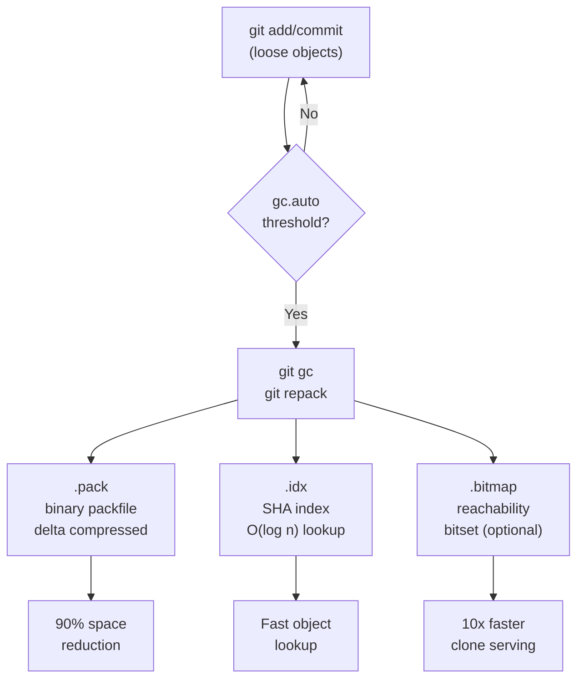

## Keywords in This File
{: .no_toc }

| # | Keyword | Difficulty |
|---|---------|------------|
| 22 | [Git Packfiles, Delta Compression, and GC](#git-packfiles-delta-compression-and-gc) | ★★★ |

---

# Git Packfiles, Delta Compression, and GC

**Interview Weight:** High - understanding packfiles and GC is essential
for diagnosing repository bloat, CI slowness, and push performance;
required at senior level for platform/infrastructure roles.

---

## Quick Reference

**One-line definition:** Git stores objects individually as loose files
initially, then periodically packs them into binary packfiles with
delta compression (storing similar objects as a base plus differences),
reducing disk use by 60-90%; `git gc` triggers this compaction and
prunes unreachable objects.

**One analogy:** Loose objects are like individual sticky notes scattered
across a desk; packfiles are like a compressed archive folder that
combines all related notes with only the changes between versions stored
instead of full copies.

**Key terms:**
- **loose object** - individual zlib-compressed file in `.git/objects/`
- **packfile** - `.pack` binary file containing many objects with delta compression
- **pack index** - `.idx` file enabling O(log n) object lookup within a pack
- **delta chain** - base object plus a sequence of deltas to reach a target version
- **delta base** - the object from which a delta is computed
- **GC (Garbage Collection)** - `git gc`; repacks loose objects, prunes unreachable objects
- **auto-gc threshold** - `gc.auto = 6700`; number of loose objects that triggers auto-gc
- **prune** - removal of unreachable objects; delayed 2 weeks by default
- **multi-pack-index (MIDX)** - single index spanning multiple packfiles for fast lookup

---

### 🎯 Model Answer

**30-second answer:**

"Git starts by writing each object as a separate loose file. When you
have enough loose objects (or explicitly run `git gc`), Git creates a
packfile that bundles them together. Inside the pack, similar objects
like successive versions of the same file are stored using delta
compression - only the differences are stored, not full copies. This
cuts disk use by 60-90%. GC also prunes unreachable objects (deleted
branches, reflog-expired commits) after a retention window."

**3-minute answer:**

**Loose objects - the starting point:**
Every `git add` and `git commit` writes individual object files to
`.git/objects/xx/yyyyyy...`. These are zlib-compressed but not delta-
compressed against each other. A file that changes 1,000 times creates
1,000 separate blobs.

**Packfiles - the optimization:**
Git packs objects into binary packfiles when triggered by:
- `git gc` (explicit)
- `git push` or `git fetch` (pack exchange)
- Auto-gc threshold: `gc.auto = 6700` loose objects triggers automatic packing

A packfile consists of:
- `.pack` file: objects in binary, some as full copies, some as deltas
- `.idx` file: sorted SHA index for O(log n) object lookup
- Optional `.bitmap` file: for fast pack reuse in fetch operations

**Delta compression mechanism:**
Git identifies similar objects (typically successive versions of the
same file) and stores one as a "base" and others as deltas (instructions
for transforming the base to reach the target). A delta operation looks
like: "copy bytes 0-500 from base, insert 'new text here', copy bytes
510-10000 from base."

Delta chains can be up to depth 50 by default (`pack.depth = 50`).
Reading a deeply chained object requires applying 50 deltas - slow for
frequently accessed objects. Git optimises by placing frequently-accessed
objects (like HEAD) as base objects with short chains.

**GC lifecycle:**

```bash
# Trigger manually
git gc              # standard: repack loose, prune 2 weeks old
git gc --aggressive  # aggressive delta compression (slow, one-time)
git gc --prune=now  # prune all unreachable immediately (dangerous)
git gc --auto       # only run if above gc.auto threshold

# What gc does internally:
# 1. git pack-refs --all: pack .git/refs/ files into packed-refs
# 2. git reflog expire: expire old reflog entries
# 3. git repack: create new packfile from loose + existing packs
# 4. git prune: remove unreachable objects older than retention window
# 5. git worktree prune: remove stale worktree admin files
```

> **Code walkthrough:** `git gc` orchestrates a sequence of maintenance
commands. KEY MECHANISM: `git repack -adf` is the core step - it creates
a single new packfile from ALL existing objects (loose + packed) using
delta compression, then removes the superseded packfiles. WHY IT MATTERS:
running `git gc` after importing a large project (or after a CI pipeline
creates many objects) can reduce repo size by 90%. WHAT BREAKS: `git
gc --prune=now` removes objects that may be in another clone's reflog
window (needed for push/fetch); always use the default 2-week grace
period. TAKEAWAY: never run `git gc --prune=now` on shared/server
repositories; only use it on personal local clones.

**Blank Mind Recovery:**

"Loose objects -> GC -> Packfile. Pack has delta compression: base
object + deltas for similar objects. GC also prunes unreachable objects
after 2-week grace period. `git count-objects -vH` shows current state.
`git gc --aggressive` for one-time deep compression."

---

### 📘 Concept Explanation

#### 1. What Is It?

Git's two-tier storage model: loose objects (fast writes) backed by
periodic compaction into packfiles (efficient storage). Delta compression
inside packfiles makes Git dramatically more space-efficient than storing
every file version separately.

#### 2. Why Does It Exist?

Without packfiles, a 10-year-old repository with daily commits to a
10KB file would store 3,650 versions of that file as separate zlib blobs.
With delta compression, successive versions are stored as small deltas
from a base, reducing storage by 90%+.

#### 3. How Does It Work? (Internal Mechanism)

**Object storage layout:**

```bash
# Loose objects (before packing)
ls .git/objects/
# info/  pack/  ab/  cd/  ef/  ... (2-char dirs)

# After git gc: objects moved to packfile
ls .git/objects/pack/
# pack-abc123.idx   <- lookup index
# pack-abc123.pack  <- binary packed objects
# pack-abc123.bitmap  <- fast pack reuse (if enabled)

# Count objects
git count-objects -vH
# count: 15           <- loose objects
# size: 45.00 KiB
# in-pack: 194821     <- objects in packfiles
# packs: 2
# size-pack: 89.23 MiB
# prune-packable: 0
# garbage: 0
```

> **Code walkthrough:** `git count-objects -vH` is the diagnostic command
for pack health. KEY MECHANISM: high "count" (loose objects) and high
"packs" number (many packfiles) indicate GC is needed. "size-pack" is
the on-disk size of all packfiles; "prune-packable" shows objects in
pack that are also loose (can be pruned). WHY IT MATTERS: 10,000 loose
objects means 10,000 individual file opens during object lookup - GC
consolidates these into O(log n) index lookups. WHAT BREAKS: if a CI
pipeline creates thousands of objects per run without GC, the `.git/
objects/` directory grows unboundedly. TAKEAWAY: monitor `git count-
objects` in CI; alert when loose objects exceed 10,000.

**Delta compression in detail:**

```bash
# Show delta chain depth for all objects in a pack
git verify-pack -v .git/objects/pack/pack-*.idx | \
  awk '{print $3, $1}' | sort -rn | head -10
# depth object-sha
# 50 abc123...  <- at maximum delta chain depth
# 48 def456...

# Show base object for a delta
git verify-pack -v .git/objects/pack/pack-*.idx | \
  grep "def456"
# def456... blob 2048 300 12345 1 abc123...
# ^sha ^type ^size ^pack-size ^offset ^depth ^base

# Inspect delta statistics
git verify-pack -v .git/objects/pack/pack-*.idx | \
  awk 'NF==9 {sum+=$4; count++} END {
    print count " deltas, avg " sum/count " bytes"
  }'
```

> **Code walkthrough:** `git verify-pack -v` shows every object in the
pack with its type, size, compressed size, offset, delta chain depth,
and base SHA. KEY MECHANISM: objects with depth 0 are full (non-delta)
objects; objects with depth > 0 require traversing the delta chain to
that depth to reconstruct their content. WHY IT MATTERS: a frequently-
accessed blob at delta depth 50 requires applying 50 delta operations on
every read - measurably slower than depth 0. WHAT BREAKS: `git repack
-a --window=50 --depth=50` with large settings finds better delta bases
but takes much longer (hours for large repos). TAKEAWAY: Git's default
pack settings balance pack quality vs pack time; `git gc --aggressive`
uses larger window/depth for one-time deep compression.

#### 4. Key Properties and Behaviors

**Pack repack and maintenance commands:**

```bash
# Standard maintenance (run periodically)
git gc

# Aggressive repack (one-time, after repo cleanup)
git repack -adf --window=250 --depth=50
# -a: include all objects
# -d: delete superseded packs
# -f: ignore existing deltas (recompute all)

# Server-optimized: create bitmap for fast clone serving
git repack -adb
# -b: write pack bitmap (.bitmap file)

# Multi-pack-index (MIDX) for many small packs
git multi-pack-index write
```

> **Code walkthrough:** `git repack -adf` is the nuclear option for
pack optimization. KEY MECHANISM: `-f` forces recomputation of all
deltas from scratch, ignoring previously computed deltas; combined with
`--window=250` it considers 250 objects for delta base selection vs the
default 10. WHY IT MATTERS: a repo with many small packs from incremental
pushes without GC has high lookup overhead; repack consolidates to one
pack with optimally chosen delta bases. WHAT BREAKS: `git repack -adf
--window=250` can take hours on a large repo; only run during maintenance
windows. TAKEAWAY: `git repack -adb` (with bitmap) is the right choice
for bare server repos that serve many clones; bitmaps enable pack reuse
in fetch operations (10x faster clone serving).

#### 5. Common Use Cases

1. **Repository bloat diagnosis** - `git count-objects -vH` + large
   blob finder to explain unexpected repo size
2. **Push performance** - server-side `git repack -adb` to pre-compute
   pack bitmaps for fast clone serving
3. **After filter-repo** - `git gc --prune=now --aggressive` to reclaim
   space after historical blob removal
4. **CI maintenance** - explicit `git gc` in cleanup script to prevent
   loose object accumulation
5. **Post-migration optimization** - `git repack -adf --window=250` after
   importing from SVN/Mercurial

#### 6. Trade-offs

| Operation | Duration | Space saved | When to run |
|-----------|----------|-------------|-------------|
| `git gc` | 1-10 min | 50-80% | Monthly on threshold |
| `git gc --aggressive` | Hours | 80-95% | One-time after cleanup |
| `git repack -adb` | 30-90 min | 70-90% | Server-side maintenance |
| `git repack -adf --window=250` | Hours | 90-95% | Annual deep maintenance |
| `git prune --expire=now` | Minutes | Varies | After filter-repo |

#### 7. Performance Characteristics

- Loose object lookup: O(1) filesystem lookup (direct path from SHA)
- Packed object lookup: O(log n) binary search on pack index
- Delta reconstruction: O(delta-chain-depth) object reads and applies
- Pack generation: O(n^2) in window size (comparison-intensive)
- Pack bitmap clone: 10x faster server-side pack computation for fetch

#### 8. Real-World Context

Git's packfile format was designed by Nicolas Pitre in 2005. The bitmap
file format (2013) was contributed by Vicent Marti from GitHub and
dramatically improved clone performance. The multi-pack-index (MIDX)
format was contributed by Derrick Stolee (Microsoft) in 2018 for the
Windows repo use case. GitHub runs scheduled GC on all repositories and
pre-generates pack bitmaps for every repo that receives significant
clone traffic.

---

### 💻 Code Example

**BAD pattern - not understanding pack health:**

```bash
# BAD: developer adds large files across many commits
# then is confused why the repo is 50 GB even after deletion

git rm large-dataset/*.csv
git commit -m "remove dataset"

# Check repo size
du -sh .git
# 50 GB - still huge!

# Mistake: thinks deleting files frees space
# Reality: old blob objects still in pack/loose storage
```

> **Code walkthrough:** Removing files from Git creates a new commit
that does not include them, but original blob objects remain in the
object store (reachable from historical commits and the reflog). KEY
MECHANISM: `git gc` only prunes objects unreachable from ALL refs
including the reflog; objects in history are reachable and never pruned.
WHY IT MATTERS: a developer who commits a 50 GB binary then deletes it
still has a 50 GB repo because the history is preserved. WHAT BREAKS:
removing files from git history requires `git filter-repo`, making old
objects unreachable, then `git gc --prune=now` to reclaim space.
TAKEAWAY: "deleting from git" and "removing from storage" are different;
use `git filter-repo` for true removal.

**GOOD pattern - diagnosing and recovering from pack bloat:**

```bash
# Step 1: identify the problem
git count-objects -vH
# in-pack: 50000
# size-pack: 48.23 GiB  <- huge

# Step 2: find the culprits
git rev-list --objects --all | \
  git cat-file \
  --batch-check='%(objectsize:disk) %(rest)' | \
  sort -n | tail -20
# 524288000 data/training-set-v1.csv
# 512000000 models/weights-epoch-100.bin

# Step 3: check if files still in HEAD
git ls-tree HEAD -- data/training-set-v1.csv
# (empty = deleted from HEAD but still in history)

# Step 4: remove from history
git filter-repo \
  --path data/training-set-v1.csv --invert-paths \
  --path models/ --invert-paths

# Step 5: aggressive gc to reclaim space
git reflog expire --expire=now --all
git gc --prune=now --aggressive
git count-objects -vH
# size-pack: 120.00 MiB  <- 99.7% reclaimed
```

> **Code walkthrough:** `git rev-list --objects --all` with `cat-file
--batch-check` finds large objects regardless of HEAD state. KEY
MECHANISM: `%(objectsize:disk)` reports compressed on-disk size (smaller
than uncompressed). `git filter-repo --invert-paths` rewrites all commits
to exclude specified paths, making original blobs unreachable. WHY IT
MATTERS: without `git reflog expire --expire=now`, the reflog still holds
references to pre-filter commits, keeping blobs alive. WHAT BREAKS:
`git filter-repo` changes all commit SHAs; after running it, all team
members must reclone. TAKEAWAY: treat large-file removal as a breaking
change; communicate to the team, coordinate force-push, have everyone
reclone.

---

### 🎓 Answers by Seniority

**Junior/Mid:**

"Git writes each object as a loose file initially. When there are enough
loose objects, `git gc` packs them into a binary packfile with delta
compression - similar file versions are stored as a base plus differences
instead of full copies. This reduces storage by 60-90%. GC also prunes
objects no longer reachable from any branch or tag, after a 2-week
grace period."

**Senior/Staff:**

"The packfile system has several layers I actively manage:

**Loose to pack transition:** Every git operation creates loose objects.
At `gc.auto = 6700` loose objects, auto-gc triggers and repacks them.
I disable auto-gc on CI agents and run explicit `git gc` in cleanup
scripts to avoid background GC competing with test jobs.

**Delta compression quality:** Quality depends on `--window` (how many
objects to compare for delta bases) and `--depth` (maximum chain length).
After a significant history rewrite (filter-repo), I run `git repack
-adf --window=250` to get high-quality delta chains. This can reduce
repo size another 20-30% beyond standard gc.

**Pack bitmaps for server performance:** Server-side repos that serve
many clones should have `git repack -adb` run regularly. The `.bitmap`
file enables pack reuse in fetch operations - instead of computing a
new packfile for each clone, the server reuses the pre-computed pack
(10x faster clone serving). GitHub does this automatically for popular
repos.

**The unreachable object trap:** The most common bloat scenario: a
developer commits a large file, then 'deletes' it. The blob is still
reachable from the reflog. Fix: `git filter-repo` to rewrite history,
then `git reflog expire --expire=now --all`, then `git gc --prune=now`.
Document that this is a breaking change requiring team reclone."

---

### ⚠️ Common Misconceptions

**Misconception 1: "Deleting files from Git frees disk space."**

Deleting a file creates a new commit without it, but the blob is still
reachable from historical commits and the reflog. Disk space is freed
only after: (1) history is rewritten with `git filter-repo` to remove
the object from all commit trees, (2) reflog is expired, and (3) `git
gc --prune=now` runs. This requires all team members to reclone.

**Misconception 2: "`git gc --prune=now` is safe on server repos."**

If a developer is mid-push, their objects may be newly received but not
yet referenced by any branch. `--prune=now` deletes these objects
immediately, causing the push to fail with "object not found." The
default 2-week retention window prevents this. Never run `--prune=now`
on shared server repos.

**Misconception 3: "More packs is fine - Git finds objects anyway."**

Each additional packfile adds an O(log n) binary search and a file
open/read. A repo with 200 small packs has 200x the lookup overhead vs
one consolidated pack. `git multi-pack-index` mitigates this but the
fundamental overhead remains.

**Misconception 4: "Delta compression stores text diffs."**

Git's delta format is binary (xdelta-style copy/insert operations),
not text-based unified diffs. It works on any binary content. Two
versions of a JPEG with minor changes can be delta-compressed
effectively. The delta format: "copy bytes 0-512 from base, insert
[3 bytes], copy bytes 516-end from base."

---

### 🚨 Failure Modes and Diagnosis

**Failure 1: Repository unexpectedly large after file deletion**

```bash
# Diagnose: find largest objects in ALL history
git rev-list --objects --all | \
  git cat-file \
  --batch-check='%(objectsize) %(rest)' | \
  sort -rn | head -10

# Check if in current HEAD
git ls-tree -r HEAD | grep "large-file-name"
# empty = deleted from HEAD but still in history

# Check reflog retention
git reflog | head -5

# Full remediation:
pip install git-filter-repo
git filter-repo --path large-file.bin --invert-paths
git reflog expire --expire=now --all
git gc --prune=now
du -sh .git
```

> **Code walkthrough:** `git rev-list --objects --all` traverses every
reachable object including those only in reflog; `cat-file
--batch-check='%(objectsize)'` reports uncompressed size in bytes.
KEY MECHANISM: sorting by size numerically finds the largest historical
blobs regardless of current HEAD state. WHY IT MATTERS: a 2 GB training
dataset accidentally committed adds 2 GB to every clone forever unless
history is rewritten. WHAT BREAKS: `git filter-repo` changes all commit
SHAs; a `--force` push is required, and all collaborators must reclone.
TAKEAWAY: prevent the problem with pre-receive hooks rejecting blobs
> 50 MB.

**Failure 2: Push fails with "pack-objects died of signal 9"**

Symptom: `git push` fails with signal 9 (OOM killer) on the server.

```bash
# Client: send smaller packs
git config pack.windowMemory 256m
git config pack.packSizeLimit 512m
git push origin main

# Server (if you have access):
git config --global pack.windowMemory 1g
git config --global pack.threads 2

# Push in smaller batches for initial push
git push origin HEAD~1000:main
git push origin HEAD~500:main
git push origin main
```

> **Code walkthrough:** Pack generation on push requires holding the
comparison window in memory; with large pushes, this can require
gigabytes of RAM. KEY MECHANISM: the OOM killer (signal 9) terminates
pack-objects when the server runs out of memory. WHY IT MATTERS: initial
pushes of large repos (SVN migrations, GitHub migrations) commonly
trigger this. WHAT BREAKS: client-side `pack.windowMemory` limits client
memory but not the server. TAKEAWAY: for large initial pushes, use
`pack.packSizeLimit` to force smaller pack sizes.

**Failure 3: `git gc` hangs indefinitely**

```bash
# Check what gc is doing
ps aux | grep git
# git pack-objects -> pack generation running

# Check for lock files
ls .git/*.lock
# If .git/gc.pid exists: another gc is running
cat .git/gc.pid
rm .git/gc.pid  # remove if stale

# Run gc with verbose output
GIT_TRACE2_PERF=/tmp/gc.perf git gc
grep "elapsed" /tmp/gc.perf | \
  sort -t: -k2 -rn | head -5
```

> **Code walkthrough:** `GIT_TRACE2_PERF` profiles each step of gc with
timing information. KEY MECHANISM: `git gc.pid` is a lock file preventing
concurrent gc runs; if a previous gc was killed, the lock persists.
WHY IT MATTERS: a hung gc blocks all future auto-gc and may prevent
commits. WHAT BREAKS: if pack-objects is hanging during pack generation,
it may be OOM-killed repeatedly; reduce `pack.windowMemory` to allow
completion. TAKEAWAY: `GIT_TRACE2_PERF` is the definitive tool for
diagnosing slow gc; it shows exactly which step is the bottleneck.

---

### 🎯 Interview Deep-Dive

| Question Type | Count | Target Audience |
|---|---|---|
| Conceptual | 3 | All levels |
| Debugging | 3 | Mid-Senior |
| Trade-off | 3 | Senior-Staff |
| Behavioral | 1 | Mid-Senior |
| Architecture | 2 | Staff |

---

**[CONCEPTUAL] Q1 - Explain Git's two-tier storage model and why both tiers exist.**

**Loose objects (Tier 1 - fast writes):**
Each git object is written as a separate file immediately when created.
Writes are atomic (write to temp file, rename) and require no global
state. This makes loose object creation O(1) and non-blocking.

**Packfiles (Tier 2 - efficient storage):**
Periodically, loose objects are consolidated into packfiles with delta
compression. Delta compression requires seeing multiple similar objects
at once to identify the best base/delta pairs - it cannot be done
incrementally without scanning the full set.

**Why both:** The two-tier design provides write performance (loose) and
storage efficiency (pack). Writing directly to a compressed pack on
every git operation would require rewriting the entire pack - extremely
slow. The loose-to-pack transition is a batch operation done
asynchronously.

**Analogy:** Like a write-ahead log (WAL) in databases - individual
changes are written to a fast sequential log (loose objects), then
periodically consolidated and compressed into the main storage structure
(packfile).

*What separates good from great:* the WAL analogy and knowing that the
loose-to-pack transition is a batch operation by design, not a limitation.

---

**[CONCEPTUAL] Q2 - How does Git's delta compression work at the binary level?**

Git uses a variant of the xdelta algorithm for binary deltas. A delta
is a sequence of two instruction types:

1. **COPY:** "copy N bytes starting at offset O from the base object"
2. **INSERT:** "insert these N literal bytes"

Example: base is "Hello World", target is "Hello Beautiful World":
- COPY: 6 bytes from offset 0 ("Hello ")
- INSERT: 9 bytes ("Beautiful ")
- COPY: 5 bytes from offset 6 ("World")

Delta selection algorithm:
1. Git considers objects within the pack window (default: 10 nearby objects)
2. For each candidate base, computes a delta
3. Chooses the base that produces the smallest delta
4. Up to `pack.depth = 50` layers of chaining

Key insight: delta bases are NOT necessarily the "previous version" of
a file. Git may use any similar object as the base if it produces a
smaller delta - it could be a file from a different commit, a different
branch, or even a different file with similar content.

*What separates good from great:* knowing that delta bases are chosen
by similarity (smallest delta), not by temporal ordering.

---

**[CONCEPTUAL] Q3 - What is the pack bitmap format and why does it accelerate clone?**

A pack bitmap is a per-commit bitset recording which objects in the
packfile are reachable from that commit. Each bit corresponds to one
object in the pack (in pack order).

**How clone uses bitmaps:**

Without bitmap: a `git clone` must traverse the full commit graph from
HEAD, collecting all reachable objects. For a 1M-object repo, this
traversal takes 30-60 seconds per clone.

With bitmap: the server reads the pre-computed bitmap for HEAD, ORs in
bitmaps for additional commits, and immediately knows the set of objects
to send - O(n/64) bitwise OR operations where n is the number of objects.
The traversal time drops from 30 seconds to under 1 second.

**Bitmap size:** for a repo with 1M objects, the bitmap for one commit
is 1M bits = 125 KB. Bitmaps are stored compressed and only for commits
that would benefit (typically branch tips).

```bash
# Server-side: create pack with bitmaps
git repack -adb
# -b: write bitmap file
# Bitmap written for HEAD + branch tips
```

> **Code walkthrough:** `git repack -adb` creates a single optimized
pack with a bitmap file for fast clone serving. KEY MECHANISM: the `-b`
flag triggers bitmap computation during pack repack; Git selects which
commits to bitmap (typically branch tips) to maximize coverage. WHY IT
MATTERS: GitHub runs `git repack -adb` periodically on all repos; it
is the primary optimization making GitHub clone speeds fast at scale.
WHAT BREAKS: bitmaps become stale as new commits arrive; the server
must periodically regenerate them. TAKEAWAY: always include `-b` in
server-side repack commands; without it, clone serving must recompute
the reachability traversal for every clone request.

---

**[DEBUGGING] Q4 - How do you diagnose why `git push` to a large repo takes 10 minutes?**

```bash
# Step 1: check what's being pushed
git push --verbose origin main 2>&1 | head -20
# "Counting objects: 5000"
# "Delta compression using up to 8 threads"
# -> client-side pack generation is slow

# Step 2: check for large objects
git rev-list HEAD --objects | \
  git cat-file \
  --batch-check='%(objectsize) %(rest)' | \
  sort -rn | head -5

# Step 3: check local pack health
git count-objects -vH
# Many loose objects = client packs before send

# Fix for slow pack generation:
git gc          # consolidate loose objects first
git config pack.threads 0  # use all CPU cores
git push origin main
```

> **Code walkthrough:** `git push --verbose` shows the pack-objects
phases; "Counting objects" and "Delta compression" are the two slow
phases. KEY MECHANISM: pack generation for push compresses only objects
not already on the remote; if the remote is empty (first push), this
includes all objects. WHY IT MATTERS: running `git gc` locally before
a large push consolidates loose objects into efficient packs that Git
can more quickly compute deltas from. WHAT BREAKS: if `pack.threads = 1`
(default on some systems), compression is single-threaded; setting
`pack.threads = 0` uses all cores. TAKEAWAY: always run `git gc` locally
before a large initial push.

*What separates good from great:* knowing that client-side GC before
push reduces push time by pre-computing delta chains.

---

**[DEBUGGING] Q5 - `git gc` reduces repo size by only 10% but you expected 90%. Why?**

The most common causes:

1. **Objects still reachable from reflog:**

```bash
# Check reflog size
git reflog | wc -l
# Large count: old commits (with large files) still reachable

git reflog expire --expire=2.weeks.ago --all
git gc --prune=2.weeks.ago
```

> **Code walkthrough:** The reflog is a safety net that keeps recent
commits reachable even if their branches are deleted. KEY MECHANISM:
`git reflog expire --expire=2.weeks.ago` removes reflog entries older
than 2 weeks; objects exclusively reachable through those entries become
unreachable and eligible for pruning. WHY IT MATTERS: a developer who
committed a 2 GB file 6 weeks ago and deleted the branch still has a
2 GB object in the repo because the reflog (90-day default) keeps it
reachable. WHAT BREAKS: aggressively expiring the reflog means you
cannot recover accidentally deleted branches from the local reflog.
TAKEAWAY: use `--expire=2.weeks.ago` as the safest expiry that reclaims
space within a reasonable timeframe.

2. **Objects reachable from remote tracking refs:**

```bash
# Remote tracking refs keep objects reachable
git remote prune origin  # remove stale tracking branches
git gc
```

> **Code walkthrough:** `git remote prune origin` removes remote
tracking refs (e.g., `origin/feature-x`) that no longer exist on the
remote server. KEY MECHANISM: remote tracking refs like `origin/main`
are refs just like branches; they keep objects reachable from gc
pruning. WHY IT MATTERS: after a large branch with big files is merged
and deleted on the remote, `origin/feature-big-files` still exists
locally, keeping those objects alive. WHAT BREAKS: running `git gc`
without first pruning remote tracking refs will leave objects that
should be prunable still reachable. TAKEAWAY: always run `git remote
prune origin` before `git gc` when diagnosing incomplete space reclaim.

3. **Large objects in recent commits (within gc window):**

```bash
# If large files committed recently (< 2 weeks):
# gc will not prune them (still in reflog window)
git filter-repo --path large-file.bin --invert-paths
git gc --prune=now
```

> **Code walkthrough:** `git filter-repo --invert-paths` rewrites all
commits to exclude the specified path, making all blobs for that path
unreachable from any branch. KEY MECHANISM: after filter-repo, objects
are only kept alive by the reflog (for the 90-day window); using
`--prune=now` bypasses this window for immediate reclaim. WHY IT MATTERS:
for large files committed within the last 2 weeks, the reflog window
means `git gc` (without `--prune=now`) will not reclaim space yet.
WHAT BREAKS: `--prune=now` removes objects that may be needed for
recovery; only use it on personal clones after the team has recloned.
TAKEAWAY: `git filter-repo` + `git gc --prune=now` together are the
correct two-step process for immediate space reclaim after accidental
large file commits.

*What separates good from great:* systematically checking each
reachability anchor (reflog, remote tracking refs, FETCH_HEAD, ORIG_HEAD)
rather than just running gc and hoping.

---

**[DEBUGGING] Q6 - After `git filter-repo` to remove secrets, repo is still the same size.**

Three possible causes:

1. **Reflog still references pre-filter commits:**

```bash
git reflog expire --expire=now --all
```

> **Code walkthrough:** `git reflog expire --expire=now --all` removes
all reflog entries across all branches immediately. KEY MECHANISM:
without this step, the reflog holds references to the pre-filter-repo
commits; those commits reference the old (pre-filter) trees and blobs
which Git therefore considers reachable and will not prune. WHY IT
MATTERS: this is the most commonly missed step after `git filter-repo`;
omitting it means `git gc` reclaims no space even though filter-repo
ran successfully. WHAT BREAKS: expiring the full reflog removes the
ability to recover any locally-created commits that have not been pushed.
TAKEAWAY: treat reflog expire as the mandatory cleanup step after any
history rewrite; document this in team runbooks.

2. **Remote tracking refs not pruned:**

```bash
# origin/main still points to pre-filter commits
git remote prune origin
# Or remove all remote tracking refs:
git for-each-ref --format='%(refname)' refs/remotes/ | \
  xargs -I{} git update-ref -d {}
```

> **Code walkthrough:** `git for-each-ref --format='%(refname)'
refs/remotes/` lists all remote tracking refs. KEY MECHANISM: any ref
that points to a pre-filter-repo commit keeps all objects reachable from
that commit alive, even after filter-repo rewrote local history.
WHY IT MATTERS: filter-repo rewrites local refs but does not delete
remote tracking refs. WHAT BREAKS: deleting remote tracking refs means
`git push` will not know the current state of the remote until you fetch
again. TAKEAWAY: after filter-repo, run `git remote prune origin`,
then reflog expire, then `git gc --prune=now` in sequence.

3. **`git gc` not run after filter-repo:**

```bash
git count-objects -vH
# If "prune-packable" > 0: gc needed
git gc --prune=now
du -sh .git
```

> **Code walkthrough:** `git count-objects -vH` is the final diagnostic
step confirming whether gc has completed successfully. KEY MECHANISM:
"prune-packable" counts objects that appear in a packfile but are also
present as loose objects (can be safely removed from loose storage);
"garbage" counts unreachable objects not yet pruned. WHY IT MATTERS:
if both are 0 after `git gc --prune=now`, the gc completed as expected.
WHAT BREAKS: if `du -sh .git` still shows large size after gc, compare
with `git count-objects -v` size-pack to identify if the remaining size
is in packfiles (expected) or loose objects (unexpected). TAKEAWAY:
`git count-objects -vH` before and after gc is the proof that cleanup
worked; include it in any bloat remediation runbook.

---

**[TRADE-OFF] Q7 - When is `git gc --aggressive` appropriate vs counterproductive?**

**Appropriate when:**
- One-time optimization after history rewrite (filter-repo)
- After importing from another VCS (SVN to Git migration)
- A repo has accumulated many small packs over years
- Repo size needs minimization for archival

**Counterproductive when:**
- Run regularly (e.g., daily): improvement from window=250 vs window=10
  is typically 5-15% size reduction, not worth hours of CPU
- On a hot server repo: blocks all operations during repack
- On a repo with mostly binary files: delta compression is ineffective
  on already-compressed content (JARs, images, videos)

**Time cost:** `git gc --aggressive` on a 10 GB repo takes 1-3 hours.

*What separates good from great:* knowing that `--aggressive` is a
one-time tool, not a maintenance strategy; and that binary files
(JPEGs, PDFs, JARs) do not benefit from delta compression.

---

**[TRADE-OFF] Q8 - Should you enable pack bitmaps on a developer workstation?**

No - pack bitmaps are a server-side optimization. For a developer
workstation:
- Bitmap generation adds 10-30 seconds to `git repack`
- Bitmaps are invalidated on every new commit (must be regenerated)
- The developer's repo typically serves only one clone - no benefit

Where bitmaps belong:
- Bare server repos (`git init --bare`)
- Repos behind a git hosting server (GitHub/GitLab handles this)
- Repos used for CI agent cloning from a local mirror

**Developer config that is actually useful instead:**

```bash
git config core.fsmonitor true         # fast status
git config fetch.writeCommitGraph true  # fast log/blame
git config core.commitGraph true
```

> **Code walkthrough:** These three settings improve daily operations
without bitmap overhead. `core.fsmonitor` accelerates `git status`;
`fetch.writeCommitGraph` keeps the commit graph current for fast
`git log`. KEY MECHANISM: commit-graph caches commit ancestry without
requiring a full repack; it is updated incrementally with each fetch.
WHY IT MATTERS: developers need fast status and log; they do not need
fast clone-serving. WHAT BREAKS: `core.fsmonitor` starts a background
daemon; on machines with hundreds of git repos, this adds memory
pressure. TAKEAWAY: enable fsmonitor and commit-graph for developer
workstations; leave bitmaps for server-side repos.

---

**[TRADE-OFF] Q9 - How do packfiles interact with partial clones? What breaks?**

Partial clones (blobless/treeless) create repos where some objects are
"promised" by the promisor remote rather than stored locally. This
interacts badly with several pack operations:

1. **`git gc` triggers mass blob downloads:**
`git gc` enumerates all referenced objects to check reachability.
In a blobless clone, this triggers lazy fetches for all deferred blobs.
Fix: disable gc in blobless CI clones (`git config gc.auto 0`).

2. **`git bundle create` fails or downloads everything:**
Bundle creation must include all referenced objects; in a partial clone
this triggers complete blob download.

3. **`git repack -a` on a partial clone:**
Repacking requires ALL objects; a blobless clone attempting full repack
downloads all deferred blobs.

Fix: use `git repack --filter=blob:none` (experimental in Git 2.36+).

4. **`git verify-pack` works correctly:**
Pack verification only checks locally-stored objects; promised objects
are noted as "missing (expected)" not as errors.

*What separates good from great:* knowing that gc.auto should be
disabled in CI partial clones and that bundle/repack operations trigger
mass downloads.

---

**[BEHAVIORAL] Q10 - Tell me about diagnosing unexpected repository bloat in production.**

**Situation:** A repository used by 50 developers for microservices
grew from 500 MB to 25 GB over 3 months. Developer clone times went
from 30 seconds to 15 minutes.

**Investigation:**

```bash
git rev-list --objects --all | \
  git cat-file \
  --batch-check='%(objectsize) %(rest)' | \
  sort -rn | head -10
# training-data-v1.csv (8 GB)
# training-data-v2.csv (7 GB)
# benchmark-results/ (3 GB of JSON files)
```

> **Code walkthrough:** This command is the first step in any bloat
investigation. KEY MECHANISM: `--objects` makes `rev-list` include all
objects (blobs, trees, commits) reachable from all refs; `%(objectsize)`
gives uncompressed size in bytes. WHY IT MATTERS: these files were from
an ML experiment merged 2 months ago - deleted in a follow-up commit
but still present in history. WHAT BREAKS: `sort -rn` sorts by size
descending; this works for sizes up to 2^63 bytes but produces incorrect
results if mixed with non-numeric lines. TAKEAWAY: pipe through `grep
'^[0-9]'` to filter non-numeric lines before sorting.

**Root cause:** An ML team had accidentally committed large training
datasets to the application monorepo. Files were "deleted" in a
subsequent commit but remained in history.

**Fix:** `git filter-repo` + coordinated reclone + pre-receive hook
rejecting blobs > 50 MB.

**Result:** Repo dropped from 25 GB to 450 MB; clone time from 15
minutes to 25 seconds.

*What separates good from great:* adding the pre-receive hook as a
structural fix to prevent recurrence, not just fixing the immediate
problem.

---

**[ARCHITECTURE] Q11 - Design a Git hosting system to minimize pack storage for 10,000 repos.**

```
Pack storage optimization strategy:

1. On-push pack computation:
   - Accept loose objects from push
   - Compute incremental pack (new objects only)
   - Append to incremental pack pool

2. Scheduled full repack (nightly for repos > 100 MB):
   - git repack -adb (full + bitmap)
   - Store in object storage (S3/GCS)
   - Keep local SSD cache for hot repos

3. Tiered storage:
   Hot tier (SSD): recently cloned repos, full pack ready
   Warm tier (HDD): repos cloned < 30 days
   Cold tier (object store): repos not cloned > 30 days
   Archive: repos > 1 year inactive

4. Deduplication across repos via alternates:
   - .git/objects/info/alternates: shared object pool
   - Common dependencies (Spring Boot, etc.) stored once
   - Shared across all repos that reference them

5. Bitmap-driven clone serving:
   - Pre-computed bitmaps for each repo's default branch
   - Served from CDN for clone requests
```

> **Code walkthrough:** Git's alternates mechanism allows one repo to
reference another repo's object store. KEY MECHANISM: `.git/objects/
info/alternates` lists directories to search when an object is not found
locally; on a hosting server, a shared object pool (common dependencies)
can be shared across thousands of repos. WHY IT MATTERS: if 10,000 repos
use the same Spring Boot version, the blobs are stored once, not 10,000
times. WHAT BREAKS: if the shared object pool is unavailable, all repos
depending on it fail. TAKEAWAY: alternates create availability coupling;
use them for read-heavy content with high availability backing stores.

---

**[ARCHITECTURE] Q12 - How do you design large-file storage for a team tracking binary assets in Git?**

**Option 1: Git LFS (recommended for most teams)**

```bash
# Setup
git lfs install
git lfs track "*.psd" "*.mp4" "*.bin"
git add .gitattributes
git push origin main

# How it works:
# Large file stored on LFS server (S3/Azure Blob)
# Git stores pointer file (< 200 bytes) instead of blob
# git lfs pull fetches actual files from LFS server
```

> **Code walkthrough:** Git LFS replaces large blob commits with 200-byte
pointer files containing the file SHA and LFS server URL. KEY MECHANISM:
when you `git checkout`, LFS extension fetches the actual file from the
LFS server and places it in the working tree. Git's object store contains
only the tiny pointer files. WHY IT MATTERS: a repo with 10 GB of design
assets uses 1 MB in the Git object store (pointers only). WHAT BREAKS:
LFS requires all developers to have the Git LFS extension installed;
`git clone` without it checks out pointer files, not actual binaries.
TAKEAWAY: document the LFS setup requirement prominently in the repo
README.

**Option 2: External artifact registry**
- Design files in Figma/Adobe Creative Cloud
- Compiled binaries in Artifactory/Nexus
- Only source code in Git
- Best separation of concerns but requires tooling integration

*What separates good from great:* recommending the appropriate solution
based on team size - LFS for small-medium teams, external registry for
large organizations with dedicated artifact management.

---

### ⚖️ Comparison Table

| Storage type | Write speed | Lookup | Space efficiency | Best for |
|---|---|---|---|---|
| Loose objects | Fast O(1) | O(1) fs lookup | Poor (no delta) | Immediate writes |
| Single pack | Slow (batch) | O(log n) | Excellent | Long-term storage |
| Many small packs | Fast (incremental) | O(k log n) | Good | High push frequency |
| Pack + MIDX | Fast | O(log n) cross-pack | Good | Many-pack repos |
| Pack + bitmap | Slow (initial) | O(n/64) for clone | Excellent | Clone-heavy servers |

---

### 🏛️ System Design

**Git hosting at scale: pack management for 10,000 repos**

See Architecture Q11 for full design.

Key insight: pack bitmaps are the single highest-impact optimization for
clone-serving performance. Every production Git hosting system (GitHub,
GitLab, Bitbucket) pre-computes pack bitmaps for popular repositories
and serves clones from CDN-cached packs rather than computing new packs
per request.

The alternates mechanism provides cross-repo deduplication but creates
availability coupling; use it for content with high availability
guarantees (common dependency blobs from an immutable artifact store).

---

### 📊 Diagram

ASCII - Git storage pipeline from loose objects to packfile:

```
Write operations:
  git add/commit -> loose object (zlib compressed)
  git add/commit -> loose object
  ... x6700 objects ...
  [gc.auto threshold reached]
          |
          v
   git gc (git repack)
          |
          v
   .git/objects/pack/
     +-----------------------+
     | pack-abc.pack         | <- delta-compressed binary
     | pack-abc.idx          | <- O(log n) SHA lookup index
     | pack-abc.bitmap       | <- reachability bitset (optional)
     +-----------------------+
          |
          v
   90% space reduction
   Fast O(log n) object lookup
```

> **Diagram walkthrough:** WHAT IT DEPICTS: the flow from loose objects
to packfiles triggered by auto-gc. HOW TO READ IT: follow the arrows
downward; loose objects accumulate until threshold, then gc consolidates
them into a packfile with three components. KEY RELATIONSHIP: the bitmap
file is optional but transforms clone performance; the pack and index
are always created together. EDGE CASE: if gc is disabled (`gc.auto=0`),
loose objects accumulate indefinitely; each `git status` becomes slower
as it opens more individual files. INSIGHT: the auto-gc threshold of
6700 is a balance between write performance (defer packing) and read
performance (too many loose objects hurts lookup).



> **Diagram walkthrough:** WHAT IT DEPICTS: the gc trigger and the three
output files produced by git repack. HOW TO READ IT: the decision diamond
on gc.auto threshold shows the feedback loop - each new object is checked
against the threshold. KEY RELATIONSHIP: all three output files are
created by one `git repack -adb` command; the bitmap is optional but
essential for clone-serving performance. EDGE CASE: if the bitmap is
not created (`git repack -ad` without `-b`), clone serving must
recompute reachability on every clone request. INSIGHT: the bitmap is
the key optimization separating a repo that can be cloned fast from one
that cannot; every production Git host pre-computes bitmaps for popular
repos.
