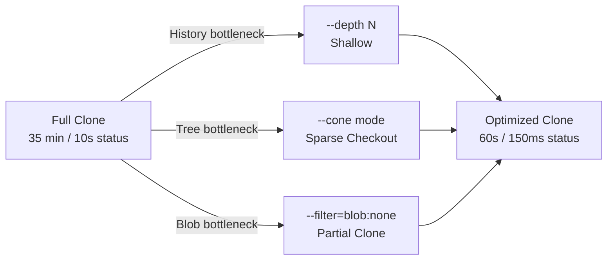

## Keywords in This File
{: .no_toc }

| # | Keyword | Difficulty |
|---|---------|------------|
| 21 | [Git at Scale: Shallow Clones, Sparse Checkout, Partial Clone](#git-at-scale-shallow-clones-sparse-checkout-partial-clone) | ★★★ |

---

# Git at Scale: Shallow Clones, Sparse Checkout, Partial Clone

**Interview Weight:** High - any engineer working with monorepos,
microservices CI/CD, or platform engineering will encounter these
techniques; required knowledge for senior and staff interviews at
companies with large codebases.

---

## Quick Reference

**One-line definition:** Three complementary strategies for working
with large Git repositories efficiently: shallow clones (limit commit
depth), sparse checkout (limit which paths are checked out), and partial
clone (defer downloading large blobs/trees until needed), each targeting
a different bottleneck (history, working tree, object size).

**One analogy:** A large library: shallow clone is like borrowing only
the last chapter of every book (recent history only); sparse checkout
is like going to a specific shelf and ignoring all others (only your
service's directory); partial clone is like getting book summaries now
and fetching full text on demand (blobs deferred until accessed).

**Key terms:**
- **shallow clone** - clone with `--depth N`; only N commits downloaded
- **sparse checkout** - working tree has only a subset of tracked files
- **partial clone** - `--filter=blob:none` or `--filter=tree:0` defers objects
- **blobless clone** - `--filter=blob:none`; all commits/trees, blobs on demand
- **treeless clone** - `--filter=tree:0`; only commits downloaded
- **promisor remote** - remote that promises to provide deferred objects
- **fsmonitor** - filesystem monitor daemon that caches `git status` results
- **commit-graph** - binary file caching commit ancestry for fast traversal

---

### 🎯 Model Answer

**30-second answer:**

"Git at scale uses three techniques targeting different bottlenecks.
Shallow clones limit history depth for CI pipelines. Sparse checkout
limits which files exist in the working tree - essential for monorepos.
Partial clone with `--filter=blob:none` gives you all history metadata
instantly but defers actual file content until checkout. For large-scale
monorepos, all three are combined."

**3-minute answer:**

Large repositories hit three distinct bottlenecks:

**1. History depth - Shallow Clone:**
`git clone --depth 1 <url>` downloads only the latest commit. CI
pipelines that only run tests use this. `--depth 50` provides enough
history for `git log`, blame, and recent bisect. Trade-off: `git bisect`
across months of history is broken; `git fetch --unshallow` restores
when needed.

**2. Working tree - Sparse Checkout:**
In a monorepo with 500 services, a developer on `services/api` doesn't
need `services/payment`. Sparse checkout checks out only matching paths.
Cone mode (Git 2.26+) is O(1) per directory - critical for performance.
Non-cone mode uses pattern matching and is O(n*m) slow.

**3. Object size - Partial Clone:**
`git clone --filter=blob:none <url>` downloads all commits and trees
but defers blob download. When you checkout, only the blobs you need
are fetched. A 50 GB repo with large historical binaries clones in
seconds instead of 35 minutes.

**Combining all three (monorepo CI):**

```bash
git clone --filter=blob:none --no-checkout \
  --depth=100 <url> repo
cd repo
git sparse-checkout init --cone
git sparse-checkout set services/api shared/core
git checkout main
# Result: 30-60 seconds vs 35 minutes
```

> **Code walkthrough:** The sequence matters: `--no-checkout` delays
file writing until after sparse-checkout is configured, so only blobs
for `services/api` and `shared/core` are fetched. KEY MECHANISM:
partial clone's lazy blob fetch respects the sparse-checkout filter -
blobs outside the sparse set are never fetched. WHY IT MATTERS: the
30-second vs 35-minute difference directly impacts CI pipeline speed.
WHAT BREAKS: if you checkout before setting sparse-checkout, all blobs
for the default checkout are fetched first, wasting the download.
TAKEAWAY: set sparse-checkout BEFORE the first checkout.

**Blank Mind Recovery:**

"Shallow = limit depth (CI). Sparse = limit paths (monorepo working
directory). Partial = defer blobs (large binary repos). Combine all
three with `--filter=blob:none --no-checkout --depth=100`, then
sparse-checkout set, then checkout."

---

### 📘 Concept Explanation

#### 1. What Is It?

Three Git performance strategies targeting different clone/checkout
bottlenecks: shallow (history), sparse (working tree), partial (objects).

#### 2. Why Does It Exist?

A monorepo growing over 10 years accumulates millions of commits,
thousands of service directories, and gigabytes of historical binaries.
Without these techniques, `git clone` takes 30-60 minutes and `git
status` takes 10+ seconds - both unacceptable for CI and developer
productivity.

#### 3. How Does It Work? (Internal Mechanism)

**Shallow clone internals:**

```bash
git clone --depth 50 https://github.com/org/repo
cat .git/shallow
# abc123...  <- boundary commits treated as roots
git fetch --deepen=50   # extend shallow window
git fetch --unshallow   # restore full history
```

> **Code walkthrough:** The `.git/shallow` file lists commit SHAs
treated as root commits (no parents) locally. KEY MECHANISM: when Git
traverses history, it stops at these boundary commits instead of
requesting their parents. WHY IT MATTERS: CI pipelines with `--depth 1`
avoid gigabytes of history. WHAT BREAKS: `git merge-base` may fail or
return wrong results - use `--depth 50+` for pipelines needing recent
diff/log. TAKEAWAY: `--depth 50` not `--depth 1` for CI that needs
`git diff HEAD~5`.

**Sparse checkout internals:**

```bash
git sparse-checkout init --cone
git sparse-checkout set services/api shared/core
git sparse-checkout list
cat .git/info/sparse-checkout
# /*
# !/*/
# /services/api/
# /shared/core/
```

> **Code walkthrough:** Cone mode generates three patterns per path:
`/*` (root files), `!/*/` (exclude all root dirs), `/services/api/`
(include this dir). KEY MECHANISM: cone mode allows directory-prefix
matching in O(1) vs non-cone's O(patterns * files) pattern matching.
WHY IT MATTERS: non-cone sparse-checkout on 500K files with 50 patterns
= 25M evaluations per `git status`. WHAT BREAKS: cone mode cannot
express wildcard patterns like `*.java` across the repo. TAKEAWAY:
design monorepo directory structure for cone-mode compatibility.

**Partial clone internals:**

```bash
# Blobless clone
git clone --filter=blob:none <url>
# Config stored:
# [remote "origin"]
#   promisor = true
#   partialclonefilter = blob:none

# Lazy blob fetch happens automatically on access
git show HEAD:services/api/Main.java
# -> triggers fetch of that blob from promisor remote
```

> **Code walkthrough:** `--filter=blob:none` instructs the server to
skip all blob objects in the pack sent during clone. KEY MECHANISM:
origin is marked as a promisor remote that transparently provides
any missing blob when accessed. WHY IT MATTERS: a repo with 5 GB of
historical binaries clones in seconds; blobs are lazily fetched when
checked out. WHAT BREAKS: offline use, `git gc --aggressive`, and `git
bundle` trigger mass blob downloads. TAKEAWAY: blobless clone is the
best default for large repos; requires network access to origin.

#### 4. Key Properties and Behaviors

**fsmonitor daemon (status acceleration):**

```bash
git config core.fsmonitor true
git config core.untrackedCache true
git fsmonitor--daemon status
# fsmonitor-daemon is watching '/path/to/repo'
# Without fsmonitor: git status in large repo ~ 3-8 seconds
# With fsmonitor: git status ~ 50-200ms
```

> **Code walkthrough:** `core.fsmonitor` starts a daemon listening to
OS filesystem events (FSEvents on macOS, inotify on Linux). KEY
MECHANISM: `git status` queries the daemon for changed paths since last
run instead of `stat()`-ing every tracked file. WHY IT MATTERS: in a
500K-file monorepo, `git status` must stat 500K inodes without fsmonitor.
WHAT BREAKS: the daemon adds a background process per repo; on CI agents
with hundreds of parallel clones, this adds memory pressure. TAKEAWAY:
enable `core.fsmonitor` for developer machines; benchmark on CI agents.

**commit-graph for fast traversal:**

```bash
git config fetch.writeCommitGraph true
git commit-graph write --reachable
# git log --all now reads binary index instead of
# decompressing commit objects one by one
# 10-100x speedup for repos with >100K commits
```

> **Code walkthrough:** `git commit-graph write` precomputes the commit
ancestry graph into a binary file in `.git/objects/info/commit-graph`.
KEY MECHANISM: traversal reads the compact binary file directly instead
of decompressing each commit object; parent pointers are stored as
integer offsets. WHY IT MATTERS: `git log --oneline` on a 1M-commit repo
without commit-graph decompresses 1M objects. WHAT BREAKS: commit-graph
must be kept current; `fetch.writeCommitGraph = true` updates it
automatically on every fetch. TAKEAWAY: enable commit-graph as the first
optimization for any repo with > 100K commits.

#### 5. Common Use Cases

1. **CI/CD pipelines** - shallow `--depth 100` + sparse + blobless
2. **Developer onboarding** - blobless clone; history available instantly
3. **Monorepo daily use** - sparse checkout for relevant service only
4. **Hotfix investigation** - `git fetch --deepen=500` to extend history
5. **Large binary repos** - blobless; historical binaries never downloaded

#### 6. Trade-offs

| Strategy | Network saved | Breaks | Best for |
|----------|--------------|--------|----------|
| `--depth N` | High | bisect, blame | CI build/test |
| Sparse checkout | None | Invisible files | Monorepo devs |
| `--filter=blob:none` | High | gc, bundle, offline | Large binary repos |
| `--filter=tree:0` | Very High | Most commands | Single-path CI |

#### 7. Performance Characteristics

- Clone speedup: `--filter=blob:none` typically 5-20x faster
- Status speedup: sparse + fsmonitor typically 50-100x for 500K-file repos
- Partial fetch overhead: 10-50ms per lazy blob (batched by Git)
- commit-graph speedup: `git log --all` 10-100x for > 100K commit repos

#### 8. Real-World Context

Microsoft pioneered these techniques for the Windows repo (3.5M files,
300 GB, millions of commits). They contributed VFS for Git. Google and
Meta use similar internal systems (Piper, Sapling). As of Git 2.37+,
built-in partial clone and sparse checkout cover 80% of VFS for Git
without OS-level virtualization. GitHub, GitLab, and Bitbucket all
support `uploadpack.allowFilter` server-side.

---

### 💻 Code Example

**BAD pattern - naive CI clone:**

```bash
# BAD: full clone in every CI job
git clone https://github.com/org/monorepo .
# 35 minutes, 50 GB disk, timeout risk
npm test --workspace=services/api
```

> **Code walkthrough:** A full clone downloads all history, trees, and
blobs for every file ever committed. KEY MECHANISM: pack generation on
the server must walk the complete object graph including deleted files
from years ago. WHY IT MATTERS: 35 minutes of wasted developer waiting
time before tests run; CI agent disk quotas are exceeded. WHAT BREAKS:
parallel jobs fail with "no disk space" when multiple full clones run
simultaneously. TAKEAWAY: never full-clone in CI; always use at minimum
`--depth 50`.

**GOOD pattern - optimized CI for monorepo service:**

```bash
# GOOD: sparse + shallow + blobless CI setup
git clone \
  --filter=blob:none \
  --no-checkout \
  --depth=100 \
  --branch main \
  https://github.com/org/monorepo .

git sparse-checkout init --cone
git sparse-checkout set \
  services/api \
  shared/proto \
  shared/common \
  build-tools

git checkout

git config core.commitGraph true
git config fetch.writeCommitGraph true
# Result: < 60 seconds, < 500 MB disk
```

> **Code walkthrough:** The `--no-checkout` flag delays file writing
until sparse-checkout is configured, ensuring only blobs for the
declared paths are fetched on `git checkout`. KEY MECHANISM: partial
clone's lazy blob fetch respects the sparse-checkout filter - blobs
outside the sparse set are never fetched even on checkout. WHY IT
MATTERS: 60-second CI clones on repos that would otherwise take 35
minutes. WHAT BREAKS: a CI job running tests outside the sparse-checkout
paths fails with "does not exist in the index". TAKEAWAY: document which
paths each CI job needs; test locally with the exact sparse-checkout set.

---

### 🎓 Answers by Seniority

**Junior/Mid:**

"For large repos: shallow clones limit history depth (`--depth 50`
for CI), sparse checkout limits which files are in my working tree
(important for monorepos), and partial clone defers downloading blob
content (`--filter=blob:none`). For CI I'd use all three together with
`--no-checkout` before setting sparse paths to avoid downloading blobs
for files I don't need."

**Senior/Staff:**

"The three techniques target independent bottlenecks and should be
composed:

Shallow clone: my default is `--depth 100` for CI - not depth 1,
because you need enough commits for `git diff HEAD~10` and recent blame
to work. The `.git/shallow` file marks boundary commits; `git fetch
--deepen` extends the window when needed for hotfix investigations.

Sparse checkout: cone mode is mandatory for performance. Non-cone mode
uses pattern matching per file which is O(n*m) and makes `git status`
take 10+ seconds on 500K-file repos. I also pair this with `core.fsmonitor
= true` and `core.untrackedCache = true` for sub-200ms status times.

Partial clone: blobless is my default recommendation for developer
workstations with large repos. The key gotcha is that the repo needs
network access to the promisor remote for any deferred blob - do not
use in air-gapped environments. For CI I combine blobless with
`--no-checkout`: configure sparse-checkout first, then checkout, so
blobs outside the sparse set are never downloaded.

For the pre-warm pattern in CI: I use `git fetch --filter=blob:none
origin main` to fetch all commits/trees, then `git sparse-checkout set
<paths>` then checkout. This gives predictable performance vs hoping
that lazy fetching batches efficiently.

commit-graph + fsmonitor are the two quick wins that benefit all clone
types: `fetch.writeCommitGraph = true` makes `git log` 10-100x faster;
`core.fsmonitor = true` makes `git status` 50-100x faster."

---

### ⚠️ Common Misconceptions

**Misconception 1: "Shallow clone breaks `git status`."**

`git status` works fine in shallow clones. What breaks are historical
operations outside the shallow window: `git bisect`, `git log --follow`,
`git merge-base`. Use `--depth 100` to reduce these issues.

**Misconception 2: "Sparse checkout means files don't exist in Git."**

Sparse checkout files are fully tracked - they exist in the commit tree
and index with `skip-worktree` flag. `git ls-files services/auth/` shows
them even though they are not in the working tree. `git sparse-checkout
add services/auth` restores them.

**Misconception 3: "`--filter=blob:none` is experimental."**

Stable since Git 2.22 (2019), production-supported on GitHub/GitLab/
Bitbucket. Microsoft uses it for the Windows monorepo.

**Misconception 4: "Treeless clone is just a more aggressive blobless."**

Treeless breaks significantly more operations - most git commands need
tree objects. Use treeless only for highly controlled CI environments.

---

### 🚨 Failure Modes and Diagnosis

**Failure 1: IDE downloads all blobs after blobless clone**

```bash
# Measure blob fetches triggered by IDE
GIT_TRACE2_EVENT=/tmp/git-trace.json git status
grep "child_start" /tmp/git-trace.json | grep fetch | wc -l
# Large number = IDE triggering lazy fetches per file

# Pre-warm blobs for commonly accessed paths
git fetch origin  # no filter = fetch all missing blobs
# Or pre-warm specific paths:
git checkout HEAD -- services/api/
```

> **Code walkthrough:** `GIT_TRACE2_EVENT` logs every Git operation in
JSON. Counting `child_start` events for fetch shows IDE-triggered lazy
fetches. KEY MECHANISM: IDEs run `git status` and file content reads
across the repo for indexing; each unread file triggers a blob fetch.
WHY IT MATTERS: 100,000 lazy fetches at 50ms each = 83 minutes of
sequential fetching. WHAT BREAKS: IntelliJ, VS Code Git integration,
and similar tools are not optimized for partial clone lazy loading.
TAKEAWAY: pre-warm blobs for your working paths before opening IDE.

**Failure 2: `git bisect` fails in shallow clone**

```bash
git log --oneline | tail -3
# If oldest commit is 3 months ago but bug is 6 months old:
git fetch --deepen=500  # extend the window
git fetch --unshallow   # full history for serious bisect
git bisect start HEAD <known-good-sha>
```

> **Code walkthrough:** Bisect traverses commit history between "good"
and "bad" commits; if either is outside the shallow window, bisect stops
at the boundary. KEY MECHANISM: `.git/shallow` marks boundary commits
as roots; bisect cannot go past them. WHY IT MATTERS: `--depth 50` on
a 6-month-old bug always fails; document that developers need to deepen
or unshallow for historical investigations. TAKEAWAY: use `git fetch
--unshallow` as the first step in any serious bug investigation involving
history older than the clone depth.

**Failure 3: Files show "untracked" after sparse checkout**

```bash
# Verify file is tracked
git ls-files services/auth/config.yaml
# output: services/auth/config.yaml -> tracked
git ls-files -v services/auth/config.yaml
# S services/auth/config.yaml <- S = skip-worktree

# Fix: add path to sparse set
git sparse-checkout add services/auth
ls services/auth/config.yaml  # now present
```

> **Code walkthrough:** `skip-worktree` bit in the Git index marks a
file as tracked but absent from the working tree. KEY MECHANISM: sparse
checkout sets `skip-worktree` on all files outside the sparse set; `git
ls-files -v` reveals the `S` flag. WHY IT MATTERS: developers see
"missing" files and may try to recreate them, causing phantom additions.
WHAT BREAKS: automation scripts that checkout specific files for
processing fail silently if the path is not in the sparse set.
TAKEAWAY: use `git ls-files -v <path>` to distinguish skip-worktree
files from genuinely untracked files.

---

### 🎯 Interview Deep-Dive

| Question Type | Count | Target Audience |
|---|---|---|
| Conceptual | 3 | All levels |
| Debugging | 3 | Mid-Senior |
| Trade-off | 3 | Senior-Staff |
| Behavioral | 1 | Mid-Senior |
| Architecture | 2 | Staff |

---

**[CONCEPTUAL] Q1 - What is the difference between shallow, blobless, and treeless clones?**

**Shallow (`--depth N`):** downloads last N commits with all trees and
blobs for those commits. History truncated. Status/checkout fully
functional; bisect/blame broken outside window.

**Blobless (`--filter=blob:none`):** downloads ALL commits and trees
(complete history metadata), defers blobs until accessed. History fully
intact; status/checkout functional; blob-heavy operations trigger
lazy fetches.

**Treeless (`--filter=tree:0`):** downloads ONLY commits. Both trees
and blobs deferred. Fastest initial clone; most operations trigger
remote fetches. Only for specialized CI.

| Clone type | Commits | Trees | Blobs | History | Use case |
|---|---|---|---|---|---|
| Full | All | All | All | Full | No restrictions |
| Shallow N | Last N | Last N | Last N | Partial | CI build |
| Blobless | All | All | Deferred | Full | Large binary repos |
| Treeless | All | Deferred | Deferred | Partial | Single-path CI |

*What separates good from great:* blobless is the safe default (history
intact); treeless is specialized; shallow and blobless can be combined.

---

**[CONCEPTUAL] Q2 - Why is cone mode sparse checkout dramatically faster than non-cone mode?**

Non-cone: accepts arbitrary `.gitignore`-style patterns; Git must
evaluate each tracked file path against every pattern - O(n * m) where
n = files, m = patterns. For 500K files and 50 patterns: 25M evaluations
per `git status`.

Cone: accepts only directory prefixes; Git checks if a path's directory
is in the inclusion set - a hash lookup per directory, O(1) per
directory. Git can skip entire directory trees without evaluating
individual files.

The practical result: `git status` on a 500K-file repo drops from 10+
seconds (non-cone) to 150ms (cone + fsmonitor).

Design implication: monorepo directory structure should use top-level
service directories (cone-compatible) rather than cross-cutting patterns
(which require non-cone).

*What separates good from great:* explaining the algorithmic complexity
difference and the monorepo structure design implication.

---

**[CONCEPTUAL] Q3 - How does the promisor remote mechanism work?**

When `--filter=blob:none` is used, origin is recorded as a promisor
remote in `.git/config` (`promisor = true`, `partialclonefilter =
blob:none`). This means origin has "promised" to provide any missing
objects on demand.

Object resolution flow:
1. Command needs object O (e.g., `git show HEAD:file.py`)
2. Local object store lookup: O found? Serve it.
3. O missing: check if promisor has it
4. Fetch O from promisor via HTTP "want" request
5. Store O locally; serve it

The mechanism is transparent to the user. Requires network access to
origin for every deferred object access.

*What separates good from great:* noting that offline use is broken -
partial clones cannot work fully without access to the promisor remote.

---

**[DEBUGGING] Q4 - CI pipeline using partial clone is slower than expected. Diagnose.**

```bash
# Phase 1: measure each step
time git clone --filter=blob:none --no-checkout <url>
time git sparse-checkout set services/api
time git checkout main

# Phase 2: profile blob fetches
GIT_TRACE2_PERF=/tmp/trace.perf git checkout main
grep "fetch" /tmp/trace.perf | wc -l
# High count = per-blob round trips (not batched)

# Phase 3: verify server supports partial clone
git ls-remote --symref origin HEAD
# If upload-pack doesn't support allowFilter:
# server sends full pack anyway
```

> **Code walkthrough:** `GIT_TRACE2_PERF` shows timing per operation.
KEY MECHANISM: in optimized partial clone, Git batches missing-object
requests into a single HTTP request; poorly configured servers issue
one request per blob. WHY IT MATTERS: 10,000 blobs at 1 request each
= 10,000 round trips. WHAT BREAKS: older GitHub Enterprise versions and
some self-hosted Git servers don't support efficient server-side
filtering. TAKEAWAY: verify `uploadpack.allowFilter = true` on the
server before deploying partial clone in CI.

*What separates good from great:* knowing Git batches missing-object
requests and that the bottleneck is usually per-blob round trips.

---

**[DEBUGGING] Q5 - `git status` takes 10+ seconds in the monorepo. Causes and fixes?**

```bash
# Step 1: check fsmonitor
git config core.fsmonitor
# Empty = disabled; this alone can explain 10-second status

# Step 2: check sparse checkout
git sparse-checkout list
# Empty = all 500K files being stat()d

# Step 3: check for large untracked dirs
time git status --untracked-files=no
# Fast = untracked scanning is the bottleneck

# Fix:
git sparse-checkout init --cone
git sparse-checkout set services/api
git config core.fsmonitor true
git config core.untrackedCache true
echo "target/" >> .gitignore
echo "node_modules/" >> .gitignore
```

> **Code walkthrough:** The three most common causes of slow `git status`
are: no fsmonitor (every file stat'd), no sparse checkout (all files
evaluated), and large untracked directories from build outputs. KEY
MECHANISM: `core.untrackedCache` caches directory mtimes so Git only
rescans directories that changed. WHY IT MATTERS: these three settings
together turn a 10-second status into 150ms. WHAT BREAKS: untracked
files already committed require `git rm --cached` to untrack. TAKEAWAY:
configure fsmonitor + sparse checkout + comprehensive gitignore BEFORE
onboarding developers to any large monorepo.

---

**[DEBUGGING] Q6 - Files a developer knows exist show as "untracked" after sparse checkout. Diagnose.**

```bash
git ls-files services/auth/config.yaml
# services/auth/config.yaml -> IS tracked in Git

git ls-files -v services/auth/config.yaml
# S services/auth/config.yaml  <- S = skip-worktree

git sparse-checkout list
# services/api, shared/core  <- auth is NOT included

# Fix:
git sparse-checkout add services/auth
```

> **Code walkthrough:** `skip-worktree` bit marks a file as tracked but
absent from the working tree. KEY MECHANISM: sparse checkout sets
skip-worktree on all files outside the sparse set; these files appear
absent to the filesystem but exist in the Git index and tree. WHY IT
MATTERS: developers unfamiliar with sparse checkout see missing files
and may create replacements, staging phantom additions. WHAT BREAKS:
automation scripts that checkout specific files fail silently if the
path is outside the sparse set. TAKEAWAY: teach all developers `git
ls-files -v <path>` to distinguish skip-worktree from untracked.

---

**[TRADE-OFF] Q7 - When would you NOT use partial clone?**

Avoid partial clone when:

1. **Air-gapped/offline:** every deferred blob access requires network
   to the promisor remote; partial clones cannot work offline.
2. **Tooling that iterates blobs:** `git gc`, `git bundle`, `git archive`,
   and some static analysis tools trigger mass downloads.
3. **Server doesn't support `uploadpack.allowFilter`:** partial clone to
   an unsupported server downloads a full pack but marks the clone as
   partial - broken state.
4. **Team is inexperienced with Git internals:** the "missing file"
   confusion and lazy-fetch errors are confusing without training.

*What separates good from great:* proactively checking server support
before designing a CI pipeline around partial clone.

---

**[TRADE-OFF] Q8 - Shallow vs partial clone for CI - how to decide?**

Use **shallow** when: CI needs only the latest code to build/test; no
historical traversal needed; all files needed (no sparse opportunity);
repo is code-only (no large blobs). Simple, universally compatible.

Use **partial (blobless)** when: some jobs need full history (changelog
generation, semantic versioning); repo has large historical binaries;
combining with sparse checkout for maximum optimization.

Use **both** when: monorepo CI targeting one service out of hundreds.

Decision summary: `--depth 100` is the safe default for most CI. Add
`--filter=blob:none` when large historical blobs are confirmed as the
bottleneck. Add sparse-checkout when working tree size is the bottleneck.

*What separates good from great:* measuring the actual bottleneck before
applying techniques; not over-engineering.

---

**[TRADE-OFF] Q9 - Risks of `--filter=tree:0` (treeless clone)?**

Treeless defers both trees and blobs. Most git operations need tree
objects:
- `git log --stat` triggers tree fetches
- `git diff` triggers tree fetches
- `git stash`, `git rebase` may require uncached trees

Checkout needs directory trees + blobs - more round trips than blobless.

Network errors break more operations (not just blob-heavy ones).

Use only for highly controlled CI: known checkout path, simple operation,
reliable network. Otherwise prefer blobless.

*What separates good from great:* treeless is not "more aggressive
blobless" - it breaks significantly more operations.

---

**[BEHAVIORAL] Q10 - How would you migrate a team from full clones to optimized clones?**

Phase 1 - Measure baseline: instrument clone and status times with
`GIT_TRACE_PERFORMANCE`; identify bottlenecks (history? blobs? tree?).

Phase 2 - Repo hygiene first: audit large historical blobs with
`git rev-list --objects --all | git cat-file --batch-check | sort -k2 -rn`;
remove with `git filter-repo --strip-blobs-bigger-than 50M`.

Phase 3 - Developer setup script:
```bash
git clone --filter=blob:none <url> monorepo
cd monorepo
git sparse-checkout init --cone
git sparse-checkout set "$(cat team-paths.txt)"
git config core.fsmonitor true
```

> **Code walkthrough:** This setup script codifies three optimizations
in one place. KEY MECHANISM: `$(cat team-paths.txt)` reads a per-team
path list checked into the repo so every team member gets the right
sparse-checkout paths without manual configuration. WHY IT MATTERS:
a setup script removes the knowledge gap - developers run one command
and get the optimized clone. WHAT BREAKS: if `team-paths.txt` is not
updated when a team's service moves directories, developers get wrong
sparse paths. TAKEAWAY: store sparse-checkout path configs in the repo
under a team-controlled file; automate the setup script distribution.

Phase 4 - Update CI workflows to shallow+sparse+blobless.

Phase 5 - Educate on gotchas: skip-worktree, unshallow for bisect,
offline limitations.

Result at one team: 60-second clones (from 35 minutes), 200ms status.

*What separates good from great:* treating repo hygiene as a prerequisite
- sparse checkout and partial clone improve present use, but historical
junk still affects clone size until filter-repo removes it.

---

**[ARCHITECTURE] Q11 - Design Git hosting infrastructure for 1,000-developer partial clone workloads.**

```
1. Object cache (CDN layer):
   - Pre-generate blobless packs on every push to main
   - Cache by {commit-sha, filter-spec}
   - CDN serves cached packs -> 100x faster than dynamic generation

2. Promisor (lazy fetch) servers:
   - Dedicated endpoints for per-blob lazy fetches
   - Auto-scale on fetch request rate
   - Regional distribution < 50ms latency target

3. Sparse-checkout profile service:
   - Per-team path configs stored in repo metadata
   - API: GET /sparse-config?team=payments

4. Commit-graph pre-computation:
   - post-receive hook: git commit-graph write --reachable
   - Serve commit-graph file directly from CDN

Target SLOs:
   Developer clone: < 60 seconds
   CI clone: < 30 seconds
   git status: < 200ms
```

> **Code walkthrough:** Pre-generating blobless packs on every push is
the key optimization. KEY MECHANISM: the first clone after a push pays
the pack-generation cost; every subsequent clone hits the CDN cache.
WHY IT MATTERS: without caching, 1,000 developers triggering dynamic
pack computation simultaneously overwhelms server CPU. WHAT BREAKS:
cache invalidation when HEAD changes; the post-receive hook must
invalidate and regenerate the pack on every push. TAKEAWAY: per-developer
dynamic pack computation does not scale; pack caching is the foundation
of Git hosting at scale.

---

**[ARCHITECTURE] Q12 - CI uses shallow clone but a critical hotfix needs `git bisect` reaching 6 months back. How do you handle it?**

**Immediate (deploy the hotfix now):** CI shallow clone is fine for
building and testing; only the developer's investigation workspace needs
deep history. Have the developer run `git fetch --unshallow` locally for
bisect investigation - this does not affect CI.

**CI side:** the shallow CI clone builds and tests the hotfix branch
correctly regardless of history depth.

**Structural fix:** use `--filter=blob:none` without depth for a
"blobless investigation clone" alongside the shallow CI clone. Blobless
gives full history metadata at low cost (no blob downloads); bisect,
blame, and log all work. Document both clone types in the repo README.

```bash
# CI clone (build + test only):
git clone --filter=blob:none --depth=100 <url>

# Investigation clone (full history, no blobs):
git clone --filter=blob:none <url>  # no depth
```

> **Code walkthrough:** Two clone types serve two workflows. KEY
MECHANISM: `--filter=blob:none` without `--depth` downloads all commit
and tree objects (full history metadata) while deferring blob content;
bisect, blame, and log all work because they only need commit/tree
objects. WHY IT MATTERS: a developer needing 6 months of blame history
gets it in 2 minutes (blobless) vs 35 minutes (full clone). WHAT BREAKS:
if the developer then runs `grep -r pattern .` on the investigation clone,
all blobs for every matched file are lazily fetched. TAKEAWAY: for
investigation clones, pre-checkout only the paths under investigation
to avoid triggering mass blob downloads.

*What separates good from great:* recognizing blobless clone without
depth limit gives full history at minimal cost - the right choice for
investigation workflows.

---

### ⚖️ Comparison Table

| Feature | Shallow | Sparse checkout | Blobless | Treeless |
|---------|---------|----------------|---------|---------|
| Reduces | History | Working tree | Blob download | Trees+blobs |
| History intact | No | Yes | Yes | Partially |
| Works offline | Yes | Yes | No | No |
| git bisect | Limited | Yes | Yes | Limited |
| Best for | CI build | Monorepo devs | Large binary repos | Single-path CI |
| Git server req | None | None | `uploadpack.allowFilter` | Same |
| Can combine | Yes | Yes | Yes | Not recommended |

---

### 🏛️ System Design

**Monorepo CI at scale (1,000 engineers):** see Architecture Q11.

Key insight: the three techniques are orthogonal and compose:
`--filter=blob:none --no-checkout --depth=100` then sparse-checkout then
checkout achieves all three benefits simultaneously. The order matters:
always configure sparse-checkout before the first checkout.

---

### 📊 Diagram

ASCII - Three bottlenecks and corresponding techniques:

```
Full Clone Problem:
[History: 1M commits] -> Shallow clone (--depth N)
[Working Tree: 500K files] -> Sparse checkout (--cone)
[Blobs: 50GB] -> Partial clone (--filter=blob:none)

Combined result:
35 min full clone -> 30-60 sec optimized clone
10s git status -> 150ms with fsmonitor + sparse
```

> **Diagram walkthrough:** WHAT IT DEPICTS: the three independent
bottlenecks and the technique targeting each one. HOW TO READ IT: each
row is a separate bottleneck dimension; each technique is independent
and composable. KEY RELATIONSHIP: the three techniques multiply their
improvements when combined - addressing only one or two leaves remaining
bottlenecks. EDGE CASE: if the repo is code-only with no large blobs,
partial clone adds complexity with no benefit; measure before applying.
INSIGHT: the key question for any slow clone is "which bottleneck
dominates?" - history depth, working tree size, or blob volume.



> **Diagram walkthrough:** WHAT IT DEPICTS: the three bottleneck paths
from full clone to optimized clone. HOW TO READ IT: each edge label
names the bottleneck being addressed; all three paths lead to the
optimized target. KEY RELATIONSHIP: techniques are parallel and
independent - apply one, two, or all three based on which bottlenecks
exist in your repo. EDGE CASE: if only the blob bottleneck exists (small
working tree, shallow history acceptable, but large binaries), then
only partial clone is needed; sparse checkout adds no value. INSIGHT:
staff engineers always measure before optimizing - applying all three
blindly to a small repo adds complexity for zero gain.
