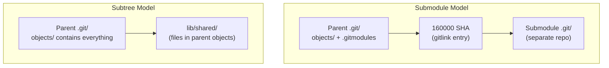

## Keywords in This File
{: .no_toc }

| # | Keyword | Difficulty |
|---|---------|------------|
| 23 | [Git Submodules and Subtrees: When and Why](#git-submodules-and-subtrees-when-and-why) | ★★★ |

---

# Git Submodules and Subtrees: When and Why

**Interview Weight:** High - submodules are a common source of confusion
and CI failures; asked in monorepo migration and dependency management
discussions; required knowledge for platform engineering and architecture
roles.

---

## Quick Reference

**One-line definition:** Git submodules embed one repository inside
another as a pinned commit reference (the parent stores only a SHA
pointer, not the submodule's files), requiring explicit update commands;
git subtree merges another repository's history into a subdirectory
of the parent, creating a unified history with no external dependencies.

**One analogy:** Submodules are like a bookmark to another library's
catalog - you reference a specific page but the book stays at the other
library; subtrees are like photocopying that page and inserting it into
your own notebook - you own the copy but must manually sync if the
original changes.

**Key terms:**
- **submodule** - nested git repo referenced by SHA pointer in parent
- **.gitmodules** - config file declaring submodule URLs and paths
- **detached HEAD** - submodule default state; points to pinned commit not branch
- **git submodule update** - check out the pinned commit in each submodule
- **git submodule update --remote** - fetch and update to remote branch tip
- **subtree** - subproject history merged into parent repo subdirectory
- **git subtree add** - merge external repo into a subdirectory
- **git subtree pull** - sync subtree with upstream changes
- **git subtree push** - push subdirectory changes back upstream

---

### 🎯 Model Answer

**30-second answer:**

"Submodules store a reference (SHA pointer) to another repository at
a specific commit. The parent repo does not contain the submodule's
files - only a pointer and `.gitmodules` config. You must run `git
submodule update --init --recursive` after clone to actually check out
submodule content. Subtrees merge the other repo's history directly into
a subdirectory of the parent, making it self-contained but harder to
sync back upstream. Submodules are better for true external dependencies;
subtrees are better for code you own and modify frequently."

**3-minute answer:**

**Git Submodules:**
A submodule is a full git repository nested inside another. The parent
repo's index stores a "gitlink" entry - a 160000 mode entry that records
only the SHA of the submodule's commit. The actual files live in the
submodule's own `.git` directory under `.git/modules/`.

Key behaviors:
- Clone does NOT checkout submodules by default
- Submodule HEAD is detached (points to SHA, not branch)
- Parent tracks which commit to pin; submodule can change independently
- Pushing parent before pushing submodule causes "missing submodule" errors

**Git Subtrees:**
Subtree merges the other repository's entire history into a subdirectory.
No special tools needed to clone - all files are part of the parent
repo. `git subtree` (a shell script wrapper around merge strategies)
adds prefix-based filtering.

Key behaviors:
- Normal `git clone` includes all subtree content
- No `.gitmodules` file or external dependencies
- Pushing changes back upstream requires `git subtree push` (slow for
  large repos)

**When to use which:**

| Scenario | Submodule | Subtree |
|---|---|---|
| External library rarely changes | YES | No |
| Internal shared library you modify | No | YES |
| Multiple teams need different versions | YES | No |
| Self-contained repo, no external deps | No | YES |
| CI must be simple (no extra clone steps) | No | YES |

**Blank Mind Recovery:**

"Submodule = pointer to another repo commit. Subtree = copy of another
repo merged in. Clone needs `--recurse-submodules` for submodules.
Subtree just works after clone. Submodule = external; subtree = owned.
Common CI failure: forgot `git submodule update --init --recursive`."

---

### 📘 Concept Explanation

#### 1. What Is It?

Two different strategies for including one git repository's content
inside another. Submodules maintain a live reference to an external
repo; subtrees import the content directly. Both solve the monorepo vs
polyrepo tension for shared code.

#### 2. Why Does It Exist?

Teams need to share code between repositories (shared libraries,
infrastructure configs, UI components). Copying files manually loses
version tracking. Submodules and subtrees provide version-controlled
approaches to this problem with different trade-off profiles.

#### 3. How Does It Work? (Internal Mechanism)

**Submodule internals:**

```bash
# Add a submodule
git submodule add \
  https://github.com/org/shared-lib lib/shared
# Creates .gitmodules + gitlink entry (mode 160000)

# View the gitlink entry
git ls-tree HEAD lib/shared
# 160000 commit abc123def... lib/shared
#  ^mode ^type  ^sha         ^path

# After clone: submodule dir is empty
git clone https://github.com/org/parent.git myrepo
ls myrepo/lib/shared/  # empty!

# Initialize and populate submodules
git submodule update --init --recursive

# Check submodule status
git submodule status
# abc123def lib/shared (v1.2.3)
```

> **Code walkthrough:** `git ls-tree HEAD lib/shared` reveals the gitlink
entry (mode 160000) - the only thing the parent stores about the
submodule. KEY MECHANISM: mode 160000 is a special "commit" type in
git's object model; it records a SHA but does not store any tree or
blob data. WHY IT MATTERS: this is why the submodule directory is empty
after `git clone` - the parent has no data to check out, only a pointer.
WHAT BREAKS: if the SHA in the gitlink references a commit that has
been force-pushed off the submodule remote, `git submodule update` will
fail with "reference not found". TAKEAWAY: never force-push branches
that submodule parent repos may be pinned to; protect those branches
on the submodule remote.

**Submodule update lifecycle:**

```bash
# Update pinned commit in parent
cd lib/shared
git fetch
git checkout v1.3.0
cd ..
git add lib/shared      # stage the new SHA pointer
git commit -m "bump shared-lib to v1.3.0"

# Common CI pattern: clone with all submodules
git clone --recurse-submodules \
  --shallow-submodules \
  https://github.com/org/parent.git
# --shallow-submodules: depth=1 for each submodule
```

> **Code walkthrough:** The two-step pattern (cd into submodule, checkout
new version, cd back, git add) is how submodule version pinning works.
KEY MECHANISM: `git add lib/shared` does not stage file changes; it
stages a new gitlink SHA. The parent now records the new commit pointer.
WHY IT MATTERS: this is the correct way to upgrade a dependency - pin
to a specific commit, commit the new pointer to the parent. WHAT BREAKS:
`git submodule update --remote` is convenient but dangerous in production;
it changes all submodule pins to the latest commit, which may include
breaking changes. TAKEAWAY: use `git submodule update --remote` only
in automated dependency update workflows with testing.

**Subtree internals:**

```bash
# Add a subtree
git subtree add \
  --prefix=lib/shared \
  https://github.com/org/shared-lib.git \
  main --squash
# --squash: compress external history into one commit

# Update from upstream
git subtree pull \
  --prefix=lib/shared \
  https://github.com/org/shared-lib.git \
  main --squash

# Push local changes back upstream
git subtree push \
  --prefix=lib/shared \
  https://github.com/org/shared-lib.git \
  feature/my-fix
# Re-filters parent history to find commits touching
# lib/shared/ - O(n) in commit count
```

> **Code walkthrough:** `git subtree add --squash` imports the entire
content of the external repo into the specified prefix in one squash
commit. KEY MECHANISM: without `--squash`, every commit from the external
repo's history appears in the parent repo's `git log` - useful for
provenance but noisy. With `--squash`, only one merge commit appears.
WHY IT MATTERS: for read-heavy subtrees, `--squash` keeps the parent
log clean; without squash, `git blame` works across the import boundary.
WHAT BREAKS: `git subtree push` is slow for large repos (O(n) for n
commits in parent history) because it must re-filter all history to find
commits that touched the prefix. TAKEAWAY: use `--squash` for third-
party subtrees; avoid squash for internal code you want full blame on.

#### 4. Key Properties and Behaviors

**Submodule failure modes in CI:**

```bash
# BAD: clone without submodule initialization
git clone https://github.com/org/parent.git
./gradlew build  # FAILS: lib/shared/ is empty

# GOOD: always clone with submodules
git clone --recurse-submodules \
  https://github.com/org/parent.git

# Check submodule state
git submodule status
# + abc123 lib/shared (v1.2.3)
# '+' = local SHA differs from parent-pinned SHA
```

> **Code walkthrough:** `git submodule status` output prefix characters
tell the story: leading space = up to date; `+` = local SHA differs from
parent-pinned SHA; `-` = not initialized; `U` = merge conflict. KEY
MECHANISM: `+` is the most common issue - a developer manually updated
the submodule and forgot to stage the new SHA in the parent. WHY IT
MATTERS: if a CI build commits with `+` status, the parent's gitlink
is stale. WHAT BREAKS: `git status` shows the submodule as "modified"
with no visible changes - confusing without knowing about gitlinks.
TAKEAWAY: add `git submodule status | grep '^+'` to CI pre-commit checks.

#### 5. Common Use Cases

1. **External library dependency** - submodule pinning to specific
   release tag; decoupled versioning
2. **Shared configuration** - infrastructure config subtree shared
   across multiple service repos
3. **Monorepo migration** - subtree add to consolidate multiple repos
   into one monorepo gradually
4. **Documentation site** - Jekyll theme as submodule
5. **CI shared scripts** - subtree or submodule for build tooling

#### 6. Trade-offs

| Factor | Submodule | Subtree |
|---|---|---|
| Clone complexity | High (extra steps) | Low (standard clone) |
| External dependency | Yes | No |
| Version pinning | Precise (SHA) | Loose (squash commit) |
| Upstream push | Direct | Via subtree push (slow) |
| History in parent | Separate | Merged |
| Multi-version support | Yes | No |
| CI impact | Requires `--recurse` | Zero impact |

#### 7. Performance Characteristics

- Submodule clone with `--shallow-submodules`: depth=1 for fast CI
- Submodule update with many nested submodules: O(n) sequential fetches
  unless `git config submodule.fetchJobs 4` parallelizes
- Subtree push: O(n) in parent history size; slow for old large repos
- Subtree pull with `--squash`: fast, O(1) merge commit

#### 8. Real-World Context

The Kubernetes project uses submodules for vendor dependencies. Netflix
uses a variant of the subtree pattern for shared libraries across
hundreds of microservice repos. Microsoft's VFS for Git (GVFS) was
partly motivated by the performance limitations of nested submodules
in deep dependency trees. Google's Bazel build system with monorepos
largely replaces the need for both approaches.

---

### 💻 Code Example

**BAD pattern - submodule confusion in CI:**

```yaml
# BAD: CI pipeline that fails due to empty submodules
# .github/workflows/build.yml:
# steps:
#   - uses: actions/checkout@v4
#     # ERROR: forgot submodules: recursive
# result: ./mvn compile fails with missing source files
```

> **Code walkthrough:** `actions/checkout@v4` without `submodules:
recursive` checks out the parent repo but leaves all submodule
directories empty. KEY MECHANISM: `.gitmodules` and gitlink entries are
present, but actual submodule files are not fetched unless explicitly
initialized. WHY IT MATTERS: this is the most common CI failure with
submodules - developer's local env works because they manually initialized
submodules, but CI fails. WHAT BREAKS: the error message ("file not
found") does not mention submodules, making root cause hard to find.
TAKEAWAY: always add `submodules: recursive` to checkout actions.

**GOOD pattern - correct submodule CI setup:**

```yaml
# .github/workflows/build.yml
steps:
  - uses: actions/checkout@v4
    with:
      submodules: recursive
      fetch-depth: 0

  - name: Verify submodule state
    run: |
      git submodule status | \
        tee /tmp/submodule-status.txt
      if grep -q '^+' /tmp/submodule-status.txt; then
        echo "ERROR: submodule SHA mismatch"
        cat /tmp/submodule-status.txt
        exit 1
      fi
```

> **Code walkthrough:** The two-step checkout + verify pattern catches
submodule state issues before they cause mysterious build failures.
KEY MECHANISM: `git submodule status | grep '^+'` detects when a
submodule's local SHA has been manually updated but not committed to
the parent. WHY IT MATTERS: catching this in CI provides a clear error
message instead of a confusing build failure later. WHAT BREAKS: if a
nested submodule URL is no longer accessible (private repo deleted),
CI fails during checkout. TAKEAWAY: document all submodule URLs in the
repo README and check them in a periodic health-check job.

---

### 🎓 Answers by Seniority

**Junior/Mid:**

"Git submodules let you include another git repository inside yours at
a specific commit. After cloning a repo with submodules, you need to
run `git submodule update --init --recursive` to actually get the files.
The downside is the extra steps - easy to forget in CI. Git subtree is
an alternative that copies the other repo's content directly into your
repo, so a normal `git clone` just works."

**Senior/Staff:**

"The submodule vs subtree decision is fundamentally about ownership
and coupling:

**Choose submodules when:** The external project has its own release
cycle you do not control. You want to pin to specific versions by SHA
and review version bumps explicitly. Multiple parent repos may need
different versions simultaneously.

**Choose subtrees when:** You own the shared code and modify it in both
repos simultaneously. You want zero CI complexity. You are doing a
monorepo migration and want to preserve history.

**The submodule CI tax:** Every team adopting submodules must update all
CI pipelines. I track submodule usage with a periodic `grep -r
'submodule' .github/` audit to ensure all workflows handle initialization.

**My current preference:** Package registries (Maven Central, npm, pip)
for external code; subtrees for internal shared code. Submodules only
when I need precise version pinning of a large external project I cannot
publish to a package registry."

---

### ⚠️ Common Misconceptions

**Misconception 1: "Submodule files are stored in the parent repo."**

The parent stores only a gitlink (SHA pointer) and `.gitmodules` config.
Zero files from the submodule exist in the parent repo's object store.
`git submodule update --init` fetches files from the submodule's remote
and stores them in `.git/modules/`.

**Misconception 2: "Updating a submodule's remote automatically updates the parent."**

Nothing in the parent changes when you push to the submodule's remote.
The parent's gitlink still points to the old SHA. You must explicitly
`git submodule update --remote`, review the change, and commit the new
SHA.

**Misconception 3: "Subtree makes a copy so repos are fully independent."**

Subtree does copy the files, but `git subtree push/pull` maintains a
connection back to the upstream repo. If the upstream project is deleted,
you lose the ability to sync upstream changes (though your local copy
remains intact).

**Misconception 4: "`git submodule update` is the same as `git pull`."**

`git submodule update` checks out the commit pinned in the parent's
gitlink - it does NOT pull the latest commit from the remote. `git
submodule update --remote` does pull the latest, but also stages the
new SHA change in the parent, which you must then commit.

---

### 🚨 Failure Modes and Diagnosis

**Failure 1: Submodule is empty after clone**

```bash
# Diagnose
git submodule status
# -abc123 lib/shared
# ^ leading dash = not initialized

# Fix
git submodule update --init --recursive
# For large submodules, add depth:
git submodule update --init --recursive --depth=1
```

> **Code walkthrough:** The leading dash in `git submodule status`
output means the submodule exists in `.gitmodules` and has a gitlink
in the index, but has not been initialized. KEY MECHANISM: `git submodule
update --init` performs two operations: `init` reads `.gitmodules` and
registers URLs in `.git/config`, then `update` clones and checks out
each submodule. WHY IT MATTERS: skipping initialization is the most
common error for developers new to a repo with submodules. WHAT BREAKS:
`--depth=1` speeds up initialization but breaks `git blame` and `git
log --follow` for files in the submodule. TAKEAWAY: document
`git clone --recurse-submodules` as the standard clone command in the
repo README.

**Failure 2: Push fails with "missing submodule object"**

Symptom: CI gets "fatal: Server does not allow request for unadvertised
object" for the submodule SHA.

```bash
# Diagnose: parent pinned to commit not yet on remote
cd lib/shared
git log --oneline -5
# abc123 (HEAD) local commit not yet pushed

# Fix: push submodule BEFORE parent
git push origin main
cd ..
git push origin main   # now parent push succeeds

# Enforce push order permanently:
git config push.recurseSubmodules check
```

> **Code walkthrough:** "Unadvertised object" means the parent repo
references a submodule commit that does not exist on the submodule's
remote. KEY MECHANISM: when CI tries to initialize the submodule, Git
fetches the pinned SHA from the remote; if it was only created locally
and not pushed, the fetch fails. WHY IT MATTERS: this breaks CI and
blocks all collaborators. WHAT BREAKS: `git push --recurse-submodules
=check` refuses the parent push if any submodule has unpushed changes.
TAKEAWAY: configure `git config push.recurseSubmodules check` globally.

**Failure 3: Detached HEAD causes lost work in submodule**

```bash
# Symptom: commit in submodule disappears after update
cd lib/shared
git branch
# * (HEAD detached at abc123)

# Commits on detached HEAD are orphaned after next update!

# Correct pattern: create a branch first
git checkout -b fix/my-bug
# ... do work ...
git push origin fix/my-bug
# Then update parent pin via PR to shared-lib
```

> **Code walkthrough:** `git submodule update` always checks out the
parent-pinned SHA as a detached HEAD. KEY MECHANISM: without creating
a branch in the submodule, any commits are not reachable from any ref
and become orphans after the next `git submodule update` moves HEAD.
WHY IT MATTERS: developers who do not know about detached HEAD lose
their work silently - no error, just commits becoming unreachable.
WHAT BREAKS: even with a local branch, if you do not push to the submodule
remote before updating the parent gitlink, CI will fail (failure mode 2).
TAKEAWAY: add `git checkout -b working-branch` as the first command in
any submodule workflow documentation.

---

### 🎯 Interview Deep-Dive

| Question Type | Count | Target Audience |
|---|---|---|
| Conceptual | 3 | All levels |
| Debugging | 3 | Mid-Senior |
| Trade-off | 3 | Senior-Staff |
| Behavioral | 1 | Mid-Senior |
| Architecture | 2 | Staff |

---

**[CONCEPTUAL] Q1 - What exactly does the parent repo store when it tracks a submodule?**

The parent repo stores exactly two artifacts related to a submodule:

1. **The `.gitmodules` file** (a regular tracked file): contains the
   mapping from submodule path to remote URL.

2. **A gitlink entry in the tree** (mode 160000): a special object type
   in git's index/tree that records the submodule path and the SHA of
   the pinned commit.

```bash
# View what parent stores
git ls-files --stage lib/shared
# 160000 abc123def456... 0 lib/shared
#  ^mode  ^sha (submodule commit SHA)

# Submodule URL config
cat .gitmodules
# [submodule "lib/shared"]
#   path = lib/shared
#   url = https://github.com/org/shared-lib.git
```

> **Code walkthrough:** `git ls-files --stage lib/shared` shows the
raw index entry for the submodule. KEY MECHANISM: mode 160000 is git's
commit object type used exclusively for gitlinks; the SHA is the pinned
commit in the submodule repository, not a blob or tree SHA from the
parent. WHY IT MATTERS: the parent stores only 20 bytes (the SHA),
making clear why the submodule directory is empty after clone - no files
to check out from parent's object store. WHAT BREAKS: if you manually
edit `.gitmodules` to change the URL but do not run `git submodule sync`,
the registered URL in `.git/config` is stale. TAKEAWAY: after changing
`.gitmodules`, always run `git submodule sync` to propagate the URL.

*What separates good from great:* knowing that `.git/config` caches
submodule URLs and must be synced separately from `.gitmodules`.

---

**[CONCEPTUAL] Q2 - How does `git subtree add --squash` work internally?**

`git subtree add --squash` performs these steps:

1. Fetches the target branch from the remote into a temporary ref
2. Creates a "squash" commit representing all of the external repo's
   content as a single commit (via `git commit-tree`)
3. Creates a merge commit in the parent repo combining the squash commit
   with the parent's current HEAD using a subtree merge strategy
4. The subtree merge strategy maps the external repo's root to the
   specified `--prefix` path

The squash SHA becomes an "anchor" that `git subtree pull` uses to
compute what has changed since the last sync.

Key implication: without `--squash`, every commit from the external
repo appears directly in `git log --all --oneline` - can add thousands
of commits to the parent history.

*What separates good from great:* understanding that the squash commit
SHA is an anchor for future diffs, not just a one-time operation;
switching between squash and non-squash after initial add is difficult.

---

**[CONCEPTUAL] Q3 - What is the detached HEAD problem in submodules and how do you prevent it?**

When you run `git submodule update`, git checks out the parent-pinned
SHA directly - not a branch. This creates a detached HEAD state in the
submodule. Any commits made in a detached HEAD state are not on any
branch and will be orphaned when `git submodule update` is run again.

**Prevention strategies:**

1. **Always create a branch before working in a submodule.**

2. **Configure submodule to track a branch:**

```bash
git submodule set-branch --branch main lib/shared
# Now git submodule update --remote follows main branch
```

> **Code walkthrough:** `git submodule set-branch` writes a `branch`
key to `.gitmodules`. KEY MECHANISM: with a branch configured, `git
submodule update --remote` follows that branch tip instead of the last-
pinned SHA. WHY IT MATTERS: this enables automated dependency tracking
while keeping developers in sync with the latest changes. WHAT BREAKS:
if the remote branch is force-pushed (rebase), `--remote` may pick up
the rebased tip. TAKEAWAY: combine `submodule.set-branch` with branch
protection on the submodule remote to prevent force-push surprises.

3. **Use `git submodule update --rebase` or `--merge`:** These rebase/
   merge the current branch onto the parent-pinned commit instead of
   detaching HEAD.

*What separates good from great:* knowing that `git submodule update
--rebase` is the safest update strategy for interactive development.

---

**[DEBUGGING] Q4 - CI fails with "fatal: reference is not a tree" in a submodule. What happened?**

```bash
# Diagnose
git submodule update --init
# fatal: reference is not a tree: deadbeef123...

# Check parent's pinned SHA
git ls-tree HEAD lib/shared
# 160000 commit deadbeef123... lib/shared

# Check if SHA exists on submodule remote
cd lib/shared
git fetch origin
git cat-file -t deadbeef123...
# fatal: Not a valid object name
```

> **Code walkthrough:** `git cat-file -t` is the authoritative test
for whether an object exists. KEY MECHANISM: "reference is not a tree"
means the parent's gitlink points to a commit SHA that does not exist
in the submodule remote - most commonly caused by a force-push that
removed the commit. WHY IT MATTERS: this breaks all CI builds and
collaborator clones until fixed. WHAT BREAKS: the only fix is to update
the parent's gitlink to a valid SHA and push. TAKEAWAY: protect submodule
branches with branch protection rules (no force-push) and enforce push
order with `push.recurseSubmodules = check`.

**Recovery:**

```bash
cd lib/shared
git fetch origin
git log --oneline origin/main | head -5

cd ..
git submodule update --init
cd lib/shared
git checkout <valid-commit-sha>
cd ..
git add lib/shared
git commit -m "fix: update submodule to valid commit"
git push
```

> **Code walkthrough:** This recovery sequence finds a valid commit,
checks it out in the submodule, and commits the new gitlink to the
parent. KEY MECHANISM: `git add lib/shared` stages the new SHA - the
"version bump" operation for submodules. WHY IT MATTERS: documenting
this recovery sequence in a team runbook saves hours when the submodule
reference breaks in production CI. WHAT BREAKS: if the submodule repo
no longer exists, update `.gitmodules` with the new URL, run `git
submodule sync`, then proceed. TAKEAWAY: add a weekly CI health-check
job verifying all pinned SHAs are accessible.

*What separates good from great:* immediately recommending branch
protection on submodule repos to prevent the underlying cause.

---

**[DEBUGGING] Q5 - `git subtree push` is taking 45 minutes. How do you fix it?**

```bash
# Diagnosis: check parent repo size
git log --oneline | wc -l
# 150,000 commits  <- large history

# git subtree push must scan ALL commits to find those
# touching lib/shared/ - O(total commits)
git log --oneline --follow -- lib/shared/ | wc -l
# 2,000 commits touched this subtree
```

> **Code walkthrough:** `git log --oneline --follow -- lib/shared/` shows
commits in parent history that touched the subtree prefix. KEY MECHANISM:
`git subtree push` re-filters ALL parent history to find these commits,
which is O(total commits), not O(commits that touched the subtree). WHY
IT MATTERS: as the parent repo ages, subtree push gets linearly slower;
a 150K-commit repo takes 45+ minutes. WHAT BREAKS: no direct fix to
the algorithm. TAKEAWAY: for frequently synced subtrees in large repos,
switch to a separate repo + submodule; subtree sync overhead outweighs
the convenience benefit.

**Fix with `--rejoin` flag:**

```bash
git subtree push \
  --prefix=lib/shared \
  --rejoin \
  origin main
# --rejoin: records the split point in history
# Subsequent pushes start from this commit only
```

> **Code walkthrough:** `--rejoin` creates a merge commit that serves
as a cache for the subtree extraction point. KEY MECHANISM: `git subtree
push` detects this merge commit on subsequent runs and only processes
commits AFTER it, reducing O(total) to O(recent commits). WHY IT MATTERS:
a push that took 45 minutes on first run may take 2 minutes after
`--rejoin` because only recent commits need filtering. WHAT BREAKS:
`--rejoin` creates synthetic merge commits that pollute `git log`. TAKEAWAY:
always use `--rejoin` on repos with more than 10,000 commits.

*What separates good from great:* recommending `--rejoin` and explaining
WHY it works (cache of the extraction point, not full rescan).

---

**[DEBUGGING] Q6 - Submodule shows "modified content" but `git diff` shows nothing. Why?**

```bash
# Symptom
git status
# modified: lib/shared (modified content, untracked content)

# But in submodule: working tree is clean
cd lib/shared
git status  # nothing to commit

# Diagnosis
git submodule status
# +def456 lib/shared (v1.2.3)
# ^ '+' means local SHA differs from parent-pinned SHA

# Parent expects abc123, submodule HEAD is at def456
```

> **Code walkthrough:** `git submodule status` with `+` prefix is the
diagnostic. KEY MECHANISM: the parent's gitlink records SHA `abc123`;
the submodule's HEAD is at `def456`. Git reports this as "modified"
because the submodule's checked-out state differs from the parent's
pinned state. WHY IT MATTERS: a developer who committed locally in the
submodule without updating the parent's gitlink creates this
inconsistency - CI and collaborators will see a different state. WHAT
BREAKS: running `git add lib/shared` now stages the new SHA `def456`
as the updated pin - intentional (upgrade) or accidental. TAKEAWAY:
`git submodule status | grep '^+'` in pre-commit hooks catches this
before it pollutes the parent.

---

**[TRADE-OFF] Q7 - When should you prefer submodules over a package registry?**

**Use a package registry (Maven/npm/pip) when:**
- The dependency has stable versioned releases
- You do not need to debug into dependency source
- The dependency is used by many repos

**Use submodules when:**
- The dependency cannot be published to a package registry
  (proprietary code, unpublished internal tools)
- You need to modify the dependency source alongside the parent project
- The dependency is very large (GB-scale); submodule with partial clone
  is more efficient than a registry download

**Reality check:** In most modern projects, package registries have made
submodules largely obsolete for external open-source dependencies.
Submodules are primarily useful for: internal proprietary code; third-
party source that must be patched before use; large binary assets.

*What separates good from great:* recommending the pragmatic choice
(package registry for open-source; submodule for proprietary/binary)
rather than defending one approach universally.

---

**[TRADE-OFF] Q8 - You inherited 15 nested submodules. How do you decide whether to keep them or migrate?**

**Assessment criteria:**

1. **Submodule update frequency?** Less than once per month - low
   maintenance overhead, keep as-is.

2. **CI failure rate due to submodules?** Weekly failures - high ROI
   to migrate.

3. **Do multiple parent repos need different versions?** Yes - keep
   submodules or migrate to package registry.

4. **Is the code owned internally or externally?** External: submodule
   or package registry. Internal: consider subtree or monorepo.

5. **Depth of nesting?** More than 2 levels - strong signal to refactor.
   Level 3 nesting creates O(2^n) potential fetches on `--recurse`.

**Migration paths:**
- Submodule (external) -> Package registry: publish to registry
- Submodule (internal) -> Subtree: `git subtree add`, remove entry
- Submodule (internal) -> Monorepo: copy history into subdirectory

*What separates good from great:* framing the decision as cost/benefit
and using CI failure rate as the primary metric for urgency.

---

**[TRADE-OFF] Q9 - Compare subtree vs submodule for a documentation site with a shared theme.**

**Scenario:** 20 repos each with a docs site using a shared Jekyll theme.

**Submodule approach:** Each repo has `theme/` as a submodule. Theme
updates are versioned; different docs sites can pin to different theme
versions. CI requires `--recurse-submodules`.

**Subtree approach:** Theme updates require `git subtree pull` in each
of 20 repos. Normal clone works for all developers. Cannot have different
repos on different theme versions.

**Recommendation:** Submodule is better because:
1. Theme has an independent release cycle (external dependency)
2. Different sites may need different theme versions
3. CI impact is manageable (one extra flag on checkout)

**Best option:** If the theme is published as a gem (like `just-the-docs`),
use the package registry - no submodule or subtree needed at all.

*What separates good from great:* recommending checking if the theme
is published as a package before defaulting to submodule/subtree.

---

**[BEHAVIORAL] Q10 - Tell me about a time submodules caused a significant problem in production.**

**Situation:** A microservice had a payments library as a submodule.
CI was failing with "fatal: reference is not a tree" approximately
twice per week.

**Investigation:** The payments library team had a CI pipeline that
force-pushed the `main` branch to rebase on every run, rewriting commit
SHAs. After the parent service had pinned to original SHAs, those SHAs
no longer existed. Every run of the payments library CI broke our service.

**Solution:**
1. Immediate fix: branch protection on `payments-lib/main` (no force-push)
2. Updated parent pin to the rebased SHA
3. Added `push.recurseSubmodules = check` to CI git config
4. Added weekly CI health-check job verifying all pinned SHAs

**Lesson:** Submodule consumers and producers need explicit contracts
about branch immutability. Branch protection on the submodule remote
is non-negotiable for any shared submodule.

*What separates good from great:* addressing the process failure
(two teams with no visibility) not just the technical failure.

---

**[ARCHITECTURE] Q11 - Design a strategy for migrating 50 repos from polyrepo to monorepo while preserving git history.**

```
Migration strategy using git subtree:

Phase 1 - Assessment (2 weeks):
  - Map all repos, sizes, history depth
  - Design monorepo directory structure:
    services/{service-name}/
    libs/{library-name}/

Phase 2 - Monorepo initialization:
  git init company-monorepo
  for service in service-a service-b ...; do
    git subtree add \
      --prefix=services/$service \
      https://github.com/company/$service.git \
      main --squash
  done

Phase 3 - CI migration (affected-service detection):
  git diff HEAD~1 --name-only |
    cut -d/ -f1-2 | sort -u
  # Build only affected services

Phase 4 - Developer workflow:
  git sparse-checkout set \
    services/my-service libs/shared

Phase 5 - Decommission polyrepo:
  - Archive original repos (90-day window before deletion)
```

> **Code walkthrough:** `git subtree add` for each service preserves the
service's original history in the monorepo under a prefix path. KEY
MECHANISM: `--squash` keeps the monorepo history clean but loses per-
service detailed history; without `--squash`, all 50 services' histories
are merged chronologically - complete but complex. WHY IT MATTERS:
subtree-based migration preserves `git blame` and `git log --follow`.
WHAT BREAKS: the chronological merge of histories from 50 repos with
different commit timestamps creates an interleaved history that is
confusing to read. TAKEAWAY: use `--squash` for the initial import;
preserve original repos as archives for deep history lookup.

---

**[ARCHITECTURE] Q12 - Design a shared library distribution strategy for 100 microservices without submodules.**

**Strategy: Package Registry + automated version bumps**

Publish shared libraries to an internal Artifactory/Nexus instance.
Each service declares a versioned dependency in its build file. Renovate
Bot scans all 100 service repos and automatically opens PRs to bump the
shared library version when a new release is published.

Key components:
- Shared library as a proper Maven/npm/Python project with semver
- Internal registry (Artifactory/Nexus) for publishing
- Renovate Bot configuration to monitor the shared library
- CI validates every dependency bump PR before merge

```json
// renovate.json (in each service repo)
{
  "packageRules": [{
    "matchPackageNames": ["com.company:shared-lib"],
    "automerge": true,
    "matchUpdateTypes": ["patch", "minor"]
  }]
}
```

> **Code walkthrough:** Renovate Bot + package registry is the modern
alternative to submodule version management. KEY MECHANISM: Renovate
scans every repo's dependency files, detects when a new version of a
monitored dependency is published, and automatically opens a PR to bump
the version with the changelog as PR description. WHY IT MATTERS: this
replaces manual submodule version bump PRs with automated ones,
eliminating the most tedious submodule maintenance task. WHAT BREAKS:
if a shared library makes a breaking change in a minor version (violating
semver), Renovate auto-merges to the breaking version. TAKEAWAY: enforce
semver discipline; configure `automerge: true` only for patch/minor
versions; major upgrades require manual review.

*What separates good from great:* recommending Renovate/Dependabot and
recognizing that the submodule version bump workflow is the primary
pain point that package registries + bots eliminate.

---

### ⚖️ Comparison Table

| Factor | Submodule | Subtree | Package registry |
|---|---|---|---|
| Clone complexity | High (extra init) | None | None |
| External dependency | Yes (remote required) | No | Yes (registry) |
| Multi-version support | Yes | No | Yes |
| Push-back to upstream | Straightforward | Complex (subtree push) | N/A |
| History isolation | Separate | Merged | N/A |
| CI overhead | Medium | None | None |
| Best for | Pinned external libs | Owned shared code | Versioned deps |

---

### 🏛️ System Design

**Polyrepo to monorepo migration with preserved history**

See Architecture Q11 for the full migration strategy.

Key insight: the subtree-based migration is the standard pattern for
monorepo consolidation because it preserves individual service histories
under their prefix paths. Once in a monorepo, sparse-checkout must be
configured for developer workstations and affected-service detection
must be implemented for CI to avoid rebuilding all services on every
commit.

---

### 📊 Diagram

ASCII - Submodule vs Subtree storage model:

```
SUBMODULE MODEL:
Parent repo (.git/)
  objects/: [parent blobs + trees only]
  modules/lib/shared/.git/: [submodule's full git repo]
  Index: 160000 abc123 lib/shared <- just a SHA pointer

  lib/shared/ <- checked out from submodule .git

SUBTREE MODEL:
Parent repo (.git/)
  objects/: [parent + ALL subtree blobs/trees/commits]
  No .gitmodules, no external dependencies

  lib/shared/ <- files stored in parent objects
```

> **Diagram walkthrough:** WHAT IT DEPICTS: the physical storage layout
of parent repo files for submodule vs subtree. HOW TO READ IT: in the
submodule model, two `.git` directories exist (parent + each submodule);
in the subtree model, one `.git` directory contains everything. KEY
RELATIONSHIP: the 160000 gitlink entry is the only parent-side artifact
of the submodule relationship. EDGE CASE: if the submodule remote
becomes unavailable, the parent's gitlink is unresolvable - the
availability risk of submodules. INSIGHT: subtrees eliminate external
dependencies at the cost of a larger parent object store.



> **Diagram walkthrough:** WHAT IT DEPICTS: the two different storage
models for embedding one repo in another. HOW TO READ IT: the submodule
model has two connected git repos linked by a SHA pointer; the subtree
model has one repo containing all data. KEY RELATIONSHIP: the submodule
gitlink is a thin pointer vs the subtree which is a full copy. EDGE
CASE: in the submodule model, if the arrow (SHA reference) points to
a non-existent commit (force-push removed it), the entire model breaks.
INSIGHT: subtrees trade repo size for simplicity; submodules trade
complexity for size efficiency and version isolation.
