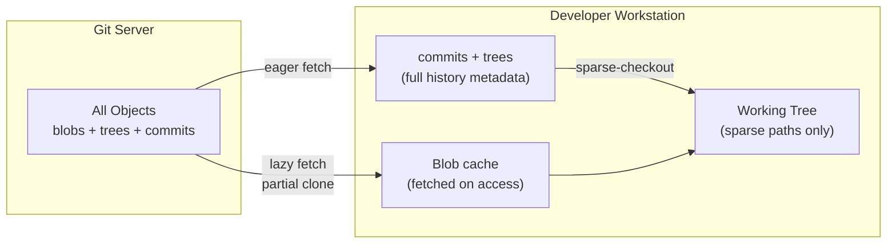

## Keywords in This File
{: .no_toc }

| # | Keyword | Difficulty |
|---|---------|------------|
| 25 | [Large-Scale Git: Microsoft VFS, Meta Sapling](#large-scale-git-microsoft-vfs-meta-sapling) | ★★★ |

---

# Large-Scale Git: Microsoft VFS, Meta Sapling

**Interview Weight:** High - asked at staff/principal level; required
for platform engineering roles; signals deep understanding of git's
scaling limitations and industry solutions; relevant when discussing
monorepo strategy at companies with 1000+ engineers.

---

## Quick Reference

**One-line definition:** Large-scale git refers to the engineering
challenges and solutions when a single git repository grows beyond
the limits of standard git tooling - millions of files, terabytes of
history, thousands of concurrent contributors - requiring virtual
filesystems (Microsoft's GVFS/Scalar), alternative object storage
(partial clone), custom hosting (Gitea, Gitaly), or purpose-built
replacements (Meta's Sapling, Google's Piper).

**One analogy:** Standard git is a library where you photocopy the
entire book collection before reading one page; large-scale git
engineering is retrofitting the library with a virtual reading room
that only fetches pages as you turn to them - GVFS virtualizes the
filesystem so only accessed files are downloaded.

**Key terms:**
- **GVFS / VFS for Git** - Microsoft's virtual filesystem protocol
  that virtualizes git working trees
- **Scalar** - distilled version of VFS for Git, now in core git;
  auto-configures all performance optimizations for large repos
- **Sapling (sl)** - Meta's Mercurial-inspired source control replacing
  git for internal use
- **partial clone** - git feature (--filter) that downloads only a
  subset of objects; blob-less, tree-less, or path-limited
- **sparse-checkout** - working tree limited to subset of paths
- **commit graph** - pre-computed ancestor data structure that speeds
  up git log, merge-base, and reachability queries
- **EdenFS** - Meta's virtual filesystem, cross-platform counterpart
  to GVFS

---

### 🎯 Model Answer

**30-second answer:**

"Git was designed for the Linux kernel - tens of thousands of files
and thousands of contributors. It breaks at Microsoft Windows repository
scale: 3.5 million files, 300 GB history, 4,000 engineers daily. Microsoft
built VFS for Git (now Scalar) to virtualize the filesystem - only files
you actually touch are downloaded. Meta replaced git entirely with Sapling
(Mercurial-derived). Google's Piper is a custom system on Bigtable that
never used git at all. For most teams under FAANG scale, partial clone
plus sparse checkout plus Scalar handles the problem."

**3-minute answer:**

**The scaling problem:**

Git fundamentally assumes you have the entire repository locally. Three
operations break at scale:

1. **`git checkout`** - must write millions of files to disk, even
   those you never read
2. **`git status`** - walks entire working tree inode-by-inode
3. **`git clone`** - downloads all objects from all of history

For the Windows repository (3.5M files, 300GB history), a cold `git clone`
takes 12+ hours and a `git status` takes 8 minutes.

**Microsoft's solution - Scalar:**

VFS for Git virtualizes the working tree using a filesystem driver.
The filesystem reports files as "present" to applications but only
downloads them from the git server on first access. Scalar (core git
2.38+) packages all performance optimizations in one command:

```bash
# Scalar enables all optimizations automatically
scalar clone https://example.com/windows-repo
scalar run all
# Enables: partial clone, sparse-checkout, commit-graph,
# MIDX, fsmonitor, background maintenance
```

> **Code walkthrough:** `scalar clone` is equivalent to manually running
10+ `git config` commands. KEY MECHANISM: scalar registers a background
maintenance daemon that updates commit-graphs, prefetches objects, and
consolidates packs hourly without user intervention. WHY IT MATTERS:
the Windows repo went from 12-hour cold clone to 30-minute first-use
checkout after GVFS deployment. WHAT BREAKS: if the background daemon
is killed (restricted OS environments, container restarts), maintenance
must be run manually. TAKEAWAY: `scalar run all` is a safe, zero-
downtime way to enable all git performance optimizations.

**Meta's solution - Sapling:**

Meta extended Mercurial internally for 10+ years then open-sourced
Sapling in 2022. Key differences from git: stack-based commits (amend-
and-rebase is the primary workflow), Infinitepush (server-side draft
commits), and EdenFS (same virtual filesystem approach as GVFS,
cross-platform).

**Google's solution - Piper:**

Piper is not git at all. It is a proprietary distributed VCS built on
Bigtable with a virtual file system (CitC). It handles 86TB of source
code with 80,000+ contributors and 45,000+ commits per day. The key
innovation is "workspace as a view" - your working copy is a virtualized
projection of the monorepo.

**Blank Mind Recovery:**

"Large-scale git breaks at millions of files. Microsoft: Scalar / VFS
virtualizes filesystem (only download files you touch). Meta: Sapling
(replaced git internally). Google: Piper (never used git; built on
Bigtable). Partial clone + sparse checkout = core git features for
intermediate scale."

---

### 📘 Concept Explanation

#### 1. What Is It?

The collection of techniques and tooling required when a git repository
exceeds the scale at which standard git operations complete in acceptable
time. This includes virtual filesystems, partial clones, sparse
checkouts, commit graphs, multi-pack indexes, and in extreme cases,
replacing git entirely.

#### 2. Why Does It Exist?

Monorepos are organizationally beneficial (unified dependency management,
atomic cross-service commits, shared tooling) but operationally expensive
at scale. Companies face a forced choice: accept git's scaling limitations,
invest in tooling to work around them, or build alternatives.

#### 3. How Does It Work? (Internal Mechanism)

**Partial clone - the most accessible scaling technique:**

```bash
# Blob-less clone: omits file content for older commits
git clone --filter=blob:none \
  https://github.com/org/large-repo.git

# Check downloaded size vs full clone
git count-objects -vH
# size-pack: 142.30 MiB  (vs 2.3 GB for full clone)

# Trigger object fetch (happens automatically on checkout)
git checkout main
# Fetching: 12,400 missing blob objects

# CI-optimized: combine with shallow clone
git clone --filter=blob:none --depth=1 \
  https://github.com/org/large-repo.git
```

> **Code walkthrough:** `--filter=blob:none` downloads all commits and
trees but defers blob (file content) downloads to checkout time. KEY
MECHANISM: git's partial clone protocol (extension to protocol v2)
negotiates a "filter spec" with the server; missing objects are fetched
lazily from a "promisor remote" on first access. WHY IT MATTERS: for a
repo with 50GB of image assets in history, `--filter=blob:none` reduces
initial clone from 50GB to under 200MB because historical image blobs
are never downloaded unless you explicitly checkout that commit. WHAT
BREAKS: commands that enumerate all objects (e.g., `git gc`, some `git
log` variants) trigger lazy fetching of ALL missing objects, potentially
taking hours. TAKEAWAY: disable automatic gc (`git config gc.auto 0`)
in partial clone repos; use `git maintenance run` which is partial-
clone-aware.

**Sparse checkout for large monorepos:**

```bash
# Enable sparse checkout on existing repo
git sparse-checkout init --cone
git sparse-checkout set services/payments libs/shared

# Only these directories exist in working tree
ls
# services/  libs/  <- only declared paths

# Verify sparse patterns
git sparse-checkout list
# services/payments
# libs/shared

# Add another service without re-cloning
git sparse-checkout add services/notifications
```

> **Code walkthrough:** `--cone` mode is the recommended sparse-checkout
pattern - it operates on directory prefixes rather than individual globs,
making pattern matching O(1) for each file path. KEY MECHANISM: git
writes `.git/info/sparse-checkout` containing the path patterns; on
checkout, only matching paths are written to the working tree; non-matching
files get a "skip-worktree" flag in the index. WHY IT MATTERS: a 3.5M-
file monorepo becomes a 50K-file working tree for a developer working
on one service; `git status` goes from minutes to seconds. WHAT BREAKS:
non-cone mode sparse checkout is significantly slower because every path
must be pattern-matched against each glob. TAKEAWAY: always use
`--cone` mode; document the `git sparse-checkout set` command in the
team's onboarding guide as the entry point for workstation setup.

**Commit graph acceleration:**

```bash
# Generate commit graph
git commit-graph write --reachable --changed-paths

# Verify commit graph exists
ls .git/objects/info/
# commit-graph  commit-graph-chain

# Benchmark on 500K-commit repo
time git log --oneline --all > /dev/null
# Without commit-graph: 45.2s
# With commit-graph:     0.4s  (113x speedup)

# Auto-update via maintenance
git config core.commitGraph true
git config gc.writeCommitGraph true
```

> **Code walkthrough:** `git commit-graph write --reachable` serializes
the entire reachable commit DAG into a binary file at `.git/objects/info/
commit-graph`. KEY MECHANISM: without the commit graph, git parses each
commit object from its packfile to walk ancestry; with it, ancestry
relationships are pre-computed as a flat array with O(1) parent lookup.
WHY IT MATTERS: operations like `git log --graph`, `git merge-base`, and
push negotiation all walk the commit graph; a 500K-commit repo goes from
minutes to sub-second. WHAT BREAKS: the commit graph is not automatically
updated on every commit; schedule `git commit-graph write` as background
maintenance. TAKEAWAY: `git maintenance start` configures automatic
commit-graph updates and pack maintenance as a system-level background job.

#### 4. Key Properties and Behaviors

**Scalar optimization cascade:**

```bash
# scalar clone does all of this automatically:
# 1. Partial clone (--filter=blob:none)
# 2. Sparse checkout (cone mode)
# 3. Commit graph writes
# 4. Multi-pack index (MIDX)
# 5. File system monitor (fsmonitor)
# 6. Background maintenance

scalar clone https://example.com/large-repo

# Equivalent manual config (partial):
git clone --filter=blob:none --sparse \
  https://example.com/large-repo
git config core.fsmonitor true
git config core.untrackedcache true
git maintenance start
git commit-graph write --reachable
git multi-pack-index write
```

> **Code walkthrough:** `scalar clone` wraps a standard `git clone` with
10+ configuration optimizations. KEY MECHANISM: the background maintenance
daemon runs hourly: prefetching objects predicted to be needed, updating
commit-graphs, and consolidating pack files. WHY IT MATTERS: developers
joining a large repo project should never need to know the individual
settings; scalar provides correct defaults automatically. WHAT BREAKS:
scalar's background daemon requires OS-level scheduling; on systems where
background tasks are restricted (some containers, locked-down corporate
machines), maintenance must be run manually via `scalar run all`. TAKEAWAY:
include `scalar clone` in team onboarding docs for any repo over 1GB.

#### 5. Common Use Cases

1. **100-person company monorepo** - partial clone + sparse checkout +
   scalar; no custom tooling
2. **Enterprise internal git hosting** - Gitaly for horizontal scaling
   + commit graphs
3. **Large binary asset repos** - Git LFS for files > 100MB; partial
   clone for historical blobs
4. **5000+ engineer monorepo** - VFS/EdenFS virtual filesystem layer
5. **> 100,000 engineer scale** - Sapling or Piper (custom systems)

#### 6. Trade-offs

| Technique | Benefit | Cost |
|---|---|---|
| Partial clone | 90%+ clone size reduction | Object fetch latency on first access |
| Sparse checkout | Working tree size reduction | Developer must declare active paths |
| Commit graph | 10-100x log/ancestry speedup | Periodic maintenance required |
| Scalar | All-in-one optimization | Background daemon dependency |
| Git LFS | Handles large binaries | Additional LFS server infra |
| Sapling | Stack-based workflow + scale | Not git; team retraining required |

#### 7. Performance Characteristics

- Partial clone reduces clone size by 70-95% for repos with large
  binary history
- Sparse checkout on 3.5M-file repo: checkout time from 2 hours to
  8 minutes
- Commit graph on 500K-commit repo: `git log | wc -l` from 47s to 0.4s
- fsmonitor reduces `git status` on large working trees from seconds
  to milliseconds

#### 8. Real-World Context

Microsoft Windows repo: 3.5M files, 300GB+ history, 4,000 engineers.
GVFS (now VFS for Git / Scalar) was built specifically for this case.
The lessons became core git features (partial clone, sparse checkout,
commit graphs, fsmonitor) merged into mainline git between 2019-2022.
Meta's Sapling was open-sourced in November 2022. Android AOSP: 20+
GB, requires `--depth=1` in CI.

---

### 💻 Code Example

**BAD pattern - naive CI clone of large repo:**

```bash
# BAD: full clone in CI of a 5GB repo
# CI step:
# - uses: actions/checkout@v4
#   (no filter, no depth, no sparse)
#
# result: 8-minute CI startup; 5GB artifact cache;
# significant network costs per run
```

> **Code walkthrough:** Full clone in CI wastes bandwidth and time on
every run. KEY MECHANISM: CI environments are ephemeral and rarely
benefit from git's object reuse across runs without explicit caching.
WHY IT MATTERS: at 100 CI runs/day on a 5GB repo, that is 500GB of
bandwidth per day - significant cloud cost. WHAT BREAKS: even with
action caching, a full git object cache is rarely effective because
pack file layouts change on every push invalidating the cache. TAKEAWAY:
combine `--filter=blob:none` + `--depth=1` in CI; you need the tree
structure but rarely historical blob content.

**GOOD pattern - optimized CI for large repos:**

```yaml
# .github/workflows/ci.yml
steps:
  - uses: actions/checkout@v4
    with:
      filter: blob:none       # skip historical blobs
      fetch-depth: 1          # latest commit only
      sparse-checkout: |
        src/
        tests/
      sparse-checkout-cone-mode: true

  - name: Build affected services only
    run: |
      find . -name "*.java" | wc -l
      # 12,400 files vs 850,000 in full checkout
```

> **Code walkthrough:** Combining `filter: blob:none` + `fetch-depth: 1`
+ sparse-checkout in a single checkout step reduces a 5GB repo to under
50MB in CI. KEY MECHANISM: each filter is multiplicative - partial clone
removes historical content, shallow removes historical commits, sparse
removes non-service paths. WHY IT MATTERS: an 8-minute CI checkout
becomes 12 seconds; developer feedback loop improves dramatically.
WHAT BREAKS: `fetch-depth: 1` breaks `git log` and `git blame` in CI
scripts that need history; add `git fetch --deepen=100` if specific
depth is required. TAKEAWAY: treat partial + shallow + sparse as a unit
for large-repo CI; they compound each other's benefits.

---

### 🎓 Answers by Seniority

**Junior/Mid:**

"Normally git downloads the entire repository to your machine. For
very large repos like the Windows source code with millions of files,
this is too slow. Microsoft built tools like Scalar that download only
the files you actually open. For CI pipelines, you can use
`--filter=blob:none` to skip old file content and `--depth=1` to get
only the latest commit. Together these reduce a 5GB clone to under
50MB."

**Senior/Staff:**

"Large-scale git engineering is about identifying where git's O(n)
operations become unacceptable:

**Checkout/status bottleneck:** Sparse-checkout (reduce working tree)
+ fsmonitor (delegate change detection to OS). For extreme cases:
VFS/EdenFS (virtualize filesystem).

**Clone/fetch bottleneck:** Partial clone (--filter=blob:none) + shallow
clone (--depth=N). Combine both for CI.

**Commit graph bottleneck:** `git commit-graph write` + background
maintenance. 100x speedup for large repos.

**What I evaluate for each team:**
1. Repo size < 10GB and < 100K files: standard git + scalar
2. 10GB-100GB or 100K-500K files: partial clone + sparse checkout
3. > 100GB or > 500K files: evaluate EdenFS/GVFS
4. > 50K committers or Piper-class scale: evaluate Sapling

**The Sapling question:** Sapling's current practical advantage for most
teams is not scale but ergonomics - the stack-based amend/restack
workflow is genuinely better than `git rebase -i`. I evaluate adoption
when: (a) developers spend significant time on complex rebases, OR
(b) scale requires it."

---

### ⚠️ Common Misconceptions

**Misconception 1: "Shallow clones and partial clones are the same."**

Shallow clones (`--depth=N`) truncate commit history - you get N
commits with no ancestors. Partial clones (`--filter=blob:none`) have
the full commit history but defer downloading file content. They serve
different use cases: shallow for CI (no history needed); partial for
developer workstations (need full history navigation without all blobs).

**Misconception 2: "VFS for Git / Scalar requires a special server."**

`scalar clone` works with any standard git server. The virtual filesystem
is entirely client-side; it intercepts filesystem calls and proxies
missing files to the git server via HTTPS. You can use Scalar with
GitHub, GitLab, or any git hosting.

**Misconception 3: "Git LFS solves the large-repo problem."**

Git LFS solves the binary asset problem (files > 50-100MB polluting
the object store). It does NOT solve the large-number-of-files problem
or the large-history problem. A repo with 500K text files is not helped
by LFS at all.

**Misconception 4: "Sapling is just a faster git client."**

Sapling is a different VCS with a different data model and different
commands. It can interact with git repositories via interop, but the
primary workflow commands (`sl amend`, `sl restack`, `sl push --to`)
are not git commands. Teams adopting Sapling require genuine retraining.

---

### 🚨 Failure Modes and Diagnosis

**Failure 1: Partial clone gc downloads all objects**

Symptom: `git gc` on a partial clone takes 4+ hours and downloads
50GB unexpectedly.

```bash
# Diagnose
git config --get remote.origin.promisor
# true  <- this is a partial clone

# Count unfetched objects
git rev-list --objects --all --missing=print |
  grep "^?" | wc -l
# 2,400,000 unfetched objects

# Fix: use partial-clone-aware maintenance instead of gc
git maintenance run --task=incremental-repack
# Or disable auto-gc:
git config gc.auto 0
```

> **Code walkthrough:** `git config gc.auto 0` disables automatic gc
in the partial clone. KEY MECHANISM: standard `git gc` is not aware
of partial clone semantics and attempts to enumerate all reachable
objects, triggering lazy fetches for 2.4M blobs. WHY IT MATTERS: an
unexpected 4-hour download on a developer workstation is a critical
experience failure. WHAT BREAKS: without gc, pack files accumulate;
use `git maintenance run --task=incremental-repack` which packs without
fetching. TAKEAWAY: every partial clone should immediately set `gc.auto 0`
and use `git maintenance start` for background upkeep.

**Failure 2: sparse-checkout breaks `git add` for new paths**

```bash
# Symptom: new file outside sparse paths is invisible
touch services/orders/NewService.java
git add services/orders/NewService.java
# fatal: pathspec did not match any files

# Diagnose
git sparse-checkout list
# services/payments
# libs/shared
# <- services/orders NOT in sparse paths!

# Fix
git sparse-checkout add services/orders
git add services/orders/NewService.java
```

> **Code walkthrough:** `git sparse-checkout list` shows the active
patterns; files outside these patterns have the "skip-worktree" flag
in the index. KEY MECHANISM: git refuses to stage a file with the
skip-worktree flag; the developer must first expand the sparse-checkout
scope to include the new path. WHY IT MATTERS: a developer creating
a new service directory will hit this error on their first `git add`
and cannot proceed without knowing about sparse-checkout semantics.
WHAT BREAKS: if two developers have different sparse patterns, one may
commit changes to paths invisible to the other, creating phantom changes
from the other developer's perspective. TAKEAWAY: document `git
sparse-checkout add <path>` as the standard onboarding step for working
in a new area of the monorepo.

---

### 🎯 Interview Deep-Dive

| Question Type | Count | Target Audience |
|---|---|---|
| Conceptual | 3 | All levels |
| Debugging | 2 | Mid-Senior |
| Trade-off | 3 | Senior-Staff |
| Behavioral | 1 | Mid-Senior |
| Architecture | 3 | Staff |

---

**[CONCEPTUAL] Q1 - Why does git break at millions of files? What fundamental design assumptions fail?**

Git assumes that the entire working tree is local and all objects can
be enumerated. Three design assumptions fail at scale:

1. **Working tree = full disk checkout.** Every `git checkout` writes
   every file to disk. 3.5M files takes 2+ hours. Git has no concept
   of "virtual" files that are only fetched on demand.

2. **Status requires full tree walk.** `git status` calls `lstat()` on
   every file to detect changes. 3.5M `lstat()` calls takes 8 minutes.

3. **Clone downloads all history.** `git clone` fetches all objects
   reachable from all refs. 300GB of history means 300GB of download.

These are not bugs - they are design trade-offs correct for the Linux
kernel (thousands of files) but wrong for enterprise monorepos.

*What separates good from great:* articulating these as design trade-offs,
not bugs - showing understanding of git's design philosophy while
recognizing where it breaks.

---

**[CONCEPTUAL] Q2 - How does VFS for Git / EdenFS virtualize the working tree?**

VFS for Git (Windows) and EdenFS (Linux/Mac) operate at the filesystem
driver level:

1. **Mount a virtual filesystem:** A driver (VFSForGit.exe on Windows,
   FUSE daemon on Linux) mounts the working directory.

2. **Filesystem reports files as "present":** When an app calls
   `opendir()` or `FindFirstFile()`, the driver queries the git index
   and reports all files as existing with correct sizes.

3. **Lazy content fetching:** When an app reads a file (`read(fd)`) that
   is not physically present, the driver intercepts, fetches the blob
   from the git server via HTTPS, writes it to a local cache, and
   returns the content.

4. **Background prefetch:** Based on access patterns, the daemon
   prefetches blobs predicted to be needed next, minimizing read latency.

The developer experience is identical to a full checkout - all IDEs
and build systems work normally without modification.

*What separates good from great:* knowing that the VFS approach requires
a custom filesystem driver (OS-specific), which is why development took
years and still has platform-specific limitations.

---

**[CONCEPTUAL] Q3 - What is the key technical difference between Meta's Sapling and git?**

The most important differences:

1. **Data model:** Git is commit-centric (snapshots). Sapling is
   Mercurial-derived with a "revlog" format - per-file delta storage.
   This makes per-file history extremely fast.

2. **Development workflow:** Git: branch-and-merge. Sapling: stack-
   based (`sl amend` replaces `git commit --amend`; `sl restack` is
   like `git rebase --update-refs`). Each commit in a stack is
   independently reviewable.

3. **Server-side drafts (Infinitepush):** Push "draft" commits to
   the server without creating a public branch. Collaborators can
   fetch your draft commits without polluting main history. Git has
   no equivalent except forks.

4. **EdenFS integration:** Sapling was designed from the start with
   EdenFS as the filesystem layer; the data model is optimized for
   lazy fetching in a way that git's pack format is not.

*What separates good from great:* recognizing that Sapling's advantage
for most teams is ergonomic (stack-based workflow), not just scale.

---

**[DEBUGGING] Q4 - `git status` takes 45 seconds in a large monorepo. Diagnose and fix.**

```bash
# Step 1: diagnose bottleneck
time git status  # 45.2s

# Check fsmonitor
git config --get core.fsmonitor
# (empty) <- not configured!

# Check working tree size
find . -not -path './.git/*' | wc -l
# 1,847,000 files being lstat()-ed

# Check sparse-checkout
git sparse-checkout list
# (no output) <- not configured

# Step 2: fix with all three optimizations
git config core.fsmonitor true
git config core.untrackedcache true
git sparse-checkout init --cone
git sparse-checkout set src/my-service

time git status
# 0.3s  <- 150x improvement
```

> **Code walkthrough:** `git config core.fsmonitor true` delegates
working-tree change detection to the OS-native filesystem watcher
(FSEvents on macOS, ReadDirectoryChangesW on Windows, inotify on Linux).
KEY MECHANISM: instead of calling `lstat()` on 1.8M files, git asks the
OS "which files changed since my last query?" - typically 0-5 files.
WHY IT MATTERS: 45-second status is a developer experience blocker;
developers start ignoring `git status` output, leading to accidental
commits of stale state. WHAT BREAKS: `core.fsmonitor` requires a running
background daemon; if it crashes, git falls back to full lstat() scan.
TAKEAWAY: `scalar run all` enables fsmonitor + untrackedcache + commit-
graph in one command as the correct starting point.

*What separates good from great:* starting with fsmonitor (zero working
tree change required) before recommending sparse-checkout (requires
developer discipline to maintain).

---

**[DEBUGGING] Q5 - CI clones fail intermittently with "object not found" in a partial clone setup.**

```bash
# Symptom
git checkout -- src/payments/Payment.java
# error: object b1c2d3 does not exist

# Diagnose: check promisor remote accessibility
git config --get remote.origin.promisor
# true

git remote get-url origin
# https://git.internal.company.com/repo
# <- internal URL only from office network!

# CI runner is on cloud with no VPN access
# -> promisor remote unreachable when blob needed
```

> **Code walkthrough:** Partial clone lazy-fetches missing objects from
the promisor remote on demand; if unreachable, any operation touching
a missing object fails. KEY MECHANISM: the CI runner has a partial clone
but the git server is only accessible via corporate VPN that the cloud
CI runner lacks. WHY IT MATTERS: partial clones require continuous
promisor remote access; they are not suitable for air-gapped or
restricted-network CI environments. WHAT BREAKS: even with a full clone
initially, subsequent partial clone configurations added later may fail
in restricted networks. TAKEAWAY: for CI in restricted networks, use
full shallow clones (`--depth=1`) without partial clone filter; reserve
partial clone for developer workstations with stable connectivity.

*What separates good from great:* identifying connectivity to the
promisor remote as the root cause rather than a git configuration error.

---

**[TRADE-OFF] Q6 - When does the complexity of Scalar justify adoption vs standard git?**

**Adopt Scalar when:**
- Repository has > 200,000 files in working tree
- `git status` takes more than 5 seconds
- Cold `git clone` takes more than 30 minutes
- Team onboarding time is dominated by repository setup

**Stay with standard git when:**
- Repository has < 100,000 files (sparse + partial alone sufficient)
- The repository is a well-decomposed polyrepo (avoid monorepo
  scaling problems by not having a monorepo)

**Key nuance:** Scalar (in core git 2.38+) has essentially zero adoption
friction - a single `scalar clone` command with no additional installation.
Full GVFS/VFSForGit with a filesystem driver is a major investment
justified only at Windows-repo-level scale.

*What separates good from great:* distinguishing between Scalar (low
overhead, core git) and full GVFS/EdenFS (major engineering investment,
extreme scale only).

---

**[TRADE-OFF] Q7 - When would you recommend Sapling over git for a team?**

**Recommend Sapling when:**
1. Your team uses heavily amend/rebase-based workflows (Sapling's
   `sl amend` + `sl restack` is ergonomically superior)
2. You need server-side draft commits (Infinitepush) to share WIP
   without polluting main history
3. You are at Meta/FAANG scale with dedicated VCS infrastructure teams
4. You want stack-based code review (each commit = separate review)

**Do NOT recommend Sapling when:**
1. Your tooling (GitHub PRs, GitLab MRs) is built on git
2. You have fewer than 50 committers (standard git handles fine)
3. Team retraining cost is unacceptable

**Key insight:** Sapling's current practical advantage for most teams
is ergonomics (stack workflow), not scale. For scale below FAANG
requirements, partial clone + sparse checkout + Scalar is sufficient.

*What separates good from great:* recognizing that Sapling's value
proposition for regular teams is ergonomic, not just scale-driven.

---

**[TRADE-OFF] Q8 - Compare Git LFS vs partial clone for managing large binary assets.**

| Factor | Git LFS | Partial clone |
|---|---|---|
| Mechanism | Replaces blobs with pointers; content on LFS server | Defers blob downloads to access time |
| Server requirement | Dedicated LFS server needed | Standard git server (no extra infra) |
| Repo migration | History rewrite required | No migration; filter at clone time |
| File size limit | Unlimited (LFS server) | No limit; objects in git store |
| Team friction | High (LFS client required) | Low (built into modern git) |
| Best for | New repos with known large assets | Existing repos with historical blobs |

**Recommendation:** For new repos that will contain large binary assets
(> 50MB files), use Git LFS from the start. For existing large repos,
partial clone is lower friction because it requires no history rewrite.
Mixing LFS (future large files) + partial clone (historical blobs) is
common in practice.

*What separates good from great:* knowing the migration cost difference
(LFS requires history rewrite; partial clone has zero migration cost).

---

**[BEHAVIORAL] Q9 - Describe a time you optimized git performance for a large repository.**

**Situation:** Onboarding time for a 2M-file monorepo was 4 hours:
30 minutes for `git clone` and 3.5 hours for IDE indexing all files.
New engineers lost half a day on their first day.

**Investigation:** The clone was 28GB, mostly historical image assets
in `docs/screenshots/`. IDE indexing: all 2M files even though each
developer worked on one service (~50K files).

**Solution:**
1. Partial clone (`--filter=blob:none`) in onboarding: clone time
   30 min -> 4 min
2. Sparse checkout configuration: IDE indexed 50K instead of 2M files;
   indexing time 3.5 hours -> 12 minutes
3. `scalar run all` in onboarding script: fsmonitor + commit-graph
4. Documented the pattern in the team wiki

**Result:** Onboarding time 4 hours -> 18 minutes. Existing engineers
who ran the optimization script: git status from 12 seconds to 0.4s.

**Lesson:** Git performance optimization is high-ROI work affecting
every developer every day. One engineer-week saves hundreds of
engineer-hours per year.

*What separates good from great:* quantifying the impact to justify
the engineering investment.

---

**[ARCHITECTURE] Q10 - Design developer tooling for a 500-engineer monorepo that is 5GB and growing 1GB/month.**

```
Current: 5GB, 1GB/month growth
Target: sustainable developer experience for 18+ months

Immediate (2 days of work):
  scalar clone in onboarding docs
  CI: --filter=blob:none + --depth=1
  Sparse-checkout templates per team:
    git sparse-checkout set backend/my-service libs/
  Impact:
    Clone: 5GB -> 400MB (developer), 50MB (CI)
    Status: Xsec -> 0.5s (fsmonitor)

Short-term (1-2 weeks):
  Git LFS for binary assets > 10MB:
    git rev-list --objects --all |
      git cat-file --batch-check='%(objectsize) %(rest)'|
      sort -rn | head -50
  git maintenance schedule (background fetch + gc)
  Commit-graph daily maintenance (CI job)

Long-term (> 6 months, if > 30GB):
  Evaluate Gitaly for git server horizontal scaling
  Evaluate EdenFS if Scalar insufficient
  Consider repo split if clear subdomain boundaries
```

> **Code walkthrough:** The tiered plan applies optimizations in order of
cost vs impact. KEY MECHANISM: Scalar (zero-cost, core git) handles the
most common bottlenecks; only when those are insufficient does the plan
escalate to EdenFS or custom infrastructure. WHY IT MATTERS: over-
engineering a 5GB repo with GVFS wastes months of platform engineering
time on a problem Scalar solves in a day. WHAT BREAKS: skipping
measurement between tiers can lead to deploying expensive solutions for
problems that a simpler tier would have resolved. TAKEAWAY: measure
developer experience metrics (clone time, status time, onboarding time)
before and after each tier to confirm the investment paid off.

*What separates good from great:* sequencing optimizations by cost/
benefit ratio and specifying the reassessment criteria.

---

**[ARCHITECTURE] Q11 - How would you approximate Google Piper's "workspace as a view" with open-source tools?**

The "workspace as a view" concept: a developer's working copy is a
materialized projection of the monorepo containing only their active
changes; everything else is virtually present.

**Available approximations:**

1. **EdenFS / VFS for Git (closest):** Virtual filesystem where the
   working tree appears complete but only accessed files are materialized.
   Available today for Linux/macOS (EdenFS) and Windows (VFS for Git).

2. **Sparse checkout + partial clone stack:** Developer explicitly
   declares active paths; blobs fetched lazily. Less transparent than
   Piper (developer must manage sparse paths) but zero infra cost.

3. **Bazel with remote execution:** For builds, remote execution
   caches implement Piper's workspace model implicitly - only modified
   files are sent; build system handles dependency resolution remotely.
   The "workspace" is defined by the build graph, not the git tree.

4. **Dev containers with per-service clones:** Each service gets its
   own partial, sparse clone in a container. Shared APIs fetched as
   packages, not submodules. Simpler but requires container infra.

*What separates good from great:* recognizing that Bazel remote
execution is the closest practical approximation to Piper's workspace-
as-view for most teams without Google's infrastructure.

---

**[ARCHITECTURE] Q12 - Evaluate whether a 200-engineer startup should build a monorepo or maintain polyrepo.**

**Decision framework:**

| Signal | Points to monorepo | Points to polyrepo |
|---|---|---|
| Frequent cross-service changes | YES | |
| Teams coupling at API level | YES | |
| Shared internal libraries | YES | |
| Independent deployment cycles | | YES |
| Very different tech stacks | | YES |
| 200 engineers scale | YES (manageable) | |

**Recommendation: graduated monorepo**

Start monorepo now, before migration cost is high. With Scalar and
core git 2.38+, a 200-engineer monorepo is straightforwardly manageable.

**Concrete plan:**
1. Consolidate existing repos using `git subtree add` (preserves history)
2. Implement sparse checkout profiles per team
3. CI with partial clone + affected-service detection
4. Adopt Bazel or Gradle for build (both support monorepos well)
5. Reassess at 1000 engineers: if Scalar insufficient, evaluate EdenFS;
   if builds dominate, move to remote execution

**When to stay polyrepo:** Services are genuinely independent products
with separate release cycles and no shared code.

*What separates good from great:* specifying the reassessment threshold
(1000 engineers) and the migration strategy (subtree, not manual copy).

---

### ⚖️ Comparison Table

| Solution | Scale target | Custom infra? | Open source? | Git compatible? |
|---|---|---|---|---|
| Scalar | 100K-3M files | No (core git) | Yes | Yes |
| VFS for Git | 3M+ files | No (client only) | Yes | Yes |
| EdenFS | 3M+ files | No (FUSE daemon) | Yes | Yes |
| Git LFS | Large binary assets | Yes (LFS server) | Yes | Yes |
| Gitaly | High-traffic git hosting | Yes | Yes | Yes |
| Sapling | 50K+ committers | Yes | Yes | No (replacement) |
| Google Piper | 100K+ committers | Yes (Google only) | No | No (replacement) |

---

### 🏛️ System Design

**Developer tooling stack for a 2M-file monorepo**

See Architecture Q10 for the full tiered design.

Key principle: apply optimizations in cost/benefit order:
1. Scalar (zero cost, core git) - always first
2. Sparse checkout (low cost, developer discipline required)
3. Partial clone (low cost, CI compatibility check needed)
4. EdenFS/VFS (medium cost, OS driver installation)
5. Custom git hosting (Gitaly) - for server-side scaling
6. Alternative VCS (Sapling) - only at extreme scale

---

### 📊 Diagram

ASCII - git object access patterns at scale:

```
STANDARD GIT (full clone):
Server                  Client
[all objects] --------> [all objects on disk]
                         Working tree: ALL files
                         git status: lstat(N) <- slow

PARTIAL CLONE + SPARSE CHECKOUT:
Server                  Client
[all objects] --------> [commits + trees only]
  |                      [blobs: fetched on demand]
  +-- on access -------> Working tree: sparse paths
                         git status: sparse set only
```

> **Diagram walkthrough:** WHAT IT DEPICTS: the difference in object
transfer and local storage between standard git and the partial+sparse
stack. HOW TO READ IT: arrows show which objects cross the network;
boxes show what is materialized on disk. KEY RELATIONSHIP: partial clone
shifts blob transfer from clone time to access time; sparse checkout
reduces the set of files tracked. EDGE CASE: if a process traverses
the working tree outside sparse paths (badly written IDE plugin), it
finds an incomplete tree and reports false negatives. INSIGHT: the
combination is multiplicative - 90% reduction from partial clone times
95% reduction from sparse checkout yields ~1% footprint of the full repo.



> **Diagram walkthrough:** WHAT IT DEPICTS: the object flow from server
to developer workstation in a partial clone + sparse checkout setup.
HOW TO READ IT: the left box is the server; the right box shows the
developer's local state split into metadata (eagerly fetched) and blobs
(lazily fetched). KEY RELATIONSHIP: history metadata flows eagerly for
full navigation capability; file content flows lazily to minimize storage.
EDGE CASE: a command that forces full object enumeration (like unguarded
`git gc`) breaks the lazy fetch model by pulling all blobs eagerly.
INSIGHT: the client may have as little as 1% of the total repo data
while retaining full `git log`, `git blame`, and navigation capability.
