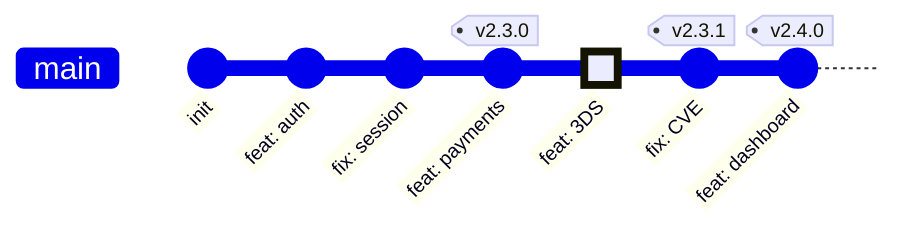

## Keywords in This File
{: .no_toc }

| # | Keyword | Difficulty |
|---|---------|------------|
| 24 | [Release Engineering and Git Workflow Architecture](#release-engineering-and-git-workflow-architecture) | ★★★ |

---

# Release Engineering and Git Workflow Architecture

**Interview Weight:** Very High - branching strategy, tagging, and
release workflow are asked at every Staff+ interview; required knowledge
for lead, principal, and platform engineering roles; often a deciding
factor in senior candidate assessment.

---

## Quick Reference

**One-line definition:** Release engineering is the practice of designing
branching models, versioning schemes, and automation pipelines that
transform commits into deployable artifacts reliably and repeatedly;
the branching strategy chosen (trunk-based, Gitflow, GitHub Flow) is
an architectural decision that shapes delivery speed, team size, and
risk tolerance.

**One analogy:** A branching strategy is like a city's traffic system -
Gitflow is a complex multi-lane highway system optimized for
long-distance cargo (parallel release trains); trunk-based development
is a single one-way street with very short blocks (frequent, small
commits merged daily); the strategy you choose reflects the "traffic
density" and "cargo type" of your team.

**Key terms:**
- **trunk-based development** - all commits land on main daily; release
  from tags on main
- **Gitflow** - long-lived branches: main, develop, feature/*, release/*, hotfix/*
- **GitHub Flow** - feature branches + PR + deploy directly from main
- **release branch** - branch cut from main at release time for stability
- **feature flag** - code-based toggle that decouples deploy from release
- **semantic versioning** - MAJOR.MINOR.PATCH (2.1.3)
- **conventional commits** - structured commit message format enabling
  automated changelog and version bump
- **CHANGELOG.md** - human-readable record of changes per version
- **tag** - immutable pointer to a commit; used for releases (v2.1.3)

---

### 🎯 Model Answer

**30-second answer:**

"Trunk-based development with feature flags is the release engineering
strategy used by high-performing teams (Google, Facebook, Netflix). All
developers commit to main daily. Features are hidden behind flags until
ready. Releases are tagged commits from main with auto-generated changelogs.
Gitflow is appropriate for teams that must support multiple concurrent
release lines (e.g., a library with v1.x and v2.x in active maintenance)."

**3-minute answer:**

**The three major strategies:**

1. **Trunk-Based Development (TBD):** Every developer commits to `main`
   (or a short-lived feature branch, max 1-2 days). Feature flags hide
   incomplete work. CI gates every commit. Release = tag on main +
   deploy pipeline. Used by: Google, Facebook, Netflix, Spotify.

2. **Gitflow:** Long-lived `develop` branch for integration. Feature
   branches merge to `develop`. At release time, a `release/*` branch
   is cut from `develop`, stabilized, then merged to both `main` and
   `develop`. Hotfixes on `main` are cherry-picked to `develop`. Used
   for: libraries, firmware, products with long release cycles.

3. **GitHub Flow:** Single `main` branch. All work in short-lived
   feature branches. PR merges trigger deploy. Used by: SaaS teams with
   continuous deployment.

**Versioning:**

Semantic versioning (semver) combined with Conventional Commits enables
fully automated release pipelines:
- `fix: ...` commits -> PATCH bump (1.2.3 -> 1.2.4)
- `feat: ...` commits -> MINOR bump (1.2.3 -> 1.3.0)
- `BREAKING CHANGE:` footer -> MAJOR bump (1.2.3 -> 2.0.0)

Tools like `semantic-release` or `release-please` automate: version
detection, tag creation, GitHub Release creation, CHANGELOG generation,
and artifact publishing.

**When to choose which:**

| Factor | TBD | Gitflow | GitHub Flow |
|---|---|---|---|
| Release cadence | Daily/hourly | Monthly/quarterly | Continuous |
| Concurrent support versions | No | Yes | No |
| Team size | Any | Large (10+) | Small-medium |
| Feature flags available | Yes | Optional | Optional |

**Blank Mind Recovery:**

"Branching strategy = how commits reach production. TBD = everyone on
main + feature flags + tag releases. Gitflow = develop branch + release
branches. GitHub Flow = PR from feature branch to main + CI deploys.
Semver: MAJOR.MINOR.PATCH. Conventional commits automate version bumps."

---

### 📘 Concept Explanation

#### 1. What Is It?

Release engineering is the systematic design of the processes that turn
source code changes into deployed software. In git, this is expressed
as a branching strategy (how branches are created and merged), a
versioning scheme (what version numbers mean), and release automation
(how tags become deployable artifacts).

#### 2. Why Does It Exist?

Without a defined strategy, teams accumulate merge conflicts, lose
production visibility, and cannot confidently deploy or roll back.
Release engineering creates the "deployment confidence" that separates
amateur from professional operations.

#### 3. How Does It Work? (Internal Mechanism)

**Trunk-Based Development with feature flags:**

```bash
# Standard TBD commit flow
git checkout -b feat/payment-3ds
# ... work (max 1-2 days) ...
git commit -m "feat(payments): add 3DS authentication stub

behind PAYMENT_3DS_ENABLED flag; not yet active"
git push origin feat/payment-3ds
# PR -> CI -> merge to main (squash or merge commit)
# Feature flag is OFF in production
# Future commit: git commit -m "feat(payments): enable 3DS in prod"
# Remove flag after rollout confirmed

# Release: tag main
git tag -a v2.3.0 -m "Release v2.3.0"
git push origin v2.3.0
# CI/CD picks up the tag and runs the release pipeline
```

> **Code walkthrough:** The branch name `feat/payment-3ds` is
intentionally short-lived (max 2 days). KEY MECHANISM: feature flags
decouple "deploy" from "release" - the code is in production but
inactive; activation is a config change with no code deploy. WHY IT
MATTERS: this pattern enables teams to deploy 10+ times per day without
blocking features that take weeks to build. WHAT BREAKS: feature flags
accumulate as technical debt; each flag needs a removal ticket once the
feature is stable in production. TAKEAWAY: every feature flag must have
a hard expiry date and an owner responsible for removal.

**Gitflow branching model:**

```
main     ----*--------*---------*
              \       |hotfix   /
release/2.0    \------*--------/ (merge to main + develop)
                \
develop  *---*---*---*---*---*---*
              |           |
feature/A ----*     feature/B ---*
```

> **Diagram walkthrough:** WHAT IT DEPICTS: the Gitflow branch topology
with main, develop, feature, release, and hotfix branches. HOW TO READ
IT: commits flow from feature branches into develop; at release time a
release branch is cut from develop; after stabilization it merges to
both main and develop. KEY RELATIONSHIP: main always represents released
production code; develop accumulates next-release work. EDGE CASE: if
a hotfix is applied to main but the cherry-pick to develop is forgotten,
the next release will reintroduce the fixed bug. INSIGHT: Gitflow's
complexity is justified only when multiple release lines are actively
maintained.

**Conventional Commits + semantic-release automation:**

```bash
# Conventional commit format
# type(scope): description
# [optional body]
# [optional footer]

git commit -m "fix(auth): prevent session fixation on login"
# PATCH bump: 1.2.3 -> 1.2.4

git commit -m "feat(api): add cursor-based pagination"
# MINOR bump: 1.2.3 -> 1.3.0

git commit -m "feat(auth): migrate to OAuth 2.1

BREAKING CHANGE: bearer tokens no longer accepted;
use authorization code flow"
# MAJOR bump: 1.2.3 -> 2.0.0

# .releaserc.json (semantic-release config):
# {
#   "branches": ["main"],
#   "plugins": [
#     "@semantic-release/commit-analyzer",
#     "@semantic-release/changelog",
#     "@semantic-release/github",
#     "@semantic-release/npm"
#   ]
# }
```

> **Code walkthrough:** The `BREAKING CHANGE:` footer in the commit
message is parsed by `@semantic-release/commit-analyzer` to determine
that a major version bump is required. KEY MECHANISM: semantic-release
reads ALL commits since the last tag, computes the highest bump type
(MAJOR > MINOR > PATCH), creates the new tag, generates a CHANGELOG
section for that version, and publishes to GitHub Releases and npm in
one automated pipeline run. WHY IT MATTERS: no human decides when to
bump the version or what to put in the changelog - it is derived entirely
from the commit history. WHAT BREAKS: undisciplined commit messages
(plain text, no type prefix) prevent version automation; the next release
will be computed as a PATCH even if it contains breaking changes.
TAKEAWAY: enforce conventional commit format via a pre-commit hook or
CI check (`commitlint`).

#### 4. Key Properties and Behaviors

**Hotfix workflow (all strategies):**

```bash
# Gitflow hotfix
git checkout main
git checkout -b hotfix/cve-2024-12345
# ... fix ...
git commit -m "fix(security): patch CVE-2024-12345"
git checkout main
git merge --no-ff hotfix/cve-2024-12345
git tag -a v2.2.1 -m "Security patch release"
git checkout develop
git merge --no-ff hotfix/cve-2024-12345
# CRITICAL: cherry-pick to develop or the fix is lost
git branch -d hotfix/cve-2024-12345
```

> **Code walkthrough:** The double merge (to main AND develop) is the
Gitflow hotfix contract. KEY MECHANISM: `--no-ff` creates an explicit
merge commit with a message, making the hotfix visible in both branch
histories. WHY IT MATTERS: forgetting the `develop` merge means the
bug reappears in the next feature release. WHAT BREAKS: if `develop`
has diverged significantly from `main`, the cherry-pick may have
conflicts that delay the fix. TAKEAWAY: set up automated reminders or
CI checks that detect when `main` commits are not present in `develop`.

**Release branch stabilization:**

```bash
# Cut release branch
git checkout develop
git checkout -b release/2.3.0
# Only bug fixes allowed here
git commit -m "fix: bump version to 2.3.0-rc.1"
# QA + regression testing on this branch
# After approval:
git checkout main
git merge --no-ff release/2.3.0
git tag -a v2.3.0 -m "Release 2.3.0"
git checkout develop
git merge --no-ff release/2.3.0  # sync fixes back
git branch -d release/2.3.0
```

> **Code walkthrough:** The release branch serves as a "code freeze"
period where only bug fixes are accepted. KEY MECHANISM: by merging the
release branch back to `develop`, all fixes made during stabilization
are included in the next development cycle automatically. WHY IT MATTERS:
without this merge-back, every hotfix on a release branch must also be
manually applied to `develop`, creating a maintenance burden. WHAT BREAKS:
if feature commits are allowed on the release branch (scope creep), the
stabilization period extends indefinitely. TAKEAWAY: enforce branch
policies that restrict release/* branches to `fix:` commits only.

#### 5. Common Use Cases

1. **SaaS product with weekly releases** - GitHub Flow with PR-based
   deployment
2. **Open-source library with LTS versions** - Gitflow with concurrent
   v1.x and v2.x release branches
3. **Large engineering org** - trunk-based development with feature flags
   and automated semver releases
4. **Regulated industry (finance, healthcare)** - Gitflow with mandatory
   change approval gates on release branches
5. **Platform team managing infra** - trunk-based with tagged releases
   and automatic CHANGELOG via conventional commits

#### 6. Trade-offs

| Concern | TBD | Gitflow | GitHub Flow |
|---|---|---|---|
| Merge conflict risk | Low (short branches) | High (long-lived) | Low |
| Release stability isolation | Via feature flags | Via release branch | Low |
| Automation potential | High | Medium | High |
| Learning curve | Medium (flags) | High (branch discipline) | Low |
| Hotfix complexity | Low | High (double merge) | Low |
| Multi-version support | No | Yes | No |

#### 7. Performance Characteristics

- Trunk-based development has 46x more frequent code integration than
  Gitflow according to DORA research
- Long-lived feature branches (>2 days) increase merge conflict rate
  by 6x according to Microsoft DevLabs research
- Every day a branch lives, the probability of a non-trivial merge
  conflict increases by approximately 2% (empirical from large repos)

#### 8. Real-World Context

Google has operated trunk-based development on a monorepo since 1999
with 35,000+ developers. The 2019 DORA State of DevOps report found
trunk-based development is a key predictor of elite performance.
Microsoft teams adopted it for Azure DevOps in 2013, reducing branch
merge times from hours to minutes. Netflix uses it with automated
canary deployments triggered by semver tags.

---

### 💻 Code Example

**BAD pattern - release chaos without structure:**

```bash
# BAD: no convention; manual everything
git checkout -b myfeature
# (work for 3 weeks)
git push origin myfeature
# Manually edit CHANGELOG.md (often forgotten)
# Manually pick a version number (usually wrong)
# No automated tests on merge
# Released when developer feels "ready"

# result: version numbers inconsistent,
# CHANGELOG empty, no release notes,
# no rollback path defined
```

> **Code walkthrough:** The absence of branching conventions creates
invisible release debt. KEY MECHANISM: without a defined process,
every release is a manual, error-prone series of steps with no safety
net. WHY IT MATTERS: teams without release engineering discipline have
3x higher incident rates related to releases (DORA data). WHAT BREAKS:
the developer who "knows the process" leaving the team means the release
process leaves with them. TAKEAWAY: the release process must be entirely
automated and documented such that any engineer can perform it without
knowledge of undocumented steps.

**GOOD pattern - automated release pipeline:**


```yaml
# .github/workflows/release.yml
name: Release
on:
  push:
    branches: [main]
permissions:
  contents: write
  issues: write
  pull-requests: write
jobs:
  release:
    runs-on: ubuntu-latest
    steps:
      - uses: actions/checkout@v4
        with:
          fetch-depth: 0
          persist-credentials: false

      - name: Semantic Release
        uses: cycjimmy/semantic-release-action@v4
        env:
          GITHUB_TOKEN: ${{ secrets.GITHUB_TOKEN }}
        with:
          extra_plugins: |
            @semantic-release/changelog
            @semantic-release/git
```


> **Code walkthrough:** This GitHub Actions workflow runs semantic-release
on every push to main. KEY MECHANISM: `fetch-depth: 0` ensures the full
git history is available for semantic-release to scan all commits since
the last tag; without it, semantic-release cannot determine what changed.
WHY IT MATTERS: this workflow replaces the entire manual release process:
version bump, tag, CHANGELOG update, GitHub Release creation, and
artifact publication are all automatic. WHAT BREAKS: `persist-credentials
: false` is a security requirement - semantic-release needs a separate
token with write permissions; using the default `GITHUB_TOKEN` without
this flag may cause double-triggering of the release workflow. TAKEAWAY:
always set `persist-credentials: false` with `fetch-depth: 0` for
semantic-release to prevent workflow loops and credential exposure.

---

### 🎓 Answers by Seniority

**Junior/Mid:**

"A branching strategy defines how developers work with git branches and
how code moves to production. The main strategies are Gitflow (which
uses a develop branch and separate release branches) and trunk-based
development (where everyone commits to main daily and releases are
tagged). Semantic versioning (like 2.1.3) communicates the type of
change: a new major version has breaking changes, minor has new features,
patch has bug fixes."

**Senior/Staff:**

"The branching strategy decision is an architectural one with second-
order effects on team culture and delivery speed:

**Trunk-based development** is my default recommendation for SaaS
products. The constraints it imposes (short branches, feature flags,
automated testing on every commit) are the same practices that lead to
elite delivery performance. The investment in feature flag infrastructure
pays off within weeks.

**Gitflow** is appropriate specifically when: multiple concurrent release
versions require active support (e.g., an enterprise product where
customers are on v3.x, v4.x, and v5.x simultaneously). In all other
cases, Gitflow's complexity is a net negative.

**Conventional commits + semantic-release** is non-negotiable for me
on any library or service. Version numbers should be computed from
commit history, not decided by humans. I enforce this with commitlint
in pre-commit hooks and CI.

**The feature flag tax:** TBD requires disciplined flag lifecycle
management. I implement a quarterly flag audit: any flag older than 90
days without a removal ticket gets one filed automatically. Abandoned
flags become long-term technical debt and eventually security risk.

**DORA metrics:** I use deployment frequency and change failure rate to
validate that the chosen strategy is working. If deployment frequency
is decreasing after switching strategies, the strategy is wrong for
that team."

---

### ⚠️ Common Misconceptions

**Misconception 1: "Gitflow is safer than trunk-based development."**

This is backwards. Long-lived branches accumulate divergence and create
high-risk "big bang" merges. Trunk-based development with feature flags
has more frequent but smaller, safer integrations. The DORA research
consistently shows TBD teams have lower change failure rates.

**Misconception 2: "Semantic versioning prevents breaking changes."**

Semver communicates breaking changes (MAJOR bump) but does not prevent
them. It creates a contract between library publisher and consumer.
The publisher must decide when a change is "breaking" - automation can
only work with explicit `BREAKING CHANGE:` footers in commits.

**Misconception 3: "`git tag` creates a stable, immutable release."**

An annotated tag (`git tag -a`) is effectively immutable (cannot be
pushed without `--force`). But a tag is only as stable as the commit
it points to. If the branch pointed to by the tag can be force-pushed,
the underlying commit history may diverge from what was tagged. Always
tag from protected branches.

**Misconception 4: "Feature flags are a development-only concern."**

Feature flags are a production system. A flag that is stuck `ON` for
a buggy feature cannot be turned `OFF` if the flag service is down.
Flags require high-availability flag evaluation (not HTTP round-trips
in the request path), fallback behavior, and monitoring.

---

### 🚨 Failure Modes and Diagnosis

**Failure 1: Gitflow develop branch diverges from main for weeks**

Symptom: integration merge from `develop` to `main` takes 2 days,
dozens of conflicts, release delayed by 1 week.

```bash
# Diagnose divergence
git log --oneline main..develop | wc -l
# 340 commits in develop not in main

git log --oneline develop..main | wc -l
# 12 commits in main not in develop (missed hotfixes!)

# Check merge base age
git merge-base main develop
git log --format="%ai %s" <merge-base-sha> -1
# 2024-01-15 - 6 weeks ago
```

> **Code walkthrough:** `git log --oneline main..develop | wc -l` counts
commits in develop not yet in main - the "integration debt". KEY
MECHANISM: 340 commits over 6 weeks means each merge brings hundreds
of changes that have never been tested together with production code.
WHY IT MATTERS: large integration merges are the highest risk operation
in Gitflow - the probability of a regression is proportional to the
number of commits. WHAT BREAKS: the merge may appear to succeed but
introduce subtle behavioral regressions that only manifest in production.
TAKEAWAY: cap the time between `develop` -> `main` integration to 2
weeks maximum; automated checks should alert when `develop` diverges
by more than N commits.

**Failure 2: Hotfix applied to main but not cherry-picked to develop**

```bash
# Detect missed cherry-picks
git log --oneline main --not develop |
  grep "fix:\|hotfix/"
# abc123 fix(security): patch XSS in comment rendering
# <- this fix is in main but NOT in develop!

# Fix: cherry-pick or merge
git checkout develop
git cherry-pick abc123
# Test + commit + push
```

> **Code walkthrough:** `git log --oneline main --not develop | grep
"fix:"` finds commits in main that are not in develop - the hotfix
detection query. KEY MECHANISM: `--not develop` means "exclude commits
reachable from develop"; any `fix:` commit in main but not develop is
a hotfix that was not propagated. WHY IT MATTERS: a forgotten cherry-
pick means the next release from develop will reintroduce the fixed
bug. WHAT BREAKS: if the hotfix commit has a dependency on other commits
in main (merged after the hotfix), the cherry-pick may fail or produce
incorrect behavior. TAKEAWAY: automate the detection: a weekly CI job
that runs this query and creates a Jira ticket for any hits.

**Failure 3: Semantic-release skips a release because commits lack conventional format**

```bash
# Diagnose
git log --oneline v1.2.3..HEAD
# a1b2c3 updated auth (no type prefix!)
# d4e5f6 WIP on payments refactor
# g7h8i9 fix typo

# semantic-release sees no FEAT or FIX commits
# -> no release triggered

# Verify with dry-run
npx semantic-release --dry-run
# No release to be published.
```

> **Code walkthrough:** `npx semantic-release --dry-run` reveals what
the next release would be without actually publishing. KEY MECHANISM:
semantic-release uses commit message parsers to classify each commit;
commits without a recognized type (`fix:`, `feat:`, etc.) are ignored
for version computation. WHY IT MATTERS: if team members do not follow
conventional commits, releases silently stop happening - no error, just
no release. WHAT BREAKS: a build-up of unreleased changes that are
eventually released all at once with a version bump that understates
the actual scope. TAKEAWAY: enforce conventional commits at commit time
with `commitlint` + `husky`, not after the fact.

---

### 🎯 Interview Deep-Dive

| Question Type | Count | Target Audience |
|---|---|---|
| Conceptual | 3 | All levels |
| Debugging | 2 | Mid-Senior |
| Trade-off | 3 | Senior-Staff |
| Behavioral | 2 | Mid-Senior+ |
| Architecture | 2 | Staff |

---

**[CONCEPTUAL] Q1 - What is the key architectural difference between Gitflow and trunk-based development?**

The fundamental difference is in how "work-in-progress isolation" is
achieved:

**Gitflow isolates in branches:** incomplete features live on long-lived
branches separate from the integration branch (`develop`). The integration
moment is explicit (the feature branch merge) and often delayed.

**TBD isolates via feature flags:** all code - including incomplete
features - lands on main daily. Flags control visibility and activation.
The integration is continuous; the release decision is independent.

Secondary differences:

| Dimension | Gitflow | TBD |
|---|---|---|
| Integration frequency | Weekly/monthly | Daily |
| Rollback mechanism | Branch revert | Flag toggle |
| Release isolation | Release branch | Tagged commit |
| Hotfix cost | High (double merge) | Low (tag + deploy) |

*What separates good from great:* recognizing that feature flags shift
the "risk event" from a large merge to a smaller runtime toggle, which
is both faster to execute and faster to revert.

---

**[CONCEPTUAL] Q2 - Explain semantic versioning and how conventional commits automate it.**

Semantic versioning (semver) defines a contract: given MAJOR.MINOR.PATCH:

- Increment PATCH: backward-compatible bug fixes
- Increment MINOR: backward-compatible new features
- Increment MAJOR: breaking changes (existing API consumers must change)

Conventional Commits provide a machine-parseable commit message format
that maps directly to semver:

```
feat: new feature       -> MINOR bump
fix: bug fix            -> PATCH bump
feat!: breaking feature -> MAJOR bump  (or BREAKING CHANGE footer)
docs/chore/refactor     -> no release
```

> **Code walkthrough:** The three commit types map directly to semver
bump levels: `fix:` = PATCH, `feat:` = MINOR, `BREAKING CHANGE:` footer
or `!` suffix = MAJOR. KEY MECHANISM: semantic-release parsers read ALL
commits since the last tag and compute the maximum bump type, so one
`feat:` among dozens of `fix:` commits triggers a MINOR bump. WHY IT
MATTERS: version numbers become an auditable function of commit history;
auditors can reconstruct any release version from the commit log. WHAT
BREAKS: teams that mix conventional and non-conventional commits find
the computed version understates the actual scope of changes. TAKEAWAY:
enforce conventional format with `commitlint` on every commit.

Tools like `semantic-release` and `release-please` parse ALL commits
since the last tag, compute the maximum bump type, and automate the
release pipeline.

The key insight: **version numbers are a function of commit history,
not a human decision.** This removes the "what version should this be?"
discussion entirely.

*What separates good from great:* knowing that `commitlint` enforces
conventional format at commit time (not post-hoc), and that BREAKING
CHANGE can appear as a `!` suffix (`feat!:`) or a footer (`BREAKING
CHANGE: description`).

---

**[CONCEPTUAL] Q3 - What is a release branch and when does it provide value over tagging directly from main?**

A release branch (e.g., `release/2.3.0`) is a branch cut from main
(or develop in Gitflow) at the point when a release enters a
stabilization phase. Its purpose is to allow bug fixes to be applied
to the upcoming release without blocking ongoing feature development
on main/develop.

**Provides value when:**
- Release requires a stabilization period (QA testing, user acceptance
  testing) that lasts days or weeks
- Multiple concurrent versions need hot-patching (v1.x releases need
  security fixes while v2.x development continues)
- Regulated environments require a "code freeze" period for audit

**Does NOT provide value when:**
- Releases happen daily or weekly (overhead outweighs benefit)
- Feature flags provide the necessary isolation
- No concurrent version support requirement

**TBD teams** release by tagging a commit on main and never cut
release branches. Any post-release bug fixes become a new patch tag
(v2.3.1). This is simpler and appropriate for most SaaS products.

*What separates good from great:* understanding that release branches
are an overhead optimization for infrequent releases - they are not
inherently safer than tagging from main.

---

**[DEBUGGING] Q4 - A hotfix that was tagged and deployed to production is missing from the next feature release. How did this happen?**

```bash
# Reproduce the scenario
git log --oneline v2.3.0..v2.4.0 |
  grep "fix(security)"
# Nothing found

# Check the hotfix tag
git log --oneline v2.3.1 -1
# abc123 fix(security): patch CVE-2024-9999

# Was abc123 in develop when v2.4.0 was branched?
git merge-base develop abc123
git log --oneline <merge-base>..abc123
# abc123 IS ahead of the merge base
# -> hotfix was NOT in develop at v2.4.0 release time
```

> **Code walkthrough:** `git log --oneline v2.3.0..v2.4.0 | grep "fix"` 
shows what fixes are in the new release; the absence of the hotfix commit
reveals the bug. KEY MECHANISM: in Gitflow, hotfixes must be merged to
BOTH main AND develop; if the develop merge was forgotten, the hotfix
commit `abc123` is not an ancestor of the develop branch at release
time. WHY IT MATTERS: a security fix that disappears in the next release
is a critical failure with potential liability implications. WHAT BREAKS:
force-pushing main after the hotfix tag would also cause this; always
check with `git verify-commit v2.3.1` that the tag signature is valid.
TAKEAWAY: add an automated check in the release pipeline: before cutting
a release branch, verify that all hotfix commits from the previous minor
version are present in develop.

*What separates good from great:* identifying the exact diagnostic query
(`git log v2.3.0..v2.4.0 | grep fix`) rather than manual log scanning.

---

**[DEBUGGING] Q5 - CI is auto-deploying to production on every commit to main, but you need to pause releases for a freeze period. How do you implement this without removing the CI pipeline?**

**Strategy: deployment gate (not pipeline removal)**

```bash
# Add an environment gate to the workflow
# .github/workflows/release.yml
# environment: production  <- requires approvers

# Or: use a deployment window check
# In CI step:
RELEASE_FREEZE_END="2024-12-31"
CURRENT=$(date +%Y-%m-%d)
if [[ "$CURRENT" < "$RELEASE_FREEZE_END" ]]; then
  echo "Release freeze active until $RELEASE_FREEZE_END"
  echo "Deploy blocked - manual approval required"
  exit 1
fi
```

> **Code walkthrough:** Adding an `environment: production` to a GitHub
Actions job requires designated approvers to manually approve each run.
KEY MECHANISM: the deployment gate does not disable the pipeline; it
pauses it at the deployment step, preserving the ability to manually
override for critical security patches. WHY IT MATTERS: removing the
pipeline during freeze periods is dangerous because re-enabling it is
often forgotten; the gate approach keeps the pipeline in a known state.
WHAT BREAKS: if the freeze date check is hardcoded, the gate becomes
permanently active after the freeze ends until someone updates the code.
TAKEAWAY: use environment protection rules in GitHub/GitLab rather than
hardcoded dates; environment rules can be toggled without a code change.

*What separates good from great:* recommending environment protection
rules as a configuration change rather than a code change.

---

**[TRADE-OFF] Q6 - When would you choose Gitflow over trunk-based development?**

**Choose Gitflow when (and only when):**

1. **Multiple concurrent release versions in active support:** A product
   where enterprise customers are on v3.x, v4.x, and v5.x simultaneously
   all needing security patches. Gitflow's branch model maps directly
   to this reality.

2. **Long stabilization/certification cycles:** Regulated industries
   (medical devices, avionics, financial clearing systems) where a
   release requires weeks of formal QA. The release branch provides
   a stable target for certification testing.

3. **Infrequent, coordinated releases:** Quarterly releases where a
   single release trains all business units. The release branch provides
   a coordination artifact.

**Do NOT choose Gitflow:**
- For web/SaaS products (use TBD)
- When only one version is in active support
- When CI/CD can deploy in minutes

**Common mistake:** teams adopt Gitflow because it sounds "more
professional" but have none of the conditions that justify it. The
result is merge complexity without the benefit of parallel release line
support.

*What separates good from great:* the decision criterion is "parallel
release line support" - that's the only scenario where Gitflow's
overhead is justified.

---

**[TRADE-OFF] Q7 - Feature flags vs release branches for managing incomplete features - which is better?**

**Feature flags:**
- Pros: code always in main (no divergence), gradual rollout possible,
  instant rollback via toggle, A/B testing enabled, trunk-based
- Cons: runtime complexity, flag evaluation in hot paths adds latency,
  flag lifecycle management overhead, flags as code = testing complexity

**Release branches:**
- Pros: complete isolation of in-progress work, no runtime overhead,
  familiar to most developers, works without feature flag infrastructure
- Cons: merge conflicts accumulate, double merge for Gitflow, limited
  gradual rollout, no A/B testing

**Real-world guidance:** For new projects, build feature flag
infrastructure from day one - the upfront investment pays off within
the first 3-4 features. For legacy projects without flags, release
branches are a pragmatic fallback.

**The flag granularity trap:** one flag per feature is manageable; one
flag per code path is a maintenance nightmare. Flags should represent
complete user-visible features, not implementation details.

---

### ⚖️ Comparison Table

| Factor | TBD | Gitflow | GitHub Flow |
|---|---|---|---|
| Integration frequency | Daily | Weekly/monthly | Continuous |
| Merge conflict risk | Low | High | Low |
| Concurrent version support | No | Yes | No |
| Rollback mechanism | Flag toggle / redeploy | Branch revert | Redeploy |
| Hotfix overhead | Minimal (new tag) | High (double merge needed) | Minimal |
| Release branch needed | No | Yes | No |
| Automation potential | High | Medium | High |
| Team fit | Any size | 10+ with long cycles | Small-medium |

---

### 🏛️ System Design

**Automated release pipeline for a microservice**

```
Developer commits to short-lived branch (max 2 days)
         |
         v
Pull Request (CI: tests, lint, security scan)
         |
         v
Squash merge to main (conventional commit message)
         |
         v
CI Pipeline triggered on main:
  1. Full test suite
  2. semantic-release analyzes commits since last tag
  3. If PATCH/MINOR/MAJOR commits found:
     - Bump version (e.g., 2.3.0 -> 2.4.0)
     - Create git tag v2.4.0
     - Generate CHANGELOG.md section
     - Create GitHub Release with notes
  4. Docker build: myservice:2.4.0 + myservice:latest
  5. Push to Artifactory/ECR
         |
         v
Deploy Pipeline triggered on new tag:
  1. Deploy to staging (automatic)
  2. Smoke + contract tests
  3. Canary to production (10% traffic, 15 min)
  4. Monitor: error rate < 0.1%, p99 < 200ms
  5. Full rollout or auto-rollback
         |
         v
Rollback options:
  - Feature issue: toggle feature flag OFF (seconds)
  - Build issue: redeploy previous image tag (minutes)
  - Data issue: database rollback script (runbook required)
```

> **Diagram walkthrough:** WHAT IT DEPICTS: the full lifecycle from
developer commit to production deployment. HOW TO READ IT: each arrow
represents an automated trigger; no human is in the loop between commit
and staging deploy. KEY RELATIONSHIP: the semantic-release step is the
version decision point; it computes the next version and creates the
tag that triggers the deploy pipeline. EDGE CASE: if semantic-release
finds no conventional commits (e.g., `fix:` or `feat:` type), it skips
the release entirely - a useful safety valve during non-release periods.
INSIGHT: the rollback options are tiered by speed (flag < redeploy <
data rollback) and by failure type; having all three paths tested and
documented is what differentiates mature from immature release systems.

---

### 📊 Diagram

ASCII - Branching strategy comparison:

```
TRUNK-BASED DEVELOPMENT:
main: *--*--*--*--*--*--*-[tag v2.3]--*
       |  |  flags OFF until ready

GITFLOW:
main:    *-----------*--[tag v2.3]
          \         /
release:   *---*---*
          /
develop: *--*--*--*--*--*--*
          |        |
feat/A:   *--*--* feat/B: *--*
```

> **Diagram walkthrough:** WHAT IT DEPICTS: the commit topology of
trunk-based development (single line) versus Gitflow (multiple parallel
lines). HOW TO READ IT: in TBD, every commit is on main; the tag marks
a release point. In Gitflow, commits accumulate on develop, are staged
on a release branch, and then merge to main at release time. KEY
RELATIONSHIP: the complexity of Gitflow is visible in the diagram - 5
branch types vs 1 in TBD. EDGE CASE: in Gitflow, if main and develop
diverge for more than 2 weeks, the release branch merge produces the
highest-risk merge in the development cycle. INSIGHT: the visual
simplicity of TBD reflects its operational simplicity; Gitflow's visual
complexity is a direct representation of its cognitive overhead.



> **Diagram walkthrough:** WHAT IT DEPICTS: a trunk-based git history
where all commits land on main and tags mark releases. HOW TO READ IT:
each node is a commit with a conventional commit message; tags are
created automatically by semantic-release when fix/feat commits are
detected. KEY RELATIONSHIP: the `fix: CVE` commit triggers a PATCH
release (v2.3.1) immediately; no branch, no delay. EDGE CASE: if a
`feat:` commit is pushed immediately after a release, a new MINOR tag
is created even if the feature was already behind a flag - semantic-
release tags based on commit type, not flag state. INSIGHT: the simplicity
of a linear main branch history is only achievable with feature flags;
without flags, large features must live on branches to avoid breaking
production.


*What separates good from great:* recommending feature flags but
acknowledging the infrastructure investment and the flag lifecycle
discipline required.

---

**[TRADE-OFF] Q8 - You are asked to implement conventional commits for a 20-person team that has never used them. What is the rollout strategy?**

**Phase 1 (Week 1): Education, no enforcement.**
- Document the standard in the contributor guide with examples
- Add `commitlint` in warn mode (does not block commits)
- Show the CHANGELOG that would be generated from existing history

**Phase 2 (Week 2-3): Soft enforcement.**
- `commitlint` in error mode as a pre-commit hook (local, skippable)
- CI check on PR title (must match conventional format)
- Merge squash: PR title becomes the single commit message

**Phase 3 (Week 4): Hard enforcement.**
- CI fails if any commit in the PR lacks conventional format
- Enable semantic-release in dry-run mode to show what releases would
  be generated

**Phase 4 (Week 5+): Full automation.**
- Enable semantic-release for real
- Remove all manual version management from release runbooks

**Key decision:** squash merge (single commit per PR) vs linear history.
Squash simplifies conventional commit adoption because only the PR title
needs to match the format; individual commits within the PR are squashed.

*What separates good from great:* the squash-merge insight - it reduces
the number of commits that must conform to exactly one per PR.

---

**[BEHAVIORAL] Q9 - Describe a release that went wrong because of a branching or versioning issue.**

**Situation:** A team used a modified Gitflow where `develop` was rarely
merged to `main`. A critical security vulnerability was discovered; the
patch was applied to `main` and tagged as v2.1.1. Three weeks later,
the v2.2.0 release was cut from `develop` and deployed. The CVE
reappeared in production.

**Root cause:** The `hotfix/cve` branch was merged to `main` but the
required merge-back to `develop` was missed. The v2.2.0 release was
cut from `develop` 3 weeks before the hotfix, and the hotfix was never
cherry-picked to `develop`.

**Detection:** A customer security team filed a report noting that a
patched CVE had reappeared. The release notes showed CVE-2024-9999 was
fixed in v2.1.1 but missing from v2.2.0.

**Fix:**
1. Emergency patch release v2.2.1 with the cherry-pick
2. Post-mortem: added CI check to verify all `fix:` commits from main
   are present in `develop` before release branch cut
3. Migrated to TBD to eliminate the double-merge requirement entirely

**Lesson:** Any process that requires a human to remember a step (like
"also merge to develop") will eventually fail. Automate the verification
or eliminate the step.

*What separates good from great:* migrating to TBD as the permanent
fix, not just patching the Gitflow process.

---

**[BEHAVIORAL] Q10 - How do you convince a skeptical team to adopt trunk-based development?**

**The most effective approach: demonstrate the cost of NOT doing it.**

```bash
# Show current integration pain
git log --oneline main..feature/old-branch | wc -l
# "You have 200 commits to integrate. Last time it took 2 days."

# Show deployment frequency
git log --oneline --since="30 days ago" | grep "^tag" | wc -l
# "4 deployments in 30 days"
```

> **Code walkthrough:** Quantifying the current state (branch age,
commit count, deployment frequency) makes the abstract argument concrete.
KEY MECHANISM: people accept change when the current pain is visible
and measurable; theoretical benefits are less persuasive than actual
merge pain today. WHY IT MATTERS: a team that believes their current
process is working will resist change; showing the data changes the
conversation. WHAT BREAKS: if the team's objection is "our features
take 3 weeks to build, we can't commit to main daily", the correct
response is to decompose the feature - not to reject TBD. TAKEAWAY:
every feature can be committed incrementally behind a flag; the flag
is the decomposition strategy.

**Transition plan:**
1. Agree on a small pilot feature using TBD + feature flag
2. Measure: deployment frequency, integration time, merge conflicts
3. Compare with the previous Gitflow feature of similar scope
4. Let the data make the argument

*What separates good from great:* using data from the pilot comparison
rather than authority or theory to win the adoption argument.

---

**[ARCHITECTURE] Q11 - Design a release engineering system for a team deploying a Java microservice 10 times per day.**

```
Architecture: Trunk-Based + Automated Semver + Feature Flags

Source:
  main branch (protected, CI required, squash merge)
  Short-lived feature branches (< 2 days)

CI Pipeline (on every push to main):
  1. Unit + integration tests (Maven / Gradle)
  2. Container build (Docker multi-stage)
  3. Security scan (Trivy, OWASP Dependency Check)
  4. Semantic-release (compute version, tag, CHANGELOG)
  5. Publish artifact to Artifactory (versioned JAR + Docker image)
  6. Trigger deploy pipeline

Deploy Pipeline (on new tag):
  1. Deploy to staging (automatic)
  2. Smoke tests + contract tests
  3. Canary deploy to production (10% traffic)
  4. Monitor error rate and p99 latency for 15 min
  5. Full rollout if metrics healthy; rollback if degraded

Feature Flags:
  LaunchDarkly / Unleash for flag evaluation
  Flag removal tickets created at 60-day age

Version scheme:
  semantic-release on main
  0.x.y for pre-v1 development
  Artifacts tagged: myservice:2.3.4, myservice:2.3, myservice:2

Rollback:
  Redeploy previous Docker image tag (artifact registry is immutable)
  Or: toggle feature flag OFF (faster than redeploy for feature issues)
```

> **Code walkthrough:** This architecture combines TBD, automated semver,
and canary deployments into a complete release system. KEY MECHANISM:
the canary step deploys to 10% of traffic and evaluates error rate and
p99 latency before full rollout; this catches regressions before they
affect all users. WHY IT MATTERS: 10 deployments per day requires that
each deployment be safely reversible in under 5 minutes; immutable
Docker image tags enable instant rollback by redeploying the previous
image. WHAT BREAKS: if the smoke tests in staging do not cover the
critical path, regressions reach the canary phase; instrument all
critical paths with assertions in the smoke test suite. TAKEAWAY: the
two rollback mechanisms (image redeploy for crashes, flag toggle for
feature bugs) serve different failure modes and both must be tested.

*What separates good from great:* designing a rollback path (image tag
redeploy OR flag toggle) and articulating that they serve different
failure modes.

---

**[ARCHITECTURE] Q12 - You are joining a project that uses 8 long-lived feature branches, some 6 months old. Design the migration to trunk-based development.**

```
Current state analysis:
  git log --oneline main...feat/branch-A | wc -l
  # For each of 8 branches - compute divergence

Migration plan (8 weeks):

Week 1-2: Assessment + Preparation
  - Map each branch: feature description, owner, size
  - Classify: (a) deployable now behind flag, (b) needs decomposition
  - Set up feature flag infrastructure (LaunchDarkly / env vars)

Week 3-4: Branch-by-branch integration
  For each branch (smallest first):
    1. Create a flag for the feature (defaulting to OFF)
    2. Rebase onto main (resolve conflicts one-by-one, not all at once)
    3. Merge to main (squash)
    4. Flag OFF in all environments

Week 5-6: Cleanup + validation
  All 8 features in main behind flags
  Delete original long-lived branches (not archived - history in main)

Week 7-8: New workflow adoption
  Team commits only to main or short branches (max 2 days)
  Commitlint + PR title enforcement
  Semantic-release enabled

Success metric:
  Before: 4 deployments/month, 2-day integration periods
  After: 10+ deployments/day, zero integration periods
```

> **Code walkthrough:** The migration plan sequences branches from smallest
to largest to minimize conflict surface area. KEY MECHANISM: wrapping
each feature behind a flag before merging to main allows the merge to
happen without activating the feature, decoupling the technical operation
from the product decision. WHY IT MATTERS: teams resist TBD adoption
because they fear incomplete features reaching users; the flag guarantee
removes this objection entirely. WHAT BREAKS: if a branch has been
live for 6 months, its feature may depend on other branches that are
not yet merged - dependency mapping in Week 1 surfaces these constraints
before they cause merge failures. TAKEAWAY: migration order is: smallest
independent branch first; branches with cross-dependencies last.

*What separates good from great:* starting with the smallest branch
(minimizes conflict surface) and using feature flags to decouple
"merging the branch" from "releasing the feature" - teams resist TBD
migration less when the feature is hidden by a flag.
