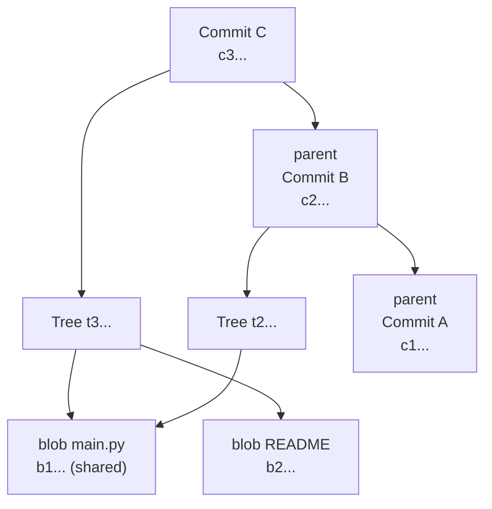
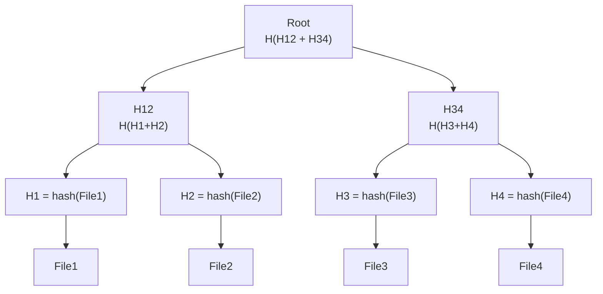

## Keywords in This File
{: .no_toc }

| # | Keyword | Difficulty |
|---|---------|------------|
| 26 | [DAG Theory and Content-Addressable Storage](#dag-theory-and-content-addressable-storage) | ★★☆ |
| 27 | [Merkle Trees in Version Control Systems](#merkle-trees-in-version-control-systems) | ★★☆ |

---

# DAG Theory and Content-Addressable Storage

**Interview Weight:** Medium-high at senior+ interviews; signals
theoretical depth beyond "git is a timeline"; required for explaining
how git guarantees integrity and why history cannot be silently changed;
relevant for security and distributed systems discussions.

---

## Quick Reference

**One-line definition:** Git's commit graph is a Directed Acyclic Graph
(DAG) where each commit node points to its parents, and all objects
(blobs, trees, commits, tags) are stored in a content-addressable store
where the SHA-1/SHA-256 hash of an object's content is its address -
making every object immutable and every pointer self-verifying.

**Key terms:**
- **DAG** - Directed Acyclic Graph; a graph where edges have direction
  and no path follows edges back to the starting node
- **content-addressable storage (CAS)** - storage where the identifier
  of an object is derived from its content; changing content changes the
  address
- **SHA-1 / SHA-256** - cryptographic hash function used to derive
  git object IDs; SHA-1 is 40-hex-char; SHA-256 is 64-hex-char
- **tree object** - git object representing a directory; contains
  entries with mode, type, name, and SHA reference to blob or subtree
- **commit object** - git object with tree ref, parent refs, author,
  committer, message, and PGP signature (optional)
- **object store** - `.git/objects/` directory organized as a two-level
  directory tree by the first two hex characters of the SHA

---

### 🎯 Model Answer

**30-second answer:**

"Git stores everything as objects in a content-addressable store. An
object's SHA hash IS its address. The commit graph is a DAG - directed
(parent pointers go backward in time) and acyclic (you cannot have a
commit that is its own ancestor). Because each commit includes the hash
of its parent commit, changing any historical commit changes its hash,
which changes every descendant's hash. History is tamper-evident by
construction."

**3-minute answer:**

**Content-addressable storage:**

Every object git stores - blobs (file content), trees (directories),
commits, and tags - is hashed with SHA-1 (or SHA-256 in git 2.41+).
The hash becomes the object's address in `.git/objects/`. This means:
- Two identical files (anywhere in the repo, any version) share one
  object. Storage is deduplicated automatically.
- You cannot change an object without changing its address. Objects
  are immutable once written.

**DAG structure:**

A git repository's commit history forms a DAG:
- **Directed:** parent pointers flow from child commits to parent commits
  (toward earlier history)
- **Acyclic:** a commit cannot be its own ancestor (creating a cycle
  would require the commit to depend on itself at write time)

Branches are just named pointers to specific commit nodes. `HEAD` is
a pointer to a branch name or directly to a commit (detached HEAD).

**Tamper evidence:**

Because each commit includes its parent's SHA, the commit graph is
cryptographically chained: changing any commit in the middle of history
changes its SHA, which invalidates the parent field of the next commit,
which invalidates its SHA, and so on. Anyone with a trusted copy of a
branch tip SHA can verify that the entire history it references is
unchanged.

**Blank Mind Recovery:**

"Git = content-addressable store + DAG. Objects addressed by their SHA
hash. Commit chain is cryptographic: change one commit, all descendants
change SHA. DAG = directed (child points to parent) + acyclic (no cycle
possible). This is why `git log` reconstructs history by following
parent pointers."

---

### 📘 Concept Explanation

#### 1. What Is It?

The theoretical foundation of git's object model. Content-addressable
storage ensures immutability and deduplication. The DAG structure
ensures tamper-evidence and defines the reachability model used by
`git gc`, `git log`, and push negotiation.

#### 2. Why Does It Exist?

Linus Torvalds needed a distributed VCS that guaranteed integrity
without a central authority. A content-addressable DAG provides this:
any collaborator who has the tip SHA of a branch can verify the entire
history independently without trusting the server.

#### 3. How Does It Work? (Internal Mechanism)

**Object storage layout:**

```bash
# Git stores objects by SHA prefix
ls .git/objects/
# 1a/  2b/  3c/  4d/  ...  pack/  info/

# A blob is stored as: header + content, then SHA-hashed
echo "hello" | git hash-object --stdin
# ce013625030ba8dba906f756967f9e9ca394464a

# See the raw object
git cat-file -p ce013625030ba8dba906f756967f9e9ca394464a
# hello

# See the object type
git cat-file -t ce013625030ba8dba906f756967f9e9ca394464a
# blob
```

> **Code walkthrough:** `git hash-object --stdin` computes SHA-1 of the
input using git's specific format: `"blob {size}\0{content}"`. KEY
MECHANISM: git prepends a header (`"blob N\0"`) to every object before
hashing; this means identical file content always produces the same SHA
regardless of filename, date, or path. WHY IT MATTERS: deduplication is
automatic - if two files have the same content, they share one blob
object; a 1000-file repository where 800 files are copies of the same
template uses only one blob for those 800 files. WHAT BREAKS: SHA-1
collisions (theoretically possible, demonstrated in 2017 SHAttered
attack) could allow a malicious actor to substitute a different object
at the same address. Git 2.41+ supports SHA-256 transition to address
this. TAKEAWAY: git's object addressing is intentional design, not an
implementation detail; understanding it explains why objects are
immutable and why `git gc` is safe.

**DAG traversal:**

```bash
# Walk the DAG from HEAD
git rev-list HEAD | head -5
# latest commit SHA
# parent SHA
# grandparent SHA
# ...

# Find merge-base (common ancestor) of two branches
git merge-base main feature/payments
# SHA of the common ancestor commit

# Count reachable commits from main not in feature
git rev-list main ^feature/payments | wc -l
# 15 commits on main not in feature
```

> **Code walkthrough:** `git rev-list HEAD` walks the DAG from HEAD
by following parent pointers until it reaches commits with no parents
(initial commits). KEY MECHANISM: the `^` prefix in `git rev-list A ^B`
means "reachable from A but NOT reachable from B"; this computes the
set of commits unique to a branch, which is the basis for `git log
A..B` syntax. WHY IT MATTERS: push negotiation uses this algorithm to
determine which objects need to be sent to the remote - "commits
reachable from local tip but not from remote tip". WHAT BREAKS: without
the commit graph optimization, this traversal on a 500K-commit repo
takes 45+ seconds; with commit graph, it takes under 1 second. TAKEAWAY:
the `A..B` (two dots) and `A...B` (three dots) range syntaxes are both
DAG traversal operators; two dots = reachable from B not from A; three
dots = symmetric difference.

#### 4. Key Properties and Behaviors

**Reachability is the garbage collection model:**

```bash
# Objects not reachable from any ref are "loose"
# and eligible for gc pruning

# Find all unreachable objects
git fsck --unreachable 2>/dev/null | head -10
# unreachable blob abc123...
# unreachable commit def456...
# (objects from abandoned branches, rebases, etc.)

# Prune objects unreachable for more than 2 weeks
git gc --prune=2.weeks.ago

# Immediate prune (dangerous - no recovery)
git gc --prune=now
```

> **Code walkthrough:** `git gc --prune=2.weeks.ago` removes unreachable
objects older than 2 weeks from the object store. KEY MECHANISM: git
walks the DAG from all refs (branches, tags, stash, reflogs) and marks
every reachable object; unmarked objects are candidates for pruning.
WHY IT MATTERS: the 2-week grace period ensures that objects lost from
an accidental `git reset --hard` or failed `git push` can be recovered
from the reflog. WHAT BREAKS: `git gc --prune=now` immediately removes
all unreachable objects; any recovery from reflog becomes impossible.
TAKEAWAY: never run `git gc --prune=now` unless you are certain there
are no recent lost commits worth recovering.

#### 5. Common Use Cases

1. **Explaining git integrity to security teams** - the DAG structure
   makes tamper evidence a mathematical property
2. **Debugging "detached HEAD" state** - HEAD points directly to a
   commit SHA rather than a branch name
3. **Implementing a custom git hosting service** - understanding the
   object model is required to process git pack protocol
4. **Writing a `git bisect` automation** - bisect is a binary search
   on the commit DAG

#### 6. Trade-offs

| Design | Benefit | Cost |
|---|---|---|
| Content-addressable | Deduplication; immutability | SHA computation on every write |
| DAG (not linear) | Merges are first-class | Graph algorithms required for history |
| SHA-1 addressing | Fast; well-understood | Collision vulnerability (SHAttered) |
| SHA-256 transition | Collision-resistant | Not yet universally supported |

#### 7. Performance Characteristics

- SHA-1 hash computation: ~100-500MB/s on modern hardware
- DAG traversal without commit graph: O(N) commits, blocking
- DAG traversal with commit graph: O(1) parent lookup per commit,
  effectively O(log N) for most operations due to packing

#### 8. Real-World Context

The content-addressable DAG model was Linus Torvalds' key insight when
designing git in 2005. It was inspired by Monotone (the first VCS with
cryptographic object integrity) but implemented for performance. The
model has since been adopted by IPFS (InterPlanetary File System), which
extends it to a distributed peer-to-peer network. Docker image layers
are also content-addressed (though with SHA-256 from the start).

---

### 💻 Code Example

**BAD pattern - trusting git history without verifying:**

```bash
# BAD: cloning with --depth=1 and trusting the code
# without verifying signed commits
git clone --depth=1 https://example.com/critical-lib
# Attacker performed a supply-chain attack; the repository
# was compromised. With SHA-1, a collision attack could
# substitute a malicious commit with the same SHA.
```

> **Code walkthrough:** Without signed commits, `git clone` verifies
that objects are internally consistent (the DAG is valid) but cannot
verify that the content is what the author intended. KEY MECHANISM: git
only verifies that each object's hash matches its content; it does not
verify that the person who made the commit had authorization. WHY IT
MATTERS: supply-chain attacks targeting git hosting can inject malicious
commits that have valid DAG structure. WHAT BREAKS: the SHAttered attack
demonstrated a practical SHA-1 collision; git now performs SHA-1
collision detection in `git apply`. TAKEAWAY: for security-critical
repositories, enforce signed commits (GPG or SSH signing) - the signature
over the commit hash provides origin verification beyond structural
integrity.

**GOOD pattern - verifying commit signatures and object integrity:**

```bash
# Verify a signed commit
git verify-commit HEAD
# gpg: Signature made Mon 01 Jan 2024
# gpg: using RSA key ABCD1234...
# gpg: Good signature from "Alice <alice@example.com>"

# Verify all commits in a range are signed
git log --show-signature main..HEAD 2>&1 |
  grep -E "gpg:|commit"

# Check object store integrity
git fsck --strict
# Checking connectivity and validity.
# dangling commit abc123  (not an error - just informational)
```

> **Code walkthrough:** `git verify-commit HEAD` checks the GPG/SSH
signature stored in the commit object against the signer's public key.
KEY MECHANISM: git signs the entire commit object content (which includes
the tree hash, parent hashes, author, message) - a valid signature proves
the entire commit subtree is authentic. WHY IT MATTERS: in an open-source
project, anyone can push to a fork; signed commits prove which commits
came from authorized developers. WHAT BREAKS: if the signing key is
compromised, signatures are meaningless; key rotation and revocation
procedures must accompany a signed-commit policy. TAKEAWAY: enforce
`commit.gpgSign = true` in CI verification, not just on developer
machines; check signatures in the CI pipeline.

---

### 🎓 Answers by Seniority

**Junior/Mid:**

"Every file, directory, and commit in git is stored as an object with
a SHA hash as its name. Because the hash is computed from the content,
two identical files always produce the same hash and share one object
in the store - that is automatic deduplication. The commit history
forms a DAG: each commit points back to its parent. Because each commit
includes its parent's hash, you cannot change old history without
changing all the descendant hashes too."

**Senior/Staff:**

"Understanding the DAG + CAS model matters for three production
concerns:

1. **Garbage collection model:** Objects are only retained if they
   are reachable from a ref (branch, tag, stash). Understanding this
   explains why `git rebase` + `git gc` can silently delete commits
   that were never pushed (they become unreachable). Always check the
   reflog before `git gc`.

2. **Push negotiation performance:** When you `git push`, git computes
   the set of commits reachable from your branch tip but not from the
   remote's tip. On a 500K-commit repo without a commit graph, this is
   O(N) and takes 45+ seconds. The commit graph optimization converts
   this to effectively O(log N).

3. **SHA-1 collision risk:** The SHAttered attack (2017) demonstrated
   a practical SHA-1 collision. Git added collision detection in 2017
   and supports SHA-256 in 2.41+. For security-critical infrastructure,
   evaluate migrating to SHA-256 repositories. GitHub, GitLab, and
   Bitbucket have not completed this migration yet."

---

### ⚠️ Common Misconceptions

**Misconception 1: "git log shows commits in chronological order."**

`git log` follows parent pointers in the DAG, which corresponds to
topological order, not necessarily chronological order. A commit
authored at 9am could appear after a commit authored at 11am if the
9am commit is a descendant (e.g., from `git commit --date`). For true
chronological order use `git log --date-order`.

**Misconception 2: "Two commits with the same SHA are the same commit."**

True for all practical purposes (SHA-1 collision resistance), but the
SHAttered attack demonstrated it is not a mathematical guarantee. Git
now detects SHA-1 collisions and rejects objects that collide with
existing objects. SHA-256 repos eliminate this risk.

**Misconception 3: "Reachability from HEAD means it is safe from gc."**

Objects must be reachable from a **ref** (not just HEAD at a point in
time). If you do `git reset --hard` and no branch points to the old
commits, they are unreachable despite being visible in `git reflog`.
The reflog itself creates a short-lived reachability reference (default
90 days), but after gc with `--prune`, they are gone.

---

### 🚨 Failure Modes and Diagnosis

**Failure 1: "Objects missing" after aggressive gc**

```bash
# Symptom
git log
# fatal: bad object abc123

# Diagnose
git fsck --full 2>&1 | grep "missing"
# missing blob abc123
# missing commit def456

# Check reflog - was this in history recently?
git reflog --all | grep abc123
# (no output) - already expired from reflog

# Recovery: if you have the SHA, try fetching from remote
git fetch origin abc123 2>&1
# (may fail if remote also pruned it)
```

> **Code walkthrough:** `git fsck --full` walks the entire DAG and
reports any object reference that points to a missing object. KEY
MECHANISM: objects become "missing" after `git gc --prune` removes
objects that were unreachable from all refs AND the reflog. WHY IT
MATTERS: this failure is permanent if the objects were not pushed to a
remote; there is no recovery path. WHAT BREAKS: `git gc` run with
`--prune=now` on a repo where a developer just did `git reset --hard`
will destroy the abandoned commits immediately. TAKEAWAY: configure
`gc.reflogExpire=90.days` and `gc.reflogExpireUnreachable=30.days` to
extend the recovery window.

**Failure 2: SHA-1 collision detection blocking a legitimate file**

```bash
# Symptom: git refuses to add a specific file
git add crafted-pdf.pdf
# fatal: object file .git/objects/ab/cd... is a
# SHA1 collision

# Diagnose: is this actually a collision?
sha1sum crafted-pdf.pdf
# abcdef...  <- same SHA as existing object?

# Resolution: this is a security alert, not a bug
# The file is a crafted collision - DO NOT use it
# Report to security team
```

> **Code walkthrough:** Git's SHA-1 collision detection (added in 2017)
uses the shattered.io detection algorithm to identify files crafted to
produce SHA-1 collisions. KEY MECHANISM: git computes a secondary
"safe hash" alongside SHA-1 and compares against known collision
patterns; a match causes a fatal error. WHY IT MATTERS: an attacker
who can inject a colliding file into your repo could swap it for a
legitimate file with the same SHA without detection. WHAT BREAKS: false
positives are theoretically possible but extremely rare in production;
treat any collision detection alert as a security incident. TAKEAWAY:
collision detection false positives are the price of the protection;
accept the security alert and investigate.

---

### 🎯 Interview Deep-Dive

| Question Type | Count | Target Audience |
|---|---|---|
| Conceptual | 3 | All levels |
| Debugging | 2 | Mid-Senior |
| Trade-off | 2 | Senior |
| Behavioral | 1 | Mid |
| Architecture | 1 | Staff |

---

**[CONCEPTUAL] Q1 - What is a DAG and why is git's commit graph a DAG rather than a tree?**

A DAG (Directed Acyclic Graph) is a graph where edges have direction
and no sequence of directed edges forms a cycle (no node can be its
own descendant).

Git's commit graph is a DAG rather than a tree because merges create
commits with multiple parents. A merge commit has two (or more) parent
pointers; this means the graph has nodes with multiple incoming edges,
making it a DAG rather than a tree (which requires exactly one parent
per non-root node).

The "acyclic" property is enforced structurally: a commit can only
reference commits that existed before it was created (they must have
been computed and stored before the new commit hash is generated). It
is therefore computationally impossible to create a commit that is its
own ancestor.

*What separates good from great:* emphasizing that merge commits are the
reason the commit graph is a DAG (not a tree), and that the acyclic
property is guaranteed structurally, not by policy.

---

**[CONCEPTUAL] Q2 - How does content-addressable storage guarantee tamper evidence?**

Content-addressable storage guarantees tamper evidence through
cryptographic chaining:

1. A blob's SHA hash is derived from its content. Change the file,
   and the blob SHA changes.

2. A tree's SHA is derived from its entries (including blob SHAs).
   Change any file in the tree, and the tree SHA changes.

3. A commit's SHA is derived from its tree SHA + parent SHA(s) +
   metadata. Change the tree, and the commit SHA changes.

4. The next commit's SHA includes the previous commit's SHA.

This means changing any object anywhere in history invalidates all
subsequent commit SHAs. Anyone holding the trusted SHA of a branch tip
can detect any modification to any object in the entire reachable
history.

*What separates good from great:* drawing the full chain (blob -> tree
-> commit -> next commit) rather than just saying "the hash changes".

---

**[CONCEPTUAL] Q3 - Explain the difference between `git log A..B` and `git log A...B`.**

Both are DAG traversal operators, but they compute different sets:

- `A..B` (two dots): commits reachable from B but NOT reachable from A.
  "What commits are in B that are not in A?" Used for: checking what
  is on a feature branch not yet merged to main; inspecting what would
  be sent in a `git push`.

- `A...B` (three dots): commits reachable from A or B but NOT from
  both - the symmetric difference. "What commits are unique to each
  branch?" Used for: `git log main...feature` shows commits on both
  sides of a merge point.

```bash
# A..B: commits in feature not in main (14 commits)
git log main..feature --oneline | wc -l
# 14

# A...B: commits unique to either branch
git log main...feature --oneline | wc -l
# 19  (14 from feature + 5 hotfixes on main)
```

> **Code walkthrough:** `git log A..B` is equivalent to
`git rev-list ^A B` - "reachable from B, exclude reachable from A".
KEY MECHANISM: git walks the DAG from B, then from A, and returns the
set difference. WHY IT MATTERS: `A..B` is the basis for `git push`
negotiation (what to send) and `git pull --rebase` (what to replay);
confusing the two operators leads to wrong assumptions about what a
PR contains. WHAT BREAKS: using `A...B` when you mean `A..B` in a
script counts both sides of a merge, double-counting shared history.
TAKEAWAY: `..` (two dots) = "what is new on B"; `...` (three dots) =
"what is different on either side".

*What separates good from great:* explaining both operators in terms of
DAG reachability, not just surface syntax.

---

**[DEBUGGING] Q4 - After a `git rebase`, a developer says their commits "disappeared." Explain what happened and how to recover.**

During a rebase, git creates NEW commits (with new SHAs) that replicate
the changes of the old commits. The old commits become unreachable
from any branch pointer.

```bash
# Before rebase: feature points to commit C (parent B,
# grandparent A)
git log --oneline feature
# C (feature)
# B
# A (main)

# After: git rebase main
git log --oneline feature
# C' <- new commit with new SHA (parent of new base)
# B'
# main tip

# Old C and B are still in the object store, but
# no branch points to them -> "disappeared"

# Recovery via reflog
git reflog
# HEAD@{0}: rebase finished: ...
# HEAD@{3}: commit: B <- old B commit still here
# HEAD@{4}: commit: C <- old C commit still here

git checkout -b recovery HEAD@{4}
# Recover old tip -> new branch
```

> **Code walkthrough:** `git reflog` shows the history of HEAD movements,
including each step of a rebase; old commit SHAs are present in the
reflog until gc prunes them (default 90 days). KEY MECHANISM: rebase
creates new commits with new SHAs; the old commits become unreachable
from branch pointers but remain accessible via the reflog. WHY IT
MATTERS: "my commits disappeared" is one of the most common developer
panics; the reflog is almost always the recovery path. WHAT BREAKS: if
`git gc` has been run with `--prune=now` after the rebase, the old
commits are permanently deleted and the reflog entries are invalidated.
TAKEAWAY: the reflog is the safety net for all destructive git operations;
teach developers `git reflog` as the first step in recovery.

*What separates good from great:* immediately going to the reflog and
explaining why the old commits are accessible (still in object store,
just unreachable from refs).

---

**[DEBUGGING] Q5 - `git fsck` reports "dangling commits." Should you be concerned?**

```bash
git fsck 2>&1 | grep "dangling"
# dangling commit abc123
# dangling commit def456

# What are these commits?
git show abc123 --oneline
# abc123 WIP: refactoring payment service
# (2 days ago)
```

> **Code walkthrough:** `git fsck` lists dangling objects as informational
output; they are not errors. KEY MECHANISM: dangling objects exist in the
object store but have no ref (branch, tag, or stash) pointing to them;
they result from dropped stashes, `git reset --hard`, deleted branches,
or completed rebases. WHY IT MATTERS: dangling commits represent potentially
recoverable work; they are preserved until `git gc` prunes them (default
2-week grace period). WHAT BREAKS: if a developer runs `git gc --prune=now`
before verifying dangling commits, the work is permanently lost. TAKEAWAY:
always inspect dangling commits with `git show <sha>` before running gc
if you suspect any recent accidental data loss.

Dangling commits are unreachable from any ref but still in the object
store. They are most commonly:
- Old `git stash` entries that were dropped (`git stash drop`)
- Commits from `git reset --hard`
- Old branch tips after `git branch -D`
- Old commits after a rebase

Dangling commits are **not an error** - they are expected behavior. Git
reports them in `git fsck` as informational. They will be pruned in the
next `git gc`. You should be concerned only if you see dangling commits
that you expected to be reachable (indicating an accidental data loss).

*What separates good from great:* distinguishing informational dangling
objects from actual errors reported by `git fsck --strict`.

---

**[TRADE-OFF] Q6 - When does the SHA-1 collision risk in git become a practical concern vs theoretical?**

**Theoretical concern (most teams):**
SHA-1 collisions require significant computational resources (estimated
110 GPU-years for SHAttered). For internal development repos, the
threat model does not include state-level adversaries crafting file
collisions. Git's collision detection (added 2017) catches known
attack patterns.

**Practical concern (security-critical contexts):**
- Open-source projects accepting third-party contributions
- Package repositories (npm, Maven Central) where a malicious package
  with a colliding SHA could substitute for a legitimate package
- Government, defense, or financial systems with regulatory requirements
  for cryptographic hash strength

**Mitigation:**
1. Enable git's built-in SHA-1 collision detection (on by default
   since git 2.13)
2. For new repositories at high risk: initialize with `--object-format
   =sha256` (git 2.41+)
3. Enforce signed commits (GPG/SSH) for authorization verification
   beyond structural integrity

*What separates good from great:* calibrating the risk to the actual
threat model rather than dismissing or over-amplifying.

---

**[TRADE-OFF] Q7 - Should you migrate an existing repository to SHA-256?**

**Migration complexity:** Very high. SHA-256 repositories are not
interoperable with SHA-1 repositories. Migrating requires a full
history rewrite (every object gets a new SHA), which:
- Invalidates all existing branch SHAs shared with collaborators
- Requires all forks to be re-cloned
- Breaks all external links to specific commit SHAs (GitHub URLs,
  JIRA links, changelogs)
- GitHub, GitLab, and Bitbucket have not completed their SHA-256
  support migration (as of 2024)

**Recommendation:** Do not migrate existing repositories until git
hosting providers complete SHA-256 support. For new repositories
where SHA-1 collision risk is a genuine threat (security tools, package
registries), initialize with SHA-256 from day one.

*What separates good from great:* acknowledging that tooling support
(especially hosting provider support) is the blocking factor, not just
technical willingness.

---

**[BEHAVIORAL] Q8 - Have you ever had to explain git's internal model to a non-technical stakeholder to justify a technical decision?**

**Context:** Explaining to a security team why "git history cannot be
changed silently" and why SHA-1 might be a concern.

**What I said:** "Think of git as a chain of tamper-evident seals. Each
commit is sealed with a code that includes the seal code of the previous
commit. If anyone breaks seal number 500 in a chain of 1000, all the
seal codes from 500 onward change - you can immediately see something
is wrong by comparing the tip seal code.

The SHA-1 concern is that researchers demonstrated you can craft two
different files with the same seal code. Git has countermeasures for
this. For our threat model (internal development, no nation-state
adversaries), the existing protection is sufficient."

**Outcome:** Security team accepted the explanation and approved the
toolchain without requiring immediate SHA-256 migration.

*What separates good from great:* translating cryptographic concepts
into operational risk language appropriate for a security team.

---

**[ARCHITECTURE] Q9 - How does IPFS differ from git's content-addressable store, and what can git learn from it?**

Both git and IPFS use content-addressable storage, but with different
scopes:

| Property | Git CAS | IPFS |
|---|---|---|
| Hash algorithm | SHA-1 (SHA-256 in progress) | SHA-256 (multihash) |
| Scope | Single repository | Global distributed network |
| Object discovery | Local + configured remotes | DHT peer-to-peer discovery |
| Deduplication | Within one repo | Across entire network |
| Content addressing | Objects only | Files, directories, websites |

**What git could learn:**

1. **Multihash:** IPFS uses multihash (algorithm + hash in one encoding),
   making algorithm migration transparent. Git's SHA-256 transition is
   painful because the algorithm is implicit.

2. **Content routing:** IPFS can discover who has an object via DHT.
   Git must configure explicit remotes. A "DHT for git" would allow
   fetching objects from any peer who has them, not just the origin.

3. **Deduplication across repos:** Identical files in different repos
   (e.g., a popular library) could share objects across organizations.
   Git's CAS is per-repo only.

*What separates good from great:* identifying that multihash is the
most immediately applicable lesson - it directly addresses git's SHA-1
to SHA-256 migration problem.

---

### ⚖️ Comparison Table

*(Omit: Not a ★★★ keyword.)*

---

### 🏛️ System Design

*(Omit: Not a ★★★ keyword.)*

---

### 📊 Diagram

ASCII - git object model as a DAG:

```
Commit C (SHA: c3...)
  |-- tree (SHA: t3...)
  |     |-- blob "main.py" (SHA: b1...)
  |     `-- blob "README" (SHA: b2...)
  `-- parent -> Commit B (SHA: c2...)
                  |-- tree (SHA: t2...)
                  |     `-- blob "main.py" (SHA: b1...)
                  `-- parent -> Commit A (SHA: c1...)
```

> **Diagram walkthrough:** WHAT IT DEPICTS: three commits forming a DAG,
each pointing to a tree object which points to blob objects. HOW TO
READ IT: reading down the `parent ->` arrows follows the commit chain
backward in time; reading the `tree` arrows shows the directory snapshot
at that point. KEY RELATIONSHIP: `blob "main.py"` with SHA b1 appears
in both Commit B and Commit C - the file was not changed; git deduplicates
automatically via content-addressable storage. EDGE CASE: if `main.py`
was modified in Commit C, it would have a new SHA (say b3) and Commit B
would still reference b1 - old content is preserved immutably. INSIGHT:
a senior engineer notices that only CHANGED objects get new SHAs; the
object store is append-only and space-efficient for files with many
unchanged versions.



> **Diagram walkthrough:** WHAT IT DEPICTS: the git object DAG for three
commits showing how blob deduplication works across commits. HOW TO READ
IT: boxes are objects; arrows are SHA references (pointers by content
hash). KEY RELATIONSHIP: `blob b1` (main.py) has two incoming arrows
from Tree t3 and Tree t2 - one object shared across two commits because
the file content is identical. EDGE CASE: the DAG is a true DAG because
blob objects are shared (not a tree); if you could modify blobs in place
this would create cycles. INSIGHT: the content-addressable model makes
storage deduplication an emergent property requiring zero extra code.

---
---

# Merkle Trees in Version Control Systems

**Interview Weight:** Medium at senior interviews; signals theoretical
depth and cross-domain knowledge; directly connects git to blockchain,
distributed systems, and certificate transparency; increasingly relevant
as blockchain engineers interview for platform roles.

---

## Quick Reference

**One-line definition:** A Merkle tree is a tree data structure where
every leaf node contains the hash of a data block, and every internal
node contains the hash of its children's hashes - making any change to
any data block detectable at the root hash, and allowing efficient
proof of inclusion or exclusion without revealing all data.

**Key terms:**
- **Merkle root** - the root hash of a Merkle tree; a compact
  representation of the entire dataset's integrity
- **Merkle proof / audit proof** - a sequence of sibling hashes that
  proves a leaf is part of the tree without revealing other leaves
- **Merkle Patricia Trie** - the structure used in Ethereum; combines
  Merkle proofs with prefix compression for key-value stores
- **certificate transparency log** - a Merkle tree of TLS certificates
  allowing efficient verification that a certificate was publicly logged
- **git tree object** - git's recursive directory structure; a Merkle
  tree of blobs and subtrees rooted at the commit's tree object

---

### 🎯 Model Answer

**30-second answer:**

"A Merkle tree is a hash tree where leaf nodes are data hashes and
internal nodes are hashes of their children's hashes. The root hash
represents the entire dataset. Git's directory tree IS a Merkle tree -
the commit's tree object is the root, and any change to any file changes
the leaf hash, which changes all parent hashes up to the root, which
changes the commit SHA. This is why git guarantees integrity without
central authority."

**3-minute answer:**

**Merkle tree structure:**

In a Merkle tree:
- **Leaves:** hash(data_block)
- **Internal nodes:** hash(left_child_hash + right_child_hash)
- **Root:** hash representing the entire dataset

Any modification to any data block produces a different leaf hash,
which causes all ancestors to recompute differently, resulting in a
different root hash.

**Git's Merkle tree:**

Git's directory structure is a Merkle tree:
- Leaves are blob objects: hash(file_content)
- Internal nodes are tree objects: hash(entries where each entry
  contains a mode, name, and SHA of a child)
- The root is the commit's tree pointer, included in the commit hash

The commit hash is therefore a Merkle root over the entire working
tree snapshot.

**Why this matters beyond git:**

1. **Blockchain:** Bitcoin's block headers contain a Merkle root of
   all transactions in the block. Verifying one transaction requires
   only O(log N) hashes, not downloading the entire block.

2. **Certificate Transparency:** TLS certificates are logged in a
   Merkle tree (RFC 6962). Any browser can verify a certificate was
   logged with an O(log N) proof.

3. **Distributed databases (Cassandra, DynamoDB):** Use Merkle trees
   in anti-entropy to detect which data differs between replicas
   without comparing all data.

**Blank Mind Recovery:**

"Merkle tree = hash tree. Leaves are data hashes. Internal nodes hash
their children. Root hash = fingerprint of everything. Git tree objects
form a Merkle tree: change any file, root hash changes. Used in Bitcoin
(transaction verification), Certificate Transparency, distributed DB
anti-entropy."

---

### 📘 Concept Explanation

#### 1. What Is It?

A tree data structure where cryptographic hashes propagate upward.
The root hash is a compact, unforgeable fingerprint of the entire
tree contents.

#### 2. Why Does It Exist?

Merkle trees allow efficient, trustless verification of large datasets.
You can verify a specific element is in the dataset by checking only
O(log N) hashes rather than the entire dataset. This is essential in
distributed systems where you cannot trust the data provider.

#### 3. How Does It Work? (Internal Mechanism)

**Git tree as Merkle tree:**

```bash
# View a git tree object (Merkle tree node)
git cat-file -p HEAD^{tree}
# 100644 blob a1b2c3... README.md
# 040000 tree d4e5f6... src/
# 100644 blob g7h8i9... .gitignore

# View subtree (child Merkle node)
git cat-file -p d4e5f6
# 100644 blob a1b2c3... Main.java
# 100644 blob b2c3d4... Utils.java

# The tree SHA is hash(all entries above)
# Changing Main.java changes its blob SHA,
# which changes the src/ tree SHA,
# which changes the root tree SHA,
# which changes the commit SHA
```

> **Code walkthrough:** `git cat-file -p HEAD^{tree}` shows the root
tree object for the current commit. KEY MECHANISM: each tree entry is
a mode, type, name, and SHA; the tree object's own SHA is computed from
all its entries concatenated; changing any entry changes the tree SHA
propagating up. WHY IT MATTERS: git's integrity guarantee over the
entire working tree comes from this Merkle structure - you cannot change
a file without it being detectable from the root commit SHA. WHAT BREAKS:
if SHA-1 collisions were practical at scale, an attacker could potentially
substitute a malicious blob with the same SHA, bypassing the Merkle
chain. TAKEAWAY: SHA-256 migration in git is specifically about making
the Merkle tree collision-resistant for security-critical applications.

**Merkle proof simulation in git:**

```bash
# Prove that Main.java has specific content
# without transmitting the entire repo:

# Step 1: get the leaf hash
git hash-object src/Main.java
# a1b2c3...

# Step 2: get the sibling hashes (audit path)
# src/ tree contains: Main.java (a1b2...), Utils.java (b2c3...)
# Proof: [b2c3..., d4e5...(root tree sibling)]

# Step 3: verify root matches commit SHA
git rev-parse HEAD^{tree}
# d4e5f6...  <- root must match for proof to be valid
```

> **Code walkthrough:** A Merkle proof requires only the sibling hashes
at each level of the tree to verify a leaf without downloading the entire
tree. KEY MECHANISM: to prove `Main.java` is in the commit with root
`d4e5f6`, you need: the file's own hash (a1b2c3), the sibling in the
same directory (Utils.java's hash), and the parent directory's sibling
(if any) - O(log N) hashes total. WHY IT MATTERS: Bitcoin's SPV (Simplified
Payment Verification) clients use exactly this principle to verify
transactions without downloading the full blockchain. WHAT BREAKS: a
Merkle proof is only valid relative to a trusted root hash; if the root
is provided by an untrusted source, the proof is meaningless. TAKEAWAY:
the root hash must come from a trusted source (e.g., a signed commit,
a blockchain, a Certificate Transparency log) for the proof to have
security value.

#### 4. Key Properties and Behaviors

**Anti-entropy in distributed databases:**

```
Replica A               Replica B
[root: hash_A]          [root: hash_B]

hash_A != hash_B -> out of sync

Walk the tree (O(log N)):
  left subtree same? No -> descend left
  right subtree same? Yes -> skip right
  Found: leaf node "key=X" differs
  Resolution: sync key X only
```

> **Diagram walkthrough:** WHAT IT DEPICTS: how a Merkle tree allows two
replicas to find divergent data with O(log N) comparisons instead of
O(N). HOW TO READ IT: start at root, compare hashes; equal = skip subtree;
unequal = descend. KEY RELATIONSHIP: each comparison at an internal node
eliminates half the remaining candidates. EDGE CASE: high-churn scenarios
(many keys changing simultaneously) produce differences at the root of
the tree, causing deeper traversals and negating the O(log N) advantage.
INSIGHT: Cassandra uses this anti-entropy protocol in its repair process;
understanding it explains why `nodetool repair` in Cassandra is O(log N)
in data difference, not O(N) in total data.

#### 5. Common Use Cases

1. **Git object integrity** - the fundamental use case in this context
2. **Bitcoin/Ethereum** - transaction Merkle roots in block headers
3. **Certificate Transparency** - Google's CT logs use Merkle trees
4. **Cassandra/DynamoDB anti-entropy** - detecting replica divergence
5. **Docker image layers** - each layer is content-addressed

#### 6. Trade-offs

| Property | Benefit | Cost |
|---|---|---|
| Proof of inclusion | O(log N) verification | Requires trusted root |
| Tamper evidence | Root hash changes on any mutation | SHA computation per write |
| Deduplication | Identical subtrees share objects | Object store management |

#### 7. Performance Characteristics

- Merkle proof verification: O(log N) hash computations
- Anti-entropy comparison: O(log N) round trips for finding divergences
- Git tree computation: O(changed files) on commit (not O(total files))

#### 8. Real-World Context

Ralph Merkle described the structure in his 1979 PhD thesis on public
key cryptography. Satoshi Nakamoto used it in Bitcoin (2008) for
efficient block verification. Git uses the same principle without
calling it by name. Certificate Transparency (RFC 6962, 2013) extended
Merkle trees with append-only logging and consistency proofs that allow
monitoring for certificate misissuance.

---

### 💻 Code Example

**Merkle tree insight in git - deduplication across commits:**

```bash
# BAD mental model: assuming git copies files on every commit
# "If I have 1000 commits and a README.md that never changes,
# git stores 1000 copies of README.md"
# WRONG - git stores exactly ONE blob for unchanged content
```

> **Code walkthrough:** The common misconception is that git stores
files per-commit, like a backup system. KEY MECHANISM: git stores one
blob per unique file content; commits reference blobs by SHA; unchanged
files have the same SHA across all commits and share one object. WHY IT
MATTERS: a 10,000-commit repository with a 1MB unchanged documentation
file uses only 1MB for that file, not 10,000MB. WHAT BREAKS: this
deduplication only applies within one repository; git does not deduplicate
across repos (though IPFS and Gitaly can). TAKEAWAY: git's storage
efficiency comes from Merkle deduplication; this is why binary asset
files (which change slightly each version) grow the object store rapidly -
they cannot be deduplicated.

```bash
# GOOD: verify the deduplication
echo "README content" > README.md
git add README.md; git commit -m "v1"
README_SHA=$(git hash-object README.md)

# Make 10 commits changing other files
for i in $(seq 1 10); do
  echo "change $i" >> other.txt
  git add other.txt; git commit -m "v$((i+1))"
done

# README.md has the same SHA in all 11 commits
git log --all --oneline --name-only |
  grep "README.md" | wc -l
# 1 <- only listed once because unchanged

# Object count
git count-objects -v
# count: 34  (34 loose objects for 11 commits)
# NOT 34 + 11 blob copies of README
```

> **Code walkthrough:** After 11 commits, `git count-objects` shows
34 loose objects - not 11 extra blobs for README.md. KEY MECHANISM:
git checks whether a blob with the computed SHA already exists in the
object store before writing; if it does, the tree entry just points to
the existing object. WHY IT MATTERS: this is why git repos with large,
stable files (vendor dependencies, binaries that rarely change) have
unexpectedly small object stores compared to naive expectations. WHAT
BREAKS: files that change on every commit (compiled artifacts, log
files, build outputs) produce a new blob per commit and grow the object
store rapidly - this is why build artifacts should never be committed.
TAKEAWAY: the golden rule for git storage efficiency is that only
changed files produce new objects; commit as many unchanged files as
you want in as many commits as you want without storage penalty.

---

### 🎓 Answers by Seniority

**Junior/Mid:**

"A Merkle tree is a tree where each node contains the hash of its
children. The root hash is a fingerprint of the entire tree. In git,
every directory is a tree object containing hashes of its files and
subdirectories. Change any file, and the hash changes up to the root,
which changes the commit hash. This is why changing old history changes
all subsequent commit hashes."

**Senior/Staff:**

"The Merkle tree model has three practical implications I think about:

1. **Storage deduplication is automatic.** Any two files with identical
   content share one blob object, regardless of filename, directory, or
   how many commits reference them. This means git's storage efficiency
   is much better than naive estimates for repos with stable content.

2. **Anti-entropy for distributed databases.** Cassandra, DynamoDB,
   and Riak use Merkle trees to find replica divergence. Two replicas
   compare root hashes; if different, descend the tree to find which
   keys differ. This is O(log N) in the number of divergent keys, not
   O(N) in total data. Understanding this makes Cassandra `nodetool
   repair` operationally intuitive.

3. **Certificate Transparency.** When I evaluate TLS certificate
   management, I explain that CT logs are append-only Merkle trees
   where browsers can verify certificates were publicly logged with an
   O(log N) inclusion proof. The same concept as git's tamper evidence,
   applied to PKI."

---

### ⚠️ Common Misconceptions

**Misconception 1: "Git tree objects and Merkle trees are different."**

Git tree objects ARE Merkle tree nodes. Git's documentation does not
use the term "Merkle tree," but the structure is identical: each tree
object's SHA is computed from the hashes of all its entries (files and
subdirectories). The commit's tree is the Merkle root.

**Misconception 2: "Merkle trees require balanced binary trees."**

Merkle trees can be any tree (not just binary). Git's tree objects are
n-ary (a directory can have any number of entries). Bitcoin uses a
balanced binary tree for its transaction Merkle trees because it wants
equal-depth proofs for any transaction. The choice of arity is a design
decision.

**Misconception 3: "The root hash proves the order of entries."**

The root hash only proves MEMBERSHIP and INTEGRITY of specific entries,
not their order, unless the tree structure encodes order explicitly.
Git tree objects contain filename-sorted entries, so the tree hash does
implicitly depend on sort order - adding and removing a file with the
same name but different sorting produces different hashes.

---

### 🚨 Failure Modes and Diagnosis

**Failure 1: Merkle proof from untrusted root**

This is a design failure, not a runtime error. An attacker provides a
fraudulent Merkle proof rooted at a fake root hash. The proof is
technically valid (the hashes chain correctly) but the root hash
itself is not trusted.

```
Attacker provides:
  root = "abc123" (fake)
  proof: [hash1, hash2, hash3]
  leaf: malicious_file.jar

Verification: hash(hash(hash(malicious) + hash1) + hash2) + hash3
  = abc123  <- MATCHES the provided root
  -> ACCEPTED even though root is not trusted
```

> **Code walkthrough:** A Merkle proof is a mathematical chain that proves
an element is part of a tree with a given root. KEY MECHANISM: the verifier
recomputes the root from the provided element and sibling hashes; if the
recomputed root matches the provided root, the proof is valid. WHY IT
MATTERS: this proof is only meaningful if the root itself is trusted; a
self-consistent proof against a fraudulent root is worthless. WHAT BREAKS:
any system that accepts a Merkle proof without independently verifying the
root against a trusted source is vulnerable to Merkle proof attacks. TAKEAWAY:
always treat the root hash as the trust boundary; secure the root first.

Fix: always validate the root hash against a trusted source (a
signed commit, a blockchain anchor, a CT log monitor).

> **Code walkthrough:** The Merkle proof verification is mathematically
correct but proves nothing if the root hash comes from the same untrusted
source as the data. KEY MECHANISM: the security guarantee of a Merkle
proof is entirely conditional on the trustworthiness of the root. WHY
IT MATTERS: this is the core security model of Bitcoin SPV and CT logs -
you trust the root (Bitcoin blockchain consensus, CT monitors) to make
the inclusion proof meaningful. WHAT BREAKS: if a CT monitor or Bitcoin
full node is compromised, all inclusion proofs against that root are
compromised. TAKEAWAY: Merkle proofs are only as secure as the root
trust chain - design with this in mind.

---

### 🎯 Interview Deep-Dive

| Question Type | Count | Target Audience |
|---|---|---|
| Conceptual | 3 | All levels |
| Debugging | 1 | Mid |
| Trade-off | 2 | Senior |
| Behavioral | 1 | Mid |
| Architecture | 2 | Staff |

---

**[CONCEPTUAL] Q1 - What is a Merkle tree and how does git use one?**

A Merkle tree is a tree where:
- Leaves contain hashes of data blocks
- Internal nodes contain hashes of their children's hashes
- The root hash is a compact fingerprint of the entire dataset

Git uses Merkle trees in its directory structure:
- Blob objects (leaves) contain hashed file content
- Tree objects (internal nodes) hash their entries (files and subtrees)
- The commit's tree pointer is the Merkle root

Changing any file changes its blob SHA, which changes its parent tree
SHA, which chains up to the root tree SHA, which changes the commit SHA.
Any change anywhere in the working tree is detectable from the commit hash.

*What separates good from great:* naming "blob objects are leaves, tree
objects are internal nodes, commit tree pointer is the root" explicitly.

---

**[CONCEPTUAL] Q2 - How do Bitcoin and git both use Merkle trees, and what is different?**

Both use Merkle trees for tamper evidence, but with different structures
and purposes:

| Aspect | Git | Bitcoin |
|---|---|---|
| Tree type | n-ary (any number of children) | Binary (exactly 2 children) |
| Leaf data | File/directory content | Transaction data |
| Root location | Commit object (tree pointer) | Block header |
| Proof purpose | Detect repo tampering | Verify transaction without full block |
| Hash algorithm | SHA-1 (SHA-256 in progress) | SHA-256d (double SHA-256) |

Bitcoin's binary tree enables equal-depth proofs for any transaction -
every leaf is the same distance from the root, so inclusion proofs are
always O(log N) depth. Git's n-ary tree mirrors directory structure,
which is more natural for filesystem representation but produces
variable-depth proofs.

*What separates good from great:* explaining why Bitcoin chose binary
(equal-depth proofs for O(log N) verification for any transaction in a
block) rather than n-ary.

---

**[CONCEPTUAL] Q3 - How are Merkle trees used in distributed databases like Cassandra for anti-entropy?**

Cassandra uses Merkle trees in its repair process to find divergent
data between replicas without comparing all data:

1. Each replica builds a Merkle tree over its data range (keyspace +
   token range)
2. Replica A sends its Merkle root to Replica B
3. B compares roots - if equal, data is in sync; if different, descend
4. B sends its left-child hash; A compares; recurse into differing subtrees
5. At the leaf level, the divergent keys are identified
6. Only the divergent key ranges are synchronized

This is O(log N) comparisons where N is the number of divergent keys,
not O(N) over all data. For replicas that are mostly in sync (the common
case), only O(log N) messages are needed to verify consistency.

*What separates good from great:* emphasizing that the efficiency
advantage is in the common case (replicas mostly in sync) - anti-entropy
avoids scanning all data in the healthy case.

---

**[DEBUGGING] Q4 - A developer claims that two files with different names but the same content "waste space" in git. Are they correct?**

They are incorrect. Git's content-addressable storage ensures that
two files with identical content share exactly one blob object:

```bash
# Create two files with same content
echo "same" > file_a.txt
echo "same" > file_b.txt
git add file_a.txt file_b.txt

# Both point to the same blob
git ls-files --stage | grep "same"
# 100644 8f6aa... 0 file_a.txt
# 100644 8f6aa... 0 file_b.txt
# SAME SHA 8f6aa for both files

git count-objects -v
# count: 3  (2 tree + 1 blob, not 2 blobs)
```

> **Code walkthrough:** `git ls-files --stage` shows the index entry
for each tracked file including its blob SHA. KEY MECHANISM: when git
stages file_b.txt, it computes the SHA of its content, finds an existing
object with that SHA (from file_a.txt), and creates an index entry
pointing to the existing blob - no new object is written. WHY IT MATTERS:
large projects with multiple copies of the same configuration file,
vendor dependencies, or generated files do not pay a storage penalty
per copy. WHAT BREAKS: the deduplication only applies to exact byte-
for-byte identical content; a file with one space added is a completely
different blob. TAKEAWAY: git's deduplication is automatic and passive;
no developer action is required to benefit from it.

*What separates good from great:* showing the actual SHA match in `git
ls-files --stage` output to prove the deduplication empirically.

---

**[TRADE-OFF] Q5 - When does a Merkle tree give you a meaningful efficiency advantage vs when is it overkill?**

**Meaningful advantage when:**
- Dataset is large (millions of items)
- Typical case is "mostly in sync" (few divergences)
- You need to prove inclusion/exclusion to untrusted parties
- Network transfer of all data would be prohibitively expensive

**Overkill when:**
- Dataset is small (< 10,000 items)
- Full data comparison is fast enough (< 100ms)
- Both parties are trusted and in the same process
- You only need to detect "is anything different" (a single hash
  suffices; you do not need the tree to locate divergences)

For git: comparing two full local branches is fast enough that a
Merkle tree is not needed - git just does it. The Merkle structure
is valuable for push negotiation with remote servers (avoid sending
objects the server already has).

*What separates good from great:* recognizing that for small or
local datasets, the overhead of building and comparing a Merkle tree
may exceed the cost of direct comparison.

---

**[TRADE-OFF] Q6 - Compare the use of Merkle trees in git vs in Certificate Transparency logs.**

| Aspect | Git | Certificate Transparency |
|---|---|---|
| Tree mutation | Append-only (new commits) + gc prune | Append-only (no deletion) |
| Root distribution | Shared via clone/push | Published in signed SCTs |
| Proof type | No explicit inclusion proofs; structural | Explicit inclusion + consistency proofs |
| Verification | By re-computing from objects | By checking audit path against known root |
| Auditability | Per-repo (not global) | Global across all CAs |

CT logs extend the Merkle model with consistency proofs - given a root
at time T1 and a root at time T2, you can prove that T1's tree is a
prefix of T2's tree (no entries were deleted or modified). Git does not
need this because its history is tampered-evident by the DAG structure.

*What separates good from great:* knowing that CT's consistency proof
(not just inclusion proof) is the key extension over basic Merkle trees.

---

**[BEHAVIORAL] Q7 - Have you used Merkle-tree-based concepts in a system beyond git?**

**Example answer:**

"In a distributed caching layer, we had an issue where two regional
Redis clusters diverged silently. Data was being modified in region A
and the replication pipeline was dropping updates intermittently.

I implemented a Merkle tree-based consistency checker: we partitioned
the keyspace into 1024 buckets, computed a hash of all key-value pairs
per bucket, assembled a two-level Merkle tree (1024 leaves, 32 internal
nodes), and stored the root hash with a timestamp.

A background job compared roots between regions hourly. When divergent,
it descended the tree to identify the affected buckets and queued a
targeted repair of just those buckets.

The system detected divergences within 1 hour (vs previously unknown
until user complaints) and repaired them in under 5 minutes by syncing
only the ~3 divergent buckets out of 1024."

*What separates good from great:* framing the answer with concrete
metrics (1024 buckets, 1-hour detection, 5-minute repair) rather than
abstract description.

---

**[ARCHITECTURE] Q8 - Design a system to detect if a deployed JAR in production was tampered with after build.**

```
Build pipeline:
  1. Build JAR: myapp-1.0.jar
  2. Compute SHA-256: sha256sum myapp-1.0.jar
     -> e3b0c4... 
  3. Sign the hash with the build pipeline's key
     (GPG or PKCS#11 HSM)
  4. Store (jar, sha256, signature) in artifact repo
     (Nexus, Artifactory, JFrog)

Deployment:
  1. Download JAR + signature from artifact repo
  2. Verify signature using build pipeline public key
  3. Verify SHA-256 of downloaded JAR matches signed hash
  4. Deploy only if both checks pass

Runtime monitoring:
  1. On startup: recompute sha256(myapp-1.0.jar)
  2. Compare to signed hash from artifact repo
  3. Alert if mismatch (possible tampering or corruption)
  4. Optional: Merkle tree over all deployed files
     root hash -> alert on any file change

Example: SLSA framework (Supply-chain Levels for Software
Artifacts) formalizes exactly this pattern
```

> **Code walkthrough:** The design uses content-addressing (SHA-256 of
the JAR) plus a digital signature to create a tamper-evident artifact
chain. KEY MECHANISM: the signature over the hash means that neither the
JAR nor the expected hash can be substituted without breaking the
signature; a runtime check prevents "ship valid JAR, swap at deployment"
attacks. WHY IT MATTERS: supply-chain attacks (SolarWinds, XZ Utils)
inject malicious code at build or deployment time; this pattern detects
both. WHAT BREAKS: if the build pipeline key is compromised, the entire
chain is compromised; key rotation and HSM storage are critical. TAKEAWAY:
this is the production application of Merkle/CAS concepts beyond git.

*What separates good from great:* knowing about SLSA (Supply-chain
Levels for Software Artifacts) as the industry standard that formalizes
this pattern.

---

**[ARCHITECTURE] Q9 - How would you use a Merkle tree to build a tamper-evident audit log for a financial system?**

```
Requirements:
  - Every transaction must be in the log
  - Additions are allowed; deletions and modifications are not
  - Auditors must be able to verify any transaction is in the log
    without downloading the entire log
  - Log must be publicly verifiable (no trust in the operator)

Design (Certificate Transparency style):
  1. Append-only Merkle log:
     - Each transaction is a leaf
     - Tree is rebuilt as a prefix-tree (not rebalanced)
     - Root hash is published hourly (signed by operator key)

  2. Inclusion proof:
     - Auditor requests proof for transaction T
     - Server returns: sibling hashes from leaf to root
     - Auditor verifies chain reaches published root hash

  3. Consistency proof:
     - To prevent backdating: prove root@T2 includes root@T1
     - If T2 is a superset of T1 (append-only), consistency
       proof is O(log N) hashes

  4. Monitoring:
     - Independent monitors verify roots are consistent
     - Detect any root that contradicts a previously
       published root (indicates retrospective modification)
```

> **Code walkthrough:** The design creates an append-only Merkle log where
each entry is a transaction leaf. KEY MECHANISM: consistency proofs between
two tree states (root@T1 and root@T2) prove that T2 is a superset of T1
(nothing was deleted or modified); inclusion proofs confirm a specific
transaction is in the log. WHY IT MATTERS: for financial audit logs,
detecting retroactive modification is as critical as detecting presence;
the combination of inclusion + consistency proofs satisfies both. WHAT
BREAKS: a system with inclusion proofs but no consistency proofs can be
compromised by a log operator who rebuilds the tree retroactively with
modified transactions. TAKEAWAY: financial audit logs need BOTH inclusion
proofs (is this transaction here?) and consistency proofs (was the log only
appended to, never modified?).

*What separates good from great:* knowing that consistency proofs
(proving the log was append-only over time) are as important as
inclusion proofs for financial audit logs - inclusion alone does not
prevent backdating.

---

### ⚖️ Comparison Table

*(Omit: Not a ★★★ keyword.)*

---

### 🏛️ System Design

*(Omit: Not a ★★★ keyword.)*

---

### 📊 Diagram

ASCII - Merkle tree structure:

```
         [Root: H(H12 + H34)]
          /                \
   [H12: H(H1+H2)]  [H34: H(H3+H4)]
      /       \         /       \
  [H1:      [H2:    [H3:     [H4:
  hash(f1)] hash(f2)] hash(f3)] hash(f4)]
     |          |        |          |
   File1      File2    File3      File4
```

> **Diagram walkthrough:** WHAT IT DEPICTS: a balanced binary Merkle
tree with four leaf files and two levels of internal nodes. HOW TO READ
IT: start at the bottom (file content); hash each file to get leaf nodes;
pair and hash leaves to get internal nodes; pair and hash internal nodes
to get the root. KEY RELATIONSHIP: any change to File1 changes H1, which
changes H12, which changes Root - the root is a fingerprint of all four
files simultaneously. EDGE CASE: if two separate changes to File1 and
File3 produce the same Root hash (collision), an attacker could substitute
File1 silently; this is theoretically possible with SHA-1 but practically
infeasible with SHA-256. INSIGHT: a senior engineer notices that changing
File1 requires recomputing only O(log N) hashes (H1, H12, Root) - not
all N leaves - making incremental root updates efficient.



> **Diagram walkthrough:** WHAT IT DEPICTS: a complete binary Merkle tree
showing hash propagation from leaf files to the root. HOW TO READ IT:
arrows point from parent to child; each parent's value is derived from
its children's values. KEY RELATIONSHIP: changing any file changes exactly
one leaf, one internal node, and the root - three hash recomputations out
of seven total nodes for any single-file change. EDGE CASE: if two files
are identical, their leaf hashes are equal, which may reveal information
about content equality to an observer who knows the hash function - a
privacy consideration in some Merkle tree applications. INSIGHT: the root
hash is the single value that must be trusted; everything below it is
verifiable by recomputation, making distributed trust anchoring possible.
