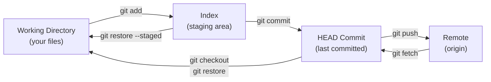

## Keywords in This File
{: .no_toc }

| # | Keyword | Difficulty |
|---|---------|------------|
| 28 | [Collaboration Patterns and Code Review Workflows](#collaboration-patterns-and-code-review-workflows) | ★☆☆ |
| 29 | [Git Decision Framework: When to Rebase vs Merge](#git-decision-framework-when-to-rebase-vs-merge) | ★☆☆ |
| 30 | [Version Control Mental Models](#version-control-mental-models) | ★☆☆ |

---

# Collaboration Patterns and Code Review Workflows

**Interview Weight:** Medium - frequently asked in engineering culture
and team process discussions; signals maturity about code review as
a quality gate; tests knowledge of GitHub Flow, Trunk-Based Development,
GitFlow, and how teams structure collaboration.

---

## Quick Reference

**One-line definition:** Collaboration patterns in git define how teams
structure branches, reviews, and merges: ranging from feature-branch
workflows (GitHub Flow), to release-branch workflows (GitFlow), to
continuous integration approaches (Trunk-Based Development) - each with
different trade-offs in release cadence, review overhead, and conflict
risk.

**Key terms:**

- **GitHub Flow** - one main branch + short-lived feature branches;
  open PR -> review -> merge; simple and CI-friendly

- **GitFlow** - main + develop + feature + release + hotfix branches;
  complex; suited to scheduled releases

- **Trunk-Based Development (TBD)** - all commits directly to main (or
  via very short-lived branches); continuous deployment model

- **code review** - a process of examining code changes before merging;
  can be synchronous (pair programming) or asynchronous (PR review)

- **CODEOWNERS** - a GitHub/GitLab file mapping paths to required
  reviewers; enforces ownership-based review

- **draft PR** - a PR not yet ready for review; signals WIP status

---

### 🎯 Model Answer

**30-second answer:**

"The three main collaboration patterns are GitHub Flow (short feature
branches + PR review, good for continuous deployment), GitFlow (structured
release branches, good for scheduled versioned releases), and Trunk-Based
Development (direct commits to main with feature flags, maximum CI/CD
speed). For most modern teams doing continuous deployment, GitHub Flow
or Trunk-Based Development is preferable to GitFlow's complexity."

**3-minute answer:**

**GitHub Flow:**

The simplest modern workflow. One `main` branch; all work on short-lived
feature branches; every feature branch gets a PR; PRs are reviewed and
merged to main; main is always deployable. Works well when:
- Continuous deployment is the goal
- Features are small enough to complete in days to a week
- Team can review PRs quickly (under 24 hours turnaround)

**GitFlow:**

Vincent Driessen's 2010 workflow. Adds `develop` as an integration
branch, `release/x.y` branches for stabilization, and `hotfix/` branches
for production patches. Works well when:
- Software is versioned (1.0, 1.1, 2.0) with formal release cycles
- Multiple versions need long-term support simultaneously
- QA processes require a stabilization phase before release

**Trunk-Based Development:**

All engineers commit to `main` (or use branches that live under 1 day).
Feature flags hide incomplete features in production. Works well when:
- Team has a mature CI/CD pipeline with good test coverage
- Feature flags infrastructure exists
- Deployment cadence is multiple times per day

**Blank Mind Recovery:**

"Three patterns: GitHub Flow (feature branch + PR, CI/CD-friendly),
GitFlow (structured release branches, versioned software), Trunk-Based
Development (direct to main + feature flags, max speed). Most modern
teams: GitHub Flow or TBD. GitFlow: use only for versioned, scheduled
releases."

---

### 📘 Concept Explanation

#### 1. What Is It?

Team-level agreements on how git branches, pull requests, and merges
are used to coordinate parallel development, enforce code quality via
review, and manage release timing.

#### 2. Why Does It Exist?

Without agreed workflows, teams face: conflicts between multiple
developers working on the same branch, unclear when code is ready to
deploy, difficulty managing hotfixes while features are in progress, and
inconsistent review quality.

#### 3. How Does It Work? (Internal Mechanism)

**GitHub Flow in practice:**

```bash
# Developer creates a feature branch
git checkout -b feature/user-authentication main
# ... makes commits ...

# Pushes and opens PR
git push origin feature/user-authentication
# GitHub: create PR feature/user-authentication -> main

# After review approval:
git checkout main
git merge --no-ff feature/user-authentication

git push origin main
git branch -d feature/user-authentication
git push origin --delete feature/user-authentication
```

> **Code walkthrough:** `--no-ff` (no fast-forward) creates a merge
commit even when fast-forward is possible. KEY MECHANISM: the merge
commit preserves the branch structure in the history graph, making it
clear which commits were part of which feature. WHY IT MATTERS: without
`--no-ff`, a fast-forward merge rewrites history as if the feature was
developed directly on main, losing the context of it being a PR. WHAT
BREAKS: teams that use `--squash` lose per-commit granularity of the
feature; teams that use `--no-ff` accumulate merge commits that make
`git log --oneline` noisy. TAKEAWAY: choose squash-merge (one commit per
PR) for clean history, no-ff merge (preserves commits) for granularity,
or rebase-merge (linear history with all commits) based on team preference
- be consistent.

**CODEOWNERS for review enforcement:**

```bash
# .github/CODEOWNERS
# Pattern            Owner(s)
/docs/               @tech-writers-team
/src/payments/       @payments-team @senior-engineer
/infra/              @platform-team
*.tf                 @platform-team

# Effect: PRs touching these paths require approval
# from the specified owners before merging
```

> **Code walkthrough:** GitHub enforces CODEOWNERS by requiring review
approval from at least one owner listed for each changed path before
the PR can be merged. KEY MECHANISM: when a PR is opened, GitHub scans
each changed file path against the CODEOWNERS file patterns (last
matching pattern wins); matched owners are automatically added as
required reviewers. WHY IT MATTERS: without CODEOWNERS, the wrong
reviewer approves a change to a security-sensitive path (e.g., payment
processing code) because they did not know it was their responsibility.
WHAT BREAKS: a CODEOWNERS file that is too broad (every file owned by
every senior engineer) creates review bottlenecks; a file that is too
narrow leaves paths unowned and unreviewed. TAKEAWAY: start with
coarse-grained CODEOWNERS for sensitive areas (payments, auth, infra)
and refine as team ownership clarifies.

#### 4. Key Properties and Behaviors

**Pull Request review best practices:**

- **Small PRs win:** PRs with fewer than 200 lines of code changes get
  reviewed thoroughly; PRs with more than 400 lines get rubber-stamped.
  Keep PRs small.

- **Review within 24 hours:** Review latency is the biggest bottleneck
  to flow; teams should commit to same-day reviews.

- **Separate refactoring from feature work:** A PR that changes behavior
  AND cleans up code is harder to review than two separate PRs.

- **Automated checks first:** Linting, tests, and security scans should
  pass before a human reviewer sees the PR.

#### 5. Common Use Cases

1. **Startup / continuous delivery** - GitHub Flow; simple, fast
2. **Enterprise / versioned product** - GitFlow; explicit release branches
3. **High-frequency deployment (10+/day)** - Trunk-Based Development
4. **Security review requirements** - CODEOWNERS + required reviewers
5. **Open-source projects** - Fork + PR model; all external contributions
   through forks, not direct branch pushes

#### 6. Trade-offs

| Pattern | Release cadence | Complexity | Merge risk |
|---|---|---|---|
| GitHub Flow | Continuous (daily) | Low | Medium |
| GitFlow | Scheduled (weekly+) | High | Low (isolated) |
| Trunk-Based | Continuous (hourly) | Low (with flags) | High (no isolation) |

#### 7. Performance Characteristics

- Small PR (fewer than 200 LOC): average review time 30-60 minutes
- Large PR (more than 500 LOC): review quality degrades; miss rate for
  bugs increases significantly
- Branch life more than 1 week: merge conflict probability increases
  exponentially with time out of sync

#### 8. Real-World Context

Trunk-Based Development is used at Google, Facebook, and Netflix for
their main products (everything deployed from trunk/main). GitFlow
is preferred at companies shipping packaged software (games, mobile
apps with app store review cycles, enterprise software with LTS versions).
GitHub Flow is the default for most web startups and open-source projects.

---

### 💻 Code Example

**BAD pattern - long-lived feature branch causing merge conflict:**

```bash
# BAD: feature branch lives 3 weeks
git checkout -b feature/big-refactor main
# ... 3 weeks of work, 200 commits ...
git merge main
# CONFLICT (content): Merge conflict in 47 files
# (3 weeks of concurrent changes to same files)
```

> **Code walkthrough:** A feature branch that diverges from main for 3
weeks accumulates conflicts with every other change merged to main during
that period. KEY MECHANISM: the further a branch diverges from its base,
the more its context assumptions become stale; after 3 weeks and 200
commits to main by other developers, nearly any file touched by the
feature has been modified. WHY IT MATTERS: a 3-week merge session is
itself a risk - conflict resolution is error-prone and rarely reviewed
as carefully as new code. WHAT BREAKS: the team's velocity drops as
everyone waits for the big merge to resolve before proceeding. TAKEAWAY:
the "feature branch should live fewer than 1 week" rule is about merge
risk, not just speed.

**GOOD pattern - continuous integration of feature branch:**

```bash
# GOOD: feature branch stays sync'd and ships incrementally
git checkout -b feature/payment-refactor main

# Day 1: 5 small commits, open draft PR immediately
git push origin feature/payment-refactor

# Day 2: sync with main daily
git fetch origin main
git rebase origin/main
# Resolve any conflicts while they are small

# Day 3: feature complete, PR ready for review
# PR touches 150 lines, easy to review
git push --force-with-lease origin feature/payment-refactor
```

> **Code walkthrough:** Daily rebase onto the latest main keeps the
branch at most 24 hours out of sync with the base, limiting conflicts
to at most one day of concurrent changes. KEY MECHANISM: `git rebase
origin/main` replays the feature's commits on top of the latest main,
resolving any conflicts incrementally as they arise rather than all at
once at merge time. WHY IT MATTERS: a daily conflict (typically 0-3
files, trivial to resolve) is far less risky than a 3-week conflict
(47 files, major cognitive load). WHAT BREAKS: force-pushing a rebased
branch invalidates anyone else's local checkout of that branch; communicate
clearly with collaborators when you rebase a shared branch. TAKEAWAY:
rebase frequently + open draft PRs early = the two most effective
habits for avoiding merge hell.

---

### 🎓 Answers by Seniority

**Junior/Mid:**

"The main collaboration patterns are GitHub Flow (feature branches +
PRs, merge to main when approved) and GitFlow (adds release branches
for scheduled releases). For most web development, GitHub Flow is
simpler and better. Keep branches short-lived (under a week) to avoid
merge conflicts."

**Senior/Staff:**

"I choose the workflow based on the deployment model:

**Continuous deployment:** GitHub Flow or Trunk-Based Development.
For TBD, feature flags are required infrastructure - features are
deployed but hidden until ready.

**Scheduled releases:** GitFlow is appropriate, but I often simplify
it: drop the `develop` branch and use only `main` + `release/x.y`
+ `hotfix/` branches. The full GitFlow with develop is rarely necessary.

**Code review:** I enforce three things via tooling: (1) CODEOWNERS
for sensitive areas, (2) mandatory CI pass before review, (3) PR size
limits enforced by linting (more than 500 LOC triggers a warning).
The rest is culture. The most important review habit is reviewing within
24 hours - latency is the real problem, not process."

---

### ⚠️ Common Misconceptions

**Misconception 1: "GitFlow is best practice for all teams."**

GitFlow was designed in 2010 for packaged software with explicit
release versions. For continuous delivery web applications, it adds
unnecessary complexity (6 branch types) and slows deployment. GitHub
Flow or TBD is better for CD teams.

**Misconception 2: "More reviewers means better review quality."**

Adding more required reviewers dilutes responsibility ("diffusion of
responsibility" effect) and slows PRs. One engaged reviewer who knows
the area is more effective than five rubber-stamp approvals. CODEOWNERS
should identify the RIGHT reviewer, not ALL reviewers.

**Misconception 3: "PRs must be complete features before merging."**

PRs should be as small as reviewable, not as large as feature-complete.
Merging incomplete features behind feature flags (trunk-based approach)
allows continuous integration of work-in-progress without exposing
incomplete functionality to users.

---

### 🚨 Failure Modes and Diagnosis

**Failure 1: "Merge hell" from long-lived feature branches**

Symptom: Team spends 20% of sprint capacity on merge conflict
resolution; deployment delays caused by blocked merges.

```bash
# Diagnose: how long do branches live?
git for-each-ref \
  --format="%(refname:short) %(creatordate)" \
  refs/remotes/origin/ |
  sort -k2 | head -20
# feature/old-work  2024-01-01  <- 6 weeks old!

# Diagnose: how many commits behind main?
git log --oneline \
  origin/feature/old-work..origin/main |
  wc -l
# 187 commits behind main
```

> **Code walkthrough:** `git for-each-ref --format` lists all remote
branches with their creation date; branches older than 1-2 weeks are
merge conflict risks. KEY MECHANISM: each commit to main that touches
files the feature branch also modified creates a potential conflict;
187 commits behind means potentially hundreds of conflict points. WHY
IT MATTERS: the merge resolution for a 6-week-old branch is a high-risk
operation that is rarely reviewed carefully - it is the highest-probability
source of regression bugs. WHAT BREAKS: blocking other PRs on the
resolution of a big merge creates a bottleneck that reduces the entire
team's velocity. TAKEAWAY: set a branch age limit policy (7 days) enforced
via CI; automatically open a "stale branch" issue when a branch exceeds
the limit.

---

### 🎯 Interview Deep-Dive

| Question Type | Count | Target Audience |
|---|---|---|
| Conceptual | 2 | All levels |
| Debugging | 1 | Mid |
| Trade-off | 2 | Senior |
| Behavioral | 1 | Mid |
| Architecture | 1 | Staff |

---

**[CONCEPTUAL] Q1 - What is the key difference between GitHub Flow and GitFlow?**

GitHub Flow: one `main` branch + short-lived feature branches. Features
are deployed when merged to main. Simple, suitable for continuous
deployment.

GitFlow: `main` (production) + `develop` (integration) + feature
branches + `release/x.y` branches (stabilization) + hotfix branches.
Suitable for scheduled versioned releases.

The key practical difference: in GitHub Flow, every merge to main is
potentially a deployment; in GitFlow, merges to `develop` accumulate
until a `release` branch is cut. GitFlow's `develop` branch is the
main source of merge conflicts and integration overhead.

*What separates good from great:* identifying `develop` as the specific
branch that adds complexity and delay in GitFlow, not just "GitFlow has
more branches."

---

**[CONCEPTUAL] Q2 - What is Trunk-Based Development and when is it appropriate?**

Trunk-Based Development: all developers commit directly to `main` (or
via feature branches that live under 1 day). Features that are incomplete
are hidden behind feature flags in production.

Appropriate when:
- CI/CD pipeline is mature (automated tests catch regressions quickly)
- Feature flag infrastructure exists (LaunchDarkly, Split.io, or
  custom implementation)
- Team is comfortable with continuous deployment
- Features can be decomposed into small, safe increments

Not appropriate when:
- Features cannot be hidden behind flags (major UI overhauls, breaking
  API changes)
- CI coverage is insufficient to catch regressions
- Team is not yet disciplined about not committing broken code to main

*What separates good from great:* knowing that feature flags are
required infrastructure for TBD, not optional.

---

**[DEBUGGING] Q3 - A team reports they spend 30% of their time on merge conflicts. What is the root cause and how do you fix it?**

```bash
# Diagnose root cause
# 1. Branch longevity
git for-each-ref \
  --format="%(refname:short) %(creatordate)" \
  refs/remotes/origin/ | sort -k2

# 2. Commit frequency to main
git log --oneline origin/main \
  --since="1 week ago" | wc -l

# 3. Shared file hotspots
git log --name-only --oneline origin/main \
  --since="1 month ago" |
  grep -v "^[0-9a-f]" |
  sort | uniq -c | sort -rn | head -10
# 145 src/shared/utils.py  <- everyone touches this
```

> **Code walkthrough:** `git log --name-only --oneline` lists each
commit's changed files; piping through `uniq -c | sort -rn` counts how
often each file appears. KEY MECHANISM: files that appear in many commits
(shared utilities, configuration files) are conflict hotspots; every
concurrent branch that touches them conflicts with every other. WHY IT
MATTERS: 30% of sprint time on conflicts means 30% of engineering capacity
wasted; this is the most common symptom of poor branch hygiene. WHAT
BREAKS: simply shortening branches without addressing shared hotspot files
only partially solves the problem. TAKEAWAY: the fix is two-pronged -
shorten branch lifetimes AND refactor hotspot files into stable,
independently-versioned modules.

*What separates good from great:* diagnosing shared hotspot files as
a structural cause, not just "branches are too long."

---

**[TRADE-OFF] Q4 - When should you squash-merge vs rebase-merge vs merge commit for PRs?**

| Strategy | History shape | When to use |
|---|---|---|
| Squash merge | Linear; one commit per PR | Messy WIP commits; clean main history preferred |
| Rebase merge | Linear; all commits from PR | Individual commits meaningful; granular history |
| Merge commit | Non-linear; branch visible | `git revert` entire PR; audit trail of PR boundary |

**Recommendation:**

- Default to **squash merge**: main history stays clean; each PR is
  one coherent "unit of work" reverted with one commit if needed.
- Use **rebase merge** when PR has meaningful individual commits
  (database migration scripts, phased changes) needing independent
  visibility in history.
- Use **merge commit** for external contributors or when the merge
  point itself should be visible in `git log --graph`.

*What separates good from great:* noting that squash merge makes `git
revert` on a PR trivially easy (one commit to revert), which is a
significant operational advantage.

---

**[TRADE-OFF] Q5 - How do you handle code review for a team where reviews take 3+ days?**

Slow review is a flow problem, not a quality problem. Three-day review
turnarounds typically come from:

1. **PRs too large:** Reviewers procrastinate large PRs. Fix: enforce
   PR size limits (fewer than 400 LOC); break large features into
   stacked PRs.

2. **Wrong reviewers assigned:** Auto-assigned reviewers may not have
   context. Fix: CODEOWNERS for automatic assignment.

3. **Review is not protected time:** Engineers treat review as
   interruptable. Fix: block 30-minute review slots each morning.

4. **Review scope unclear:** Reviewer does not know if they should check
   correctness, style, or architecture. Fix: explicit review checklist
   in PR template.

Metric to track: "time from PR open to first review comment" - more
actionable than "time to merge."

*What separates good from great:* diagnosing review latency as an
organizational problem, not just a tool problem, and proposing a
measurable metric.

---

**[BEHAVIORAL] Q6 - Describe a time you changed a team's code review process to improve quality or speed.**

**Context:** New team with 4-day average review cycles. Most PRs had
more than 600 LOC. Reviews were perfunctory ("LGTM") with no substantive
feedback.

**Changes made:**

1. Added PR template with 5 questions: "What is the risk?", "What
   tests cover this?", "What is the rollback plan?", "Is there a
   simpler approach?", "What is the monitoring plan?"
2. Added automated PR size check in CI: PRs more than 400 LOC required
   a comment explaining why.
3. Added CODEOWNERS for payments/ and auth/ directories.
4. Team agreed to review PRs before checking Slack each morning.

**Result:** Average review cycle dropped from 4 days to 18 hours.
PRs shrank (average from 650 LOC to 180 LOC). Bugs found in review
increased from 0.3/PR to 1.2/PR.

**Lesson:** Review quality is mostly about PR size and reviewer
engagement, not process steps.

*What separates good from great:* measuring bugs found in review as a
quality metric (not just speed), showing that smaller PRs improved
quality, not just velocity.

---

**[ARCHITECTURE] Q7 - Design a code review workflow for a 200-engineer organization with security and compliance requirements.**

```
Layers:

1. Automated (no human time required):
   - Lint + format checks (< 30 seconds)
   - Unit tests (< 5 minutes in CI)
   - SAST: Semgrep or Checkmarx
   - Dependency vulnerability scan: OWASP Dependency-Check
   - Secret detection: GitGuardian or gitleaks
   All must pass before PR can be assigned for review.

2. Required human review:
   - 1 peer review (any team member)
   - 1 owner review (via CODEOWNERS) for sensitive paths:
     /src/auth/    -> @security-team
     /infra/       -> @platform-team
     /src/payments -> @payments-team
   - 2 reviews required for changes to CODEOWNERS itself

3. Compliance-gated paths:
   /src/pci-scope/ -> @security-team + @compliance-team
                   + written risk assessment in PR body

4. Merge requirements (branch protection):
   - Required status checks: lint, tests, SAST
   - Required approvals: 2 (1 peer + 1 owner)
   - Signed commits required
   - Linear history; no force-push to main

5. Audit trail:
   - All PR reviews logged in GitHub audit log
   - Compliance reports generated monthly via GitHub API
```

> **Code walkthrough:** The design layers automated checks (fast, no
human time) before human review to maximize reviewer focus on logic and
design, not mechanical issues. KEY MECHANISM: CODEOWNERS maps file paths
to required owners; branch protection enforces minimum approvals and signed
commits; the audit log provides a tamper-evident record of all merges for
compliance. WHY IT MATTERS: for a 200-engineer org, manual enforcement of
security standards is impossible; tooling is the only scalable approach.
WHAT BREAKS: if the automated layer is slow (SAST takes 30 minutes),
engineers bypass it or ignore CI; keep automated checks under 10 minutes
total. TAKEAWAY: separate the automated and human layers explicitly;
human reviewers should never need to check things that a linter or SAST
can catch.

*What separates good from great:* separating the automated layer (no
human time) from the human layer (approval quality) and specifying
compliance-specific requirements (PCI scope) as a distinct tier.

---

### ⚖️ Comparison Table

*(Omit: ★☆☆ keyword - table is not applicable.)*

---

### 🏛️ System Design

*(Omit: Not a ★★★ keyword.)*

---

### 📊 Diagram

ASCII - three collaboration workflow shapes:

```
GitHub Flow:
main: -A-B--[merge]--C--[merge]-->
          \         / \         /
           feat-1       feat-2

GitFlow:
main:   -A-----------[release]->
             \              /
develop: ----+--[feat]-----+-->
                  \   /
                  feat

Trunk-Based Dev:
main: -A-B-C-D-E-F-G-H-> (flags hide WIP)
```

> **Diagram walkthrough:** WHAT IT DEPICTS: the branch topology of three
collaboration patterns shown as timeline graphs. HOW TO READ IT:
horizontal lines are branches; merge points are shown as convergences.
KEY RELATIONSHIP: GitHub Flow has two levels (main + short branches);
GitFlow has four levels (main, develop, feature, release); TBD has one
level (main only). EDGE CASE: TBD's single-level structure breaks if a
team commits broken code without feature flags; the "main always
deployable" invariant is the critical constraint. INSIGHT: workflow
complexity correlates with release cadence constraints - the less
frequently you can deploy, the more branch isolation you need.

---
---

# Git Decision Framework: When to Rebase vs Merge

**Interview Weight:** Medium-high - asked in almost every senior git
discussion; tests whether the candidate understands that rebase/merge is
a history management decision, not a technical one; signals maturity
in thinking about collaboration contracts.

---

## Quick Reference

**One-line definition:** The rebase vs merge decision is about two
competing values: merge preserves the true history of when and how
branches were combined (accurate record); rebase produces a clean
linear history that is easier to read and bisect (readable record).
Neither is universally correct; the choice depends on whether the
branch is shared and what the team values in its history.

**Key terms:**

- **merge commit** - a commit with two parents, created by `git merge`;
  preserves branch topology in history

- **rebase** - replays commits from one branch on top of another,
  creating new commits with new SHAs

- **force push** - pushing to a remote with `--force` or
  `--force-with-lease`; required after rebasing a pushed branch

- **golden rule of rebasing** - never rebase commits that have been
  pushed to a shared branch that others have based work on

- **interactive rebase** - `git rebase -i`; allows editing, squashing,
  reordering, and dropping commits before pushing

---

### 🎯 Model Answer

**30-second answer:**

"The core rule: never rebase commits that have been pushed to a shared
branch. Rebase is safe on your private local branch before you share it.
Merge is always safe because it does not rewrite history. Beyond that,
rebase produces cleaner linear history (better for `git log` and `git
bisect`); merge preserves when and where branches were integrated (better
for auditing). Most teams choose one and apply it consistently."

**3-minute answer:**

**When to use merge:**

1. **Integrating feature branches into main via PR:** The merge commit
   records that these commits were reviewed together and merged as a
   unit. `git revert` of the merge commit reverts the entire PR.

2. **When you want a true historical record:** Merging shows that
   feature-A was developed concurrently with feature-B and integrated
   on date X. This is visible in `git log --graph`.

3. **When the branch has been shared:** If you pushed the branch to a
   remote and anyone based work on it, you must not rebase it. Use merge.

**When to use rebase:**

1. **Updating a local feature branch with latest main:** Instead of
   a merge commit "Merge branch 'main' into feature/X", rebase puts
   your commits on top of main cleanly.

2. **Before opening a PR:** Rebase onto the latest main to resolve
   conflicts and produce a clean commit chain for reviewers.

3. **Interactive rebase before sharing:** Clean up commit messages,
   squash WIP commits, reorder commits to tell a coherent story.

**The golden rule:**

Never rebase commits that others have pulled. If you push branch X,
Alice pulls it and adds commits, then you rebase X and force-push:
Alice's local branch is now based on commits that no longer exist.
She gets confusing conflicts when she tries to push.

**Blank Mind Recovery:**

"Rebase: rewrites commits (new SHA). Merge: creates a merge commit.
Golden rule: never rebase shared branches. Use rebase to clean up local
work before sharing. Use merge for integrating features. Rebase = cleaner
history; merge = safer collaboration."

---

### 📘 Concept Explanation

#### 1. What Is It?

A decision framework for choosing between `git merge` (integrate branches
while preserving topology) and `git rebase` (replay commits in a linear
sequence), based on whether the branch is shared, what the history
should communicate, and what the team's conventions are.

#### 2. Why Does It Exist?

Both operations achieve integration, but with different history shapes.
Teams need explicit conventions because mixing approaches creates confusing
histories and can corrupt collaborators' branches (if rebase is applied
to shared commits).

#### 3. How Does It Work? (Internal Mechanism)

**Merge - preserves topology:**

```bash
# Before:
# main:    A---B---C
# feature:     \---D---E

git checkout main
git merge feature
# After:
# main:    A---B---C---F (merge commit)
#              \   /
# feature:      D-E

git log --oneline main
# F Merge branch 'feature' <- merge commit
# C ... <- main commit
# E ... <- feature commit (both visible)
```

> **Code walkthrough:** `git merge feature` creates commit F with two
parents: C (main tip) and E (feature tip). KEY MECHANISM: git performs
a three-way merge between the common ancestor (B), main (C), and feature
(E); the result is commit F which contains all changes from both paths.
WHY IT MATTERS: the merge commit preserves the history topology showing
that D and E were developed on a branch; this is visible in `git log
--graph` and tools like GitHub's commit history. WHAT BREAKS: excessive
merge commits from "sync with main" operations create a noisy history
where the main branch commits are hard to find among merge noise. TAKEAWAY:
use merge for integrating PRs to main (where the merge commit is
meaningful); use rebase for keeping a feature branch in sync with main
(where the merge commit adds no meaning).

**Rebase - linear history:**

```bash
# Before:
# main:    A---B---C
# feature:     \---D---E

git checkout feature
git rebase main
# After:
# main:    A---B---C
# feature:         \---D'---E' (new SHAs!)

git log --oneline feature
# E' ...
# D' ...
# C ...  <- feature is now on top of C
```

> **Code walkthrough:** `git rebase main` replays commits D and E on
top of C, creating NEW commits D' and E' with different SHAs (they have
different parents). KEY MECHANISM: git detaches HEAD, checks out C, then
applies each feature commit as a patch; each successful patch produces
a new commit. WHY IT MATTERS: the resulting history looks as if the
feature was developed after main's latest commit, not concurrently - this
is the "clean linear history" that makes `git log` and `git bisect`
easier to use. WHAT BREAKS: if D and E were already pushed to a remote
and someone else pulled them, force-pushing D' and E' causes divergence
on their machine - the golden rule violation. TAKEAWAY: rebase is safe
only on commits that exist solely on your local machine (not yet shared).

#### 4. Key Properties and Behaviors

**Interactive rebase for history cleanup:**

```bash
# Before opening PR: clean up WIP commits
git rebase -i origin/main

# Interactive editor shows:
pick a1b2c3 Add payment service
pick d4e5f6 WIP fix
pick g7h8i9 fix typo
pick i1j2k3 Add tests

# Rewrite as:
pick a1b2c3 Add payment service
squash d4e5f6 WIP fix
fixup g7h8i9 fix typo
pick i1j2k3 Add tests

# Result: 2 clean commits instead of 4 WIP commits
```

> **Code walkthrough:** `git rebase -i origin/main` opens an editor
showing all commits on the current branch since it diverged from main.
KEY MECHANISM: `squash` combines the commit with the previous one and
merges both commit messages; `fixup` is like squash but discards the
current commit's message. WHY IT MATTERS: a clean commit history ("Add
payment service" + "Add tests") is much more useful for code review and
future debugging than four commits including "WIP fix" and "fix typo".
WHAT BREAKS: interactive rebase rewrites all commits after the changed
point; if any of these commits were pushed to a remote, a force push is
required. TAKEAWAY: always do `git rebase -i origin/main` before opening
a PR to present reviewers with a coherent commit sequence.

#### 5. Common Use Cases

1. **Integrating PR to main** - merge (merge commit records PR boundary)
2. **Keeping feature branch in sync with main** - rebase (no noise)
3. **Cleaning up commits before PR** - interactive rebase
4. **Hotfix into production** - merge (preserve hotfix branch context)
5. **Squashing WIP commits** - interactive rebase + squash

#### 6. Trade-offs

| Operation | History | Safety | Conflict handling |
|---|---|---|---|
| Merge | Non-linear; topology preserved | Always safe | One multi-file resolution |
| Rebase | Linear; topology erased | Unsafe on shared branches | Per-commit resolution |

#### 7. Performance Characteristics

- Merge: one conflict resolution session (at merge time)
- Rebase: one conflict resolution per commit being replayed
  (more sessions, but each smaller)

#### 8. Real-World Context

Git's creator Linus Torvalds prefers merge for Linux kernel development
because the non-linear history shows exactly when and how integration
happened. Many modern teams prefer rebase for cleaner logs. GitHub,
GitLab, and Bitbucket offer "Rebase and Merge," "Squash and Merge,"
and "Create a Merge Commit" as options because there is no universal
best answer.

---

### 💻 Code Example

**BAD pattern - rebasing a shared branch:**

```bash
# BAD: Alice pushes feature branch; Bob pulls it
# Alice: git push origin feature/payments (SHA: D E)
# Bob:   git pull origin feature/payments
# Bob:   git commit -m "Add test" (SHA: F, based on E)

# Alice: rebases the shared branch
git rebase main  # creates D' E' (different SHAs!)
git push --force origin feature/payments

# Bob now has:
# Local branch: D -> E -> F (E gone from remote)
# Remote: D' -> E' (different commits)
# git pull -> diverged histories; confusing conflicts
```

> **Code walkthrough:** Alice's force-push after rebasing replaces E
(which Bob built upon) with E' (different SHA, different parent). KEY
MECHANISM: Bob's local branch still references E as its parent, but
the remote now only knows E'; when Bob tries to push F (which is based
on E), git reports "rejected: non-fast-forward" because F's parent E
no longer exists on the remote. WHY IT MATTERS: this is the most common
rebase-related disaster; it forces the entire team to recover manually.
WHAT BREAKS: Bob must do `git pull --rebase` to replay F onto E', which
may or may not succeed depending on conflicts. TAKEAWAY: the golden rule
is non-negotiable - rebase only commits that have never been pushed to
a shared branch.

**GOOD pattern - rebase private branch, merge to shared:**

```bash
# GOOD: rebase only local (private) work
# On feature branch (not yet pushed to origin):
git rebase main  # safe: no one has this branch

# Before opening PR: interactive rebase to clean up
git rebase -i origin/main
# Squash WIP commits

# Push for the first time (no force needed)
git push origin feature/payments

# To keep in sync with main after pushing:
git fetch origin main
# Option A: rebase (warn team; requires force push)
git rebase origin/main
git push --force-with-lease origin feature/payments

# Option B: merge (safer, adds merge commit)
git merge origin/main
git push origin feature/payments
```

> **Code walkthrough:** `--force-with-lease` is a safer alternative to
`--force` - it refuses to push if the remote ref has been updated since
you last fetched, protecting against accidentally overwriting someone
else's commits. KEY MECHANISM: `--force-with-lease` compares your stored
ref for the remote branch against the actual remote ref; if they differ,
the push is rejected. WHY IT MATTERS: on a team where multiple people
occasionally push to the same feature branch (pair programming), `--force`
could silently overwrite a collaborator's commits; `--force-with-lease`
prevents this. WHAT BREAKS: `--force-with-lease` can still overwrite
commits if you fetched recently but a collaborator pushed in the interim;
coordination is still required for truly shared branches. TAKEAWAY: on
shared branches, always prefer `--force-with-lease` over `--force` and
always communicate before rebasing a branch others might have pulled.

---

### 🎓 Answers by Seniority

**Junior/Mid:**

"The main rule is: don't rebase commits that are already on a shared
branch (one that others have pulled). Rebase is great for cleaning up
your own local commits before creating a PR - use `git rebase -i` to
squash WIP commits. Use merge when integrating completed features.
After any rebase on a branch you've already pushed, you'll need to
force push."

**Senior/Staff:**

"I follow three rules:

1. **Rebase locally before sharing, merge when integrating to main.**
   Feature branch rebased onto latest main before PR review gives
   reviewers a clean commit chain. PR merged with a merge commit
   (or squash) preserves the PR boundary.

2. **Golden rule:** Never rebase commits that are on a remote branch
   that others may have pulled. If you need to rebase a shared feature
   branch, coordinate with all collaborators first and use
   `--force-with-lease`.

3. **Use `git rebase -i` before every PR.** It is the most underused
   git tool. A 30-second interactive rebase that squashes WIP commits
   and rewrites a vague message into a clear one dramatically improves
   code review quality and `git bisect` usability 6 months later.

For team conventions: I enforce a consistent approach via GitHub
branch protection settings (squash-merge or merge commit, not both)
so history is uniform across the codebase."

---

### ⚠️ Common Misconceptions

**Misconception 1: "Rebase is cleaner, therefore always better."**

Rebase produces cleaner linear history but erases information about when
branches were actually developed and integrated. For audit trails
(compliance, security incident investigation), the true history preserved
by merge is valuable. "Cleaner" is not always "better."

**Misconception 2: "Merge commits are bad."**

Merge commits from PR integrations are informative: they record when a
group of commits was reviewed and merged as a unit. Excessive merge
commits from "sync with main" operations are what create noise.
Distinguish meaningful merge commits (PR merges) from noisy ones
(branch syncs).

**Misconception 3: "`--force-with-lease` is fully safe."**

`--force-with-lease` protects against overwriting commits you did not
know about, but only if you fetched recently. If you fetched 5 minutes
ago and a collaborator pushed in the meantime, `--force-with-lease` will
still succeed (overwriting their commits). For truly shared branches,
coordination (communication) is required, not just a safer flag.

---

### 🚨 Failure Modes and Diagnosis

**Failure: "I rebased and now my branch diverges from the remote"**

```bash
# Symptom after git rebase main:
git push origin feature/my-branch
# ! [rejected] feature/my-branch -> feature/my-branch
# (non-fast-forward)
# Updates were rejected because tip of your current branch
# is behind its remote counterpart.

# Diagnosis: local has D' E'; remote still has D E
git log --oneline \
  origin/feature/my-branch..feature/my-branch
# E' ...
# D' ...

# Resolution (safe only if branch not shared)
git push --force-with-lease origin feature/my-branch
# Pushed successfully

# If others are on the branch: coordinate first
# They run: git pull --rebase origin feature/my-branch
```

> **Code walkthrough:** After rebase, the local branch has new commits
(D', E') and the remote still has old commits (D, E); git sees them as
diverged branches. KEY MECHANISM: `--force-with-lease` verifies the remote
ref matches your last fetch before overwriting; if others have pushed
since your last fetch, the push is rejected. WHY IT MATTERS: this is the
expected recovery path for "I rebased my local branch"; it is not an error
but a confirmation step required to update the remote. WHAT BREAKS: if
you use `--force` (without lease) and a collaborator pushed in the last
few minutes, their commits are silently overwritten. TAKEAWAY: whenever
you see "non-fast-forward" after a rebase, `--force-with-lease` is the
correct resolution for a branch you own; coordinate first if the branch
is shared.

---

### 🎯 Interview Deep-Dive

| Question Type | Count | Target Audience |
|---|---|---|
| Conceptual | 2 | All levels |
| Debugging | 1 | Mid |
| Trade-off | 2 | Senior |
| Behavioral | 1 | Mid |
| Architecture | 1 | Staff |

---

**[CONCEPTUAL] Q1 - What is the "golden rule of rebasing"?**

Never rebase commits that have been pushed to a shared branch - a branch
that has been pulled by other team members.

When you rebase, old commits are replaced with new commits that have
different SHAs. If a collaborator has the old commits locally and you
push the new commits, their local branch history diverges from the
remote. When they try to push, git rejects it because their branch
history and the remote's history are incompatible.

The rule exists because rebase rewrites history and git's distributed
model means each developer has their own copy of the history. Rewriting
history that others have copied creates conflicts that are confusing
and often result in lost commits.

*What separates good from great:* explaining WHY the rule exists (history
rewriting creates divergence for anyone who has the old commits), not
just stating the rule.

---

**[CONCEPTUAL] Q2 - When does `git merge --no-ff` preserve useful information vs add noise?**

**Preserves useful information:**

- Merging a PR to main: the merge commit records that commits A, B, C
  were reviewed and approved together as one PR. You can `git revert`
  the merge commit to undo the entire PR atomically.
- Merging a hotfix: the merge commit shows exactly when the hotfix was
  applied to both main and release branches.

**Adds noise:**

- "Merge branch 'main' into feature/x" commits from syncing a feature
  branch with main. These clutter the branch history with no meaningful
  information.
- Multiple per-developer rebases committed as merges in a shared repo.

**Decision rule:** Is the merge point itself meaningful (marks a code
review boundary, a release event, a hotfix)? If yes, `--no-ff` is
appropriate. If the merge is just "catch up with base branch," use
rebase instead.

*What separates good from great:* distinguishing between meaningful merge
points (PR boundaries) and noisy merge points (sync operations).

---

**[DEBUGGING] Q3 - A developer says "I rebased and now I see duplicate commits in my PR." Explain what happened.**

```bash
# Before rebase:
# remote/feature: A - B - C - D
# local/feature:  A - B - C - D - E - F

# Developer: git rebase origin/main
# Replayed commits onto main
# After rebase:
# local/feature:  A - B - D' - E' - F'

# Push rejected; developer ran git pull first
# git pull merged old D,E,F with new D',E',F'
# Result: A-B-D-E-F-D'-E'-F'-MergeCommit (duplicates!)
```

> **Code walkthrough:** The developer pulled (fetching old branch +
merging) instead of using `--force-with-lease` after rebasing. KEY
MECHANISM: git does not know D and D' are "the same" conceptually - they
have different SHAs; merging them creates a history with both. WHY IT
MATTERS: duplicate commits make `git log` and `git blame` confusing and
`git bisect` unreliable. WHAT BREAKS: `git pull` after a rebase always
causes duplicates; the only correct next step after rebase is
`git push --force-with-lease`. TAKEAWAY: after every `git rebase`, the
next git command on that branch must be `git push --force-with-lease`,
never `git pull`.

*What separates good from great:* identifying `git pull` after rebase
(instead of force-push) as the specific cause of duplicates.

---

**[TRADE-OFF] Q4 - Should your team standardize on merge or rebase? What factors influence the decision?**

**Factors favoring merge (merge commit on every PR):**

- Compliance requirement for audit trail of when code was integrated
- Team uses `git revert <merge-commit>` to roll back entire PRs
- Team is mixed-experience; golden rule violations are a risk
- Main branch must show when features were actually integrated

**Factors favoring squash-and-rebase (linear history):**

- Team values readable `git log` over historical accuracy
- `git bisect` is frequently used (linear history = fewer false positives)
- PRs are small enough that losing per-commit granularity is acceptable
- Team is disciplined; force-push policies are enforced

**Recommendation:** Pick squash-merge as the default (one commit per
PR, linear history, easy `git revert`), but allow regular merge commits
for large PRs where individual commits have meaningful granularity.
Enforce the choice with GitHub's branch protection "Allow squash merging"
setting (disable other options).

*What separates good from great:* recommending enforcement via branch
protection settings rather than relying on team memory.

---

**[TRADE-OFF] Q5 - When is interactive rebase `git rebase -i` worth the time investment?**

**Worth the time (high ROI):**

- Before opening a PR: 5 minutes to squash "WIP" commits saves 30
  minutes of reviewer confusion
- Before releasing: squash "fix test" and "fix typo" into their parent
  commits; the release history is readable in changelogs
- For a long-running branch (more than 5 commits) before sharing

**Not worth the time (low ROI):**

- Single-commit branches (nothing to reorganize)
- After PR is open and reviewed (history already known to reviewers;
  force push disrupts ongoing review)
- When the PR will be squash-merged anyway (the host will do the squash)

**Rule of thumb:** If the PR will be squash-merged on GitHub, skip
`git rebase -i` - the hosting tool will do the squash. If the PR will
be merge-committed (preserving individual commits), interactive rebase
before PR open is mandatory for clean history.

*What separates good from great:* knowing that squash-merge on GitHub
makes `git rebase -i` before PR redundant - time saved.

---

**[BEHAVIORAL] Q6 - Tell me about a time a rebase vs merge decision caused a problem on your team.**

**Situation:** Senior developer rebased the main integration branch
(our equivalent of `develop`) during an active sprint. 6 developers
had local branches based on it.

**What happened:** After the rebase + force push, every developer saw
"your branch has diverged from origin" when they tried to push.
Multiple developers ran `git pull` (instead of `git pull --rebase`),
creating merge commits with duplicate commits. CI went red for 4 hours.

**Resolution:**

1. Reverted the force push (recovered old branch from reflog on the
   server)
2. Applied the original developer's changes as a merge instead
3. All developers fetched and continued

**Process change:** Added a branch protection rule prohibiting force
pushes to all branches except personal feature branches (prefixed with
username).

**Lesson:** Branch protection rules are the only reliable prevention
for golden-rule violations; team conventions alone are insufficient.

*What separates good from great:* turning the incident into a systemic
fix (branch protection rules) rather than a one-time correction.

---

**[ARCHITECTURE] Q7 - Design a branch strategy for a team shipping a mobile app with 4-week release cycles.**

```
Context: mobile app, 4-week sprints, app store review
takes 1-2 weeks (cannot deploy immediately).

Branches:
  main: production (what is in the app store)
  develop: integration (built + tested continuously)
  release/YYYY-MM-DD: stabilization per release
  feature/*: short-lived (< 1 week) feature branches
  hotfix/*: emergency production fixes

Workflow:
  1. Developers branch from develop, PRs to develop
     (daily integration; CI runs on develop continuously)

  2. Week 3 of sprint: cut release branch from develop
     git checkout -b release/2024-03-01 develop
     (feature freeze: only bug fixes to release branch)

  3. App store submission from release branch

  4. After approval (~2 weeks): merge release to main
     git checkout main
     git merge --no-ff release/2024-03-01
     git tag v2.4.0

  5. Hotfixes: branch from main, merge to:
     main + release + develop (all three must be updated)
```

> **Code walkthrough:** The release branch isolates stabilization work
from ongoing development in `develop`. KEY MECHANISM: cutting a release
branch at week 3 allows the QA team to harden the release while
developers continue working on the next sprint's features on `develop`;
the two streams do not block each other. WHY IT MATTERS: without the
release branch, feature development would be frozen during the app store
review (1-2 weeks per cycle) - reducing effective development time by
25-50%. WHAT BREAKS: forgetting to merge hotfixes back to all three
branches (main, release, develop) causes them to diverge and re-introduces
the bug in future releases. TAKEAWAY: for release-gated delivery (app
stores, enterprise change management), release branches are not optional
complexity - they are the mechanism that prevents feature freeze.

*What separates good from great:* explaining that the app store review
latency is the specific reason this team needs release branches - TBD or
GitHub Flow would not work because you cannot deploy immediately after
review.

---

### ⚖️ Comparison Table

*(Omit: ★☆☆ keyword - comparison table not required.)*

---

### 🏛️ System Design

*(Omit: Not a ★★★ keyword.)*

---

### 📊 Diagram

ASCII - rebase vs merge visual outcome:

```
Before:
main:    A---B---C
feature:     \---D---E

Merge:
main:    A---B---C---F (F has parents C and E)
                 \-/-
feature:      D---E

Rebase:
main:    A---B---C
feature:         \---D'---E' (new SHAs; C is parent)
```

> **Diagram walkthrough:** WHAT IT DEPICTS: the same starting state (main
at C, feature at E) after applying merge vs rebase. HOW TO READ IT:
Merge produces commit F with two parents (diamond shape); Rebase produces
D' and E' as new commits with C as their base (linear shape). KEY
RELATIONSHIP: both integrate the feature changes into main's timeline, but
merge records the parallel development history while rebase makes it appear
sequential. EDGE CASE: if D' or E' conflicts with C during rebase, the
conflict must be resolved per-commit rather than in one session as in merge.
INSIGHT: the merge commit F can be reverted with `git revert F` to undo
the entire feature; in a rebase, you must revert D' and E' individually.

---
---

# Version Control Mental Models

**Interview Weight:** Medium - asked as a culture and experience signal;
tests whether the candidate has internalized git's model or just memorized
commands; reveals transferable thinking about distributed systems and
data integrity.

---

## Quick Reference

**One-line definition:** Mental models for git are conceptual frameworks
that explain why git behaves as it does - not just what commands to run -
allowing developers to reason about unfamiliar situations, debug unexpected
states, and transfer git understanding to similar systems (IPFS, blockchain,
distributed databases).

**Key mental models:**

- **Snapshots, not diffs** - git stores complete snapshots; diffs are
  computed on demand by comparing snapshots

- **Local first** - most git operations (commit, branch, log, diff) are
  local and instantaneous; network is needed only for sync

- **Everything is reachable or garbage** - objects either have a path
  from a ref or will be cleaned up by gc

- **The index is a staging snapshot** - the index represents what the
  next commit will look like; it is the commit in progress

- **HEAD is where you are** - HEAD points to the commit you are currently
  working from; detached HEAD means HEAD points to a commit, not a branch

---

### 🎯 Model Answer

**30-second answer:**

"The key mental model shift for git is: git stores snapshots, not diffs.
Each commit is a complete snapshot of the working tree at that point,
not a list of changes from the previous commit. Diffs are computed on
demand. This is why `git checkout` is fast: it is just writing the
snapshot to disk. This is also why storage is efficient: identical files
across commits share one object."

**3-minute answer:**

**Model 1: Snapshots, not diffs**

SVN, CVS, and Perforce store changesets (what changed). Git stores
snapshots (what the entire working tree looked like). Diffs are computed
when you ask for them (`git diff`, `git show`) by comparing two snapshots.

This explains:
- Why `git checkout` to any commit in history is equally fast
- Why storage is efficient (identical files share objects)
- Why `git bisect` is O(log N) - each step checks one complete snapshot

**Model 2: The three trees**

Git manages three "trees" (states of files):
1. **Working directory** - your filesystem; what you see
2. **Index (staging area)** - what the next commit will contain
3. **Repository (HEAD commit)** - the last committed state

`git add` moves changes from working directory to index.
`git commit` creates a new commit from the index.
`git checkout` updates the working directory from a commit.

**Model 3: Local first**

Almost all git operations are local and instantaneous. `git log`, `git
diff`, `git commit`, `git branch` do not need a network. Only `git push`,
`git pull`, and `git fetch` require network. This is the distributed
model: each clone is a full, independent repository.

**Blank Mind Recovery:**

"Three git mental models: (1) Snapshots not diffs - git stores complete
trees, not changesets. (2) Three trees - working directory, index
(staging), HEAD commit. (3) Local first - commit/branch/log are instant;
only push/pull need network."

---

### 📘 Concept Explanation

#### 1. What Is It?

A collection of conceptual frameworks for understanding git's behavior
from first principles rather than command memorization - enabling correct
reasoning about novel situations.

#### 2. Why Does It Exist?

Git's design is non-obvious. Developers who memorize commands without
understanding models make predictable mistakes (rebasing shared branches,
misunderstanding detached HEAD, not understanding why `git add -p` works).
Mental models allow extrapolation to unfamiliar commands.

#### 3. How Does It Work? (Internal Mechanism)

**Snapshot model visualized:**

```bash
# git stores snapshots, not diffs
git cat-file -p HEAD
# tree 5c2d3e...     <- snapshot of full directory
# parent 1a2b3c...
# author Alice <a@example.com> ...

# The tree contains the FULL directory snapshot
git cat-file -p 5c2d3e
# 100644 blob abc123  README.md
# 100644 blob def456  main.py
# 040000 tree ghi789  src/

# "diff" is computed by comparing two trees
git diff HEAD~1 HEAD
# (computed on demand by comparing two snapshots)
```

> **Code walkthrough:** `git cat-file -p HEAD` shows that a commit
contains a tree reference, not a list of changed files. KEY MECHANISM:
the tree object points to the complete directory snapshot at commit time;
changed files have new blob SHAs while unchanged files have the same SHA
as in previous commits (deduplication). WHY IT MATTERS: this explains why
`git show HEAD` must compute a diff on demand (by comparing HEAD's tree
to HEAD~1's tree) while operations like `git checkout HEAD` are immediate
(just write the tree to disk). WHAT BREAKS: a "git stores diffs" mental
model leads to wrong expectations - large changes should be slow to commit
(they are not) and unchanged files should be expensive (they are not).
TAKEAWAY: commit performance is proportional to the number of files being
tracked, not the size of changes.

**Three trees model in practice:**

```bash
# See all three states simultaneously
git diff            # working dir vs index
git diff --cached   # index vs HEAD (staged changes)
git diff HEAD       # working dir vs HEAD (all changes)

# Undo at different levels
git checkout -- file.py   # restore working dir from index
git restore --staged file.py  # move index back to HEAD
git reset --hard HEAD     # restore both from HEAD

# Check index state
git ls-files --stage | head -5
# 100644 sha1 0  README.md
# 100644 sha2 0  main.py
# (0 = normal; 1/2/3 = conflict stages)
```

> **Code walkthrough:** `git diff` alone shows working-directory-vs-index;
`git diff --cached` shows index-vs-HEAD; the combination shows exactly
what is staged vs what is not. KEY MECHANISM: the three-tree model
explains why `git add` does not commit and why `git commit -a` is a
shortcut that stages all tracked changes before committing. WHY IT
MATTERS: understanding the index explains `git add -p` (partially stage
a file), `git stash` (save working dir and index), and `git reset HEAD`
(unstage without losing changes). WHAT BREAKS: treating the index as
invisible (always using `git commit -a`) means you lose the ability to
make atomic, focused commits from mixed changes. TAKEAWAY: the index is
the most powerful feature of git that most developers underuse; `git add
-p` for selective staging is a senior engineer habit.

#### 4. Key Properties and Behaviors

**Detached HEAD model:**

```bash
# HEAD normally points to a branch name
cat .git/HEAD
# ref: refs/heads/main  <- HEAD points to branch

# After: git checkout abc1234
cat .git/HEAD
# abc1234...  <- HEAD points directly to a commit

# Detached HEAD: commits here are not anchored
git commit -m "experiment"
# Creates new commit; HEAD tracks it directly
# No branch reference -> will be gc'd eventually

# Recovery: create a branch to anchor the commit
git checkout -b experiment-branch
# HEAD -> experiment-branch -> new commit
# The commit is now reachable and safe
```

> **Code walkthrough:** In detached HEAD state, `.git/HEAD` contains a
commit SHA instead of a branch reference. KEY MECHANISM: any commits made
in detached HEAD state create new commits that HEAD tracks, but when you
switch to another branch, HEAD is updated to that branch and the detached
commits become unreachable. WHY IT MATTERS: "I made some commits and now
they are gone" is almost always detached HEAD; the commits are recoverable
via `git reflog` within the gc grace period. WHAT BREAKS: using `git
checkout <tag>` for building a specific version is a common source of
detached HEAD confusion; always create a branch from a tag if you intend
to make commits. TAKEAWAY: detached HEAD is not an error state - it means
"you are looking at a specific commit without being on a branch"; create
a branch if you want to commit from there.

#### 5. Common Use Cases

1. **Explaining detached HEAD** - apply the HEAD model
2. **Explaining `git add -p`** - apply the three-tree model
3. **Explaining why `git log` is fast** - apply the local-first model
4. **Explaining git storage efficiency** - apply the snapshot model
5. **Debugging "my commits disappeared"** - reachability model + reflog

#### 6. Trade-offs

| Mental model | Advantage | Limitation |
|---|---|---|
| Snapshots not diffs | Explains performance and storage | Diffs in PRs can still be large |
| Three trees | Explains all staging operations | Rebasing introduces a fourth state |
| Local first | Explains speed | Explains nothing about authentication |
| Reachability | Explains gc and recovery | Does not explain pack format internals |

#### 7. Performance Characteristics

- Local operations (commit, branch, log, diff): sub-millisecond to ~1s
- Network operations (push, pull, fetch): dependent on bandwidth and
  server load
- `git clone`: O(total objects); `git fetch`: O(new objects only)

#### 8. Real-World Context

The "snapshots not diffs" mental model is why Linus Torvalds chose
git's design over Mercurial (which stores changesets). The snapshot model
combined with content-addressing provides git's performance and integrity
guarantees simultaneously. Understanding this model transfers to Docker
(image layers are content-addressed snapshots), IPFS (content-addressed
distributed filesystem), and Nix (package versions as immutable content-
addressed snapshots).

---

### 💻 Code Example

**BAD mental model - treating git like a delta-based system:**

```bash
# BAD mental model:
# "Large file changes will be slow to commit"
# -> Developer avoids committing binaries unnecessarily
# -> Actually: git stores ONE blob per unique content

# Also wrong:
# "Each version of a large file uses separate storage"
# -> Actually: pack files delta-compress similar blobs
```

> **Code walkthrough:** The "diffs stored" mental model leads to both
incorrect performance expectations and unnecessary file management.
KEY MECHANISM: git stores snapshots at the object level but uses delta
compression in pack files - the best of both worlds (fast random access
+ space efficiency). WHY IT MATTERS: developers who believe git stores
diffs avoid committing large binary files unnecessarily, missing the fact
that git only stores one full copy plus efficient deltas for similar
versions. WHAT BREAKS: understanding the snapshot model correctly
eliminates "I need to avoid committing this large file" - that is only
true for files that change frequently (many unique blobs), not large
files per se. TAKEAWAY: the rule is "frequently changing large files are
expensive for git"; rarely changing large files (even gigabytes) are
stored efficiently.

**GOOD mental model - using snapshot model to explain behavior:**

```bash
# Three trees: which level am I looking at?
git status
# Changes to be committed (index vs HEAD):
#   modified: main.py     <- staged
# Changes not staged (working dir vs index):
#   modified: utils.py    <- not staged

# The snapshot model explains git add -p
git add -p main.py
# Interactively select which hunks to stage
# (partial: some changes in index, others in working dir)

# Snapshot: git checkout is fast (writes pre-computed tree)
time git checkout old-release-tag
# real    0m0.3s  (wrote 50,000 files from snapshot)
```

> **Code walkthrough:** `git add -p` becomes intuitive under the three-
tree model: you are choosing which parts of the working directory to
include in the index snapshot. KEY MECHANISM: git breaks changed files
into "hunks" (contiguous regions of change) and lets you decide per-hunk
whether to stage it; the index can contain a partial version of a file
that is neither the working directory version nor the HEAD version.
WHY IT MATTERS: atomic commits (one logical change per commit) require
`git add -p` when multiple unrelated changes accumulate in the working
directory. WHAT BREAKS: always using `git commit -a` means every commit
contains all working directory changes regardless of logical grouping;
future `git bisect` and `git blame` are less useful. TAKEAWAY: use `git
add -p` for any commit that touches files with multiple unrelated changes;
it is the tool that makes "commit early, commit often" practical.

---

### 🎓 Answers by Seniority

**Junior/Mid:**

"The key mental shift for git is that it stores complete snapshots of
your project at each commit, not just the list of changes. So `git
checkout` to any old commit just writes that complete snapshot to disk.
Also helpful: git has three levels - working directory (what you see),
staging area (what you've added with `git add`), and committed state
(your last commit). These explain why `git add` and `git commit` are
separate steps."

**Senior/Staff:**

"Three models I use to reason about git:

1. **Snapshots not diffs.** This explains storage efficiency (unchanged
   files share one object), performance (checkout is write-a-snapshot,
   not apply-patches), and why `git bisect` is O(log N) not O(N diff
   computations).

2. **Reachability is everything.** An object either has a path from a
   ref (branch, tag, stash, reflog) or it will be gc'd. This explains
   detached HEAD, why rebased commits 'disappear', and when gc is safe.

3. **The index is a staging snapshot.** Not a cache, not a temporary
   area - it is the commit in progress. Understanding this makes `git
   add -p`, `git stash`, and `git cherry-pick` intuitive.

The reason these transfer: Docker image layers are content-addressed
snapshots (model 1). IPFS is a global content-addressed DAG (model 1
+ reachability). Cassandra's anti-entropy uses Merkle trees (the same
structure as git's tree objects). Understanding git deeply means
understanding distributed systems fundamentals."

---

### ⚠️ Common Misconceptions

**Misconception 1: "`git add` saves your work."**

`git add` moves changes to the index (staging area). The changes are
not committed and not backed up to a remote. To save work: commit AND
push. Developers who think `git add` saves work lose changes on machine
crashes or `git reset --hard`.

**Misconception 2: "Branches are copies of the code."**

Branches are just named pointers to commit objects - they are 41 bytes
of text (a SHA reference). Creating a branch costs essentially nothing
and should be done freely. The misconception leads to reluctance to
create branches, causing all work to happen on main.

**Misconception 3: "`git pull` is safe."**

`git pull` is `git fetch` + `git merge` (or `git rebase` with
`--rebase`). If there are local commits, it creates a merge commit
(or triggers a rebase). On a team where everyone `git pull`s regularly,
history fills with "Merge branch 'main' into main" commits. Use `git
fetch` + explicit `git rebase` or `git merge --no-ff` for clarity.

---

### 🚨 Failure Modes and Diagnosis

**Failure: "I made commits in detached HEAD and they disappeared"**

```bash
# Symptom: commits made, switched branch, commits gone

# Diagnose: find commits via reflog
git reflog
# HEAD@{0}: checkout: moving from abc123 to main
# HEAD@{1}: commit: My important work  <- here!
# HEAD@{2}: checkout: moving from main to abc123

# Recovery: create branch from that commit
git checkout -b recovery-branch HEAD@{1}
# Branch tracks HEAD@{1} = recovered commit

# Verify
git log --oneline recovery-branch | head -3
# SHA My important work  <- recovered!
```

> **Code walkthrough:** `git reflog` shows the history of every HEAD
movement including commits made in detached HEAD state. KEY MECHANISM:
even after switching away from detached HEAD, the commits remain in the
object store (unreachable from branches) and are recorded in the reflog
with their SHAs. WHY IT MATTERS: the reflog is the recovery tool for
virtually all "my commits are gone" situations; it expires entries after
90 days by default. WHAT BREAKS: if `git gc --prune=now` was run after
the detached HEAD session, the commits are permanently deleted because
they are both unreachable AND the reflog entries are purged. TAKEAWAY:
always create a branch before making commits in detached HEAD state; use
`git checkout -b branchname` as soon as you realize you are about to
commit.

---

### 🎯 Interview Deep-Dive

| Question Type | Count | Target Audience |
|---|---|---|
| Conceptual | 2 | All levels |
| Debugging | 2 | Mid |
| Trade-off | 1 | Senior |
| Behavioral | 1 | Mid |
| Architecture | 1 | Staff |

---

**[CONCEPTUAL] Q1 - What does it mean that git stores "snapshots not diffs"? What are the practical implications?**

Git stores complete snapshots of the working tree at each commit, not
a list of changes from the previous commit. When you run `git commit`,
git writes tree objects (directory snapshots) and blob objects (file
snapshots) for all tracked files. Unchanged files reuse existing blob
objects (content-addressable deduplication).

Practical implications:

1. **`git checkout` is equally fast for any commit** - it is just writing
   a snapshot to disk, not applying N diffs forward or backward.

2. **Storage is efficient for stable files** - a file that does not change
   across 10,000 commits uses one blob object, not 10,000 copies.

3. **Diffs are on-demand computation** - `git diff commit1 commit2`
   compares two snapshots; it is not reading stored delta data.

4. **`git bisect` is O(log N) in commits** - each step is a checkout
   (snapshot write) and a test, not a diff application chain.

*What separates good from great:* connecting the snapshot model to
`git bisect` performance - showing that the theoretical model has
practical operational consequences.

---

**[CONCEPTUAL] Q2 - Explain the three-tree model in git. How does it explain `git reset` modes?**

Git's three trees:
1. **Working directory** - your filesystem files
2. **Index (staging area)** - the snapshot staged for the next commit
3. **HEAD** - the last committed state

`git reset` operates on these trees:

- `--soft`: moves HEAD only (index and working dir unchanged). Commits
  are "undone" but changes remain staged.
- `--mixed` (default): moves HEAD and resets index (working dir
  unchanged). Commits undone; changes are unstaged.
- `--hard`: moves HEAD, resets index, and resets working directory.
  Commits undone; changes are discarded.

```bash
# Soft: undo commit; keep everything staged
git reset --soft HEAD~1

# Mixed: undo commit; unstage everything
git reset HEAD~1  # (--mixed is default)

# Hard: undo commit; discard all changes (DESTRUCTIVE)
git reset --hard HEAD~1
```

> **Code walkthrough:** The three reset modes each move a different number
of trees to align with a previous state. KEY MECHANISM: `--soft` moves
only HEAD; `--mixed` moves HEAD + index; `--hard` moves all three. WHY
IT MATTERS: choosing the wrong reset mode is one of the most common causes
of accidental data loss in git; `--hard` should always be treated as
destructive. WHAT BREAKS: `git reset --hard HEAD~1` on a commit that was
already pushed causes history divergence on the remote; a force push is
required and will disrupt other developers. TAKEAWAY: prefer `--soft`
for undoing commits while preserving work; use `--hard` only when you
are certain the changes should be discarded permanently.

*What separates good from great:* explaining `--hard` as "move all three
trees to the same point" - a precise model rather than "discard changes."

---

**[DEBUGGING] Q4 - A developer asks why their branch "disappeared" after a `git rebase`. What do you tell them?**

The branch did not disappear - the commits were rewritten (new SHAs)
and the old commits are now unreachable from the branch pointer.

```bash
# After rebase: old commits in object store but
# no longer referenced by the branch pointer
git reflog show my-branch | head -5
# SHA@{0}: rebase finished: refs/heads/my-branch
# SHA@{1}: rebase: commit message (old SHA)
# SHA@{2}: rebase: start interactive-rebase...

# All old commits still in object store
# They will be gc'd in ~2 weeks if not recovered
git checkout -b old-branch HEAD@{5}
```

> **Code walkthrough:** `git reflog show my-branch` shows the history of
where the branch pointer was before and after the rebase. KEY MECHANISM:
rebase marks the branch pointer to the last replayed commit; the original
commits have no branch reference and become unreachable. WHY IT MATTERS:
this is the standard "I thought my commits were gone" recovery for rebase;
the reflog preserves the entry point for recovery. WHAT BREAKS: if the
developer ran `git pull` after noticing the branch "look different" and
created merge commits, recovery becomes more complex because new commits
reference both old and new ancestry. TAKEAWAY: when a branch "looks wrong"
after rebase, go immediately to `git reflog` before making any additional
commits or pulls.

*What separates good from great:* checking `git reflog show my-branch`
(branch-specific reflog) rather than just `git reflog` (HEAD reflog)
for more precise tracking.

---

**[DEBUGGING] Q5 - A developer says `git status` shows nothing but `git diff HEAD` shows changes. Explain.**

This is the three-tree model in action. `git diff HEAD` compares the
working directory to the HEAD commit. `git status` compares:
- Working directory vs index (unstaged changes)
- Index vs HEAD (staged changes)

If `git status` shows nothing: the working directory matches the index
AND the index matches HEAD. But `git diff HEAD` showing changes means
the working directory differs from HEAD.

The contradiction means: the developer is looking at two different repos,
or a git submodule or .gitignore is masking files. Diagnose:

1. Is the file tracked? (`git ls-files file.py`)
2. Is it in `.gitignore`? (`git check-ignore file.py`)
3. Are there submodule complications? (`git submodule status`)
4. Run `git status --porcelain` to see any edge-case file states.

*What separates good from great:* methodically working through all three
tree comparisons and listing concrete diagnostic commands rather than
guessing.

---

**[TRADE-OFF] Q6 - When is understanding git's mental models more valuable than memorizing git commands?**

**Mental models are more valuable when:**

- Encountering an unfamiliar git state (detached HEAD, merge conflicts
  in unusual states, rebasing conflicts)
- Debugging "my commits disappeared" or "my branch diverged"
- Evaluating whether a complex `git rebase -i` script will produce
  the expected history
- Teaching junior developers who need to understand WHY, not just HOW
- Designing CI/CD automation that interacts with git (requires
  understanding what objects exist and when)

**Command memorization is fine for:**

- Daily routine operations (commit, push, pull, checkout)
- Operations with immediate visible feedback (git status shows result)

The rule: memorize the 20 commands you use every day; understand the
model for everything else. When something goes wrong (it will), the
mental model is the only tool that works.

*What separates good from great:* recognizing that the value of mental
models scales with the seniority of the engineer - juniors need commands;
staff engineers need models.

---

**[BEHAVIORAL] Q7 - How do you teach git to a developer who has only used GUI tools and is confused by the command line?**

"I start with the three-tree model using a physical analogy:

**Working directory = your desk.** This is where you actually edit files.

**Index = your outbox tray.** When you `git add`, you move changes from
your desk into the outbox, ready to be sent.

**HEAD commit = the last official version in the filing cabinet.** `git
commit` empties the outbox tray into the filing cabinet as one labeled
folder.

The commands follow directly:

- `git add` = put it in the outbox
- `git commit` = file the outbox contents
- `git status` = what is on my desk vs outbox vs filing cabinet?
- `git checkout` = take a version out of the cabinet onto my desk

Then I show them `git status` on a live repo and point to where each
part of the output corresponds to the three trees. Once they can read
`git status` accurately, everything else follows."

*What separates good from great:* using a physical analogy that maps
one-to-one to the technical model, not a simplified "version history"
metaphor that eventually breaks.

---

**[ARCHITECTURE] Q8 - How do git's core mental models (snapshots, CAS, DAG) transfer to distributed systems design?**

The three git models transfer directly to distributed systems:

**1. Snapshots + CAS - Immutable data structures**

Event sourcing and CQRS store immutable events (snapshots of state
change) by ID (content-addressed). Apache Kafka's consumer offsets
are similar to git's branch pointers (mutable refs into an immutable
log). Any system that uses "store the state, derive the diff" rather
than "store the diff, reconstruct the state" is using git's model.

**2. DAG + reachability - Garbage collection**

JVM garbage collection uses reachability from roots (GC roots) to
determine which objects to retain - the same model as git's gc from
refs. Any reference-counted or mark-sweep garbage collector is git's
gc model applied to heap objects.

**3. Merkle trees - Anti-entropy and consistency**

Cassandra repair, DynamoDB anti-entropy, and Ethereum Merkle Patricia
tries are all git's tree model applied to distributed key-value stores.
Any system that needs to verify consistency of a large dataset between
two nodes without transferring all data uses a Merkle tree.

The meta-insight: git is a distributed database with excellent design.
Understanding it deeply provides a template for distributed systems
thinking that applies well beyond version control.

*What separates good from great:* connecting all three models to concrete
production systems (Kafka, JVM GC, Cassandra) rather than staying at
the abstract level.

---

### ⚖️ Comparison Table

*(Omit: ★☆☆ keyword - comparison table not required.)*

---

### 🏛️ System Design

*(Omit: Not a ★★★ keyword.)*

---

### 📊 Diagram

ASCII - the three-tree model:

```
 Working Dir     Index (Staging)  HEAD Commit
 [filesystem]    [next commit]    [last commit]
      |                |               |
      |-- git add ---->|               |
      |                |-- git commit->|
      |<-- git checkout --------------------------------
      |                |<-- git restore --staged ------
```

> **Diagram walkthrough:** WHAT IT DEPICTS: the three git states and which
commands move data between them. HOW TO READ IT: horizontal boxes are the
three trees; arrows show data movement direction with the command that
causes it. KEY RELATIONSHIP: `git add` moves from working directory to
index; `git commit` moves from index to HEAD; `git checkout` (or `git
restore`) moves from HEAD back to working directory. EDGE CASE: `git stash`
saves both working directory and index states to a stash stack, letting
you switch context and restore both trees later. INSIGHT: every git command
that modifies file state can be understood as moving data between exactly
two of these three trees.



> **Diagram walkthrough:** WHAT IT DEPICTS: all four git state areas and
the primary commands that move data between them. HOW TO READ IT: boxes
are state areas; labeled arrows are the commands that transition between
them. KEY RELATIONSHIP: git push and git fetch are the only operations
that cross the network boundary (left side = local; right side = remote).
EDGE CASE: `git pull` is shorthand for `git fetch` followed by `git merge`;
it moves data from Remote to HEAD and potentially modifies the working
directory if the merge has changes to check out. INSIGHT: understanding
that `git fetch` only updates the remote-tracking ref (not working
directory) explains why you can safely run `git fetch` at any time without
disrupting current work.
