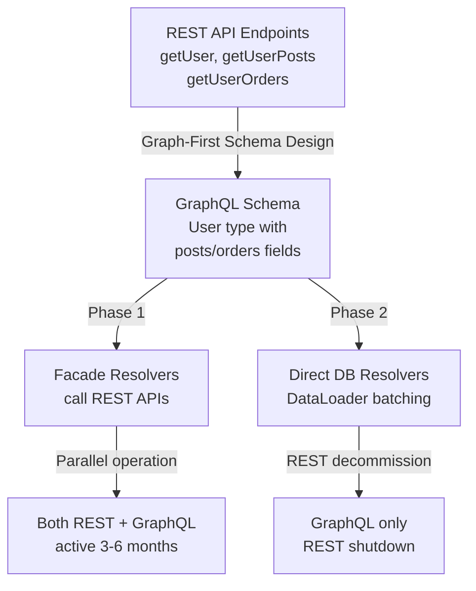

## Keywords in This File
{: .no_toc }

| # | Keyword | Weight |
|---|---|---|
| 24 | [Migrating REST to GraphQL: Strategies and Anti-patterns](#migrating-rest-to-graphql-strategies-and-anti-patterns) | ★★★ |

---

# Migrating REST to GraphQL: Strategies and Anti-patterns

---

### 🎯 Model Answer

**30 seconds:**
> Migrating REST to GraphQL should be incremental (strangler fig), not a big-bang rewrite.
> Expose GraphQL as a facade over existing REST services first; then progressively move
> resolvers to query databases directly. Key anti-patterns to avoid: GraphQL as a REST
> proxy (one resolver = one REST endpoint), returning over-fetched payloads unchanged,
> and ignoring N+1 from resolver fan-out. Key success factors: DataLoader for batching,
> a clear schema design phase (graph-first, not REST-first), and parallel REST/GraphQL
> support during the transition.

**3 minutes (Senior):**
> The two principal migration strategies are: (1) GraphQL facade over REST: add a
> GraphQL server that calls existing REST APIs from resolvers; zero data layer changes;
> clients migrate gradually; downside is that all REST problems (over-fetching, N+1, REST
> HTTP overhead) are now behind GraphQL with extra latency; the facade adds ~10-30ms per
> resolver call; (2) Direct database migration: resolvers query the database directly;
> eliminates REST overhead; the harder and correct path for permanent architecture.
> Anti-patterns that kill migration projects: (a) REST-shaped schema - designing the
> GraphQL schema as a 1:1 map of REST endpoints (`getUser`, `getUserPosts`,
> `getUserOrders` as top-level queries instead of `user { posts orders }`); (b)
> ignoring batching - each `user.posts` call firing a separate REST endpoint creates
> N+1 before DataLoader even matters; (c) big-bang cutover - trying to migrate all
> clients at once causes a coordination failure; run parallel REST + GraphQL for 3-6
> months. The most important principle: design the GraphQL schema as if REST never
> existed. A well-designed GraphQL schema does not resemble REST endpoints; it is a
> graph of relationships between domain objects.

**Blank Mind Recovery:**

**(1) Restate:** "REST to GraphQL migration: two strategies - facade (GraphQL over
REST APIs, fast but inherits REST problems) vs direct DB (slower to build, correct
end state). Anti-patterns: REST-shaped schema (endpoints not graph), no DataLoader
(N+1), big-bang cutover. Success: strangler fig (incremental), graph-first schema
design, DataLoader from day one, parallel operation during transition."

---

### 📘 Concept Explanation

**Migration Strategies Overview:**

```text
MIGRATION APPROACH COMPARISON:

STRATEGY 1: GraphQL Facade over REST
+------------------------------------+
|  GraphQL Server                    |
|  resolvers call REST APIs:         |
|    user(id) -> GET /api/users/:id  |
|    posts(userId) ->                |
|      GET /api/users/:id/posts      |
|    order(id) -> GET /api/orders/:id|
+------------------------------------+
  Pro: Fast to build (~2 weeks)
  Pro: REST stays running (safe rollback)
  Con: Extra latency (~15-30ms per call)
  Con: REST N+1 hides inside resolvers
  Con: REST over-fetching not eliminated
  Use: Initial phase only (3-6 months)

STRATEGY 2: Direct Database Access
+------------------------------------+
|  GraphQL Server                    |
|  resolvers query DB directly:      |
|    user(id) -> SELECT * FROM users |
|    posts -> SELECT * FROM posts    |
|             WHERE user_id = ?      |
|    WITH DataLoader (batched)       |
+------------------------------------+
  Pro: Full performance benefit
  Pro: GraphQL N+1 solved with DataLoader
  Pro: No REST layer overhead
  Con: Requires refactoring resolvers
  Con: Longer timeline (2-6 months)
  Use: Target end state

STRANGLER FIG (recommended path):
  Month 1: Facade + graph-first schema
  Month 2-3: Move hot paths to direct DB
  Month 4-5: Decommission REST endpoints
  Month 6: Full direct DB, REST shutdown
```

> **Diagram walkthrough:** (1) WHAT IT DEPICTS: two migration strategies (facade vs direct DB) with their trade-offs, and the recommended strangler-fig timeline for transitioning from one to the other. (2) HOW TO READ IT: each strategy box shows what the resolver does (call REST vs query DB); pro/con lists show the trade-offs; the strangler-fig timeline shows the practical 6-month path. (3) KEY RELATIONSHIP: the facade strategy is the low-risk starting point; the direct DB strategy is the performance-correct end state; the strangler fig moves endpoints from facade to direct DB incrementally. (4) EDGE CASE: if some REST endpoints are provided by a third-party service (not your own code), the facade strategy is the permanent correct choice for those resolvers - you cannot replace them with direct DB access. (5) INSIGHT: the most common migration failure is staying in facade mode permanently; the facade is a stepping stone, not a destination; schedule the direct-DB migration phases during the initial project planning, not after.

**Graph-First Schema Design (the most important migration principle):**

The fatal mistake is designing the GraphQL schema by looking at REST endpoints:

```text
REST-SHAPED SCHEMA (WRONG):
  type Query {
    getUser(id: ID!): User
    getUserPosts(userId: ID!): [Post]
    getUserOrders(userId: ID!): [Order]
    getPostById(id: ID!): Post
    getPostComments(postId: ID!): [Comment]
  }
  # This is REST with different syntax.
  # Clients must make multiple round trips.
  # No relationships between types.

GRAPH-SHAPED SCHEMA (CORRECT):
  type Query {
    user(id: ID!): User
    post(id: ID!): Post
  }
  type User {
    id: ID!
    name: String!
    posts: [Post!]!     # relationship
    orders: [Order!]!   # relationship
  }
  type Post {
    id: ID!
    title: String!
    comments: [Comment!]! # relationship
    author: User!          # relationship
  }
  # Client queries: user(id) { posts { comments { ... } } }
  # One request, no round trips.
```

> **Diagram walkthrough:** (1) WHAT IT DEPICTS: the structural difference between a REST-shaped GraphQL schema (verb-based query names, no relationships) and a graph-shaped schema (noun types with relationship fields). (2) HOW TO READ IT: REST-shaped has `getUserPosts(userId)` as a root query; graph-shaped has `User.posts` as a relationship field; the client query changes from "two queries" to "one nested query." (3) KEY RELATIONSHIP: graph-shaped schema enables the full power of GraphQL - single request, any combination of fields, no over-fetching; REST-shaped schema gives clients GraphQL syntax but REST semantics (multiple round trips). (4) EDGE CASE: not all REST relationships translate cleanly to GraphQL; a REST endpoint that returns `GET /users/{id}/most-recent-active-order` with complex filtering becomes a resolver argument: `user(id) { orders(status: ACTIVE, orderBy: CREATED_AT_DESC, first: 1) { ... } }`. (5) INSIGHT: senior engineers recognize REST-shaped schemas as a "migration smell" - it means the team looked at REST endpoints to design GraphQL rather than domain objects and their relationships; schedule a domain modeling session before writing any GraphQL schema.

---

### 💻 Code Example

```javascript
// BAD: GraphQL resolver calling REST endpoint directly
// (Facade anti-pattern - permanent tech debt)

const resolvers = {
  Query: {
    user: async (_, { id }) => {
      // Calling own REST API from GraphQL resolver
      const response = await fetch(
        `http://api-service/v1/users/${id}`
      );
      return response.json();
      // Problems:
      // - Extra HTTP overhead per resolver call
      // - REST N+1 hidden inside GraphQL
      // - No DataLoader batching possible
      // - Two services to maintain
    },
    posts: async (_, { userId }) => {
      const resp = await fetch(
        `http://api-service/v1/users/${userId}/posts`
      );
      return resp.json();
      // N+1: called once per user in a list query
    }
  }
};
```

> **Code walkthrough:** (1) WHAT IT SHOWS: the GraphQL facade anti-pattern where resolvers call REST APIs via HTTP - every resolver call is an HTTP request to the REST service, adding ~15-30ms overhead and creating hidden N+1 problems. (2) KEY MECHANISM: when a client queries `users { posts { title } }`, the `posts` resolver is called once per user; if there are 20 users, this is 20 HTTP calls to the REST service; the REST service itself may query the database once each; result: 20 DB queries where 1 would suffice with DataLoader. (3) WHY IT MATTERS: the facade looks clean in the GraphQL schema but is a performance liability; clients see GraphQL's single-request benefit but the server pays REST's N+1 cost behind the scenes. (4) WHAT BREAKS: under load, 20 concurrent facade HTTP calls to the REST service cause a traffic spike; the REST service sees 20x the load it did when clients called it directly; rate limits, connection pool exhaustion, and cascading failures become likely. (5) TAKEAWAY: the facade pattern is acceptable as a 3-6 month bridge, not a permanent architecture; plan the direct-DB migration before the facade is deployed; "temporary" facades become permanent without a deadline.

```javascript
// GOOD: DataLoader-based direct DB access
// (target end state after migration)
// BAD: facade approach shown above

const DataLoader = require('dataloader');

// Batch function: load multiple users in one query
const batchUsers = async (ids) => {
  // One DB query for all requested user IDs
  const users = await db.query(
    'SELECT * FROM users WHERE id = ANY($1)',
    [ids]
  );
  // Return in the same order as ids input
  const userMap = Object.fromEntries(
    users.map(u => [u.id, u])
  );
  return ids.map(id => userMap[id] || null);
};

// Create DataLoader per request (NOT global)
const createLoaders = () => ({
  userLoader: new DataLoader(batchUsers),
  postsByUserLoader: new DataLoader(async (userIds) => {
    const posts = await db.query(
      'SELECT * FROM posts WHERE user_id = ANY($1)',
      [userIds]
    );
    // Group by user_id
    const grouped = {};
    userIds.forEach(id => grouped[id] = []);
    posts.forEach(p => {
      if (grouped[p.user_id]) {
        grouped[p.user_id].push(p);
      }
    });
    return userIds.map(id => grouped[id]);
  })
});

const resolvers = {
  Query: {
    user: (_, { id }, { loaders }) =>
      loaders.userLoader.load(id),
    users: (_, { ids }, { loaders }) =>
      loaders.userLoader.loadMany(ids)
  },
  User: {
    posts: ({ id }, _, { loaders }) =>
      loaders.postsByUserLoader.load(id)
    // Called 20 times for 20 users ->
    // DataLoader batches into 1 DB query
  }
};

// ApolloServer context: create per-request loaders
const server = new ApolloServer({
  typeDefs,
  resolvers,
  context: ({ req }) => ({
    loaders: createLoaders(),
    user: req.user
  })
});
```

> **Code walkthrough:** (1) WHAT IT SHOWS: the correct migration end state - DataLoader per request, batch functions that query the database with `WHERE id = ANY($1)`, and resolvers using `loader.load(id)` instead of individual DB calls; 20 users' posts are fetched in 1 query. (2) KEY MECHANISM: DataLoader collects all `load(id)` calls that happen within the same tick (event loop microtask), then calls the batch function once with all IDs; the `batchUsers` function executes `WHERE id = ANY($1)` with all IDs; result: N resolver calls -> 1 DB query. (3) WHY IT MATTERS: without DataLoader, a query for 20 users' posts fires 20 DB queries; with DataLoader, it fires 1; at 100 concurrent requests each with 20 users, that is 2000 vs 100 DB queries. (4) WHAT BREAKS: creating DataLoader at the module level (not per-request) causes data leakage between requests; DataLoader caches by ID; a global cache returns User A's data to User B's request; always create loaders in the request context. (5) TAKEAWAY: DataLoader is not optional in a production GraphQL migration; add it during the facade phase (batch REST calls) and keep it in the direct-DB phase (batch DB queries); the `load(id)` call site never changes, only the batch function implementation changes when migrating from facade to direct DB.

```javascript
// Migration validation: run REST + GraphQL in parallel
// Use this pattern to validate GraphQL responses
// match REST before cutting over clients

const resolvers = {
  Query: {
    user: async (_, { id }, { flags }) => {
      // Feature flag: shadow mode (compare but use REST)
      if (flags.graphqlShadowMode) {
        const [restResult, graphqlResult] = await Promise.all([
          restClient.getUser(id),     // source of truth
          db.findUser(id)              // GraphQL resolver path
        ]);
        // Compare results (async, non-blocking)
        void compareAndLog(
          'user', id, restResult, graphqlResult
        );
        return restResult; // Still return REST result
      }
      // Production: use GraphQL resolver directly
      return db.findUser(id);
    }
  }
};

// compareAndLog: detect schema discrepancies
const compareAndLog = async (
  operation, id, restResult, graphqlResult
) => {
  const diffs = deepDiff(restResult, graphqlResult);
  if (diffs.length > 0) {
    logger.warn('GraphQL migration diff', {
      operation, id, diffs
    });
    metrics.increment('graphql.migration.diff');
  }
};
```

> **Code walkthrough:** (1) WHAT IT SHOWS: a shadow mode pattern for safe GraphQL migration - both the REST API and the new GraphQL resolver are called in parallel; the REST result is returned to the client; differences are logged and counted as metrics. (2) KEY MECHANISM: `Promise.all` fires both calls simultaneously; REST takes the same time it always did (not slowed by GraphQL comparison); the comparison happens asynchronously; clients see no change in behavior during shadow mode. (3) WHY IT MATTERS: this pattern catches data discrepancies before clients are affected; if `graphqlResult.user.createdAt` uses a different format than REST's `created_at`, the comparison logs it before anyone notices in production. (4) WHAT BREAKS: running both REST and GraphQL paths doubles the load on backing systems during shadow mode; limit shadow mode to a percentage of traffic (feature flag sampling) to avoid 2x load. (5) TAKEAWAY: shadow mode is the safest migration validation technique; run it for 1-2 weeks for each resolver category; zero diffs = safe to cut over; any diffs = investigate before cutover.

---

### 🎓 Answers by Seniority

**Junior / Mid (0-3 years):**
> When migrating REST to GraphQL, start with a facade: create a GraphQL server where
> resolvers call existing REST APIs. This lets you build the GraphQL schema and test
> clients without changing the REST backend. Design the schema around domain objects
> and relationships (not REST endpoint names). Add DataLoader to batch resolver calls.
> After the facade is stable, migrate hot resolvers to query the database directly
> one at a time. Run REST and GraphQL in parallel until all clients have migrated.

---

**Senior / Staff (5+ years):**
> The migration strategy depends on organization and timeline, not just technical
> preferences. Key decisions: (1) Schema design first - hold a domain modeling workshop
> before writing any GraphQL schema; the schema is the API contract and hard to change
> after clients adopt it. (2) Facade vs direct-DB timeline - facade is always the
> first phase; direct-DB is the planned second phase, not optional. (3) DataLoader
> from day one - N+1 in GraphQL is 10x more impactful than in REST because GraphQL
> resolvers compose; a 3-level nested query without DataLoader is N x M x P DB queries.
> (4) Schema versioning strategy - GraphQL is versionless by convention but not by
> reality; use field deprecation (`@deprecated(reason: "use X instead")`) for any field
> rename; run old + new fields simultaneously for 90 days; monitor usage and remove
> when zero. (5) Client migration cadence - migrate clients by feature area (team A
> migrates their screens to GraphQL), not by endpoint type; feature-area migration
> maintains team ownership.

---

### ⚠️ Common Misconceptions

**Misconception: "GraphQL is faster than REST by definition."**

GraphQL is not inherently faster than REST. REST APIs can be highly optimized:
- REST with HTTP/2 multiplexing + caching headers
- REST with sparse fieldsets (`?fields=id,name,email`)
- REST with single-endpoint aggregation patterns

GraphQL's performance advantage comes from:
- Eliminating over-fetching (fewer bytes transferred)
- Enabling request batching (one HTTP call for multiple operations)
- DataLoader eliminating N+1 (requires correct implementation)

GraphQL is often SLOWER than REST if:
- Resolvers call REST endpoints (facade pattern): ~15-30ms overhead added
- No DataLoader: N+1 queries fire instead of SQL joins
- No persisted queries: full query string parsed per request vs pre-compiled

The correct framing: GraphQL gives clients control over fetch shape;
performance is determined by resolver implementation, not the protocol.

**Misconception: "REST and GraphQL cannot coexist; you must choose one."**

REST and GraphQL serve different client needs:
- REST: good for webhooks, simple CRUD, file uploads, public APIs (caching)
- GraphQL: good for complex data needs, mobile clients (bandwidth), dashboards

A pragmatic architecture exposes both:
- GraphQL for mobile and web frontend clients (data fetching)
- REST for webhooks, third-party integrations, simple CRUD (file uploads)

Running both permanently is fine if each serves its intended use case.

---

### 🚨 Failure Modes and Diagnosis

**Failure Mode: REST migration stalls at facade; performance never improves.**

Symptom: GraphQL is deployed, clients are migrated, but p95 latency is the same
as REST or worse; the engineering team considers reverting.

```bash
# Diagnose: is every resolver calling REST?
# Check DataDog/Prometheus for REST calls from GraphQL:
# Metric: http_client_requests_total{from="graphql-service"}

# Check N+1 in resolver logs:
# Enable query complexity logging in Apollo Server:
# Look for high requestCount in operation traces

# Query analysis: find resolvers with highest REST call count
# Apollo Studio > Operations > Resolver-level tracing

# Temporary diagnostic: log all outbound HTTP calls
# in the GraphQL server process for 5 minutes.
# Count calls per resolver name.
# REST calls per second from GraphQL = REST calls/sec before
# migration -> facade is 1:1 replacement; no benefit delivered

# Fix: identify top-5 highest-traffic resolvers
# Migrate those 5 to direct DB access
# Expected result: 30-60% latency reduction for common queries
# (eliminating REST HTTP overhead for hot paths)
```

> **Code walkthrough:** (1) WHAT IT SHOWS: how to diagnose the facade stall - using metrics to identify that the GraphQL server is making as many REST calls as clients made before migration, meaning the facade is a pure pass-through with extra overhead. (2) KEY MECHANISM: `http_client_requests_total{from="graphql-service"}` reveals that the GraphQL server is making N REST calls per GraphQL request; Apollo Studio's resolver-level tracing shows which resolvers are the most expensive. (3) WHY IT MATTERS: the "migration stall" is the most common failure mode; the facade gets deployed, clients migrate, and no one follows up with the direct-DB phase; 6 months later, GraphQL is blamed for being "slow" when the architecture is at fault. (4) WHAT BREAKS: resolver-level tracing must be enabled (adds ~5-10ms overhead per request); disable it in production after the diagnosis is complete; it is too expensive for permanent use. (5) TAKEAWAY: build the direct-DB migration timeline into the initial project plan; treat the facade as a time-bounded bridge with a hard deadline; "direct-DB migration quarter" must be scheduled before the facade goes to production.

---

### ⚖️ Comparison Table

| Approach | Deploy Speed | Latency | N+1 Risk | Rollback Safety | Phase |
|---|---|---|---|---|---|
| GraphQL facade over REST | Fast (1-2 weeks) | REST + 15-30ms | High (hidden) | Easy | Phase 1 |
| DataLoader + direct DB | Slow (2-6 months) | DB latency only | Low (mitigated) | Medium | Phase 2 |
| Big-bang rewrite | Very slow | DB latency | Depends | Low | Avoid |
| Parallel REST + GraphQL | Ongoing | Both preserved | Depends | Best | Transition |

---

### 🏛️ System Design

**Incremental REST-to-GraphQL Migration Architecture:**

```text
STRANGLER FIG MIGRATION PATTERN:

PHASE 1: Facade (Months 1-3)
+--------------------------------------+
|  Existing Clients (REST)             |
|    -> GET /api/v1/users/:id         |
|    -> GET /api/v1/posts/:userId     |
+--------------------------------------+
  (unchanged, still works in parallel)
+--------------------------------------+
|  New Clients (GraphQL)              |
|    -> POST /graphql                 |
|       { user(id) { posts { } } }   |
+--------------------------------------+
              |
+-------------v------------------------+
|  GraphQL Server (Facade Layer)      |
|  resolvers -> REST API client       |
+--------------------------------------+
              |
+-------------v------------------------+
|  REST API Service (unchanged)       |
+--------------------------------------+

PHASE 2: Direct DB Migration (Months 3-6)
+--------------------------------------+
|  GraphQL Server                     |
|  [MIGRATED] user -> DB (DataLoader) |
|  [MIGRATED] posts -> DB (DataLoader)|
|  [FACADE] orders -> REST (still)   |
|  [FACADE] payments -> REST (still) |
+--------------------------------------+

PHASE 3: REST Decommission (Month 6+)
  All resolvers -> direct DB
  REST endpoints marked deprecated
  REST shutdown after all clients migrated
```

> **Diagram walkthrough:** (1) WHAT IT DEPICTS: the three phases of the strangler fig migration - Phase 1 (GraphQL facade, REST clients unchanged), Phase 2 (mixed: some resolvers migrated to direct DB, some still facade), Phase 3 (all resolvers direct DB, REST decommissioned). (2) HOW TO READ IT: each phase box shows what the GraphQL server resolvers do; `[MIGRATED]` and `[FACADE]` labels in Phase 2 show that migration happens incrementally by resolver, not all at once. (3) KEY RELATIONSHIP: the old REST clients and the new GraphQL clients coexist during Phase 1 and Phase 2; the GraphQL server is the only piece that changes during migration; clients are never forced to change simultaneously. (4) EDGE CASE: some REST endpoints may never be migrated (third-party services, file upload endpoints, webhook endpoints); these stay as facade permanently; this is architecturally acceptable. (5) INSIGHT: the strangler fig is named after the tropical tree that grows around and eventually replaces a host tree; GraphQL "grows around" REST, and REST is "strangled" (decommissioned) after GraphQL fully replaces it; the host (REST) keeps running until the replacement is complete.

---

### 📊 Diagram

The schema evolution from REST-shaped to graph-shaped is the most important diagram for this migration:

```text
REST-TO-GRAPH SCHEMA EVOLUTION:

BEFORE (REST-shaped GraphQL - anti-pattern):
  Query {
    getUser(id)           -> /api/users/:id
    getUserPosts(userId)  -> /api/users/:id/posts
    getUserOrders(userId) -> /api/users/:id/orders
    getPost(id)           -> /api/posts/:id
    getPostComments(id)   -> /api/posts/:id/comments
  }
  CLIENT: 3 queries to show user profile
          with posts and orders

AFTER (Graph-shaped schema - target):
  Query { user(id): User  post(id): Post }
  User  { id name email posts:[Post] orders:[Order] }
  Post  { id title content author:User comments:[Comment] }

  CLIENT: 1 query:
    user(id){ posts{title} orders{total} }

  Query count: 3 -> 1 (66% reduction)
```



> **Diagram walkthrough:** (1) WHAT IT DEPICTS: the complete migration path from REST endpoint design through schema design to the two-phase resolver migration and final REST decommission. (2) HOW TO READ IT: top node shows the starting state (REST endpoints as query names); "Graph-First Schema Design" is the critical pivot; Phase 1 builds the facade; Phase 2 migrates to direct DB; the end state is GraphQL only. (3) KEY RELATIONSHIP: the graph-first schema design step is the irreversible commitment; once clients start using `user { posts }` (graph-shaped), they cannot easily be changed back to `getUserPosts(userId)` (REST-shaped); get the schema right before clients adopt it. (4) EDGE CASE: if the schema is designed REST-shaped, the migration delivers GraphQL syntax but not GraphQL benefits; the N+1 problem multiplies instead of being solved. (5) INSIGHT: the strangler fig path (A -> B -> C+D -> E -> F) is deliberately incremental; any attempt to skip from A directly to F (big-bang rewrite) skips the safety checkpoints and risks a failed migration.

---

### 🎯 Interview Deep-Dive

| Category | Count | Coverage |
|---|---|---|
| Definition | 2 | migration strategies, anti-patterns |
| Application | 2 | DataLoader migration, shadow mode |
| Architecture | 3 | strangler fig, schema design, N+1 |
| Trade-off | 2 | facade vs direct DB, when to keep REST |
| Debugging | 2 | facade stall, N+1 diagnosis |
| Behavioral | 1 | migration experience |

---

**[JUNIOR] Q1 (Definition): What is the strangler fig pattern and why is it recommended for REST-to-GraphQL migration?**

The strangler fig pattern is an incremental migration strategy where the new system
(GraphQL) is built alongside the old system (REST), clients are migrated gradually,
and the old system is decommissioned after the new one fully replaces it.

Steps:
1. Build GraphQL server (initially a facade over REST).
2. Migrate a subset of clients to GraphQL (the "early adopters").
3. Verify GraphQL works correctly for those clients.
4. Migrate more clients progressively.
5. Once all clients use GraphQL: decommission the REST API.

Why not a big-bang rewrite?
- Big-bang requires freezing REST development during migration (6-18 months).
- If GraphQL has a bug, all clients are affected simultaneously.
- Risk: the migration fails halfway and you have two broken systems.
- Organizational reality: 6 months of "no new features" is rarely acceptable.

The strangler fig lets REST and GraphQL coexist during transition:
- New clients use GraphQL.
- Existing clients continue using REST.
- No forced migration deadline.
- If GraphQL has a bug, only GraphQL clients are affected; REST clients are safe.

*What separates good from great:* recognizing that the strangler fig has phases.
Phase 1 (facade) can be done in 2 weeks; Phase 2 (direct DB, DataLoader) takes months;
Phase 3 (REST decommission) requires organizational coordination. Projects fail when
the team declares victory after Phase 1 and never executes Phase 2; the facade becomes
permanent technical debt with higher latency than the original REST API.

---

**[SENIOR] Q2 (Architecture): How do you design a GraphQL schema to avoid REST anti-patterns when migrating?**

Anti-pattern: REST-shaped schema (verbs as query names):

```graphql
# BAD: REST-shaped schema
type Query {
  getUser(id: ID!): User
  getUserPosts(userId: ID!): [Post]
  getUserOrders(userId: ID!): [Order]
  getOrderById(id: ID!): Order
}
# Client must call 3 queries to get user + posts + orders
# This is REST with different syntax - not a graph
```

> **Code walkthrough:** (1) WHAT IT SHOWS: a REST-shaped GraphQL schema where query names mirror REST endpoint names (`getUser`, `getUserPosts`) - the fundamental anti-pattern of REST-to-GraphQL migration. (2) KEY MECHANISM: each query returns a flat object; there are no relationship fields connecting types; clients must make multiple queries to get related data; the schema offers no graph navigation. (3) WHY IT MATTERS: this schema makes GraphQL worse than REST - REST clients made 3 HTTP calls; GraphQL clients still make 3 calls, but now through a GraphQL layer with extra parsing overhead. (4) WHAT BREAKS: once clients adopt a REST-shaped schema, changing it to graph-shaped breaks clients; the migration cost doubles because you must redesign the schema AND re-migrate all clients. (5) TAKEAWAY: schedule a domain modeling session before writing any GraphQL schema; never design by looking at REST endpoints; model the domain objects and their relationships first, then define queries as "how do clients navigate to domain objects."

```graphql
# GOOD: Graph-shaped schema
# BAD: REST-shaped shown above
type Query {
  user(id: ID!): User   # Entry point to User graph
  post(id: ID!): Post   # Entry point to Post graph
  order(id: ID!): Order # Entry point to Order graph
}
type User {
  id: ID!
  name: String!
  email: String!
  posts: [Post!]!       # Relationship: User has posts
  orders: [Order!]!     # Relationship: User has orders
}
type Post {
  id: ID!
  title: String!
  author: User!         # Bi-directional relationship
  comments: [Comment!]!
}
# Client query: user(id) { posts { title } orders { total } }
# One request, no round trips
```

> **Code walkthrough:** (1) WHAT IT SHOWS: a graph-shaped schema with relationship fields on types (`User.posts`, `User.orders`, `Post.author`) - this is the correct GraphQL design that enables single-request data fetching. (2) KEY MECHANISM: `User.posts: [Post!]!` is a resolver field that returns the user's posts; it can use DataLoader for batching; `Post.author: User!` creates a bidirectional relationship; clients can navigate in either direction. (3) WHY IT MATTERS: this schema enables `user(id) { posts { title } orders { total } }` - one request that returns all needed data; REST required 3 HTTP calls for the same data. (4) WHAT BREAKS: `Post.author` creates a circular type reference (`Post -> User -> Post -> ...`); GraphQL handles this correctly for one level, but a client query can create infinite recursion if the schema is not protected with max depth limits. (5) TAKEAWAY: the design principle is "nouns as types, relationships as fields"; `getUserPosts` is a verb (REST); `User.posts` is a relationship field (graph); apply this transformation to every REST endpoint during the schema design phase.

*What separates good from great:* understanding the schema design process, not just the output.
Hold a domain modeling workshop: list the domain entities (User, Post, Order, Comment); for each pair,
identify relationships (User has-many Posts, Post belongs-to User); map these to GraphQL type fields;
only then define root Query/Mutation entry points. This process takes 4-8 hours for a complex
domain; it saves months of schema redesign.

---

**[SENIOR] Q3 (Application): How do you migrate DataLoader from facade (REST batching) to direct DB?**

The key insight: DataLoader batch function is the only thing that changes.

```javascript
// PHASE 1: DataLoader batch function calling REST
// (facade phase - interim bridge)
// BAD: calling REST inline without DataLoader
const batchUsersViaREST = async (ids) => {
  // REST bulk endpoint (if available):
  const resp = await fetch(
    `/api/v1/users?ids=${ids.join(',')}`
  );
  const users = await resp.json();
  const map = Object.fromEntries(
    users.map(u => [u.id, u])
  );
  return ids.map(id => map[id] || null);
  // Still N REST calls if no bulk endpoint exists
};

const userLoader = new DataLoader(batchUsersViaREST);

// Resolver stays IDENTICAL in both phases:
const resolvers = {
  User: { posts: ({ id }, _, { loaders }) =>
    loaders.postsByUserLoader.load(id)
  }
};
```

> **Code walkthrough:** (1) WHAT IT SHOWS: the facade-phase DataLoader batch function calling a REST bulk endpoint - the resolver code is identical to the direct-DB phase; only the batch function implementation changes. (2) KEY MECHANISM: DataLoader abstracts the data source from the resolver; the resolver calls `loader.load(id)` regardless of whether the batch function calls REST or DB; changing the batch function migrates the data source without changing any resolver code. (3) WHY IT MATTERS: structuring the facade this way (DataLoader from day one) makes the direct-DB migration trivial - swap the batch function and nothing else changes; without DataLoader in Phase 1, migrating Phase 2 requires rewriting all resolver code. (4) WHAT BREAKS: if the REST API has no bulk endpoint (only individual `GET /users/:id`), the DataLoader batch function still fires N individual REST calls; DataLoader only helps if the batch function can actually batch (bulk DB query or bulk REST endpoint). (5) TAKEAWAY: add DataLoader during the facade phase even if the REST API has no bulk endpoint; the DataLoader interface provides the clean migration path to direct DB; create a REST bulk endpoint if needed, or accept that DataLoader adds no batching benefit until Phase 2.

```javascript
// PHASE 2: Same DataLoader, new batch function
// (direct DB phase - replaces batchUsersViaREST)
// BAD: (see Phase 1 facade approach above)
const batchUsersViaDDB = async (ids) => {
  // One DB query for all user IDs
  const users = await db.query(
    'SELECT * FROM users WHERE id = ANY($1::uuid[])',
    [ids]
  );
  const map = Object.fromEntries(
    users.rows.map(u => [u.id, u])
  );
  return ids.map(id => map[id] || null);
  // 1 DB query regardless of how many users
};

// Only the batch function changes:
// userLoader = new DataLoader(batchUsersViaREST);// remove
// userLoader = new DataLoader(batchUsersViaDDB); // add
// Resolvers: ZERO changes needed
```

> **Code walkthrough:** (1) WHAT IT SHOWS: the Phase 2 direct-DB batch function - identical DataLoader interface, different implementation; `WHERE id = ANY($1::uuid[])` fetches all users in one query; the resolver code requires zero changes. (2) KEY MECHANISM: `ids` is the array from all `loader.load(id)` calls within the same event loop tick; `ANY($1::uuid[])` uses a PostgreSQL array parameter to fetch all IDs in one round trip; `ids.map(id => map[id])` returns results in the same order as `ids` (DataLoader requirement). (3) WHY IT MATTERS: the REST-to-DB migration is entirely contained in the batch function; zero resolver changes means zero regression risk in resolver logic; test the new batch function in isolation; deploy and monitor metrics. (4) WHAT BREAKS: if the `ids` array order is not preserved in the return value, DataLoader assigns results to the wrong requests; always map results back to input `ids` order; never return results in DB sort order directly. (5) TAKEAWAY: the one rule for DataLoader batch functions: return results in EXACTLY the same order as the input `ids` array; use `ids.map(id => map[id] || null)` as the return pattern; never return DB results directly without reordering.

---

**[SENIOR] Q4 (Application): How do you handle REST client migration without forcing a simultaneous cutover?**

Client migration requires feature flagging and parallel API support:

```javascript
// Express: run both REST and GraphQL simultaneously
// BAD: shutting down REST before all clients migrated
app.use('/api/v1', restRouter);  // Keep REST running
app.use('/graphql', graphqlServer.middleware());

// Migration tracking: log which clients use which API
app.use((req, res, next) => {
  if (req.path.startsWith('/graphql')) {
    metrics.increment('api.graphql.requests', {
      client: req.headers['x-client-id'] || 'unknown'
    });
  } else if (req.path.startsWith('/api/v1')) {
    metrics.increment('api.rest.requests', {
      client: req.headers['x-client-id'] || 'unknown'
    });
  }
  next();
});
// When api.rest.requests{client=X} -> 0:
// client X has fully migrated
```

> **Code walkthrough:** (1) WHAT IT SHOWS: running REST and GraphQL simultaneously with request-level metrics tracking which clients use which API - the data needed to know when REST can be safely decommissioned. (2) KEY MECHANISM: both `/api/v1` (REST) and `/graphql` routes are active; clients choose which to use; `x-client-id` tracks which client is the last remaining REST user; when `api.rest.requests{client=X}` drops to zero, client X has fully migrated. (3) WHY IT MATTERS: decommissioning REST without metrics is a coordination risk; one overlooked REST client (a webhook consumer, a batch job, a partner integration) causes an outage when REST is shut down; metrics show exact migration progress. (4) WHAT BREAKS: tracking by `x-client-id` requires all clients to send this header; clients that do not send it are counted as "unknown"; add a logging alert for `unknown` REST clients during the migration period. (5) TAKEAWAY: REST decommission is only safe when `api.rest.requests` is at zero for all known client IDs for 7 consecutive days; set a REST shutdown date 30 days after the last REST request and communicate it to all client teams.

---

**[SENIOR] Q5 (Trade-off): When should you keep REST instead of migrating to GraphQL?**

Keep REST (or run REST permanently alongside GraphQL) when:

1. Public API with external consumers: REST is standard; external developers expect
   REST + OpenAPI spec; GraphQL introspection is unfamiliar to many; public APIs
   should prefer REST unless the consumer base specifically requests GraphQL.

2. File uploads and binary data: GraphQL multipart file upload is non-standard
   (requires `graphql-upload` or relay spec); REST `multipart/form-data` is universal.

3. Webhook delivery: webhooks are server-to-client pushes; GraphQL subscriptions are
   client-pull; REST POST is the right mechanism for webhooks.

4. HTTP caching requirements: REST resources use URL-based cache keys; CDNs cache
   `GET /api/products/:id` by URL; GraphQL POST requests are not cached by CDNs
   (persisted queries help but add complexity).

5. Simple CRUD with no client variability: `GET /products/:id` returning the full
   product object is fine; adding GraphQL for CRUD with no over-fetching problem
   adds complexity with no benefit.

The hybrid architecture is architecturally valid and often optimal:
- GraphQL for dashboards, mobile apps, and any client that needs custom data shapes.
- REST for webhooks, file uploads, external APIs, and simple CRUD.
- Both served from the same backend, no need to choose one.

*What separates good from great:* framing the decision as "what problem does GraphQL
solve for this specific client?" If the answer is "over-fetching" or "multiple round
trips" or "complex data aggregation", GraphQL is worth the migration cost. If the
answer is "REST is old and GraphQL is new", that is not a valid reason to migrate.

---

**[BEHAVIORAL] Q6 (Behavioral): Describe a REST-to-GraphQL migration project. What were the biggest challenges and what would you do differently?**

Strong answer structure:

Context: "We had a React Native mobile app calling 12 REST endpoints per screen load.
The app was slow (P95: 800ms per screen transition) and the team maintained 45 REST
endpoint handlers plus 3 BFF (Backend for Frontend) services that aggregated REST calls."

Strategy: "We chose the strangler fig pattern. Phase 1: GraphQL facade in 3 weeks.
Phase 2: DataLoader + direct DB over 4 months. Phase 3: REST decommission over 2 months."

Biggest challenges:
1. REST-shaped schema temptation: the first schema draft had `getUserPosts`,
   `getUserOrders` as separate queries. Caught it in the design review; redesigned
   to `User { posts, orders }`. The domain modeling workshop was the fix.
2. N+1 in production: deployed the facade without DataLoader for 2 REST endpoints;
   they were called 200ms P95 in REST; 2000ms in GraphQL (N+1 through the facade).
   Added DataLoader; P95 returned to 200ms within the same deploy.
3. Undiscovered REST clients: decommissioned `GET /api/v1/users` after 30 days
   of zero traffic; an analytics pipeline running nightly (not in the past 30 days)
   failed the next day. Added 90-day monitoring window.

What would you do differently: add the `x-client-id` header requirement before
Phase 1 deployment; instrument REST request counts by client ID from day one;
run 90-day monitoring before any decommission.

*What separates good from great:* including the "undiscovered client" failure story.
Senior interviewers know this failure mode (nightly jobs, quarterly reports, partner
integrations) and respect candidates who have encountered it and learned from it.
Candidates who only describe the happy path of a migration are not credible.

---

**[SENIOR] Q7 (Debugging): How do you diagnose and fix N+1 that appears after migrating from REST to GraphQL?**

N+1 in GraphQL manifests differently than in REST because resolver composition
multiplies the problem across relationship levels:

```javascript
// BAD: N+1 resolver - individual DB query per parent
const resolvers = {
  User: {
    posts: async ({ id }, _, { db }) => {
      return db.query(
        'SELECT * FROM posts WHERE user_id = $1',
        [id]
      );
      // N=20 users -> 20 DB queries (N+1)
    }
  }
};

// GOOD: DataLoader batching
// BAD: direct DB call above
const resolvers = {
  User: {
    posts: ({ id }, _, { loaders }) =>
      loaders.postsByUserLoader.load(id)
      // N=20 users -> 1 DB query (batched)
  }
};
```

> **Code walkthrough:** (1) WHAT IT SHOWS: the N+1 pattern in a `User.posts` resolver (direct DB query per user) and the DataLoader fix (batch function loads all users' posts in one query). (2) KEY MECHANISM: without DataLoader, `User.posts` fires `SELECT * FROM posts WHERE user_id = $1` once per user; 20 users = 20 queries; with DataLoader, all 20 `loader.load(userId)` calls are batched into `SELECT * FROM posts WHERE user_id = ANY([1,2,...,20])` = 1 query. (3) WHY IT MATTERS: N+1 in GraphQL compounds at each nesting level; a query for `users { posts { comments { ... } } }` without DataLoader fires N x M x P queries; with DataLoader it fires 3 queries (one per level). (4) WHAT BREAKS: `DEBUG=dataloader` only works with the standard DataLoader package; custom DataLoader wrappers may not respect the debug flag; add explicit logging in the batch function for production diagnosis. (5) TAKEAWAY: DataLoader is the mandatory fix for all list-type resolver fields that resolve from a parent's ID; `User.posts: ({id}) => loader.load(id)` is the correct pattern for every parent-to-children relationship.

```bash
# Diagnose N+1 in production:
# Step 1: Enable DataLoader debug logging
DEBUG=dataloader node server.js
# Output: "DataLoader batch size: 1" per call
# -> N+1 (each user loaded individually)
# Expected: "DataLoader batch size: 20"

# Step 2: Apollo Studio traces
# Find operations with:
#   resolver count >> field count (classic N+1 signal)
#   User.posts called 20x in one operation trace
```

> **Code walkthrough:** (1) WHAT IT SHOWS: diagnostic commands to detect N+1 in production - `DEBUG=dataloader` shows DataLoader batch sizes; Apollo Studio traces show per-resolver call counts. (2) KEY MECHANISM: `batch size: 1` means each `load()` call is firing immediately as a separate DB call; DataLoader should be accumulating calls and firing them together (`batch size: 20`); if batching is not happening, the DataLoader was created incorrectly (global vs per-request). (3) WHY IT MATTERS: N+1 is the top performance issue in production GraphQL; identifying it requires resolver-level visibility (Apollo Studio) not just request-level latency (P95). (4) WHAT BREAKS: if DataLoader is created once globally (`const userLoader = new DataLoader(...)` at module level), request A's load cache may return stale data for request B; the batch size may appear correct but data correctness fails. (5) TAKEAWAY: always check DataLoader batch sizes during staging load tests; a batch size of 1 under load is a guaranteed N+1 problem; fix before production.

---

**[SENIOR] Q8 (Application): How do you version a GraphQL schema during and after migration?**

GraphQL is conventionally versionless, but migration requires managing breaking changes:

Strategy: field deprecation with parallel operation.

```graphql
type User {
  # OLD field: available in REST as "username"
  username: String @deprecated(
    reason: "Use displayName instead"
  )
  # NEW field: renamed for consistency
  displayName: String!

  # OLD: nested address object from REST response
  address: Address @deprecated(
    reason: "Use location - supports geocoordinates"
  )
  # NEW: richer location type
  location: Location
}
```

> **Code walkthrough:** (1) WHAT IT SHOWS: running both old (`username`, `address`) and new (`displayName`, `location`) fields simultaneously during the transition - clients using the old field names continue working; clients can adopt new names at their own pace. (2) KEY MECHANISM: `@deprecated(reason: "...")` marks a field as deprecated; GraphQL clients that request a deprecated field still receive data (no errors); Apollo Studio and introspection tools highlight deprecated field usage; the reason string guides clients to the replacement. (3) WHY IT MATTERS: unlike REST versioning (`/v1/` vs `/v2/`), GraphQL deprecation is field-level; clients that use 50 fields and 1 deprecated field only need to change that 1 field; there is no forced wholesale migration. (4) WHAT BREAKS: if a deprecated field is removed while any client still requests it, that field returns `null` (or an error); monitor deprecated field usage before removing; remove only when usage is zero for 30+ days. (5) TAKEAWAY: deprecation timeline: add `@deprecated`, monitor usage, announce sunset date (30-90 days), remove when zero usage; Apollo Studio shows per-field usage percentages; use this data to set realistic sunset deadlines.

---

**[SENIOR] Q9 (Architecture): How do you test a GraphQL migration to ensure correctness before cutting over clients?**

Three testing strategies for migration validation:

1. Contract testing: generate the GraphQL schema SDL and compare field-by-field with
   the REST API OpenAPI spec; any field in REST that is missing from GraphQL is a
   migration gap.

2. Shadow mode (parallel execution): run both REST and GraphQL resolvers for the same
   request; compare responses; log discrepancies; do not expose discrepancies to clients.

3. Snapshot testing for resolver output: capture REST API responses for 100 production
   requests; run the same inputs through GraphQL resolvers; compare outputs field-by-field.

```javascript
// BAD: No parity testing - cut over without validation
// Users discover format differences in production:
// REST returns: { created_at: "2024-01-15T10:00:00Z" }
// GraphQL returns: { createdAt: 1705312800 }
// -> client breaks silently (displays Unix timestamp)

// GOOD: Automated parity testing before cutover
// BAD: no-test approach above
describe('User resolver parity', () => {
  it('matches REST response for user fields', async () => {
    const userId = 'test-user-123';
    // Fetch from REST
    const restUser = await fetch(
      `http://api/v1/users/${userId}`
    ).then(r => r.json());
    // Fetch from GraphQL resolver directly
    const gqlUser = await resolvers.Query.user(
      null, { id: userId }, testContext
    );
    // Compare relevant fields
    expect(gqlUser.id).toBe(restUser.id);
    expect(gqlUser.name).toBe(restUser.name);
    expect(gqlUser.email).toBe(restUser.email);
    // Date format may differ: normalize before compare
    expect(new Date(gqlUser.createdAt).getTime())
      .toBe(new Date(restUser.created_at).getTime());
  });
});
```

> **Code walkthrough:** (1) WHAT IT SHOWS: a parity test that calls both the REST API and the GraphQL resolver for the same entity and compares field values - catching field name differences (`name` vs `displayName`), format differences (`created_at` vs `createdAt`, Unix timestamp vs ISO string), and missing fields. (2) KEY MECHANISM: the test calls `resolvers.Query.user` directly (unit test style), bypassing HTTP; the REST call goes to the actual service; this tests the resolver logic in isolation from the GraphQL HTTP layer. (3) WHY IT MATTERS: REST-to-GraphQL migrations frequently introduce subtle field format differences (snake_case vs camelCase, date format, null vs empty array) that break clients in non-obvious ways; automated parity tests catch these before clients migrate. (4) WHAT BREAKS: the `createdAt` vs `created_at` comparison shows a common failure - REST returns `created_at: "2024-01-15T10:00:00Z"`, GraphQL returns `createdAt: 1705312800` (Unix timestamp); both are technically correct but different; clients break when they migrate without noticing the format change. (5) TAKEAWAY: run parity tests for every entity type and relationship before any client migration; 100 production request snapshots as test fixtures provides broad coverage; fix all parity failures before declaring migration readiness.

---

**[SENIOR] Q10 (Architecture): How do you handle authentication during the REST-to-GraphQL migration?**

Authentication during migration: share the same authentication mechanism.

```javascript
// BAD: separate auth logic for REST and GraphQL
// (duplicated JWT validation, divergence risk)

// GOOD: shared authentication middleware
// BAD: separate auth shown conceptually above
const authMiddleware = async (req, res, next) => {
  const token = req.headers.authorization?.split(' ')[1];
  if (!token) return res.status(401).json({
    error: 'No token provided'
  });
  try {
    req.user = await verifyJWT(token);
    next();
  } catch (e) {
    return res.status(401).json({ error: 'Invalid token' });
  }
};

// Apply to both REST and GraphQL:
app.use('/api/v1', authMiddleware, restRouter);
app.use('/graphql', authMiddleware, (req, res, next) => {
  // Pass user to GraphQL context
  req.graphqlContext = { user: req.user };
  next();
}, graphqlServer.middleware());
```

> **Code walkthrough:** (1) WHAT IT SHOWS: shared authentication middleware applied to both REST and GraphQL routes - the same JWT validation logic serves both APIs; no duplication; same token works for both during the transition period. (2) KEY MECHANISM: `req.user = await verifyJWT(token)` sets the authenticated user on the request; for REST, `req.user` is accessed in route handlers; for GraphQL, `req.graphqlContext = { user: req.user }` passes the user to the GraphQL context where resolvers access it via `context.user`. (3) WHY IT MATTERS: using the same authentication mechanism for both APIs means clients can use the same token for both REST and GraphQL calls during the transition; no need to re-authenticate when switching from REST to GraphQL. (4) WHAT BREAKS: if authorization logic is embedded in REST middleware (e.g., `if (req.user.role !== 'admin') return 403`), that logic does not carry over to GraphQL automatically; field-level authorization in GraphQL resolvers must re-implement all REST authorization checks. (5) TAKEAWAY: audit all REST authorization checks before migrating; map each REST-level authorization to the equivalent GraphQL resolver-level check; missing authorization in GraphQL resolvers is a security regression that is easy to overlook during migration.

---

**[SENIOR] Q11 (Trade-off): What are the performance risks of the GraphQL facade and how do you quantify them?**

Facade performance risks with quantification:

1. Extra HTTP overhead: ~15-30ms per resolver call making an internal HTTP request.
   Measured: `p99(graphql_resolver_duration) - p99(rest_endpoint_duration)` = overhead.

2. JSON parse overhead: GraphQL parses the REST JSON response, maps it to GraphQL types,
   and re-serializes to GraphQL JSON. At 100KB responses, this adds 5-10ms.

3. N+1 multiplication: `users { posts }` for N=20 users = 20 REST calls even if DataLoader
   is used (DataLoader helps only if a REST bulk endpoint exists).

4. Circuit breaker latency: if the REST service is slow (P99 > 1s), GraphQL client P99
   also becomes > 1s; GraphQL does not improve REST backend latency.

```bash
# Quantification approach using PromQL:
# Before migration: baseline REST P95 latency
# histogram_quantile(0.95, rest_api_duration_bucket) = X ms

# After facade deployment: GraphQL facade P95 latency
# histogram_quantile(0.95, graphql_query_duration_bucket) = Y ms

# Expected: Y = X + 15-30ms (HTTP overhead)
# If Y = X + 200ms: N+1 is occurring in resolvers
# If Y < X: impossible without DataLoader batching REST calls

# REST calls per GraphQL request:
# rate(http_client_requests{from="graphql"}[5m])
# / rate(graphql_requests_total[5m])
# Expected: 1.2-2.5 calls per GraphQL request
# Red flag: > 5 REST calls per GraphQL request -> N+1
```

> **Code walkthrough:** (1) WHAT IT SHOWS: PromQL queries for measuring facade overhead - baseline REST latency vs. GraphQL facade latency, and REST-calls-per-GraphQL-request as the N+1 indicator. (2) KEY MECHANISM: `histogram_quantile(0.95, ...)` gives the P95 duration; the difference between REST P95 and GraphQL P95 measures the facade overhead; `rest_calls_per_graphql_request > 5` is the N+1 warning threshold. (3) WHY IT MATTERS: without these metrics, teams have no objective evidence of whether the facade is performing acceptably; the decision to accelerate Phase 2 (direct DB migration) should be driven by measured overhead, not guesswork. (4) WHAT BREAKS: if `rate(http_client_requests{from="graphql"}[5m])` is 10x `rate(rest_requests_total_before_graphql[5m])`, the facade is generating 10x more REST traffic; the REST service may be getting crushed by requests it never saw before GraphQL. (5) TAKEAWAY: instrument facade overhead from day one; set alert thresholds: "P95 GraphQL > P95 REST + 50ms" triggers direct-DB migration investigation; "REST calls per GraphQL request > 5" triggers DataLoader implementation review.

---

**[SENIOR] Q12 (Architecture): How do you safely decommission REST endpoints after the GraphQL migration is complete?**

REST decommission requires proof-positive zero usage and a sunset communication:

```javascript
// Step 1: Verify zero REST traffic for 90 days
// (90 days covers quarterly batch jobs, monthly reports)
// sum by (endpoint, client_id)(
//   rate(rest_api_requests_total[90d])
// )  -- all values must be 0

// Step 2: Return 410 Gone before full removal
// BAD: removing endpoint handler immediately (silent 404)

// GOOD: replace REST handler with explicit 410 response
// BAD: silent removal above
app.get('/api/v1/users/:id', (req, res) => {
  res.status(410).json({
    error: 'This endpoint has been decommissioned',
    migration: 'Use GraphQL: POST /graphql',
    docs: 'https://docs.example.com/graphql-migration'
  });
});
// Deploy 410 responses; monitor for 410 alerts.
// Any 410 alert = undiscovered REST client still calling.
// After 2 weeks of zero 410 alerts:
// remove the route handler entirely.
```

> **Code walkthrough:** (1) WHAT IT SHOWS: a three-step REST decommission process - verify 90-day zero traffic, deploy 410 Gone responses (as a safety net), then remove the handler entirely. (2) KEY MECHANISM: 410 Gone is the correct HTTP status for permanently removed resources (vs 404 Not Found which implies the resource may exist elsewhere); clients that receive 410 know the endpoint is permanently gone; monitoring for 410 responses catches undiscovered REST clients. (3) WHY IT MATTERS: removing REST endpoints without the 410 phase causes silent failures (404 in logs, undefined JSON response in clients); the 410 phase creates explicit, monitorable failure signals. (4) WHAT BREAKS: the 90-day window is the minimum; if the system has annual reports or yearly batch jobs, the window must be extended to 365 days; check the team's job scheduler for any annual or ad-hoc REST calls. (5) TAKEAWAY: REST decommission is the last and most dangerous phase of migration; "90 days of zero traffic + 2 weeks of 410 responses with no alerts" is the minimum evidence for safe removal; record the decommission in a runbook so the on-call team knows that 410 errors from this endpoint are expected and not an incident.
