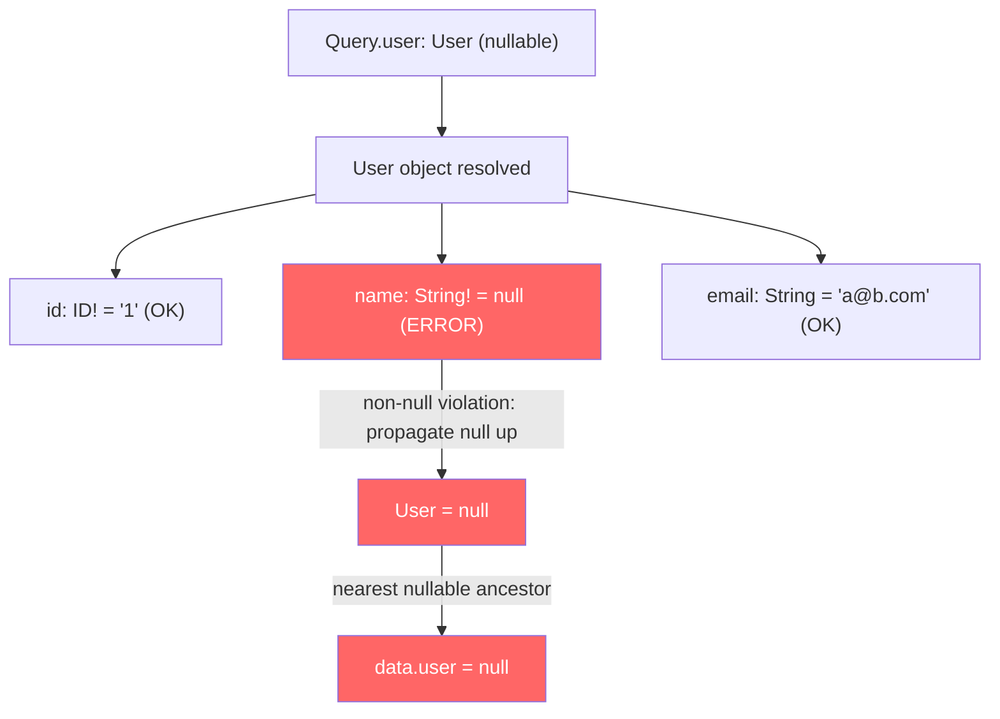
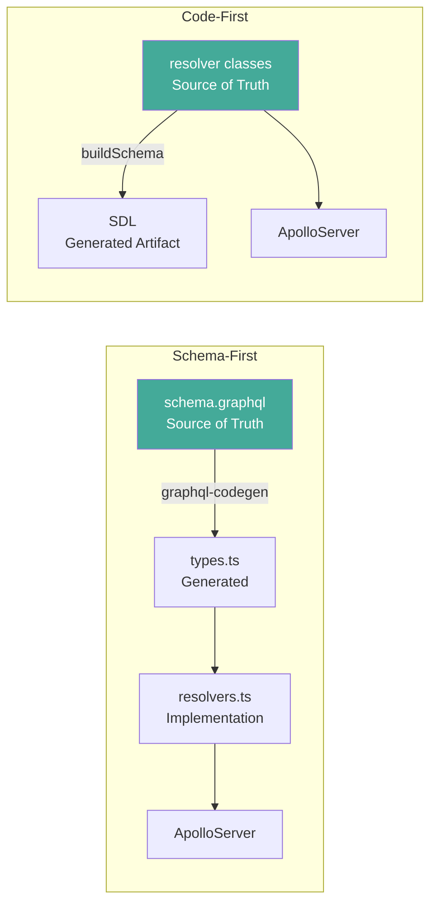

## Keywords in This File
{: .no_toc }

| # | Keyword | Weight |
|---|---|---|
| 25 | [GraphQL Specification Internals and Execution Algorithm](#graphql-specification-internals-and-execution-algorithm) | ★★☆ |
| 26 | [Schema-first vs Code-first Development](#schema-first-vs-code-first-development) | ★★☆ |

---

# GraphQL Specification Internals and Execution Algorithm

---

### 🎯 Model Answer

**30 seconds:**
> The GraphQL specification defines a precise execution algorithm: (1) parse the query
> string to an AST; (2) validate the AST against the schema (type checking, field existence,
> argument coercion); (3) execute by calling resolvers depth-first; (4) coerce results.
> Resolvers are called with `(parent, args, context, info)`. Field resolution is serial
> for mutations (fields in a mutation selection set execute in sequence to maintain
> ordering guarantees) and parallel for query fields at the same level.

**3 minutes (Senior):**
> The spec defines five phases: lexing (tokens), parsing (AST), validation (18 validation
> rules checking field existence, argument types, fragment cycles, etc.), execution, and
> result coercion. Execution is defined recursively: `ExecuteSelectionSet(selectionSet,
> objectType, objectValue, variableValues)` calls each field's resolver, applies field
> selection to the result, and recurses for object types. The key spec guarantee:
> mutations execute fields in serial order - the spec uses the term "execute serially"
> for mutation fields to ensure that `createUser` completes before `sendWelcomeEmail` in
> the same mutation document. The `info` argument passed to resolvers contains the field
> AST, path, schema, fragments, and operation - it is the full execution context.
> Understanding `info` enables advanced resolver patterns: directive inspection,
> lookahead (reading child fields to optimize DB queries), and field path tracing.

**Blank Mind Recovery:**

**(1) Restate:** "GraphQL spec: parse -> validate -> execute. Parse: query string -> AST.
Validate: AST against schema (18 rules). Execute: depth-first resolver calls, parallel
for query fields, serial for mutation fields. Resolvers: `(parent, args, context, info)`.
Info: AST, path, schema. Result coercion: ensures type correctness of returned values."

---

### 📘 Concept Explanation

**The Five Phases of GraphQL Execution:**

```text
GRAPHQL EXECUTION PIPELINE:

Phase 1: LEXING
  "{ user(id: \"1\") { name } }"
           |
       Tokenizer
           |
  [LBRACE, NAME("user"), LPAREN, NAME("id"),
   COLON, STRING("1"), RPAREN, LBRACE,
   NAME("name"), RBRACE, RBRACE]

Phase 2: PARSING
  Tokens -> AST (Document)
           |
  Document {
    definitions: [
      OperationDefinition {
        operation: "query"
        selectionSet: [
          Field {
            name: "user"
            arguments: [{name:"id", value:"1"}]
            selectionSet: [
              Field { name: "name" }
            ]
          }
        ]
      }
    ]
  }

Phase 3: VALIDATION (18 spec rules)
  - Field "user" exists on Query type?     YES
  - Argument "id" of correct type (ID)?    YES
  - Field "name" exists on User type?      YES
  - No fragment cycles?                    YES
  -> VALID

Phase 4: EXECUTION
  ExecuteQuery(document, schema, variableValues):
    For each field in operation:
      Call resolver(parent, args, ctx, info)
      Recurse into sub-selections

Phase 5: RESULT COERCION
  Ensure returned types match schema:
  - Non-null fields: null -> error propagation
  - List fields: wrap scalars in arrays if needed
  - Enum values: coerce to string representations
```

> **Diagram walkthrough:** (1) WHAT IT DEPICTS: the five phases of GraphQL execution from query string to final response - lexing produces tokens, parsing builds an AST, validation checks correctness, execution calls resolvers, and result coercion ensures type safety. (2) HOW TO READ IT: each phase receives the output of the previous phase; the input to Phase 1 is the raw query string; the output of Phase 5 is the JSON response. (3) KEY RELATIONSHIP: validation occurs before execution - this means a query with a type error never reaches the resolver layer; no resolver is called for an invalid query; this is why GraphQL can guarantee type-safe responses. (4) EDGE CASE: the spec allows implementations to skip validation for trusted, pre-validated queries (this is the basis for persisted queries / APQ); production systems skip validation for APQ queries because the query was already validated when registered. (5) INSIGHT: understanding Phase 3 (validation) explains why introspection is a security concern - an attacker can use introspection to learn the schema, then craft valid queries that exploit data access patterns; disabling introspection in production is a security hardening step.

**The Resolver Execution Model:**

```text
RESOLVER CALL SEMANTICS:
  resolver(parent, args, context, info)

  parent: resolved value of the parent field
    - Query fields: parent = rootValue (usually null)
    - User.name: parent = resolved User object
    - User.posts: parent = the User { id, name, ... }

  args: field arguments from the query
    - user(id: "1"): args = { id: "1" }
    - posts(first: 10): args = { first: 10 }

  context: request-scoped shared state
    - Database connection
    - Authenticated user (from JWT)
    - DataLoader instances
    - Logger, feature flags

  info: execution metadata
    - fieldName: "name"
    - fieldNodes: AST nodes for this field
    - returnType: GraphQL type object
    - parentType: GraphQL type object
    - schema: full schema object
    - path: { prev: {prev: null, key: "user"}, key: "name" }
    - rootValue: root object
    - variableValues: { id: "1" }
    - operation: full operation AST

PARALLEL vs SERIAL EXECUTION:
  query GetDashboard {
    user(id: "1") { name }     <- resolves in parallel
    posts(first: 5) { title }  <- resolves in parallel
    notifications { count }    <- resolves in parallel
  }
  # All 3 root fields execute concurrently

  mutation CreateAndNotify {
    createUser(name: "Alice") { id }  <- serial: step 1
    sendWelcomeEmail(userId: "123") { sent } <- step 2
  }
  # Mutation fields execute in document order
```

> **Diagram walkthrough:** (1) WHAT IT DEPICTS: the four resolver parameters (`parent`, `args`, `context`, `info`) with concrete values, and the key distinction between parallel query field execution and serial mutation field execution. (2) HOW TO READ IT: each parameter is shown with its concrete meaning; `parent` is what the parent resolver returned; `context` is shared across all resolvers in the request; `info` is the execution metadata. (3) KEY RELATIONSHIP: `context` is the mechanism for DataLoaders and shared services; it is created once per request and passed to all resolvers; a resolver that creates a DataLoader in context makes it available to all child resolvers without parameter passing. (4) EDGE CASE: the spec says mutations execute fields "serially" but this means top-level mutation fields only; sub-fields of a mutation result execute in parallel like query fields; `mutation { createUser { friends { name } } }` - `friends.name` resolvers execute in parallel. (5) INSIGHT: the `info.fieldNodes` array enables field lookahead - reading which child fields are requested allows a resolver to include them in a single DB query; `info.path` enables distributed tracing by showing the exact field path in the query tree.

---

### 💻 Code Example

```javascript
// BAD: Resolver ignores info - no optimization possible
const resolvers = {
  Query: {
    user: async (_, { id }, { db }) => {
      // Always fetches ALL user fields regardless of query
      return db.query(
        'SELECT * FROM users WHERE id = $1', [id]
      );
      // If client only queries: user(id) { name }
      // We still fetch: email, phone, address, preferences
      // Wasted bytes and DB column reads
    }
  }
};
```

> **Code walkthrough:** (1) WHAT IT SHOWS: a resolver that fetches all columns regardless of which fields the client actually requests - the classic over-fetching problem even within the GraphQL server (the DB query over-fetches even if the client's GraphQL query does not). (2) KEY MECHANISM: `SELECT *` returns all columns; the resolver then returns the full object; GraphQL's field selection trims it at serialization time; but the DB work was already done - index scans, row I/O, network transfer all wasted. (3) WHY IT MATTERS: for a User table with 50 columns (preferences, settings, metadata), `SELECT *` is significantly more expensive than `SELECT id, name` when only two fields are requested. (4) WHAT BREAKS: with `SELECT *`, adding new columns to the users table automatically includes them in all GraphQL responses; if a column contains PII or sensitive data, it may be inadvertently exposed via a less-protected resolver path. (5) TAKEAWAY: `SELECT *` in resolvers is technically correct but sub-optimal; for high-traffic queries, use `info` field lookahead to select only requested columns.

```javascript
// GOOD: Use info for field lookahead optimization
// BAD: SELECT * approach above

const { graphqlFields } = require('graphql-fields');

const resolvers = {
  Query: {
    user: async (_, { id }, { db }, info) => {
      // Read which fields the client requested
      const requestedFields = graphqlFields(info);
      // requestedFields = { name: {}, email: {} }
      // (if client query: { user { name email } })

      // Build SELECT list from requested fields
      const columns = Object.keys(requestedFields)
        .filter(f => ['id','name','email','phone']
          .includes(f))
        .concat('id') // always include id
        .join(', ');
      // columns = "id, name, email"

      const result = await db.query(
        `SELECT ${columns} FROM users WHERE id = $1`,
        [id]
      );
      return result.rows[0];
      // Only fetches what the client needs
    }
  }
};
```

> **Code walkthrough:** (1) WHAT IT SHOWS: using `graphqlFields(info)` to extract the requested field names from the query AST and building a dynamic `SELECT` column list - the resolver only fetches columns the client asked for. (2) KEY MECHANISM: `graphqlFields` traverses `info.fieldNodes` and returns a nested object of requested field names; `Object.keys(requestedFields)` gives the top-level fields; the `filter` validates against allowed columns (prevents SQL injection via `info` manipulation). (3) WHY IT MATTERS: for a table with 50+ columns, selecting 3 instead of all 50 reduces DB I/O by ~85%; at scale (1000+ req/s), this is a significant performance and cost difference. (4) WHAT BREAKS: dynamic column selection requires a whitelist (the `filter`) to prevent info-based SQL injection; if `requestedFields` keys are used directly in the SQL query without validation, an attacker could inject column names that reveal sensitive data or cause SQL errors. (5) TAKEAWAY: always whitelist columns when using dynamic SELECT; `Object.keys(requestedFields).filter(f => ALLOWED_COLUMNS.includes(f))` is the secure pattern; never concatenate raw `info` field names into SQL.

```javascript
// Info: mutation serial execution - spec compliance check
// BAD: assuming mutations execute in parallel
// (incorrect - the spec guarantees serial execution)

// WRONG assumption (common mistake):
mutation {
  deleteOldData { count }
  insertNewData { id }
  # Assuming: these might execute in any order
  # WRONG: spec guarantees deleteOldData executes FIRST
}

// CORRECT understanding:
// The GraphQL spec Section 6.3.1:
// "If the operation is a mutation,
//  the resulting completion value is the result of
//  executing the mutation's top level selection set
//  normally on the mutation root object type,
//  but it MUST be executed serially."

// Server implementation (graphql-js):
// For mutations, executeFields uses Promise.reduce
// instead of Promise.all for top-level fields
async function executeFieldsSerially(
  exeContext, parentType, sourceValue, path, fields
) {
  return fields.reduce(async (prevPromise, [name, nodes]) => {
    const prev = await prevPromise;
    // Execute next field only after previous completes
    const result = await executeField(...);
    return { ...prev, [name]: result };
  }, Promise.resolve({}));
  // Contrast with executeFields (query):
  // Uses: fields.map(field => executeField(...))
  //   + Promise.all() -> all fields in parallel
}
```

> **Code walkthrough:** (1) WHAT IT SHOWS: the spec guarantee that mutation top-level fields execute serially - `deleteOldData` completes before `insertNewData` starts; this is enforced by `graphql-js` using `Promise.reduce` instead of `Promise.all` for mutation fields. (2) KEY MECHANISM: `Promise.reduce` processes fields sequentially (each field awaits the previous before starting); `Promise.all` processes all fields simultaneously; the spec mandates `Promise.reduce` behavior for mutation top-level fields. (3) WHY IT MATTERS: application code can rely on mutation field ordering for transactional sequences (`createUser` then `sendWelcomeEmail`); without this guarantee, `sendWelcomeEmail` might execute before `createUser` finishes. (4) WHAT BREAKS: serial execution of mutation fields increases total mutation latency to the SUM of all field latencies (not the MAX); a mutation with 3 fields each taking 50ms takes 150ms serial vs ~50ms parallel; avoid putting many operations in one mutation document. (5) TAKEAWAY: design mutations to contain one primary operation; rely on serial guarantee only when ordering truly matters; for independent mutation operations, use separate mutation requests (the client sends them sequentially if ordering matters, in parallel if it does not).

---

### 🎓 Answers by Seniority

**Junior / Mid (0-3 years):**
> GraphQL execution has four steps: (1) parse the query string to a syntax tree; (2) validate
> that the query matches the schema (field names exist, argument types are correct); (3)
> execute by calling resolvers for each requested field; (4) serialize the result as JSON.
> Resolvers are functions that receive `(parent, args, context, info)`. Query fields execute
> in parallel; mutation top-level fields execute in serial order (the spec guarantees this
> for transactional sequences like "create then notify").

---

**Senior / Staff (5+ years):**
> Understanding the spec internals enables advanced optimization patterns. The `info` argument
> is the most underused resolver parameter - it contains the full query AST, field path, and
> schema; `info.fieldNodes` enables field lookahead to build optimal DB queries; `info.path`
> enables distributed tracing. The validation phase's 18 rules are important to understand
> because they determine what queries are possible: the "no field conflicts" rule means two
> fields with the same name but different arguments in the same selection set are illegal;
> the "no fragment cycles" rule prevents infinite query expansion. The result coercion phase
> has a subtle but critical behavior: non-null field errors propagate up to the nearest
> nullable parent - if `User.name: String!` returns null, the entire `User` object becomes
> null, not just the `name` field; this is the null propagation rule that requires careful
> schema design (non-null overuse causes cascading nullification).

---

### ⚠️ Common Misconceptions

**Misconception: "GraphQL resolvers always execute in order, like a REST handler."**

GraphQL query resolvers at the same selection level execute in parallel (concurrent
Promises), not in order. Only mutation top-level fields execute serially.

This affects database connection pool planning:
- REST: 1 handler = 1 DB query = 1 connection needed.
- GraphQL: 1 query with 5 root fields = up to 5 simultaneous DB queries =
  5 connections needed.

A dashboard query with 10 parallel resolvers requires 10 concurrent DB connections.
The DataLoader helps with batching within resolver chains but does not reduce the
number of parallel resolver executions at the same level.

---

### 🚨 Failure Modes and Diagnosis

**Failure Mode: Non-null field null propagation causes entire subtree to become null.**

```javascript
// Schema: User.name: String! (non-null)
// Resolver: User.name returns null (bug)

// What happens:
// query { user(id:"1") { name email } }
// User.name resolver returns null
// Spec rule: null is invalid for non-null field
// -> Error added to errors array
// -> null propagated up to User (nearest nullable)
// -> Entire user field = null in response
// -> Even though email resolved correctly!

// Response:
// { "data": { "user": null },
//   "errors": [{ "message": "...", "path": ["user","name"] }] }

// Diagnosis:
// Check errors[].path for non-null violations
// Path ["user", "name"] -> User.name returned null
// Fix: either make name nullable OR ensure it never returns null

// Rule: use non-null (!) conservatively on fields that
// CAN genuinely return null; use nullable for optional fields
```

> **Code walkthrough:** (1) WHAT IT SHOWS: the null propagation cascade - a non-null field (`String!`) returning null causes the parent object to become null, even if all other fields resolved correctly; this is the spec's null propagation rule. (2) KEY MECHANISM: the spec says "if a non-null field returns null, the error propagates to the nearest nullable ancestor"; `User.name: String!` -> `user: User` is nullable by default; the null propagates from `name` to `user`, nullifying the whole user object in the response. (3) WHY IT MATTERS: this behavior surprises teams who use `!` freely for "expected non-null" fields; a temporary data issue (null name for a migrated user) causes the entire user query to return null; clients that do not check `data.errors` think the user does not exist. (4) WHAT BREAKS: `User!` (non-null User) causes propagation all the way to the Query root if `name` is null; `{ data: null }` with an error - the entire query returns null; non-null at the root level is especially dangerous. (5) TAKEAWAY: the rule for non-null in schema design: use `!` for fields that are structurally guaranteed by the data model (primary key `id`, type discriminators); use nullable for fields that may be absent in business logic; never use `!` on optional or new fields just because they "should" always have a value.

---

### ⚖️ Comparison Table

| Phase | Spec Location | Key Rules | Skip in Production? |
|---|---|---|---|
| Lexing | Section 2 | Token grammar | Never |
| Parsing | Section 2.2 | AST structure | Never |
| Validation | Section 5 | 18 validation rules | Yes (APQ) |
| Execution | Section 6 | Resolver calling, serial mutations | Never |
| Result coercion | Section 6.4 | Non-null propagation, list coercion | Never |

---

### 🏛️ System Design

*(Omit: this keyword covers specification theory rather than a distributed system design. The execution algorithm is intrinsic to GraphQL server implementation, not a system topology problem.)*

---

### 📊 Diagram

The null propagation behavior is the most practically important spec mechanism to visualize:

```text
NULL PROPAGATION TREE:

Schema:
  type Query {
    user(id: ID!): User        # nullable
  }
  type User {
    id: ID!                    # non-null
    name: String!              # non-null
    email: String              # nullable
    profile: Profile           # nullable
  }

Execution: User.name resolver returns null

  Query.user -> resolves User { id:"1", name:null, email:"a@b.com" }
    |
    +-- id: "1" -> "1" OK (non-null, has value)
    |
    +-- name: null -> ERROR (String! cannot be null)
            |
            null propagates UP to User (nearest nullable)
            User becomes null
            |
            query.user = null
            errors = [{ path: ["user","name"], message: ... }]

Response:
  { "data": { "user": null },
    "errors": [{ "path": ["user","name"],
                 "message": "Cannot return null for
                  non-nullable field User.name." }] }
```



> **Diagram walkthrough:** (1) WHAT IT DEPICTS: the null propagation cascade where a non-null field (`name: String!`) returning null causes the entire parent User object to become null, even though `id` and `email` resolved correctly. (2) HOW TO READ IT: the tree shows resolver results for each field; `name` returns null (highlighted in red); the "non-null violation" arrow shows propagation up to `User`; `User` becomes null; `data.user` returns null. (3) KEY RELATIONSHIP: the propagation stops at the nearest nullable ancestor; `User` is nullable (no `!` on `user: User` in the Query type); if it were `user: User!`, propagation would continue to `Query`, returning `{ "data": null }`. (4) EDGE CASE: if `email` has a side effect (e.g., logging access) and `name` fails, `email` may have already resolved before the null propagation occurs; the spec does not define rollback semantics for successful sibling fields. (5) INSIGHT: this diagram explains why schema designers should use `!` conservatively; a `String!` field on a type that is itself non-null creates a propagation chain that can null the entire response; "non-null all the way down" is a dangerous design pattern.

---

### 🎯 Interview Deep-Dive

| Category | Count | Coverage |
|---|---|---|
| Definition | 2 | execution phases, resolver parameters |
| Application | 2 | info lookahead, null propagation |
| Architecture | 2 | validation rules, mutation serial |
| Trade-off | 2 | non-null design, validation skip |
| Debugging | 1 | null propagation diagnosis |

---

**[JUNIOR] Q1 (Definition): What are the four parameters of a GraphQL resolver?**

`resolver(parent, args, context, info)`

`parent` (also called `root` or `obj`): the resolved value of the parent field.
- For root Query fields: `null` or the `rootValue` passed to the executor.
- For `User.name`: `parent` = the `User` object returned by the `user` resolver.
- Pattern: parent holds the data the resolver "belongs to."

`args`: the field arguments from the query as a plain object.
- `user(id: "1")`: `args = { id: "1" }`.
- `posts(first: 10, after: "cursor")`: `args = { first: 10, after: "cursor" }`.
- Args are validated and coerced to the correct types before being passed.

`context`: a shared object created once per request, passed to all resolvers.
- Contains: DataLoader instances, authenticated user, database connection, logger.
- Pattern: any data that should be shared across multiple resolvers in one request.

`info`: execution metadata - the "fourth parameter" most developers ignore.
- `info.fieldName`: the field name being resolved.
- `info.fieldNodes`: the AST nodes for this field (enables argument parsing, directive reading).
- `info.schema`: the full schema object.
- `info.path`: the path from root to this field (for tracing and error messages).
- `info.returnType`: the GraphQL type this resolver should return.

*What separates good from great:* recognizing that `context` is per-request (not global)
for a reason. A DataLoader created in context is reset for each request; a global DataLoader
would cache data across requests, leaking User A's data to User B. The context creation
function in ApolloServer is called once per HTTP request, providing a clean slate for
DataLoaders and request-scoped state.

---

**[SENIOR] Q2 (Architecture): How does the GraphQL specification define the validation phase?**

The spec defines validation in Section 5 with 18 rules organized into categories:

1. Document rules: an executable document must have at least one operation.
2. Operations: operation names must be unique; anonymous operations must be alone.
3. Fields: field selections must exist on the type being queried; field selection
   merging (no field conflicts); leaf field selections (scalars must not have sub-selections).
4. Arguments: argument names must match the field's defined arguments; argument
   uniqueness (no duplicate arg names); required argument presence.
5. Fragments: fragment name uniqueness; fragment type applicability (the type a
   fragment spreads on must be a valid supertype); no fragment cycles (prevents infinite expansion).
6. Values: value type coercion (literal values must match the expected input type).
7. Directives: directive existence on the declared location; directive uniqueness.
8. Variables: variable uniqueness; variable usage matches the expected type;
   all variables used; all used variables defined.

The practical implication: validation is the primary mechanism for guaranteed type
safety in GraphQL. A query that passes validation is guaranteed to:
- Reference only existing fields.
- Provide arguments of the correct types.
- Not expand infinitely via fragment cycles.
- Return a predictable response shape.

This is why GraphQL can guarantee the response shape matches the query - invalid
queries are rejected before any resolver executes.

*What separates good from great:* understanding that validation can be skipped for
trusted queries (APQ/persisted queries). The validation phase is CPU-intensive
(O(n) in query depth and field count); at high request rates (10,000+ RPS), validation
CPU can be significant. Persisted queries pre-validate at registration time; the
production request skips validation entirely. This is why APQ is both a security feature
(whitelist) and a performance feature (no runtime validation cost).

---

**[SENIOR] Q3 (Application): How does field lookahead using `info` optimize resolver performance?**

Field lookahead reads the requested child fields from `info.fieldNodes` to build
more efficient database queries:

```javascript
// Without lookahead: always fetch all columns
// BAD: always SELECT * regardless of requested fields
const resolvers = {
  Query: {
    users: async (_, { first }, { db }) => {
      return db.query(
        'SELECT * FROM users LIMIT $1', [first]
      );
      // Fetches 50 columns when client may request 2
    }
  }
};
```

> **Code walkthrough:** (1) WHAT IT SHOWS: the standard resolver pattern that always fetches all columns from the database regardless of which fields the client actually requests. (2) KEY MECHANISM: `SELECT *` returns every column; GraphQL field selection trims the response at serialization, but the unnecessary data is already in memory and was transferred from the DB. (3) WHY IT MATTERS: for tables with many columns (audit fields, preferences, metadata), `SELECT *` reads and transfers significantly more data than needed; at scale, this costs real compute and network bandwidth. (4) WHAT BREAKS: if a new sensitive column is added to the users table, `SELECT *` automatically includes it in all responses; a less-protected resolver path may expose it. (5) TAKEAWAY: `SELECT *` is acceptable for small tables or low-traffic resolvers; for high-traffic resolvers on wide tables, use field lookahead to select only requested columns.

```javascript
// GOOD: Field lookahead with info
// BAD: SELECT * approach above
const resolvers = {
  Query: {
    users: async (_, { first }, { db }, info) => {
      // Parse requested fields from AST
      const fields = getRequestedFields(info);
      // fields = Set { 'id', 'name', 'email' }
      // (from query: users { id name email })

      const safeColumns = [...fields]
        .filter(f => USERS_ALLOWED_COLUMNS.has(f))
        .join(', ') || 'id'; // fallback to id

      return db.query(
        `SELECT ${safeColumns} FROM users LIMIT $1`,
        [first]
      );
    }
  }
};

const USERS_ALLOWED_COLUMNS = new Set([
  'id', 'name', 'email', 'phone',
  'created_at', 'updated_at'
]);

// Helper: extract field names from info AST
function getRequestedFields(info) {
  const fields = new Set(['id']); // always include id
  const selections = info.fieldNodes[0]?.selectionSet
    ?.selections || [];
  selections.forEach(sel => {
    if (sel.kind === 'Field') {
      fields.add(sel.name.value);
    }
  });
  return fields;
}
```

> **Code walkthrough:** (1) WHAT IT SHOWS: `info.fieldNodes[0].selectionSet.selections` - the AST nodes for child field selections; the resolver extracts field names from the AST and builds a dynamic SQL SELECT list, including only columns that the client requested. (2) KEY MECHANISM: `info.fieldNodes` is an array of AST `FieldNode` objects for this field; `fieldNodes[0].selectionSet.selections` contains child `FieldNode` items; `sel.name.value` extracts the field name string; the whitelist (`USERS_ALLOWED_COLUMNS`) prevents injection. (3) WHY IT MATTERS: for a users table with 50 columns queried 1000 times/second, selecting 3 vs 50 columns can reduce DB I/O by 90%+; this directly reduces DB CPU and network load. (4) WHAT BREAKS: this pattern does not handle inline fragments or spread fragments in the selection; `query { users { ... on User { name } } }` requires fragment resolution for the field list; use a library like `graphql-fields` for robust handling. (5) TAKEAWAY: implement field lookahead for the 3-5 highest-traffic resolvers that query wide tables; use `graphql-fields` library for simplicity; always whitelist column names before including in SQL.

---

**[JUNIOR] Q4 (Definition): What is the difference between serial and parallel resolver execution?**

Query fields at the same level: PARALLEL.
Mutation top-level fields: SERIAL.
Sub-fields of any type: PARALLEL within the same parent.

```text
PARALLEL (query): user, posts, config all execute concurrently
  query { user { name } posts { title } config { theme } }
  Total time = max(user_time, posts_time, config_time)

SERIAL (mutation top-level):
  mutation { createUser { id } sendWelcomeEmail { sent } }
  createUser runs FIRST, then sendWelcomeEmail
  Total time = time(createUser) + time(sendWelcomeEmail)

PARALLEL (mutation sub-fields):
  mutation { createUser { id name email } }
  After createUser resolves: id, name, email resolve in parallel
```

> **Code walkthrough:** (1) WHAT IT SHOWS: the three execution patterns in GraphQL - parallel query fields, serial mutation top-level fields, and parallel mutation sub-fields - and the latency model for each. (2) KEY MECHANISM: parallel fields use `Promise.all` (all start simultaneously, total time = slowest); serial mutation fields use `Promise.reduce` (each awaits the previous, total time = sum); the spec mandates serial for mutation top-level fields to guarantee ordering for transactional sequences. (3) WHY IT MATTERS: mutation serial execution means a mutation with 5 independent operations takes 5x longer than if they ran in parallel; for non-dependent operations, use separate mutation requests and parallelize at the client. (4) EDGE CASE: serial guarantee applies only to top-level mutation fields; `mutation { createUser { name email address } }` - the `name`, `email`, `address` sub-fields execute in parallel even in a mutation. (5) TAKEAWAY: design mutations with one primary operation per document when performance matters; rely on serial execution only when true ordering is required.

Why serial for mutations? The spec guarantees mutation field ordering for
transactional sequences: "delete then insert", "create user then assign role",
"charge card then create order". Without serial execution, race conditions in
dependent mutations could corrupt state.

*What separates good from great:* understanding the performance implication of mutation
serialism. If a mutation document has 5 fields each taking 50ms, the total time is 250ms
(serial) vs 50ms (parallel). For mutations with independent operations, use separate
mutation requests from the client and let the client parallelize them; group mutations
in one document only when ordering is required.

---

**[SENIOR] Q5 (Architecture): What are the 18 GraphQL validation rules and why do they matter?**

The 18 validation rules are defined in the spec Section 5:

Core field rules:
- `FieldsInSetCanMerge`: two fields with the same response key must be compatible
  (same type, same arguments); this prevents ambiguous responses.
- `LeafFieldSelections`: scalar and enum fields cannot have sub-selections;
  object types must have sub-selections.
- `FieldSelectionsOnObjectInterfaceAndUnionTypes`: a field must exist on the type
  being queried.

Fragment rules:
- `FragmentNameUniqueness`: each fragment name is unique in the document.
- `FragmentSpreadTypeExistence`: the spread target type must exist in the schema.
- `FragmentsOnCompositeTypes`: fragments can only be on object, interface, or union types.
- `NoUnusedFragments`: every defined fragment must be used.
- `FragmentSpreadsMustNotFormCycles`: fragment cycles are prohibited (prevents infinite expansion).

Variable rules:
- `VariableUniqueness`: variable names are unique per operation.
- `VariablesAreInputTypes`: variables must be input types (not output types).
- `AllVariableUsageAllowed`: variable types must be compatible with argument types.
- `AllVariableUsesDefined`: referenced variables must be declared.
- `AllVariablesDefined` / `AllVariablesUsed`: no unused variables.

Why they matter in production:
1. Security: `FragmentSpreadsMustNotFormCycles` prevents an attacker from sending a
   cyclically-expanded fragment that exponentially grows the query AST; without this,
   a cycle of depth N creates 2^N-node expansion.
2. Type safety: `FieldsInSetCanMerge` ensures the response shape is predictable even
   when aliases and fragments are combined.
3. Performance: validation is O(n) in query complexity; at high RPS (5,000+), validation
   CPU can be a bottleneck; APQ pre-validates to skip it.

*What separates good from great:* explaining that validation rules are why GraphQL can
guarantee the response shape. REST APIs return whatever the handler returns; GraphQL
responses are guaranteed to match the query selection set (if validation passes and no
null propagation occurs); this guarantee is the foundation for strong typing on the client.

---

**[SENIOR] Q6 (Trade-off): When is it safe to skip GraphQL validation for performance?**

Validation can be skipped for pre-validated, trusted queries:

Safe to skip:
- Persisted queries registered via APQ or a query registry: these were validated at
  registration time; the server-side registry stores only valid queries.
- Internal service-to-service calls where the caller is trusted and the query is
  compiled from the schema at build time.

Unsafe to skip:
- Any query from an untrusted client (user browsers, mobile apps, third-party).
- Any dynamic query constructed at runtime.
- Any endpoint with public access.

Implementation: Apollo Server skips validation for APQ hits:
```javascript
// Apollo Server: validation is skipped when
// the query matches a persisted query hash
// (the hash lookup confirms the query was pre-validated)
// Config: no action needed - APQ automatically skips validation
// for registered query hashes
```

> **Code walkthrough:** (1) WHAT IT SHOWS: the design of Apollo's APQ - registered queries are pre-validated; subsequent requests with matching hashes skip validation entirely; this reduces per-request CPU by 15-30% for high-traffic APIs. (2) KEY MECHANISM: when a client sends `{ "extensions": { "persistedQuery": { "sha256Hash": "abc..." } } }`, the server looks up the hash in its registry; if found, the stored query is executed without re-validation; if not found, the full query is received, validated, registered, and executed. (3) WHY IT MATTERS: at 10,000 RPS, removing validation per request saves significant CPU; combined with the security benefit (only registered queries execute), APQ is the recommended production configuration. (4) WHAT BREAKS: if a registered query contains a security-sensitive operation and the APQ registry is compromised (attacker can register malicious queries), skipping validation removes the last line of defense; protect the APQ registration endpoint with authentication. (5) TAKEAWAY: APQ = performance (skip validation) + security (query whitelist); use it in production for all high-traffic GraphQL APIs; require authentication to register new queries in the APQ registry.

---

**[SENIOR] Q7 (Trade-off): How does result coercion affect schema design decisions?**

Result coercion happens in Section 6.4 of the spec. Key coercion behaviors:

1. Non-null coercion: if a `String!` field returns null, an error is added and null
   propagates to the nearest nullable ancestor.

2. Int coercion: `Int` type is 32-bit signed integer (-2^31 to 2^31-1); if a resolver
   returns a JavaScript number > 2^31-1 (e.g., a 64-bit ID or Unix timestamp in
   milliseconds), coercion returns null and an error; use `Float` or a custom `BigInt`
   scalar for large numbers.

3. List coercion: if a `[String]` field returns a non-array value, GraphQL wraps it
   in an array (coerces a single item to a list); this is rarely surprising but can
   hide resolver bugs.

Schema design implications:

```graphql
# BAD: non-null overuse - risk of cascading null propagation
type User {
  id: ID!
  name: String!         # if null: cascades to User = null
  email: String!        # if null: cascades to User = null
  preferences: Prefs!   # if null: cascades to User = null
  address: Address!     # if null: cascades to User = null
}

# GOOD: non-null only for structurally guaranteed fields
# BAD: excessive ! above
type User {
  id: ID!               # Primary key: guaranteed non-null
  name: String!         # Required for new accounts: non-null
  email: String         # Optional: nullable
  preferences: Prefs    # Optional until configured: nullable
  address: Address      # Optional: nullable
}
```

> **Code walkthrough:** (1) WHAT IT SHOWS: the contrast between over-using `!` (non-null) on all User fields vs using it selectively on fields that are structurally guaranteed to be non-null - `id` (primary key) and `name` (required for new accounts). (2) KEY MECHANISM: the non-null modifier (`!`) is a schema promise that the field will never be null; breaking this promise (returning null) triggers the propagation cascade; the "bad" pattern makes every field a potential cascade trigger. (3) WHY IT MATTERS: a data migration that temporarily nullifies `preferences` for legacy users causes ALL users to return null in the response (null propagation through `preferences!`); the "good" pattern makes `preferences` nullable and contains the damage to just that field. (4) WHAT BREAKS: changing `String!` to `String` in an existing schema is a breaking change if clients have non-null assertions (`user.name!` in TypeScript); clients must handle the new nullable case; plan schema changes to nullable carefully. (5) TAKEAWAY: use `!` on primary keys, entity identifiers, and fields that are genuinely required by the data model; use nullable (`String`) for all fields that may be absent in any business scenario (optional data, phased rollouts, migrated records).

---

**[SENIOR] Q8 (Architecture): How do custom scalars work in the spec and how do you implement them?**

Custom scalars define serialization, parsing, and literal coercion for non-standard types:

```javascript
// BAD: Using String for structured data
// type User { email: String } -> no format validation

// GOOD: Custom scalar with validation
// BAD: plain String above
const { GraphQLScalarType, Kind } = require('graphql');

const DateTimeScalar = new GraphQLScalarType({
  name: 'DateTime',
  description: 'ISO 8601 date-time string',

  // Serialize: called when sending field value to client
  // (resolver returns JS Date -> client gets ISO string)
  serialize(value) {
    if (value instanceof Date) {
      return value.toISOString();
    }
    if (typeof value === 'string') {
      return new Date(value).toISOString();
    }
    throw new Error('DateTime must be Date or string');
  },

  // ParseValue: called for variable inputs
  // (client sends variable: { date: "2024-01-15" })
  parseValue(value) {
    if (typeof value !== 'string') {
      throw new Error('DateTime variable must be string');
    }
    const date = new Date(value);
    if (isNaN(date.getTime())) {
      throw new Error(`Invalid DateTime: ${value}`);
    }
    return date;
  },

  // ParseLiteral: called for inline literal values
  // (client sends: mutation { createPost(date: "2024") })
  parseLiteral(ast) {
    if (ast.kind !== Kind.STRING) {
      throw new Error('DateTime literal must be string');
    }
    return new Date(ast.value);
  }
});
```

> **Code walkthrough:** (1) WHAT IT SHOWS: a `DateTime` custom scalar with three required methods - `serialize` (outbound: resolver value -> client JSON), `parseValue` (inbound variables: client variable -> resolver value), `parseLiteral` (inbound literals: AST node -> resolver value). (2) KEY MECHANISM: the spec requires all three methods for a complete scalar implementation; `serialize` and `parseValue` are the critical paths; `parseLiteral` handles the less common case of inline literal values in queries. (3) WHY IT MATTERS: custom scalars add type safety and validation for domain-specific formats (email, URL, UUID, DateTime, JSON); a plain `String` for email allows `"not-an-email"` to pass validation; a custom `Email` scalar can reject invalid formats at the validation layer. (4) WHAT BREAKS: if `serialize` throws for any resolver return value, the field returns null in the response with an error; ensure `serialize` handles all possible return types from resolvers (Date objects, ISO strings, timestamps). (5) TAKEAWAY: implement custom scalars for: dates/times (`DateTime`), identifiers (`ID` is built-in but domain-specific IDs may need custom types), validated strings (`Email`, `URL`), and JSON blobs (`JSON` scalar); use the `graphql-scalars` library for common scalar implementations (DateTime, Email, URL, UUID, JSON).

---

**[SENIOR] Q9 (Debugging): How do you debug GraphQL execution using the info parameter?**

The `info` parameter enables execution tracing and debugging without external tools:

```javascript
// Debug resolver: log execution path and timing
const debugResolver = (resolver, name) => async (
  parent, args, context, info
) => {
  const start = Date.now();
  const path = [];
  let cur = info.path;
  while (cur) {
    path.unshift(cur.key);
    cur = cur.prev;
  }
  // path = ["user", "posts", "0", "author", "name"]
  // Shows exact location in execution tree

  try {
    const result = await resolver(parent, args, context, info);
    const duration = Date.now() - start;
    if (duration > 100) {
      context.logger.warn('Slow resolver', {
        field: name,
        path: path.join('.'),
        durationMs: duration
      });
    }
    return result;
  } catch (error) {
    context.logger.error('Resolver error', {
      field: name, path: path.join('.'),
      error: error.message
    });
    throw error;
  }
};

// Apply to all resolvers:
const tracedResolvers = Object.fromEntries(
  Object.entries(resolvers).map(([type, fields]) => [
    type,
    Object.fromEntries(
      Object.entries(fields).map(([field, fn]) => [
        field, debugResolver(fn, `${type}.${field}`)
      ])
    )
  ])
);
```

> **Code walkthrough:** (1) WHAT IT SHOWS: a resolver wrapper that uses `info.path` to construct the full field path (e.g., `user.posts.0.author.name`) and logs slow resolvers (>100ms) with their exact location in the execution tree. (2) KEY MECHANISM: `info.path` is a linked list: `{ key: "name", prev: { key: "author", prev: { key: "0", prev: { key: "posts", prev: { key: "user", prev: null } } } } }`; the while loop unwinds it into an array. (3) WHY IT MATTERS: without field-path logging, a slow resolver is identified by field name only; with path logging, "author.name slow" tells you it is the author name inside posts, not the top-level user name - critical for N+1 diagnosis in deep query trees. (4) WHAT BREAKS: the debug wrapper adds overhead (Date.now calls, array construction) for every resolver call; in production, apply it selectively to suspected slow resolvers rather than all resolvers. (5) TAKEAWAY: `info.path` is the most useful `info` property for debugging; build a resolver tracing wrapper during development; deploy a sampling version (10% of requests) in production for ongoing performance monitoring.

---

---

# Schema-first vs Code-first Development

---

### 🎯 Model Answer

**30 seconds:**
> Schema-first: write the SDL (`.graphql` file) first; the schema is the source of truth;
> resolvers are implemented to match it. Code-first: write resolver code with decorators
> or builder functions; the SDL is generated from the code. Schema-first promotes API
> design clarity and frontend-backend contract separation. Code-first reduces context
> switching in typed languages (TypeScript, Java) and enables schema derivation from
> existing type systems.

**3 minutes (Senior):**
> Schema-first is the GraphQL community default: design the API shape in SDL, review it
> with frontend teams, then implement resolvers. Benefits: SDL is readable by non-engineers;
> mocking (Apollo Mocks, MSW) can start before resolvers exist; schema changes are visible
> in Git diffs. Drawbacks: SDL drift (schema and resolver types can diverge without
> code-gen); type safety requires code generation (`graphql-codegen` generating TypeScript
> interfaces from SDL). Code-first approaches (TypeGraphQL, Pothos/GiraphQL, Nexus,
> strawberry for Python) generate SDL from annotated resolver classes; benefits: single
> source of truth (types defined once); no SDL drift; TypeScript types are the schema.
> Drawbacks: the SDL is a generated artifact, harder to review; complex SDL features
> (custom directives, federation annotations) may require plugin support. Production
> recommendation: schema-first for public/cross-team APIs (SDL is the contract); code-first
> for internal services with strong type system usage.

**Blank Mind Recovery:**

**(1) Restate:** "Schema-first: SDL is source of truth -> resolvers implement it.
Code-first: resolver code is source of truth -> SDL is generated. Schema-first: readable
contract, frontend can mock early, SDL in Git. Code-first: no SDL drift, TypeScript types
are the schema, less context switching. Both valid; schema-first for public/cross-team,
code-first for internal services."

---

### 📘 Concept Explanation

**Schema-first Workflow:**

```text
SCHEMA-FIRST APPROACH:

Step 1: Write SDL (users.graphql)
  type User {
    id: ID!
    name: String!
    posts: [Post!]!
  }
  type Query { user(id: ID!): User }

Step 2: Generate types from SDL
  npx graphql-codegen --config codegen.yml
  -> Generated: types.ts
     type User = { id: string; name: string; ... }
     type QueryResolvers = { user: (args) => User }

Step 3: Implement resolvers using generated types
  import { QueryResolvers } from './types.ts';
  const resolvers: QueryResolvers = {
    Query: { user: (_, {id}) => db.findUser(id) }
  };
  # TypeScript ensures resolver returns correct type

Step 4: Register resolvers with ApolloServer
  const server = new ApolloServer({
    typeDefs: loadSchemaSync('users.graphql'),
    resolvers
  });

ADVANTAGES:
  - SDL is readable by product managers / frontend
  - Frontend team can mock the SDL before resolvers exist
  - Schema changes are clear Git diffs in .graphql files
  - schema.graphql is the API contract document

DISADVANTAGES:
  - Requires code-gen to get TypeScript types
  - SDL and resolver types can drift without strict tooling
  - Context switching: edit .graphql then .ts files
```

> **Diagram walkthrough:** (1) WHAT IT DEPICTS: the four-step schema-first workflow - SDL written first, types generated via codegen, resolvers implemented using generated types, server registered. (2) HOW TO READ IT: the arrows show the direction of truth; SDL -> generated types -> resolver implementation -> server; the SDL is the starting point and the source of truth. (3) KEY RELATIONSHIP: `graphql-codegen` is the bridge between the SDL (schema truth) and TypeScript (implementation); without it, schema and resolvers diverge silently; with it, a schema change immediately generates new TypeScript types that break resolver implementations if they are not updated. (4) EDGE CASE: if `graphql-codegen` is not run after a schema change (e.g., new field added to SDL), the resolver TypeScript types are stale; the server runs with the new SDL but the resolver type does not enforce the new field; the new field may return undefined without a type error. (5) INSIGHT: the `Schema-first` approach separates API design from implementation; frontend and backend teams can work in parallel (frontend mocks the SDL, backend implements resolvers); this is the key organizational benefit.

**Code-first Workflow (TypeGraphQL example):**

```text
CODE-FIRST APPROACH (TypeGraphQL):

Step 1: Annotate classes with decorators
  @ObjectType()
  class User {
    @Field(() => ID) id: string;
    @Field()          name: string;
    @Field(() => [Post]) posts: Post[];
  }

  @Resolver(User)
  class UserResolver {
    @Query(() => User, { nullable: true })
    user(@Arg('id') id: string) {
      return db.findUser(id);
    }
  }

Step 2: Build schema from annotated classes
  const schema = await buildSchema({
    resolvers: [UserResolver]
  });
  // SDL is generated from class annotations:
  // type User { id: ID! name: String! posts: [Post!]! }
  // type Query { user(id: String!): User }

Step 3: Register with ApolloServer
  const server = new ApolloServer({ schema });

ADVANTAGES:
  - Single source of truth (TypeScript classes)
  - No SDL drift (SDL generated from code)
  - TypeScript compiler enforces correct return types
  - No separate codegen step in CI

DISADVANTAGES:
  - SDL is a generated artifact (harder to review)
  - Complex directives require library plugin support
  - Non-TS teams cannot contribute to schema design
  - Learning curve for decorator-heavy style
```

> **Diagram walkthrough:** (1) WHAT IT DEPICTS: the three-step code-first workflow - annotated TypeScript classes are the source of truth; `buildSchema` generates SDL from them; the server uses the generated schema. (2) HOW TO READ IT: the classes define the schema; the arrows go from TypeScript classes -> generated SDL -> server; the direction of truth is opposite to schema-first. (3) KEY RELATIONSHIP: in code-first, TypeScript types ARE the GraphQL schema; adding `@Field() email: string` to the `User` class automatically adds `email: String!` to the generated SDL; no separate SDL editing step. (4) EDGE CASE: TypeGraphQL's decorator metadata (Reflect metadata) requires `"experimentalDecorators": true` and `"emitDecoratorMetadata": true` in `tsconfig.json`; missing these flags causes silent failures where field types are inferred as `Object` instead of `String`. (5) INSIGHT: code-first is better suited for backends-for-frontends (BFF) where the GraphQL schema is derived from existing TypeScript types; schema-first is better for public APIs where the SDL is shared with consumers who do not use TypeScript.

---

### 💻 Code Example

```graphql
# SCHEMA-FIRST: SDL is the source of truth
# BAD: Writing resolvers without an SDL (no schema design)

# File: schema.graphql - reviewed by ALL teams
type Query {
  product(id: ID!): Product
  products(
    category: String
    first: Int = 20
    after: String
  ): ProductConnection!
}

type Product {
  id: ID!
  name: String!
  price: Float!
  description: String
  category: Category!
  inStock: Boolean!
}

type ProductConnection {
  edges: [ProductEdge!]!
  pageInfo: PageInfo!
  totalCount: Int!
}

# SDL is shared with frontend team before any code is written
# Frontend mocks using this SDL (MockServiceWorker / Apollo Mocks)
# Backend implements resolvers to match this contract
```

> **Code walkthrough:** (1) WHAT IT SHOWS: a schema-first SDL for a Product API - the schema is written as a standalone `.graphql` file before any resolver code; the SDL defines the complete API contract (types, queries, pagination). (2) KEY MECHANISM: this file is shared with frontend teams who use it to set up mock servers (MSW, Apollo's `MockedProvider`); frontend development proceeds in parallel with backend resolver implementation; the SDL is the coordination artifact. (3) WHY IT MATTERS: the schema review phase (before any code) catches design issues that are expensive to fix later; "ProductConnection uses Relay-style pagination" is a design decision visible in the SDL; catching it at design time is free; changing it after clients adopt it is a breaking change. (4) WHAT BREAKS: if the SDL is modified without updating resolvers (adding `inStock: Boolean!` but not implementing the resolver), the field returns undefined/null silently; `graphql-codegen` running in CI catches this by generating `QueryResolvers` with `inStock` as required; the TypeScript error surfaces the missing resolver. (5) TAKEAWAY: in schema-first, always run `graphql-codegen` in CI; a codegen failure means schema and resolvers are out of sync; treat codegen output as required (check it into version control or fail CI when it changes unexpectedly).

```typescript
// CODE-FIRST: TypeScript classes define the schema
// BAD: no type annotations - SDL cannot be derived safely

// GOOD: TypeGraphQL with full type safety
// BAD: unannotated classes above
import {
  ObjectType, Field, ID, Resolver,
  Query, Arg, Int, Float
} from 'type-graphql';

@ObjectType()
class Product {
  @Field(() => ID)
  id: string;

  @Field()            // String! inferred from type
  name: string;

  @Field(() => Float) // explicit for Float
  price: number;

  @Field({ nullable: true })  // String? (nullable)
  description?: string;

  @Field()
  inStock: boolean;
}

@Resolver(Product)
class ProductResolver {
  // Returns Product | null (spec: nullable field)
  @Query(() => Product, { nullable: true })
  async product(@Arg('id', () => ID) id: string) {
    return db.findProduct(id);
    // TypeScript knows return type is Product | null
    // GraphQL schema: product(id: ID!): Product
  }

  @Query(() => [Product])
  async products(
    @Arg('category', { nullable: true }) category?: string,
    @Arg('first', () => Int, { defaultValue: 20 }) first = 20
  ) {
    return db.findProducts({ category, limit: first });
    // Schema: products(category: String, first: Int = 20): [Product!]!
  }
}

// Generated SDL (buildSchema output):
// type Product { id: ID! name: String! price: Float! ... }
// type Query { product(id: ID!): Product products(...): [Product!]! }
```

> **Code walkthrough:** (1) WHAT IT SHOWS: TypeGraphQL code-first schema definition - `@ObjectType()`, `@Field()`, `@Resolver()`, `@Query()`, `@Arg()` decorators annotate TypeScript classes to generate the SDL; the resolver's TypeScript return type and the generated GraphQL type are always in sync. (2) KEY MECHANISM: TypeGraphQL reads TypeScript type metadata at runtime (via `reflect-metadata`) to infer field types; `name: string` becomes `name: String!`; `description?: string` becomes `description: String` (nullable); explicit `@Field(() => Float)` is needed where TypeScript types are ambiguous (number = Int or Float). (3) WHY IT MATTERS: the TypeScript compiler enforces that the resolver returns `Product | null` when `{ nullable: true }` is set; a resolver returning an incompatible type causes a TypeScript compile error; SDL and resolver are always consistent. (4) WHAT BREAKS: TypeGraphQL's type inference from TypeScript requires `emitDecoratorMetadata: true` in `tsconfig.json`; without it, primitive types (string, number, boolean) are inferred as `Object` and the SDL generation produces incorrect types. (5) TAKEAWAY: code-first eliminates SDL drift by making TypeScript types the single source of truth; the SDL is a build artifact; the trade-off is that the SDL is not human-authored and may be harder to review for API design quality.

---

### 🎓 Answers by Seniority

**Junior / Mid (0-3 years):**
> Schema-first means writing the `.graphql` SDL file first, then implementing resolvers
> to match it. Code-first means writing TypeScript classes or resolver code with annotations,
> and the SDL is generated automatically. Schema-first is good when you want the API
> contract to be reviewed before implementation; code-first is good when you want
> TypeScript types to be the single source of truth. Both work well; the choice depends
> on team preference and tooling setup.

---

**Senior / Staff (5+ years):**
> The choice between schema-first and code-first is an organizational and tooling decision,
> not a correctness decision. Schema-first with `graphql-codegen` is the recommended approach
> for APIs that cross team boundaries (frontend and backend teams in separate repos); the SDL
> is the contract reviewed in PRs; frontend teams can mock before backend is implemented.
> Code-first is better for backend microservices written entirely in TypeScript where the
> GraphQL schema is derived from existing domain models; TypeGraphQL, Pothos, or Nexus
> generate the SDL as an artifact; the TypeScript type system enforces schema-resolver
> consistency without a separate codegen step. The risk of code-first in public APIs:
> the SDL quality is determined by code annotations, not explicit API design; "make the
> test pass" developer pressure leads to adding `@Field()` haphazardly; schema design
> discipline requires explicit SDL review. The risk of schema-first: SDL drift without
> codegen in CI; a field in the SDL with no resolver silently returns null.

---

### ⚠️ Common Misconceptions

**Misconception: "Code-first is more type-safe than schema-first."**

Both can be equally type-safe when properly configured:

Schema-first + graphql-codegen:
- Generates TypeScript types from SDL.
- `QueryResolvers` type enforces correct return types for all resolvers.
- Adding a field to SDL and not implementing the resolver causes a TypeScript error.
- SDL drift is prevented by codegen in CI (fail if types don't match).

Code-first (TypeGraphQL):
- TypeScript classes define both the type and the resolver.
- `@Field(() => Float)` annotation ensures Float type in SDL.
- TypeScript compiler enforces resolver return types match annotations.
- No separate codegen step needed.

The type safety gap: neither approach is safe without CI enforcement.
- Schema-first without codegen in CI: resolver return types are `any`.
- Code-first without `emitDecoratorMetadata: true`: field types are `Object`.

The correct comparison: properly configured, both are equally type-safe. Schema-first
is explicit (SDL is the contract); code-first is implicit (types are derived from code).

---

### 🚨 Failure Modes and Diagnosis

**Failure Mode: SDL drift in schema-first - field in schema but resolver returns undefined.**

```bash
# Symptom: field exists in SDL, returns null in response
# No error in server logs (resolver not throwing)

# Diagnosis:
# 1. Check if resolver exists for the field:
# Schema: type User { favoriteColor: String }
# Resolvers: no User.favoriteColor resolver defined
# GraphQL default resolver: returns parent.favoriteColor
# If parent object does not have favoriteColor: null

# 2. Check generated types (if codegen is used):
npx graphql-codegen --config codegen.yml
# If User.favoriteColor is in SDL but not in UserResolvers:
# TypeScript error: "Property favoriteColor missing
#  in type ResolverFn<...>"

# 3. Check codegen in CI:
# package.json: "check-types": "graphql-codegen && tsc --noEmit"
# CI: npm run check-types
# Fails if SDL and resolvers are out of sync

# Fix: implement the missing resolver OR remove from SDL
const resolvers = {
  User: {
    favoriteColor: ({ id }, _, { db }) =>
      db.getUserPreference(id, 'favoriteColor')
  }
};
```

> **Code walkthrough:** (1) WHAT IT SHOWS: the SDL drift failure mode - a field exists in the schema SDL but has no resolver implementation; GraphQL returns null for the field using the default field resolver (which returns `parent.favoriteColor`); if the parent object lacks this key, it silently returns null. (2) KEY MECHANISM: GraphQL's default field resolver (`defaultFieldResolver`) returns `parent[fieldName]`; it never throws; it silently returns undefined (serialized as null); this is why SDL drift is hard to detect without codegen. (3) WHY IT MATTERS: a field returning unexpected null in production causes client display bugs (empty UI elements, NaN in calculations) that are difficult to trace to a schema drift root cause. (4) WHAT BREAKS: running codegen without `--check` mode does not fail CI; it only regenerates types; add `graphql-codegen --check` to CI to fail when the generated types differ from the committed ones. (5) TAKEAWAY: SDL drift is the primary failure mode of schema-first development; prevent it with `graphql-codegen --check` in CI that fails the build if generated types do not match the committed SDL.

---

### ⚖️ Comparison Table

| Aspect | Schema-first | Code-first (TypeGraphQL/Pothos) |
|---|---|---|
| Source of truth | SDL file (`.graphql`) | TypeScript classes/annotations |
| SDL location | Hand-authored | Generated from code |
| Type safety mechanism | `graphql-codegen` (CI required) | TypeScript compiler (built-in) |
| SDL drift risk | High (without codegen in CI) | Low (code and SDL always in sync) |
| Readability for non-engineers | High (SDL is plain text) | Low (decorated TypeScript classes) |
| Frontend parallel work | Easy (mock from SDL) | Requires SDL export step |
| Complex Federation support | Full native support | Plugin required |
| Best for | Public/cross-team APIs | Internal TS microservices |

---

### 🏛️ System Design

*(Omit: schema-first vs code-first is a development methodology decision, not a distributed system topology. The system design impact is limited to the schema registry and CI/CD pipeline, already covered in the comparison table.)*

---

### 📊 Diagram

```text
SCHEMA-FIRST vs CODE-FIRST SOURCE OF TRUTH:

SCHEMA-FIRST:
  schema.graphql          <- source of truth
       |
  graphql-codegen
       |
  types.ts (generated)    <- type definitions
       |
  resolvers.ts            <- implementation
       |
  ApolloServer            <- runtime

  Git diff when schema changes: schema.graphql
  Type safety enforced by: tsc + codegen in CI

CODE-FIRST (TypeGraphQL):
  UserResolver.ts         <- source of truth
  (annotated classes)
       |
  buildSchema()           <- runtime schema generation
       |
  Generated SDL           <- artifact (not committed)
       |
  ApolloServer            <- runtime

  Git diff when schema changes: UserResolver.ts
  Type safety enforced by: tsc (decorator metadata)
```



> **Diagram walkthrough:** (1) WHAT IT DEPICTS: the contrasting data flows for schema-first (SDL -> codegen -> types -> resolvers -> server) and code-first (annotated classes -> buildSchema -> generated SDL + server directly). (2) HOW TO READ IT: the green "Source of Truth" box is where changes originate; schema-first changes start in `schema.graphql`; code-first changes start in `resolver classes`; both arrive at ApolloServer. (3) KEY RELATIONSHIP: in schema-first, the SDL is an input (written by humans); in code-first, the SDL is an output (generated from code); this is the fundamental difference between the two approaches. (4) EDGE CASE: in code-first, the generated SDL can be exported and published to a schema registry for Federation or public API consumers; this bridges the gap between code-first development and schema-first consumption. (5) INSIGHT: the diagram shows that code-first skips the codegen step but requires schema generation at startup (`buildSchema()` is called before the server starts); for large schemas, `buildSchema()` adds 100-500ms to server startup time; cache the result in production.

---

### 🎯 Interview Deep-Dive

| Category | Count | Coverage |
|---|---|---|
| Definition | 2 | schema-first workflow, code-first workflow |
| Application | 2 | codegen setup, TypeGraphQL decorator patterns |
| Architecture | 2 | SDL as contract, CI enforcement |
| Trade-off | 2 | schema-first vs code-first, SDL drift |
| Debugging | 1 | SDL drift diagnosis |

---

**[JUNIOR] Q1 (Definition): What is the difference between schema-first and code-first GraphQL development?**

Schema-first:
- Write the SDL (`.graphql` file) first.
- SDL defines all types, queries, mutations.
- Generate TypeScript types from SDL (`graphql-codegen`).
- Implement resolvers using the generated types.
- The SDL is the source of truth; code follows.

Code-first:
- Write TypeScript classes/functions with GraphQL annotations first.
- The schema SDL is generated from the annotated code.
- The TypeScript code is the source of truth; SDL is derived.
- Tools: TypeGraphQL, Pothos/GiraphQL, Nexus.

When to use each:
- Schema-first: cross-team APIs, public APIs, when frontend needs the SDL for mocking.
- Code-first: internal services, when TypeScript types should drive the schema.

*What separates good from great:* mentioning the SDL drift risk of schema-first.
If `graphql-codegen` is not run in CI, a developer can add a field to the SDL without
implementing the resolver; the field returns null silently. Code-first eliminates this
risk because the TypeScript class and the SDL are always in sync.

---

**[SENIOR] Q2 (Architecture): How do you set up graphql-codegen for schema-first type safety?**

```yaml
# codegen.yml (graphql-codegen configuration)
overwrite: true
schema: "./src/schema.graphql"
generates:
  ./src/generated/types.ts:
    plugins:
      - typescript
      - typescript-resolvers
    config:
      # Use mapper types to map SDL types to domain models
      mappers:
        User: "../models#UserModel"
        Post: "../models#PostModel"
      # Add context type to all resolvers
      contextType: "../context#Context"
      # Resolver return types: Promise<T> | T
      useIndexSignature: true
      # Non-null handling
      strictScalars: true
      scalars:
        DateTime: "Date"
        ID: "string"
```

> **Code walkthrough:** (1) WHAT IT SHOWS: a `graphql-codegen` configuration that generates TypeScript resolver types from the SDL - `typescript` plugin generates type definitions, `typescript-resolvers` generates resolver interface types; `mappers` maps GraphQL types to domain model classes. (2) KEY MECHANISM: `mappers.User: "../models#UserModel"` tells codegen that when a resolver returns a `User` type, the TypeScript type is `UserModel` (the domain model); this prevents resolvers from needing to return fully-formed GraphQL objects (they can return DB row objects that satisfy `UserModel`). (3) WHY IT MATTERS: without mappers, codegen generates resolver return types based on the SDL types; this requires resolvers to return objects with all SDL fields populated, which forces over-fetching from the DB (all fields even when only a few are needed). (4) WHAT BREAKS: if `mappers.User` points to a non-existent file or type, codegen generates an `any` type for the mapper; TypeScript won't catch resolver mistakes; always test codegen output after adding a new mapper. (5) TAKEAWAY: add codegen to CI as a pre-commit check: `graphql-codegen --check` fails if generated types differ from committed types; this is the safety net for schema-first development.

---

**[SENIOR] Q3 (Application): What are the trade-offs of TypeGraphQL vs Pothos for code-first development?**

TypeGraphQL uses class decorators; Pothos uses a builder pattern:

TypeGraphQL advantages:
- Class-based: maps well to object-oriented domain models.
- `@Field()` on class properties: intuitive for OOP-style TypeScript.
- Mature ecosystem: existing tutorials, examples.
- Works well with TypeORM entities (double-use as DB entity and GraphQL type).

TypeGraphQL disadvantages:
- Requires `experimentalDecorators` + `emitDecoratorMetadata` in tsconfig.
- Decorator metadata adds runtime overhead (Reflect.metadata).
- Class inheritance for schema composition can get complex.
- Not compatible with ESM-native environments (decorator metadata requires CommonJS-like metadata).

Pothos advantages:
- Builder pattern (no decorators): works with standard TypeScript, no tsconfig changes.
- Type-safe from day one: `builder.objectType('User', { fields: t => ({ id: t.id(...) }) })`.
- Plugin ecosystem: @pothos/plugin-relay, @pothos/plugin-federation, etc.
- Better ESM compatibility (no reflect-metadata dependency).
- Inferred types: TypeScript infers resolver return types without explicit annotations.

Pothos disadvantages:
- Builder API is verbose for large schemas.
- Less overlap with ORM entity patterns compared to TypeGraphQL.
- Smaller ecosystem than TypeGraphQL (fewer examples).

Production recommendation: Pothos for new projects (no tsconfig modifications, better
type inference, plugin ecosystem); TypeGraphQL for projects already using TypeORM entities
(double-use pattern is compelling for CRUD APIs).

*What separates good from great:* both tools generate SDL at runtime; neither requires
a compile step; the generated SDL can be exported (`printSchema(schema)`) and used as
if it were hand-authored; Federation directives are supported via plugins in both.

---

**[SENIOR] Q4 (Architecture): How do you enforce schema design quality in a schema-first workflow?**

Schema design quality requires process and tooling:

1. SDL review in PRs: require all `.graphql` file changes to be reviewed by
   frontend + backend leads; this catches design issues before implementation.

2. Breaking change detection (`rover` CLI):
```bash
# Check if a schema change breaks existing operations
rover subgraph check \
  --schema new-schema.graphql \
  --name users \
  --graph-ref myorg/my-graph@current
# Reports: BREAKING changes (field removed, type changed)
# and DANGEROUS changes (non-null added, arg type changed)
```

> **Code walkthrough:** (1) WHAT IT SHOWS: `rover subgraph check` comparing a new schema against the current registry version and reporting breaking/dangerous changes - automated schema governance in CI. (2) KEY MECHANISM: `rover` compares the new schema against both the schema registry (for structural changes) and usage data from Apollo Studio (for whether removed fields are actually used by current clients); a field that is removed but has 0 usage is a "safe" breaking change. (3) WHY IT MATTERS: without automated breaking change detection, a developer removing a field triggers a client outage when clients that use that field hit the new schema; `rover check` makes this failure visible before deployment. (4) WHAT BREAKS: `rover check` can have false negatives - it checks against the Apollo Studio operation registry; if a client sends inline queries (not registered with Studio), their usage is not tracked; breaking changes to those fields will not be caught. (5) TAKEAWAY: use `rover subgraph check` in every PR that modifies a schema; treat BREAKING changes as merge blockers; DANGEROUS changes require explicit approval from client teams.

3. Schema linting (`@graphql-eslint`): enforce naming conventions, deprecation requirements,
   documentation requirements at the linting level.

4. Schema versioning: treat the SDL as a versioned artifact; use `@deprecated` for field
   removal (never hard-remove without deprecation period).

---

**[SENIOR] Q5 (Trade-off): How does schema-first vs code-first affect the developer experience for frontend engineers?**

Frontend developer experience is significantly better with schema-first:

Schema-first benefits for frontend:
1. SDL is the specification document: frontend engineers can read `schema.graphql`
   to understand the available API without reading backend code.
2. Early mocking: frontend can set up `MockServiceWorker` or `apollo-mocks` from the
   SDL before backend resolvers exist; frontend development is unblocked.
3. Client code generation: `graphql-codegen` generates React hooks from `.graphql`
   operation files + SDL; `useGetUserQuery()` is typed to the exact shape of the query.
4. Type-checked operations: `graphql-codegen` generates TypeScript types for every
   operation; a query requesting a non-existent field fails at codegen time, not runtime.

Code-first impact on frontend:
- The SDL must be exported (built and printed) before frontend codegen can run.
- SDL is a build artifact, not a source file; frontend engineers cannot easily review it
  in GitHub (the `.graphql` file is generated).
- Some code-first tools output SDL as part of the build; others require explicit export.

Bottom line: schema-first is the preferred choice when frontend and backend teams
collaborate closely; the SDL serves as the shared contract reviewed in PRs; frontend
can start immediately after schema review, before backend implementation is complete.

*What separates good from great:* understanding that "schema-first" does not mean
"schema last" for the backend. The schema is designed collaboratively (product, frontend,
backend in the same room), then the backend implements resolvers; the schema is NOT
written by the backend and given to the frontend after the fact. Collaborative schema
design is the organizational practice that makes schema-first powerful.

---

**[SENIOR] Q6 (Application): How do you handle schema evolution differently in schema-first vs code-first?**

Schema evolution (adding, modifying, deprecating fields) differs in process:

Schema-first evolution:
```graphql
# Step 1: Add to SDL (edit schema.graphql)
type User {
  id: ID!
  name: String!
  # Step 2: Deprecate old field
  username: String @deprecated(reason: "Use displayName")
  # Step 3: Add new field
  displayName: String!
}
# Step 4: Run graphql-codegen -> updated types.ts
# Step 5: Implement User.displayName resolver
# Step 6: PR review shows SDL diff clearly
```

> **Code walkthrough:** (1) WHAT IT SHOWS: the schema evolution workflow in schema-first - the SDL change is the starting point; deprecation is explicit in the SDL with a reason; the PR diff shows exactly what changed in the API contract. (2) KEY MECHANISM: `@deprecated(reason: "Use displayName")` marks `username` as deprecated; clients requesting `username` still receive data but get a deprecation warning in their GraphQL client tooling; the new `displayName` field is available immediately after deployment. (3) WHY IT MATTERS: the PR diff for a schema-first change is a `.graphql` file diff - readable by frontend, product, and backend engineers without TypeScript knowledge; the change is visible to all stakeholders before it reaches production. (4) WHAT BREAKS: if `displayName` is added to the SDL but the resolver is not implemented, GraphQL returns null for `displayName` silently; codegen enforcement in CI catches this before merging. (5) TAKEAWAY: in schema-first, treat `.graphql` file changes as API contract changes subject to the same review rigor as OpenAPI spec changes; every `.graphql` PR should include both the schema change and the corresponding resolver change.

Code-first evolution:
```typescript
// Step 1: Modify the TypeScript class
@ObjectType()
class User {
  @Field(() => ID) id: string;
  @Field()
  @Deprecated('Use displayName')  // TypeGraphQL @Deprecated
  username?: string;              // Made optional
  @Field() displayName: string;   // New required field
}
// Step 2: PR diff shows TypeScript class diff
// Step 3: Deploy -> SDL regenerated automatically
// No separate codegen step needed
```

> **Code walkthrough:** (1) WHAT IT SHOWS: the code-first schema evolution workflow - the TypeScript class is edited; the deprecation is `@Deprecated` on the class property; the new field is added as a class property; deployment regenerates the SDL automatically. (2) KEY MECHANISM: `@Deprecated` in TypeGraphQL adds `@deprecated(reason: "...")` to the generated SDL; no separate SDL editing step; the TypeScript change is the complete schema change. (3) WHY IT MATTERS: code-first evolution is faster for backend engineers (one file to edit vs SDL + resolver); the trade-off is that the PR diff shows TypeScript, not SDL; non-TypeScript engineers cannot review the schema change without running the SDL generation first. (4) WHAT BREAKS: if `@Deprecated` is misspelled or applied to the wrong property, the deprecation may not appear in the generated SDL; always inspect the generated SDL after adding deprecations to verify. (5) TAKEAWAY: code-first evolution is operationally simpler (one change) but less reviewable by non-TypeScript teams; export the generated SDL as part of the PR description to give reviewers a human-readable diff.

---

**[SENIOR] Q7 (Architecture): How do you share a schema across multiple services in a code-first architecture?**

Sharing code-first schemas across services requires careful design:

Option 1: Export the generated SDL and use it in schema-first consumers.
```typescript
// Build step: export SDL from code-first service
import { printSchema } from 'graphql';
import { schema } from './schema'; // buildSchema result

const sdl = printSchema(schema);
fs.writeFileSync('./generated/schema.graphql', sdl);
// Commit generated/schema.graphql to repo
// Other services consume schema.graphql (schema-first)
```

> **Code walkthrough:** (1) WHAT IT SHOWS: `printSchema(schema)` converts the runtime schema object to an SDL string, which is written to `schema.graphql`; this bridges the gap between code-first (source) and schema-first consumers (consumers). (2) KEY MECHANISM: `printSchema` from the `graphql` package serializes the in-memory schema object to the standard SDL format; the output is identical to a hand-authored SDL; consumers cannot tell whether the SDL was hand-authored or generated. (3) WHY IT MATTERS: committing the generated SDL to version control gives schema-first consumers (including Federation schema registry, frontend codegen, API documentation tools) a stable file to reference; without this, they must run the code-first server to get the SDL. (4) WHAT BREAKS: if the generated SDL is committed but the code-first source is modified without re-generating, the committed SDL is stale; add a CI check that regenerates the SDL and fails if the committed version differs from the regenerated version. (5) TAKEAWAY: in a mixed ecosystem (some services code-first, some schema-first), commit the generated SDL as a build artifact; treat it the same as generated type definitions (`types.ts`); stale generated files are a common source of confusing bugs.

Option 2: Shared types library for code-first Federation.
- Define base entity types (`User`, `Product`) in a shared package.
- Each subgraph imports and extends the shared types.
- Federation directives applied to shared types via plugin.
- Monorepo (Nx, Turborepo) keeps shared types in sync.

*What separates good from great:* recommending against duplicating schema logic.
In Federation, each subgraph owns specific types; cross-cutting types (`User`, common
enums) should not be copy-pasted; a shared library enforces consistency without copy-paste
drift; the library's SDL is generated once and used by all subgraphs.

---

**[SENIOR] Q8 (Trade-off): What are the performance implications of code-first schema generation?**

Code-first schema generation has startup and runtime performance implications:

Startup cost (one-time):
- `buildSchema()` traverses all annotated classes and resolvers.
- For a large schema (100+ types, 200+ fields), this takes 100-500ms.
- In serverless environments (Lambda, Cloud Functions), cold starts include
  `buildSchema()`; this adds to cold start latency.

Fix: cache the schema across invocations:
```javascript
// Lambda: build schema once (reused across warm invocations)
let cachedSchema;
exports.handler = async (event) => {
  if (!cachedSchema) {
    // First invocation: build schema (~200ms)
    cachedSchema = await buildSchema({ resolvers });
  }
  // Subsequent invocations: schema already built (~0ms)
  return server.handleEvent(event, cachedSchema);
};
```

> **Code walkthrough:** (1) WHAT IT SHOWS: Lambda handler pattern where `cachedSchema` is a module-level variable; on the first invocation (cold start), `buildSchema()` runs and caches the result; subsequent warm invocations skip `buildSchema()` entirely. (2) KEY MECHANISM: Lambda reuses the same Node.js process for warm invocations; module-level variables persist across invocations within the same warm container; `cachedSchema` is built once and reused until the Lambda instance is recycled. (3) WHY IT MATTERS: a 200ms `buildSchema()` on every Lambda invocation adds 200ms to every request latency; caching reduces this to 0ms for warm invocations; cold starts pay the 200ms cost once. (4) WHAT BREAKS: if the schema is not the same for all invocations (e.g., feature-flag-driven schema variations), caching is incorrect; the cached schema reflects the flags at the time of the first invocation; subsequent invocations use the stale schema. (5) TAKEAWAY: cache `buildSchema()` output at the module level for serverless functions; for long-running servers (Express, Fastify), `buildSchema()` runs once at startup before the server accepts connections; startup time is not per-request in long-running servers.

Runtime cost (per-request):
- Code-first generates SDL at startup; per-request cost is the same as schema-first.
- The resolver execution model is identical regardless of schema-first or code-first.
- `info.schema` is the same built schema object in both approaches.

---

**[SENIOR] Q9 (Architecture): How does schema-first vs code-first affect testing strategy?**

Testing strategies differ primarily in how test schemas are built:

Schema-first testing:
```javascript
// Test setup: load SDL directly
import { ApolloServer } from '@apollo/server';
import { loadSchemaSync } from '@graphql-tools/load';
import { GraphQLFileLoader } from '@graphql-tools/graphql-file-loader';
import { resolvers } from './resolvers';

const testTypeDefs = loadSchemaSync('./schema.graphql', {
  loaders: [new GraphQLFileLoader()]
});

// Test: call server directly without HTTP
const server = new ApolloServer({ typeDefs: testTypeDefs, resolvers });
const { body } = await server.executeOperation({
  query: 'query { user(id: "1") { name } }',
  variables: {}
});
```

> **Code walkthrough:** (1) WHAT IT SHOWS: schema-first test setup loading the SDL from disk and creating a test server; `server.executeOperation` runs the query without HTTP overhead; this is the fastest way to test GraphQL resolvers. (2) KEY MECHANISM: `loadSchemaSync` reads the `.graphql` file; `ApolloServer.executeOperation` bypasses HTTP, routing, and serialization; the test interacts directly with the resolver layer; this avoids network latency and simplifies test setup. (3) WHY IT MATTERS: `executeOperation` tests the full resolver chain (parent, args, context, info) without HTTP; it is suitable for integration testing of resolver logic; unit testing individual resolvers by calling them directly is also valid but does not test field selection or error propagation. (4) WHAT BREAKS: if the test SDL file is different from the production SDL (test schema drift), tests pass but production fails; always load the same schema file in tests and production. (5) TAKEAWAY: use `server.executeOperation` for GraphQL integration tests; it is faster than HTTP tests and tests the full resolver chain; load the production SDL file in tests to catch schema drift.

Code-first testing:
```typescript
// Test: build schema in test setup (reuse cached schema)
import { buildSchema } from 'type-graphql';
import { UserResolver } from './resolvers/UserResolver';

let schema: GraphQLSchema;
beforeAll(async () => {
  schema = await buildSchema({ resolvers: [UserResolver] });
});

const server = new ApolloServer({ schema });
// Same test pattern as schema-first
const { body } = await server.executeOperation({
  query: 'query { user(id: "1") { name } }',
});
```

> **Code walkthrough:** (1) WHAT IT SHOWS: code-first test setup using `beforeAll` to build the schema once for all tests in the suite - equivalent to the schema-first approach but building from annotated classes instead of loading an SDL file. (2) KEY MECHANISM: `buildSchema` in `beforeAll` runs once per test file; `server.executeOperation` is used identically to schema-first tests; the only difference is how the schema is created. (3) WHY IT MATTERS: building the schema in `beforeAll` (not `beforeEach`) avoids rebuilding for every test - `buildSchema` takes 100-500ms; with 100 test files each building the schema, test suite time increases by 10-50 seconds unnecessarily. (4) WHAT BREAKS: if tests modify the schema (e.g., mocking certain resolvers by replacing them on the schema), `beforeAll` schema sharing can cause test isolation issues; use `beforeEach` with fresh schema when tests modify resolver behavior. (5) TAKEAWAY: cache `buildSchema()` in `beforeAll` for test suites with many tests; use Jest's `globalSetup` to build the schema once across all test files for maximum speed; import the cached schema in individual test files.
