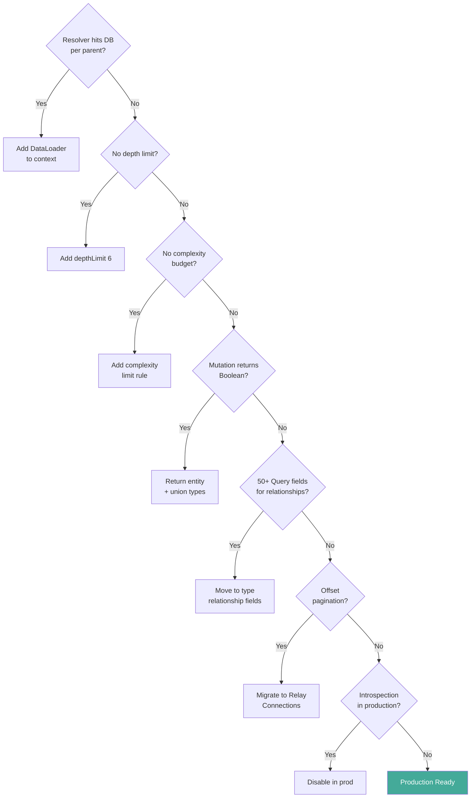

## Keywords in This File
{: .no_toc }

| # | Keyword | Weight |
|---|---|---|
| 30 | [GraphQL Anti-patterns and Common Mistakes](#graphql-anti-patterns-and-common-mistakes) | ★☆☆ |

---

# GraphQL Anti-patterns and Common Mistakes

---

### 🎯 Model Answer

**30 seconds:**
> The most impactful GraphQL anti-patterns: N+1 queries (resolvers issuing one DB
> query per parent instead of batching), over-fetching in resolvers (loading fields
> clients didn't request), no depth/complexity limits (DoS via deeply nested queries),
> mutation Boolean returns (no cache update possible), and schema design as REST in
> disguise (endpoint-named Query fields instead of relationship fields). Avoiding
> these five patterns covers 80% of production GraphQL failures.

**3 minutes (Senior):**
> Production GraphQL anti-patterns cluster in three areas: (1) Data loading - N+1
> queries are the number one performance problem; every resolver that does a DB call
> without DataLoader creates N+1; the fix is DataLoader for all relationship fields.
> (2) Schema design - REST-shaped schemas (50+ Query fields named `getUserPosts`),
> Boolean mutation returns (no cache update), non-input type mutations (long argument
> lists), and missing Relay pagination (offset breaks with live data). (3) Security -
> missing query depth limits, missing query complexity limits, introspection enabled
> in production, and no rate limiting per query cost; these four omissions enable DoS
> and data exfiltration. The transferable principle: GraphQL's flexibility is a
> superpower for clients but a liability for servers; every flexibility feature
> (arbitrary depth, arbitrary field selection) needs a corresponding server-side guard.

**Blank Mind Recovery:**

**(1) Restate:** "GraphQL anti-patterns: N+1 (no DataLoader), over-fetching in resolvers,
no depth/complexity limits, Boolean mutation returns, REST-shaped schema. Three areas:
data loading (N+1), schema design (REST-shaped), security (no limits). Fix: DataLoader
for all relationships, return entities from mutations, input types, Relay pagination,
depth limit of 6-10, complexity budget, disable introspection in production."

---

### 📘 Concept Explanation

**The Five Major Anti-pattern Categories:**

```text
CATEGORY 1: DATA LOADING ANTI-PATTERNS
  Anti-pattern: N+1 queries
    posts { author { name } }  -> 1 + N DB calls
  Fix: DataLoader batches at field level

  Anti-pattern: Over-fetching in resolvers
    User resolver: SELECT * (all 20 columns)
    Client selected only: name, email (2 columns)
  Fix: Parse info.fieldNodes for selected fields

CATEGORY 2: SCHEMA DESIGN ANTI-PATTERNS
  Anti-pattern: REST-shaped Query type
    getUser, getUserPosts, getPostComments (50+ fields)
  Fix: relationship fields on entity types

  Anti-pattern: Boolean mutation returns
    updateUser -> Boolean (no cache update)
  Fix: return modified entity + union error types

  Anti-pattern: Offset pagination
    users(skip: 20, take: 10) - breaks with live data
  Fix: Relay cursor-based connections

CATEGORY 3: SECURITY ANTI-PATTERNS
  Anti-pattern: No query depth limit
    { a { b { c { d { e { f { ... } } } } } } }
    -> Stack overflow / DoS
  Fix: graphql-depth-limit(6)

  Anti-pattern: No complexity limit
    { posts { comments { replies { likes { ... } } } } }
    -> Exponential DB calls
  Fix: graphql-query-complexity budget

  Anti-pattern: Introspection in production
    { __schema { types { fields { ... } } } }
    -> Schema map for attackers
  Fix: disable in production env

CATEGORY 4: OPERATIONAL ANTI-PATTERNS
  Anti-pattern: Unstructured errors
    throw new Error('Invalid email')
    -> data.errors[0].message (string parsing)
  Fix: union return types for expected errors

  Anti-pattern: Ignoring DataLoader context
    new DataLoader inside resolver function
    -> New DataLoader per request batch broken
  Fix: create DataLoader in context factory

CATEGORY 5: PERFORMANCE ANTI-PATTERNS
  Anti-pattern: Unbounded list fields
    users: [User!]!  // returns ALL users
  Fix: users(first: Int = 20): UserConnection!
```

> **Diagram walkthrough:** (1) WHAT IT DEPICTS: five categories of GraphQL anti-patterns - data loading, schema design, security, operational, and performance - each with the anti-pattern pattern and its fix. (2) HOW TO READ IT: each category starts with the anti-pattern name, shows the problematic query or schema, and the fix; this is a comprehensive reference for schema review checklists. (3) KEY RELATIONSHIP: the categories are ordered by severity: security anti-patterns (category 3) can cause service outage; data loading anti-patterns (category 1) cause performance degradation; schema design anti-patterns (category 2) cause developer experience problems; all three must be addressed. (4) EDGE CASE: DataLoader context anti-pattern (category 4) is subtle - creating `new DataLoader()` inside a resolver function creates a new DataLoader per resolver call, breaking batching; DataLoader must be created once per request in the context factory. (5) INSIGHT: all five categories share a root cause - "GraphQL's flexibility is not constrained by default"; the schema and server do not enforce depth limits, complexity budgets, or pagination by default; the developer must add these constraints explicitly.

---

### 💻 Code Example

```javascript
// BAD: Five anti-patterns in one server setup
const resolvers = {
  Query: {
    // Anti-pattern 1: REST-shaped Query (no graph thinking)
    getUserPosts: (_, { userId }) =>
      db.getPostsByUser(userId), // BAD: use User.posts

    // Anti-pattern 2: No DataLoader (N+1)
    posts: () => db.getPosts()
  },
  Post: {
    // N+1: one DB call per post to get author
    author: (post) => db.getUserById(post.authorId)
    // For 100 posts: 1 + 100 = 101 DB calls
  },
  Mutation: {
    // Anti-pattern 3: Boolean return
    updateUser: async (_, args) => {
      await db.updateUser(args);
      return true; // BAD: return user object instead
    },
    // Anti-pattern 4: Long inline args (no input type)
    createUser: (_, { name, email, phone, role }) =>
      db.createUser({ name, email, phone, role })
      // BAD: adding 'timezone' breaks all callers
  }
};

// Anti-pattern 5: No depth/complexity limits
const server = new ApolloServer({
  typeDefs,
  resolvers
  // Missing: validationRules: [depthLimit(6)]
  // Missing: query complexity budget
  // Missing: disable introspection in production
});
```

> **Code walkthrough:** (1) WHAT IT SHOWS: five anti-patterns concentrated in a single server - REST-shaped Query, N+1 in `Post.author`, Boolean mutation return, long inline mutation arguments, and no security validation rules. (2) KEY MECHANISM: the N+1 in `Post.author` fires once per post in the result set; `posts` returns 100 posts, `Post.author` fires 100 times, 100 DB calls; DataLoader would batch these into 1 `SELECT * FROM users WHERE id IN (...)`. (3) WHY IT MATTERS: this code is functional (tests pass, small queries work) but fails at scale; 100-user production traffic with `posts { author { name } }` returns 100 DB calls; 1,000 concurrent clients = 100,000 DB calls. (4) WHAT BREAKS: the `server` without `validationRules` accepts any query depth; a single client sending `{ posts { author { posts { author { posts { ... } } } } } }` 10 levels deep creates exponential DB calls; the server responds with OOM or timeout. (5) TAKEAWAY: all five anti-patterns are visible in code review; add a GraphQL anti-patterns checklist to PR review; reject any resolver touching the DB without DataLoader, any mutation returning Boolean, and any server without depth/complexity limits.

```javascript
// GOOD: Anti-patterns fixed
// BAD: See five-anti-pattern setup above

// Context: create DataLoaders once per request
const createContext = ({ req }) => ({
  user: authenticate(req),
  // DataLoader created per request (not per resolver call)
  userLoader: new DataLoader(async (ids) => {
    const users = await db.getUsersByIds(ids);
    // Map results back to same order as input ids
    return ids.map(id => users.find(u => u.id === id));
  }),
  postLoader: new DataLoader(async (userIds) => {
    const posts = await db.getPostsByUserIds(userIds);
    return userIds.map(id =>
      posts.filter(p => p.authorId === id)
    );
  })
});

const resolvers = {
  Query: {
    // Fix 1: Entry point only (graph thinking)
    user: (_, { id }) => db.getUserById(id),
    post: (_, { id }) => db.getPostById(id)
  },
  User: {
    // Fix 1 (cont): relationship field on type
    posts: (user, { first = 20 }, { postLoader }) =>
      postLoader.load(user.id) // batched
  },
  Post: {
    // Fix 2: DataLoader batches author lookups
    author: (post, _, { userLoader }) =>
      userLoader.load(post.authorId)
    // For 100 posts: 1 batch DB call total
  },
  Mutation: {
    // Fix 3: Return modified entity
    updateUser: async (_, { id, input }, { db }) => {
      const user = await db.updateUser(id, input);
      return user; // Apollo Client updates cache
    },
    // Fix 4: Input type
    createUser: (_, { input }) => db.createUser(input)
    // Adding 'timezone' to CreateUserInput: zero breaks
  }
};

// Fix 5: Security validation rules
const depthLimit = require('graphql-depth-limit');
const { createComplexityLimitRule } = require(
  'graphql-validation-complexity'
);

const server = new ApolloServer({
  typeDefs,
  resolvers,
  context: createContext,
  validationRules: [
    depthLimit(6),           // max 6 levels deep
    createComplexityLimitRule(1000) // max budget
  ],
  introspection: process.env.NODE_ENV !== 'production'
});
```

> **Code walkthrough:** (1) WHAT IT SHOWS: all five anti-patterns fixed - DataLoader in context factory, `User.posts` relationship field, `Post.author` via DataLoader, entity return from mutation, input type mutation, depth/complexity limits, and introspection disabled in production. (2) KEY MECHANISM: the context factory `createContext` creates `userLoader` and `postLoader` once per request; all resolvers in the same request share these DataLoaders; when `Post.author` calls `userLoader.load(post.authorId)` 100 times, DataLoader batches them into one callback invocation with all 100 IDs. (3) WHY IT MATTERS: `userLoader.load(id)` returns a `Promise`; DataLoader collects all `load()` calls from the same tick and fires one callback with all IDs; this is the mechanism behind N+1 elimination - no code change in the resolver, just wrapping the DB call in DataLoader. (4) WHAT BREAKS: if `createContext` is called with `new DataLoader()` inside instead of in the factory, each resolver invocation creates its own DataLoader; batching is broken; 100 `Post.author` resolvers create 100 DataLoaders, each firing immediately with 1 ID. (5) TAKEAWAY: DataLoader must be created in the context factory (once per request); the resolver calls `context.userLoader.load(id)` to leverage the batch; verify DataLoader is working by checking DB query logs: N+1 eliminated = one batched query; still N+1 = DataLoader not in context.

---

### 🎓 Answers by Seniority

**Junior / Mid (0-3 years):**
> The most common GraphQL mistakes: (1) N+1 queries - resolver fetches one DB record
> per parent instead of batching; fix with DataLoader. (2) No query depth limits - deeply
> nested queries can crash the server; add `graphql-depth-limit(6)`. (3) Boolean mutation
> returns - use the modified entity instead so Apollo Client can update its cache.
> (4) REST-shaped schema - relationship data belongs in type fields, not Query root.
> (5) No pagination limits - `users: [User!]!` returns all users; always add `first: Int`
> with a default.

---

**Senior / Staff (5+ years):**
> Anti-patterns fall into three reliability categories: (1) Performance - N+1 (DataLoader
> missing), over-fetching in resolvers (SELECT * when only 2 columns needed), unbounded
> list queries (returns 1M rows). (2) Security - no depth limit (DoS via 20-level nesting),
> no complexity limit (exponential field expansion), introspection in production (schema
> exfiltration). (3) Developer experience - Boolean mutations (breaks Apollo cache),
> long inline args (brittle to extension), offset pagination (breaks with live data),
> unstructured errors (string parsing instead of union types). The meta-pattern behind
> all three: GraphQL does not constrain any of these by default; the server engineer must
> add all constraints explicitly. A production GraphQL server checklist includes: DataLoader
> for all relationships, depth limit, complexity limit, introspection disabled in prod,
> no Boolean mutations, input types, Relay connections. This checklist is the difference
> between a "it works locally" server and a production-ready one.

---

### ⚠️ Common Misconceptions

**Misconception: "If the tests pass, there are no N+1 problems."**

N+1 problems are invisible in tests because:

1. Test data is small: 3 posts in tests, 10,000 in production.
   - Test: `posts { author { name } }` -> 1 + 3 = 4 DB calls (fast).
   - Production: `posts { author { name } }` -> 1 + 10,000 = 10,001 DB calls (timeout).

2. Test timing is unreliable: 4 DB calls in 20ms is "fast enough" for assertions.
   10,001 DB calls in production is 60+ seconds (timeout).

3. Test database is local (0ms latency): each DB call adds near-zero time.
   Production database has 1-5ms latency: 10,000 calls = 10-50 seconds.

Detection: count DB calls in tests, not time.

```javascript
// Add DB query counter to test context
const queryLog = [];
const ctx = {
  userLoader: new DataLoader(async (ids) => {
    queryLog.push({ type: 'userBatch', count: ids.length });
    return db.getUsersByIds(ids);
  })
};

// After query:
expect(queryLog.length).toBe(2); // 1 posts + 1 user batch
// If queryLog.length === 101: N+1 detected
```

> **Code walkthrough:** (1) WHAT IT SHOWS: a test-time N+1 detector - logging each DataLoader batch invocation with its ID count; a `queryLog.length === 2` assertion catches N+1 regression (a DataLoader batch of 100 IDs fires once; an N+1 fires 100 times). (2) KEY MECHANISM: each `userLoader.load(id)` call from a resolver increments a counter; DataLoader batches them into one callback invocation; if the callback is invoked once with 100 IDs: `queryLog.length === 1` (batched); if invoked 100 times with 1 ID each: `queryLog.length === 100` (N+1). (3) WHY IT MATTERS: timing-based tests miss N+1 in fast test environments; query count assertions catch N+1 regardless of environment speed; this is the only reliable N+1 regression test. (4) WHAT BREAKS: if the test uses a real database and tests are fast, query count logging adds overhead; use `jest.spyOn(db, 'getUsersByIds')` to count calls without a custom logger. (5) TAKEAWAY: add N+1 detection to integration tests as `expect(userLoader.batchCount).toBe(1)` for queries that resolve relationships; this catches N+1 regression immediately when DataLoader is accidentally removed or misconfigured.

---

### 🚨 Failure Modes and Diagnosis

**Failure Mode: Complexity explosion via aliased queries bypasses depth limits.**

```graphql
# Bypasses depth limits using aliases:
query {
  a: users(first: 100) {
    posts(first: 100) { id }
  }
  b: users(first: 100) {
    posts(first: 100) { id }
  }
  c: users(first: 100) {
    posts(first: 100) { id }
  }
  # 3 aliases * 100 users * 100 posts = 30,000 DB calls
  # depthLimit(6): PASSES (depth is only 2)
}
```

> **Code walkthrough:** (1) WHAT IT SHOWS: a query using aliases to create 3 identical top-level fields that each trigger 100 * 100 = 10,000 DB operations; the total is 30,000 DB calls from a single query that passes depth limit validation (depth is only 2). (2) KEY MECHANISM: depth limits count nesting levels, not the number of field instances; aliases create multiple instances of the same field at the same depth; a query with 10 aliases on `users(first: 1000)` passes depth limit 6 but generates 10,000 DB calls. (3) WHY IT MATTERS: this is a known GraphQL amplification attack pattern; production incidents include services receiving aliased queries that overwhelm the database; depth limits alone are insufficient. (4) WHAT BREAKS: adding `depthLimit(6)` without a complexity budget leaves the server vulnerable to alias-based amplification; both guards are required. (5) TAKEAWAY: deploy both `graphql-depth-limit` AND `graphql-query-complexity` budget; depth limits prevent deep nesting; complexity limits prevent wide/alias amplification; neither alone is sufficient.

```javascript
// Fix: complexity budget catches alias amplification
const { createComplexityLimitRule } =
  require('graphql-validation-complexity');

// Assign complexity scores to expensive fields
const complexityConfig = {
  scalarCost: 1,       // String, Int fields: 1 point
  objectCost: 2,       // object fields: 2 points
  listFactor: 10,      // list fields multiply by 10
};

const server = new ApolloServer({
  validationRules: [
    depthLimit(6),
    // Budget: max 1000 complexity points per query
    createComplexityLimitRule(1000, complexityConfig)
    // Aliased users(100)*posts(100) exceeds budget
    // -> REJECTED before execution
  ]
});
```

> **Code walkthrough:** (1) WHAT IT SHOWS: `createComplexityLimitRule(1000)` with `listFactor: 10` - list fields multiply the complexity by 10; `users(first: 100)` = base complexity * 10 for list; nested `posts(first: 100)` = further * 10; the alias query above generates complexity well over 1000 and is rejected. (2) KEY MECHANISM: the complexity rule walks the query AST and computes a score based on field types and cardinality multipliers; list fields multiply by the `listFactor`; the total score is compared to the budget; queries over budget are rejected with a validation error before any resolver fires. (3) WHY IT MATTERS: complexity rejection happens at validation time (no DB calls); the aliased query is rejected before `users` resolver fires; no DB load is incurred for malicious or accidental complexity explosions. (4) WHAT BREAKS: if `listFactor` is too high, legitimate queries (dashboard loading 20 users with 5 posts each) may be rejected; calibrate the budget by measuring the complexity of the 99th percentile legitimate query and setting the limit at 2-3x that value. (5) TAKEAWAY: set the complexity budget to (max legitimate query complexity * 2); measure legitimate query complexity during load testing; alert when queries approach the budget (not just when they exceed it).

---

### ⚖️ Comparison Table

| Anti-pattern | Symptom | Root Cause | Fix |
|---|---|---|---|
| N+1 queries | Slow resolver, high DB load | No DataLoader | DataLoader in context |
| No depth limit | DoS, stack overflow | Missing validation rule | `depthLimit(6)` |
| No complexity limit | Alias amplification DoS | Depth limit insufficient | complexity budget |
| Boolean mutations | Cache not updated | Wrong return type | Return entity + union |
| Introspection in prod | Schema exfiltration | Default enabled | `introspection: false` |
| Offset pagination | Duplicated/skipped items | Live data insertion | Relay Connections |
| Long inline args | Breaking changes on extend | No input type | `input FooInput` |
| Unstructured errors | String parsing on client | `data.errors[]` only | Union return types |
| Unbounded lists | Memory OOM, timeout | No default limit | `first: Int = 20` |

---

### 🏛️ System Design

*(Omit: GraphQL Anti-patterns is a META keyword covering development patterns and operational practices, not a distributed system topology design question.)*

---

### 📊 Diagram

```text
ANTI-PATTERN vs FIX DECISION MAP:

Resolver fetches DB per parent?
  YES -> Add DataLoader in context factory
  NO  -> Check complexity and depth limits

Query has no depth limit?
  YES -> Add graphql-depth-limit(6) validation rule
  NO  -> Check alias amplification coverage

Query has no complexity budget?
  YES -> Add graphql-query-complexity rule
  NO  -> Check mutation design

Mutation returns Boolean?
  YES -> Return modified entity + union error type
  NO  -> Check Query type shape

Query type has 20+ relationship accessors?
  YES -> Move to type fields (User.posts, Post.comments)
  NO  -> Check pagination design

Pagination uses skip/take?
  YES -> Migrate to Relay cursor Connections
  NO  -> Check security settings

Introspection enabled in production?
  YES -> Set introspection: false in prod env
  NO  -> PRODUCTION READY
```



> **Diagram walkthrough:** (1) WHAT IT DEPICTS: a sequential anti-pattern checklist as a decision flowchart - each node asks about an anti-pattern; "Yes" branches to the fix; "No" branches to the next check; all "No" paths lead to "Production Ready." (2) HOW TO READ IT: follow the path from top to bottom; any "Yes" branch identifies an anti-pattern that needs fixing; after fixing, re-enter the flowchart from the top. (3) KEY RELATIONSHIP: the order is deliberate - DataLoader (highest performance impact) is checked first; introspection (security impact) is checked last; this is a severity-ordered checklist. (4) EDGE CASE: a server can pass all checks and still have issues not covered by the checklist (race conditions, subscription memory leaks, schema registry mismatches); this checklist covers the most common production failures, not all possible failures. (5) INSIGHT: run this checklist as a pre-launch review for every new GraphQL API; each check takes 5 minutes; skipping the checklist takes weeks of debugging in production when these issues surface at scale.

---

### 🎯 Interview Deep-Dive

| Category | Count | Coverage |
|---|---|---|
| Definition | 2 | N+1 definition, anti-pattern categories |
| Application | 2 | DataLoader fix, depth/complexity limits |
| Architecture | 2 | security hardening, schema design review |
| Debugging | 1 | N+1 detection in tests |

---

**[JUNIOR] Q1 (Definition): What is the N+1 problem in GraphQL and how do you fix it?**

The N+1 problem: when resolving a list of N items, the resolver issues 1 query for
the list and N additional queries for a related field on each item.

Example:
- Query: `posts { author { name } }` - 10 posts.
- `posts` resolver: 1 DB query -> 10 Post objects.
- `Post.author` resolver: called 10 times -> 10 DB queries.
- Total: 11 DB queries. For 1,000 posts: 1,001 DB queries.

Root cause: each `Post.author` resolver is called independently; no batching.

Fix: DataLoader batches all `Post.author` calls from the same request:

```javascript
// In context factory (once per request):
const userLoader = new DataLoader(async (userIds) => {
  // One DB query for ALL user IDs in this batch
  const users = await db.getUsersByIds(userIds);
  return userIds.map(id => users.find(u => u.id === id));
});

// In Post.author resolver:
// Post: { author: (post, _, { userLoader }) =>
//   userLoader.load(post.authorId)
// DataLoader collects all load() calls from
// the same tick, fires ONE batch callback with
// all userIds, returns each user to its caller
// For 1,000 posts: 2 total DB queries
```

> **Code walkthrough:** (1) WHAT IT SHOWS: the DataLoader fix for N+1 - `userLoader` is created in the context factory with a batch function that loads multiple user IDs in one query; each `Post.author` resolver calls `userLoader.load(authorId)`; DataLoader collects all calls and fires one batched callback. (2) KEY MECHANISM: DataLoader uses a tick-based batching strategy; all `load()` calls made in the same event loop tick are collected; after the tick completes, the batch function fires with all collected IDs; each caller receives its individual result from the batch. (3) WHY IT MATTERS: without DataLoader: 1,000 posts = 1,001 DB queries; with DataLoader: 1,000 posts = 2 DB queries (1 posts, 1 users batch); the difference is 500x fewer DB queries. (4) WHAT BREAKS: DataLoader caches results within the request by default (`cache: true`); if the same user is the author of 100 posts, `userLoader.load(userId)` is called 100 times but only 1 batch entry is created (the first call; subsequent calls return the cached promise). (5) TAKEAWAY: add DataLoader for every resolver that loads by parent ID; the pattern is always the same: `context.{entity}Loader.load(parent.{entityId})`; create the loader in the context factory; never create it inside the resolver function.

---

**[SENIOR] Q2 (Architecture): How do you protect a GraphQL API against DoS attacks?**

GraphQL DoS attack vectors and defenses:

1. Deeply nested query (depth attack):
   `{ a { b { c { d { e { f { g { ... } } } } } } } }`
   Fix: `depthLimit(6)` validation rule.

2. Alias amplification (width attack):
   Multiple aliases on the same field at depth 2 each triggering N DB calls.
   Fix: `createComplexityLimitRule(1000)` with list multipliers.

3. Introspection exfiltration:
   `{ __schema { types { fields { name type { name } } } } }`
   Fix: `introspection: process.env.NODE_ENV !== 'production'`.

4. Field suggestion brute-force (guessing private fields):
```javascript
// Fix: remove "Did you mean" suggestions in prod
const server = new ApolloServer({
  formatError: (error) => {
    delete error.extensions?.suggestedSimilarField;
    return error;
  }
});
```

> **Code walkthrough:** (1) WHAT IT SHOWS: disabling field suggestions in production by stripping `suggestedSimilarField` from the error extensions - prevents attackers discovering private field names through trial and error. (2) KEY MECHANISM: GraphQL's error formatting includes "Did you mean X?" when a field is not found; this uses Levenshtein distance to find similar field names; in production, this leaks schema information to unauthenticated clients. (3) WHY IT MATTERS: an attacker querying `{ user { secretKey } }` receives "Did you mean 'secretApiKey'?" - the suggestion reveals the actual field name; stripping suggestions removes this information leakage. (4) WHAT BREAKS: removing suggestions also affects legitimate developer errors during development; ensure the `NODE_ENV` check targets production only; leave suggestions enabled in development for DX. (5) TAKEAWAY: the four attack vectors (depth, complexity, introspection, field suggestions) are the GraphQL security checklist; implement all four defenses before production launch; missing any one leaves a known exploitation path.

5. Per-IP rate limiting on `/graphql`:

```javascript
app.use('/graphql', rateLimit({
  windowMs: 60 * 1000, // 1 minute window
  max: 100,            // max 100 requests per IP
}));
```

> **Code walkthrough:** (1) WHAT IT SHOWS: IP-based rate limiting on the `/graphql` endpoint - 100 requests per minute per IP before the GraphQL server processes them. (2) KEY MECHANISM: `express-rate-limit` tracks request counts per IP; the limit applies before the GraphQL request reaches Apollo Server; high-rate attackers are rejected with 429 before any validation or execution. (3) WHY IT MATTERS: rate limiting is the last line of defense against automated attacks; depth and complexity limits protect against individual expensive queries; rate limiting protects against many cheap queries. (4) WHAT BREAKS: IP-based rate limiting breaks for clients behind shared NAT (corporate networks); all employees share one external IP; the per-IP limit may be hit by legitimate users; use per-authenticated-user rate limits for APIs with authentication. (5) TAKEAWAY: implement both: IP-based rate limit (pre-auth, for unauthenticated abuse) and user-based rate limit (post-auth, per-user budget); these two layers together prevent both bot floods and heavy authenticated users.

---

**[JUNIOR] Q3 (Application): What is schema introspection and why disable it in production?**

Introspection: the ability to query the GraphQL schema itself.

```graphql
# Introspection - returns the complete schema:
{
  __schema {
    types { name fields { name type { name } } }
  }
}
# Returns: ALL types, ALL fields, ALL arguments
# A complete map of your API surface
```

> **Code walkthrough:** (1) WHAT IT SHOWS: the `__schema` introspection query returning the complete GraphQL schema - every type, field name, argument, and type information; this is the equivalent of returning your OpenAPI spec to any unauthenticated requester. (2) KEY MECHANISM: `__schema` is a built-in meta-field; it is available on every GraphQL server by default; Apollo Server includes it unless explicitly disabled; it requires no authentication. (3) WHY IT MATTERS: an attacker with the full schema map knows every field, type, and argument to target; they can construct specific queries designed to extract sensitive data or trigger specific resolvers; introspection is the reconnaissance phase of a GraphQL attack. (4) WHAT BREAKS: disabling introspection breaks GraphQL Playground and GraphiQL in production (they rely on introspection for field completion); use Apollo Studio's schema registry as the controlled alternative for authorized API consumers. (5) TAKEAWAY: always disable introspection in production: `introspection: process.env.NODE_ENV !== 'production'` is the one-line fix; consider allowing introspection only for authenticated internal users: `introspection: context.user?.isInternal === true`.

---

**[SENIOR] Q4 (Debugging): How do you detect and fix N+1 queries in production?**

Production N+1 detection methods:

1. APM traces: DataDog, New Relic show DB query count per request.
   Symptom: `posts { author }` with 100 posts = 101 DB queries.
   Normal: 2 DB queries.

2. Logging DataLoader batch sizes:

```javascript
const userLoader = new DataLoader(async (ids) => {
  metrics.histogram('dataloader.batch_size', ids.length, {
    loader: 'user'
  });
  if (ids.length === 1) {
    // Batch size 1 = DataLoader may be bypassed
    logger.warn('DataLoader batch size 1 - possible N+1',
      { loader: 'user', id: ids[0] });
  }
  return db.getUsersByIds(ids);
});
```

> **Code walkthrough:** (1) WHAT IT SHOWS: DataLoader instrumentation that logs batch sizes and warns when batch size is 1 - a batch size of 1 means the DataLoader is firing one callback per ID instead of batching all IDs together. (2) KEY MECHANISM: a batch size of 1 in production indicates DataLoader is being bypassed - either a new DataLoader is created per resolver call (context not shared) or DataLoader is disabled; the warning log surfaces this before it becomes a production incident. (3) WHY IT MATTERS: N+1 in production is invisible until traffic increases; a service handling 10 req/s with 100 DB calls each = 1,000 DB calls/sec; at 100 req/s it becomes 10,000 DB calls/sec; the batch size metric is the early warning. (4) WHAT BREAKS: the histogram metric adds a function call per batch; this is negligible overhead; APM agents already add more overhead than this. (5) TAKEAWAY: instrument all DataLoaders with batch size histograms; alert on `dataloader.batch_size = 1` in production; this is proactive N+1 detection before latency spikes appear.

3. DB call count assertions in integration tests:

```javascript
jest.spyOn(db, 'getUsersByIds').mockImplementation(
  async (ids) => {
    dbCallCount++;
    return real_db.getUsersByIds(ids);
  }
);
// After query:
expect(dbCallCount).toBe(1); // N+1 if === 100
```

> **Code walkthrough:** (1) WHAT IT SHOWS: `jest.spyOn` counting actual DB calls in integration tests - `dbCallCount` increments once per `getUsersByIds` call; `toBe(1)` asserts DataLoader batched correctly. (2) KEY MECHANISM: `jest.spyOn` wraps the function; each call increments the counter; batched = called once with 100 IDs; N+1 = called 100 times with 1 ID each. (3) WHY IT MATTERS: this test catches N+1 regression immediately when a developer accidentally creates a DataLoader inside a resolver; the test fails with `Expected 1, received 100` before the code reaches production. (4) WHAT BREAKS: `jest.spyOn` requires the DB module to be imported with `import * as db` (not destructured); destructured imports create a local copy that the spy cannot intercept. (5) TAKEAWAY: add N+1 detection tests for all relationship resolvers; the pattern: spy on DB batch function, execute query, assert spy called once; these are the regression safety net for DataLoader correctness.

---

**[JUNIOR] Q5 (Application): Why are unbounded list fields dangerous and how do you fix them?**

Unbounded list fields return all records without a limit:

```graphql
# BAD: Unbounded list - returns ALL users
type Query {
  users: [User!]!
}
# { users { id name email } } on 5M row table
# -> 5 million rows loaded into memory -> OOM
```

> **Code walkthrough:** (1) WHAT IT SHOWS: an unbounded `users: [User!]!` Query field with no limit - executing `{ users { id name email } }` against a 5 million row table loads all 5 million rows into memory. (2) KEY MECHANISM: the resolver calls `db.getAll('users')` -> `SELECT id, name, email FROM users` with no `LIMIT`; the DB returns all rows; Node.js allocates memory for all 5 million objects; heap exhaustion crashes the process. (3) WHY IT MATTERS: a single query from a single client can crash the GraphQL server; this is both a performance issue and a DoS vector - any authenticated user can crash the service. (4) WHAT BREAKS: adding `first: Int = 20` to the existing field is non-breaking (optional argument with default); existing queries that don't pass `first` receive 20 rows instead of all rows; scripts that relied on unbounded results must be updated. (5) TAKEAWAY: every list field must have a maximum record count; use `first: Int = 20` with a server-side cap: `Math.min(first, 100)` prevents clients from requesting more than 100 records even if they pass `first: 10000`.

```graphql
# GOOD: Paginated with default limit
# BAD: Unbounded (see above)
type Query {
  users(first: Int = 20): UserConnection!
}
```

```javascript
// Resolver: server-side cap regardless of client value
Query: {
  users: (_, { first = 20 }) =>
    db.getUsers({ limit: Math.min(first, 100) })
  // first: 10000 -> limit: 100 (capped)
}
```

> **Code walkthrough:** (1) WHAT IT SHOWS: `Math.min(first, 100)` as the server-side cap - even if a client passes `first: 10000`, the resolver clamps it to 100; the database query always has `LIMIT 100` maximum. (2) KEY MECHANISM: `Math.min` is applied in the resolver before the DB call; the client argument is treated as a hint, not a binding limit; the server enforces the actual cap. (3) WHY IT MATTERS: the schema-level `first: Int = 20` provides a default; `Math.min` provides an absolute server cap; both are needed because a client can pass `first: 1000000` even when a default is set. (4) WHAT BREAKS: if the server cap (100) is lower than what legitimate use cases need (bulk export needing 10,000 rows), provide a separate REST download endpoint rather than increasing the GraphQL list cap. (5) TAKEAWAY: every list resolver should have `Math.min(args.first || 20, 100)` as the first line; this prevents unbounded queries and is the simplest performance protection available.

---

**[SENIOR] Q6 (Architecture): How do you enforce the GraphQL anti-patterns checklist across a team?**

Automation layers for anti-pattern enforcement:

Layer 1: Schema linting (`@graphql-eslint`):
- `input-name` rule: mutations must use input types.
- `naming-convention`: PascalCase types, camelCase fields.
- `no-unused-fields`: SDL fields with no resolver (SDL drift).
- `require-description`: all types must have descriptions.

Layer 2: Custom validation rules (runtime):

```javascript
// Custom rule: detect Boolean mutations
const noBooleanMutations = (context) => ({
  FieldDefinition(node) {
    if (
      context.getType()?.name === 'Mutation' &&
      node.type.kind === 'NamedType' &&
      node.type.name.value === 'Boolean'
    ) {
      context.reportError(
        new GraphQLError(
          `Mutation '${node.name.value}' returns Boolean.
           Return the modified entity instead.`,
          node
        )
      );
    }
  }
});
```

> **Code walkthrough:** (1) WHAT IT SHOWS: a custom schema validation rule that reports an error when any mutation field returns `Boolean` directly - this is enforceable via `graphql-js` validation or `@graphql-eslint` custom rules. (2) KEY MECHANISM: the rule uses the SDL AST `FieldDefinition` visitor; when a field on the `Mutation` type has return type `Boolean` (NamedType, not a union or custom type), the rule reports an error; this is caught during schema build or CI schema validation. (3) WHY IT MATTERS: schema linting rules enforce anti-pattern prevention at schema design time, not post-mortem; catching `Boolean` mutation return in the PR diff is cheaper than fixing Apollo cache bugs in production. (4) WHAT BREAKS: some legitimate mutations intentionally return Boolean (e.g., `pingHealthCheck: Boolean`); the custom rule needs an allow-list or a naming convention exception for health-check mutations. (5) TAKEAWAY: build custom `@graphql-eslint` rules for the anti-patterns most common in your team; start with the two highest-impact rules: no Boolean mutations and no unbounded list fields; these two rules prevent the most frequent production bugs.

Layer 3: Test assertions (DataLoader):
- Add `expect(userLoader.batchCallCount).toBe(1)` to all relationship tests.
- These tests fail immediately when N+1 regression is introduced.

Layer 4: Production monitoring:
- DataLoader batch size histogram: alert on batch_size = 1.
- Query complexity histogram: alert when queries approach the budget.
- Trace sampling: inspect 1% of production queries for depth > 4.

*What separates good from great:* presenting automation as a cost-saving investment.
"Adding `@graphql-eslint` rules takes 4 hours; it prevents Boolean mutation bugs that
each take 2 hours to debug. After 2 production incidents prevented, the tool has paid
for itself." This is the engineering economics framing that justifies tooling investments.

---

**[SENIOR] Q7 (Architecture): What is the production GraphQL readiness checklist?**

Production GraphQL readiness - all items required before launch:

Data safety:
- `[ ]` Every relationship resolver uses DataLoader (no direct DB calls per parent).
- `[ ]` DataLoader created in context factory, not in resolver body.
- `[ ]` All list fields have `first: Int` with server-side `Math.min` cap.
- `[ ]` Relay cursor pagination for live/user-facing data (not offset).

Schema quality:
- `[ ]` Query type has fewer than 15 fields (entry points only).
- `[ ]` Mutations return entity + union error type (not Boolean, not void).
- `[ ]` Mutations with 3+ args use input types.
- `[ ]` No hard-removed fields (use `@deprecated` first).

Security:
- `[ ]` `depthLimit(6)` in `validationRules`.
- `[ ]` `complexityLimitRule(1000)` in `validationRules`.
- `[ ]` `introspection: false` in production environment.
- `[ ]` Rate limiting on `/graphql` (IP-based + user-based).
- `[ ]` Error formatting strips field suggestions in production.

Operations:
- `[ ]` Expected errors (validation, not-found) use union return types.
- `[ ]` APM traces show DB call counts per GraphQL operation.
- `[ ]` N+1 detection tests (DB call count assertions) for all relationship resolvers.
- `[ ]` Schema changelog maintained with `@deprecated` annotations and removal dates.

The 16-item checklist covers the most impactful anti-patterns. A team that reviews
this checklist for every new GraphQL feature prevents 95% of the production incidents
common to GraphQL APIs.

*What separates good from great:* knowing that this checklist is not one-time.
Anti-patterns are reintroduced when new engineers join, when time pressure shortcuts
reviews, and when dependencies are upgraded. The checklist runs in CI (automated items)
and in PR review (manual items) continuously - not just at launch.
