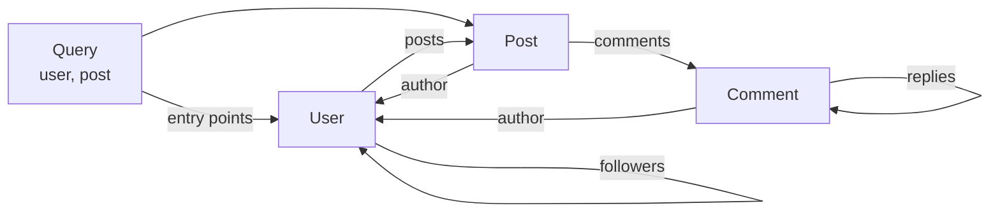
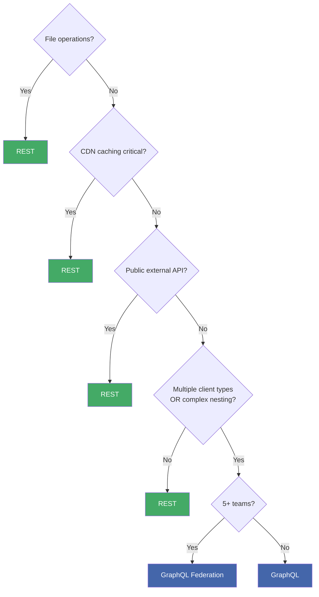
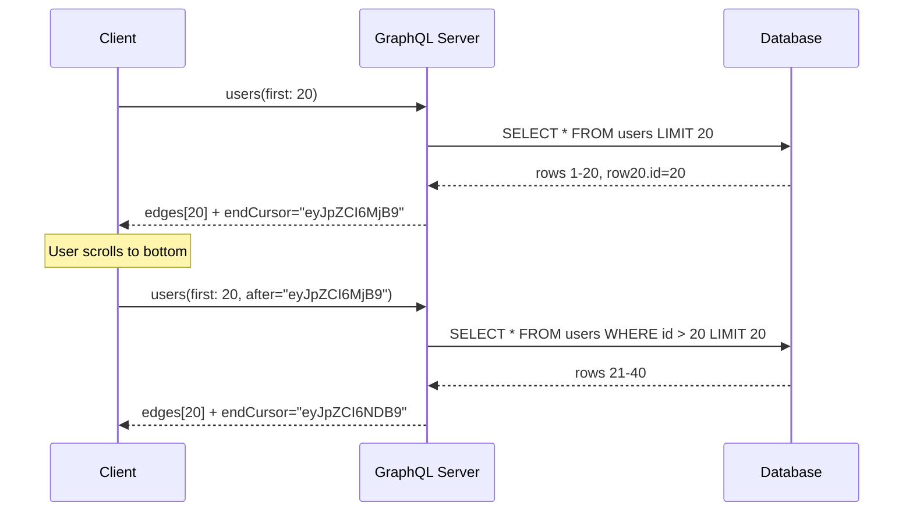

## Keywords in This File
{: .no_toc }

| # | Keyword | Weight |
|---|---|---|
| 27 | [Thinking in Graphs vs Resources](#thinking-in-graphs-vs-resources) | ★☆☆ |
| 28 | [When NOT to Use GraphQL](#when-not-to-use-graphql) | ★☆☆ |
| 29 | [GraphQL API Design Principles](#graphql-api-design-principles) | ★☆☆ |

---

# Thinking in Graphs vs Resources

---

### 🎯 Model Answer

**30 seconds:**
> REST thinks in resources: "a User is a resource at `/users/{id}`; a Post is a resource
> at `/posts/{id}`." GraphQL thinks in graphs: "User has posts, each post has an author,
> each author has followers." Shifting to graph thinking means modeling relationships as
> traversable edges, not separate endpoints. The question is not "what URL serves this
> data?" but "what is the graph node and what edges connect it to other nodes?"

**3 minutes (Senior):**
> The graph mental model has three elements: nodes (entities - User, Post, Comment),
> edges (relationships - User.posts, Post.author, Comment.replies), and root entry points
> (the Query type - the starting nodes for any traversal). REST thinks "I need User, then
> I need their Posts" - two round trips, two resources. GraphQL thinks "traverse from User
> to Posts" - one query, one round trip. The graph model changes how you design: instead of
> asking "what endpoints do I need?", you ask "what entities exist and how are they related?"
> The graph model also surfaces circular relationships naturally (Post has Author, Author has
> Posts) - in REST, these require careful URL design to avoid infinite recursion; in GraphQL,
> the client controls traversal depth, and server-side depth limiting controls abuse.

**Blank Mind Recovery:**

**(1) Restate:** "REST: resources at URLs. GraphQL: nodes and edges in a graph.
Graph thinking: entities = nodes, relationships = edges, Query type = entry points.
Instead of 'what endpoint serves this?', ask 'what entities exist and how are they connected?'
Circular relationships are natural in a graph; client controls traversal depth."

---

### 📘 Concept Explanation

**REST vs Graph Mental Models:**

```text
REST MENTAL MODEL:
  Resources have URLs:
    /users/{id}             <- User resource
    /users/{id}/posts       <- Posts belonging to User
    /posts/{id}             <- Post resource
    /posts/{id}/comments    <- Comments on Post
    /users/{id}/followers   <- User's followers

  Client needs "User with their 5 latest Posts":
    Step 1: GET /users/123
    Step 2: GET /users/123/posts?limit=5
    Total: 2 HTTP round trips

GRAPH MENTAL MODEL:
  Entities and relationships:
    User -[posts]-> Post
    User -[followers]-> User
    Post -[author]-> User
    Post -[comments]-> Comment
    Comment -[replies]-> Comment (recursive)

  Client query: one traversal
    user(id: "123") {
      name
      posts(first: 5) { title createdAt }
    }
    Total: 1 HTTP round trip

  The graph eliminates the "orchestration layer":
    REST: client coordinates multiple requests
    GraphQL: server coordinates field resolution
```

> **Diagram walkthrough:** (1) WHAT IT DEPICTS: the contrasting mental models - REST as a collection of resource URLs vs GraphQL as a graph of entities with edges (relationships). (2) HOW TO READ IT: the REST model shows URL patterns with arrows pointing from parent to child resource; the graph model shows entity nodes with labeled edges; the key difference is that REST requires the client to know the URL hierarchy, while GraphQL requires the client to know the entity relationships. (3) KEY RELATIONSHIP: the graph model's "one HTTP round trip" vs REST's "two round trips" is the practical benefit; the client declares what it needs using graph traversal syntax; the server resolves it with DataLoader and returns everything in one response. (4) EDGE CASE: deeply nested graph queries (5+ levels) can create N+1 chains if DataLoader is not used at each level; the graph model's power requires DataLoader to be implemented correctly at every relationship edge. (5) INSIGHT: the transition from REST to graph thinking is primarily a shift in how you model domain data; REST models HTTP APIs; GraphQL models the domain's entity relationship diagram; the GraphQL schema IS the entity relationship diagram expressed as a queryable API.

**Applying Graph Thinking to Schema Design:**

The design process shifts from "what endpoints do I need?" to "what entities exist
and how are they related?":

```text
GRAPH-FIRST SCHEMA DESIGN PROCESS:

1. LIST ENTITIES (nodes):
   User, Post, Comment, Tag, Category, Like

2. MAP RELATIONSHIPS (edges):
   User -> [posts]: Post      (one-to-many)
   User -> [followers]: User  (many-to-many, recursive)
   Post -> author: User       (many-to-one)
   Post -> [comments]: Comment (one-to-many)
   Post -> [tags]: Tag        (many-to-many)
   Comment -> [replies]: Comment (recursive)

3. DEFINE ENTRY POINTS (Query type):
   user(id): User             (by ID)
   post(id): Post             (by ID)
   search(query): [SearchResult] (union)
   feed(userId): [Post]       (collection)

4. VERIFY: can I reach every entity from an entry point?
   User: user(id) -> User          YES
   Post: post(id) or user.posts    YES
   Comment: post.comments          YES
   Tag: post.tags                  YES
   -> All entities reachable: schema is well-connected
```

> **Diagram walkthrough:** (1) WHAT IT DEPICTS: the four-step graph-first schema design process - list entities, map relationships, define entry points, verify reachability. (2) HOW TO READ IT: steps 1-3 define the graph structure; step 4 verifies that every entity node is reachable from at least one Query entry point; an unreachable entity is a schema design gap. (3) KEY RELATIONSHIP: "entry points" (Query fields) are the starting nodes for graph traversal; every entity must be reachable from at least one entry point; if `Tag` is only reachable via `post.tags`, then clients cannot browse tags independently - add `tag(id): Tag` if needed. (4) EDGE CASE: recursive relationships (`Comment.replies`, `User.followers`) work in GraphQL schemas but require client-side depth limiting to prevent infinite traversal; the server should enforce max query depth (see `graphql-depth-limit` library). (5) INSIGHT: the reachability check in step 4 reveals "orphan entities" - types defined in the schema that have no path from the Query root; these are unreachable and should either be connected or removed.

---

### 💻 Code Example

```graphql
# BAD: REST-shaped schema (resource thinking)
# Designed by looking at REST endpoints
type Query {
  getUser(id: ID!): User
  getUserPosts(userId: ID!, limit: Int): [Post]
  getPostComments(postId: ID!): [Comment]
  getUserFollowers(userId: ID!): [User]
}
# Client needs user + posts + first 2 comments per post:
# - Call getUser
# - Call getUserPosts
# - For each post: call getPostComments
# = 1 + 1 + N calls (N = number of posts)
```

> **Code walkthrough:** (1) WHAT IT SHOWS: a REST-shaped GraphQL schema where query names mirror REST endpoint names - every relationship is a separate root query field instead of a traversable edge on the entity type. (2) KEY MECHANISM: the schema has no relationship fields on types; `User` has no `posts` field; clients must call `getUserPosts(userId)` as a separate query; there is no graph to traverse, only endpoints with different names. (3) WHY IT MATTERS: this schema forces clients to make N+1 calls for nested data; "user + posts + 2 comments per post" requires N+2 queries; the graph-shaped alternative requires 1 query. (4) WHAT BREAKS: as requirements grow, new endpoint-like query fields are added (`getPostLikes`, `getUserComments`); the Query type grows indefinitely; the schema becomes impossible to understand or document. (5) TAKEAWAY: whenever you find yourself adding a Query field named `get{Entity}{Relationship}`, it is a sign of REST thinking; replace with a relationship field on the entity type.

```graphql
# GOOD: Graph-shaped schema (graph thinking)
# BAD: REST-shaped approach above
type Query {
  user(id: ID!): User     # Entry point to graph
  post(id: ID!): Post     # Entry point to graph
}
type User {
  id: ID!
  name: String!
  # Relationships: traversable edges
  posts(first: Int = 10): [Post!]!
  followers(first: Int = 20): [User!]!
  following(first: Int = 20): [User!]!
}
type Post {
  id: ID!
  title: String!
  # Relationships: traversable edges
  author: User!
  comments(first: Int = 10): [Comment!]!
  tags: [Tag!]!
  likes: Int!
}
type Comment {
  id: ID!
  body: String!
  author: User!
  replies: [Comment!]! # Recursive relationship
}
# Client: 1 query for user + posts + first 2 comments per post
# user(id) {
#   name
#   posts(first: 5) {
#     title
#     comments(first: 2) { body author { name } }
#   }
# }
```

> **Code walkthrough:** (1) WHAT IT SHOWS: the graph-shaped schema with relationship fields on every type (`User.posts`, `Post.author`, `Post.comments`, `Comment.replies`) - every entity is a node with edges to related entities; the client navigates the graph in one query. (2) KEY MECHANISM: `User.posts(first: 10)` is a resolver that loads the user's posts; with DataLoader, 20 users' posts are loaded in one DB query; without DataLoader, 20 separate DB queries fire (N+1); the graph model requires DataLoader to be performant. (3) WHY IT MATTERS: the graph schema enables `user(id) { posts { comments { replies { ... } } } }` - arbitrarily deep traversal in one query; REST would require 4+ nested request loops for this. (4) WHAT BREAKS: unlimited depth in `Comment.replies` allows `{ comment { replies { replies { replies { ... } } } } }` - 100-level deep query that blows the call stack; add `graphql-depth-limit(6)` to prevent abuse. (5) TAKEAWAY: every relationship in your domain model is a field on a GraphQL type; the schema is the entity relationship diagram expressed in SDL; design the schema by drawing the entity relationship diagram first, then transcribing it to SDL.

---

### 🎓 Answers by Seniority

**Junior / Mid (0-3 years):**
> REST thinks of data as resources at URLs: to get a user's posts, call `/users/123/posts`.
> GraphQL thinks of data as a graph: User has posts, posts have authors, authors have followers.
> In GraphQL, you model relationships as fields on types, not as separate endpoints.
> The schema IS the entity relationship diagram. When designing a GraphQL schema, start
> by listing entities (User, Post, Comment) and their relationships, not by listing endpoints.

---

**Senior / Staff (5+ years):**
> The graph mental model has three practical implications for schema design: (1) Every
> relationship in the domain model becomes a field, not a query - `User.posts` instead of
> `getPosts(userId)`; this enables single-query traversal. (2) Recursive relationships
> are first-class - `User.followers: [User]`, `Comment.replies: [Comment]`; REST handles
> these awkwardly (URL nesting breaks for 3+ levels); GraphQL handles them naturally with
> client-controlled depth. (3) The Query type is the "entry point catalog" - it should
> contain only starting nodes (by ID, by search, by collection); relationship traversal
> happens through type fields, not root queries; a Query type with 50+ fields is a sign
> of REST thinking. Staff-level insight: the graph model is fractal - a well-designed
> GraphQL schema can be extended with new relationships between existing entities without
> breaking clients; add `User.recommendations: [Post]` without touching any existing field.

---

### ⚠️ Common Misconceptions

**Misconception: "GraphQL is just a query language - it doesn't change how you model data."**

GraphQL changes data modeling in a fundamental way:

REST data model: resources and collections.
- Data is organized around URLs and HTTP verbs.
- Relationships are expressed through URL hierarchies (`/users/1/posts`).
- The URL structure constrains the data access patterns.
- Adding a new access pattern requires a new URL.

GraphQL data model: nodes and edges.
- Data is organized around entities and relationships.
- Relationships are expressed as fields on types.
- Access patterns are arbitrary graph traversals.
- Adding a new access pattern requires only adding a field.

The practical difference: adding "show a user's liked posts" to a REST API requires
a new endpoint (`/users/{id}/liked-posts`); adding it to a GraphQL API requires
adding `User.likedPosts: [Post!]!` to the schema - no new endpoint, no new URL.

---

### 🚨 Failure Modes and Diagnosis

**Failure Mode: Query type grows to 50+ fields because developers add REST-style query fields instead of relationship fields.**

```graphql
# Symptom: bloated Query type
type Query {
  # Root entry points (correct)
  user(id: ID!): User
  post(id: ID!): Post
  # REST-style additions (incorrect graph thinking)
  userPosts(userId: ID!): [Post]     # BAD: should be User.posts
  userFollowers(userId: ID!): [User] # BAD: should be User.followers
  postComments(postId: ID!): [Comment] # BAD: should be Post.comments
  postLikes(postId: ID!): [Like]       # BAD: should be Post.likes
  # Eventually: 60+ fields on Query
}

# Fix: move relationship fields to entity types
type User {
  posts(first: Int): [Post!]!        # moved from Query
  followers(first: Int): [User!]!    # moved from Query
}
type Post {
  comments(first: Int): [Comment!]!  # moved from Query
  likes: Int!                         # moved from Query
}
type Query {
  user(id: ID!): User  # Only entry points remain
  post(id: ID!): Post
}
```

> **Code walkthrough:** (1) WHAT IT SHOWS: the REST-to-graph refactoring of a bloated Query type - relationship fields are moved from Query root to their entity types; Query retains only true entry points (access by ID). (2) KEY MECHANISM: a Query field named `userPosts(userId)` forces clients to call it separately; `User.posts` is a relationship field that clients access via `user(id) { posts { ... } }` in one query; moving to relationship fields eliminates the extra round trips. (3) WHY IT MATTERS: a Query type with 60 fields becomes an unnavigable API; clients cannot tell which fields are entry points (by ID) vs which are relationship accessors; the bloat reduces discoverability. (4) WHAT BREAKS: moving `userPosts(userId)` to `User.posts` requires clients to update queries from `{ userPosts(userId: "1") }` to `{ user(id: "1") { posts } }`; this is a breaking change; use `@deprecated` on `userPosts` and add `User.posts` simultaneously; remove `userPosts` after client migration. (5) TAKEAWAY: audit the Query type periodically; any field named `get{Entity}{Relationship}` or `{entity}{Relationship}` is a REST-thinking artifact; move it to the entity type as a relationship field; keep Query for entry points only.

---

### ⚖️ Comparison Table

| Aspect | REST Thinking | Graph Thinking |
|---|---|---|
| Data model | Resources at URLs | Nodes with edges |
| Relationships | URL hierarchy | Type fields |
| Client access pattern | Multiple endpoint calls | Single graph traversal |
| Adding new access pattern | New endpoint | New field on type |
| Entry points | Every resource URL | Only root Query fields |
| Circular relationships | Awkward URL nesting | Natural recursive fields |

---

### 🏛️ System Design

*(Omit: "Thinking in Graphs vs Resources" is a design philosophy keyword, not a distributed system topology. The architectural implications are captured in the schema design patterns above.)*

---

### 📊 Diagram

```text
REST vs GRAPH DATA ACCESS:

REST APPROACH:
  Client                REST API
    |--GET /users/123------>|
    |<-----{user data}------|
    |--GET /users/123/posts->|
    |<---{posts array}------|
  2 round trips

GRAPH APPROACH:
  Client             GraphQL API
    |--POST /graphql------->|
    |  query {              |
    |   user(id:"123") {    |  -> resolver: SELECT user WHERE id=123
    |     name              |  -> DataLoader: SELECT posts WHERE user_id=123
    |     posts { title }   |  (all in parallel or batched)
    |   }                   |
    |  }                    |
    |<---{user+posts}-------|
  1 round trip

ENTITY RELATIONSHIP DIAGRAM = GRAPHQL SCHEMA:
  [User]--posts-->[Post]--author-->[User]
     |               |
  followers       comments
     |               |
  [User]          [Comment]--replies-->[Comment]
```



> **Diagram walkthrough:** (1) WHAT IT DEPICTS: the entity relationship diagram for a blog domain expressed as both a text diagram and a Mermaid graph - Query is the entry point hub, User and Post are the main entities, Comment is a leaf entity with recursive replies. (2) HOW TO READ IT: arrows show relationship edges (fields on the source type that point to the target type); `Query -> User` means the `user(id)` Query field; `User -> Post` via "posts" means `User.posts: [Post]`. (3) KEY RELATIONSHIP: `User -> User` via "followers" is the recursive self-reference; `Comment -> Comment` via "replies" is another; both are natural in the graph model and would be awkward in REST. (4) EDGE CASE: the `Comment -> User` via "author" edge creates a cycle: `User -> Post -> Comment -> User -> ...`; without depth limits, a client can construct an infinite traversal query; `graphql-depth-limit(6)` caps the traversal depth. (5) INSIGHT: the Mermaid diagram IS the GraphQL schema blueprint; every arrow is a relationship field; the nodes are types; the labels are field names; design the diagram first, then transcribe it to SDL.

---

### 🎯 Interview Deep-Dive

| Category | Count | Coverage |
|---|---|---|
| Definition | 2 | graph thinking, entities vs resources |
| Application | 2 | schema design process, Query type audit |
| Architecture | 2 | recursive relationships, entry points |
| Trade-off | 1 | REST vs graph for different scenarios |

---

**[JUNIOR] Q1 (Definition): What does "thinking in graphs" mean for GraphQL schema design?**

"Thinking in graphs" means modeling the domain as entities (nodes) and relationships
(edges) instead of as resources (URLs and collections).

REST thinking: "I need a user. I need their posts. I need each post's comments."
-> Three HTTP requests, three resources, client orchestrates.

Graph thinking: "I need a User node. User has a `posts` edge leading to Post nodes.
Each Post node has a `comments` edge leading to Comment nodes."
-> One query, one request, graph traversal.

The schema design question changes:
- REST: "What URL serves this data?"
- GraphQL: "What entity is this data part of, and what edges connect it?"

Practical steps:
1. List all domain entities (User, Post, Comment, Tag).
2. Map relationships between entities (User has Posts, Post has Comments).
3. Express relationships as type fields: `User.posts: [Post!]!`.
4. Define Query entry points: `user(id: ID!): User`, `post(id: ID!): Post`.

*What separates good from great:* recognizing that the Query type should contain only
entry points. A query named `getUserPosts(userId)` is REST thinking disguised as GraphQL;
`user.posts` is graph thinking. If you find yourself adding `get{X}{Y}(id)` Query fields,
stop and move the relationship to the entity type.

---

**[SENIOR] Q2 (Architecture): How do you identify and design entry points in a GraphQL schema?**

Entry points are the root Query fields that provide starting nodes for graph traversal.
Design principles:

1. Entry by ID (most common): `user(id: ID!): User`, `post(id: ID!): Post`.
   Every primary entity needs an entry-by-ID query.

2. Entry by search: `search(query: String!): [SearchResult!]!`.
   For free-text or faceted search across multiple entity types.

3. Entry by collection: `feed(userId: ID!, first: Int = 20): [Post!]!`.
   For paginated lists that are not attributes of a single entity.

4. Entry by context (the "me" query): `me: User`.
   Returns the authenticated user; the most common entry point in applications.

Anti-pattern: relationship accessor queries in Query root:
```graphql
# BAD: These belong as relationship fields, not Query entries
type Query {
  userPosts(userId: ID!): [Post]    # BAD: User.posts
  postComments(postId: ID!): [Comment] # BAD: Post.comments
  userFollowers(userId: ID!): [User]   # BAD: User.followers
}
```

> **Code walkthrough:** (1) WHAT IT SHOWS: the anti-pattern of placing relationship accessors in the Query root instead of as relationship fields on entity types - these should be `User.posts`, `Post.comments`, `User.followers`. (2) KEY MECHANISM: `userPosts(userId)` requires the client to call it separately from `user(id)`; `User.posts` is accessible from within a single `user(id) { posts }` query; the Query root placement forces additional round trips. (3) WHY IT MATTERS: a clean Query root (entry points only) makes the API discoverable; a developer exploring the schema via introspection can immediately see the 4-5 entry points and understand the graph structure; 60 Query fields obscures the entry points among the relationship accessors. (4) WHAT BREAKS: removing `userPosts(userId)` from Query after adding `User.posts` is a breaking change; clients that use `{ userPosts(userId: "1") }` must update to `{ user(id: "1") { posts } }`; plan the migration with deprecation. (5) TAKEAWAY: query root = entry points only; relationships = fields on types; this is the single most important architectural principle for GraphQL schema design.

---

**[JUNIOR] Q3 (Application): How do you handle circular relationships in a GraphQL schema?**

Circular relationships (`Post.author -> User`, `User.posts -> Post`) are natural in
the graph model. GraphQL handles them correctly because the client controls traversal:

```graphql
# Valid circular schema
type User {
  id: ID!
  name: String!
  posts: [Post!]!  # User -> Post
}
type Post {
  id: ID!
  title: String!
  author: User!    # Post -> User (circular back to User)
}
```

> **Code walkthrough:** (1) WHAT IT SHOWS: a circular reference in the schema - `User` has `posts: [Post]` and `Post` has `author: User`; these types reference each other. (2) KEY MECHANISM: GraphQL schemas support circular type references because the types are defined by name (string references), not by structural nesting; the schema is a graph (not a tree), so cycles are valid. (3) WHY IT MATTERS: circular references model real-world domain relationships accurately; "User has posts, each post has an author (who is a User)" is a natural business relationship that should be expressible in the schema. (4) WHAT BREAKS: circular schema types do NOT cause infinite execution; the client query determines the traversal depth; `{ user { posts { author { posts { author { ... } } } } } }` - each level the client adds increases the resolver calls; without depth limiting, a malicious client can create a query that causes stack overflow. (5) TAKEAWAY: circular schema types are fine; protect them with `graphql-depth-limit(5)` to cap query depth; the server should never execute a query deeper than 5-7 levels regardless of schema circularity.

Depth limit example:
```javascript
const depthLimit = require('graphql-depth-limit');

const server = new ApolloServer({
  typeDefs,
  resolvers,
  validationRules: [depthLimit(6)]
  // Rejects queries deeper than 6 levels
  // Prevents circular traversal abuse
});
```

> **Code walkthrough:** (1) WHAT IT SHOWS: `graphql-depth-limit(6)` as a custom validation rule that rejects queries with traversal depth greater than 6 levels - this is the safeguard against circular reference abuse. (2) KEY MECHANISM: `depthLimit(6)` adds a validation rule; during the validation phase (Phase 3 of the execution pipeline), the rule traverses the query AST and counts the maximum nesting depth; if depth > 6, the query is rejected with an error before any resolver executes. (3) WHY IT MATTERS: without depth limiting, `{ user { posts { author { posts { author { ... } } } } } }` can go 100 levels deep; each level doubles the resolver calls for list fields; this is an exponential amplification attack (similar to the billion laughs XML attack). (4) WHAT BREAKS: if depth limit is set too low (< 5), legitimate queries for moderately nested data are rejected; a typical dashboard query accesses 3-4 levels; set depth limit to 6-8 for most applications. (5) TAKEAWAY: always add `graphql-depth-limit` when your schema has recursive or circular types; the limit should be (maximum legitimate query depth + 2) as a safety margin; 6 is a good default for most APIs.

---

**[SENIOR] Q4 (Trade-off): When does graph thinking create more complexity than REST?**

Graph thinking adds complexity in specific scenarios:

1. Simple CRUD with no relationships: an API that creates, reads, updates, and deletes
   users with no related entities has no graph to model; GraphQL adds schema overhead
   with no benefit; REST CRUD endpoints are simpler.

2. Fixed-shape responses: if every client always needs the same fields (a public API
   returning a fixed product struct), GraphQL's variable field selection adds complexity
   (schema, resolvers, parsing) with no flexibility benefit.

3. Caching: REST resources cache by URL; `GET /products/123` is cached by the CDN;
   GraphQL POST requests are not cached by CDNs without APQ; for read-heavy, cacheable
   APIs, REST's URL-based caching is simpler and more effective.

4. Binary/streaming data: file uploads, video streams, and large binary payloads are
   outside the GraphQL data model; REST handles these natively; GraphQL requires
   workarounds (multipart upload spec, separate REST endpoint for files).

The rule: graph thinking is valuable when:
- Multiple entity relationships are traversed in a single view.
- Different clients need different subsets of the same data.
- The schema has meaningful relationships between entities.

Graph thinking is unnecessary when:
- All clients need the same fixed data shape.
- The data is flat (no meaningful relationships).
- Caching is critical and REST URL-based caching is preferred.

*What separates good from great:* articulating that "GraphQL" and "graph thinking" are
not universally better than REST; they are better for specific problems (flexible data
access, complex relationships, multiple client types); a senior engineer evaluates the
problem before choosing the tool, not the reverse.

---

**[JUNIOR] Q5 (Definition): How does the Query type relate to the "graph" in GraphQL?**

The Query type is the "entry point catalog" - it defines the starting nodes from which
all graph traversal begins.

Analogy: the Query type is like the front door of a building.
- REST: every resource has its own door (`/users`, `/posts`, `/orders`).
- GraphQL: one door (the endpoint `/graphql`), but the Query type defines the rooms
  accessible from the lobby (`user(id)`, `post(id)`, `search(query)`).

From any Query entry point, clients traverse the graph:
```text
Query.user(id: "1")
  -> User { name, email }
     -> User.posts
        -> [Post { title }]
           -> Post.comments
              -> [Comment { body }]
```

> **Code walkthrough:** (1) WHAT IT SHOWS: a four-level graph traversal starting from the `user` entry point - Query -> User -> Posts -> Comments; each `->` is a resolver call triggered by the client's query selecting that field. (2) KEY MECHANISM: each level of the traversal corresponds to one type's field resolver; `User.posts` resolver fires because the query selects `posts`; if the query omitted `posts`, the resolver would not fire at all. (3) WHY IT MATTERS: the traversal depth and breadth directly determine how many resolver calls fire; 1 user with 10 posts, each with 5 comments = 1 + 1 + 10 + 50 = 62 resolver calls from one query; DataLoader batches these into 4 DB queries. (4) EDGE CASE: the deepest path determines execution time (not the total resolver count); DataLoader runs resolvers at each depth level in parallel; 4 levels = 4 DataLoader batches sequentially. (5) TAKEAWAY: understand query depth as the number of sequential DataLoader rounds; wide queries (many parallel fields at one level) are faster than deep queries (many sequential resolver levels); design schemas to minimize required depth for common use cases.

The graph traversal IS the query structure. The SDL schema IS the graph definition.
Designing the SDL = designing the graph.

*What separates good from great:* understanding that the Query type should be minimal.
A well-designed GraphQL API has 5-15 Query fields; the rest of the API surface is in
the type relationship fields. If you see a Query type with 50+ fields, you are looking
at a REST API ported to GraphQL syntax without graph thinking.

---

**[SENIOR] Q6 (Application): How do you refactor a REST-shaped GraphQL schema to graph-shaped?**

Refactoring is a migration with deprecation:

Step 1: Identify REST-shaped fields (verb-named, ID-parameterized).

Step 2: Add graph-shaped relationship fields to the entity types.

Step 3: Deprecate the REST-shaped Query fields.

Step 4: After client migration: remove deprecated fields.

```graphql
# Before refactoring (REST-shaped)
type Query {
  getUserPosts(userId: ID!): [Post]  # will be deprecated
  user(id: ID!): User
}

# After adding graph-shaped field
type User {
  posts(first: Int = 10): [Post!]!   # new relationship field
}

# Deprecate the REST-shaped field:
type Query {
  user(id: ID!): User
  getUserPosts(userId: ID!): [Post]
    @deprecated(reason:
      "Use user(id) { posts } instead")
}
# Clients now use: { user(id: "1") { posts { title } } }
# vs: { getUserPosts(userId: "1") { title } }
```

> **Code walkthrough:** (1) WHAT IT SHOWS: the three-step schema refactoring - add `User.posts`, deprecate `Query.getUserPosts`, let clients migrate before removing. (2) KEY MECHANISM: `@deprecated(reason: "...")` marks the field as deprecated; GraphQL clients that request `getUserPosts` still receive data; the deprecation reason guides them to the replacement; Apollo Studio tracks usage of deprecated fields. (3) WHY IT MATTERS: immediate removal of `getUserPosts` breaks clients that use it; the deprecation + migration window (30-90 days) allows clients to update their queries without an outage. (4) WHAT BREAKS: `User.posts` and `Query.getUserPosts` both resolve post data; ensure they return the same data; consistency bugs (different ordering, different pagination) during the transition period confuse clients. (5) TAKEAWAY: REST-shaped to graph-shaped refactoring follows the same deprecation pattern as any schema evolution; add the new field, deprecate the old, wait for zero usage, remove; monitor deprecated field usage in Apollo Studio.

---

**[SENIOR] Q7 (Architecture): How does the graph model affect how you think about authorization?**

The graph model changes authorization from "who can access this endpoint?" to "who can
traverse this edge?":

REST authorization: "Can this user access `GET /admin/users`?" - endpoint-level.
GraphQL authorization: "Can this user access `User.email`?" - field-level.

The graph model enables fine-grained, field-level authorization:

```javascript
// BAD: Authorization at the operation level only
// (same as REST - not using graph model)
const resolvers = {
  Query: {
    users: (_, __, { user }) => {
      if (user.role !== 'admin') throw new Error('Forbidden');
      return db.getUsers();
      // Problem: admin can get email, but can a manager?
      // Can an account owner see their OWN email but not others?
    }
  }
};

// GOOD: Field-level authorization (graph model)
// BAD: operation-level only (see above)
const resolvers = {
  User: {
    email: ({ id }, _, { user }) => {
      // Owner can see own email; admin can see all; others: null
      if (user.id === id || user.role === 'admin') {
        return db.getUserEmail(id);
      }
      return null; // Not authorized: return null (nullable)
    }
  }
};
```

> **Code walkthrough:** (1) WHAT IT SHOWS: the contrast between operation-level authorization (REST-style: can this user call `users`?) and field-level authorization (graph-style: can this user traverse the `User.email` edge for THIS user?). (2) KEY MECHANISM: field-level authorization uses the `parent` resolver parameter - `parent.id` is the entity being resolved; `context.user.id` is the authenticated user; comparing them enables owner-only access: "you can see your own email but not others' emails." (3) WHY IT MATTERS: field-level authorization is the key security primitive in the graph model; it enables "owner can see own PII, admin can see all PII, other users see null" - impossible to express cleanly in REST endpoint-level authorization. (4) WHAT BREAKS: if `User.email` returns null for unauthorized access (as shown), clients must handle null for email in their UI; a cleaner pattern is to throw a `ForbiddenError` and let the client see the error in `data.errors[].message`; returning null silently may confuse clients. (5) TAKEAWAY: graph-model authorization = each relationship field has its own authorization logic; use a library like `graphql-shield` to declare authorization rules as a policy matrix rather than embedding `if (user.role !== ...)` in every resolver.

---

---

# When NOT to Use GraphQL

---

### 🎯 Model Answer

**30 seconds:**
> GraphQL is NOT the right choice when: the API serves binary/file data; HTTP caching
> is critical (CDN caching of REST responses); the client always needs a fixed data shape
> (no over-fetching problem); the API is for simple CRUD with external consumers who expect
> REST; or the team is small and GraphQL's operational overhead (schema, resolvers, DataLoader,
> schema registry) exceeds the benefit. Choose REST for public APIs, file operations,
> webhooks, and simple CRUD.

**3 minutes (Senior):**
> GraphQL solves specific problems: over-fetching (too much data per response), under-fetching
> (too few fields, requiring multiple round trips), and high client diversity (different clients
> need different data shapes). When none of these problems exist, GraphQL adds complexity without
> benefit. Specific scenarios to avoid GraphQL: (1) Public APIs - most developers expect REST
> + OpenAPI; GraphQL introspection is unfamiliar; versioning is harder (no `/v2`); HTTP caching
> is lost; (2) File operations - GraphQL multipart is non-standard and poorly supported in many
> clients; use REST for file uploads and downloads; (3) Webhooks and push notifications - these
> are server-push patterns; GraphQL subscriptions are client-pull; REST POST is the standard
> for webhooks; (4) High-performance read-heavy APIs - REST with CDN caching has dramatically
> lower infrastructure cost than GraphQL (POST requests not cached by CDN); (5) Simple 2-field
> CRUD - if your API has 3 entity types and 6 fields each, the schema + resolver overhead of
> GraphQL exceeds the benefit.

**Blank Mind Recovery:**

**(1) Restate:** "When NOT to use GraphQL: public REST APIs (developers expect it),
file operations (multipart non-standard), webhooks (server-push, REST is right),
CDN-cached read APIs (GET + URL caching beats GraphQL), simple CRUD (overhead exceeds benefit),
small teams (operational complexity not worth it). Use REST when the data shape is fixed,
clients all need the same fields, or HTTP caching is the primary performance mechanism."

---

### 📘 Concept Explanation

**Decision Framework: REST vs GraphQL:**

```text
CHOOSE GRAPHQL WHEN:
  [x] Multiple client types with different data needs
      (web, mobile, dashboard, partner API)
  [x] Over-fetching: clients receive unnecessary fields
  [x] Under-fetching: clients make 3+ round trips per view
  [x] Complex data with many relationships
  [x] Rapid frontend iteration (schema changes without versioning)
  [x] Federation: 5+ teams, independent deployment needed

CHOOSE REST WHEN:
  [x] Public API with external developers
      (REST + OpenAPI is the standard expectation)
  [x] File operations (upload, download, streaming)
  [x] Webhooks (server-to-client push)
  [x] CDN caching is the primary performance strategy
  [x] Simple CRUD with 1-2 resource types
  [x] Small team (< 3 engineers) where overhead > benefit
  [x] Real-time streaming data (REST + SSE or WebSocket)
  [x] Regulatory requirement for stateless, cacheable URLs

HYBRID (REST + GraphQL together, common in practice):
  GraphQL: web/mobile data fetching
  REST: file uploads, webhooks, public partner API
  Both served from same backend
```

> **Diagram walkthrough:** (1) WHAT IT DEPICTS: a decision framework for choosing GraphQL vs REST vs a hybrid approach, organized as checklist criteria. (2) HOW TO READ IT: each checkbox is a criterion; if most GraphQL boxes are checked for your scenario, choose GraphQL; if most REST boxes are checked, choose REST; the Hybrid option serves both use cases from one backend. (3) KEY RELATIONSHIP: the hybrid option is the practical production reality; most large applications use GraphQL for frontend data fetching and REST for file operations, webhooks, and external integrations; "REST vs GraphQL" is not a binary choice. (4) EDGE CASE: a public partner API may need to support both REST (for partners who prefer it) and GraphQL (for partners who need flexibility); running both from the same backend is architecturally valid and operationally manageable. (5) INSIGHT: the most common mistake is choosing GraphQL because it is "modern" rather than because it solves a specific problem; GraphQL is a precision tool for the over-fetching/under-fetching/client-diversity problem; REST is a general-purpose tool; start with the problem, not the technology.

---

### 💻 Code Example

```javascript
// BAD: Using GraphQL for file upload
// Non-standard, poorly supported, adds complexity

const { GraphQLUpload } = require('graphql-upload');

const typeDefs = gql`
  scalar Upload
  type Mutation {
    uploadProfilePhoto(
      userId: ID!
      file: Upload!  # Non-standard multipart
    ): String!
  }
`;

const resolvers = {
  Mutation: {
    uploadProfilePhoto: async (
      _, { userId, file }
    ) => {
      const { createReadStream, filename } = await file;
      // Complex stream handling
      // Poor support in some GraphQL clients
      // Not cached-friendly
      // Not compatible with standard REST file upload clients
    }
  }
};
// Problems:
// - Apollo Client file upload requires special plugin
// - curl cannot easily upload files to GraphQL
// - Breaks standard multipart/form-data tools (Postman)
```

> **Code walkthrough:** (1) WHAT IT SHOWS: using GraphQL's multipart upload spec for file operations - it works but creates compatibility problems with clients that expect standard REST multipart uploads. (2) KEY MECHANISM: the `graphql-upload` middleware processes multipart POST requests; the `Upload` scalar is resolved to a readable stream; the resolver must handle stream lifecycle; this is non-standard compared to REST `multipart/form-data`. (3) WHY IT MATTERS: most HTTP client libraries (curl, axios, Postman) have built-in REST multipart support; GraphQL multipart requires additional plugins or custom handling; the operational cost is higher with no clear benefit. (4) WHAT BREAKS: mobile clients (iOS URLSession, Android Retrofit) have no native GraphQL multipart support; they require custom implementations; REST `multipart/form-data` is universally supported. (5) TAKEAWAY: use REST for file operations regardless of whether the rest of the API is GraphQL; a single `POST /api/upload` endpoint next to a `/graphql` endpoint is cleaner and more compatible than GraphQL multipart.

```javascript
// GOOD: REST endpoint for file upload
// (alongside a GraphQL API for data fetching)
// BAD: GraphQL multipart upload (see above)

// Express: dedicated REST endpoint for file upload
const multer = require('multer');
const upload = multer({ storage: multer.memoryStorage() });

app.post('/api/upload/profile-photo',
  authenticate,  // same auth middleware as GraphQL
  upload.single('photo'),
  async (req, res) => {
    const { userId } = req.body;
    const photoBuffer = req.file.buffer;
    const url = await storage.upload(photoBuffer, userId);
    res.json({ success: true, url });
  }
);

// GraphQL handles data fetching:
// query { user(id) { name profilePhotoUrl } }
// REST handles file operations:
// POST /api/upload/profile-photo
//
// Both use the same authentication middleware.
// Both serve the same clients.
// No conflict.
```

> **Code walkthrough:** (1) WHAT IT SHOWS: the hybrid approach - REST endpoint for file upload alongside a GraphQL API for data fetching; both use the same authentication middleware; this is the recommended pattern for production systems. (2) KEY MECHANISM: `multer` handles `multipart/form-data` parsing natively; `req.file.buffer` contains the file bytes; `upload.single('photo')` validates that exactly one file is uploaded; the endpoint is universally compatible with all HTTP clients. (3) WHY IT MATTERS: separating file operations (REST) from data fetching (GraphQL) gives each the right tool; REST file endpoints benefit from CDN caching, standard client support, and mature tooling (multer, busboy); GraphQL data fetching benefits from flexible field selection. (4) WHAT BREAKS: if file upload authentication uses a different JWT validation than GraphQL, tokens may not be cross-compatible; use the same `authenticate` middleware for both REST and GraphQL to ensure token compatibility. (5) TAKEAWAY: the hybrid REST+GraphQL architecture is not a compromise; it is the architecturally correct approach for applications with both data fetching and file operations; "GraphQL for everything" is an over-application of a precision tool.

---

### 🎓 Answers by Seniority

**Junior / Mid (0-3 years):**
> GraphQL is not the right choice for every API. Use REST instead when: the API serves
> files (uploads, downloads); the API receives webhooks (server-to-client events);
> the clients are external developers who expect REST + API docs; or the team is small
> and GraphQL's setup overhead (schema, resolvers, schema registry) outweighs the benefit.
> GraphQL is best when different clients need different data shapes from the same backend.

---

**Senior / Staff (5+ years):**
> The "when not to use GraphQL" question tests whether a candidate understands trade-offs
> or is selling a technology. Concrete scenarios where REST is better: (1) Public API
> versioning - REST `/v1/`, `/v2/` is an established convention; GraphQL's `@deprecated` +
> field evolution requires clients to monitor deprecation warnings; for external developers,
> REST versioning is more familiar. (2) CDN caching at scale - REST `GET /products` cached
> at the CDN for 60 seconds handles 1M req/min from CDN cache; a GraphQL POST endpoint
> bypasses the CDN on every request; at scale, the cost difference is significant.
> (3) Operational simplicity at startup - a startup with 2 engineers and 5 entity types
> should use REST; GraphQL's value (team independence, flexible data fetching, schema registry)
> is only realized at scale. The wrong reason to choose REST: "GraphQL is too complex to learn."
> That is an implementation cost, not an architectural reason; the architectural reason is the
> trade-off analysis above.

---

### ⚠️ Common Misconceptions

**Misconception: "GraphQL is always better than REST for modern APIs."**

GraphQL and REST solve different problems with different trade-offs:

REST excels at:
- Public APIs (standard expectation, OpenAPI tooling)
- File operations (native multipart support)
- CDN-cached read APIs (URL-based cache keys)
- Webhooks (server-to-client push)
- Simple CRUD (low setup cost)

GraphQL excels at:
- Complex data fetching (nested entities in one request)
- Multiple client types with different data needs
- Rapid frontend iteration without backend changes
- Federation (team-independent microservices)

Neither is universally better. The correct approach is "use the right tool for
the specific problem." Most large production systems use both: GraphQL for frontend
data fetching, REST for external APIs and file operations.

---

### 🚨 Failure Modes and Diagnosis

**Failure Mode: Over-applying GraphQL causes performance regression for cached endpoints.**

Symptom: after migrating a product catalog API from REST to GraphQL, CDN cache-hit
rate drops from 85% to 5%; infrastructure cost increases 5x.

Root cause: REST `GET /api/products` with cache headers (CDN TTL: 60s) was served
from CDN for 85% of requests. GraphQL `POST /graphql` POST requests bypass CDN cache;
100% of requests hit the origin server.

```bash
# Diagnosis: compare cache hit rates before/after migration
# Before (REST): CDN cache-hit rate ~85%
# After (GraphQL): CDN cache-hit rate ~5% (uncacheable POST)

# Quantify cost impact:
# Before: 85% CDN + 15% origin = low origin cost
# After: 5% CDN + 95% origin = 6x origin cost

# Fix option 1: Use persisted queries with GET
# Apollo Client: { persistedQueries: { useGETForHashedQueries: true } }
# GET /graphql?hash=abc123&extensions=...
# CDN can cache GET requests by URL + query hash

# Fix option 2: HTTP caching for specific GraphQL queries
# Apollo Server: cache-control hints in schema
# type Product @cacheControl(maxAge: 60) { ... }
# Enables GET-based caching for cacheable operations
```

> **Code walkthrough:** (1) WHAT IT SHOWS: the CDN caching regression caused by migrating from REST GET (cacheable) to GraphQL POST (not cacheable by CDN) - the cache-hit rate drops from 85% to 5%, increasing origin server load by 6x. (2) KEY MECHANISM: CDNs cache HTTP GET requests by URL; `GET /api/products` is cached for 60 seconds; `POST /graphql` is a unique POST with a body - CDNs do not cache POST requests; every GraphQL query hits the origin server. (3) WHY IT MATTERS: for read-heavy, public data (product catalogs, public profiles, content APIs), CDN caching is the primary horizontal scaling mechanism; bypassing it with GraphQL POST can increase infrastructure cost by 5-10x. (4) WHAT BREAKS: using persisted queries with GET (`useGETForHashedQueries: true`) only caches queries with registered hashes; ad-hoc queries (inline query strings) still use POST; the caching benefit is limited to the subset of queries using APQ. (5) TAKEAWAY: before migrating a REST API with significant CDN caching to GraphQL, measure the cache-hit rate; if > 50%, model the infrastructure cost impact; consider keeping REST for the cacheable endpoints and using GraphQL only for dynamic, client-specific queries.

---

### ⚖️ Comparison Table

| Scenario | REST | GraphQL | Recommendation |
|---|---|---|---|
| Public API with external devs | Best (OpenAPI, familiar) | Complex (introspection) | REST |
| File upload/download | Native (multipart) | Non-standard (graphql-upload) | REST |
| Webhooks | Best (POST delivery) | N/A (wrong model) | REST |
| CDN-cached read-heavy API | Best (GET + URL caching) | Poor (POST, not cached) | REST |
| Multi-client data fetching | Complex (versioning) | Best (flexible fields) | GraphQL |
| Complex nested data | Multiple requests | Best (single query) | GraphQL |
| Simple 2-field CRUD | Simple (low overhead) | Overkill (schema + resolvers) | REST |
| 5+ team microservices | Complex (gateway) | Best (Federation) | GraphQL |

---

### 🏛️ System Design

*(Omit: "When NOT to Use GraphQL" is a decision framework keyword. System design implications are captured in the comparison table and concept explanation.)*

---

### 📊 Diagram

```text
DECISION TREE: GraphQL vs REST

Does the API serve files? (upload/download)
  YES -> REST (GraphQL multipart is non-standard)

Is CDN caching the primary scaling mechanism?
  YES -> REST (POST requests bypass CDN cache)

Is this a public API for external developers?
  YES -> REST (OpenAPI standard, familiar tooling)

Do different clients need different data shapes?
  NO -> REST (fixed shape = no over-fetching problem)

Do clients make 3+ round trips per view?
  NO -> REST (no under-fetching problem)

Are 5+ teams deploying independently?
  YES -> GraphQL Federation

Are there complex nested relationships?
  YES -> GraphQL

Remaining cases: Either works. Default REST.
```



> **Diagram walkthrough:** (1) WHAT IT DEPICTS: a decision tree for choosing GraphQL vs REST, starting with REST-favoring criteria (file ops, CDN caching, public API) before reaching GraphQL-favoring criteria (multiple client types, complex nesting, team scale). (2) HOW TO READ IT: start at the top; answer Yes/No at each diamond; REST nodes are green (left-bias reflects the default for simpler scenarios); GraphQL nodes are blue (right side of the tree). (3) KEY RELATIONSHIP: most real-world APIs hit at least one REST-preferred criterion early in the tree; the GraphQL decision is reached only when REST's limitations are the actual problem; this mirrors the "solve a real problem, don't adopt technology for its own sake" principle. (4) EDGE CASE: an API may hit both REST (file upload) and GraphQL (complex data) criteria; the answer is a hybrid architecture, not a binary choice; the Hybrid option is always available. (5) INSIGHT: the decision tree is biased toward REST early because REST is simpler to operate; GraphQL's benefits are real but only outweigh its costs at sufficient scale and complexity; the tree reflects this by requiring you to pass three REST-favoring checks before reaching GraphQL.

---

### 🎯 Interview Deep-Dive

| Category | Count | Coverage |
|---|---|---|
| Definition | 2 | when to choose REST, when to choose GraphQL |
| Application | 2 | file upload pattern, CDN caching impact |
| Architecture | 2 | hybrid architecture, public API design |
| Trade-off | 1 | cost analysis of GraphQL vs REST |

---

**[JUNIOR] Q1 (Definition): Name three scenarios where REST is better than GraphQL.**

1. File uploads and downloads: REST `POST /api/upload` with `multipart/form-data` is
   universally supported by all HTTP clients (curl, Postman, mobile SDKs, browsers);
   GraphQL multipart upload requires a non-standard library and has poor client support.

2. Public APIs for external developers: developers expect REST + OpenAPI documentation;
   REST is taught in universities and used in tutorials; GraphQL requires learning
   introspection, SDL, and tooling; for public APIs, REST reduces the learning barrier.

3. CDN-cached read-heavy APIs: `GET /api/products` is cached by CDNs for 60 seconds;
   GraphQL `POST /graphql` bypasses CDN cache; for APIs that serve the same data to many
   users (product catalogs, public content), REST CDN caching reduces origin load by 5-10x.

*What separates good from great:* mentioning the hybrid approach - using REST for file
operations and CDN-cached endpoints alongside a GraphQL API for data fetching; this is
the real-world production pattern, not "choose one and abandon the other."

---

**[SENIOR] Q2 (Architecture): How do you design a hybrid REST + GraphQL architecture?**

A hybrid architecture serves different client needs with different protocols from one backend:

```text
HYBRID ARCHITECTURE:
  Client
    |-- POST /graphql -----> ApolloServer (data fetching)
    |-- POST /api/upload --> REST (file operations)
    |-- GET /api/health ---> REST (health checks)
    |-- POST /webhooks ----> REST (webhook delivery)

  All routes: Express.js or Fastify
  All auth: shared authentication middleware
  Same process, separate route handlers
```

> **Diagram walkthrough:** (1) WHAT IT DEPICTS: a hybrid architecture where a single Express/Fastify server handles both GraphQL and REST routes - ApolloServer middleware for `/graphql`, standard route handlers for `/api/upload`, `/api/health`, and `/webhooks`. (2) HOW TO READ IT: each arrow shows a client request type and its corresponding handler; all requests go to the same server process; the routing layer dispatches to the appropriate handler. (3) KEY RELATIONSHIP: shared authentication middleware is the critical integration point; the same JWT validation applies to both `/graphql` and `/api/upload`; a token valid for GraphQL is valid for the REST file upload endpoint. (4) EDGE CASE: if GraphQL and REST are on different subdomains (`api.example.com/graphql` vs `api.example.com/upload`), CORS configuration must be consistent; both must allow the same origins. (5) INSIGHT: "hybrid" does not mean two separate services; running both from the same Express server with shared middleware is simpler and cheaper than running a dedicated file upload service alongside a GraphQL service.

---

**[JUNIOR] Q3 (Application): What is the impact of GraphQL on CDN caching?**

REST `GET` requests: CDN caches the response at the URL level.
- `GET /api/products` -> CDN stores the response; next request served from CDN.
- Cache key: URL + Cache-Control headers.
- CDN hit rate: 60-90% for static or slowly-changing data.

GraphQL `POST` requests: CDN cannot cache POST requests by default.
- `POST /graphql { query: "{ products { id name } }" }` -> CDN passes to origin.
- Every GraphQL request hits the origin server.
- CDN hit rate: ~0-5% (only for persisted queries with GET).

Mitigation: APQ with GET for cacheable queries.
```text
GET /graphql?extensions={"persistedQuery":{"sha256Hash":"abc"}}
```

> **Code walkthrough:** (1) WHAT IT SHOWS: an APQ (Automatic Persisted Query) GET request - the query hash `sha256Hash: "abc"` is in the URL parameter, not the body; CDNs cache GET requests by URL; this enables CDN caching for registered GraphQL queries. (2) KEY MECHANISM: Apollo Client first sends a GET with just the hash; if the server recognizes the hash, it executes the query; if not, the client re-sends with the full query body (POST); subsequent requests use GET with the hash and are CDN-cacheable. (3) WHY IT MATTERS: APQ + GET restores CDN caching for read-heavy GraphQL queries; a product listing query sent as GET with an APQ hash is cached at the CDN edge for the TTL set on that route. (4) WHAT BREAKS: APQ only works for pre-registered queries; ad-hoc queries (inline query strings from GraphQL clients) still use POST; the caching benefit applies only to the subset of operations using APQ. (5) TAKEAWAY: implement APQ + GET for all high-traffic read queries (product listings, public content) before migrating from REST; measure cache hit rate with APQ to determine if the migration is cost-neutral.

CDN can cache GET requests; APQ hash is stable across requests;
cacheable GraphQL queries use GET; dynamic queries use POST.

The practical impact: for a product catalog API, migrating from
REST GET (80% CDN hit) to GraphQL POST (0% CDN hit) can increase
origin server costs by 5x. Always measure CDN hit rate before migrating.

*What separates good from great:* proposing APQ with GET as the mitigation.
Pure POST GraphQL is uncacheable; APQ + GET makes specific queries cacheable.
The decision is not "REST or GraphQL" but "which queries need caching?" -
keep cached queries on REST (or GraphQL with APQ+GET) and use POST GraphQL
for dynamic, client-specific queries.

---

**[SENIOR] Q4 (Trade-off): When should a startup use REST vs GraphQL?**

For a startup at different stages:

Stage 1 (0-3 engineers, MVP):
- Use REST. GraphQL adds schema design, resolver boilerplate, DataLoader setup,
  and schema registry operational overhead. A 2-engineer team building an MVP does
  not need this. REST + Express + a single database gets to market faster.
- Exception: if the team already has GraphQL expertise, the marginal cost is lower.

Stage 2 (5-15 engineers, product-market fit found):
- Consider GraphQL when: the frontend team complains about over-fetching or multiple
  round trips; mobile clients need lighter payloads; multiple client types (web, mobile,
  partner) have diverging data needs. The problem must be felt before GraphQL is chosen.

Stage 3 (20+ engineers, 3+ teams):
- GraphQL Federation becomes attractive when teams block each other on the monolith
  schema; Federation enables team independence. At this scale, GraphQL's organizational
  benefits outweigh its operational overhead.

The wrong decision: a 3-engineer startup adopting Federation and Apollo Studio because
they "want to do things right from the start." The operational overhead of Federation
(schema registry, Gateway, composition checks) at 3 engineers is not justified. Start
with a monolith (REST or GraphQL), migrate to Federation when teams actually block each other.

*What separates good from great:* framing the decision around "what problem does GraphQL
solve?" not "what technology should we use?" GraphQL is a solution to "over-fetching,
under-fetching, and client diversity at scale." If those problems exist, GraphQL is right.
If they don't, REST is simpler.

---

**[JUNIOR] Q5 (Definition): What is the difference between GraphQL subscriptions and REST webhooks?**

GraphQL subscriptions (client-pull / server-push via WebSocket):
- Client initiates a WebSocket connection to the GraphQL server.
- Client sends a subscription operation: `subscription { orderStatusChanged }`.
- Server pushes updates to the client when the event occurs.
- Client must be connected to receive updates (no delivery guarantee).
- Best for: real-time UI updates (live dashboards, chat, notifications).

REST webhooks (server-push via HTTP POST):
- Server calls the client's URL when an event occurs.
- No persistent connection required.
- Delivery can be retried (server retries failed POST requests).
- Client needs a publicly accessible URL to receive webhooks.
- Best for: server-to-server event delivery (payment completed, order shipped).

When to use each:
- Browser/mobile real-time UI -> GraphQL subscriptions.
- Server-to-server event delivery -> REST webhooks.
- External service events (Stripe, GitHub, Twilio) -> always REST webhooks.

*What separates good from great:* noting delivery guarantees. REST webhooks have retry
logic (Stripe retries failed deliveries up to 72 hours); GraphQL subscriptions are
real-time but lossy (if the client disconnects, missed events are gone unless the server
stores a buffer); for critical event delivery, REST webhooks + database persistence is more
reliable than GraphQL subscriptions.

---

**[SENIOR] Q6 (Architecture): How do you evaluate whether an existing REST API should be migrated to GraphQL?**

Migration evaluation framework:

1. Measure the current pain:
   - Average number of REST calls per page/screen load. If > 3, GraphQL may help.
   - Client-reported over-fetching complaints. If none, no problem to solve.
   - Number of client types with divergent data needs. If 1, no diversity problem.
   - Mobile bandwidth complaints. If none, no payload problem.

2. Measure the migration cost:
   - Number of REST endpoints to migrate.
   - Team size and GraphQL experience.
   - Existing REST client ecosystem (mobile SDKs, external partners).
   - Current CDN caching utilization (high CDN hit rate = high cost of migration).

3. Calculate the ROI:
   - Estimated development time saved per quarter by eliminating round trips.
   - Estimated bandwidth savings for mobile clients.
   - Cost of migration (engineer-months).
   - If payback period > 12 months: delay migration.

4. Identify non-migrable endpoints:
   - File uploads -> stay as REST.
   - Webhooks -> stay as REST.
   - Highly cached endpoints -> stay as REST (or use APQ+GET).
   - External partner integrations -> evaluate partner GraphQL readiness.

*What separates good from great:* presenting migration as a business decision with
ROI calculation, not a technical decision made in isolation. "GraphQL is better" is
not a business reason. "We make 8 REST calls per screen, reducing to 1 GraphQL query
saves 70ms per screen transition, improving conversion by 2%" is a business reason.

---

**[SENIOR] Q7 (Architecture): How does GraphQL compare to REST for real-time applications?**

Real-time requirements and their best protocols:

Live dashboard (read, refresh every 5 seconds):
- REST: polling `GET /api/metrics` every 5s. Simple but high server load.
- GraphQL: subscriptions (WebSocket) for live push. Lower server load.
- Recommendation: GraphQL subscriptions for low-latency live data.

Chat application (messages in real-time):
- REST: long-polling or SSE. Complex to implement correctly.
- GraphQL: subscriptions via WebSocket. Native real-time support.
- Recommendation: GraphQL subscriptions.

Payment webhook (payment processor -> backend):
- REST: HTTP POST to registered webhook URL.
- GraphQL: N/A (client-pull model; payment processor calls your server).
- Recommendation: REST webhook (always - external services use REST).

IoT sensor data (1000 sensors, 10 readings/second):
- REST: batched POST every 1 second. Simple.
- GraphQL: subscriptions would require 1000 WebSocket connections.
- Recommendation: REST for sensor ingestion; GraphQL only for consumer queries.

The rule: GraphQL subscriptions are for browser/mobile clients consuming real-time
data; REST POST webhooks are for server-to-server event delivery; IoT and high-
throughput event ingestion use optimized protocols (MQTT, Kafka) not HTTP at all.

---

---

# GraphQL API Design Principles

---

### 🎯 Model Answer

**30 seconds:**
> Core GraphQL API design principles: (1) Graph-first schema (nodes and edges, not endpoints);
> (2) Nullable by default, non-null only for guaranteed fields; (3) Relay-compatible
> pagination (Connections); (4) Mutation return types should return the modified entity;
> (5) Errors as data (union return types for expected errors); (6) Input types for
> complex arguments. These principles enable long-lived schemas that grow without
> breaking clients.

**3 minutes (Senior):**
> The most important design principles for production GraphQL: (1) Schema evolution over
> versioning - never remove fields, always deprecate and add; use `@deprecated(reason)`.
> (2) Relay pagination (Connections) - `edges { node cursor }` enables stable cursor-based
> pagination that works with infinite scroll and real-time data; offset pagination breaks
> with insertions. (3) Nullable is safer than non-null - `String!` that returns null
> propagates to null the entire parent object; use `!` only on primary keys and
> guaranteed fields. (4) Mutation errors as union types - `union CreateUserResult = User |
> UserAlreadyExistsError | ValidationError` is more explicit than throwing or returning null;
> clients handle error cases explicitly. (5) Input types for mutations - `createUser(input:
> CreateUserInput!)` enables adding fields without changing the mutation signature; `createUser(name:
> String!, email: String!, phone: String, address: AddressInput)` becomes a 4-argument
> signature that breaks when adding `timezone`.

**Blank Mind Recovery:**

**(1) Restate:** "GraphQL API design: graph-first schema, nullable defaults, Relay pagination
(Connections), mutations return modified entity, errors as union types, input types for complex
args. Schema evolution: deprecate never remove. Non-null only for guaranteed fields."

---

### 📘 Concept Explanation

**Six Core Design Principles:**

```text
PRINCIPLE 1: Graph-First
  model entities + relationships, not endpoints
  User.posts instead of getUserPosts(userId)
  (see "Thinking in Graphs" keyword)

PRINCIPLE 2: Nullable by Default
  String  (nullable) <- default
  String! (non-null) <- only for guaranteed fields
  Non-null propagates null up to parent on failure

PRINCIPLE 3: Relay-Style Pagination
  type UserConnection {
    edges: [UserEdge!]!
    pageInfo: PageInfo!
  }
  type UserEdge { node: User! cursor: String! }
  type PageInfo {
    hasNextPage: Boolean!
    endCursor: String
  }
  Why: cursor-based works with live data;
       offset breaks when rows are inserted

PRINCIPLE 4: Mutations Return Modified Entity
  mutation { updateUser(id, input) { user { ... } } }
  Not: mutation { updateUser } -> Boolean (useless)
  Clients update their cache from mutation response

PRINCIPLE 5: Errors as Data
  union UpdateResult = User | NotFoundError | ValidationError
  mutation { updateUser { ... on User { id }
                          ... on NotFoundError { message }
                          ... on ValidationError { fields } } }
  Not: throw GraphQLError (caught in data.errors array)

PRINCIPLE 6: Input Types
  createUser(input: CreateUserInput!)
  # not: createUser(name: String!, email: String!, ...)
  Input type: add new fields without breaking callers
```

> **Diagram walkthrough:** (1) WHAT IT DEPICTS: the six core GraphQL API design principles summarized in a reference format, showing the correct pattern and the "why" for each. (2) HOW TO READ IT: each principle has a label, the correct pattern (SDL or pattern name), and a brief "why" explanation; these principles are applied at schema design time, not during implementation. (3) KEY RELATIONSHIP: the principles are mutually reinforcing; nullable-by-default + errors-as-data together eliminate the need for `String!` on fields that might fail; input types + graph-first together create schemas that can grow without breaking clients. (4) EDGE CASE: Principle 5 (errors as data) using union types requires clients to use inline fragments (`... on User`, `... on NotFoundError`); clients that don't use inline fragments receive only the common fields; this is a discovery problem for clients unfamiliar with GraphQL unions. (5) INSIGHT: these principles are the GraphQL equivalent of REST's HATEOAS and OpenAPI best practices; they are not enforced by the spec but are the community's learned wisdom for building long-lived APIs.

---

### 💻 Code Example

```graphql
# BAD: Poor API design - common mistakes
type Mutation {
  # BAD: Returns Boolean (no cache update possible)
  updateUser(id: ID!, name: String): Boolean

  # BAD: Long argument list (breaks when adding fields)
  createUser(
    name: String!
    email: String!
    phone: String
    address: String
    timezone: String
    role: String
  ): User

  # BAD: Throws on error (not errors as data)
  deleteUser(id: ID!): Boolean
  # On not-found: throws GraphQLError
  # Client sees: data.errors[0].message = "Not found"
  # Cannot distinguish "not found" from "server error"
}
```

> **Code walkthrough:** (1) WHAT IT SHOWS: three common mutation design mistakes - returning Boolean (no useful data), long argument lists (brittle to extension), and throwing errors instead of returning union types. (2) KEY MECHANISM: `updateUser -> Boolean` means Apollo Client cannot automatically update its cache after a mutation; it must refetch the entire user; returning the modified User allows `cache.writeFragment` to update the cache without a refetch. (3) WHY IT MATTERS: a 6-argument `createUser` mutation breaks all callers when a 7th argument is added and made required; `input: CreateUserInput!` can have a 7th field added without changing the caller's `createUser(input: {...})` syntax. (4) WHAT BREAKS: returning `Boolean` from mutations is a one-way door; after clients adopt it, changing to return `User` is a breaking change; always design mutations to return the modified entity from the start. (5) TAKEAWAY: never return Boolean from mutations; never use long inline argument lists; always use input types for complex mutations; always return the modified entity.

```graphql
# GOOD: Well-designed mutations
# BAD: poor design above

# Principle: Input types for mutations
input CreateUserInput {
  name: String!
  email: String!
  phone: String
  timezone: String     # can be added without breaking callers
  role: UserRole = USER
}

# Principle: Errors as union types
union CreateUserResult =
  User
  | UserAlreadyExistsError
  | ValidationError

type UserAlreadyExistsError {
  message: String!
  conflictingEmail: String!
}

type ValidationError {
  message: String!
  fields: [FieldError!]!
}

type FieldError { field: String! message: String! }

type Mutation {
  # Returns input type + union result
  createUser(input: CreateUserInput!): CreateUserResult!

  # Returns modified entity (enables cache update)
  updateUser(
    id: ID!
    input: UpdateUserInput!
  ): UpdateUserResult!

  # Returns deleted user (for cache eviction)
  deleteUser(id: ID!): DeleteUserResult!
}

union UpdateUserResult = User | NotFoundError | ValidationError
union DeleteUserResult = DeletedUser | NotFoundError
type DeletedUser { id: ID! }
```

> **Code walkthrough:** (1) WHAT IT SHOWS: the three design principles applied to mutations - input types for `createUser`, union return types for structured error handling, and returning the modified entity (or deleted entity ID) from every mutation. (2) KEY MECHANISM: `union CreateUserResult = User | UserAlreadyExistsError | ValidationError` encodes three outcomes in the type system; clients use inline fragments to handle each case: `... on User { id }`, `... on UserAlreadyExistsError { conflictingEmail }`, `... on ValidationError { fields { field message } }`; the type system enforces that all cases are handled. (3) WHY IT MATTERS: `ValidationError.fields: [FieldError!]!` is structured error data that a client UI can use to show per-field validation errors; `data.errors[0].message = "Invalid email"` is unstructured and forces string parsing. (4) WHAT BREAKS: if the resolver throws an exception instead of returning a `ValidationError` type, the client receives the error in `data.errors[]` (unstructured), not in the union result (structured); ensure resolvers return the correct union member instead of throwing for expected errors. (5) TAKEAWAY: design mutation return types as unions from the first iteration; changing from `createUser: User` to `createUser: CreateUserResult` after clients are using it is a breaking change; plan for error cases before writing the first resolver.

---

### 🎓 Answers by Seniority

**Junior / Mid (0-3 years):**
> Key GraphQL API design principles: (1) Use input types for mutations with multiple fields
> (not long inline argument lists). (2) Return the modified entity from mutations, not Boolean.
> (3) Use nullable fields by default; `!` only for fields that are always guaranteed.
> (4) Design pagination using Relay-style Connections (cursor-based), not offset.
> (5) Use union types to represent expected error states instead of throwing errors.
> These principles make APIs easier to extend and safer for clients to consume.

---

**Senior / Staff (5+ years):**
> API design principles are the "constitution" of a GraphQL schema - decisions that are
> hard to change after clients adopt them. The most impactful: (1) Relay Connections from
> day one - offset-based pagination (`skip/take`) is easy to implement but breaks with
> concurrent data insertion; cursor-based pagination (`after: String`) handles live data
> correctly; changing after launch requires migrating all paginated queries. (2) Errors
> as data (union types) - the `data.errors[]` approach is a GraphQL anti-pattern for
> expected business errors (validation, not found, conflict); reserve `errors[]` for
> unexpected/infrastructure errors; use union types for expected outcomes; this makes
> error handling explicit in the type system. (3) Schema governance - establish a schema
> review process with a checklist (Relay pagination? Input types? Union errors? Non-null audit?)
> before any new mutation or type is merged; schema design is 100x harder to fix after
> client adoption.

---

### ⚠️ Common Misconceptions

**Misconception: "Returning errors in data.errors[] is the GraphQL way to handle errors."**

`data.errors[]` is for unexpected/infrastructure errors, not business logic errors.

`data.errors[]` is appropriate for:
- Resolver throws an unhandled exception (database down, bug).
- Authentication/authorization errors (throw `AuthenticationError`).
- Validation errors that prevent the query from executing.

Union types are appropriate for expected business outcomes:
- User not found: return `NotFoundError` (union member, in `data`, not `errors`).
- Validation failure: return `ValidationError` (union member, in `data`).
- Conflict: return `ConflictError` (union member, in `data`).

Why the distinction matters: `data.errors[]` is an array of unstructured error objects
with a `message` string; clients must parse message strings to understand the error type.
Union types are structured; `... on ValidationError { fields { field message } }` gives
the client structured, type-safe error data for showing per-field validation messages in the UI.

---

### 🚨 Failure Modes and Diagnosis

**Failure Mode: Offset pagination breaks with live data insertion.**

```graphql
# BAD: Offset-based pagination
query {
  users(skip: 20, take: 10) {
    id name email
  }
}
# If a new user is inserted at position 15 while client
# is paginating:
#   Page 1: users(skip:0, take:20) -> users 1-20
#   [New user inserted at position 15]
#   Page 2: users(skip:20, take:10) -> users 22-31
#   User 21 is SKIPPED (it shifted from 20 to 21)
#   User 20 is seen twice (it shifted from 20 to 21)
```

> **Code walkthrough:** (1) WHAT IT SHOWS: the offset pagination breakage when new rows are inserted between page requests - skipped and duplicated items caused by position shifting. (2) KEY MECHANISM: offset-based pagination uses `LIMIT 10 OFFSET 20`; if a row is inserted before position 20, all subsequent positions shift by 1; the next page query (`OFFSET 20`) starts one row earlier than intended, causing a skipped item in the previous "gap." (3) WHY IT MATTERS: for social feeds, user lists, or any live dataset with frequent insertions, offset pagination produces inconsistent results; users see duplicates and missing items as they paginate. (4) WHAT BREAKS: offset pagination is also more expensive at large offsets - `OFFSET 1000000` requires the database to scan and discard 1 million rows before returning the requested 10; cursor-based pagination uses an indexed comparison (`WHERE id > cursor`) which is O(log n). (5) TAKEAWAY: use cursor-based (Relay-style) pagination for any list that receives insertions or deletions; use offset pagination only for static, admin-controlled data where insertions during pagination are impossible.

```graphql
# GOOD: Relay cursor-based pagination
# BAD: offset pagination (see above)
query {
  users(first: 10, after: "cursor-string") {
    edges {
      node { id name email }
      cursor
    }
    pageInfo {
      hasNextPage
      endCursor
    }
  }
}
# Cursor is stable: points to a specific row by ID/timestamp
# Insertions before the cursor don't affect the next page
# Insertions after the cursor appear on later pages naturally
```

> **Code walkthrough:** (1) WHAT IT SHOWS: Relay-style cursor-based pagination - `edges { node cursor }` wraps each result; `pageInfo.endCursor` is the cursor for the next page request; `after: "cursor-string"` starts after the specified cursor. (2) KEY MECHANISM: the cursor typically encodes a database row ID or timestamp; the next page query translates to `WHERE id > cursor_id LIMIT 10`; this is a stable comparison that does not shift when rows are inserted; new rows inserted before the cursor remain on previous pages. (3) WHY IT MATTERS: Relay pagination is the standard for live feeds (Twitter/X timeline, Facebook feed, notification lists) because it handles concurrent insertions correctly; apps that show the same post twice or skip posts are using offset pagination. (4) WHAT BREAKS: the cursor must be unique and sortable (UUID or timestamp+ID); a cursor based on `name` (non-unique) may skip rows when multiple users have the same name. (5) TAKEAWAY: design pagination as Relay-style Connections from the first schema iteration; changing from offset to cursor-based after clients have integrated is a breaking change; `skip/take` is fine for admin tools and reports; `first/after` is required for live, user-facing lists.

---

### ⚖️ Comparison Table

| Design Decision | Anti-Pattern | Correct Pattern | Why |
|---|---|---|---|
| Mutation arguments | Long inline args | Input types | New fields without breaking callers |
| Mutation return | Boolean | Modified entity + union | Cache update, structured errors |
| Pagination | Offset (`skip/take`) | Cursor (Relay Connections) | Works with live data |
| Non-null usage | `!` on all fields | `!` only on guaranteed fields | Prevent null propagation cascade |
| Error handling | Throw for business errors | Union return types | Structured, type-safe errors |
| Schema change | Remove field | Deprecate then remove | No breaking changes |

---

### 🏛️ System Design

*(Omit: GraphQL API design principles are schema-level decisions, not a distributed system topology. System design implications are covered in the comparison table and design patterns above.)*

---

### 📊 Diagram

```text
RELAY CONNECTION PATTERN:

SCHEMA:
  type Query {
    users(
      first: Int    # how many to return
      after: String # cursor to start after
    ): UserConnection!
  }

  type UserConnection {
    edges: [UserEdge!]!
    pageInfo: PageInfo!
    totalCount: Int
  }

  type UserEdge {
    node: User!    # the actual User object
    cursor: String! # opaque cursor for this position
  }

  type PageInfo {
    hasNextPage: Boolean!
    hasPreviousPage: Boolean!
    startCursor: String
    endCursor: String  # use as 'after' for next page
  }

QUERY FOR FIRST PAGE:
  users(first: 20) { edges { node { id name } cursor }
                     pageInfo { endCursor hasNextPage } }

QUERY FOR NEXT PAGE:
  users(first: 20, after: "eyJpZCI6MjB9") {
    edges { node { id name } }
    pageInfo { endCursor hasNextPage }
  }
  # cursor "eyJpZCI6MjB9" = base64("{"id":20}")
```



> **Diagram walkthrough:** (1) WHAT IT DEPICTS: the Relay pagination flow - the first page request returns 20 items and the endCursor; subsequent page requests use `after: endCursor` to load the next 20; the database query translates to `WHERE id > decoded_cursor LIMIT 20`. (2) HOW TO READ IT: the sequence shows two requests; the first page has no `after`; the second page uses the `endCursor` from the first response as `after`; the DB query shows `WHERE id > 20` as the cursor-based comparison. (3) KEY RELATIONSHIP: the `endCursor` is the bridge between pages; it encodes the last item's position; base64-encoding makes it opaque to clients (they should not parse it); server decodes it to use in the DB query. (4) EDGE CASE: if an item is deleted between page 1 and page 2, the cursor-based query naturally handles it - `WHERE id > 20` simply skips the deleted row; no duplicate or skip; offset pagination would produce a gap. (5) INSIGHT: the cursor is intentionally opaque (base64-encoded JSON) because its structure is an implementation detail; different backends use different cursor representations (timestamp, ID, compound key); clients should treat cursors as opaque strings passed between requests.

---

### 🎯 Interview Deep-Dive

| Category | Count | Coverage |
|---|---|---|
| Definition | 2 | design principles, input types |
| Application | 2 | Relay pagination, union error types |
| Architecture | 2 | schema evolution, nullable design |
| Trade-off | 1 | offset vs cursor pagination |

---

**[JUNIOR] Q1 (Definition): Why should mutations use input types instead of inline arguments?**

Input types (`input CreateUserInput { ... }`) are preferable to inline arguments
for mutations with 3+ fields because:

1. Extension without breaking changes: adding a new optional field to `CreateUserInput`
   does not change the mutation signature; all existing callers `createUser(input: {...})`
   continue to work. Adding a new inline argument changes the signature.

2. Reusability: the same `CreateUserInput` can be used by multiple mutations
   (`createUser`, `bulkCreateUsers`, `createUserDraft`).

3. Readability: `createUser(input: CreateUserInput!)` is cleaner to read than
   `createUser(name: String!, email: String!, phone: String, timezone: String, role: UserRole)`.

4. Nested inputs: `CreateUserInput` can contain nested input types:
   `address: AddressInput`, `preferences: PreferencesInput` - impossible with inline args.

When inline args are fine:
- Single-argument mutations: `deleteUser(id: ID!)` - one arg, no extension needed.
- Simple lookups: `user(id: ID!)` on Query - one arg, correct usage.

The rule: if a mutation has more than 2 arguments, use an input type.

*What separates good from great:* understanding the GraphQL spec constraint on input
types. Input types (`input { }`) are separate from object types (`type { }`); input type
fields can only be scalars, enums, or other input types; input types cannot have
relationships (`user: User` is invalid in an input type; `userId: ID!` is correct).

---

**[SENIOR] Q2 (Architecture): How do you design a schema for long-term evolution without breaking clients?**

Schema evolution principles:

1. Deprecate, never remove:
   - Use `@deprecated(reason: "use displayName instead")` for renamed fields.
   - Maintain both fields for 90 days; monitor usage; remove when zero.
   - Never hard-remove a field; it breaks clients silently (field returns null or error).

2. Nullable-first fields for new additions:
   - New fields added to existing types should always be nullable.
   - A new `User.timezone: String!` breaks existing client queries if the backend
     returns null for users created before timezone was added.
   - Make it `timezone: String` (nullable); populate it for new users; backfill later.

3. Input types absorb new fields:
   - `CreateUserInput` can have `timezone: String` added without any migration.
   - Existing clients that don't send `timezone` receive the default value.

4. Additive-only changes to existing types:
   - Add fields: always safe.
   - Add optional arguments: always safe (existing queries use defaults).
   - Change field type: BREAKING.
   - Remove field: BREAKING.
   - Add required argument: BREAKING.

5. Union types for new outcomes:
   - Adding a new union member (`union Result = A | B | NewCase`) is non-breaking
     for clients that don't need to handle `NewCase`.
   - Clients using `... on A { ... } ... on B { ... }` silently ignore `NewCase`.

*What separates good from great:* establishing a schema governance checklist.
Every schema change PR should be checked for: (a) is this additive or breaking?
(b) are new fields nullable? (c) are deprecated fields monitored? (d) is there a
migration timeline for deprecated fields? A schema governance process prevents
accidental breaking changes.

---

**[JUNIOR] Q3 (Application): What is Relay-style pagination and why is it preferred?**

Relay-style pagination (also called "Connections") uses three components:
1. `Connection` type: wraps the list with `edges` and `pageInfo`.
2. `Edge` type: wraps each item with the item (`node`) and its position (`cursor`).
3. `PageInfo` type: `hasNextPage`, `hasPreviousPage`, `startCursor`, `endCursor`.

Arguments: `first: Int` (forward pagination), `after: String` (cursor to start after).

Why Relay is preferred over offset (`skip/take`):

Offset breaks with insertions:
- Page 1: skip=0, take=20 -> items 1-20.
- User inserts item between items 10 and 11.
- Page 2: skip=20, take=20 -> items 22-41 (item 21 skipped!).

Cursor-based is stable:
- Page 1: first=20 -> items 1-20, cursor for item 20 = "cursor20".
- User inserts item between items 10 and 11.
- Page 2: first=20, after="cursor20" -> items 21-40 (correct!).

The new insertion appears correctly on whatever page its position falls on;
it does not cause skipping or duplication in the current pagination window.

*What separates good from great:* knowing when offset is acceptable. Offset pagination
is fine for static, non-live data: admin report pages, export lists, data that does not
change during pagination. For live feeds, user lists, and any data with concurrent writes,
cursor-based pagination is required.

---

**[SENIOR] Q4 (Architecture): How do you design "errors as data" with union types?**

The "errors as data" pattern uses union return types to encode expected error states
in the type system instead of throwing exceptions:

Step 1: Define error types for each expected outcome.
```graphql
type ValidationError {
  message: String!
  fields: [FieldError!]!
}
type FieldError { field: String! message: String! }
type ConflictError { message: String! existingId: ID! }
```

> **Code walkthrough:** (1) WHAT IT SHOWS: dedicated error types for each expected outcome - `ValidationError` with per-field messages, `ConflictError` with the existing conflicting ID; these are structured types, not error message strings. (2) KEY MECHANISM: each error type has specific fields that clients need to respond to the error; `FieldError.field` tells the UI which form field to mark invalid; `ConflictError.existingId` lets the UI link to the existing item instead of showing a generic error. (3) WHY IT MATTERS: compare this to the alternative: `data.errors[0].message = "Email already exists: existing ID is 123"` - the client must parse this string to extract the ID; type-safe structured error data is vastly more reliable. (4) WHAT BREAKS: error types in unions require all clients to use inline fragments to access error-specific fields; a client that forgets `... on ValidationError` silently ignores validation errors; document that all union members should be handled. (5) TAKEAWAY: define error types with the specific fields that client UIs need to respond; "generic message string" error types are an anti-pattern; invest 10 minutes in defining structured error types during schema design to save hours of string-parsing code on the client.

Step 2: Define union result type.
Step 3: Return the correct union member from the resolver.
Step 4: Clients use inline fragments to handle each case.

```javascript
// Resolver: return union member instead of throwing
const resolvers = {
  Mutation: {
    createUser: async (_, { input }, { db }) => {
      // Validate
      const errors = validateUser(input);
      if (errors.length > 0) {
        // Return ValidationError union member
        return {
          __typename: 'ValidationError',
          message: 'Validation failed',
          fields: errors
        };
      }
      // Check for conflict
      const existing = await db.findUserByEmail(input.email);
      if (existing) {
        return {
          __typename: 'ConflictError',
          message: 'Email already exists',
          existingId: existing.id
        };
      }
      // Success
      const user = await db.createUser(input);
      return { __typename: 'User', ...user };
    }
  }
};
```

> **Code walkthrough:** (1) WHAT IT SHOWS: a resolver returning union members by setting `__typename` - GraphQL uses `__typename` to determine which union member was returned; `ValidationError`, `ConflictError`, and `User` are all valid return values for `createUser: CreateUserResult`. (2) KEY MECHANISM: `__typename` is the GraphQL type discriminator; when the resolver returns an object, GraphQL checks `__typename` to determine which union member it is; the client's inline fragment `... on ValidationError { fields }` matches when `__typename === 'ValidationError'`. (3) WHY IT MATTERS: the resolver handles all expected error cases in the return value (no throwing); only unexpected errors (database down, bug) should throw; throwing for expected errors (validation, conflict) puts structured business errors into the unstructured `data.errors[]` array. (4) WHAT BREAKS: if the resolver throws a `GraphQLError` instead of returning a `ValidationError` union member, the client receives `data.errors[0].message = "Validation failed"` (unstructured string) instead of `data.createUser.__typename === 'ValidationError'` with fields; clients must handle both code paths. (5) TAKEAWAY: the rule: return union members for expected business errors (validation, not found, conflict, rate limit); throw `GraphQLError` for unexpected infrastructure errors (database down, network timeout, unhandled exception); this keeps structured errors in `data` and infrastructure errors in `errors`.

---

**[JUNIOR] Q5 (Definition): Why should mutations return the modified entity?**

Mutations that return the modified entity (not Boolean) enable three benefits:

1. Apollo Client cache update without refetch: when a mutation returns `User { id name email }`,
   Apollo Client updates its in-memory cache for that User entity automatically;
   all queries displaying that user see the updated data without a new network request.

2. Optimistic updates: the mutation's return type tells the client what fields to update;
   `updateUser: User` enables optimistic UI where the UI shows the new data before
   the server responds.

3. Debugging: returning the entity shows the ACTUAL server state after the mutation;
   `Boolean: true` only confirms the mutation ran; the entity return shows that `name`
   was saved as "Alice" (not "alice" or " Alice" due to trimming).

Example - why Boolean is insufficient:
```graphql
# BAD: Returns Boolean - useless for clients
mutation { updateUser(id: "1", name: "Alice") }
# Returns: { "data": { "updateUser": true } }
# Client cannot know: was name saved as "Alice" or "ALICE"?
# Client must refetch: extra round trip

# GOOD: Returns modified entity - enables cache update
# BAD: Boolean return (see above)
mutation { updateUser(id: "1", name: "Alice") { id name } }
# Returns: { "data": { "updateUser": { "id": "1", "name": "Alice" } } }
# Client updates cache: no refetch needed
```

> **Code walkthrough:** (1) WHAT IT SHOWS: the contrast between a Boolean-returning mutation (useless for client cache management) and an entity-returning mutation (enables Apollo Client automatic cache update). (2) KEY MECHANISM: Apollo Client identifies entities by `__typename + id`; when a mutation returns `User { id: "1" name: "Alice" }`, Apollo Client finds all cached references to `User:1` and updates their `name` field; components displaying that user re-render with the new data automatically. (3) WHY IT MATTERS: without mutation return types, Apollo Client must issue a follow-up query to refresh the UI after every mutation; in a chat app with 100 messages per minute, this doubles the network traffic; entity returns eliminate the refetch pattern. (4) WHAT BREAKS: Apollo Client's automatic cache update only works when the mutation returns the same type as the cached entity; if `updateUser` returns `UpdateResult` (union) instead of `User`, automatic update requires manual cache.writeFragment in onCompleted; document this tradeoff when using union return types. (5) TAKEAWAY: return the modified entity from mutations; combine with union types for errors: `union UpdateUserResult = User | NotFoundError | ValidationError`; clients use `... on User { id name }` for cache update and `... on ValidationError { fields }` for error display.

---

**[SENIOR] Q6 (Architecture): How do you enforce API design principles across a large schema?**

Schema governance tooling:

1. `@graphql-eslint` (linting): enforce naming conventions, documentation requirements,
   `@deprecated` usage, non-null audit.

```yaml
# .eslintrc.yml (graphql-eslint rules)
rules:
  "@graphql-eslint/naming-convention":
    - error
    - types: PascalCase
      fields: camelCase
  "@graphql-eslint/require-description":
    - warn
    - types: true
      fields: true
  "@graphql-eslint/no-unused-fields":
    - warn
  "@graphql-eslint/input-name":
    - error  # mutations must use input types
```

> **Code walkthrough:** (1) WHAT IT SHOWS: `@graphql-eslint` rules enforcing naming conventions (PascalCase types, camelCase fields), documentation requirements, and the "mutations must use input types" rule. (2) KEY MECHANISM: `@graphql-eslint` parses the SDL files and applies ESLint-style rules; violations appear in the editor and CI; `"no-unused-fields": warn` finds SDL fields with no resolver (SDL drift). (3) WHY IT MATTERS: linting catches design violations before PR review; a `@graphql-eslint` error for missing description on a type enforces documentation consistently without manual review effort. (4) WHAT BREAKS: `require-description: error` (not warn) blocks commits when any new type lacks a description; this is too strict for rapid iteration; use `warn` to flag violations without blocking; set `error` only for critical rules (naming, input types). (5) TAKEAWAY: add `@graphql-eslint` to any schema-first project on day one; it is the automated governance layer that maintains schema design quality without process overhead.

2. `rover subgraph check`: automated breaking change detection in CI.
3. Schema review checklist: PR template requiring confirmation of Relay pagination,
   input types, and nullable audit.
4. Apollo Studio schema history: tracks all schema changes with usage data;
   shows which fields are used by which clients.

---

**[SENIOR] Q7 (Architecture): How do you handle backwards-compatible schema changes vs breaking changes?**

Classification of schema changes:

Non-breaking (always safe):
- Adding a new type.
- Adding a new Query/Mutation field.
- Adding a new nullable field to an existing type.
- Adding a new optional argument with a default value.
- Changing a field from non-null to nullable (`String!` -> `String`).

Breaking (requires migration):
- Removing a field.
- Changing a field type (`String` -> `Int`).
- Making a nullable field non-null (`String` -> `String!`).
- Adding a required argument (no default).
- Renaming a field.

Workflow for breaking changes:
1. Add the new version alongside the old.
2. Deprecate the old: `@deprecated(reason: "use newField")`.
3. Monitor usage in Apollo Studio (zero usage = safe to remove).
4. Remove after 90 days of zero usage.

The 90-day window ensures:
- Monthly cron jobs have run.
- Quarterly reports have run.
- Infrequent partner integrations have updated.

*What separates good from great:* treating schema changes as public API changes
with a formal deprecation process. The GraphQL spec does not enforce a deprecation
period; the API team must self-enforce it. A formal schema governance process
(changelog, deprecation announcements, sunset deadlines) is the organizational
layer that makes long-term schema evolution safe.
