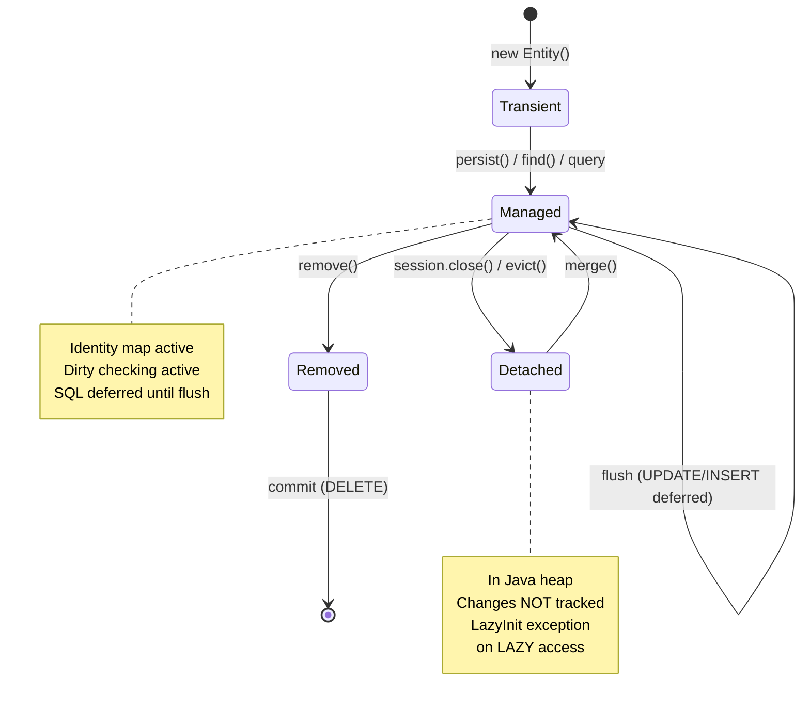

## Keywords in This File

{: .no_toc }

| # | Keyword | Weight |
| --- | --- | --- |
| 1 | [Entity Mapping Fundamentals](#entity-mapping-fundamentals) | critical |
| 2 | [Session, SessionFactory, and Persistence Context](#session-sessionfactory-and-persistence-context) | critical |
| 3 | [HQL and JPQL Queries](#hql-and-jpql-queries) | high |

---

# Entity Mapping Fundamentals

**TL;DR** - `@Entity` declares a class as a persistent object;
`@Id` marks the primary key; column/relationship annotations
declare the mapping between Java fields and database columns.

---

### 🎯 Model Answer

**30 seconds:**
> Entity mapping tells Hibernate which Java class corresponds to which
> database table, which field is the primary key, and how each field
> maps to a column. The minimum required annotations are `@Entity`
> (on the class) and `@Id` (on the primary key field). Everything else
> has sensible defaults: the class name maps to the same-named table,
> fields map to same-named columns. Add annotations only when you need
> to override the default.

**3 minutes (Senior):**
> Entity mapping is the contract between Hibernate and the database.
> Hibernate reads the mapping metadata at startup and uses it to
> generate every SQL statement automatically.
>
> The minimal valid entity needs three things: `@Entity` to
> mark it as persistent, `@Id` to mark the primary key, and a
> `@GeneratedValue` strategy to tell Hibernate how the database
> generates IDs. The rest defaults: table name = class name,
> column names = field names, column type inferred from Java type.
>
> In practice, I override defaults for three reasons. The schema
> predates the code (legacy DB with different naming conventions),
> constraints need to be declared (nullable, unique, length for
> schema validation), or relationship navigation needs control
> (OneToMany with cascade and orphanRemoval).
>
> The most important mapping decisions are: ID generation strategy
> (SEQUENCE for most databases - avoids the table lock of TABLE
> strategy, and is portable unlike IDENTITY), collection type
> (use Set not List for OneToMany to avoid Hibernate's notorious
> "duplicate rows on bag" issue), and cascade settings (NEVER
> use CascadeType.ALL without understanding what DELETE cascade
> means for that relationship).
>
> The non-obvious insight: Hibernate does not validate that your
> Java annotations match the actual database schema unless you set
> `ddl-auto=validate`. A mapping mismatch silently corrupts data
> or throws runtime exceptions. Always run schema validation in CI.

*Adapting up:* Mention `@Embeddable` and `@Embedded` for value
objects (addresses, money) that are stored in the same row but
modeled as separate Java objects - this is the key tool for
avoiding entity sprawl.

*Adapting down:* "Put `@Entity` on the class and `@Id` on the
primary key field. Hibernate figures out the rest."

**Blank Mind Recovery:**

**(1) Restate:** "You are asking about entity mapping - how to
tell Hibernate which class maps to which table."

**(2) First principles:** "From first principles, Hibernate needs
to know three things: which class is persistent, which field is
the key, and how fields map to columns. The annotations answer
exactly those questions."

**(3) Bridge:** "It is like filling out a form that says 'my
class name is X, my table name is Y, here are my columns.' Once
filled out, Hibernate generates all SQL from it automatically."

---

### 📘 Concept Explanation

**What it is:**
Entity mapping is the set of annotations that declare the
correspondence between a Java class and a database table,
including the primary key strategy, column constraints, and
relationship structure.

**The problem it solves:**
Without mapping metadata, Hibernate cannot generate SQL. The
annotations are the configuration language that bridges the
object model to the relational schema. They eliminate the XML
configuration files that early Hibernate (pre-JPA) required,
moving configuration closer to the code it describes.

**How it works:**
1. At startup, Hibernate scans entity classes (guided by
   `@EntityScan` or package scanning).
2. For each `@Entity` class, Hibernate builds a `PersistentClass`
   metadata model describing the table, columns, and relationships.
3. At first use, Hibernate generates prepared SQL templates
   (INSERT, SELECT, UPDATE, DELETE) from the metadata.
4. At runtime, it fills in bind parameters and executes via JDBC.
5. ResultSet rows are mapped back to Java objects using the same
   metadata in reverse.

**The key insight:**
Convention over configuration: most mappings use defaults. Override
only when the schema differs from convention. A class named `User`
with a field named `email` will correctly map to a `user` table
with an `email` column without any `@Table` or `@Column`
annotations.

**When to use it:**
- Every persistent domain object requires these annotations
- `@Table(name=...)` when table name differs from class name
- `@Column(nullable=false, unique=true, length=255)` for
  constraint documentation and schema generation
- `@Embedded` for value objects that belong in the same row

**When NOT to use it:**
- Do not annotate utility classes or DTOs as `@Entity`
- Do not use `@Entity` on classes that are never persisted
  (causes Hibernate to attempt schema for them)

**Alternatives:**
- XML mapping files (`.hbm.xml`) - legacy, avoid for new code
- Programmatic mapping via Hibernate's `MetadataBuilder` API -
  useful for dynamic schemas

**First-principles derivation:**
Hibernate needs a mapping contract to generate SQL. Annotations
co-located with the class are the lowest-friction way to declare
that contract. The JPA spec standardized these annotations
so that entity classes are portable across providers.

---

### 💻 Code Example

```java
// BAD: Missing constraints - compiles, silently wrong
@Entity
public class Product {
    @Id
    private Long id; // no generation strategy
    private String name; // no length, nullable by default
    private double price; // double for money = precision loss
}
```

> **Code walkthrough:** This compiles and Hibernate will
> work with it, but it has three problems. No `@GeneratedValue`
> means IDs must be set manually - forget once and the insert
> fails. `double` for money is a precision error waiting to happen
> (use `BigDecimal`). No column constraints means `null` can be
> inserted for required fields.

```java
// GOOD: Production-quality entity mapping
@Entity
@Table(name = "products",
    uniqueConstraints = @UniqueConstraint(
        columnNames = {"sku"}))
public class Product {

    @Id
    @GeneratedValue(strategy = GenerationType.SEQUENCE,
        generator = "product_seq")
    @SequenceGenerator(name = "product_seq",
        sequenceName = "product_id_seq",
        allocationSize = 50)
    private Long id;

    @Column(nullable = false, length = 100)
    private String name;

    @Column(nullable = false, unique = true, length = 50)
    private String sku;

    @Column(nullable = false, precision = 19, scale = 4)
    private BigDecimal price;

    @Column(nullable = false)
    private boolean active = true;

    // Embedded value object - same table, better model
    @Embedded
    private Dimensions dimensions;
}

@Embeddable
public class Dimensions {
    @Column(name = "length_cm")
    private double length;
    @Column(name = "width_cm")
    private double width;
    @Column(name = "height_cm")
    private double height;
}
```

> **Code walkthrough:** `SEQUENCE` generation strategy with
> `allocationSize = 50` means Hibernate reserves 50 IDs per
> DB sequence call, then assigns them in memory - 50x fewer
> roundtrips than `IDENTITY` (which requires a DB roundtrip
> per insert). `BigDecimal` with `precision=19, scale=4` is
> the correct type for monetary values. `@Embedded` places
> Dimensions columns directly in the products table while
> allowing a clean `dimensions.length` domain model.

---

### 🎓 Answers by Seniority

**Junior / Mid (0-5 years):**
> Entity mapping needs at minimum `@Entity` on the class and
> `@Id` on the primary key. Hibernate defaults: table name = class
> name, column names = field names. I add `@Table` to override
> the table name for legacy schemas, `@Column` to add constraints
> like `nullable = false` and `length`, and `@GeneratedValue`
> to let the database generate IDs. I use `GenerationType.SEQUENCE`
> for most databases because it is efficient and portable.

*Push deeper:* "I use `@Embedded` for value objects like
Address or Money that belong in the same table row but should
be separate classes in the domain model."

---

**Senior / Staff (5+ years):**
> The mapping decisions that matter most in production are the
> ID generation strategy, collection type, and cascade settings.
> For ID generation I use SEQUENCE with `allocationSize = 50` -
> this amortizes the DB roundtrip for sequence reads across 50
> inserts, which matters at high write volumes. For OneToMany
> collections I use `Set` not `List` - Hibernate has a known bug
> with bags (Lists without index) where it deletes and re-inserts
> all rows instead of the changed rows on update, causing massive
> DELETE-INSERT churn in the database.
>
> Cascade settings are the mapping decision with the most
> production accidents. `CascadeType.ALL` includes REMOVE, which
> means deleting a parent cascades a DELETE to all children.
> This is correct for Order -> OrderItem but catastrophic if
> accidentally applied to User -> Orders. I always enumerate
> cascade types explicitly: `cascade = {PERSIST, MERGE}` rather
> than ALL.
>
> Schema validation in CI is non-negotiable. I run
> `spring.jpa.hibernate.ddl-auto=validate` in CI against a
> Flyway-migrated database. This catches mapping-schema
> mismatches before they reach production.

*Push deeper:* "The `@Embeddable` pattern is underused for
value objects. Shipping Address, Money, and GPS Coordinates
should be embedded in the owning entity's table - not
normalized into separate tables where the join cost outweighs
the normalization benefit."

---

### ⚠️ Common Misconceptions

| Misconception | Reality | Danger Level |
|---|---|---|
| "Use List for collections - it is more natural" | Lists without @OrderColumn cause DELETE+INSERT churn; use Set for unordered collections | Critical |
| "CascadeType.ALL is safe by default" | ALL includes REMOVE; deleting a parent deletes all children - often unintended | Critical |
| "IDENTITY generation is fine for all databases" | IDENTITY requires DB roundtrip per INSERT, disabling JDBC batch inserts | High |
| "Table name defaults to class name exactly" | Hibernate lowercases the class name in many dialects; test on your actual DB | Medium |
| "@Column is optional since it has defaults" | Omitting @Column means no length, nullable = true, which leaves the schema unconstrained | Medium |

---

### 🚨 Failure Modes and Diagnosis

**Failure 1: SEQUENCE Exhaustion**

*Symptom:* `INSERT` fails with `org.hibernate.exception.ConstraintViolationException:
could not execute statement` due to duplicate primary keys.

*Root cause:* `allocationSize` in `@SequenceGenerator` is set
higher than the actual DB sequence increment. For example,
`allocationSize=50` but `CREATE SEQUENCE ... INCREMENT BY 1`
means Hibernate assigns IDs 1-50 from the in-memory pool, but
the next DB sequence call returns 2 (not 51), causing duplicates.

*Diagnostic:*
```sql
-- Check actual DB sequence increment
SELECT sequence_name, increment_by
FROM information_schema.sequences
WHERE sequence_name = 'product_id_seq';
```

*Fix:* Either set `@SequenceGenerator(allocationSize = 50)`
AND `CREATE SEQUENCE ... INCREMENT BY 50`, or use
`allocationSize = 1` (safe but slower).

---

**Failure 2: Collection DELETE+INSERT Churn**

*Symptom:* Updating a parent entity's collection causes all
collection rows to be deleted and re-inserted, not just the
changed ones. Database logs show `DELETE FROM order_items
WHERE order_id = ?` followed by multiple INSERTs.

*Root cause:* Using `List<OrderItem>` (a bag) without
`@OrderColumn`. Hibernate cannot identify which specific bag
element changed, so it clears and rebuilds the entire bag.

*Fix:*
```java
// BAD: List as unordered bag
@OneToMany(mappedBy = "order", cascade = PERSIST)
private List<OrderItem> items = new ArrayList<>();

// GOOD: Set for unordered collection
@OneToMany(mappedBy = "order", cascade = PERSIST)
private Set<OrderItem> items = new HashSet<>();
```

---

**Failure 3: `@Transient` Field Accidentally Persisted**

*Symptom:* A computed or cached field is being persisted to
the database and interfering with queries.

*Root cause:* Forgetting `@Transient` on fields that should
not be mapped.

*Fix:*
```java
@Entity
public class Product {
    // ...
    @Transient // exclude from persistence
    private BigDecimal cachedDiscountedPrice;

    public BigDecimal getDiscountedPrice() {
        if (cachedDiscountedPrice == null) {
            cachedDiscountedPrice = price.multiply(
                BigDecimal.valueOf(0.9));
        }
        return cachedDiscountedPrice;
    }
}
```

---

### 🎯 Interview Deep-Dive

| Timing | Seniority | Focus |
|--------|-----------|-------|
| 2 min | Junior | Minimum annotations for a valid entity |
| 3 min | Mid | GenerationType strategies and trade-offs |
| 5 min | Senior | Collection type issues and cascade dangers |
| 7 min | Staff | Schema validation and mapping-schema mismatch prevention |
| 10 min | FAANG | High-volume entity mapping for 1M inserts/minute |

---

**Q1 [JUNIOR] - DEFINITION**
What is the minimum annotation set for a valid JPA entity?

*Why they ask:* Tests baseline knowledge; many candidates add
unnecessary annotations.

*Likely follow-up:* "What does Hibernate assume by default?"

**Answer:**
The minimum valid JPA entity requires exactly two things:
`@Entity` on the class and `@Id` on the primary key field.

```java
@Entity
public class Product {
    @Id
    private Long id;
    private String name;
}
```

This is valid and Hibernate will map it. The defaults are:
table name equals the class name (`product` or `Product`
depending on dialect), each non-transient field maps to
a column with the same name, and the Java type determines
the SQL column type.

In practice I always add a third annotation: `@GeneratedValue`
on the `@Id` field. Without it, the application must set the
ID manually before every persist - forgetting causes a
constraint violation. I use `GenerationType.SEQUENCE` for
most databases (efficient, portable) or `GenerationType.IDENTITY`
for databases without sequence support (MySQL without sequences).

*What separates good from great:* Explaining WHY `@GeneratedValue`
is effectively required even though it is technically optional.

---

**Q2 [MID] - COMPARISON**
Compare GenerationType.IDENTITY, SEQUENCE, and TABLE.
When should you use each?

*Why they ask:* ID generation is a trade-off with performance
implications that interviewers probe for production awareness.

*Likely follow-up:* "What is the allocationSize parameter
and why does it matter?"

**Answer:**
The three strategies have fundamentally different performance
profiles.

`IDENTITY` relies on auto-increment columns (MySQL AUTO_INCREMENT,
PostgreSQL SERIAL). The database assigns the ID during INSERT and
returns it. Hibernate must execute the INSERT immediately to get
the ID back - it cannot batch inserts for IDENTITY entities
because JDBC batch requires binding all parameters before
execution. This makes IDENTITY 10-50x slower than SEQUENCE for
high-volume inserts.

`SEQUENCE` uses a database sequence object. Hibernate calls
`nextval()` to reserve a block of IDs (controlled by
`allocationSize`, default 50), then assigns IDs from memory for
the next 50 inserts before making another DB call. This allows
JDBC batch inserts because IDs are known before the INSERT.
SEQUENCE requires database support (PostgreSQL, Oracle, H2
- not traditional MySQL without extension).

`TABLE` simulates sequences using a table with lock-and-increment.
Every ID acquisition requires a SELECT + UPDATE with a lock
on the sequence row. This is the worst performer and was designed
for databases that have neither sequences nor auto-increment.
Avoid unless absolutely necessary.

In practice: use SEQUENCE for PostgreSQL and Oracle, IDENTITY
for MySQL (accepting the batch insert trade-off), and never
TABLE unless you have no choice.

*What separates good from great:* Knowing that IDENTITY disables
JDBC batch inserts - this is a production performance detail that
separates developers who have done bulk loading from those who
have not.

---

**Q3 [SENIOR] - DEBUGGING**
You see all rows deleted and re-inserted whenever you update
one item in a collection. What is the diagnosis?

*Why they ask:* This is a real production problem that causes
unexpected database load.

*Likely follow-up:* "When would you use `@OrderColumn`?"

**Answer:**
This is the Hibernate bag delete-insert problem. When a OneToMany
collection is mapped as a `List` (a bag) without `@OrderColumn`,
Hibernate cannot track which individual element changed. When you
call `collection.add(newItem)` and flush, Hibernate does not
know "add one row." It knows "the collection is dirty" and takes
the safe path: DELETE all existing collection rows, then INSERT
the new complete set.

With 1,000 items in the collection, updating one item causes
1,000 DELETEs and 1,001 INSERTs. This is catastrophic for
high-update applications.

Diagnosis: enable Hibernate SQL logging and look for a DELETE
with no `WHERE id =` clause followed by many INSERTs:
```sql
delete from order_items where order_id=?  -- all rows!
insert into order_items values (?, ?, ?)  -- full rebuild
insert into order_items values (?, ?, ?)
-- ... 999 more inserts
```

Fix: change the collection to `Set`, which uses element identity
rather than position:
```java
// BAD: bag behavior
@OneToMany
private List<OrderItem> items;

// GOOD: set behavior, proper element tracking
@OneToMany
private Set<OrderItem> items;
```

If order matters, use `@OrderColumn` which adds a position
column to the table and enables proper index-based tracking.
Only do this if you genuinely need ordered collections - the
position column maintenance adds write overhead.

*What separates good from great:* Knowing the diagnosis command
(SQL log pattern showing DELETE without id clause) and the
exact fix.

---

**Q4 [SENIOR] - TRADE-OFF**
What are the advantages and risks of using `CascadeType.ALL`
on entity relationships?

*Why they ask:* Cascade misconfiguration causes data loss - a
critical production failure mode.

*Likely follow-up:* "What is `orphanRemoval` and when should
you use it?"

**Answer:**
`CascadeType.ALL` is a shortcut that applies all cascade types:
PERSIST, MERGE, REMOVE, REFRESH, DETACH. The convenience is
that saving a parent automatically saves its children. The danger
is that REMOVE is included: deleting a parent deletes all its
children.

For some relationships, cascade REMOVE is correct: Order ->
OrderItem. An order that no longer exists should have no items.
For other relationships, cascade REMOVE is catastrophic: User
-> Orders. Deleting a user who completed 10,000 orders should
not delete those orders - they are historical records.

I always enumerate cascade types explicitly rather than using
ALL:
```java
// BAD: ALL includes unintended REMOVE
@OneToMany(cascade = CascadeType.ALL)
private Set<Order> orders;

// GOOD: explicit cascades, no accidental delete
@OneToMany(cascade = {CascadeType.PERSIST,
    CascadeType.MERGE})
private Set<Order> orders;

// Correct for composition (not aggregation)
@OneToMany(cascade = CascadeType.ALL,
    orphanRemoval = true)
private Set<OrderItem> items;
```

`orphanRemoval = true` removes child entities when they are
removed from the parent's collection - not just when the parent
is deleted. With `orphanRemoval`, calling
`order.getItems().remove(item)` causes a DELETE for that item
at flush time. Without `orphanRemoval`, the item row remains
in the database (with a null FK or standalone).

*What separates good from great:* Distinguishing composition
(Order has OrderItems - ALL + orphanRemoval is correct) from
aggregation (User has Orders - only PERSIST/MERGE is appropriate).

---

**Q5 [MID] - MECHANISM**
What does `@Embeddable` do and when should you use it instead
of a separate entity?

*Why they ask:* Tests knowledge of the value object pattern
in domain-driven design and how Hibernate models it.

*Likely follow-up:* "What is the difference between an entity
and a value object?"

**Answer:**
`@Embeddable` marks a class as a value object that is stored
as part of the owning entity's table row rather than in a
separate table. An embedded object has no independent identity
or lifecycle - it exists only as part of its owner.

The canonical examples are postal addresses, monetary amounts,
and geometric dimensions:
```java
@Embeddable
public class Address {
    @Column(name = "street_line1")
    private String line1;
    @Column(name = "street_line2")
    private String line2;
    @Column(name = "city")
    private String city;
    @Column(name = "postal_code")
    private String postalCode;
    @Column(name = "country_code", length = 2)
    private String countryCode;
}

@Entity
public class User {
    @Id Long id;
    String name;

    @Embedded
    private Address shippingAddress;

    @Embedded
    @AttributeOverrides({
        @AttributeOverride(name = "line1",
            column = @Column(name = "billing_line1")),
        // override other columns...
    })
    private Address billingAddress;
}
```

The User table has columns `street_line1`, `city`, etc. for
shipping address AND `billing_line1` etc. for billing address
(using `@AttributeOverrides` to rename).

Use `@Embeddable` when: the object has no independent existence
outside its owner, has no unique identity across owners, and
is conceptually a component of the owner's value rather than
a related entity. Use a separate `@Entity` when: the object can
be shared by multiple owners, needs independent querying,
or has its own lifecycle.

*What separates good from great:* The `@AttributeOverrides`
pattern for embedding the same type twice (shipping/billing
address) - this is a practical requirement that demonstrates
real usage.

---

**Q6 [JUNIOR] - DEBUGGING**
Your entity's `@Column(nullable = false)` annotation is not
preventing nulls from being inserted. Why?

*Why they ask:* Tests understanding of what column annotations
actually do.

*Likely follow-up:* "How do you enforce this constraint properly?"

**Answer:**
`@Column(nullable = false)` serves two purposes, and they work
at different times: schema generation and runtime validation.

If `spring.jpa.hibernate.ddl-auto` is set to `create` or
`update`, Hibernate uses `nullable = false` to add a `NOT NULL`
constraint to the DDL when creating the table. This is a database
constraint - any INSERT or UPDATE that sets null will fail with
a database exception.

However, `@Column` annotations have no effect on runtime
Java-level validation. They do not prevent `entity.setName(null)`
from executing. They do not cause Hibernate to throw an exception
when you set a field to null in Java. The exception only comes when
Hibernate tries to execute the SQL INSERT/UPDATE and the database
rejects it.

If `ddl-auto` is `validate` or `none` (correct for production),
Hibernate does not create the table - it just validates the mapping
against the existing schema. If the production database was
created by Flyway and the column IS nullable (the schema was
created without the NOT NULL constraint), nulls will insert
successfully.

To properly enforce not-null: (1) ensure the database column
has the `NOT NULL` constraint (manage via Flyway/Liquibase),
(2) add Bean Validation `@NotNull` to the field for runtime
Java-level validation:
```java
@NotNull
@Column(nullable = false)
private String name;
```

With both, `@NotNull` prevents setting null in Java,
and the DB constraint is a last-resort safety net.

*What separates good from great:* Understanding that `@Column`
affects DDL generation only, while Bean Validation `@NotNull`
provides runtime Java validation.

---

**Q7 [STAFF] - PRODUCTION**
You need to validate that Hibernate mappings match the
production schema before deploying. How do you do this?

*Why they ask:* Tests production safety practices for schema
management.

*Likely follow-up:* "What is your rollback strategy if a
mapping change breaks production?"

**Answer:**
Schema validation in production is a critical safety check.
A mismatch between entity mappings and the actual schema causes
runtime exceptions that are very difficult to diagnose.

My approach has three layers.

First: `spring.jpa.hibernate.ddl-auto=validate` in production
configuration. At startup, Hibernate reads every entity's
mapping metadata and checks that the corresponding table exists
with the expected columns, types, and constraints. If anything
is missing or wrong, Hibernate throws a `SchemaManagementException`
at startup and the application fails to start. This is
fail-fast - a startup failure is far better than a runtime
failure on the first request that accesses a missing column.

Second: schema migration with Flyway or Liquibase in CI.
Every schema change is a migration script (V123__add_product_sku.sql).
CI runs: apply migrations to a test database, then start the
application with `ddl-auto=validate`. If the mapping and migration
are inconsistent, the test fails before deployment.

Third: integration tests with `TestContainers`. Tests run against
a real PostgreSQL container with Flyway applied. Any query that
maps to a missing column fails immediately, not hypothetically.

For rollback: every Flyway migration must have a corresponding
undo migration (V123__add_product_sku_undo.sql). For a failed
deployment: roll back the application (deploy previous version),
then run the undo migration. Entity mappings in the previous
version are compatible with the previous schema.

*What separates good from great:* The Flyway + ddl-auto=validate
combination in CI - this is the industry-standard pattern that
catches the entire class of "deployment broke because schema
and code are out of sync" failures.

---

*(Omit: Comparison Table - ★☆☆ keyword)*

*(Omit: System Design - ★☆☆ keyword)*

*(Omit: Diagram - concept is code-centric, prose and code suffice)*

---

---

# Session, SessionFactory, and Persistence Context

**TL;DR** - SessionFactory is the application-scoped expensive
singleton; Session is the cheap per-request unit of work that
tracks managed entities within a transaction.

---

### 🎯 Model Answer

**30 seconds:**
> SessionFactory is a heavyweight, thread-safe singleton created once
> at startup. It holds all mapping metadata and manages connection
> pools. Session is a lightweight, non-thread-safe unit of work
> created per request. The Session IS the persistence context: it
> tracks which entities are managed, compares snapshots for dirty
> checking, and executes SQL at flush time. Never share a Session
> across threads; never create a new SessionFactory per request.

**3 minutes (Senior):**
> The distinction between SessionFactory and Session maps exactly
> to "expensive startup" vs "cheap per-request." SessionFactory
> takes 2-60 seconds to initialize (entity scanning, metadata
> compilation, connection pool warm-up), holds all schema knowledge,
> and is designed to live for the application's lifetime.
>
> Session (or its JPA equivalent, EntityManager) is the operational
> unit. Spring creates a new Session at the start of each
> `@Transactional` method and closes it when the method returns.
> The Session maintains the persistence context - a HashMap of
> entity references keyed by (class, primary key). This serves
> as the first-level cache: loading User 42 twice in the same
> transaction returns the same Java object instance.
>
> The persistence context has a lifecycle: entities enter as
> Transient (new, not associated), become Persistent/Managed
> when loaded or saved (associated with the open session, dirty
> tracking active), become Detached when the session closes
> (still in memory, changes not tracked), and Removed when marked
> for deletion.
>
> The failure mode that catches most developers: accessing a LAZY
> association on a Detached entity after the Session closes throws
> `LazyInitializationException`. The entity is in memory, but the
> Session that could execute the SQL query is gone. Fix: either
> expand the transaction scope to cover the association access,
> eagerly load with JOIN FETCH, or convert to DTOs within the
> transaction before closing.

*Adapting up:* Mention that Spring's `@PersistenceContext`
injects a thread-bound Session proxy - not the actual Session -
which transparently handles session-per-request scoping.

*Adapting down:* "SessionFactory is the factory (create once).
Session is the connection wrapper (create per request)."

**Blank Mind Recovery:**

**(1) Restate:** "You are asking about SessionFactory and Session -
the two core Hibernate objects and how they relate."

**(2) First principles:** "From first principles, any database
framework needs: one object to hold global configuration and
connection pools (SessionFactory), and one object per request
to execute queries and track changes (Session)."

**(3) Bridge:** "SessionFactory is like a hotel (built once,
serves many guests). Session is like a hotel room (assigned
to one guest for their stay, released when they leave)."

---

### 📘 Concept Explanation

**What it is:**
`SessionFactory` is the application-scoped, thread-safe factory
that holds all mapping metadata and manages database connections.
`Session` is the per-transaction, non-thread-safe unit of work
that is the persistence context - tracking managed entities,
executing SQL, and managing the identity map.

**The problem it solves:**
Database connections are expensive (TCP handshake, authentication,
protocol negotiation). Without connection pooling and a factory
that manages pools, every database operation would require a new
connection. The SessionFactory holds the pool and reuses connections.
Without per-request session scoping, concurrent transactions would
interfere with each other's entity tracking.

**How it works:**

```
Application startup:
SessionFactory
  - Reads entity mappings
  - Builds PreparedStatement templates
  - Opens connection pool (HikariCP default)
  - Thread-safe, lives for app lifetime

Per-request (in @Transactional method):
Session (= EntityManager = Persistence Context)
  - Opens connection from pool
  - Identity map: Map<EntityKey, Object>
  - Snapshot map: Map<EntityKey, Object[]>
  - First-level cache (hits before DB)
  - Dirty checking at flush
  - Closes: releases connection, clears maps
```

**The key insight:**
The persistence context is a unit-of-work scope, not a connection
scope. Within one Session, every entity has exactly one Java
instance (identity map). Dirty checking compares the current state
to the snapshot taken at load. At flush, Hibernate generates SQL
for changed entities. The Session is the synchronization point
between the Java object graph and the database.

**When to use it:**
- SessionFactory: configured and accessed via Spring dependency
  injection as a singleton. Never create manually in application code.
- Session: always obtained via Spring's `@Transactional` management,
  never created or closed manually in business code.
- Access Session directly (via `em.unwrap(Session.class)`) only when
  needing Hibernate-specific APIs like `StatelessSession`.

**When NOT to use it:**
- Never store Session in an instance field of a Spring singleton bean
- Never share a Session across threads
- Never create a Session per SQL statement (defeats connection pooling)

**Alternatives:**
- JPA EntityManager is the standard equivalent of Session
- Spring's `@Transactional` manages both Session and EntityManager
  lifecycle transparently

**First-principles derivation:**
Given: creating a DB connection takes 50-200ms. Given: each request
takes 5-50ms. Constraint: you cannot create a connection per request.
Solution: pool connections, managed by a factory that lives longer
than any single request. Given: entity tracking state must not
leak between requests. Constraint: each request needs its own
entity scope. Solution: per-request Session that is created fresh
and closed after each transaction.

---

### 💻 Code Example

```java
// BAD: Session stored in field - not thread-safe
@Service
public class OrderService {
    // WRONG: Session is not thread-safe!
    private Session session;

    @Autowired
    public OrderService(SessionFactory sf) {
        // This session is shared across all threads
        this.session = sf.openSession();
    }
}
```

> **Code walkthrough:** This is a critical mistake. The `Session`
> (identity map, dirty tracking state) is shared across all
> concurrent HTTP requests. Two requests modifying the same entity
> corrupt each other's state. Spring's `@PersistenceContext` avoids
> this by injecting a thread-bound proxy.

```java
// GOOD: Spring manages Session lifecycle via @Transactional
@Service
@Transactional
public class OrderService {

    @PersistenceContext
    private EntityManager em; // Spring thread-bound proxy

    public Order findWithItems(Long id) {
        // JPQL with JOIN FETCH - no LazyInit exception
        return em.createQuery(
            "SELECT o FROM Order o
             JOIN FETCH o.items
             WHERE o.id = :id", Order.class)
            .setParameter("id", id)
            .getSingleResult();
    }

    public void updateStatus(Long id, String status) {
        Order order = em.find(Order.class, id);
        order.setStatus(status); // dirty, no explicit save
        // Hibernate auto-updates at transaction commit
    }
}
```

> **Code walkthrough:** `@PersistenceContext` injects a Spring-managed
> proxy that dispatches to the current thread's Session. Spring creates
> a new Session at the start of `@Transactional` and closes it when
> the method returns. `em.find()` loads into the identity map. Setting
> `order.setStatus(status)` marks the entity dirty; Hibernate generates
> the UPDATE automatically at commit. The `JOIN FETCH` prevents the
> LazyInit exception that would occur if `order.getItems()` was accessed
> after the Session closed.

```java
// GOOD: StatelessSession for batch operations
// bypasses identity map and dirty checking
@Transactional
public void processOrders(List<Long> orderIds) {
    Session session = em.unwrap(Session.class);
    StatelessSession ss =
        session.getSessionFactory().openStatelessSession();
    try {
        Transaction tx = ss.beginTransaction();
        int count = 0;
        for (Long id : orderIds) {
            Order o = ss.get(Order.class, id);
            o.setProcessed(true);
            ss.update(o); // explicit, no dirty tracking
            if (++count % 500 == 0) {
                tx.commit();
                tx = ss.beginTransaction();
            }
        }
        tx.commit();
    } finally {
        ss.close();
    }
}
```

> **Code walkthrough:** `StatelessSession` bypasses the identity
> map and dirty checking. Each `get` and `update` call maps directly
> to a JDBC operation without maintaining any in-memory state.
> The batch commit every 500 rows controls memory and prevents
> a single massive transaction. This can process 10x more rows
> per second than a regular Session for bulk updates.

---

### 🎓 Answers by Seniority

**Junior / Mid (0-5 years):**
> SessionFactory is the heavyweight application singleton - created
> once at startup, holds mapping metadata and connection pool.
> Session is the per-request unit of work - created at the start
> of a `@Transactional` method, closed when it returns. The Session
> is the persistence context: it tracks which entities are loaded,
> detects changes (dirty checking), and flushes SQL at commit.
> I never create or close Sessions manually; Spring handles that
> via `@Transactional`.

*Push deeper:* "The persistence context is also the first-level
cache: loading the same entity twice in one transaction returns
the same Java object, not two copies."

---

**Senior / Staff (5+ years):**
> The persistence context boundary is the key concept. Spring's
> `@Transactional` defines where the Session is opened (start of
> the method) and closed (return from the method). Every managed
> entity within that boundary has exactly one Java instance
> (identity map) and is dirty-checked at flush. After the method
> returns, entities become Detached: they are in memory but the
> Session is gone. Any access to a LAZY association on a detached
> entity throws `LazyInitializationException`.
>
> The patterns I use to work with this boundary: JOIN FETCH or
> EntityGraphs to load all required associations within the
> transaction, DTOs to project the data I need before the Session
> closes, and `@Transactional(readOnly = true)` for queries to
> disable dirty tracking and snapshot storage.
>
> For batch processing, I use `StatelessSession` which bypasses
> the identity map entirely - load, modify, update are explicit
> JDBC-level operations without state accumulation. This is the
> only Hibernate API that scales to millions of rows without
> `session.clear()` maintenance.

*Push deeper:* "The `EXTENDED` persistence context in JPA
keeps the Session open across multiple transactions - used
in conversation patterns. Spring rarely uses this because it
requires careful scoping to prevent memory leaks from accumulating
entities across the extended session lifetime."

---

### ⚠️ Common Misconceptions

| Misconception | Reality | Danger Level |
|---|---|---|
| "Session is thread-safe like EntityManagerFactory" | Session/EntityManager is NOT thread-safe; one per thread | Critical |
| "I need to explicitly save after modifying an entity" | Dirty checking auto-generates UPDATE; explicit save is only needed for new (Transient) entities | Medium |
| "The Session holds a dedicated database connection" | Session borrows a connection from the pool only during active operations, returns it between calls | Medium |
| "@Transactional always creates a new Session" | Spring reuses an existing Session if one is already active in the call stack (REQUIRED propagation) | High |
| "Closing the Session persists pending changes" | Session.close() does NOT commit. Commit must be explicit (or triggered by @Transactional return) | Critical |

---

### 🚨 Failure Modes and Diagnosis

**Failure 1: Open Session in View Anti-pattern**

*Symptom:* LAZY associations work in controllers but ORM
performance is terrible. SQL queries fire during template
rendering (Thymeleaf, JSP), often in a loop.

*Root cause:* `spring.jpa.open-in-view=true` (Spring Boot
default!) keeps the Session open for the entire HTTP request
including the view rendering phase. LAZY associations resolve
successfully but cause N+1 queries during rendering where
there is no visibility into SQL count.

*Diagnostic:*
```properties
# Check for OSIV in logs:
spring.jpa.open-in-view=true
# Logs: "Spring OpenEntityManagerInViewInterceptor: Opening JPA..."
# Fix: disable OSIV, load all data in service layer
spring.jpa.open-in-view=false
```

*Fix:* Set `open-in-view=false`, load all required associations
with JOIN FETCH in the service layer, return DTOs.

---

**Failure 2: Multiple Sessions in Same Request**

*Symptom:* `HibernateException: Session is closed` or entities
not updated despite appearing to modify them.

*Root cause:* Calling a service method from within a
`@Transactional` method that itself opens a new transaction
(REQUIRES_NEW propagation), creating a second Session on the
same thread. The first Session's entities are not visible
in the second.

*Diagnostic:* Look for `@Transactional(propagation = REQUIRES_NEW)`
in the call chain. Enable transaction logging:
```properties
logging.level.org.springframework.transaction=DEBUG
```

*Fix:* Understand transaction propagation. Use REQUIRES_NEW
only when you genuinely need a separate transaction (audit log,
independent commit). For most cases, REQUIRED (default, reuse
existing session) is correct.

---

### 🎯 Interview Deep-Dive

| Timing | Seniority | Focus |
|--------|-----------|-------|
| 2 min | Junior | Session vs SessionFactory roles |
| 3 min | Mid | Persistence context lifecycle states |
| 5 min | Senior | LazyInitializationException causes and fixes |
| 7 min | Staff | OSIV anti-pattern and proper transaction scoping |
| 10 min | FAANG | Session design for high-concurrency API |

---

**Q1 [JUNIOR] - DEFINITION**
What is the difference between Session and SessionFactory?

*Why they ask:* The most fundamental Hibernate question -
tests whether you know the basic architecture.

*Likely follow-up:* "Why is Session not thread-safe?"

**Answer:**
SessionFactory and Session operate at completely different
scopes and have opposite creation costs.

SessionFactory is the heavyweight, application-scoped singleton.
It is created once at startup (typically taking 2-60 seconds for
large schemas) and lives for the application's lifetime. It holds
all entity mapping metadata, manages the database connection pool
(via HikariCP or c3p0), and generates the prepared SQL templates
for all entities. SessionFactory is fully thread-safe - all threads
share one factory.

Session is the lightweight, per-request unit of work. Spring
creates a new Session at the start of each `@Transactional`
method and closes it when the method returns. The Session is
cheap to create (microseconds). It maintains the persistence
context: a HashMap of loaded entities, their snapshots for dirty
checking, and any deferred SQL. Session is NOT thread-safe
because it holds mutable state per transaction.

The analogy: SessionFactory is a cookie factory (built once,
complex machinery, serves everyone). Session is a cookie jar
(cheap, per person, discarded after use).

In Spring Boot, you never create either directly. Spring Boot
auto-configures the SessionFactory at startup from your entity
classes, and Spring's `@Transactional` manages Session creation
and destruction per request.

*What separates good from great:* Knowing that SessionFactory
is NOT created per request - this is the classic mistake (create
SessionFactory in a request handler) that causes 60-second
response times.

---

**Q2 [MID] - MECHANISM**
Walk me through the four entity lifecycle states in JPA.

*Why they ask:* Understanding entity states is essential for
understanding why certain operations behave as they do.

*Likely follow-up:* "What happens when you call `merge()` on a
detached entity?"

**Answer:**
Every JPA entity is in one of four states relative to the
persistence context.

Transient: the object was just created with `new`. It is not
associated with any Session. Hibernate does not know it exists.
If the application loses all references to it, it is
garbage-collected with no database effect.

Persistent/Managed: the entity is associated with an open Session.
This happens after `entityManager.persist()` (for new entities),
`entityManager.find()` (loaded from DB), or after a JPQL/Criteria
query. In this state, Hibernate has a snapshot and will dirty-check
the entity at flush.

Detached: the Session was closed while the entity was still in
memory. The object still exists in the Java heap, but Hibernate
no longer tracks it. Changes to a Detached entity are NOT
automatically persisted. To persist changes: call `entityManager.merge(detachedEntity)`
which copies the detached state into a new Managed entity in the
current Session.

Removed: `entityManager.remove()` was called on a Managed entity.
Hibernate will execute a DELETE when the Session flushes. The
entity is still in memory until the transaction commits.

The state that causes most production bugs is Detached. A common
scenario: a REST API loads an entity in one `@Transactional` method,
returns it from the controller, the view layer attempts to access
a LAZY association, and the Session is already closed. The fix is
to load all required data within the transaction or to use DTOs
to transfer data out of the persistence boundary.

*What separates good from great:* Explaining `merge()` for
detached entities - many candidates know the four states but
do not know how to reattach a detached entity.

---

**Q3 [SENIOR] - DEBUGGING**
`LazyInitializationException: could not initialize proxy`
appears in production. How do you diagnose and fix it?

*Why they ask:* This is the most common Hibernate runtime
exception - every Hibernate developer encounters it.

*Likely follow-up:* "How do you prevent it from ever occurring?"

**Answer:**
LazyInitializationException means code tried to access a
LAZY-loaded association after the Hibernate Session was closed.
The Session that could execute the SQL query no longer exists.

Diagnosis: the exception stack trace pinpoints the exact field
access that triggered it (e.g., `Order.getItems()`). The Session
was closed at the `@Transactional` method boundary above it in
the stack. The code that is accessing the collection is running
outside that boundary - typically in a controller, REST
serializer (Jackson), or view template.

Common causes in Spring Boot:
1. Jackson serializing an entity that has LAZY collections -
   Jackson accesses fields during serialization after the
   service method (with `@Transactional`) returned.
2. Open Session in View is disabled but the controller is
   accessing LAZY associations directly.
3. A Spring Bean method without `@Transactional` calling
   a service that returns an entity.

Fixes, in order of preference:

```java
// Fix 1: JOIN FETCH - load everything needed in one query
@Query("SELECT o FROM Order o
  JOIN FETCH o.items WHERE o.id = :id")
Order findWithItems(@Param("id") Long id);

// Fix 2: EntityGraph - more flexible than JOIN FETCH
@EntityGraph(attributePaths = {"items", "items.product"})
Optional<Order> findById(Long id);

// Fix 3: DTO projection - never expose entity beyond service
@Transactional(readOnly = true)
public OrderDTO getOrderDTO(Long id) {
    Order o = repo.findWithItems(id);
    return new OrderDTO(o); // construct DTO inside session
}
```

The systematic prevention: always return DTOs from service
methods, never return entities. Entities should never cross
the service layer boundary. This eliminates LazyInit exceptions
by design.

*What separates good from great:* The "never expose entities
beyond the service layer" principle as a systematic prevention
strategy, not just fixing individual occurrences.

---

**Q4 [SENIOR] - TRADE-OFF**
Should `spring.jpa.open-in-view=true` (Spring Boot default)
be enabled or disabled?

*Why they ask:* This is a known Spring Boot controversial
default that tests depth of understanding.

*Likely follow-up:* "If you disable it, what do you change
in your service layer?"

**Answer:**
Open Session in View (OSIV) should be disabled in production
applications. Spring Boot enables it by default, which I
consider a poor default for production.

What OSIV does: it opens the Hibernate Session at the start of
the HTTP request and keeps it open until after the view is
rendered (or after the HTTP response is written for REST APIs).
This allows LAZY associations to be resolved anywhere in the
request lifecycle - including controller code, Jackson
serialization, and Thymeleaf templates.

Why it is problematic: it hides N+1 query problems. A template
that accesses `order.customer.address.city` executes 3 LAZY
loads that you cannot see in the service layer tests. These
queries fire inside the HTTP thread, holding a database
connection from the pool for the entire duration of view
rendering - potentially 50-200ms where the connection is idle.
Under load, this exhausts the connection pool.

OSIV also encourages poor architecture: mixing data access
(SQL) into the presentation layer (templates, serializers)
without visibility. This makes performance testing misleading
(service tests show 1 query, production shows 50 per request).

When disabled, the fix is straightforward:
- Load all required associations with JOIN FETCH or EntityGraphs
  in the service layer
- Return DTOs from service methods so no LAZY access is possible
  after the transaction closes
- Add integration tests that verify query count per use case

The short-term pain of LazyInitializationExceptions surfacing
after disabling OSIV is worth it: they expose architectural
boundaries that should have been explicit.

*What separates good from great:* Knowing the connection pool
exhaustion risk (OSIV holds connections during view rendering)
which is the production performance argument, not just the
architectural argument.

---

**Q5 [JUNIOR] - DEFINITION**
What is the first-level cache in Hibernate?

*Why they ask:* The first-level cache (identity map) is the
foundation of Hibernate's consistency guarantees.

*Likely follow-up:* "What happens when you call clear() on
the Session?"

**Answer:**
The first-level cache is the Session's identity map: a Map
that stores every entity loaded in the current session, keyed
by (entity type, primary key). When code requests an entity
that is already in the Session, Hibernate returns the cached
Java object without hitting the database.

This is automatic and always active - you cannot disable it.
Every `entityManager.find()`, every JPQL query result, every
cascade-loaded entity goes into the first-level cache.

The practical benefits: loading the same entity multiple times
in one request fires only one SQL query. Code in different parts
of the service layer that both load User 42 see the same Java
object, so changes made in one place are visible everywhere
within the session.

The production concern: the first-level cache is per-Session
and bounded by the transaction. Each new `@Transactional` call
starts with an empty cache. There is no cross-request caching
(that is the second-level cache).

`session.clear()` empties the entire identity map: all managed
entities become Detached, all snapshots are dropped. After
`clear()`, dirty checking starts over for newly loaded entities.
This is the fix for batch processing memory growth: load 1,000
entities, process them, call `session.flush()` (write changes to
DB), then `session.clear()` (release entities from memory), repeat.

*What separates good from great:* The `flush() + clear()` pattern
for batch processing - this is the practical knowledge that
separates developers who have done batch jobs from those who have
not.

---

**Q6 [MID] - MECHANISM**
What is the difference between `flush()`, `commit()`,
and `close()` on a Session?

*Why they ask:* Tests precise understanding of when SQL actually
executes.

*Likely follow-up:* "When does Hibernate automatically flush?"

**Answer:**
These three operations happen in different phases of the Session
lifecycle.

`flush()` writes pending changes from the persistence context
to the database WITHOUT committing the transaction. After flush,
the database has the changes but they are not yet visible to
other transactions (depending on isolation level). The Session
remains open; the identity map and snapshots remain intact.
A second flush would find nothing to do (since the state is
clean after the first flush).

`commit()` commits the current database transaction, making
all flushed changes durable and visible to other transactions.
In JPA, `entityManager.getTransaction().commit()` triggers an
automatic flush before committing. In Spring, `@Transactional`
calls commit when the method returns normally.

`close()` closes the Session and releases the database connection
back to the pool. It does NOT flush pending changes - any unflushed
modifications are lost. It does NOT commit the transaction. After
close, all entities become Detached.

Hibernate flushes automatically in three situations:
before `commit()` (always), before executing a query if
`FlushMode` is AUTO (the default - ensures the DB sees latest
state before the query runs), and explicitly when `flush()` is called.

The failure to understand flush: calling `session.close()` after
modifying entities without having committed - the changes
disappear silently because close does not flush. Always commit
(or let Spring `@Transactional` commit) before close.

*What separates good from great:* Knowing that flush before a
query (AUTO mode) is the mechanism that prevents stale-read
within a transaction - an often-missed subtlety.

---

**Q7 [STAFF] - BEHAVIORAL**
Describe a production incident you resolved that involved
incorrect Session management.

*Why they ask:* Tests whether you have real production experience
with Hibernate session lifecycle issues.

*Likely follow-up:* "What monitoring would you add to catch
this class of problem proactively?"

**Answer:**
**S (Situation):** Our recommendation engine service was leaking
database connections. Under moderate load (200 RPS), the HikariCP
pool exhausted (max 20 connections) and all requests queued or
failed. The pool leak was gradual - it took 4-6 hours from
deployment to complete exhaustion.

**T (Task):** I was the on-call engineer. The immediate goal was
to restore service; the secondary goal was to find and fix the root
cause.

**A (Action):** Immediate mitigation: increased the pool size to 100
to buy time (not a fix, just buying 24 hours). Root cause analysis:
I added HikariCP leak detection logging:
```properties
spring.datasource.hikari.leak-detection-threshold=5000
```
This logs a stack trace for any connection held longer than 5
seconds. The next day, logs showed a specific `RecommendationBatchJob`
class was holding connections for 10-30 seconds. The code:

```java
// BUG: Session opened but never properly closed
@Autowired SessionFactory sf;

public void runBatch() {
    Session session = sf.openSession(); // opened
    // ... batch processing ...
    // exception thrown here sometimes
    session.close(); // NOT reached on exception!
}
```

A `RuntimeException` during batch processing prevented the
`session.close()` from executing. Without a `finally` block,
the Session (and its borrowed connection) leaked until GC
eventually cleaned up the Session object - but HikariCP detected
the connection timeout and evicted it, causing pool exhaustion
over time.

**R (Result):** Fixed with try-with-resources:
```java
try (Session session = sf.openSession()) {
    // session.close() guaranteed in finally
}
```
And migrated the batch job to `@Transactional` so Spring manages
the Session lifecycle automatically. Added HikariCP leak detection
permanently to the staging environment monitoring dashboard.

*What separates good from great:* Using HikariCP's built-in leak
detection as the diagnostic tool rather than guessing. The fix is
not just the code change but the permanent monitoring addition.

---

*(Omit: Comparison Table - ★☆☆ keyword)*

*(Omit: System Design - ★☆☆ keyword)*

*(Omit: Diagram - concept benefits from ASCII diagram)*

---

### 📊 Diagram

> *(Conditional: included because the Session/SessionFactory relationship
> and entity lifecycle states are highly visual and commonly drawn in interviews.)*

```
APPLICATION LIFETIME
┌────────────────────────────────────────────┐
│          SessionFactory (singleton)        │
│  ┌──────────────┐  ┌────────────────────┐  │
│  │ Entity Meta  │  │  Connection Pool   │  │
│  │ (mappings,   │  │  (HikariCP 20      │  │
│  │  SQL tmpls)  │  │   connections)     │  │
│  └──────────────┘  └────────────────────┘  │
└────────────────────────────────────────────┘
              |            |
         create        borrow
              |            |

PER-REQUEST (one @Transactional method)
┌──────────────────────────────────────────┐
│  Session (= EntityManager)               │
│  ┌─────────────────┐                     │
│  │  Identity Map   │  User(42) ──► Java  │
│  │  (1st-level     │  User(99) ──► Java  │
│  │   cache)        │                     │
│  └─────────────────┘                     │
│  ┌─────────────────┐                     │
│  │  Snapshot Map   │  User(42) snapshot  │
│  │  (dirty check)  │  User(99) snapshot  │
│  └─────────────────┘                     │
│  flush → SQL → DB                        │
└──────────────────────────────────────────┘

ENTITY LIFECYCLE:
Transient ──persist()──► Managed
   ▲                         │
 remove()               flush/commit
   │                         │
Removed ◄──remove()── Managed ──session.close()──► Detached
                                                      │
                                               merge()─┘
```



> **Diagram walkthrough:** The SessionFactory at the top lives for the
> application lifetime and holds connection pool plus mapping metadata.
> Each request creates a fresh Session that borrows a connection and
> maintains its own identity map and snapshot map. The state diagram
> shows that entities only move from Transient to Managed via persistence
> operations; from Managed to Detached when the Session closes; and
> Detached entities can return to Managed via `merge()`. The critical
> transition to understand is Managed to Detached at session close - this
> is the trigger for LazyInitializationException if code accesses LAZY
> associations after this point.

---

---

# HQL and JPQL Queries

**TL;DR** - JPQL is the JPA-standard object query language that
operates on entity class names and field names, not table and
column names; Hibernate extends it with HQL which adds extra
capabilities beyond the spec.

---

### 🎯 Model Answer

**30 seconds:**
> JPQL - Jakarta Persistence Query Language - lets me write queries
> against entity class names and Java field names instead of table
> and column names. Hibernate translates JPQL to SQL for the target
> database dialect. HQL is Hibernate's extension of JPQL with extra
> features. The benefit: if I rename the database column via `@Column`,
> my JPQL queries still work because I reference the Java field name,
> not the column name.

**3 minutes (Senior):**
> JPQL operates at the entity model level, not the database level.
> When I write `SELECT u FROM User u WHERE u.email = :email`, Hibernate
> translates that to `SELECT id, name, email FROM users WHERE email = ?`
> using the entity mapping. This matters when the Java field name and
> database column name differ, and when the ORM abstraction provides
> portability across dialects (same JPQL runs on PostgreSQL and MySQL).
>
> The practical difference between JPQL and SQL: JPQL navigates object
> relationships. `u.orders.status` in JPQL automatically generates the
> JOIN to the orders table; in SQL I must write the JOIN explicitly.
> JPQL also supports polymorphic queries: `FROM Animal a` returns all
> Animal subclass instances (Dog, Cat, etc.) from their respective tables.
>
> The limitations of JPQL: it cannot do everything SQL can. Database
> functions, window functions, CTEs, and complex aggregations often
> require native SQL. JPQL has no equivalent of PostgreSQL's `jsonb_`
> functions or MySQL's `JSON_EXTRACT`. For those, I use
> `@Query(nativeQuery = true)` or Spring Data JPA native queries.
>
> JOIN FETCH is the most important JPQL concept for performance: it
> tells Hibernate to load the association in the same SELECT rather
> than triggering a second lazy SELECT per entity. This is the primary
> tool for N+1 prevention.

*Adapting up:* Mention Criteria API as the typesafe programmatic
alternative for dynamically-constructed queries - use it when
the query structure itself depends on runtime conditions (search
filters, optional WHERE clauses).

*Adapting down:* "JPQL is like SQL but you write class names
and field names instead of table and column names."

**Blank Mind Recovery:**

**(1) Restate:** "You are asking about HQL and JPQL - the query
languages Hibernate uses instead of raw SQL."

**(2) First principles:** "From first principles, if I am working
with entity objects, I want to query them by their Java field
names, not database column names. That is exactly what JPQL does."

**(3) Bridge:** "Think of JPQL as a translator. I write a query
in Java-object terms and JPQL translates it to the SQL the
database understands, respecting all my column name mappings."

---

### 📘 Concept Explanation

**What it is:**
JPQL (Jakarta Persistence Query Language) is a JPA-standard
string-based query language for querying entities using Java
class and field names. HQL (Hibernate Query Language) is a
superset of JPQL with Hibernate-specific extensions.

**The problem it solves:**
Without JPQL, developers write SQL that references database
table and column names. If a column is renamed in the schema,
all SQL strings must be updated. JPQL references Java field
names, so renaming a DB column (via `@Column(name=...)`) only
requires updating the mapping annotation, not the queries.

**How it works:**
1. Hibernate parses the JPQL string at startup (for named queries)
   or at execution time (for inline queries).
2. The JPQL AST (abstract syntax tree) is translated to SQL
   using the entity metadata (mapping class names to tables,
   field names to columns).
3. The SQL is sent to the database via JDBC.
4. The ResultSet is mapped back to Java objects using the same
   entity metadata.

**The key insight:**
JPQL is object-centric, not table-centric. The `FROM` clause names
entities, not tables. JOINs traverse relationships declared in
mappings, not arbitrary FK conditions. This means JPQL queries
are valid even if the underlying schema changes, as long as the
entity mapping is updated.

**When to use it:**
- Standard entity queries: `SELECT u FROM User u WHERE u.active = true`
- Relationship traversal: `JOIN FETCH o.items`
- Named parameters: `WHERE u.id = :id` (prevents SQL injection)
- Polymorphic queries: `FROM Animal a` to get all subclasses
- Bulk updates/deletes: `UPDATE Order o SET o.status = :s WHERE...`

**When NOT to use it:**
- Complex aggregations with window functions (use native SQL)
- Database-specific functions (json, full-text, geospatial)
- Performance-critical bulk operations (native SQL is faster)
- Report generation with complex GROUP BY/HAVING

**Alternatives:**
- Native SQL with `@Query(nativeQuery = true)`
- Criteria API for dynamic programmatic queries
- Spring Data method name queries for simple operations
- JOOQ for typesafe SQL DSL

**First-principles derivation:**
JPQL exists because SQL references tables and columns while entity
code references classes and fields. Without a query language that
bridges these, every query must embed table/column knowledge that
should be isolated in the mapping layer. JPQL moves the mapping
knowledge to one place (annotations) and lets queries stay in the
entity vocabulary.

---

### 💻 Code Example

```java
// BAD: SQL with hardcoded table/column names
@Query(value =
  "SELECT u.id, u.user_name, u.email_address " +
  "FROM app_users u " +
  "WHERE u.is_active = true " +
  "AND u.created_at > :since",
  nativeQuery = true)
List<User> findActiveUsersNative(Instant since);
// Renaming email_address column breaks this query
```

> **Code walkthrough:** Native SQL requires knowing table and column
> names. If the DBA renames `email_address` to `email` for normalization,
> this query breaks at runtime, not at compile time. The fix is in two
> places: the migration script AND this query string. With 200 native
> queries across a codebase, a schema rename becomes a painful grep-and-fix.

```java
// GOOD: JPQL with entity/field names
public interface UserRepository
    extends JpaRepository<User, Long> {

    // Simple field query - Spring generates JPQL
    List<User> findByActiveTrueAndCreatedAtAfter(Instant since);

    // Explicit JPQL with named parameter
    @Query("SELECT u FROM User u " +
           "WHERE u.active = true " +
           "AND u.createdAt > :since")
    List<User> findActiveUsers(@Param("since") Instant since);

    // JOIN FETCH to prevent N+1 on orders collection
    @Query("SELECT DISTINCT u FROM User u " +
           "JOIN FETCH u.orders " +
           "WHERE u.active = true")
    List<User> findActiveUsersWithOrders();

    // Projection - return only needed columns
    @Query("SELECT u.id, u.name, u.email " +
           "FROM User u WHERE u.active = true")
    List<Object[]> findUserSummaries();
}
```

> **Code walkthrough:** `findByActiveTrueAndCreatedAtAfter` is a
> Spring Data method name query - Spring generates the JPQL automatically.
> The explicit JPQL references `u.active` and `u.createdAt` (Java field
> names), not column names. `JOIN FETCH u.orders` tells Hibernate to
> load orders in the same SELECT using a JOIN, preventing N+1. `DISTINCT`
> prevents duplicate User objects when the JOIN produces multiple rows
> per user (one per order). The projection query `SELECT u.id, u.name`
> loads only the needed columns, not the full entity.

```java
// GOOD: Criteria API for dynamic query
public List<User> searchUsers(String name, String email,
    Boolean active) {

    CriteriaBuilder cb = em.getCriteriaBuilder();
    CriteriaQuery<User> q = cb.createQuery(User.class);
    Root<User> u = q.from(User.class);

    List<Predicate> predicates = new ArrayList<>();
    if (name != null) {
        predicates.add(cb.like(u.get("name"),
            "%" + name + "%"));
    }
    if (email != null) {
        predicates.add(cb.equal(u.get("email"), email));
    }
    if (active != null) {
        predicates.add(cb.equal(u.get("active"), active));
    }
    q.where(predicates.toArray(new Predicate[0]));

    return em.createQuery(q).getResultList();
}
```

> **Code walkthrough:** Criteria API builds the query programmatically.
> Predicates are added only when the parameter is non-null, which is
> impossible with a static JPQL string. The Criteria query is
> type-checked at compile time (unlike JPQL strings). This pattern
> is the correct solution for search forms with optional filter
> combinations.

---

### 🎓 Answers by Seniority

**Junior / Mid (0-5 years):**
> JPQL lets me write queries using my Java entity class names and
> field names instead of SQL table and column names. Hibernate
> translates JPQL to the right SQL for my database. Basic syntax:
> `SELECT e FROM EntityName e WHERE e.fieldName = :param`. Named
> parameters with `:paramName` are how I pass values safely.
> For loading a collection in the same query (to prevent N+1),
> I use `JOIN FETCH`: `SELECT o FROM Order o JOIN FETCH o.items`.

*Push deeper:* "Spring Data JPA method name queries generate
JPQL automatically from the method name: `findByEmailAndActive`
becomes `SELECT u FROM User u WHERE u.email = :email AND
u.active = :active`."

---

**Senior / Staff (5+ years):**
> JPQL is my default query language because it works in the entity
> vocabulary, handles relationship navigation automatically, and is
> database-portable. The three patterns I use most: `JOIN FETCH` for
> loading associations without N+1, projections (`SELECT u.id, u.name`)
> to avoid loading full entities when I only need a few columns, and
> Criteria API for dynamic queries with optional filter combinations.
>
> I switch to native SQL in four cases: PostgreSQL-specific functions
> (jsonb, arrays, full-text), window functions, CTE-based queries,
> and bulk operations where the extra overhead of entity instantiation
> is measurable. When I use native SQL, I typically project into DTOs
> with `@SqlResultSetMapping` rather than raw `Object[]` arrays.
>
> The HQL extensions I use occasionally: `TREAT()` for polymorphic
> collection filtering, and `FUNCTION()` for calling database functions
> not natively supported by JPQL. Both are Hibernate-specific and
> break portability.

*Push deeper:* "One non-obvious JPQL behavior: `SELECT DISTINCT`
in JPQL works at the SQL level, but when loading entities with
JOIN FETCH, you often need `DISTINCT` in JPQL even if you do not
want `SELECT DISTINCT` in SQL - because SQL DISTINCT is expensive
on large result sets. The Spring Data JPA `@QueryHints` annotation
lets you pass `QueryHints.PASS_DISTINCT_THROUGH=false` to apply
distinct at the Java level without the SQL DISTINCT."

---

### ⚠️ Common Misconceptions

| Misconception | Reality | Danger Level |
|---|---|---|
| "JPQL is SQL with class names" | JPQL has different semantics (navigation, polymorphism); it is not just renamed SQL | Medium |
| "Named parameters prevent all injection" | Named parameters prevent SQL injection in JPQL, but string concatenation in native SQL still requires sanitization | Critical |
| "JOIN FETCH always improves performance" | Multiple JOIN FETCHes produce cartesian products (n*m rows); use @EntityGraph or separate queries for multiple collections | High |
| "SELECT u.field returns the Java type" | SELECT projection queries return Object[] arrays unless mapped to DTOs | Medium |
| "JPQL updates fire dirty checking" | JPQL bulk UPDATE and DELETE bypass dirty checking; managed entities in the session are NOT automatically updated | High |

---

### 🚨 Failure Modes and Diagnosis

**Failure 1: Cartesian Product from Multiple JOIN FETCH**

*Symptom:* A query loading one user with 10 orders AND 5 tags
returns 50 rows instead of 1 user. User appears 50 times in
the result. Memory usage spikes; application processes
duplicate data.

*Root cause:* Two `JOIN FETCH` on two separate collections
causes a cartesian product: 10 orders × 5 tags = 50 result rows.

*Diagnostic:*
```java
// BAD: Two JOIN FETCHes = cartesian product
@Query("SELECT DISTINCT u FROM User u
  JOIN FETCH u.orders
  JOIN FETCH u.tags
  WHERE u.id = :id")
User findUserWithOrdersAndTags(@Param("id") Long id);
// Generates: ... FROM users u
//   JOIN orders o ON o.user_id = u.id
//   JOIN tags t ON t.user_id = u.id
// = 10 orders × 5 tags = 50 rows
```

*Fix:*
```java
// GOOD: Load in two queries (Hibernate feature)
@EntityGraph(attributePaths = {"orders", "tags"})
Optional<User> findById(Long id);
// Hibernate splits into 2 queries: one for orders,
// one for tags; no cartesian product

// OR: Use @BatchSize on the collections
@OneToMany
@BatchSize(size = 25) // loads 25 users' collections in 1 SQL
private Set<Order> orders;
```

---

**Failure 2: Bulk JPQL Update Not Visible to Managed Entities**

*Symptom:* After executing `UPDATE User u SET u.active = false
WHERE u.department = :d`, entities already loaded in the same
Session still show `active = true`.

*Root cause:* JPQL bulk UPDATE and DELETE operate directly on the
database, bypassing the Session's identity map and dirty checking.
The Session has stale snapshots.

*Fix:*
```java
@Modifying(clearAutomatically = true) // clear identity map
@Query("UPDATE User u SET u.active = false
  WHERE u.department = :dept")
int deactivateByDepartment(@Param("dept") String dept);
```

`clearAutomatically = true` calls `session.clear()` after the
bulk update, evicting all cached entities. The next access
reloads from DB.

---

### 🎯 Interview Deep-Dive

| Timing | Seniority | Focus |
|--------|-----------|-------|
| 2 min | Junior | JPQL syntax and named parameters |
| 3 min | Mid | JOIN FETCH and N+1 prevention |
| 5 min | Senior | Cartesian products and @EntityGraph solutions |
| 7 min | Staff | Criteria API for dynamic queries |
| 10 min | FAANG | Query strategy design for complex search API |

---

**Q1 [JUNIOR] - DEFINITION**
What is the difference between JPQL and SQL?

*Why they ask:* Tests whether you understand what ORM's query
language adds beyond SQL.

*Likely follow-up:* "When would you use native SQL instead?"

**Answer:**
JPQL and SQL solve the same problem (querying data) but operate
at different levels of abstraction.

SQL operates on database tables and columns:
`SELECT id, email FROM users WHERE is_active = true`

JPQL operates on JPA entity classes and Java field names:
`SELECT u FROM User u WHERE u.active = true`

Hibernate translates the JPQL to the equivalent SQL for the
target database. The column name in the database might be
`is_active`, but my JPQL uses `u.active` (the Java field name).
If the DBA renames the column to `account_active` and I update
the `@Column(name="account_active")` annotation, my JPQL query
still works - the translation happens in the mapping metadata.

JPQL also understands JPA relationships. `u.orders.status` in
JPQL automatically generates the JOIN to the orders table.
In SQL I must write the JOIN explicitly with the correct table
name and FK column. JPQL also supports polymorphic queries:
`FROM Animal a` returns records from all Animal subclass tables
in one result.

I use native SQL when JPQL cannot express what I need:
database-specific functions (PostgreSQL `jsonb_path_query`),
window functions (`ROW_NUMBER() OVER (...)`), CTEs, and
`RETURNING` clauses.

*What separates good from great:* Giving a concrete example of
when native SQL is required (window functions, PostgreSQL-specific
functions) rather than just saying "when JPQL is not enough."

---

**Q2 [MID] - MECHANISM**
What is JOIN FETCH and why does it exist?

*Why they ask:* JOIN FETCH is the primary JPQL tool for N+1
prevention - essential knowledge.

*Likely follow-up:* "What problem does DISTINCT solve with
JOIN FETCH?"

**Answer:**
JOIN FETCH is a JPQL extension that tells Hibernate to load
an association eagerly in the same SQL SELECT using a JOIN.
Without it, loading a collection association requires a second
SQL query per entity.

The problem JOIN FETCH solves:

```java
// Without JOIN FETCH: N+1 queries
List<Order> orders = em.createQuery(
    "FROM Order o", Order.class).getResultList();
// SQL 1: SELECT * FROM orders (100 orders loaded)
for (Order o : orders) {
    o.getItems().size();
    // SQL 2..101: SELECT * FROM order_items
    //   WHERE order_id = ? (one per order)
}
```

```java
// With JOIN FETCH: 1 query (or 2 with DISTINCT)
List<Order> orders = em.createQuery(
    "SELECT DISTINCT o FROM Order o " +
    "JOIN FETCH o.items", Order.class)
    .getResultList();
// SQL: SELECT * FROM orders o
//   JOIN order_items i ON i.order_id = o.id
// Returns multiple rows per order (one per item)
// DISTINCT in JPQL deduplicates the Order objects
// in Java memory (not via SQL DISTINCT)
```

The `DISTINCT` keyword: because the JOIN produces multiple SQL
rows per Order (one per item), Hibernate would return 10 Order
objects if one order has 10 items. `DISTINCT` in JPQL tells
Hibernate to deduplicate the entity list in Java memory, returning
each Order exactly once with all its items populated.

*What separates good from great:* Explaining that `DISTINCT` in
JPQL operates in Java memory (not SQL DISTINCT) - this is a
common source of confusion.

---

**Q3 [SENIOR] - DEBUGGING**
A JPQL query with two JOIN FETCHes returns duplicated parent
entities. How do you diagnose and fix it?

*Why they ask:* Cartesian products from multiple JOIN FETCHes
is a common and non-obvious problem.

*Likely follow-up:* "When does @EntityGraph help here?"

**Answer:**
Two JOIN FETCHes on two independent collections (not chained
associations) produce a cartesian product in the SQL results.
If an Order has 10 items and 3 tags, the SQL returns 30 rows
(10 × 3). JPQL `DISTINCT` deduplicates Order instances in Java
memory, but only if the result set is being read correctly.

Diagnosis: enable SQL logging and count the rows. If an Order
with 10 items and 3 tags returns 30 SQL rows, it is a cartesian
product.

The three fixes:

Fix 1: `@EntityGraph` with subgraph loading. Spring Data JPA's
`@EntityGraph` splits the loading into multiple queries
(one per collection), preventing the cartesian product:
```java
@EntityGraph(attributePaths = {"items", "tags"})
Optional<Order> findById(Long id);
```
Hibernate executes 3 queries: one for Order, one for items,
one for tags. Each is simple and efficient.

Fix 2: Separate queries per collection. Explicitly load each
collection in a separate query:
```java
Order order = orderRepo.findById(id).orElseThrow();
Hibernate.initialize(order.getItems()); // batch-loaded
Hibernate.initialize(order.getTags());
```

Fix 3: `@BatchSize` on the collections, which loads N collections
per SQL query when iterating:
```java
@OneToMany
@BatchSize(size = 25)
private Set<OrderItem> items;
```
Loading 25 orders' items uses 1 SQL query instead of 25.

The rule: only JOIN FETCH chained associations (Order -> Item ->
Product) or single collections. For loading two independent
collections on the same entity, use EntityGraph or separate queries.

*What separates good from great:* The rule for when JOIN FETCH
causes cartesian products (two independent collections, not
chained associations) and the three specific solutions.

---

**Q4 [MID] - COMPARISON**
When should you use the Criteria API instead of JPQL strings?

*Why they ask:* Tests whether you know the right tool for
dynamic query construction.

*Likely follow-up:* "Have you used QueryDSL or JOOQ instead
of Criteria API?"

**Answer:**
The Criteria API is the right choice when the query structure
itself is dynamic - when which WHERE clauses and JOINs are
included depends on runtime conditions.

The specific use case: a search form with optional filters.
The user can search by name, email, active status, department,
or any combination. With JPQL, I would need to write separate
query strings for every combination (16 combinations for 4
optional filters), or use string concatenation (error-prone
and injection-risky). With Criteria API:

```java
CriteriaBuilder cb = em.getCriteriaBuilder();
CriteriaQuery<User> q = cb.createQuery(User.class);
Root<User> u = q.from(User.class);
List<Predicate> predicates = new ArrayList<>();
if (name != null) {
    predicates.add(cb.like(u.get("name"), name + "%"));
}
if (active != null) {
    predicates.add(cb.equal(u.get("active"), active));
}
q.where(predicates.toArray(new Predicate[0]));
return em.createQuery(q).getResultList();
```

The predicates list grows or shrinks based on which filters
were provided. The query structure is built programmatically.

When to prefer JPQL strings: static queries with fixed
structure. `@Query("SELECT u FROM User u WHERE u.email = :email")`
is simpler, more readable, and validated at startup (with named
query parsing). JPQL strings are also easier to debug (just log
the string).

Alternatives worth knowing: QueryDSL generates typesafe query
objects from entity classes. It is more readable than Criteria
API and catches field name typos at compile time. JOOQ is similar
but operates at the SQL level. Many teams prefer QueryDSL over
raw Criteria API for its readability.

*What separates good from great:* Mentioning QueryDSL as a
better alternative to raw Criteria API for dynamic queries.

---

**Q5 [JUNIOR] - MECHANISM**
How do named parameters in JPQL prevent SQL injection?

*Why they ask:* Tests security awareness - a critical issue
for database queries.

*Likely follow-up:* "Is string concatenation in a native query
safe if I validate the input first?"

**Answer:**
Named parameters (`:paramName` or `?1` positional) in JPQL
are bound via JDBC `PreparedStatement` parameter binding.
The value is never concatenated into the SQL string - it is
passed as a separate bind parameter that the JDBC driver
(and database) treat as a literal value, never as SQL syntax.

When I write:
```java
em.createQuery(
    "SELECT u FROM User u WHERE u.email = :email",
    User.class)
    .setParameter("email", userInput)
    .getSingleResult();
```

Hibernate generates: `SELECT id, name, email FROM users WHERE email = ?`
and passes `userInput` as the bind parameter value. If `userInput`
is `"admin' OR '1'='1"` (SQL injection payload), the database
receives it as a string literal that must exactly match the email
column - the single quote is just part of the string, not SQL syntax.

String concatenation in native SQL is unsafe even with validation:
```java
// NEVER DO THIS - SQL injection possible
String hql = "FROM User WHERE name = '" + name + "'";
// Even if 'name' is "validated" - validation is hard to
// get right and easy to bypass
```

The rule: always use named or positional parameters for any
user-supplied value. Never concatenate user input into query
strings, JPQL or native SQL.

*What separates good from great:* Knowing that the protection
comes from JDBC PreparedStatement bind parameters, not from
Hibernate - the database treats the value as a literal, not SQL.

---

**Q6 [SENIOR] - PRODUCTION**
You need to execute a complex PostgreSQL-specific query from
Hibernate. How do you do this without losing entity mapping?

*Why they ask:* Tests knowledge of native SQL integration
within the Hibernate/JPA ecosystem.

*Likely follow-up:* "How do you map a native query result
to a DTO without an entity?"

**Answer:**
For PostgreSQL-specific queries, I use `@Query(nativeQuery = true)`
in Spring Data JPA or `entityManager.createNativeQuery()` directly.

The three result mapping options:

Option 1: map to an entity (simplest for full entity results):
```java
@Query(value =
  "SELECT * FROM users WHERE active = true
   AND created_at > NOW() - INTERVAL '30 days'
   ORDER BY RANDOM() LIMIT :n",
  nativeQuery = true)
List<User> findRecentRandomSample(@Param("n") int n);
```

Option 2: interface-based projection (Spring Data, no entity needed):
```java
public interface UserSummary {
    Long getId();
    String getName();
    String getEmail();
}

@Query(value =
  "SELECT id, name, email FROM users
   WHERE department_id = :deptId",
  nativeQuery = true)
List<UserSummary> findSummaryByDepartment(
    @Param("deptId") Long deptId);
```
Spring Data generates a proxy that implements the interface.

Option 3: `@SqlResultSetMapping` for complex query results:
```java
@SqlResultSetMapping(name = "UserStats",
    classes = @ConstructorResult(
        targetClass = UserStatsDTO.class,
        columns = {
            @ColumnResult(name = "id", type = Long.class),
            @ColumnResult(name = "order_count",
                type = Integer.class)
        }))
@Entity @NamedNativeQuery(name = "User.stats",
    query = "SELECT u.id, COUNT(o.id) AS order_count " +
            "FROM users u LEFT JOIN orders o ON ... " +
            "GROUP BY u.id",
    resultSetMapping = "UserStats")
public class User { ... }
```

For most cases, interface-based projection (Option 2) is the
most practical: no extra mapping declaration, works with any
Spring Data repository, and returns typed values.

*What separates good from great:* Knowing the three options
and recommending interface projection as the pragmatic choice
for most use cases.

---

**Q7 [STAFF] - TRADE-OFF**
When would you use Spring Data JPA method name queries,
JPQL @Query, native SQL, or Criteria API for different
query types in a service?

*Why they ask:* Tests whether you have a principled approach
to query strategy rather than defaulting to one tool for everything.

*Likely follow-up:* "How do you document which queries are
performance-critical?"

**Answer:**
My query strategy follows a clear priority order based on
complexity and dynamism:

Spring Data method name queries for simple, static, attribute-based
lookups: `findByEmailAndActiveTrue()`, `findByCreatedAtAfter()`,
`countByDepartment()`. Spring generates the JPQL automatically,
the query is validated at startup, and the intent is immediately
clear from the method name. This covers 40-50% of queries in
typical CRUD services.

JPQL `@Query` for queries that require JOIN FETCH, specific
ordering, GROUP BY, or projection: anything that needs explicit
control but remains entity-centric and static in structure.
JPQL strings are readable, debuggable, and validated at startup
(for named queries). This covers 30-40% of queries.

Criteria API for dynamic queries with optional filter combinations.
Only when the set of WHERE clauses varies at runtime. If I find
myself building JPQL with string concatenation, I switch to
Criteria API or QueryDSL. This covers 10-15% of queries.

Native SQL for PostgreSQL-specific constructs, window functions,
CTEs, and performance-critical bulk operations where ORM overhead
is measurable. Always project into DTOs or interface projections
to avoid full entity loading overhead. This covers 5-10% of
queries.

The query that does not fit any category: reporting queries
that aggregate across many tables. These I route to a read
replica via a separate DataSource, use Spring JDBC Template
with `RowMapper<ReportDTO>`, and document as reporting queries
not subject to ORM entity lifecycle rules.

The documentation practice: each repository has a `// Performance-critical`
comment on any query that fires against the hot path. These
queries are reviewed in every schema migration for index coverage.

*What separates good from great:* The routing of reporting queries
to a read replica via a separate DataSource - this is an
architecture decision that separates transactional and analytical
workloads.

---

*(Omit: Comparison Table - ★☆☆ keyword)*

*(Omit: System Design - ★☆☆ keyword)*

*(Omit: Diagram - concept is sufficiently clear from code examples)*
