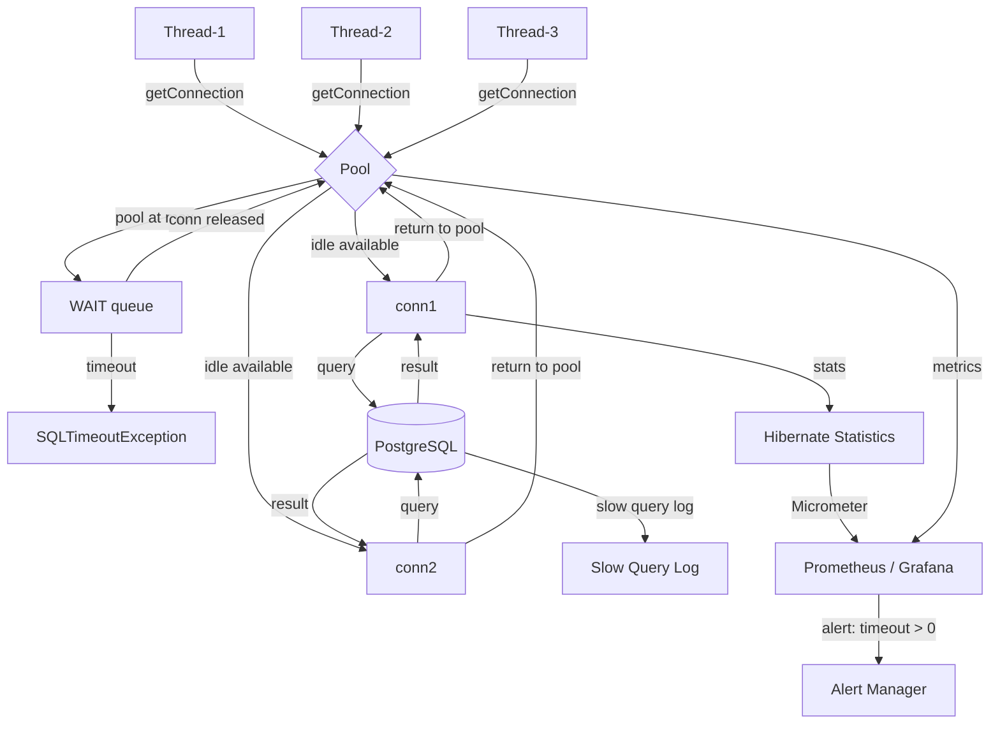

## Keywords in This File

{: .no_toc }

| # | Keyword | Weight |
| --- | --- | --- |
| 1 | [Connection Pool Tuning and Hibernate Performance Diagnostics](#connection-pool-tuning-and-hibernate-performance-diagnostics) | critical |

---

# Connection Pool Tuning and Hibernate Performance Diagnostics

**TL;DR** - Connection pool tuning sizes the pool between the minimum
needed to avoid starvation and the maximum the database can handle.
Hibernate performance diagnostics uses statistics, slow query logs,
and SQL logging to identify N+1 queries, missing indexes, and session
misuse before they become production incidents.

---

### 🎯 Model Answer

**30 seconds:**
> A database connection is expensive to create (SSL handshake, auth,
> protocol negotiation - 20-100ms). A connection pool keeps N connections
> open and lends them to threads. Too few connections = threads queue,
> latency spikes. Too many = database overwhelmed (each connection uses
> ~5MB RAM and a backend process). The right pool size depends on your
> query duration and thread count. Hibernate performance diagnostics
> means enabling statistics, SQL logging, and slow query detection to
> find N+1 queries, hot sessions, and missing indexes before they become
> outages.

**3 minutes (Senior):**
> Connection pool sizing is one of the most impactful performance levers.
> The formula: `pool_size = threads * avg_query_hold_time / latency_target`.
> For a service with 100 threads, 10ms average query time, and 100ms
> response time target: pool_size = 100 * 0.01 / 0.1 = 10 connections.
> This seems counterintuitively small. The HikariCP team's recommendation:
> start at 10 connections and measure; most services hit peak performance
> at 5-20 connections far below the thread count.
>
> The pool timeout cascade: if all connections are in use, new requests
> wait for `connectionTimeout` (HikariCP default: 30 seconds). At 30
> seconds, threads are blocked. If thread pool is sized at 200, you can
> have 200 threads all blocked waiting for a connection - a full service
> stall. Reduce `connectionTimeout` to 5 seconds to fail fast and apply
> back-pressure upstream instead.
>
> For Hibernate diagnostics: enable `hibernate.generate_statistics=true`
> in development and staging. The statistics show entity counts,
> collection counts, second-level cache hits, and most importantly:
> SQL statement counts. If SELECT count is 20x the expected for an operation,
> you have N+1. Enable `hibernate.show_sql=true` + `format_sql=true` in
> development only (too verbose for production). In production: use
> slow query logs (`log_min_duration_statement=100` in PostgreSQL) and
> the Hibernate StatisticsCollector with Micrometer to expose metrics.
>
> Key metrics to track: `hibernate.sessions.open` (session leak indicator),
> `hibernate.query.executions.total` (N+1 indicator), `hikaricp.connections.acquire`
> time (pool pressure indicator), `hikaricp.connections.timeout.total`
> (pool exhaustion indicator).

*Adapting up:* "At high load, pool exhaustion becomes a queue phenomenon.
Apply Little's Law: average queue length = arrival_rate * average_wait_time.
At 1000 RPS with 50ms wait per queued request, you have 50 queued requests
at steady state. Each queued request holds a thread - if thread pool = 100,
you hit saturation at 1000 RPS with suboptimal pool size."

*Adapting down:* "A connection pool is like a taxi stand with a fixed
number of taxis. Too few taxis and passengers wait. Too many and the
streets are congested. Finding the right fleet size is pool tuning."

**Blank Mind Recovery:**

**(1) Restate:** "You are asking about tuning the database connection
pool and diagnosing Hibernate performance issues in production."

**(2) First principles:** "From first principles, database connections
are expensive resources. Creating them on demand is too slow.
Reusing them via a pool trades memory for latency. The pool size
must balance: enough connections to serve peak concurrency without
exhausting database resources."

**(3) Bridge:** "Think of the connection pool like a checkout lane at
a grocery store. Too few lanes = long queues. Too many lanes = staff
idle and store profit wasted. The optimal number of lanes depends
on how many shoppers arrive per minute and how long each checkout takes."

---

### 📘 Concept Explanation

**What it is:**
Connection pool tuning configures the minimum, maximum, and timeout
parameters of a database connection pool (HikariCP, c3p0, DBCP) to
achieve optimal throughput and latency. Hibernate performance diagnostics
is the practice of enabling and analyzing Hibernate statistics, SQL logs,
slow query reports, and JVM metrics to identify bottlenecks before
they cause production incidents.

**The problem it solves:**
Database connections are expensive to create and limited by database
server capacity. Without a pool, each request creates a new connection
(20-100ms overhead per request). Without diagnostics, N+1 queries,
missing indexes, and session leaks are invisible until they cause a
production outage.

**How it works:**

```
CONNECTION POOL LIFECYCLE (HikariCP):

  Application start:
    Pool initializes minimumIdle connections
    (default: same as maximumPoolSize)

  Request arrives:
    getConnection() -> checks idle connections
    If idle available: return immediately
    If none idle AND pool < max: create new connection
    If pool at max: WAIT up to connectionTimeout
    If timeout expires: throw SQLTimeoutException

  Request completes:
    connection.close() -> returns to pool (not really closed)
    Pool marks connection as idle

  Connection validation:
    keepaliveTime: periodic ping to detect stale connections
    maxLifetime: retire and replace connections periodically

HIBERNATE STATISTICS (diagnostic):

  session.get(Customer.class, 1L)
    -> Entity fetch count: +1
    -> 2nd level cache miss count: +1 (if enabled)
    -> Query execution count: +1

  session.flush()
    -> Flush count: +1
    -> Entity insert count: +N (inserted)
    -> Entity update count: +M (updated)

  Total session metrics available via:
    sessionFactory.getStatistics()
```

**The key insight:**
Pool size is NOT "one per thread." Most threads spend the majority of
their time NOT holding a database connection. The optimal pool size is
determined by the concurrency of actual database work, not the concurrency
of all work. Too large a pool wastes database server resources and
can actually reduce throughput via connection overhead.

**HikariCP key parameters:**
- `maximumPoolSize`: upper bound on pool size (default 10)
- `minimumIdle`: connections kept warm when idle (default = max)
- `connectionTimeout`: time to wait for a connection (default 30s)
- `idleTimeout`: time before idle connections are removed (default 10min)
- `maxLifetime`: maximum connection age (default 30min)
- `keepaliveTime`: periodic validation frequency (default 0 = disabled)

**Hibernate statistics key metrics:**
- `entityFetchCount`: total entity loads - indicates session usage
- `queryExecutionCount`: total queries - compare to expected for N+1 detection
- `queryExecutionMaxTime`: slowest query - find outliers
- `secondLevelCacheHitCount/MissCount`: L2C effectiveness
- `sessionOpenCount/CloseCount`: should be equal - imbalance = leak
- `flushCount`: how often dirty checking runs

---

### 💻 Code Example

```java
// GOOD: HikariCP configuration in Spring Boot
// application.yml:
spring:
  datasource:
    type: com.zaxxer.hikari.HikariDataSource
    hikari:
      maximum-pool-size: 10      # start here; tune up if needed
      minimum-idle: 5             # keep 5 warm connections
      connection-timeout: 5000   # 5s: fail fast, don't hang threads
      idle-timeout: 600000       # 10min: remove idle connections
      max-lifetime: 1800000      # 30min: retire old connections
      keepalive-time: 30000      # 30s: ping to detect stale connections
      pool-name: "HikariPool-main"
      # For diagnostics:
      register-mbeans: true      # expose via JMX/Actuator

# Exposed Actuator metrics (Micrometer):
# hikaricp.connections.acquire (histogram)
# hikaricp.connections.timeout.total (counter - pool exhaustion)
# hikaricp.connections.pending (gauge - queue depth)
```

> **Code walkthrough:** `maximum-pool-size: 10` is the correct starting
> point for most services. `connection-timeout: 5000` (5 seconds, not the
> default 30) fails fast when the pool is exhausted, allowing upstream
> systems to apply back-pressure instead of accumulating blocked threads.
> `max-lifetime: 1800000` ensures connections are recycled before firewalls
> kill them (many firewalls terminate idle TCP connections after 30 minutes).
> `keepalive-time: 30000` pings idle connections to detect drops.

```java
// GOOD: Enabling Hibernate statistics for diagnostics
// application.yml (DEVELOPMENT/STAGING ONLY):
spring:
  jpa:
    properties:
      hibernate:
        generate_statistics: true    # enable statistics
        show_sql: true               # print SQL to stdout
        format_sql: true             # readable SQL format
        use_sql_comments: true       # adds HQL in comments

// Access statistics in code:
@Autowired
EntityManagerFactory emf;

public void printStats() {
    Statistics stats = emf.unwrap(SessionFactory.class)
        .getStatistics();
    log.info("Queries executed: {}",
        stats.getQueryExecutionCount());
    log.info("Entity fetches: {}",
        stats.getEntityFetchCount());
    log.info("L2C hit ratio: {}/{}",
        stats.getSecondLevelCacheHitCount(),
        stats.getSecondLevelCacheHitCount() +
        stats.getSecondLevelCacheMissCount());
    log.info("Sessions open/close: {}/{}",
        stats.getSessionOpenCount(),
        stats.getSessionCloseCount());
    log.info("Max query time: {}ms",
        stats.getQueryExecutionMaxTime());
    // Max query: stats.getQueryExecutionMaxTimeQueryString()
}
```

> **Code walkthrough:** `generate_statistics=true` enables the statistics
> collector with minimal overhead in development. `show_sql=true` prints
> all SQL to stdout - essential for N+1 detection during development.
> Never enable `show_sql` in production: it floods logs and adds I/O
> overhead. The statistics call `getSessionOpenCount()` vs
> `getSessionCloseCount()` - if they diverge, sessions are leaking.

```java
// GOOD: Micrometer metrics for production monitoring
// Add dependency: spring-boot-starter-actuator + micrometer-registry-prometheus
// Hibernate statistics exposed automatically as metrics:

// Metrics available (search in Prometheus/Grafana):
// hibernate_sessions_open_total
// hibernate_sessions_closed_total
// hibernate_queries_total
// hibernate_query_execution_seconds_max
// hibernate_cache_hits_total (L2C)
// hibernate_cache_misses_total (L2C)
// hikaricp_connections_acquire_seconds (histogram)
// hikaricp_connections_timeout_total (counter)
// hikaricp_connections_pending (gauge)

// Alert rules (Prometheus alertmanager):
// alert: HibernateNPlusOne
// expr: rate(hibernate_queries_total[1m]) > 500
// for: 5m
// annotations: "Query rate > 500/min - likely N+1"

// alert: HikariPoolExhaustion
// expr: hikaricp_connections_timeout_total > 0
// for: 1m
// annotations: "Pool exhaustion detected - increase pool size or investigate"
```

> **Code walkthrough:** Production diagnostics use metrics, not logs.
> The Micrometer integration exposes Hibernate statistics and HikariCP
> metrics to Prometheus/Grafana automatically when Actuator is on the
> classpath. The N+1 alert triggers when query rate exceeds 500/minute
> sustained for 5 minutes - a strong indicator of a new N+1 introduced
> by a code change. The pool exhaustion alert fires immediately on any
> timeout - this should be zero in a healthy system.

```java
// GOOD: Detecting N+1 in development with query count assertion
// Use Hypersistence Optimizer or custom query counter:
@Test
void testOrderListNoNPlusOne() {
    // Use datasource-proxy to count queries:
    int before = queryCount();
    List<OrderDTO> orders = orderService.getOrderList();
    int after = queryCount();

    // Should be 1-2 queries regardless of list size:
    assertThat(after - before)
        .withFailMessage("Expected <= 2 queries, got: %d",
            after - before)
        .isLessThanOrEqualTo(2);
}
// datasource-proxy intercepts all JDBC calls and counts queries
// Fails the test immediately if N+1 is introduced by a code change
```

> **Code walkthrough:** Query count assertions are the most effective
> way to prevent N+1 regressions in CI. When a developer adds a new
> field to the Order DTO that navigates a lazy association, the test
> fails immediately with "Expected <= 2 queries, got: 52". This surfaces
> the N+1 in code review rather than in production. The datasource-proxy
> library wraps the datasource and provides a counter accessible in tests.

---

### 🎓 Answers by Seniority

**Junior / Mid (0-5 years):**
> Connection pool tuning means configuring HikariCP's `maximumPoolSize`
> and `connectionTimeout`. A common starting point is 10 connections for
> most web services. Too few connections = timeout errors when all connections
> are busy. Too many = database server resource exhaustion. For Hibernate
> diagnostics: enable `show_sql=true` and `generate_statistics=true` in
> development to see what SQL is being executed. The most important thing
> to check is: are there many more SELECT statements than expected? That
> is the N+1 problem. In production, use Actuator metrics to monitor
> HikariCP and Hibernate without the log overhead.

*Push deeper:* "HikariCP's `connection-timeout` is critical. The default
is 30 seconds. If all 10 connections are in use, threads wait up to 30
seconds. With 100 concurrent requests, that is 100 threads blocked for
up to 30 seconds - the service appears down. Set `connection-timeout`
to 3-5 seconds to fail fast and trigger circuit breakers instead."

---

**Senior / Staff (5+ years):**
> Pool sizing follows from queuing theory. The optimal pool size is
> not "threads / 2" or any fixed ratio. It is derived from Little's Law:
> `N = lambda * W` where N is the average number of connections in use,
> lambda is the request rate (RPS), and W is the average time each request
> holds a connection. For a service at 100 RPS with 5ms average query
> hold time: N = 100 * 0.005 = 0.5 connections at average. Add headroom
> for bursts: 5-10x = 5-10 connections. Not 100.
>
> The database perspective: each connection consumes ~5MB RAM and a backend
> worker process. PostgreSQL supports ~500 connections before degrading.
> A microservices system with 50 pods * 20 connections/pod = 1000 connections
> - exceeds PostgreSQL limits. Use PgBouncer as a connection pooler between
> the application pool and the database to multiplex application connections
> onto fewer database connections.
>
> For production diagnostics: I instrument three things. First:
> HikariCP metrics in Prometheus (`hikaricp_connections_pending` trending
> upward = pool undersized). Second: Hibernate query count per API endpoint
> (exposed via Micrometer). Third: slow query log in PostgreSQL
> (`log_min_duration_statement = 100`). Together these surface the 80%
> of Hibernate performance issues: N+1, pool exhaustion, and missing indexes.

*Push deeper:* "PgBouncer in transaction mode multiplexes connections
at the transaction boundary: the database backend is only held during
the active transaction, not the full request. This allows 1000 application-
side connections to share 50 database backends. The trade-off: no
session-level features (prepared statements, session variables, `SET LOCAL`)
survive across transactions in transaction mode."

---

### ⚠️ Common Misconceptions

| Misconception | Reality | Danger Level |
|---|---|---|
| "Larger pool = better performance" | Beyond the optimal size, larger pools INCREASE latency (database scheduling overhead) and exhaust DB resources | Critical |
| "Pool size should match thread count" | Thread count >> optimal pool size; most threads are not holding DB connections most of the time | High |
| "show_sql=true is fine in production" | show_sql floods logs, adds I/O overhead, and can expose data in logs. Use slow query logs and metrics instead | Medium |
| "Connection pool exhaustion means pool is too small" | Exhaustion may mean slow queries holding connections too long - fix queries, not pool size | High |
| "Hibernate statistics are only for development" | generate_statistics with Micrometer export is production-safe and provides essential health signals | Medium |

---

### 🚨 Failure Modes and Diagnosis

**Failure 1: Connection Pool Exhaustion Under Load**

*Symptom:* `com.zaxxer.hikari.pool.HikariPool$PoolInitializationException:
Failed to obtain connection within connection timeout of 30000ms`
OR
`SQLTimeoutException: Unable to acquire JDBC Connection`

*Root cause:* All pool connections are in use. Could be:
(a) Pool too small for load
(b) Slow queries holding connections longer
(c) Long transactions holding connections unnecessarily
(d) Connection leak (connection not returned to pool)

*Diagnostic:*
```bash
# HikariCP metrics (Actuator/Prometheus):
hikaricp.connections.active      # currently in use
hikaricp.connections.pending     # waiting for connection
hikaricp.connections.timeout.total # exhaustion events (should be 0)

# If active == maximumPoolSize and pending > 0: pool too small
# or queries are slow. Check slow query log:
# PostgreSQL:
# log_min_duration_statement = 500  # queries > 500ms
# Look for patterns - same query? Same table?

# Connection leak detection (HikariCP):
spring.datasource.hikari.leak-detection-threshold: 5000
# Logs a warning if connection held > 5 seconds
```

*Fix:*
```java
// If slow queries: add index, optimize query, or use JOIN FETCH
// If pool too small: increase maximumPoolSize (measure first)
// If connection leak: find code path that does not return connection
// Leak pattern: missing try-with-resources for EntityManager
@PersistenceContext  // Spring manages lifecycle - no leak
EntityManager em;

// vs
EntityManager em = emf.createEntityManager(); // manual
// MUST call em.close() in finally block
```

---

**Failure 2: N+1 Queries Causing Throughput Degradation**

*Symptom:* API endpoint that should take 50ms takes 800ms.
Hibernate statistics show 100+ queries for one operation.

*Diagnostic:*
```java
// Enable statistics temporarily in production (safe for brief periods):
sessionFactory.getStatistics().setStatisticsEnabled(true);
// Check after problematic request:
long queries = stats.getQueryExecutionCount();
String slowest = stats.getQueryExecutionMaxTimeQueryString();
log.info("Slowest: {} ({}ms)", slowest,
    stats.getQueryExecutionMaxTime());
sessionFactory.getStatistics().setStatisticsEnabled(false);

// Or: check slow query log for repeating pattern:
# PostgreSQL pg_stat_statements:
SELECT query, calls, total_exec_time, rows
FROM pg_stat_statements
ORDER BY total_exec_time DESC
LIMIT 10;
# N+1 pattern: same query repeated many times with different IDs
```

*Fix:*
```java
// N+1 on @OneToMany: replace
List<Order> orders = orderRepo.findAll();
for (Order o : orders) {
    o.getItems().size(); // N queries
}

// With JOIN FETCH:
@Query("SELECT DISTINCT o FROM Order o JOIN FETCH o.items")
List<Order> findAllWithItems();
// Or @EntityGraph:
@EntityGraph(attributePaths = {"items"})
List<Order> findAll();
```

---

**Failure 3: Memory Pressure from Large Sessions**

*Symptom:* OutOfMemoryError with large Hibernate session. Heap profiler
shows many entity arrays. GC frequency increases.

*Root cause:* Loading thousands of entities into a single session for
batch processing. Each entity has a snapshot copy in the L1C.

*Diagnostic:*
```bash
# JVM heap dump:
jcmd <pid> GC.heap_dump /tmp/heap.hprof
# Analyze in Eclipse MAT or VisualVM
# Look for large char[] arrays near Hibernate session objects
# Many PersistenceContext$EntityKey objects = large session

# Hibernate statistics:
stats.getEntityCount()  # entities in all sessions
```

*Fix:*
```java
// Batch with periodic flush+clear:
@Transactional
public void processAll() {
    int batch = 0;
    try (ScrollableResults<Entity> scroll =
         session.createQuery("FROM Entity", Entity.class)
                .setFetchSize(100)  // JDBC cursor
                .scroll(ScrollMode.FORWARD_ONLY)) {
        while (scroll.next()) {
            process(scroll.get());
            if (++batch % 500 == 0) {
                session.flush();
                session.clear(); // evict all - releases memory
            }
        }
    }
}
```

---

**Failure 4: Slow Response Despite Index Existing**

*Symptom:* Query is slow even though `EXPLAIN` shows an index on
the join column. Hibernate-generated SQL uses a different join order
than expected.

*Root cause:* Hibernate-generated SQL may not produce the query plan
you expect. Missing `@JoinColumn`, wrong index type, or cardinality
estimates mislead the query planner.

*Diagnostic:*
```sql
-- Enable query logging with EXPLAIN output (PostgreSQL):
auto_explain.log_min_duration = 500ms
auto_explain.log_analyze = true

-- Or manually:
EXPLAIN ANALYZE
SELECT o.*, c.* FROM orders o
LEFT JOIN customers c ON o.customer_id = c.id
WHERE o.status = 'PENDING';
-- Look: Seq Scan on orders = missing or not-used index
-- Look: nested loop with high row estimate = wrong statistics
```

*Fix:* Run `ANALYZE orders` to refresh statistics. Add a covering
index. Rewrite the query in native SQL if Hibernate-generated SQL
is suboptimal.

---

### 🏛️ System Design

> *(Conditional: included because ★★★ keyword. Connection pool and
> diagnostics design are essential to production system design discussions.)*

**Where connection pool tuning and diagnostics appear in system design:**
- Microservices with many instances connecting to a shared database
- Multi-tenant SaaS with per-tenant connection isolation
- Read replica routing: separate pools for read vs write
- Circuit breaker design: pool exhaustion signals to upstream loadbalancer
- Observability design: what metrics to capture for database layer SLOs

**Example question:** "Design the observability and performance tuning
strategy for a Spring Boot + Hibernate service that needs to serve
50,000 concurrent users with < 200ms p99 latency."

**6-step framework answer:**

Step 1 CLARIFY (~5 min):
- "What is the database - PostgreSQL, MySQL, Aurora?"
- "Is this a new system or optimizing an existing one?"
- "What is the current p99? Is it CPU-bound or I/O-bound?"

Step 2 ESTIMATE (~5 min):
- 50,000 concurrent users -> 5,000 active requests (10:1 concurrent-to-active)
- 5,000 requests * 10ms avg DB hold = 50 connections needed at average
- Peak: 3x = 150 connections. Use PgBouncer to reduce database connections
- Slow query budget: 10ms per query to stay within 200ms p99 response

Step 3 DESIGN (~10 min):
```
                    PgBouncer (transaction mode)
Pods (50x)              |
  App Pool (50x10=500)  +---> PostgreSQL Primary (max 200 backend)
  HikariCP max=10       |
                        +---> PostgreSQL Read Replica (analytics)
                              max 100 backends

Observability stack:
  Hibernate Stats -> Micrometer -> Prometheus -> Grafana
  HikariCP Metrics -> Micrometer -> Prometheus -> Grafana
  PostgreSQL -> pg_stat_statements -> Grafana

Alerting:
  hikaricp_connections_timeout_total > 0 -> PagerDuty
  hibernate_query_execution_seconds_max > 1.0 -> Slack
  hikaricp_connections_pending > 5 -> Warning
```

Step 4 DEEP DIVE (~10 min):
Connection pool per pod: HikariCP maximumPoolSize=10. 50 pods * 10 = 500
application-side connections. PgBouncer (transaction mode) multiplexes
these 500 application connections onto ~50 PostgreSQL backends, staying
well within the ~200 connection limit.

Hibernate diagnostics: enable statistics export via Micrometer. Track
`hibernate.query.executions.total` per endpoint (use MDC to tag metrics).
A dashboard shows queries/request per endpoint. A sudden spike in
queries/request (from 2 to 50) indicates a deployed N+1 regression.
Automated alert fires within 5 minutes of deployment.

Step 5 ALTS (~5 min):
- Without PgBouncer: each pod connects directly. 50 pods * 10 = 500
  database connections. PostgreSQL handles this but wastes resources.
- pgpool-II: more features than PgBouncer but more complex.
- Serverless (Lambda): connection pooling is harder; use RDS Proxy
  instead of HikariCP.

Step 6 EVOLVE (~5 min):
At 10x: 500,000 users. PgBouncer becomes a bottleneck. Use multiple
PgBouncer instances behind a load balancer. Or migrate to read replicas
for read traffic. At 100x: Citus (distributed PostgreSQL) or service
decomposition to reduce database load per service.

**Scale inflection point:**
At ~500 application connections (50 pods * 10 connections), PostgreSQL
direct connections become expensive - each consumes ~5MB RAM + a worker
process. This is the inflection where PgBouncer (or equivalent) is
necessary. Before that threshold, direct connections from HikariCP are
sufficient.

**Common system design traps:**
- Setting maximumPoolSize = maximumThreads: creates 10x more connections
  than needed, exhausting the database's connection limit across pods.
- Not accounting for multi-pod deployments: a pool of 20 looks fine for
  1 pod, but 50 pods * 20 = 1000 connections fails at scale.
- Ignoring PgBouncer in microservices architectures: the default connection
  model does not scale to high pod counts without a connection multiplexer.

**Staff angle:** The cost/benefit of a full observability stack for
Hibernate + HikariCP is measurable. Implementing Micrometer with
Prometheus/Grafana takes 1 day. The return: every N+1 regression is
caught in CI (query count assertions) or within minutes of deployment
(query rate spike alert). Without this, N+1 bugs are discovered only
when production degrades under load - typically at 2am. The investment
pays back in the first prevented incident.

---

### 📊 Diagram

> *(Conditional: included because ★★★ keyword and the connection pool
> flow and monitoring architecture benefit from visual representation.)*

```
REQUEST FLOW WITH CONNECTION POOL:

Thread-1: getConnection()
  |                        POOL STATE:
  +-> [idle conn avail?]   [conn1: IDLE ] <- returned
  YES: return conn1        [conn2: ACTIVE] <- Thread-2
                           [conn3: ACTIVE] <- Thread-3
Thread-4: getConnection()  [conn4: IDLE ]
  |
  +-> [idle conn avail?]
  YES: return conn4

Thread-5: getConnection() (pool at max=4, all active)
  |
  +-> WAIT (up to connectionTimeout=5s)
  |
  +-> conn released? -> return conn
  OR timeout -> throw SQLTimeoutException

PERFORMANCE DIAGNOSTICS FLOW:

  HTTP Request
    |
    +-> @Transactional service
         |
         +-> SQL: SELECT ... (logged if show_sql=true)
         |          (counted in statistics)
         |          (timed if slow_query_log enabled)
         |
         +-> N+1 pattern:
              SQL: SELECT order WHERE id=1
              SQL: SELECT customer WHERE id=A
              SQL: SELECT customer WHERE id=B
              SQL: SELECT customer WHERE id=C
              ... 50 more SELECTs
              ^--- Alert: query_count >> expected
```



> **Diagram walkthrough:** Threads request connections from the pool.
> When idle connections are available, they are returned immediately
> (microseconds). When the pool is at maximum capacity and all connections
> are active, threads queue in the wait pool up to `connectionTimeout`.
> Timeout triggers `SQLTimeoutException`. Each query is tracked by
> Hibernate statistics and by the PostgreSQL slow query log. Metrics
> flow to Prometheus and Grafana. The key alert is `timeout > 0` on
> `hikaricp.connections.timeout.total` - even a single timeout indicates
> pool pressure that needs investigation.

---

### 🎯 Interview Deep-Dive

| Timing | Seniority | Focus |
|--------|-----------|-------|
| 3 min | Junior | What is a connection pool, why does size matter |
| 5 min | Mid | HikariCP parameters, Hibernate statistics basics |
| 7 min | Senior | Pool sizing formula, N+1 detection tools |
| 10 min | Staff | Microservices pool design, PgBouncer, alerting strategy |
| 15 min | FAANG | End-to-end observability design, Little's Law application |

---

**Q1 [JUNIOR] - DEFINITION**
What is a database connection pool and why is pool size important?

*Why they ask:* Connection pools are fundamental to production backend services.

*Likely follow-up:* "What happens when the pool is exhausted?"

**Answer:**
A database connection pool maintains a set of pre-established database
connections and lends them to application threads. Creating a new database
connection is expensive - SSL handshake, authentication, and protocol
negotiation take 20-100ms. Reusing connections from a pool reduces this
to microseconds.

Pool size is important because:

Too small: threads queue waiting for a connection when all connections
are in use. Requests queue, latency increases, timeouts occur. If
`connectionTimeout` is 30 seconds (the default), threads can block for
30 seconds - making the service appear down.

Too large: the database server must maintain all connections. Each
PostgreSQL connection consumes ~5MB of server RAM and a worker process.
At 1000 connections: ~5GB of RAM just for connection state. Beyond the
optimal size, more connections INCREASE latency due to context switching
and connection scheduling overhead on the database side.

When the pool is exhausted (all connections in use and pool at max):
new `getConnection()` calls wait for up to `connectionTimeout`. If the
timeout expires before a connection is freed, a `SQLTimeoutException`
is thrown. The request fails. In HikariCP, this also increments
`hikaricp.connections.timeout.total` - a metric that should always be zero.

*What separates good from great:* Explaining the database-side cost
of connections - not just the application-side waiting behavior.

---

**Q2 [MID] - MECHANISM**
Walk me through how HikariCP handles a connection request when
the pool is at capacity.

*Why they ask:* Tests understanding of the connection acquisition path.

*Likely follow-up:* "How does HikariCP detect connection leaks?"

**Answer:**
HikariCP uses a lock-free concurrent bag (`ConcurrentBag`) for the
connection pool. When `getConnection()` is called:

1. Check the thread-local connection list (fastest path - connections
   returned by the same thread are preferentially reused): O(1).

2. If no thread-local connection: scan the shared pool for an idle
   connection using an atomic CAS operation.

3. If no idle connections and pool size < `maximumPoolSize`: attempt
   to create a new connection. If database is reachable, return the new
   connection. Increment pool size.

4. If pool is at maximum: register a waiter. The thread is parked on
   a `SynchronousQueue` or `LinkedTransferQueue` until a connection
   is returned to the pool by another thread.

5. If `connectionTimeout` elapses without receiving a connection:
   throw `SQLTimeoutException`. HikariCP logs a warning with the
   pool state (number active, idle, pending).

Connection leak detection (`leakDetectionThreshold`):
```java
spring.datasource.hikari.leak-detection-threshold: 5000
```
HikariCP starts a per-connection timer when a connection is borrowed.
If the connection is not returned within 5 seconds, it logs a stack
trace of the borrowing thread. This identifies the code path that is
holding connections too long (long transactions, I/O while holding a
connection, forgotten `close()`).

*What separates good from great:* The thread-local preferential reuse
(fastest path) and the leak detection timer mechanism.

---

**Q3 [SENIOR] - MECHANISM**
How do you calculate the correct connection pool size? What is the
formula?

*Why they ask:* Most engineers over-size pools; this tests production insight.

*Likely follow-up:* "How does this change for microservices with 50 pods?"

**Answer:**
Pool sizing follows from Little's Law (queuing theory):
`N = lambda * W`

Where:
- N = average number of connections in active use
- lambda = arrival rate of requests needing DB connections (RPS)
- W = average time each request holds a DB connection (seconds)

Example: A service at 100 RPS where each request holds a DB connection
for 10ms on average:
`N = 100 * 0.010 = 1 connection`

That is the average. For burst headroom, multiply by 5-10x:
`maximumPoolSize = 5-10 connections`

Not 100 connections (matching the thread count). The HikariCP team
benchmarks consistently show peak throughput at 5-20 connections for
most web services. Their documentation states: "A pool size of 10
handles 99% of use cases. Only increase if profiling shows pool wait
time is significant."

For microservices with 50 pods:
- Total connections = 50 pods * 10 connections = 500 connections
- PostgreSQL limit: ~500 (depending on `max_connections` setting)
- Close to the limit. Add PgBouncer:
  - Application-side: 50 pods * 10 = 500 connections to PgBouncer
  - PgBouncer (transaction mode): multiplexes 500 -> ~50 database backends
  - Total database connections: 50 (well within limits)

*What separates good from great:* Applying Little's Law correctly and
demonstrating that "pool size = thread count" is a common over-sizing mistake.

---

**Q4 [SENIOR] - DEBUGGING**
An API endpoint is slow. Hibernate statistics show 200 SELECT
statements for a request that should need 3. How do you diagnose and fix?

*Why they ask:* N+1 diagnosis is a critical Hibernate production skill.

*Likely follow-up:* "How do you prevent N+1 regressions in CI?"

**Answer:**
200 SELECTs for an expected 3 is a classic N+1 pattern - one query loads
N entities, then N queries load their associations.

Diagnosis:
```java
// Step 1: Enable show_sql in staging and trigger the endpoint
logging:
  level:
    org.hibernate.SQL: DEBUG
    org.hibernate.type.descriptor.sql: TRACE
// Look for the repeating pattern:
// SELECT * FROM customers WHERE id=1
// SELECT * FROM customers WHERE id=2
// SELECT * FROM customers WHERE id=3
// ... 100 more

// Step 2: Check statistics
Statistics stats = sessionFactory.getStatistics();
log.info("Queries: {}", stats.getQueryExecutionCount());
// Reports 200 for a single request = N+1 confirmed

// Step 3: pg_stat_statements (production-safe)
SELECT query, calls, mean_exec_time
FROM pg_stat_statements
WHERE query LIKE '%customers%'
ORDER BY calls DESC LIMIT 5;
// Shows the same customers query called 100 times
```

Fix:
```java
// Find the root query: orders are loaded without customers
// BAD - causes N+1:
List<Order> orders = orderRepo.findByStatus("PENDING");
orders.forEach(o -> display(o.getCustomer().getName()));
// N+1: 1 SELECT orders + 100 SELECT customers

// GOOD - JOIN FETCH:
@Query("SELECT DISTINCT o FROM Order o " +
    "JOIN FETCH o.customer " +
    "WHERE o.status = :s")
List<Order> findByStatusWithCustomer(String s);
// 1 query with JOIN: returns all data
```

Preventing regressions in CI:
```java
// Query count assertion using datasource-proxy:
@Test
void orderListUsesOneQuery() {
    SQLStatementCountValidator.reset();
    orderService.getOrderList();
    assertSelectCount(1); // fails immediately if N+1 introduced
}
```

*What separates good from great:* The `pg_stat_statements` diagnostic
and the query count assertion for CI - catching N+1 at both ends.

---

**Q5 [STAFF] - DEBUGGING**
Your service has connection pool timeouts occurring only during
deployments. Outside of deployments, the pool is healthy. What is happening?

*Why they ask:* Tests knowledge of pool behavior during rolling deployments.

*Likely follow-up:* "How do you configure graceful shutdown for HikariCP?"

**Answer:**
Connection pool timeouts during deployments are caused by the deployment
process taking connections out of the available pool without Kubernetes
or the load balancer accounting for in-flight requests properly.

Common causes:

Cause 1: New pod startup + database connection establishment. When a new
pod starts and initializes HikariCP, it creates `minimumIdle` connections
immediately. If the database is connection-limited and old pods are still
running, the total connections temporarily exceed the limit. New pod gets
connection failures, old pods get timeouts.

Fix: set `minimumIdle = 0` or use `initializationFailTimeout = -1` to
allow the pool to start with no initial connections and build up lazily.

Cause 2: Old pod receiving traffic while shutting down. If the load
balancer routes requests to a pod that has begun shutdown, the pod's
connection pool is closing connections while the request needs them.

Fix: configure graceful shutdown with a drain period:
```java
// application.yml:
server:
  shutdown: graceful
spring:
  lifecycle:
    timeout-per-shutdown-phase: 30s
# Kubernetes preStop hook:
# lifecycle:
#   preStop:
#     exec:
#       command: ["sleep", "5"]
# Gives the load balancer time to stop routing before shutdown
```

Cause 3: Schema migration (Flyway/Liquibase) during startup holds a
connection for the duration of the migration. If migration takes 60
seconds and the pool has max=5, all 5 connections may be consumed during
migration, blocking application startup queries.

*What separates good from great:* The graceful shutdown configuration
with `timeout-per-shutdown-phase` and the `preStop` hook to drain
traffic before shutdown begins.

---

**Q6 [MID] - COMPARISON**
When should you use `StatelessSession` instead of a regular
`Session` for batch processing?

*Why they ask:* StatelessSession is an important Hibernate feature for
performance-sensitive batch operations.

*Likely follow-up:* "What features does StatelessSession not support?"

**Answer:**
Use `StatelessSession` when processing large datasets in batch jobs
where Hibernate's standard session features (dirty checking, L1C,
lifecycle callbacks) are unnecessary overhead.

Regular `Session` in batch processing:
- Accumulates all loaded entities in the L1C (snapshot + current state)
- Dirty checking on every flush compares all loaded entities
- Memory grows with every loaded entity unless manually cleared
- `@PrePersist`, `@PostLoad` etc. callbacks fire on every entity

`StatelessSession`:
- No L1C: entities are not retained after the operation completes
- No dirty checking: must explicitly call `update()` for changes
- No lifecycle callbacks
- No cascade operations
- Direct, low-overhead JDBC interaction

```java
// StatelessSession for bulk data processing:
StatelessSession stateless =
    sessionFactory.openStatelessSession();
Transaction tx = stateless.beginTransaction();
try {
    ScrollableResults<Order> orders = stateless
        .createQuery("FROM Order WHERE status='LEGACY'",
            Order.class)
        .setFetchSize(100)
        .scroll(ScrollMode.FORWARD_ONLY);

    while (orders.next()) {
        Order o = orders.get();
        o.setStatus("ARCHIVED");
        stateless.update(o); // explicit update, no dirty checking
    }
    tx.commit();
} catch (Exception e) {
    tx.rollback();
} finally {
    stateless.close();
}
// Memory: only one entity in memory at a time
// Performance: no snapshot comparison, no L1C growth
```

Features NOT supported by `StatelessSession`:
- First-level cache (no entity identity within the session)
- Dirty checking (must call `update()` explicitly)
- Cascade operations (`CascadeType.ALL` ignored)
- Lazy loading (all associations load eagerly or throw)
- `@PrePersist`, `@PostLoad` callbacks
- Second-level cache (reads bypass L2C)

Use regular session for business logic. Use `StatelessSession` for
ETL jobs, bulk imports, and archive operations where you process each
entity once and do not need session features.

*What separates good from great:* The specific list of features NOT
supported - especially that lazy loading does not work (associations
load eagerly or throw), which can change the query plan unexpectedly.

---

**Q7 [SENIOR] - TRADE-OFF**
Your team wants to enable Hibernate second-level cache for read
performance. What are the trade-offs?

*Why they ask:* L2C is both powerful and dangerous; trade-off analysis matters.

*Likely follow-up:* "How does the L2C behave in a multi-node deployment?"

**Answer:**
The second-level cache (L2C) caches entity data across sessions, reducing
database reads for frequently accessed, rarely modified entities.

Benefits:
- `findById()` on a cached entity: no SQL if in L2C (cache hit)
- Reduces load on the database significantly for reference data
  (currency codes, country lists, product categories)
- L2C hit rates of 80%+ reduce database connections needed

Trade-offs:

1. Stale data: if another process (another service, direct SQL, admin
   script) modifies the database without going through the Hibernate
   L2C, the cache holds stale data. Cache invalidation requires all
   writers to go through the same Hibernate L2C or use explicit eviction.

2. Multi-node coherence: in a cluster of 5 pods, each pod has its own
   L2C. Cache invalidation in one pod does not invalidate the cache in
   the other 4. Solutions:
   - Distributed cache (Hazelcast, Redis via hibernate-redis): all pods
     share one cache - coherent but adds network hop per cache access
   - Cache invalidation via message bus: update triggers an invalidation
     event; all pods evict the affected entity on receipt

3. Memory: the L2C stores entity data in heap. Large caches cause
   GC pressure. Use explicit `maxEntriesLocalHeap` or use an off-heap
   cache provider (Ehcache with off-heap storage).

4. Write overhead: every update flushes the entity from L2C. High
   write rates make the cache ineffective (low hit rate) and add
   eviction overhead.

Recommendation: use L2C only for entities that are:
- Read frequently (> 10 reads per write)
- Mostly static (reference/lookup data)
- Tolerate brief staleness (< TTL duration)

Cache product catalog with `@Cache(usage=READ_WRITE)`. Do NOT cache
financial transaction entities or inventory levels (immediate consistency required).

*What separates good from great:* The multi-node coherence problem and
the distributed cache vs message-bus invalidation trade-off.

---

**Q8 [STAFF] - ARCHITECTURE**
How do you design the connection pool configuration for a service
that uses both a primary database (writes) and a read replica (queries)?

*Why they ask:* Read replica routing with connection pools is a common
production architecture decision.

*Likely follow-up:* "How do you route @Transactional(readOnly=true) to the read replica?"

**Answer:**
For read replica routing with separate connection pools, configure two
DataSources and a routing proxy:

```java
// Two separate HikariCP pools:
@Bean("writeDataSource")
DataSource writeDataSource() {
    return DataSourceBuilder.create()
        .url("jdbc:postgresql://primary-host:5432/db")
        .build();
    // + HikariCP: maximumPoolSize=10
}

@Bean("readDataSource")
DataSource readDataSource() {
    return DataSourceBuilder.create()
        .url("jdbc:postgresql://replica-host:5432/db")
        .build();
    // + HikariCP: maximumPoolSize=20 (reads often 2x writes)
}

// Routing DataSource:
@Bean @Primary
DataSource routingDataSource() {
    AbstractRoutingDataSource routing =
        new AbstractRoutingDataSource() {
            @Override
            protected Object determineCurrentLookupKey() {
                boolean readOnly = TransactionSynchronizationManager
                    .isCurrentTransactionReadOnly();
                return readOnly ? "read" : "write";
            }
        };
    routing.setTargetDataSources(
        Map.of("write", writeDataSource(),
               "read", readDataSource()));
    routing.setDefaultTargetDataSource(writeDataSource());
    return routing;
}

// Usage: annotate read-only methods:
@Transactional(readOnly = true) // routes to replica
public List<ProductDTO> listProducts() { ... }

@Transactional // routes to primary
public Product createProduct(ProductDTO dto) { ... }
```

Pool sizing for each:
- Write pool: sized for write throughput (typically smaller: 5-10)
- Read pool: sized for query throughput (typically larger: 15-30,
  as reads are more numerous and often slower)

Replica lag monitoring:
```sql
-- On replica: check replication lag
SELECT now() - pg_last_xact_replay_timestamp()
AS replica_lag_seconds;
```
Alert if replica lag > 5 seconds. Route reads back to primary when
replica is lagging (prevents stale reads in time-sensitive operations).

*What separates good from great:* The `AbstractRoutingDataSource` with
`TransactionSynchronizationManager.isCurrentTransactionReadOnly()` - this
is the Spring idiom for routing without code changes in the service layer.

---

**Q9 [JUNIOR] - MECHANISM**
How do you enable and read Hibernate statistics?

*Why they ask:* Statistics are the primary tool for Hibernate diagnostics.

*Likely follow-up:* "Which statistic is most useful for detecting N+1?"

**Answer:**
Enable Hibernate statistics in `application.yml`:
```yaml
spring:
  jpa:
    properties:
      hibernate:
        generate_statistics: true
```

Access via code:
```java
@Autowired
EntityManagerFactory emf;

Statistics stats = emf.unwrap(SessionFactory.class)
    .getStatistics();

// N+1 detection:
System.out.println("Total queries: " +
    stats.getQueryExecutionCount());
// Expected queries for your operation?
// 2 (one for orders, one JOIN FETCH)
// Got 52? N+1 detected.

// Session management:
System.out.println("Sessions opened: " +
    stats.getSessionOpenCount());
System.out.println("Sessions closed: " +
    stats.getSessionCloseCount());
// Should be equal. If open > closed: session leak.

// Performance:
System.out.println("Max query time: " +
    stats.getQueryExecutionMaxTime() + "ms");
System.out.println("Slowest query: " +
    stats.getQueryExecutionMaxTimeQueryString());
```

The most useful statistic for N+1 detection:
`queryExecutionCount` - if this is 50x the expected count, N+1 is present.

Reset statistics between operations:
```java
stats.clear(); // reset all counters
myOperation();
System.out.println(stats.getQueryExecutionCount());
// Shows only queries from myOperation
```

In production, expose via Actuator:
`management.endpoint.health.show-details=always` with Micrometer
auto-registers Hibernate statistics as `hibernate_*` metrics.

*What separates good from great:* `queryExecutionCount` as the primary
N+1 indicator and `sessionOpenCount` vs `sessionCloseCount` as the
session leak indicator.

---

**Q10 [SENIOR] - DEBUGGING**
HikariCP is logging "Connection is not available, request timed out
after 30000ms" intermittently during business hours. The database
CPU is < 10%. How do you diagnose?

*Why they ask:* Pool exhaustion with low database CPU is a common
counterintuitive production scenario.

*Likely follow-up:* "What is the difference between pool exhaustion from slow queries vs connection leaks?"

**Answer:**
Low database CPU + pool exhaustion = the bottleneck is NOT slow queries.
Possible causes:

Cause 1: Long transactions holding connections.
A service method is `@Transactional` but includes non-database I/O
(HTTP calls, file operations) while holding the transaction (and the
connection). Each request holds the connection for the duration of the
I/O, not just the SQL.

Diagnostic:
```java
// Enable HikariCP leak detection:
spring.datasource.hikari.leak-detection-threshold: 5000
// Logs stack trace if connection held > 5 seconds
// Look for: "Connection leak detection triggered for ..."
// Stack trace shows the code holding the connection
```

Cause 2: Connection leak - `close()` not called.
Some code path obtains a connection but does not return it. The pool
fills with "active" connections that are logically abandoned.

Diagnostic:
```bash
# HikariCP logs: "Active connections: 10, Idle: 0, Waiting: 23"
# All 10 connections "active" but nothing is executing queries
# These are leaked connections

# Fix: ensure EntityManager.close() is always called
# (Spring @Transactional handles this automatically - 
# check for manual EntityManager usage)
```

Cause 3: Application thread count exceeds connection pool.
200 threads all request connections simultaneously during a traffic burst.
With `maximumPoolSize=10` and `connectionTimeout=30s`, 190 threads wait.

Diagnostic: check `hikaricp.connections.pending` metric.
If > 0 regularly: pool is undersized for burst traffic.

Resolution path:
1. Enable leak detection first (free, no code change)
2. Check `connections.pending` metric trend
3. If leak: fix the code. If undersized: increase pool size.
4. If long transactions: move I/O outside `@Transactional` boundary

*What separates good from great:* The three distinct root causes and
the order of investigation: leak detection first (cheapest), then
metrics, then code analysis.

---

**Q11 [SENIOR] - TRADE-OFF**
Should you use `show_sql=true` in production for debugging?
What is the alternative?

*Why they ask:* Tests knowledge of production-safe diagnostics.

*Likely follow-up:* "How do you enable per-query logging only for slow queries in production?"

**Answer:**
`show_sql=true` is NOT appropriate for production:

1. Volume: a service at 1000 RPS with 5 queries per request = 5000
   SQL log lines per second. Logs fill rapidly, log storage costs spike,
   log indexing (Elasticsearch) is overwhelmed.

2. Performance: writing each SQL statement to stdout/logfile adds
   synchronous I/O overhead to every request.

3. Security: SQL statements may contain parameter values if
   `hibernate.format_sql=true` is combined with `show_sql=true`.
   Parameter values may include PII or sensitive data.

Production-safe alternatives:

1. PostgreSQL slow query log (zero application code change):
```sql
-- postgresql.conf or ALTER SYSTEM:
log_min_duration_statement = 500  -- log queries > 500ms
log_statement = 'none'            -- don't log all queries
```

2. Hibernate statistics via Micrometer (low overhead):
```yaml
# Already shown above - this is the preferred approach
spring.jpa.properties.hibernate.generate_statistics: true
# Exposes metrics without logging individual SQLs
```

3. DataSource proxy (query-level logging with control):
```java
// p6spy or datasource-proxy: logs only specified queries
// E.g., queries > 100ms, queries with EXPLAIN ANALYZE
// Configurable, can be toggled at runtime
```

4. Application Performance Monitoring (APM):
New Relic, Datadog APM, Elastic APM - all capture SQL queries with
timing without modifying application code. They sample at configurable
rates (e.g., 1% of requests) to control overhead.

For the "I need to see specific queries in production RIGHT NOW" use case:
`UPDATE pg_catalog.pg_settings SET setting='100' WHERE name='log_min_duration_statement';`
Log queries > 100ms temporarily via PostgreSQL session variable, then
revert. No deployment needed.

*What separates good from great:* The PostgreSQL ALTER SYSTEM approach
for temporary production SQL logging without application deployment.

---

**Q12 [STAFF] - BEHAVIORAL**
Describe how you designed or improved the observability strategy
for a Hibernate-based service in production.

*Why they ask:* Tests experience designing production monitoring for ORM-backed services.

*Likely follow-up:* "What alert would you set up first, before anything else?"

**Answer:**
**S (Situation):** A Spring Boot + Hibernate service had intermittent
performance degradations that correlated with traffic spikes but had
no clear cause. The team had `show_sql=true` disabled in production
(correctly) but had no other Hibernate visibility. Incidents were
diagnosed by log analysis after the fact - always reactive, never
proactive.

**T (Task):** Design and implement a proactive observability stack for
the Hibernate layer that catches issues before they become incidents.

**A (Action):** Implemented in three layers:

Layer 1 (code changes - 1 day):
- Enabled `hibernate.generate_statistics=true`
- Added Micrometer `MicrometerHibernateMetrics` to register statistics
  as Prometheus metrics
- Exposed `management.endpoints.web.exposure.include=prometheus`
- Added DataSource proxy (datasource-proxy library) with a
  `QueryExecutionListener` that counts queries per `traceId` (MDC)

Layer 2 (dashboards - 1 day):
- Grafana dashboard: queries/request per endpoint (normalized by request
  count). Spike = N+1 regression.
- Grafana dashboard: HikariCP pool utilization (active, idle, pending)
- Grafana dashboard: p50/p95/p99 query execution time per query hash

Layer 3 (alerts - 0.5 day):
- Alert 1: `hikaricp_connections_timeout_total > 0` for 1 minute = Severity 1
  (pool exhaustion - immediate action needed)
- Alert 2: `hibernate_queries_per_request > 20` (sustained 5 min) =
  Severity 2 (likely N+1 regression - investigate last deploy)
- Alert 3: `hibernate_query_execution_seconds{quantile="0.99"} > 1.0`
  for 5 min = Severity 2 (slow query - check DB + explain plan)

**R (Result):** In the first week, Alert 2 fired at 3am after a deployment
that introduced a new endpoint with N+1. Rolled back in 15 minutes.
Previously this would have been discovered by users 2-3 hours later.
The "queries/request by endpoint" dashboard became the first place the
team looked after any deployment.

The most valuable alert: `hikaricp_connections_timeout_total > 0`.
Exhaustion means requests are failing NOW. It fires before any user-visible
degradation is reported.

*What separates good from great:* The "queries per request per endpoint"
metric normalized by request count - this is what makes N+1 regressions
visible immediately in a multi-endpoint service.
