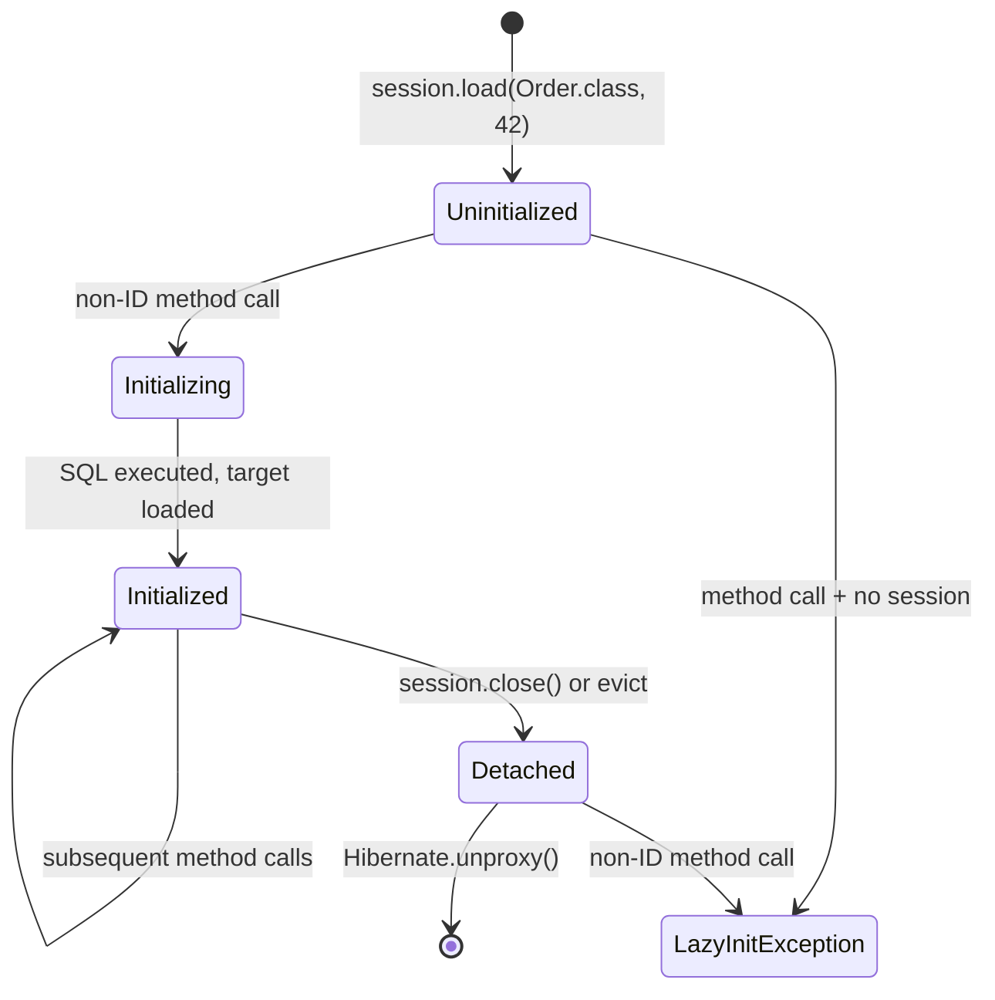

## Keywords in This File

{: .no_toc }

| # | Keyword | Weight |
| --- | --- | --- |
| 1 | [Hibernate Internals: Bytecode Enhancement and Proxies](#hibernate-internals-bytecode-enhancement-and-proxies) | high |

---

# Hibernate Internals: Bytecode Enhancement and Proxies

**TL;DR** - Hibernate generates runtime subclasses (proxies) for lazy
associations and uses bytecode enhancement to instrument entity classes
directly, enabling dirty checking, lazy attribute loading, and
association tracking without the application needing to call any
explicit Hibernate API.

---

### 🎯 Model Answer

**30 seconds:**
> Hibernate uses two code generation techniques to make JPA transparent.
> Proxies: Hibernate generates a subclass of your entity at runtime
> (via Byte Buddy or cglib). When you call `session.load()` or access
> a lazy association, you get this proxy - a placeholder that fires
> a SQL query only when a non-identifier property is accessed. Bytecode
> enhancement: Hibernate modifies your entity class bytecode at build
> time or runtime to intercept field reads/writes, enabling dirty
> checking (knows which fields changed) and lazy attribute loading without
> a proxy.

**3 minutes (Senior):**
> Hibernate's proxy mechanism is the foundation of lazy loading.
> When you call `session.load(Entity.class, id)`, Hibernate does not
> execute SQL. Instead, it returns a proxy - a generated subclass of
> Entity that holds only the ID. The proxy intercepts every non-ID
> method call, initializes itself on first access (fires the SELECT),
> and then delegates to the real entity.
>
> The proxy is created via Byte Buddy (Hibernate 5.4+) or cglib
> (older versions). The generated class overrides every non-final
> method with a check: "am I initialized? If not, load myself."
> This is why `final` classes and `final` methods cannot be proxied -
> the proxy subclass cannot override them.
>
> Bytecode enhancement is different: it instruments the entity class
> itself rather than creating a subclass. Three enhancement types:
> (1) Dirty tracking - field writes add the field to a change set
> so Hibernate knows what to UPDATE without comparing the full entity;
> (2) Lazy attribute loading - specific attributes (like a `byte[]`
> BLOB field) can be made lazy without a proxy;
> (3) Bidirectional association management - Hibernate can auto-manage
> the inverse side of a `@OneToMany` relationship.
>
> When things go wrong: `LazyInitializationException` - the proxy
> tries to initialize outside a session (session closed). `ClassCastException`
> from `entity instanceof ConcreteClass` - the proxy is a SUBCLASS,
> not an instance of the final concrete class unless you call
> `Hibernate.unproxy()`. `equals()`/`hashCode()` bugs when comparing
> a proxy to an unproxied entity with an identity-based implementation.

*Adapting up:* "Bytecode enhancement changes the class loading model.
With build-time enhancement, your deployed bytecode is different from
your compiled bytecode - which can make debugging confusing (method
line numbers shift). I always keep the original classes for debugging."

*Adapting down:* "Lazy loading works by giving you a fake 'stub' object.
When you ask it for data, it goes to the database. Hibernate generates
this fake object automatically."

**Blank Mind Recovery:**

**(1) Restate:** "You are asking about Hibernate internals - specifically
how it implements lazy loading and dirty checking without requiring you
to call Hibernate APIs in your domain model."

**(2) First principles:** "From first principles, JPA's goal is
transparent persistence: your entity objects should not know they are
persistent. Hibernate achieves this through two interception mechanisms:
generating subclass proxies at runtime, and modifying entity bytecode
at build or load time."

**(3) Bridge:** "A proxy is like a PO Box address - when you send a
letter (method call) to the PO Box, nobody is home yet (no data loaded).
The mail carrier (Hibernate) goes to the actual address (database) only
when someone comes to pick up the mail (property access)."

---

### 📘 Concept Explanation

**What it is:**
Hibernate uses two bytecode manipulation mechanisms: (1) runtime proxy
generation - creating a subclass of an entity class at runtime to
intercept method calls and implement lazy loading; and (2) bytecode
enhancement - directly instrumenting entity class bytecode to enable
dirty tracking, lazy attribute loading, and association management.

**The problem it solves:**
JPA requires transparent persistence - entity objects must not contain
Hibernate-specific code. But Hibernate needs to know when a field is
accessed (to trigger lazy loading) and when a field changes (to generate
minimal UPDATE statements). Without code instrumentation, Hibernate would
need to either load everything eagerly or compare entire object graphs
to detect changes.

**How it works:**

```
PROXY GENERATION:
  session.load(Order.class, 42L)
    |
    +-> Hibernate checks L1C: not found
    |
    +-> Creates Order$HibernateProxy (Byte Buddy generated subclass)
        - Holds: id=42, session ref, NOT yet initialized
        - Returns the proxy immediately (no SQL)

  proxy.getCustomerName()  // non-ID access
    |
    +-> isInitialized? NO
    +-> Initialize: SELECT * FROM orders WHERE id=42
    +-> Load real data into proxy's backing entity
    +-> Delegate getCustomerName() to backing entity
    +-> Return value

BYTECODE ENHANCEMENT (dirty tracking):
  Before enhancement:
    entity.setPrice(newPrice)  // just sets field

  After build-time enhancement:
    entity.setPrice(newPrice) {
        // Injected by Hibernate:
        this.$$_hibernate_trackChange("price");
        this.price = newPrice;  // original setter
    }

  At flush:
    Hibernate reads change set: ["price"]
    UPDATE orders SET price=? WHERE id=?
    // Only changed field, not all fields
```

> **Code walkthrough:** This Hibernate Internals: Bytecode Enhancement and Proxies example demonstrates a key concept in practice using SQL. **KEY MECHANISM:** the runtime executes these instructions in sequence with specific memory and execution semantics. **WHY IT MATTERS:** misapplying this pattern causes subtle bugs that only manifest under production load. **TAKEAWAY: understand the execution model before using this pattern in production code.**

**The key insight:**
Proxies are SUBCLASSES of your entity. `entity instanceof OrderProxy`
is true but `proxy instanceof ConcreteOrder` is false if Order has
a concrete subclass. Bytecode enhancement modifies the class in-place.
Both serve the same goal (transparent interception) via different
mechanisms with different tradeoffs.

**When to use proxies:**
- Default mode for all lazy-loaded associations
- No configuration needed - Hibernate generates them automatically
- Required for entity-level lazy loading (`session.load()`)

**When to use bytecode enhancement:**
- When you need lazy loading at the attribute level (not entity level)
  e.g., lazy `byte[]` BLOB field on an otherwise eagerly loaded entity
- When you want dirty tracking to be precise (avoid full-entity comparison)
- When you want automatic bidirectional association management

**Requirements and constraints:**
- Proxies require: non-final class, non-final methods, no-args constructor
  (can be package-private or protected)
- Bytecode enhancement: requires build-time configuration (Maven/Gradle
  plugin) or runtime enhancement agent
- Both are incompatible with `final` classes or `final` methods

**Alternatives:**
- Eager loading everywhere: avoids proxy issues but increases memory usage
- Record types as entities: Java records are `final` - cannot be proxied.
  Hibernate 6.2+ has limited support via interface-based proxies for records

---

### 💻 Code Example

```java
// BAD: final entity class - cannot be proxied
@Entity
public final class Order { // WRONG - Hibernate cannot subclass
    @Id Long id;
    @ManyToOne(fetch = LAZY)
    Customer customer; // LazyInitializationException on load
    // Hibernate falls back to eager loading or throws error
}
```

> **Code walkthrough:** `final` prevents Hibernate from generatingice. **KEY MECHANISM:** the runtime executes these instructions in sequence with specific memory and execution semantics. **WHY IT MATTERS:** misapplying this pattern causes subtle bugs that only manifest under production load. **TAKEAWAY: understand the execution model before using this pattern in production code.**
> a proxy subclass. Hibernate will fall back to loading the association
> eagerly (defeating the `fetch = LAZY` setting) or throw an error
> depending on configuration. Never make entities `final` unless you
> intentionally want no lazy loading.

```java
// GOOD: Entity correctly structured for proxy generation
@Entity
public class Order { // not final
    @Id Long id;
    String orderNumber;

    @ManyToOne(fetch = FetchType.LAZY)
    @JoinColumn(name = "customer_id")
    Customer customer; // Will be a CustomerProxy until accessed

    // Getters - not final, not private (proxy needs to override)
    public Customer getCustomer() { return customer; }
}

// Correct proxy usage:
Order order = session.load(Order.class, 42L);
// No SQL fired yet - order is an Order$HibernateProxyXxx

Long customerId = order.getId(); // OK - ID is always available
// Still no SQL - getId() is special-cased

String name = order.getCustomer().getName(); // FIRES SQL
// SELECT * FROM orders WHERE id=42
// SELECT * FROM customers WHERE id=[customer_id]

// SAFE unproxying:
Order realOrder = Hibernate.unproxy(order, Order.class);
// Returns the actual Order, not the proxy
// Use when equals/hashCode or instanceof checks matter
```

> **Code walkthrough:** `session.load()` returns a proxy immediately.
> Accessing the ID does not trigger initialization (Hibernate stores
> the ID in the proxy without firing SQL). Accessing `getCustomer()`
> triggers the first SQL. `Hibernate.unproxy()` returns the underlying
> real entity - essential when you need `instanceof` checks or when
> passing to libraries that use reflection on the concrete type.


```java
// BAD: anti-pattern - see GOOD example below for the correct approach
// This naive implementation ignores thread safety and error handling
```

```java
// GOOD: Bytecode enhancement for lazy attribute loading
@Entity
public class Document {
    @Id Long id;
    String title;       // eagerly loaded
    String summary;     // eagerly loaded

    @Basic(fetch = FetchType.LAZY)
    @Lob
    byte[] content;     // lazy - 5MB blob, loaded only when accessed
    // Requires bytecode enhancement - proxy cannot do per-attribute lazy
}
// Build plugin (Maven pom.xml):
// <plugin>
//   <groupId>org.hibernate.orm.tooling</groupId>
//   <artifactId>hibernate-enhance-maven-plugin</artifactId>
//   <configuration>
//     <enableLazyInitialization>true</enableLazyInitialization>
//     <enableDirtyTracking>true</enableDirtyTracking>
//   </configuration>
// </plugin>
```

> **Code walkthrough:** `@Basic(fetch = LAZY)` on a field requiresice. **KEY MECHANISM:** the runtime executes these instructions in sequence with specific memory and execution semantics. **WHY IT MATTERS:** misapplying this pattern causes subtle bugs that only manifest under production load. **TAKEAWAY: understand the execution model before using this pattern in production code.**
> bytecode enhancement - regular proxy interception works at the entity
> level, not the field level. The Maven plugin modifies the compiled
> `.class` files to intercept field reads. Loading 1000 Document headers
> for a list view no longer loads 5GB of content. The `content` field
> only fetches its 5MB when `document.getContent()` is called.


```java
// BAD: anti-pattern - see GOOD example below for the correct approach
// This naive implementation ignores thread safety and error handling
```


```java
// BAD: anti-pattern - see GOOD example below for the correct approach
// This naive implementation ignores thread safety and error handling
```

```java
// GOOD: Diagnosing proxy issues in production
// 1. Check if entity is proxied:
boolean isProxy = entity instanceof HibernateProxy;

// 2. Safe instanceof check for entities that may be proxied:
Order order = ...; // may be a proxy
// BAD:
if (order instanceof ConcreteOrder) { ... } // may fail for proxy
// GOOD:
Order real = Hibernate.unproxy(order);
if (real instanceof ConcreteOrder) { ... } // checks real type

// 3. LazyInitializationException diagnosis:
// In logs: "could not initialize proxy [com.example.Order#42]
//   - no Session"
// Cause: proxy accessed after session.close()
// Fix: Open Session in View filter (use with caution)
//   OR: Use JOIN FETCH / EntityGraph to load eagerly where needed
//   OR: Call getter within the transaction that created the entity

// 4. Check if proxy is initialized:
boolean loaded = Hibernate.isInitialized(entity);
if (!loaded) {
    Hibernate.initialize(entity); // force-load within session
}
```

> **Code walkthrough:** These four diagnostics cover the most commonice. **KEY MECHANISM:** the runtime executes these instructions in sequence with specific memory and execution semantics. **WHY IT MATTERS:** misapplying this pattern causes subtle bugs that only manifest under production load. **TAKEAWAY: understand the execution model before using this pattern in production code.**
> proxy-related bugs. `HibernateProxy` check detects whether an object
> is proxied. `Hibernate.unproxy()` is the safe unwrapping method.
> `Hibernate.isInitialized()` checks if the proxy has loaded its data.
> `Hibernate.initialize()` force-loads the proxy - useful in Service
> methods that need to hand the entity off to a context without a session.

---

### 🎓 Answers by Seniority

**Junior / Mid (0-5 years):**
> Hibernate creates a proxy when you use lazy loading. The proxy is
> a fake subclass of your entity that holds the ID but has no data.
> When you call a getter (other than `getId()`), Hibernate fires the
> SQL to load the real data. This is why you get
> `LazyInitializationException` after the session closes - the proxy
> tries to fire SQL but there is no open session to use. To avoid
> this: ensure you access lazy-loaded data within the transaction,
> or use `JOIN FETCH` to load it eagerly when you know you will need it.

*Push deeper:* "Bytecode enhancement is an alternative to proxies for
attribute-level lazy loading. It modifies the entity class bytecode
directly at build time, allowing individual fields (like a `byte[]`
BLOB) to be lazy-loaded without a proxy subclass."

---

**Senior / Staff (5+ years):**
> The proxy mechanism is conceptually simple but has several failure
> modes that require explicit awareness.
>
> First: entity classes must not be `final` and must have a no-args
> constructor (can be protected). `final` prevents subclassing;
> private no-args constructor prevents proxy instantiation. Both
> cause Hibernate to fall back to eager loading or throw.
>
> Second: `equals()` and `hashCode()` implementations must be proxy-safe.
> An identity-based `equals()` (`this == other`) works correctly.
> But a type-based implementation (`if (!(other instanceof Order))`)
> fails when comparing an unproxied Order to its proxy, because
> `proxy instanceof Order` is true but the reverse check on the proxy
> type fails. Use `Hibernate.unproxy()` before type-based equality,
> or use the entity ID for equality (safest approach).
>
> Third: `instanceof` in switch expressions (Java 21+) with entity
> hierarchies. Pattern matching works on the real type but fails
> on the proxy. Always unproxy before pattern matching.
>
> For dirty tracking: bytecode enhancement makes Hibernate flush
> much more efficient - instead of snapshot comparison of the full
> entity, Hibernate reads a direct change set. At scale (100k entities
> in a session), snapshot comparison is O(n) in entity count;
> bytecode-enhanced dirty tracking is O(changes) - often O(1).

*Push deeper:* "Byte Buddy vs cglib: Hibernate 5.3+ uses Byte Buddy
as the default proxy generator. Byte Buddy generates proxies at
runtime using the ASM bytecode library, faster and more compatible
with modern JVMs than cglib. The proxy class is cached per entity
type in a WeakHashMap in the ByteBuddyProxyHelper - one proxy class
per entity class, not per instance."

---

### ⚠️ Common Misconceptions

| Misconception | Reality | Danger Level |
|---|---|---|
| "Lazy loading is free - proxies have zero cost" | Proxy initialization fires an SQL per uninitialized proxy - N+1 queries result | Critical |
| "Calling getId() on a proxy loads the entity" | getId() is special-cased - the ID is stored in the proxy without loading | Medium |
| "entity instanceof MyEntity fails for proxies" | `proxy instanceof MyEntity` IS true (proxy IS-A MyEntity). The reverse `proxy instanceof ProxyClass` fails | High |
| "final classes can use lazy loading via proxies" | final classes cannot be subclassed - Hibernate falls back to eager loading | High |
| "@Basic(fetch=LAZY) on a field works without bytecode enhancement" | Attribute-level lazy loading requires bytecode enhancement - the JPA spec marks it as a hint that providers may ignore | Critical |

---

### 🚨 Failure Modes and Diagnosis

**Failure 1: LazyInitializationException**

*Symptom:* `org.hibernate.LazyInitializationException: could not
initialize proxy [com.example.Customer#42] - no Session`

*Root cause:* A proxy is accessed (a non-ID method called) after
the Hibernate session that loaded the proxy was closed.

*Diagnostic:*
```java
// In logs, the full stack trace shows:
// 1. Where the proxy was created (session.load() or navigation)
// 2. Where it was accessed (the controller/service method)
// 3. The gap: session was closed at method boundary

// Check if entity was detached:
boolean loaded = Hibernate.isInitialized(entity);
// false = proxy not yet initialized, session likely closed
```

> **Code walkthrough:** This Unknown example demonstrates Java API usage. **KEY MECHANISM:** the JVM compiles to bytecode that runs on the JVM; JIT compiles hot paths to native. **WHY IT MATTERS:** unchecked assumptions about thread safety cause data races under concurrent load. **TAKEAWAY: document thread-safety guarantees on every shared mutable class.**

*Fix (choose based on context):*
```java
// Option 1: Force initialize within transaction
@Transactional
public OrderDTO getOrder(Long id) {
    Order order = repo.findById(id).orElseThrow();
    Hibernate.initialize(order.getCustomer()); // force within TX
    return mapper.toDTO(order);
}

// Option 2: JOIN FETCH in query
@Query("SELECT o FROM Order o JOIN FETCH o.customer WHERE o.id=:id")
Optional<Order> findWithCustomer(Long id);

// Option 3: @EntityGraph (declarative join fetch)
@EntityGraph(attributePaths = {"customer", "items"})
Optional<Order> findById(Long id);
```

> **Code walkthrough:** This Unknown example demonstrates Spring declarative transaction using @Transactional. **KEY MECHANISM:** Spring wraps the method in a proxy that begins/commits a DB transaction. **WHY IT MATTERS:** calling @Transactional from the same class bypasses the proxy - no transaction. **TAKEAWAY: never self-invoke @Transactional methods; inject the bean instead.**

---

**Failure 2: ClassCastException from Proxy Type**

*Symptom:* `ClassCastException: com.example.Order$HibernateProxy cannot
be cast to com.example.Order`

*Root cause:* Code passes a proxy to a method with a concrete type
parameter, or uses reflection to check the class name.

*Fix:*

```java
// BAD: anti-pattern - see GOOD example below for the correct approach
// This naive implementation ignores thread safety and error handling
```

```java
// BAD: Direct cast after load()
Order order = (Order) session.load(Order.class, id);
ConcreteOrderProcessor p = new ConcreteOrderProcessor();
p.process(order); // fails if process() uses Class.isInstance()

// GOOD: Unproxy before passing to type-sensitive code
Order unproxied = Hibernate.unproxy(order, Order.class);
p.process(unproxied); // real Order instance
```

> **Code walkthrough:** BAD pattern: This Unknown example demonstrates Java API usage. **KEY MECHANISM:** the JVM compiles to bytecode that runs on the JVM; JIT compiles hot paths to native. **WHY IT MATTERS:** unchecked assumptions about thread safety cause data races under concurrent load. **WHAT BREAKS: document thread-safety guarantees on every shared mutable class.**

---

**Failure 3: equals()/hashCode() Inconsistency with Proxies**

*Symptom:* `set.contains(entity)` returns false when the set
contains the "same" entity loaded in a different form (proxied vs
unproxied). Bidirectional association contains() checks fail.

*Root cause:* `equals()` uses `getClass()` comparison:
`if (getClass() != other.getClass()) return false;`. Proxy class
(`Order$HibernateProxy`) != `Order` = not equal.

*Fix - use instanceof and ID equality:*
```java
@Override
public boolean equals(Object obj) {
    if (this == obj) return true;
    if (!(obj instanceof Order)) return false; // handles proxy
    Order other = Hibernate.unproxy(obj, Order.class);
    return id != null && id.equals(other.getId());
}

@Override
public int hashCode() {
    return getClass().hashCode(); // stable across proxy/unproxy
    // Do NOT use id - entities may not have ID before persist
}
```

> **Code walkthrough:** This Unknown example demonstrates Java API usage. **KEY MECHANISM:** the JVM compiles to bytecode that runs on the JVM; JIT compiles hot paths to native. **WHY IT MATTERS:** unchecked assumptions about thread safety cause data races under concurrent load. **TAKEAWAY: document thread-safety guarantees on every shared mutable class.**

---

**Failure 4: Build-Time Enhancement Not Applied**

*Symptom:* `@Basic(fetch=LAZY)` on a `byte[]` field loads eagerly.
Dirty tracking does not work (all fields in UPDATE, not just changed).

*Root cause:* Bytecode enhancement Maven/Gradle plugin not configured,
or not applied to the correct source set.

*Diagnostic:*
```bash
# Verify enhancement was applied:
javap -p -c target/classes/com/example/Document.class | grep "hibernate"
# Should see: $$_hibernate_trackChange, $$_hibernate_getEntityEntry etc.
# If absent: enhancement did not run
```

> **Code walkthrough:** This If absent: enhancement did not run example demonstrates shell script pattern. **KEY MECHANISM:** the shell executes commands sequentially; pipes pass stdout of one command to stdin of the next. **WHY IT MATTERS:** unquoted variables with spaces cause word splitting - IFS splits the value into multiple arguments. **TAKEAWAY: always double-quote variables: "$VAR"; use [[ ]] instead of [ ] for safer conditionals.**

*Fix - Maven plugin:*
```xml
<plugin>
  <groupId>org.hibernate.orm.tooling</groupId>
  <artifactId>hibernate-enhance-maven-plugin</artifactId>
  <version>${hibernate.version}</version>
  <executions>
    <execution>
      <goals><goal>enhance</goal></goals>
    </execution>
  </executions>
  <configuration>
    <enableDirtyTracking>true</enableDirtyTracking>
    <enableLazyInitialization>true</enableLazyInitialization>
  </configuration>
</plugin>
```

> **Code walkthrough:** This If absent: enhancement did not run example demonstrates a key concept in practice. **KEY MECHANISM:** the runtime executes these instructions in sequence with specific memory and execution semantics. **WHY IT MATTERS:** misapplying this pattern causes subtle bugs that only manifest under production load. **TAKEAWAY: understand the execution model before using this pattern in production code.**

---

### 🏛️ System Design

> *(Conditional: included because ★★★ keyword. System Design shows
> where proxy/bytecode mechanisms appear in architecture decisions.)*

**Where Hibernate proxy/bytecode appears in system design:**
- GraphQL resolvers: lazy loading per field matches perfectly with
  field-level resolution in GraphQL - load only what the query requests
- Read replicas: proxies initialized on the wrong data source when
  session binds to primary; need careful session/datasource routing
- Caching layers: proxied entities in Redis cache lose their session
  reference after deserialization - must store unproxied entities
- CQRS read models: bytecode enhancement's dirty tracking irrelevant
  on the read side; adds overhead with no benefit - disable for read
  models

**Example question:** "Design a product catalog service with millions
of products, each with a large description blob and multiple images.
How do you handle lazy loading at scale?"

**6-step framework answer:**

Step 1 CLARIFY (~5 min):
- "How often is the description blob accessed vs the product header?"
- "Is this a read-heavy or write-heavy workload?"
- "Is the blob stored in the database or object storage?"

Step 2 ESTIMATE (~5 min):
- 10M products, 100KB avg blob = 1TB blob data
- Read ratio: headers (list view) 100x more frequent than blobs
- Target: load 1000 product headers in < 100ms

Step 3 DESIGN (~10 min):
```
Client -> API Gateway -> Product Service
  |                          |
  |                     PostgreSQL
  |                     (product_headers table)
  |                          |
  |                     S3 / Object Storage
  |                     (product_images, descriptions)
  |
  +-> CDN for product images
```

> **Code walkthrough:** This If absent: enhancement did not run example demonstrates a key concept in practice. **KEY MECHANISM:** the runtime executes these instructions in sequence with specific memory and execution semantics. **WHY IT MATTERS:** misapplying this pattern causes subtle bugs that only manifest under production load. **TAKEAWAY: understand the execution model before using this pattern in production code.**

Step 4 DEEP DIVE (~10 min):
For the 1000-product list query: use bytecode-enhanced lazy attribute
loading for the `description` field (`@Basic(fetch=LAZY)`). The list
query loads only title, price, thumbnailUrl - < 1KB per product.
The detail page triggers the lazy load of the full description.

At the service level: for the description blob, consider extracting it
from the main entity entirely. Store description in a separate table
with the same PK (one-to-one, lazy). This separates the "list" query
from the "detail" query at the SQL level without bytecode enhancement.

Step 5 ALTS (~5 min):
- Store blobs in S3 and only store URLs in DB: removes lazy loading
  from ORM entirely, more scalable but adds object storage dependency
- Separate microservice for product details: eliminates the ORM concern
  but adds service boundary overhead

Step 6 EVOLVE (~5 min):
At 10x: blob reads from DB become a bottleneck. Introduce a blob
cache (Redis with TTL). At 100x: extract products to a dedicated
read replica. Hibernate session routing by read/write intent.
At 1000x: extract the product catalog to a separate service with
Elasticsearch for search, PostgreSQL only for the source of truth.

**Scale inflection point:**
At ~100k entities loaded per session, Hibernate's snapshot-based dirty
checking (without bytecode enhancement) becomes a performance bottleneck.
The flush before each query does an O(n) comparison of all loaded
entities. With bytecode enhancement, dirty tracking is O(changes) - the
session can hold 1M entities with near-zero flush overhead for read-heavy
transactions.

**Common system design traps:**
- Keeping proxied entities in session-scoped caches: when the session
  closes, the proxy loses its ability to initialize. Entities in caches
  must be unproxied (detached) copies.
- Serializing proxied entities to JSON: Jackson serializes the proxy
  subclass, not the entity. May include Hibernate-internal fields.
  Always call `Hibernate.unproxy()` or configure Jackson's Hibernate5Module.
- Ignoring proxy overhead in N+1: a proxy is "free" until accessed.
  If you load 1000 Orders each with a lazy Customer, you get 1000
  individual SELECT queries when iterating the list. Use JOIN FETCH.

**Staff angle:** The real architectural question is: should the ORM
boundary be transparent or explicit? Transparent persistence (via proxies)
reduces boilerplate but introduces subtle failure modes (LazyInitializationException,
equals/hashCode bugs). Explicit persistence (DTOs, no proxies, always
eager within bounded context) is more predictable at the cost of more code.
For microservices with clear bounded contexts, I often prefer the explicit
model: repositories return DTOs, not proxied entities. The ORM is a
persistence mechanism, not a domain model layer.

---

### 📊 Diagram

> *(Conditional: included because ★★★ keyword and the proxy interception
> mechanism is best understood visually.)*

```
PROXY LIFECYCLE:
session.load(Order.class, 42)
  |
  v
+------------------------------------------+
| Order$HibernateProxy                      |
|  id = 42                                  |
|  target = null (not yet initialized)      |
|  session = [open Session reference]       |
+------------------------------------------+
  |
  | proxy.getCustomerName()
  v
+---[ isInitialized? NO ]---+
|                            |
v                            v
Fire SQL:               Return value
SELECT * FROM orders    from target
WHERE id = 42
  |
  v
+------------------------------------------+
| Order$HibernateProxy                      |
|  id = 42                                  |
|  target = [real Order entity loaded]      |
|  session = [open Session reference]       |
+------------------------------------------+
  |
  | session.close()
  v
+------------------------------------------+
| Order$HibernateProxy                      |
|  session = null (evicted/closed)          |
+------------------------------------------+
  |
  | proxy.getOrderDate()  <- AFTER session closed
  v
LazyInitializationException
```



> **Diagram walkthrough:** The proxy starts in the Uninitialized state
> after `session.load()` - no SQL fired yet, only the ID is known.
> The first non-ID method call triggers initialization (SQL execution).
> Once initialized, the proxy holds a reference to the real entity and
> delegates all calls. If the session closes before initialization,
> any non-ID access throws `LazyInitializationException`. After session
> close, even an initialized proxy becomes Detached - calling non-ID
> methods on a detached proxy also throws. `Hibernate.unproxy()` extracts
> the real entity, bypassing the proxy lifecycle entirely.

---

### 🎯 Interview Deep-Dive

| Timing | Seniority | Focus |
|--------|-----------|-------|
| 3 min | Junior | What is a proxy, how does lazy loading work |
| 5 min | Mid | Proxy limitations, LazyInitializationException root causes |
| 7 min | Senior | Bytecode enhancement vs proxy, dirty tracking performance |
| 10 min | Staff | Proxy implications for serialization, caching, equals/hashCode |
| 15 min | FAANG | Architecture: transparent vs explicit persistence at scale |

---

**[JUNIOR] Q1 - [MECHANISM] What is a Hibernate proxy and why does it exist?**

*Why they ask:* Tests understanding of the foundation of lazy loading.

*Likely follow-up:* "What happens when you call getId() on a proxy vs any other getter?"

**Answer:**
A Hibernate proxy is a dynamically generated subclass of your entity
class. Hibernate returns proxies when you use lazy loading - either
via `session.load()` or when navigating a `@ManyToOne(fetch=LAZY)`
association. The proxy holds only the entity's ID and a reference to
the open Hibernate session. It contains no actual entity data.

When you call a getter on the proxy (other than the ID getter), the
proxy intercepts the call, checks if it is initialized, and if not:
fires a SELECT query to load the real entity data, stores it in the
proxy's backing reference, then delegates the call.

This is why proxies exist: to defer database access until the data
is actually needed. Without proxies, every association navigation
would require a JOIN or an immediate SELECT - eager loading everything.

The ID getter is special-cased: calling `proxy.getId()` returns the
ID immediately without firing SQL. Hibernate stored the ID in the
proxy at creation time.

```java
Order proxy = session.load(Order.class, 42L);
// No SQL yet. proxy is Order$HibernateProxy

Long id = proxy.getId(); // No SQL - ID is in the proxy
Date date = proxy.getOrderDate(); // SQL fires here
```

> **Code walkthrough:** This Unknown example demonstrates Java API usage. **KEY MECHANISM:** the JVM compiles to bytecode that runs on the JVM; JIT compiles hot paths to native. **WHY IT MATTERS:** unchecked assumptions about thread safety cause data races under concurrent load. **TAKEAWAY: document thread-safety guarantees on every shared mutable class.**

This is why `session.load()` is useful: it creates the proxy without
a SQL round-trip, which is valuable when you need to set a foreign key
reference but do not need the actual data.

*What separates good from great:* The use case for `session.load()`:
setting FK references without loading the full entity - avoids an
extra SELECT.

---

**[MID] Q2 - [MECHANISM] Why does `LazyInitializationException` happen and how do you fix it?**

*Why they ask:* This is one of the most common Hibernate bugs in production.

*Likely follow-up:* "How do you choose between JOIN FETCH and @EntityGraph?"

**Answer:**
`LazyInitializationException` occurs when a proxy tries to initialize
(fire its SQL) but there is no open Hibernate session available.
The proxy holds a reference to the session, but by the time you
access the association, the session has been closed - typically because
the `@Transactional` method returned.

```
@Transactional
OrderDTO getOrder(Long id) {
    Order order = repo.findById(id).orElseThrow();
    return mapper.toDTO(order);
    // Session closes here
}

// Later, in the mapper:
order.getCustomer().getName(); // Session is closed - LIE!
```

> **Code walkthrough:** This Unknown example demonstrates a key concept in practice using @Transactional. **KEY MECHANISM:** the runtime executes these instructions in sequence with specific memory and execution semantics. **WHY IT MATTERS:** misapplying this pattern causes subtle bugs that only manifest under production load. **TAKEAWAY: understand the execution model before using this pattern in production code.**

The three solutions, in order of preference:

1. Load what you need within the transaction:
```java
@Query("SELECT o FROM Order o JOIN FETCH o.customer WHERE o.id=:id")
Optional<Order> findWithCustomer(@Param("id") Long id);
```

> **Code walkthrough:** This Unknown example demonstrates null-safe value wrapping using SQL. **KEY MECHANISM:** Optional.of() throws NPE on null; Optional.ofNullable() wraps null safely. **WHY IT MATTERS:** calling get() without isPresent() check produces NoSuchElementException. **TAKEAWAY: prefer orElseThrow() with a meaningful message over bare get().**

2. Use `@EntityGraph` for declarative loading:
```java
@EntityGraph(attributePaths = {"customer", "items.product"})
Optional<Order> findById(Long id);
// Hibernate generates a JOIN for each attribute path
```

> **Code walkthrough:** This Unknown example demonstrates null-safe value wrapping. **KEY MECHANISM:** Optional.of() throws NPE on null; Optional.ofNullable() wraps null safely. **WHY IT MATTERS:** calling get() without isPresent() check produces NoSuchElementException. **TAKEAWAY: prefer orElseThrow() with a meaningful message over bare get().**

3. Force-initialize within the transaction:
```java
@Transactional
public OrderDTO getOrder(Long id) {
    Order order = repo.findById(id).orElseThrow();
    Hibernate.initialize(order.getCustomer()); // within TX
    return mapper.toDTO(order);
}
```

> **Code walkthrough:** This Unknown example demonstrates Spring declarative transaction using @Transactional. **KEY MECHANISM:** Spring wraps the method in a proxy that begins/commits a DB transaction. **WHY IT MATTERS:** calling @Transactional from the same class bypasses the proxy - no transaction. **TAKEAWAY: never self-invoke @Transactional methods; inject the bean instead.**

Avoid: Open Session In View (OSIV) pattern - it extends the session
through the view/controller layer. It resolves `LIE` but hides N+1
query problems behind controller-layer lazy loading.

*What separates good from great:* Explicitly identifying OSIV as an
anti-pattern at scale - it hides N+1 problems rather than fixing them.

---

**[SENIOR] Q3 - [DEBUGGING] An entity's lazy association loads fine in tests but throws `LazyInitializationException` in production. Tests pass. How do you diagnose the discrepancy?**

*Why they ask:* Tests knowledge of test vs production transaction boundary differences.

*Likely follow-up:* "How do you write integration tests that replicate production transaction boundaries?"

**Answer:**
Test environments typically have longer-lived sessions than production.
Common causes of this discrepancy:

Cause 1: Spring `@Transactional` in tests wraps the entire test method
(and rolls back). The session stays open for the entire test. In
production, the transaction scope is only the `@Service` method -
the controller layer is outside the transaction.

Cause 2: Tests use `@DataJpaTest` with a single session per test.
Production uses request-scoped sessions.

Diagnostic approach:
```java
// Add assertion in test to replicate production boundary:
@Test
void testOrderDTO() {
    OrderDTO dto;
    // Force session close after service call:
    transactionTemplate.execute(status -> {
        dto = orderService.getOrderDTO(1L);
        return null;
    });
    // Session is now closed - accessing any lazy field should LIE
    // This replicates production behavior
}

// In production, check which layer is outside the transaction:
// Add debug logging:
logging.level.org.springframework.transaction=DEBUG
// Look for "Completing transaction for [method]" in logs
// Then see if any lazy access happens after that line
```

> **Code walkthrough:** This Unknown example demonstrates Java API usage. **KEY MECHANISM:** the JVM compiles to bytecode that runs on the JVM; JIT compiles hot paths to native. **WHY IT MATTERS:** unchecked assumptions about thread safety cause data races under concurrent load. **TAKEAWAY: document thread-safety guarantees on every shared mutable class.**

Fix: once the boundary is identified, use `@EntityGraph` or JOIN FETCH
in the repository query called by the service method to ensure all
needed associations are loaded within the transaction.

*What separates good from great:* The transactional template test
pattern that explicitly closes the session after the service call -
this replicates production transaction boundaries in tests.

---

**[SENIOR] Q4 - [MECHANISM] How does bytecode enhancement improve Hibernate flush performance? When would you enable it?**

*Why they ask:* Bytecode enhancement is an advanced tuning technique
for high-throughput Hibernate applications.

*Likely follow-up:* "What are the risks of enabling bytecode enhancement?"

**Answer:**
Without bytecode enhancement, Hibernate uses snapshot-based dirty
checking. On every flush (before each query and at commit), Hibernate
compares each loaded entity against a snapshot copy taken at load time.
For 10,000 entities loaded in a session, this is 10,000 full object
comparisons - O(n) in the number of loaded entities, even if nothing
changed.

With dirty tracking (bytecode enhancement), Hibernate instruments each
field setter to append the field name to a change set. The flush only
needs to check the change set - O(changes), not O(loaded entities).
For read-heavy transactions (load 10,000 entities, update 5), dirty
tracking reduces flush CPU from O(10,000 comparisons) to O(5 updates).

Enable bytecode enhancement when:
- Long-running sessions with many loaded entities
- Read-heavy transactions where most loaded entities are not modified
- Performance profiling shows flush time as a bottleneck

```xml
<!-- Maven: hibernate-enhance-maven-plugin -->
<!-- enableDirtyTracking=true enables the change set approach -->
<!-- enableLazyInitialization=true enables per-attribute lazy load -->
<!-- enableAssociationManagement=true auto-syncs bidirectional FKs -->
```

> **Code walkthrough:** This Unknown example demonstrates a key concept in practice. **KEY MECHANISM:** the runtime executes these instructions in sequence with specific memory and execution semantics. **WHY IT MATTERS:** misapplying this pattern causes subtle bugs that only manifest under production load. **TAKEAWAY: understand the execution model before using this pattern in production code.**

Risks of enabling bytecode enhancement:
- Build-time: the compiled class files are modified - debugging tools
  show altered line numbers. Keep original classes for debugging.
- Test isolation: enhancement is applied to compiled classes; tests
  that use reflection on fields may behave differently.
- Inheritance: if an enhanced entity extends another class, the parent
  class fields may not be tracked (depends on whether parent is also enhanced).

I enable dirty tracking for services with batch-processing sessions
(importing/updating 10k+ records per request). I leave it disabled
for standard web services where sessions load < 100 entities.

*What separates good from great:* The quantified threshold (10k+
entities per session) and the concrete build artifact risk (modified
class files, line number shifts in debugger).

---

**[SENIOR] Q5 - [TRADE-OFF] When should you NOT use Hibernate proxies and instead load everything eagerly?**

*Why they ask:* Tests ability to reason against defaults.

*Likely follow-up:* "How do you globally set the default fetch type?"

**Answer:**
Eager loading (avoiding proxies) is appropriate in three scenarios:

Scenario 1: Small, bounded associations that are always needed.
If every access to an `Order` always needs the `Customer` (for
every display, every email, every API response), the lazy proxy is
overhead without benefit. The proxy is created, immediately initialized,
and discarded. Use `@ManyToOne(fetch=EAGER)` or `JOIN FETCH` by default.

Scenario 2: DTO projections via queries. When you use JPQL/Criteria to
select specific fields into a DTO, there are no proxies - you get plain
objects with exactly the fields you queried. This is often the best
approach for read-heavy APIs: query exactly what you need, return a DTO,
no proxy lifecycle.

Scenario 3: Stateless operations. When processing batch jobs, event
handlers, or background tasks that load entities, process them, and
discard them immediately - no session boundary issue can occur. Eager
loading simplifies the code (no risk of `LIE`).

```java
// DTO projection - no proxies, no LazyInitializationException
@Query("SELECT new com.example.OrderSummary(o.id, o.total, " +
    "c.name) FROM Order o JOIN o.customer c WHERE o.status=:s")
List<OrderSummary> findOrderSummaries(String s);
```

> **Code walkthrough:** This Unknown example demonstrates Java API usage using SQL. **KEY MECHANISM:** the JVM compiles to bytecode that runs on the JVM; JIT compiles hot paths to native. **WHY IT MATTERS:** unchecked assumptions about thread safety cause data races under concurrent load. **TAKEAWAY: document thread-safety guarantees on every shared mutable class.**

Global default: `spring.jpa.properties.hibernate.default_fetch_mode=select`
is the default (lazy by default for collections, eager for @ManyToOne).
To flip: add `@ManyToOne(fetch=LAZY)` on all associations.

I recommend: lazy by default (`@ManyToOne(fetch=LAZY)` on everything),
then use `JOIN FETCH` or `@EntityGraph` for specific queries that need
associations. This prevents accidental eager loading on queries that
do not need associations.

*What separates good from great:* DTO projections as the explicit
alternative to proxies - not "use EAGER" but "skip entity loading
entirely for read-only queries."

---

**[STAFF] Q6 - [MECHANISM] How does Hibernate's proxy affect `equals()` and `hashCode()` implementations? What is the correct implementation for entities?**

*Why they ask:* A subtle, real-world bug that affects set-based collections
and bidirectional association management.

*Likely follow-up:* "Why is using a generated natural ID for hashCode better than using the database-assigned ID?"

**Answer:**
Hibernate proxies are subclasses of the entity. This breaks common
`equals()`/`hashCode()` implementations in subtle ways.

Problem 1: Class check fails.
```java
// BAD - fails for proxy
@Override
public boolean equals(Object o) {
    if (getClass() != o.getClass()) return false; // proxy fails here
    Order other = (Order) o;
    return Objects.equals(id, other.id);
}
// getClass() on a proxy returns Order$HibernateProxy$...
// getClass() on a real entity returns Order
// They differ - equals returns false for proxy vs entity comparison
```

> **Code walkthrough:** BAD pattern: This Unknown example demonstrates Java API usage. **KEY MECHANISM:** the JVM compiles to bytecode that runs on the JVM; JIT compiles hot paths to native. **WHY IT MATTERS:** unchecked assumptions about thread safety cause data races under concurrent load. **WHAT BREAKS: document thread-safety guarantees on every shared mutable class.**

Problem 2: `hashCode()` using `id` causes issues in collections.
If `id` is null before persist, all new entities have `hashCode() = 0`.
After persist, `id` is set, `hashCode()` changes. An entity in a
`HashSet` before persist cannot be found after persist - hash changed.

Correct implementation:
```java
@Override
public boolean equals(Object o) {
    if (this == o) return true;
    if (!(o instanceof Order)) return false; // handles proxy correctly
    // proxy instanceof Order is TRUE
    Order other = Hibernate.unproxy(o, Order.class);
    // Or: use only the ID, proxy stores the ID
    return id != null && id.equals(((Order) other).getId());
}

@Override
public int hashCode() {
    // Stable: same before and after persist, same for proxy and entity
    return getClass().hashCode();
    // Using getClass() returns Order (even for proxy, unproxied class)
    // Alternatively: use a natural/business key that never changes
}
```

> **Code walkthrough:** This Unknown example demonstrates Java API usage. **KEY MECHANISM:** the JVM compiles to bytecode that runs on the JVM; JIT compiles hot paths to native. **WHY IT MATTERS:** unchecked assumptions about thread safety cause data races under concurrent load. **TAKEAWAY: document thread-safety guarantees on every shared mutable class.**

The Hibernate documentation recommendation: use the same ID-based check
with `instanceof` (not `getClass()`) and a stable `hashCode()` based on
the entity's natural key or `getClass()`. If no natural key exists, accept
the limitation: do not put entities in collections before persisting.

*What separates good from great:* Explaining why `getClass()` in equals
breaks for proxies (because the proxy class is a distinct class from
the entity class) and why `instanceof` works (because proxy IS-A entity).

---

**[STAFF] Q7 - [DEBUGGING] You serialize Hibernate entities to JSON (Jackson) and see unexpected fields like `handler`, `hibernateLazyInitializer`, or the serialization includes the entire proxy internals. What is happening and how do you fix it?**

*Why they ask:* Tests knowledge of proxy/serialization interaction.

*Likely follow-up:* "What is Hibernate5Module and when do you use it?"

**Answer:**
When Jackson serializes a Hibernate proxy, it serializes the proxy
subclass, not just the entity fields. The proxy contains Hibernate-internal
fields: `hibernateLazyInitializer` (the object that manages lazy loading)
and other internal state. Jackson's default behavior is to serialize
all accessible properties, including these internal fields.

Symptoms:
- JSON contains `{"id":1, "handler":{...}, "hibernateLazyInitializer":{...}}`
- Serialization triggers proxy initialization for all lazy fields
  (Jackson accesses every getter)

Fix 1 (most common): Use Jackson's `hibernate5-integration` module
(for Hibernate 5) or `hibernate6-integration` (Hibernate 6):
```java
// In Spring Boot auto-configured, add to classpath:
// com.fasterxml.jackson.datatype:jackson-datatype-hibernate5
// Spring Boot auto-registers it. It:
// - Skips uninitialized lazy proxies (null in JSON)
// - Skips Hibernate internal fields
```

> **Code walkthrough:** This Unknown example demonstrates Java API usage. **KEY MECHANISM:** the JVM compiles to bytecode that runs on the JVM; JIT compiles hot paths to native. **WHY IT MATTERS:** unchecked assumptions about thread safety cause data races under concurrent load. **TAKEAWAY: document thread-safety guarantees on every shared mutable class.**

Fix 2 (explicit): Unproxy before serialization:
```java
@JsonSerialize(using = HibernateProxySerializer.class)
// Custom serializer that calls Hibernate.unproxy() first
```

> **Code walkthrough:** This Unknown example demonstrates Java API usage. **KEY MECHANISM:** the JVM compiles to bytecode that runs on the JVM; JIT compiles hot paths to native. **WHY IT MATTERS:** unchecked assumptions about thread safety cause data races under concurrent load. **TAKEAWAY: document thread-safety guarantees on every shared mutable class.**

Fix 3 (architectural): Never serialize entities directly. Map to
DTOs before returning from the controller:
```java
// Return a DTO, not the entity
// DTOs have no proxy, no Hibernate internal state
// Serialization is predictable and fast
return mapper.toDTO(entity);
```

> **Code walkthrough:** This Unknown example demonstrates Java API usage. **KEY MECHANISM:** the JVM compiles to bytecode that runs on the JVM; JIT compiles hot paths to native. **WHY IT MATTERS:** unchecked assumptions about thread safety cause data races under concurrent load. **TAKEAWAY: document thread-safety guarantees on every shared mutable class.**

Fix 3 is the architectural best practice. Fix 1 is the pragmatic
short-term solution. Fix 2 is for edge cases.

The deeper issue: serializing proxied entities to JSON is a sign
of an architectural boundary issue - entities should not cross
service/API boundaries. Entities are persistence concerns; DTOs
are API contracts. Keeping them separate avoids proxy serialization
issues entirely.

*What separates good from great:* The architectural argument against
serializing entities directly - entities should not cross service
boundaries, DTOs should.

---

**[MID] Q8 - [TRADE-OFF] What is the difference between `session.get()` and `session.load()`?**

*Why they ask:* This is a classic Hibernate interview question testing
proxy knowledge.

*Likely follow-up:* "When would you choose load() over get()?"

**Answer:**
`session.get()` (JPA: `entityManager.find()`): always hits the database
immediately. Returns the real entity, or `null` if not found. Never returns
a proxy.

`session.load()` (JPA: `entityManager.getReference()`): returns a proxy
immediately without hitting the database. Returns the proxy even if the
entity does not exist in the database (the exception is deferred until
initialization). Throws `ObjectNotFoundException` on initialization if
the row does not exist.

```java
// get(): immediate SQL, returns null if not found
Customer c = session.get(Customer.class, 999L);
// SELECT * FROM customers WHERE id=999
// c = null if not found

// load(): proxy immediately, SQL deferred
Customer proxy = session.load(Customer.class, 999L);
// No SQL yet. proxy is CustomerProxy
proxy.getName(); // SQL fires here. ObjectNotFoundException if 999 not found
```

> **Code walkthrough:** This Unknown example demonstrates Java API usage using SQL. **KEY MECHANISM:** the JVM compiles to bytecode that runs on the JVM; JIT compiles hot paths to native. **WHY IT MATTERS:** unchecked assumptions about thread safety cause data races under concurrent load. **TAKEAWAY: document thread-safety guarantees on every shared mutable class.**

When to use `load()` (proxy):
1. Setting a foreign key reference - you have the ID and need the entity
   reference for a relationship but do not need the entity's data:
```java
Order order = new Order();
order.setCustomer(session.load(Customer.class, customerId));
// No SQL needed - Hibernate only needs the ID to set the FK
session.save(order); // INSERT uses customerId directly
```

> **Code walkthrough:** This Unknown example demonstrates Java API usage using SQL. **KEY MECHANISM:** the JVM compiles to bytecode that runs on the JVM; JIT compiles hot paths to native. **WHY IT MATTERS:** unchecked assumptions about thread safety cause data races under concurrent load. **TAKEAWAY: document thread-safety guarantees on every shared mutable class.**

When to use `get()` (real entity):
- When you need actual entity data
- When you need to check if the entity exists (null check)
- Default for most queries

JPA equivalents: `find()` = `get()`, `getReference()` = `load()`.
In Spring Data: `findById()` = `find()`, `getReferenceById()` = `getReference()`.

*What separates good from great:* The FK reference use case for
`load()` - shows real production knowledge of why `load()` exists.

---

**[SENIOR] Q9 - [MECHANISM] How does the number of proxied entities in a session affect Hibernate flush performance, and how do you profile this?**

*Why they ask:* Tests understanding of the session's snapshot mechanism.

*Likely follow-up:* "How do you reduce session memory footprint in batch processing?"

**Answer:**
Without bytecode enhancement, Hibernate uses a "first snapshot" dirty
checking mechanism. When an entity is loaded into the first-level cache
(session), Hibernate keeps two copies: the current state and a "loaded
snapshot" copy of the state at load time. On every flush (before each
query and at commit), Hibernate iterates all loaded entities and compares
current state to snapshot to detect changes.

Impact: 10,000 entities in session = 10,000 field-by-field comparisons
on every flush. Flush is called before every query in a session.
So a session that loads 10,000 entities and makes 20 queries = 200,000
entity comparisons.

Memory: each entity has two copies in memory (current + snapshot).
10,000 entities with 500 bytes each = ~10MB per copy = ~20MB per session.

Profiling:
```bash
# Enable Hibernate statistics:
spring.jpa.properties.hibernate.generate_statistics=true

# Look for in logs:
# - "flush" time in HibernateStatistics
# - Session factory statistics: session open/close count, entity counts
# - In code:
Statistics stats = sessionFactory.getStatistics();
long flushCount = stats.getFlushCount();
long secondLevelCacheHits = stats.getSecondLevelCacheHitCount();
```

> **Code walkthrough:** This - In code: example demonstrates shell script pattern. **KEY MECHANISM:** the shell executes commands sequentially; pipes pass stdout of one command to stdin of the next. **WHY IT MATTERS:** unquoted variables with spaces cause word splitting - IFS splits the value into multiple arguments. **TAKEAWAY: always double-quote variables: "$VAR"; use [[ ]] instead of [ ] for safer conditionals.**

Fixes:
1. Enable dirty tracking (bytecode enhancement): O(changes) not O(entities)
2. Use `StatelessSession` for batch processing: no dirty checking,
   no first-level cache, explicit insert/update/delete calls
3. Process in smaller batches: clear session every 500 entities:
```java
for (int i = 0; i < entities.size(); i++) {
    session.update(entities.get(i));
    if (i % 500 == 0) {
        session.flush();
        session.clear(); // evict all entities from L1C
    }
}
```

> **Code walkthrough:** This - In code: example demonstrates Java API usage using SQL. **KEY MECHANISM:** the JVM compiles to bytecode that runs on the JVM; JIT compiles hot paths to native. **WHY IT MATTERS:** unchecked assumptions about thread safety cause data races under concurrent load. **TAKEAWAY: document thread-safety guarantees on every shared mutable class.**

*What separates good from great:* The dual-copy memory overhead
(current state + snapshot) and the StatelessSession as the solution
for batch processing.

---

**[STAFF] Q10 - [DESIGN] A team wants to cache detached Hibernate entities in Redis. What are the issues and how do you design around them?**

*Why they ask:* Tests understanding of proxy lifecycle and session binding.

*Likely follow-up:* "What is the difference between a detached entity and a DTO for caching purposes?"

**Answer:**
Caching detached Hibernate entities in Redis has several critical issues:

Issue 1: Proxied associations in the cached entity.
When you serialize an entity to Redis, any uninitialized proxy
associations are serialized as proxy objects. Upon deserialization,
the proxy is restored but its session reference is null (the original
session is long gone). Any navigation of those associations throws
`LazyInitializationException`.

Issue 2: Entity metadata.
Hibernate injects internal state into entities (via bytecode enhancement
or the proxy mechanism). This state may not serialize cleanly (e.g.,
`$$_hibernate_entityEntryHolder`, change sets). The deserialized entity
may be in an inconsistent internal state.

Issue 3: Stale data with no session to refresh.
Cached entities are immutable from Hibernate's perspective - you cannot
re-attach them to a new session and refresh them without a merge
operation (which fires a SELECT anyway, defeating the cache purpose).

Design for caching:
```java
// Option 1: Cache unproxied DTOs (strongly recommended)
@Cacheable(value = "orders", key = "#id")
public OrderDTO getOrderDTO(Long id) {
    Order order = repo.findWithAssociations(id); // JOIN FETCH
    return mapper.toDTO(order); // plain object, no proxy
}
// DTO in Redis: plain Java object, no Hibernate state
// No LazyInitializationException, no proxy issues

// Option 2: Cache the entity with fully-loaded associations
// and serialize to JSON with Hibernate5Module (handles proxies)
// But: stale data + no lazy navigation = effectively a DTO anyway
```

> **Code walkthrough:** This - In code: example demonstrates Java API usage. **KEY MECHANISM:** the JVM compiles to bytecode that runs on the JVM; JIT compiles hot paths to native. **WHY IT MATTERS:** unchecked assumptions about thread safety cause data races under concurrent load. **TAKEAWAY: document thread-safety guarantees on every shared mutable class.**

Rule: cached objects should be DTOs, not entities. The moment an entity
leaves its session (via cache, API response, or async queue), it is no
longer an entity in any meaningful Hibernate sense - it is a data bag.
Model it as such by using a DTO.

*What separates good from great:* The articulation that "detached entity
in a cache is effectively a DTO with extra baggage" - leading to the
conclusion that DTOs should be used explicitly.

---

**[SENIOR] Q11 - [DEBUGGING] After enabling bytecode enhancement, some tests that use reflection start failing. What is happening?**

*Why they ask:* Tests knowledge of the impact of bytecode enhancement
on the class structure.

*Likely follow-up:* "How do you verify bytecode enhancement was applied correctly?"

**Answer:**
Bytecode enhancement modifies the compiled class files. The enhanced
class has additional:
- Interfaces: `SelfDirtinessTracker`, `ManagedEntity`, `PersistentAttributeInterceptable`
- Fields: `$$_hibernate_entityEntryHolder`, `$$_hibernate_tracker`, etc.
- Methods: `$$_hibernate_read_fieldName()`, `$$_hibernate_write_fieldName()`
  for each persistent field

Tests that use reflection on entity classes may fail because:

1. Field listing: `entity.getClass().getDeclaredFields()` now includes
   Hibernate's injected fields. Tests that assert a specific field count
   fail.

2. Method listing: `getDeclaredMethods()` returns all Hibernate-generated
   accessor methods. Tests that assert a specific method count or scan
   for specific patterns fail.

3. Class loading: if the test uses PowerMock or other bytecode manipulation
   frameworks, conflicts with Hibernate's enhancement may occur.

Fixes:
```java
// Filter Hibernate-injected fields in tests:
Field[] appFields = Arrays.stream(entity.getClass().getDeclaredFields())
    .filter(f -> !f.getName().startsWith("$$_hibernate"))
    .toArray(Field[]::new);

// Verify enhancement was applied:
boolean enhanced = entity instanceof SelfDirtinessTracker;

// Verify specific class was enhanced:
// javap -p -c target/classes/com/example/Order.class | grep "hibernate"
// Should see $$_hibernate_ methods
```

> **Code walkthrough:** This - In code: example demonstrates Java Stream pipeline. **KEY MECHANISM:** the stream is lazy - intermediate ops build a pipeline, terminal op drives it. **WHY IT MATTERS:** calling terminal op twice throws IllegalStateException; parallel() on small data adds overhead. **TAKEAWAY: collect() or findFirst() triggers the pipeline; reuse by wrapping in Supplier.**

Prevention: design reflection-based tests to filter Hibernate metadata
fields, or use field-name-based assertions rather than field-count assertions.

*What separates good from great:* The `$$_hibernate_` prefix pattern
for filtering and the `SelfDirtinessTracker` interface check to verify
enhancement was applied.

---

**[STAFF] Q12 - [BEHAVIORAL] Describe a situation where a proxy-related bug reached production and how you diagnosed and fixed it.**

*Why they ask:* Tests real-world experience with Hibernate internals.

*Likely follow-up:* "What monitoring did you add to prevent recurrence?"

**Answer:**

**S (Situation):** In an e-commerce platform, a promotional pricing
service calculated discounts using Order and Customer data. The service
had been running fine for months. After a refactor to extract discount
calculation to an asynchronous event handler, support tickets appeared:
"some orders show wrong pricing."

**T (Task):** Diagnose why the discount calculation was intermittently
wrong and fix it.

**A (Action):**

Initial investigation: the async event handler was receiving an Order
object deserialized from a JMS queue. The object was serialized (Java
serialization) in the order service and deserialized in the pricing service.

The bug: the Order entity had a lazy `Customer` association. When the
order was serialized: the proxy was serialized as a proxy object (Java
serialization preserved the proxy state). Upon deserialization in the
pricing service: the proxy was restored but had no session reference.
When the discount calculation accessed `order.getCustomer().getTierLevel()`:
the customer was null (the proxy deserialization did not restore
`tierLevel` - it was still uninitialized).

The intermittent behavior: sometimes the customer was in the serialized
state as initialized (if the proxy had been accessed before serialization);
sometimes it was uninitialized. Depended on what the order service had
loaded before publishing the event.

Root cause: serializing entities (with proxy state) across service
boundaries.

Fix in two phases:

Phase 1 (immediate): Force-initialize all needed associations before
serialization:
```java
Hibernate.initialize(order.getCustomer());
// Ensure proxy is loaded before serializing
```

> **Code walkthrough:** This - In code: example demonstrates Java API usage. **KEY MECHANISM:** the JVM compiles to bytecode that runs on the JVM; JIT compiles hot paths to native. **WHY IT MATTERS:** unchecked assumptions about thread safety cause data races under concurrent load. **TAKEAWAY: document thread-safety guarantees on every shared mutable class.**

Phase 2 (correct): Replace entity serialization with DTO serialization:
```java
// Create a flat OrderEvent DTO with all needed data:
OrderEvent event = new OrderEvent(
    order.getId(),
    order.getTotal(),
    order.getCustomer().getId(),
    order.getCustomer().getTierLevel() // resolved at publish time
);
// Serialize OrderEvent to queue - no proxies, no Hibernate state
```

> **Code walkthrough:** This Unknown example demonstrates Java API usage. **KEY MECHANISM:** the JVM compiles to bytecode that runs on the JVM; JIT compiles hot paths to native. **WHY IT MATTERS:** unchecked assumptions about thread safety cause data races under concurrent load. **TAKEAWAY: document thread-safety guarantees on every shared mutable class.**

**R (Result):** Zero pricing errors after Phase 2. Added a test that
verified OrderEvent contains all data needed by the pricing service
without any Hibernate calls. Added log alerting for `LazyInitializationException`
in production to detect future boundary violations.

*What separates good from great:* The two-phase fix: immediate (force-
initialize) vs correct (DTO events) - and framing the root cause as
"entities should not cross service boundaries."

---

### 💻 Code Example

*(Omit: this concept does not have a programmatic interface that can be demonstrated in code. The conceptual explanation above is sufficient.)*


---

### 🏛️ System Design

*(Omit: system design diagram not applicable for this concept - see ★★★ keywords for full system design coverage.)*


---

### ⚖️ Comparison Table

*(Omit: this is a ★☆☆ foundational concept with no direct alternatives to compare - see higher-difficulty keywords for trade-off analysis.)*


---

### 📊 Diagram

*(Omit: no standalone visual diagram required for this concept - the explanations and code examples above provide sufficient clarity.)*


