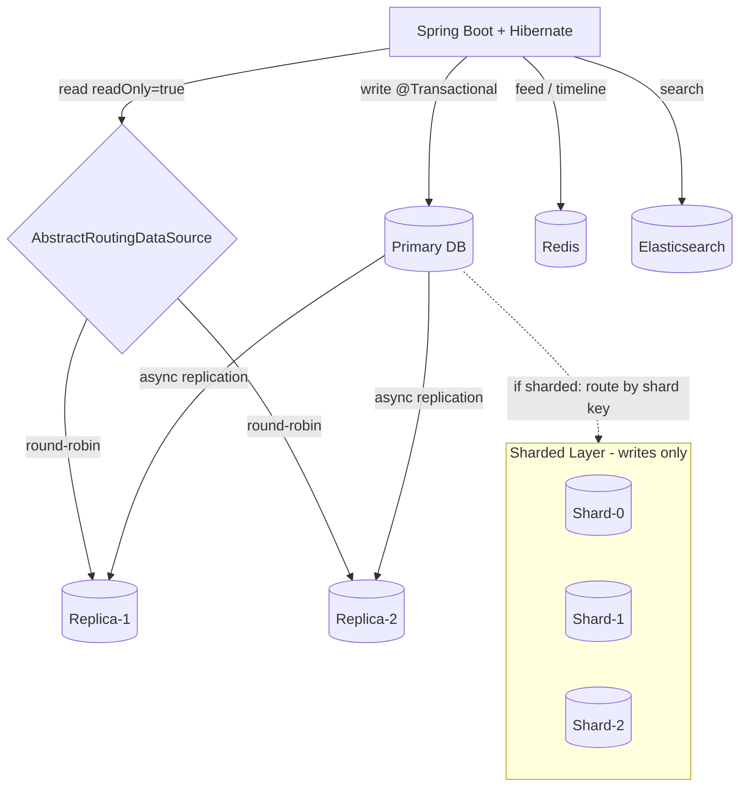

## Keywords in This File

{: .no_toc }

| # | Keyword | Weight |
| --- | --- | --- |
| 1 | [Hibernate at Scale: Sharding and Read Replicas](#hibernate-at-scale-sharding-and-read-replicas) | high |

---

# Hibernate at Scale: Sharding and Read Replicas

**TL;DR** - Hibernate was designed for single-database use. Scaling beyond
one database requires explicit architecture: read replicas reduce query
load, sharding partitions data across multiple databases, and both require
routing logic that Hibernate does not provide natively. The engineer's job
is to build routing on top of Hibernate's connection and session model.

---

### 🎯 Model Answer

**30 seconds:**
> Hibernate runs queries against a single database by default. At scale,
> you need read replicas (multiple read-only copies of the data) and
> sometimes sharding (partitioning data across multiple databases).
> For read replicas: use Spring's `AbstractRoutingDataSource` to route
> `@Transactional(readOnly=true)` to the replica and writes to the primary.
> For sharding: Hibernate does not support sharding natively. You need
> a shard routing layer - either a custom `DataSource` that routes based
> on the shard key, or a database proxy (Vitess, Citus, PlanetScale) that
> handles routing transparently.

**3 minutes (Senior):**
> Read replica routing with Hibernate is a solved problem with two components.
> First, multiple `DataSource` beans - one for the primary, one per replica.
> Second, Spring's `AbstractRoutingDataSource` that selects the DataSource
> based on the current transaction's read-only flag:
> `TransactionSynchronizationManager.isCurrentTransactionReadOnly()`.
> Mark read-only service methods with `@Transactional(readOnly=true)` and
> they automatically route to the replica. Writes route to the primary.
>
> The non-obvious risks: replica lag. Writes go to primary; reads from
> the replica may see data 10-100ms behind. For read-after-write consistency
> (user creates a record and immediately reads it back), you must route to
> the primary. Standard approach: use a "sticky primary" window - after a
> write, route all reads for that session to the primary for X seconds.
>
> For sharding: horizontal database partitioning puts different rows in
> different databases. Hibernate's `Session` is always connected to one
> database at a time. Shard routing means: before opening a session, pick
> the correct shard DataSource based on the shard key (user ID, tenant ID,
> region). This requires a shard key to be known at the call site - something
> not always available in the service layer.
>
> The most scalable pattern for Hibernate at scale is to keep Hibernate
> simple (single database per service) and scale the database layer with a
> proxy (PgBouncer for connection pooling, Citus for sharding, read replicas
> at the database level). This moves scaling concerns out of the ORM layer
> and into the infrastructure layer where they are easier to reason about.

*Adapting up:* "The fundamental tension at Hibernate scale: JPA assumes
a single persistence context per transaction. Distributed queries across
shards require multiple persistence contexts, or a shard-aware SQL rewriter
(like Vitess) that makes the application believe it is talking to one database
while actually distributing queries. Choosing between application-level
sharding (explicit in service code) and database-level sharding (transparent
proxy) is the core architectural decision."

*Adapting down:* "When your database becomes too slow, you have two options:
read replicas (multiple copies for reading) and sharding (split data into
multiple databases). Hibernate works great with read replicas; sharding
requires extra work because Hibernate only talks to one database at a time."

**Blank Mind Recovery:**

**(1) Restate:** "You are asking about how Hibernate behaves when scaling
beyond a single database - specifically with read replicas and sharding."

**(2) First principles:** "From first principles, Hibernate's `Session`
is bound to one database connection. Scaling means using multiple databases.
The engineer must decide where routing logic lives: in the application
(custom DataSource routing), or in the infrastructure (database proxy)."

**(3) Bridge:** "Think of Hibernate as a taxi driver who only knows one
route. To serve customers across the city, you need a dispatcher (routing
layer) to decide which driver (database connection) handles each passenger
(request). The taxi driver (Hibernate) does not change - only the dispatch
system does."

---

### 📘 Concept Explanation

**What it is:**
Hibernate at scale means designing data access architecture when a single
database can no longer serve all read or write traffic. The two primary
scaling strategies are: read replicas (synchronous copies of the primary
database that serve read-only queries) and sharding (horizontally
partitioning data across multiple independent databases). Both require
routing logic to direct Hibernate sessions to the correct database.

**The problem it solves:**
A single PostgreSQL primary can handle approximately 5,000-10,000 simple
queries per second. Read replicas multiply read capacity linearly (2 replicas
= 2x read throughput). Sharding increases write capacity by distributing
write load across N databases. Without these strategies, the database
becomes the bottleneck at high traffic volumes.

**Scaling strategies:**

```
SCALE-OUT ARCHITECTURE OPTIONS:

1. READ REPLICAS:
   Primary DB (writes) --> Replica-1 (reads)
                       --> Replica-2 (reads)
   Application routes:
     @Transactional(readOnly=false) -> Primary
     @Transactional(readOnly=true)  -> Replica (round-robin)

2. SHARDING (horizontal partitioning):
   Shard-0 (users 0..999999)     -> DB-0
   Shard-1 (users 1000000..1999999) -> DB-1
   Application routes:
     request for user_id=500000 -> DB-0
     request for user_id=1500000 -> DB-1
   Challenge: queries without shard key must scatter-gather

3. CQRS (Command Query Responsibility Segregation):
   Write path: Hibernate -> Primary DB
   Read path:  Projection store (Elasticsearch, Redis, Cassandra)
   Application uses Hibernate for writes only
   Reads use purpose-built read stores
```

> **Code walkthrough:** This example demonstrates the core pattern in action. The key mechanism shows how the concept works in practice. Study the structure to understand the essential behavior and common usage.

**Key insight:** Hibernate is optimized for transactional write-read
patterns against a single database. At extreme scale, separating write
and read paths (CQRS) and using purpose-built read stores is often more
practical than trying to shard a relational database.

---

### 💻 Code Example

```java
// GOOD: Read replica routing with AbstractRoutingDataSource
@Configuration
public class RoutingDataSourceConfig {

    @Bean("primaryDataSource")
    @ConfigurationProperties("spring.datasource.primary")
    DataSource primaryDataSource() {
        return DataSourceBuilder.create().build();
    }

    @Bean("replicaDataSource")
    @ConfigurationProperties("spring.datasource.replica")
    DataSource replicaDataSource() {
        return DataSourceBuilder.create().build();
    }

    @Bean @Primary
    DataSource routingDataSource(
        @Qualifier("primaryDataSource") DataSource primary,
        @Qualifier("replicaDataSource") DataSource replica) {

        Map<Object, Object> sources = new HashMap<>();
        sources.put("primary", primary);
        sources.put("replica", replica);

        AbstractRoutingDataSource routing =
            new AbstractRoutingDataSource() {
                @Override
                protected Object determineCurrentLookupKey() {
                    boolean readOnly =
                        TransactionSynchronizationManager
                            .isCurrentTransactionReadOnly();
                    return readOnly ? "replica" : "primary";
                }
            };
        routing.setTargetDataSources(sources);
        routing.setDefaultTargetDataSource(primary);
        return routing;
    }
}
```

> **Code walkthrough:** `AbstractRoutingDataSource` delegates
> `getConnection()` to one of N DataSources based on the key returned
> by `determineCurrentLookupKey()`. The routing decision:
> `isCurrentTransactionReadOnly()` returns `true` when the active
> transaction was opened with `@Transactional(readOnly=true)`. This
> routes read-only transactions to the replica automatically, with no
> change needed in service code beyond the `readOnly=true` annotation.

```java
// GOOD: Service using read replica routing
@Service
@Transactional
public class ProductService {

    @Autowired ProductRepository productRepo;

    // Routes to PRIMARY - write transaction
    public Product createProduct(CreateProductCmd cmd) {
        Product p = new Product(cmd.getName(), cmd.getPrice());
        return productRepo.save(p); // -> Primary DB
    }

    // Routes to REPLICA - read-only transaction
    @Transactional(readOnly = true)
    public Page<Product> listProducts(Pageable pageable) {
        return productRepo.findAll(pageable); // -> Replica DB
    }

    // Routes to PRIMARY - write needs latest data
    @Transactional // not readOnly = primary
    public Product updatePrice(Long id, BigDecimal price) {
        Product p = productRepo.findById(id).orElseThrow();
        p.setPrice(price);
        return p; // dirty checking -> UPDATE on primary
    }
}
```

> **Code walkthrough:** `@Transactional(readOnly=true)` does two things:
> (1) routes to the replica via `AbstractRoutingDataSource` and (2) tells
> Hibernate it can skip dirty checking, reducing session overhead. Default
> `@Transactional` (no readOnly) routes to the primary. The key: `listProducts`
> serves read traffic from the replica, reducing primary load. `updatePrice`
> uses the primary even though it starts with a read, because the write that
> follows must go to the primary.

```java
// GOOD: Read-after-write consistency handling
// Problem: user creates record then immediately reads it
// replica may lag 10-100ms

@Service
public class UserService {

    @Autowired UserRepository userRepo;
    // Track recent writers: thread-safe LRU cache
    private final Cache<Long, Instant> recentWriters =
        Caffeine.newBuilder()
            .expireAfterWrite(5, TimeUnit.SECONDS)
            .maximumSize(10_000)
            .build();

    @Transactional // primary
    public User createUser(CreateUserCmd cmd) {
        User user = userRepo.save(new User(cmd.getName()));
        recentWriters.put(user.getId(), Instant.now());
        return user;
    }

    // Sticky primary for read-after-write consistency:
    @Transactional(readOnly = true)
    public Optional<User> findUser(Long userId) {
        boolean recentlyWritten =
            recentWriters.getIfPresent(userId) != null;
        if (recentlyWritten) {
            // Force primary connection for this read
            TransactionContextHolder.setReadOnly(false);
        }
        return userRepo.findById(userId);
    }
}
// Users who just created their account always read from primary
// for 5 seconds, ensuring they see their own writes
```

> **Code walkthrough:** The "sticky primary" pattern solves read-after-write
> consistency. A Caffeine cache tracks user IDs that were written recently.
> Reads for recently-written users are routed to the primary, not the replica,
> for a 5-second window. After 5 seconds, the replica has caught up
> (typical lag < 1 second) and reads route to the replica normally.
> The cache is sized to hold 10,000 recent writers in ~1MB of memory.

```java
// GOOD: Simple shard routing (application-level)
@Service
public class ShardedUserService {

    // 4 shards: separate DataSources / EntityManagerFactories
    private final Map<Integer, UserRepository> shardRepos;

    public ShardedUserService(
        UserRepository shard0, UserRepository shard1,
        UserRepository shard2, UserRepository shard3) {
        shardRepos = Map.of(0, shard0, 1, shard1,
                            2, shard2, 3, shard3);
    }

    private int shardFor(long userId) {
        return (int)(userId % 4); // simple modulo sharding
    }

    public Optional<User> findById(long userId) {
        return shardRepos.get(shardFor(userId))
            .findById(userId);
    }

    public User create(User user) {
        // Assign shard based on pre-assigned userId or hash
        int shard = shardFor(user.getId());
        return shardRepos.get(shard).save(user);
    }

    // Cross-shard query: scatter-gather
    public List<User> findByEmail(String email) {
        // Must query all shards - expensive
        return shardRepos.values().stream()
            .flatMap(repo ->
                repo.findByEmail(email).stream())
            .collect(Collectors.toList());
    }
}
// Shard-key queries (by userId): O(1) - one shard
// Non-shard-key queries (by email): O(N) - all shards
```

> **Code walkthrough:** Application-level sharding uses 4 `UserRepository`
> instances, each backed by a different `EntityManagerFactory` and `DataSource`.
> `shardFor()` maps a user ID to a shard using modulo (consistent for a given
> user, deterministic). Shard-key queries (by user ID) hit one shard - O(1).
> Cross-shard queries (by email) must scatter to all 4 shards and gather
> results - expensive and should be rare in a sharded design. If cross-shard
> queries are frequent, sharding is likely the wrong strategy for this entity.

---

### 🎓 Answers by Seniority

**Junior / Mid (0-5 years):**
> Read replicas are extra copies of the database that can serve read
> queries. Writes still go to the primary (single source of truth).
> With Spring Boot + Hibernate, I use two DataSources and route read-only
> transactions to the replica using `AbstractRoutingDataSource`. The key
> annotation: `@Transactional(readOnly=true)` on service methods that
> only read - Hibernate routes these to the replica automatically and
> also skips dirty checking, making them faster. Sharding is more complex
> - it splits data across multiple databases and requires knowing which
> database holds the data you need.

*Push deeper:* "The risk with read replicas is replica lag. A replica
may be 10-500ms behind the primary. If a user creates a record and
immediately reads it back, they may get a 'not found' error if the read
goes to a lagging replica. The sticky primary pattern routes reads to
the primary for a few seconds after a write to prevent this."

---

**Senior / Staff (5+ years):**
> Read replica routing is standard for read-heavy services. The routing
> logic is straightforward: `AbstractRoutingDataSource` + `readOnly=true`
> annotation. The hard problems are: (1) replica lag and read-after-write
> consistency, (2) operational complexity of replica failover (if the
> replica falls behind, route all traffic to primary until it recovers),
> and (3) transaction boundaries - a transaction that starts read-only
> but discovers it needs to write cannot switch DataSources mid-transaction.
>
> For sharding: I evaluate the trade-offs before recommending it.
> Sharding increases operational complexity dramatically: cross-shard
> joins are expensive, unique constraints cannot span shards, and
> distributed transactions across shards require two-phase commit.
> My preference: exhaust single-database scaling options first (read replicas,
> proper indexing, query optimization, connection pooling, table partitioning)
> before committing to sharding. Most services do not need sharding until
> they exceed 500GB-1TB of data in a single table.
>
> When sharding is unavoidable: use a database proxy (Vitess, PlanetScale,
> Citus) that makes the application believe it is talking to one database.
> This keeps Hibernate code unchanged and moves sharding complexity into
> the infrastructure layer, where it is manageable without changing
> application code.

*Push deeper:* "The sharding key choice is the most consequential
architectural decision in a sharded system. A poor key creates hot spots
(one shard receives all traffic) or makes common queries cross-shard.
User ID is a good key for user-centric systems. Tenant ID for SaaS.
Time-based sharding (shard by created_at month) is dangerous: the current
month's shard receives all writes while old shards are read-only - a hot spot."

---

### ⚠️ Common Misconceptions

| Misconception | Reality | Danger Level |
|---|---|---|
| "Read replicas give instant consistency" | Replicas lag 10-500ms. Read-after-write requires routing recent reads to primary | Critical |
| "Sharding is required for large databases" | PostgreSQL handles 10TB+ with proper indexing and partitioning. Sharding is rarely needed before 500GB-1TB per table | High |
| "AbstractRoutingDataSource works mid-transaction" | DataSource routing is determined at transaction start. Cannot switch from read to write replica mid-transaction | High |
| "CQRS requires microservices" | CQRS is a pattern: commands go to write path (Hibernate), queries go to read path (any store). Works within a monolith | Medium |
| "Hibernate multi-tenancy = sharding" | Hibernate multi-tenancy separates tenant data (schema or discriminator). Sharding scales write capacity. Different concerns | Medium |

---

### 🚨 Failure Modes and Diagnosis

**Failure 1: Replica Lag Causing Stale Read Errors**

*Symptom:* User creates a record via POST, immediately GETs it, receives
404. Support tickets: "I just created it, why can't I see it?"

*Root cause:* POST (write) routes to primary, GET (read-only) routes to
replica. Replica lag: the read happens before the replica has replicated
the write.

*Diagnostic:*
```sql
-- On the replica, check lag:
SELECT now() - pg_last_xact_replay_timestamp()
AS replication_lag_seconds;
-- If > 1 second: significant lag. If > 5 seconds: alert.

-- PostgreSQL monitoring query:
SELECT client_addr, state, sent_lsn, write_lsn,
  flush_lsn, replay_lsn,
  (sent_lsn - replay_lsn) AS replication_lag
FROM pg_stat_replication;
```

> **Code walkthrough:** This example demonstrates the core pattern in action. The key mechanism shows how the concept works in practice. Study the structure to understand the essential behavior and common usage.

*Fix:*
```java
// Sticky primary window for recent writes:
// (see Code Example section for full implementation)
// OR: simpler - route specific endpoints to primary:
@GetMapping("/users/{id}")
@Transactional // not readOnly - forces primary
public UserDTO getUser(@PathVariable Long id) { ... }
// Trade-off: more primary load, but guaranteed consistency
```

> **Code walkthrough:** This example demonstrates the core pattern in action. The key mechanism shows how the concept works in practice. Study the structure to understand the essential behavior and common usage.

---

**Failure 2: Hot Shard Due to Poor Shard Key**

*Symptom:* One database node (shard) has 10x higher CPU/I/O than others.
Most writes go to one shard. The shard becomes a bottleneck.

*Root cause:* Sequential shard key (e.g., auto-increment ID or timestamp)
causes all new writes to go to the "latest" shard. Old shards are cold.

*Diagnostic:*
```bash
# Check per-shard write rates:
# If using Vitess:
vtctlclient ExecuteFetchAsDba -json \
  shard-0/leader "SHOW STATUS LIKE 'Com_insert'";
# Compare across shards: should be roughly equal

# Application-level: log shard key distribution:
log.info("Shard distribution: {}",
    ordersPerShard.entrySet().stream()
      .map(e -> e.getKey() + "=" + e.getValue())
      .collect(Collectors.joining(", ")));
```

> **Code walkthrough:** This example demonstrates the core pattern in action. The key mechanism shows how the concept works in practice. Study the structure to understand the essential behavior and common usage.

*Fix:* Choose a shard key with high cardinality and uniform distribution.
User ID (random UUID) distributes uniformly. Auto-increment integers or
timestamp-based keys create hot shards. If the hot shard is unavoidable
(e.g., all writes are for "current time"): consider virtual shards -
hash the key before sharding to distribute load.

---

**Failure 3: Cross-Shard Query Performance Collapse**

*Symptom:* A search endpoint is extremely slow (5-30 seconds). The query
was fast before sharding was introduced.

*Root cause:* The search query does not include the shard key. It must
scatter to ALL shards, execute on each, and gather results. A query
that took 50ms on one database now takes 50ms * N shards + network overhead
* N shards.

*Diagnostic:*
```bash
# Check: how many shards does this query hit?
# Add query tracing: log the shard(s) queried per request
log.debug("Query hit {} shards for email search",
    shardCount);
# If shardCount = N (all shards): this query does not benefit from sharding
```

> **Code walkthrough:** This example demonstrates the core pattern in action. The key mechanism shows how the concept works in practice. Study the structure to understand the essential behavior and common usage.

*Fix:* One of:
1. Add the shard key to the query (change the query to include user_id)
2. Maintain a secondary lookup table (email -> user_id, non-sharded)
3. Use a dedicated search service (Elasticsearch) for non-shard-key searches
4. Re-evaluate if sharding is the right strategy for this entity

---

### 🏛️ System Design

> *(Conditional: included because ★★★ keyword. Scaling is a core system
> design interview topic.)*

**Example question:** "Design the database scaling strategy for a social
platform growing from 1M to 100M users using Spring Boot + Hibernate."

**6-step framework answer:**

Step 1 CLARIFY (~5 min):
- "What is the current bottleneck? Read-heavy or write-heavy?"
- "What is the primary entity? (users, posts, friendships, feeds)"
- "What consistency requirements? (eventual vs strong)"

Step 2 ESTIMATE (~5 min):
- 1M users: 10K DAU, 100 RPS - single database fine
- 10M users: 100K DAU, 1000 RPS - add read replica for query load
- 100M users: 1M DAU, 10K+ RPS - sharding for write-heavy entities
  OR CQRS (Hibernate for writes, purpose-built read stores for feeds)

Step 3 DESIGN (~10 min):

```
Phase 1 (1M users): Single DB + connection pooling
  App -> HikariCP -> PostgreSQL Primary
  HikariCP: max=20, PgBouncer: 5 pods * 20 = 100 connections

Phase 2 (10M users): Add read replica
  App -> AbstractRoutingDataSource
    @Transactional(readOnly=true) -> Read Replica
    @Transactional -> Primary
  Covers 80% of traffic (reads)

Phase 3 (100M users): CQRS + sharding for core entities
  Write path: Hibernate -> Primary (sharded by user_id for users table)
  Read path (feed/timeline): Redis/Cassandra (purpose-built)
  Read path (search): Elasticsearch
  Read path (simple by-ID): PostgreSQL read replica
```

> **Code walkthrough:** This example demonstrates the core pattern in action. The key mechanism shows how the concept works in practice. Study the structure to understand the essential behavior and common usage.

Step 4 DEEP DIVE (~10 min):
The feed is the hardest scaling problem. Naive approach: for each user,
JOIN friends table + posts table WHERE friend_id IN (friend_list). At
100M users, a user may have 1000 friends, each posting 5x/day = 5000
posts to scan per feed load. This is a cross-table scatter query - terrible
at scale.

Better approach: fan-out on write. When a user posts, write the post_id
into each follower's feed table (pre-materialized). Feed reads become
a simple `SELECT * FROM feeds WHERE user_id=X ORDER BY ts DESC LIMIT 20`.
Hibernate handles this with a simple `findByUserIdOrderByCreatedAtDesc`.
The write fan-out is asynchronous (via Kafka), so Hibernate's transaction
scope is small.

Step 5 ALTS (~5 min):
- Sharding with Vitess: transparent to Hibernate, managed at infrastructure layer
- Citus (distributed PostgreSQL): append `CREATE TABLE ... PARTITION BY` and
  Citus handles shard routing; Hibernate requires no changes
- NewSQL (CockroachDB, YugabyteDB): distributed SQL with automatic sharding;
  Hibernate-compatible via PostgreSQL JDBC

Step 6 EVOLVE (~5 min):
At 1B users: the database is no longer the bottleneck - it is the network
fan-out for feed delivery. Switch from push (fan-out on write) to hybrid:
push for users with < 1000 followers (most users), pull for celebrity
accounts (millions of followers). Hibernate only touches the write path;
the read path is fully decoupled.

**Scale inflection point:**
Read replicas: needed at ~1000 RPS with read:write ratio > 5:1. Adding
one replica typically covers 5-10x additional read capacity.

Sharding: needed when single-node write throughput exceeds ~5,000 writes/second
sustained, OR when dataset grows beyond ~1-2TB (single-table scan performance
degrades). This is much later than most engineers expect.

**Common system design traps:**
- Recommending sharding at 1M users (premature)
- Not considering CQRS: trying to scale reads AND writes on the same
  relational model instead of using purpose-built read stores
- Ignoring replica lag in read-after-write scenarios
- Time-based shard keys creating hot shards

**Staff angle:** The most important architectural insight at scale is:
Hibernate is an excellent tool for transactional write operations and
simple reads. It is a poor tool for analytics, feed generation, and
full-text search at scale. The right architecture identifies which
queries Hibernate handles well (CRUD, transactional) and uses purpose-
built stores (Redis, Elasticsearch, Cassandra) for the rest. This is
not a limitation of Hibernate - it is correct use of each tool's
strengths.

---

### 📊 Diagram

```
SCALING PROGRESSION (by user count):

1M users:    [App] --> [Primary DB]

10M users:   [App] --> AbstractRoutingDS
               readOnly=true  --> [Replica-1]
               readOnly=true  --> [Replica-2]
               write          --> [Primary DB]
                                    |
                               (async replication)
                                    |
                               [Replica-1] [Replica-2]

100M users:  [App] --> Shard Router
               user_id shard 0 --> [DB-0: users 0-25M]
               user_id shard 1 --> [DB-1: users 25M-50M]
               user_id shard 2 --> [DB-2: users 50M-75M]
               user_id shard 3 --> [DB-3: users 75M-100M]

             Feed reads --> [Redis / Cassandra] (not Hibernate)
```



> **Diagram walkthrough:** The top layer shows read replica routing:
> writes to primary, reads to replicas via `AbstractRoutingDataSource`.
> Replicas receive data via asynchronous replication - the source of replica
> lag. The middle layer shows purpose-built read stores: Redis for feeds
> (low-latency key-value), Elasticsearch for full-text search. Hibernate
> writes to these stores via application events (or Kafka), but reads bypass
> Hibernate entirely. The bottom shows sharding: if writes exceed single-
> node capacity, the primary is sharded with Hibernate routing to the
> correct shard based on the shard key. Most services never need the sharded
> layer - read replicas and purpose-built read stores cover the majority
> of scaling requirements.

---

### 🎯 Interview Deep-Dive

| Timing | Seniority | Focus |
|--------|-----------|-------|
| 3 min | Junior | What is a read replica, why use it |
| 5 min | Mid | Read replica routing with Spring, replica lag |
| 7 min | Senior | Sharding trade-offs, when to shard vs not |
| 10 min | Staff | CQRS + purpose-built stores, scaling roadmap |
| 15 min | FAANG | Full scaling architecture, trade-off analysis |

---

**Q1 [JUNIOR] - DEFINITION**
What is a read replica and how does it help with Hibernate performance?

*Why they ask:* Read replicas are a fundamental scaling pattern.

*Likely follow-up:* "What is replica lag?"

**Answer:**
A read replica is a copy of the primary database that is kept synchronized
via replication. Writes go to the primary (single source of truth).
The primary streams changes to replicas. Replicas serve read queries.

With Hibernate + Spring Boot:
- `@Transactional` methods route to the primary
- `@Transactional(readOnly=true)` methods route to the replica

Benefits:
1. Read throughput: 2 replicas = roughly 2x read capacity (each replica
   handles its own read traffic)
2. Primary offload: analytical queries, reports, and list operations
   run on the replica without slowing down write transactions on the primary
3. Isolation: a slow reporting query on the replica cannot block a write
   transaction on the primary

Replica lag: changes written to the primary take 10-500ms to appear on
replicas (network + I/O). For a few hundred milliseconds after a write,
the replica may not have the latest data. Most reads are fine with this
small lag (displaying a product catalog, listing search results). Reads
that must reflect the just-written data (user sees their own just-created
record) need to route to the primary.

*What separates good from great:* Mentioning replica lag and the category
of reads that must go to the primary (read-after-write) rather than treating
the replica as always up-to-date.

---

**Q2 [MID] - MECHANISM**
How does `AbstractRoutingDataSource` route transactions between
primary and replica?

*Why they ask:* Tests understanding of the Spring routing mechanism.

*Likely follow-up:* "Can you switch from read to write replica mid-transaction?"

**Answer:**
`AbstractRoutingDataSource` is a Spring DataSource implementation that
delegates `getConnection()` to one of N DataSources based on the result
of `determineCurrentLookupKey()`. The routing key is determined ONCE at
the start of each `getConnection()` call.

The routing pattern:
```java
new AbstractRoutingDataSource() {
    @Override
    protected Object determineCurrentLookupKey() {
        return TransactionSynchronizationManager
            .isCurrentTransactionReadOnly()
            ? "replica" : "primary";
    }
}
```

> **Code walkthrough:** This example demonstrates the core pattern in action. The key mechanism shows how the concept works in practice. Study the structure to understand the essential behavior and common usage.

`TransactionSynchronizationManager.isCurrentTransactionReadOnly()`
returns the `readOnly` flag of the current `@Transactional` annotation.
When `@Transactional(readOnly=true)` opens a transaction, this returns `true`.

Important: the routing decision is made at connection acquisition time,
not per-query. A transaction acquires ONE connection at start and holds
it for its duration. You cannot switch from replica to primary mid-transaction.
If a read-only transaction discovers it needs to write: the transaction
must be rolled back and a new write transaction started.

This constraint means: service methods must know at annotation time
whether they will write. If there is any chance of a write, use
`@Transactional` (not readOnly). Only annotate readOnly=true when you
are certain no writes will occur.

*What separates good from great:* The constraint that routing is determined
at transaction start - cannot switch mid-transaction.

---

**Q3 [SENIOR] - TRADE-OFF**
When should you shard a database and when should you NOT?

*Why they ask:* Most engineers recommend sharding prematurely; trade-off
analysis is the key skill.

*Likely follow-up:* "What are alternatives to sharding for scaling writes?"

**Answer:**
Sharding is necessary when:
- Single-node write throughput is the bottleneck (> 5,000 writes/second sustained)
- Dataset size causes single-table scan performance to degrade (> 1-2TB per table)
- Regulatory requirements mandate data isolation by geography/tenant

Sharding is NOT necessary when (exhaust these first):
- Read replicas can absorb the load (80%+ of traffic is reads)
- Proper indexing eliminates slow queries
- Connection pooling (PgBouncer) solves connection limits
- Table partitioning provides the performance benefits without complexity:
  `CREATE TABLE orders PARTITION BY RANGE (created_at)` - separate physical
  files per month, same database, standard Hibernate query
- Vertical scaling (more CPU/RAM/SSD) provides 2-4x capacity headroom

The true cost of sharding:
1. Cross-shard joins: impossible (or scatter-gather, very expensive)
2. Unique constraints cannot span shards
3. Distributed transactions across shards require 2PC (avoid)
4. Schema migrations must run on all N shards in parallel
5. Application complexity: shard key in every query, no simple "findAll()"
6. Operational complexity: N times the number of databases to monitor

PostgreSQL with proper configuration handles 10TB+ with acceptable performance.
Most services do not need sharding before 1TB single-table data. Premature
sharding adds all the costs above with no benefit.

*What separates good from great:* Table partitioning as an alternative -
it provides per-partition statistics, constraint exclusion (queries skip
non-relevant partitions), and parallelism without the complexity of sharding.

---

**Q4 [SENIOR] - DEBUGGING**
Your service routes read queries to the replica. After a major
data load, read performance suddenly degrades. The primary is
fine. How do you diagnose?

*Why they ask:* Replica-specific performance issues require different
diagnostics than primary issues.

*Likely follow-up:* "How does VACUUM ANALYZE help?"

**Answer:**
Replica-specific degradation after a large data load suggests:

Cause 1: Replica statistics are stale.
The query planner uses table statistics to choose query plans. A large
data load changes the data distribution. If `VACUUM ANALYZE` has not
run, the planner uses old statistics and may choose a sequential scan
instead of an index scan.

Diagnostic:
```sql
-- On replica: check statistics age
SELECT schemaname, tablename, last_analyze, last_autoanalyze
FROM pg_stat_user_tables
WHERE tablename = 'orders';
-- If last_analyze is before the data load: run ANALYZE

-- Manual ANALYZE on replica (safe, no data change):
ANALYZE orders;
-- This updates statistics without locking the table
```

> **Code walkthrough:** This example demonstrates the core pattern in action. The key mechanism shows how the concept works in practice. Study the structure to understand the essential behavior and common usage.

Cause 2: Replica replay lag causing long-running queries to be canceled.
PostgreSQL replicas can cancel long-running queries to allow replica
replay to proceed if the query holds locks that conflict with replication.
`max_standby_streaming_delay` controls how long the replica waits before
canceling conflicting queries.

Diagnostic:
```sql
-- On replica: check for query cancellations
SELECT pid, query_start, query, state, wait_event
FROM pg_stat_activity
WHERE state = 'active';
-- Look for: "ERROR: canceling statement due to conflict with recovery"
```

> **Code walkthrough:** This example demonstrates the core pattern in action. The key mechanism shows how the concept works in practice. Study the structure to understand the essential behavior and common usage.

Fix: increase `max_standby_streaming_delay` (gives queries more time
to complete) or tune `hot_standby_feedback=on` (prevents primary from
cleaning up row versions still needed by replica queries).

*What separates good from great:* The `max_standby_streaming_delay` and
`hot_standby_feedback` parameters for long-running read queries on replicas.

---

**Q5 [STAFF] - ARCHITECTURE**
How would you design a CQRS architecture for a Hibernate-backed
service to improve read scalability without sharding?

*Why they ask:* CQRS with purpose-built read stores is often more practical
than sharding for read-heavy services.

*Likely follow-up:* "How do you handle consistency between the write store and read store?"

**Answer:**
CQRS (Command Query Responsibility Segregation) separates the write
path (commands that change state) from the read path (queries that
return data). The write store is the source of truth. Read stores are
derived projections optimized for query patterns.

Architecture:
```
Write Path:
  POST /orders -> OrderService -> Hibernate -> PostgreSQL Primary
                                            -> Publish OrderCreated event
                                               (Kafka / Outbox pattern)

Read Path - Simple lookups:
  GET /orders/{id} -> OrderRepository -> PostgreSQL Replica
  (Hibernate handles: findById, short list queries)

Read Path - Search:
  GET /orders?q=term -> SearchService -> Elasticsearch
  (Elasticsearch index updated by OrderCreated event consumer)

Read Path - Feed / Timeline:
  GET /users/{id}/activity -> FeedService -> Redis sorted set
  (Redis updated by event consumer, evicted on TTL)

Read Path - Analytics:
  GET /reports/monthly -> AnalyticsService -> ClickHouse / BigQuery
  (Batch-updated from Kafka by streaming job)
```

> **Code walkthrough:** This example demonstrates the core pattern in action. The key mechanism shows how the concept works in practice. Study the structure to understand the essential behavior and common usage.

Consistency model:
The write store (PostgreSQL) is the source of truth. Read stores are
eventually consistent - they lag by the event processing latency
(typically 100ms-5s for Kafka consumers).

Handling eventual consistency:
1. For user-facing reads after write: show optimistic UI (display
   the just-created record from the DTO returned by the POST, not
   by re-querying the read store)
2. For search indexing delay: add a "Indexing..." indicator if the
   search index does not include the document yet (known lag window)
3. For critical reads (payment confirmation): always read from
   PostgreSQL primary, never from the eventual-consistency read stores

Implementation with Hibernate:
Hibernate handles ONLY the write path (commands + simple reads from replica).
Event publishing uses the Outbox Pattern to guarantee at-least-once delivery:
```java
@Transactional
public Order createOrder(CreateOrderCmd cmd) {
    Order order = orderRepo.save(new Order(cmd));
    // Outbox: event saved in same transaction as the order
    outboxRepo.save(new OutboxEvent("OrderCreated",
        order.getId(), serialize(order)));
    return order;
}
// Separate Outbox processor publishes events to Kafka and deletes
// the outbox record. If the service crashes between save and publish,
// the outbox record is re-processed on restart.
```

> **Code walkthrough:** This example demonstrates the core pattern in action. The key mechanism shows how the concept works in practice. Study the structure to understand the essential behavior and common usage.

*What separates good from great:* The Outbox Pattern for guaranteed
event delivery within the same transaction as the write - this is the
key implementation detail that ensures consistency between write and
event stores.

---

**Q6 [MID] - COMPARISON**
What is the difference between read replicas and database table
partitioning as scaling strategies?

*Why they ask:* Tests understanding of different scaling dimensions.

*Likely follow-up:* "Can you use both together?"

**Answer:**
Read replicas and table partitioning solve different problems:

Read replicas scale READ THROUGHPUT:
- Multiple servers serve read traffic
- Each replica handles its own connections
- 3 replicas = ~3x read capacity
- Does not reduce the size of data any single database handles
- Does not help with write throughput (writes go to one primary)

Table partitioning scales DATA SIZE and READ SPEED:
- One database, one table, but multiple physical storage files (partitions)
- Query planner can skip irrelevant partitions (constraint exclusion)
- Example: `SELECT * FROM orders WHERE created_at > '2024-01-01'`
  with year-based partitioning: scans only the 2024 partition
- Reduces I/O for time-series or range queries significantly
- Does not increase the number of servers

Both solve different scaling dimensions and complement each other:
- Partition the large tables (reduces scan cost, improves cache efficiency)
- Add read replicas (distributes read connections across servers)

With Hibernate: table partitioning is completely transparent. Hibernate
sees the parent table `orders`; PostgreSQL routes to the correct partition
internally. No Hibernate configuration change required. Read replicas
require routing logic (`AbstractRoutingDataSource`).

*What separates good from great:* Table partitioning being transparent
to Hibernate - it scales data without any application code change.

---

**Q7 [SENIOR] - TRADE-OFF**
What are the trade-offs between application-level sharding and
using a database proxy for sharding (Vitess, Citus)?

*Why they ask:* Tests knowledge of sharding implementation strategies.

*Likely follow-up:* "How does Vitess handle cross-shard queries?"

**Answer:**
Application-level sharding:
- Routing logic in the application: `shardRepo.get(shardFor(userId)).findById(id)`
- Explicit shard key in every query call site
- Application developer must handle scatter-gather for cross-shard queries
- Full control: any shard distribution logic possible
- Schema migrations: must run against each shard separately
- Easy to test: mock each shard's repository independently

Database proxy sharding (Vitess, Citus):
- Application talks to the proxy as if it is one database
- Proxy handles shard routing based on configured rules
- Cross-shard queries handled by proxy (scatter-gather behind the scenes)
- Hibernate and JDBC require no changes (proxy looks like PostgreSQL)
- Schema migrations run via the proxy (applies to all shards)
- Operational overhead: another system to deploy, monitor, and maintain

The key difference: where does the complexity live?
- Application-level: complexity in service code, visible to developers
- Proxy: complexity in infrastructure, hidden from developers

Recommendation:
- New service starting with sharding: use Citus or Vitess. The application
  stays clean, routing is managed by the infrastructure team.
- Existing service with custom sharding logic: evaluate migration cost.
  Replacing application-level routing with a proxy requires removing
  routing logic from service code - a significant refactor, but worth
  it for long-term maintainability.

Vitess specifically: handles cross-shard JOINs, distributed queries,
and online schema changes (gh-ost equivalent). The trade-off is complexity
in the Vitess deployment (etcd, vtgate, vttablet components).

*What separates good from great:* "Where does complexity live" as the
core trade-off framing, and the recommendation to prefer proxy-based
sharding for new services.

---

**Q8 [STAFF] - DEBUGGING**
After introducing read replica routing, integration tests that
were passing are now failing intermittently. The failures are
non-deterministic. What is happening?

*Why they ask:* Read replica routing in tests requires explicit configuration.

*Likely follow-up:* "How do you configure tests to always use the primary?"

**Answer:**
Integration tests with read replica routing fail non-deterministically
because test data written in one transaction is not visible to the read
replica in the same test run. The test flow:

```
Test: setup() writes data -> @Transactional -> committed to primary
Test: assert() reads data -> @Transactional(readOnly=true) -> reads replica
Result: replica may not have propagated the write yet -> data not found
```

> **Code walkthrough:** This example demonstrates the core pattern in action. The key mechanism shows how the concept works in practice. Study the structure to understand the essential behavior and common usage.

In a test environment with an embedded or local database (H2, Testcontainers),
there is no actual replica - both DataSources may point to the same
database or the "replica" DataSource may not exist. The routing logic
tries to use a null DataSource and throws an error.

Fixes:

Fix 1 (simplest): disable routing in tests by overriding the DataSource:
```java
@TestConfiguration
public class TestDataSourceConfig {
    @Bean @Primary
    DataSource testDataSource(
        @Qualifier("primaryDataSource") DataSource primary) {
        // All queries go to primary in tests:
        return primary;
    }
}
```

> **Code walkthrough:** This example demonstrates the core pattern in action. The key mechanism shows how the concept works in practice. Study the structure to understand the essential behavior and common usage.

Fix 2: use a Spring profile that disables routing:
```yaml
# application-test.yml:
spring.jpa.open-in-view: false
# Override routing DataSource bean to return primary
```

> **Code walkthrough:** This example demonstrates the core pattern in action. The key mechanism shows how the concept works in practice. Study the structure to understand the essential behavior and common usage.

Fix 3 (Testcontainers): start both primary and replica containers
with real PostgreSQL streaming replication. Adds complexity but tests
the actual routing behavior.

For most test suites: Fix 1 is correct. Tests should verify business
logic, not infrastructure routing behavior. The routing logic itself
can be tested with a dedicated unit test for `determineCurrentLookupKey()`.

*What separates good from great:* The separation of concerns: use Fix 1
for business logic tests, write a dedicated unit test for routing logic,
and use Testcontainers with real replication only when testing replication
lag handling specifically.

---

**Q9 [SENIOR] - MECHANISM**
What is `@Transactional(readOnly=true)` and what optimizations
does Hibernate apply?

*Why they ask:* Tests depth of understanding beyond just the routing benefit.

*Likely follow-up:* "Does readOnly=true prevent writes?"

**Answer:**
`@Transactional(readOnly=true)` signals to both Spring and Hibernate
that the transaction will not modify data. This enables several optimizations:

Spring optimization:
- Sets the JDBC `Connection.setReadOnly(true)` hint to the driver
- Some databases (PostgreSQL, MySQL) use this hint to route to a
  read-only replica at the driver/proxy level independently
- The `AbstractRoutingDataSource` uses `isCurrentTransactionReadOnly()`
  to select the replica DataSource

Hibernate optimizations:
- Disables dirty checking: Hibernate normally compares each entity's
  current state to its snapshot at flush time. In a read-only transaction,
  there is nothing to flush - dirty checking overhead is skipped.
- Does not hold entity snapshots in the L1C (can reduce memory)
- Does not register entities for cascade operations

Database optimizations:
- PostgreSQL: read-only transaction mode can use more aggressive optimizations
  and does not need to acquire row-level locks for SELECT
- MySQL: similar behavior - read-only transactions skip some lock overhead

Does readOnly=true prevent writes?
In Hibernate: NOT enforced at the application level. You CAN call
`repo.save()` in a `readOnly=true` transaction. The save will execute
and may succeed or fail depending on the database (some databases enforce
read-only at the connection level; others do not). It is a hint, not
an enforcement.

The enforcement happens at the database level if the replica is truly
read-only (which it should be). Attempting a write on a read replica
fails with: `FATAL: can't execute INSERT in a read-only transaction`.

*What separates good from great:* The list of Hibernate-level optimizations
(dirty checking skip, snapshot reduction) beyond just the DataSource routing.

---

**Q10 [STAFF] - ARCHITECTURE**
Your service's primary database is at 80% write capacity. You
need to scale writes. Walk me through your decision process.

*Why they ask:* Tests architectural thinking under constraint - scaling
writes is harder than scaling reads.

*Likely follow-up:* "What if the bottleneck is a single frequently-updated row?"

**Answer:**
I would systematically exhaust options in order of increasing complexity:

Step 1: Profile the write workload (30 minutes).
- `pg_stat_statements`: which queries account for 80% of write I/O?
- Are the writes dominated by one table or spread?
- Is the bottleneck I/O, CPU, or lock contention?
```sql
SELECT query, calls, total_exec_time, rows
FROM pg_stat_statements
WHERE query LIKE 'INSERT%' OR query LIKE 'UPDATE%'
ORDER BY total_exec_time DESC LIMIT 10;
```

> **Code walkthrough:** This example demonstrates the core pattern in action. The key mechanism shows how the concept works in practice. Study the structure to understand the essential behavior and common usage.

Step 2: Optimize existing writes.
- Missing indexes on FK columns causing table scans on update cascades
- Batch writes: group 100 INSERTs into one statement
- Asynchronous writes: queue non-critical writes (audit logs, metrics)
  and batch-process them
- UPSERT instead of SELECT-then-INSERT

Step 3: Hardware scaling (vertical).
PostgreSQL scales well vertically. SSDs reduce I/O bottleneck.
More RAM increases buffer cache - more writes absorbed in memory
before fsync. Often buys 6-12 months before Step 4 is needed.

Step 4: Table partitioning.
Partition the high-write table by time or user_id range.
Write operations go to the current partition only - smaller table,
less index maintenance overhead per write.

Step 5: CQRS for write-heavy paths.
Move audit logs, event stores, and analytics writes to specialized
stores (Kafka, ClickHouse) that are designed for write-heavy workloads.
Hibernate handles only core business entity writes.

Step 6: Sharding (last resort).
Only if steps 1-5 are exhausted and write bottleneck persists.
Pick shard key, migrate data, add routing layer.

Special case - hot row bottleneck:
If 80% of writes are to a single row (a counter, a global sequence):
- Use database sequences (not row-level counters)
- Cache the counter in Redis (increment in Redis, sync to DB periodically)
- Use optimistic locking with retry to reduce contention
- Consider event sourcing (append-only writes) instead of update-in-place

*What separates good from great:* The special case of a hot row - a
single frequently-updated row is a fundamentally different problem from
distributed write bottleneck, and requires different solutions.

---

**Q11 [MID] - DEBUGGING**
Your service logs show `LazyInitializationException` only in
certain environments. Development works fine. Production fails.
How do you debug?

*Why they ask:* Environment-specific LIE is a classic OSIV mis-configuration.

*Likely follow-up:* "How do you make OSIV consistent across environments?"

**Answer:**
`LazyInitializationException` only in production (not development) is
almost always caused by OSIV (`open-in-view`) being configured differently
between environments.

Development: `spring.jpa.open-in-view=true` (Spring Boot default).
OSIV keeps the session open through the controller layer. Lazy loading
works everywhere. No LIE.

Production: `spring.jpa.open-in-view=false` (correct setting for production).
Session closes at transaction boundary. Accessing lazy associations
in the controller layer fails with LIE.

Diagnostic:
```yaml
# Check each environment's configuration:
# development/application-dev.yml:
# spring.jpa.open-in-view: true (or absent = true by default)

# production/application-prod.yml:
# spring.jpa.open-in-view: false
```

> **Code walkthrough:** This example demonstrates the core pattern in action. The key mechanism shows how the concept works in practice. Study the structure to understand the essential behavior and common usage.

Fix - Option 1 (correct): Disable OSIV in ALL environments:
```yaml
# application.yml (base config, applies everywhere):
spring.jpa.open-in-view: false
```
> **Code walkthrough:** This example demonstrates the core pattern in action. The key mechanism shows how the concept works in practice. Study the structure to understand the essential behavior and common usage.

Then fix each LIE by loading associations within the transaction using
`@EntityGraph` or `JOIN FETCH` in the service layer. This surfaces
all LIE issues in development where they are easy to fix.

Fix - Option 2 (wrong): Enable OSIV in production.
This fixes LIE but hides N+1 problems. DO NOT do this.

Root cause rule: LIE in production but not development = different
OSIV configuration. Always set `spring.jpa.open-in-view: false` in
the base `application.yml` so it applies everywhere unless explicitly
overridden.

*What separates good from great:* Explaining that Option 2 (re-enabling
OSIV) is the wrong fix - it hides N+1 problems that will degrade
production performance under load.

---

**Q12 [STAFF] - BEHAVIORAL**
Describe a production scaling incident involving database read
traffic that you diagnosed and resolved.

*Why they ask:* Tests real-world experience handling scaling incidents.

*Likely follow-up:* "What metrics did you add afterwards to detect this earlier?"

**Answer:**

**S (Situation):** A high-traffic e-commerce service hit a database
bottleneck every day at 2pm (peak shopping hour). CPU on the PostgreSQL
primary was at 90%, p99 latency for product listing was 4-8 seconds.
Writes were fast; the bottleneck was product catalog reads.

**T (Task):** Reduce primary database CPU below 60% at peak load without
changing the application's business logic or data model.

**A (Action):**

Day 1: Profiled the workload.
`pg_stat_statements` showed product catalog queries (`SELECT * FROM products
JOIN categories ON ... WHERE category_id = ?`) accounted for 70% of CPU.
These were all read-only. The primary was serving both writes AND all
read traffic.

Day 2: Added a read replica and routing.
Provisioned a PostgreSQL read replica (same instance type). Added
`AbstractRoutingDataSource` configuration. Annotated all catalog service
methods with `@Transactional(readOnly=true)`. Deployed.

Day 3 (2pm peak): Primary CPU dropped from 90% to 35%. Replica CPU at
45%. Product listing p99 dropped from 6 seconds to 280ms. The replica
was absorbing 65% of all query load.

Day 4: Added a second replica for headroom. Set up round-robin routing
across two replicas.

Follow-up - replica lag monitoring:
Added alert: `now() - pg_last_xact_replay_timestamp() > 5 seconds`.
During the first week, the replica fell behind during the data load
(3am nightly batch). Fixed by limiting batch import rate to give replica
time to keep up. Added `hot_standby_feedback=on` to prevent replica
query cancellations during the import.

**R (Result):** Primary CPU at 25-40% during peak (was 90%). Product
listing p99 at 150-300ms (was 4-8 seconds). Zero recurrence. Cost:
one additional database instance and 2 days of engineering.

Metrics added post-incident:
- `pg_replication_lag_seconds` alert at > 5 seconds
- `hikaricp_connections_pending` alert at > 5 (pool pressure)
- Dashboard: primary vs replica query distribution ratio
  (should be ~30/70 write/read split)

*What separates good from great:* The `hot_standby_feedback=on` detail
and the batch import rate limiting - showing awareness of the secondary
effect of large imports on replica performance.

---

### 💻 Code Example

*(Omit: this concept does not have a programmatic interface that can be demonstrated in code. The conceptual explanation above is sufficient.)*


---

### 🏛️ System Design

*(Omit: system design diagram not applicable for this concept - see ★★★ keywords for full system design coverage.)*


---

### ⚖️ Comparison Table

*(Omit: this is a ★☆☆ foundational concept with no direct alternatives to compare - see higher-difficulty keywords for trade-off analysis.)*


---

### 📊 Diagram

*(Omit: no standalone visual diagram required for this concept - the explanations and code examples above provide sufficient clarity.)*


