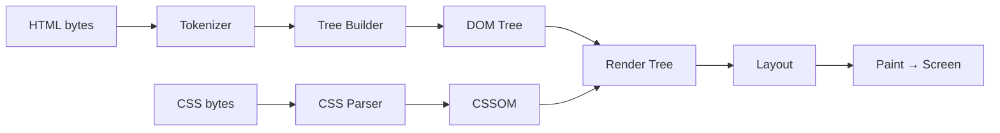
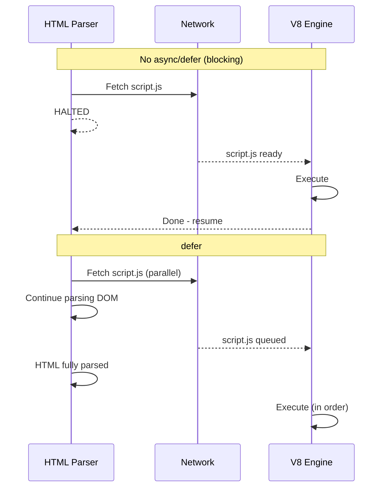
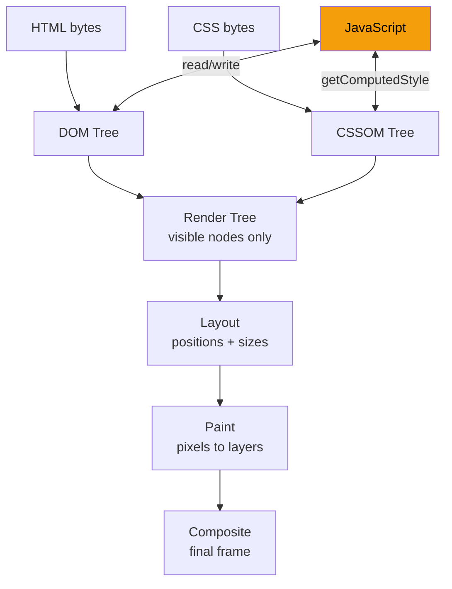

# HTML Origins and Purpose

🎯 **Interview Weight:** medium (★☆☆) - Asked at all levels to
gauge whether the candidate understands WHY HTML exists, not
just what it looks like

---

### 🎯 Model Answer

**30 seconds:**

> HTML - HyperText Markup Language - is the structure layer of
> the web. It describes WHAT content is (a heading, a paragraph,
> a link, an image) without describing how it looks or behaves.
> Browsers parse HTML into a DOM tree, which CSS then styles and
> JavaScript then programs. HTML's key insight is that content
> structure should be separate from presentation.

**3 minutes (Senior):**

> HTML was created by Tim Berners-Lee in 1991 to share scientific
> documents over the internet. The original goal was simple: link
> documents together with hyperlinks so researchers could reference
> each other's work. The "markup" in HTML means annotating text
> with tags that describe the role of each piece of content.
>
> The fundamental design reflects two decisions that aged well and
> one that caused decades of pain. The good decisions: content is
> separate from presentation (HTML vs CSS), and the language is
> forgiving - browsers attempt to render malformed HTML rather than
> throwing an error. This error tolerance was critical for early
> adoption.
>
> The painful decision: HTML grew organically with presentational
> tags like `<font>` and `<center>` that mixed structure with style.
> HTML4 tried to separate these concerns; HTML5 completed the job
> by deprecating presentational elements and investing in semantic
> elements like `<article>`, `<nav>`, `<aside>`.
>
> Today HTML serves three roles simultaneously: content structure
> (what is this?), machine-readable semantics (accessibility trees,
> SEO crawlers, screen readers), and document integration point
> (scripts, stylesheets, and metadata).

*Adapting up:* Discuss the role of HTML in the critical rendering
path, how malformed HTML affects parsing performance, and the
ARIA layer built on top of HTML semantics.

*Adapting down:* HTML puts tags around content to tell the browser
what each piece means. `<h1>` means heading, `<p>` means paragraph,
`<a>` means link.

**Blank Mind Recovery:**

**(1) Restate:** "You're asking about what HTML is and why it
exists - let me think through this from first principles."

**(2) First principles:** "Browsers need to know WHAT content is
before they can display it. HTML solves that by wrapping content
in descriptive tags. The tag names describe the content's role."

**(3) Bridge:** "HTML is like the bones of a building - the
structural framework that everything else (CSS styling, JavaScript
behavior) attaches to."

---

### 📘 Concept Explanation

**What it is:**

HTML is a markup language for describing the structure and semantic
meaning of web content. Tags annotate text with roles: headings,
paragraphs, lists, links, images, form controls.

**The problem it solves:**

Before HTML, sharing documents over networks meant raw text files
with no structure, or proprietary formats that required specific
software. HTML solved three problems: a universal format any
browser could display, hyperlinks connecting documents, and a
standard vocabulary that machines (browsers, crawlers, screen
readers) could understand.

**How it works:**

```
HTML SOURCE:
  <html>
    <head><title>Page</title></head>
    <body>
      <h1>Hello</h1>
      <p>World</p>
    </body>
  </html>

BROWSER PARSES INTO DOM TREE:
  Document
  └── html
      ├── head
      │   └── title: "Page"
      └── body
          ├── h1: "Hello"
          └── p: "World"

RENDER PIPELINE:
  HTML → DOM + CSS → CSSOM
  DOM + CSSOM → Render Tree
  Render Tree → Layout → Paint → Composite
```

**The key insight:**

HTML's error tolerance is a feature, not a bug. Browsers were
designed to render even malformed HTML (missing closing tags,
wrong nesting). This made web adoption possible in the early
days when authors had limited technical skills. The cost: subtle
rendering differences across browsers when HTML is ambiguous.

**When to use it:**

HTML is the mandatory foundation of every web page. You use HTML
whenever you build anything that renders in a browser.

**When NOT to use it:**

Do not use HTML for non-browser content (APIs return JSON/XML,
native mobile apps use native UI components). Do not use HTML
for documents that will never be displayed in a browser.

**Alternatives:**

- Markdown → Lightweight text markup, converted to HTML at build
- XML → Strict (not lenient) markup for data interchange, not UI
- Pug/Haml → Template languages that compile to HTML

**First-principles derivation:**

Given: a browser needs to display content from a remote server.
The browser must know: what IS this content (heading? image? link?),
where does it link to (href), what alternative text describes it
(alt). Text alone cannot carry this metadata. Therefore a markup
system that embeds metadata in the content stream is the necessary
solution. The tag syntax `<role attributes>content</role>` is the
minimal encoding of this metadata.

---

### 💻 Code Example

**BAD: no semantic structure (presentational soup)**

```html
<!-- BAD: div soup - no semantic meaning -->
<div class="big-text">Article Title</div>
<div class="small-text">Published: May 2026</div>
<div>
  <div class="section">Introduction text here</div>
  <div class="picture">
    
  </div>
</div>
<!-- Screen readers see: generic containers  -->
<!-- Search engines cannot identify title    -->
<!-- No heading hierarchy for keyboard nav   -->
```

**GOOD: semantic HTML with clear roles**

```html
<!-- GOOD: semantic HTML -->
<article>
  <header>
    <h1>Article Title</h1>
    <time datetime="2026-05-29">Published: May 2026</time>
  </header>
  <section>
    <p>Introduction text here.</p>
    <figure>
      
      <figcaption>Photo caption</figcaption>
    </figure>
  </section>
</article>
<!-- Screen reader: "Article, heading level 1: Title" -->
<!-- Crawler: extracts article title, date            -->
<!-- Keyboard: jump to headings with H key            -->
```

> **Code walkthrough:** Semantic HTML has the same visual output
> as div soup when unstyled, but carries meaning for three audiences:
> browser rendering optimizations, search engine crawlers that
> identify content roles for ranking, and assistive technologies
> that announce element roles. The `<time>` element with `datetime`
> is machine-readable; the inner text is for humans.

---

### 🎓 Answers by Seniority

**Junior / Mid:**

> HTML is the markup language for web page structure. Tags like
> `<h1>`, `<p>`, `<a>` describe what content is. The browser
> parses HTML into a DOM tree that CSS then styles. I focus on
> using semantic HTML - the right element for the right job -
> because it helps accessibility, SEO, and code readability.

---

**Senior / Staff:**

> HTML is the semantic foundation of the web. Its value is not
> syntax - it's the contract between authors and consumers.
> When I write `<nav>`, I make a promise to screen readers,
> search crawlers, and future developers: this is navigation.
> Breaking that contract (using `<div>` for everything) is
> technical debt that costs accessibility and SEO.
>
> At scale, HTML decisions matter for Core Web Vitals: resource
> hints (`<link rel="preload">`), async script loading, and
> `<meta>` viewport affect LCP, FID, and CLS scores. HTML
> architecture decisions at the `<head>` level determine how
> fast the browser can start rendering.

---

### ⚠️ Common Misconceptions

**"HTML is just for presentation"**

HTML describes structure and meaning. Presentation is CSS's job.
Changing the color of an `<h1>` is a CSS change, not an HTML
change. Mixing them (inline styles, presentational elements)
makes both harder to maintain.

**"Browsers reject invalid HTML"**

Browsers are designed to parse and render even heavily malformed
HTML. Missing closing tags, wrong nesting, duplicate IDs - all
are tolerated via error recovery. The risk is subtle rendering
differences between browsers when HTML is ambiguous.

---

### 🚨 Failure Modes and Diagnosis

**Symptom: screen reader announces garbled content order**

```
Root cause: HTML order differs from visual order via CSS
  Visual order controlled by CSS (flexbox order, absolute pos)
  Screen readers follow DOM order, not visual order

Diagnosis: disable CSS, read page in order - this is what
  screen readers experience

Fix: make DOM order match reading order; use CSS only for
  visual rearrangement, not logical rearrangement
```

---

### 🎯 Interview Deep-Dive

| Scenario | Recommended Time | Key Signal |
|---|---|---|
| What is HTML? | 1-2 min | Semantic vs structural |
| Why semantic HTML? | 2-3 min | 3 audiences |
| HTML vs CSS separation | 2 min | Separation of concerns |
| HTML5 semantic elements | 2-3 min | article/nav/aside purpose |
| ARIA on top of HTML | 2-3 min | When HTML is not enough |
| HTML in rendering path | 3 min | Performance angle |
| article vs section | 2 min | Self-containedness |

---

**Q1: Why use semantic HTML instead of just divs?** `[JUNIOR]`
DEFINITION

*Why they ask:* Tests whether the candidate understands the purpose
of HTML elements beyond visual appearance.

*Likely follow-up:* "Give me a concrete example where semantic HTML matters."

> **Answer:**
>
> Semantic HTML tells three audiences what content IS, not just
> how it looks:
>
> 1. **Screen readers**: `<nav>` tells a screen reader "this is
>    navigation" - users can jump directly to it. A `<div class="nav">`
>    looks the same visually but the screen reader sees a generic
>    container with no navigation affordance.
>
> 2. **Search crawlers**: Google's crawler uses `<article>`, `<h1>`,
>    `<time>` to understand content structure and ranking signals.
>    `<h1>` content is weighted higher than paragraph text.
>
> 3. **Developers**: `<button>` comes with keyboard focus, click
>    handling, and ARIA role built in. A `<div onclick="...">` needs
>    5+ additional attributes to achieve the same accessibility.
>
> Concrete: `<button>` vs `<div>` as a clickable element. `<button>`
> is keyboard-focusable by default, activated by Enter and Space,
> announces as "button" to screen readers, and is correctly handled
> by form submission. `<div>` requires manually adding all of those.
>
> *What separates good from great:* The three-audience framework -
> a11y, SEO, and developers - shows the candidate understands semantic
> HTML has compounding value across multiple concerns, not just
> one isolated benefit.

---

**Q2: What changed from HTML4 to HTML5?** `[JUNIOR]` DEFINITION

*Why they ask:* Contextual knowledge of HTML evolution.

*Likely follow-up:* "What elements were deprecated in HTML5?"

> **Answer:**
>
> HTML5 (2014) completed the separation of structure from
> presentation. Key changes:
>
> **Deprecated presentational elements**: `<font>`, `<center>`,
> `<b>` (as presentational), `<i>` (as presentational). Replaced
> by CSS.
>
> **New semantic elements**: `<article>`, `<section>`, `<nav>`,
> `<aside>`, `<header>`, `<footer>`, `<main>`. Before HTML5,
> every layout used `<div id="header">` - now there are dedicated
> elements with implied ARIA roles.
>
> **New media elements**: `<video>`, `<audio>`, `<canvas>`,
> `<svg>` removed the need for Flash plugins.
>
> **New form input types**: `email`, `number`, `date`, `url` -
> browsers provide native validation and mobile keyboards.
>
> **APIs**: localStorage, WebSockets, Service Workers -
> moved the web from documents to applications.
>
> Key insight: `<b>` and `<strong>` both render text bold but
> mean different things. `<b>` = "visually bold without semantic
> importance." `<strong>` = "important content." Visual output
> is the same; machine-readable meaning differs.
>
> *What separates good from great:* The `<b>` vs `<strong>` and
> `<i>` vs `<em>` distinction reveals genuine semantic understanding.
> `<b>` is for book titles, keywords, product names. `<strong>` is
> for critical warnings. The visual presentation is identical - the
> semantic contract is completely different.

---

**Q3: What is the difference between `<article>` and `<section>`?**
`[JUNIOR]` COMPARISON

*Why they ask:* Most common semantic HTML distinction question.

*Likely follow-up:* "When would you use both on the same page?"

> **Answer:**
>
> The distinction is self-containedness and standalone value:
>
> **`<article>`**: independently distributable or reusable content.
> If extracted and posted standalone, it would still make sense.
> Examples: blog post, forum comment, news article, widget.
> Rule of thumb: "could this be syndicated via RSS?"
>
> **`<section>`**: a thematic grouping of content that forms part
> of a larger whole. Does NOT need to make sense standalone.
> Examples: chapters in a document, tab panels, grouped features
> on a product page. Should have a heading.
>
> Both together:
> ```html
> <article>
>   <h2>Article Title</h2>
>   <section>
>     <h3>Background</h3>
>     <p>Context here</p>
>   </section>
>   <section>
>     <h3>Analysis</h3>
>     <p>Details here</p>
>   </section>
> </article>
> ```
>
> A product listing IS an article (could appear in a search
> feed standalone). A "Specifications" section within that
> listing is a `<section>` - only meaningful in context.
>
> *What separates good from great:* The "RSS syndication" test
> is the practical mental model that always resolves ambiguity.
> An `<article>` can contain `<section>`s. A `<section>` rarely
> contains full `<article>`s (though a feed might: a list of
> articles as sections of a topic page).

---

**Q4: How does HTML support SEO?** `[JUNIOR]` SCENARIO

*Why they ask:* Cross-domain knowledge: HTML + SEO impact.

*Likely follow-up:* "How does Core Web Vitals connect to HTML?"

> **Answer:**
>
> HTML provides semantic signals that search crawlers use for ranking:
>
> **Heading hierarchy** (`<h1>` through `<h6>`): crawlers weight
> `<h1>` content as the primary topic. One `<h1>` per page is
> convention; subheadings in order signal document structure.
>
> **`<title>` and `<meta name="description">`**: title appears
> in search result links; description appears as the snippet.
> Highest-value HTML meta elements for click-through rate.
>
> **Link text**: `<a>` text content is a ranking signal. "Click
> here" tells the crawler nothing; "HTML5 form validation guide"
> tells the crawler the linked page's topic.
>
> **`rel="canonical"`**: prevents duplicate content penalties
> when the same content is accessible at multiple URLs.
>
> **Core Web Vitals connection**: LCP is measured by the largest
> visible element. `<link rel="preload">` for the hero image,
> correct `width`/`height` attributes to prevent layout shift,
> `loading="eager"` on above-fold images - these HTML choices
> affect CWV scores, which are a Google ranking factor.
>
> *What separates good from great:* Connecting CWV to HTML decisions
> - because CWV is a ranking factor, making HTML performance decisions
> are direct SEO decisions. An LCP improvement via `rel="preload"`
> on the hero image is simultaneously a performance improvement and
> an SEO improvement.

---

**Q5: When would you use ARIA attributes on HTML?** `[SENIOR]`
MECHANISM

*Why they ask:* Advanced accessibility knowledge.

*Likely follow-up:* "What is the first rule of ARIA?"

> **Answer:**
>
> ARIA (Accessible Rich Internet Applications) supplements HTML
> semantics for cases where native HTML cannot express the required
> role, state, or properties.
>
> First rule of ARIA: **don't use ARIA if a native HTML element
> does the job.** Bad ARIA is worse than no ARIA.
>
> When ARIA IS needed:
>
> 1. **Custom UI widgets**: a custom dropdown, combobox, tree view,
>    date picker - no native HTML element provides this. Need
>    `role="combobox"`, `aria-expanded`, `aria-haspopup`.
>
> 2. **Live regions**: `aria-live="polite"` announces dynamic
>    content changes to screen readers without focus movement.
>    For: notifications, search results, form errors.
>
> 3. **Description bridging**: `aria-describedby` links an input
>    to help text. No native HTML relationship without it.
>
> 4. **State that HTML doesn't track**: `aria-invalid="true"` on
>    an invalid field, `aria-selected` on a custom tab.
>
> ARIA misuse:
> - `<div role="button">` - use `<button>` instead
> - `<h1 role="heading">` - `<h1>` already has heading role
> - Adding ARIA role without keyboard support (role without interaction)
>
> *What separates good from great:* A `<div role="button">` without
> `tabindex="0"`, keyboard handler, and `aria-pressed` state is an
> INCOMPLETE implementation that confuses screen reader users more
> than no ARIA at all. The first rule exists precisely because bad
> ARIA is worse than no ARIA - it creates a false promise of
> accessibility.

---

**Q6: How does HTML5's error tolerance work?** `[SENIOR]` MECHANISM

*Why they ask:* Tests knowledge of the parsing spec.

*Likely follow-up:* "Is malformed HTML behavior consistent across browsers?"

> **Answer:**
>
> The WHATWG HTML parsing spec defines error recovery for 80+
> error conditions. Browsers NEVER reject HTML - they always
> produce SOME DOM tree.
>
> Examples of spec-defined recovery:
>
> ```html
> <!-- Missing closing tags: parser auto-closes -->
> <ul>
>   <li>Item 1
>   <li>Item 2   <!-- parser closes first <li> here -->
> </ul>
>
> <!-- Text directly in table: foster parenting -->
> <table>
>   Text in table  <!-- moved BEFORE the table -->
>   <tr><td>Cell</td></tr>
> </table>
>
> <!-- Wrong nesting: normalized -->
> <b><i>Bold italic</b></i>
> <!-- Parser produces: <b><i>Bold italic</i></b> -->
> ```
>
> Is it consistent? YES - since all browsers implement the same
> WHATWG parsing spec, the same malformed HTML produces the same DOM.
> Before the WHATWG spec, each browser had different error recovery -
> this was the root cause of 2000s browser compatibility problems.
>
> *What separates good from great:* The historical significance:
> the WHATWG Living Standard's most important contribution was not
> new elements but the precise specification of error handling that
> aligned all browsers. Cross-browser compatibility in the pre-WHATWG
> era was largely a "which malformed HTML does each browser tolerate
> differently?" problem.

---

**Q7: What HTML elements most affect page load performance?**
`[SENIOR]` SCENARIO

*Why they ask:* Performance knowledge crosses HTML, CSS, and JS.

*Likely follow-up:* "What is the difference between preload and prefetch?"

> **Answer:**
>
> Performance-affecting HTML elements and attributes:
>
> **`<script>` placement and attributes**:
> - Without `async`/`defer` in `<head>` = render-blocking
> - `defer`: download in parallel, execute after DOM ready
> - `async`: download in parallel, execute immediately (no order)
> - Inline critical JS: zero network cost
>
> **`<link>` resource hints**:
> - `rel="preload" as="image"`: high-priority fetch for THIS page
> - `rel="preconnect"`: establishes TCP+TLS for third-party origins
> - `rel="dns-prefetch"`: DNS lookup only (cheaper than preconnect)
> - `rel="prefetch"`: low-priority fetch for NEXT page
>
> **`` attributes**:
> - `width`/`height`: prevents Cumulative Layout Shift (CLS)
> - `loading="lazy"`: defer off-screen images
> - `loading="eager"`: ensure hero image loads immediately
> - `fetchpriority="high"`: hints at hero image priority
> - `srcset`/`sizes`: serve appropriately sized images
>
> **`<link rel="stylesheet">`**: render-blocking, load in `<head>`
> to avoid FOUC (Flash of Unstyled Content)
>
> **`<meta>` viewport**: `<meta name="viewport" content="width=device-width">`
> prevents 3x zoom-then-scale that doubles rendering work on mobile
>
> *What separates good from great:* `fetchpriority="high"` on the
> LCP image (typically the hero) is a 2022 addition that directly
> tells the browser "this is the most important image." Combined
> with `rel="preload"`, it's the most effective HTML change for
> improving LCP scores - often reducing LCP by 200-500ms.

---

| Interviewer Type | Emphasis |
|---|---|
| Technical Panel | Semantic elements + error tolerance |
| Hiring Manager | SEO and CWV business impact |
| Bar Raiser | ARIA depth + first rule |
| Peer Engineer | Practical element choices |

---

### ⚖️ Comparison Table

*(Omit: ★☆☆ keyword - foundational concept.)*

---

### 🏛️ System Design

*(Omit: ★☆☆ keyword - not a system design topic.)*

---

### 📊 Diagram

```
HTML RENDERING PIPELINE:
HTML bytes → Tokenizer → Tree Builder → DOM
                                          +  → Render Tree → Layout → Paint
CSS bytes  → CSS Parser → CSSOM  --------+
```



> **Diagram walkthrough:** HTML bytes arrive from the network and
> are tokenized into a stream of start tags, end tags, and text.
> The tree builder assembles these into the DOM. CSS bytes are parsed
> in parallel into the CSSOM. The DOM and CSSOM merge into the render
> tree (containing only visible nodes). Layout calculates exact
> positions, and paint writes pixels to the screen. Understanding
> each stage - and what blocks each - is the foundation of HTML
> performance optimization.

---

---

# How Browsers Parse HTML

🎯 **Interview Weight:** high (★☆☆) - Parsing knowledge enables
performance optimization conversations about render-blocking,
resource hints, and the critical path

---

### 🎯 Model Answer

**30 seconds:**

> Browsers parse HTML using a tokenizer that converts bytes into
> tokens (start tags, end tags, attributes, text), then a tree
> builder that assembles tokens into the DOM tree. Parsing is
> incremental - the browser starts rendering before the full HTML
> arrives. It blocks on `<script>` tags without `async`/`defer`
> but continues parsing past `` and `<link>` (CSS blocks
> rendering but not parsing).

**3 minutes (Senior):**

> HTML parsing is a two-phase process: tokenization and tree
> construction.
>
> Tokenization: the tokenizer is a state machine that processes
> bytes one character at a time. It emits tokens: start tag
> (`<div class="foo">`), end tag (`</div>`), text ("Hello"),
> and comment. The state machine handles 80+ error recovery states
> for malformed HTML.
>
> Tree construction: the tree builder takes tokens and builds the
> DOM. Most elements are straightforward. Special cases: `<table>`
> has foster parenting (misplaced content moves outside the table);
> `<script>` causes the parser to stop, execute the script, then
> resume (because scripts can call `document.write()`).
>
> Speculative parsing: modern browsers use a look-ahead preloader
> that scans ahead for external resources (``, `<script src>`,
> `<link href>`) while the main parser is blocked. This is why
> render-blocking scripts still allow images to start loading.
>
> Incremental rendering: the browser renders incrementally as HTML
> arrives. Users see content appear progressively - the foundation
> of streaming SSR.

*Adapting up:* Discuss streaming SSR, how React 18 exploits
incremental parsing, and the speculative preloader thread.

*Adapting down:* The browser reads HTML top to bottom, building
a tree. Scripts in the middle pause the process.

**Blank Mind Recovery:**

**(1) Restate:** "You're asking how browsers turn HTML text into
a page - let me walk through the stages."

**(2) First principles:** "The browser receives bytes, must turn
them into tokens, then assemble those tokens into a tree. Each
step is necessary."

**(3) Bridge:** "It's like LEGO instructions: first identify
all the pieces (tokenize), then follow assembly steps (tree
construction)."

---

### 📘 Concept Explanation

**What it is:**

HTML parsing converts HTML bytes into the Document Object Model
(DOM) - a live, queryable tree that CSS and JavaScript operate on.

**The problem it solves:**

HTML bytes from the network are unstructured text with markup
embedded. The browser needs a structured in-memory tree to apply
CSS rules (which operate on element types and classes) and run
JavaScript (which queries and modifies the tree). Parsing creates
that tree.

**How it works:**

```
TOKENIZATION:
  Input:  <p class="intro">Hello <b>world</b></p>
  Tokens:
    StartTag: p, attrs: [class="intro"]
    Text: "Hello "
    StartTag: b
    Text: "world"
    EndTag: b
    EndTag: p

TREE CONSTRUCTION:
  Stack: [document]
  Process StartTag p → push <p>
  Process Text "Hello " → add to <p>
  Process StartTag b → push <b>
  Process Text "world" → add to <b>
  Process EndTag b → pop <b>
  Process EndTag p → pop <p>

PARSER BLOCKING (script without async/defer):
  <script src="app.js"></script>
  → Parser HALTS
  → Network fetches app.js
  → V8 executes app.js
  → Parser RESUMES

SPECULATIVE PRELOADER (parallel thread):
  While main parser is blocked on script:
    Preloader scans ahead in HTML
    Finds , <link href>
    Starts network fetches
  → Images load even while main parser is blocked
```

**The key insight:**

HTML parsing is forgiving by design. The spec defines error
recovery for 100+ conditions. Every missing closing tag, wrong
nesting, and misplaced element has a specified recovery. The
parser NEVER throws - it always produces SOME DOM. The same
malformed HTML produces the same DOM across all spec-compliant
browsers (since WHATWG unified error recovery).

**When to use it:**

You work WITH the parser when writing HTML. Performance-relevant
practices: `async`/`defer` on scripts, `rel="preload"` on
critical resources, streaming SSR.

**When NOT to use it:**

Don't use `document.write()` (breaks streaming parsing). Don't
put critical CSS in late-loaded external stylesheets. Don't use
synchronous scripts in `<head>`.

**Alternatives:**

- XML parsing → strict, no error recovery, rejects malformed
- DOMParser API → JavaScript-side HTML parsing from strings
- SAX parsing → event-based, no tree construction (for streaming)

**First-principles derivation:**

Given bytes of HTML text, the browser needs a tree for CSS/JS.
Text to tree requires: identifying structure boundaries (tags) =
tokenization; assembling boundaries into hierarchy = tree
construction. The forgiving design follows from the requirement
that any page authors write must render.

---

### 💻 Code Example

**Script loading: blocking vs non-blocking**

```html
<!-- BAD: render-blocking script in <head> -->
<!DOCTYPE html>
<html>
<head>
  <!-- Parser halts here until analytics.js executes -->
  <!-- User sees blank white screen during this time  -->
  <script src="analytics.js"></script>
  <link rel="stylesheet" href="styles.css">
</head>
<body>
  <h1>My Page</h1>
</body>
</html>
```

```html
<!-- GOOD: non-blocking script loading -->
<!DOCTYPE html>
<html>
<head>
  <!-- Preload: browser fetches CSS before parser gets there -->
  <link rel="preload" href="styles.css" as="style">
  <link rel="stylesheet" href="styles.css">

  <!-- async: download in parallel, execute when ready -->
  <!-- does NOT block parsing                          -->
  <script src="analytics.js" async></script>

  <!-- defer: download in parallel, execute after DOM  -->
  <!-- maintains order, does not block parsing         -->
  <script src="app.js" defer></script>
</head>
<body>
  <h1>My Page</h1>
</body>
</html>
```

> **Code walkthrough:** The BAD example blocks the HTML parser
> while analytics.js downloads and executes - blank screen during
> that time. The GOOD example uses `async` for independent scripts
> (analytics) and `defer` for scripts that need the DOM (app.js).
> Preloading the CSS starts the fetch before the parser reaches
> the `<link>` tag, reducing render-blocking time. These three
> changes are the highest-ROI HTML performance optimizations.

---

### 🎓 Answers by Seniority

**Junior / Mid:**

> HTML parsing happens in two steps: tokenization (bytes to tokens)
> and tree construction (tokens to DOM). Scripts without `async`
> or `defer` block the parser - this is why we use `defer` for app
> scripts and `async` for independent third-party scripts. I also
> use `rel="preload"` for critical resources to start fetches early.

---

**Senior / Staff:**

> HTML parsing is incremental and streaming. The speculative
> preloader scans ahead even when blocked on scripts, enabling
> parallel resource fetching. Understanding this pipeline enables
> informed decisions: `defer` over `async` for scripts that need
> DOM access or have dependencies; inline critical CSS to avoid
> render-blocking stylesheets.
>
> In SSR: React 18 streaming exploits incremental parsing to
> deliver meaningful HTML chunks before the full document is
> ready - improving Time to First Contentful Paint without
> client-side code changes.

---

### ⚠️ Common Misconceptions

**"CSS doesn't block HTML parsing"**

CSS does not block HTML parsing, but it DOES block rendering.
The browser cannot paint until both DOM and CSSOM are ready.
A slow stylesheet blocks the render tree even after HTML is
fully parsed. This distinction matters for performance strategy.

**"`defer` and `async` are the same"**

`defer` maintains script execution order and executes after
HTML is fully parsed. `async` executes as soon as the script
downloads (may be mid-parse) with no order guarantee. Use
`defer` for interdependent app scripts; `async` for independent
third-party scripts.

---

### 🚨 Failure Modes and Diagnosis

**Symptom: blank page for seconds before content appears**

```
Diagnosis checklist:
1. DevTools → Network tab → reload
2. Look for large JS in head (render-blocking)
3. Waterfall: is HTML blocked waiting for a script?
4. Check Coverage: how much JS executes on first load?

Common causes:
  - Large bundle loaded synchronously in <head>
  - CSS loaded late (render-blocking)
  - document.write() breaking streaming

Fix sequence:
  1. Add defer to script tags
  2. Preload critical CSS
  3. Split large bundles via code splitting
  4. Measure LCP in Lighthouse before and after
```

---

### 🎯 Interview Deep-Dive

| Scenario | Recommended Time | Key Signal |
|---|---|---|
| async vs defer | 2-3 min | Order vs execution time |
| Why scripts block parser | 2 min | document.write rationale |
| Speculative parsing | 2-3 min | Preloader thread |
| CSS blocking render (not parse) | 2 min | DOM vs Render Tree |
| Streaming SSR | 3-4 min | Incremental parsing |
| render-blocking optimization | 3 min | Critical path |
| Malformed HTML recovery | 2 min | Spec behavior |

---

**Q1: What is the difference between `async` and `defer`?**
`[JUNIOR]` COMPARISON

*Why they ask:* Most common HTML performance question.

*Likely follow-up:* "Which would you use for your app's main bundle?"

> **Answer:**
>
> Both tell the browser to download the script without blocking
> HTML parsing. The difference is WHEN the script executes.
>
> `async`: download in parallel, execute IMMEDIATELY when download
> finishes (may be mid-parse), NO order guarantee.
> Use for: independent scripts (analytics, ads, chat widgets).
>
> `defer`: download in parallel, execute AFTER HTML fully parsed,
> execution ORDER guaranteed (scripts run in order they appear).
> Use for: app scripts that need DOM, interdependent scripts.
>
> Without either: download BLOCKS parsing, execute immediately.
>
> For an app's main bundle: `defer`. The bundle needs the DOM
> ready, and execution order with other scripts matters.
>
> Key gotcha: if you have `<script defer src="library.js">` then
> `<script defer src="app.js">`, library.js ALWAYS executes first.
> With `async`, whichever downloads faster runs first - if app.js
> is smaller and downloads first, it runs before library.js is
> available, causing a runtime error.
>
> *What separates good from great:* The order guarantee is the
> decisive factor. `async` is for truly INDEPENDENT scripts where
> order never matters. `defer` is for everything else.

---

**Q2: Why does a `<script>` in `<head>` block page rendering?**
`[JUNIOR]` MECHANISM

*Why they ask:* First principles of render-blocking.

*Likely follow-up:* "What is the speculative preloader?"

> **Answer:**
>
> A `<script>` without `async` or `defer` blocks the HTML parser.
> The browser stops tokenizing, fetches the script, executes it,
> then continues.
>
> WHY: JavaScript can call `document.write()` which injects HTML
> at the current parse position. If the parser continued while
> the script downloaded, `document.write()` would produce
> unpredictable results. The parser must wait.
>
> Without DOM completion → render tree cannot be built → nothing paints.
> Users see a blank screen.
>
> The speculative preloader is a background thread that scans
> ahead in HTML while the main parser is blocked. It finds
> ``, `<link href>`, and starts fetching. This is why
> images still begin loading even when blocked on a script.
>
> *What separates good from great:* The `document.write()` rationale
> is the mechanism most candidates don't know. It explains WHY the
> parser must synchronously block. `async` and `defer` exist as
> a "promise" to the browser: "this script does not call
> `document.write()`," so it's safe to continue parsing.

---

**Q3: How does streaming HTML improve performance?** `[SENIOR]`
MECHANISM

*Why they ask:* Connects parsing to modern rendering frameworks.

*Likely follow-up:* "How does React 18 use streaming HTML?"

> **Answer:**
>
> HTML parsing is incremental - the browser starts parsing and
> rendering as soon as the first bytes arrive. Servers can exploit
> this by sending HTML in chunks (streaming).
>
> Traditional SSR:
> - Server generates complete HTML → sends all at once
> - TTFB: 500ms (server work), FCP: 550ms
>
> Streaming SSR:
> - Server sends `<head>` + initial HTML immediately (20ms)
> - Browser starts parsing/rendering immediately
> - More content arrives progressively
> - TTFB: 20ms, FCP: 70ms (user sees page skeleton immediately)
> - Total work is the same; perceived performance is dramatically better
>
> React 18 uses streaming SSR with Suspense: fast parts (nav, layout)
> stream first. Slow parts (data-dependent components) stream in
> later with their data. The user sees the page skeleton immediately
> instead of a blank screen.
>
> Node.js uses `res.write()` multiple times before `res.end()`.
> Next.js 13+ App Router uses this by default.
>
> *What separates good from great:* HTML parsing incrementality
> was always a browser feature (browsers always parsed chunks).
> Streaming SSR exploits this existing behavior. React 18 adapted
> its rendering model to produce HTML in the order the browser
> can optimally render it - it's a server architecture change
> that exploits a browser feature that has existed since 1996.

---

**Q4: What is foster parenting in HTML parsing?** `[SENIOR]`
MECHANISM

*Why they ask:* Tests deep parsing spec knowledge.

*Likely follow-up:* "Why does the spec define this behavior?"

> **Answer:**
>
> Foster parenting is the spec-defined behavior for handling
> content that appears in invalid positions within `<table>`,
> `<thead>`, `<tbody>`, `<tfoot>`, `<tr>`, or `<caption>`.
>
> ```html
> <table>
>   <p>This paragraph is misplaced</p>
>   <tr><td>Cell</td></tr>
> </table>
> ```
>
> What the browser does: the `<p>` is moved (foster parented)
> to the position BEFORE the `<table>` in the DOM. The resulting
> DOM has `<p>` before the table, not inside it.
>
> Why this behavior is specified: tables are block-formatting
> contexts. Text and block elements cannot be children of `<table>`
> or `<tr>` in the CSS model. Rather than silently drop the content
> (data loss), the spec moves it to a valid position. The content
> is preserved but relocated.
>
> Real-world impact: code generation that creates HTML with
> dynamic content inside tables can produce surprising DOM
> structures. DevTools shows the real DOM, not the source order -
> if you put JavaScript output inside a `<tbody>` and the output
> is a `<p>`, it will appear BEFORE the table in the DOM.
>
> *What separates good from great:* Knowing the name "foster
> parenting" signals genuine spec familiarity. More importantly,
> the practical takeaway: when DOM structure doesn't match HTML
> source structure, foster parenting is often the cause. This is
> a real debugging scenario for template engines and dynamic
> table generation.

---

**Q5: What is the speculative parser (preloader)?** `[SENIOR]`
MECHANISM

*Why they ask:* Advanced parsing optimization knowledge.

*Likely follow-up:* "What resources does it fetch?"

> **Answer:**
>
> The speculative parser (also called the preload scanner or
> look-ahead preloader) is a secondary parsing thread that scans
> the raw HTML bytes ahead of the main HTML parser.
>
> When the main parser is blocked (usually on a script), the
> speculative parser continues reading the HTML source and
> discovers resources that will be needed: ``,
> `<link href>`, `<script src>`.
>
> It does NOT build the DOM - it only triggers network fetches.
> The main parser is still blocked; only resource fetching is
> happening in the background.
>
> What it fetches: external stylesheets, scripts, images, fonts
> (referenced via `<link rel="stylesheet">`, `<script src>`,
> ``). It does NOT fetch lazily-loaded resources
> (`loading="lazy"` images) or JavaScript-discovered resources
> (`fetch()`, dynamic `` creation).
>
> Why it matters for performance: without the speculative parser,
> a render-blocking script would prevent all other resources from
> starting to download. With it, images and styles can be
> fetching in parallel even while a script blocks the main parser.
> This is why removing render-blocking scripts is still important -
> even though the speculative parser helps, a blocked main parser
> is still delaying the DOM build.
>
> *What separates good from great:* The speculative parser explains
> why `rel="preload"` is still valuable even though the speculative
> parser exists. `rel="preload"` allows the browser to start fetching
> resources that are NOT in the main HTML - resources discovered
> by CSS (`@font-face`), or dynamically added by JavaScript.
> The speculative parser only sees what's in the raw HTML bytes.

---

**Q6: Why did `document.write()` cause problems with async
loading?** `[SENIOR]` FAILURE

*Why they ask:* Legacy API that reveals parser knowledge.

*Likely follow-up:* "When does Chrome block document.write()?"

> **Answer:**
>
> `document.write()` injects HTML at the current parser position.
> It was the original dynamic HTML mechanism before the DOM API.
>
> Why it breaks async loading:
>
> Scripts using `document.write()` MUST be synchronous (no `async`,
> no `defer`) because they write to the document at parse time.
> An `async` script could execute after the document is closed,
> causing `document.write()` to ERASE the entire document and
> start a new one.
>
> Third-party scripts (ads, analytics) historically used
> `document.write()` to inject their content HTML inline.
> This forced them to be synchronous and render-blocking.
>
> Chrome intervention (Chrome 55, 2017): Chrome blocks
> `document.write()` calls that add parser-blocking scripts
> to pages on slow connections (2G). Chrome logs a warning:
> "A Parser-blocking, cross site (i.e. different eTLD+1)
> script, ... invoked via document.write was not executed."
>
> Real-world impact: third-party ad scripts relying on
> `document.write()` silently broke for mobile users on slow
> connections. Revenue dropped for publishers with these scripts.
>
> Modern replacement:
> ```javascript
> // BAD: blocks parser
> document.write('<script src="ad.js"></script>');
>
> // GOOD: non-blocking
> const s = document.createElement('script');
> s.src = 'ad.js';
> document.head.appendChild(s);
> ```
>
> *What separates good from great:* Chrome's 2017 intervention
> is a real production scenario. Publishers with ad networks
> using `document.write()` saw revenue drops because their
> ads stopped loading for mobile users on slow connections,
> without any error visible to the user. Understanding browser
> interventions (when browsers deliberately break backwards
> compatibility for performance) is a mark of production experience.

---

**Q7: What is the difference between DOMContentLoaded and
the load event?** `[JUNIOR]` COMPARISON

*Why they ask:* Common JavaScript + HTML interaction question.

*Likely follow-up:* "Which one should you use for your scripts?"

> **Answer:**
>
> `DOMContentLoaded`: fires when the HTML is fully parsed and
> the DOM tree is built. Scripts with `defer` execute before this.
> CSS, images, iframes may still be loading.
>
> `load`: fires when EVERYTHING is loaded - HTML, CSS, images,
> scripts, iframes. Can be much later than DOMContentLoaded
> for pages with large images.
>
> ```javascript
> // DOMContentLoaded: DOM is ready, not all resources
> document.addEventListener('DOMContentLoaded', () => {
>   // Safe to query DOM, attach event listeners
>   document.querySelector('#btn').addEventListener('click', fn);
>   // But images may still be loading
> });
>
> // load: everything is loaded
> window.addEventListener('load', () => {
>   // Safe to use image dimensions, iframe content
>   const img = document.querySelector('img');
>   console.log(img.naturalWidth); // now accurate
> });
> ```
>
> Use `DOMContentLoaded` for: most app initialization (event
> listeners, DOM manipulation, no need to wait for images).
>
> Use `load` for: anything that depends on image dimensions,
> external frame content, or complete resource loading.
>
> Modern note: if scripts use `defer`, they execute before
> `DOMContentLoaded`. Scripts using `async` may execute before
> OR after `DOMContentLoaded` depending on download speed.
>
> *What separates good from great:* In practice, with modern
> module bundling (`type="module"` is implicitly deferred),
> you rarely need DOMContentLoaded - the script is already
> deferred. The event listener is primarily needed for inline
> scripts or legacy `<script>` without defer.

---

| Interviewer Type | Emphasis |
|---|---|
| Technical Panel | Parser internals + speculative preloader |
| Hiring Manager | Performance impact |
| Bar Raiser | Streaming SSR + document.write() |
| Peer Engineer | async/defer practical usage |

---

### ⚖️ Comparison Table

*(Omit: ★☆☆ keyword.)*

---

### 🏛️ System Design

*(Omit: ★☆☆ keyword.)*

---

### 📊 Diagram

```
SCRIPT LOADING COMPARISON:
Normal: [parse][HALT-fetch-exec][resume parse][render]
async:  [parse + fetch parallel][exec when ready][render]
defer:  [parse + fetch parallel][DOM done][exec][render]
```



> **Diagram walkthrough:** Without `defer`, the parser halts
> completely while the script is fetched and executed. With `defer`,
> the network fetch happens in parallel with parsing (no halt),
> and execution is queued until parsing completes. The parser
> is never blocked. `async` is similar but execution happens
> immediately when the download finishes - potentially mid-parse,
> and without order guarantees. The choice between them determines
> both correctness (order matters for dependent scripts) and
> performance (blocking vs non-blocking).

---

---

# Document Object Model

🎯 **Interview Weight:** high (★☆☆) - The DOM is the bridge
between HTML and JavaScript; almost every browser API operates
on the DOM

---

### 🎯 Model Answer

**30 seconds:**

> The Document Object Model (DOM) is the browser's in-memory
> tree representation of an HTML document. Every HTML element
> becomes a node in this tree. JavaScript reads and modifies
> the DOM to create dynamic web pages. The DOM is NOT the HTML
> source - it's a live data structure that can differ from the
> original HTML due to parser error recovery, template expansion,
> or JavaScript modifications.

**3 minutes (Senior):**

> The DOM is the W3C-standardized API for interacting with HTML
> documents from JavaScript. It was designed in the late 1990s
> when Netscape and IE had competing proprietary APIs; the DOM
> standard unified them.
>
> Three critical characteristics developers often misunderstand:
>
> First: the DOM is LIVE. `getElementsByTagName('p')` returns
> a LIVE HTMLCollection - if you add a `<p>` after the query,
> the collection automatically includes it. `querySelectorAll`
> returns a STATIC NodeList - it does not update.
>
> Second: the DOM is NOT the HTML source. The DOM is the PARSED
> result. Malformed HTML is corrected in the DOM. JavaScript
> modifications change the DOM but not the HTML source.
>
> Third: DOM operations are expensive relative to JavaScript.
> Reading and writing the DOM crosses the boundary between V8
> (JavaScript engine) and Blink (rendering engine). Each DOM
> access is more expensive than a pure JavaScript operation.
> Layout thrashing - interleaving DOM reads and writes - compounds
> this cost.
>
> Frameworks like React and Vue abstract direct DOM manipulation
> behind declarative rendering, which is why their virtual DOM
> exists: to minimize actual DOM operations.

*Adapting up:* Discuss VDOM reconciliation, layout thrashing
diagnosis (interleaved reads/writes), and the Shadow DOM.

*Adapting down:* The DOM is the tree of objects representing your
HTML. `document.getElementById('btn')` finds one of those objects.
Setting `.textContent = 'hello'` changes what appears on the page.

**Blank Mind Recovery:**

**(1) Restate:** "You're asking about the DOM - let me think about
what problem it was created to solve."

**(2) First principles:** "JavaScript needs a way to access and
modify HTML. Text string manipulation of HTML is error-prone. A
structured tree with a query API is the right abstraction."

**(3) Bridge:** "The DOM is to HTML what the AST is to source
code - a structured, queryable representation that programs
can work with."

---

### 📘 Concept Explanation

**What it is:**

The DOM is a language-agnostic, platform-neutral API that
represents HTML and XML documents as a tree of node objects.
In browsers, the DOM is implemented in C++ and exposed to
JavaScript via Web IDL bindings.

**The problem it solves:**

Before the DOM standard (1998), Netscape and IE had incompatible
proprietary APIs. IE had `document.all`, Netscape had
`document.layers`. Code written for one browser didn't work in
the other. The DOM W3C standard unified these into a cross-browser
API.

**How it works:**

```
HTML:
  <ul id="list">
    <li class="item">One</li>
    <li class="item">Two</li>
  </ul>

DOM TREE (node types):
  Document (9)
  └── Element: ul#list (1)
      ├── Text: "\n  " (3)
      ├── Element: li.item (1)
      │   └── Text: "One" (3)
      ├── Text: "\n  " (3)
      └── Element: li.item (1)
          └── Text: "Two" (3)

QUERY API:
  getElementById('list')         → single Element
  querySelector('.item')         → first match
  querySelectorAll('.item')      → STATIC NodeList
  getElementsByClassName('item') → LIVE HTMLCollection

MODIFICATION:
  el.textContent = 'New'  → replaces text
  el.innerHTML = '<b>X</b>' → parses HTML (XSS risk!)
  el.setAttribute('class','active') → attribute change
  parent.appendChild(child)  → moves into tree
```

**The key insight:**

The DOM is live - it can be in a completely different state
than the original HTML. "View Source" shows original HTML.
DevTools Elements shows the current DOM state. After JavaScript
runs, they can be completely different.

**When to use it:**

Direct DOM manipulation for: simple dynamic effects without
a framework, vanilla JS scripts, browser extensions,
performance-critical animations.

**When NOT to use it:**

Avoid direct DOM manipulation when using React, Vue, or Angular -
let the framework manage DOM updates. Interleaving manual DOM
changes with framework rendering causes desync bugs.

**Alternatives:**

- Virtual DOM (React/Vue) → in-memory diffing before DOM updates
- Signals (Solid.js, Angular 17) → fine-grained reactive updates
- innerHTML → fast but XSS risk with untrusted content

**First-principles derivation:**

Given JavaScript needs to manipulate HTML at runtime, text
manipulation is error-prone. The solution: parse HTML into an
addressable tree where each node has an API. The tree structure
mirrors HTML's inherent nesting. The node API (get/set attributes,
add/remove children) is the minimal interface for all HTML
manipulation.

---

### 💻 Code Example

**Layout thrashing: BAD vs GOOD**

```javascript
// BAD: interleaved reads/writes = layout thrashing
// Each read forces browser to recalculate layout
const items = document.querySelectorAll('.item');
for (const item of items) {
  // READ: browser calculates layout (expensive!)
  const height = item.offsetHeight;
  // WRITE: invalidates layout cache
  item.style.height = (height + 10) + 'px';
  // Next READ re-triggers full layout calculation
}
// 100 items = 100 layout recalculations = jank

// GOOD: batch reads then batch writes
const items = document.querySelectorAll('.item');
// All reads together (one layout calculation)
const heights = Array.from(items)
  .map(item => item.offsetHeight);
// All writes together (no read between)
items.forEach((item, i) => {
  item.style.height = (heights[i] + 10) + 'px';
});
// 1 layout read, 1 layout write = no thrashing
```

> **Code walkthrough:** Layout thrashing occurs when reads of
> layout-dependent properties (`offsetHeight`, `getBoundingClientRect`)
> are interleaved with writes that invalidate the layout cache.
> Each read after a write forces synchronous layout recalculation.
> Batching all reads before all writes allows the browser to
> calculate layout once. This is exactly why React batches state
> updates and applies them in one commit phase.

**innerHTML XSS vs safe alternatives**

```javascript
const userInput = getUserInput();

// BAD: XSS vulnerability
// Attacker inputs: 
el.innerHTML = `Hello, ${userInput}!`;
// The onerror fires immediately, executing attacker code

// GOOD: textContent for text-only content
el.textContent = `Hello, ${userInput}!`;
// textContent sets text only - no HTML parsing, no execution

// GOOD: createElement for structured content
const span = document.createElement('span');
span.textContent = userInput;  // text, not HTML
el.appendChild(span);

// GOOD: DOMPurify when HTML is needed
el.innerHTML = DOMPurify.sanitize(untrustedHTML);
```

> **Code walkthrough:** `innerHTML` parses the string as HTML -
> ``, `<svg onload>`, and event handlers execute.
> `textContent` sets TEXT only, with no HTML parsing. The attack
> vector is NOT `<script>` (blocked by browsers for innerHTML)
> but event handlers on elements like ``.
> Using `textContent` for text is zero-risk; using `DOMPurify`
> is necessary when HTML formatting must be preserved.

---

### 🎓 Answers by Seniority

**Junior / Mid:**

> The DOM is the browser's object tree representing the HTML
> document. JavaScript queries it with `querySelector` and
> modifies it by changing `.textContent`, `.style`, `.classList`.
> I use `querySelectorAll` for static snapshots and avoid
> `innerHTML` with user content due to XSS risk.

---

**Senior / Staff:**

> The DOM is the API boundary between JavaScript and the rendering
> engine. Direct DOM manipulation crosses this boundary and is
> more expensive than pure JS. I watch for layout thrashing
> (interleaved reads/writes) and batch DOM operations for
> many-element changes.
>
> In framework contexts, the DOM should be a "result" not a
> "source of truth." State lives in JavaScript, and the DOM
> reflects that state. Direct DOM manipulation bypasses this
> contract and causes subtle bugs when the framework re-renders
> and overwrites manual changes.

---

### ⚠️ Common Misconceptions

**"The DOM is the HTML source code"**

The DOM is the PARSED result of HTML, potentially modified by
JavaScript. `view-source:` shows original HTML. DevTools Elements
shows current DOM state. After JavaScript runs, they can be
completely different.

**"`querySelectorAll` returns a live collection"**

`querySelectorAll` returns a STATIC NodeList (snapshot at query
time). `getElementsByTagName`, `getElementsByClassName` return
LIVE HTMLCollections that update when the DOM changes. Iterating
a live collection while modifying the DOM is a common infinite
loop bug.

---

### 🚨 Failure Modes and Diagnosis

**Symptom: layout jank (dropped frames, choppy scrolling)**

```
Diagnosis: Chrome DevTools → Performance → Record
  Look for: long purple Layout/Recalculate Style blocks
  Indicator: "Forced reflow" annotation on JS calls

Root cause: layout thrashing (read-after-write in loop)

Fix:
  1. Batch all reads before writes
  2. Use requestAnimationFrame for animations
  3. Use CSS transitions/animations instead of JS

Before/after: profile with DevTools, compare Layout time
```

---

### 🎯 Interview Deep-Dive

| Scenario | Recommended Time | Key Signal |
|---|---|---|
| What is the DOM? | 1-2 min | Live tree vs HTML source |
| Live vs static collections | 2 min | querySelectorAll vs getElementsBy |
| Layout thrashing | 3-4 min | Read-write batching |
| innerHTML XSS | 2 min | Security awareness |
| Virtual DOM purpose | 3 min | Why frameworks exist |
| DOM vs CSSOM | 2-3 min | Render tree construction |
| Shadow DOM | 3 min | Isolation mechanism |

---

**Q1: What is the difference between the DOM and HTML?**
`[JUNIOR]` DEFINITION

*Why they ask:* Tests whether candidates understand parsing
creates a separate object from the source.

*Likely follow-up:* "When would they differ?"

> **Answer:**
>
> HTML is the TEXT source - bytes the server sends, what you
> see in `view-source:`. It's a static file.
>
> The DOM is the PARSED TREE - a live in-memory object
> representation created by the browser after parsing the HTML.
> It's dynamic and queryable.
>
> When they differ:
> 1. **Error recovery**: malformed HTML (`<table><p>text</p></table>`)
>    produces a DOM where `<p>` is moved OUTSIDE the table. The
>    HTML source has `<p>` inside; the DOM does not.
> 2. **JavaScript modification**: `document.body.innerHTML = 'hello'`
>    changes the DOM immediately. The source file is unchanged.
> 3. **Template expansion**: `<template>` content is in
>    `templateElement.content`, not in the live DOM until
>    JavaScript activates it.
>
> Debugging implication: "My JavaScript can't find the element"
> is almost always a timing issue or DOM-vs-source confusion.
> Check DevTools Elements (DOM), not view-source (HTML).
>
> *What separates good from great:* The practical debugging
> implication is the value here. View-source shows the HTML.
> DevTools shows what JavaScript ACTUALLY sees. When they differ,
> the DOM is truth.

---

**Q2: Why is `innerHTML` dangerous?** `[JUNIOR]` FAILURE

*Why they ask:* XSS awareness is critical front-end security knowledge.

*Likely follow-up:* "What is the safe alternative?"

> **Answer:**
>
> `innerHTML` parses the string as HTML and inserts it into the
> DOM. If the string contains user-controlled content, an attacker
> can inject event handlers:
>
> ```javascript
> // Attack: user inputs this value:
> // 
> el.innerHTML = `Hello, ${userInput}!`;
> // img's onerror fires immediately, exfiltrating cookies
> ```
>
> Safe alternatives:
> - `el.textContent = userInput` - no HTML parsing, text only
> - `el.setAttribute('data-name', userInput)` - attribute value
> - DOMPurify: `el.innerHTML = DOMPurify.sanitize(html)` - sanitizes
>
> Note: modern browsers block `<script>` injected via `innerHTML`
> (HTML5 spec), but event handlers like `onerror` on `` still
> execute. `textContent` is always safe for text content.
>
> *What separates good from great:* `<script>` via `innerHTML`
> is blocked by browsers, but `` is NOT. This nuance
> separates candidates who've read about XSS from those who've
> had to defend against it.

---

**Q3: What is layout thrashing and how do you fix it?**
`[SENIOR]` FAILURE

*Why they ask:* Real performance problem that shows DOM proficiency.

*Likely follow-up:* "What properties trigger layout recalculation?"

> **Answer:**
>
> Layout thrashing: interleaving DOM reads that require layout
> (like `offsetHeight`) with writes that invalidate layout, forcing
> synchronous recalculation on every read.
>
> Properties triggering recalculation: `offsetWidth/Height`,
> `scrollTop/Left`, `getBoundingClientRect()`, `getComputedStyle()`.
>
> Properties invalidating layout: `style.width = '...'`,
> `className = '...'`, `innerHTML = '...'`, `appendChild()`.
>
> Fix: read-then-write batching. Collect all reads first,
> apply all writes second.
>
> ```javascript
> // FAST: all reads, then all writes
> const heights = elements.map(el => el.offsetHeight);
> elements.forEach((el, i) => {
>   el.style.height = (heights[i] + 10) + 'px';
> });
> ```
>
> Diagnosis: DevTools Performance → look for "Forced reflow"
> annotations on JavaScript frames.
>
> *What separates good from great:* React's commit phase design
> (compute all changes in JS, apply all DOM mutations in one
> pass) eliminates thrashing by design. Understanding thrashing
> explains WHY React's batched state updates matter from a
> performance perspective.

---

**Q4: Why does React use a Virtual DOM?** `[SENIOR]`
CONCEPTUAL

*Why they ask:* Tests understanding of why React's core design exists.

*Likely follow-up:* "Is the Virtual DOM always faster than direct DOM manipulation?"

> **Answer:**
>
> The Virtual DOM is a JavaScript object tree mirroring the real
> DOM. Before updating the real DOM, React diffs the new VDOM
> against the previous VDOM, computing the minimal DOM changes needed.
>
> Two problems it solves:
>
> 1. **Declarative programming model**: manually tracking which
>    DOM nodes to update when state changes is complex. VDOM enables
>    "describe what the UI should look like for this state; let
>    the framework diff and update." This is the primary value.
>
> 2. **Batching**: multiple `setState` calls in one event handler
>    batch into one VDOM diff and one set of DOM operations,
>    preventing multiple re-renders.
>
> Is VDOM always faster? NO. For a single targeted change, direct
> DOM manipulation is faster (zero VDOM overhead). VDOM is faster
> than NAIVE direct manipulation (recreating DOM from scratch every
> state change). Against carefully optimized direct manipulation,
> VDOM adds overhead.
>
> This is why Svelte (compile-time) and Solid.js (signals) exist -
> they avoid VDOM overhead while keeping declarative semantics.
>
> *What separates good from great:* VDOM solves the DX problem
> primarily, performance secondarily. React's original "it's fast
> because VDOM" marketing was somewhat misleading. The actual
> value is the declarative programming model.

---

**Q5: What is the difference between live and static DOM collections?**
`[JUNIOR]` MECHANISM

*Why they ask:* Common gotcha that causes bugs.

*Likely follow-up:* "Give me an example of a bug from live collections."

> **Answer:**
>
> Live (`HTMLCollection`): updates automatically when the DOM
> changes. Returned by: `getElementsByTagName()`,
> `getElementsByClassName()`, `element.children`.
>
> Static (`NodeList`): snapshot at query time.
> Returned by: `querySelectorAll()`.
>
> Infinite loop bug from live collection:
>
> ```javascript
> // DANGER: live collection grows as we append
> const items = document.getElementsByTagName('li');
> for (let i = 0; i < items.length; i++) {
>   const li = document.createElement('li');
>   document.body.appendChild(li);
>   // items.length grows! Never reaches end
> }
>
> // SAFE: static snapshot
> const items = document.querySelectorAll('li');
> // items.length is fixed at query time
> ```
>
> For most use cases: `querySelectorAll` (static) is correct.
> Use live collections only when you intentionally want automatic
> updates, like watching `element.children` while dynamically
> modifying children.
>
> *What separates good from great:* A more subtle bug - removing
> items from a live collection while iterating forward. Indices
> shift after each removal, causing elements to be skipped.
> Safe fix: iterate backwards when removing from a live collection.

---

**Q6: How does the Shadow DOM differ from the regular DOM?**
`[SENIOR]` COMPARISON

*Why they ask:* Advanced DOM feature connecting to Web Components.

*Likely follow-up:* "How do you share styles across the Shadow DOM boundary?"

> **Answer:**
>
> Shadow DOM is a browser-enforced isolated subtree attached to
> a host element. It enables style and DOM isolation for Web Components.
>
> Key differences:
>
> | | Regular DOM | Shadow DOM |
> |---|---|---|
> | External CSS | Applies | Does NOT penetrate |
> | Internal CSS | Leaks out | Does NOT leak out |
> | querySelector | Finds elements | Cannot penetrate |
> | Custom properties | Inherited | ALSO inherited (exception) |
>
> ```javascript
> const shadow = el.attachShadow({ mode: 'open' });
> shadow.innerHTML = `
>   <style>h2 { color: red; }</style>
>   <h2>Shadow heading</h2>
> `;
> // document.querySelector('h2') returns null
> // (shadow is encapsulated)
>
> // BUT: custom properties cross the boundary
> document.documentElement.style
>   .setProperty('--color-action', 'blue');
> // var(--color-action) inside Shadow DOM resolves to blue
> ```
>
> The custom property exception is the key design point for
> theming: expose theming via CSS custom properties (tokens),
> isolate implementation via Shadow DOM.
>
> *What separates good from great:* `mode: 'open'` vs `mode: 'closed'`
> - open means external JS can access `element.shadowRoot`,
> closed hides it. Browser-native elements like `<input>` and
> `<video>` use closed mode. Most Web Components use open for
> DevTools debugging.

---

**Q7: What triggers layout recalculation in the browser?**
`[SENIOR]` MECHANISM

*Why they ask:* Foundation of DOM performance optimization.

*Likely follow-up:* "How does will-change affect this?"

> **Answer:**
>
> Layout recalculation (reflow) happens when the browser must
> recompute element positions and sizes. Triggers:
>
> **DOM mutations** (adding/removing/changing elements):
> - `appendChild()`, `removeChild()`
> - `innerHTML = ...`
> - `textContent = ...`
>
> **Style changes**:
> - `el.style.width = '...'`
> - `el.className = '...'` (if CSS rules change dimensions)
> - `el.setAttribute('style', '...')`
>
> **Reading layout-dependent properties** (forces synchronous
> recalculation if layout is dirty):
> - `offsetWidth/Height/Top/Left`
> - `scrollWidth/Height/Top/Left`
> - `getBoundingClientRect()`
> - `getComputedStyle()`
>
> `will-change: transform` tells the browser this element will
> animate via transform, so it promotes to its own compositor
> layer. Transforms and opacity on composited layers don't trigger
> layout or paint - they're handled entirely on the GPU compositor
> thread. This is why `transform: translate()` is preferred over
> `left/top` for animations.
>
> *What separates good from great:* The four-phase rendering
> pipeline (Layout → Paint → Composite) determines cost. Layout
> recalculation = most expensive (affects everything below it).
> Paint = medium cost (only affected area). Composite = cheapest
> (GPU, no CPU work). Using `transform` and `opacity` for animations
> stays in the Composite phase - no Layout or Paint cost.

---

| Interviewer Type | Emphasis |
|---|---|
| Technical Panel | Live vs static + layout thrashing |
| Hiring Manager | XSS security awareness |
| Bar Raiser | VDOM rationale + rendering pipeline |
| Peer Engineer | Practical DOM APIs + debugging |

---

### ⚖️ Comparison Table

*(Omit: ★☆☆ keyword.)*

---

### 🏛️ System Design

*(Omit: ★☆☆ keyword.)*

---

### 📊 Diagram

```
DOM + CSSOM = RENDER TREE:
DOM:        CSSOM:           Render Tree:
html        html→block       html
└─body      body→block       └─body
  └─div     .card→white        └─div.card (white)
    ├─h2    h2→1.5rem font        ├─h2 (1.5rem)
    └─p.hide .hide→display:none   (p omitted - no box)
```



> **Diagram walkthrough:** The DOM and CSSOM are built in parallel.
> They merge into the render tree containing only VISIBLE nodes
> (`display:none` elements are excluded - they exist in the DOM
> but have no render tree node). Layout calculates exact positions
> and sizes. Paint writes pixels. Compositing combines layers into
> the final frame. JavaScript (amber) can read and write both the
> DOM and CSSOM at any time - doing so in a read-write interleaved
> pattern forces repeated layout recalculations (thrashing), while
> batched reads then writes allows the browser to minimize
> recalculation passes.
