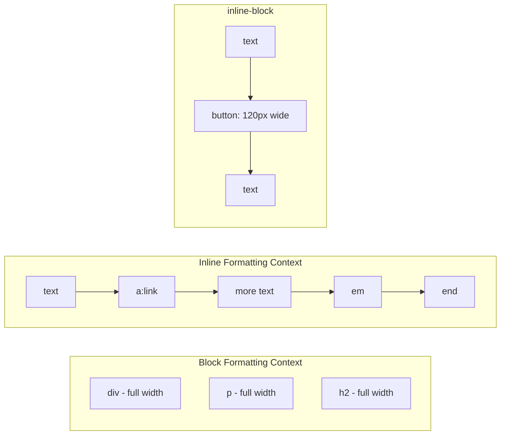

# HTML Elements and Tags

🎯 **Interview Weight:** medium (★☆☆) - Foundation vocabulary
for all HTML discussions; every front-end conversation references
elements and tags

---

### 🎯 Model Answer

**30 seconds:**

> An HTML element is the structural unit of an HTML document:
> it consists of an opening tag, content, and a closing tag.
> Some elements are void (self-closing: ``, `<input>`, `<br>`).
> Tags are the syntax markers (`<p>`, `</p>`). The element is the
> complete unit including its content. Attributes within the opening
> tag provide additional information about the element.

**3 minutes (Senior):**

> HTML elements form the building blocks of web documents. The
> terminology is precise: a TAG is the syntax (`<p>`, `</p>`);
> an ELEMENT is the tag pair plus its content. Some elements are
> void elements that have no content and no closing tag: ``,
> `<input>`, `<br>`, `<hr>`, `<meta>`, `<link>`.
>
> Elements have ATTRIBUTES in the opening tag that modify their
> behavior: `class`, `id`, `href`, `src`, `alt`, `type`. Global
> attributes apply to any element: `class`, `id`, `style`,
> `data-*`, `aria-*`, `hidden`, `tabindex`, `lang`, `draggable`.
>
> The key architectural distinction: HTML elements can be categorized
> by their content model (what they can contain) and their display
> behavior (block vs inline). These two properties are related
> but not identical - `<span>` is inline by default but can be
> styled as block; the content model (what it can contain) is a
> semantic constraint, not a CSS constraint.
>
> The `data-*` custom attributes are particularly important in
> modern HTML: they allow author-defined metadata on elements
> without affecting rendering, accessible via `dataset` API.

*Adapting up:* Discuss content models (phrasing, flow, embedded
content) and how they differ from display categories.

*Adapting down:* Tags are the angle-bracket markers. The element
is the complete package: opening tag + content + closing tag.

**Blank Mind Recovery:**

**(1) Restate:** "Elements are the building blocks of HTML - let
me walk through what they consist of."

**(2) First principles:** "Browsers need to identify content
boundaries. Tags mark start and end of each content unit."

**(3) Bridge:** "Tags are like parentheses in math - they
delimit a unit. The element is everything from the opening to
the closing parenthesis."

---

### 📘 Concept Explanation

**What it is:**

An HTML element is a discrete structural unit: opening tag +
content + closing tag. Tags are the syntax markers that delimit
elements. Attributes are name-value pairs in the opening tag.

**The problem it solves:**

Plain text cannot encode structure - which text is a heading,
which is navigation, which is a hyperlink? HTML elements solve
this by wrapping content in descriptive start/end tags.

**How it works:**

```
ANATOMY OF AN ELEMENT:
  <a href="https://example.com" class="link">
  ^   ^^^^  ^^^^^^^^^^^^^^^^^^^^^^^^^^^^^^^^^
  |   |     attributes (name="value" pairs)
  |   element name
  opening tag

  Click here
  ^^^^^^^^^^
  content (can be text, other elements, or both)

  </a>
  ^^^^
  closing tag

VOID ELEMENTS (no closing tag, no content):
  
  <input type="text" placeholder="Enter name">
  <br>  <hr>  <meta>  <link>  <source>

ATTRIBUTES:
  id="header"        → unique identifier per document
  class="card active" → space-separated CSS class list
  style="color:red"  → inline CSS (avoid in production)
  data-user-id="123" → custom data (author-defined)
  aria-label="Close" → accessibility override
  hidden             → boolean attribute (presence = true)
  tabindex="0"       → keyboard focus order
  lang="en"          → language of element content
```

**The key insight:**

Boolean attributes (like `hidden`, `disabled`, `required`,
`checked`) are activated by PRESENCE, not by value. `<input
disabled>`, `<input disabled="">`, `<input disabled="disabled">`
and `<input disabled="false">` are all IDENTICAL - all disabled.
Setting `disabled="false"` does NOT enable the input. To enable,
you must REMOVE the attribute.

**When to use it:**

Every HTML document is made of elements. Choose elements based
on their semantic role, not their default appearance.

**When NOT to use it:**

Don't use `<br>` for spacing (use CSS margin). Don't use
`<table>` for non-tabular layout. Don't add `style=` attributes
for non-one-off styling (use CSS classes).

**Alternatives:**

- SVG elements → for vector graphics with their own element system
- Custom elements (`<my-component>`) → Web Components with custom behavior
- Template literals + innerHTML → programmatic HTML creation (XSS risk)

**First-principles derivation:**

Given: content needs structural metadata. Options: (a) out-of-band
metadata (separate file), (b) inline metadata mixed with content.
HTML chose inline metadata via markup tags. The tag syntax
(`<name attributes>content</name>`) is the minimum representation:
role (name), properties (attributes), scope (start to end tags).

---

### 💻 Code Example

**Void elements and boolean attributes**

```html
<!-- VOID elements: no closing tag, no content -->

<input type="email" placeholder="Enter email" required>
<hr>
<br>
<meta charset="UTF-8">
<link rel="stylesheet" href="styles.css">

<!-- BOOLEAN attributes: presence = enabled -->
<!-- All four are equivalent (all disabled): -->
<input disabled>
<input disabled="">
<input disabled="disabled">
<input disabled="false">  <!-- STILL disabled! -->

<!-- To enable a disabled input, REMOVE the attribute: -->
<script>
  const input = document.querySelector('input');
  input.disabled = false;  // JS removes the attribute
  // OR:
  input.removeAttribute('disabled');
</script>
```

> **Code walkthrough:** Void elements cannot have closing tags
> or content - their meaning is fully in the tag and attributes.
> Boolean attributes are one of HTML's most counterintuitive
> behaviors: `disabled="false"` does NOT disable=false; it enables
> the disabled state because the attribute is PRESENT. This is
> a frequent source of bugs when developers try to conditionally
> enable/disable elements via HTML attributes.

**`data-*` attributes for custom metadata**

```html
<!-- Custom data attributes for JS-accessible metadata -->
<div class="product-card"
     data-product-id="SKU-4892"
     data-price="29.99"
     data-category="electronics">
  Product Name
</div>

<script>
  const card = document.querySelector('.product-card');

  // Access via dataset API (camelCase conversion):
  // data-product-id → dataset.productId
  console.log(card.dataset.productId);  // "SKU-4892"
  console.log(card.dataset.price);      // "29.99"

  // Set new data attribute:
  card.dataset.wishlist = 'true';
  // Creates: data-wishlist="true"

  // Select by data attribute:
  document.querySelectorAll('[data-category="electronics"]');
</script>
```

> **Code walkthrough:** `data-*` attributes bridge HTML and
> JavaScript without polluting the element's standard attributes.
> The `dataset` API converts kebab-case to camelCase automatically.
> Values are always strings (parse numbers with `Number()`).
> This is the right pattern for embedding server-generated metadata
> that JavaScript needs, replacing the anti-pattern of using `id`
> or `class` to store application data.

---

### 🎓 Answers by Seniority

**Junior / Mid:**

> An HTML element is an opening tag, content, and closing tag.
> Void elements like `` and `<input>` have no closing tag.
> Attributes in the opening tag modify the element. I use `data-*`
> attributes to attach custom metadata for JavaScript and prefer
> global attributes like `aria-label` for accessibility.

---

**Senior / Staff:**

> Elements have two distinct concerns: display behavior (block vs
> inline, controlled by CSS) and content model (what they can
> contain, defined by HTML spec). `<p>` has a content model that
> prohibits block-level children - the browser's error recovery
> will auto-close the `<p>` when it encounters a block element
> inside it, producing surprising DOM structure.
>
> For production: `data-*` attributes are the correct way to
> embed JavaScript-accessible metadata. Using `class` or `id`
> as data storage couples CSS and JS in ways that cause maintenance
> problems. `data-*` attributes have no CSS impact, are accessible
> via `dataset`, and make the data intent explicit.

---

### ⚠️ Common Misconceptions

**"Boolean attributes accept true/false values"**

Boolean attributes are controlled by PRESENCE/ABSENCE, not value.
`disabled="false"` still disables the element because the
`disabled` attribute is present. To remove the disabled state,
use JavaScript's `element.disabled = false` or `removeAttribute('disabled')`.

**"Closing void elements with `/>` is required"**

In HTML5 (not XHTML), void elements do NOT require the `/>` closing
slash. `<br>` and `<br/>` are both valid. The slash is optional,
not meaningful.

---

### 🚨 Failure Modes and Diagnosis

**Symptom: element appears disabled after setting attribute to "false"**

```
Root cause: boolean attribute semantics misunderstood
  disabled="false" means: disabled attribute IS present = disabled

Fix:
  // Remove the attribute (not set to false):
  element.removeAttribute('disabled');
  // OR use the property (not the attribute):
  element.disabled = false;  // property handles removal
  
  // WRONG:
  element.setAttribute('disabled', 'false'); // still disabled!
  element.setAttribute('disabled', '');      // also disabled
```

---

### 🎯 Interview Deep-Dive

| Scenario | Recommended Time | Key Signal |
|---|---|---|
| Element vs tag distinction | 1 min | Precision of vocabulary |
| Void elements list | 1-2 min | Self-closing knowledge |
| Boolean attributes | 2 min | Presence vs value |
| data-* vs class for JS data | 2-3 min | Separation of concerns |
| Content model vs display | 2-3 min | Spec vs CSS |
| Global attributes | 2 min | Cross-element vocabulary |
| Custom elements | 2-3 min | Web Components entry |

---

**Q1: What is the difference between an element and a tag?**
`[JUNIOR]` DEFINITION

*Why they ask:* Precision of HTML vocabulary.

*Likely follow-up:* "What is a void element?"

> **Answer:**
>
> A TAG is the syntax marker: `<p>` is the opening tag, `</p>`
> is the closing tag.
>
> An ELEMENT is the complete structural unit: opening tag +
> content + closing tag. So `<p>Hello</p>` is one element; `<p>`
> and `</p>` are its two tags.
>
> A void element has only an opening tag with no content and no
> closing tag: ``, `<input>`, `<br>`, `<hr>`, `<meta>`,
> `<link>`, `<source>`, `<track>`, `<area>`, `<base>`, `<col>`,
> `<embed>`, `<param>`, `<wbr>`.
>
> Void elements have no content by definition - `` cannot
> contain text or child elements because an image IS the content,
> described by its `src` attribute.
>
> *What separates good from great:* Knowing the complete list
> of void elements, or at least the common ones and WHY they're
> void (they represent embedded resources or punctuation that
> has no "content" to wrap).

---

**Q2: How do boolean attributes work in HTML?** `[JUNIOR]`
MECHANISM

*Why they ask:* Common gotcha in dynamic HTML generation.

*Likely follow-up:* "How do you dynamically enable/disable a form field?"

> **Answer:**
>
> Boolean attributes in HTML are controlled by PRESENCE or ABSENCE,
> not by value. If the attribute exists in any form, it's enabled.
> If it doesn't exist, it's disabled.
>
> ```html
> <!-- All these are DISABLED: -->
> <input disabled>
> <input disabled="">
> <input disabled="disabled">
> <input disabled="false">    <!-- STILL disabled! -->
> <input disabled="0">        <!-- STILL disabled! -->
>
> <!-- This is ENABLED (no attribute): -->
> <input>
> ```
>
> Dynamic enable/disable:
> ```javascript
> // To disable: set the property to true
> input.disabled = true;
> // Equivalent: input.setAttribute('disabled', '');
>
> // To enable: set property to false (removes attribute)
> input.disabled = false;
> // Equivalent: input.removeAttribute('disabled');
> // WRONG: input.setAttribute('disabled', 'false');
> // ^ This still disables because attribute is present!
> ```
>
> Common boolean attributes: `disabled`, `required`, `checked`,
> `selected`, `hidden`, `readonly`, `multiple`, `autofocus`,
> `controls` (on `<video>`).
>
> *What separates good from great:* The JavaScript property API
> handles this correctly - `element.disabled = false` removes
> the attribute rather than setting it to "false". The JavaScript
> property mirrors the LOGICAL state; the HTML attribute mirrors
> the SERIALIZED state. Understanding this dual representation
> prevents the `setAttribute('disabled', 'false')` bug.

---

**Q3: When should you use `data-*` attributes vs other approaches
for storing JavaScript-accessible metadata?** `[SENIOR]` SCENARIO

*Why they ask:* Architecture question about HTML-JavaScript integration.

*Likely follow-up:* "What are the downsides of data-* attributes?"

> **Answer:**
>
> `data-*` attributes are the correct approach for embedding
> author-defined metadata on HTML elements.
>
> When `data-*` is appropriate:
> - Metadata generated server-side that client JS needs
> - Configuration for a JavaScript widget (initial state, IDs)
> - Machine-readable information not appropriate for visible text
>
> ```html
> <!-- GOOD: data-* for metadata -->
> <button data-user-id="123"
>         data-confirm="Are you sure?"
>         class="delete-btn">Delete</button>
> ```
>
> When NOT to use `data-*`:
> - Don't use for CSS hooks (use class)
> - Don't store sensitive data (visible in DevTools, not encrypted)
> - Don't store large objects (use JS state or localStorage)
> - Don't use for visible information (use visible text or `<time>`)
>
> Alternatives and when to use them:
> - `class` → for CSS styling AND JavaScript behavioral hooks
> - `id` → for unique identification (one per document)
> - Inline JSON in `<script type="application/json">` → for larger
>   structured data that JavaScript needs on initialization
> - JavaScript module state → for data that doesn't need to be
>   in HTML at all (purely JS-managed state)
>
> *What separates good from great:* The `<script type="application/json">`
> pattern for server-to-client data transfer. For passing a large
> data structure (user profile, initial API response) to a React
> app, embedding it as a `data-*` attribute would be awkward and
> large. A `<script id="initial-data" type="application/json">{"user":...}</script>`
> is better: it's not executed by the browser, parseable by JS
> via `JSON.parse(document.getElementById('initial-data').textContent)`.

---

**Q4: What is the global `tabindex` attribute and how does
it affect keyboard navigation?** `[SENIOR]` MECHANISM

*Why they ask:* Keyboard accessibility knowledge test.

*Likely follow-up:* "When would you use tabindex=-1?"

> **Answer:**
>
> `tabindex` controls whether and in what order an element
> receives focus via the Tab key.
>
> Values:
> - `tabindex="-1"`: element CAN be focused programmatically
>   (via `element.focus()`) but is EXCLUDED from tab order.
>   Use for: dialog overlays, drawer panels, elements that should
>   only be reachable via custom keyboard handling.
>
> - `tabindex="0"`: element IS in the natural tab order,
>   at the position defined by its document order. Use for:
>   making non-focusable elements (custom interactive `<div>`)
>   focusable in a natural way.
>
> - `tabindex="1+"` (positive): element IS in tab order,
>   BEFORE all `tabindex="0"` elements. AVOID - creates
>   confusing tab order and makes maintaining correct focus
>   order very difficult.
>
> Native focusable elements (links, buttons, inputs) are already
> in the tab order with effective `tabindex="0"`. Don't add
> `tabindex="0"` to them.
>
> Use case: a custom disclosure widget:
> ```html
> <div role="button"
>      tabindex="0"
>      aria-expanded="false"
>      onclick="toggle()"
>      onkeydown="if(e.key==='Enter'||e.key===' ')toggle()">
>   Toggle section
> </div>
> ```
>
> *What separates good from great:* Positive `tabindex` values
> are a keyboard accessibility anti-pattern (W3C). They override
> natural tab order and require updating every existing `tabindex`
> when adding new elements. The correct approach is to order
> elements correctly in the DOM and let `tabindex="0"` follow
> document order.

---

**Q5: What is the difference between `hidden` attribute and
`display:none`?** `[JUNIOR]` COMPARISON

*Why they ask:* Tests knowledge of HTML attributes vs CSS.

*Likely follow-up:* "When would you use hidden vs display:none?"

> **Answer:**
>
> Both hide elements from visual display, but there are key differences:
>
> `hidden` attribute (HTML):
> - Boolean attribute: `<div hidden>`
> - Specifies that the content is not yet (or no longer) relevant
> - Screen readers do NOT announce hidden elements
> - CSS can OVERRIDE it: `[hidden] { display: block !important; }`
>   (which means hidden can be ignored if CSS overrides it)
> - Semantic: "this content is not currently relevant"
>
> `display:none` (CSS):
> - Pure visual/layout concern
> - Removes element from layout (no space taken)
> - Screen readers do NOT announce it
> - Cannot be overridden by another CSS rule without specificity change
>
> `visibility:hidden` (CSS):
> - Hides visually but PRESERVES layout space (element still takes up room)
> - Screen readers do NOT announce it
>
> `aria-hidden="true"` (ARIA):
> - Hides from ACCESSIBILITY TREE only (still visually visible)
> - Used for: decorative icons, visual content that has a text equivalent
>
> When to use which:
> - `hidden`: toggling content relevance (accordion, tab panel)
> - `display:none`: CSS-only hiding without semantic meaning
> - `visibility:hidden`: hiding while preserving layout space (placeholder)
> - `aria-hidden`: hide decorative content from screen readers while visible
>
> *What separates good from great:* The `aria-hidden` use case is
> distinct from all others - it hides from ASSISTIVE TECH while
> remaining visually visible. Common use: an icon button with text
> label where the icon is decorative: `<button><svg aria-hidden="true">
> </svg>Save</button>`. The screen reader reads "Save" and ignores
> the icon.

---

**Q6: What is the content model of HTML elements?** `[SENIOR]`
MECHANISM

*Why they ask:* Advanced HTML spec knowledge.

*Likely follow-up:* "Why can't you put a `<p>` inside another `<p>`?"

> **Answer:**
>
> Content model defines what types of content an element CAN contain.
> The HTML spec defines several content categories:
>
> **Flow content**: most elements that can appear in the body
> (`<div>`, `<p>`, `<h1>`, `<ul>`, `<form>`, etc.)
>
> **Phrasing content** (inline-level): can appear inside paragraphs
> (`<span>`, `<a>`, `<em>`, `<strong>`, ``, `<input>`)
>
> **Interactive content**: elements with user interaction
> (`<a>`, `<button>`, `<input>`, `<select>`)
>
> **Sectioning content**: defines page structure
> (`<article>`, `<aside>`, `<nav>`, `<section>`)
>
> Why `<p>` cannot contain `<p>`:
>
> `<p>` has a content model of "phrasing content" - it cannot
> contain flow-level elements like another `<p>`, `<div>`, `<h1>`.
>
> Browser behavior for `<p><div>text</div></p>`:
> - Parser sees `<p>` → starts paragraph
> - Parser sees `<div>` → cannot be inside `<p>` (spec violation)
> - Parser auto-closes `<p>`, then inserts `<div>`
> - Result DOM: `<p></p><div>text</div>` (not the intended nesting)
>
> This is a common source of unexpected DOM structure when generating
> HTML programmatically.
>
> *What separates good from great:* Knowing that `<p>` has a
> "paragraph termination" rule: block elements auto-close any
> open `<p>`. This produces a different DOM than the HTML source
> suggests. React's DOM reconciler relies on the browser's actual
> DOM, not the intended HTML, so content-model violations in
> JSX-generated HTML can produce React reconciliation bugs.

---

**Q7: What are global attributes and which are most important?**
`[JUNIOR]` DEFINITION

*Why they ask:* Vocabulary test for HTML attributes.

*Likely follow-up:* "How do you access data-* attributes in JavaScript?"

> **Answer:**
>
> Global attributes apply to ALL HTML elements:
>
> **Identification/Selection**:
> - `id` - unique identifier (one per document)
> - `class` - space-separated CSS class list
> - `name` - used by forms, links, maps
>
> **Styling**:
> - `style` - inline CSS (use sparingly)
>
> **Accessibility**:
> - `aria-*` - ARIA properties (aria-label, aria-hidden, etc.)
> - `role` - ARIA landmark/widget role
> - `tabindex` - keyboard focus order
> - `lang` - language override for element content
> - `title` - tooltip text (not relied on for accessibility)
>
> **Visibility/Interaction**:
> - `hidden` - boolean: element not currently relevant
> - `draggable` - boolean: drag-and-drop enabled
> - `contenteditable` - makes element editable by user
>
> **Custom data**:
> - `data-*` - any attribute starting with `data-` is valid
>
> **Internationalization**:
> - `lang` - BCP 47 language tag (e.g., `lang="fr"`)
> - `dir` - text direction (`ltr`, `rtl`, `auto`)
>
> Most important for production: `class`, `id`, `aria-*`, `data-*`,
> `tabindex`, `hidden`, `lang` on root element.
>
> *What separates good from great:* `lang` on the `<html>` element
> is not optional for internationalized apps - screen readers use
> it to select the correct voice/language pronunciation. Missing
> `lang="en"` means French content might be read with English
> pronunciation. Screen reader testing often surfaces this.

---

| Interviewer Type | Emphasis |
|---|---|
| Technical Panel | Content model + boolean attribute semantics |
| Hiring Manager | Practical element knowledge |
| Bar Raiser | Accessibility attributes depth |
| Peer Engineer | data-* patterns + tabindex |

---

### ⚖️ Comparison Table

*(Omit: ★☆☆ keyword.)*

---

### 🏛️ System Design

*(Omit: ★☆☆ keyword.)*

---

### 📊 Diagram

*(Omit: structural knowledge does not require a flow diagram.)*

---

---

# Semantic HTML

🎯 **Interview Weight:** high (★☆☆) - One of the most asked
HTML questions; tests architectural thinking about meaning vs
presentation

---

### 🎯 Model Answer

**30 seconds:**

> Semantic HTML means choosing HTML elements that describe the
> MEANING of content, not just its visual appearance. `<h1>`
> means "this is the most important heading," `<nav>` means
> "this is navigation," `<button>` means "this is a clickable
> action." The alternative - using `<div>` and `<span>` for
> everything - creates visually identical output but strips
> meaning, hurting accessibility, SEO, and maintainability.

**3 minutes (Senior):**

> Semantic HTML is fundamentally about contracts. When I write
> `<article>`, I'm making three simultaneous promises: to screen
> reader users (this is standalone content you can navigate to),
> to search engines (this content can be extracted and indexed
> as an independent piece), and to future developers (this is
> the primary content area, not navigation or decoration).
>
> The practical case for semantic HTML is strongest in three areas:
>
> Accessibility: screen readers use element roles to build their
> virtual buffer. `<nav>` creates a landmark that users can jump
> to with a single keystroke. `<table>` in a data table tells
> screen readers to announce row/column headers with each cell.
> A `<div>` carries none of these affordances.
>
> SEO: search engine crawlers weight `<h1>` content as the
> primary topic, use `<time>` for publication dates, and use
> `<article>` to identify independently indexable content. A
> page with clear heading hierarchy outranks structural equivalents
> with flat div soup.
>
> Maintainability: `<header>` is self-documenting. `<div class="header-wrapper">` requires reading the class name to understand intent. In large codebases, semantic elements reduce cognitive load.

*Adapting up:* Discuss how semantic HTML maps to ARIA landmark
roles and how WCAG 2.1 success criteria are met with or broken
by semantic choices.

*Adapting down:* Semantic means "meaningful." Use the element
whose name matches what the content IS, not what you want it
to look like.

**Blank Mind Recovery:**

**(1) Restate:** "Semantic HTML is about using elements that
describe what content IS, not just how it looks."

**(2) First principles:** "HTML elements have two properties:
visual default and semantic meaning. CSS controls the visual;
semantic meaning is defined by the element choice."

**(3) Bridge:** "It's like choosing words in writing. 'The CEO'
vs 'the person' - both could refer to the same individual, but
one carries more information for the reader."

---

### 📘 Concept Explanation

**What it is:**

Semantic HTML is the practice of using HTML elements whose
names accurately reflect the meaning of their content, rather
than choosing elements based on their default visual rendering.

**The problem it solves:**

Any content can be made to look like anything with CSS. `<div>`
can look like a heading; `<span>` can look like a button. Without
semantic elements, machine readers (crawlers, screen readers,
parsers) cannot understand the content's structure - they only
see undifferentiated boxes.

**How it works:**

```
SEMANTIC VS NON-SEMANTIC EQUIVALENTS:

NON-SEMANTIC (div soup):
  <div class="header">
    <div class="logo">Brand</div>
    <div class="nav">
      <div class="nav-item">
        <a href="/home">Home</a>
      </div>
    </div>
  </div>
  → Screen reader: "generic container, generic container..."

SEMANTIC:
  <header>
    <a href="/" class="logo">Brand</a>
    <nav>
      <ul>
        <li><a href="/home">Home</a></li>
      </ul>
    </nav>
  </header>
  → Screen reader: "Banner landmark. Navigation landmark.
    List, 1 item. Link: Home."
  → Search crawler: extracts navigation structure
  → Developer: immediately understands header region

COMMON SEMANTIC ELEMENTS AND THEIR ROLES:
  <header>   → Introductory content (for page or section)
  <footer>   → Closing content, metadata (for page or section)
  <main>     → Dominant content of the page (one per page)
  <nav>      → Navigation links (major, not all link groups)
  <aside>    → Tangentially related content (sidebars, callouts)
  <article>  → Self-contained, independently distributable
  <section>  → Thematic grouping with a heading
  <h1>-<h6>  → Heading hierarchy (1=most important)
  <p>        → Paragraph
  <ul>/<ol>  → Unordered/ordered lists
  <li>       → List items
  <dl>/<dt>/<dd> → Definition/description list
  <figure>   → Self-contained content (image, diagram, code)
  <figcaption> → Caption for figure
  <time>     → Date/time with machine-readable datetime attr
  <address>  → Contact information (for nearest article/body)
  <blockquote> → Extended quotation
  <cite>     → Title of creative work
  <abbr>     → Abbreviation with title attribute
  <strong>   → Strong importance (not just bold)
  <em>       → Stress emphasis (not just italic)
  <mark>     → Highlighted/relevant text
  <del>/<ins> → Deleted/inserted text in document revision
```

**The key insight:**

Semantic elements map to ARIA landmark roles automatically.
`<nav>` has an implicit `role="navigation"`. `<main>` has
`role="main"`. `<header>` at the top level has `role="banner"`.
This means semantic HTML provides ARIA landmark navigation for
free - without writing a single ARIA attribute.

**When to use it:**

Always prefer the semantic element when one exists for the content
type. Use `<div>` and `<span>` only as generic containers when
no semantic element applies.

**When NOT to use it:**

Don't use semantic elements incorrectly: don't use `<article>`
for non-distributable sections, don't use `<nav>` for all groups
of links (only major navigation), don't use `<header>` or `<footer>`
inside `<footer>` elements.

**Alternatives:**

- ARIA roles → add semantic meaning to non-semantic elements
  (last resort)
- CSS classes → for styling without semantic impact
- Headings + `<section>` → to create document outline

**First-principles derivation:**

Given HTML elements are parsed into an accessibility tree and
indexed by crawlers, the element name IS the semantic signal.
Using `<div>` for everything creates an accessibility tree of
"generic container" nodes with no navigable landmarks. Choosing
semantic elements creates a rich accessibility tree with named
regions that users can navigate directly.

---

### 💻 Code Example

**BAD: div soup vs GOOD: semantic structure**

```html
<!-- BAD: no semantic meaning -->
<div class="page">
  <div class="top-bar">
    <div class="brand">MyApp</div>
    <div class="links">
      <a href="/">Home</a>
      <a href="/about">About</a>
    </div>
  </div>

  <div class="content-area">
    <div class="big-title">Welcome to MyApp</div>
    <div class="description">
      <div class="text">Leading platform for...</div>
      <div class="card">
        <div class="card-title">Feature One</div>
        <div class="card-text">Details here.</div>
      </div>
    </div>
  </div>

  <div class="bottom-bar">
    <div class="copyright">© 2026 MyApp</div>
  </div>
</div>
```

```html
<!-- GOOD: semantic HTML with proper roles -->
<body>
  <header>
    <a href="/" class="brand">MyApp</a>
    <nav aria-label="Main navigation">
      <ul>
        <li><a href="/">Home</a></li>
        <li><a href="/about">About</a></li>
      </ul>
    </nav>
  </header>

  <main>
    <h1>Welcome to MyApp</h1>
    <p>Leading platform for...</p>

    <section aria-labelledby="features-heading">
      <h2 id="features-heading">Features</h2>
      <article>
        <h3>Feature One</h3>
        <p>Details here.</p>
      </article>
    </section>
  </main>

  <footer>
    <p><small>© 2026 MyApp</small></p>
  </footer>
</body>
```

> **Code walkthrough:** The semantic version creates a rich
> document outline automatically: Banner landmark (`<header>`),
> main navigation landmark (`<nav>`), main content landmark
> (`<main>`), content region with heading (`<section>`). Screen
> reader users can jump directly between these landmarks using
> keyboard shortcuts. The heading hierarchy (h1 → h2 → h3) creates
> a navigable outline. The `aria-label` on `<nav>` distinguishes
> it from other nav regions (if there were multiple navs).

---

### 🎓 Answers by Seniority

**Junior / Mid:**

> Semantic HTML means using elements that describe content meaning:
> `<nav>` for navigation, `<article>` for independent content,
> `<h1>`-`<h6>` for heading hierarchy. The benefit is threefold:
> accessibility (screen readers use landmarks), SEO (crawlers use
> heading hierarchy), and developer experience (code is
> self-documenting).

---

**Senior / Staff:**

> Semantic HTML creates implicit ARIA landmark roles for free -
> the most impactful accessibility win with zero ARIA attribute
> overhead. `<header>` = `role="banner"`, `<nav>` = `role="navigation"`,
> `<main>` = `role="main"`. Missing these landmarks means screen
> reader users cannot use the jump-to-landmark keyboard shortcuts
> that define their navigation workflow.
>
> At scale: semantic HTML reduces the amount of ARIA needed.
> Less ARIA means less maintenance, fewer ARIA bugs, and simpler
> code. The first rule of ARIA - don't use ARIA if native HTML
> works - means semantic HTML IS the accessibility strategy for
> most web content.

---

### ⚠️ Common Misconceptions

**"Semantic HTML only matters for accessibility"**

Semantic HTML benefits three audiences simultaneously: assistive
technologies (screen readers use landmark roles), search engines
(heading hierarchy and article/section elements affect ranking),
and developers (semantic code is self-documenting and maintainable).
Optimizing for just one audience misses the compounding value.

**"You need ARIA to make a page accessible"**

For standard content (text, links, headings, forms, navigation),
semantic HTML alone provides full accessibility. ARIA is needed
only for CUSTOM interactive widgets (custom dropdowns, carousels,
drag-and-drop) that have no semantic HTML equivalent. Most pages
need zero ARIA if semantic HTML is used correctly.

---

### 🚨 Failure Modes and Diagnosis

**Symptom: screen reader users report navigation is confusing**

```
Diagnosis:
1. Install screen reader (NVDA/VoiceOver) + test page
2. Check for landmark regions:
   - Tab to skip-to-main-content link (first focusable element)
   - Navigate landmarks: Caps+F7 (NVDA) or VO+U (VoiceOver)
3. Check heading outline:
   - No heading = no structure
   - h1 missing = unclear page topic
   - Skipped heading levels (h1 → h4) = broken outline

Common root causes:
  - Page built entirely with divs (no landmarks)
  - Multiple <h1> elements (unclear primary topic)
  - Visual "headings" styled divs (not real headings)
  - <header>/<footer> not at page level (nested in <main>)

Fix: audit with axe DevTools (Chrome extension) → fix violations
```

---

### 🎯 Interview Deep-Dive

| Scenario | Recommended Time | Key Signal |
|---|---|---|
| What is semantic HTML? | 1-2 min | 3 audiences |
| article vs section vs div | 2 min | Containedness test |
| Landmarks and ARIA mapping | 2-3 min | nav/header/main roles |
| h1-h6 hierarchy rules | 2 min | Document outline |
| nav: when to use it | 2 min | Major navigation only |
| figure and figcaption | 2 min | Content grouping |
| time element | 2 min | Machine-readable dates |

---

**Q1: What makes an element "semantic"?** `[JUNIOR]`
DEFINITION

*Why they ask:* Foundation concept that generates follow-up questions.

*Likely follow-up:* "Give me five semantic elements I should know."

> **Answer:**
>
> An element is semantic if its name communicates the ROLE or
> MEANING of its content - not just how it looks. `<nav>` is
> semantic because "nav" means navigation. `<div>` is NOT
> semantic because "div" just means "division" with no meaning.
>
> Five semantic elements every front-end developer should know:
>
> 1. `<main>` - dominant content of the page (one per page)
> 2. `<nav>` - major navigation links
> 3. `<article>` - self-contained, independently distributable
> 4. `<section>` - thematic grouping (always with a heading)
> 5. `<header>` / `<footer>` - introductory/closing content
>
> The acid test: if you removed all CSS and looked at the element
> name, would you know what the content IS? `<h1>` tells you it's
> the main heading. `<div>` tells you nothing.
>
> *What separates good from great:* The ARIA landmark mapping -
> semantic elements provide free ARIA landmarks. Knowing that
> `<main>` = `role="main"` and that screen reader users navigate
> by landmark (jump directly to main, skip navigation) shows
> understanding beyond the "semantic is good" surface level.

---

**Q2: How do semantic elements affect ARIA?** `[SENIOR]`
MECHANISM

*Why they ask:* Connects HTML semantics to accessibility spec.

*Likely follow-up:* "What is an implicit ARIA role?"

> **Answer:**
>
> Every HTML element has an implicit ARIA role defined by the
> ARIA in HTML specification. This is the role communicated to
> the accessibility tree without any `role` attribute.
>
> Key implicit roles:
>
> | HTML | Implicit ARIA role |
> |---|---|
> | `<header>` (at page level) | `banner` |
> | `<footer>` (at page level) | `contentinfo` |
> | `<main>` | `main` |
> | `<nav>` | `navigation` |
> | `<aside>` | `complementary` |
> | `<article>` | `article` |
> | `<section>` (with name) | `region` |
> | `<h1>`-`<h6>` | `heading` (level 1-6) |
> | `<button>` | `button` |
> | `<a href>` | `link` |
> | `<input type="text">` | `textbox` |
> | `<table>` | `table` |
> | `<ul>` | `list` |
> | `<li>` | `listitem` |
>
> Using `<header>` is equivalent to `<div role="banner">` BUT
> you don't need to add the `role`. Semantic HTML = free ARIA roles.
>
> The "first rule of ARIA" states: don't use ARIA if a native HTML
> element already provides the role. Semantic HTML followed
> correctly means writing almost no `role` attributes.
>
> Note: `<header>` inside `<article>` or `<section>` has role
> `generic` (not `banner`) - the `banner` role applies only to
> the page-level `<header>`.
>
> *What separates good from great:* The context-dependent roles
> for `<header>` and `<footer>`. At the page level: `banner` and
> `contentinfo`. Inside a section/article: generic. This is why
> accessibility audits check whether `<header>` is used correctly
> at the page level vs nested within content.

---

**Q3: How should heading hierarchy work on a page?** `[JUNIOR]`
SCENARIO

*Why they ask:* Document structure knowledge.

*Likely follow-up:* "Can I have multiple h1 tags on a page?"

> **Answer:**
>
> Headings should form a logical outline: one `<h1>` as the
> primary page topic, then `<h2>` for major sections, `<h3>`
> for subsections within those, etc. No heading levels should
> be SKIPPED (no `<h1>` directly to `<h3>`).
>
> ```html
> <!-- GOOD: logical hierarchy -->
> <h1>Web Development Guide</h1>
>   <h2>HTML</h2>
>     <h3>Semantic Elements</h3>
>     <h3>Forms</h3>
>   <h2>CSS</h2>
>     <h3>Flexbox</h3>
>     <h3>Grid</h3>
>
> <!-- BAD: skipped levels -->
> <h1>Web Development Guide</h1>
>   <h3>HTML</h3>  <!-- skipped h2! -->
>     <h4>Semantic Elements</h4>
> ```
>
> Multiple `<h1>` on a page: **HTML5 allowed multiple `<h1>`
> per section** (the "document outline algorithm"), but browsers
> never implemented this algorithm. In practice, use ONE `<h1>`
> per page for the main title. Screen readers and search engines
> treat `<h1>` as the primary page topic.
>
> The accessible heading rule: don't choose heading level based
> on visual size. Style headings with CSS. Choose level based on
> structural hierarchy.
>
> *What separates good from great:* The HTML5 "document outline"
> controversy: the spec suggested multiple `<h1>` per sectioning
> element was valid. Browsers never implemented the outline
> algorithm, so screen readers follow the flat heading tree.
> Practical recommendation (and W3C guidance after the algorithm
> was removed from spec in 2022): use one `<h1>` per page.

---

**Q4: When should you use `<aside>`?** `[JUNIOR]` SCENARIO

*Why they ask:* Common semantic element misuse.

*Likely follow-up:* "What is the difference between aside and section?"

> **Answer:**
>
> `<aside>` is for content that is TANGENTIALLY related to the
> surrounding content - content that could be removed without
> reducing the main content's meaning.
>
> Correct uses:
> - Sidebar with related articles
> - Pull quotes in a news article
> - Advertising sections related to page topic
> - Author bio in a blog post
> - "Did you know?" callout boxes
> - Related links/tags for an article
>
> Incorrect uses:
> - Parenthetical information that IS part of the main content
> - Navigation menus (use `<nav>`)
> - Just because something is visually in a sidebar
>
> The test: "Could this content be removed from the page without
> the main content losing meaning?" If yes: `<aside>`.
>
> ```html
> <article>
>   <h1>History of the Internet</h1>
>   <p>The internet began in...</p>
>   
>   <!-- Aside: related but not core content -->
>   <aside>
>     <h2>Related articles</h2>
>     <ul>
>       <li><a href="/arpanet">ARPANET history</a></li>
>     </ul>
>   </aside>
>   
>   <p>Continue with main content...</p>
> </article>
> ```
>
> *What separates good from great:* `<aside>` has `role="complementary"`
> - it appears as a "Complementary" landmark in screen reader
> navigation. This means using `<aside>` correctly gives users
> the ability to jump to complementary content, which is the
> intended use of the ARIA role.

---

**Q5: What is the `<figure>` element and when should you use it?**
`[JUNIOR]` SCENARIO

*Why they ask:* Tests semantic element knowledge beyond the basics.

*Likely follow-up:* "What goes in figcaption?"

> **Answer:**
>
> `<figure>` is a self-contained piece of content - an illustration,
> diagram, code listing, photo, or chart - typically with an
> optional `<figcaption>`. The key: it's referenced from the main
> content but could be moved elsewhere without breaking the text flow.
>
> ```html
> <!-- Image with caption -->
> <figure>
>           alt="Bar chart showing 2026 revenue by region">
>   <figcaption>
>     Figure 1: Revenue breakdown Q1 2026.
>     North America leads with 42%.
>   </figcaption>
> </figure>
>
> <!-- Code listing -->
> <figure>
>   <figcaption>
>     Listing 1: Fibonacci using recursion (Python)
>   </figcaption>
>   <pre><code>def fib(n):
>     if n <= 1: return n
>     return fib(n-1) + fib(n-2)</code></pre>
> </figure>
> ```
>
> `<figcaption>` (optional): provides a visible caption for the
> figure. Can appear as first or last child of `<figure>`.
>
> NOT just for images: code listings, mathematical formulas,
> audio/video clips with descriptions, tables with captions -
> all can be `<figure>`.
>
> *What separates good from great:* `<figure>` + `<figcaption>`
> provides accessible captioning. Screen readers announce the
> image's `alt` text AND the `<figcaption>`. For complex images
> (charts, diagrams), `<figcaption>` can provide the text
> description while `alt` provides a shorter alternative text.
> The combination serves multiple audiences.

---

**Q6: How does the `<time>` element work?** `[JUNIOR]` MECHANISM

*Why they ask:* Underused element that shows semantic depth.

*Likely follow-up:* "What datetime formats are valid?"

> **Answer:**
>
> `<time>` represents a specific time, date, or datetime in
> a machine-readable format alongside a human-readable display.
>
> ```html
> <!-- Date only -->
> <time datetime="2026-05-29">May 29, 2026</time>
>
> <!-- Date + time -->
> <time datetime="2026-05-29T14:30:00">
>   2:30 PM on May 29
> </time>
>
> <!-- Date + time + timezone -->
> <time datetime="2026-05-29T14:30:00+00:00">
>   May 29, 2026 at 2:30 PM UTC
> </time>
>
> <!-- Duration (ISO 8601 duration) -->
> <time datetime="PT2H30M">2 hours 30 minutes</time>
>
> <!-- Year and week -->
> <time datetime="2026-W22">Week 22, 2026</time>
> ```
>
> The `datetime` attribute is the machine-readable value.
> The element content is the human-readable display (any format).
>
> Why it matters:
> - Search engines extract publication dates for freshness ranking
> - Calendar applications can parse dates from pages
> - Screen readers can announce "Friday, May 29th, 2026" instead
>   of "5/29/26" (using the `datetime` attribute to localize)
>
> *What separates good from great:* The combination with
> microformats/schema: `<time>` pairs with `itemprop="datePublished"`
> for rich schema markup. Structured data in Google Search is one
> of the ranking signals for news articles and events - `<time>` is
> the native HTML way to expose dates for structured data.

---

**Q7: What is the difference between `<strong>` and `<b>`,
`<em>` and `<i>`?** `[JUNIOR]` COMPARISON

*Why they ask:* Tests semantic understanding of text elements.

*Likely follow-up:* "When would you use `<b>` over `<strong>`?"

> **Answer:**
>
> Both pairs render identically by default (bold/italic) but
> carry different semantic meaning:
>
> `<strong>` = strong importance, seriousness, or urgency.
> "Warning: this action cannot be undone." The content IS
> important; screen readers may emphasize it.
>
> `<b>` = bold without semantic importance.
> Keyterms in text, product names in a review, visually
> highlighted without implying importance. No semantic signal.
>
> `<em>` = stress emphasis (changes sentence meaning).
> "I never said he STOLE the money." vs "I NEVER said he stole
> the money." Screen readers use pitch/stress to convey this.
>
> `<i>` = italic without stress emphasis.
> Technical terms, foreign phrases, thoughts, titles of short
> works. "The word *schadenfreude* has no English equivalent."
> No semantic signal of importance.
>
> ```html
> <!-- strong: important warning -->
> <p><strong>Important:</strong> Data will be permanently deleted.</p>
>
> <!-- b: keyword (no special importance) -->
> <p>The <b>reduce()</b> method accumulates an array.</p>
>
> <!-- em: stress emphasis changes meaning -->
> <p>We need to fix <em>this</em> first, not that.</p>
>
> <!-- i: technical term, no emphasis -->
> <p>The term <i>idempotent</i> means...</p>
> ```
>
> *What separates good from great:* Screen readers handle `<strong>`
> and `<em>` differently than `<b>` and `<i>` (depending on
> user settings). More importantly, the semantic choice documents
> INTENT - `<strong>` tells the next developer "this is truly
> important text," while `<b>` says "this is visually distinguished
> without semantic reason." This intent is preserved when the
> styling is changed.

---

| Interviewer Type | Emphasis |
|---|---|
| Technical Panel | ARIA landmark mapping |
| Hiring Manager | SEO and business impact |
| Bar Raiser | Accessibility implications |
| Peer Engineer | Practical element choices |

---

### ⚖️ Comparison Table

*(Omit: ★☆☆ keyword.)*

---

### 🏛️ System Design

*(Omit: ★☆☆ keyword.)*

---

### 📊 Diagram

*(Omit: semantic elements concept does not require a flow diagram.)*

---

---

# Block vs Inline Elements

🎯 **Interview Weight:** medium (★☆☆) - Foundation of CSS
layout understanding; the block/inline model is implicit in
every layout decision

---

### 🎯 Model Answer

**30 seconds:**

> Block elements start on a new line and take up the full
> available width by default: `<div>`, `<p>`, `<h1>`, `<ul>`,
> `<form>`. Inline elements flow within text and only take as
> much width as their content: `<span>`, `<a>`, `<em>`, ``.
> This is the DEFAULT display behavior - CSS can change any
> element to block, inline, or inline-block. The distinction
> matters for layout, margin behavior, and what content each
> type can contain.

**3 minutes (Senior):**

> Block vs inline is the default rendering of elements in the
> CSS box model. Block-level elements create a new block
> formatting context: they start on a new line, take full width,
> and subsequent elements stack below them. Inline elements
> flow inline with text: they don't create new lines, they size
> to their content, and margins/paddings behave differently.
>
> The nuances matter for production:
>
> Margin behavior: margins on inline elements only apply
> horizontally (left/right) - top/bottom margins on inline
> elements are ignored. This surprises developers who add `margin-top`
> to a `<span>` and see no effect.
>
> Width/height: setting explicit `width`/`height` on inline elements
> has no effect. Inline elements size to their content. To set
> dimensions, use `display: inline-block` or `display: block`.
>
> Content model: block elements can contain both block and inline
> content. Inline elements should only contain inline content
> (other inline elements, text). Putting a `<div>` inside a `<span>`
> is invalid HTML (browser error recovers, but the DOM is not
> what you intended).
>
> `inline-block`: the most useful hybrid - element flows inline
> (doesn't break to new line) but accepts width/height/top-bottom
> margins like a block element. Used for: buttons that fit in
> text, image+caption pairs in text flow.

*Adapting up:* Discuss block formatting context (BFC), inline
formatting context, and how they interact with float, flex, and grid.

*Adapting down:* Block = takes a whole line. Inline = fits in a
line with text.

**Blank Mind Recovery:**

**(1) Restate:** "Block vs inline is about how elements flow in
a document - let me think through the differences."

**(2) First principles:** "A browser renders content in two modes:
blocks stack vertically (paragraphs, headings), inline flows
horizontally with text (links, bold text)."

**(3) Bridge:** "Block elements are like paragraphs in a book -
they each get their own line. Inline elements are like words
within a paragraph - they flow alongside other words."

---

### 📘 Concept Explanation

**What it is:**

Block vs inline is the default display behavior defined in the
CSS box model. Block elements generate block-level boxes; inline
elements generate inline-level boxes. This determines how
elements flow, how they size, and how margins/padding apply.

**The problem it solves:**

A rendering engine needs to know how to arrange elements without
explicit positioning. The block/inline model provides the default
layout algorithm: stack block elements vertically, flow inline
elements horizontally within lines.

**How it works:**

```
BLOCK ELEMENTS:
  - Start on a new line (always)
  - Take full available width by default
  - Can set width, height, margin (all sides), padding (all sides)
  - Can contain block + inline content

  Example:
  [===== <div> (full width) =====]
  [===== <p> (full width)   =====]
  [===== <h2> (full width)  =====]

INLINE ELEMENTS:
  - Flow within text (no new line)
  - Size to content width only
  - Width/height settings IGNORED
  - Top/bottom margins IGNORED (only left/right apply)
  - Top/bottom padding APPLIES but does not push layout

  Example:
  The quick <a>brown fox</a> jumps <em>over</em> the lazy dog
         └──inline──┘           └inline┘

INLINE-BLOCK:
  - Flows inline (no new line)
  - Accepts width, height, margin (all sides), padding
  - Useful: buttons, icons, inline images with dimensions

  Example:
  Text <button>Click</button> more text
             └────inline-block: has width/height─────┘

CSS DISPLAY OVERRIDE:
  /* Any element can be made block: */
  span { display: block; }

  /* Any element can be made inline: */
  div { display: inline; }

  /* Any element can be inline-block: */
  a { display: inline-block; width: 200px; }
```

**The key insight:**

The block/inline distinction is a CSS default behavior, not
an intrinsic HTML property. The HTML spec defines which elements
are "block-level" and "inline-level" as formatting defaults, but
CSS `display` can change any element. What you cannot change is
the HTML CONTENT MODEL - a `<span>` cannot validly contain a `<div>`
regardless of CSS `display` values.

**When to use it:**

Block elements for: structural divisions, paragraphs, headings,
sections, forms, lists. Inline elements for: text emphasis,
links, inline images, inline icons.

**When NOT to use it:**

Don't rely on default block/inline behavior for complex layouts -
use Flexbox or Grid. Don't set top/bottom margins on inline
elements and expect them to work.

**Alternatives:**

- `display: flex` → creates block-level flex container
- `display: inline-flex` → creates inline-level flex container
- `display: grid` → creates block-level grid container
- `display: inline-grid` → creates inline-level grid container
- `display: inline-block` → inline flow with block sizing

**First-principles derivation:**

A rendering engine with no explicit positioning needs default
layout rules. Two types of content: structural (paragraphs,
headings, sections) that should stack vertically; and inline
(words, links, emphasis) that should flow within text lines.
Block/inline is the minimum model for this distinction.

---

### 💻 Code Example

**Margin/height on inline elements**

```css
/* BAD: expecting inline elements to behave like block */
span.icon {
  /* These are IGNORED on inline elements: */
  width: 24px;       /* no effect */
  height: 24px;      /* no effect */
  margin-top: 8px;   /* no effect */
  margin-bottom: 8px;/* no effect */

  /* These DO work on inline: */
  margin-left: 4px;  /* works */
  margin-right: 4px; /* works */
  padding: 4px;      /* applies but doesn't push layout */
}

/* GOOD: use inline-block to get block sizing behavior */
span.icon {
  display: inline-block;
  /* Now ALL properties work: */
  width: 24px;
  height: 24px;
  margin-top: 8px;
  margin-bottom: 8px;
  vertical-align: middle;  /* align with surrounding text */
}
```

> **Code walkthrough:** Setting `width` and `height` on an inline
> element does nothing - inline elements size to their content.
> Setting top/bottom margins on inline elements also does nothing
> (they are ignored). `display: inline-block` is the fix: the
> element still flows inline with text (no new line) but accepts
> width, height, and top/bottom margins like a block element.
> This is the standard pattern for icons, badges, and other
> inline elements that need precise sizing.

---

### 🎓 Answers by Seniority

**Junior / Mid:**

> Block elements take full width and start on a new line (`<div>`,
> `<p>`, `<h1>`). Inline elements flow with text and size to content
> (`<span>`, `<a>`, `<em>`). The key difference for me practically:
> I can't set width/height or top/bottom margins on inline elements -
> I use `display: inline-block` when I need those.

---

**Senior / Staff:**

> Block vs inline is a CSS default, not an intrinsic HTML property.
> Every element can be overridden with CSS `display`. What cannot be
> changed is the HTML content model - putting a `<div>` inside a
> `<span>` is invalid HTML regardless of CSS, and the browser's
> error recovery will produce a different DOM than intended.
>
> In practice, Flexbox and Grid have replaced most uses of the
> default block/inline model for layout. But understanding the
> model is necessary for debugging text-level layout: inline
> spacing (whitespace between inline elements), vertical alignment
> (`vertical-align: middle`), baseline alignment, and anonymous
> block/inline box generation.

---

### ⚠️ Common Misconceptions

**"Block and inline are absolute properties"**

Block and inline are CSS DEFAULTS. `span { display: block }` is
completely valid. The display property can be changed to any value.
What is NOT overridable by CSS is the HTML content model (what
elements can contain). A block-displayed `<span>` cannot validly
contain a `<div>` in the HTML content model.

**"Setting margin-top on a `<span>` will add space above it"**

Top/bottom margins on inline elements are ignored. The element
renders as if `margin-top` and `margin-bottom` are 0, regardless
of what's set. Use `display: inline-block` to enable all margin
values, or `padding-top`/`padding-bottom` (which applies but
doesn't push surrounding layout).

---

### 🚨 Failure Modes and Diagnosis

**Symptom: element dimensions not respected**

```
Diagnosis:
1. DevTools → Inspect element → Computed styles
2. Check display value: inline? That's the issue
3. Check: width/height set on an inline element
   → "specified: 100px" but "computed: auto"

Fix:
  element { display: inline-block; }
  /* OR: */ element { display: block; }
  /* Depends on desired layout behavior */

Whitespace between inline-block elements:
  HTML whitespace (newlines/spaces) creates visible gaps
  Fix: parent { font-size: 0; } children { font-size: 14px; }
  OR:  use Flexbox instead (no whitespace issue)
```

---

### 🎯 Interview Deep-Dive

| Scenario | Recommended Time | Key Signal |
|---|---|---|
| Block vs inline definition | 1-2 min | New line + width |
| Margin behavior on inline | 2 min | top/bottom ignored |
| inline-block use case | 2 min | Hybrid display |
| CSS display override | 1-2 min | Content model vs display |
| Whitespace between inline-blocks | 2 min | Debugging knowledge |
| Block formatting context | 3 min | BFC creation |
| display: contents | 2-3 min | Advanced display value |

---

**Q1: What are the main differences between block and inline
elements?** `[JUNIOR]` DEFINITION

*Why they ask:* Foundation CSS layout question.

*Likely follow-up:* "What is inline-block?"

> **Answer:**
>
> Three key differences:
>
> 1. **Line flow**: block elements start on a new line; inline
>    elements flow within text lines.
>
> 2. **Sizing**: block elements take full available width by
>    default and accept explicit width/height. Inline elements
>    size to their content; width/height are ignored.
>
> 3. **Margin/padding**: block elements accept margin/padding
>    on all four sides. Inline elements: left/right margin work,
>    top/bottom margin is ignored. Padding applies visually but
>    doesn't push surrounding layout.
>
> Common block elements: `<div>`, `<p>`, `<h1>`-`<h6>`, `<ul>`,
> `<ol>`, `<li>`, `<form>`, `<table>`, `<section>`, `<article>`.
>
> Common inline elements: `<span>`, `<a>`, `<em>`, `<strong>`,
> `` (replaced), `<input>` (replaced), `<label>`.
>
> `inline-block`: hybrid - flows inline (no line break) but
> accepts width/height/all margins. Used for buttons in text,
> icon boxes, tags/badges.
>
> *What separates good from great:* `` is technically
> inline but behaves like inline-block (accepts width/height).
> It's a "replaced element" - its display is determined by
> external content. This is why setting `width` on an ``
> works even though `` is inline.

---

**Q2: Why does margin-top have no effect on a `<span>`?**
`[JUNIOR]` MECHANISM

*Why they ask:* Common CSS gotcha reveals box model understanding.

*Likely follow-up:* "How do you add space above an inline element?"

> **Answer:**
>
> Inline elements participate in INLINE FORMATTING CONTEXT
> (IFC) - they flow within text lines. The browser determines
> line height based on font metrics, not explicit heights.
>
> Top/bottom margins on inline elements are computed but don't
> affect the layout - they don't push other elements away. The
> CSS spec defines this behavior for inline boxes.
>
> Adding space above an inline element:
>
> ```css
> /* Option 1: change to inline-block */
> .my-span {
>   display: inline-block;
>   margin-top: 8px;  /* now works */
> }
>
> /* Option 2: padding (visual only, doesn't push layout) */
> .my-span {
>   padding-top: 8px;
>   /* Appears padded visually but doesn't push other lines */
> }
>
> /* Option 3: vertical-align (shifts within baseline) */
> .my-span {
>   vertical-align: 8px;  /* shifts up from baseline */
> }
>
> /* Option 4: add line-height to parent */
> p { line-height: 2; }  /* increases space between lines */
> ```
>
> The correct fix depends on the layout goal. For an icon that
> needs precise positioning within a line: `inline-block` +
> `vertical-align: middle`. For adding space between paragraphs
> that contain the span: add margin to the block parent.
>
> *What separates good from great:* Knowing that inline padding
> APPLIES visually (you can see it in DevTools, it affects
> background color area) but does NOT push layout. This creates
> the counter-intuitive behavior where padding is visible but
> doesn't affect the line height or push neighboring elements.

---

**Q3: What is a Block Formatting Context (BFC)?** `[SENIOR]`
MECHANISM

*Why they ask:* Advanced CSS layout question.

*Likely follow-up:* "How does BFC prevent margin collapse?"

> **Answer:**
>
> A Block Formatting Context (BFC) is an independent layout region
> where block-level boxes are laid out according to block flow
> rules, isolated from the outside.
>
> What a BFC does:
> 1. **Contains floats**: elements with `float` are contained
>    within the BFC and don't overflow it.
> 2. **Prevents margin collapse**: vertical margins of a BFC
>    root element do not collapse with its children.
> 3. **Doesn't overlap floats**: elements in a new BFC do not
>    overlap floated elements from outside the BFC.
>
> What creates a BFC:
> - `float: left | right`
> - `position: absolute | fixed`
> - `display: inline-block | flex | grid | table-cell`
> - `overflow: hidden | scroll | auto` (not `visible`)
> - `contain: layout | paint | strict | content`
> - `display: flow-root` (explicitly creates BFC, no side effects)
>
> Practical use - clearfix without the hack:
> ```css
> /* OLD hack to clear floats: */
> .container::after { content: ''; display: block; clear: both; }
>
> /* MODERN: use display: flow-root to create BFC */
> .container { display: flow-root; }
> /* Container now contains its floated children */
> ```
>
> *What separates good from great:* `display: flow-root` (CSS3
> Display Level 3) creates a BFC without any visual side effects.
> `overflow: hidden` creates a BFC as a side effect, which is
> why the clearfix hack worked. `display: flow-root` is the
> explicit, self-documenting way. Knowing this distinction shows
> you understand WHY `overflow: hidden` works as a clearfix.

---

**Q4: What are replaced elements and how do they differ from
regular inline elements?** `[SENIOR]` MECHANISM

*Why they ask:* Deeper box model knowledge.

*Likely follow-up:* "Why can `` have width/height even though it's inline?"

> **Answer:**
>
> Replaced elements are elements whose rendering is defined by
> an external resource, not the element's content. The browser
> replaces the element with the external resource.
>
> Common replaced elements: ``, `<video>`, `<audio>`,
> `<input>`, `<select>`, `<textarea>`, `<iframe>`, `<embed>`.
>
> They differ from regular inline elements in one key way: they
> have intrinsic dimensions. An `` loaded from a file has
> a natural width and height. This makes them behave like
> `inline-block` even though they're technically inline:
>
> - You CAN set width/height (unlike regular inline elements)
> - They have a natural aspect ratio (unless overridden)
> - They create a "replaced inline box" in the inline formatting context
>
> The `<input>` is a replaced element because its appearance is
> defined by the OS UI, not by HTML/CSS content. You can't put
> child elements inside `<input>` (it's void).
>
> Object-fit and object-position:
> ```css
> /* For replaced elements with explicit dimensions: */
> img {
>   width: 200px;
>   height: 200px;
>   /* How to fit the image within these dimensions: */
>   object-fit: cover;    /* fill, crop if needed */
>   object-fit: contain;  /* fit inside, letterbox */
>   object-position: center; /* center the image */
> }
> ```
>
> *What separates good from great:* The `object-fit` property
> was created specifically for replaced elements - it controls
> how the external resource fits within its CSS box. Before
> `object-fit`, you couldn't control image aspect ratio within
> a fixed-size container without tricks like
> `background-image`. Knowing this reveals production CSS mastery.

---

**Q5: What is `display: contents` and when would you use it?**
`[SENIOR]` MECHANISM

*Why they ask:* Tests knowledge of newer display values.

*Likely follow-up:* "What are the accessibility implications?"

> **Answer:**
>
> `display: contents` makes the element's box disappear from
> the rendering tree, as if it didn't exist for layout purposes.
> Its CHILDREN are laid out as if they were direct children of
> the element's parent.
>
> Use case: a wrapper element that is needed in the HTML (for
> semantics or JavaScript) but should NOT create a box in the
> layout:
>
> ```css
> /* Problem: <li> has display:list-item which creates a marker
>    We want li's children to participate in flexbox directly */
> ul { display: flex; flex-wrap: wrap; gap: 1rem; }
>
> /* Without display: contents: */
> /* <li> creates a flex item (the whole li is one flex item) */
>
> /* With display: contents: */
> li { display: contents; }
> /* li "disappears" from layout - its children become
>    direct flex items of the <ul> */
> ```
>
> Common uses:
> - Making wrapper elements transparent to Flexbox/Grid layouts
> - Removing the `<fieldset>` or `<legend>` box from layout
>   while keeping semantic structure
>
> Accessibility warning: `display: contents` can remove elements
> from the accessibility tree in some browsers (historical bug
> in Chrome, since fixed). Use with caution and test with screen
> readers. The element may become invisible to assistive technology.
>
> *What separates good from great:* The accessibility bug history.
> Chrome had a bug where `display: contents` on a `<button>` or
> `<a>` removed it from the accessibility tree (the button
> disappeared to screen readers). This was fixed in Chrome 81 but
> illustrates why CSS display values have accessibility implications
> beyond visual rendering.

---

**Q6: How does whitespace between inline-block elements cause
layout bugs?** `[SENIOR]` FAILURE

*Why they ask:* Real CSS debugging scenario.

*Likely follow-up:* "What's the best way to fix it?"

> **Answer:**
>
> HTML whitespace (spaces, tabs, newlines) between inline-block
> elements renders as a visible space in the layout.
>
> ```html
> <!-- HTML: -->
> <nav>
>   <a href="/">Home</a>
>   <a href="/about">About</a>
>   <a href="/contact">Contact</a>
> </nav>
> ```
>
> ```css
> nav a { display: inline-block; }
> /* Result: small gaps between Home | About | Contact
>    (the newlines and spaces in HTML become spaces in render) */
> ```
>
> Why: inline-block elements are inline-level boxes. The newline
> between `</a>` and `<a>` is a whitespace character, which
> becomes a space in the inline formatting context.
>
> Fixes:
>
> ```css
> /* Fix 1: Zero font-size on parent (fragile) */
> nav { font-size: 0; }
> nav a { font-size: 1rem; } /* reset for children */
>
> /* Fix 2: negative margin (fragile) */
> nav a { margin-right: -4px; }
>
> /* Fix 3: Use Flexbox instead (best) */
> nav { display: flex; gap: 1rem; }
> /* Flexbox has no whitespace issue */
> ```
>
> The fix in practice: use Flexbox or Grid instead of
> inline-block for layouts where multiple items must be in a row.
> Flexbox eliminates this class of bug entirely.
>
> *What separates good from great:* This bug is a consequence of
> inline formatting context treating HTML source whitespace as
> content. Flexbox/Grid don't have an inline formatting context
> for their flex/grid items, so whitespace in HTML doesn't affect
> the layout. This is one of the practical reasons Flexbox replaced
> inline-block for horizontal layouts.

---

**Q7: What is vertical alignment in inline context?** `[SENIOR]`
MECHANISM

*Why they ask:* Common CSS debugging frustration.

*Likely follow-up:* "How do you vertically center an icon next to text?"

> **Answer:**
>
> `vertical-align` controls how an inline or inline-block element
> aligns relative to the text baseline of the current line.
>
> Values:
> - `baseline` (default): bottom of element aligns to text baseline
> - `middle`: center of element aligns to middle of x-height
> - `top`: top of element aligns to top of tallest element in line
> - `bottom`: bottom of element aligns to bottom of line
> - `text-top` / `text-bottom`: aligns to top/bottom of font
> - `super` / `sub`: superscript/subscript positioning
> - `Npx` or `N%`: shift up/down from baseline
>
> Common scenario: icon next to text:
>
> ```css
> /* Make icon inline-block to set dimensions */
> .icon {
>   display: inline-block;
>   width: 20px;
>   height: 20px;
>   vertical-align: middle;
>   /* Aligns icon center to text middle */
>   /* text still on baseline, icon is centered to x-height */
> }
>
> /* For perfect alignment (not perfectly middle, but looks right): */
> .icon {
>   display: inline-block;
>   vertical-align: -4px; /* nudge down from baseline */
> }
> ```
>
> Note: `vertical-align` only affects inline and inline-block
> elements. It has NO effect on block, flex, or grid elements.
>
> *What separates good from great:* `vertical-align: middle`
> does NOT mean "center of the line height" - it means center
> of the element aligns with the MIDDLE OF THE LOWERCASE LETTER
> X (x-height) plus half the ascender. This often looks slightly
> off. In practice, a specific pixel nudge or using Flexbox
> (`align-items: center`) produces better visual alignment than
> `vertical-align: middle`.

---

| Interviewer Type | Emphasis |
|---|---|
| Technical Panel | BFC + replaced elements |
| Hiring Manager | Practical layout debugging |
| Bar Raiser | display: contents + inline-block whitespace |
| Peer Engineer | margin/width on inline elements |

---

### ⚖️ Comparison Table

*(Omit: ★☆☆ keyword.)*

---

### 🏛️ System Design

*(Omit: ★☆☆ keyword.)*

---

### 📊 Diagram

```
BLOCK VS INLINE LAYOUT:
  Block (full width, stacks):     Inline (flows with text):
  [===== div (100%) =====]        The quick [a:link] jumps
  [===== p (100%)   =====]        over [em:lazy] dog
  [===== h2 (100%)  =====]

  inline-block (inline flow + block sizing):
  Text [button:fixed-width] more text
```



> **Diagram walkthrough:** Block elements form a vertical stack
> within a block formatting context - each takes full available
> width and sits below the previous one. Inline elements flow
> within a horizontal line in an inline formatting context - they
> sit side by side until the line fills, then wrap. Inline-block
> elements participate in the inline flow (no line break) but
> have block-like sizing (explicit width, all margin directions).
> Understanding which context an element creates and participates
> in is the foundation of debugging unexpected layout behavior.
