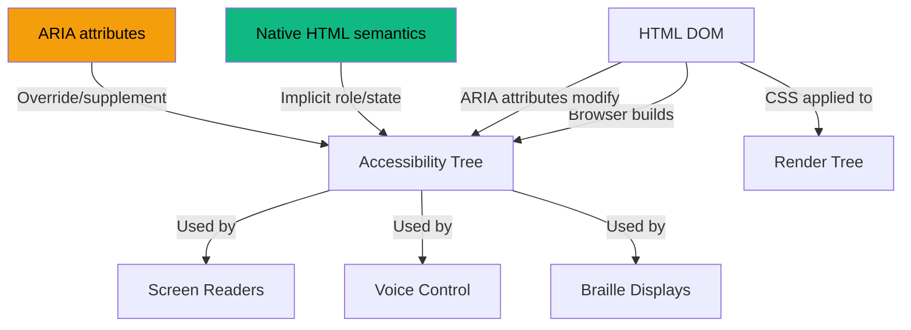
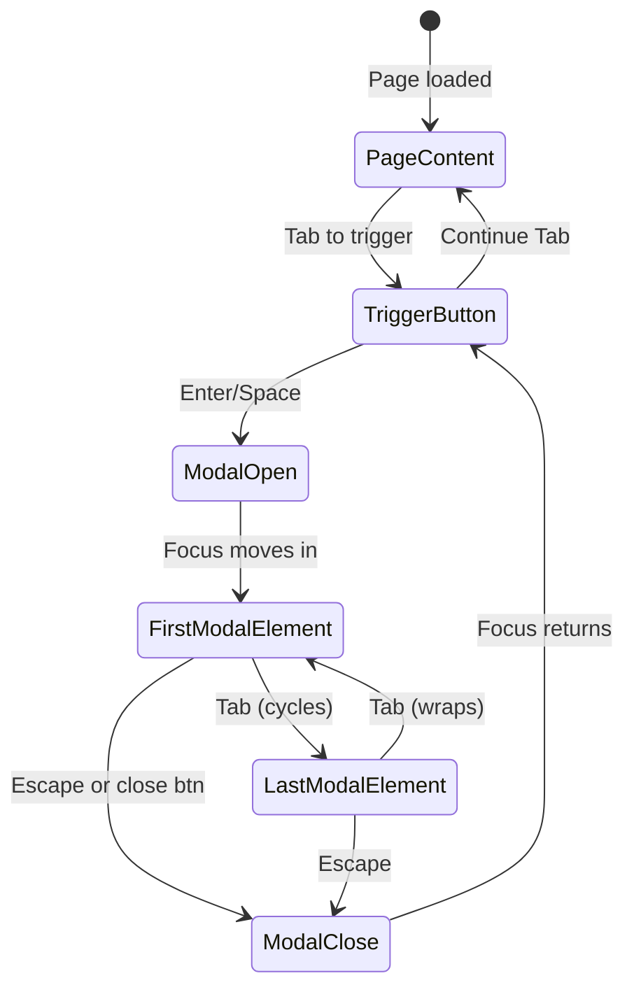

# ARIA Roles and Attributes

🎯 **Interview Weight:** very high (★★☆) - Accessibility is
increasingly tested in interviews; ARIA is the mechanism for
making custom widgets accessible

---

### 🎯 Model Answer

**30 seconds:**

> ARIA (Accessible Rich Internet Applications) is a W3C spec
> that supplements HTML semantics to make custom interactive
> widgets accessible to assistive technologies. It adds roles
> (what is this widget), states (what is its current condition:
> expanded/collapsed), and properties (what describes it:
> label, description). The first rule of ARIA: don't use it if
> native HTML does the job - `<button>` beats `<div role="button">`.

**3 minutes (Senior):**

> ARIA operates on the accessibility tree - the browser's parallel
> representation of the DOM used by screen readers. Every element
> has an implicit ARIA role based on its tag name. ARIA allows
> overriding or supplementing these roles for custom widgets.
>
> Three categories of ARIA:
>
> **Roles** define WHAT an element is: `role="dialog"`, `role="tablist"`,
> `role="combobox"`. Landmark roles (`banner`, `main`, `navigation`,
> `complementary`) create the navigation map for screen reader
> users. Widget roles (`button`, `checkbox`, `listbox`) define
> interactive patterns.
>
> **Properties** define characteristics that rarely change:
> `aria-label` (accessible name), `aria-describedby` (description),
> `aria-required`, `aria-owns`, `aria-haspopup`.
>
> **States** define conditions that change dynamically: `aria-expanded`
> (open/closed), `aria-checked` (checked/unchecked), `aria-invalid`,
> `aria-hidden`, `aria-busy`, `aria-selected`.
>
> The critical misconception: adding an ARIA role provides no
> behavior. `<div role="button">` is announced as a button by
> screen readers but requires manual JavaScript for keyboard
> support (Tab focus, Enter/Space activation), and the browser
> provides no native button behavior.

*Adapting up:* Discuss the ARIA Authoring Practices Guide (APG)
pattern library, focus management within composite widgets,
and aria-live region nuances (atomic, relevant, polite vs assertive).

*Adapting down:* ARIA tells screen readers what a custom widget
IS (the role) and what state it's in (expanded, selected). Without
it, custom widgets are invisible to screen readers.

**Blank Mind Recovery:**

**(1) Restate:** "ARIA supplements HTML semantics for custom widgets
that have no native HTML equivalent."

**(2) First principles:** "Screen readers use the accessibility
tree. HTML elements have implicit roles. Custom widgets need
explicit roles because no native element matches."

**(3) Bridge:** "ARIA is metadata for assistive technology -
like subtitles for a film, it translates the visual experience
into information screen readers can convey."

---

### 📘 Concept Explanation

**What it is:**

ARIA is a W3C specification (WAI-ARIA 1.2) that defines a set
of HTML attributes that modify the accessibility tree to represent
interactive patterns that HTML elements don't natively express.

**The problem it solves:**

Native HTML provides semantics for standard content. Custom
UI patterns - tab interfaces, carousels, tree views, date pickers,
comboboxes - have no native HTML equivalent. Without ARIA,
screen readers encounter these widgets as generic containers
with no indication of their purpose or current state.

**How it works:**

```
ARIA ROLES (what is it):

  Landmark roles (page structure navigation):
    banner       → <header> at page level
    navigation   → <nav>
    main         → <main>
    complementary → <aside>
    contentinfo  → <footer> at page level
    form         → <form> with name
    search       → search region
    region       → <section> with name

  Widget roles (interactive patterns):
    button       → clickable action trigger
    checkbox     → boolean toggle
    combobox     → text input + listbox combo
    dialog       → overlay dialog
    listbox      → list of selectable options
    menu/menuitem → application menu
    tab/tablist/tabpanel → tab interface
    tree/treeitem → tree navigation
    progressbar  → loading indicator
    slider       → range input
    spinbutton   → numeric input with up/down

ARIA PROPERTIES (static characteristics):
    aria-label="Accessible name"   → replaces visual text
    aria-labelledby="id"           → points to naming element
    aria-describedby="id"          → points to description
    aria-required="true"           → required field
    aria-haspopup="listbox|dialog|menu|tree|grid|true"
    aria-controls="id"             → controls another element
    aria-owns="id"                 → owns orphan in DOM
    aria-flowto="id"               → reading order override

ARIA STATES (dynamic, change over time):
    aria-expanded="true|false"     → open/closed state
    aria-checked="true|false|mixed"→ checkbox state
    aria-selected="true|false"     → selected in list
    aria-hidden="true|false"       → hidden from AT
    aria-invalid="true|false|spelling|grammar"
    aria-busy="true|false"         → loading
    aria-disabled="true|false"     → unavailable
    aria-pressed="true|false|mixed"→ toggle button state
    aria-current="page|step|location|date|time|true"

COMPLETE CUSTOM BUTTON EXAMPLE:
  <!-- WRONG: div button, no behavior -->
  <div class="btn" onclick="submit()">Submit</div>
  <!-- Missing: role, tabindex, keyboard handler -->

  <!-- CORRECT: complete accessible button -->
  <div role="button"
       tabindex="0"
       aria-label="Submit form"
       onclick="submit()"
       onkeydown="if(e.key==='Enter'||e.key===' ')submit()">
    Submit
  </div>
  <!-- BETTER: just use <button> -->
  <button onclick="submit()">Submit</button>

DISCLOSURE WIDGET (expand/collapse):
  <button aria-expanded="false"
          aria-controls="details-section"
          id="details-trigger">
    Show details
  </button>
  <div id="details-section" hidden>
    Details content here.
  </div>

  <script>
    const btn = document.getElementById('details-trigger');
    const section = document.getElementById('details-section');
    btn.addEventListener('click', () => {
      const expanded = btn.getAttribute('aria-expanded') === 'true';
      btn.setAttribute('aria-expanded', !expanded);
      section.hidden = expanded;
    });
  </script>

ARIA LIVE REGIONS (dynamic content announcements):
  <!-- polite: announces after current speech finishes -->
  <div aria-live="polite" aria-atomic="true">
    <!-- Changes here are announced to screen readers -->
    <!-- Example: search results count -->
    3 results found
  </div>

  <!-- assertive: interrupts current speech immediately -->
  <div role="alert" aria-live="assertive">
    <!-- For urgent errors only -->
    Error: Payment failed. Please try again.
  </div>
```

**The key insight:**

ARIA names the element; JavaScript must implement the behavior.
Adding `role="button"` makes screen readers announce "button"
but adds NO behavior: no Tab focus (needs `tabindex="0"`), no
Enter/Space activation (needs keydown handler), no visual focus
style (needs `:focus` CSS). The ARIA Authoring Practices Guide
(APG) documents the keyboard pattern required for each role.

**When to use it:**

Use ARIA for: custom interactive widgets with no native HTML
equivalent, live region announcements for dynamic content,
supplementing insufficient native semantics, component labelling
when visible text is unavailable.

**When NOT to use it:**

Don't use ARIA on native semantic elements that already have
the role. Don't add ARIA roles without implementing the required
keyboard pattern. Don't use `aria-hidden="true"` on focusable
elements (hides from AT but keyboard users can still focus it).

**Alternatives:**

- Native HTML elements → zero ARIA overhead, all behavior included
- HeadlessUI / Radix UI → accessible component primitives
- NVDA + Chrome, VoiceOver + Safari → testing tools

**First-principles derivation:**

Browsers expose two trees: the DOM (for CSS/JS) and the
accessibility tree (for AT). HTML elements have implicit
accessibility tree representations. Custom widgets don't map to
any native element, so their accessibility tree node needs explicit
definition. ARIA provides that explicit definition layer.

---

### 💻 Code Example

**Custom tabs widget with full ARIA**

```html
<!-- BAD: tabs with no ARIA -->
<div class="tabs">
  <div class="tab active" onclick="show('panel1')">Tab 1</div>
  <div class="tab" onclick="show('panel2')">Tab 2</div>
</div>
<div class="panel" id="panel1">Panel 1 content</div>
<div class="panel hidden" id="panel2">Panel 2 content</div>
<!-- Screen reader: "group (2 items)" - no tab context -->
```

```html
<!-- GOOD: tabs with full ARIA pattern (APG) -->
<div role="tablist" aria-label="Product sections">
  <button role="tab"
          id="tab-1"
          aria-selected="true"
          aria-controls="panel-1"
          tabindex="0">
    Overview
  </button>
  <button role="tab"
          id="tab-2"
          aria-selected="false"
          aria-controls="panel-2"
          tabindex="-1">
    Specifications
  </button>
</div>

<div role="tabpanel"
     id="panel-1"
     aria-labelledby="tab-1"
     tabindex="0">
  Overview content here.
</div>
<div role="tabpanel"
     id="panel-2"
     aria-labelledby="tab-2"
     tabindex="0"
     hidden>
  Specifications content here.
</div>
```

```javascript
// Arrow key navigation (REQUIRED by APG for tablist)
const tabs = document.querySelectorAll('[role="tab"]');
tabs.forEach((tab, index) => {
  tab.addEventListener('keydown', (e) => {
    let newIndex;
    if (e.key === 'ArrowRight') {
      newIndex = (index + 1) % tabs.length;
    } else if (e.key === 'ArrowLeft') {
      newIndex = (index - 1 + tabs.length) % tabs.length;
    } else if (e.key === 'Home') {
      newIndex = 0;
    } else if (e.key === 'End') {
      newIndex = tabs.length - 1;
    }
    if (newIndex !== undefined) {
      tabs[index].setAttribute('aria-selected', 'false');
      tabs[index].setAttribute('tabindex', '-1');
      tabs[newIndex].setAttribute('aria-selected', 'true');
      tabs[newIndex].setAttribute('tabindex', '0');
      tabs[newIndex].focus();
    }
  });
});
```

> **Code walkthrough:** The ARIA pattern for a tablist requires
> three interlocking elements: `role="tablist"` container,
> `role="tab"` buttons with `aria-selected` state and `aria-controls`
> linking to panels, and `role="tabpanel"` with `aria-labelledby`
> linking back. The `tabindex` roving pattern (0 on selected tab,
> -1 on others) keeps Tab navigation to just the selected tab,
> while Arrow keys navigate between tabs. This matches the APG
> keyboard pattern - screen reader users expect it. Deviating
> causes confusion.

---

### 🎓 Answers by Seniority

**Junior / Mid:**

> ARIA adds accessibility semantics to custom widgets. The three
> categories: roles (what is it), properties (what describes it),
> states (what condition is it in). The first rule: don't use ARIA
> if native HTML works. `<button>` is always better than
> `<div role="button">` - native elements come with keyboard
> behavior and accessibility semantics built in.

---

**Senior / Staff:**

> ARIA is a contract between the developer and assistive technology.
> If you declare `role="combobox"`, screen reader users expect the
> keyboard pattern: input, arrow keys open/navigate the list, Enter
> selects, Escape closes. If your implementation deviates, users
> are confused. The ARIA Authoring Practices Guide documents the
> exact keyboard pattern for each role - following it is non-negotiable.
>
> Performance note: aria-live regions announce on any DOM mutation.
> Avoid wrapping large sections in aria-live - only the element
> whose content changes should be the live region. Broad live
> regions announce every internal change, producing a flood of
> announcements that degrades screen reader experience.

---

### ⚠️ Common Misconceptions

**"ARIA makes custom widgets accessible"**

ARIA makes custom widgets ANNOUNCED correctly to screen readers.
It does NOT add keyboard behavior. A `<div role="button">` announces
as "button" but is still not keyboard-focusable and not activated
by Enter/Space until you manually add `tabindex="0"` and key
event handlers. ARIA role + keyboard pattern implementation together
make a widget accessible.

**"More ARIA is better"**

Too much ARIA creates noise for screen reader users. Adding
`aria-label` to a button that already has clear text label is
redundant. Adding `role="img"` to a `<figure>` that already has
a `<figcaption>` is redundant. ARIA should supplement where
native HTML is insufficient, not saturate every element.

---

### 🚨 Failure Modes and Diagnosis

**Symptom: custom modal traps keyboard focus on background**

```
Root cause: focus not moved into modal on open;
  no focus trap within modal while open;
  focus not returned to trigger on close

Diagnosis:
  1. Open modal, press Tab - where does focus go?
  2. If focus stays behind overlay = broken focus management

Fix:
  // On modal open:
  modal.removeAttribute('hidden');
  firstFocusableElement.focus();  // move focus into modal

  // Focus trap while open:
  modal.addEventListener('keydown', (e) => {
    if (e.key !== 'Tab') return;
    const focusable = modal.querySelectorAll(
      'button, [href], input, select, textarea, [tabindex="0"]'
    );
    const first = focusable[0];
    const last = focusable[focusable.length - 1];
    if (e.shiftKey && document.activeElement === first) {
      last.focus(); e.preventDefault();
    } else if (!e.shiftKey && document.activeElement === last) {
      first.focus(); e.preventDefault();
    }
  });

  // On modal close:
  modal.hidden = true;
  triggerButton.focus();  // return focus to trigger
```

---

### 🎯 Interview Deep-Dive

| Scenario | Recommended Time | Key Signal |
|---|---|---|
| First rule of ARIA | 2 min | Native HTML priority |
| Role vs property vs state | 2-3 min | Three categories |
| aria-label vs aria-labelledby | 2-3 min | Naming methods |
| aria-live regions | 3-4 min | Dynamic announcements |
| Modal focus management | 4-5 min | Focus trap pattern |
| Tab interface ARIA pattern | 3-4 min | APG patterns |
| aria-hidden misuse | 2-3 min | Focusable + hidden |
| ARIA expanded/controls | 2 min | Disclosure pattern |
| Landmark roles | 2-3 min | Page navigation |
| aria-live assertive vs polite | 2 min | Urgency level |
| combobox pattern | 3 min | Complex widget |
| Testing ARIA | 2-3 min | Screen reader testing |

---

**Q1: What is the first rule of ARIA?** `[JUNIOR]`
DEFINITION

*Why they ask:* Accessibility philosophy test.

*Likely follow-up:* "When should you actually use ARIA?"

> **Answer:**
>
> The first rule of ARIA (from W3C WAI-ARIA specification):
>
> "If you can use a native HTML element or attribute with the
> semantics and behavior you require ALREADY BUILT IN, instead
> of repurposing an element and adding an ARIA role, state, or
> property to make it accessible, then do so."
>
> In practice: use native HTML elements first.
>
> - `<button>` over `<div role="button">` (comes with: keyboard focus,
>   Enter/Space activation, form submission, button ARIA role)
> - `<input type="checkbox">` over `<div role="checkbox">` (comes with:
>   checked state, keyboard toggle, form data inclusion)
> - `<select>` over `<div role="listbox">` (comes with: keyboard
>   navigation, mobile-native picker, form submission)
>
> When to actually use ARIA:
> 1. Custom interactive widgets with no native equivalent
>    (carousel, date picker, tree view, combobox)
> 2. Dynamic content announcements (aria-live)
> 3. Supplemental description when visible text is insufficient
>    (aria-describedby for help text)
> 4. Hiding decorative elements from AT (aria-hidden="true")
>
> Why native HTML is better:
> - Native elements have browser-implemented keyboard behavior
> - Screen readers have optimized handling for native elements
> - Browsers handle state management (focus, activation)
> - Less code, less chance of ARIA bugs
>
> *What separates good from great:* The real cost of using ARIA
> over native HTML is the implementation completeness requirement.
> A `<div role="button">` requires: `tabindex="0"`, keydown
> handler for Enter and Space, correct focus style, `aria-disabled`
> state management, `aria-pressed` for toggle buttons, `aria-label`
> if text is insufficient. A native `<button>` provides all of
> this free. The ROI of native HTML is enormous.

---

**Q2: What is the difference between `aria-label` and
`aria-labelledby`?** `[JUNIOR]` COMPARISON

*Why they ask:* Common ARIA attribute confusion.

*Likely follow-up:* "When would you use aria-describedby?"

> **Answer:**
>
> Both provide accessible names (what screen readers announce as
> the element's label). The difference is the SOURCE of the name:
>
> `aria-label`: directly provides the name as a string value.
> ```html
> <!-- Use when there's no visible text to reference: -->
> <button aria-label="Close dialog">
>   <svg aria-hidden="true"><!-- × icon --></svg>
> </button>
> <!-- Screen reader: "Close dialog, button" -->
> <!-- NOT: "button" (icon has no text) -->
> ```
>
> `aria-labelledby`: references ANOTHER element by its ID.
> The referenced element's TEXT content becomes the label.
> ```html
> <!-- Use when visible text exists elsewhere: -->
> <dialog aria-labelledby="dialog-title">
>   <h2 id="dialog-title">Confirm Purchase</h2>
>   <!-- Screen reader: "Confirm Purchase, dialog" -->
>   ...
> </dialog>
>
> <!-- Multiple IDs concatenated (space-separated): -->
> <input aria-labelledby="label1 label2">
> <span id="label1">Email</span>
> <span id="label2">(required)</span>
> <!-- Screen reader: "Email (required)" -->
> ```
>
> Precedence (when multiple naming methods exist):
> 1. `aria-labelledby` (highest priority)
> 2. `aria-label`
> 3. Native label association (`<label for>`)
> 4. Placeholder (only as last resort, not reliable)
> 5. Element content (for buttons)
>
> `aria-describedby`: similar to labelledby but provides a
> DESCRIPTION (supplemental info after the label). Screen readers
> announce it after the label + role:
> "Email address, edit text, (pause) Must be a valid email format."
>
> *What separates good from great:* `aria-labelledby` is more
> resilient than `aria-label` because the text is visible - when
> the visible text changes, the accessible name automatically
> changes. `aria-label` can drift from visible text if
> maintained separately. For dialogs, always `aria-labelledby`
> pointing to the visible dialog title.

---

**Q3: How do ARIA live regions work?** `[SENIOR]` MECHANISM

*Why they ask:* Dynamic content announcements are frequently needed.

*Likely follow-up:* "When should you use assertive vs polite?"

> **Answer:**
>
> ARIA live regions cause screen readers to announce changes to
> the region's content WITHOUT requiring the user to navigate to it.
>
> Politeness levels:
>
> `aria-live="polite"`: announces AFTER the screen reader finishes
> reading the current element. Safe for most use cases.
>
> `aria-live="assertive"`: INTERRUPTS current speech immediately.
> Use ONLY for critical time-sensitive information.
>
> `role="status"` (implied polite) - general status messages.
> `role="alert"` (implied assertive) - errors, warnings.
>
> ```html
> <!-- Search results count (polite - not urgent) -->
> <div aria-live="polite"
>      aria-atomic="true"
>      id="search-results-count">
>   <!-- Content changes trigger announcement: -->
>   <!-- "Found 42 results for 'HTML'" -->
> </div>

> <!-- Form error (assertive - user needs to know now) -->
> <div role="alert">
>   <!-- Injecting text here interrupts current speech: -->
> </div>
>
> <script>
>   // To trigger announcement: change text content
>   document.getElementById('search-results-count')
>     .textContent = `Found ${count} results`;
>   // OR: clear and re-set (ensures announcement even for
>   //     same text repeated):
>   liveRegion.textContent = '';
>   setTimeout(() => {
>     liveRegion.textContent = `Found ${count} results`;
>   }, 0);
> </script>
> ```
>
> `aria-atomic="true"`: entire region is announced as one unit
> when any part changes. Without `atomic`: only the changed
> portion is announced (often confusing for partial updates).
>
> `aria-relevant`: controls which DOM changes trigger
> announcement: `"additions"` (default), `"removals"`,
> `"text"`, `"all"`. Rarely needs override.
>
> *What separates good from great:* The two key gotchas:
> (1) The live region must exist in the DOM BEFORE the dynamic
> content is injected. Adding `aria-live` and content at the
> same time often fails - the region needs to be in the page
> initially (empty). (2) The same text content injected twice
> may not trigger a second announcement. Clear the region first,
> then set new content (via `setTimeout`).

---

**Q4: What is the difference between `aria-hidden` and `hidden`
attribute?** `[JUNIOR]` COMPARISON

*Why they ask:* Attribute distinction in accessibility context.

*Likely follow-up:* "Can you use aria-hidden on focusable elements?"

> **Answer:**
>
> `hidden` attribute (HTML):
> - Removes element from layout (no space taken)
> - Removes from accessibility tree
> - Visual AND accessible users cannot see/access it
> - All focusable descendants become unfocusable
>
> `aria-hidden="true"`:
> - Removes from ACCESSIBILITY TREE only
> - Element remains VISUALLY VISIBLE
> - Screen readers skip it
> - Does NOT affect keyboard focus
>
> Use cases:
>
> `aria-hidden="true"` for:
> - Decorative SVG icons next to labeled text
> - Duplicate content that has a text equivalent
> - Visual effects that convey no information (decorative)
>
> ```html
> <!-- Icon + label: hide icon, announce label only -->
> <button>
>   <svg aria-hidden="true" focusable="false"><!-- cart icon --></svg>
>   Shopping cart (3 items)
> </button>
> <!-- Screen reader: "Shopping cart (3 items), button" -->
> <!-- NOT: "svg Shopping cart (3 items), button" -->
>
> <!-- Duplicate visual + accessible: aria-hidden on visual -->
> <span aria-hidden="true">★★★★☆</span>
> <span class="sr-only">Rating: 4 out of 5 stars</span>
> ```
>
> NEVER `aria-hidden="true"` on a focusable element:
> ```html
> <!-- WRONG: hidden from AT but still keyboard-focusable -->
> <button aria-hidden="true">Close</button>
> <!-- Keyboard users can Tab to it, AT users can't -->
> <!-- Keyboard users will focus an invisible "ghost" button -->
>
> <!-- FIX: also add tabindex="-1" to remove from tab order -->
> <button aria-hidden="true" tabindex="-1">Close</button>
> <!-- Or better: use hidden attribute or don't render it -->
> ```
>
> *What separates good from great:* The focusable + aria-hidden
> combination is a real-world accessibility audit failure. JAWS
> and NVDA users can still Tab to `aria-hidden` elements. When
> focused, the element is announced as empty or skipped entirely,
> but the user is stuck on an element they cannot understand.
> The fix is `tabindex="-1"` alongside `aria-hidden`, or removing
> the element from DOM when it should not be interacted with.

---

**Q5: How do landmark roles help screen reader users?** `[JUNIOR]`
MECHANISM

*Why they ask:* Foundation accessibility benefit.

*Likely follow-up:* "How many nav elements should a page have?"

> **Answer:**
>
> Landmark roles create named page regions that screen reader
> users can navigate between directly, without reading all content.
>
> NVDA: Caps+F7 shows landmark list.
> VoiceOver: VO+U shows rotor with landmarks.
> JAWS: Insert+F3 shows landmarks.
>
> This allows users to jump directly to: "main content",
> "navigation", "search", "footer" without tabbing through
> every element.
>
> Native HTML → Landmark mapping:
> ```
> <header>    → banner (page-level only)
> <nav>       → navigation
> <main>      → main (one per page)
> <aside>     → complementary
> <footer>    → contentinfo (page-level only)
> <form>      → form (with name) or generic
> <section>   → region (with aria-label or aria-labelledby)
> ```
>
> Multiple `<nav>` elements need labels:
> ```html
> <!-- Without labels: both show as "navigation" in rotor -->
> <nav>...</nav>
> <nav>...</nav>
>
> <!-- With labels: distinguished in screen reader list -->
> <nav aria-label="Main navigation">...</nav>
> <nav aria-label="Breadcrumbs">...</nav>
> <!-- Screen reader rotor: "Main navigation, Breadcrumbs" -->
> ```
>
> `<section>` without a name does NOT create a landmark region.
> Add `aria-label` or `aria-labelledby` to make it a "region"
> landmark.
>
> *What separates good from great:* Too many landmarks is as bad
> as too few. Wrapping every `<div>` in a `<section>` with an
> aria-label creates a massive landmark list that's harder to
> navigate than none at all. The page should have: 1 banner,
> 1-2 navigation regions (max), 1 main, optionally 1-3 complementary
> regions, 1 contentinfo. More than 6-8 landmarks becomes overwhelming.

---

**Q6: What ARIA is required for a disclosure (expand/collapse)
pattern?** `[SENIOR]` SCENARIO

*Why they ask:* Common interactive pattern with specific ARIA.

*Likely follow-up:* "What is the keyboard pattern for disclosure?"

> **Answer:**
>
> The disclosure widget (button that shows/hides content) requires:
>
> ```html
> <button aria-expanded="false"
>         aria-controls="details-id">
>   Show details
> </button>
>
> <div id="details-id">
>   <!-- Hidden content. Use HTML 'hidden' attribute or CSS -->
> </div>
>
> <script>
>   const btn = document.querySelector('[aria-expanded]');
>   const details = document.getElementById('details-id');
>
>   btn.addEventListener('click', () => {
>     const isExpanded =
>       btn.getAttribute('aria-expanded') === 'true';
>
>     // Toggle expanded state:
>     btn.setAttribute('aria-expanded', !isExpanded);
>     // Show/hide content:
>     details.hidden = isExpanded;
>   });
> </script>
> ```
>
> Attributes explained:
> - `aria-expanded="false"`: announces "collapsed" to screen readers
>   → changes to "true" when open: announces "expanded"
> - `aria-controls="id"`: optionally links button to the controlled
>   element; not universally supported but a good practice
>
> Screen reader announcement:
> - Closed: "Show details, button, collapsed"
> - Opened: "Show details, button, expanded"
>
> Keyboard pattern (per APG):
> - Space or Enter: toggle the disclosure
> - No arrow keys needed (simpler than tab panel)
>
> `<details>` and `<summary>` elements provide this pattern natively:
> ```html
> <details>
>   <summary>Show details</summary>
>   <p>Hidden content.</p>
> </details>
> <!-- No ARIA, no JavaScript needed - fully accessible -->
> ```
>
> *What separates good from great:* `<details>`/`<summary>` is
> the native HTML equivalent of a disclosure widget. It's fully
> accessible with zero JavaScript or ARIA. The limitation: limited
> styling control and the "marker" triangle. When you need full
> CSS control of the chevron/icon, use the ARIA disclosure pattern.
> When default styling is acceptable, `<details>` is the best choice.

---

**Q7: What is the roving tabindex pattern?** `[SENIOR]` MECHANISM

*Why they ask:* Advanced keyboard management for composite widgets.

*Likely follow-up:* "What widgets use roving tabindex?"

> **Answer:**
>
> Roving tabindex manages focus within a composite widget (a widget
> with multiple interactive children, like tabs or a radio group)
> using a single Tab stop from the outside, then arrow keys to
> navigate within.
>
> Pattern:
> 1. Only one child has `tabindex="0"` at any time (the "selected" one)
> 2. All other children have `tabindex="-1"`
> 3. Arrow keys move focus AND switch `tabindex` values
> 4. Pressing Tab leaves the entire widget
>
> ```javascript
> const items = [...document.querySelectorAll('[role="tab"]')];
> let currentIndex = 0;
>
> function moveFocus(newIndex) {
>   // Remove Tab from current:
>   items[currentIndex].tabIndex = -1;
>   // Move to new:
>   currentIndex = newIndex;
>   items[currentIndex].tabIndex = 0;
>   items[currentIndex].focus();
> }
>
> items.forEach((item, i) => {
>   item.tabIndex = i === 0 ? 0 : -1;  // initialize
>
>   item.addEventListener('keydown', (e) => {
>     if (e.key === 'ArrowRight') {
>       moveFocus((i + 1) % items.length);
>     } else if (e.key === 'ArrowLeft') {
>       moveFocus((i - 1 + items.length) % items.length);
>     }
>   });
> });
> ```
>
> Widgets using roving tabindex:
> - Tablist (Arrow keys navigate tabs)
> - Radio group (Arrow keys navigate options)
> - Tree view (Arrow keys navigate tree nodes)
> - Menu / Menubar (Arrow keys navigate menu items)
> - Toolbar (Arrow keys navigate buttons)
> - Grid (Arrow keys navigate cells)
>
> Why this pattern exists: if all children had `tabindex="0"`,
> a user would have to Tab through every individual item in a
> 50-item list/tree to reach content after the widget. Roving
> tabindex treats the widget as one Tab stop.
>
> *What separates good from great:* The Home and End keys should
> also be handled for most roving tabindex widgets (jump to first/last).
> Page Up/Down for grids and long lists. These keyboard shortcuts
> are defined in the APG for each widget type and represent the
> full keyboard contract that power screen reader users expect.

---

**Q8: How do you test ARIA implementation?** `[SENIOR]` SCENARIO

*Why they ask:* Tests whether knowledge is practical.

*Likely follow-up:* "What screen readers do you test with?"

> **Answer:**
>
> ARIA testing requires both automated and manual testing:
>
> **Automated testing** (catches ~30% of issues):
> ```bash
> # axe DevTools Chrome extension: right-click → Inspect →
> # axe DevTools tab → Analyze
>
> # Lighthouse: DevTools → Lighthouse → Accessibility
> # Scores and issue list with code locations
>
> # jest-axe: unit testing accessibility:
> import { axe, toHaveNoViolations } from 'jest-axe';
> expect.extend(toHaveNoViolations);
> test('renders accessible', async () => {
>   const { container } = render(<MyComponent />);
>   const results = await axe(container);
>   expect(results).toHaveNoViolations();
> });
> ```
>
> **Manual screen reader testing**:
> - NVDA + Chrome on Windows (free, widely used)
> - VoiceOver + Safari on Mac/iOS (built-in)
> - JAWS + Chrome/Edge on Windows (industry standard, paid)
>
> Testing workflow:
> 1. Turn on screen reader, navigate with keyboard only (no mouse)
> 2. Tab through interactive elements - are all reachable?
> 3. Press Enter/Space on buttons - do they activate?
> 4. Check form fields - are labels announced?
> 5. Check dynamic content - are live regions announcing?
> 6. Check modal - does focus move in/out correctly?
>
> **Browser accessibility tree**:
> - Chrome DevTools → Accessibility panel (next to Styles)
> - Shows the full computed accessibility tree for any element
> - Verify: role, name, state, focusable
>
> *What separates good from great:* The "30% automated" number is
> important. Automated tools catch ARIA structural violations but
> cannot catch: wrong labels that are technically present but
> meaningless, keyboard patterns that are technically working but
> confusing, and focus management flows. Real screen reader testing
> is the only way to know if the experience is usable.

---

**Q9: How does the `aria-describedby` attribute work?** `[JUNIOR]`
MECHANISM

*Why they ask:* Common accessible description pattern.

*Likely follow-up:* "What is the difference between labelledby and describedby?"

> **Answer:**
>
> `aria-describedby` provides a supplemental description for an
> element, referenced by ID. It's announced AFTER the element's
> accessible name and role.
>
> ```html
> <div>
>   <label for="pwd">Password</label>
>   <input type="password"
>          id="pwd"
>          aria-describedby="pwd-req">
>   <p id="pwd-req">
>     Must be 8+ chars with 1 uppercase and 1 number.
>   </p>
> </div>
>
> <!-- Screen reader announces:
>   "Password" (label)
>   "edit text, secure" (role + type)
>   "Must be 8+ chars..." (description) -->
> ```
>
> Labelledby vs describedby:
> - `aria-labelledby`: IS the name. Replaces all other naming.
>   Announced as primary identification.
> - `aria-describedby`: IS supplemental. Added after the label.
>   Screen readers may announce with a pause/different tone.
>
> Multiple descriptions (space-separated IDs):
> ```html
> <input aria-describedby="hint1 hint2">
> <!-- Both hint1 and hint2 text is concatenated for description -->
> ```
>
> For errors (dynamic):
> ```html
> <input id="email" aria-invalid="true"
>        aria-describedby="email-error">
> <p id="email-error" role="alert">
>   Please enter a valid email address.
> </p>
> <!-- When aria-invalid and describedby combined:
>    "email, invalid data, edit text, Please enter valid email" -->
> ```
>
> *What separates good from great:* `aria-describedby` + `aria-invalid`
> is the correct pattern for form validation errors. The error
> message should already be in the DOM before the user submits
> (empty), then populated on validation failure. This ensures
> the `aria-describedby` reference is stable (the ID exists).
> Creating and appending new elements for errors often breaks
> screen reader associations that were set up before the error
> element existed.

---

**Q10: What is `aria-haspopup` and when do you use it?** `[SENIOR]`
MECHANISM

*Why they ask:* Nuanced ARIA attribute for popup patterns.

*Likely follow-up:* "What does a screen reader announce for aria-haspopup?"

> **Answer:**
>
> `aria-haspopup` indicates that an element can open a popup
> element. It informs screen reader users that activating the
> element will reveal additional content.
>
> Values:
> - `"false"` (default): no popup
> - `"true"` or `"menu"`: activates a `role="menu"` popup
> - `"listbox"`: activates a `role="listbox"` (combobox dropdown)
> - `"tree"`: activates a `role="tree"` popup
> - `"grid"`: activates a `role="grid"` popup
> - `"dialog"`: activates a `role="dialog"` (not typical for haspopup)
>
> Common use cases:
> ```html
> <!-- Navigation with mega-menu: -->
> <button aria-haspopup="menu"
>         aria-expanded="false"
>         aria-controls="main-menu">
>   Products
> </button>
>
> <!-- Combobox (type + select): -->
> <input role="combobox"
>        aria-haspopup="listbox"
>        aria-expanded="false"
>        aria-autocomplete="list"
>        aria-controls="suggestion-list">
>
> <!-- Context menu trigger: -->
> <button aria-haspopup="menu"
>         aria-expanded="false">
>   Options
> </button>
> ```
>
> Screen reader announces:
> - `<button aria-haspopup="menu">` → "Options, button, has popup"
> - Some screen readers: "Options, menu button"
>
> Important: `aria-haspopup` does NOT open the popup. It only
> announces the capability. The actual popup opening, `aria-expanded`
> state management, and focus movement must be JavaScript-driven.
>
> *What separates good from great:* `aria-haspopup="dialog"` is
> controversial and not in the WAI-ARIA spec as a valid value
> (it's often seen but `dialog` was added informally). The correct
> approach for a button that opens a dialog: use just `aria-expanded`
> (changed to "true" when open) without `aria-haspopup="dialog"`.
> `aria-haspopup` should be used for menu/listbox/tree popup patterns,
> not for general dialog triggers.

---

**Q11: What keyboard pattern does a menu require?** `[SENIOR]`
SCENARIO

*Why they ask:* Keyboard pattern knowledge for menus.

*Likely follow-up:* "How is a menu different from a navigation list?"

> **Answer:**
>
> A `role="menu"` (application menu pattern) has DIFFERENT keyboard
> behavior from a navigation list:
>
> **Menu keyboard pattern (APG)**:
> - Enter/Space: opens menu from trigger
> - Arrow Down: moves focus to first item
> - Arrow Up/Down: navigate between menu items
> - Escape: closes menu, returns focus to trigger
> - Enter/Space: activates menu item
> - Home/End: jump to first/last item
> - A-Z: type-ahead (focus item starting with letter)
>
> **Navigation list keyboard pattern**:
> - Tab: moves between links
> - Enter: follows link
> - No arrow key navigation
>
> ```html
> <!-- MENU PATTERN: for app menus (File/Edit/View style) -->
> <button aria-haspopup="menu" aria-expanded="false"
>         id="file-menu-btn">File</button>
> <ul role="menu" aria-labelledby="file-menu-btn" hidden>
>   <li role="menuitem">New</li>
>   <li role="menuitem">Open</li>
>   <li role="separator"></li>
>   <li role="menuitem">Exit</li>
> </ul>
>
> <!-- NAVIGATION LIST: for site navigation (NO menu role) -->
> <nav aria-label="Main navigation">
>   <ul>
>     <li><a href="/new">New</a></li>
>     <li><a href="/open">Open</a></li>
>   </ul>
> </nav>
> ```
>
> When to use menu vs navigation: `role="menu"` is for application-
> style menus (actions triggered from a menu button). Navigation
> links that go to different pages should use `<nav>` + `<ul>` +
> `<a>` (no menu role). Using `role="menu"` for navigation creates
> a broken keyboard experience (arrow keys instead of Tab, no
> link semantics).
>
> *What separates good from great:* The type-ahead behavior
> (pressing a letter focuses the first menu item starting with
> that letter) is often forgotten. JAWS users rely on this heavily
> in complex menus. Without it, the menu appears broken to
> experienced screen reader users.

---

**Q12: What is the complete required ARIA for a modal dialog?**
`[SENIOR]` SCENARIO

*Why they ask:* Modal is one of the most common custom widgets.

*Likely follow-up:* "What focus management is required?"

> **Answer:**
>
> A complete accessible modal dialog requires:
>
> ```html
> <!-- Trigger button: -->
> <button onclick="openModal()"
>         id="modal-trigger">
>   Open dialog
> </button>
>
> <!-- Modal overlay + dialog: -->
> <div role="dialog"
>      id="confirm-dialog"
>      aria-labelledby="dialog-title"
>      aria-describedby="dialog-desc"
>      aria-modal="true"
>      hidden>
>   <h2 id="dialog-title">Confirm deletion</h2>
>   <p id="dialog-desc">
>     This action cannot be undone. 42 files will be deleted.
>   </p>
>   <button onclick="confirmDelete()">Delete</button>
>   <button onclick="closeModal()"
>           id="close-btn">Cancel</button>
> </div>
>
> <script>
>   function openModal() {
>     const dialog = document.getElementById('confirm-dialog');
>     dialog.removeAttribute('hidden');
>     // REQUIRED: move focus into dialog
>     dialog.querySelector('button').focus();
>   }
>
>   function closeModal() {
>     const dialog = document.getElementById('confirm-dialog');
>     dialog.hidden = true;
>     // REQUIRED: return focus to trigger
>     document.getElementById('modal-trigger').focus();
>   }
> </script>
> ```
>
> ARIA attributes required:
> - `role="dialog"`: announces as dialog to screen readers
> - `aria-labelledby`: points to visible dialog title
> - `aria-describedby`: points to dialog description (optional)
> - `aria-modal="true"`: tells AT to treat background as inert
>   (not all screen readers support this - also need inert attribute
>   or visibility:hidden on background)
>
> JavaScript required:
> - Move focus INTO dialog on open (first focusable or dialog heading)
> - Implement focus trap (Tab stays within dialog)
> - Escape key closes dialog
> - Return focus to TRIGGER on close (not to document.body)
>
> `<dialog>` native element is now well-supported (Chrome 98+,
> Firefox 98+, Safari 15.4+) and provides most of this natively:
> ```html
> <dialog id="confirm">
>   <h2>Confirm?</h2>
>   <form method="dialog">
>     <button value="confirm">Yes</button>
>     <button value="cancel">No</button>
>   </form>
> </dialog>
> <!-- dialog.showModal() handles focus + Escape natively -->
> ```
>
> *What separates good from great:* `<dialog>` native element
> + `showModal()` is now the production recommendation. It handles:
> focus movement, top-layer stacking, Escape key, backdrop rendering.
> The `::backdrop` pseudo-element styles the overlay. The only
> gap: the focus trap loop is NOT automatic with native `<dialog>` -
> Tab can leave the dialog in some browser versions. Still need
> manual focus trap for complete compliance.

---

| Interviewer Type | Emphasis |
|---|---|
| Technical Panel | ARIA pattern completeness |
| Hiring Manager | Accessibility compliance + liability |
| Bar Raiser | Modal + live regions + testing |
| Peer Engineer | Practical disclosure + first rule |

---

### ⚖️ Comparison Table

| | Native HTML | ARIA Supplement |
|---|---|---|
| Keyboard behavior | Built-in | Manual JS required |
| Browser support | Universal | Varies by AT |
| Maintenance | Zero ARIA | ARIA must match JS state |
| Custom UI | Limited | Full control |
| Screen reader support | Optimized | Implementation-dependent |
| Recommended | Yes (always try first) | Only when necessary |

---

### 🏛️ System Design

*(Omit: not a ★★★ keyword.)*

---

### 📊 Diagram

```
ARIA TREE VS DOM TREE:
  DOM:               Accessibility Tree:
  div.modal          dialog: "Confirm Delete"
  ├── h2             ├── heading: "Confirm Delete"
  ├── p              ├── description: "This cannot..."
  ├── button         ├── button: "Delete"
  └── button         └── button: "Cancel"
```



> **Diagram walkthrough:** The browser builds two separate trees
> from the DOM: the accessibility tree (for assistive technologies)
> and the render tree (for visual output). ARIA attributes and
> native HTML semantics both contribute to the accessibility tree.
> Native HTML provides implicit roles and states (green path -
> preferred). ARIA attributes override or supplement these (amber
> path - use only when necessary). Screen readers, voice control
> software, and braille displays all consume the accessibility tree -
> never the raw DOM or the visual render.

---

---

# Keyboard Accessibility and Focus Management

🎯 **Interview Weight:** very high (★★☆) - Keyboard accessibility
is both a legal requirement and a frequent interview topic;
focus management is the mechanism

---

### 🎯 Model Answer

**30 seconds:**

> Keyboard accessibility ensures all functionality works without
> a mouse. Key requirements: all interactive elements must be
> reachable via Tab, activatable via Enter/Space, with visible
> focus indicators. Focus management means programmatically
> moving focus when the UI changes (opening a modal, completing
> a wizard step, closing a dropdown). Every user of keyboard
> navigation, voice control software, and many screen readers
> depend on correct keyboard and focus behavior.

**3 minutes (Senior):**

> Keyboard accessibility has two layers: the HTML/ARIA layer
> (making elements focusable and announcing their role) and the
> JavaScript layer (managing focus flow for dynamic UI).
>
> Native interactive elements (links, buttons, inputs, selects)
> are keyboard-accessible by default. Custom widgets require
> explicit keyboard support: `tabindex="0"` to add to tab order,
> `tabindex="-1"` for programmatic-only focus, and JavaScript
> keyboard handlers for activation and navigation.
>
> Focus management is the critical skill: when the UI changes
> dynamically, focus must follow. Opening a modal → focus moves
> into the modal. Closing the modal → focus returns to the trigger.
> Completing a wizard step → focus moves to the next step's heading.
> Loading new content → announce it via aria-live or move focus.
>
> Focus visibility is equally important. The CSS `outline: none`
> pattern (removing focus rings globally) is an accessibility
> failure that affects keyboard and switch users. Modern approach:
> use `:focus-visible` to show focus rings for keyboard navigation
> while hiding them for mouse clicks.

*Adapting up:* Discuss the `inert` attribute for background
content during modals, focus sentinel patterns, and WCAG 2.1
Success Criterion 2.4.7 (Focus Visible, Level AA).

*Adapting down:* Every button and link should be reachable by
pressing Tab, and activatable by pressing Enter or Space.

**Blank Mind Recovery:**

**(1) Restate:** "Keyboard accessibility - can every user complete
every task without a mouse? Focus management is how we control
where focus goes when the page changes."

**(2) First principles:** "Some users can't use a mouse (motor
disability, preference, keyboard power users). The interface must
work without it. Tab navigates between items; Enter/Space activates them."

**(3) Bridge:** "Think of Tab key as the user's cursor. Every
interactive element should be reachable by Tab, and the cursor
position should always be logical."

---

### 📘 Concept Explanation

**What it is:**

Keyboard accessibility is ensuring all web functionality is
operable via keyboard alone. Focus management is the practice
of programmatically controlling where keyboard focus is located
as the UI changes dynamically.

**The problem it solves:**

Motor disabilities, tremors, paralysis, and preference make
pointer devices impractical for some users. Voice control
users control the browser by keyboard commands. Screen reader
users navigate by keyboard. All of these groups require complete
keyboard operability.

**How it works:**

```
NATIVE KEYBOARD SUPPORT:
  <a href>     Tab to focus, Enter to follow
  <button>     Tab to focus, Enter or Space to activate
  <input>      Tab to focus, typing enters value
  <select>     Tab to focus, Arrow to select option
  <textarea>   Tab to focus, typing enters text
  <details>    Tab to focus, Enter or Space to toggle

TABINDEX BEHAVIOR:
  tabindex="-1"  Focusable by JS (.focus()), not Tab
  tabindex="0"   Natural tab order (document position)
  tabindex="N"   Before all tabindex=0 (AVOID)

KEYBOARD EVENTS:
  keydown   → fires as key goes down (use this)
  keyup     → fires as key comes up
  keypress  → deprecated (don't use)

  KEY VALUES (event.key):
    'Tab'        Tab key
    'Enter'      Enter key
    ' '          Space bar (note: space character)
    'Escape'     Escape key
    'ArrowUp'    Up arrow
    'ArrowDown'  Down arrow
    'ArrowLeft'  Left arrow
    'ArrowRight' Right arrow
    'Home'       Home key
    'End'        End key
    'PageUp'     Page Up
    'PageDown'   Page Down

FOCUS MANAGEMENT SCENARIOS:
  Modal open:
    Remove hidden from modal
    Move focus to: first focusable OR close button OR heading
    Set up focus trap
    Listen for Escape

  Modal close:
    Hide modal
    Return focus to trigger button

  Page route change (SPA):
    Announce new page title via aria-live
    Move focus to: page heading OR main landmark

  Toast/notification:
    Use aria-live for announcement
    If interactive: move focus to dismiss button

  Wizard step:
    Move focus to step heading or first field

FOCUS TRAP PATTERN:
  function trapFocus(container) {
    const focusable = container.querySelectorAll(
      'a[href], button:not([disabled]), input:not([disabled]),',
      'select:not([disabled]), textarea:not([disabled]),',
      '[tabindex="0"]'
    ).join('');
    const first = focusable[0];
    const last = focusable[focusable.length - 1];

    container.addEventListener('keydown', (e) => {
      if (e.key !== 'Tab') return;
      if (e.shiftKey) {
        if (document.activeElement === first) {
          last.focus(); e.preventDefault();
        }
      } else {
        if (document.activeElement === last) {
          first.focus(); e.preventDefault();
        }
      }
    });
  }

INERT ATTRIBUTE (modern approach to background):
  <!-- background content while modal is open: -->
  <div id="app-root" inert>
    <!-- All content here is: non-focusable, non-clickable,
         hidden from AT while inert is set -->
  </div>
  <div role="dialog"><!-- modal content --></div>
  <!-- No manual focus trap needed with inert! -->
```

**The key insight:**

`inert` attribute (now widely supported) is the modern replacement
for manual focus traps. Setting `inert` on the background content
makes it completely inaccessible to keyboard and AT users - better
than a focus trap loop which still allows focus to reach background
elements in some edge cases.

**When to use it:**

Focus management is required whenever dynamic UI changes: modals,
drawers, toast notifications that are interactive, tab panels,
wizard steps, route navigation in SPAs.

**When NOT to use it:**

Don't move focus for non-interactive notifications (use aria-live
instead). Don't move focus on every minor UI state change. Don't
trap focus unnecessarily - only within truly modal overlays.

**Alternatives:**

- `<dialog>` element → handles focus and Escape natively
- `inert` attribute → replaces focus trap
- Focus sentinel divs → older focus trap pattern
- Headless UI / Radix UI → implements focus management correctly

**First-principles derivation:**

Keyboards have a linear navigation model (Tab moves through
a sequence). Dynamic UIs (modals, drawers) create visual contexts
that a keyboard user must be able to enter and exit without losing
orientation. Focus management bridges the linear keyboard model
and the two-dimensional visual layout: it establishes which
linear sequence is active at any moment.

---

### 💻 Code Example

**Focus-visible: the correct pattern**

```css
/* BAD: removing all focus indicators */
* { outline: none; }
/* or: */ :focus { outline: none; }
/* This affects ALL keyboard users: screen readers,
   switch users, keyboard power users */
/* WCAG 2.1 SC 2.4.7 violation (Focus Visible, Level AA) */

/* BAD: only styling focus for all interactions */
:focus {
  outline: 2px solid blue;
}
/* Shows focus ring on mouse click (annoying but safe) */

/* GOOD: focus-visible - show for keyboard, not mouse */
:focus-visible {
  outline: 2px solid var(--color-focus);
  outline-offset: 2px;
  border-radius: 2px;
}

/* GOOD: ensure removed focus ring still has replacement */
:focus:not(:focus-visible) {
  outline: none;
}

/* GOOD: high contrast focus ring that works on any background */
:focus-visible {
  outline: 3px solid;
  /* 'currentColor' for high contrast mode compatibility */
  outline-offset: 3px;
  /* Double ring for any background visibility: */
  box-shadow: 0 0 0 2px white, 0 0 0 4px currentColor;
}
```

> **Code walkthrough:** The `:focus-visible` pseudo-class shows
> focus indicators ONLY when the browser determines the element
> was focused by keyboard (not mouse click). This solves the
> UX tension between designers (who dislike visible focus rings
> on mouse clicks) and accessibility (which requires visible
> focus for keyboard users). The double-ring pattern
> (white + color) ensures visibility on any background: dark
> backgrounds see the color ring; light backgrounds see the white
> inner ring separating the color ring from the element.

**Modal focus management**

```javascript
class AccessibleModal {
  constructor(trigger, modal) {
    this.trigger = trigger;
    this.modal = modal;
    this.previouslyFocused = null;
    this.focusableSelectors = [
      'a[href]', 'button:not([disabled])',
      'input:not([disabled])', 'select:not([disabled])',
      'textarea:not([disabled])', '[tabindex="0"]'
    ].join(', ');
    this.bindEvents();
  }

  open() {
    // Remember where focus was before opening
    this.previouslyFocused = document.activeElement;
    // Show modal
    this.modal.removeAttribute('hidden');
    // Move focus into modal
    const firstFocusable = this.modal.querySelector(
      this.focusableSelectors
    );
    if (firstFocusable) firstFocusable.focus();
    // Trap focus and handle Escape
    this.modal.addEventListener('keydown', this.handleKey);
  }

  close() {
    this.modal.hidden = true;
    this.modal.removeEventListener('keydown', this.handleKey);
    // Return focus to where it was
    if (this.previouslyFocused) {
      this.previouslyFocused.focus();
    }
  }

  handleKey = (e) => {
    if (e.key === 'Escape') {
      this.close();
      return;
    }
    if (e.key !== 'Tab') return;
    const focusable = [...this.modal.querySelectorAll(
      this.focusableSelectors
    )];
    const first = focusable[0];
    const last = focusable[focusable.length - 1];
    if (e.shiftKey && document.activeElement === first) {
      last.focus(); e.preventDefault();
    } else if (!e.shiftKey && document.activeElement === last) {
      first.focus(); e.preventDefault();
    }
  };
}
```

> **Code walkthrough:** This modal implementation stores the
> previously focused element before opening, moves focus to the
> first focusable element in the modal on open, traps focus
> within the modal during Tab/Shift+Tab navigation, handles
> Escape to close, and restores focus to the previously focused
> element on close. Each of these steps is required by WCAG
> 2.1 for modal dialogs. Missing any one creates a keyboard
> navigation dead-end for users.

---

### 🎓 Answers by Seniority

**Junior / Mid:**

> Keyboard accessibility means all functionality works with Tab,
> Enter, Space, and arrow keys. Focus management means moving
> focus programmatically when UI changes: into a modal when opened,
> back to the trigger when closed. I use `:focus-visible` for
> focus styling - shows focus rings for keyboard only, not mouse.

---

**Senior / Staff:**

> Keyboard accessibility is a WCAG 2.1 Level A requirement - not
> optional for any public-facing UI. The `inert` attribute (now
> baseline-supported) replaces manual focus traps for modals.
> SPAs have a systemic keyboard issue: route changes don't announce
> the new page to screen readers. The pattern: on route change,
> move focus to the page's `<h1>` or announce via aria-live.
> Without this, SPA "navigation" is silent to screen reader users.

---

### ⚠️ Common Misconceptions

**"`outline: none` is fine if you have hover styles"**

Hover styles don't help keyboard users (no mouse). `:focus-visible`
is the correct solution: custom focus styles for keyboard navigation
that don't show on mouse interaction. Global `outline: none` is
a WCAG failure that affects millions of users.

**"Focus trap is only needed for modals"**

Any overlay that covers the page and prevents interaction needs a
focus trap: modals, fullscreen drawers, cookie banners with no
dismiss option, cookie consent overlays. If background content
is visually blocked, keyboard access to background content should
also be blocked.

---

### 🚨 Failure Modes and Diagnosis

**Symptom: user with keyboard reports they can't use the application**

```
Diagnosis: keyboard-only audit procedure:
  1. Disconnect mouse (forces honest testing)
  2. Navigate entire page using only Tab, Shift+Tab, Enter,
     Space, Arrow keys, Escape
  3. Document: every point where you get stuck (no exit),
     every invisible focus (no focus indicator), every
     non-reachable element

Common failures:
  - outline:none CSS globally → no focus visibility
  - div/span as buttons without tabindex → not reachable
  - Modal open without focus movement → focus stuck behind
  - Close button in modal not at end of DOM → hard to reach
  - Dynamic content injected without focus/aria-live

Tools: Browser: Tab until stuck
  DevTools: document.activeElement shows current focus
  axe DevTools: catches some focus management issues
```

---

### 🎯 Interview Deep-Dive

| Scenario | Recommended Time | Key Signal |
|---|---|---|
| What is keyboard accessibility? | 1-2 min | Tab+Enter basics |
| focus-visible pattern | 2-3 min | Keyboard vs mouse focus |
| Modal focus management | 4-5 min | All three steps |
| inert attribute | 2-3 min | Modern focus trap |
| Skip navigation purpose | 2 min | Bypass block |
| SPA route change focus | 3 min | Dynamic page titles |
| roving tabindex | 3 min | Composite widgets |
| Which elements are focusable | 2 min | tabindex knowledge |
| focus trap implementation | 3-4 min | Code the pattern |

---

**Q1: Which HTML elements are natively focusable?** `[JUNIOR]`
DEFINITION

*Why they ask:* Foundation of keyboard accessibility knowledge.

*Likely follow-up:* "How do you make a non-focusable element focusable?"

> **Answer:**
>
> Natively focusable elements (no `tabindex` needed):
> - `<a href="...">` (anchor WITH href - no href = not focusable)
> - `<button>` (unless `disabled`)
> - `<input>` (all types except `type="hidden"`, unless `disabled`)
> - `<select>` (unless `disabled`)
> - `<textarea>` (unless `disabled`)
> - `<details>` (the summary is focusable)
> - `<audio controls>` (controls attribute makes it focusable)
> - `<video controls>` (controls attribute)
> - `<iframe>`
> - `<object>` (in some browsers)
>
> NOT natively focusable:
> - `<div>`, `<span>`, `<p>`, `<h1>-<h6>`, `<ul>`, `<li>`
> - `<a>` WITHOUT href
> - Any element with `disabled` attribute
> - Elements with `visibility: hidden` or `display: none`
>
> Making non-focusable elements focusable:
> - `tabindex="0"`: adds to natural tab order (use for custom widgets)
> - `tabindex="-1"`: focusable by JS only (use for focus targets)
>
> `disabled` vs `aria-disabled`:
> - `disabled` attribute: removes from tab order AND from form submission
> - `aria-disabled="true"`: announces as disabled but STAYS in tab order
>   (use when you want keyboard users to discover a disabled control
>   and understand WHY it's disabled, rather than silently skipping it)
>
> *What separates good from great:* The `aria-disabled` distinction
> is nuanced. For a button that becomes enabled when a condition is
> met (like "you must fill in all fields before proceeding"), using
> `aria-disabled="true"` keeps the button in the tab order and allows
> the screen reader to announce "Proceed, button, dimmed." The user
> can discover the button exists and understand the constraint from
> adjacent `aria-describedby` description.

---

**Q2: How should focus be managed when a modal opens and closes?**
`[SENIOR]` SCENARIO

*Why they ask:* Most common focus management pattern in interviews.

*Likely follow-up:* "What should be the first focused element in a modal?"

> **Answer:**
>
> Three steps, all required:
>
> **On modal open:**
> 1. Show the modal in the DOM
> 2. Move focus INTO the modal
>    - Primary option: first focusable element (close button,
>      first input, first action button)
>    - Alternative: modal container itself (if it has `tabindex="-1"`)
>    - NOT: the modal overlay background
>
> **While open (focus trap):**
> - Tab from last focusable element → wraps to first
> - Shift+Tab from first focusable element → wraps to last
> - Escape → close modal
> - Focus MUST NOT leave the modal
>
> **On modal close:**
> - Hide the modal
> - Move focus to the TRIGGER that opened it
> - NOT to `document.body` (user loses orientation)
>
> What should be the first focused element:
> - If the modal has a destructive action (delete, submit):
>   focus the cancel/close button (reduces accidental actions)
> - If the modal is a form: focus the first form field
> - If the modal is informational: focus the close button
>   or the modal container with `tabindex="-1"`
>
> ```javascript
> // Store trigger before opening
> const lastFocused = document.activeElement;
>
> openModal(); // show + focus first element
>
> closeModal(() => {
>   // Return to stored trigger
>   lastFocused.focus();
> });
> ```
>
> *What separates good from great:* What if the trigger element
> no longer exists when the modal closes? (e.g., a row was deleted
> and the edit button no longer exists.) Fall back to: the parent
> container, the previous sibling, or the `<main>` element. Handling
> this edge case shows production maturity.

---

**Q3: What is `:focus-visible` and why was it added?** `[JUNIOR]`
MECHANISM

*Why they ask:* Modern CSS keyboard accessibility pattern.

*Likely follow-up:* "What browsers support it?"

> **Answer:**
>
> `:focus-visible` is a CSS pseudo-class that matches elements
> that have focus AND where the browser determines a visible
> focus indicator would be helpful - specifically when the focus
> was reached via keyboard navigation, not mouse click.
>
> Problem it solves: designers dislike focus rings on buttons
> after mouse clicks (it looks like the button is "stuck").
> Removing all focus rings (`:focus { outline: none }`) makes
> keyboard navigation impossible.
>
> `:focus-visible` matches when:
> - Element focused via Tab key
> - Element focused via keyboard shortcut
> - Element focused programmatically while user was using keyboard
> - Input elements when typing starts
>
> `:focus-visible` does NOT match when:
> - Element clicked with a mouse
> - Element tapped on touch screen
>
> ```css
> /* Remove focus ring for mouse users: */
> :focus:not(:focus-visible) {
>   outline: none;
> }
>
> /* Add CLEAR focus ring for keyboard users: */
> :focus-visible {
>   outline: 3px solid var(--color-focus, #1a73e8);
>   outline-offset: 2px;
> }
> ```
>
> Browser support: all modern browsers (Chrome 86+, Firefox 85+,
> Safari 15.4+). The `:focus-visible` polyfill is available for
> older browsers.
>
> *What separates good from great:* Before `:focus-visible`,
> developers used JavaScript to toggle a `.focus-visible` class
> based on keyboard vs mouse detection (this is what the
> `focus-visible` polyfill does). The pseudo-class moved this
> logic into the browser, which is faster and more reliable.
> Also: native `<button>` in Chrome already uses `focus-visible`
> behavior (focus ring only on keyboard) - so `:focus-visible`
> aligns custom CSS with native browser behavior.

---

**Q4: What is the `inert` attribute and how does it help
with modals?** `[SENIOR]` MECHANISM

*Why they ask:* Modern accessibility attribute.

*Likely follow-up:* "What is the browser support for inert?"

> **Answer:**
>
> The `inert` attribute makes an element and ALL its descendants:
> - Non-focusable (Tab cannot reach them)
> - Non-clickable (mouse clicks ignored)
> - Hidden from assistive technology
>
> When applied to the background while a modal is open,
> `inert` replaces the manual focus trap:
>
> ```javascript
> // Open modal: inert the background
> function openModal() {
>   document.getElementById('main-content').inert = true;
>   // Equivalent: el.setAttribute('inert', '');
>
>   const modal = document.getElementById('modal');
>   modal.removeAttribute('hidden');
>   modal.querySelector('button').focus();
>   // No manual focus trap needed!
>   // All keyboard interaction stays in modal naturally
> }
>
> // Close modal: remove inert
> function closeModal() {
>   document.getElementById('main-content').inert = false;
>   document.getElementById('modal').hidden = true;
>   document.getElementById('trigger').focus();
> }
> ```
>
> Why `inert` is better than a focus trap:
> - Focus trap can be bypassed by browser extensions, virtual
>   cursors (JAWS), and programmatic focus changes
> - `inert` makes background genuinely inaccessible at the
>   browser level
> - Less code, more robust
>
> Browser support: Chrome 102+, Firefox 112+, Safari 15.5+
> (now baseline available). For older browser support:
> `wicg-inert` polyfill.
>
> `inert` vs `aria-hidden="true"`:
> - `aria-hidden` hides from AT but keyboard focus can still
>   reach the elements
> - `inert` removes keyboard focus AND AT visibility
> - For modals: `inert` is correct (both keyboard AND AT blocked)
>
> *What separates good from great:* Using `inert` on the entire
> `<body>` except the modal is simpler than applying it to specific
> background elements. Better: wrap all page content in a single
> wrapper div (`<div id="app">`) and toggle `inert` on that wrapper.
> This ensures new dynamic content that appears in `#app` while
> the modal is open is also inert.

---

**Q5: How should focus be handled when an SPA navigates?**
`[SENIOR]` SCENARIO

*Why they ask:* SPA-specific keyboard accessibility challenge.

*Likely follow-up:* "What does React Router do about this?"

> **Answer:**
>
> In traditional websites, page navigation causes a full page
> reload which resets focus to the document (browser top). Screen
> readers announce the new `<title>`.
>
> In SPAs: JavaScript swaps content without a navigation event.
> Neither focus nor the `<title>` changes. Screen reader users
> experience: "I pressed a link, nothing happened." The URL
> changed but their cursor is on the link they just activated.
>
> Required patterns for SPA navigation:
>
> **Option 1: Move focus to page heading (recommended)**
> ```javascript
> router.on('routeChange', (newPath) => {
>   // Update document.title
>   document.title = `${getPageTitle(newPath)} - MySite`;
>   // Move focus to main heading
>   const heading = document.querySelector('main h1');
>   if (heading) {
>     heading.tabIndex = -1;  // make temporarily focusable
>     heading.focus();
>   }
> });
> ```
>
> **Option 2: Announce via aria-live region**
> ```html
> <div aria-live="assertive"
>      aria-atomic="true"
>      class="sr-only"
>      id="route-announcer">
> </div>
> ```
> ```javascript
> router.on('routeChange', (newPath) => {
>   document.getElementById('route-announcer')
>     .textContent = `${getPageTitle(newPath)} - page loaded`;
> });
> ```
>
> **Option 3: Reset focus to top of page**
> ```javascript
> document.body.focus();  // requires tabindex="-1" on body
> // OR: document.querySelector('#main-content').focus();
> ```
>
> React Router / Next.js: does NOT handle this by default.
> Libraries like `@reach/router` and Next.js have focus
> management options. Most apps need to implement it.
>
> *What separates good from great:* The argument for moving focus
> to the `<h1>` vs announcing via live region: heading focus gives
> screen reader users spatial context ("I'm at the top of the new
> page"). Live region announcements tell them the page changed but
> their cursor position is unchanged. Most accessibility experts
> recommend heading focus for full page changes, live region for
> partial content updates.

---

**Q6: What CSS properties affect keyboard focus?** `[SENIOR]`
MECHANISM

*Why they ask:* CSS knowledge that overlaps with accessibility.

*Likely follow-up:* "Can visibility:hidden affect keyboard focus?"

> **Answer:**
>
> CSS properties that affect focusability:
>
> `display: none` → element removed from layout AND accessibility
> tree. Focusable descendants become unreachable by Tab.
>
> `visibility: hidden` → element visually hidden but SPACE PRESERVED.
> Focusable descendants: REMOVED from tab order (keyboard can't reach).
> Unlike `display:none`, descendants are not visible either.
>
> `opacity: 0` → element INVISIBLE but STILL in the layout AND
> accessibility tree. Focusable descendants are STILL REACHABLE
> via Tab. This is the most dangerous: a user can Tab to and activate
> a completely invisible element.
>
> `pointer-events: none` → disables mouse interaction ONLY. Does
> NOT affect keyboard. Keyboard users can still focus and activate.
>
> Summary:
>
> | CSS | Layout | Accessibility | Keyboard |
> |---|---|---|---|
> | `display:none` | Removed | Removed | Not focusable |
> | `visibility:hidden` | Space kept | Removed | Not focusable |
> | `opacity:0` | In layout | Present | Focusable! |
> | `pointer-events:none` | In layout | Present | Focusable |
>
> The `opacity:0` danger is real:
> ```html
> <!-- WRONG: element transparent but keyboard-reachable -->
> <button style="opacity: 0">Click me</button>
> <!-- User Tabs to it, Enter activates it - invisible interaction -->
>
> <!-- FIX: use display:none or visibility:hidden for truly hidden -->
> <!-- OR: add tabindex="-1" if opacity:0 is needed for animation -->
> ```
>
> *What separates good from great:* The animation use case:
> CSS transitions that fade elements to `opacity: 0` while keeping
> them in layout (for smooth fade-out without layout shift) leave
> the element keyboard-accessible during the fade. After the
> animation completes, `display:none` or `visibility:hidden` should
> be applied. The `animationend`/`transitionend` event fires when
> the animation completes - that's when to apply the hiding.

---

**Q7: What is a skip link and why is it required?** `[JUNIOR]`
MECHANISM

*Why they ask:* WCAG bypass blocks requirement.

*Likely follow-up:* "Why is tabindex=-1 needed on the target?"

> **Answer:**
>
> A skip link is the first focusable element on the page that
> allows keyboard users to bypass repetitive navigation and
> jump to the main content.
>
> Why required: WCAG 2.1 SC 2.4.1 (Level A - must pass):
> "A mechanism is available to bypass blocks of content that
> are repeated on multiple web pages." A navigation menu repeated
> on every page is the primary use case. Without a skip link,
> keyboard users must Tab through every nav item on every page.
>
> Implementation:
> ```html
> <!-- First child of body: -->
> <a href="#main" class="skip-link">Skip to main content</a>
>
> <nav><!-- 30 navigation links --></nav>
>
> <main id="main" tabindex="-1">
>   <h1>Page Title</h1>
>   ...
> </main>
> ```
>
> ```css
> .skip-link {
>   position: absolute;
>   top: -100px;     /* off-screen by default */
>   left: 0;
>   padding: 8px 16px;
>   background: #000; color: white;
>   font-size: 1rem;
>   z-index: 9999;
>   text-decoration: none;
> }
> .skip-link:focus {
>   top: 0;         /* visible when keyboard-focused */
> }
> ```
>
> Why `tabindex="-1"` on `<main>`:
> - The skip link's `href="#main"` uses fragment navigation
> - Fragment navigation moves the viewport to the element
> - But keyboard focus STAYS at the skip link (not moved to `<main>`)
> - `tabindex="-1"` makes `<main>` programmatically focusable
>   so the browser can move focus to it via the fragment link
> - Without `tabindex="-1"`: viewport scrolls to main but
>   keyboard focus stays on the skip link - defeating the purpose
>
> *What separates good from great:* Some pages need multiple skip
> links: "Skip to main content" AND "Skip to search" when search
> is prominent and navigation is long. Two links are fine; the
> principle is that users should reach content quickly without
> traversing repeated navigation blocks.

---

**Q8: What is a focus sentinel and when do you need it?** `[SENIOR]`
MECHANISM

*Why they ask:* Advanced focus trap pattern.

*Likely follow-up:* "When would the modern inert attribute be better?"

> **Answer:**
>
> A focus sentinel is an invisible, zero-size focusable element
> placed at the start and end of a modal/dialog to "catch" Tab
> navigation and redirect it back within the modal.
>
> ```html
> <div role="dialog" aria-modal="true">
>   <!-- Start sentinel (catches Shift+Tab from first item) -->
>   <div tabindex="0"
>        class="focus-sentinel"
>        aria-hidden="true"></div>
>
>   <!-- Modal content -->
>   <h2>Dialog Title</h2>
>   <button>First button</button>
>   <button>Last button</button>

>   <!-- End sentinel (catches Tab from last item) -->
>   <div tabindex="0"
>        class="focus-sentinel"
>        aria-hidden="true"></div>
> </div>
>
> <script>
>   const sentinels = dialog.querySelectorAll('.focus-sentinel');
>   // When start sentinel is focused: jump to last real element
>   sentinels[0].addEventListener('focus', () =>
>     lastButton.focus()
>   );
>   // When end sentinel is focused: jump to first real element
>   sentinels[1].addEventListener('focus', () =>
>     firstButton.focus()
>   );
> </script>
> ```
>
> When sentinels were used:
> - Pre-`inert` attribute for focus trapping
> - Cases where keydown Tab interception didn't work reliably
>   (virtual cursors, JAWS browse mode)
>
> Why `inert` is better now:
> - `inert` prevents Tab reaching background at the browser level
> - Sentinels are a JavaScript workaround for browser behavior
> - `inert` handles edge cases (virtual cursor, switch access, etc.)
>
> Modern approach: use `inert` on background content. Use sentinels
> only for browsers where `inert` is not available (add `wicg-inert`
> polyfill instead).
>
> *What separates good from great:* The JAWS virtual cursor issue:
> JAWS has a "virtual cursor" mode where it reads the DOM linearly
> regardless of keyboard focus. In virtual cursor mode, Tab and
> focus management are secondary to arrow key navigation through
> the DOM. `aria-modal="true"` tells JAWS to stay in the modal
> when in virtual cursor mode. Without `aria-modal`, JAWS users
> can arrow-key through background content even when visually
> blocked.

---

**Q9: How do you handle focus for toast/notification messages?**
`[SENIOR]` SCENARIO

*Why they ask:* Dynamic content accessibility pattern.

*Likely follow-up:* "What is the difference between alert and status roles?"

> **Answer:**
>
> Toast notifications have two patterns based on whether they
> require user interaction:
>
> **Non-interactive toasts** (auto-dismiss, info only):
> Use `aria-live="polite"` - announces the message without
> moving focus. User continues their current task.
>
> ```html
> <div class="toast-container"
>      aria-live="polite"
>      aria-atomic="true">
>   <!-- Injecting text here announces to screen readers -->
> </div>
>
> <script>
>   function showToast(message) {
>     const container = document.querySelector('.toast-container');
>     // Clear first (ensure re-announcement):
>     container.textContent = '';
>     requestAnimationFrame(() => {
>       container.textContent = message;
>     });
>   }
>   showToast('Changes saved successfully');
> </script>
> ```
>
> **Interactive toasts** (with "Dismiss" or "Undo" button):
> Move focus to the toast or its action button. The user must
> be able to interact with it.
>
> ```javascript
> function showInteractiveToast(message, action) {
>   const toast = createToast(message, action);
>   document.body.appendChild(toast);
>   // Move focus to the action button:
>   toast.querySelector('button').focus();
>   // Auto-dismiss after 5s if not focused:
>   // (don't dismiss while user has focus in toast)
>   const timeout = setTimeout(dismissToast, 5000);
>   toast.addEventListener('focusin', () =>
>     clearTimeout(timeout)
>   );
> }
> ```
>
> `role="alert"` vs `role="status"`:
> - `role="alert"` = assertive (interrupts). For errors, warnings.
> - `role="status"` = polite (waits). For success, info messages.
>
> Don't auto-dismiss toasts while the user has focus inside them.
> Don't create toasts that users can't reach by keyboard (must
> be either aria-live announced OR keyboard-focusable).
>
> *What separates good from great:* The `requestAnimationFrame`
> delay pattern when clearing and re-setting a live region.
> Without it, setting the same text twice may not re-trigger
> the announcement. The `rAF` ensures the DOM update (clear →
> set) completes as two separate rendering frames, both of which
> trigger mutation observation for the live region.

---

| Interviewer Type | Emphasis |
|---|---|
| Technical Panel | Focus management + inert attribute |
| Hiring Manager | WCAG compliance awareness |
| Bar Raiser | SPA navigation + roving tabindex |
| Peer Engineer | focus-visible + modal pattern |

---

### ⚖️ Comparison Table

| Approach | Keyboard Focus | AT Visibility | Use For |
|---|---|---|---|
| `display:none` | Not reachable | Not visible | Truly hidden content |
| `visibility:hidden` | Not reachable | Not visible | Hidden with space |
| `opacity:0` | Still reachable | Still visible | Animations only |
| `aria-hidden="true"` | Still reachable | Not visible | Decorative elements |
| `inert` attribute | Not reachable | Not visible | Modal backgrounds |
| `tabindex="-1"` | Only via JS | Visible to AT | Programmatic targets |

---

### 🏛️ System Design

*(Omit: not a ★★★ keyword.)*

---

### 📊 Diagram

```
FOCUS FLOW FOR MODAL:
  Trigger button
       |
       v (open modal)
  First modal element <--+
       |                 |
     [Tab]               |
       |             [Shift+Tab]
       v                 |
  Last modal element ----+
       |
     [Escape]
       v
  Return to trigger
```



> **Diagram walkthrough:** The focus flow for an accessible modal
> forms a contained loop. Opening the modal moves focus into it
> (not to the overlay backdrop). Tab cycles within the modal
> content (wrapping from last to first and vice versa). Escape
> closes the modal and returns focus to the trigger - re-connecting
> the user to their position in the page flow. This state machine
> represents the required behavior per WCAG 2.1 and ARIA Authoring
> Practices Guide. Deviating from this flow creates dead-ends
> where keyboard users cannot continue navigating.
