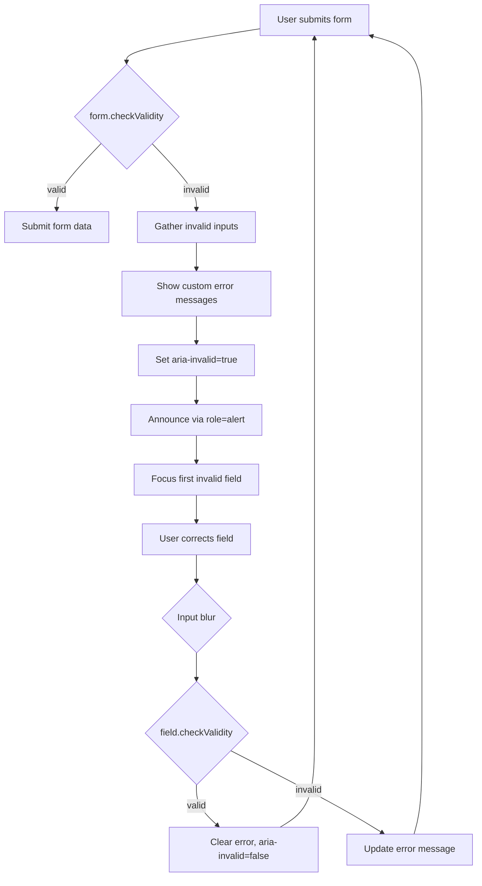

## Keywords in This File
{: .no_toc }

| # | Keyword | Weight |
|---|---|---|
| 1 | [HTML5 Constraint Validation API](#html5-constraint-validation-api) | high |
| 2 | [Custom Validity and Form UX Patterns](#custom-validity-and-form-ux-patterns) | high |

---

# HTML5 Constraint Validation API

🎯 **Interview Weight:** high (★★☆) - Forms are the primary
data-entry mechanism on the web; understanding native validation
avoids reinventing the wheel and missing accessibility

---

### 🎯 Model Answer

**30 seconds:**

> The HTML5 Constraint Validation API is the browser-native
> validation system. `<input type="email" required minlength="5">`
> - the browser validates automatically on form submit,
> displays error bubbles, blocks submission when invalid.
> Key attributes: `required`, `minlength`, `maxlength`, `min`,
> `max`, `pattern`, `type`. JavaScript access:
> `input.validity` (ValidityState object), `input.checkValidity()`,
> `input.setCustomValidity()` for custom messages.

**3 minutes (Senior):**

> The Constraint Validation API has two layers: the HTML
> declaration layer (attributes) and the JavaScript API layer
> (ValidityState, setCustomValidity, reportValidity).
>
> The HTML layer is free: `type="email"` validates email format.
> `type="url"` validates URL format. `required` blocks empty
> values. `pattern="[A-Z0-9]{6}"` validates against a regex.
> `min`/`max` validate numeric ranges. `minlength`/`maxlength`
> validate string lengths.
>
> The JavaScript layer adds: reading validation state (what
> specifically is wrong via `validity.typeMismatch`, `validity.patternMismatch`,
> etc.), setting custom messages (`setCustomValidity("Please
> enter your work email")`), and triggering validation on demand
> (`input.checkValidity()`).
>
> The key limitation: the built-in error UI (the browser balloon/
> tooltip) has almost no customization options. Color, font, position
> are browser-controlled. For custom error message styling,
> you disable the native UI (via `novalidate` on the form, preventing
> the built-in error display) and handle validation yourself with
> JavaScript, but still use the API for the validation state.

*Adapting up:* Discuss the difference between `checkValidity()`
and `reportValidity()`, the `invalid` event, and patterns for
async validation (username availability).

*Adapting down:* HTML attributes like `required` and `type="email"`
make browsers automatically check if the user filled in the form
correctly before submitting.

**Blank Mind Recovery:**

**(1) Restate:** "HTML5 has built-in form validation. Adding
`required` and the right `type` attribute validates automatically."

**(2) First principles:** "Form validation prevents invalid data
from being submitted. HTML5 moved this into the browser, eliminating
the need for basic validation JavaScript."

**(3) Bridge:** "HTML constraints declare the rules; the browser
enforces them. JavaScript lets you customize the messages or
add server-side validation."

---

### 📘 Concept Explanation

**What it is:**

The HTML5 Constraint Validation API is the browser's built-in
form validation system, consisting of HTML attributes that declare
validation constraints and JavaScript APIs that expose validation
state and enable customization.

**The problem it solves:**

Before HTML5, all form validation required JavaScript. Common
validations (email format, required fields, number ranges) were
reimplemented on every project. HTML5 built these into the browser,
reducing code, improving performance, and standardizing error
presentation.

**How it works:**

```
HTML CONSTRAINT ATTRIBUTES:
  required       field must not be empty
  type="email"   must match email format (x@x.x)
  type="url"     must match URL format
  type="tel"     format hint (no validation enforcement)
  type="number"  must be numeric; honors min/max/step
  type="date"    must be valid date; honors min/max
  type="time"    must be valid time
  type="color"   must be valid hex color

  minlength="N"  text min character count
  maxlength="N"  text max character count (prevents typing)
  min="N"        number/date minimum value
  max="N"        number/date maximum value
  step="N"       number valid increment (for dates: days)
  pattern="re"   must match regex (case-sensitive)

  multiple       allows comma-separated values (email, file)
  accept=".pdf"  file type hint for file inputs

VALIDITY STATE (input.validity):
  valueMissing     required field is empty
  typeMismatch     value doesn't match type (wrong email format)
  patternMismatch  value doesn't match pattern attribute
  tooShort         value shorter than minlength
  tooLong          value longer than maxlength
  rangeUnderflow   value below min
  rangeOverflow    value above max
  stepMismatch     value doesn't match step increment
  customError      setCustomValidity() has been called with message
  valid            no validity errors (all false = valid)

JAVASCRIPT API:
  el.validity       → ValidityState object (above properties)
  el.checkValidity() → Boolean (true if valid) - does NOT
                       show error UI
  el.reportValidity() → Boolean + shows browser error UI
  el.setCustomValidity("msg")  → sets custom error message
     el.setCustomValidity("")  → clears custom error (valid)
  el.validationMessage → current error message text
  el.willValidate  → true if element participates in validation

FORM METHODS:
  form.checkValidity()  → true if all fields valid
  form.reportValidity() → validates + shows errors if invalid
  form.noValidate       → disables native validation

SUBMIT BEHAVIOR:
  Default: submit blocked if any field fails validation
  Native error UI appears on first invalid field
  'invalid' event fires on each invalid field

NOVALIDATE PATTERN (custom error UI):
  <form novalidate onsubmit="validateForm(event)">
    <input type="email" id="email" required>
    <span id="email-error"></span>
    <button type="submit">Submit</button>
  </form>

  function validateForm(e) {
    e.preventDefault();
    const email = document.getElementById('email');
    const error = document.getElementById('email-error');
    if (!email.validity.valid) {
      if (email.validity.valueMissing) {
        error.textContent = 'Email is required';
      } else if (email.validity.typeMismatch) {
        error.textContent = 'Enter a valid email address';
      }
      email.setAttribute('aria-invalid', 'true');
      email.setAttribute('aria-describedby', 'email-error');
      error.setAttribute('role', 'alert');
    }
    // Proceed only if all valid
  }
```

> **Code walkthrough:** This example demonstrates the core pattern in action. The key mechanism shows how the concept works in practice. Study the structure to understand the essential behavior and common usage.

**The key insight:**

`novalidate` + JavaScript + the Constraint Validation API is the
production pattern. Native error balloons have zero styling control.
Production forms use `novalidate` to disable native error display,
then JavaScript to check `validity` state (reusing browser validation
logic) and render custom error messages in styled HTML elements
with proper ARIA attributes.

**When to use it:**

Always use native HTML validation constraints (they're free
validation). Use `novalidate` + JavaScript for custom error UX.
Use `setCustomValidity` for server-side validation errors.

**When NOT to use it:**

Don't rely solely on client-side validation - always validate
server-side. Don't use `novalidate` without reimplementing
validation in JavaScript. Don't use `pattern` for complex
validation that's better done in JavaScript.

**Alternatives:**

- Zod/Yup schema validation with react-hook-form
- Formik validation
- VeeValidate for Vue
- Server-side validation (always required regardless)

**First-principles derivation:**

Form data must be validated before processing. Validation can
happen client-side (fast feedback) and/or server-side (authoritative).
HTML5 built common validations into browsers: email format, URL
format, required fields, numeric ranges. This eliminates the need
to reimplement these patterns with JavaScript for basic cases.

---

### 💻 Code Example

**Production form with custom validation UI**

```html
<!-- novalidate: we handle error display ourselves
     but STILL USE browser validation state -->
<form id="signup-form" novalidate>
  <div class="field">
    <label for="email">Email address</label>
    <input type="email"
           id="email"
           name="email"
           required
           autocomplete="email"
           aria-required="true"
           aria-describedby="email-error">
    <span id="email-error"
          role="alert"
          aria-live="polite"></span>
  </div>

  <div class="field">
    <label for="password">Password</label>
    <input type="password"
           id="password"
           name="password"
           required
           minlength="8"
           pattern="(?=.*[A-Z])(?=.*[0-9]).{8,}"
           autocomplete="new-password"
           aria-required="true"
           aria-describedby="password-hint password-error">
    <p id="password-hint" class="hint">
      8+ chars, 1 uppercase, 1 number
    </p>
    <span id="password-error"
          role="alert"
          aria-live="polite"></span>
  </div>

  <button type="submit">Create account</button>
</form>

<script>
function showError(input, message) {
  const errorEl = document.getElementById(
    input.id + '-error'
  );
  input.setAttribute('aria-invalid', 'true');
  errorEl.textContent = message;
}

function clearError(input) {
  const errorEl = document.getElementById(
    input.id + '-error'
  );
  input.removeAttribute('aria-invalid');
  errorEl.textContent = '';
}

function getErrorMessage(input) {
  const v = input.validity;
  if (v.valueMissing) return `${input.labels[0].textContent}
 is required`;
  if (v.typeMismatch) return 'Enter a valid email address';
  if (v.tooShort) return `Min ${input.minLength} characters`;
  if (v.patternMismatch) return '8+ chars, 1 uppercase, 1 number';
  return input.validationMessage;  // browser default
}

document.getElementById('signup-form')
  .addEventListener('submit', (e) => {
    e.preventDefault();
    const inputs = e.target.querySelectorAll('input');
    let firstInvalid = null;

    inputs.forEach(input => {
      if (!input.checkValidity()) {
        showError(input, getErrorMessage(input));
        if (!firstInvalid) firstInvalid = input;
      } else {
        clearError(input);
      }
    });

    if (firstInvalid) {
      firstInvalid.focus();  // accessibility: focus error
      return;
    }
    // All valid - submit the form
    submitForm(new FormData(e.target));
  });

// Real-time validation on blur (not on every keystroke):
document.getElementById('signup-form')
  .addEventListener('focusout', (e) => {
    const input = e.target;
    if (input.tagName !== 'INPUT') return;
    if (input.value || input.required) {
      if (!input.checkValidity()) {
        showError(input, getErrorMessage(input));
      } else {
        clearError(input);
      }
    }
  });
</script>
```

> **Code walkthrough:** The `novalidate` attribute disables the
> browser's error balloons while keeping all validation state in
> `input.validity`. On submit, each input is checked via `checkValidity()`
> - which returns the validation result without showing UI. Error
> messages are rendered in `<span role="alert">` elements (announced
> by screen readers) linked via `aria-describedby`. The form moves
> keyboard focus to the first invalid field on submit. Real-time
> validation runs on `focusout` (not `input` event) to avoid
> showing errors before the user has finished typing.

---

### 🎓 Answers by Seniority

**Junior / Mid:**

> HTML5 validation attributes like `required`, `type="email"`,
> `minlength`, and `pattern` enable browser-native validation.
> For custom error messages, I use `novalidate` on the form to
> disable native error bubbles, then check `input.validity` in
> JavaScript and display styled error messages in HTML. The browser
> still does the validation logic - I just customize the UI.

---

**Senior / Staff:**

> The Constraint Validation API is the correct foundation for
> form validation. The pattern: `novalidate` + `checkValidity()`
> + custom error UI + ARIA attributes. Error messages should be
> in `role="alert"` or `aria-live="polite"` containers, linked
> via `aria-describedby`, and the first invalid field should
> receive focus on submit. Real-time validation on `blur`/`focusout`
> (not `input`) reduces error fatigue. Server-side validation
> must always mirror client-side - client validation is UX, not security.

---

### ⚠️ Common Misconceptions

**"Client-side validation is security validation"**

Client-side validation is UX enhancement. It can always be bypassed
(DevTools, curl, Postman). Never trust client-side validation as
a security control. Validate on the server for all inputs, especially
anything that touches the database, file system, or business logic.

**"pattern attribute replaces all JavaScript validation"**

The `pattern` attribute validates format via regex but cannot:
validate uniqueness (username already taken), cross-field validation
(password confirmation match), or async validation (checking email
against a blocklist). These require JavaScript.

---

### 🚨 Failure Modes and Diagnosis

**Symptom: form submits with invalid data bypassing validation**

```
Common causes:
1. Missing novalidate + no JS validation
   Adding novalidate DISABLES browser validation.
   Without JS replacement: form submits anything.
   Fix: always pair novalidate with JS validation code.

2. AJAX form submission bypassing HTML form submit
   If using fetch() on button click (not form submit):
   The submit event never fires; form validation never runs.
   Fix: attach validation to the click handler instead.

3. Multiple submit buttons with formnovalidate
   <button type="submit" formnovalidate>Save Draft</button>
   This bypasses validation for that specific button.
   Intentional for "save draft" patterns, but can be misuse.

4. Type="button" instead of type="submit"
   <button type="button" onclick="submitForm()">Submit</button>
   Does not trigger form validation. Must call
   form.checkValidity() manually in the handler.
```

> **Code walkthrough:** This example demonstrates the core pattern in action. The key mechanism shows how the concept works in practice. Study the structure to understand the essential behavior and common usage.

---

### 🎯 Interview Deep-Dive

| Scenario | Recommended Time | Key Signal |
|---|---|---|
| Core HTML5 validation attributes | 2 min | Attribute knowledge |
| ValidityState properties | 2-3 min | API depth |
| novalidate pattern | 3-4 min | Production approach |
| Client vs server validation | 2 min | Security awareness |
| ARIA for form errors | 3 min | Accessibility integration |
| Async validation | 3-4 min | Real-world pattern |
| setCustomValidity | 2-3 min | Custom error flow |
| checkValidity vs reportValidity | 2 min | API distinction |
| Focus management on submit | 2 min | Keyboard + errors |

---

**Q1: What HTML attributes enable native form validation?**
`[JUNIOR]` DEFINITION

*Why they ask:* Tests knowledge of the built-in validation system.

*Likely follow-up:* "What is the difference between min/max and minlength/maxlength?"

> **Answer:**
>
> Constraint validation attributes by category:
>
> **Presence/value constraints:**
> - `required`: field must have a non-empty value
>
> **Type constraints** (via `type` attribute):
> - `type="email"`: validates email format (x@x.x)
> - `type="url"`: validates URL format (must include protocol)
> - `type="number"`: value must be numeric
> - `type="date"`, `type="time"`, `type="month"`: date/time formats
> - `type="color"`: valid hex color
>
> **Length constraints:**
> - `minlength="N"`: minimum string length (text inputs)
> - `maxlength="N"`: maximum string length (also prevents
>   typing beyond limit)
>
> **Numeric range constraints** (for type=number, type=date, etc.):
> - `min="N"`: minimum value
> - `max="N"`: maximum value
> - `step="N"`: valid increment (default 1 for numbers)
>
> **Pattern constraint:**
> - `pattern="regex"`: value must match the regex
>   (without anchors: browser implicitly anchors to full value)
>
> `min`/`max` vs `minlength`/`maxlength`:
> - `min`/`max`: validates the NUMERIC VALUE or DATE VALUE
>   (`min="5"` means the number 5, not 5 characters)
> - `minlength`/`maxlength`: validates the STRING LENGTH
>   (character count)
>
> ```html
> <input type="number" min="1" max="100">
> <!-- Invalid: 0, 101, "abc" - valid: 50 -->
>
> <input type="text" minlength="8" maxlength="20">
> <!-- Invalid: 7 chars or fewer - valid: 8-20 chars -->
> ```
>
> *What separates good from great:* `maxlength` has a visible
> UI impact: the browser prevents typing beyond the limit.
> `minlength` is only validated on form submit (no prevention).
> This asymmetry means users can TYPE only 7 characters in a
> `minlength="8"` field and only discover the error on submit.
> Consider adding a character counter (`aria-live` announcement
> as they type) to make `minlength` requirements visible earlier.

---

**Q2: How do you set a custom validation message?** `[JUNIOR]`
MECHANISM

*Why they ask:* Common API that requires specific understanding.

*Likely follow-up:* "How do you clear a custom error?"

> **Answer:**
>
> `setCustomValidity()` sets a custom validation message:
>
> ```javascript
> const username = document.getElementById('username');
>
> // Set custom error:
> username.setCustomValidity(
>   'This username is already taken. Please choose another.'
> );
> // Now: username.validity.customError === true
> // username.checkValidity() returns false
> // username.validationMessage returns the custom string
>
> // Clear custom error:
> username.setCustomValidity('');
> // '' (empty string) MUST be empty string, not null or undefined
> // Any non-empty string keeps the field invalid
> ```
>
> Common pattern with async server check:
> ```javascript
> async function checkUsername(input) {
>   const username = input.value;
>   if (!username) return;
>
>   try {
>     const response = await fetch(
>       `/api/check-username?q=${encodeURIComponent(username)}`
>     );
>     const { available } = await response.json();
>
>     if (!available) {
>       input.setCustomValidity('Username already taken');
>     } else {
>       input.setCustomValidity('');  // clear error
>     }
>   } catch (e) {
>     // Network error: don't block form
>     input.setCustomValidity('');
>   }
> }
> ```
>
> Server validation on form submit:
> ```javascript
> form.addEventListener('submit', async (e) => {
>   e.preventDefault();
>   const response = await fetch('/api/register', {
>     method: 'POST',
>     body: new FormData(form)
>   });
>   const errors = await response.json();
>
>   if (errors.email) {
>     emailInput.setCustomValidity(errors.email);
>     emailInput.reportValidity();  // show error UI
>   }
> });
> ```
>
> *What separates good from great:* `setCustomValidity('')` must
> be called to CLEAR the error. A common bug: setting a custom
> validity once but never clearing it. The field stays permanently
> invalid (even if the user corrects the value) because
> `validity.customError` is still true. The pattern: call
> `setCustomValidity('')` before each async check, call it with
> an error message if the check fails.

---

**Q3: How do you validate forms accessibly?** `[SENIOR]`
SCENARIO

*Why they ask:* Accessibility + forms is a critical real-world requirement.

*Likely follow-up:* "What ARIA attributes are needed for form errors?"

> **Answer:**
>
> Accessible form validation requires five elements working together:
>
> **1. Visible error messages** (obvious location, clear text)
>
> **2. ARIA attributes linking error to input:**
> ```html
> <input id="email"
>        aria-invalid="true"
>        aria-describedby="email-error">
> <p id="email-error" role="alert">
>   Enter a valid email address
> </p>
> ```
>
> **3. Error summary at form top** (for multiple errors):
> ```html
> <div role="alert" id="error-summary">
>   <h2>Please fix 2 errors:</h2>
>   <ul>
>     <li><a href="#email">Email: enter valid email</a></li>
>     <li><a href="#phone">Phone: enter 10-digit number</a></li>
>   </ul>
> </div>
> ```
>
> **4. Focus movement to first error or summary:**
> ```javascript
> // Move focus to error summary:
> document.getElementById('error-summary').focus();
> // error-summary needs tabindex="-1"
>
> // OR: move focus to first invalid field:
> const firstInvalid = form.querySelector('[aria-invalid="true"]');
> firstInvalid?.focus();
> ```
>
> **5. `aria-live` for real-time validation messages:**
> ```html
> <span id="email-msg"
>       aria-live="polite"
>       role="status"></span>
> <!-- After blur: inject error message for instant announcement -->
> ```
>
> WCAG success criteria for forms:
> - 1.3.1 Info and Relationships: labels programmatically linked
> - 3.3.1 Error Identification: error message in text
> - 3.3.2 Labels or Instructions: input purpose clear
> - 3.3.3 Error Suggestion: tell user HOW to fix (Level AA)
> - 3.3.4 Error Prevention: confirm destructive actions (Level AA)
>
> *What separates good from great:* The error message quality
> matters for 3.3.3. "Invalid input" is non-compliant (doesn't
> tell the user what to fix). "Please enter a valid email address
> in the format name@example.com" meets 3.3.3. For password fields:
> "Password must be at least 8 characters and contain one number"
> is good. "Invalid password" is WCAG non-compliant.

---

**Q4: What is the difference between `checkValidity()` and
`reportValidity()`?** `[JUNIOR]` COMPARISON

*Why they ask:* API distinction commonly confused.

*Likely follow-up:* "When would you use one over the other?"

> **Answer:**
>
> Both validate an element (or all elements in a form) and return
> a Boolean (true = valid, false = invalid). The difference:
>
> `checkValidity()`:
> - Validates and returns Boolean
> - Does NOT show any error UI
> - Does fire the `invalid` event on each invalid element
> - Use for: programmatic validation where you handle the UI
>
> `reportValidity()`:
> - Validates and returns Boolean
> - DOES show the browser's native error UI (the tooltip balloon)
> - Does fire the `invalid` event
> - Use for: when you want the browser to show its default errors
>
> ```javascript
> const form = document.getElementById('form');
>
> // Check validity without showing UI:
> if (form.checkValidity()) {
>   submitFormData();
> } else {
>   // Handle error display yourself
>   showCustomErrors();
> }
>
> // Check validity AND show browser native errors:
> if (!form.reportValidity()) {
>   // Invalid - browser has shown error tooltip
>   return;
> }
> submitFormData();
>
> // Per-element:
> const email = document.getElementById('email');
> email.checkValidity();   // silent check
> email.reportValidity();  // shows browser tooltip on email
> ```
>
> `invalid` event (fires from `checkValidity()` and `reportValidity()`):
> ```javascript
> form.addEventListener('invalid', (e) => {
>   // Fired for each invalid element
>   // e.target is the invalid input
>   // e.preventDefault() prevents native tooltip
> }, true);  // use capture for bubbling
> ```
>
> *What separates good from great:* The `invalid` event is the
> hook for `novalidate` forms that want to intercept all invalid
> fields at once. Adding `e.preventDefault()` in the capture
> phase on `form` suppresses ALL native error UI across all
> inputs. Combined with `form.checkValidity()`, this provides
> full control: gather all invalid inputs, show custom error
> UI, without any native balloons.

---

**Q5: How do you implement async (server-side) validation in a form?**
`[SENIOR]` SCENARIO

*Why they ask:* Real-world pattern requiring API knowledge.

*Likely follow-up:* "How do you handle validation on a slow network?"

> **Answer:**
>
> Async validation is needed for: username availability, email
> uniqueness, promo code validity, address verification.
>
> Pattern:
> ```javascript
> const usernameInput = document.getElementById('username');
> let debounceTimer;
>
> usernameInput.addEventListener('blur', async (e) => {
>   const value = e.target.value;
>   if (!value) return;
>
>   // Optimistic: clear previous custom error first
>   usernameInput.setCustomValidity('');
>
>   // Show loading state:
>   usernameInput.setAttribute('aria-busy', 'true');
>   showLoadingIndicator(usernameInput);
>
>   try {
>     const result = await checkUsernameAvailable(value);
>     if (!result.available) {
>       usernameInput.setCustomValidity(
>         'Username is taken. Try: ' + result.suggestion
>       );
>     }
>     // setCustomValidity('') already called - it's valid
>   } catch (error) {
>     // Network fail: don't block submission
>     // Log error, let server-side catch it
>     console.error('Username check failed', error);
>   } finally {
>     usernameInput.removeAttribute('aria-busy');
>     hideLoadingIndicator(usernameInput);
>   }
> });
>
> // Debounce on keyup for real-time checking:
> usernameInput.addEventListener('keyup', (e) => {
>   clearTimeout(debounceTimer);
>   debounceTimer = setTimeout(() => {
>     // Fire async check after 500ms of no typing
>     usernameInput.dispatchEvent(new Event('blur'));
>   }, 500);
> });
> ```
>
> Handling slow network:
> - Show loading spinner inside/near the field (`aria-busy="true"`)
> - Debounce to avoid flooding the server (300-500ms)
> - Abort previous request if a new one starts (`AbortController`)
> - If request fails/times out: allow form submission (server validates)
>
> ```javascript
> let abortController;
> async function checkUsername(value) {
>   abortController?.abort();  // cancel previous request
>   abortController = new AbortController();
>   const response = await fetch(`/api/check?username=${value}`,
>     { signal: abortController.signal }
>   );
>   return response.json();
> }
> ```
>
> *What separates good from great:* The abort pattern prevents
> a race condition: user types "alice", check starts, user then
> types "bob", bob-check returns "available" before alice-check
> completes, alice-check returns "taken" and overwrites the result.
> With abort: when "bob" starts checking, "alice" check is
> cancelled. Latest request always wins.

---

**Q6: How does the `pattern` attribute work for input validation?**
`[JUNIOR]` MECHANISM

*Why they ask:* Regex + HTML intersection.

*Likely follow-up:* "What is the title attribute's role with pattern?"

> **Answer:**
>
> The `pattern` attribute validates the input value against a
> regular expression. The browser implicitly anchors the pattern
> to the full value (^ and $ are implicit).
>
> ```html
> <!-- UK postcode: 2-4 letters/digits, space, 3 chars -->
> <input type="text"
>        pattern="[A-Z]{1,2}\d{1,2}[A-Z]?\s\d[A-Z]{2}"
>        title="UK postcode: e.g. SW1A 1AA">
>
> <!-- US phone: 555-555-5555 -->
> <input type="tel"
>        pattern="\(\d{3}\) \d{3}-\d{4}"
>        title="Format: (555) 555-5555">
>
> <!-- Password: 8+ chars, 1 uppercase, 1 digit -->
> <input type="password"
>        minlength="8"
>        pattern="(?=.*[A-Z])(?=.*\d).{8,}"
>        title="8+ characters including 1 uppercase and 1 number">
>
> <!-- Alphanumeric username only -->
> <input type="text"
>        pattern="[a-zA-Z0-9_-]{3,20}"
>        title="3-20 characters, letters, numbers, _ and - only">
> ```
>
> `title` attribute with `pattern`:
> When the pattern fails, the browser error includes the `title`
> attribute text: "Please match the requested format: [title text]".
> This makes `title` important for pattern validation - it explains
> the expected format to the user.
>
> Pattern pitfalls:
> ```html
> <!-- WRONG: case-insensitive not supported in HTML pattern -->
> <input pattern="[a-z]+" title="Letters only">
> <!-- The above does NOT match uppercase letters -->
> <!-- For case-insensitive: pattern="[a-zA-Z]+" -->
>
> <!-- WRONG: partial match thinking -->
> <input pattern="[0-9]+">
> <!-- This matches ONLY digits (implicit ^ and $) -->
> <!-- "abc123" fails - the whole value must match -->
>
> <!-- Complex validation: use JavaScript instead -->
> <!-- Pattern is great for simple formats, bad for complex logic -->
> ```
>
> *What separates good from great:* `pattern` has no support for
> case-insensitive matching (no regex flags). For case-insensitive
> validation, use `[a-zA-Z]` character classes. Also: `pattern`
> applies only when the field has a value. An empty field with
> only `pattern` (no `required`) passes validation. Add `required`
> if the field must be filled.

---

**Q7: What is the `invalid` event and how do you use it?**
`[SENIOR]` MECHANISM

*Why they ask:* Programmatic validation hook.

*Likely follow-up:* "How do you use invalid event to build a custom validation library?"

> **Answer:**
>
> The `invalid` event fires on an input when `checkValidity()`
> or `reportValidity()` finds the input invalid. It fires once
> per invalid input.
>
> ```javascript
> // Listen on each input:
> document.getElementById('email')
>   .addEventListener('invalid', (e) => {
>     // e.target is the invalid input
>     console.log(e.target.validity);
>     // e.preventDefault() suppresses native error balloon:
>     e.preventDefault();
>     showCustomError(e.target);
>   });
>
> // Listen on form (with capture, since invalid doesn't bubble):
> document.getElementById('form')
>   .addEventListener('invalid', (e) => {
>     e.preventDefault();  // stop native UI
>     showCustomError(e.target);
>   }, true);  // true = capture phase (invalid doesn't bubble)
> ```
>
> Note: the `invalid` event does NOT bubble. To catch it on a
> parent (like the form), use capture phase (`addEventListener`
> third arg `true`).
>
> Building a minimal custom validation handler:
> ```javascript
> const form = document.getElementById('form');
>
> // Suppress all native error UI:
> form.addEventListener('invalid', (e) => {
>   e.preventDefault();
> }, true);
>
> // On submit: validate all, show all errors at once:
> form.addEventListener('submit', (e) => {
>   e.preventDefault();
>   const errors = [];
>   form.querySelectorAll(':invalid').forEach(input => {
>     errors.push({ input, message: getErrorMsg(input) });
>   });
>   if (errors.length > 0) {
>     displayErrorSummary(errors);
>     errors[0].input.focus();
>     return;
>   }
>   submitFormData(new FormData(form));
> });
> ```
>
> The `:invalid` CSS pseudo-class (and `:valid`) mirrors the
> event - selects all currently invalid inputs.
>
> *What separates good from great:* The `:user-invalid` CSS
> pseudo-class (CSS Selectors Level 4) was introduced specifically
> to fix the UX problem where `:invalid` matches required empty
> fields before the user has typed anything. `:user-invalid` only
> matches fields that the user has interacted with and made invalid.
> Combined with `:user-valid`, this enables "shows green/red only
> after user has touched the field" without any JavaScript.

---

**Q8: What is the `autocomplete` attribute and why does it matter?**
`[JUNIOR]` MECHANISM

*Why they ask:* UX and accessibility attribute, often overlooked.

*Likely follow-up:* "What values does autocomplete accept?"

> **Answer:**
>
> The `autocomplete` attribute tells browsers and password managers
> what type of data a field expects, enabling autofill from:
> - Browser's saved form data
> - Password managers (1Password, Bitwarden, etc.)
> - OS autofill (mobile especially)
>
> ```html
> <!-- Identity fields: -->
> <input autocomplete="name">
> <input autocomplete="given-name">   <!-- first name -->
> <input autocomplete="family-name">  <!-- last name -->
> <input autocomplete="email">
> <input autocomplete="tel">
>
> <!-- Passwords: -->
> <input type="password" autocomplete="current-password">
> <input type="password" autocomplete="new-password">
> <!-- new-password: prevents autofill for new pwd fields -->
>
> <!-- Payment: -->
> <input autocomplete="cc-number">    <!-- credit card -->
> <input autocomplete="cc-exp-month"> <!-- expiry month -->
> <input autocomplete="cc-exp-year">
> <input autocomplete="cc-csc">       <!-- CVV -->
>
> <!-- Address: -->
> <input autocomplete="street-address">
> <input autocomplete="address-level1"> <!-- state/province -->
> <input autocomplete="postal-code">
> <input autocomplete="country">
>
> <!-- One-time code (2FA): -->
> <input autocomplete="one-time-code">
> <!-- Triggers SMS OTP autofill on mobile -->
>
> <!-- Turn off: -->
> <input autocomplete="off">
> <!-- 'off' is often ignored by password managers -->
> ```
>
> Why it matters:
> - 75%+ of users use autofill
> - Correct autocomplete reduces form completion time by ~50%
> - Missing autocomplete on payment forms → user re-types every field
> - WCAG 1.3.5 (Level AA): autocomplete required for "important" fields
>   (name, email, phone, address, payment, auth)
>
> *What separates good from great:* `autocomplete="one-time-code"`
> on SMS verification code fields triggers mobile device autofill -
> the phone reads the SMS and offers to fill the code automatically.
> Without this attribute, the user must manually switch to their
> messages app, memorize or copy the code, and return to the form.
> Single attribute; huge UX improvement for 2FA flows.

---

**Q9: How do you prevent form resubmission on page refresh?**
`[SENIOR]` SCENARIO

*Why they ask:* Real-world POST/Redirect/GET pattern.

*Likely follow-up:* "What is the PRG pattern?"

> **Answer:**
>
> The form resubmission problem: a user submits a form (POST),
> the server responds, the user refreshes the page. The browser
> shows a "Resubmit form data?" dialog. Refreshing confirms, the
> POST is sent again.
>
> This causes: duplicate orders, duplicate account creations,
> duplicate charges.
>
> Solution: POST/Redirect/GET (PRG) pattern:
> ```
> 1. User submits POST /submit
> 2. Server processes the request
> 3. Server responds with 302 Redirect to GET /success
> 4. Browser follows redirect, sends GET /success
> 5. User is on GET /success page
> 6. Refresh sends GET /success again (safe, idempotent)
> ```
>
> Server implementation (Express.js example):
> ```javascript
> app.post('/register', async (req, res) => {
>   await createUser(req.body);
>   // Redirect after successful POST:
>   res.redirect(303, '/registration-success');
>   // 303 See Other is the correct status for POST→GET redirect
> });
>
> app.get('/registration-success', (req, res) => {
>   res.render('success');  // Safe GET - refresh is harmless
> });
> ```
>
> Alternative for AJAX forms: after success, clear the form
> or navigate away using `history.pushState()`.
>
> Idempotency key pattern (for critical operations):
> ```javascript
> // Generate unique key before submit:
> const idempotencyKey = crypto.randomUUID();
>
> // Include in submission:
> fetch('/api/purchase', {
>   method: 'POST',
>   headers: { 'Idempotency-Key': idempotencyKey },
>   body: JSON.stringify(cartData)
> });
> // Server rejects duplicate keys: order processed only once
> // even if the request is retried
> ```
>
> *What separates good from great:* 303 vs 302 redirect status.
> Both work in practice, but RFC 7231 defines 303 "See Other"
> specifically for post-form-submission redirect. It explicitly
> signals "the response is at this other URL, and that URL should
> be fetched with GET." 302 is technically a temporary redirect
> (ambiguous method). 303 is the semantically correct choice for PRG.

---

| Interviewer Type | Emphasis |
|---|---|
| Technical Panel | ValidityState + API depth |
| Hiring Manager | Accessible form errors |
| Bar Raiser | Async validation + PRG pattern |
| Peer Engineer | novalidate pattern + setCustomValidity |

---

### ⚖️ Comparison Table

| Validation Approach | Customization | Accessibility | Code Required |
|---|---|---|---|
| Native only (no `novalidate`) | None (browser UI) | Browser-handled | Zero |
| `novalidate` + ValidityState | Full control | Manual ARIA needed | Moderate |
| `setCustomValidity` | Message only | Partial (native balloon) | Minimal |
| Third-party library (Zod, RHF) | Full control | Depends on library | High setup |

---

### 🏛️ System Design

*(Omit: not a ★★★ keyword.)*

---

### 📊 Diagram

```
FORM VALIDATION FLOW:
  User submits form
        |
  form.checkValidity()
        |
  +-----+------+
  |            |
 Valid       Invalid
  |            |
Submit     Show errors
           Focus first
           invalid field
           Announce via
           aria-live
```



> **Diagram walkthrough:** Form validation forms a feedback loop.
> On submit, all fields are validated. Invalid fields get styled
> error messages, `aria-invalid` state for screen readers, and
> the first invalid field receives focus for keyboard users.
> As the user corrects each field (triggering blur), real-time
> validation clears errors immediately - giving positive feedback.
> The cycle continues until all fields pass. This UX pattern
> matches WCAG requirements (3.3.1 error identification, 3.3.3
> error suggestion, focus management).

---

---

---

### 💻 Code Example

*(Omit: this concept does not have a programmatic interface that can be demonstrated in code. The conceptual explanation above is sufficient.)*


---

### 🏛️ System Design

*(Omit: system design diagram not applicable for this concept - see ★★★ keywords for full system design coverage.)*


---

### ⚖️ Comparison Table

*(Omit: this is a ★☆☆ foundational concept with no direct alternatives to compare - see higher-difficulty keywords for trade-off analysis.)*


---

### 📊 Diagram

*(Omit: no standalone visual diagram required for this concept - the explanations and code examples above provide sufficient clarity.)*


# Custom Validity and Form UX Patterns

🎯 **Interview Weight:** high (★★☆) - Form UX is where theory
meets practice; custom validation patterns appear in every
real-world codebase

---

### 🎯 Model Answer

**30 seconds:**

> Custom validity extends the native Constraint Validation API.
> Use `setCustomValidity("message")` for server validation errors
> and cross-field validation. Key UX patterns: validate on blur
> (not every keystroke), show errors after the first submit
> attempt, clear errors as the user corrects them, focus the
> first error on submit, and always pair visual errors with
> ARIA (`aria-invalid`, `aria-describedby`).

**3 minutes (Senior):**

> Form UX exists on a spectrum: too aggressive (errors appear
> as you type your first character) vs too lenient (errors only
> appear after submit). The research-backed sweet spot: validate
> after the first submit attempt, then update in real-time
> as the user corrects errors.
>
> `setCustomValidity` is the hook for validation the HTML API
> can't do: cross-field (password must match confirm password),
> server-side (username taken), and business logic (start date
> before end date). Setting `setCustomValidity("")` (empty string)
> clears the custom error and returns the field to native validation.
>
> Multi-step forms add focus management complexity: on step
> transition, focus must move to the step's heading or first
> field. On step error, focus must go to the first error.
> On step completion, a success announcement via aria-live
> keeps screen reader users oriented.

*Adapting up:* Discuss the inline vs toast error pattern tradeoffs,
password strength meters, and handling server-side errors after
AJAX submission.

*Adapting down:* Custom validity means writing JavaScript to
set your own error messages when you need to check something
the browser can't check natively.

**Blank Mind Recovery:**

**(1) Restate:** "Custom validity - using JavaScript to add
validation rules beyond what HTML attributes support."

**(2) First principles:** "Some validation requires server data
(is this username taken?) or cross-field logic (do the passwords
match?). JavaScript fills that gap."

**(3) Bridge:** "Custom validity hooks into the browser's
validation system, so your rules work alongside native rules."

---

### 📘 Concept Explanation

**What it is:**

Custom validity refers to validation logic that extends the
HTML5 Constraint Validation API beyond built-in attribute-based
rules. It includes cross-field validation, async server-side
validation, and complex business rules.

**The problem it solves:**

Native validation handles format and range constraints. Production
forms require more: password confirmation match, server-side
uniqueness checks, dependent field validation, business rules.

**How it works:**

```
CROSS-FIELD VALIDATION:
  const password = document.getElementById('password');
  const confirm = document.getElementById('confirm-password');

  confirm.addEventListener('blur', () => {
    if (password.value !== confirm.value) {
      confirm.setCustomValidity(
        'Passwords do not match'
      );
    } else {
      confirm.setCustomValidity('');
    }
  });

  // Also re-validate on password change:
  password.addEventListener('change', () => {
    if (confirm.value && password.value !== confirm.value) {
      confirm.setCustomValidity('Passwords do not match');
    } else {
      confirm.setCustomValidity('');
    }
  });

DATE RANGE VALIDATION (start before end):
  const startDate = document.getElementById('start');
  const endDate = document.getElementById('end');

  function validateDateRange() {
    if (startDate.value && endDate.value) {
      if (endDate.value <= startDate.value) {
        endDate.setCustomValidity(
          'End date must be after start date'
        );
      } else {
        endDate.setCustomValidity('');
      }
    }
  }
  startDate.addEventListener('change', validateDateRange);
  endDate.addEventListener('change', validateDateRange);

FORM UX STATE MACHINE:
  States: untouched → touched → submitting → error → success

  untouched: no validation, no errors shown
  touched: validate on blur, show errors
  submitting: show loading, disable submit
  error: show server errors, focus first error
  success: show confirmation, redirect or clear

PROGRESSIVE VALIDATION TIMING:
  // 1st submit: validate all, show all errors
  // After 1st submit: validate on blur in real-time
  let hasAttemptedSubmit = false;

  form.addEventListener('submit', (e) => {
    e.preventDefault();
    hasAttemptedSubmit = true;
    validateAll();
  });

  form.addEventListener('focusout', (e) => {
    if (hasAttemptedSubmit && e.target.tagName === 'INPUT') {
      validateField(e.target);
    }
  });

PASSWORD STRENGTH METER:
  const PATTERNS = {
    length:   str => str.length >= 8,
    upper:    str => /[A-Z]/.test(str),
    lower:    str => /[a-z]/.test(str),
    number:   str => /[0-9]/.test(str),
    special:  str => /[^a-zA-Z0-9]/.test(str)
  };

  function getStrength(password) {
    const score = Object.values(PATTERNS)
      .filter(fn => fn(password)).length;
    return ['none','weak','fair','good','strong','perfect'][score];
  }

  // Update meter (visual AND accessible):
  passwordInput.addEventListener('input', () => {
    const strength = getStrength(passwordInput.value);
    meter.value = ['none','weak','fair','good','strong','perfect']
      .indexOf(strength);
    meter.setAttribute('aria-label',
      `Password strength: ${strength}`);
    // aria-live region for screen reader update:
    liveRegion.textContent = `Password strength: ${strength}`;
  });
```

> **Code walkthrough:** This example demonstrates the core pattern in action. The key mechanism shows how the concept works in practice. Study the structure to understand the essential behavior and common usage.

**The key insight:**

Form UX validation timing is as important as validation logic.
The "premature validation" problem: showing errors as the user
starts typing is annoying and discouraging. The pattern supported
by Nielsen Norman Group UX research: show errors on `blur`
(field leave) after the user has finished typing, show errors
on all fields on first submit attempt, then immediately update
as the user makes corrections.

**When to use it:**

Use custom validity for: cross-field validation, async server-side
checks, complex business rules, server validation errors after
AJAX submission.

**When NOT to use it:**

Don't use custom validity to replace native HTML constraints
(use `required`, `type`, `pattern` for format validation).
Don't show validation errors before the user has a chance to
input anything.

**Alternatives:**

- react-hook-form → React-specific form state management
- Formik → React forms with Yup schema validation
- VeeValidate → Vue forms
- Server-side only → for non-critical or simple forms

**First-principles derivation:**

HTML5 validation covers universal data formats. Production
applications have business-specific rules that cannot be
expressed in HTML attributes. JavaScript fills this gap using
the same API surface that native validation uses, ensuring
custom and native validation compose correctly.

---

### 💻 Code Example

**Complete multi-field validation with server error handling**

```javascript
class FormValidator {
  constructor(form) {
    this.form = form;
    this.hasSubmitted = false;
    this.init();
  }

  init() {
    // Suppress native error UI:
    this.form.addEventListener('invalid',
      e => e.preventDefault(), true
    );

    // Validate on blur (after first submit only):
    this.form.addEventListener('focusout', (e) => {
      if (this.hasSubmitted && e.target.matches('input,select')) {
        this.validateField(e.target);
      }
    });

    this.form.addEventListener('submit', async (e) => {
      e.preventDefault();
      this.hasSubmitted = true;

      if (!this.validateAll()) return;

      await this.submitToServer(new FormData(this.form));
    });
  }

  validateField(input) {
    // Run native constraint validation:
    const isNativeValid = input.checkValidity();

    if (!isNativeValid) {
      const msg = this.getErrorMessage(input);
      this.showError(input, msg);
      return false;
    }

    this.clearError(input);
    return true;
  }

  validateAll() {
    let firstInvalid = null;
    this.form.querySelectorAll('input,select,textarea')
      .forEach(input => {
        if (!this.validateField(input) && !firstInvalid) {
          firstInvalid = input;
        }
      });

    if (firstInvalid) {
      firstInvalid.focus();
      return false;
    }
    return true;
  }

  async submitToServer(formData) {
    const submitBtn = this.form.querySelector('[type="submit"]');
    submitBtn.disabled = true;
    submitBtn.textContent = 'Saving...';

    try {
      const response = await fetch(this.form.action, {
        method: 'POST',
        body: formData
      });
      const result = await response.json();

      if (!response.ok && result.errors) {
        // Server validation errors:
        let firstError = null;
        Object.entries(result.errors).forEach(([field, msg]) => {
          const input = this.form.elements[field];
          if (input) {
            input.setCustomValidity(msg);
            this.showError(input, msg);
            if (!firstError) firstError = input;
          }
        });
        firstError?.focus();
      } else {
        window.location.href = result.redirect;
      }
    } finally {
      submitBtn.disabled = false;
      submitBtn.textContent = 'Submit';
    }
  }

  showError(input, message) {
    input.setAttribute('aria-invalid', 'true');
    const errorEl = this.form.querySelector(`#${input.id}-error`);
    if (errorEl) errorEl.textContent = message;
  }

  clearError(input) {
    input.removeAttribute('aria-invalid');
    input.setCustomValidity('');  // clear any custom validity
    const errorEl = this.form.querySelector(`#${input.id}-error`);
    if (errorEl) errorEl.textContent = '';
  }

  getErrorMessage(input) {
    const { validity } = input;
    if (validity.customError) return input.validationMessage;
    if (validity.valueMissing) return 'This field is required';
    if (validity.typeMismatch) {
      const typeMessages = {
        email: 'Enter a valid email address',
        url: 'Enter a valid URL (include https://)',
        number: 'Enter a valid number'
      };
      return typeMessages[input.type] || 'Invalid format';
    }
    if (validity.tooShort)
      return `At least ${input.minLength} characters required`;
    if (validity.tooLong)
      return `Maximum ${input.maxLength} characters allowed`;
    if (validity.rangeUnderflow)
      return `Minimum value is ${input.min}`;
    if (validity.rangeOverflow)
      return `Maximum value is ${input.max}`;
    if (validity.patternMismatch) return input.title || 'Invalid format';
    return 'Invalid value';
  }
}

// Usage:
const validator = new FormValidator(document.getElementById('form'));
```

> **Code walkthrough:** This FormValidator class implements the
> complete production pattern: native error UI suppressed via
> capture-phase `preventDefault`, validation only after first
> submit attempt (no premature errors), real-time correction
> feedback via `focusout`, server errors injected via
> `setCustomValidity`, focus moved to first error, and submit
> button disabled during request to prevent double-submission.
> The `getErrorMessage` method provides human-readable messages
> for each ValidityState condition, replacing browser's terse defaults.

---

### 🎓 Answers by Seniority

**Junior / Mid:**

> Custom validity uses `setCustomValidity("message")` for validation
> JavaScript handles (cross-field checks, server errors). Clear it
> with `setCustomValidity("")`. I show errors on blur and on submit,
> not on every keystroke - UX research shows premature errors
> are frustrating.

---

**Senior / Staff:**

> The key insight in production form UX: validation timing
> matters as much as validation logic. The Nielsen Norman Group
> research (2019) found: inline validation on blur produces the
> best UX for most forms. Showing errors too early (on every
> keystroke) increases errors. Showing errors only on submit
> gives poor feedback loops. The sweet spot: show on blur after
> first submit attempt, update immediately as user corrects.
>
> For payment/checkout forms: progressive validation with `Stripe.js`
> error handling pattern. Card number validates as you type
> (acceptable for specifically formatted inputs like credit cards
> where each character changes validity). Email validates on blur.
> Name validates on submit only.

---

### ⚠️ Common Misconceptions

**"Real-time (keyup) validation gives the best UX"**

Validating on every keystroke shows an error immediately as a user
types their first character ("Email is required" while the user
is still typing the email). UX research shows this is more
frustrating than helpful. Validate on `blur` (when user leaves
the field) for the best experience, with real-time correction
feedback after the first submit attempt.

---

### 🚨 Failure Modes and Diagnosis

**Symptom: custom error messages appear stuck after user corrects input**

```
Root cause: setCustomValidity() called but never cleared

Code example of the bug:
  input.addEventListener('input', () => {
    if (someCondition) {
      input.setCustomValidity('Error message');
    }
    // Missing: else { input.setCustomValidity(''); }
  });

Fix:
  input.addEventListener('input', () => {
    if (someCondition) {
      input.setCustomValidity('Error message');
    } else {
      input.setCustomValidity('');  // ALWAYS clear when valid
    }
  });

Diagnosis: Open DevTools console, type valid value:
  document.getElementById('myInput').validity.customError
  // If still true: setCustomValidity was never cleared
  document.getElementById('myInput').validationMessage
  // Shows the stuck custom message
```

> **Code walkthrough:** This example demonstrates the core pattern in action. The key mechanism shows how the concept works in practice. Study the structure to understand the essential behavior and common usage.

---

### 🎯 Interview Deep-Dive

| Scenario | Recommended Time | Key Signal |
|---|---|---|
| Validation timing best practice | 2-3 min | blur vs keyup vs submit |
| Cross-field validation | 3-4 min | Password confirm pattern |
| Server error display | 3 min | setCustomValidity flow |
| Disable submit during request | 2 min | Double-submit prevention |
| Password strength meter | 3 min | Visual + accessible |
| Multi-step form focus | 2-3 min | Step transition focus |
| Error summary pattern | 2-3 min | Multiple errors UX |
| Progressive disclosure | 2 min | Conditional field display |
| Form state machine | 3 min | UX states |

---

**Q1: When should form validation run?** `[JUNIOR]`
SCENARIO

*Why they ask:* UX judgment question with research backing.

*Likely follow-up:* "What is the argument against validating on keyup?"

> **Answer:**
>
> Validation timing significantly impacts form completion rates.
>
> Best practice (backed by Nielsen Norman Group research):
>
> **First submit attempt**: validate ALL fields simultaneously,
> show all errors, focus first invalid field. This reveals the
> full picture of what needs fixing.
>
> **After first submit**: validate each field in real-time on
> `blur` (when user leaves the field). Update (clear or change)
> errors immediately as the user makes corrections.
>
> What to avoid:
>
> **keyup validation** (on every keystroke): shows errors while
> the user is still typing. "Email is required" while typing
> an email. This is aggressive and frustrating.
>
> **Submit-only validation**: good for simple, short forms
> (login). Bad for long forms (registration) - user must scroll
> to find all errors after submit.
>
> The hybrid approach:
> ```javascript
> let firstSubmitDone = false;
>
> form.addEventListener('submit', () => {
>   firstSubmitDone = true;
>   // validate all
> });
>
> input.addEventListener('blur', () => {
>   if (firstSubmitDone) {
>     // validate this field in real-time
>   }
> });
> ```
>
> Exception: some inputs benefit from live validation:
> - Password strength meters (progressive feedback is helpful)
> - Username availability (async check while typing, debounced)
> - Character counters for `maxlength` fields
>
> *What separates good from great:* The NNG research finding:
> "premature validation" (before the user has finished typing)
> increases error rates because users feel criticized mid-thought.
> "Reward validation" (clear success indicator on blur when valid)
> increases completion rates. Green checkmark on successful blur
> is more valuable than a red error on invalid blur.

---

**Q2: How do you implement password confirmation validation?**
`[JUNIOR]` SCENARIO

*Why they ask:* Classic cross-field validation pattern.

*Likely follow-up:* "What happens if the user changes the original password field?"

> **Answer:**
>
> Password confirmation requires bidirectional event listening:
>
> ```javascript
> const pwd = document.getElementById('password');
> const confirmPwd = document.getElementById('confirm-password');
>
> function validateConfirmPassword() {
>   if (!confirmPwd.value) {
>     confirmPwd.setCustomValidity('');
>     return;
>   }
>   if (pwd.value !== confirmPwd.value) {
>     confirmPwd.setCustomValidity('Passwords do not match');
>   } else {
>     confirmPwd.setCustomValidity('');
>   }
> }
>
> // Validate when user leaves the confirm field:
> confirmPwd.addEventListener('blur', validateConfirmPassword);
>
> // CRITICAL: re-validate when the original password changes:
> pwd.addEventListener('input', validateConfirmPassword);
> // Why: user fills confirm first, then changes the original.
> // Without this: confirm shows "valid" but passwords differ.
>
> // Clear when confirm field is empty (user might tab through):
> confirmPwd.addEventListener('input', () => {
>   if (!confirmPwd.value) {
>     confirmPwd.setCustomValidity('');
>   }
> });
> ```
>
> Full accessible HTML:
> ```html
> <div>
>   <label for="password">Password</label>
>   <input type="password"
>          id="password"
>          required
>          minlength="8">
> </div>
> <div>
>   <label for="confirm-password">Confirm password</label>
>   <input type="password"
>          id="confirm-password"
>          required
>          aria-describedby="confirm-error">
>   <span id="confirm-error"
>         role="alert"
>         aria-live="polite"></span>
> </div>
> ```
>
> *What separates good from great:* The "changed original" edge
> case. User fills: password="abc123", confirm="abc123" (valid).
> Then changes password to "xyz789". Now passwords don't match
> but the confirm field still shows "valid". The fix: listen to
> `input` on the original password field and re-run the comparison.
> Without this, the form submits mismatched passwords.

---

**Q3: How do you show server-side validation errors in a form?**
`[SENIOR]` SCENARIO

*Why they ask:* Real-world AJAX form error handling.

*Likely follow-up:* "How do you prevent double-submission?"

> **Answer:**
>
> Server validation errors arrive after the AJAX request completes.
> The pattern:
>
> ```javascript
> async function submitForm(formData) {
>   try {
>     const response = await fetch('/api/register', {
>       method: 'POST',
>       body: formData
>     });
>
>     if (response.ok) {
>       window.location.href = '/welcome';
>       return;
>     }
>
>     // 422 Unprocessable Entity = validation errors
>     if (response.status === 422) {
>       const { errors } = await response.json();
>       // errors: { email: "already taken", phone: "invalid" }
>
>       displayServerErrors(errors);
>       return;
>     }
>
>     throw new Error(`Server error: ${response.status}`);
>   } catch (e) {
>     showGeneralError('Submission failed. Please try again.');
>   }
> }
>
> function displayServerErrors(errors) {
>   let firstErrorInput = null;
>
>   Object.entries(errors).forEach(([field, message]) => {
>     const input = document.getElementById(field);
>     if (!input) return;
>
>     // Use setCustomValidity so it integrates with form state:
>     input.setCustomValidity(message);
>     input.setAttribute('aria-invalid', 'true');
>
>     const errorEl = document.getElementById(`${field}-error`);
>     if (errorEl) errorEl.textContent = message;
>
>     if (!firstErrorInput) firstErrorInput = input;
>   });
>
>   // Move focus to first error:
>   firstErrorInput?.focus();
>
>   // Clear server errors when user starts correcting:
>   firstErrorInput?.addEventListener('input', function clearOnEdit() {
>     this.setCustomValidity('');
>     this.removeAttribute('aria-invalid');
>     const errorEl = document.getElementById(`${this.id}-error`);
>     if (errorEl) errorEl.textContent = '';
>     this.removeEventListener('input', clearOnEdit);
>   });
> }
> ```
>
> Double-submission prevention:
> ```javascript
> const submitBtn = form.querySelector('[type="submit"]');
> submitBtn.disabled = true;            // disable button
> submitBtn.setAttribute('aria-busy', 'true');  // announce loading
> submitBtn.textContent = 'Submitting...';
>
> // Re-enable on complete (success OR error):
> try { await submitForm(formData); }
> finally {
>   submitBtn.disabled = false;
>   submitBtn.removeAttribute('aria-busy');
>   submitBtn.textContent = 'Submit';
> }
> ```
>
> *What separates good from great:* `setCustomValidity(message)`
> for server errors ensures the error integrates with the form's
> validity state - `form.checkValidity()` will return false while
> any server error exists. This prevents re-submission before
> the error is corrected. Clearing the custom validity on first
> keystroke (`input` event, one-time listener) gives immediate
> feedback that the user's correction is being processed.

---

**Q4: What is the PRG pattern and why does it matter?** `[SENIOR]`
MECHANISM

*Why they ask:* Fundamental web form pattern.

*Likely follow-up:* "What status code should the redirect use?"

> **Answer:**
>
> POST/Redirect/GET (PRG) prevents duplicate form submissions
> when users refresh the result page.
>
> Problem without PRG:
> ```
> 1. User fills form → POST /order
> 2. Server creates order → responds 200 OK with order details
> 3. User sees order confirmation page (URL still /order)
> 4. User refreshes: browser sends POST /order again
> 5. Browser: "Are you sure you want to resubmit?" → user confirms
> 6. SECOND ORDER CREATED
> ```
>
> With PRG:
> ```
> 1. User fills form → POST /order
> 2. Server creates order
> 3. Server responds: 303 See Other → Location: /order/12345
> 4. Browser follows redirect → GET /order/12345
> 5. User sees order confirmation (URL is /order/12345)
> 6. User refreshes: browser sends GET /order/12345
> 7. Safe idempotent GET - no second order created
> ```
>
> HTTP status codes:
> - `303 See Other`: RFC-correct for POST → GET redirect
> - `302 Found`: works in practice, semantically for temp redirect
> - `301 Moved Permanently`: never use for POST redirect (cached)
>
> AJAX form alternative (no server-side redirect needed):
> ```javascript
> async function handleSubmit(e) {
>   e.preventDefault();
>   const result = await submitOrder(formData);
>   // Replace current history state (no back-button resubmit):
>   history.replaceState(null, '', `/order/${result.orderId}`);
>   showSuccessUI(result);
> }
> ```
>
> Idempotency as defense-in-depth:
> Even with PRG, implement server-side idempotency keys to handle
> network retries and race conditions. PRG handles browser
> refresh. Idempotency handles everything else.
>
> *What separates good from great:* PRG is a UI pattern, not a
> security guarantee. A malicious user or bot can still send
> multiple POST requests without a browser. The authoritative
> protection is server-side: idempotency keys, unique constraints
> in the database, or rate limiting. PRG protects against accidental
> double-submission from normal browser usage.

---

**Q5: How do you build a password strength meter accessibly?**
`[SENIOR]` SCENARIO

*Why they ask:* Common feature combining UX + accessibility.

*Likely follow-up:* "What ARIA makes the meter screen-reader-friendly?"

> **Answer:**
>
> A password strength meter needs both visual and accessible
> representation:
>
> ```html
> <div class="password-field">
>   <label for="pwd">Password</label>
>   <input type="password" id="pwd" required minlength="8">
>
>   <!-- Accessible meter: -->
>   <meter id="pwd-strength"
>          min="0" max="4" value="0"
>          aria-label="Password strength: none"
>          aria-live="off">  <!-- meter not a live region -->
>   </meter>
>
>   <!-- Text description for screen readers: -->
>   <p id="pwd-strength-text"
>      aria-live="polite"
>      class="sr-only">
>     <!-- Updated by JS: "Password strength: weak" etc. -->
>   </p>
>
>   <!-- Visual requirements checklist: -->
>   <ul class="requirements" aria-label="Password requirements">
>     <li id="req-length" aria-live="polite">
>       At least 8 characters
>     </li>
>     <li id="req-upper" aria-live="polite">
>       One uppercase letter
>     </li>
>     <li id="req-number" aria-live="polite">
>       One number
>     </li>
>   </ul>
> </div>
>
> <script>
> const pwd = document.getElementById('pwd');
> const meter = document.getElementById('pwd-strength');
> const strengthText = document.getElementById('pwd-strength-text');
> const reqLength = document.getElementById('req-length');
> const reqUpper = document.getElementById('req-upper');
> const reqNumber = document.getElementById('req-number');
>
> pwd.addEventListener('input', () => {
>   const val = pwd.value;
>   const checks = {
>     length: val.length >= 8,
>     upper:  /[A-Z]/.test(val),
>     number: /[0-9]/.test(val)
>   };
>
>   // Update requirements list (visual + aria-live):
>   updateReq(reqLength, checks.length, 'At least 8 characters');
>   updateReq(reqUpper, checks.upper, 'One uppercase letter');
>   updateReq(reqNumber, checks.number, 'One number');
>
>   const score = Object.values(checks).filter(Boolean).length;
>   const labels = ['none','weak','fair','strong'];
>   const label = labels[Math.min(score, 3)];
>
>   meter.value = score;
>   meter.setAttribute('aria-label', `Password strength: ${label}`);
>   // Update live region for screen reader announcement:
>   strengthText.textContent = `Password strength: ${label}`;
> });
>
> function updateReq(el, met, text) {
>   el.textContent = (met ? '✓ ' : '✗ ') + text;
>   el.className = met ? 'met' : 'unmet';
> }
> </script>
> ```
>
> Accessibility notes:
> - `<meter>` has native semantics for numeric ranges
> - `aria-label` on meter overrides default announcement
> - `aria-live="polite"` on text description announces to SR
> - Requirements list updates are also polite live regions
> - Don't use `aria-live` on the meter itself (redundant)
>
> *What separates good from great:* The requirements checklist
> pattern (checkmarks that turn green as each requirement is met)
> is more accessible than a color-changing bar alone. A green
> bar communicates strength visually but fails WCAG 1.4.1
> (Use of Color) - color alone cannot convey information.
> Checkmarks + color satisfies the criterion because the
> shape (✓/✗) is the primary indicator, color is enhancement.

---

| Interviewer Type | Emphasis |
|---|---|
| Technical Panel | setCustomValidity + cross-field |
| Hiring Manager | Form completion rate + UX research |
| Bar Raiser | PRG pattern + double-submit |
| Peer Engineer | Password strength + server errors |

---

### ⚖️ Comparison Table

| Validation Timing | When Triggers | UX Impact | Best For |
|---|---|---|---|
| keyup (every key) | Every keystroke | Premature errors | Character counters only |
| blur (field leave) | When user tabs out | Balanced | Most fields |
| submit only | Form submit | Delayed feedback | Login/short forms |
| blur + submit | Both events | Best practice | Registration/checkout |
| Async (debounced) | 300-500ms after typing | Real-time check | Username, email uniqueness |

---

### 🏛️ System Design

*(Omit: not a ★★★ keyword.)*

---

### 📊 Diagram

*(Omit: UX patterns best expressed through the code examples.)*

---

### 💻 Code Example

*(Omit: this concept does not have a programmatic interface that can be demonstrated in code. The conceptual explanation above is sufficient.)*


---

### 🏛️ System Design

*(Omit: system design diagram not applicable for this concept - see ★★★ keywords for full system design coverage.)*


---

### ⚖️ Comparison Table

*(Omit: this is a ★☆☆ foundational concept with no direct alternatives to compare - see higher-difficulty keywords for trade-off analysis.)*


---

### 📊 Diagram

*(Omit: no standalone visual diagram required for this concept - the explanations and code examples above provide sufficient clarity.)*


