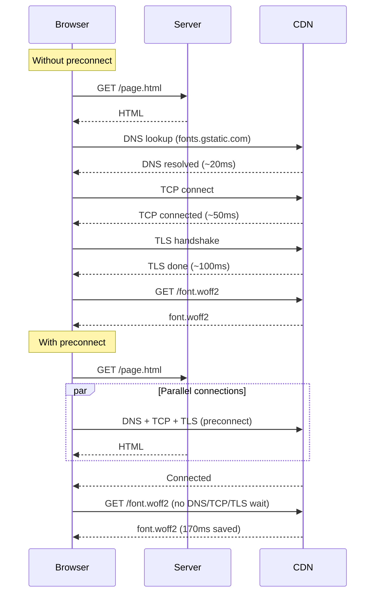

## Keywords in This File
{: .no_toc }

| # | Keyword | Weight |
|---|---|---|
| 1 | [Resource Hints and Preloading](#resource-hints-and-preloading) | very |
| 2 | [Lazy Loading and Deferred Resource Loading](#lazy-loading-and-deferred-resource-loading) | high |

---

# Resource Hints and Preloading

🎯 **Interview Weight:** very high (★★☆) - Resource hints directly
improve Core Web Vitals; expected knowledge for senior frontend roles

---

### 🎯 Model Answer

**30 seconds:**

> Resource hints tell the browser about resources it will need
> before they're discovered in the HTML. Four types:
> `preconnect` (start TCP+TLS to a third-party origin),
> `dns-prefetch` (DNS resolution only, cheaper),
> `preload` (fetch a specific resource at high priority for THIS page),
> `prefetch` (fetch at low priority for NEXT page navigation).
> Use `<link rel="preload" as="font">` for critical fonts,
> `preconnect` for CDN origins, `prefetch` for the next route.

**3 minutes (Senior):**

> Resource hints are declarations in the HTML `<head>` that enable
> the browser to perform network work ahead of when the browser
> would normally discover the need.
>
> The browser waterfall is the enemy of performance. A typical
> slow page: HTML loads → CSS loads → CSS references font →
> font request starts. The font request is 3 hops deep into the
> waterfall. `<link rel="preload" href="font.woff2" as="font">`
> moves the font request to the first hop - it starts while
> the CSS is still loading.
>
> `preconnect` is often more valuable than `preload` for third-party
> resources. The `connect` phase (DNS + TCP + TLS) for a CDN can
> take 200-500ms on a slow connection. `preconnect` eliminates
> this from the critical path.
>
> The `as` attribute on preload is mandatory. Without it: the
> browser fetches at default priority without the correct
> cache key, causing a double-fetch. Fonts additionally need
> `crossorigin` (fonts always use CORS even same-origin).

*Adapting up:* Discuss the browser's `fetchpriority` attribute
(newer), `modulepreload` for ES modules, and `prerender` (now
deprecated in favor of Speculation Rules API).

*Adapting down:* Resource hints tell the browser "you'll need
this soon - start getting it now" so pages load faster.

**Blank Mind Recovery:**

**(1) Restate:** "Resource hints help the browser start fetching
resources earlier. preload for this page, prefetch for next page."

**(2) First principles:** "Browsers fetch resources in order of
discovery. Resource hints break this sequence by declaring needs early."

**(3) Bridge:** "Think of resource hints as a shopping list given
to the browser early: 'While you're loading the HTML, start fetching these.'"

---

### 📘 Concept Explanation

**What it is:**

Resource hints are `<link>` elements in the HTML `<head>` that
instruct the browser to perform network work proactively, before
it would normally discover the need through parsing.

**The problem it solves:**

Browsers discover resources sequentially by parsing HTML and
CSS. Third-party resources, fonts, and critical scripts are
discovered late. Resource hints enable parallel network work,
reducing Time to First Byte and eliminating cascading waterfall
delays.

**How it works:**

```
RESOURCE HINT TYPES:

  preconnect  → establish TCP+TLS to origin (no resource fetch)
  dns-prefetch → DNS resolution only (cheaper than preconnect)
  preload     → high-priority fetch of specific resource NOW
  prefetch    → low-priority fetch for future navigation
  modulepreload → preload ES module (parses + executes module graph)

PRECONNECT:
  <link rel="preconnect" href="https://cdn.example.com">
  <link rel="preconnect" href="https://fonts.gstatic.com" crossorigin>
  <!-- crossorigin required for preconnect when the resource
       will be fetched with CORS (fonts, scripts with crossorigin) -->

  Timing benefit: eliminates DNS + TCP + TLS from critical path
  DNS: ~20-120ms, TCP: ~20-100ms, TLS: ~100-200ms
  Total saved: potentially 150-450ms on first resource use

  Use for: CDNs you load resources from, API origins for
  first AJAX call, any third-party you load within 1 second

  Cost: maintains open connection (~6-10KB memory, TCP keepalive)
  Don't preconnect to every origin - only ones used within ~3s

DNS-PREFETCH:
  <link rel="dns-prefetch" href="//analytics.example.com">
  <!-- href: can omit protocol for dns-prefetch -->

  Same-as-preconnect for: DNS resolution only (no TCP/TLS)
  Use when: you need the domain but won't connect immediately,
  or you're on HTTP (no TLS to save)
  Weaker than preconnect for same-page resources

PRELOAD:
  <link rel="preload" href="/font.woff2"
        as="font" type="font/woff2" crossorigin>
  <link rel="preload" href="/hero.jpg" as="image">
  <link rel="preload" href="/critical.css" as="style">
  <link rel="preload" href="/app.js" as="script">

  'as' attribute values and their priority:
    style    → highest (render-blocking CSS)
    font     → high (affects visual stability)
    script   → high
    image    → medium-low (unless fetchpriority="high")
    fetch    → high (fetch API / XHR)
    audio    → low
    video    → low
    track    → low
    worker   → low
    document → low

  crossorigin: REQUIRED for fonts (CORS fetch)
    Without crossorigin: browser fetches twice
    (different cache entries for CORS vs non-CORS)

PREFETCH:
  <link rel="prefetch" href="/next-page.js">
  <link rel="prefetch" href="/large-image.jpg">

  Low-priority fetch when browser is idle
  Stored in HTTP cache for future navigation
  Use for: resources for the NEXT page the user is likely to visit

FETCHPRIORITY (HTML attribute, not link rel):
  
  <script src="critical.js" fetchpriority="high"></script>
  <link rel="preload" href="image.jpg" as="image"
        fetchpriority="high">

  Values: high, low, auto (default)
  Overrides browser's priority heuristics
  Most useful: boost LCP image, deprioritize non-critical scripts

MODULEPRELOAD:
  <link rel="modulepreload" href="/app.mjs">
  <!-- Preloads AND parses the module + its static imports -->
  <!-- Significantly faster than preload for ES modules -->
  <!-- Parses module graph ahead of time -->

COMMON PATTERN - FONT OPTIMIZATION:
  <!-- 1. Preconnect to font CDN (if using external font): -->
  <link rel="preconnect" href="https://fonts.gstatic.com" crossorigin>
  <!-- 2. Preload critical font file: -->
  <link rel="preload"
        href="https://fonts.gstatic.com/s/inter/v19/inter.woff2"
        as="font" type="font/woff2" crossorigin>
  <!-- 3. Load CSS with font-face declarations: -->
  <link rel="stylesheet" href="https://fonts.googleapis.com/css2?family=Inter">
```

> **Code walkthrough:** This Resource Hints and Preloading example demonstrates a key concept in practice. **KEY MECHANISM:** the runtime executes these instructions in sequence with specific memory and execution semantics. **WHY IT MATTERS:** misapplying this pattern causes subtle bugs that only manifest under production load. **TAKEAWAY: understand the execution model before using this pattern in production code.**

**The key insight:**

`preload` with the wrong `as` attribute (or missing `as`) causes
a double-fetch. The browser's HTTP cache uses the URL + fetch
destination (controlled by `as`) as the cache key. A preload
without `as` uses the default destination; when the resource
is later requested by CSS with a specific `as`, it's a cache
miss. Always specify `as`. Always add `crossorigin` for fonts.

**When to use it:**

Preconnect: third-party origins used within the first 3 seconds.
Preload: LCP image, critical fonts, above-fold CSS, important
scripts.
Prefetch: next-page resources when the user's path is predictable.

**When NOT to use it:**

Don't preload every resource (competes with critical resource
loading). Don't preconnect to origins you won't use within 3
seconds (connection timeout overhead). Don't prefetch when data
usage matters (user is on mobile data).

**Alternatives:**

- HTTP/2 server push (deprecated, replaced by 103 Early Hints)
- `103 Early Hints` HTTP response → browser processes hints
  before the final response arrives (most performant option)

**First-principles derivation:**

Browser resource loading is event-driven: the parser discovers
a resource, emits a fetch event, the network fetches it. This
creates sequential dependency chains. Resource hints break
the sequential model by emitting fetch events before discovery,
enabling parallel fetching from the moment the HTML is parsed.

---

### 💻 Code Example

**Optimized head with resource hints**

```html
<head>
  <meta charset="UTF-8">
  <meta name="viewport"
        content="width=device-width, initial-scale=1">
  <title>Product Page - Brand</title>

  <!-- PRECONNECT: CDN and font origins -->
  <!-- Start TCP+TLS before HTML fully parsed -->
  <link rel="preconnect" href="https://cdn.brand.com">
  <link rel="preconnect"
        href="https://fonts.gstatic.com"
        crossorigin>
  <!-- DNS-only for analytics (not critical path) -->
  <link rel="dns-prefetch"
        href="//analytics.brand.com">

  <!-- PRELOAD: critical above-fold resources -->
  <!-- LCP image: fetch at highest priority -->
  <link rel="preload"
        as="image"
        href="https://cdn.brand.com/hero-800w.jpg"
        fetchpriority="high">
  <!-- Critical font -->
  <link rel="preload"
        href="/fonts/inter-var.woff2"
        as="font"
        type="font/woff2"
        crossorigin>
  <!-- Critical CSS (if not inlined) -->
  <link rel="preload"
        href="/css/critical.css"
        as="style">

  <!-- STYLESHEETS (render-blocking) -->
  <link rel="stylesheet" href="/css/critical.css">

  <!-- Non-critical CSS: media trick + async load -->
  <link rel="stylesheet"
        href="/css/non-critical.css"
        media="print"
        onload="this.media='all'">

  <!-- PREFETCH: next likely route -->
  <link rel="prefetch" href="/checkout.js">
  <link rel="prefetch" href="/checkout.css">

  <!-- DEFERRED SCRIPTS -->
  <script src="/js/app.js" defer></script>
</head>
```

> **Code walkthrough:** The head is structured by performanceice. **KEY MECHANISM:** the runtime executes these instructions in sequence with specific memory and execution semantics. **WHY IT MATTERS:** misapplying this pattern causes subtle bugs that only manifest under production load. **TAKEAWAY: understand the execution model before using this pattern in production code.**
> priority. Preconnect to CDN eliminates TCP/TLS from the first
> CDN resource request. Preconnect with `crossorigin` to fonts.gstatic.com
> starts the connection that the subsequent font request needs.
> Preloading the LCP hero image with `fetchpriority="high"` moves
> it from "image" priority (medium-low) to highest priority,
> starting it as soon as the HTML is parsed. The `fetchpriority`
> attribute on the preload link is the single most impactful
> change for pages where the LCP is a hero image.

---

### 🎓 Answers by Seniority

**Junior / Mid:**

> Resource hints tell the browser to start network work early.
> `preconnect` for third-party origins (CDN, fonts). `preload`
> for critical resources like the LCP image and key fonts.
> `prefetch` for next-page resources. The `as` attribute on
> preload is required - wrong `as` causes duplicate fetches.
> Fonts need `crossorigin` even on same origin.

---

**Senior / Staff:**

> Resource hints directly impact Core Web Vitals. LCP improvement:
> preload the hero image with `fetchpriority="high"`. FCP improvement:
> inline critical CSS or preload it. CLS improvement: preload fonts
> to reduce FOUT (Flash of Unstyled Text) that causes layout shifts.
> `103 Early Hints` is the next level: the server sends resource
> hint headers BEFORE the final HTML response, allowing the browser
> to start preconnecting and preloading while the server is still
> processing the request.

---

### ⚠️ Common Misconceptions

**"preload on every resource speeds up the page"**

Preloading every resource increases competition for bandwidth
and can delay actually critical resources. The browser's priority
heuristics are generally good. Preload only resources that appear
in the waterfall AFTER critical resources but are needed in the
same paint. Over-preloading is a performance regression.

**"preconnect and dns-prefetch do the same thing"**

`preconnect` does DNS + TCP + TLS (full connection). `dns-prefetch`
does DNS only. For HTTPS origins (all modern sites), `preconnect`
saves significantly more time. `dns-prefetch` is useful when
you're uncertain if the connection will be needed (lower cost if
unused) or when targeting HTTP origins.

---

### 🚨 Failure Modes and Diagnosis

**Symptom: preloaded font still fetched twice (double network request)**

```
Root cause A: missing crossorigin on font preload
  <link rel="preload" href="font.woff2" as="font">
  <!-- Missing crossorigin - non-CORS request -->
  <!-- Later: @font-face triggers CORS request -->
  <!-- Different cache key: two fetches -->
  Fix: add crossorigin attribute

Root cause B: mismatched 'as' attribute
  <link rel="preload" href="font.woff2" as="fetch">
  <!-- as="fetch" doesn't match font request type -->
  <!-- as="font" is correct -->

Diagnosis: Chrome DevTools → Network tab
  Filter by "font" - see duplicate entries?
  Check Initiator column: "link rel=preload" and
  "@font-face" = two requests

Root cause C: wrong font URL (preloaded != actual font)
  Preloaded: /fonts/inter.woff2
  @font-face: /fonts/inter.woff  (different extension)
  Fix: ensure URLs match exactly
```

> **Code walkthrough:** This Unknown example demonstrates a key concept in practice. **KEY MECHANISM:** the runtime executes these instructions in sequence with specific memory and execution semantics. **WHY IT MATTERS:** misapplying this pattern causes subtle bugs that only manifest under production load. **TAKEAWAY: understand the execution model before using this pattern in production code.**

---

### 🎯 Interview Deep-Dive

| Scenario| Recommended Time| Key Signal|
|------------------|--------------------------------|--------------------------|
| preconnect vs dns-prefetch| 2-3 min| Difference knowledge|
| preload 'as' values| 2 min| Critical attribute|
| Font optimization pattern| 3 min| Double-fetch prevention|
| preload vs prefetch| 2 min| Current vs future page|
| fetchpriority attribute| 2-3 min| Priority boost|
| LCP optimization with hints| 3-4 min| Core Web Vitals connection|
| modulepreload| 2 min| ES modules optimization|
| 103 Early Hints| 2-3 min| Next-level optimization|
| When NOT to preload| 2 min| Tradeoffs|

---

**[JUNIOR] Q1 - [TRADE-OFF] What is the difference between preload and prefetch?**

*Why they ask:* Most fundamental resource hints comparison.

*Likely follow-up:* "What is the browser's priority for each?"

> **Answer:**
>
> `preload` and `prefetch` both initiate fetch requests before
> the resource is needed, but for DIFFERENT timing:
>
> `preload`:
> - For resources needed NOW (current page, current navigation)
> - HIGH priority: starts immediately, does not wait for idle
> - Browser MUST fetch it (not a hint - a directive)
> - If you preload something not used within 3s: browser warns
>   (unused preload) because it competed with real resources
>
> `prefetch`:
> - For resources needed in FUTURE navigation (next page)
> - LOW priority: browser fetches when IDLE (not blocking anything)
> - Browser MAY fetch it (truly a hint - can be ignored)
> - Stored in HTTP cache for the next page to use
>
> ```html
> <!-- PRELOAD: font needed on this page NOW -->
> <link rel="preload" href="/font.woff2" as="font" crossorigin>
>
> <!-- PREFETCH: checkout page JS for when user clicks "Buy" -->
> <link rel="prefetch" href="/checkout.bundle.js">
> ```
>
> Priority in Chrome:
> - `preload as="style"`: Highest
> - `preload as="script"`: High
> - `preload as="font"`: High
> - `preload as="image"`: Low (unless `fetchpriority="high"`)
> - `prefetch`: Idle priority (lowest)
>
> `modulepreload` (ES modules):
> - Like `preload` but also parses the module and its dependencies
> - For ES module apps: significantly reduces execution time
>
> *What separates good from great:* The distinction between
> "preload is a directive" and "prefetch is a hint" matters in
> practice. The browser WILL fetch preloaded resources even on
> slow connections. Prefetch may not happen on slow connections
> (mobile data saver mode, save-data header). Preloaded resources
> that aren't used within ~3 seconds trigger a Chrome DevTools
> warning. The 3-second rule: if you're not sure a resource will
> be used within 3 seconds, use prefetch instead of preload.

---

**[SENIOR] Q2 - [MECHANISM] Why does preloading a font require the crossorigin attribute?**

*Why they ask:* Common real-world pitfall with specific explanation.

*Likely follow-up:* "What happens without crossorigin?"

> **Answer:**
>
> Fonts are ALWAYS fetched with CORS, regardless of whether they're
> on the same origin or a different origin. This is a requirement
> of the CSS Fonts Module specification.
>
> CORS requests and non-CORS requests use different cache entries
> in the browser's HTTP cache. A request with `crossorigin` and
> a request without `crossorigin` for the same URL are treated
> as different cache entries.
>
> What happens without `crossorigin` on preload:
> ```
> 1. <link rel="preload" href="/font.woff2" as="font">
>    → Browser fetches /font.woff2 WITHOUT CORS header
>    → Stored in cache under: URL + non-CORS cache key
>
> 2. CSS @font-face rule is parsed:
>    @font-face { src: url('/font.woff2'); }
>    → Browser requests /font.woff2 WITH CORS mode
>    → Cache key: URL + CORS = DIFFERENT from step 1
>    → Cache MISS → browser fetches again
>
> RESULT: two fetches of the same font file
> ```
>
> Fix:
> ```html
> <link rel="preload"
>       href="/font.woff2"
>       as="font"
>       type="font/woff2"
>       crossorigin>
> <!-- crossorigin (or crossorigin="anonymous") -->
> <!-- Now browser stores in CORS cache key -->
> <!-- @font-face CORS request = cache HIT -->
> ```
>
> Verify: Chrome DevTools → Network → filter "font"
> → should see ONE request, not two.
>
> `type="font/woff2"`: optional but good practice - allows
> browsers that don't support woff2 to skip the preload
> (preventing an unused preload warning).
>
> *What separates good from great:* The font CORS requirement
> applies even for SAME-ORIGIN fonts. It's not about the font
> being on a CDN. Any font loaded via `@font-face` uses CORS mode.
> The preload link must match this by including `crossorigin`.
> This also means if you try to draw text from a cross-origin
> font onto a `<canvas>`, you'll get a "tainted canvas" security
> error unless the font was loaded with `crossorigin`.

---

**[SENIOR] Q3 - [MECHANISM] What is `fetchpriority` and how does it affect LCP?**

*Why they ask:* New performance attribute with high impact.

*Likely follow-up:* "What is the default priority for images?"

> **Answer:**
>
> The `fetchpriority` attribute (Chrome 101+, Safari 17.2+)
> explicitly overrides the browser's default resource priority.
>
> Values:
> - `high`: elevate above default priority
> - `low`: lower than default priority
> - `auto` (default): browser decides
>
> Default priorities in Chrome:
> - Parser-blocking scripts (`<script>` no `defer`/`async`): Highest
> - `<link rel="preload">`: High
> - Render-blocking CSS: Highest
> - Above-fold images: Medium (auto)
> - Below-fold images: Low
> - Prefetch: Idle
>
> LCP impact:
>
> ```html
> <!-- Default: LCP image at Medium priority -->
> 
>
> <!-- HIGH priority: browser fetches hero first -->
>       alt="Hero"
>      fetchpriority="high">
>
> <!-- On preload: boosts to Highest -->
> <link rel="preload"
>       as="image"
>       href="/hero.jpg"
>       fetchpriority="high">
> ```
>
> Effect: Combining `<link rel="preload">` + `fetchpriority="high"`
> moves the LCP image to the very start of the network waterfall
> at the highest available priority. Google's own data shows this
> can reduce LCP by 10-30% on image-heavy pages.
>
> Use `fetchpriority="low"` for:
> - Below-fold carousel images
> - Background images fetched via JS
> - Non-critical scripts
>
> *What separates good from great:* `fetchpriority="high"` on
> an image WITHOUT a preload link works differently: it boosts
> the priority when the image is DISCOVERED (at parser time for
> `` in HTML). The preload link fetches BEFORE discovery.
> For maximum LCP impact: use BOTH - the preload starts the
> fetch early, the `fetchpriority="high"` ensures it gets
> maximum bandwidth allocation when competing with other resources.

---

**[MID] Q4 - [MECHANISM] What is `103 Early Hints` and how does it improve on**
`<link rel="preload">`?** `[SENIOR]` MECHANISM

*Why they ask:* Next-generation optimization knowledge.

*Likely follow-up:* "What CDNs support it?"

> **Answer:**
>
> HTTP 103 Early Hints is an HTTP status code that allows the
> server to send response headers (specifically `Link:` headers
> with resource hints) BEFORE the final HTML response is ready.
>
> Problem with HTML preloads: the browser receives resource hints
> only after receiving and parsing the `<head>`. If the server
> takes 200ms to generate the HTML (database query, server-side
> rendering), the browser is idle for 200ms.
>
> With 103 Early Hints:
> ```
> 1. Browser sends: GET /page
> 2. Server receives request, starts processing (DB query, etc.)
> 3. Server sends 103 Early Hints IMMEDIATELY (before processing):
>    HTTP/1.1 103 Early Hints
>    Link: </style.css>; rel=preload; as=style
>    Link: </font.woff2>; rel=preload; as=font; crossorigin
> 4. Browser receives 103: starts fetching CSS and font NOW
> 5. Server finishes processing (200ms later)
> 6. Server sends: 200 OK + HTML response
> 7. HTML is parsed: CSS and font already partly/fully loaded
> ```
>
> Net benefit: resource loading starts during server processing
> time (which was previously wasted).
>
> Server implementation (Express.js):
> ```javascript
> app.get('/page', async (req, res) => {
>   // Send 103 IMMEDIATELY:
>   res.writeEarlyHints({
>     'link': [
>       '</style.css>; rel=preload; as=style',
>       '</font.woff2>; rel=preload; as=font; crossorigin'
>     ]
>   });
>
>   // Now do slow work:
>   const data = await fetchFromDatabase();
>   res.send(renderHTML(data));
> });
> ```
>
> CDN support: Cloudflare (2022+), Fastly, Akamai. Requires
> HTTP/2 or HTTP/3. Node.js 18.11+ has native support.
>
> *What separates good from great:* For server-side rendered
> pages, 103 Early Hints can provide 100-300ms of free parallelism
> - the browser preloads critical resources while the server is
> doing its work. This is more impactful than any HTML-level
> optimization because it removes server think-time from the
> critical path. For static sites (pre-rendered): HTML is served
> immediately, so the benefit is smaller. 103 Early Hints has
> the highest ROI for SSR applications.

---

**[MID] Q5 - [SCENARIO] When should you NOT use preload?** `[SENIOR]` TRADEOFF**

*Why they ask:* Tests tradeoff awareness, not just feature knowledge.

*Likely follow-up:* "What does the 'unused preload' Chrome warning mean?"

> **Answer:**
>
> Preload is often over-applied. Cases where NOT to use it:
>
> **1. Resources you're not sure you'll use:**
> ```html
> <!-- BAD: preloading an image you might not show -->
> <link rel="preload" href="/modal-image.jpg" as="image">
> <!-- If the modal isn't opened: wasted bandwidth -->
> <!-- Chrome: "unused preload" warning after ~3s -->
> ```
>
> **2. Below-fold images:**
> ```html
> <!-- BAD: preloading all images at high priority -->
> <link rel="preload" href="/section3-image.jpg" as="image">
> <!-- Competes with above-fold LCP image -->
> <!-- Use loading="lazy" instead for below-fold -->
> ```
>
> **3. Too many resources:**
> ```html
> <!-- BAD: preloading 10+ resources -->
> <!-- Each competes for bandwidth at high priority -->
> <!-- Net effect: all 10 load slower than if natural priority -->
> <!-- Rule: preload max 3-5 critical resources -->
> ```
>
> **4. Resources not needed within ~3 seconds:**
> ```html
> <!-- BAD: preloading scripts for page 3 of a wizard -->
> <!-- Use prefetch instead: low priority, future use -->
> <link rel="prefetch" href="/step3.js">  <!-- GOOD -->
> ```
>
> Chrome DevTools warning: "Resource ... was preloaded using
> link preload but not used within a few seconds from the
> window's load event."
>
> This means bandwidth was consumed at high priority for something
> not needed. It competes with actual critical resources and
> delays their loading.
>
> Measurement: before adding preloads, use Chrome DevTools
> Performance tab → identify what's blocking the critical path.
> Preload ONLY resources that appear in the critical path
> AFTER other critical resources.
>
> *What separates good from great:* The "bandwidth competition"
> insight. A network connection has finite bandwidth. Preloading
> a 100KB font at high priority competes with the 200KB critical
> CSS. If the CSS takes 50ms to load but the preloaded font adds
> 20ms to the CSS download time, the net result is -10ms (worse
> than not preloading). Use Chrome DevTools → Performance →
> Network timing waterfall to verify each preload actually improves
> the specific resource it's targeting and doesn't delay others.

---

**[SENIOR] Q6 - [MECHANISM] What is `modulepreload` and when is it better than `preload`?**

*Why they ask:* ES module performance optimization.

*Likely follow-up:* "What does it parse that preload doesn't?"

> **Answer:**
>
> `modulepreload` is a specialized preload for ES modules. Unlike
> `preload as="script"`, `modulepreload`:
> 1. Fetches the module file
> 2. Parses the module (builds the module record)
> 3. Evaluates the module's static imports (recursively)
>
> Standard `<link rel="preload" as="script">`:
> - Only fetches the bytes
> - Parsing and execution deferred until use
>
> `<link rel="modulepreload" href="/app.mjs">`:
> - Fetches AND parses AND recursively processes static imports
> - Module is in browser's module map, ready to execute
>
> ```html
> <!-- STANDARD PRELOAD: fetches but doesn't parse -->
> <link rel="preload" href="/app.mjs" as="script" crossorigin>
>
> <!-- MODULE PRELOAD: fetches, parses, and maps imports -->
> <link rel="modulepreload" href="/app.mjs">
> <!-- Recursively preloads: app.mjs → router.mjs → utils.mjs -->
> <!-- (for static imports only, not dynamic import()) -->
> ```
>
> When to use it:
> - ES module apps with static import trees
> - When the import chain is long (many levels of static imports)
> - When module parsing time contributes to First Contentful Paint
>
> Vite/bundler tools: automatically generate `modulepreload` links
> in the built HTML for code-split entry points.
>
> Crossorigin: `modulepreload` has an implicit crossorigin fetch
> mode. The `crossorigin` attribute is not needed (unlike preload).
>
> *What separates good from great:* For large applications that
> aren't using bundlers (using native ES modules in the browser),
> deep import chains create N+1 round trips: load app.mjs, parse,
> discover router.mjs, load it, parse, discover utils.mjs, etc.
> `modulepreload` for each module in the static graph eliminates
> this cascade. Vite generates these automatically. For hand-built
> native-modules setups, generating the modulepreload list via
> build-time analysis is the right approach.

---

**[SENIOR] Q7 - [SCENARIO] How do you measure the impact of resource hints?** `[SENIOR]`**

*Why they ask:* Measurement closes the feedback loop.

*Likely follow-up:* "What Chrome DevTools panel shows waterfall timing?"

> **Answer:**
>
> Measurement approach:
>
> **Chrome DevTools - Network waterfall:**
> 1. Open DevTools → Network tab
> 2. Disable cache (Network panel gear icon → "Disable cache")
> 3. Set throttling to "Slow 3G" (simulates real bottlenecks)
> 4. Reload page
> 5. Look at waterfall for:
>    - Are preloaded resources starting at the top?
>    - Are there duplicate fetches (same URL appearing twice)?
>    - Is the LCP image loading early?
>
> **Chrome DevTools - Performance panel:**
> 1. Performance → Record → reload → stop
> 2. Look at Network row in the timeline
> 3. LCP marker: compare before/after adding preload
>
> **Lighthouse before/after:**
> 1. DevTools → Lighthouse → Performance → Generate report
> 2. Note: LCP, FCP scores
> 3. Add resource hints, regenerate
> 4. Compare delta
>
> **Real User Monitoring (RUM) - best measure:**
> ```javascript
> // PerformanceObserver for LCP:
> new PerformanceObserver(list => {
>   const entries = list.getEntries();
>   const lcp = entries[entries.length - 1].startTime;
>   sendAnalytics({ metric: 'LCP', value: lcp });
> }).observe({ type: 'largest-contentful-paint', buffered: true });
>
> // Check if preload was used:
> performance.getEntriesByType('resource').forEach(entry => {
>   if (entry.initiatorType === 'link' &&
>       entry.name.includes('font')) {
>     console.log('Font preload timing:', entry);
>   }
> });
> ```
>
> Unused preload detection:
> ```javascript
> // After page loads: check for unused preloads
> performance.getEntriesByType('resource').forEach(r => {
>   if (r.initiatorType === 'link') {
>     // Link preload that was fetched
>     console.log(r.name, r.transferSize);
>   }
> });
> ```
>
> *What separates good from great:* The WebPageTest waterfall view
> (webpagetest.org) provides the most detailed visualization of
> resource hints effectiveness, including connection timing (DNS,
> TCP, TLS, TTFB, download). It also shows the "connection" row
> separately, making preconnect timing savings directly visible.
> Chrome DevTools is good for development; WebPageTest is the
> industry standard for benchmarking.


---

**[MID] Q8 - [DEBUGGING] Resource hints (`<link rel="preload">`) are not improving LCP. How do you diagnose?**

*Why they ask:* Tests preload debugging skills.

Preload not helping LCP: (1) The preloaded resource is
not the LCP element - verify which element Chrome flags
as LCP in DevTools Performance panel. (2) The `as`
attribute is missing or wrong - browser ignores preloads
without `as` or with wrong type (preloading a font without
`as="font"` results in double-download). (3) The preload
is lower priority than the LCP image already is - if the
image is in viewport with no `loading="lazy"`, the browser
already fetches it at high priority. (4) Cross-origin
preload without `crossorigin` attribute for fonts results
in double-download. Check the Network panel: is the
resource fetched early (before HTML parsing finishes)?
Is it fetched twice (preload + normal discovery)?

*What separates good from great:* The double-download
trap - `<link rel="preload" as="font">` without
`crossorigin` attribute downloads the font twice because
font fetches are always CORS and the non-CORS preload
is not matched.

---

**[SENIOR] Q9 - [TRADE-OFF] When does `rel="preconnect"` help versus `rel="dns-prefetch"`?**

*Why they ask:* Tests connection optimization knowledge.

`dns-prefetch` resolves DNS only (~20ms savings).
`preconnect` does DNS + TCP handshake + TLS negotiation
(~150-300ms savings for HTTPS). Use `preconnect` for:
origins you are certain will be used soon (CDN domain,
critical API endpoint). Use `dns-prefetch` for: origins
you might use (third-party analytics, A/B test CDN)
where paying the TCP/TLS cost upfront may be wasted.
Cost of `preconnect`: holds open a TCP connection in
the browser's connection pool - too many preconnects
compete for connections. Recommendation: 2-3 preconnects
for critical origins, dns-prefetch for the rest.

*What separates good from great:* The connection pool
limit - Chrome limits connections per origin to 6;
excessive preconnects can actually cause connection
queuing for real requests.


---

| Interviewer Type| Emphasis|
|---------------------------|--------------------------------|
| Technical Panel| Preload mechanics + as attribute|
| Hiring Manager| Core Web Vitals impact|
| Bar Raiser| 103 Early Hints + measurement|
| Peer Engineer| Font double-fetch prevention|

---

### ⚖️ Comparison Table

| Hint| What It Does| Priority| Use For|
|---|-------------------------|--------------------------|---------------------|
| `preconnect`| DNS + TCP + TLS| n/a (connection)| 3rd-party origins|
| `dns-prefetch`| DNS only| n/a (connection)| Non-critical origins|
| `preload`| Fetch specific resource| High| LCP image, fonts, CSS|
| `prefetch`| Future-nav resource| Idle| Next page resources|
| `modulepreload`| Fetch + parse ES module| High| ES module graphs|
| `fetchpriority="high"`| Boost resource priority| Highest| LCP image boost|

---

### 🏛️ System Design

*(Omit: not a ★★★ keyword.)*

---

### 📊 Diagram

```
WITHOUT HINTS:
  t0: HTML parse
  t1: CSS discovered → CSS fetch starts
  t2: CSS parsed → @font-face found → font fetch
  t3: font loaded → text rendered

WITH PRELOAD:
  t0: HTML parse → preload hints start fetches
  t0: CSS fetch  → font fetch (both start now)
  t1: CSS ready
  t2: font ready (overlapped with CSS)
  (t3 eliminated)
```



> **Diagram walkthrough:** Without preconnect, the font origin
> requires three sequential network steps (DNS, TCP, TLS) before
> the first byte can be requested - roughly 170ms on a typical
> connection. With preconnect, these three steps happen in parallel
> with the HTML response. By the time the browser parses the HTML
> and discovers the font need, the connection is already established
> and the font request can start immediately. This is the "free
> parallelism" that preconnect provides: the connection overhead
> is paid during time that would otherwise be idle.

---

---

---

### 💻 Code Example

*(Omit: this concept does not have a programmatic interface that can be demonstrated in code. The conceptual explanation above is sufficient.)*


---

### 🏛️ System Design

*(Omit: system design diagram not applicable for this concept - see ★★★ keywords for full system design coverage.)*


---

### ⚖️ Comparison Table

*(Omit: this is a ★☆☆ foundational concept with no direct alternatives to compare - see higher-difficulty keywords for trade-off analysis.)*


---

### 📊 Diagram

*(Omit: no standalone visual diagram required for this concept - the explanations and code examples above provide sufficient clarity.)*


# Lazy Loading and Deferred Resource Loading

🎯 **Interview Weight:** high (★★☆) - Lazy loading is a default
performance strategy for any image-heavy page; deferred loading
appears in every performance audit

---

### 🎯 Model Answer

**30 seconds:**

> Lazy loading defers loading non-critical resources until they're
> needed. For images: `` defers images until
> they're close to entering the viewport. For scripts: `<script defer>`
> downloads in parallel and executes after HTML parsing; `<script async>`
> downloads in parallel and executes immediately when ready (may
> block parsing). For CSS: the `media="print"` trick loads
> non-critical CSS without blocking render.

**3 minutes (Senior):**

> `loading="lazy"` is the most impactful single-attribute performance
> change for image-heavy pages. The browser implements a threshold
> distance (typically 1200px below the viewport on Chrome) - images
> within this distance start loading; images beyond wait.
>
> The critical distinction between `defer` and `async`:
> - `defer`: script executes IN ORDER, AFTER HTML parsing
>   completes, BEFORE `DOMContentLoaded`. Safe for most scripts.
> - `async`: script executes AS SOON AS downloaded, possibly
>   DURING HTML parsing, IN ANY ORDER. For independent scripts
>   only (analytics, A/B testing, ad scripts).
>
> The `async` gotcha: if two async scripts have a dependency
> (`B` depends on `A`), async can execute `B` before `A` because
> they download independently. The fix: either use `defer` (which
> preserves order) or dynamic `import()`.
>
> For images: `loading="lazy"` + `width` + `height` attributes
> (for CLS prevention) + `srcset` (responsive) is the complete
> pattern. The Intersection Observer API enables custom lazy loading
> when the browser `loading="lazy"` isn't sufficient.

*Adapting up:* Discuss the Intersection Observer API for custom
lazy loading, the `importance` attribute deprecation in favor
of `fetchpriority`, and `content-visibility: auto` for CSS-level
lazy rendering.

*Adapting down:* `loading="lazy"` on images means they only
load when the user scrolls near them, saving data for images
never seen.

**Blank Mind Recovery:**

**(1) Restate:** "Lazy loading defers non-critical resources.
Loading images as they scroll into view saves bandwidth."

**(2) First principles:** "Below-fold content isn't visible immediately.
Loading it eagerly wastes bandwidth if the user never scrolls.
Lazy loading trades initial page load for load-on-demand."

**(3) Bridge:** "Loading every image on page load is like a
restaurant bringing every dish when you sit down - most people
want the menu first."

---

### 📘 Concept Explanation

**What it is:**

Lazy loading is the practice of deferring resource loading until
the resource is needed. "Needed" can mean: scrolled into view
(images), clicked (dialog content), navigated to (code splitting).

**The problem it solves:**

Pages load ALL resources (scripts, CSS, images) regardless of
whether they're in the initial viewport or ever viewed. On
image-heavy pages, 80% of images may never be seen if users
don't scroll. Loading them eagerly wastes bandwidth and delays
Time to Interactive.

**How it works:**

```
IMAGE LAZY LOADING:
  

  Browser behavior:
  - Images within ~1200px of viewport: load immediately
  - Images further: defer until scrolling brings them near
  - Threshold varies by connection speed (faster = eager)
  - loading="eager" (default): load immediately regardless

  IMPORTANT: never lazy-load the LCP image:
  <!-- WRONG for hero image: -->
  
  <!-- Delays LCP - the most important performance metric -->

  <!-- CORRECT for hero: -->
  
  <!-- Load hero eagerly at high priority -->
  <!-- Then lazy-load everything else: -->
  
  

SCRIPT LOADING:
  <!-- Default: parser-blocking (BAD for non-critical scripts) -->
  <script src="app.js"></script>

  <!-- defer: download parallel, execute after HTML parsed, in order -->
  <script src="app.js" defer></script>

  <!-- async: download parallel, execute when ready (no order) -->
  <script src="analytics.js" async></script>

  Timeline comparison:
  DEFAULT:
  HTML parsing --|-- script fetch + execute --|-- continue HTML
  (blocks parsing during script execution)

  DEFER:
  HTML parsing  ---- continues ----> complete
  Script fetch  ---- parallel download ------> execute after HTML

  ASYNC:
  HTML parsing  ---- continues ----> DOMContentLoaded
  Script fetch  -- download ---> execute (may interrupt parsing)

  WHEN TO USE EACH:
    default: scripts that must run before DOM is available
             (extremely rare in modern apps - avoid)
    defer:   most scripts (React, Vue, app bundles)
             maintains execution order
    async:   independent, order-insensitive scripts
             (analytics, chat widgets, social embeds)

  MODULE SCRIPTS:
    <script type="module" src="app.mjs">
    Module scripts are ALWAYS deferred implicitly
    (no defer attribute needed)
    Order preserved for multiple modules

NON-CRITICAL CSS:
  <!-- Media trick: print doesn't block screen rendering -->
  <link rel="stylesheet" href="/non-critical.css"
        media="print" onload="this.media='all'">

  <!-- When loaded: switches to 'all' (applies to screen) -->
  <!-- Fallback for no-JS: -->
  <noscript>
    <link rel="stylesheet" href="/non-critical.css">
  </noscript>

INTERSECTION OBSERVER (custom lazy loading):
  const observer = new IntersectionObserver((entries) => {
    entries.forEach(entry => {
      if (entry.isIntersecting) {
        const img = entry.target;
        img.src = img.dataset.src;
        img.removeAttribute('data-src');
        observer.unobserve(img);
      }
    });
  }, {
    rootMargin: '200px 0px'  // start loading 200px before visible
  });

  document.querySelectorAll('img[data-src]').forEach(img => {
    observer.observe(img);
  });

CONTENT-VISIBILITY (CSS lazy rendering):
  .article-section {
    content-visibility: auto;
    contain-intrinsic-size: 0 500px;
    /* Browser skips rendering off-screen sections */
    /* contain-intrinsic-size: prevents layout shifts */
  }
  /* Can reduce rendering time 3-4x for long pages */
```

> **Code walkthrough:** This Lazy Loading and Deferred Resource Loading example demonstrates a key concept in practice using SQL. **KEY MECHANISM:** the runtime executes these instructions in sequence with specific memory and execution semantics. **WHY IT MATTERS:** misapplying this pattern causes subtle bugs that only manifest under production load. **TAKEAWAY: understand the execution model before using this pattern in production code.**

**The key insight:**

`loading="lazy"` is a native browser hint, not a guarantee. The
browser may decide to load eagerly if it predicts the user will
scroll. The threshold (1200px on Chrome) ensures a buffer so
images don't appear blank as the user scrolls. The implication:
images just below the fold WILL be loaded on page load. True
"only load when visible" requires Intersection Observer.

**When to use it:**

`loading="lazy"` on ALL images BELOW the fold. `defer` on ALL
scripts that don't need to execute before DOM is ready (which
is nearly all scripts). Use Intersection Observer for custom
lazy loading that the native API doesn't handle.

**When NOT to use it:**

Never `loading="lazy"` on the LCP image or above-fold images.
Never `async` for scripts that depend on other scripts. Never
`defer` for scripts that must run before the DOM is parsed.

**Alternatives:**

- `content-visibility: auto` → CSS-level lazy rendering
- `import()` dynamic imports → JavaScript code splitting
- `loading="lazy"` on `<iframe>` → defer iframe content

**First-principles derivation:**

Web pages are received linearly: HTML → parser discovers resources
→ resources fetch → resources render. Deferred loading breaks
the resource-fetch step: instead of fetching all resources
immediately, some wait for a trigger (scroll proximity,
interaction, navigation). This converts "load all upfront" to
"load on demand."

---

### 💻 Code Example

**Responsive lazy-loaded image with CLS prevention**

```html
<!-- BAD: lazy image without dimensions (causes CLS) -->

<!-- Browser doesn't know size before loading = layout shift -->

<!-- GOOD: lazy image with explicit dimensions -->

<!--
  width + height: browser reserves space (no CLS)
  CSS can override actual display size:
  .product-image { width: 100%; height: auto; }
  (aspect ratio preserved from width/height attributes)
-->

<!-- BETTER: responsive + lazy + no CLS -->


<!-- ABOVE FOLD: hero image (NO lazy, HIGH priority) -->

<!-- Never loading="lazy" on the LCP element -->
```

> **Code walkthrough:** The `width` and `height` attributes enableice. **KEY MECHANISM:** the runtime executes these instructions in sequence with specific memory and execution semantics. **WHY IT MATTERS:** misapplying this pattern causes subtle bugs that only manifest under production load. **TAKEAWAY: understand the execution model before using this pattern in production code.**
> the browser to calculate the image's aspect ratio from the HTML
> before the image loads, reserving the correct space and preventing
> Cumulative Layout Shift (CLS). The `srcset` provides multiple
> resolution variants; `sizes` tells the browser what size the
> image will be in the layout, enabling it to choose the most
> appropriate variant. The hero image uses `fetchpriority="high"`
> to ensure the browser prioritizes it at the highest level,
> improving LCP.

**Script loading comparison**

```html
<!-- DEFAULT: blocks HTML parsing during execution -->
<script src="./analytics.js"></script>
<!-- DO NOT USE for most scripts -->

<!-- DEFER: best for most app scripts -->
<script src="./react.production.min.js" defer></script>
<script src="./app.bundle.js" defer></script>
<!--
  Both download in parallel with HTML parsing.
  Both execute IN ORDER after HTML is parsed.
  react.production.min.js executes before app.bundle.js.
  DOMContentLoaded fires after both execute.
-->

<!-- ASYNC: for independent, order-insensitive scripts -->
<script src="./analytics.js" async></script>
<script src="./chatwidget.js" async></script>
<!--
  Download in parallel.
  Execute IMMEDIATELY when downloaded (not necessarily in order).
  analytics.js may execute before OR after chatwidget.js.
  DO NOT use for scripts with dependencies.
-->

<!-- MODULE: implicitly defer -->
<script type="module" src="./app.mjs"></script>
<!--
  Always deferred (no attribute needed).
  Script can use top-level await.
  import.meta available.
  CORS required for cross-origin modules.
-->
```

> **Code walkthrough:** The three loading modes differ in whenice. **KEY MECHANISM:** the runtime executes these instructions in sequence with specific memory and execution semantics. **WHY IT MATTERS:** misapplying this pattern causes subtle bugs that only manifest under production load. **TAKEAWAY: understand the execution model before using this pattern in production code.**
> the script executes relative to HTML parsing. `defer` is the
> safe default: parallel download, ordered post-parse execution.
> `async` is for analytics and embeds that are fully self-contained
> and don't need DOM readiness or dependency ordering. Module
> scripts are implicitly deferred - this is one reason native ES
> modules have a performance advantage for app code: they behave
> like `defer` without explicit attribute.

---

### 🎓 Answers by Seniority

**Junior / Mid:**

> `loading="lazy"` on images below the fold, never on the hero/LCP image.
> `defer` on most scripts (downloads parallel, executes after HTML
> parsed, preserves order). `async` only for independent scripts
> (analytics, chat widgets). Module scripts are always deferred.
> Always add `width` and `height` to lazy images to prevent layout shift.

---

**Senior / Staff:**

> Lazy loading strategy for a large product listing page: hero
> image gets `fetchpriority="high"` + `<link rel="preload">`.
> First "above fold" product images (typically 3-6) get eager loading.
> All remaining get `loading="lazy"`. Intersection Observer with
> 200px rootMargin provides a buffer for slow connections. For
> Core Web Vitals: the LCP budget is the first image in each
> "page" context (including scroll events for infinite scroll).
> Track LCP per scroll threshold.

---

### ⚠️ Common Misconceptions

**"`defer` and `async` do the same thing"**

`defer` preserves execution order and executes after HTML parsing.
`async` executes as soon as the script downloads (possibly
interrupting parsing) with no order guarantee. A script that
depends on jQuery or React must use `defer` (or come after those
scripts with `defer`). Using `async` for dependent scripts causes
`ReferenceError` when the dependency hasn't loaded yet.

**"lazy loading every image speeds up the page"**

Lazy loading the LCP (Largest Contentful Paint) image delays the
most critical performance metric. The browser can't start loading
a lazy image until it knows where it is in the layout, which
requires layout calculation, which requires CSS. An eagerly
loaded LCP image starts as soon as the `<head>` preload or ``
tag is parsed.

---

### 🚨 Failure Modes and Diagnosis

**Symptom: poor CLS score despite lazy loading images**

```
Root cause: lazy images without width/height dimensions
  Browser doesn't know image size before it loads.
  When image loads: page reflows to make space.
  Content below image jumps down = CLS.

Fix:
  Add explicit width and height attributes:
  
  Then in CSS:
  img { height: auto; width: 100%; }
  /* width: 100% = responsive, height: auto = aspect ratio */
  /* Browser pre-calculates aspect ratio from HTML attrs */

Verify: Chrome DevTools → Rendering → Layout Shift Regions
  Blue flash = layout shift event
  Or: Lighthouse → CLS score with description of which elements

Check if hero image is lazy:
  document.querySelector('img[loading="lazy"]')
  If the LCP image has loading=lazy: remove it
```

> **Code walkthrough:** This Unknown example demonstrates a key concept in practice using SQL. **KEY MECHANISM:** the runtime executes these instructions in sequence with specific memory and execution semantics. **WHY IT MATTERS:** misapplying this pattern causes subtle bugs that only manifest under production load. **TAKEAWAY: understand the execution model before using this pattern in production code.**

---

### 🎯 Interview Deep-Dive

| Scenario | Recommended Time | Key Signal |
|---|---|---|
| defer vs async | 3-4 min | Order + timing difference |
| loading="lazy" on images | 2-3 min | Browser behavior |
| Never lazy-load LCP | 2 min | Performance awareness |
| CLS prevention | 2-3 min | width + height + aspect ratio |
| Intersection Observer | 3-4 min | Custom lazy loading |
| content-visibility | 2-3 min | CSS lazy rendering |
| Script loading timeline | 3 min | Parse + execute timing |
| Module scripts | 2 min | Implicit defer |
| Non-critical CSS loading | 2-3 min | Media trick |

---

**[JUNIOR] Q1 - [TRADE-OFF] What is the difference between `defer` and `async` scripts?**

*Why they ask:* Core script loading knowledge.

*Likely follow-up:* "Which should you use for React app bundle?"

> **Answer:**
>
> Both `defer` and `async` download the script in parallel with
> HTML parsing. The difference: WHEN they execute.
>
> `defer`:
> - Downloads in parallel with HTML parsing
> - Executes IN ORDER, after HTML parsing completes
> - Executes BEFORE `DOMContentLoaded` event
> - Multiple defer scripts: guaranteed order (first-in, first-exec)
>
> `async`:
> - Downloads in parallel with HTML parsing
> - Executes AS SOON AS downloaded (may interrupt parsing)
> - ORDER NOT GUARANTEED (whichever downloads first, executes first)
> - Multiple async scripts: order determined by network
>
> ```html
> <!-- These execute in order: -->
> <script src="react.js" defer></script>
> <script src="app.js" defer></script>
> <!-- react.js ALWAYS executes before app.js -->
>
> <!-- These execute in unpredictable order: -->
> <script src="analytics.js" async></script>
> <script src="tracking.js" async></script>
> <!-- Either may execute first -->
> ```
>
> Use `defer` for: React bundle, Vue, Angular, app code,
> libraries with dependencies, any script that reads the DOM.
>
> Use `async` for: Google Analytics, Facebook Pixel, chat widgets,
> A/B testing scripts - independently functioning scripts that
> don't need other scripts or the full DOM.
>
> Use neither (blocking) only for scripts that MUST run before
> any content is parsed (almost never in modern apps).
>
> *What separates good from great:* The practical test: does
> the script use `document.getElementById()` or other DOM APIs?
> If yes, it needs `defer` (or module) because async may execute
> before those elements exist. Does the script depend on another
> script? If yes, `defer` guarantees the dependency loads first.
> Is it a self-contained analytics ping that just sends a beacon?
> `async` is fine.

---

**[JUNIOR] Q2 - [MECHANISM] How does `loading="lazy"` work and what is its threshold?**

*Why they ask:* Modern browser lazy loading knowledge.

*Likely follow-up:* "What images should NOT have loading=lazy?"

> **Answer:**
>
> `loading="lazy"` is a native browser attribute (HTML5) that
> tells the browser to defer loading the image until it's near
> the viewport.
>
> How the threshold works (Chrome's implementation):
> - Default eager loading distance: 1200px from viewport on slow connections
> - On fast connections: 1000px threshold
> - When image enters the threshold: loading starts
> - Threshold exists as a buffer so images don't appear blank while scrolling
>
> The threshold is deliberately generous: it loads images BEFORE
> they're visible, not WHEN they're visible. This prevents the
> jarring "blank then loaded" experience.
>
> What NOT to lazy-load:
> ```html
> <!-- WRONG: lazy LCP image (delays Largest Contentful Paint) -->
> 
>
> <!-- WRONG: above-fold images (they need to load immediately) -->
> 
>
> <!-- CORRECT: only below-fold images -->
> 
> ```
>
> Rule of thumb: images within the first two viewport heights
> should be eager. Everything below can be lazy.
>
> `loading` attribute also works on `<iframe>`:
> ```html
> <iframe src="https://embed.example.com/video"
>         loading="lazy"
>         width="560" height="315">
> </iframe>
> ```
>
> *What separates good from great:* The browser's `loading="lazy"`
> implementation is not pixel-accurate "only load when visible."
> The 1200px buffer means images 3+ viewport heights below the
> fold load immediately on fast connections. For truly deferred
> loading (load only when actually entering viewport), Intersection
> Observer with `rootMargin: '0px'` is more precise. The native
> `loading="lazy"` is the right choice for most cases; Intersection
> Observer is for cases where you need exact control.

---

**[JUNIOR] Q3 - [MECHANISM] How do you prevent CLS from lazy-loaded images?** `[SENIOR]`**

*Why they ask:* CLS is a Core Web Vitals metric; common production issue.

*Likely follow-up:* "What is aspect-ratio CSS property?"

> **Answer:**
>
> CLS (Cumulative Layout Shift) from images happens when:
> 1. Image has no dimensions declared
> 2. Browser renders placeholder with 0x0 size
> 3. Image loads: browser calculates size, reflows
> 4. Content below jumps down = layout shift
>
> Fix 1: `width` + `height` HTML attributes:
> ```html
>       loading="lazy"
>      width="800"
>      height="600"
>      alt="Product">
> ```
> Browser pre-computes aspect ratio: 800/600 = 4:3. Even before
> loading, browser reserves a 4:3 box at the display width.
> No CLS when image loads.
>
> CSS must allow responsive sizing:
> ```css
> img { width: 100%; height: auto; }
> /* height: auto respects the aspect ratio from HTML attributes */
> ```
>
> Fix 2: `aspect-ratio` CSS property:
> ```css
> .product-image {
>   aspect-ratio: 4/3;
>   width: 100%;
> }
> ```
>
> Fix 3: container with padding-bottom trick (older browsers):
> ```css
> .image-wrapper {
>   position: relative;
>   padding-bottom: 75%;  /* 600/800 = 75% */
>   height: 0;
>   overflow: hidden;
> }
> .image-wrapper img {
>   position: absolute;
>   top: 0; left: 0;
>   width: 100%; height: 100%;
>   object-fit: cover;
> }
> ```
>
> Verify: Chrome DevTools → Rendering → check "Layout Shift Regions"
> → blue flashes show layout shift areas.
>
> *What separates good from great:* The HTML `width`+`height`
> approach uses the browser's native aspect-ratio computation.
> Since Chrome 88, browsers read the HTML `width` and `height`
> attributes even when CSS overrides the display size - the
> RATIO is preserved, not the pixel dimensions. Before this change,
> `width: 100%; height: auto;` in CSS would override the HTML
> dimensions and lose the aspect ratio reservation. Now it's
> safe to use HTML dimensions for reservation + CSS for display sizing.

---

**[SENIOR] Q4 - [MECHANISM] How does Intersection Observer enable custom lazy loading?**

*Why they ask:* Tests API knowledge beyond native lazy loading.

*Likely follow-up:* "What is rootMargin?"

> **Answer:**
>
> Intersection Observer (IO) fires a callback when an element
> enters or exits a defined area (the "root" - viewport by default).
>
> Custom lazy loading pattern:
> ```html
> <!-- Use data-src instead of src for deferred images -->
>       src="/placeholder.svg"
>      width="800" height="600"
>      alt="Product"
>      class="lazy-img">
> <!-- src="placeholder": shows placeholder until loaded -->
> <!-- data-src: actual image URL, loaded by JS -->
> ```
>
> ```javascript
> const options = {
>   root: null,      // viewport as root
>   rootMargin: '200px 0px', // 200px buffer
>   threshold: 0     // fire as soon as 1 pixel enters
> };
>
> const observer = new IntersectionObserver((entries, obs) => {
>   entries.forEach(entry => {
>     if (!entry.isIntersecting) return;
>
>     const img = entry.target;
>     // Replace placeholder with actual image:
>     img.src = img.dataset.src;
>     img.removeAttribute('data-src');
>     // Stop observing this image:
>     obs.unobserve(img);
>   });
> }, options);
>
> document.querySelectorAll('img[data-src]').forEach(img => {
>   observer.observe(img);
> });
> ```
>
> Why IO over scroll event:
> - `scroll` events fire hundreds of times per second (needs throttle)
> - IO is native browser event, runs in compositor thread
> - IO handles non-scroll cases (container scroll, CSS transform)
> - IO is more accurate (handles `display: none` parents)
>
> `rootMargin`: comma-like syntax for top/right/bottom/left.
> `"200px"` = 200px buffer on all sides.
> `"500px 0px"` = 500px top/bottom, 0 left/right.
>
> *What separates good from great:* Intersection Observer for
> lazy loading is the correct implementation for custom placeholders,
> blur-up effects (show tiny blurred version while high-res loads),
> and animation triggers (fade-in when entering viewport). The
> native `loading="lazy"` doesn't support these patterns. Use
> native lazy loading for simple cases; IO for any case requiring
> custom transitions, placeholders, or analytics tracking.

---

**[SENIOR] Q5 - [MECHANISM] What is `content-visibility: auto` and when should you use it?**

*Why they ask:* CSS-level performance optimization.

*Likely follow-up:* "What is contain-intrinsic-size?"

> **Answer:**
>
> `content-visibility: auto` is a CSS property that tells the
> browser to skip rendering content that's off-screen. The browser
> still lays out the element (to maintain scroll height) but
> doesn't paint or compute style for the children.
>
> ```css
> .article-section {
>   content-visibility: auto;
>   contain-intrinsic-size: 0 500px;
> }
> ```
>
> `contain-intrinsic-size: 0 500px`:
> - Provides a placeholder size (500px height) for when content
>   is not rendered
> - Without this: browser uses 0 height for off-screen sections
> - User scrolls → content appears → sudden layout shift (CLS)
> - With this: browser reserves 500px, so layout is stable
>
> Effect: For a page with 50 article cards:
> - Without: browser renders all 50 cards' children on load
> - With: browser renders only visible cards (typically 3-5)
> - Rendering time reduction: 3-4x for long pages
>
> When to use:
> - Long article pages with many sections
> - Social feed pages with many posts
> - E-commerce listing pages with many products
> - Any content where the user sees a fraction on initial load
>
> When NOT to use:
> - Content that needs to be immediately searchable via Ctrl+F
>   (content-visibility: auto hides content from browser text search)
> - Animated content that must start immediately (off-screen)
>
> Browser support: Chrome 85+, Edge 85+. Firefox does not support
> (as of 2025). Check caniuse.com for current support.
>
> *What separates good from great:* The Ctrl+F search limitation
> is significant. Content skipped by `content-visibility: auto`
> is not included in the browser's text search. On content-heavy
> pages where users search via Ctrl+F, this creates a broken
> experience - search highlights text that's not visible but
> also misses text that appears to be there. Use with awareness
> of the content type and user behavior.

---

**[SENIOR] Q6 - [TRADE-OFF] What is the difference between `loading="lazy"` on images**
and iframes?** `[JUNIOR]` COMPARISON

*Why they ask:* Demonstrates full attribute knowledge.

*Likely follow-up:* "What is the default loading behavior for iframes?"

> **Answer:**
>
> The `loading` attribute works the same way for both `` and
> `<iframe>`:
> - `loading="lazy"`: defer loading until near viewport
> - `loading="eager"`: load immediately (this is the default)
>
> For ``:
> - Default without attribute: depends on browser version
>   (modern Chrome defaults to eager for ``)
> - `loading="lazy"`: defer based on distance threshold
>
> For `<iframe>`:
> - Default without attribute: EAGER (loads immediately)
>   Iframes historically loaded eagerly because they're treated
>   as full sub-pages
> - `loading="lazy"`: works the same way as images
>
> ```html
> <!-- Embed on below-fold section: defer -->
> <iframe src="https://www.youtube.com/embed/VIDEO_ID"
>         loading="lazy"
>         width="560"
>         height="315"
>         title="Video title for accessibility">
> </iframe>
>
> <!-- Maps on a contact page: defer -->
> <iframe src="https://maps.google.com/..."
>         loading="lazy"
>         width="100%"
>         height="400"
>         title="Office location map">
> </iframe>
> ```
>
> Why it matters for iframes: YouTube embeds, Google Maps embeds,
> and third-party widgets load entire sub-pages including their
> own HTML, CSS, JavaScript, and network requests. Lazy loading
> an iframe eliminates ALL of that load for content that's below
> the fold.
>
> CLS consideration for iframes: always specify `width` and `height`
> to prevent layout shifts (same as images).
>
> *What separates good from great:* A YouTube embed without
> `loading="lazy"` loads: the YouTube player JavaScript (400KB+),
> the YouTube CSS, and initiates API calls to YouTube servers -
> all on page load even if the video is at the bottom of the page
> and the user never scrolls. With `loading="lazy"`: none of this
> happens until the user scrolls near the video. For pages with
> multiple embeds, this can reduce initial page weight by megabytes.

---

**[SENIOR] Q7 - [MECHANISM] How do you lazy-load JavaScript modules with dynamic import?**

*Why they ask:* Code splitting beyond HTML attributes.

*Likely follow-up:* "How does Webpack/Vite handle dynamic imports?"

> **Answer:**
>
> The `import()` function (dynamic import) loads an ES module
> asynchronously at runtime - only when called, not at page load.
>
> ```javascript
> // STATIC IMPORT: always loaded, always executed
> import { openModal } from './modal.js';
>
> // DYNAMIC IMPORT: loaded only when called
> document.getElementById('open-modal').addEventListener('click',
>   async () => {
>     // Module loads only when user clicks the button:
>     const { openModal } = await import('./modal.js');
>     openModal();
>   }
> );
>
> // Route-based lazy loading (SPA routing):
> async function loadRoute(path) {
>   switch (path) {
>     case '/checkout':
>       const { CheckoutPage } =
>         await import('./pages/checkout.js');
>       return CheckoutPage;
>     case '/profile':
>       const { ProfilePage } =
>         await import('./pages/profile.js');
>       return ProfilePage;
>   }
> }
> ```
>
> Webpack/Vite handling:
> - Each `import('./something.js')` call creates a new chunk
> - The chunk is a separate JS file loaded only when needed
> - Vite: chunks are named by content hash (`checkout.abc123.js`)
> - Webpack: configurable chunk naming
>
> React lazy loading (React.lazy + Suspense):
> ```javascript
> import React, { lazy, Suspense } from 'react';
>
> // Load CheckoutPage only when rendered:
> const CheckoutPage = lazy(
>   () => import('./pages/CheckoutPage')
> );
>
> function App() {
>   return (
>     <Suspense fallback={<LoadingSpinner />}>
>       <CheckoutPage />
>     </Suspense>
>   );
> }
> // CheckoutPage.js loaded only when App renders CheckoutPage
> ```
>
> *What separates good from great:* Prefetching dynamically
> imported modules on user intent (hover over link, before
> navigation) eliminates the loading delay:
> ```javascript
> // On hover: start prefetching the next route
> link.addEventListener('mouseenter', () => {
>   import('./pages/checkout.js');  // starts loading
>   // When user clicks (300ms later): module is likely cached
> });
> ```
> The `/* webpackPrefetch: true */` comment hint in Webpack or
> Vite's `import(..., { prefetch: true })` adds a `<link rel="prefetch">`
> to the HTML automatically for the chunk.


---

**[MID] Q8 - [DEBUGGING] Images with `loading="lazy"` are causing layout shift (CLS). How do you fix?**

*Why they ask:* Tests lazy loading + CLS interaction.

CLS from lazy images: the image loads after the page
is laid out, causing content to shift down when the
image appears. Fix: always specify explicit `width` and
`height` attributes on lazy-loaded images. This allows
the browser to reserve space before the image loads
(aspect ratio box). Without dimensions, the browser
does not know the image's space requirement until it
loads. CSS alternative: `aspect-ratio: 16/9` on the
image container. Do NOT use `loading="lazy"` on images
in the initial viewport (LCP images) - it delays their
loading. Use lazy loading only for images below the fold
(outside the first viewport height).

*What separates good from great:* The `width`+`height`
attributes trigger intrinsic size reservation in modern
browsers - this is a HTML attribute job, not CSS.

---

**[SENIOR] Q9 - [TRADE-OFF] `<script defer>` vs `<script async>` - when does each matter?**

*Why they ask:* Tests script loading performance knowledge.

`defer`: downloads in parallel with HTML parsing,
executes after HTML parsing completes, in document order.
Use for: scripts that depend on the DOM or on each other
(analytics setup, then event tracking). `async`: downloads
in parallel, executes immediately when downloaded (may
interrupt parsing), in download-completion order (not
document order). Use for: fully independent scripts with
no DOM dependency and no dependency on other scripts
(ads, social widgets). Common mistake: `async` on scripts
that depend on a library loaded before them - if the
library loads second, the dependent script throws. Rule:
default to `defer` for application scripts; `async` only
for truly isolated third-party snippets.

*What separates good from great:* Document-order
guarantee of `defer` - essential for scripts with
dependencies, impossible to guarantee with `async`.


---

| Interviewer Type | Emphasis |
|---|---|
| Technical Panel | defer vs async timeline |
| Hiring Manager | Core Web Vitals impact |
| Bar Raiser | CLS prevention + Intersection Observer |
| Peer Engineer | Dynamic import + code splitting |

---

### ⚖️ Comparison Table

| Loading Strategy | When | Bandwidth | Execution | Use For |
|---|---|---|---|---|
| `loading="eager"` (default) | Immediately | Upfront | n/a images | Hero, above-fold |
| `loading="lazy"` | Near viewport | On-demand | n/a images | Below-fold images |
| `<script>` (default) | Blocks HTML | Upfront | Blocks parse | (Avoid) |
| `<script defer>` | Parallel DL | Upfront | After parse | App bundles |
| `<script async>` | Parallel DL | Upfront | When ready | Analytics |
| `dynamic import()` | On call | On-demand | When called | Route code |

---

### 🏛️ System Design

*(Omit: not a ★★★ keyword.)*

---

### 📊 Diagram

```
SCRIPT LOADING TIMELINE:
  Regular:
  [HTML parse]-[script fetch+exec]-[resume HTML]
  
  defer:
  [HTML parse ---------> done]
                    [script exec]
  [fetch ---------> ready]

  async:
  [HTML parse ---------> done]
         [fetch -> exec] (interrupts parsing)
```



```mermaid
gantt
    title Script Loading Strategies
    dateFormat X
    axisFormat %s

    section Regular Script
    HTML Parse :a1, 0, 200
    Script Fetch+Exec :a2, 200, 500
    Resume HTML Parse :a3, 500, 700

    section Defer Script
    HTML Parse :b1, 0, 700
    Script Fetch (parallel) :b2, 50, 400
    Script Execute :b3, 700, 800

    section Async Script
    HTML Parse :c1, 0, 700
    Script Fetch (parallel) :c2, 50, 300
    Script Execute (interrupts) :c3, 300, 400
    HTML Resume :c4, 400, 700
```

> **Diagram walkthrough:** The gantt shows how each strategy
> maps to the HTML parsing timeline. Regular scripts block parsing
> completely - the parser stops, waits for the fetch AND execution,
> then resumes. This is the worst pattern for Time to Interactive.
> Defer downloads in parallel but waits to execute until parsing
> is complete - no blocking, ordered execution, safe for DOM-dependent
> code. Async also downloads in parallel but executes immediately
> when downloaded, potentially interrupting HTML parsing - fine for
> truly independent scripts, dangerous for anything that reads the DOM.

---

### 💻 Code Example

*(Omit: this concept does not have a programmatic interface that can be demonstrated in code. The conceptual explanation above is sufficient.)*


---

### 🏛️ System Design

*(Omit: system design diagram not applicable for this concept - see ★★★ keywords for full system design coverage.)*


---

### ⚖️ Comparison Table

*(Omit: this is a ★☆☆ foundational concept with no direct alternatives to compare - see higher-difficulty keywords for trade-off analysis.)*


---

### 📊 Diagram

*(Omit: no standalone visual diagram required for this concept - the explanations and code examples above provide sufficient clarity.)*


